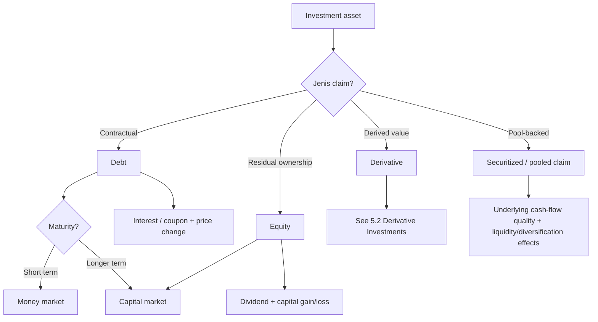
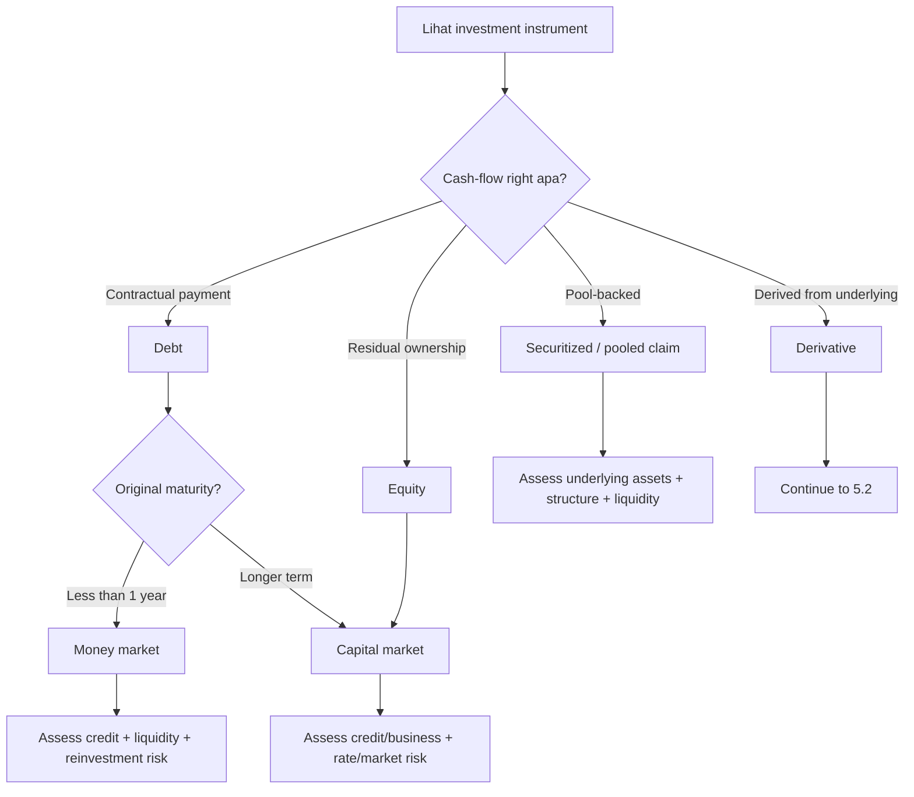

# 📘 5.1 — Investment Asset Characteristics

> [!ABSTRACT] Ringkasan Cepat
> **Topik:** Investment Asset Characteristics  
> **Bobot Parent Topic:** 10–20%  
> **Exam Priority:** Medium  
> **Difficulty:** Concept-Intensive  
> **Primary Skill:** Mixed — classification, comparison, risk-return interpretation, market characteristics, dan calculation sederhana  
> **Ref:** Brigham & Ehrhardt Bab 1 dan 7 sebagai sumber utama asset/market characteristics; Berk & DeMarzo Bab 10 dan 13 untuk risk-return dan capital-market interpretation; Robinson Bab 15 untuk financial-asset classification dari perspektif institutional investor/reporting. Bab 8 dan 23 terutama menjadi boundary menuju [[5.2 Derivative Investments]].

## Section 0 — Pemetaan Silabus & Exam Scope

| Field | Isi |
|---|---|
| Topik CF4 | Topik 5 — Pasar Keuangan |
| Subtopik | 5.1 Investment Asset Characteristics |
| Learning Outcome | Memahami karakteristik dari masing-masing aset investasi dan pasar dari aset tersebut. |
| Skill Diuji | Mengklasifikasikan investment assets, mengenali cash-flow rights, maturity, risk, liquidity, source of return, serta market tempat aset diperdagangkan; membedakan debt, equity, pooled investments, dan securitized claims; menghubungkan karakteristik aset dengan expected return tanpa menganggap historical return sebagai jaminan. |
| Bobot Parent Topic | 10–20% |
| Exam Priority | Medium |
| Prerequisite | Debt vs equity, interest/coupon, dividend, capital gain, maturity, present value, risk-return, money market vs capital market |
| Connected Topics | [[2.1 Equity Instruments]], [[2.2 Long-Term Debt Instruments]], [[2.3 Short and Medium-Term Finance]], [[4.1 Financial Markets Structure]], [[5.2 Derivative Investments]], [[5.3 Economic Influences on Markets]], [[5.4 Return Relationships and Economic Variables]] |
| Referensi | Robinson et al. Bab 15; Berk & DeMarzo Bab 10 dan 13; Brigham & Ehrhardt Bab 1, 7, 8, 23 |

> [!IMPORTANT] Scope Boundary
> `[CORE CF4]` Fokus 5.1 adalah **apa aset investasinya, cash flow apa yang diberikan, risiko apa yang ditanggung investor, dari mana return berasal, seberapa likuid/berjangka aset tersebut, dan di pasar seperti apa aset diperdagangkan**. Karena itu note ini memusatkan perhatian pada money-market instruments, long-term debt/fixed-income claims, common stock, preferred stock, securitized claims, dan pooled investment vehicles yang dibahas sumber resmi.
>
> **Derivatives** hanya diperkenalkan sebagai asset family dan dibedakan dari debt/equity. Mechanics forwards, futures, options, dan swaps dipindahkan ke [[5.2 Derivative Investments]]. Faktor makro yang menggerakkan prices/yields diperdalam di [[5.3 Economic Influences on Markets]], sedangkan hubungan return dengan economic variables dan asset classes diperdalam di [[5.4 Return Relationships and Economic Variables]].
>
> Robinson Bab 15 terutama membahas **intercorporate investments dan accounting classification**. Bagian itu digunakan secara selektif untuk menunjukkan bahwa debt/equity investments dapat memiliki economic characteristics yang sama tetapi dilaporkan berbeda berdasarkan nature of investment dan degree of influence/control. Detail consolidation, acquisition accounting, dan joint venture accounting tidak dijadikan materi inti 5.1.
>
> Brigham Bab 8 dan 23 membahas options/derivatives secara mendalam. Sesuai scope, detail tersebut bukan core 5.1 dan ditandai sebagai bridge ke 5.2.

---

## Section 1 — Intuisi & Big Picture

Apa masalah nyata yang ingin diselesaikan konsep **investment asset characteristics**?

Bayangkan investor memiliki Rp100 juta dan harus memilih tempat menaruh dana. Ia dapat membeli instrumen jangka pendek yang sangat likuid, obligasi pemerintah, obligasi perusahaan, saham biasa, saham preferen, unit mutual fund, atau security yang dibentuk dari kumpulan mortgages. Semua pilihan tersebut adalah “investasi”, tetapi **janji cash flow, tingkat kepastian, maturity, priority claim, liquidity, dan sumber return-nya berbeda**.

Pertanyaan paling penting bukan:

> “Aset mana yang return-nya paling tinggi?”

melainkan:

> “**Apa yang sebenarnya saya miliki, cash flow apa yang menjadi hak saya, risiko apa yang saya tanggung, dan di pasar mana saya bisa keluar dari posisi tersebut?**”

Brigham membangun distinction paling dasar sebagai berikut:

```text
Real assets menghasilkan economic cash flows
                ↓
Financial claims diterbitkan atas cash flows tersebut
                ↓
Debt / Equity / Hybrid / Securitized claims
                ↓
Investor memilih kombinasi risk, return, maturity, dan liquidity
```

### Mengapa konsep ini ada?

Dua securities dapat sama-sama bernilai Rp1 miliar tetapi secara ekonomi sangat berbeda.

- Treasury bill memberi short-term contractual payment dan sangat rendah default risk dalam konteks textbook.
- Corporate bond memberi contractual coupon/principal tetapi investor menanggung issuer credit risk dan interest-rate risk.
- Common stock tidak menjanjikan fixed payment; investor adalah residual claimant dan return datang dari dividend serta capital gain/loss.
- Preferred stock berada di antara debt dan common equity: dividend preference dan seniority lebih tinggi daripada common, tetapi tetap bukan debt claim biasa.
- Mortgage-backed security tidak langsung merupakan rumah; ia adalah claim terhadap cash flows dari pool mortgages.
- Mutual fund bukan satu perusahaan operasional yang dibeli investor, tetapi pooled vehicle yang memegang portfolio assets.

Jika semua itu diperlakukan sebagai “investment return = persentase keuntungan”, investor akan kehilangan informasi yang justru menentukan risiko.

### Siapa yang menggunakan konsep ini?

**Investor individual** menggunakannya untuk memilih portfolio sesuai kebutuhan liquidity, horizon, dan risk tolerance.

**Institutional investor** seperti pension funds, insurance companies, mutual funds, banks, dan corporations menggunakannya untuk menyesuaikan assets dengan obligations, regulatory constraints, dan investment objectives.

**Corporate treasury / management** menggunakannya ketika menempatkan temporary surplus cash atau mengevaluasi securities yang akan diterbitkan/dimiliki.

**Analyst** menggunakannya untuk membedakan economic exposure dari accounting presentation.

### Keputusan apa yang dibantu?

Konsep ini membantu menjawab:

1. Apakah security termasuk **money market** atau **capital market**?
2. Apakah investor memiliki **contractual claim** atau **residual ownership claim**?
3. Apakah return terutama berupa **interest/coupon**, **dividend**, **capital gain**, atau kombinasi?
4. Apakah ada **maturity date**?
5. Siapa yang menanggung default risk, interest-rate risk, market risk, atau liquidity risk?
6. Apakah security mudah dijual kembali di secondary market?
7. Apakah return yang lebih tinggi hanya mencerminkan compensation untuk risk yang lebih tinggi?
8. Apakah asset merupakan direct claim atau hasil **securitization/pooling**?

### Apa yang dapat salah jika konsep ini disalahpahami?

Empat kesalahan besar:

- menganggap **bond = aman** hanya karena cash flow contractual;
- menganggap **stock = return tinggi** tanpa melihat volatility dan possibility of loss;
- menganggap **short maturity = zero risk**, padahal masih mungkin ada credit/reinvestment/inflation risk tergantung instrument;
- membandingkan quoted yields antar-assets tanpa menyamakan risk, maturity, tax treatment, dan liquidity.

> [!TIP] Mental Model Utama
> Untuk setiap investment asset, tanyakan tujuh hal:
>
> **Claim → Cash flow → Maturity → Priority → Risk → Return → Market/Liquidity**

---

## Section 2 — Definisi & Core Concepts

### Definisi Formal

> [!NOTE] Definisi Formal
> **Financial asset** adalah financial claim yang memberi pemegangnya hak terhadap cash flows atau value yang berasal dari issuer, borrower, pool of underlying assets, atau financial arrangement lain. Dalam framing Brigham, debt dan equity adalah claims atas cash flows yang dihasilkan real assets, sedangkan derivatives memperoleh value dari underlying asset/value lain.
>
> **Investment asset characteristics** dalam scope CF4 berarti mengenali sifat ekonomi suatu investment: bentuk claim, expected cash flows, maturity, risk, return, liquidity, tradability, dan market tempat instrument tersebut diperdagangkan.

### Terminologi Penting

| Istilah | Definisi | Intuisi | Exam Note |
|---|---|---|---|
| Financial asset | Claim atas future cash flow/value | Investor memegang hak finansial, bukan mesin/pabrik yang menghasilkan cash flow secara langsung | Bedakan dari real asset |
| Debt security | Contractual claim dengan promised payment | Investor adalah creditor | Biasanya ada maturity dan priority atas equity |
| Equity security | Ownership/residual claim | Investor adalah owner | Tidak memiliki fixed maturity untuk common stock |
| Money market security | Short-term debt instrument | Tempat parkir/funding jangka pendek | Brigham menggunakan original maturity kurang dari 1 tahun sebagai rule utama |
| Capital market security | Intermediate/long-term debt dan equity | Funding/investment jangka lebih panjang | Common stock selalu capital-market security karena tidak memiliki maturity |
| Coupon / interest | Contractual periodic payment pada debt | Compensation kepada lender | Bukan dividend |
| Principal / par value | Amount yang dibayar kembali sesuai debt contract | Nilai pokok claim | Market price dapat berbeda dari par |
| Dividend | Distribution kepada equity holder | Cash return dari ownership | Common dividend tidak contractual seperti interest debt |
| Capital gain/loss | Perubahan price/value yang direalisasikan atau diukur dari holding period | Return dari perubahan market value | Dapat positif atau negatif |
| Liquidity | Kemudahan menjual asset dengan cepat tanpa large price concession | “Seberapa mudah keluar?” | Tidak sama dengan solvency/default risk |
| Default risk | Risiko issuer gagal memenuhi promised debt payment | Contractual claim tidak berarti guaranteed | Treasury vs corporate debt dapat berbeda besar |
| Interest-rate risk | Risiko market value fixed-income security berubah ketika market rates berubah | Rate naik → existing fixed coupon biasanya kurang menarik | Penting terutama pada longer-maturity fixed-rate debt |
| Residual claim | Hak atas value setelah senior claims dipenuhi | Common shareholder dibayar terakhir | Downside lebih tinggi, upside lebih besar |
| Securitization | Pooling assets lalu menerbitkan securities backed by pool cash flows | Illiquid loans dapat diubah menjadi tradable claims | Risk tidak hilang; risk dipindah/dibagi |
| Mutual fund | Pooled vehicle yang menginvestasikan dana banyak investors | Diversification dan professional management | Investor memegang fund share, fund memegang underlying assets |
| ETF | Fund yang shares-nya diperdagangkan intraday di exchange | Pooled portfolio + exchange trading | Berbeda dari traditional mutual fund yang redemption-nya biasanya pada end-of-day NAV dalam textbook |
| Passive financial investment | Investment tanpa significant influence/control atas investee | Investor memegang security sebagai investment | Robinson membedakan dari associate/subsidiary based on influence/control |

### 2.1 Real Assets vs Financial Assets

Brigham membedakan **physical/real asset markets** dari **financial asset markets**.

Real assets mencakup items seperti:

- real estate;
- machinery;
- computers;
- commodities/products.

Financial assets mencakup:

- stocks;
- bonds;
- notes;
- mortgages;
- derivatives.

Economic chain-nya:

```text
Real asset / business activity
        ↓ generates
Operating cash flow
        ↓ supports
Financial claims
        ↓ held by
Investors
```

Investor yang membeli corporate bond tidak memiliki mesin perusahaan. Ia memiliki **claim** terhadap issuer berdasarkan bond contract.

Investor common stock memiliki ownership claim terhadap corporation, bukan kepemilikan langsung atas setiap asset corporate secara terpisah.

### 2.2 Debt Instruments — Contractual Claims

Debt adalah promise untuk melakukan specified payments kepada creditor.

Karakter utama:

- contractual cash flow;
- priority di atas common equity;
- biasanya memiliki maturity;
- return terutama berasal dari interest/coupon dan perubahan market price;
- issuer default dapat menyebabkan promised payment tidak penuh;
- fixed-payment debt sensitif terhadap perubahan market interest rates.

Debt kemudian dibedakan menurut maturity dan issuer.

#### Short-Term Debt / Money Market

Brigham memasukkan instrumen seperti:

- U.S. Treasury bills;
- bankers' acceptances;
- commercial paper;
- negotiable certificates of deposit;
- Eurodollar time deposits;
- money-market mutual funds sebagai vehicle yang berinvestasi pada short-term debt.

Core characteristic:

```text
Short maturity
+ generally high liquidity
+ relatively limited price sensitivity
≠ automatically risk-free
```

Credit quality tetap bergantung pada issuer/guarantor kecuali instrument yang diperlakukan default-free dalam textbook benchmark seperti U.S. Treasury bills.

#### Long-Term Debt / Capital Market

Contoh Brigham:

- U.S. Treasury notes and bonds;
- municipal bonds;
- corporate bonds;
- mortgages;
- leases yang memiliki debt-like financing characteristics.

Longer maturity biasanya berarti exposure lebih besar terhadap changes in interest rates, all else equal.

### 2.3 Government Debt

Dalam Table 1-1 Brigham, U.S. Treasury bills/notes/bonds dipakai sebagai benchmark yang tidak memiliki default risk dalam textbook context.

Namun **tidak berarti market price tidak bisa turun**.

Untuk long-term Treasury debt:

> promised payment mungkin sangat aman dari default, tetapi market value tetap dapat turun ketika market interest rates naik.

Ini distinction penting:

> **Default risk ≠ price risk.**

Treasury bill memiliki very short maturity sehingga price sensitivity relatif lebih kecil daripada long-term Treasury bond, tetapi return-nya juga cenderung lebih rendah dalam historical comparisons.

### 2.4 Corporate Bonds

Corporate bond adalah debt issued by corporation.

Investor menerima contractual payments tetapi menanggung:

- default/credit risk;
- interest-rate risk;
- liquidity risk;
- reinvestment risk untuk coupon cash flows;
- market-price risk bila dijual sebelum maturity.

Dibanding government debt benchmark, corporate debt umumnya memerlukan yield lebih tinggi karena issuer strength tidak sama.

Financial meaning:

```text
Higher perceived risk
        ↓
Higher required return / yield
        ↓
Lower price for a given promised cash-flow stream
```

### 2.5 Mortgages and Mortgage-Backed Securities

Mortgage adalah loan secured by property.

Brigham menggunakan mortgage securitization untuk menunjukkan bahwa financial claims dapat diubah bentuknya.

```text
Individual mortgages
        ↓ pooled
Large pool of mortgage cash flows
        ↓ securitized
Mortgage-backed securities
        ↓ sold to investors
```

Potential benefits yang ditekankan source:

- funding dapat berpindah lintas wilayah;
- lenders memperoleh cash untuk membuat loans baru;
- individual illiquid mortgages dapat menjadi more tradable securities;
- pool dapat memberi diversification terhadap idiosyncratic borrower/location risk.

Tetapi:

> securitization **tidak menghapus underlying risk**.

Risk berpindah kepada investor yang memegang claims, dan poor origination/incentives serta complexity dapat memperbesar problem ketika quality underlying loans memburuk.

### 2.6 Common Stock — Residual Ownership

Common stock adalah equity claim.

Karakter utama:

- ownership interest;
- residual claim;
- biasanya voting rights;
- no fixed maturity;
- dividend tidak fixed contractual obligation;
- potential upside tidak dibatasi seperti coupon debt;
- downside dapat besar karena common shareholder berada setelah creditors dan preferred claimants.

Brigham menyatakan expected total stock return terdiri dari:

$$
\text{Expected Total Return}
=
\text{Expected Dividend Yield}
+
\text{Expected Capital Gains Yield}
$$

Untuk constant-growth stock dalam Chapter 7:

$$
\hat r_s
=
\frac{D_1}{P_0}+g
$$

dengan:

- $\hat r_s$ = expected return;
- $D_1$ = expected dividend next period;
- $P_0$ = current price;
- $g$ = expected constant growth rate, yang juga menjadi expected capital-gains yield dalam model tersebut.

#### Financial meaning

Investor common stock tidak memperoleh “interest”. Return berasal dari:

1. cash distributions melalui dividend;
2. perubahan market value saham.

### 2.7 Stock Market Price vs Intrinsic Value

Brigham Chapter 7 membedakan **market price** dengan **intrinsic value**.

- **Market price** = observed price yang terbentuk dari trading.
- **Intrinsic value** = estimate value berdasarkan expected future cash flows, risk, dan required return.

Dalam equilibrium ideal:

$$
\hat P_0=P_0
$$

dan expected return equals required return.

Namun analyst dapat memiliki estimate berbeda dari market.

> [!WARNING] Important Distinction
> Market price adalah **apa yang dibayar market sekarang**. Intrinsic value adalah **estimate fundamental value berdasarkan assumptions**. Keduanya bukan sinonim secara definisi.

### 2.8 Preferred Stock — Hybrid Characteristics

Brigham menyebut preferred stock sebagai **hybrid security** karena memiliki beberapa features debt dan equity.

Typical economic characteristics dalam source:

- preferred dividend biasanya specified;
- priority atas common stock untuk distributions/liquidation;
- lebih junior daripada debt;
- dapat tidak memiliki maturity, sehingga dapat menyerupai perpetuity;
- dividend tidak sama dengan contractual interest debt.

Untuk perpetual preferred:

$$
V_{ps}=\frac{D_{ps}}{r_{ps}}
$$

Dengan:

- $V_{ps}$ = value preferred stock;
- $D_{ps}$ = annual preferred dividend;
- $r_{ps}$ = required return.

Intuisi:

> Preferred stock berada “di tengah”: lebih senior dan income-like daripada common stock, tetapi tidak memiliki creditor claim yang identik dengan bond.

### 2.9 Historical Risk-Return Across Asset Classes

Berk & DeMarzo Chapter 10 membandingkan historical performance beberapa investment classes:

- small stocks;
- large U.S. stocks / S&P 500;
- world stock portfolio;
- corporate bonds;
- Treasury bills.

Historical lesson dalam textbook period:

```text
Higher long-run average return
often accompanied by
higher return variability and larger drawdowns
```

Stocks menghasilkan higher long-run historical average return daripada corporate bonds dan Treasury bills dalam dataset buku, tetapi juga mengalami losses yang jauh lebih besar pada downturns.

Treasury bills memberikan lower historical return tetapi jauh lebih stable.

> [!CAUTION] Historical Data Note
> Angka return di textbook adalah historical sample, bukan expected return yang guaranteed untuk future. Jangan menghafal angka tahun tertentu sebagai rule universal. Yang penting adalah **risk-return pattern dan variability**.

### 2.10 Volatility and Standard Deviation

Berk & DeMarzo menggunakan variance dan standard deviation untuk mengukur dispersion returns.

Expected return:

$$
E[R]
=
\sum_i p_i R_i
$$

Variance:

$$
Var(R)
=
\sum_i p_i\left(R_i-E[R]\right)^2
$$

Standard deviation:

$$
SD(R)=\sqrt{Var(R)}
$$

Untuk 5.1, formula ini digunakan terutama untuk memahami **asset characteristic**:

> asset dengan return yang lebih tersebar/volatile memiliki lebih besar uncertainty of realized return.

Full pricing of systematic risk, beta, CAPM-style relationships, factor models, dan economic-variable relationships lebih dekat ke 5.4.

### 2.11 Diversifiable vs Systematic Risk — Asset Characteristic View

Berk & DeMarzo menekankan bahwa tidak semua risk memiliki pricing implication yang sama.

- **Independent / firm-specific risk** dapat banyak dikurangi melalui diversification.
- **Common / systematic risk** tetap ada bahkan dalam broad portfolio.

Untuk 5.1, takeaway-nya bukan derivation model, melainkan:

> Saat menilai “riskiness” suatu investment asset, jangan hanya melihat stand-alone volatility. Perhatikan apakah risk tersebut dapat diversified away atau bergerak bersama market/economy.

### 2.12 Mutual Funds and ETFs

Brigham membahas mutual funds sebagai institutions yang menerima dana dari savers lalu berinvestasi dalam portfolio assets.

Investor memperoleh:

- pooling;
- diversification;
- professional management;
- access ke broad portfolio dengan relatively small individual investment.

Traditional mutual fund dalam textbook umumnya redeemed pada end-of-day fund value, sedangkan **exchange-traded fund (ETF)** diperdagangkan selama trading day di exchange.

Economic distinction:

```text
Direct security investment
Investor → specific bond/stock

Pooled investment
Investor → fund share → portfolio of securities
```

### 2.13 Intercorporate Investments — Robinson Perspective

Robinson Bab 15 membagi corporate investments berdasarkan **degree of influence/control**, bukan hanya security label.

Broad categories:

1. investment in financial assets — no significant influence/control;
2. associate — significant influence;
3. joint venture — shared control;
4. subsidiary/business combination — control.

Untuk passive financial investments, debt/equity securities dapat diklasifikasikan dan measured berbeda berdasarkan applicable accounting standard dan management/business-model criteria.

Important economic lesson untuk 5.1:

> **“Memiliki saham perusahaan lain” tidak selalu berarti economic relationship yang sama.** Holding kecil sebagai passive investment berbeda secara substance dari holding yang memberi significant influence atau control.

Detailed equity-method/consolidation mechanics adalah `[BEYOND CF4 5.1]` dan lebih relevan ke accounting/intercorporate reporting daripada asset-market characteristics.

### 2.14 Derivatives — Boundary to 5.2

Brigham membedakan derivatives dari debt/equity:

- debt/equity = claims terhadap cash flows dari assets/business;
- derivative = value derived from another asset, rate, price, atau variable.

Examples dalam source:

- options;
- futures;
- forwards;
- swaps.

Bab 23 juga menjelaskan bahwa derivatives dapat digunakan untuk hedging atau speculation dan sering memiliki leverage tinggi.

> [!INFO] CF4 Connection
> Semua mechanics derivatives — payoff, long/short, futures/forward differences, options, swaps, hedging — dibahas di [[5.2 Derivative Investments]]. Di 5.1 cukup pahami **mengapa derivative adalah asset family yang berbeda**.

---

## Section 3 — How It Works

### 3.1 Framework Securities

Gunakan urutan berikut setiap kali melihat sebuah investment instrument:

```text
Security
   ↓
1. Siapa issuer / underlying obligor?
   ↓
2. Apa cash-flow rights-nya?
   ↓
3. Apakah payment contractual atau residual?
   ↓
4. Ada maturity atau tidak?
   ↓
5. Apa priority claim-nya?
   ↓
6. Risk utama apa?
   ↓
7. Return berasal dari apa?
   ↓
8. Diperdagangkan di market apa dan seberapa liquid?
```

### 3.2 Money Market Instrument

Misalkan perusahaan besar menerbitkan commercial paper untuk memperoleh short-term funding.

```text
Corporation membutuhkan short-term cash
        ↓
Menerbitkan short-term debt claim
        ↓
Investor memberikan cash
        ↓
Corporation berjanji membayar amount sesuai terms
        ↓
Instrument berada di money market
```

Investor tidak membeli ownership. Ia memegang short-term creditor claim.

### 3.3 Corporate Bond

```text
Corporation membutuhkan long-term capital
        ↓
Issues bond
        ↓
Investor menerima coupon + principal claim
        ↓
Bond price bergerak ketika market yield / credit perception berubah
        ↓
Investor return = income + price effect
```

Jika required yield naik sementara promised cash flows tetap, present value turun.

Secara sederhana:

$$
P_{bond}
=
\sum_{t=1}^{N}\frac{C}{(1+r)^t}
+
\frac{M}{(1+r)^N}
$$

Karena $r$ berada di denominator:

```text
Required yield ↑
        ↓
Bond price ↓
```

Formula ini digunakan sebagai reasoning bridge; bond-valuation detail penuh berada di materi debt securities terkait.

### 3.4 Common Stock

```text
Investor membeli ownership claim
        ↓
Tidak ada promised principal repayment
        ↓
Potential cash return = dividend
        +
Potential value change = capital gain/loss
        ↓
Return lebih uncertain
        ↓
Market price mencerminkan expectations + required return
```

Jika business prospects membaik, expected future cash flows dapat meningkat dan stock value dapat naik. Jika required return naik karena risk perception, value dapat turun walaupun expected cash flow belum berubah.

### 3.5 Securitized Asset

```text
Many loans / mortgages
        ↓
Pool
        ↓
Security issued against pool cash flows
        ↓
Investor owns claim on pool
        ↓
Underlying borrower performance still matters
```

Key logic:

> Pooling dapat mengubah liquidity dan distribution of risk, tetapi tidak menciptakan cash flow dari nol dan tidak otomatis menghilangkan credit risk.

### 3.6 Primary vs Secondary Market — Asset-Market Link

Sebuah asset characteristic tidak lengkap tanpa memahami market-nya.

**Primary market**:

```text
New security
Investor cash → issuer
```

**Secondary market**:

```text
Existing security
Investor A ↔ Investor B
Issuer biasanya tidak menerima proceeds dari trade
```

Secondary market tetap penting karena memberi:

- liquidity;
- price discovery;
- observable required returns;
- easier exit for investors;
- support terhadap attractiveness of new issues.

### 3.7 Money Market vs Capital Market

Rule Brigham:

```text
Short-term debt (< 1 year original maturity)
→ Money market

Intermediate / long-term debt
→ Capital market

Equity
→ Capital market
```

### 3.8 Risk-Return Logic

Berk & DeMarzo historical evidence memberi logic berikut:

```text
Investor dislikes risk
        ↓
Riskier investments must be attractive enough to hold
        ↓
Higher required/expected return may compensate for risk
        ↓
But higher expected return is not guaranteed realized return
```

Ini alasan mengapa “higher historical average return” tidak boleh dibaca sebagai “superior investment in every horizon”.

> [!TIP] Cara Berpikir
> Jangan mulai dari nama asset. Mulai dari **cash-flow contract**.
>
> - Fixed promised payment? Pikirkan debt characteristics.
> - Residual ownership? Pikirkan equity.
> - Value derived from underlying? Pikirkan derivative.
> - Pool of underlying loans/securities? Pikirkan securitized/pooled claim.
> - Short maturity? Tanyakan apakah money-market instrument.
> - No maturity + ownership? Pikirkan common equity / capital market.

> [!DANGER] Jangan Salah Pikir
> 1. **“Government bond tidak punya default risk, jadi tidak bisa rugi.”** Salah. Long-term bond price dapat turun saat market rates naik.
> 2. **“Saham memberi return lebih tinggi daripada bond.”** Salah sebagai certainty. Historical average lebih tinggi tidak berarti setiap period lebih tinggi.
> 3. **“Securitization menghilangkan risk.”** Salah. Risk terutama dipindah, pooled, dan redistribusi; kualitas underlying tetap menentukan.
> 4. **“Short-term security pasti risk-free.”** Salah. Short maturity mengurangi beberapa exposures tetapi issuer credit risk masih dapat ada.
> 5. **“Preferred stock = bond karena dividennya fixed.”** Salah. Preferred memiliki hybrid characteristics dan bukan contractual debt claim yang identik dengan bond.

---

## Section 4 — Worked Examples & Exam Cases

### Case A — Fundamental

**Soal**

Empat instruments berikut tersedia:

1. Treasury bill dengan maturity 6 bulan;
2. corporate bond maturity 15 tahun;
3. common stock perusahaan publik;
4. call option atas common stock tersebut.

Klasifikasikan masing-masing sebagai money-market debt, capital-market debt, equity, atau derivative. Sebutkan source of return utama dan satu risk penting.

> [!SUCCESS] Pembahasan
>
> **1. Identifikasi informasi**
>
> - T-bill: debt, maturity 6 bulan.
> - Corporate bond: debt, maturity 15 tahun.
> - Common stock: ownership, no maturity.
> - Call option: value bergantung pada underlying stock.
>
> **2. Konsep yang diuji**
>
> Classification berdasarkan claim, maturity, dan underlying.
>
> **3. Reasoning**
>
> - Treasury bill → short-term debt → money market.
> - Corporate bond → long-term debt → capital market.
> - Common stock → equity → capital market.
> - Call option → derivative → detail market/mechanics di 5.2.
>
> **4. Calculation**
>
> Tidak diperlukan.
>
> **5. Interpretation**
>
> | Instrument | Classification | Source of Return | Risk Utama yang Relevan |
> |---|---|---|---|
> | Treasury bill | Money-market debt | Interest/discount accretion | Reinvestment/inflation exposure; benchmark default risk sangat rendah dalam source |
> | Corporate bond | Capital-market debt | Coupon + price change | Credit + interest-rate risk |
> | Common stock | Equity / capital market | Dividend + capital gain/loss | Business/market risk |
> | Call option | Derivative | Change in derivative value/payoff | High sensitivity/leverage; underlying price risk |
>
> **6. Verification**
>
> Check paling cepat: **maturity hanya relevan sebagai classifier langsung untuk debt; common stock tidak menjadi money-market asset hanya karena investor berniat memegangnya 6 bulan.**

> [!WARNING] Exam Trap — Case A
> - **Trap:** Mengklasifikasikan common stock sebagai short-term karena holding period investor pendek.
> - **Mengapa distractor terlihat benar:** Investor memang bisa menjualnya dalam beberapa bulan.
> - **Cara menghindari:** Money vs capital market didasarkan pada **security's original maturity/nature**, bukan investor holding period.
> - **Target waktu:** 45–60 detik.

---

### Case B — Exam-Typical

**Soal**

Dua investments memiliki par value yang sama.

- Security A adalah 20-year government bond dengan fixed coupon.
- Security B adalah 3-month commercial paper dari corporation berkualitas tinggi.

Pernyataan mana yang paling tepat?

A. A tidak memiliki price risk karena government debt dianggap default-free.

B. B pasti lebih berisiko karena corporate issuer selalu lebih berisiko daripada government.

C. A dapat memiliki lebih besar sensitivity terhadap perubahan market interest rates karena maturity-nya jauh lebih panjang.

D. Keduanya money-market securities karena dapat diperdagangkan sebelum maturity.

> [!SUCCESS] Pembahasan
>
> **1. Identifikasi informasi**
>
> A: long-term fixed-rate government debt.  
> B: short-term corporate debt.
>
> **2. Konsep yang diuji**
>
> Default risk vs interest-rate risk; money market vs capital market.
>
> **3. Reasoning**
>
> A dapat sangat rendah default risk tetapi tetap memiliki market-price sensitivity. Longer maturity memperbesar exposure terhadap perubahan required yield, all else equal.
>
> B memiliki issuer credit exposure, tetapi statement “pasti lebih berisiko” terlalu absolut karena “risk” bukan satu dimensi saja.
>
> **4. Calculation**
>
> Tidak diperlukan.
>
> **5. Interpretation**
>
> **Jawaban: C.**
>
> **6. Verification**
>
> - 20 tahun → capital-market debt.
> - 3 bulan → money-market debt.
> - Default-free benchmark tidak berarti price-stable.

> [!WARNING] Exam Trap — Case B
> - **Trap:** Menyamakan “no default risk” dengan “no risk”.
> - **Mengapa distractor terlihat benar:** Government securities sering disebut safe.
> - **Cara menghindari:** Pisahkan risk ke dimensions: **default, interest-rate, liquidity, inflation/reinvestment**.
> - **Target waktu:** 60–90 detik.

---

### Case C — Challenging / Integrated

**Soal**

Investor mempertimbangkan corporate bond dan common stock perusahaan yang sama. Bond memberikan expected one-year holding-period return 7%, sedangkan saham memiliki expected dividend yield 2% dan expected capital gains yield 8%.

1. Berapa expected total stock return?
2. Apakah saham otomatis merupakan investasi yang lebih baik?
3. Jika economy memburuk dan saham perusahaan sangat sensitif terhadap downturn, konsep apa dari Berk & DeMarzo yang perlu diperhatikan selain stand-alone expected return?

> [!SUCCESS] Pembahasan
>
> **1. Identifikasi informasi**
>
> Bond expected return = 7%.  
> Stock dividend yield = 2%.  
> Stock capital gains yield = 8%.
>
> **2. Konsep yang diuji**
>
> Return decomposition + risk-return interpretation + systematic/common risk.
>
> **3. Reasoning**
>
> Expected stock return adalah sum dari dua components.
>
> **4. Calculation**
>
> $$
> \hat r_s
> =
> 2\%+8\%
> =10\%
> $$
>
> **5. Interpretation**
>
> Saham memiliki expected return lebih tinggi, tetapi **tidak otomatis lebih baik**. Expected return 10% adalah compensation/expectation under uncertainty, bukan guaranteed payoff.
>
> Jika saham sangat buruk ketika economy/market buruk, exposure tersebut merupakan **common/systematic risk** yang tidak mudah dihilangkan melalui diversification dan lebih penting untuk required return daripada firm-specific risk yang dapat diversified away.
>
> **6. Verification**
>
> Return comparison harus selalu dibaca bersama:
>
> - risk;
> - horizon;
> - liquidity;
> - cash-flow priority;
> - diversification role.

> [!WARNING] Exam Trap — Case C
> - **Trap:** Memilih asset hanya karena expected return numerically lebih tinggi.
> - **Mengapa distractor terlihat benar:** Soal memberi angka 10% vs 7% sehingga comparison tampak selesai.
> - **Cara menghindari:** Setelah menghitung return, selalu tanyakan: **“return untuk risk apa?”**
> - **Target waktu:** 90 detik.

---

### Case D — Securitization

**Soal**

Bank memiliki 1.000 mortgages individual. Bank menjual mortgages tersebut ke institution yang menggabungkannya ke dalam pool dan menerbitkan securities kepada investors. Seorang kandidat menyimpulkan:

> “Karena mortgages telah dipool, credit risk underlying borrowers hilang.”

Evaluasi pernyataan tersebut.

> [!SUCCESS] Pembahasan
>
> **1. Identifikasi informasi**
>
> Terjadi mortgage securitization.
>
> **2. Konsep yang diuji**
>
> Pooling, diversification, liquidity, risk transfer.
>
> **3. Reasoning**
>
> Pool dapat mengurangi concentration pada satu borrower atau satu location jika cukup diversified, dan security dapat lebih liquid daripada individual mortgage. Tetapi cash flow securities tetap berasal dari borrowers.
>
> **4. Calculation**
>
> Tidak diperlukan.
>
> **5. Interpretation**
>
> Pernyataan **salah**. Risk tidak hilang; ia **redistributed/transferred** kepada holders of securities. Jika defaults menjadi broad/systematic atau underwriting quality buruk, pool tetap dapat mengalami severe losses.
>
> **6. Verification**
>
> Tanyakan: “Siapa yang akhirnya menanggung loss jika borrowers tidak membayar?” Jika ada pihak yang masih menanggung loss, risk belum hilang.

> [!WARNING] Exam Trap — Case D
> - **Trap:** Diversification = elimination of all risk.
> - **Mengapa distractor terlihat benar:** Banyak small loans memang mengurangi idiosyncratic concentration.
> - **Cara menghindari:** Bedakan **diversification of independent risk** dari **elimination of aggregate/systematic risk**.
> - **Target waktu:** 60 detik.

---

## Section 5 — Interpretation & Sanity Check

> [!CHECK] Sanity Check
> **1. Claim check:** Apakah investor creditor atau owner? Jika creditor, cari promised payment dan maturity. Jika owner, cari residual claim dan dividend/capital gain.
>
> **2. Maturity check:** Short holding period investor tidak mengubah security classification. Common stock tetap capital-market equity walaupun dijual besok.
>
> **3. Risk-dimension check:** Jangan mengatakan “lebih aman” sebelum menentukan risk apa: default, rate, liquidity, market, inflation, atau systematic risk.
>
> **4. Return check:** Higher expected return seharusnya tidak dibaca sebagai free lunch. Tanyakan risk/uncertainty yang menyertainya.
>
> **5. Securitization check:** Jika underlying borrowers tetap menghasilkan cash flows, underlying credit quality tetap penting.
>
> **6. Price-yield check:** Untuk fixed promised cash flows, required yield naik harus membuat present value turun, all else equal.

### Interpretation Ladder

> **Level 1 — Number**  
> Misalnya stock expected return = 10%.
>
> **Level 2 — Direction**  
> Lebih tinggi daripada bond expected return 7%.
>
> **Level 3 — Meaning**  
> Investor mengharapkan compensation lebih besar dari stock exposure.
>
> **Level 4 — Cause**  
> Stock cash flow residual dan market value lebih uncertain; exposure terhadap business/market outcomes lebih besar.
>
> **Level 5 — Limitation**  
> Expected return bukan realized return dan tidak cukup untuk memilih investasi tanpa menilai risk, liquidity, horizon, tax, dan portfolio context.

### Sanity Table by Asset Type

| Asset | Jika jawaban Anda mengatakan... | Cek ulang karena... |
|---|---|---|
| Treasury bond | “Tidak bisa rugi” | Default benchmark rendah tidak menghilangkan price risk |
| Corporate bond | “Coupon = total return” | Market-price change juga memengaruhi holding-period return |
| Common stock | “Dividend fixed” | Common dividend tidak contractual seperti coupon |
| Preferred stock | “Sama persis dengan bond” | Preferred adalah hybrid dan claim-nya berbeda |
| Commercial paper | “Capital market” | Short-term debt umumnya money market |
| MBS | “Risk hilang setelah pooling” | Underlying borrower risk tetap ada |
| Mutual fund | “Investor memiliki seluruh underlying securities secara langsung” | Investor memegang share/unit fund; fund memegang portfolio |
| Derivative | “Claim langsung atas operating cash flow issuer” | Value berasal dari underlying asset/rate/variable |

---

## Section 6 — Connections & Mental Model



### Hubungan dengan [[4.1 Financial Markets Structure]]

5.1 menjawab **apa asset-nya**. 4.1 menjawab **bagaimana market menghubungkan buyers/sellers dan menyediakan trading mechanism**.

Contoh:

- commercial paper → money market;
- corporate bond → capital market;
- common stock → capital market;
- new issue → primary market;
- trading existing security → secondary market.

### Hubungan dengan [[2.1 Equity Instruments]]

Topik 2.1 melihat equity dari perspective **issuer dan financing**. Topik 5.1 melihat equity sebagai **investment asset**:

```text
Issuer perspective
How equity raises capital
        ↕
Investor perspective
What claim, return, and risk equity provides
```

### Hubungan dengan [[2.2 Long-Term Debt Instruments]]

2.2 lebih fokus pada contractual features long-term debt sebagai financing instrument. 5.1 menempatkannya dalam broader investment universe bersama cash, equity, dan pooled claims.

### Hubungan dengan [[5.2 Derivative Investments]]

5.1 hanya mengenali derivative sebagai claim whose value is derived from underlying.

5.2 melanjutkan ke:

- forwards;
- futures;
- options;
- swaps;
- payoff;
- hedging/speculation;
- market mechanics.

### Hubungan dengan [[5.3 Economic Influences on Markets]]

Asset characteristics menentukan **sensitivitas** terhadap economic factors.

Contoh conceptual bridge:

- long-duration fixed-rate debt sensitif terhadap interest rates;
- common equity sensitif terhadap expected business cash flows dan required returns;
- short-term instruments lebih cepat reset/reinvest daripada long-term fixed-rate assets.

### Hubungan dengan [[5.4 Return Relationships and Economic Variables]]

5.1 menjelaskan “apa asset-nya dan bagaimana return dibentuk.” 5.4 menjelaskan bagaimana returns tersebut berhubungan dengan market/economic variables dan risk factors.

---

## Section 7 — Exam Traps & Misconceptions

### Definition Trap

> [!BUG] Definition Trap
> **Debt vs Equity**  
> Debt = contractual creditor claim.  
> Equity = residual ownership claim.
>
> **Money Market vs Capital Market**  
> Money market = short-term debt.  
> Capital market = longer-term debt + equity.
>
> **Real Asset vs Financial Asset**  
> Real asset menghasilkan productive/economic benefit secara langsung.  
> Financial asset adalah claim atas cash flow/value.
>
> **Default Risk vs Interest-Rate Risk**  
> Default risk = issuer gagal membayar promised cash flow.  
> Interest-rate risk = market value berubah karena required market rates berubah.
>
> **Market Price vs Intrinsic Value**  
> Market price = observed traded price.  
> Intrinsic value = estimated fundamental value.

### Accounting / Financial Logic Trap

> [!BUG] Logic Trap
> - **Contractual cash flow ≠ guaranteed realized return.** Bond dapat turun harga bila rates/credit perception berubah.
> - **Residual claim ≠ fixed income.** Common dividend tidak contractual.
> - **Higher historical return ≠ superior future outcome.** Historical averages adalah evidence, bukan promise.
> - **Diversification ≠ elimination of all risk.** Common/systematic risk tetap dapat bertahan.
> - **Pooling ≠ creation of safe assets from risky cash flows.** Securitization mengubah structure/distribution, bukan underlying economics secara ajaib.
> - **Liquidity ≠ credit quality.** Asset dapat liquid tetapi risky, atau illiquid tetapi low default risk.

### Calculation Trap

> [!BUG] Calculation Trap
> **Salah — stock return hanya dividend yield**
>
> $$
> r_s=\frac{D_1}{P_0}
> $$
>
> **Benar — expected total return mencakup dividend yield + capital gain yield**
>
> $$
> \hat r_s
> =
> \frac{D_1}{P_0}+g
> $$
>
> pada constant-growth setting Brigham.

> [!BUG] Calculation Trap
> **Salah — mengira bond price bergerak searah dengan required yield**
>
> $$
> r\uparrow \Rightarrow P\uparrow
> $$
>
> **Benar — untuk fixed cash flows**
>
> $$
> r\uparrow \Rightarrow P\downarrow
> $$
>
> karena discount rate berada di denominator present-value calculation.

### Interpretation Trap

> [!BUG] Interpretation Trap
> Jika historical average return saham lebih tinggi daripada Treasury bills, kesimpulan yang valid adalah bahwa **dalam sample textbook saham memberikan higher average return dengan jauh lebih besar variability**. Kesimpulan yang tidak valid adalah “saham pasti mengalahkan Treasury bills untuk setiap holding period.”

> [!BUG] Interpretation Trap
> Jika bond pemerintah memiliki no default risk dalam benchmark textbook, jangan menyimpulkan “nilainya selalu stabil.” Long-term fixed-rate bond tetap dapat mengalami substantial price change ketika market yield berubah.

### Red Flags

> [!CAUTION] Red Flags

| Keyword / Condition | Apa yang Harus Dipikirkan |
|---|---|
| “maturity less than one year” | Money-market debt |
| “no maturity / ownership share” | Equity / capital market |
| “fixed coupon” | Debt cash flow; cek interest-rate risk |
| “government bond” | Low/default-free benchmark dalam source, tetapi cek price/rate risk |
| “corporate bond” | Credit spread/default risk + rate risk |
| “residual claim” | Common equity |
| “preferred dividend” | Hybrid security; senior to common, junior to debt |
| “dividend + price appreciation” | Total stock return |
| “pool of mortgages/loans” | Securitization; underlying risk remains |
| “reinvested dividends/interest” | Historical total-return comparison |
| “historical average” | Evidence, bukan guarantee |
| “standard deviation” | Return variability / stand-alone risk measure |
| “moves with market/economy” | Common/systematic risk |
| “specific to one firm” | Diversifiable/idiosyncratic risk |
| “new issue” | Primary market |
| “existing security traded” | Secondary market |
| “value derived from underlying” | Derivative → [[5.2 Derivative Investments]] |
| “significant influence/control” | Robinson intercorporate-investment classification; bukan passive financial asset biasa |

---

## Section 8 — Executive Summary

> [!SUMMARY] Must Remember
> 1. **Debt = contractual claim; equity = residual ownership claim; derivative = value derived from underlying.**
> 2. **Money market** terutama short-term debt; **capital market** mencakup longer-term debt dan equity.
> 3. Common stock tidak memiliki maturity dan expected return berasal dari **dividend yield + capital gain/loss yield**.
> 4. Preferred stock adalah **hybrid**: lebih senior daripada common equity tetapi tidak identik dengan debt.
> 5. Government debt dapat sangat rendah/default-free dalam textbook benchmark tetapi **tetap memiliki interest-rate/price risk** jika maturity panjang.
> 6. Corporate bonds menambah **issuer credit/default risk** di samping market-rate risk.
> 7. Historical data Berk & DeMarzo menunjukkan trade-off: stocks memiliki higher long-run average returns tetapi juga larger volatility/drawdowns dibanding bonds dan Treasury bills dalam sample mereka.
> 8. **Diversification mengurangi firm-specific risk, bukan semua risk.** Common/systematic risk tetap relevan.
> 9. Securitization dapat meningkatkan liquidity dan redistribute/diversify exposures, tetapi **underlying credit risk tidak hilang**.
> 10. Asset comparison selalu lakukan dengan mental model: **Claim → Cash flow → Maturity → Priority → Risk → Return → Market/Liquidity.**

### Comparison Table

| Asset / Instrument | Claim | Typical Cash Flow | Maturity | Main Risk Emphasis | Market / Liquidity Characteristic |
|---|---|---|---|---|---|
| Treasury bill | Government debt | Short-term promised payment | < 1 year | Low default benchmark; reinvestment/inflation | Money market; high liquidity benchmark |
| Commercial paper | Corporate debt | Short-term promised payment | < 1 year | Issuer credit risk | Money market |
| Certificate of deposit | Bank deposit/debt claim | Interest + principal | Short term | Bank/issuer strength | Money market if negotiable short-term instrument |
| Treasury note/bond | Government debt | Coupon + principal | Multi-year | Interest-rate/price risk | Capital market |
| Corporate bond | Corporate debt | Coupon + principal | Multi-year | Credit + interest-rate risk | Capital market; liquidity varies |
| Mortgage | Secured loan | Borrower payments | Often long | Borrower/property/prepayment-related uncertainty | Mortgage market; individual loans less liquid |
| Mortgage-backed security | Claim on pool | Pool cash flows | Depends on structure | Underlying credit/prepayment + market risk | Securitized market; more tradable than individual loans in Brigham example |
| Preferred stock | Hybrid equity | Preferred dividend | Often very long/perpetual in basic model | Issuer/business + rate-like sensitivity | Capital market |
| Common stock | Residual equity | Dividend + capital gain/loss | No maturity | Business + market/systematic risk | Equity capital market; liquidity depends on listing/security |
| Mutual fund | Pooled investment share | Return from underlying portfolio | No fixed maturity of investor holding | Underlying portfolio risk | Redemption through fund; diversified pooling |
| ETF | Pooled investment share | Return from underlying portfolio | No fixed maturity | Underlying portfolio + market trading | Exchange-traded intraday |
| Derivative | Contingent/derived claim | Depends on contract | Contract-specific | Underlying + leverage/counterparty/market features | See [[5.2 Derivative Investments]] |

### Trigger Keywords

| Jika soal mengatakan... | Pikirkan... |
|---|---|
| “short-term debt” | Money market |
| “long-term fixed coupon” | Capital-market debt + interest-rate risk |
| “residual owner” | Common stock |
| “priority over common dividends” | Preferred stock |
| “dividend yield and capital gains yield” | Total equity return |
| “safe government security” | Pisahkan default risk dari price risk |
| “pooling mortgages” | Securitization, liquidity, risk redistribution |
| “historically highest return” | Tanyakan volatility/drawdown dan sample period |
| “standard deviation of return” | Risk/variability measure |
| “diversified portfolio” | Firm-specific risk reduced; systematic risk remains |
| “issuer receives proceeds” | Primary market |
| “investors trade existing shares” | Secondary market |
| “underlying asset determines value” | Derivative |
| “20%–50% / significant influence” | Robinson: associate/equity-method context, bukan passive security semata |

### Kapan Digunakan

Gunakan framework 5.1 ketika soal meminta:

- classify asset/instrument;
- compare debt vs equity characteristics;
- identify market based on maturity/security type;
- identify source of investment return;
- compare risk/liquidity characteristics;
- explain why a higher-yield/higher-return asset may carry higher risk;
- distinguish default risk from interest-rate risk;
- explain securitization/pooling;
- interpret historical risk-return evidence.

### Kapan TIDAK Boleh Digunakan

Jangan berhenti pada 5.1 jika soal meminta:

- payoff mechanics forward/futures/options/swaps → [[5.2 Derivative Investments]];
- macroeconomic drivers of prices/yields → [[5.3 Economic Influences on Markets]];
- formal relationships between returns and economic variables/factors → [[5.4 Return Relationships and Economic Variables]];
- detailed corporate issuance mechanics → [[2.5 Capital Raising Methods]];
- detailed debt covenant/financing features → [[2.2 Long-Term Debt Instruments]];
- full consolidation/equity-method accounting → di luar core 5.1.

### Quick Decision Tree



---

## Section 9 — Active Recall Check

1. Mengapa common stock diklasifikasikan sebagai capital-market security meskipun investor hanya memegangnya selama satu minggu?
2. Apa perbedaan paling fundamental antara debt claim dan equity claim?
3. Mengapa long-term government bond dapat mengalami loss meskipun dianggap bebas default dalam benchmark textbook?
4. Sebutkan dua sumber total return common stock.
5. Mengapa preferred stock disebut hybrid security?
6. Apa beda money market dan capital market berdasarkan framing Brigham?
7. Mengapa higher historical average return saham tidak membuktikan bahwa saham selalu superior terhadap bonds atau Treasury bills?
8. Apa perbedaan firm-specific risk dan common/systematic risk dari perspective diversification?
9. Mengapa securitization dapat meningkatkan liquidity tetapi tidak menghapus underlying credit risk?
10. Jika corporation memiliki 10% saham perusahaan lain tanpa significant influence, mengapa economic/accounting relationship-nya berbeda dari ownership 60% yang memberi control?

---

## Section 10 — Exam Pattern Map

> [!NOTE]
> Belum ada past exam CF4 yang digunakan untuk menyatakan frekuensi pola di bawah. Semua pola diberi label `[TEXTBOOK-BASED EXPECTATION]`.

| Narasi Soal | Keyword | Konsep | Formula/Rule | Langkah | Trap | Shortcut |
|---|---|---|---|---|---|---|
| `[TEXTBOOK-BASED EXPECTATION]` Tentukan market untuk sebuah security | “6 months”, “20 years”, “common stock” | Money vs capital market | Short-term debt < 1 year → money market; longer-term debt/equity → capital market | Identify claim → maturity → classify | Pakai investor holding period | **Security maturity, not holding period** |
| `[TEXTBOOK-BASED EXPECTATION]` Bandingkan government vs corporate debt | “default-free”, “fixed coupon”, “long-term” | Multiple dimensions of risk | Default risk ≠ interest-rate risk | Identify issuer → maturity → rate exposure | “No default = no risk” | **Name the risk dimension first** |
| `[TEXTBOOK-BASED EXPECTATION]` Hitung expected stock return | “dividend yield”, “growth/capital gains yield” | Equity total return | $\hat r_s=D_1/P_0+g$ | Compute dividend yield → add growth | Hanya gunakan dividend yield | **Income + price growth** |
| `[TEXTBOOK-BASED EXPECTATION]` Interpret historical asset-class data | “average return”, “standard deviation”, “drawdown” | Risk-return trade-off | Higher historical return often came with higher variability in textbook sample | Compare return + dispersion | Treat average as guarantee | **Average + variability together** |
| `[TEXTBOOK-BASED EXPECTATION]` Pool of loans becomes tradable securities | “mortgage pool”, “securitized” | Securitization | Pool → issue claims → investors | Trace underlying cash flow and risk bearer | Risk dianggap hilang | **Risk moves; cash flow source remains** |
| `[TEXTBOOK-BASED EXPECTATION]` Compare common and preferred stock | “residual”, “priority dividend”, “perpetual” | Equity hierarchy/hybrid | Preferred senior to common, junior to debt | Identify priority + obligation nature | Preferred = bond | **Hybrid, not identical** |
| `[TEXTBOOK-BASED EXPECTATION]` Passive holding vs control | “significant influence”, “control” | Robinson investment categories | Degree of influence/control determines category | Assess influence, not label alone | Percent ownership treated as absolute rule | **Substance/control first** |

---

## Source Traceability

| Materi | Sumber |
|---|---|
| Scope Topik 5.1 dan learning outcome | Silabus CF4 — Topik 5, subtopik 5.1 |
| Debt, equity, derivatives distinction | Brigham & Ehrhardt, Bab 1 — financial securities overview |
| Money market vs capital market | Brigham & Ehrhardt, Bab 1 — Financial Markets |
| Major financial instruments: T-bills, commercial paper, CDs, Treasuries, mortgages, municipal/corporate bonds, preferred/common stock | Brigham & Ehrhardt, Bab 1 — Table 1-1 and surrounding discussion |
| Securitization and mortgage-backed securities | Brigham & Ehrhardt, Bab 1 — Securitization / mortgage securitization discussion |
| Financial institutions, mutual funds, ETFs | Brigham & Ehrhardt, Bab 1 — Financial Institutions |
| Primary vs secondary markets and stock-market transactions | Brigham & Ehrhardt, Bab 1 — Financial Markets / Types of Stock Market Transactions |
| Common-stock rights and characteristics | Brigham & Ehrhardt, Bab 7 §§7.1–7.2 |
| Market price vs intrinsic value | Brigham & Ehrhardt, Bab 7 §7.3 |
| Common-stock valuation and total expected return | Brigham & Ehrhardt, Bab 7 §§7.5–7.8 |
| Preferred stock as hybrid and perpetuity valuation | Brigham & Ehrhardt, Bab 7 §7.11 |
| Stock-market equilibrium / efficient-market context | Brigham & Ehrhardt, Bab 7 §§7.12–7.13; Berk & DeMarzo, Bab 13 |
| Historical comparison: small stocks, large stocks, world stocks, corporate bonds, Treasury bills | Berk & DeMarzo, Bab 10 §10.1 and historical-return exhibits |
| Expected return, variance, standard deviation | Berk & DeMarzo, Bab 10 §10.2 |
| Historical returns of stocks and bonds / risk-return trade-off | Berk & DeMarzo, Bab 10 §§10.3–10.4 |
| Common vs independent risk, diversification, systematic risk | Berk & DeMarzo, Bab 10 §§10.5–10.8 |
| Competition, information, market efficiency context | Berk & DeMarzo, Bab 13 §§13.1–13.6 |
| Basic categories of intercorporate investments by influence/control | Robinson et al., Bab 15 §2 |
| Passive investments in debt/equity financial assets and measurement categories | Robinson et al., Bab 15 §§3–4 |
| Associate/joint venture/subsidiary distinction as source-boundary context | Robinson et al., Bab 15 §§5–6 |
| Derivatives as separate asset family; hedging/speculation bridge | Brigham & Ehrhardt, Bab 8 and Bab 23, used only as boundary toward [[5.2 Derivative Investments]] |

> [!NOTE] Source Boundary Note
> Note ini mensintesis **hanya referensi resmi Topik 5** yang tercantum dalam silabus. Brigham Bab 1 dan 7 merupakan sumber paling langsung untuk asset and market characteristics; Berk & DeMarzo Bab 10 memperkuat risk-return characteristics; Bab 13 memberi market-pricing/efficiency context; Robinson Bab 15 memberi institutional/accounting view atas financial investments. Detail derivatives dari Brigham Bab 8 dan 23 tidak dikembangkan karena menjadi core [[5.2 Derivative Investments]].
>
> Angka yield, market structure, historical return, dan regulatory/accounting classifications dalam textbook berasal dari periode/edisi sumber. Note mempertahankan conceptual lesson dan tidak mengubahnya secara diam-diam menjadi current-market facts.

---

*📖 Ref: Robinson et al., Bab 15; Berk & DeMarzo, Bab 10 & 13; Brigham & Ehrhardt, Bab 1, 7, 8 & 23 | 🗓️ 2026-08-24 | #CF4 #AkuntansiKeuanganKorporasi #InvestmentAssets #FinancialMarkets*
