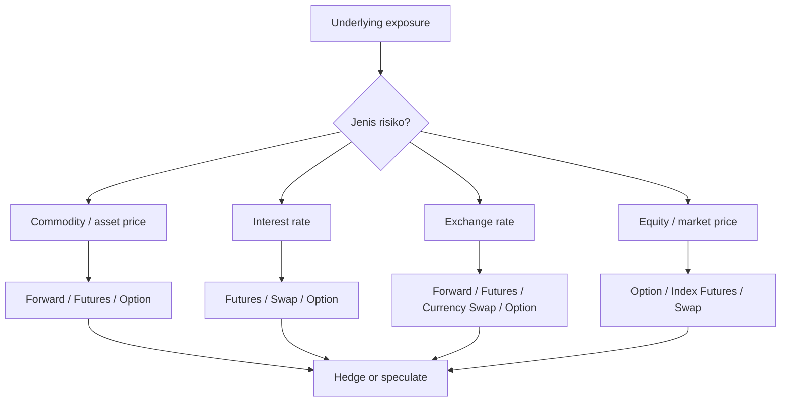
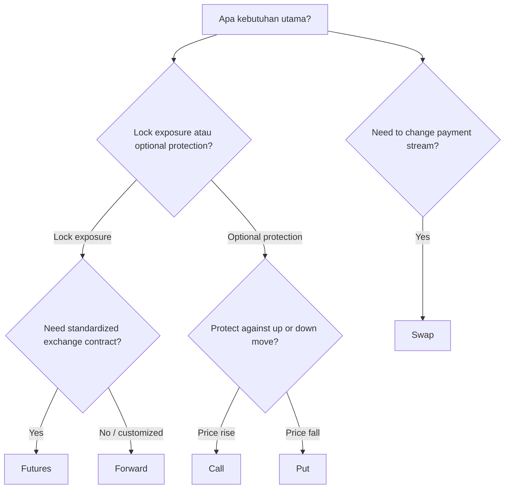

# 📘 5.2 — Derivative Investments

> [!ABSTRACT] Ringkasan Cepat
> **Topik:** Derivative Investments  
> **Bobot Parent Topic:** 10–20%  
> **Exam Priority:** Medium  
> **Difficulty:** Mixed  
> **Primary Skill:** Mixed — definition, payoff logic, market mechanics, hedging, dan interpretation  
> **Ref:** Brigham & Ehrhardt Bab 8 dan Bab 23 sebagai sumber langsung derivatives; Berk & DeMarzo Bab 10 dan 13 untuk konteks risk-return/market pricing; Robinson Bab 15 untuk konteks investment assets.
>
> Inti topik ini adalah memahami **forwards, futures, options, dan swaps** sebagai kontrak yang nilainya bergantung pada underlying price/rate. Derivatives dapat dipakai untuk **hedging** maupun **speculation**, tetapi keduanya memiliki economic logic yang sangat berbeda. Forward dan futures menciptakan kewajiban dua arah untuk bertransaksi di masa depan; option memberi holder sebuah **right, not obligation**; swap menukar stream pembayaran. Perbedaan institutional paling penting adalah bahwa futures umumnya **standardized, exchange-traded, dan marked-to-market**, sedangkan forwards lebih customized dan membawa counterparty/default risk lebih besar. Options memiliki asymmetric payoff, sedangkan forward/futures pada dasarnya symmetric. Swaps mengubah exposure cash flow—misalnya floating menjadi fixed—tanpa harus mengganti underlying financing secara langsung.

## Section 0 — Pemetaan Silabus & Exam Scope

| Field | Isi |
|---|---|
| Topik CF4 | Topik 5 — Pasar Keuangan |
| Subtopik | 5.2 Derivative Investments |
| Learning Outcome | Memahami karakteristik instrumen investasi berupa derivatif (*forwards*, *futures*, opsi, *swaps*) dan pasar dari investasi tersebut. |
| Skill Diuji | Mengidentifikasi jenis derivative dari narasi, membedakan contractual rights/obligations, menentukan long/short exposure, menghitung payoff sederhana, menjelaskan hedging vs speculation, membedakan forward vs futures market mechanics, dan memahami basic swap cash-flow transformation. |
| Bobot Parent Topic | 10–20% |
| Exam Priority | Medium |
| Prerequisite | [[5.1 Investment Asset Characteristics]], spot price, interest rate, exchange rate, commodity price, long/short position, basic present value |
| Connected Topics | [[2.4 Derivative Securities in Corporate Finance]], [[4.1 Financial Markets Structure]], [[5.1 Investment Asset Characteristics]], [[5.3 Economic Influences on Markets]], [[5.4 Return Relationships and Economic Variables]] |
| Referensi | Brigham & Ehrhardt Bab 8 dan 23; Berk & DeMarzo Bab 10 dan 13; Robinson et al. Bab 15 |

> [!IMPORTANT] Scope Boundary
> `[CORE CF4]` Silabus secara eksplisit meminta **forwards, futures, options, swaps, dan pasar dari instrumen tersebut**. Dari paket referensi Topik 5, pembahasan derivative secara langsung dan substansial berada terutama pada **Brigham Bab 8 (financial options)** dan **Brigham Bab 23 (derivatives and risk management)**.  
> Berk & DeMarzo Bab 10 dan 13 mendukung konteks **risk, expected return, diversification, dan market pricing**, tetapi bukan sumber utama mechanics forwards/futures/swaps dalam scope Topik 5 yang diberikan. Robinson Bab 15 terutama membahas intercorporate investments dan tidak digunakan untuk mengisi mechanics derivative yang tidak dibahas di sana.  
> Advanced option pricing seperti full binomial derivation/Black–Scholes, complex structured derivatives, dan detailed corporate risk-management policy dapat membantu understanding tetapi bukan inti learning outcome 5.2 kecuali soal secara eksplisit membawanya.

---

## Section 1 — Intuisi & Big Picture

Apa masalah nyata yang ingin diselesaikan derivative?

Bayangkan sebuah perusahaan maskapai mengetahui bahwa tiga bulan lagi ia harus membeli bahan bakar. Masalahnya bukan apakah bahan bakar akan dibeli—itu sudah pasti—tetapi **berapa harga yang akan berlaku tiga bulan lagi**.

Jika harga naik tajam:

```text
Fuel price ↑
↓
Operating cost ↑
↓
Profit / free cash flow ↓
```

Perusahaan dapat menerima ketidakpastian itu, atau menggunakan kontrak yang nilainya berubah ketika harga bahan bakar berubah. Kontrak semacam itu disebut **derivative** karena nilainya berasal dari (*is derived from*) nilai suatu underlying asset, price, rate, atau index.

Hal yang sama terjadi pada:

- eksportir/importir yang menghadapi **exchange-rate risk**;
- perusahaan dengan floating-rate debt yang menghadapi **interest-rate risk**;
- investor saham yang ingin membatasi downside;
- produsen komoditas yang takut harga jual turun;
- pengguna komoditas yang takut harga input naik.

Derivative tidak menciptakan underlying economic exposure dari nol. Ia terutama **mengubah siapa yang menanggung risiko dan bagaimana payoff risiko itu dibagi**.

### Dua penggunaan utama

#### 1. Hedging

Tujuan hedger adalah **mengurangi ketidakpastian**.

Contoh:

```text
Perusahaan akan membeli oil di masa depan
↓
Takut oil price naik
↓
Ambil derivative position yang untung jika oil naik
↓
Kenaikan cash cost pada physical market
sebagian/seluruhnya di-offset derivative gain
```

Hedger tidak harus “menang” pada derivative. Jika underlying bergerak menguntungkan bagi bisnis dan derivative rugi, total exposure tetap dapat menjadi lebih stabil. Itu justru tujuan hedge.

#### 2. Speculation

Speculator mengambil exposure karena ingin memperoleh keuntungan dari perkiraan price movement.

```text
Prediksi harga naik
↓
Ambil position yang memperoleh keuntungan jika harga naik
↓
Tidak ada physical exposure yang perlu dilindungi
```

> [!WARNING] Important Distinction
> **Hedging ≠ making money on the derivative.**  
> Hedge yang baik dapat menghasilkan kerugian pada derivative jika kerugian itu diimbangi oleh keuntungan pada underlying exposure.

### Mengapa derivatives market membutuhkan speculators?

Brigham menjelaskan bahwa speculators menambah capital dan participants ke derivatives market. Mereka bersedia mengambil risk yang ingin dialihkan oleh hedgers. Walaupun leverage membuat posisi speculator sendiri sangat risky, kehadiran mereka membantu menyediakan counterparties dan liquidity.

### Natural hedge

Brigham menggunakan istilah **natural hedge** ketika dua pihak memiliki exposure yang berlawanan sehingga transaksi derivative dapat mengurangi aggregate risk.

Contoh klasik:

```text
Farmer
takut wheat price turun
       ↕
Miller
 takut wheat price naik
```

Dengan mengunci harga sebelumnya, kedua pihak mengurangi ketidakpastian masing-masing.

---

## Section 2 — Definisi & Core Concepts

### Definisi Formal

> [!NOTE] Definisi Formal
> **Derivative** adalah financial contract/security yang nilainya bergantung pada atau diturunkan dari value suatu underlying asset, commodity, security, interest rate, exchange rate, index, atau variable lain.

Empat keluarga derivative yang menjadi core CF4:

1. **Forward contract**
2. **Futures contract**
3. **Option**
4. **Swap**

### Terminologi Penting

| Istilah | Definisi | Intuisi | Exam Note |
|---|---|---|---|
| Underlying | Asset/rate/index yang menentukan value derivative | “Sumber” nilai derivative | Bisa stock, bond, commodity, FX, rate, index |
| Spot price, $S_t$ | Harga underlying untuk transaksi sekarang | Harga “hari ini” | Jangan tertukar dengan contracted future price |
| Forward price / delivery price, $K$ | Harga yang disepakati sekarang untuk transaksi di masa depan | Lock price | Kontrak mengikat dua pihak |
| Long | Position yang umumnya benefit dari kenaikan underlying pada forward/futures/call | “Buy-side exposure” | Long forward wajib membeli |
| Short | Position yang umumnya benefit dari penurunan underlying pada forward/futures | “Sell-side exposure” | Short forward wajib menjual |
| Counterparty | Pihak di sisi lain kontrak | Lawan transaksi | Penting terutama pada OTC forwards/swaps |
| Hedging | Mengambil position untuk mengurangi existing exposure | Mengurangi variance/uncertainty | Hedge dapat rugi standalone |
| Speculation | Mengambil exposure untuk mencari profit dari perubahan harga | Bertaruh pada direction | Biasanya menambah exposure |
| Leverage | Small capital commitment dapat menghasilkan large percentage gain/loss | Amplifier | Risiko derivative bisa besar |
| Marking to market | Futures gain/loss diselesaikan secara berkala, terutama harian | Profit/loss tidak dibiarkan menumpuk sampai maturity | Key distinction vs forward |
| Margin | Dana/collateral yang mendukung futures position | Performance bond | Bukan “harga membeli underlying” |
| Exercise | Holder option menggunakan haknya | Aktifkan contractual right | Hanya relevan pada option |
| Strike price, $K$ | Harga transaksi yang ditetapkan dalam option | Harga buy/sell bila exercise | Disebut exercise price |
| Expiration | Tanggal berakhirnya option | Batas hidup contract | European vs American berbeda |
| Notional principal | Reference amount pada swap | Dasar menghitung payments | Umumnya bukan amount yang “dibeli” |

---

### 2.1 Forward Contract

Forward adalah agreement bilateral di mana:

- satu pihak setuju **membeli** underlying;
- pihak lain setuju **menjual** underlying;
- harga dan future date ditentukan sekarang.

Kedua pihak memiliki **obligation**.

Untuk long forward dengan delivery price $K$ pada maturity $T$:

$$
\text{Payoff}_{\text{long forward}} = S_T-K
$$

Untuk short forward:

$$
\text{Payoff}_{\text{short forward}} = K-S_T
$$

Keterangan:

- $S_T$ = spot price underlying pada maturity;
- $K$ = contracted delivery price.

Karena:

$$
(S_T-K)+(K-S_T)=0
$$

payoff long dan short adalah **zero-sum sebelum transaction costs/default effects**.

#### Intuisi long forward

Jika Anda sudah wajib membeli underlying di masa depan dan takut harganya naik, long forward mengunci harga.

Jika $S_T > K$:

- Anda membeli pada $K$;
- market value adalah $S_T$;
- economic gain = $S_T-K$.

Jika $S_T < K$:

- Anda tetap wajib membeli pada $K$;
- economic loss = $K-S_T$.

> [!WARNING] Forward bukan option
> Forward **tidak memberi hak untuk mundur ketika tidak menguntungkan**. Kedua pihak mempunyai contractual obligation.

#### Market characteristic

Brigham menggambarkan forwards sebagai kontrak yang umumnya:

- **tailor-made/customized**;
- dinegosiasikan langsung antar-counterparties;
- historically associated dengan actual delivery;
- memiliki **counterparty/default risk** lebih nyata karena gain/loss tidak otomatis settled daily.

---

### 2.2 Futures Contract

Futures secara economic mirip forward: kedua pihak menyepakati transaksi underlying pada future date dengan price yang ditentukan sekarang.

Namun institutional mechanics-nya berbeda.

Brigham menekankan tiga distinction utama:

| Forward | Futures |
|---|---|
| Customized / tailor-made | Standardized |
| Umumnya negotiated privately / OTC | Umumnya exchange-traded |
| Counterparty default risk lebih besar | Daily marking-to-market mengurangi default risk |
| Gain/loss umumnya direalisasikan pada settlement | Gain/loss settled secara berkala melalui margin |
| Physical delivery lebih natural dalam framing textbook | Physical delivery jarang; positions sering cash-settled/closed out |

#### Marking to market

Pada futures, perubahan value position direfleksikan ke margin account secara berkala.

Jika futures price bergerak menguntungkan:

```text
Futures price moves in your favor
↓
Gain credited to margin account
```

Jika bergerak merugikan:

```text
Futures price moves against you
↓
Loss deducted
↓
Margin may fall below maintenance requirement
↓
Additional funds may be required
```

> [!NOTE] Financial Meaning
> Daily settlement mencegah large unpaid losses menumpuk sampai maturity. Itu sebabnya futures market dapat memiliki lower counterparty/default exposure dibanding bilateral forward.

#### Commodity vs financial futures

Brigham membagi futures menjadi:

- **commodity futures** — misalnya oil, grain, livestock, metals;
- **financial futures** — misalnya government securities, interest-rate instruments, currencies, dan stock indexes.

---

### 2.3 Options

> [!NOTE] Definisi Formal
> **Call option** memberi owner hak untuk **membeli** underlying pada strike price.  
> **Put option** memberi owner hak untuk **menjual** underlying pada strike price.

Perbedaan paling fundamental dari forward/futures:

```text
Forward / Futures
= obligation

Option holder
= right, not obligation
```

Namun option writer/seller memiliki obligation jika holder exercise.

#### Call payoff

Long call pada maturity:

$$
C_T=\max(S_T-K,0)
$$

Jika $S_T>K$, exercise.

Jika $S_T\le K$, tidak exercise.

#### Put payoff

Long put pada maturity:

$$
P_T=\max(K-S_T,0)
$$

Jika $S_T<K$, exercise.

Jika $S_T\ge K$, tidak exercise.

#### Short option

Short call:

$$
\text{Payoff}_{\text{short call}}=-\max(S_T-K,0)
$$

Short put:

$$
\text{Payoff}_{\text{short put}}=-\max(K-S_T,0)
$$

> [!DANGER] Jangan Salah Pikir
> **Payoff ≠ profit.**  
> Option buyer membayar **premium** di awal. Karena itu long option dapat mempunyai positive payoff tetapi tetap menghasilkan negative profit jika payoff lebih kecil daripada premium yang dibayar.

Jika premium call pada inception adalah $C_0$, simplified terminal profit:

$$
\Pi_{\text{long call}}=\max(S_T-K,0)-C_0
$$

Jika time value of money diperhitungkan secara formal, premium awal seharusnya dibawa ke terminal value. Namun untuk soal payoff/profit sederhana, ikuti timing convention yang diberikan soal.

#### American vs European

- **American option**: dapat di-exercise kapan saja sampai expiration.
- **European option**: hanya dapat di-exercise pada expiration.

Nama ini adalah contract style, bukan indikasi lokasi geografis underlying.

#### Moneyness

Untuk call:

- $S>K$ → **in-the-money (ITM)**;
- $S=K$ → **at-the-money (ATM)**;
- $S<K$ → **out-of-the-money (OTM)**.

Untuk put arah economic-nya berlawanan:

- $S<K$ → ITM;
- $S=K$ → ATM;
- $S>K$ → OTM.

#### Exercise value / intrinsic value

Untuk call:

$$
\text{Intrinsic Value}_{call}=\max(S-K,0)
$$

Untuk put:

$$
\text{Intrinsic Value}_{put}=\max(K-S,0)
$$

Brigham menekankan bahwa market price option biasanya dapat melebihi immediate exercise value karena terdapat **time value**.

Secara sederhana:

$$
\text{Option Value}=\text{Intrinsic Value}+\text{Time Value}
$$

#### Covered vs naked option

Dalam framing Brigham:

- writing call against stock already held → **covered option**;
- writing call tanpa underlying stock sebagai backing → **naked option**.

Naked short call mempunyai potentially very large loss jika stock price naik jauh.

---

### 2.4 Swaps

> [!NOTE] Definisi Formal
> **Swap** adalah agreement antara dua pihak untuk menukar stream cash-payment obligations berdasarkan terms tertentu.

Jenis yang dibahas Brigham antara lain:

- interest-rate swaps;
- currency swaps;
- equity swaps;
- commodity swaps;
- credit-related swaps.

#### Interest-rate swap

Contoh paling intuitif:

- Company S punya floating-rate debt tetapi lebih cocok dengan fixed cash outflows.
- Company F punya fixed-rate debt tetapi lebih cocok dengan floating cash outflows.

Mereka dapat menukar payment obligations sehingga effective exposure masing-masing berubah.

```text
Before swap
Company S → floating payments
Company F → fixed payments

After swap
Company S → effectively fixed
Company F → effectively floating
```

Swap tidak perlu berarti original debt hilang. Setiap perusahaan tetap memiliki original obligation kepada lenders, lalu swap cash flows meng-offset atau mengubah economic exposure.

#### Basic net-rate logic

Jika perusahaan:

- membayar lender: $\text{LIBOR}+a$;
- menerima LIBOR dari counterparty;
- membayar fixed swap rate $f$;

maka net effective payment:

$$
-(\text{LIBOR}+a)+\text{LIBOR}-f
=-(a+f)
$$

Hasilnya menjadi fixed.

Brigham memberi example di mana swap juga dapat menurunkan effective borrowing cost bagi kedua pihak karena comparative borrowing conditions, walaupun core CF4 yang perlu dipahami adalah **cash-flow transformation**, bukan menghafal angka example.

#### Currency swap

Currency swap dapat digunakan ketika cash inflows dan debt service berada dalam currencies berbeda.

Contoh logic:

```text
US company earns EUR
but owes USD debt
↓
Currency mismatch
↓
Swap EUR-linked payments for USD-linked payments
↓
Exposure becomes better matched
```

#### Counterparty risk

Swap sering melibatkan bank/intermediary. Bank dapat menjadi counterparty dan kemudian hedge exposure-nya sendiri. Tetapi swap tetap membawa concern bahwa counterparty dapat gagal memenuhi obligation.

---

## Section 3 — How It Works

Derivative dapat dipahami dengan satu kerangka:

```text
Underlying exposure
↓
Apa yang dikhawatirkan?
↓
Price naik atau turun?
↓
Butuh obligation atau optionality?
↓
Pilih forward / futures / option / swap
↓
Tentukan long / short / payer / receiver position
↓
Lihat apakah derivative gain meng-offset business/investment loss
```

### 3.1 Hedging a Future Purchase

Perusahaan akan **membeli** commodity nanti.

Risk:

$$
\text{Price naik} \Rightarrow \text{cost naik}
$$

Natural derivative direction:

- long forward/futures; atau
- long call jika ingin protection terhadap kenaikan sambil tetap menikmati manfaat bila harga turun.

#### Forward/futures hedge

```text
Spot price naik
→ physical purchase lebih mahal
→ long futures gain
→ offset
```

#### Call hedge

```text
Price naik di atas strike
→ call payoff positif
→ offset higher purchase cost

Price turun
→ option tidak perlu exercise
→ company tetap menikmati cheaper spot purchase
→ cost hedge = premium
```

Inilah perbedaan ekonomis obligation-based hedge vs option-based hedge.

---

### 3.2 Hedging a Future Sale

Perusahaan/produsen akan **menjual** asset/commodity nanti.

Risk:

$$
\text{Price turun} \Rightarrow \text{revenue turun}
$$

Natural hedge:

- short forward/futures; atau
- long put.

```text
Spot price turun
→ sale proceeds turun
→ short futures / put gains
→ offset
```

---

### 3.3 Long Hedge vs Short Hedge

Brigham membedakan:

- **long hedge**: menggunakan long futures untuk melindungi terhadap **price increase** pada sesuatu yang akan dibeli;
- **short hedge**: menggunakan short futures untuk melindungi terhadap **price decline** pada sesuatu yang akan dijual atau exposure yang value-nya jatuh ketika relevant price bergerak turun.

> [!TIP] Cara Berpikir
> Jangan hafalkan “hedger harus long atau short.” Tanyakan:
>
> **Apa kerugian underlying exposure saya?**  
> Lalu ambil derivative position yang untung dalam keadaan tersebut.

---

### 3.4 Perfect Hedge vs Basis Risk

Hedge akan paling tepat ketika derivative underlying dan exposure yang dihedge sangat cocok dalam:

- asset/reference variable;
- amount;
- timing/maturity;
- sensitivity.

Dalam praktik, match jarang sempurna. Jika derivative contract tidak identik dengan underlying exposure, perubahan keduanya mungkin tidak one-for-one. Ini menciptakan **basis risk**.

> [!DANGER] Jangan Salah Pikir
> Hedge ≠ elimination of every possible risk.  
> Hedging dapat mengurangi satu source of uncertainty tetapi menyisakan basis risk, counterparty risk, liquidity risk, atau opportunity cost.

---

### 3.5 Futures Market Mechanics

Futures trading dapat dibaca sebagai:

```text
Open position
↓
Post margin
↓
Futures price changes
↓
Position marked to market
↓
Gain/loss credited/debited
↓
If margin too low → additional funds may be required
↓
Close out / settle / delivery according to contract
```

Karena contract value dapat besar relatif terhadap initial margin, futures memberikan **leverage**.

Leverage memperbesar:

- percentage gains;
- percentage losses.

Leverage tidak berarti expected profit otomatis lebih tinggi.

---

### 3.6 Options as Asymmetric Risk Transfer

Forward/futures payoff bersifat symmetric:

```text
Long gains when underlying rises
Short loses the same amount
```

Option holder memiliki asymmetric payoff:

```text
Favorable state
→ exercise

Unfavorable state
→ walk away
```

Asymmetry ini tidak gratis. Holder membayar premium.

#### Call mental model

```text
Want upside / protection from price increase
→ Call
```

#### Put mental model

```text
Want downside protection / benefit from price decline
→ Put
```

---

### 3.7 Swap as Exposure Transformation

Swap paling mudah dipahami bukan sebagai “asset yang dibeli”, tetapi sebagai **contractual exchange of cash-flow profiles**.

```text
Existing cash-flow exposure
↓
Mismatch with desired exposure
↓
Enter swap
↓
Receive cash flow that offsets existing obligation
↓
Pay preferred alternative cash flow
↓
Net exposure changes
```

Example:

```text
Existing floating debt
+ Receive floating in swap
+ Pay fixed in swap
= Effective fixed-rate exposure
```

---

### 3.8 Hedging vs Speculating

| Aspect | Hedger | Speculator |
|---|---|---|
| Existing underlying exposure | Biasanya ada | Tidak harus ada |
| Objective | Reduce risk / stabilize cash flow | Profit from price movement |
| Derivative loss | Bisa acceptable jika underlying gain | Umumnya direct investment loss |
| Risk effect | Biasanya reduce targeted exposure | Biasanya increase exposure |
| Key question | “Apa yang ingin saya lindungi?” | “Arah harga apa yang saya prediksi?” |

---

## Section 4 — Worked Examples & Exam Cases

### Case A — Fundamental: Forward Payoff

**Soal**

Sebuah perusahaan mengambil **long forward** atas 1 unit commodity dengan delivery price $K=100$. Pada maturity, spot price adalah $S_T=118$. Berapa payoff long forward?

> [!SUCCESS] Pembahasan
>
> **1. Identifikasi informasi**  
> Long forward, $K=100$, $S_T=118$.
>
> **2. Konsep yang diuji**  
> Long forward memperoleh keuntungan ketika terminal spot price melebihi contracted price.
>
> **3. Reasoning**  
> Contract memberi kewajiban membeli seharga 100 ketika barang bernilai 118 di market.
>
> **4. Calculation**
>
> $$
> \text{Payoff}=S_T-K=118-100=18
> $$
>
> **5. Interpretation**  
> Position memperoleh economic gain 18 per unit.
>
> **6. Verification**  
> Karena $S_T>K$, long forward memang seharusnya positif.

> [!WARNING] Exam Trap — Case A
> - **Trap:** memakai $K-S_T$ untuk long position.
> - **Mengapa distractor terlihat benar:** formula tersebut memang valid, tetapi untuk **short forward**.
> - **Cara menghindari:** long = benefit from price ↑ → $S_T-K$.
> - **Target waktu:** < 45 detik.

---

### Case B — Exam-Typical: Futures Hedge Direction

**Soal**

Sebuah manufacturer mengetahui bahwa enam bulan lagi ia harus membeli copper. Management khawatir harga copper meningkat. Position futures manakah yang paling konsisten dengan tujuan hedging?

A. Short copper futures  
B. Long copper futures  
C. Sell call on copper tanpa underlying  
D. Tidak ada position karena buyer di masa depan memperoleh manfaat dari kenaikan harga

> [!SUCCESS] Pembahasan
>
> **1. Identifikasi informasi**  
> Perusahaan adalah future **buyer** dan risk-nya adalah **price increase**.
>
> **2. Konsep yang diuji**  
> Long hedge.
>
> **3. Reasoning**  
> Jika copper naik, physical purchase menjadi lebih mahal. Long futures harus menghasilkan gain ketika copper naik agar cost increase ter-offset.
>
> **4. Calculation**  
> Tidak diperlukan.
>
> **5. Interpretation**  
> Jawaban: **B. Long copper futures.**
>
> **6. Verification**  
> Risk state = price ↑. Long futures = gain ketika price ↑. Match.

> [!WARNING] Exam Trap — Case B
> - **Trap:** menganggap karena perusahaan “akan membeli”, maka harus short untuk “menjual kontrak”.
> - **Mengapa distractor terlihat benar:** istilah buy/sell physical asset bercampur dengan long/short derivative.
> - **Cara menghindari:** hedge direction ditentukan oleh **loss state**, bukan kata “buyer/seller” saja.
> - **Target waktu:** 30–45 detik.

---

### Case C — Challenging / Integrated: Option vs Forward Hedge

**Soal**

Perusahaan akan membeli 1 unit commodity tiga bulan lagi. Spot price saat ini 100. Management ingin melindungi diri dari kenaikan di atas 110, tetapi tetap ingin menikmati manfaat jika market price turun. Dua alternatif tersedia:

1. long forward dengan delivery price 108;
2. long call dengan strike 110 dan premium 4.

Pada maturity, market price ternyata 90. Abaikan time value of money. Bandingkan economic purchase cost masing-masing strategy.

> [!SUCCESS] Pembahasan
>
> **1. Identifikasi informasi**  
> Future purchase; forward obligation; call optionality; terminal price 90.
>
> **2. Konsep yang diuji**  
> Obligation vs right, dan cost of optionality.
>
> **3. Reasoning**  
> Forward tetap memaksa purchase pada 108 meskipun market price turun. Call tidak perlu di-exercise karena membeli di market 90 lebih murah daripada strike 110.
>
> **4. Calculation**
>
> **Forward:**
>
> $$
> \text{Effective purchase cost}=108
> $$
>
> **Call:**
>
> $$
> \text{Physical purchase}=90
> $$
>
> $$
> \text{Option premium}=4
> $$
>
> $$
> \text{Total economic cost}=94
> $$
>
> **5. Interpretation**  
> Dalam downside-price scenario ini, option strategy lebih murah karena perusahaan tetap menikmati fall in spot price; “harga” flexibility tersebut adalah premium 4.
>
> **6. Verification**  
> Call dengan strike 110 seharusnya OTM ketika $S_T=90$, sehingga tidak di-exercise.

> [!WARNING] Exam Trap — Case C
> - **Trap:** menganggap forward dapat “tidak dipakai” seperti option.
> - **Mengapa distractor terlihat benar:** keduanya sama-sama menentukan future-price exposure.
> - **Cara menghindari:** forward/futures = obligation; option holder = right.
> - **Target waktu:** 1–2 menit.

---

### Case D — Interest-Rate Swap Mechanics

**Soal**

Perusahaan memiliki floating-rate debt sebesar notional tertentu dengan rate:

$$
\text{LIBOR}+1\%
$$

Perusahaan masuk interest-rate swap dan:

- menerima LIBOR;
- membayar fixed 8.5%.

Apa effective interest-rate exposure perusahaan, dengan mengabaikan fees dan timing differences?

> [!SUCCESS] Pembahasan
>
> **1. Identifikasi informasi**  
> Original debt = pay LIBOR + 1%; swap = receive LIBOR, pay 8.5% fixed.
>
> **2. Konsep yang diuji**  
> Netting of cash-flow obligations.
>
> **3. Reasoning**  
> LIBOR yang diterima pada swap meng-offset LIBOR yang dibayar pada debt.
>
> **4. Calculation**
>
> $$
> -(\text{LIBOR}+1\%)+\text{LIBOR}-8.5\%
> $$
>
> $$
> =-9.5\%
> $$
>
> Jadi effective exposure adalah approximately **9.5% fixed**.
>
> **5. Interpretation**  
> Swap mengubah floating-rate exposure menjadi fixed-rate exposure.
>
> **6. Verification**  
> Semua LIBOR terms cancel; hasil akhir seharusnya tidak lagi sensitif langsung terhadap LIBOR.

> [!WARNING] Exam Trap — Case D
> - **Trap:** menjumlahkan semua rates tanpa memperhatikan receive vs pay.
> - **Mengapa distractor terlihat benar:** seluruh angka terlihat seperti “cost”.
> - **Cara menghindari:** beri tanda cash flow: pay = negatif, receive = positif.
> - **Target waktu:** ±1 menit.

---

## Section 5 — Interpretation & Sanity Check

> [!CHECK] Sanity Check
> **1. Long/short direction check**  
> Jika underlying naik, long forward/futures seharusnya benefit; short seharusnya loss.
>
> **2. Option floor check**  
> Long call/put payoff tidak boleh negatif karena holder dapat memilih tidak exercise.
>
> **3. Obligation check**  
> Forward/futures tidak boleh diperlakukan seperti option. Unfavorable price movement tetap menghasilkan contractual loss.
>
> **4. Hedge check**  
> Derivative position yang benar harus menghasilkan gain pada state di mana underlying business exposure menderita loss.
>
> **5. Swap netting check**  
> Bila floating term diterima sebesar yang dibayar, floating component harus cancel dan effective exposure menjadi fixed.
>
> **6. Futures mechanics check**  
> Margin adalah collateral/performance mechanism, bukan purchase price underlying asset.

### Interpretation Ladder

> **Level 1 — Number**  
> Berapa payoff derivative?
>
> **Level 2 — Direction**  
> Position untung ketika underlying naik atau turun?
>
> **Level 3 — Meaning**  
> Apakah exposure ini hedge atau speculation?
>
> **Level 4 — Cause**  
> Risk apa yang ingin dipindahkan—commodity, FX, interest rate, atau equity price?
>
> **Level 5 — Limitation**  
> Apakah hedge perfect? Adakah basis risk, counterparty risk, liquidity risk, premium cost, atau margin requirement?

---

## Section 6 — Connections & Mental Model



### Hubungan dengan [[5.1 Investment Asset Characteristics]]

5.1 menjelaskan derivative sebagai salah satu family financial claims. 5.2 memperdalam:

- contractual rights;
- payoff structure;
- market mechanics;
- risk-transfer function.

### Hubungan dengan [[2.4 Derivative Securities in Corporate Finance]]

Perbedaan orientasinya:

```text
5.2 Derivative Investments
→ market instrument
→ forward / futures / option / swap
→ payoff and hedging

2.4 Derivative Securities in Corporate Finance
→ corporate financing / embedded optionality
→ callable / convertible / real options
```

Ada overlap option concepts, tetapi purpose-nya berbeda.

### Hubungan dengan [[4.1 Financial Markets Structure]]

Derivative contracts diperdagangkan melalui different market structures:

- standardized exchange market → especially futures/listed options;
- bilateral/OTC arrangements → especially forwards dan banyak swaps.

Market structure mempengaruhi:

- standardization;
- liquidity;
- counterparty risk;
- settlement.

### Hubungan dengan [[5.3 Economic Influences on Markets]]

Underlying variables derivative sering justru adalah economic prices/rates:

- interest rates;
- exchange rates;
- commodity prices;
- equity prices.

Karena itu perubahan macroeconomic conditions dapat memengaruhi derivative value melalui underlying.

### Hubungan dengan [[5.4 Return Relationships and Economic Variables]]

Derivative exposure dapat memperbesar atau mengubah sensitivity portfolio terhadap economic variables. Leverage berarti small underlying movement dapat menghasilkan large percentage change pada derivative position.

---

## Section 7 — Exam Traps & Misconceptions

### Definition Trap

> [!BUG] Definition Trap
> **Forward vs Futures**  
> Forward = customized bilateral obligation, counterparty risk lebih besar.  
> Futures = standardized, exchange-traded, marked-to-market.
>
> **Forward/Futures vs Option**  
> Forward/futures = obligation.  
> Option holder = right, not obligation.
>
> **Call vs Put**  
> Call = right to buy.  
> Put = right to sell.
>
> **Long vs Short**  
> Long forward/futures benefits from price increase; short benefits from decrease.  
> Tetapi long option hanya kehilangan premium jika tidak exercise—jangan samakan payoff profile-nya dengan long forward.

### Financial Logic Trap

> [!BUG] Logic Trap
> - **Derivative gain ≠ successful business outcome.** Hedge dinilai bersama underlying exposure.
> - **Hedging ≠ eliminating all risk.** Basis, counterparty, liquidity, dan operational risks dapat tersisa.
> - **Low initial cash requirement ≠ low risk.** Leverage dapat memperbesar losses.
> - **Margin ≠ option premium.** Margin mendukung futures performance; premium adalah price yang dibayar option buyer.
> - **Swap ≠ refinancing secara legal.** Original debt dapat tetap ada; swap mengubah effective cash-flow exposure.
> - **OTC customization ≠ superior in every respect.** Customization datang dengan counterparty/liquidity considerations.

### Calculation Trap

> [!BUG] Calculation Trap
> **Forward sign error**
>
> Salah untuk long forward:
>
> $$
> K-S_T
> $$
>
> Benar:
>
> $$
> S_T-K
> $$
>
> **Option payoff error**
>
> Salah untuk long call:
>
> $$
> S_T-K
> $$
>
> karena bisa negatif.
>
> Benar:
>
> $$
> \max(S_T-K,0)
> $$
>
> **Payoff vs profit error**
>
> Salah:
>
> $$
> \text{Profit call}=\max(S_T-K,0)
> $$
>
> Benar secara simplified terminal convention:
>
> $$
> \text{Profit call}=\max(S_T-K,0)-\text{premium}
> $$

### Interpretation Trap

> [!BUG] Interpretation Trap
> Sebuah airline melakukan hedge fuel price. Fuel price kemudian turun dan futures position rugi. Tidak otomatis berarti hedge adalah keputusan buruk. Airline dapat memperoleh benefit pada physical fuel purchase yang lebih murah. Yang dinilai adalah **combined exposure**, bukan derivative P/L secara terpisah.

### Red Flags

> [!CAUTION] Red Flags
>
> | Keyword / Condition | Apa yang Harus Dipikirkan |
> |---|---|
> | “will buy in the future” | Risk = price increase → consider long hedge |
> | “will sell in the future” | Risk = price decline → consider short hedge |
> | “right but not obligation” | Option |
> | “must buy/sell at future date” | Forward/futures obligation |
> | “customized bilateral contract” | Forward / OTC |
> | “standardized, exchange-traded” | Futures |
> | “marked to market daily” | Futures |
> | “margin / maintenance margin” | Futures mechanics |
> | “strike/exercise price” | Option |
> | “receive floating, pay fixed” | Swap converting exposure toward fixed |
> | “notional principal” | Swap reference amount |
> | “lock in price” | Forward/futures style hedge |
> | “retain upside/downside benefit” | Option may be more suitable because exercise is optional |
> | “counterparty risk” | Especially relevant in OTC forward/swap |
> | “basis risk” | Hedge instrument and exposure are imperfectly matched |

---

## Section 8 — Executive Summary

### Must Remember

> [!SUMMARY] Must Remember
> 1. **Derivative value derives from an underlying price/rate/index.**
> 2. **Forward and futures create obligations** for both parties; options give the holder a **right, not obligation**.
> 3. Long forward payoff:
>
> $$
> S_T-K
> $$
>
> 4. Short forward payoff:
>
> $$
> K-S_T
> $$
>
> 5. Long call payoff:
>
> $$
> \max(S_T-K,0)
> $$
>
> 6. Long put payoff:
>
> $$
> \max(K-S_T,0)
> $$
>
> 7. Futures are generally **standardized, exchange-traded, margined, and marked-to-market**; forwards are more customized and carry greater bilateral counterparty exposure.
> 8. **Long hedge** protects a future buyer against price increase; **short hedge** protects a future seller/value holder against price decline.
> 9. Swap = exchange of payment streams; receiving floating and paying fixed can transform floating debt exposure into effective fixed exposure.
> 10. Hedging should be evaluated on the **combined underlying + derivative position**, not derivative profit alone.

### Comparison Table

| Feature | Forward | Futures | Option | Swap |
|---|---|---|---|---|
| Core structure | Future buy/sell obligation | Future buy/sell obligation | Right to buy/sell | Exchange cash-flow streams |
| Both sides obligated? | Yes | Yes | Holder no; writer yes if exercised | Yes |
| Standardization | Usually customized | Usually standardized | Listed options standardized; contract-specific forms also possible | Often negotiated/standardized forms via intermediaries |
| Typical market | OTC/bilateral | Exchange | Exchange for listed options | Often OTC/intermediated |
| Marked to market | Generally no daily settlement | Yes | Not the defining feature | Depends on arrangement |
| Upfront premium | Usually not like an option premium | Margin rather than premium | Yes, option premium | Terms/fees depend on contract |
| Payoff shape | Symmetric | Symmetric | Asymmetric for holder | Depends on exchanged cash flows |
| Main risk-transfer use | Lock price/rate | Hedge with liquid standardized contract | Insurance-like asymmetric protection | Transform cash-flow exposure |
| Key risk | Counterparty | Margin/basis/market | Premium + writer risk | Counterparty/basis/market |

### Trigger Keywords

| Jika soal mengatakan... | Pikirkan... |
|---|---|
| “lock the purchase price” | Long forward/futures |
| “protect against falling sale price” | Short forward/futures or put |
| “protect against increase but keep benefit if price falls” | Call |
| “protect stock downside but keep upside” | Put |
| “daily settlement” | Futures |
| “tailor-made” | Forward |
| “exchange fixed for floating” | Interest-rate swap |
| “exchange currency payment obligations” | Currency swap |
| “exercise price” | Option strike |
| “no obligation to exercise” | Option holder |

### Kapan Digunakan

Gunakan forward/futures ketika objective utamanya adalah **locking an exposure**.

Gunakan option ketika pihak ingin **protection against unfavorable movement tetapi tetap mempertahankan benefit dari favorable movement**, dengan konsekuensi membayar premium.

Gunakan swap ketika pihak ingin **mengubah pattern cash flow**—misalnya floating menjadi fixed atau currency A menjadi currency B—tanpa harus mengganti semua underlying financing arrangement.

### Kapan TIDAK Boleh Digunakan

- Jangan memakai payoff forward untuk option.
- Jangan menganggap futures margin sebagai full investment value.
- Jangan menganggap every hedge perfect.
- Jangan menganggap derivative selalu menurunkan risk; speculative position dapat meningkatkannya.
- Jangan mengabaikan counterparty risk pada bilateral contracts.
- Jangan menyimpulkan hedge gagal hanya karena derivative leg rugi.

### Quick Decision Tree



---

## Section 9 — Active Recall Check

1. Mengapa derivative disebut “derivative” dan apa yang dimaksud underlying?
2. Apa perbedaan paling penting antara forward dan option dari sisi contractual obligation?
3. Sebutkan tiga institutional differences antara forward dan futures menurut Brigham.
4. Mengapa daily marking-to-market pada futures membantu mengurangi default risk?
5. Sebuah perusahaan akan membeli commodity tiga bulan lagi. Jika risk yang ditakuti adalah kenaikan harga, long atau short futures yang lebih sesuai? Mengapa?
6. Tuliskan payoff long call, long put, long forward, dan short forward pada maturity.
7. Mengapa positive option payoff belum tentu sama dengan positive option profit?
8. Bagaimana interest-rate swap dapat mengubah floating-rate debt menjadi effective fixed-rate exposure?
9. Mengapa derivative loss tidak otomatis berarti hedging strategy gagal?
10. Apa perbedaan hedging dan speculation dalam hal existing exposure dan objective?

---

## Section 10 — Exam Pattern Map

| Narasi Soal | Keyword | Konsep | Formula/Rule | Langkah | Trap | Shortcut |
|---|---|---|---|---|---|---|
| Future buyer takut price naik | “purchase later”, “price increase” | Long hedge | Long futures payoff ↑ when price ↑ | Identifikasi loss state → pilih opposite payoff | Short karena salah fokus pada kata “buy” | **Future buyer → long hedge** |
| Future seller takut price turun | “sell later”, “price decline” | Short hedge | Short futures payoff ↑ when price ↓ | Identifikasi loss state → short | Mengambil long | **Future seller → short hedge** |
| Kontrak customized dan bilateral | “tailor-made”, “OTC” | Forward | Obligation at agreed $K$ | Distinguish from futures | Mengira semua derivatives exchange-traded | **Customized → forward** |
| Daily margin settlement | “marked-to-market”, “maintenance margin” | Futures | Daily gain/loss settlement | Identify futures mechanics | Menganggap margin = premium | **Daily MTM → futures** |
| Right to buy | “right”, “buy”, “strike” | Call | $\max(S_T-K,0)$ | Compare $S_T$ vs $K$ | Lupa max with zero | **Call = buy right** |
| Right to sell | “right”, “sell”, “strike” | Put | $\max(K-S_T,0)$ | Compare $K$ vs $S_T$ | Tanda terbalik | **Put = sell right** |
| Floating debt ingin fixed exposure | “receive floating, pay fixed” | Interest-rate swap | Net cash flows | Sign each payment → cancel floating | Menjumlahkan receive as cost | **Pay −, receive +** |
| Derivative leg rugi pada hedge | “hedge loss” | Hedge evaluation | Combined exposure | Add underlying economics + derivative | Menilai derivative standalone | **Judge total position** |

`[TEXTBOOK-BASED EXPECTATION]` Pattern map ini diturunkan dari direct learning outcome 5.2 dan definitions/examples dalam Brigham Bab 8 dan 23. Tidak diklaim sebagai past-exam frequency karena past exam CF4 tidak digunakan dalam penyusunan note ini.

---

## Source Traceability

| Materi | Sumber |
|---|---|
| Scope 5.2: forwards, futures, options, swaps | Silabus CF4 — Topik 5, subtopik 5.2 |
| Derivative definition dan risk-management context | Brigham & Ehrhardt, Bab 23 §§23.1–23.2 |
| Natural hedges, hedgers, speculators, growth of derivatives markets | Brigham & Ehrhardt, Bab 23 §23.2 |
| Risks/misuse and leverage of derivatives | Brigham & Ehrhardt, Bab 23 §23.3 |
| Forward contract definition | Brigham & Ehrhardt, Bab 23 §23.4 |
| Forward vs futures distinctions | Brigham & Ehrhardt, Bab 23 §23.4 |
| Futures exchange/standardization, daily marking-to-market, margin | Brigham & Ehrhardt, Bab 23 §§23.4, 23.6 |
| Commodity vs financial futures | Brigham & Ehrhardt, Bab 23 §23.6 |
| Long hedge and short hedge | Brigham & Ehrhardt, Bab 23 §23.6 |
| Basis-risk / imperfect hedge logic | Brigham & Ehrhardt, Bab 23 §23.6 |
| Swap definition and interest-rate swap mechanics | Brigham & Ehrhardt, Bab 23 §23.4 dan §23.6 |
| Currency swaps and intermediary/counterparty role | Brigham & Ehrhardt, Bab 23 §23.4 |
| Call and put definitions | Brigham & Ehrhardt, Bab 8 — option terminology |
| Strike price, expiration, American vs European | Brigham & Ehrhardt, Bab 8 — option terminology |
| ITM/OTM, exercise/intrinsic value, time value | Brigham & Ehrhardt, Bab 8 — listed option characteristics |
| Covered vs naked option | Brigham & Ehrhardt, Bab 8 — option-market discussion |
| Risk-return and market-pricing background | Berk & DeMarzo, Bab 10 dan 13 |
| Investment-asset context | Robinson et al., Bab 15 |

> [!NOTE] Source Boundary Note
> Mechanics utama note ini sengaja bersumber terutama dari **Brigham Bab 8 dan 23**, karena dua chapter tersebut secara langsung membahas financial options, forwards, futures, swaps, hedging, dan derivatives markets. Berk & DeMarzo Bab 10/13 serta Robinson Bab 15 tidak digunakan untuk menambahkan derivative mechanics yang tidak terdapat pada chapter tersebut. Advanced option-pricing derivations dari Brigham Bab 8 dikompresi karena learning outcome 5.2 meminta pemahaman karakteristik derivative dan pasarnya, bukan full derivation model pricing.

---

> [!QUOTE] Follow-up Options
> 1. *"Uji saya dengan soal Active Recall dari topik ini"*
> 2. *"Buat 10 soal exam-style untuk topik ini"*
> 3. *"Continue ke [[5.3 Economic Influences on Markets]]"*

*📖 Ref: Brigham & Ehrhardt Bab 8 & 23; Berk & DeMarzo Bab 10 & 13; Robinson et al. Bab 15 | 🗓️ 2026-08-25 | #CF4 #AkuntansiKeuanganKorporasi*
