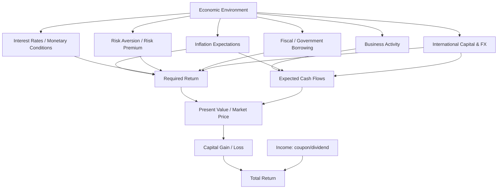

# 📘 5.3 — Economic Influences on Markets

> [!ABSTRACT] Ringkasan Cepat
> **Topik:** Economic Influences on Markets  
> **Bobot Parent Topic:** 10–20%  
> **Exam Priority:** Medium  
> **Difficulty:** Concept-Intensive  
> **Primary Skill:** Menelusuri arah pengaruh faktor ekonomi terhadap **required return, expected cash flow, market price, dan total return**.  
>
> Inti topik ini adalah satu rantai sederhana: **economic conditions memengaruhi expected cash flows dan required returns; keduanya memengaruhi present value dan market price investasi**. Brigham menempatkan **production opportunities, time preference for consumption, risk, dan inflation** sebagai fundamental determinants dari cost of money, lalu menunjukkan bahwa tingkat bunga aktual juga dipengaruhi monetary policy, fiscal deficits, business activity, dan international factors. Berk & DeMarzo memberi kerangka risk-return: investor meminta compensation untuk risk yang tidak dapat dieliminasi melalui diversification. Untuk saham, perubahan outlook ekonomi dapat memengaruhi expected dividends/growth sekaligus required return; untuk fixed-income assets, perubahan market interest rates mengubah discount rate dan karena itu market value.  
>
> Untuk ujian, jangan menghafal “inflasi naik → semua harga aset turun” secara mekanis. Selalu tanyakan **channel-nya**: apakah faktor tersebut mengubah **cash flow**, **discount rate**, **risk premium**, atau beberapa sekaligus?

---

## Section 0 — Pemetaan Silabus & Exam Scope

| Field | Isi |
|---|---|
| Topik CF4 | Topik 5 — Pasar Keuangan |
| Subtopik | 5.3 Economic Influences on Markets |
| Learning Outcome | Menjelaskan faktor utama ekonomi yang berpengaruh pada tingkat harga pasar investasi dan imbal hasil total. |
| Skill Diuji | Mengidentifikasi economic driver; menentukan apakah driver memengaruhi expected cash flow, required return, atau keduanya; menentukan arah perubahan price/yield/return secara *ceteris paribus*; membedakan nominal vs real effect; menghindari overgeneralization antar asset class. |
| Bobot Parent Topic | 10–20% |
| Exam Priority | Medium |
| Prerequisite | [[5.1 Investment Asset Characteristics]], [[5.2 Derivative Investments]], present value, discount rate, dividend/coupon, capital gain/loss |
| Connected Topics | [[4.1 Financial Markets Structure]], [[5.1 Investment Asset Characteristics]], [[5.4 Return Relationships and Economic Variables]], [[2.2 Long-Term Debt Instruments]] |
| Referensi | Robinson et al. Bab 15; Berk & DeMarzo Bab 10 dan 13; Brigham & Ehrhardt Bab 1, 7, 8, 23 |

> [!IMPORTANT] Scope Boundary
> `[CORE CF4]` Silabus meminta **faktor ekonomi utama yang memengaruhi market price dan total return**. Sumber yang paling langsung untuk macro/market channel adalah **Brigham Bab 1**, khususnya pembahasan *cost of money*, monetary/fiscal/business/international influences, serta hubungan financial markets dengan required returns.  
>
> **Berk & DeMarzo Bab 10** digunakan untuk risk-return, diversification, systematic risk, dan risk premium. **Berk & DeMarzo Bab 13** digunakan untuk market-pricing framework dan bagaimana risk/required return masuk ke valuation. **Brigham Bab 7** mendukung stock valuation melalui expected cash flows/dividends dan required return. **Brigham Bab 8 dan 23** memberi konteks bagaimana perubahan underlying prices/rates menciptakan exposure yang kemudian dapat dihedge dengan derivatives.  
>
> **Robinson Bab 15** terutama membahas accounting untuk intercorporate investments. Ia relevan secara terbatas untuk memahami bahwa perubahan fair value dapat masuk berbeda ke financial reporting tergantung classification, tetapi bukan sumber utama macroeconomic transmission. Detail accounting classification tidak dijadikan core 5.3.
>
> Topik **5.4** adalah tempat untuk membahas lebih jauh hubungan teoritis/historis antara total returns dan economic variables. Note 5.3 fokus pada **causal mechanisms**.

---

## Section 1 — Intuisi & Big Picture

Harga pasar investasi tidak bergerak “karena ekonomi bagus” atau “karena ekonomi buruk” secara abstrak. Harga bergerak karena investor mengubah penilaian terhadap:

1. **berapa besar cash flow yang akan diterima**;
2. **kapan cash flow diterima**;
3. **seberapa berisiko cash flow tersebut**;
4. **berapa required return yang sekarang diminta pasar**.

Secara umum:

$$
P_0
=
\sum_{t=1}^{n}
\frac{E(CF_t)}{(1+r)^t}
$$

dengan:

- \(P_0\) = current market value;
- \(E(CF_t)\) = expected future cash flow pada waktu \(t\);
- \(r\) = required return / discount rate.

Mental model utama:

```text
Economic factor
        ↓
Expected cash flows and/or required return
        ↓
Present value
        ↓
Market price
        ↓
Holding-period / total return
```

Dua jalur terpenting:

```text
Better expected cash flows
→ value naik, ceteris paribus

Higher required return
→ value turun, ceteris paribus
```

> [!WARNING] Important Distinction
> **Economic condition ≠ market price direction secara otomatis.**
>
> Satu economic event dapat mengubah **cash-flow expectations** dan **discount rate** secara bersamaan, bahkan dengan arah yang berlawanan.

---

## Section 2 — Cost of Money: Fondasi Economic Influence

Brigham menyebut empat fundamental determinants dari **cost of money** atau required return yang diminta providers of capital.

### 2.1 Production Opportunities

**Production opportunities** adalah kemampuan economy/business mengubah capital hari ini menjadi output dan cash flow masa depan.

Jika terdapat banyak attractive productive opportunities:

```text
Demand for capital naik
→ required return / interest rates cenderung naik
```

Secara ekonomi, borrowers bersedia membayar lebih untuk memperoleh funds jika project opportunities menawarkan expected return yang tinggi.

### 2.2 Time Preference for Consumption

Investor biasanya lebih menyukai consumption sekarang daripada consumption yang ditunda.

Agar investor mau menunda consumption:

```text
Current saving
→ harus diberi compensation
→ required return positif
```

Semakin kuat preference terhadap consumption saat ini, semakin besar return yang secara umum harus ditawarkan untuk mendorong saving.

### 2.3 Risk

Jika probability bahwa promised/expected cash flow tidak diterima meningkat, investors meminta compensation tambahan.

Secara konseptual:

$$
\text{Required return}
=
\text{base return}
+
\text{risk compensation}
$$

Berk & DeMarzo menekankan bahwa tidak semua risk harus memperoleh premium. Risk yang dapat dihilangkan melalui diversification berbeda dari risk yang tetap muncul pada well-diversified portfolio.

```text
Higher non-diversifiable / market-related risk
→ higher required risk premium
→ higher required return
→ lower present value, all else equal
```

> [!BUG] Exam Trap
> **Higher risk tidak berarti realized return pasti lebih tinggi.**
>
> Yang meningkat adalah **expected/required return**, bukan guaranteed return.

### 2.4 Inflation

Inflation mengurangi purchasing power dari nominal money received in the future. Karena itu investor biasanya meminta higher nominal return ketika expected inflation meningkat.

Hubungan konseptual:

$$
(1+r_n)
=
(1+r_r)(1+\pi)
$$

dengan:

- \(r_n\) = nominal return;
- \(r_r\) = real return;
- \(\pi\) = inflation rate.

Untuk approximation ketika rates relatif kecil:

$$
r_n \approx r_r + \pi
$$

Jadi:

```text
Expected inflation naik
→ nominal required return cenderung naik
→ fixed nominal cash flows didiskontokan lebih tinggi
→ present value cenderung turun
```

> [!WARNING] Important Distinction
> **Expected inflation vs unexpected inflation**
>
> Market pricing terutama bereaksi terhadap **expectations**. Jika inflation sudah sepenuhnya diantisipasi, sebagian pengaruhnya sudah dapat tercermin pada market yields dan prices sebelum data aktual diumumkan.

---

## Section 3 — Interest Rates sebagai Transmission Mechanism

Interest rate adalah salah satu channel paling penting yang menghubungkan economy dengan asset prices.

### 3.1 Fixed-Income Securities

Untuk fixed-rate bond:

$$
P_0
=
\sum_{t=1}^{n}
\frac{C}{(1+y)^t}
+
\frac{F}{(1+y)^n}
$$

dengan:

- \(C\) = coupon;
- \(F\) = face value;
- \(y\) = market-required yield.

Jika market-required yield naik sementara contractual cash flows tetap:

$$
y \uparrow
\Rightarrow
P_0 \downarrow
$$

dan sebaliknya:

$$
y \downarrow
\Rightarrow
P_0 \uparrow
$$

Ini adalah **inverse price–yield relationship**.

### 3.2 Mengapa Long-Term Fixed-Rate Assets Lebih Sensitif?

Semakin jauh cash flow berada di masa depan, semakin besar effect dari perubahan discount rate terhadap present value.

Secara intuitif:

```text
Longer maturity / longer duration
→ more cash flow located far in future
→ stronger sensitivity to discount-rate change
```

Karena itu, perubahan economic outlook yang menaikkan market rates biasanya lebih berat bagi long-duration fixed-rate securities dibanding short-term instruments, all else equal.

### 3.3 Short-Term Instruments

Short-term instruments memiliki maturity pendek sehingga:

- cash flows diterima lebih cepat;
- principal dapat direinvestasikan pada rate baru lebih cepat;
- price sensitivity terhadap perubahan rates umumnya lebih rendah daripada long fixed-rate securities.

Namun:

> rate naik tetap dapat menurunkan price sebelum maturity; “short term” bukan berarti “zero price risk”.

---

## Section 4 — Inflation dan Asset Prices

Inflation bekerja melalui beberapa channels.

### 4.1 Discount-Rate Channel

Jika expected inflation naik:

```text
Expected inflation ↑
→ nominal required returns ↑
→ discount rates ↑
→ PV of fixed nominal cash flows ↓
```

Channel ini sangat langsung pada bonds.

### 4.2 Cash-Flow Channel

Inflation juga dapat mengubah:

- revenues;
- wages;
- input costs;
- replacement costs;
- nominal dividends;
- corporate profits.

Karena itu effect pada equity tidak sesederhana fixed-income.

Jika firm mampu menaikkan selling prices lebih cepat daripada costs:

```text
Nominal operating cash flow dapat naik
```

Tetapi jika input costs naik sementara pricing power lemah:

```text
Profit margin dapat turun
→ expected cash flow turun
```

### 4.3 Real Purchasing-Power Channel

Investor harus membedakan nominal return dan real return.

Approximation:

$$
r_{\text{real}}
\approx
r_{\text{nominal}}-\pi
$$

Contoh:

Jika nominal return \(8\%\) dan inflation \(5\%\):

$$
r_{\text{real}}
\approx
8\%-5\%
=
3\%
$$

Exact relation:

$$
r_{\text{real}}
=
\frac{1+r_{\text{nominal}}}{1+\pi}-1
$$

> [!BUG] Exam Trap
> **Nominal gain ≠ real wealth gain.**
>
> Asset dapat memberikan positive nominal return tetapi hampir tidak meningkatkan purchasing power jika inflation tinggi.

---

## Section 5 — Monetary Policy

Brigham menempatkan **monetary policy** sebagai salah satu factor yang dapat memengaruhi interest rates dan financial markets.

Secara sederhana, kebijakan yang mengubah supply of money/credit dan short-term financing conditions dapat memengaruhi market interest rates.

### 5.1 Tightening-Type Effect

Secara konseptual:

```text
Tighter monetary conditions
→ short-term rates / financing cost cenderung naik
→ required returns dapat naik
→ PV assets dapat turun
```

Untuk companies:

```text
Borrowing cost ↑
→ financing lebih mahal
→ marginal investment projects menjadi kurang attractive
→ expected growth/cash-flow outlook dapat melemah
```

Untuk fixed-income investors, existing bonds dapat turun harga ketika new market yields naik.

### 5.2 Easing-Type Effect

Sebaliknya:

```text
Easier monetary conditions
→ rates cenderung turun
→ discount rates dapat turun
→ existing fixed-rate securities naik nilainya
```

Namun jika easing dilakukan karena economic outlook sangat lemah, lower rates dapat datang bersamaan dengan lower expected corporate cash flows. Karena itu:

> **“Rate turun → stock pasti naik” bukan universal rule.**

---

## Section 6 — Fiscal Policy dan Government Borrowing

Brigham membahas **federal budget deficits / fiscal conditions** sebagai factor yang dapat memengaruhi rates.

Jika government financing requirement meningkat, government harus memperoleh lebih banyak funds dari capital markets.

Potential mechanism:

```text
Government borrowing demand ↑
→ competition for funds ↑
→ market interest rates dapat terdorong naik
```

Jika rates naik:

- existing fixed-rate bond prices cenderung turun;
- corporate financing costs dapat naik;
- higher discount rates menekan PV expected cash flows.

Tetapi hubungan aktual dapat dipengaruhi kondisi lain pada saat yang sama, termasuk monetary policy dan business activity.

> [!TIP] Cara Pikir Ujian
> Jika soal memberi **satu faktor** dan meminta effect *ceteris paribus*, gunakan channel langsung.  
> Jika soal memberi beberapa macro conditions sekaligus, jangan mengabaikan offsetting effects.

---

## Section 7 — Business Activity / Economic Cycle

Business conditions memengaruhi markets terutama melalui dua sisi:

1. **expected corporate cash flows**;
2. **demand for capital dan required returns**.

### 7.1 Expansion

Dalam expansion:

- sales dan profits banyak firms dapat meningkat;
- investment opportunities dapat bertambah;
- demand for capital dapat meningkat;
- interest rates dapat terdorong naik.

Jadi equity mendapat dua possible effects:

```text
Expected cash flow ↑
→ stock value ↑

Required return / rates ↑
→ stock value ↓
```

Net effect tergantung magnitude masing-masing channel.

### 7.2 Recession

Dalam recession:

- revenues/profits dapat turun;
- default concerns dapat naik;
- investors dapat menjadi lebih risk averse;
- tetapi weak credit demand / policy easing dapat menekan risk-free rates.

Again, channels dapat berlawanan:

```text
Expected cash flows ↓
→ equity value ↓

Risk premium ↑
→ value ↓

Risk-free rates ↓
→ value ↑, ceteris paribus
```

Karena itu market reaction tidak boleh disimpulkan hanya dari label “recession”.

### 7.3 Economic Distress dan Liquidity

Brigham menggunakan global financial crisis sebagai example bahwa macro/financial stress dapat berkembang melalui:

```text
Asset losses
↓
Balance-sheet weakness
↓
Credit tightening
↓
Lower consumption / investment
↓
Lower production
↓
Higher unemployment
↓
Further deterioration in expected cash flows
```

Ketika liquidity market menghilang, even fundamentally valuable assets dapat mengalami severe price pressure karena investors/lenders enggan menyediakan funds atau melakukan transactions pada normal terms.

---

## Section 8 — Risk Aversion dan Market Risk Premium

Berk & DeMarzo menunjukkan bahwa historical evidence konsisten dengan principle:

> assets yang memiliki exposure lebih besar terhadap bad economic outcomes harus menawarkan higher expected returns.

Tetapi key concept adalah **systematic risk**, bukan sekadar total volatility.

### 8.1 Diversifiable vs Systematic Risk

```text
Firm-specific risk
→ dapat dikurangi melalui diversification

Market/systematic risk
→ tetap ada pada diversified portfolio
→ relevant untuk required risk premium
```

Dengan framework beta:

$$
E[R_i]
=
r_f+\beta_i\left(E[R_M]-r_f\right)
$$

dengan:

- \(r_f\) = risk-free rate;
- \(\beta_i\) = sensitivity terhadap market risk;
- \(E[R_M]-r_f\) = market risk premium.

Jika investors menjadi lebih risk averse, market risk premium yang diminta dapat meningkat.

Ceteris paribus:

```text
Risk aversion ↑
→ required market risk premium ↑
→ required return risky assets ↑
→ price risky assets ↓
```

> [!WARNING] Important Distinction
> **Volatility tinggi ≠ otomatis required return tinggi.**
>
> Dalam diversified portfolio, yang relevan adalah exposure terhadap **non-diversifiable risk**.

---

## Section 9 — International Factors

Domestic market tidak berdiri sendiri. Brigham menyoroti bahwa domestic rates dan security prices dapat dipengaruhi oleh:

- foreign interest rates;
- international capital flows;
- trade conditions;
- exchange-rate expectations;
- willingness foreign investors untuk memegang domestic securities.

### 9.1 Capital-Flow Channel

Jika domestic securities menjadi kurang attractive secara risk-adjusted dibanding foreign alternatives:

```text
Demand dari international investors ↓
→ domestic security prices tertekan
→ yields / required returns dapat naik
```

Sebaliknya, strong capital inflows dapat meningkatkan demand dan menekan required yields.

### 9.2 Currency Expectations

Untuk cross-border investor, return bukan hanya local-asset return. Currency movement dapat meningkatkan atau mengurangi home-currency return.

Secara konseptual:

```text
Foreign asset return
+
currency appreciation/depreciation effect
=
investor's home-currency return
```

Detailed historical/equilibrium relationship dibahas lebih jauh di [[5.4 Return Relationships and Economic Variables]].

> [!BUG] Exam Trap
> Jangan menganggap higher foreign nominal rate otomatis merupakan better investment. Exchange-rate movement dan risk dapat mengubah realized return.

---

## Section 10 — Economic Factors dan Common Stock Prices

Brigham stock-valuation framework menempatkan harga saham sebagai present value dari expected shareholder cash flows.

Untuk constant-growth representation:

$$
P_0
=
\frac{D_1}{r_s-g}
$$

dengan:

- \(D_1\) = expected dividend next period;
- \(r_s\) = required return on stock;
- \(g\) = expected dividend growth rate.

Formula ini menunjukkan dua macro transmission routes.

### 10.1 Expected-Cash-Flow / Growth Channel

Jika economic outlook membaik dan market memperkirakan:

- revenues lebih tinggi;
- profits lebih tinggi;
- dividend-paying capacity lebih tinggi;
- growth opportunities lebih baik;

maka \(D_1\) dan/atau \(g\) dapat meningkat.

Ceteris paribus:

$$
D_1 \uparrow
\Rightarrow
P_0 \uparrow
$$

$$
g \uparrow
\Rightarrow
P_0 \uparrow
$$

### 10.2 Required-Return Channel

Jika rates atau risk premium meningkat:

$$
r_s \uparrow
\Rightarrow
P_0 \downarrow
$$

### 10.3 Why Stock Reactions Can Be Ambiguous

Satu economic announcement dapat sekaligus:

- meningkatkan expected earnings;
- meningkatkan expected inflation;
- meningkatkan expected interest rates.

Maka:

```text
Cash-flow effect: positive
Discount-rate effect: negative
```

Market price merefleksikan **net revision** terhadap kedua components.

---

## Section 11 — Economic Factors dan Bond Prices

Untuk bond, contractual coupon/principal biasanya lebih fixed daripada equity cash flows. Karena itu macro channel paling obvious adalah discount rate/yield.

### 11.1 Interest-Rate Effect

$$
\text{Market yield} \uparrow
\Rightarrow
\text{Bond price} \downarrow
$$

### 11.2 Inflation Effect

Higher expected inflation dapat menaikkan nominal required yield dan menurunkan real value dari fixed cash flows.

### 11.3 Credit / Business-Cycle Effect

Untuk corporate bond:

```text
Economic deterioration
→ default probability / loss concerns ↑
→ required credit spread ↑
→ required yield ↑
→ bond price ↓
```

Jadi corporate bond dapat terpengaruh oleh:

- risk-free rate movement;
- inflation expectations;
- issuer credit conditions;
- liquidity/risk appetite.

> [!WARNING] Important Distinction
> **Government-rate movement ≠ corporate yield movement satu-for-satu.**
>
> Corporate yield juga mengandung compensation untuk credit dan other relevant risks.

---

## Section 12 — Derivatives sebagai Reflection of Economic Exposure

Untuk 5.3, derivatives bukan dipelajari ulang dari sisi contract mechanics. Yang penting adalah memahami bahwa perubahan economic variables mengubah value dari derivatives melalui **underlying**.

Contoh:

```text
Interest rate changes
→ bond values / interest-rate derivatives

Exchange-rate changes
→ FX forwards/futures/options

Commodity-price changes
→ commodity derivatives

Stock-market changes
→ equity options/index derivatives
```

Corporate hedging kemudian menggunakan contracts tersebut untuk mengurangi exposure terhadap uncertain future prices/rates.

Lihat [[5.2 Derivative Investments]] untuk mechanics.

---

## Section 13 — From Market Price to Total Return

Total return selama holding period berasal dari **income component** dan **price change**.

Untuk stock:

$$
R
=
\frac{D_1+P_1-P_0}{P_0}
$$

atau:

$$
R
=
\frac{D_1}{P_0}
+
\frac{P_1-P_0}{P_0}
$$

Sehingga:

$$
\text{Total Return}
=
\text{Dividend Yield}
+
\text{Capital Gain/Loss Yield}
$$

Untuk debt security, analogous logic berlaku:

```text
interest/coupon income
+
market-price change
=
holding-period return
```

Economic conditions dapat memengaruhi kedua komponen:

- current income;
- capital gain/loss melalui repricing.

> [!BUG] Exam Trap
> **Coupon rate ≠ total bond return.**
>
> Jika bond dijual sebelum maturity, perubahan market price dapat membuat realized total return berbeda dari coupon rate.

---

## Section 14 — Direction-of-Effect Matrix

Gunakan tabel ini sebagai first-pass reasoning. Semua tanda adalah **ceteris paribus** dan bukan unconditional prediction.

| Economic Change | Required Return / Yield | Fixed-Rate Bond Price | Equity Price | Main Channel |
|---|---:|---:|---:|---|
| Expected inflation ↑ | ↑ | ↓ | Often ↓ through discount rate; cash-flow effect may offset | Nominal discount rate |
| Market interest rates ↑ | ↑ | ↓ | ↓, ceteris paribus | Discount rate |
| Risk aversion ↑ | ↑ for risky assets | Risky bonds ↓ | ↓ | Risk premium |
| Credit risk ↑ | Corporate yield ↑ | Corporate bond ↓ | Usually negative for issuer equity too | Default / risk premium |
| Expected corporate cash flow ↑ | Not necessarily | Limited direct effect unless credit improves | ↑ | Numerator / cash flow |
| Expected dividend growth ↑ | Not necessarily | — | ↑ | Growth in cash flows |
| Strong investment demand | Rates may ↑ | ↓ if yields ↑ | Ambiguous | Capital demand + growth |
| Easier monetary conditions | Rates may ↓ | ↑ | Often supportive, but depends on growth outlook | Discount rate |
| Economic recession | Mixed risk-free rates; spreads may ↑ | Depends on rate vs credit channels | Usually negative through cash flows/risk | Cash flows + risk premium |
| Capital inflow ↑ | Yields may ↓ | ↑ | Demand can support prices | International demand |

---

## Section 15 — Worked Examples

### Example 1 — Inflation Shock and Bond Price

**Situation**

Investor memegang fixed-rate bond. Expected inflation meningkat, sedangkan coupon dan principal contractual tidak berubah.

**Reasoning**

```text
Expected inflation ↑
→ investor meminta nominal yield lebih tinggi
→ old fixed cash flows less attractive
→ bond price must fall until expected return matches new market yield
```

**Meaning**

Yang berubah bukan contractual coupon, melainkan **market value** dan therefore potential holding-period return.

---

### Example 2 — Strong Economy but Stock Does Not Rise

**Situation**

Economic data menunjukkan stronger-than-expected growth.

**Reasoning**

Positive channel:

```text
Growth outlook ↑
→ expected revenues/profits ↑
→ expected cash flows ↑
→ stock value ↑
```

Possible negative channel:

```text
Growth outlook ↑
→ inflation/rate expectations ↑
→ required return ↑
→ stock value ↓
```

**Meaning**

Tidak ada rule bahwa “good economy = stock price pasti naik.” Market reaction bergantung pada **new information relative to prior expectations** dan net effect pada cash flows serta discount rates.

---

### Example 3 — Risk Aversion Shock

**Situation**

Expected firm cash flows tidak berubah, tetapi investors menjadi lebih risk averse.

**Reasoning**

```text
Risk aversion ↑
→ market risk premium ↑
→ required return ↑
→ PV unchanged expected cash flows ↓
```

**Meaning**

Asset price dapat turun meskipun operating forecast tidak berubah sama sekali.

---

## Section 16 — Interpretation Framework untuk Soal

Jika soal memberi economic event, gunakan urutan berikut.

### Step 1 — Identify the Driver

Apakah event berkaitan dengan:

- inflation?
- interest rates?
- business cycle?
- monetary policy?
- fiscal borrowing?
- risk aversion?
- credit/default risk?
- international capital/currency?

### Step 2 — Identify the Valuation Channel

Tanyakan:

```text
Apakah expected cash flow berubah?
Apakah discount rate / required return berubah?
Apakah keduanya berubah?
```

### Step 3 — Identify the Asset

Karakteristik asset menentukan sensitivitas.

```text
Fixed-rate bond
→ especially sensitive to yield changes

Common equity
→ sensitive to cash-flow expectations + required return

Short-term debt
→ less price-sensitive; quick repricing/reinvestment

Derivative
→ depends on underlying variable and contract position
```

### Step 4 — Apply Ceteris Paribus Carefully

Jika hanya satu channel diberikan, gunakan direct directional effect.

Jika beberapa channel berubah:

> jangan paksa satu arah tanpa informasi tambahan.

### Step 5 — Separate Price from Total Return

Current price movement bukan seluruh realized return.

```text
Income received
+
capital gain/loss
=
total return
```

---

## Section 17 — Exam Traps & Misconceptions

### 17.1 Definition Traps

> [!BUG] **Nominal Return vs Real Return**
>
> Nominal return mengukur pertumbuhan nominal money.  
> Real return mengukur purchasing-power growth setelah inflation.

> [!BUG] **Required Return vs Realized Return**
>
> Required/expected return adalah compensation demanded ex ante.  
> Realized return adalah outcome actual ex post.

> [!BUG] **Risk-Free Rate vs Risk Premium**
>
> Risk-free/base rate dan compensation untuk risky exposure adalah components berbeda.

> [!BUG] **Economic Growth vs Market Return**
>
> Economic growth dan investment return berkaitan melalui expectations, cash flows, dan discount rates; keduanya bukan variable yang identik.

---

### 17.2 Direction-of-Effect Traps

> [!BUG] **Interest rates naik → bond price naik karena investor mendapat yield lebih besar**
>
> Salah untuk existing fixed-rate bond. Market yield yang lebih tinggi membuat existing fixed cash flows kurang attractive, sehingga **price turun**.

> [!BUG] **Inflation naik → semua stock pasti turun**
>
> Terlalu absolut. Higher inflation dapat menaikkan discount rate tetapi juga mengubah nominal revenues/costs. Net equity effect depends on economics of the firm and market expectations.

> [!BUG] **Recession → interest rates selalu naik**
>
> Tidak selalu. Credit spreads/risk premiums dapat naik, sementara risk-free rates dapat turun karena weaker demand atau policy response.

> [!BUG] **Risk naik → realized return pasti naik**
>
> Risk dapat meningkatkan **required expected return**, tetapi actual realized outcome tetap uncertain.

---

### 17.3 Calculation Traps

1. Menggunakan nominal return sebagai real return tanpa menyesuaikan inflation.
2. Salah tanda hubungan bond price–yield.
3. Menganggap coupon rate sama dengan current yield atau total holding-period return.
4. Menggunakan only cash-flow effect pada equity dan lupa discount-rate effect.
5. Menggunakan total volatility sebagai risk premium driver tanpa memikirkan diversification/systematic risk.
6. Menjumlahkan exact Fisher relation secara linear tanpa memperhatikan approximation.

---

## Section 18 — Formula & Relationship Sheet

### Present-Value Framework

$$
P_0
=
\sum_{t=1}^{n}
\frac{E(CF_t)}{(1+r)^t}
$$

### Nominal–Real–Inflation Relation

$$
(1+r_n)
=
(1+r_r)(1+\pi)
$$

Approximation:

$$
r_n
\approx
r_r+\pi
$$

### Exact Real Return

$$
r_r
=
\frac{1+r_n}{1+\pi}-1
$$

### Bond Price

$$
P_0
=
\sum_{t=1}^{n}
\frac{C}{(1+y)^t}
+
\frac{F}{(1+y)^n}
$$

Core relationship:

$$
y \uparrow \Rightarrow P_0 \downarrow
$$

### Constant-Growth Stock Value

$$
P_0
=
\frac{D_1}{r_s-g}
$$

Core comparative statics:

$$
D_1 \uparrow \Rightarrow P_0 \uparrow
$$

$$
g \uparrow \Rightarrow P_0 \uparrow
$$

$$
r_s \uparrow \Rightarrow P_0 \downarrow
$$

### Expected Return under Market-Risk Framework

$$
E[R_i]
=
r_f+\beta_i\left(E[R_M]-r_f\right)
$$

### Holding-Period Stock Return

$$
R
=
\frac{D_1+P_1-P_0}{P_0}
$$

---

## Section 19 — Connections & Mental Model



### Hubungan dengan [[5.1 Investment Asset Characteristics]]

5.1 menjelaskan **apa asset-nya** dan sensitivity dasarnya. 5.3 menjelaskan **economic shock apa yang menggerakkan price/return asset tersebut**.

### Hubungan dengan [[5.2 Derivative Investments]]

5.2 menjelaskan contracts. 5.3 menjelaskan economic variables yang menjadi underlying/exposure:

- interest rates;
- exchange rates;
- equity prices;
- commodity prices.

### Hubungan dengan [[5.4 Return Relationships and Economic Variables]]

5.3:

> **Why should an economic variable affect price/return?**

5.4:

> **What theoretical and historical relationship appears between returns and economic variables across asset classes?**

### Hubungan dengan [[2.2 Long-Term Debt Instruments]]

2.2 menjelaskan contractual structure bond; 5.3 menjelaskan bagaimana macro rates, inflation, and credit conditions dapat mengubah **market yield dan price** dari bond tersebut.

---

## Section 20 — Active Recall

> [!QUESTION]- 1. Apa dua valuation channels utama yang menghubungkan economic conditions dengan asset prices?
> **Expected cash flows** dan **required return / discount rate**.

> [!QUESTION]- 2. Apa empat fundamental determinants dari cost of money menurut Brigham?
> **Production opportunities, time preference for consumption, risk, dan inflation.**

> [!QUESTION]- 3. Mengapa expected inflation yang lebih tinggi cenderung meningkatkan nominal required return?
> Karena investor membutuhkan compensation untuk loss of purchasing power dari future nominal cash flows.

> [!QUESTION]- 4. Jika market yield naik dan bond cash flows tetap, apa yang terjadi pada bond price?
> **Turun.**

> [!QUESTION]- 5. Mengapa “economy improves → stocks rise” bukan rule universal?
> Karena stronger economy dapat menaikkan expected cash flows tetapi sekaligus menaikkan rates/required returns; net effect bergantung pada relative magnitude.

> [!QUESTION]- 6. Apa perbedaan nominal dan real return?
> Nominal return mengukur money growth; real return menyesuaikan purchasing-power effect dari inflation.

> [!QUESTION]- 7. Risk apa yang terutama diberi compensation dalam diversified market portfolio?
> **Systematic / non-diversifiable risk.**

> [!QUESTION]- 8. Jika investors menjadi lebih risk averse sementara expected cash flows tidak berubah, bagaimana asset price risky cenderung bergerak?
> Required risk premium naik → required return naik → **price turun**.

> [!QUESTION]- 9. Mengapa corporate bond yield dapat berubah berbeda dari government/risk-free rate?
> Karena corporate yield juga mencerminkan credit/default risk dan other relevant risk premiums.

> [!QUESTION]- 10. Apa dua komponen total stock return?
> **Dividend yield + capital gain/loss yield.**

> [!QUESTION]- 11. Mengapa short-term debt umumnya lebih rendah price sensitivity terhadap rate changes daripada long-term fixed-rate debt?
> Cash flows diterima lebih cepat dan principal dapat di-reprice/reinvest pada new rates lebih cepat.

> [!QUESTION]- 12. Bagaimana international capital flows dapat memengaruhi domestic yields?
> Outflow dapat menurunkan demand/harga securities dan menaikkan yields; inflow dapat melakukan kebalikannya.

---

## Section 21 — Exam Pattern Map

| Jika soal mengatakan... | Pikirkan... | Core Logic | Common Distractor |
|---|---|---|---|
| Expected inflation naik | Nominal required return | Inflation compensation ↑ | Semua asset pasti turun sama besar |
| Market rates naik | Bond repricing | Yield ↑ → bond price ↓ | Coupon ikut otomatis berubah |
| Investor risk aversion naik | Risk premium | Required return ↑ → risky asset price ↓ | Expected cash flow harus turun dulu |
| Strong economic growth | Cash flow + rates | Positive numerator, possible negative discount-rate effect | Economy bagus → saham pasti naik |
| Recession | Earnings + risk + rates | Cash flows ↓, spreads may ↑, risk-free rate may ↓ | Semua rates selalu naik |
| Government borrowing meningkat | Demand for funds | Rates may rise | Tidak ada effect karena government risk-free |
| Foreign investors keluar | Capital flow | Demand price ↓, yield ↑ | Exchange rate irrelevant |
| Bond coupon fixed | Price risk | Contractual CF fixed, market value variable | Fixed coupon = fixed total return |
| Nominal return given with inflation | Purchasing power | Convert to real return | Subtract without noticing exact vs approximate |
| Beta/risk premium rises | Systematic risk | Required return ↑ | Total volatility saja menentukan premium |

`[TEXTBOOK-BASED EXPECTATION]` Pattern map ini diturunkan dari silabus dan economic/valuation relationships pada referensi resmi. Tidak ada klaim frekuensi past-exam karena past exam tidak digunakan dalam penyusunan note ini.

---

## Source Traceability

| Materi | Sumber |
|---|---|
| Scope Topik 5.3 dan learning outcome | Silabus CF4 — Topik 5 |
| Four fundamental determinants of cost of money | Brigham & Ehrhardt, Bab 1 §1.6 |
| Monetary, fiscal, business, international influences on rates | Brigham & Ehrhardt, Bab 1 §1.6 dan financial-environment discussion |
| Financial-crisis / liquidity transmission context | Brigham & Ehrhardt, Bab 1 §1.13 |
| Stock valuation through expected dividends/growth and required return | Brigham & Ehrhardt, Bab 7 |
| Risk-return, historical risk evidence, diversification, systematic risk | Berk & DeMarzo, Bab 10 |
| Market pricing / required-return framework | Berk & DeMarzo, Bab 10 dan 13 |
| Derivative exposure to rates/prices and risk-management context | Brigham & Ehrhardt, Bab 8 dan 23 |
| Financial-asset reporting sensitivity to fair-value changes | Robinson et al., Bab 15 — supporting context only |

---

> [!QUOTE] Follow-up Options
> 1. *"Uji saya dengan soal Active Recall dari topik ini"*
> 2. *"Buat 10 soal exam-style untuk topik ini"*
> 3. *"Continue topik 5.4"*

*📖 Ref: Brigham & Ehrhardt Bab 1, 7, 8, 23; Berk & DeMarzo Bab 10, 13; Robinson et al. Bab 15 | 🗓️ 2026-08-25 | #CF4 #AkuntansiKeuanganKorporasi #FinancialMarkets*
