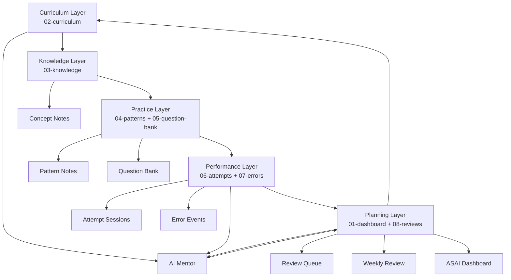

# Aktunotes v2 System Schema

Dokumen ini mendefinisikan arsitektur **Aktunotes v2** untuk planning belajar ASAI selama 1 tahun.

Fokus sistem ini bukan hanya membuat ringkasan materi, tetapi membangun **study operating system** yang bisa:

- menyimpan curriculum secara rapi,
- menghubungkan konsep dengan pola soal,
- mencatat attempt dan performa,
- melacak error berulang,
- mengatur review queue,
- memberi konteks yang cukup untuk AI mentor,
- membantu menentukan kesiapan ujian secara objektif.

Prinsip utama:

> **Markdown/Obsidian adalah core data layer. AI mentor membaca curriculum + performance + errors untuk memberi arahan belajar.**

---

## 1. Tujuan Sistem

Aktunotes v2 dirancang untuk menjawab pertanyaan belajar yang lebih penting daripada sekadar "materi apa yang sudah dibuat?"

Sistem harus bisa menjawab:

- Topik mana yang sudah dipelajari?
- Konsep mana yang benar-benar dikuasai?
- Pola soal mana yang masih lemah?
- Error apa yang paling sering terjadi?
- Apa yang harus direview hari ini?
- Apakah sudah siap mock exam?
- Apakah sudah siap mengambil exam sebenarnya?

Dalam sistem ini, note bukan hanya dokumen pasif. Setiap note menjadi node data yang bisa dibaca oleh manusia dan AI.

---

## 2. Prinsip Arsitektur 5-Layer

Aktunotes v2 menggunakan 5 layer:

```text
Curriculum
-> Knowledge
-> Practice
-> Performance
-> Planning
```

### 2.1 Curriculum Layer

Curriculum layer adalah sumber kebenaran tentang:

- exam yang sedang disiapkan,
- topik yang perlu dipelajari,
- urutan belajar,
- prerequisites,
- bobot relatif,
- status coverage.

Folder utama:

```text
02-curriculum/
```

### 2.2 Knowledge Layer

Knowledge layer menyimpan penjelasan konsep.

Isinya berupa concept note yang:

- exam-oriented,
- notation-correct,
- tidak terlalu panjang,
- punya prerequisite jelas,
- punya link ke pattern dan question bank.

Folder utama:

```text
03-knowledge/
```

### 2.3 Practice Layer

Practice layer menyimpan pola soal dan bank soal.

Isinya:

- pattern note,
- question bank,
- worked examples,
- tagging skill,
- variasi soal.

Folder utama:

```text
04-patterns/
05-question-bank/
```

### 2.4 Performance Layer

Performance layer menyimpan bukti performa.

Isinya:

- attempt log,
- drill session,
- review session,
- mock session,
- error event,
- mastery score.

Folder utama:

```text
06-attempts/
07-errors/
```

### 2.5 Planning Layer

Planning layer mengubah data belajar menjadi keputusan.

Isinya:

- dashboard,
- weekly plan,
- review queue,
- exam roadmap,
- monthly checkpoint.

Folder utama:

```text
01-dashboard/
08-reviews/
```

---

## 3. Repository Structure

Struktur repository yang disarankan:

```text
aktunotes/
|
|-- 00-system/
|   |-- README.md
|   |-- learning-methodology.md
|   |-- mastery-scale.md
|   |-- error-taxonomy.md
|   |-- note-schema.md
|   |-- naming-convention.md
|   |-- source-provenance.md
|   `-- prompt-system/
|       |-- 00-master-prompt.md
|       |-- 01-concept-note-prompt.md
|       |-- 02-pattern-note-prompt.md
|       |-- 03-question-generator-prompt.md
|       |-- 04-error-diagnosis-prompt.md
|       `-- 05-weekly-mentor-prompt.md
|
|-- 01-dashboard/
|   |-- ASAI Dashboard.md
|   |-- Exam Roadmap.md
|   |-- Weekly Plan.md
|   `-- Review Queue.md
|
|-- 02-curriculum/
|   |-- CF1/
|   |-- CF2/
|   |-- CF4/
|   |-- TA1/
|   |-- TA2/
|   `-- TA3/
|
|-- 03-knowledge/
|   |-- CF1/
|   |-- CF2/
|   |-- CF4/
|   |-- TA1/
|   |-- TA2/
|   `-- TA3/
|
|-- 04-patterns/
|   |-- CF1/
|   |-- CF2/
|   |-- CF4/
|   |-- TA1/
|   |-- TA2/
|   `-- TA3/
|
|-- 05-question-bank/
|   |-- CF1/
|   |-- CF2/
|   |-- CF4/
|   |-- TA1/
|   |-- TA2/
|   `-- TA3/
|
|-- 06-attempts/
|   |-- drills/
|   |-- reviews/
|   `-- mocks/
|
|-- 07-errors/
|   |-- Error Log.md
|   |-- CF1 Errors.md
|   |-- CF2 Errors.md
|   |-- CF4 Errors.md
|   |-- TA1 Errors.md
|   |-- TA2 Errors.md
|   `-- TA3 Errors.md
|
|-- 08-reviews/
|   |-- Daily/
|   |-- Weekly/
|   `-- Monthly/
|
`-- 09-sources/
    |-- syllabus/
    |-- references/
    `-- past-exam-index/
```

Catatan:

- Tidak semua folder harus langsung penuh.
- Struktur ini dibuat agar scalable untuk 1 tahun.
- Folder `00-system/` berisi aturan main.
- Folder `01-dashboard/` berisi cockpit belajar.
- Folder `09-sources/` menyimpan provenance, bukan copy-paste sembarang.

---

## 4. Curriculum Schema

Curriculum note adalah index resmi untuk satu exam.

Contoh lokasi:

```text
02-curriculum/CF1/CF1.md
```

Template YAML:

```yaml
---
type: curriculum
exam: CF1
status: active
priority: high
coverage_status: not_started
target_exam_window:
target_completion_date:
source_refs: []
topics: []
linked_knowledge_notes: []
linked_patterns: []
linked_question_sets: []
last_reviewed:
---
```

Template konten:

```markdown
# CF1 Curriculum

## Exam Role

Tuliskan peran exam ini dalam roadmap ASAI.

## Topic Map

| Topic ID | Topic | Status | Priority | Prerequisites | Linked Notes |
|---|---|---|---|---|---|
| CF1-001 |  | not_started |  |  |  |

## Coverage Tracker

| Area | Concept Notes | Pattern Notes | Question Sets | Mastery |
|---|---:|---:|---:|---:|
|  | 0 | 0 | 0 | 0 |

## Dependencies

Tuliskan hubungan dengan exam/topik lain jika relevan.

## Open Gaps

- 
```

Status yang disarankan:

```yaml
status_options:
  - not_started
  - learning
  - practiced
  - reviewing
  - mock_ready
  - exam_ready
```

---

## 5. Concept Note Schema

Concept note adalah unit pengetahuan utama.

Concept note tidak harus menjadi mini textbook. Ia harus cukup jelas untuk memahami konsep, tetapi tetap ringan untuk review.

Contoh lokasi:

```text
03-knowledge/CF1/CF1-001-time-value-of-money.md
```

### 5.1 Concept Note YAML

```yaml
---
type: concept_note
id: CF1-001
exam: CF1
topic:
subtopic:
difficulty: core
status: draft
mastery: 0
importance: high
prerequisites: []
next_topics: []
linked_patterns: []
linked_questions: []
linked_errors: []
source_refs: []
last_reviewed:
next_review:
review_interval_days:
created:
updated:
---
```

### 5.2 Concept Note Content Template

```markdown
# {{topic}}

## 1. Why This Matters

Jelaskan kenapa konsep ini penting untuk exam dan tipe soal apa yang biasanya bergantung padanya.

## 2. Core Intuition

Jelaskan intuisi utama dalam bahasa sederhana.

## 3. Formal Definition

Tuliskan definisi, notation, dan asumsi penting.

## 4. Key Formulae

| Formula | Meaning | When to Use |
|---|---|---|
|  |  |  |

## 5. Step-by-Step Logic

Tuliskan alur logika tanpa lompatan besar.

## 6. Minimal Worked Example

Satu contoh kecil yang cukup untuk menguji pemahaman dasar.

## 7. Common Traps

- 

## 8. Linked Practice

- Patterns:
- Questions:

## 9. Summary

Ringkasan 5-7 bullet yang bisa dibaca ulang cepat.
```

---

## 6. Pattern Note Schema

Pattern note menjawab:

> Kalau konsep ini keluar sebagai soal, bentuknya biasanya seperti apa?

Pattern note tidak menggantikan concept note. Ia mengubah knowledge menjadi exam execution.

Contoh lokasi:

```text
04-patterns/CF1/CF1-P001-equation-of-value.md
```

### 6.1 Pattern Note YAML

```yaml
---
type: pattern_note
id: CF1-P001
exam: CF1
pattern_name:
status: draft
difficulty: core
frequency_estimate:
linked_concepts: []
linked_questions: []
linked_errors: []
skills_tested: []
common_traps: []
source_refs: []
mastery: 0
last_practiced:
next_review:
---
```

### 6.2 Pattern Note Content Template

```markdown
# {{pattern_name}}

## 1. Pattern Recognition

Bagaimana mengenali soal ini?

## 2. Given / Need

| Given | Need |
|---|---|
|  |  |

## 3. Standard Setup

Tuliskan setup standar, diagram waktu jika relevan, dan equation structure.

## 4. Solution Algorithm

1. Identifikasi variabel.
2. Tentukan timeline.
3. Pilih formula.
4. Susun persamaan.
5. Hitung.
6. Lakukan sanity check.

## 5. Worked Example

Contoh exam-typical yang tidak terlalu panjang.

## 6. Variations

| Variation | What Changes | Risk |
|---|---|---|
|  |  |  |

## 7. Common Errors

- 

## 8. Practice Links

- Question set:
- Error log:
```

---

## 7. Question Bank Schema

Question bank menyimpan soal sebagai data terstruktur.

Satu file bisa berisi kumpulan soal untuk satu exam, topic, atau pattern.

Contoh lokasi:

```text
05-question-bank/CF1/CF1-QB-001-time-value-of-money.md
```

Template YAML:

```yaml
---
type: question_bank
id: CF1-QB-001
exam: CF1
topic:
linked_concepts: []
linked_patterns: []
source_refs: []
status: active
question_count: 0
created:
updated:
---
```

Template per soal:

````markdown
## Q{{number}}

```yaml
question_id: CF1-Q0001
exam: CF1
topic:
pattern:
difficulty:
source_ref:
status: active
tags: []
```

### Question

Tuliskan soal.

### Answer

Tuliskan jawaban akhir.

### Solution

Tuliskan solusi ringkas tapi lengkap.

### Examiner Intent

Apa kemampuan yang diuji?

### Traps

- 

### Links

- Concept:
- Pattern:
- Error Events:
```
````

Field penting:

```yaml
question_fields:
  question_id: unique identifier
  exam: exam code
  topic: topic name
  pattern: linked pattern id
  difficulty: core | exam_typical | challenging
  source_ref: provenance source
  tags: skill and error tags
```

---

## 8. Attempt / Session Schema

Attempt/session adalah catatan nyata ketika soal dikerjakan.

Jenis session:

- drill
- review
- mock

Contoh lokasi:

```text
06-attempts/drills/2026-08-20-CF1-drill.md
```

Template YAML:

```yaml
---
type: attempt_session
session_id: 2026-08-20-CF1-drill
date: 2026-08-20
exam: CF1
session_type: drill
duration_minutes:
question_count:
correct_count:
accuracy:
time_pressure: low
linked_questions: []
linked_patterns: []
linked_concepts: []
error_events: []
overall_reflection:
next_actions: []
---
```

Template konten:

```markdown
# 2026-08-20 CF1 Drill

## Session Summary

| Metric | Value |
|---|---:|
| Duration |  |
| Questions |  |
| Correct |  |
| Accuracy |  |

## Attempt Log

| Question | Result | Time | Error Type | Note |
|---|---|---:|---|---|
|  |  |  |  |  |

## What Went Well

- 

## What Failed

- 

## Error Events Created

- 

## Next Actions

- 
```

---

## 9. Error Taxonomy

Error taxonomy harus cukup spesifik untuk membantu diagnosis, tetapi tidak terlalu rumit sampai sulit dipakai.

Kategori utama:

```yaml
error_taxonomy:
  concept:
    description: Salah memahami konsep dasar.
  formula:
    description: Salah memilih, mengingat, atau memanipulasi formula.
  setup:
    description: Salah membangun model, timeline, persamaan, atau struktur penyelesaian.
  calculation:
    description: Salah aritmetika, aljabar, substitusi angka, atau pembulatan.
  interpretation:
    description: Salah membaca pertanyaan, satuan, arah waktu, atau makna hasil.
  time_management:
    description: Jawaban salah atau tidak selesai karena waktu.
  careless:
    description: Kesalahan teknis yang sebenarnya bisa dihindari.
```

Subtag yang disarankan:

```yaml
error_subtags:
  - notation
  - sign
  - unit
  - timeline
  - compounding
  - discounting
  - algebra
  - rounding
  - assumption
  - question_wording
```

---

## 10. Error Event Schema

Error event adalah unit data untuk satu kesalahan nyata.

Contoh lokasi:

```text
07-errors/Error Log.md
```

Template YAML per event:

```yaml
error_id: ERR-2026-08-20-001
date: 2026-08-20
exam: CF1
question_id:
session_id:
linked_concept:
linked_pattern:
error_type: setup
error_subtags: []
severity: medium
root_cause:
fix:
review_status: open
next_review:
```

Template konten:

```markdown
## ERR-2026-08-20-001

| Field | Value |
|---|---|
| Date | 2026-08-20 |
| Exam | CF1 |
| Question |  |
| Concept |  |
| Pattern |  |
| Error Type |  |
| Severity |  |

### What Happened

Deskripsikan kesalahan secara objektif.

### Root Cause

Kenapa kesalahan ini terjadi?

### Fix

Apa aturan praktis agar tidak terulang?

### Review Trigger

Kapan dan bagaimana error ini harus diuji ulang?
```

Severity:

```yaml
severity_scale:
  low: Tidak mengubah jawaban akhir atau mudah diperbaiki.
  medium: Mengubah jawaban akhir tetapi akar masalah lokal.
  high: Menunjukkan kelemahan konsep/pattern yang berulang.
```

---

## 11. Mastery Scale 0-5

Mastery score digunakan di concept note, pattern note, dan dashboard.

```yaml
mastery_scale:
  0:
    label: unseen
    meaning: Belum dipelajari.
  1:
    label: exposed
    meaning: Pernah dibaca, belum bisa mengerjakan soal mandiri.
  2:
    label: assisted
    meaning: Bisa mengikuti solusi, tetapi masih butuh contoh.
  3:
    label: workable
    meaning: Bisa mengerjakan soal standar dengan akurasi cukup.
  4:
    label: reliable
    meaning: Bisa mengerjakan variasi exam-typical dengan stabil.
  5:
    label: exam_ready
    meaning: Cepat, akurat, dan jarang mengulang error.
```

Aturan update mastery:

- Naikkan mastery hanya berdasarkan attempt nyata.
- Jangan beri mastery 4-5 hanya karena sudah membaca note.
- Turunkan mastery jika error berulang muncul pada pattern yang sama.
- Mastery concept dan mastery pattern boleh berbeda.

---

## 12. Exam-Readiness Metrics

Exam readiness bukan feeling. Ia harus dibaca dari beberapa indikator.

Metric utama:

```yaml
exam_readiness_metrics:
  coverage:
    meaning: Persentase topic yang sudah punya concept note dan minimal practice.
  pattern_mastery:
    meaning: Rata-rata mastery pattern penting.
  recent_accuracy:
    meaning: Akurasi dari session terbaru.
  error_recurrence:
    meaning: Jumlah error berulang pada topic/pattern yang sama.
  time_control:
    meaning: Kemampuan menyelesaikan soal dalam batas waktu latihan.
  mock_performance:
    meaning: Hasil mock session jika sudah tersedia.
```

Template readiness table:

```markdown
## Exam Readiness

| Metric | Target | Current | Status |
|---|---:|---:|---|
| Coverage |  |  |  |
| Pattern Mastery |  |  |  |
| Recent Accuracy |  |  |  |
| Error Recurrence |  |  |  |
| Time Control |  |  |  |
| Mock Performance |  |  |  |
```

Status yang disarankan:

```yaml
readiness_status:
  - not_ready
  - foundation_building
  - practice_building
  - mock_ready
  - exam_ready
```

---

## 13. Review Queue

Review queue adalah daftar aktif tentang apa yang harus diulang.

Contoh lokasi:

```text
01-dashboard/Review Queue.md
```

Template YAML:

```yaml
---
type: review_queue
updated:
active_exam_focus: []
review_items: []
---
```

Template konten:

```markdown
# Review Queue

## Due Today

| Item | Type | Exam | Reason | Action |
|---|---|---|---|---|
|  |  |  |  |  |

## This Week

| Item | Type | Exam | Priority | Action |
|---|---|---|---|---|
|  |  |  |  |  |

## Error-Driven Review

| Error | Concept | Pattern | Next Test |
|---|---|---|---|
|  |  |  |  |

## Deferred

| Item | Reason | Revisit Date |
|---|---|---|
|  |  |
```

Review queue harus diprioritaskan dari:

1. error severity high,
2. pattern mastery rendah,
3. concept prerequisite yang menghambat topik lain,
4. item yang sudah lama tidak direview,
5. topik yang dekat dengan target exam.

---

## 14. Weekly Review

Weekly review mengubah data menjadi keputusan minggu berikutnya.

Contoh lokasi:

```text
08-reviews/Weekly/2026-W34-weekly-review.md
```

Template YAML:

```yaml
---
type: weekly_review
week:
date_range:
active_exams: []
sessions_reviewed: []
errors_reviewed: []
key_decisions: []
next_week_focus: []
---
```

Template konten:

```markdown
# Weekly Review - {{week}}

## 1. What Was Planned

- 

## 2. What Actually Happened

| Exam | Planned | Actual | Notes |
|---|---|---|---|
|  |  |  |  |

## 3. Performance Snapshot

| Exam | Questions | Accuracy | Main Weakness |
|---|---:|---:|---|
|  |  |  |  |

## 4. Error Themes

- 

## 5. Mastery Changes

| Item | Old | New | Reason |
|---|---:|---:|---|
|  |  |  |  |

## 6. Next Week Plan

| Focus | Why | Output |
|---|---|---|
|  |  |  |

## 7. AI Mentor Brief

Ringkasan pendek yang bisa diberikan ke AI mentor:

- Current focus:
- Weakest patterns:
- Repeated errors:
- Next decision needed:
```

---

## 15. ASAI Dashboard

Dashboard adalah cockpit utama.

Contoh lokasi:

```text
01-dashboard/ASAI Dashboard.md
```

Template:

```markdown
# ASAI Dashboard

## Current Focus

| Exam | Status | This Week Focus | Readiness |
|---|---|---|---|
| CF1 |  |  |  |
| CF2 |  |  |  |
| CF4 |  |  |  |
| TA1 |  |  |  |
| TA2 |  |  |  |
| TA3 |  |  |  |

## Exam Roadmap

| Exam | Phase | Target Window | Main Risk | Next Milestone |
|---|---|---|---|---|
|  |  |  |  |  |

## Mastery Overview

| Exam | Coverage | Avg Concept Mastery | Avg Pattern Mastery | Status |
|---|---:|---:|---:|---|
|  |  |  |  |  |

## Active Review Queue

![[Review Queue]]

## Recent Sessions

| Date | Exam | Type | Accuracy | Notes |
|---|---|---|---:|---|
|  |  |  |  |  |

## Top Recurring Errors

| Error Type | Exam | Pattern | Count | Action |
|---|---|---|---:|---|
|  |  |  |  |  |

## AI Mentor Context

AI mentor harus membaca:

1. curriculum aktif,
2. dashboard,
3. review queue,
4. attempt session terbaru,
5. error log,
6. mastery scale.
```

---

## 16. Prompt Architecture Modular

Prompt lama tetap berguna, tetapi di Aktunotes v2 prompt dipisah berdasarkan fungsi.

Struktur:

```text
00-system/prompt-system/
|-- 00-master-prompt.md
|-- 01-concept-note-prompt.md
|-- 02-pattern-note-prompt.md
|-- 03-question-generator-prompt.md
|-- 04-error-diagnosis-prompt.md
`-- 05-weekly-mentor-prompt.md
```

### 16.1 Master Prompt

Fungsi:

- menetapkan tone,
- menetapkan exam-oriented standard,
- menetapkan source hierarchy,
- melarang hallucination,
- menjaga format YAML dan Obsidian link.

### 16.2 Concept Note Prompt

Input:

- exam,
- topic,
- syllabus reference,
- source refs,
- prerequisite,
- target depth.

Output:

- concept note,
- YAML metadata,
- links ke pattern potensial,
- traps,
- minimal worked example.

### 16.3 Pattern Note Prompt

Input:

- concept note,
- sample question jika ada,
- known traps,
- target exam style.

Output:

- pattern recognition,
- solution algorithm,
- variations,
- linked questions,
- linked errors.

### 16.4 Question Generator Prompt

Input:

- concept note,
- pattern note,
- difficulty target,
- number of questions.

Output:

- structured question bank,
- answer,
- solution,
- examiner intent,
- trap tags.

### 16.5 Error Diagnosis Prompt

Input:

- question,
- attempted solution,
- correct solution,
- user reflection.

Output:

- error event,
- root cause,
- fix rule,
- review trigger,
- mastery adjustment suggestion.

### 16.6 Weekly Mentor Prompt

Input:

- dashboard,
- weekly review,
- attempt sessions,
- error log,
- review queue.

Output:

- next week focus,
- review priorities,
- weakest patterns,
- readiness judgment,
- suggested drill plan.

---

## 17. Source Provenance

Source provenance wajib agar note bisa dipercaya.

Prinsip:

- Setiap concept note harus punya `source_refs`.
- Setiap question harus punya `source_ref` jika berasal dari sumber tertentu.
- Jika soal dibuat AI, beri source sebagai `ai_generated` dan link ke prompt/session.
- Jangan mencampur sumber asli dan hasil interpretasi tanpa label.
- Jangan mengarang aturan ujian, bobot, atau format exam yang belum tersedia.

Template source entry:

```yaml
source_ref:
  id:
  type: syllabus | reference_book | past_exam | ai_generated | user_note
  title:
  author:
  edition:
  page:
  section:
  url:
  note:
```

Contoh file index:

```text
09-sources/references/source-index.md
```

Template:

```markdown
# Source Index

| Source ID | Type | Title | Scope | Notes |
|---|---|---|---|---|
|  |  |  |  |  |
```

---

## 18. Naming Convention

Naming convention harus stabil agar Obsidian link dan AI parsing tidak kacau.

### 18.1 Folder

Gunakan prefix angka untuk layer:

```text
00-system
01-dashboard
02-curriculum
03-knowledge
04-patterns
05-question-bank
06-attempts
07-errors
08-reviews
09-sources
```

### 18.2 Concept Note

Format:

```text
{exam}-{topic_id}-{slug}.md
```

Contoh:

```text
CF1-001-time-value-of-money.md
```

### 18.3 Pattern Note

Format:

```text
{exam}-P{number}-{slug}.md
```

Contoh:

```text
CF1-P001-equation-of-value.md
```

### 18.4 Question Bank

Format:

```text
{exam}-QB-{number}-{slug}.md
```

Contoh:

```text
CF1-QB-001-time-value-of-money.md
```

### 18.5 Attempt Session

Format:

```text
YYYY-MM-DD-{exam}-{session_type}.md
```

Contoh:

```text
2026-08-20-CF1-drill.md
```

### 18.6 Error ID

Format:

```text
ERR-YYYY-MM-DD-###
```

Contoh:

```text
ERR-2026-08-20-001
```

---

## 19. Relational Model

Aktunotes v2 tetap berbasis Markdown, tetapi secara konseptual punya relational model.

```text
Exam
  has many Topics

Topic
  has many Concept Notes
  has many Pattern Notes
  has many Questions

Concept Note
  links to Prerequisite Concepts
  links to Pattern Notes
  links to Questions
  links to Error Events

Pattern Note
  links to Concepts
  links to Questions
  links to Error Events

Question
  links to Concept
  links to Pattern
  appears in Attempt Sessions
  may generate Error Events

Attempt Session
  contains Questions
  produces Performance Metrics
  produces Error Events

Error Event
  links to Question
  links to Concept
  links to Pattern
  creates Review Queue item

Review Queue
  pulls from due reviews
  pulls from error events
  pulls from weak mastery

Dashboard
  reads curriculum
  reads mastery
  reads sessions
  reads errors
  reads review queue
```

Obsidian implementation:

- Gunakan `[[wikilinks]]` untuk hubungan manual.
- Gunakan YAML list untuk hubungan yang ingin mudah dibaca AI.
- Gunakan Dataview jika ingin query otomatis.
- Jangan bergantung sepenuhnya pada plugin; Markdown tetap harus readable tanpa plugin.

---

## 20. Final Architecture Diagram



Interpretasi diagram:

- Curriculum menentukan apa yang perlu dipelajari.
- Knowledge menjelaskan konsep.
- Practice mengubah konsep menjadi pola soal.
- Performance mencatat bukti kemampuan.
- Planning menentukan tindakan berikutnya.
- AI mentor membaca curriculum, performance, dan errors untuk memberi rekomendasi yang grounded.

---

## 21. Implementation Roadmap Singkat

### Phase 1 - Foundation

Output:

- buat folder repository,
- buat `00-system/`,
- buat mastery scale,
- buat error taxonomy,
- buat naming convention,
- buat source index.

Tujuan:

> Sistem punya aturan main sebelum note diproduksi massal.

### Phase 2 - Curriculum Mapping

Output:

- buat curriculum file untuk CF1, CF2, CF4, TA1, TA2, TA3,
- isi topic map berdasarkan sumber resmi yang tersedia,
- tandai prerequisite dan priority.

Tujuan:

> Tahu scope belajar sebelum mulai generate materi.

### Phase 3 - Knowledge Production

Output:

- buat concept note untuk topik prioritas,
- gunakan YAML schema konsisten,
- hubungkan antar prerequisite.

Tujuan:

> Membangun knowledge base yang ringan, rapi, dan reusable.

### Phase 4 - Pattern & Question Layer

Output:

- buat pattern note dari concept note,
- buat question bank terstruktur,
- tag difficulty dan skills tested.

Tujuan:

> Mengubah pemahaman menjadi kemampuan mengerjakan soal.

### Phase 5 - Performance Tracking

Output:

- mulai attempt/session log,
- buat error event dari setiap kesalahan penting,
- update mastery berdasarkan bukti.

Tujuan:

> Belajar berdasarkan data performa, bukan perasaan.

### Phase 6 - Planning System

Output:

- aktifkan ASAI Dashboard,
- aktifkan Review Queue,
- lakukan Weekly Review,
- gunakan AI mentor untuk rekomendasi mingguan.

Tujuan:

> Sistem mulai memberi arah belajar 1 minggu ke depan.

---

## 22. Operating Philosophy

Aktunotes v2 bukan sekadar kumpulan catatan.

Ia adalah sistem belajar dengan empat key beliefs:

1. **Catatan harus bisa diuji.**  
   Note yang bagus harus terhubung ke pattern dan question.

2. **Latihan harus meninggalkan jejak.**  
   Attempt tanpa log tidak bisa dianalisis.

3. **Error adalah data utama.**  
   Kesalahan berulang lebih penting daripada jumlah halaman yang sudah dibaca.

4. **AI mentor butuh konteks terstruktur.**  
   AI tidak cukup diberi pertanyaan "saya harus belajar apa?" Ia harus membaca curriculum, attempt, mastery, dan errors.

Dengan sistem ini, Markdown/Obsidian tetap menjadi pusat. AI hanya menjadi mentor dan reasoning layer di atas data yang sudah rapi.
