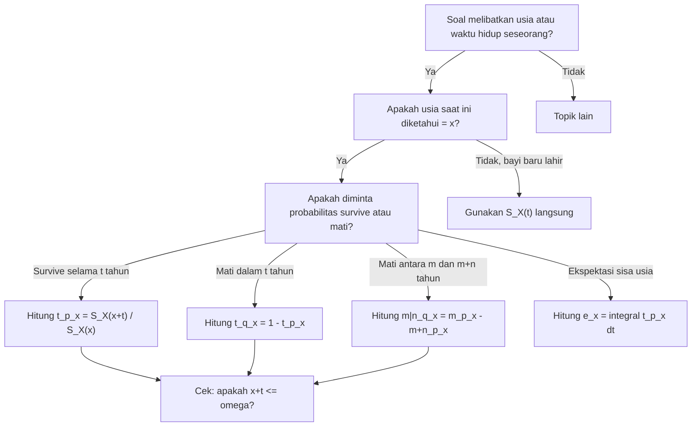

# 📊 1.1 — Survival and Lifetime Variables

> [!ABSTRACT] Ringkasan Cepat
> **Topik:** Survival and Lifetime Variables | **Bobot:** ~15–25% | **Difficulty:** Medium
> **Ref:** London (1997) Bab 1–2; Frees (2010) Bab 14 | **Prereq:** None

---

## Section 0 — Pemetaan Topik

| Topik TA1 | Sub-topik ID | Skill Diuji | Bobot | Difficulty | Prerequisite | Connected Topics | Referensi |
|---|---|---|---|---|---|---|---|
| Analisis Survival | 1.1 | Mendefinisikan variabel acak $T_x$, sisa usia, dan relasi antar fungsi dasar survival | 15–25% | Medium | None | [[1.2 Survival and Hazard Functions]], [[1.3 Curtate Future Lifetime]] | London (1997) Bab 1–2; Frees (2010) Bab 14 |

---

## Section 1 — Intuisi

Bayangkan sebuah perusahaan asuransi jiwa ingin menghitung premi yang adil untuk nasabahnya. Agar bisa melakukan itu, perusahaan perlu menjawab satu pertanyaan mendasar: *berapa lama lagi seseorang yang sudah berusia $x$ tahun akan hidup?* Inilah inti dari analisis survival — bukan sekadar "apakah seseorang akan meninggal" (karena jawabannya pasti ya), melainkan *kapan* dan *seberapa besar peluang* ia masih hidup pada titik waktu tertentu.

Di dunia nyata, setiap orang lahir dan pada akhirnya meninggal. Jika kita membayangkan semua bayi yang baru lahir di suatu negara tahun ini, masing-masing dari mereka membawa "jam biologis" yang berbeda — ada yang hidup 40 tahun, ada yang 85 tahun, ada pula yang hanya beberapa bulan. Statistikawan dan aktuaris memodelkan ketidakpastian ini dengan mendefinisikan *usia saat meninggal* sebagai sebuah variabel acak. Dengan cara ini, kita bisa berbicara secara matematis tentang distribusi usia kematian di suatu populasi.

Konsep *sisa usia* muncul ketika kita memfokuskan perhatian bukan pada bayi baru lahir, melainkan pada seseorang yang sudah berusia $x$ tahun dan masih hidup. Pertanyaannya bergeser menjadi: berapa tahun lagi ia akan bertahan? Sisa usia ini adalah kuantitas yang langsung relevan untuk penetapan premi asuransi jiwa, anuitas pensiun, dan berbagai produk keuangan yang bergantung pada kelangsungan hidup seseorang. Memahami cara mendefinisikan dan memanipulasi variabel acak ini adalah fondasi dari seluruh analisis survival dalam aktuaria.

---

## Section 2 — Definisi Formal

> [!NOTE] Definisi Matematis
> Misalkan $X$ adalah variabel acak usia saat meninggal (*age-at-death*) untuk individu baru lahir, dengan $X \geq 0$. Untuk individu yang saat ini berusia $x$ tahun, **sisa usia masa depan** (*future lifetime*) didefinisikan sebagai:
>
> $$
> T_x = X - x \mid X > x
> $$
>
> yaitu usia saat meninggal dikurangi usia sekarang, *diberikan bahwa individu masih hidup pada usia $x$*.

| Simbol | Makna | Catatan |
|---|---|---|
| $X$ | Variabel acak usia saat meninggal (age-at-death) untuk newborn | $X \geq 0$, kontinu |
| $\omega$ | Batas usia maksimum (*limiting age*) | Untuk model De Moivre: $0 \leq X \leq \omega$ |
| $x$ | Usia saat ini yang sudah pasti (deterministic) | $0 \leq x < \omega$ |
| $T_x$ | Variabel acak sisa usia masa depan untuk $(x)$ | $T_x \geq 0$, kontinu |
| $(x)$ | Notasi untuk individu berusia tepat $x$ tahun | Shorthand aktuaria |
| $t$ | Panjang periode waktu ke depan | $t \geq 0$ |
| ${}_{t}p_x$ | Probabilitas $(x)$ masih hidup setelah $t$ tahun | ${}_{t}p_x = P(T_x > t)$ |
| ${}_{t}q_x$ | Probabilitas $(x)$ meninggal dalam $t$ tahun ke depan | ${}_{t}q_x = 1 - {}_{t}p_x$ |
| $p_x$ | Shorthand untuk ${}_{1}p_x$ | Probabilitas hidup 1 tahun |
| $q_x$ | Shorthand untuk ${}_{1}q_x$ | Probabilitas meninggal dalam 1 tahun |

### Rumus Utama

**Fungsi distribusi kumulatif sisa usia:**

$$
F_{T_x}(t) = P(T_x \leq t) = {}_{t}q_x, \quad t \geq 0
$$

**Label:** Peluang $(x)$ meninggal sebelum atau tepat pada $t$ tahun ke depan.

**Fungsi densitas probabilitas sisa usia:**

$$
f_{T_x}(t) = \frac{d}{dt} F_{T_x}(t) = \frac{d}{dt} {}_{t}q_x, \quad t \geq 0
$$

**Label:** Kepadatan probabilitas kematian pada saat tepat $t$ tahun setelah usia $x$.

**Relasi kondisional antara $T_0 = X$ dan $T_x$:**

$$
{}_{t}p_x = P(T_x > t) = P(X > x + t \mid X > x) = \frac{P(X > x + t)}{P(X > x)} = \frac{S_X(x+t)}{S_X(x)}
$$

**Label:** Probabilitas survival selama $t$ tahun lagi, dinyatakan dalam fungsi survival usia-at-death $S_X$.

**Aturan perkalian probabilitas survival (*chain rule*):**

$$
{}_{t+u}p_x = {}_{t}p_x \cdot {}_{u}p_{x+t}
$$

**Label:** Untuk hidup $t + u$ tahun, seseorang harus hidup $t$ tahun pertama, lalu hidup $u$ tahun berikutnya dari usia $x+t$.

**Ekspektasi sisa usia (*complete future lifetime*):**

$$
\mathring{e}_x = E[T_x] = \int_0^{\infty} t \, f_{T_x}(t) \, dt = \int_0^{\infty} {}_{t}p_x \, dt
$$

**Label:** Ekspektasi sisa usia $(x)$, menggunakan identitas integrasi untuk variabel non-negatif.

### Asumsi Eksplisit

1. Populasi yang dianalisis bersifat homogen — semua individu berusia $x$ diasumsikan memiliki distribusi sisa usia yang identik.
2. Variabel $T_x$ adalah variabel acak kontinu (waktu kematian bisa terjadi kapan saja, bukan hanya pada akhir tahun).
3. $P(X > 0) = 1$ — semua individu lahir hidup.
4. $\lim_{t \to \infty} {}_{t}p_x = 0$ — semua individu pada akhirnya meninggal (tidak ada immortality).
5. $S_X(x) > 0$ untuk seluruh usia $x$ dalam domain yang dipertimbangkan, agar kondisional terdefinisi.

---

## Section 3 — Jembatan Logika

> [!TIP] Dari Definisi ke Rumus
> Mengapa ${}_{t}p_x = S_X(x+t) / S_X(x)$? Intuisinya sederhana: kita ingin tahu peluang seseorang yang *sudah* berusia $x$ masih hidup $t$ tahun lagi. Ini adalah probabilitas bersyarat — dari seluruh individu yang berhasil mencapai usia $x$, berapa proporsinya yang juga mencapai usia $x+t$? Di penyebut ada $P(X > x)$, yaitu proporsi yang sudah lolos sampai usia $x$. Di pembilang ada $P(X > x+t)$, yaitu proporsi yang lolos sampai usia $x+t$. Hasil baginya persis adalah peluang kondisional yang kita inginkan.

> [!IMPORTANT] Support dan Domain
> - $T_x$ memiliki support $[0, \omega - x)$ jika ada batas usia $\omega$, atau $[0, \infty)$ jika tidak ada batas.
> - $x$ adalah tetapan (bukan variabel acak) — usia saat ini sudah diketahui pasti.
> - Kondisi $X > x$ membuat $T_x$ merupakan distribusi **bersyarat**, bukan distribusi tak bersyarat dari $X$.

**Derivasi Rumus Ekspektasi Sisa Usia:**

**Langkah 1:** Mulai dari definisi ekspektasi untuk variabel acak kontinu non-negatif.

$$
\mathring{e}_x = E[T_x] = \int_0^{\infty} t \, f_{T_x}(t) \, dt
$$

**Langkah 2:** Terapkan integrasi per bagian (*integration by parts*) dengan $u = t$ dan $dv = f_{T_x}(t) \, dt$, sehingga $du = dt$ dan $v = -{}_{t}p_x$ (karena $\frac{d}{dt}[{}_{t}p_x] = -f_{T_x}(t)$ untuk model kontinu tanpa *mass points*).

$$
\mathring{e}_x = \left[-t \cdot {}_{t}p_x\right]_0^{\infty} + \int_0^{\infty} {}_{t}p_x \, dt
$$

**Langkah 3:** Evaluasi suku batas. Suku pertama pada $t = 0$ adalah $0$. Suku pertama saat $t \to \infty$: karena $\lim_{t \to \infty} t \cdot {}_{t}p_x = 0$ (asumsi standar bahwa sisa usia memiliki momen pertama yang berhingga), suku ini hilang.

$$
\mathring{e}_x = 0 + \int_0^{\infty} {}_{t}p_x \, dt = \int_0^{\infty} {}_{t}p_x \, dt
$$

**Langkah 4:** Hasil akhir — ekspektasi sisa usia sama dengan integral fungsi survival ${}_{t}p_x$ terhadap $t$.

$$
\boxed{\mathring{e}_x = \int_0^{\infty} {}_{t}p_x \, dt}
$$

Ini sangat berguna karena seringkali ${}_{t}p_x$ lebih mudah dihitung daripada $f_{T_x}(t)$ secara langsung.

> [!DANGER] Dilarang
> 1. **Jangan** menyamakan $T_x$ dengan $X$. Variabel $X$ adalah usia saat meninggal (dari lahir), sedangkan $T_x = X - x$ adalah *sisa* usia dari titik saat ini. Mereka berbeda distribusi!
> 2. **Jangan** lupa kondisional $X > x$ dalam definisi $T_x$. Tanpa kondisional ini, $T_x$ tidak terdefinisi dengan benar untuk individu yang sudah berusia $x$.
> 3. **Jangan** membalik pembilang dan penyebut dalam rumus ${}_{t}p_x = S_X(x+t)/S_X(x)$. Pembilang selalu mengandung usia yang *lebih tua* ($x+t$), karena proporsi yang hidup lebih lama selalu lebih kecil.

---

## Section 4 — Contoh Soal

### Soal A — Fundamental

**Soal:** Diketahui bahwa distribusi usia saat meninggal $X$ mengikuti model De Moivre dengan batas usia $\omega = 100$, sehingga $S_X(t) = 1 - t/100$ untuk $0 \leq t \leq 100$. Hitunglah ${}_{10}p_{40}$, yaitu probabilitas seseorang berusia 40 tahun masih hidup setelah 10 tahun.

> [!SUCCESS] Solusi Soal A
> **Pendekatan:** Terapkan langsung rumus ${}_{t}p_x = S_X(x+t)/S_X(x)$ dengan $x = 40$, $t = 10$.
>
> **1. Identifikasi Variabel**
> - $\omega = 100$ (batas usia)
> - $x = 40$ (usia saat ini)
> - $t = 10$ (periode yang ditanyakan)
> - $S_X(s) = 1 - s/100$ untuk $0 \leq s \leq 100$
>
> **2. Identifikasi Distribusi / Model**
> Model De Moivre: $X \sim \text{Uniform}(0, 100)$, sehingga $S_X(s) = (100 - s)/100$.
>
> **3. Setup Persamaan**
>
> $$
> {}_{10}p_{40} = \frac{S_X(40 + 10)}{S_X(40)} = \frac{S_X(50)}{S_X(40)}
> $$
>
> **4. Eksekusi Aljabar**
>
> $$
> S_X(50) = 1 - \frac{50}{100} = 0.50
> $$
>
> $$
> S_X(40) = 1 - \frac{40}{100} = 0.60
> $$
>
> $$
> {}_{10}p_{40} = \frac{0.50}{0.60} = \frac{5}{6} \approx 0.8333
> $$
>
> **5. Verification**
> Untuk De Moivre dengan $\omega = 100$: ${}_{t}p_x = (\omega - x - t)/(\omega - x) = (100-40-10)/(100-40) = 50/60 = 5/6$. ✓ Konsisten.
>
> **Hasil:** ${}_{10}p_{40} = 5/6 \approx 83.33\%$. Artinya seseorang berusia 40 tahun memiliki peluang sekitar 83.3% untuk masih hidup di usia 50 tahun, sesuai model De Moivre $\omega = 100$.

> [!WARNING] Exam Tips — Soal A
> **Target waktu:** 2 menit. **Common trap:** Lupa bahwa pembilang adalah $S_X(x+t)$, bukan $S_X(t)$. Harus substitusi $x+t = 50$, bukan $t = 10$. **Shortcut:** Untuk De Moivre, ${}_{t}p_x = (\omega - x - t)/(\omega - x)$ langsung tanpa menghitung $S_X$ terpisah.

---

### Soal B — Exam-Typical

**Soal:** Fungsi survival usia saat meninggal suatu populasi diberikan oleh $S_X(x) = e^{-0.02x}$ untuk $x \geq 0$ (model *constant force of mortality*). Seseorang berusia 30 tahun dipilih secara acak. Hitunglah:
(a) ${}_{20}p_{30}$ — probabilitas masih hidup 20 tahun lagi
(b) ${}_{10\mid 10}q_{30}$ — probabilitas meninggal antara usia 40 dan 50

> [!SUCCESS] Solusi Soal B
> **Pendekatan:** Gunakan ${}_{t}p_x = S_X(x+t)/S_X(x)$ untuk bagian (a), lalu gunakan relasi ${}_{m\mid n}q_x = {}_{m}p_x - {}_{m+n}p_x$ untuk bagian (b).
>
> **1. Identifikasi Variabel**
> - $S_X(x) = e^{-0.02x}$, model eksponensial dengan *force of mortality* $\mu = 0.02$
> - $x = 30$, $t = 20$ (untuk bagian a), $m = 10$, $n = 10$ (untuk bagian b)
>
> **2. Identifikasi Distribusi / Model**
> $X \sim \text{Exponential}(\mu = 0.02)$. Sifat kunci: *memoryless* — $T_x$ memiliki distribusi yang sama untuk semua $x$.
>
> **3. Setup Persamaan**
>
> $$
> {}_{t}p_x = \frac{S_X(x+t)}{S_X(x)} = \frac{e^{-0.02(x+t)}}{e^{-0.02x}} = e^{-0.02t}
> $$
>
> $$
> {}_{m\mid n}q_x = {}_{m}p_x - {}_{m+n}p_x
> $$
>
> **4. Eksekusi Aljabar**
>
> **(a)**
>
> $$
> {}_{20}p_{30} = e^{-0.02 \times 20} = e^{-0.4} \approx 0.6703
> $$
>
> **(b)**
>
> $$
> {}_{10}p_{30} = e^{-0.02 \times 10} = e^{-0.2} \approx 0.8187
> $$
>
> $$
> {}_{20}p_{30} = e^{-0.4} \approx 0.6703 \quad \text{(dari bagian a)}
> $$
>
> $$
> {}_{10\mid 10}q_{30} = {}_{10}p_{30} - {}_{20}p_{30} = e^{-0.2} - e^{-0.4} \approx 0.8187 - 0.6703 = 0.1484
> $$
>
> **5. Verification**
> Karena model eksponensial bersifat *memoryless*, ${}_{20}p_{30} = {}_{20}p_0 = e^{-0.4}$, tidak bergantung pada $x = 30$. ✓ Nilai ${}_{10\mid 10}q_{30} \approx 14.84\%$ masuk akal — ini peluang meninggal di dekade 40-an.
>
> **Hasil:** (a) ${}_{20}p_{30} = e^{-0.4} \approx 67.03\%$; (b) ${}_{10\mid 10}q_{30} = e^{-0.2} - e^{-0.4} \approx 14.84\%$.

> [!WARNING] Exam Tips — Soal B
> **Target waktu:** 3–4 menit. **Common trap:** Menghitung ${}_{10\mid 10}q_{30}$ dengan $q_{40} \times {}_{10}p_{30}$ alih-alih menggunakan rumus deferred mortality langsung. Keduanya ekuivalen, tetapi cara pertama lebih mudah salah jika $q_{40}$ dihitung salah. **Shortcut:** Untuk model eksponensial, ${}_{t}p_x = e^{-\mu t}$ tidak bergantung pada $x$ — manfaatkan *memoryless property* ini.

---

### Soal C — Challenging

**Soal:** Misalkan fungsi survival diberikan oleh $S_X(x) = \left(1 - \frac{x}{80}\right)^2$ untuk $0 \leq x \leq 80$.
(a) Verifikasi bahwa ini adalah fungsi survival yang valid.
(b) Tentukan fungsi densitas $f_{T_{20}}(t)$ untuk sisa usia individu berusia 20 tahun.
(c) Hitung ekspektasi sisa usia $\mathring{e}_{20}$.

> [!SUCCESS] Solusi Soal C
> **Pendekatan:** (a) Cek tiga syarat fungsi survival. (b) Turunkan ${}_{t}p_{20}$ dulu, lalu diferensiasikan. (c) Gunakan rumus $\mathring{e}_x = \int_0^{\infty} {}_{t}p_x \, dt$.
>
> **1. Identifikasi Variabel**
> - $S_X(x) = (1 - x/80)^2$, domain $[0, 80]$, sehingga $\omega = 80$
> - $x = 20$, sisa usia memiliki domain $[0, 60]$
>
> **2. Identifikasi Distribusi / Model**
> Ini adalah model *power* (atau De Moivre yang digeneralisasi). $S_X$ berbentuk pangkat dua dari fungsi linear.
>
> **3. Setup Persamaan**
>
> **(a) Cek validitas:**
>
> $$
> S_X(0) = 1, \quad S_X(80) = 0, \quad \frac{d}{dx}S_X(x) = -\frac{2}{80}\left(1 - \frac{x}{80}\right) \leq 0
> $$
>
> **(b) Fungsi densitas $T_{20}$:**
>
> $$
> {}_{t}p_{20} = \frac{S_X(20+t)}{S_X(20)}, \quad 0 \leq t \leq 60
> $$
>
> $$
> f_{T_{20}}(t) = -\frac{d}{dt} {}_{t}p_{20}
> $$
>
> **(c) Ekspektasi:**
>
> $$
> \mathring{e}_{20} = \int_0^{60} {}_{t}p_{20} \, dt
> $$
>
> **4. Eksekusi Aljabar**
>
> **(a)**
>
> $S_X(0) = (1 - 0)^2 = 1$ ✓; $S_X(80) = (1 - 80/80)^2 = 0$ ✓; turunannya negatif ✓. Fungsi survival valid.
>
> **(b)**
>
> $$
> S_X(20) = \left(1 - \frac{20}{80}\right)^2 = \left(\frac{60}{80}\right)^2 = \frac{9}{16}
> $$
>
> $$
> S_X(20+t) = \left(1 - \frac{20+t}{80}\right)^2 = \left(\frac{60-t}{80}\right)^2
> $$
>
> $$
> {}_{t}p_{20} = \frac{(60-t)^2/80^2}{9/16} = \frac{(60-t)^2}{80^2} \cdot \frac{16}{9} = \frac{(60-t)^2}{3600}, \quad 0 \leq t \leq 60
> $$
>
> $$
> f_{T_{20}}(t) = -\frac{d}{dt} \left[\frac{(60-t)^2}{3600}\right] = -\frac{2(60-t)(-1)}{3600} = \frac{2(60-t)}{3600} = \frac{60-t}{1800}
> $$
>
> **(c)**
>
> $$
> \mathring{e}_{20} = \int_0^{60} \frac{(60-t)^2}{3600} \, dt
> $$
>
> Substitusi $u = 60 - t$, $du = -dt$, batas: $t=0 \Rightarrow u=60$, $t=60 \Rightarrow u=0$:
>
> $$
> \mathring{e}_{20} = \int_0^{60} \frac{u^2}{3600} \, du = \frac{1}{3600} \cdot \frac{u^3}{3}\Bigg|_0^{60} = \frac{60^3}{10800} = \frac{216000}{10800} = 20 \text{ tahun}
> $$
>
> **5. Verification**
> Untuk model De Moivre yang digeneralisasi $S_X(x) = (1-x/\omega)^\alpha$, ekspektasi sisa usia adalah $\mathring{e}_x = (\omega - x)/(\alpha + 1)$. Di sini $\omega = 80$, $x = 20$, $\alpha = 2$: $\mathring{e}_{20} = 60/3 = 20$. ✓
>
> **Hasil:** Fungsi survival valid; $f_{T_{20}}(t) = (60-t)/1800$ untuk $0 \leq t \leq 60$; $\mathring{e}_{20} = 20$ tahun.

> [!WARNING] Exam Tips — Soal C
> **Target waktu:** 5–6 menit. **Common trap:** Lupa bahwa domain $T_{20}$ adalah $[0, 60]$, bukan $[0, 80]$. Seseorang berusia 20 hanya bisa hidup maksimal $80 - 20 = 60$ tahun lagi. **Shortcut:** Setelah mendapat ${}_{t}p_x$, gunakan formula ekspektasi integral langsung — seringkali lebih cepat daripada menggunakan $f_{T_x}(t)$.

---

## Section 5 — Verifikasi & Sanity Check

> [!CHECK] Cek Konsistensi Probabilitas
> Untuk semua $x$ dan $t \geq 0$ yang valid, harus berlaku:
> $$
> 0 \leq {}_{t}p_x \leq 1, \quad {}_{t}p_x + {}_{t}q_x = 1
> $$
> Jika hasil ${}_{t}p_x > 1$ atau negatif, pasti ada kesalahan dalam penghitungan $S_X$.

> [!CHECK] Cek Aturan Perkalian
> Cek aturan *chain rule*: untuk tiga usia $x < x+t < x+t+u$,
>
> $$
> {}_{t+u}p_x = {}_{t}p_x \cdot {}_{u}p_{x+t}
> $$
>
> Misalnya: ${}_{20}p_{30} = {}_{10}p_{30} \times {}_{10}p_{40}$. Jika dua cara berbeda memberikan hasil yang sama, kalkulasi konsisten.

> [!CHECK] Cek Batas Ekspektasi
> Ekspektasi sisa usia harus memenuhi:
>
> $$
> 0 < \mathring{e}_x \leq \omega - x
> $$
>
> Jika model punya *limiting age* $\omega$, maka $\mathring{e}_x$ tidak mungkin melebihi $\omega - x$ (usia tersisa maksimum). Sebagai patokan kasar: untuk populasi umum, $\mathring{e}_{0} \approx 70\text{–}80$ tahun.

### Metode Alternatif — Ekspektasi via PDF

Selain $\mathring{e}_x = \int_0^{\infty} {}_{t}p_x \, dt$, ekspektasi bisa dihitung langsung:

$$
\mathring{e}_x = \int_0^{\infty} t \, f_{T_x}(t) \, dt
$$

Pilih metode mana yang lebih mudah bergantung pada bentuk yang lebih sederhana antara ${}_{t}p_x$ dan $f_{T_x}(t)$.

---

## Section 6 — Visualisasi Mental

**Hubungan antar variabel dalam kerangka survival:**

Bayangkan sumbu waktu yang dimulai dari $t = 0$ (saat usia $x$). Sumbu $Y$ merepresentasikan proporsi individu yang masih hidup:

- Kurva ${}_{t}p_x$ dimulai dari $1$ pada $t = 0$ dan turun secara monoton menuju $0$ saat $t \to \infty$ (atau $t = \omega - x$).
- Kurva ini *cembung ke atas* (*convex*) untuk banyak model populasi manusia: awalnya penurunan lambat (orang muda jarang mati), lalu semakin cepat di usia tua.
- Luas di bawah kurva ${}_{t}p_x$ dari $t = 0$ hingga $\infty$ persis sama dengan $\mathring{e}_x$ — ekspektasi sisa usia.
- Nilai $f_{T_x}(t)$ adalah kemiringan negatif dari kurva ${}_{t}p_x$: di mana kurva turun tajam, densitas kematian tinggi.

```
{}_{t}p_x
1.0 |***
    |   ***
    |      ***
    |         ****
    |             *****
    |                  ******
0.0 |__________________________ t
    0     10     20     30     60

Luas di bawah kurva = e_x (ekspektasi sisa usia)
```

### Hubungan Visual ↔ Rumus

| Elemen Visual | Komponen Rumus |
|---|---|
| Nilai awal kurva = 1 | ${}_{0}p_x = 1$ (pasti hidup saat ini) |
| Nilai akhir kurva → 0 | $\lim_{t \to \infty} {}_{t}p_x = 0$ |
| Kemiringan kurva di titik $t$ | $-f_{T_x}(t)$ (densitas kematian) |
| Luas total di bawah kurva | $\mathring{e}_x = \int_0^{\infty} {}_{t}p_x \, dt$ |
| Titik di mana kurva = 0.5 | *Median* sisa usia |

---

## Section 7 — Jebakan Umum

> [!BUG] Kesalahan Parametrisasi
> **Salah:** Menggunakan ${}_{t}p_x = S_X(t)$ langsung tanpa kondisional.
> **Benar:** ${}_{t}p_x = S_X(x+t) / S_X(x)$. Fungsi $S_X(t)$ adalah survival untuk *newborn*, sedangkan ${}_{t}p_x$ adalah survival kondisional untuk seseorang yang sudah berusia $x$.

> [!BUG] Kesalahan Konseptual
> 1. **$X$ bukan $T_x$:** $X$ adalah usia saat meninggal (dari lahir), $T_x = X - x$ adalah sisa usia. Distribusinya berbeda kecuali untuk model eksponensial yang *memoryless*.
> 2. **${}_{t}q_x$ bukan $1 - S_X(t)$:** Rumus yang benar adalah ${}_{t}q_x = 1 - {}_{t}p_x = 1 - S_X(x+t)/S_X(x)$.
> 3. **Domain $T_x$ bukan $[0, \omega]$:** Domain sisa usia adalah $[0, \omega - x]$, bukan $[0, \omega]$.
> 4. **$\mathring{e}_x$ bukan $E[X] - x$:** Karena $T_x$ adalah distribusi *kondisional* (bukan $X - x$ tanpa syarat), hubungan $\mathring{e}_x = E[X] - x$ hanya berlaku jika $X$ dan kondisi $X > x$ tidak mengubah distribusi (seperti model eksponensial).

> [!BUG] Kesalahan Interpretasi Soal
> - Kata **"masih hidup dalam $t$ tahun"** = ${}_{t}p_x$ (survive at least $t$ years).
> - Kata **"meninggal dalam $t$ tahun ke depan"** = ${}_{t}q_x$.
> - Kata **"meninggal antara $m$ dan $m+n$ tahun"** = ${}_{m\mid n}q_x = {}_{m}p_x - {}_{m+n}p_x$ (*deferred mortality*).
> - Kata **"meninggal tepat pada tahun ke-$t$"** dalam konteks diskrit = ${}_{t-1}p_x \cdot q_{x+t-1}$.

> [!CAUTION] Red Flags
> - Jika soal menyebut **"usia saat ini $x$"** dan **"waktu $t$ ke depan"**, pastikan substitusi ke fungsi adalah $S_X(x+t)$, bukan $S_X(t)$.
> - Jika ada **batas usia $\omega$**, cek apakah $x + t \leq \omega$ sebelum mengklaim ${}_{t}p_x > 0$.
> - Kata **"complete future lifetime"** = variabel kontinu $T_x$; kata **"curtate future lifetime"** = variabel diskrit $K_x = \lfloor T_x \rfloor$ (lihat [[1.3 Curtate Future Lifetime]]).

---

## Section 8 — Ringkasan Eksekutif

> [!SUMMARY] Must-Remember
> 1. **Definisi sisa usia:** $T_x = X - x \mid X > x$, dengan support $[0, \omega - x)$.
>
> 2. **Rumus survival kondisional:**
> $${}_{t}p_x = \frac{S_X(x+t)}{S_X(x)} = P(T_x > t)$$
>
> 3. **Chain rule:**
> $${}_{t+u}p_x = {}_{t}p_x \cdot {}_{u}p_{x+t}$$
>
> 4. **Deferred mortality:**
> $${}_{m\mid n}q_x = {}_{m}p_x - {}_{m+n}p_x$$
>
> 5. **Ekspektasi sisa usia:**
> $$\mathring{e}_x = \int_0^{\infty} {}_{t}p_x \, dt$$

### Kapan Digunakan

- Soal yang menyebut "probabilitas seseorang berusia $x$ masih hidup setelah $t$ tahun" → gunakan ${}_{t}p_x$.
- Soal yang meminta ekspektasi usia hidup seseorang yang sudah berusia $x$ → gunakan $\mathring{e}_x$.
- Soal yang memberikan $S_X(x)$ dan meminta ${}_{t}p_x$ atau $f_{T_x}$ → pakai rumus kondisional.
- Soal yang meminta peluang meninggal dalam rentang waktu tertentu → pakai *deferred mortality* ${}_{m\mid n}q_x$.

### Kapan TIDAK Boleh Digunakan

- Jika soal meminta **diskrit** (tahun ke berapa meninggal) → beralih ke [[1.3 Curtate Future Lifetime]] untuk $K_x = \lfloor T_x \rfloor$.
- Jika soal menyangkut **estimasi non-parametrik dari data** → beralih ke [[1.5 Censoring and Non-Parametric Estimation]] (Kaplan-Meier).
- Jika soal menyangkut **multiple states** (misalnya sakit/sehat/meninggal) → beralih ke [[2.1 Multiple State and Markov Models]].

### Quick Decision Tree



---

> [!QUOTE] Follow-up Options
> 1. *"Berikan contoh soal variasi dengan model Gompertz atau Makeham"*
> 2. *"Jelaskan hubungan [[1.1 Survival and Lifetime Variables]] dengan [[1.2 Survival and Hazard Functions]]"*
> 3. *"Buat flashcard 1-halaman untuk topik ini"*

*📖 Ref: London (1997) Bab 1–2; Frees (2010) Bab 14 | 🗓️ 2026-04-19 | #TA1 #AnalisisSurvival*
