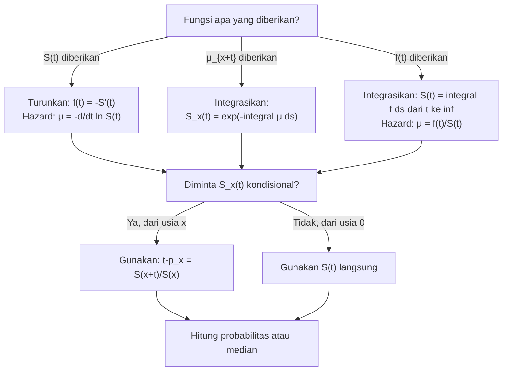

# 📊 1.2 — Survival and Hazard Functions

> [!ABSTRACT] Ringkasan Cepat
> **Topik:** Survival and Hazard Functions | **Bobot:** ~15–25% | **Difficulty:** Medium
> **Ref:** London (1997) Bab 1–3; Frees (2010) Bab 14 | **Prereq:** [[1.1 Survival and Lifetime Variables]]

---

## Section 0 — Pemetaan Topik

| Topik TA1 | Sub-topik ID | Skill Diuji | Bobot | Difficulty | Prerequisite | Connected Topics | Referensi |
|---|---|---|---|---|---|---|---|
| Analisis Survival | 1.2 | Mendefinisikan dan menghubungkan $S(t)$, $f(t)$, $F(t)$, $\mu_x$; konversi antar fungsi | 15–25% | Medium | [[1.1 Survival and Lifetime Variables]] | [[1.3 Curtate Future Lifetime]], [[1.4 Parametric Survival Models]], [[1.5 Censoring and Non-Parametric Estimation]] | London (1997) Bab 1–3; Frees (2010) Bab 14 |

---

## Section 1 — Intuisi

Bayangkan sebuah perusahaan asuransi jiwa ingin memahami berapa lama rata-rata nasabahnya akan hidup setelah membeli polis. Untuk menjawab pertanyaan ini, aktuaris perlu alat matematis yang dapat menggambarkan "peluang seseorang masih hidup hingga usia tertentu". Alat inilah yang disebut **fungsi survival** — suatu fungsi yang menjawab: "Berapa probabilitas seseorang yang kini berusia $x$ akan bertahan hidup setidaknya $t$ tahun lagi?"

Namun peluang bertahan hidup saja tidak cukup. Bayangkan dua populasi yang memiliki peluang bertahan hidup hingga usia 50 tahun yang sama, tetapi satu populasi memiliki risiko kematian yang sangat tinggi antara usia 40–45, sementara yang lain risikonya tersebar merata. Untuk membedakan keduanya, aktuaris menggunakan **fungsi hazard** (atau dalam konteks aktuaria: *force of mortality*, $\mu_x$) — yaitu laju kematian sesaat pada setiap titik waktu. Fungsi ini menjawab: "Seberapa cepat individu yang masih hidup saat ini menghadapi risiko kematian dalam rentang waktu yang sangat singkat?"

Keindahan kerangka ini terletak pada kenyataan bahwa keempat fungsi — fungsi distribusi $F(t)$, fungsi densitas $f(t)$, fungsi survival $S(t)$, dan fungsi hazard $\mu_x$ — semuanya saling terhubung dan dapat diturunkan satu dari yang lain. Penguasaan hubungan antar fungsi ini adalah kunci utama dalam analisis survival, karena soal ujian sering kali memberikan satu fungsi dan meminta fungsi lainnya.

---

## Section 2 — Definisi Formal

> [!NOTE] Definisi Matematis Inti
> Misalkan $T_x$ adalah variabel acak sisa usia individu yang kini berusia $x$ (yaitu, waktu hingga kematian). Fungsi survival didefinisikan sebagai:
>
> $$S_x(t) = \Pr(T_x > t) = {}_t p_x$$
>
> yang menyatakan probabilitas seseorang berusia $x$ akan bertahan hidup minimal $t$ tahun lagi.

### Tabel Variabel & Parameter

| Simbol | Makna | Catatan |
|---|---|---|
| $T_x$ | Variabel acak sisa usia individu berusia $x$ | $T_x \geq 0$ |
| $t$ | Waktu (dalam tahun) | $t \geq 0$ |
| $S_x(t) = {}_t p_x$ | Fungsi survival: $\Pr(T_x > t)$ | Monoton turun, $S_x(0) = 1$, $\lim_{t\to\infty} S_x(t) = 0$ |
| $F_x(t) = {}_t q_x$ | Fungsi distribusi kumulatif: $\Pr(T_x \leq t)$ | $F_x(t) = 1 - S_x(t)$ |
| $f_x(t)$ | Fungsi densitas probabilitas (pdf) sisa usia | $f_x(t) = \frac{d}{dt} F_x(t) = -\frac{d}{dt} S_x(t)$ |
| $\mu_{x+t}$ | Fungsi hazard (*force of mortality*) pada usia $x+t$ | $\mu_{x+t} \geq 0$ untuk semua $t$ |
| ${}_t p_x$ | Probabilitas bertahan hidup $t$ tahun dari usia $x$ | Identik dengan $S_x(t)$ |
| ${}_t q_x$ | Probabilitas meninggal dalam $t$ tahun dari usia $x$ | $= 1 - {}_t p_x$ |

### Rumus Utama

**1. Hubungan Dasar $S$, $F$, $f$:**

$$F_x(t) = 1 - S_x(t), \quad f_x(t) = -\frac{d}{dt} S_x(t) = \frac{d}{dt} F_x(t)$$

*Label: Konversi langsung antar fungsi distribusi dan survival.*

**2. Definisi Fungsi Hazard (Force of Mortality):**

$$\mu_{x+t} = \frac{f_x(t)}{S_x(t)} = -\frac{d}{dt} \ln S_x(t)$$

*Label: Laju kematian sesaat — didefinisikan sebagai rasio densitas terhadap probabilitas bertahan hidup.*

**3. Fungsi Survival via Integral Hazard:**

$$S_x(t) = \exp\!\left(-\int_0^t \mu_{x+s}\, ds\right)$$

*Label: Rumus eksponensial survival — paling sering digunakan dalam soal konversi dari hazard ke survival.*

**4. Densitas via Hazard dan Survival:**

$$f_x(t) = \mu_{x+t} \cdot S_x(t) = \mu_{x+t} \cdot \exp\!\left(-\int_0^t \mu_{x+s}\, ds\right)$$

*Label: Densitas adalah produk dari force of mortality dan probabilitas bertahan hidup.*

**5. Fungsi Survival dari Usia 0 (skala absolut):**

$$S(t) \equiv {}_t p_0 = \exp\!\left(-\int_0^t \mu_s\, ds\right)$$

*Label: Ketika survival diukur dari lahir ($x = 0$), notasi disederhanakan menjadi $S(t)$.*

**6. Hubungan ${}_t p_x$ dengan $S(t)$ absolut:**

$${}_{t}p_x = \frac{S(x+t)}{S(x)}$$

*Label: Probabilitas bertahan kondisional — dasar konversi antara skala relatif dan absolut.*

### Asumsi Eksplisit

1. $T_x$ adalah variabel acak kontinu non-negatif dengan distribusi yang memiliki pdf $f_x(t)$.
2. $S_x(0) = 1$ (semua individu hidup pada saat $t = 0$) dan $\lim_{t \to \infty} S_x(t) = 0$ (kematian pasti terjadi).
3. Fungsi survival bersifat monoton tidak naik (*non-increasing*) dan kontinu dari kanan.
4. $\mu_{x+t} \geq 0$ untuk semua $t \geq 0$ (laju kematian tidak negatif).
5. $\int_0^\infty \mu_{x+s}\, ds = \infty$ (syarat agar $S_x(t) \to 0$, yaitu kematian pasti terjadi).

---

## Section 3 — Jembatan Logika

> [!TIP] Dari Definisi ke Rumus — Mengapa Integral Muncul?
> Rumus $S_x(t) = \exp\!\left(-\int_0^t \mu_{x+s}\, ds\right)$ tidak muncul begitu saja. Ia lahir dari persamaan diferensial sederhana. Dari definisi hazard: $\mu_{x+t} = -\frac{d}{dt} \ln S_x(t)$. Ini adalah persamaan diferensial biasa: ruas kiri adalah fungsi $t$ yang diketahui, ruas kanan adalah turunan dari $\ln S_x(t)$. Dengan mengintegrasikan kedua sisi dari $0$ ke $t$, kita mendapatkan $\ln S_x(t) - \ln S_x(0) = -\int_0^t \mu_{x+s}\, ds$. Karena $\ln S_x(0) = \ln 1 = 0$, eksponensiasi langsung menghasilkan rumus survival eksponensial.

> [!IMPORTANT] Support dan Domain
> - Variabel acak $T_x$ memiliki support $[0, \omega - x)$ jika ada usia maksimum $\omega$ (seperti pada model De Moivre), atau $[0, \infty)$ jika tidak ada batas atas.
> - Fungsi hazard $\mu_{x+t}$ didefinisikan hanya pada nilai $t$ di mana $S_x(t) > 0$ (individu masih mungkin hidup).
> - Konversi ${}_t p_x = S(x+t)/S(x)$ hanya valid untuk $S(x) > 0$, yaitu $x < \omega$.

**Derivasi Step-by-Step: Dari Hazard ke Survival**

**Langkah 1 — Mulai dari definisi hazard:**

$$\mu_{x+t} = -\frac{d}{dt} \ln S_x(t)$$

**Langkah 2 — Pisahkan variabel (integrasikan kedua sisi dari $0$ ke $t$):**

$$\int_0^t \mu_{x+s}\, ds = -\int_0^t \frac{d}{ds} \ln S_x(s)\, ds$$

**Langkah 3 — Gunakan Teorema Fundamental Kalkulus di ruas kanan:**

$$\int_0^t \mu_{x+s}\, ds = -\left[\ln S_x(s)\right]_0^t = -\ln S_x(t) + \ln S_x(0) = -\ln S_x(t)$$

karena $S_x(0) = 1$ sehingga $\ln S_x(0) = 0$.

**Langkah 4 — Eksponensiasi kedua sisi:**

$$S_x(t) = \exp\!\left(-\int_0^t \mu_{x+s}\, ds\right)$$

**Langkah 5 — Dapatkan densitas dengan turunan negatif:**

$$f_x(t) = -\frac{d}{dt} S_x(t) = \mu_{x+t} \cdot \exp\!\left(-\int_0^t \mu_{x+s}\, ds\right) = \mu_{x+t} \cdot S_x(t)$$

> [!DANGER] Dilarang
> 1. **Jangan menulis** $\mu_{x+t} = f_x(t)$ tanpa membagi dengan $S_x(t)$ — hazard bukan densitas, ia adalah laju kondisional.
> 2. **Jangan menggunakan** $S_x(t) = e^{-\mu t}$ secara langsung kecuali jika $\mu_{x+t} = \mu$ (konstan, model eksponensial). Untuk hazard yang berubah terhadap $t$, wajib integral.
> 3. **Jangan mencampurkan** skala absolut $S(t)$ dengan skala kondisional $S_x(t)$ tanpa konversi eksplisit ${}_t p_x = S(x+t)/S(x)$.

---

## Section 4 — Contoh Soal

### Soal A — Fundamental

Diketahui fungsi survival $S(t) = e^{-0.04t}$ untuk $t \geq 0$ (diukur dari usia 0). Tentukan *force of mortality* $\mu_t$ dan probabilitas seseorang berusia 30 tahun akan bertahan hidup 10 tahun lagi.

> [!SUCCESS] Solusi Soal A
> **Pendekatan:** Turunkan hazard langsung dari $S(t)$ menggunakan definisi, lalu hitung ${}_t p_x$ dengan rasio fungsi survival.
>
> **1. Identifikasi Variabel**
> - $S(t) = e^{-0.04t}$
> - Diminta: $\mu_t$ dan ${}_{10}p_{30}$
>
> **2. Identifikasi Distribusi / Model**
> Model eksponensial dengan hazard konstan — ciri khasnya adalah $S(t)$ berbentuk $e^{-ct}$.
>
> **3. Setup Persamaan**
>
> $$\mu_t = -\frac{d}{dt} \ln S(t), \quad {}_{10}p_{30} = \frac{S(40)}{S(30)}$$
>
> **4. Eksekusi Aljabar**
>
> $$\ln S(t) = -0.04t \implies \mu_t = -\frac{d}{dt}(-0.04t) = 0.04$$
>
> $${}_{10}p_{30} = \frac{e^{-0.04 \times 40}}{e^{-0.04 \times 30}} = \frac{e^{-1.6}}{e^{-1.2}} = e^{-0.4} \approx 0.6703$$
>
> **5. Verification**
> Karena hazard konstan, ${}_t p_x$ tidak bergantung pada usia awal $x$ — cukup hitung $e^{-0.04 \times 10} = e^{-0.4} \approx 0.6703$. Hasil konsisten. ✓
>
> **Hasil:** $\mu_t = 0.04$ (konstan) dan ${}_{10}p_{30} \approx 0.6703$ artinya sekitar 67% orang berusia 30 akan mencapai usia 40.

> [!WARNING] Exam Tips — Soal A
> **Target waktu:** 2 menit. **Common trap:** Menghitung $e^{-0.04 \times 10}$ langsung tanpa memahami mengapa hal itu valid — hanya benar untuk hazard konstan. **Shortcut:** Jika $S(t) = e^{-ct}$, maka $\mu = c$ (konstan), dan ${}_t p_x = e^{-ct}$.

---

### Soal B — Exam-Typical

Diketahui *force of mortality* $\mu_{x+t} = \frac{1}{80 - t}$ untuk $0 \leq t < 80$. Tentukan (a) fungsi survival $S_x(t)$, (b) fungsi densitas $f_x(t)$, dan (c) probabilitas seseorang berusia $x$ meninggal antara tahun ke-20 dan ke-40.

> [!SUCCESS] Solusi Soal B
> **Pendekatan:** Integrasikan hazard untuk mendapatkan $S_x(t)$, turunkan $f_x(t)$, lalu gunakan selisih fungsi distribusi untuk probabilitas interval.
>
> **1. Identifikasi Variabel**
> - $\mu_{x+t} = \frac{1}{80-t}$, $0 \leq t < 80$
> - Diminta: $S_x(t)$, $f_x(t)$, $\Pr(20 < T_x \leq 40)$
>
> **2. Identifikasi Distribusi / Model**
> Hazard berbentuk $1/(c-t)$ adalah karakteristik model **De Moivre** (distribusi seragam) dengan usia maksimum $\omega = x + 80$.
>
> **3. Setup Persamaan**
>
> $$S_x(t) = \exp\!\left(-\int_0^t \frac{1}{80-s}\, ds\right)$$
>
> $$\Pr(20 < T_x \leq 40) = S_x(20) - S_x(40)$$
>
> **4. Eksekusi Aljabar**
>
> Hitung integral:
>
> $$\int_0^t \frac{1}{80-s}\, ds = \left[-\ln(80-s)\right]_0^t = -\ln(80-t) + \ln 80 = \ln\!\frac{80}{80-t}$$
>
> Maka:
>
> $$S_x(t) = \exp\!\left(-\ln\frac{80}{80-t}\right) = \frac{80-t}{80}$$
>
> Fungsi densitas:
>
> $$f_x(t) = -\frac{d}{dt}\!\left(\frac{80-t}{80}\right) = \frac{1}{80}$$
>
> Probabilitas interval:
>
> $$\Pr(20 < T_x \leq 40) = S_x(20) - S_x(40) = \frac{60}{80} - \frac{40}{80} = \frac{20}{80} = 0.25$$
>
> **5. Verification**
> Densitas konstan $\frac{1}{80}$ mengkonfirmasi distribusi seragam pada $[0, 80)$. Integral $\int_0^{80} \frac{1}{80}\, dt = 1$ ✓. Probabilitas $\frac{20}{80} = 0.25$ masuk akal karena interval 20–40 adalah $\frac{1}{4}$ dari range total.
>
> **Hasil:** $S_x(t) = \frac{80-t}{80}$, $f_x(t) = \frac{1}{80}$, probabilitas meninggal antara tahun 20–40 adalah **25%**.

> [!WARNING] Exam Tips — Soal B
> **Target waktu:** 3–4 menit. **Common trap:** Melupakan tanda negatif saat mengintegrasikan $\int \frac{1}{80-s}\, ds$ — hasilnya adalah $-\ln(80-s)$, bukan $+\ln(80-s)$. **Shortcut:** Kenali pola hazard $\frac{1}{\omega - t}$ → langsung De Moivre → $S_x(t) = \frac{\omega - t}{\omega}$ (uniform).

---

### Soal C — Challenging

Diketahui bahwa fungsi survival dari usia 0 adalah $S(t) = \left(1 - \frac{t}{100}\right)^{1/2}$ untuk $0 \leq t \leq 100$.

(a) Tentukan *force of mortality* $\mu_t$.

(b) Tentukan ${}_{20}p_{30}$ (probabilitas seseorang berusia 30 bertahan 20 tahun lagi).

(c) Tentukan nilai $t^*$ sedemikian rupa sehingga $\Pr(T_0 > t^*) = 0.5$ (median sisa usia dari usia 0).

> [!SUCCESS] Solusi Soal C
> **Pendekatan:** Turunkan hazard dari $\ln S(t)$, gunakan rasio $S(x+t)/S(x)$ untuk survival kondisional, dan selesaikan persamaan survival untuk menemukan median.
>
> **1. Identifikasi Variabel**
> - $S(t) = \left(1 - \frac{t}{100}\right)^{1/2}$, $0 \leq t \leq 100$
> - Diminta: $\mu_t$, ${}_{20}p_{30}$, $t^*$ median
>
> **2. Identifikasi Distribusi / Model**
> Bentuk $S(t) = \left(1 - t/\omega\right)^\alpha$ adalah **generalized De Moivre** (atau Weibull dalam konteks tertentu) dengan $\omega = 100$, $\alpha = 1/2$.
>
> **3. Setup Persamaan**
>
> $$\mu_t = -\frac{d}{dt} \ln S(t), \quad {}_{20}p_{30} = \frac{S(50)}{S(30)}, \quad S(t^*) = 0.5$$
>
> **4. Eksekusi Aljabar**
>
> **(a) Force of Mortality:**
>
> $$\ln S(t) = \frac{1}{2} \ln\!\left(1 - \frac{t}{100}\right)$$
>
> $$\mu_t = -\frac{d}{dt}\!\left[\frac{1}{2}\ln\!\left(1 - \frac{t}{100}\right)\right] = -\frac{1}{2} \cdot \frac{-1/100}{1 - t/100} = \frac{1}{2(100 - t)}$$
>
> **(b) Survival kondisional:**
>
> $$S(30) = \left(1 - \frac{30}{100}\right)^{1/2} = (0.7)^{1/2} = \sqrt{0.7}$$
>
> $$S(50) = \left(1 - \frac{50}{100}\right)^{1/2} = (0.5)^{1/2} = \sqrt{0.5}$$
>
> $${}_{20}p_{30} = \frac{\sqrt{0.5}}{\sqrt{0.7}} = \sqrt{\frac{0.5}{0.7}} = \sqrt{\frac{5}{7}} \approx 0.8452$$
>
> **(c) Median:**
>
> $$\left(1 - \frac{t^*}{100}\right)^{1/2} = 0.5$$
>
> $$1 - \frac{t^*}{100} = 0.25 \implies \frac{t^*}{100} = 0.75 \implies t^* = 75$$
>
> **5. Verification**
> Cek $\mu_t$ dengan integrasi: $\int_0^{100} \frac{1}{2(100-s)}\, ds = \frac{1}{2}\left[-\ln(100-s)\right]_0^{100}$. Integral ini divergen ($\to \infty$), mengkonfirmasi bahwa $S(t) \to 0$ saat $t \to 100$ ✓. Cek median: $S(75) = (1 - 0.75)^{0.5} = (0.25)^{0.5} = 0.5$ ✓.
>
> **Hasil:** (a) $\mu_t = \frac{1}{2(100-t)}$; (b) ${}_{20}p_{30} = \sqrt{5/7} \approx 84.52\%$; (c) median sisa usia dari usia 0 adalah $t^* = 75$ tahun.

> [!WARNING] Exam Tips — Soal C
> **Target waktu:** 5–6 menit. **Common trap:** Pada bagian (b), menggunakan ${}_{20}p_{30} = S(20)/S(30)$ — ini salah! Yang benar adalah $S(30+20)/S(30) = S(50)/S(30)$. Selalu tulis usia absolut di argumen $S$. **Shortcut:** Untuk median, set $S(t^*) = 0.5$ langsung dan selesaikan secara aljabar.

---

## Section 5 — Verifikasi & Sanity Check

> [!CHECK] Cek 1 — Konsistensi Internal Fungsi
> Dari fungsi survival apapun $S_x(t)$, verifikasi selalu:
> - $S_x(0) = 1$ ✓
> - $S_x(t)$ monoton turun (tidak boleh naik) ✓
> - $f_x(t) = -S_x'(t) \geq 0$ (densitas non-negatif) ✓
> - $\int_0^\infty f_x(t)\, dt = 1$ (total probabilitas = 1) ✓
>
> Jika salah satu gagal, ada kesalahan dalam fungsi yang diturunkan.

> [!CHECK] Cek 2 — Hubungan Transitif
> Jika soal memberikan $\mu_{x+t}$, maka:
>
> $$S_x(t) = e^{-\int_0^t \mu_{x+s}\, ds} \xrightarrow{\text{turunkan}} f_x(t) = \mu_{x+t} \cdot S_x(t)$$
>
> Cek: $\frac{f_x(t)}{S_x(t)} = \mu_{x+t}$ harus identik dengan fungsi hazard yang diberikan. Ini adalah tes konsistensi cepat.

### Metode Alternatif

Untuk menghitung ${}_t p_x$ jika hanya diketahui $\mu_{x+t}$, dapat langsung digunakan:

$${}_{t}p_x = \exp\!\left(-\int_0^t \mu_{x+s}\, ds\right)$$

tanpa terlebih dahulu mencari $S(x)$ dan $S(x+t)$ secara terpisah. Ini lebih efisien saat $S(t)$ absolut sulit dihitung.

---

## Section 6 — Visualisasi Mental

**Visualisasi 1 — Kurva Survival $S_x(t)$ dan Interpretasinya:**

```
S_x(t)
1.0 |●
    |  \
    |   \
    |    \
0.5 |     ●── titik median (t*)
    |      \
    |       \
    |        \
0.0 |_________●_______→ t
    0        ω-x

Bentuk: monoton turun dari 1 ke 0
Area di bawah kurva = E[T_x] (harapan hidup residual)
```

**Visualisasi 2 — Hubungan Hazard $\mu_{x+t}$ dan $S_x(t)$:**

```
μ_{x+t}        S_x(t)
tinggi |        1.0 |●\
       |↑            |  \  ← S turun cepat
       |hazard       |   \    di sini
       |tinggi  0.0  |____\__________→ t
       
Hazard tinggi → S_x(t) turun curam
Hazard rendah → S_x(t) turun landai
```

**Visualisasi 3 — Pola Hazard per Model:**

```
Model         | Bentuk μ_{x+t}      | Bentuk S_x(t)
Eksponensial  | konstan ────        | e^{-μt} (cembung)
De Moivre     | naik 1/(ω-t) /      | linear turun
Gompertz      | naik eksponensial ↗  | cembung ke kanan
Weibull α<1   | turun ↘              | cekung cepat di awal
```

### Hubungan Visual ↔ Rumus

- **Area di bawah $S_x(t)$** = $\int_0^\infty S_x(t)\, dt$ = $E[T_x]$ (harapan hidup residual)
- **Titik di mana $S_x(t) = 0.5$** = median sisa usia
- **Kemiringan $S_x(t)$ di titik $t$** = $-f_x(t)$ = negatif densitas
- **Rasio kemiringan terhadap tinggi** = $\frac{f_x(t)}{S_x(t)}$ = $\mu_{x+t}$ = hazard

---

## Section 7 — Jebakan Umum

> [!BUG] Kesalahan Parametrisasi — Hazard vs. Densitas
> **Salah:** $\mu_{x+t} = f_x(t)$ (hazard dikira sama dengan densitas)
>
> **Benar:** $\mu_{x+t} = \frac{f_x(t)}{S_x(t)}$
>
> Hazard adalah laju kematian *kondisional* pada individu yang masih hidup. Densitas adalah laju kematian *tidak kondisional*. Keduanya sama hanya jika $S_x(t) = 1$ (yaitu saat $t = 0$).

> [!BUG] Kesalahan Konseptual — Survival Absolut vs. Kondisional
> 1. **$S(t)$ vs. ${}_t p_x$:** $S(t)$ adalah survival dari usia 0; ${}_t p_x$ adalah survival kondisional dari usia $x$. Selalu bedakan.
> 2. **Menggunakan ${}_t p_x = S(t)$ tanpa koreksi:** Benar hanya jika $x = 0$. Untuk $x > 0$, gunakan ${}_t p_x = S(x+t)/S(x)$.
> 3. **Lupa bahwa $\int_0^\infty f_x(t)\, dt = 1$:** Jika derivasi menghasilkan densitas yang tidak terintegrasi ke 1, ada kesalahan.
> 4. **Asumsi hazard konstan sembarangan:** Hanya model eksponensial yang memiliki hazard konstan. Jangan asumsikan ini tanpa konfirmasi dari soal.

> [!BUG] Kesalahan Interpretasi Soal
> - Kata **"force of mortality"** = $\mu_{x+t}$ = fungsi hazard (bukan $q_x$)
> - Kata **"probability of dying within $t$ years"** = ${}_t q_x = 1 - S_x(t)$ (bukan $f_x(t)$)
> - Kata **"probability of surviving to age $y$ given alive at $x$"** = ${}_{y-x}p_x = S(y)/S(x)$
> - **"Usia maksimum $\omega$"** artinya $S(\omega) = 0$; jangan substitusikan $t = \omega$ ke formula yang membutuhkan $S_x(t) > 0$

> [!CAUTION] Red Flags — Keyword Pemicu Prosedur
> - **"Force of mortality"** → wajib gunakan $\mu_{x+t} = -\frac{d}{dt}\ln S_x(t)$
> - **"Given $\mu_{x+t} = \ldots$"** → wajib integrasikan untuk mendapatkan $S_x(t)$
> - **"Conditional on surviving to age $x$"** → wajib gunakan rasio $S(x+t)/S(x)$
> - **"De Moivre"** → $S(t) = (1-t/\omega)$, $\mu_t = 1/(\omega - t)$
> - **"Gompertz"** → $\mu_t = Bc^t$ → $S(t) = \exp\!\left(-\frac{B}{\ln c}(c^t - 1)\right)$

---

## Section 8 — Ringkasan Eksekutif

> [!SUMMARY] Must-Remember
>
> 1. **Hubungan fundamental:**
>
> $$S_x(t) = 1 - F_x(t), \quad f_x(t) = -\frac{d}{dt}S_x(t)$$
>
> 2. **Definisi hazard:**
>
> $$\mu_{x+t} = \frac{f_x(t)}{S_x(t)} = -\frac{d}{dt}\ln S_x(t)$$
>
> 3. **Survival dari hazard (paling sering diuji):**
>
> $$S_x(t) = \exp\!\left(-\int_0^t \mu_{x+s}\, ds\right)$$
>
> 4. **Survival kondisional:**
>
> $${}_{t}p_x = \frac{S(x+t)}{S(x)}$$
>
> 5. **Densitas = Hazard × Survival:**
>
> $$f_x(t) = \mu_{x+t} \cdot S_x(t)$$

### Kapan Digunakan

- Soal yang memberikan **satu fungsi** ($S$, $f$, $F$, atau $\mu$) dan meminta fungsi lainnya
- Soal yang meminta **probabilitas bertahan** atau **probabilitas meninggal** dalam interval tertentu
- Soal yang meminta **median** atau **mean** sisa usia
- Soal yang menyebut *force of mortality*, survival probability, atau curtate lifetime

### Kapan TIDAK Boleh Digunakan

- Saat data survival bersifat **diskrit** → gunakan [[1.3 Curtate Future Lifetime]] dengan $K_x$
- Saat model survival tidak diketahui parameternya → gunakan [[1.5 Censoring and Non-Parametric Estimation]] (Kaplan-Meier)
- Saat soal meminta **intensitas transisi antar state** (bukan survival) → gunakan [[2.1 Multiple State and Markov Models]]

### Quick Decision Tree



---

> [!QUOTE] Follow-up Options
> 1. *"Berikan contoh soal variasi model Gompertz dengan force of mortality $\mu_t = Bc^t$"*
> 2. *"Jelaskan hubungan [[1.2 Survival and Hazard Functions]] dengan [[1.4 Parametric Survival Models]]"*
> 3. *"Buat flashcard 1-halaman untuk semua rumus konversi antar fungsi survival"*

*📖 Ref: London (1997) Survival Models and Their Estimation, Bab 1–3; Frees (2010) Bab 14 | 🗓️ 2026-04-19 | #TA1 #AnalisisSurvival #FungsiSurvival #HazardFunction*
