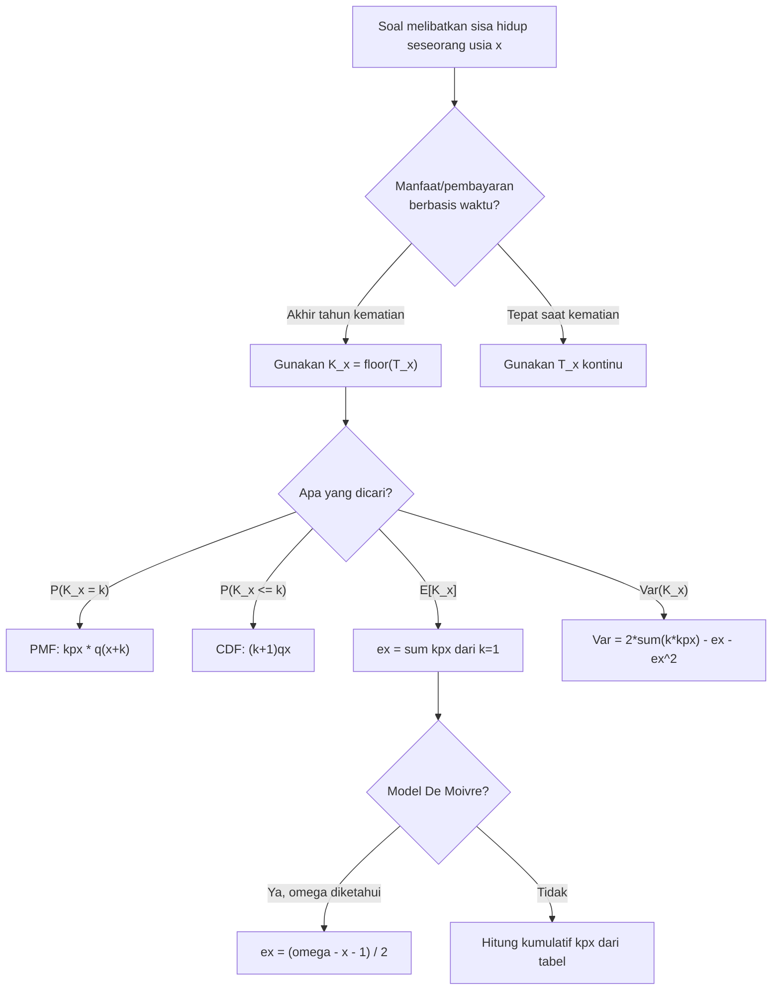

# 📊 1.3 — Curtate Future Lifetime

> [!ABSTRACT] Ringkasan Cepat
> **Topik:** Curtate Future Lifetime | **Bobot:** ~15–25% (Topik 1) | **Difficulty:** Medium
> **Ref:** London (1997) Bab 1–4; Dickson et al. (2009) Bab 2 | **Prereq:** [[1.1 Survival and Lifetime Variables]], [[1.2 Survival and Hazard Functions]]

---

## Section 0 — Pemetaan Topik

| Topik TA1 | Sub-topik ID | Skill Diuji | Bobot | Difficulty | Prerequisite | Connected Topics | Referensi |
|---|---|---|---|---|---|---|---|
| Analisis Survival | 1.3 | Mendefinisikan $K_x$; menghitung PMF, CDF, dan momen $K_x$; menghubungkan $K_x$ dengan $T_x$ | 15–25% | Medium | [[1.1 Survival and Lifetime Variables]], [[1.2 Survival and Hazard Functions]] | [[1.4 Parametric Survival Models]], [[1.5 Censoring and Non-Parametric Estimation]] | London (1997), Bab 1–4 |

---

## Section 1 — Intuisi

Bayangkan sebuah perusahaan asuransi jiwa yang menjual polis kepada seseorang berusia 40 tahun. Aktuaria di perusahaan itu perlu menghitung berbagai nilai polis — premi, cadangan, dan manfaat — yang semuanya bergantung pada *kapan* tertanggung meninggal dunia. Dalam banyak produk asuransi jiwa tradisional, manfaat kematian dibayarkan di **akhir tahun** meninggal, bukan tepat pada saat kematian terjadi. Perbedaan ini bukan sekadar soal administrasi — ia mengubah cara kita memodelkan risiko secara matematis.

Di sinilah *curtate future lifetime* muncul sebagai konsep kunci. Jika sisa hidup seseorang dinyatakan dalam variabel $T_x$ (waktu kontinu hingga kematian), maka $K_x$ adalah versi "dibulatkan ke bawah" dari $T_x$ — yaitu bilangan bulat yang menunjukkan berapa tahun penuh seseorang itu masih hidup setelah usia $x$. Misalnya jika $T_x = 7{,}3$ tahun, maka $K_x = 7$: orang tersebut meninggal di tahun kedelapan, setelah menyelesaikan 7 tahun penuh.

Mengapa versi diskrit ini begitu berguna? Dalam praktiknya, banyak tabel mortalitas — seperti tabel mortalitas yang diterbitkan PAI atau TMI (Tabel Mortalitas Indonesia) — disajikan dalam interval satu tahun. Semua probabilitas disajikan per-tahun, bukan per-detik. Memodelkan $K_x$ memungkinkan kita bekerja langsung dengan tabel mortalitas diskrit ini secara alami, tanpa perlu mengintegrasikan fungsi kontinu yang kompleks. Ini adalah jembatan antara teori survival kontinu dan aplikasi aktuaria yang berorientasi kalender tahunan.

---

## Section 2 — Definisi Formal

> [!NOTE] Definisi Matematis
> Diberikan variabel acak sisa hidup kontinu $T_x \geq 0$ untuk seseorang berusia $x$, maka **curtate future lifetime** didefinisikan sebagai:
>
> $$K_x = \lfloor T_x \rfloor$$
>
> yaitu bagian bilangan bulat (floor) dari $T_x$. $K_x$ adalah variabel acak **diskrit** dengan support $k = 0, 1, 2, 3, \ldots$

| Simbol | Makna | Catatan |
|---|---|---|
| $T_x$ | Sisa hidup kontinu untuk seseorang berusia $x$ | $T_x \geq 0$, variabel acak kontinu |
| $K_x$ | Curtate future lifetime — sisa hidup diskrit | $K_x = \lfloor T_x \rfloor \in \{0, 1, 2, \ldots\}$ |
| $k$ | Nilai realisasi dari $K_x$ | Bilangan bulat non-negatif |
| ${}_{k}p_x$ | Probabilitas seseorang usia $x$ masih hidup setelah $k$ tahun | ${}_{k}p_x = S_x(k) = P(T_x > k)$ |
| $q_{x+k}$ | Probabilitas seseorang usia $x+k$ meninggal dalam satu tahun ke depan | $q_{x+k} = 1 - p_{x+k}$ |
| ${}_{k\|}q_x$ | Deferred mortality probability — prob. meninggal tepat di tahun ke-$(k+1)$ | ${}_{k\|}q_x = {}_{k}p_x \cdot q_{x+k}$ |
| $e_x$ | Curtate expectation of life — ekspektasi $K_x$ | $e_x = E[K_x]$ |
| ${}^2 e_x$ | Second moment pendukung perhitungan $\text{Var}(K_x)$ | Dihitung dari $E[K_x^2]$ |

### Rumus Utama

**PMF (Probability Mass Function) dari $K_x$:**

$$
P(K_x = k) = {}_{k}p_x \cdot q_{x+k} = {}_{k\|}q_x, \quad k = 0, 1, 2, \ldots
$$

*Label: Probabilitas meninggal tepat di tahun ke-$(k+1)$, setelah bertahan $k$ tahun penuh.*

**CDF dari $K_x$:**

$$
P(K_x \leq k) = 1 - {}_{k+1}p_x = {}_{k+1}q_x, \quad k = 0, 1, 2, \ldots
$$

*Label: Probabilitas meninggal dalam $k+1$ tahun pertama.*

**Survival function diskrit (tail probability):**

$$
P(K_x > k) = P(K_x \geq k+1) = {}_{k+1}p_x, \quad k = 0, 1, 2, \ldots
$$

*Label: Probabilitas masih hidup pada ulang tahun ke-$(k+1)$.*

**Ekspektasi (Curtate Expectation of Life):**

$$
e_x = E[K_x] = \sum_{k=0}^{\infty} k \cdot {}_{k\|}q_x = \sum_{k=1}^{\infty} {}_{k}p_x
$$

*Label: Rata-rata jumlah tahun penuh yang dijalani seseorang usia $x$ sebelum meninggal.*

**Momen kedua dan Variansi:**

$$
E[K_x^2] = \sum_{k=1}^{\infty} (2k - 1) \cdot {}_{k}p_x
$$

$$
\text{Var}(K_x) = E[K_x^2] - (e_x)^2 = \sum_{k=1}^{\infty} (2k-1) \cdot {}_{k}p_x - \left(\sum_{k=1}^{\infty} {}_{k}p_x\right)^2
$$

*Label: Alternatif: $\text{Var}(K_x) = 2\sum_{k=1}^{\infty} k \cdot {}_{k}p_x - e_x - e_x^2$.*

**Hubungan $K_x$ dengan $T_x$:**

$$
K_x \leq T_x < K_x + 1
$$

*Label: $K_x$ adalah tahun penuh yang diselesaikan; fraksi tahun yang tersisa ada di interval $[K_x, K_x+1)$.*

### Asumsi Eksplisit

1. **Tabel mortalitas lengkap tersedia:** Nilai ${}_{k}p_x$ atau $q_{x+k}$ diketahui untuk semua $k \geq 0$.
2. **Support tak terbatas (ω = ∞) atau terbatas:** Jika tabel mortalitas memiliki batas akhir $\omega$, maka support $K_x \in \{0, 1, \ldots, \omega - x - 1\}$.
3. **Tidak ada tambahan informasi (time-homogeneous):** Probabilitas transisi hanya bergantung pada usia saat ini, bukan pada riwayat masa lalu.
4. **Pembulatan ke bawah (floor function):** $K_x = \lfloor T_x \rfloor$, bukan pembulatan biasa.
5. **Independensi dari waktu kalender:** Model mengasumsikan tabel mortalitas stasioner, tidak bergantung pada tahun kalender.

---

## Section 3 — Jembatan Logika

> [!TIP] Dari Definisi ke Rumus
> Mengapa PMF $K_x$ berbentuk ${}_{k}p_x \cdot q_{x+k}$? Logikanya sederhana: agar $K_x = k$ terjadi, diperlukan **dua hal** sekaligus — (1) orang tersebut harus **bertahan hidup** selama $k$ tahun penuh (probabilitas ${}_{k}p_x$), dan (2) orang tersebut harus **meninggal** dalam tahun ke-$(k+1)$, yaitu antara ulang tahun ke-$k$ dan ke-$(k+1)$ (probabilitas $q_{x+k}$). Karena kedua kejadian ini bersyarat dan sekuensial, probabilitasnya adalah **perkalian** dari keduanya.

> [!IMPORTANT] Support dan Domain
> $K_x$ adalah variabel acak **diskrit non-negatif**. Nilai $K_x = 0$ berarti orang tersebut meninggal sebelum ulang tahun berikutnya (meninggal di tahun pertama). Nilai $K_x = k$ berarti orang tersebut merayakan ulang tahun ke-$k$ setelah usia $x$, tetapi meninggal sebelum ulang tahun ke-$(k+1)$.

**Derivasi Rumus Ekspektasi Alternatif:**

Langkah 1 — Mulai dari definisi:

$$
e_x = E[K_x] = \sum_{k=0}^{\infty} k \cdot P(K_x = k) = \sum_{k=1}^{\infty} k \cdot {}_{k\|}q_x
$$

Langkah 2 — Substitusi ${}_{k\|}q_x = {}_{k}p_x - {}_{k+1}p_x$ (karena ${}_{k\|}q_x = {}_{k}p_x \cdot q_{x+k} = {}_{k}p_x - {}_{k+1}p_x$):

$$
e_x = \sum_{k=1}^{\infty} k \cdot ({}_{k}p_x - {}_{k+1}p_x)
$$

Langkah 3 — Lakukan Abel's summation (summation by parts):

$$
e_x = \sum_{k=1}^{\infty} k \cdot {}_{k}p_x - \sum_{k=1}^{\infty} k \cdot {}_{k+1}p_x
$$

Langkah 4 — Re-indeks jumlah kedua: misalkan $j = k+1$, sehingga $k = j-1$:

$$
\sum_{k=1}^{\infty} k \cdot {}_{k+1}p_x = \sum_{j=2}^{\infty} (j-1) \cdot {}_{j}p_x
$$

Langkah 5 — Gabungkan:

$$
e_x = \sum_{k=1}^{\infty} k \cdot {}_{k}p_x - \sum_{j=2}^{\infty} (j-1) \cdot {}_{j}p_x = {}_{1}p_x + \sum_{k=2}^{\infty} [k - (k-1)] \cdot {}_{k}p_x = \sum_{k=1}^{\infty} {}_{k}p_x
$$

**Hasil:** $e_x = \sum_{k=1}^{\infty} {}_{k}p_x$ — formula ini jauh lebih mudah dihitung dari tabel mortalitas.

> [!DANGER] Dilarang
> 1. **Jangan tulis** $P(K_x = k) = {}_{k}q_x$ — ini salah! ${}_{k}q_x = P(T_x \leq k)$ adalah CDF kontinu, bukan PMF diskrit.
> 2. **Jangan gunakan** $e_x = E[T_x]$ — itu adalah *complete expectation of life* $\overset{\circ}{e}_x$, bukan curtate. Curtate $e_x \leq \overset{\circ}{e}_x$.
> 3. **Jangan abaikan** perbedaan $P(K_x \leq k) = {}_{k+1}q_x$ vs $P(K_x < k) = {}_{k}q_x$ — beda satu indeks bisa membatalkan seluruh perhitungan.

---

## Section 4 — Contoh Soal

### Soal A — Fundamental

**Soal:** Diketahui bahwa untuk seseorang berusia $x$: $p_x = 0{,}97$, $p_{x+1} = 0{,}95$, $p_{x+2} = 0{,}92$. Hitung $P(K_x = 0)$, $P(K_x = 1)$, $P(K_x = 2)$, dan $P(K_x \geq 3)$.

> [!SUCCESS] Solusi Soal A
> **Pendekatan:** Gunakan PMF $P(K_x = k) = {}_{k}p_x \cdot q_{x+k}$ langsung.
>
> **1. Identifikasi Variabel**
> - $p_x = 0{,}97$, sehingga $q_x = 0{,}03$
> - $p_{x+1} = 0{,}95$, sehingga $q_{x+1} = 0{,}05$
> - $p_{x+2} = 0{,}92$, sehingga $q_{x+2} = 0{,}08$
> - ${}_{2}p_x = p_x \cdot p_{x+1} = 0{,}97 \times 0{,}95 = 0{,}9215$
> - ${}_{3}p_x = {}_{2}p_x \cdot p_{x+2} = 0{,}9215 \times 0{,}92 = 0{,}847780$
>
> **2. Identifikasi Distribusi / Model**
> $K_x$ berdistribusi diskrit dengan PMF ${}_{k\|}q_x = {}_{k}p_x \cdot q_{x+k}$.
>
> **3. Setup Persamaan**
>
> $$
> P(K_x = k) = {}_{k}p_x \cdot q_{x+k}
> $$
>
> **4. Eksekusi Aljabar**
>
> $$
> P(K_x = 0) = {}_{0}p_x \cdot q_x = 1 \times 0{,}03 = 0{,}0300
> $$
>
> $$
> P(K_x = 1) = {}_{1}p_x \cdot q_{x+1} = 0{,}97 \times 0{,}05 = 0{,}0485
> $$
>
> $$
> P(K_x = 2) = {}_{2}p_x \cdot q_{x+2} = 0{,}9215 \times 0{,}08 = 0{,}073720
> $$
>
> $$
> P(K_x \geq 3) = {}_{3}p_x = 0{,}847780
> $$
>
> **5. Verification**
> Jumlah: $0{,}0300 + 0{,}0485 + 0{,}073720 + 0{,}847780 = 1{,}000$ ✓ PMF valid.
>
> **Hasil:** $P(K_x=0) = 0{,}030$; $P(K_x=1) = 0{,}0485$; $P(K_x=2) = 0{,}07372$; $P(K_x \geq 3) = 0{,}84778$.

> [!WARNING] Exam Tips — Soal A
> **Target waktu:** 2 menit. **Common trap:** Lupa bahwa ${}_{0}p_x = 1$ (selalu), sehingga $P(K_x=0) = q_x$ langsung. **Shortcut:** Hitung ${}_{k}p_x$ secara kumulatif sebagai produk berurutan dari $p_{x}, p_{x+1}, \ldots$

---

### Soal B — Exam-Typical

**Soal:** Untuk seseorang berusia 60 tahun, diketahui $q_{60} = 0{,}020$, $q_{61} = 0{,}022$, $q_{62} = 0{,}025$, $q_{63} = 0{,}028$. Hitung curtate expectation of life $e_{60}$ menggunakan data mortalitas ini, dengan asumsi ${}_{k}p_{60} = 0$ untuk $k \geq 5$ (populasi kecil, disederhanakan). Juga hitung $\text{Var}(K_{60})$.

> [!SUCCESS] Solusi Soal B
> **Pendekatan:** Hitung terlebih dahulu semua ${}_{k}p_{60}$, lalu gunakan formula $e_{60} = \sum_{k=1}^{4} {}_{k}p_{60}$ dan $\text{Var}(K_{60}) = 2\sum_{k=1}^{4} k \cdot {}_{k}p_{60} - e_{60} - e_{60}^2$.
>
> **1. Identifikasi Variabel**
> - $q_{60}=0{,}020$, $q_{61}=0{,}022$, $q_{62}=0{,}025$, $q_{63}=0{,}028$
> - $p_{60}=0{,}980$, $p_{61}=0{,}978$, $p_{62}=0{,}975$, $p_{63}=0{,}972$
>
> **2. Identifikasi Distribusi / Model**
> $K_{60}$ diskrit, support $\{0,1,2,3,4\}$ (karena ${}_{5}p_{60} = 0$). Gunakan formula $e_{60} = \sum_{k=1}^{4} {}_{k}p_{60}$.
>
> **3. Setup Persamaan**
>
> $$
> {}_{k}p_{60} = \prod_{j=0}^{k-1} p_{60+j}
> $$
>
> $$
> e_{60} = \sum_{k=1}^{4} {}_{k}p_{60}, \quad \text{Var}(K_{60}) = 2\sum_{k=1}^{4} k \cdot {}_{k}p_{60} - e_{60} - e_{60}^2
> $$
>
> **4. Eksekusi Aljabar**
>
> $$
> {}_{1}p_{60} = 0{,}980
> $$
>
> $$
> {}_{2}p_{60} = 0{,}980 \times 0{,}978 = 0{,}958440
> $$
>
> $$
> {}_{3}p_{60} = 0{,}958440 \times 0{,}975 = 0{,}934479
> $$
>
> $$
> {}_{4}p_{60} = 0{,}934479 \times 0{,}972 = 0{,}908314
> $$
>
> $$
> e_{60} = 0{,}980000 + 0{,}958440 + 0{,}934479 + 0{,}908314 = 3{,}781233
> $$
>
> Untuk variansi:
>
> $$
> 2\sum_{k=1}^{4} k \cdot {}_{k}p_{60} = 2[1(0{,}980) + 2(0{,}95844) + 3(0{,}934479) + 4(0{,}908314)]
> $$
>
> $$
> = 2[0{,}980 + 1{,}91688 + 2{,}803437 + 3{,}633256] = 2 \times 9{,}333573 = 18{,}667146
> $$
>
> $$
> \text{Var}(K_{60}) = 18{,}667146 - 3{,}781233 - (3{,}781233)^2 = 18{,}667146 - 3{,}781233 - 14{,}297723 = 0{,}588190
> $$
>
> **5. Verification**
> $e_{60} \approx 3{,}78 < 4$: masuk akal untuk support maksimum 4. $\text{Var}(K_{60}) > 0$ ✓. Juga cek: $e_{60} \leq \max(K_{60}) = 4$ ✓.
>
> **Hasil:** $e_{60} \approx 3{,}781$ tahun; $\text{Var}(K_{60}) \approx 0{,}588$.

> [!WARNING] Exam Tips — Soal B
> **Target waktu:** 4 menit. **Common trap:** Formula variansi $\text{Var}(K_x) = 2\sum k \cdot {}_{k}p_x - e_x - e_x^2$ — jangan lupa kurangi $e_x$ (bukan hanya $e_x^2$). **Shortcut:** Hitung ${}_{k}p_x$ secara kumulatif satu kali, simpan hasilnya, lalu gunakan untuk $e_x$ dan komponen variansi sekaligus.

---

### Soal C — Challenging

**Soal:** Asumsikan De Moivre dengan $\omega = 100$ dan seseorang berusia $x = 40$. Di bawah model ini, ${}_{k}p_{40} = \frac{60 - k}{60}$ untuk $k = 0, 1, \ldots, 60$. Hitung: (a) $e_{40}$, (b) $\text{Var}(K_{40})$, dan (c) $P(K_{40} > e_{40})$.

> [!SUCCESS] Solusi Soal C
> **Pendekatan:** Gunakan formula deret aritmetik untuk $\sum_{k=1}^{60} \frac{60-k}{60}$, lalu hitung momen kedua, dan evaluasi tail probability.
>
> **1. Identifikasi Variabel**
> - Model De Moivre: $T_{40} \sim \text{Uniform}[0, 60]$
> - ${}_{k}p_{40} = \frac{60-k}{60}$, untuk $k = 1, 2, \ldots, 59$ (untuk $k=60$: ${}_{60}p_{40} = 0$)
>
> **2. Identifikasi Distribusi / Model**
> $K_{40} \sim \text{Diskrit}$, support $\{0, 1, \ldots, 59\}$. Karena $T_{40} \sim U[0,60]$, PMF $K_{40}$ seragam: $P(K_{40} = k) = \frac{1}{60}$ untuk $k = 0, 1, \ldots, 59$.
>
> **3. Setup Persamaan**
>
> $$
> e_{40} = \sum_{k=1}^{59} {}_{k}p_{40} = \sum_{k=1}^{59} \frac{60-k}{60}
> $$
>
> **4. Eksekusi Aljabar**
>
> **(a) Curtate Expectation:**
>
> $$
> e_{40} = \frac{1}{60}\sum_{k=1}^{59}(60-k) = \frac{1}{60}\sum_{j=1}^{59} j = \frac{1}{60} \cdot \frac{59 \times 60}{2} = \frac{59}{2} = 29{,}5
> $$
>
> **(b) Variansi — hitung $E[K_{40}^2]$ terlebih dahulu:**
>
> Karena $K_{40} \sim \text{Diskrit Seragam}\{0, 1, \ldots, 59\}$:
>
> $$
> E[K_{40}^2] = \frac{1}{60}\sum_{k=0}^{59} k^2 = \frac{1}{60} \cdot \frac{59 \times 60 \times 119}{6} = \frac{59 \times 119}{6} = \frac{7021}{6} \approx 1170{,}167
> $$
>
> $$
> \text{Var}(K_{40}) = E[K_{40}^2] - (e_{40})^2 = 1170{,}167 - (29{,}5)^2 = 1170{,}167 - 870{,}25 = 299{,}917
> $$
>
> Catatan: Untuk distribusi diskrit seragam $\{0,\ldots,n-1\}$: $\text{Var} = \frac{n^2-1}{12}$. Dengan $n = 60$: $\frac{3600-1}{12} = \frac{3599}{12} \approx 299{,}917$ ✓.
>
> **(c) $P(K_{40} > 29{,}5) = P(K_{40} \geq 30)$:**
>
> $$
> P(K_{40} \geq 30) = {}_{30}p_{40} = \frac{60 - 30}{60} = \frac{30}{60} = 0{,}5
> $$
>
> **5. Verification**
> $e_{40} = 29{,}5 = \frac{\omega - x - 1}{2} = \frac{59}{2}$ ✓ (formula curtate expectation De Moivre). $P(K_{40} > e_{40}) = 0{,}5$: masuk akal untuk distribusi simetris seragam — setengah dari populasi melewati ekspektasi. Bandingkan dengan complete expectation: $\overset{\circ}{e}_{40} = \frac{\omega - x}{2} = 30 > e_{40} = 29{,}5$ ✓ (curtate selalu lebih kecil).
>
> **Hasil:** $e_{40} = 29{,}5$; $\text{Var}(K_{40}) \approx 299{,}92$; $P(K_{40} > e_{40}) = 0{,}5$.

> [!WARNING] Exam Tips — Soal C
> **Target waktu:** 5 menit. **Common trap:** Pada De Moivre, $K_{40}$ adalah diskrit seragam $\{0,\ldots,59\}$ (bukan $\{1,\ldots,60\}$) — perhatikan batas bawah selalu 0. **Shortcut:** Kenali langsung $e_{40} = \frac{\omega - x - 1}{2}$ untuk De Moivre — ini formula jadi yang harus dihafalkan.

---

## Section 5 — Verifikasi & Sanity Check

> [!CHECK] Check 1 — Jumlah PMF = 1
> Untuk support terbatas $\{0, 1, \ldots, m\}$:
>
> $$
> \sum_{k=0}^{m} P(K_x = k) = \sum_{k=0}^{m} {}_{k\|}q_x = 1
> $$
>
> Ini setara dengan ${}_{0}p_x - {}_{m+1}p_x = 1 - 0 = 1$ (jika ${}_{m+1}p_x = 0$). Selalu verifikasi ini setelah menghitung seluruh PMF.

> [!CHECK] Check 2 — Hubungan Curtate vs Complete Expectation
> Selalu berlaku:
>
> $$
> e_x \leq \overset{\circ}{e}_x \leq e_x + 1
> $$
>
> Di bawah UDD (Uniform Distribution of Deaths dalam satu tahun): $\overset{\circ}{e}_x = e_x + \frac{1}{2}$. Jika hasil $e_x$ lebih besar dari $\overset{\circ}{e}_x$, ada kesalahan.

### Metode Alternatif

Selain formula $e_x = \sum_{k=1}^{\infty} {}_{k}p_x$, ekspektasi dapat dihitung langsung via PMF:

$$
e_x = \sum_{k=0}^{\infty} k \cdot {}_{k\|}q_x = 0 \cdot q_x + 1 \cdot p_x q_{x+1} + 2 \cdot {}_{2}p_x q_{x+2} + \cdots
$$

Keduanya equivalen. Formula $\sum {}_{k}p_x$ lebih efisien jika tabel ${}_{k}p_x$ sudah tersedia, sedangkan formula PMF berguna jika distribusi mortalitas tahunan yang diketahui.

---

## Section 6 — Visualisasi Mental

**Garis Waktu Diskrit $K_x$:**

```
Usia x        x+1       x+2       x+3       ...
  |-----+-----|---------|---------|-------->
  0     T?    1         2         3
  
Jika T_x = 2.7:   K_x = floor(2.7) = 2
                   Meninggal di tahun ke-3, setelah 2 tahun penuh

K_x = 0:  Meninggal di tahun pertama (antara usia x dan x+1)
K_x = 1:  Meninggal di tahun kedua  (antara usia x+1 dan x+2)
K_x = k:  Meninggal di tahun ke-(k+1) (antara usia x+k dan x+k+1)
```

**PMF K_x (untuk data hipotetis):**

```
P(K_x=k)
  |
  |  ***
  | *   *
  |*     *
  |       *
  |        *
  |         *
  +-+--+--+--+--+---> k
    0  1  2  3  4  5

Bentuk: biasanya unimodal atau monoton turun (bergantung pada
hazard function). Untuk populasi muda, monoton menurun ringan.
```

**Distribusi kontinu $T_x$ vs diskrit $K_x$:**

```
f(t) — densitas T_x (kontinu):
  |     ____
  |    /    \
  |   /      \
  |  /        \___
  +-+--+--+--+--+-> t
    0  1  2  3  4

P(K_x=k) — PMF K_x (diskrit): area di bawah f(t) pada [k, k+1)
  |
  |  []  []
  |  []  []  []
  |  []  []  []  []
  +-+--+--+--+--+--> k
    0   1   2   3
```

### Hubungan Visual ↔ Rumus

| Elemen Visual | Komponen Rumus |
|---|---|
| Panjang interval $[k, k+1)$ | Satu tahun polis / tabel mortalitas |
| Area di bawah $f(t)$ pada $[k, k+1)$ | $P(K_x = k) = {}_{k}p_x \cdot q_{x+k}$ |
| Luas kumulatif $[0, k+1)$ | $P(K_x \leq k) = {}_{k+1}q_x$ |
| Luas sisa $[k+1, \infty)$ | $P(K_x > k) = {}_{k+1}p_x$ |
| Pusat massa distribusi PMF | $e_x = E[K_x]$ |

---

## Section 7 — Jebakan Umum

> [!BUG] Kesalahan Parametrisasi — Indeks pada CDF
> **Salah:** $P(K_x \leq k) = {}_{k}q_x$
> **Benar:** $P(K_x \leq k) = {}_{k+1}q_x$
>
> Penjelasan: $K_x \leq k$ berarti meninggal paling lambat di tahun ke-$(k+1)$, jadi melibatkan $k+1$ periode, bukan $k$. Ini sering menyebabkan kesalahan off-by-one yang fatal di soal.

> [!BUG] Kesalahan Konseptual
> 1. **$K_x$ vs $T_x$:** $e_x = E[K_x]$ adalah curtate expectation, **berbeda** dengan complete expectation $\overset{\circ}{e}_x = E[T_x]$. Di bawah UDD: $\overset{\circ}{e}_x = e_x + 0{,}5$.
> 2. **Floor vs Round:** $K_x = \lfloor T_x \rfloor$ menggunakan **floor** (bulatkan ke bawah), bukan pembulatan biasa. Jika $T_x = 2{,}9$, maka $K_x = 2$, **bukan** 3.
> 3. **Support dimulai dari 0:** $K_x = 0$ adalah nilai yang valid dan berarti (meninggal di tahun pertama). Jangan mulai penjumlahan dari $k=1$.
> 4. **PMF vs Tail:** ${}_{k}p_x = P(K_x \geq k)$, bukan $P(K_x = k)$. PMF adalah ${}_{k}p_x - {}_{k+1}p_x = {}_{k\|}q_x$.

> [!BUG] Kesalahan Interpretasi Soal
> - **"Probabilitas meninggal sebelum ulang tahun ke-$(k+1)$"** → $P(K_x \leq k) = {}_{k+1}q_x$ (inklusif: meninggal tepat di tahun ke-$(k+1)$ termasuk).
> - **"Probabilitas meninggal tepat di tahun ke-$(k+1)$"** → $P(K_x = k) = {}_{k\|}q_x$.
> - **"Probabilitas masih hidup setelah $k$ tahun"** → ${}_{k}p_x = P(K_x \geq k)$ — *strictly greater than* perlu $P(K_x > k) = {}_{k+1}p_x$.

> [!CAUTION] Red Flags
> - Soal menyebut **"manfaat dibayar di akhir tahun kematian"** → gunakan $K_x$, bukan $T_x$.
> - Soal memberikan **tabel mortalitas tahunan** ($q_x$, $q_{x+1}$, ...) → ini adalah konteks diskrit, pakai $K_x$.
> - Soal menyebut **De Moivre** atau $T_x \sim U[0, \omega-x]$ → gunakan formula $e_x = \frac{\omega-x-1}{2}$ langsung.
> - Soal meminta **variansi $K_x$** → ingat formula $\text{Var} = 2\sum k \cdot {}_{k}p_x - e_x - e_x^2$, jangan hanya hitung $E[K_x^2] - (E[K_x])^2$ tanpa mengetahui formula efisiennya.

---

## Section 8 — Ringkasan Eksekutif

> [!SUMMARY] Must-Remember
>
> 1. **Definisi:** $K_x = \lfloor T_x \rfloor$ — bagian bilangan bulat dari sisa hidup kontinu.
>
> 2. **PMF:**
>
> $$P(K_x = k) = {}_{k}p_x \cdot q_{x+k} = {}_{k\|}q_x$$
>
> 3. **CDF:** $P(K_x \leq k) = {}_{k+1}q_x$; **Tail:** $P(K_x > k) = {}_{k+1}p_x$
>
> 4. **Curtate expectation (dua formula ekuivalen):**
>
> $$e_x = \sum_{k=1}^{\infty} {}_{k}p_x = \sum_{k=0}^{\infty} k \cdot {}_{k\|}q_x$$
>
> 5. **Variansi:**
>
> $$\text{Var}(K_x) = 2\sum_{k=1}^{\infty} k \cdot {}_{k}p_x - e_x - (e_x)^2$$
>
> 6. **De Moivre shortcut:** $e_x = \dfrac{\omega - x - 1}{2}$; $K_x \sim \text{Diskrit Seragam}\{0,\ldots,\omega-x-1\}$

### Kapan Digunakan

- Soal menyebut manfaat/premi dibayar **di akhir tahun** (whole life, term life — annual payment)
- Data mortalitas diberikan dalam **tabel tahunan** ($q_x$, $p_x$)
- Pertanyaan tentang **ekspektasi hidup curtate** atau **variansi sisa hidup diskrit**
- Model survival **De Moivre** dengan batas usia $\omega$
- Sebagai langkah awal sebelum menghitung **APV (Actuarial Present Value)** asuransi jiwa

### Kapan TIDAK Boleh Digunakan

- Ketika manfaat dibayar **saat kematian** (tepat waktu) → gunakan $T_x$ kontinu dan $\overset{\circ}{e}_x$
- Ketika dibutuhkan model **hazard rate kontinu** $\mu_x$ → lihat [[1.2 Survival and Hazard Functions]]
- Ketika data berbentuk **kontinu** atau diketahui distribusi parametrik lengkap → pertimbangkan $T_x$ langsung

### Quick Decision Tree



---

> [!QUOTE] Follow-up Options
> 1. *"Berikan contoh soal variasi dengan tabel mortalitas TMI (Tabel Mortalitas Indonesia)"*
> 2. *"Jelaskan hubungan [[1.3 Curtate Future Lifetime]] dengan [[1.4 Parametric Survival Models]]"*
> 3. *"Buat flashcard 1-halaman untuk topik ini"*

*📖 Ref: London (1997), Survival Models and Their Estimation, Bab 1–4; Dickson et al. (2009), Bab 2 | 🗓️ 2026-04-19 | #TA1 #AnalisisSurvival #CurateFutureLifetime*
