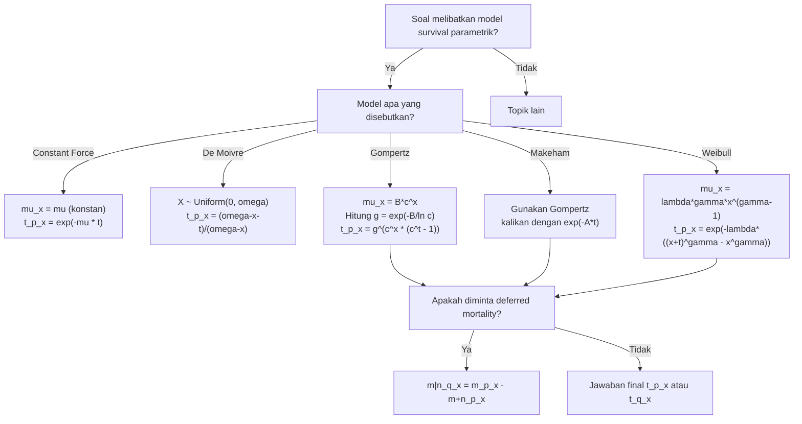

# 📊 1.4 — Parametric Survival Models

> [!ABSTRACT] Ringkasan Cepat
> **Topik:** Parametric Survival Models | **Bobot:** ~15–25% | **Difficulty:** Calculation-Intensive
> **Ref:** London (1997) Bab 3–5; Frees (2010) Bab 14 | **Prereq:** [[1.1 Survival and Lifetime Variables]], [[1.2 Survival and Hazard Functions]]

---

## Section 0 — Pemetaan Topik

| Topik TA1 | Sub-topik ID | Skill Diuji | Bobot | Difficulty | Prerequisite | Connected Topics | Referensi |
|---|---|---|---|---|---|---|---|
| Analisis Survival | 1.4 | Mengidentifikasi, menurunkan, dan mengaplikasikan model survival parametrik: Constant Force, Gompertz, Makeham, De Moivre, Weibull | 15–25% | Calculation-Intensive | [[1.1 Survival and Lifetime Variables]], [[1.2 Survival and Hazard Functions]] | [[1.3 Curtate Future Lifetime]], [[1.5 Censoring and Non-Parametric Estimation]], [[1.6 Maximum Likelihood Estimation for Survival]] | London (1997) Bab 3–5; Frees (2010) Bab 14 |

---

## Section 1 — Intuisi

Bayangkan tim aktuaris di sebuah perusahaan asuransi jiwa besar di Indonesia ingin membangun tabel mortalitas untuk produk asuransi jiwa seumur hidup. Mereka tidak bisa sekadar mengamati ribuan nasabah dan menunggu semua meninggal — mereka butuh sebuah *model matematis* yang bisa merangkum pola kematian seluruh populasi dalam beberapa parameter saja, lalu digunakan untuk ekstrapolasi ke usia-usia yang datanya masih terbatas.

Di sinilah model survival parametrik masuk. Alih-alih mendefinisikan peluang kematian secara terpisah untuk setiap usia (yang membutuhkan ribuan angka), kita pilih satu *bentuk fungsional* untuk laju kematian — misalnya "laju kematian naik secara eksponensial seiring usia" — dan cukup estimasi dua atau tiga parameter untuk mendapatkan gambaran lengkap mortalitas dari lahir hingga usia tua. Model seperti Gompertz (1825) lahir persis dari kebutuhan ini: Benjamin Gompertz mengamati bahwa untuk sebagian besar usia dewasa, peluang kematian seseorang di tahun berikutnya kira-kira berlipat ganda setiap tujuh tahun. Satu persamaan sederhana, dua parameter, mampu menangkap pola mortalitas manusia dewasa dengan sangat baik.

Setiap model parametrik membuat asumsi berbeda tentang *bagaimana* laju kematian berubah seiring usia: De Moivre berasumsi laju kematian naik secara linear dan sederhana; model Constant Force berasumsi laju kematian tidak berubah sama sekali (berguna untuk jangka pendek atau hewan); Gompertz berasumsi laju naik eksponensial; Makeham menambahkan komponen kecelakaan yang tidak bergantung usia; dan Weibull memberikan fleksibilitas lebih luas melalui parameter bentuk yang bisa disesuaikan. Memahami kapan masing-masing model tepat digunakan — dan apa konsekuensi matematisnya — adalah keterampilan inti yang diuji dalam TA1.

---

## Section 2 — Definisi Formal

> [!NOTE] Definisi Matematis — Kerangka Umum
> Semua model survival parametrik didefinisikan melalui salah satu dari tiga fungsi ekuivalen berikut, di mana setiap model memilih bentuk fungsional spesifik untuk *force of mortality* $\mu_x$:
>
> $$
> \mu_x = -\frac{d}{dx}\ln S_X(x), \quad S_X(x) = \exp\!\left(-\int_0^x \mu_t \, dt\right), \quad f_X(x) = \mu_x \cdot S_X(x)
> $$

| Simbol | Makna | Catatan |
|---|---|---|
| $\mu_x$ | *Force of mortality* (hazard rate) pada usia $x$ | $\mu_x \geq 0$ |
| $S_X(x)$ | Fungsi survival — $P(X > x)$ | $S_X(0)=1$, monoton turun |
| $f_X(x)$ | Fungsi densitas usia saat meninggal | $f_X = \mu_x \cdot S_X(x)$ |
| ${}_{t}p_x$ | Probabilitas $(x)$ survive $t$ tahun | ${}_{t}p_x = S_X(x+t)/S_X(x)$ |
| $\mu$ | Parameter *force of mortality* konstan | Untuk model Constant Force |
| $B$, $c$ | Parameter Gompertz | $B > 0$, $c > 1$ |
| $A$, $B$, $c$ | Parameter Makeham | $A \geq 0$, $B > 0$, $c > 1$ |
| $\omega$ | Batas usia maksimum (*limiting age*) | Untuk model De Moivre |
| $\lambda$, $\gamma$ | Parameter skala dan bentuk Weibull | $\lambda > 0$, $\gamma > 0$ |
| $\alpha$ | Parameter bentuk alternatif Weibull | Kadang ditulis $\alpha = \gamma$ |

### Rumus Utama — Lima Model Parametrik

#### Model 1: Constant Force of Mortality (Eksponensial)

$$
\mu_x = \mu \quad (\text{konstan untuk semua } x)
$$

$$
S_X(x) = e^{-\mu x}, \qquad {}_{t}p_x = e^{-\mu t}
$$

$$
f_X(x) = \mu \, e^{-\mu x}
$$

**Label:** Satu parameter $\mu$. Model *memoryless* — $T_x$ identik terdistribusi untuk semua $x$.

#### Model 2: De Moivre (Uniform)

$$
\mu_x = \frac{1}{\omega - x}, \quad 0 \leq x < \omega
$$

$$
S_X(x) = 1 - \frac{x}{\omega} = \frac{\omega - x}{\omega}, \qquad {}_{t}p_x = \frac{\omega - x - t}{\omega - x}
$$

$$
f_X(x) = \frac{1}{\omega}, \quad X \sim \text{Uniform}(0, \omega)
$$

**Label:** Satu parameter $\omega$. Sisa usia $T_x \sim \text{Uniform}(0, \omega - x)$.

#### Model 3: Gompertz

$$
\mu_x = B c^x, \quad B > 0,\; c > 1
$$

$$
S_X(x) = \exp\!\left(-\frac{B}{\ln c}(c^x - 1)\right) = \exp\!\left(-\frac{B}{\ln c} \cdot c^x + \frac{B}{\ln c}\right)
$$

$$
{}_{t}p_x = \exp\!\left(-\frac{B c^x}{\ln c}(c^t - 1)\right) = g^{c^x(c^t - 1)}, \quad \text{di mana } g = e^{-B/\ln c}
$$

**Label:** Dua parameter $B$, $c$. Laju kematian naik eksponensial — cocok untuk mortalitas dewasa usia 30–90.

#### Model 4: Makeham

$$
\mu_x = A + B c^x, \quad A \geq 0,\; B > 0,\; c > 1
$$

$$
S_X(x) = \exp\!\left(-Ax - \frac{B}{\ln c}(c^x - 1)\right)
$$

$$
{}_{t}p_x = \exp\!\left(-At - \frac{Bc^x}{\ln c}(c^t - 1)\right) = e^{-At} \cdot g^{c^x(c^t - 1)}
$$

**Label:** Tiga parameter $A$, $B$, $c$. Konstanta $A$ merepresentasikan laju kematian "background" (kecelakaan, penyakit acak) yang tidak bergantung usia.

#### Model 5: Weibull

$$
\mu_x = \lambda \gamma x^{\gamma - 1}, \quad \lambda > 0,\; \gamma > 0
$$

$$
S_X(x) = \exp\!\left(-\lambda x^{\gamma}\right)
$$

$$
{}_{t}p_x = \exp\!\left(-\lambda\left[(x+t)^\gamma - x^\gamma\right]\right)
$$

**Label:** Dua parameter $\lambda$ (skala), $\gamma$ (bentuk). Jika $\gamma = 1$ maka menjadi Constant Force dengan $\mu = \lambda$.

### Asumsi Eksplisit

1. Distribusi usia saat meninggal $X$ ditentukan sepenuhnya oleh parameter model yang dipilih — tidak ada heterogenitas individu dalam populasi.
2. Parameter model ($B$, $c$, $A$, $\omega$, $\lambda$, $\gamma$) bersifat tetap (*fixed*) dan berlaku seragam untuk seluruh populasi yang dianalisis.
3. $\mu_x \geq 0$ untuk semua usia $x$ yang valid — tidak ada "negative mortality".
4. Untuk Gompertz dan Makeham: $c > 1$ agar $\mu_x$ merupakan fungsi naik dari $x$ (mortalitas meningkat seiring usia dewasa).
5. Semua model berasumsi populasi *closed* — tidak ada migrasi atau seleksi underwriting yang mengubah distribusi mortalitas.

---

## Section 3 — Jembatan Logika

> [!TIP] Dari Force of Mortality ke Fungsi Survival
> Kunci seluruh topik ini adalah satu relasi: $S_X(x) = \exp\!\left(-\int_0^x \mu_t \, dt\right)$. Artinya, jika kita tahu bentuk $\mu_x$, kita *selalu* bisa membangun $S_X(x)$ dengan mengintegrasikan $\mu_x$ lalu mengeksponensiasikan negatifnya. Dan sebaliknya, jika diketahui $S_X(x)$, kita bisa dapatkan $\mu_x = -d(\ln S_X)/dx$. Ini adalah "pintu masuk" ke setiap model parametrik: *pilih* bentuk $\mu_x$ terlebih dahulu, lalu turunkan semua fungsi lainnya secara mekanis.

> [!IMPORTANT] Support dan Domain
> - **Constant Force & Gompertz & Makeham & Weibull:** $x \in [0, \infty)$ secara teoritis. Dalam praktik, model-model ini hanya valid untuk rentang usia tertentu (Gompertz baik untuk $x \in [30, 90]$).
> - **De Moivre:** $x \in [0, \omega)$ — ada batas usia pasti. $S_X(\omega) = 0$.
> - **Weibull dengan $\gamma < 1$:** $\mu_x$ *menurun* seiring usia — berguna untuk pemodelan kegagalan alat (awal pakai), tetapi tidak realistis untuk mortalitas manusia.
> - Untuk ${}_{t}p_x$ model Gompertz dan Makeham, gunakan bentuk $g^{c^x(c^t - 1)}$ di mana $g = e^{-B/\ln c}$ — jauh lebih mudah dihitung daripada bentuk integral penuh.

**Derivasi — Fungsi Survival Gompertz Step-by-Step:**

**Langkah 1:** Mulai dari definisi $\mu_x = Bc^x$.

$$
S_X(x) = \exp\!\left(-\int_0^x Bc^t \, dt\right)
$$

**Langkah 2:** Hitung integral $\int_0^x Bc^t \, dt$.

$$
\int_0^x Bc^t \, dt = B \cdot \frac{c^t}{\ln c}\Bigg|_0^x = \frac{B}{\ln c}(c^x - c^0) = \frac{B}{\ln c}(c^x - 1)
$$

**Langkah 3:** Substitusi kembali ke ekspresi $S_X(x)$.

$$
S_X(x) = \exp\!\left(-\frac{B}{\ln c}(c^x - 1)\right)
$$

**Langkah 4:** Turunkan ${}_{t}p_x$ dengan rumus kondisional ${}_{t}p_x = S_X(x+t)/S_X(x)$.

$$
{}_{t}p_x = \frac{\exp\!\left(-\frac{B}{\ln c}(c^{x+t}-1)\right)}{\exp\!\left(-\frac{B}{\ln c}(c^x - 1)\right)} = \exp\!\left(-\frac{B}{\ln c}(c^{x+t} - c^x)\right)
$$

**Langkah 5:** Faktorkan $c^x$ dari kurung.

$$
{}_{t}p_x = \exp\!\left(-\frac{B}{\ln c} \cdot c^x(c^t - 1)\right)
$$

**Langkah 6:** Definisikan $g = e^{-B/\ln c}$ (konstanta bergantung parameter), sehingga:

$$
\boxed{{}_{t}p_x = g^{c^x(c^t - 1)}}
$$

Bentuk $g^{(\cdot)}$ ini sangat efisien untuk kalkulasi — cukup hitung $g$ sekali, lalu pangkatkan.

**Catatan untuk Makeham:** Karena $\mu_x^{\text{Makeham}} = A + \mu_x^{\text{Gompertz}}$, maka:

$$
{}_{t}p_x^{\text{Makeham}} = e^{-At} \cdot {}_{t}p_x^{\text{Gompertz}} = e^{-At} \cdot g^{c^x(c^t - 1)}
$$

Makeham = Gompertz $\times$ komponen konstan $e^{-At}$.

> [!DANGER] Dilarang
> 1. **Jangan** menulis ${}_{t}p_x^{\text{Gompertz}} = e^{-Bc^x(c^t-1)/\ln c}$ tanpa menyederhanakan — di soal exam, bentuk $g^{c^x(c^t-1)}$ jauh lebih aman dari kesalahan hitung. Definisikan $g$ secara eksplisit terlebih dahulu.
> 2. **Jangan** mengira De Moivre adalah model dengan $\mu_x$ konstan. De Moivre punya $\mu_x = 1/(\omega - x)$ yang *meningkat* menuju tak hingga saat $x \to \omega$. Yang konstan adalah $f_X(x)$, bukan $\mu_x$.
> 3. **Jangan** menggunakan model Gompertz/Makeham untuk usia anak-anak (di bawah 20) — model ini dirancang khusus untuk mortalitas dewasa dan akan memberikan estimasi yang sangat buruk untuk bayi dan anak.

---

## Section 4 — Contoh Soal

### Soal A — Fundamental

**Soal:** Mortalitas suatu populasi mengikuti hukum Gompertz dengan parameter $B = 0.0003$ dan $c = 1.07$. Hitunglah ${}_{10}p_{50}$, yaitu probabilitas seseorang berusia 50 tahun masih hidup 10 tahun kemudian.

> [!SUCCESS] Solusi Soal A
> **Pendekatan:** Hitung nilai $g$ terlebih dahulu, lalu gunakan rumus ${}_{t}p_x = g^{c^x(c^t - 1)}$ langsung.
>
> **1. Identifikasi Variabel**
> - $B = 0.0003$, $c = 1.07$
> - $x = 50$, $t = 10$
> - Model: Gompertz
>
> **2. Identifikasi Distribusi / Model**
> Gompertz dengan $\mu_x = Bc^x = 0.0003 \times 1.07^x$. Laju kematian meningkat eksponensial seiring usia — tipikal mortalitas dewasa.
>
> **3. Setup Persamaan**
>
> $$
> {}_{10}p_{50} = g^{c^{50}(c^{10} - 1)}, \quad g = e^{-B/\ln c}
> $$
>
> **4. Eksekusi Aljabar**
>
> Hitung $g$:
>
> $$
> \ln c = \ln 1.07 = 0.067659
> $$
>
> $$
> g = e^{-0.0003 / 0.067659} = e^{-0.004433} = 0.99558
> $$
>
> Hitung eksponen $c^{50}(c^{10} - 1)$:
>
> $$
> c^{50} = 1.07^{50} = 29.457
> $$
>
> $$
> c^{10} = 1.07^{10} = 1.9672
> $$
>
> $$
> c^{10} - 1 = 0.9672
> $$
>
> $$
> c^{50}(c^{10}-1) = 29.457 \times 0.9672 = 28.490
> $$
>
> Hitung ${}_{10}p_{50}$:
>
> $$
> {}_{10}p_{50} = 0.99558^{28.490} = e^{28.490 \times \ln(0.99558)} = e^{28.490 \times (-0.004433)} = e^{-0.12630} = 0.8813
> $$
>
> **5. Verification**
> Nilai 88.1% masuk akal: seseorang berusia 50 tahun memiliki peluang sekitar 88% untuk bertahan 10 tahun lagi (usia 60). Ini konsisten dengan tabel mortalitas populasi umum di banyak negara berkembang.
>
> **Hasil:** ${}_{10}p_{50} \approx 0.8813$ atau sekitar $88.1\%$.

> [!WARNING] Exam Tips — Soal A
> **Target waktu:** 3 menit. **Common trap:** Menghitung $e^{-B c^x (c^t - 1)/\ln c}$ langsung tanpa mendefinisikan $g$ — rawan salah tanda atau salah urutan operasi. **Shortcut:** Definisikan $g = e^{-B/\ln c}$ di awal, lalu kalkulasi $g^{c^x(c^t-1)}$ — lebih bersih dan mudah dicek.

---

### Soal B — Exam-Typical

**Soal:** Mortalitas mengikuti hukum Makeham dengan $A = 0.0005$, $B = 0.0003$, $c = 1.07$. Gunakan nilai $g = e^{-B/\ln c} = 0.99558$ (dari Soal A).
(a) Hitunglah ${}_{10}p_{50}$ menggunakan hukum Makeham.
(b) Bandingkan dengan nilai Gompertz dari Soal A dan jelaskan perbedaannya.

> [!SUCCESS] Solusi Soal B
> **Pendekatan:** Makeham = Gompertz $\times$ $e^{-At}$. Gunakan hasil Soal A dan kalikan dengan faktor tambahan.
>
> **1. Identifikasi Variabel**
> - $A = 0.0005$, $B = 0.0003$, $c = 1.07$
> - $x = 50$, $t = 10$
> - $g = 0.99558$ (diberikan)
>
> **2. Identifikasi Distribusi / Model**
> Makeham dengan $\mu_x = A + Bc^x = 0.0005 + 0.0003 \times 1.07^x$. Komponen $A$ merepresentasikan risiko kematian "background" (kecelakaan, penyakit tak terduga) yang konstan di semua usia.
>
> **3. Setup Persamaan**
>
> $$
> {}_{t}p_x^{\text{Makeham}} = e^{-At} \cdot g^{c^x(c^t - 1)}
> $$
>
> **4. Eksekusi Aljabar**
>
> Komponen konstan (background mortality):
>
> $$
> e^{-At} = e^{-0.0005 \times 10} = e^{-0.005} = 0.99501
> $$
>
> Komponen Gompertz (dari Soal A):
>
> $$
> g^{c^{50}(c^{10}-1)} = 0.99558^{28.490} = 0.8813
> $$
>
> Kombinasi Makeham:
>
> $$
> {}_{10}p_{50}^{\text{Makeham}} = 0.99501 \times 0.8813 = 0.8769
> $$
>
> **5. Verification**
>
> **(b) Perbandingan:**
>
> $$
> {}_{10}p_{50}^{\text{Gompertz}} = 0.8813 \quad \text{vs} \quad {}_{10}p_{50}^{\text{Makeham}} = 0.8769
> $$
>
> Perbedaan: $0.8813 - 0.8769 = 0.0044$ atau sekitar $0.44\%$ lebih rendah. Konstanta $A$ menambahkan risiko kematian konstan yang tidak bergantung usia (kecelakaan, dll.), sehingga ${}_{t}p_x$ Makeham selalu lebih rendah dari Gompertz dengan parameter $B$, $c$ yang sama. Selisihnya relatif kecil karena $A = 0.0005$ sangat kecil.
>
> **Hasil:** ${}_{10}p_{50}^{\text{Makeham}} \approx 0.8769$ — sekitar $0.44\%$ lebih rendah dari model Gompertz murni.

> [!WARNING] Exam Tips — Soal B
> **Target waktu:** 3–4 menit. **Common trap:** Lupa mengalikan dengan faktor $e^{-At}$ dan hanya menggunakan komponen Gompertz. Makeham **selalu** menghasilkan ${}_{t}p_x$ yang *lebih rendah* dari Gompertz dengan parameter yang sama. **Shortcut:** Gunakan ${}_{t}p_x^{\text{Makeham}} = e^{-At} \cdot {}_{t}p_x^{\text{Gompertz}}$ — jika ${}_{t}p_x^{\text{Gompertz}}$ sudah dihitung sebelumnya, tinggal kalikan $e^{-At}$.

---

### Soal C — Challenging

**Soal:** Diketahui populasi dengan mortalitas Weibull: $S_X(x) = e^{-\lambda x^\gamma}$ dengan $\lambda = 0.00010$ dan $\gamma = 2$.
(a) Tentukan $\mu_x$ dan tunjukkan bagaimana laju kematian berubah seiring usia.
(b) Hitunglah ${}_{5}p_{40}$.
(c) Hitung ${}_{5\mid 5}q_{40}$ (probabilitas meninggal antara usia 45 dan 50).
(d) Tentukan model apa yang identik dengan Weibull ketika $\gamma = 1$.

> [!SUCCESS] Solusi Soal C
> **Pendekatan:** Turunkan $\mu_x$ dari $S_X(x)$, lalu gunakan rumus ${}_{t}p_x$ Weibull, dan gunakan *deferred mortality*.
>
> **1. Identifikasi Variabel**
> - $\lambda = 0.00010$, $\gamma = 2$
> - $x = 40$, $t = 5$ (untuk bagian b dan c)
> - Model: Weibull
>
> **2. Identifikasi Distribusi / Model**
> Weibull dengan $\gamma = 2 > 1$ — laju kematian meningkat seiring usia (sesuai untuk mortalitas manusia). Ini adalah *increasing hazard* Weibull.
>
> **3. Setup Persamaan**
>
> **(a)** $\mu_x = -\frac{d}{dx}\ln S_X(x)$
>
> **(b)** ${}_{5}p_{40} = \exp\!\left(-\lambda\left[(40+5)^2 - 40^2\right]\right)$
>
> **(c)** ${}_{5\mid 5}q_{40} = {}_{5}p_{40} - {}_{10}p_{40}$
>
> **4. Eksekusi Aljabar**
>
> **(a)**
>
> $$
> \ln S_X(x) = -\lambda x^\gamma = -0.00010 \, x^2
> $$
>
> $$
> \mu_x = -\frac{d}{dx}(-0.00010 \, x^2) = 0.00020 \, x
> $$
>
> Jadi $\mu_x = \lambda \gamma x^{\gamma - 1} = 0.00010 \times 2 \times x = 0.0002x$. Laju kematian **linier naik** seiring usia — setiap tahun bertambah tua, laju kematian naik sebesar $0.0002$ per tahun.
>
> **(b)**
>
> $$
> {}_{5}p_{40} = \exp\!\left(-0.00010 \times (45^2 - 40^2)\right) = \exp\!\left(-0.00010 \times (2025 - 1600)\right)
> $$
>
> $$
> = \exp(-0.00010 \times 425) = \exp(-0.0425) = 0.9584
> $$
>
> **(c)**
>
> $$
> {}_{10}p_{40} = \exp\!\left(-0.00010 \times (50^2 - 40^2)\right) = \exp\!\left(-0.00010 \times (2500 - 1600)\right)
> $$
>
> $$
> = \exp(-0.00010 \times 900) = \exp(-0.09) = 0.9139
> $$
>
> $$
> {}_{5\mid 5}q_{40} = {}_{5}p_{40} - {}_{10}p_{40} = 0.9584 - 0.9139 = 0.0445
> $$
>
> **(d)**
>
> Jika $\gamma = 1$: $\mu_x = \lambda \times 1 \times x^0 = \lambda$ (konstan), dan $S_X(x) = e^{-\lambda x}$. Ini persis **Constant Force of Mortality** dengan $\mu = \lambda$.
>
> **5. Verification**
> Cek dengan rumus langsung: ${}_{t}p_x^{\text{Weibull}} = \exp(-\lambda[(x+t)^\gamma - x^\gamma])$. Untuk $x=40$, $t=5$: $(45^2 - 40^2) = (45-40)(45+40) = 5 \times 85 = 425$. ✓ Nilai $4.45\%$ untuk probabilitas kematian di rentang usia 45–50 masuk akal.
>
> **Hasil:** (a) $\mu_x = 0.0002x$ — linier naik; (b) ${}_{5}p_{40} = 0.9584$; (c) ${}_{5\mid 5}q_{40} = 0.0445$; (d) Weibull $\gamma=1$ identik dengan Constant Force.

> [!WARNING] Exam Tips — Soal C
> **Target waktu:** 5–6 menit. **Common trap:** Untuk Weibull, ${}_{t}p_x = \exp(-\lambda[(x+t)^\gamma - x^\gamma])$ — jangan gunakan $\exp(-\lambda t^\gamma)$ yang hanya berlaku untuk newborn ($x=0$). **Shortcut:** Gunakan identitas aljabar $(x+t)^2 - x^2 = (2x+t) \cdot t$ untuk $\gamma = 2$ agar kalkulasi lebih cepat: $(45^2 - 40^2) = (85)(5) = 425$.

---

## Section 5 — Verifikasi & Sanity Check

> [!CHECK] Cek Hierarki Model
> Periksa relasi khusus antar model:
>
> $$
> \text{Makeham dengan } A=0 \Rightarrow \text{Gompertz}
> $$
>
> $$
> \text{Weibull dengan } \gamma=1 \Rightarrow \text{Constant Force}
> $$
>
> $$
> {}_{t}p_x^{\text{Makeham}} = e^{-At} \times {}_{t}p_x^{\text{Gompertz}} \leq {}_{t}p_x^{\text{Gompertz}}
> $$
>
> Jika Makeham menghasilkan ${}_{t}p_x$ lebih besar dari Gompertz dengan $B$, $c$ yang sama — ada kesalahan hitung.

> [!CHECK] Cek Batas dan Monotonisitas $\mu_x$
>
> | Model | $\mu_x$ saat $x=0$ | Perilaku $\mu_x$ seiring $x \uparrow$ | $S_X(\infty)$ |
> |---|---|---|---|
> | Constant Force | $\mu$ | Konstan | $0$ |
> | De Moivre | $1/\omega$ | Naik → $\infty$ saat $x \to \omega$ | $S_X(\omega) = 0$ |
> | Gompertz | $B$ | Naik eksponensial | $0$ |
> | Makeham | $A + B$ | Naik eksponensial + baseline | $0$ |
> | Weibull ($\gamma>1$) | $0$ | Naik sebagai $x^{\gamma-1}$ | $0$ |
>
> Jika hasil $\mu_x$ yang Anda hitung tidak sesuai kolom "Perilaku" di atas, ada kesalahan pada identifikasi model.

### Metode Alternatif — Menghitung ${}_{t}p_x$ Gompertz via Integral Langsung

Selain bentuk $g^{c^x(c^t-1)}$, bisa juga dihitung via:

$$
{}_{t}p_x = \exp\!\left(-\int_x^{x+t} \mu_s \, ds\right) = \exp\!\left(-\int_x^{x+t} Bc^s \, ds\right) = \exp\!\left(-\frac{B}{\ln c}(c^{x+t} - c^x)\right)
$$

Kedua metode ekuivalen. Bentuk $g^{(\cdot)}$ lebih ringkas untuk kalkulasi numerik.

---

## Section 6 — Visualisasi Mental

**Kurva $\mu_x$ untuk kelima model (deskripsi verbal):**

Bayangkan sumbu $X$ adalah usia (0 sampai 100) dan sumbu $Y$ adalah laju kematian $\mu_x$:

- **Constant Force:** Garis horizontal datar di $\mu_x = \mu$. Tidak peduli berapa usia seseorang, risiko kematiannya sama — seperti komponen "kecelakaan acak murni."
- **De Moivre:** Kurva naik *hiperbola* — perlahan di usia muda, lalu semakin curam mendekati $\omega$, dan meledak ke tak hingga tepat di $x = \omega$.
- **Gompertz:** Kurva *eksponensial naik* — hampir datar di usia muda, kemudian naik tajam mulai usia 50–60, menggambarkan akselerasi mortalitas yang khas pada lansia.
- **Makeham:** Identik dengan Gompertz tetapi seluruh kurva digeser ke *atas* sebesar konstanta $A$ — ada "lantai" mortalitas minimum yang tidak bisa dihindari bahkan oleh yang termuda.
- **Weibull ($\gamma=2$):** Kurva *linier naik* — $\mu_x$ naik sebanding dengan $x$ itu sendiri. Antara Constant Force (datar) dan Gompertz (eksponensial) dalam hal kecepatan kenaikan.

```
mu_x
  |         Gompertz/Makeham
  |                    ****
  |               ****
  |          ****     Weibull (gamma=2)
  |      ****    ***
  |  ****   ****
  |****  ***      Constant Force (datar)
  |***
  |_____________________________ x (usia)
  0    20   40   60   80
```

### Hubungan Visual ↔ Rumus

| Elemen Visual | Komponen Rumus |
|---|---|
| Tinggi kurva di $x=0$ | Nilai $\mu_0$: $B$ (Gompertz), $A+B$ (Makeham), $\mu$ (CF), $1/\omega$ (De Moivre), $0$ (Weibull $\gamma>1$) |
| Kecuraman naik kurva | Parameter $c$ (Gompertz/Makeham) atau $\gamma$ (Weibull) |
| "Lantai" kurva di semua usia | Parameter $A$ dalam Makeham |
| Kurva mencapai $\infty$ | De Moivre pada $x = \omega$; Gompertz secara asimtotik |
| Luas di bawah kurva dari 0 hingga $x$ | $-\ln S_X(x)$ (integral kumulatif hazard) |

---

## Section 7 — Jebakan Umum

> [!BUG] Kesalahan Parametrisasi
> **Salah:** Menggunakan ${}_{t}p_x^{\text{Weibull}} = e^{-\lambda t^\gamma}$ (formula untuk newborn $x=0$).
> **Benar:** ${}_{t}p_x^{\text{Weibull}} = \exp(-\lambda[(x+t)^\gamma - x^\gamma])$ untuk individu berusia $x$.
> Catatan: Untuk $x = 0$ keduanya memang sama, tetapi untuk $x > 0$ harus menggunakan bentuk yang benar.

> [!BUG] Kesalahan Konseptual
> 1. **De Moivre ≠ Constant Force:** De Moivre memiliki $f_X$ yang uniform dan $\mu_x$ yang *naik*, bukan konstan. Constant Force memiliki $f_X$ eksponensial dan $\mu_x$ yang konstan.
> 2. **Konstanta $A$ Makeham bukan $\mu$ Constant Force:** Meskipun keduanya adalah komponen konstan dalam $\mu_x$, Model Makeham menambahkan $A$ ke Gompertz, sedangkan Constant Force adalah *hanya* $\mu$ tanpa komponen Gompertz.
> 3. **$g$ bergantung pada $B$ dan $c$, bukan pada $x$ atau $t$:** Nilai $g = e^{-B/\ln c}$ adalah konstanta model — hitung sekali dan gunakan berulang kali. Jangan menghitung ulang $g$ untuk setiap usia.
> 4. **Weibull $\gamma < 1$ bukan untuk mortalitas manusia:** Jika $\gamma < 1$, $\mu_x$ menurun — ini berguna untuk reliabilitas teknik ("infant mortality" mesin), bukan manusia dewasa.

> [!BUG] Kesalahan Interpretasi Soal
> - Soal menyebut **"hukum Gompertz"** → gunakan $\mu_x = Bc^x$, BUKAN $\mu_x = A + Bc^x$ (itu Makeham).
> - Soal menyebut **"hukum De Moivre"** → $X \sim \text{Uniform}(0, \omega)$, sisa usia $T_x \sim \text{Uniform}(0, \omega-x)$ — BUKAN distribusi eksponensial.
> - Soal memberikan $B = 0.0003$ dan $c = 1.07$ tanpa menyebut $A$ → itu Gompertz murni, $A = 0$.
> - Soal menyebut **"constant force of mortality $\mu$"** → bukan Weibull, bukan Gompertz — langsung ${}_{t}p_x = e^{-\mu t}$.

> [!CAUTION] Red Flags
> - Ketika soal memberikan **dua nilai ${}_{t}p_x$** dan meminta parameter model → ini adalah soal estimasi parameter — gunakan sistem dua persamaan dua unknowns.
> - Keyword **"force of mortality doubled"** → dalam Gompertz, jika $c = 2^{1/k}$ maka $\mu_x$ berlipat dua setiap $k$ tahun — ingat hubungan ini.
> - Jika soal meminta **${}_{t}p_x$ untuk usia sangat tua** (misal $x = 90$, $t = 20$) dengan model Gompertz, waspada: nilai $c^{90}$ bisa sangat besar, pastikan kalkulasi numerik tidak overflow.
> - Adanya kata **"uniform distribution of deaths" (UDD)** di dalam satu tahun — itu asumsi interpolasi, BUKAN model De Moivre untuk semua usia.

---

## Section 8 — Ringkasan Eksekutif

> [!SUMMARY] Must-Remember
>
> 1. **Constant Force:** $\mu_x = \mu$, sehingga
> $${}_{t}p_x = e^{-\mu t}$$
>
> 2. **De Moivre:** $X \sim \text{Uniform}(0,\omega)$, sehingga
> $${}_{t}p_x = \frac{\omega - x - t}{\omega - x}$$
>
> 3. **Gompertz:** $\mu_x = Bc^x$, sehingga dengan $g = e^{-B/\ln c}$:
> $${}_{t}p_x = g^{c^x(c^t - 1)}$$
>
> 4. **Makeham:** $\mu_x = A + Bc^x$, sehingga:
> $${}_{t}p_x = e^{-At} \cdot g^{c^x(c^t - 1)}$$
>
> 5. **Weibull:** $\mu_x = \lambda\gamma x^{\gamma-1}$, sehingga:
> $${}_{t}p_x = \exp\!\left(-\lambda\left[(x+t)^\gamma - x^\gamma\right]\right)$$

### Kapan Digunakan

- Soal menyebut salah satu nama model secara eksplisit → identifikasi $\mu_x$, lalu gunakan rumus ${}_{t}p_x$ yang sesuai.
- Soal memberikan parameter ($B$, $c$, $A$, $\omega$, $\lambda$, $\gamma$) dan meminta ${}_{t}p_x$, ${}_{t}q_x$, atau *deferred mortality*.
- Soal meminta perbandingan dua model untuk parameter yang sama → Makeham $\leq$ Gompertz karena $A \geq 0$.
- Soal bertipe "identifikasi model dari bentuk $\mu_x$" → cocokkan bentuk fungsional dengan tabel di Section 2.

### Kapan TIDAK Boleh Digunakan

- Jika data mentah tersedia dan tidak ada asumsi model → gunakan metode non-parametrik ([[1.5 Censoring and Non-Parametric Estimation]]).
- Jika soal menyangkut estimasi parameter dari data → beralih ke [[1.6 Maximum Likelihood Estimation for Survival]].
- Jika soal menyangkut variabel diskrit (tahun ke berapa meninggal) → beralih ke [[1.3 Curtate Future Lifetime]].

### Quick Decision Tree



---

> [!QUOTE] Follow-up Options
> 1. *"Berikan contoh soal estimasi parameter Gompertz dari dua nilai ${}_{t}p_x$ yang diketahui"*
> 2. *"Jelaskan hubungan [[1.4 Parametric Survival Models]] dengan [[1.6 Maximum Likelihood Estimation for Survival]]"*
> 3. *"Buat tabel perbandingan ringkas kelima model dalam satu halaman"*

*📖 Ref: London (1997) Bab 3–5; Frees (2010) Bab 14 | 🗓️ 2026-04-19 | #TA1 #ParametricSurvivalModels*
