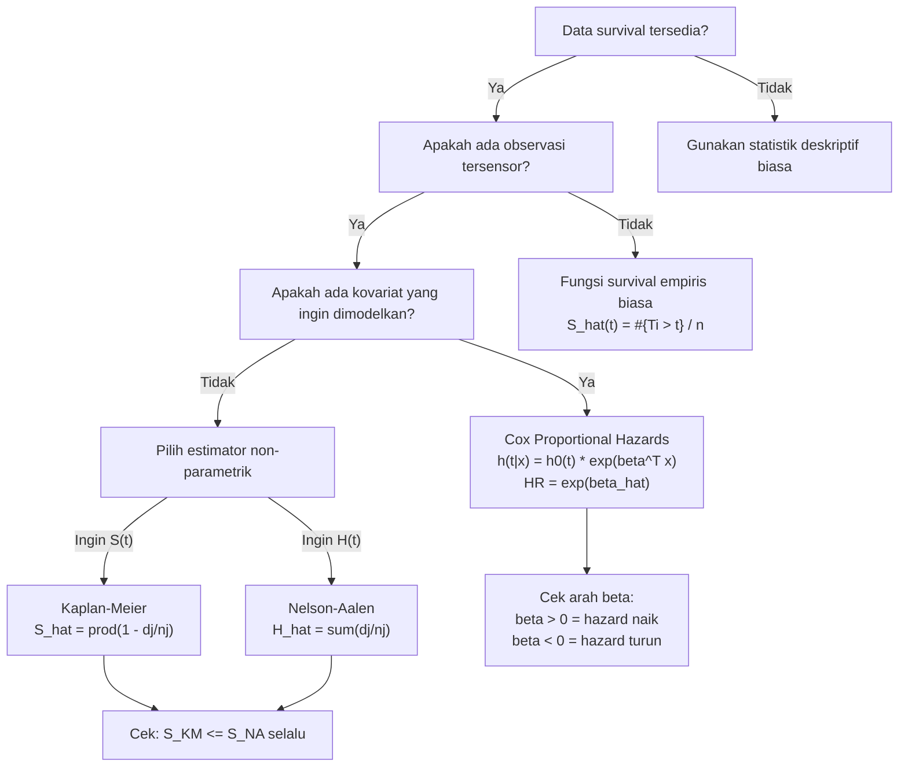

# 📊 1.5 — Censoring and Non-Parametric Estimation

> [!ABSTRACT] Ringkasan Cepat
> **Topik:** Censoring and Non-Parametric Estimation | **Bobot:** ~15–25% | **Difficulty:** Hard
> **Ref:** London (1997) Bab 6–8; Frees (2010) Bab 14 | **Prereq:** [[1.1 Survival and Lifetime Variables]], [[1.2 Survival and Hazard Functions]]

---

## Section 0 — Pemetaan Topik

| Topik TA1 | Sub-topik ID | Skill Diuji | Bobot | Difficulty | Prerequisite | Connected Topics | Referensi |
|---|---|---|---|---|---|---|---|
| Analisis Survival | 1.5 | Mengidentifikasi jenis sensoring; menghitung estimator Kaplan-Meier dan Nelson-Aalen dari data tersensor; memahami Cox PH dan estimator densitas Kernel | 15–25% | Hard | [[1.1 Survival and Lifetime Variables]], [[1.2 Survival and Hazard Functions]] | [[1.4 Parametric Survival Models]], [[1.6 Maximum Likelihood Estimation for Survival]] | London (1997) Bab 6–8; Frees (2010) Bab 14 |

---

## Section 1 — Intuisi

Bayangkan sebuah perusahaan asuransi jiwa melakukan studi mortalitas pada 200 nasabahnya yang baru bergabung pada tahun 2015. Mereka ingin membangun tabel mortalitas dari data nyata. Lima tahun kemudian, ketika studi berakhir di tahun 2020, baru 35 nasabah yang meninggal dunia. Sementara 165 lainnya masih hidup saat studi ditutup — dan beberapa lagi keluar di tengah jalan karena pindah perusahaan asuransi atau tidak bisa dihubungi. Pertanyaannya: bagaimana kita bisa mengestimasi distribusi mortalitas dari data yang tidak lengkap seperti ini?

Inilah masalah *censoring* (penyensoran). Data dikatakan *tersensor* ketika kita hanya tahu bahwa seseorang masih hidup sampai titik waktu tertentu, tetapi tidak tahu kapan ia akhirnya meninggal — karena studinya berakhir lebih dulu, atau karena individu tersebut keluar dari pengamatan. Jika kita abaikan individu tersensor dan hanya menghitung dari yang meninggal, estimasi kita akan sangat *bias* — seolah-olah mortalitas jauh lebih tinggi dari kenyataannya. Estimator non-parametrik hadir untuk mengatasi masalah ini: mereka menggunakan *semua* informasi yang tersedia, termasuk dari individu yang tersensor, dengan cara yang tepat secara statistik.

Estimator Kaplan-Meier adalah yang paling terkenal — ia memperbarui estimasi fungsi survival tepat di setiap waktu kematian yang diamati, dengan memperhitungkan berapa banyak individu yang masih "berisiko" pada saat itu. Nelson-Aalen, saudara kandungnya, bekerja dengan mengakumulasi estimasi *hazard rate* inkremental. Cox Proportional Hazards melangkah lebih jauh dengan memasukkan kovariat (misalnya jenis kelamin, usia, riwayat penyakit) tanpa perlu mengasumsikan bentuk spesifik dari hazard baseline. Ketiganya adalah alat terpenting dalam *survival analysis* modern — dan ketiganya diuji dalam TA1.

---

## Section 2 — Definisi Formal

> [!NOTE] Definisi Matematis — Jenis Sensoring
> Data survival $t_i$ dikatakan **tersensor kanan** (*right-censored*) jika yang diketahui hanya $T_i > c_i$ untuk suatu waktu sensor $c_i$, bukan nilai $T_i$ yang sesungguhnya. Observasi ke-$i$ direpresentasikan sebagai pasangan $(y_i, \delta_i)$ di mana:
>
> $$
> y_i = \min(T_i, c_i), \qquad \delta_i = \mathbf{1}(T_i \leq c_i) = \begin{cases} 1 & \text{jika } T_i \text{ teramati (event/kematian)} \\ 0 & \text{jika tersensor} \end{cases}
> $$

| Simbol | Makna | Catatan |
|---|---|---|
| $T_i$ | Waktu survival sejati individu ke-$i$ | Variabel acak, mungkin tidak teramati |
| $c_i$ | Waktu sensor (*censoring time*) individu ke-$i$ | Deterministic atau random |
| $y_i$ | Waktu pengamatan: $\min(T_i, c_i)$ | Yang benar-benar tercatat |
| $\delta_i$ | Indikator event: 1 jika meninggal, 0 jika tersensor | *Death indicator* |
| $n_j$ | Jumlah individu yang berisiko (*at risk*) sesaat sebelum waktu $t_j$ | Termasuk yang tersensor setelah $t_j$ |
| $d_j$ | Jumlah kematian (*deaths*) pada waktu $t_j$ | Hanya event yang teramati |
| $t_{(1)} < t_{(2)} < \cdots < t_{(k)}$ | Waktu-waktu kematian yang teramati (terurut) | $k$ = jumlah waktu kematian unik |
| $\hat{S}(t)$ | Estimasi fungsi survival pada waktu $t$ | Kaplan-Meier atau Nelson-Aalen |
| $\hat{H}(t)$ | Estimasi *cumulative hazard* pada waktu $t$ | Nelson-Aalen |
| $\hat{\Lambda}(t)$ | Notasi alternatif untuk cumulative hazard | $\hat{\Lambda}(t) = \hat{H}(t)$ |
| $h(t \mid \mathbf{x})$ | Hazard rate kondisional pada kovariat $\mathbf{x}$ | Untuk Cox PH |
| $h_0(t)$ | *Baseline hazard* (tidak dispesifikasi) | Untuk Cox PH |
| $\boldsymbol{\beta}$ | Vektor koefisien regresi Cox | Diestimasi via *partial likelihood* |

### Rumus Utama

#### A. Jenis-Jenis Sensoring

**Right censoring (tersensor kanan):** $T_i > c_i$ — individu masih hidup pada akhir studi atau saat keluar dari pengamatan. *Paling umum dalam data aktuaria.*

**Left censoring (tersensor kiri):** Event sudah terjadi sebelum pengamatan dimulai — hanya tahu $T_i < c_i^L$.

**Interval censoring (tersensor interval):** Hanya diketahui $T_i \in (L_i, R_i]$ — event terjadi dalam suatu interval waktu.

**Left truncation (trunkasi kiri):** Individu hanya masuk ke studi jika $T_i > \tau_i$ — seleksi masuk studi bergantung pada masih hidup. *Berbeda dari sensoring!*

#### B. Estimator Kaplan-Meier (Product-Limit)

$$
\hat{S}(t) = \prod_{j:\, t_{(j)} \leq t} \left(1 - \frac{d_j}{n_j}\right)
$$

**Label:** Perkalian probabilitas survive di setiap waktu kematian yang teramati hingga $t$. $\hat{S}(t)$ bersifat *step function* yang turun tepat di setiap $t_{(j)}$.

**Aproksimasi Kaplan-Meier untuk data besar (Greenwood):**

$$
\widehat{\text{Var}}[\hat{S}(t)] = [\hat{S}(t)]^2 \sum_{j:\, t_{(j)} \leq t} \frac{d_j}{n_j(n_j - d_j)}
$$

**Label:** Formula Greenwood untuk varians estimator Kaplan-Meier.

#### C. Estimator Nelson-Aalen

$$
\hat{H}(t) = \sum_{j:\, t_{(j)} \leq t} \frac{d_j}{n_j}
$$

**Label:** Akumulasi *hazard* inkremental $d_j/n_j$ di setiap waktu kematian hingga $t$.

**Konversi Nelson-Aalen ke fungsi survival:**

$$
\hat{S}_{\text{NA}}(t) = \exp\!\left(-\hat{H}(t)\right) = \exp\!\left(-\sum_{j:\, t_{(j)} \leq t} \frac{d_j}{n_j}\right)
$$

**Label:** Estimasi fungsi survival berbasis Nelson-Aalen — umumnya sedikit lebih tinggi dari Kaplan-Meier untuk sampel kecil.

#### D. Model Cox Proportional Hazards

$$
h(t \mid \mathbf{x}) = h_0(t) \cdot \exp(\boldsymbol{\beta}^\top \mathbf{x})
$$

**Label:** Hazard individu dengan kovariat $\mathbf{x}$ adalah *baseline hazard* $h_0(t)$ dikali faktor eksponensial dari kovariat. Bentuk $h_0(t)$ tidak perlu dispesifikasi.

**Hazard ratio antara dua individu:**

$$
\frac{h(t \mid \mathbf{x}_1)}{h(t \mid \mathbf{x}_2)} = \exp\!\left(\boldsymbol{\beta}^\top (\mathbf{x}_1 - \mathbf{x}_2)\right)
$$

**Label:** Rasio hazard bersifat *konstan* sepanjang waktu (asumsi proportional hazards) dan tidak bergantung pada bentuk $h_0(t)$.

#### E. Estimator Densitas Kernel

$$
\hat{f}(t) = \frac{1}{nh} \sum_{i=1}^{n} K\!\left(\frac{t - t_i}{h}\right)
$$

**Label:** Estimasi densitas non-parametrik dari $n$ observasi dengan *kernel function* $K(\cdot)$ dan *bandwidth* $h > 0$.

**Kernel Gaussian (paling umum):**

$$
K(u) = \frac{1}{\sqrt{2\pi}} e^{-u^2/2}
$$

**Label:** Setiap observasi berkontribusi sebagai "gundukan" normal kecil di sekitar nilainya.

### Asumsi Eksplisit

1. **Non-informatif censoring:** Mekanisme sensoring independen dari waktu survival — $T_i \perp c_i$. Ini asumsi paling kritis; jika dilanggar, semua estimator di atas menjadi bias.
2. **Independent censoring:** Waktu sensor tiap individu tidak bergantung pada status survival individu lain dalam studi.
3. **Kaplan-Meier:** Tidak ada ikatan (*ties*) antara waktu kematian dan waktu sensor; jika ada ties, individu tersensor dianggap keluar sesaat *setelah* waktu itu (konvensi umum).
4. **Cox PH:** *Proportional hazards* — rasio hazard antara dua individu konstan sepanjang waktu. Jika kovariat berinteraksi dengan waktu, asumsi ini dilanggar.
5. **Kernel density:** Bandwidth $h$ dipilih tepat — terlalu kecil menghasilkan estimasi *noisy* (overfit), terlalu besar menghasilkan estimasi yang terlalu halus (underfit).

---

## Section 3 — Jembatan Logika

> [!TIP] Dari Definisi ke Rumus — Mengapa Kaplan-Meier Berbentuk Produk?
> Bayangkan kita ingin menghitung $P(T > t)$ secara empiris. Kita bisa memecah peluang ini menjadi rantai peluang kondisional: "survive hingga $t_{(1)}$, lalu survive dari $t_{(1)}$ ke $t_{(2)}$, lalu survive dari $t_{(2)}$ ke $t_{(3)}$, ..." — seperti aturan perkalian dalam [[1.1 Survival and Lifetime Variables]]: ${}_{t+u}p_x = {}_{t}p_x \cdot {}_{u}p_{x+t}$. Di setiap waktu kematian $t_{(j)}$, estimasi peluang kematian kondisional adalah $d_j / n_j$ (dari $n_j$ orang yang berisiko, $d_j$ meninggal). Peluang kondisional *survive* di $t_{(j)}$ adalah $1 - d_j/n_j$. Produk dari semua faktor ini untuk $t_{(j)} \leq t$ adalah estimator Kaplan-Meier. Individu tersensor berkontribusi pada $n_j$ untuk semua $t_{(j)}$ sebelum waktu sensor mereka — mereka "membantu" menghitung penyebut — tetapi mereka tidak masuk ke $d_j$ karena tidak meninggal pada waktu itu.

> [!IMPORTANT] Perbedaan Sensoring vs Trunkasi
> - **Sensoring kanan:** Individu *masuk* ke studi, lalu *hilang* sebelum event terjadi. Kita tahu ia hidup sampai waktu sensor $c_i$. Nilai $y_i = c_i$ dengan $\delta_i = 0$.
> - **Trunkasi kiri:** Individu hanya *masuk* ke studi jika ia masih hidup pada waktu $\tau_i$. Individu yang meninggal sebelum $\tau_i$ tidak pernah tercatat sama sekali — ini menyebabkan **bias seleksi** yang berbeda dari sensoring. Dalam trunkasi kiri, $n_j$ harus dihitung hanya dari individu yang sudah masuk ke studi pada waktu $t_{(j)}$.
> - Keduanya perlu penanganan berbeda dalam estimasi $n_j$.

**Derivasi Prosedur Kaplan-Meier Step-by-Step:**

Misalkan data survival (waktu, indikator) terurut: $(t_{(1)}, d_1, n_1), (t_{(2)}, d_2, n_2), \ldots, (t_{(k)}, d_k, n_k)$.

**Langkah 1:** Urutkan semua waktu kematian yang teramati secara ascending: $t_{(1)} < t_{(2)} < \cdots < t_{(k)}$.

**Langkah 2:** Untuk setiap $t_{(j)}$, hitung $n_j$ = jumlah individu yang masih *at risk* sesaat sebelum $t_{(j)}$:

$$
n_j = \#\{i : y_i \geq t_{(j)}\}
$$

Individu dengan $y_i = c_i < t_{(j)}$ (sudah tersensor sebelum $t_{(j)}$) **tidak** masuk ke $n_j$.

**Langkah 3:** Hitung faktor kondisional survive di $t_{(j)}$:

$$
\hat{p}_j = 1 - \frac{d_j}{n_j}
$$

**Langkah 4:** Estimasi Kaplan-Meier adalah produk kumulatif:

$$
\hat{S}(t) = \prod_{j:\, t_{(j)} \leq t} \hat{p}_j = \prod_{j:\, t_{(j)} \leq t} \frac{n_j - d_j}{n_j}
$$

**Langkah 5:** $\hat{S}(t)$ bersifat *step function* — nilainya konstan antara dua waktu kematian berturutan, dan turun tiba-tiba tepat di setiap $t_{(j)}$.

**Langkah 6 — Perbarui $n_j$ saat ada sensoring antara dua waktu kematian:** Jika ada $c$ individu tersensor dalam interval $(t_{(j)}, t_{(j+1)})$, maka $n_{j+1} = n_j - d_j - c$.

> [!DANGER] Dilarang
> 1. **Jangan** memasukkan individu tersensor ke dalam $d_j$. Hanya kematian yang teramati ($\delta_i = 1$) yang masuk ke $d_j$. Individu tersensor ($\delta_i = 0$) hanya berkontribusi ke $n_j$ selama mereka masih dalam studi.
> 2. **Jangan** membuang (drop) observasi tersensor dari analisis. Membuang mereka menyebabkan estimasi **bias ke atas** — seolah-olah mortalitas lebih tinggi dari sebenarnya karena hanya tersisa individu yang meninggal.
> 3. **Jangan** menggunakan estimator Nelson-Aalen $\hat{S}_{\text{NA}}(t) = e^{-\hat{H}(t)}$ dan mengira hasilnya identik dengan Kaplan-Meier. Untuk sampel besar keduanya sangat dekat, tetapi untuk sampel kecil $\hat{S}_{\text{NA}}(t) \geq \hat{S}_{\text{KM}}(t)$ karena $1 - x \leq e^{-x}$ untuk $x \in [0,1]$.

---

## Section 4 — Contoh Soal

### Soal A — Fundamental

**Soal:** Sebuah studi survival mencatat 8 individu dengan data berikut (dalam bulan). Tanda "+" menunjukkan tersensor kanan:

$3, \; 5^+, \; 6, \; 8, \; 9^+, \; 10, \; 12^+, \; 14$

Hitunglah estimator Kaplan-Meier $\hat{S}(t)$ untuk semua $t$, dan tentukan nilai $\hat{S}(10)$.

> [!SUCCESS] Solusi Soal A
> **Pendekatan:** Susun tabel Kaplan-Meier dengan kolom $t_{(j)}$, $n_j$, $d_j$, faktor kondisional, dan $\hat{S}$ kumulatif.
>
> **1. Identifikasi Variabel**
> - $n = 8$ individu total
> - Waktu kematian teramati: $3, 6, 8, 10, 14$ (tanpa tanda "+") → $k = 5$
> - Waktu tersensor: $5, 9, 12$ (dengan tanda "+")
>
> **2. Identifikasi Distribusi / Model**
> Data campuran: 5 event teramati, 3 observasi tersensor kanan. Gunakan Kaplan-Meier — tidak ada asumsi distribusi parametrik.
>
> **3. Setup Persamaan**
>
> $$
> \hat{S}(t) = \prod_{j:\, t_{(j)} \leq t} \left(1 - \frac{d_j}{n_j}\right)
> $$
>
> **4. Eksekusi Aljabar**
>
> Susun tabel prosedur (perbarui $n_j$ saat ada sensoring sebelum $t_{(j+1)}$):
>
> | $t_{(j)}$ | Event sebelum $t_{(j)}$ | $n_j$ | $d_j$ | $1 - d_j/n_j$ | $\hat{S}(t_{(j)})$ |
> |---|---|---|---|---|---|
> | $3$ | — | $8$ | $1$ | $7/8$ | $7/8 = 0.8750$ |
> | $6$ | sensor $5^+$ keluar setelah $t=3$ | $6$ | $1$ | $5/6$ | $(7/8)(5/6) = 0.7292$ |
> | $8$ | — | $5$ | $1$ | $4/5$ | $(0.7292)(4/5) = 0.5833$ |
> | $10$ | sensor $9^+$ keluar setelah $t=8$ | $3$ | $1$ | $2/3$ | $(0.5833)(2/3) = 0.3889$ |
> | $14$ | sensor $12^+$ keluar setelah $t=10$ | $1$ | $1$ | $0/1$ | $(0.3889)(0) = 0$ |
>
> Untuk $t = 10$: tepat pada $t_{(4)} = 10$, sehingga:
>
> $$
> \hat{S}(10) = \frac{7}{8} \times \frac{5}{6} \times \frac{4}{5} \times \frac{2}{3} = \frac{7 \times 5 \times 4 \times 2}{8 \times 6 \times 5 \times 3} = \frac{280}{720} = \frac{7}{18} \approx 0.3889
> $$
>
> **5. Verification**
> Cek: $n_j$ turun dari 8 dengan cara: $8 \to 8-1=7$ (setelah $t=3$) $\to 7-1=6$ (setelah sensor $5^+$) $\to 6-1=5$ (setelah $t=6$) $\to 5-1=4$ (setelah $t=8$) $\to 4-1=3$ (setelah sensor $9^+$) $\to 3-1=2$ (setelah $t=10$) $\to 2-1=1$ (setelah sensor $12^+$) $\to 1-1=0$ (setelah $t=14$). Konsisten. ✓
>
> **Hasil:** $\hat{S}(10) = 7/18 \approx 38.89\%$ — sekitar 39% dari individu diperkirakan masih hidup melewati 10 bulan.

> [!WARNING] Exam Tips — Soal A
> **Target waktu:** 4 menit. **Common trap:** Lupa mengurangi $n_j$ untuk individu tersensor yang keluar *antara* dua waktu kematian. Sensor $5^+$ keluar setelah $t=3$ tetapi sebelum $t=6$, sehingga $n$ turun dari 7 menjadi 6 sebelum $t_{(2)}=6$. **Shortcut:** Susun *timeline* semua kejadian (kematian dan sensoran) berurutan, lalu lacak $n$ yang tersisa satu per satu.

---

### Soal B — Exam-Typical

**Soal:** Dengan data yang sama pada Soal A, hitunglah estimator Nelson-Aalen $\hat{H}(t)$ dan estimasi fungsi survival berbasis Nelson-Aalen $\hat{S}_{\text{NA}}(t)$ untuk $t = 8$. Bandingkan dengan Kaplan-Meier.

> [!SUCCESS] Solusi Soal B
> **Pendekatan:** Akumulasikan inkremen $d_j/n_j$ di setiap waktu kematian hingga $t = 8$, lalu konversi ke survival via eksponensial negatif.
>
> **1. Identifikasi Variabel**
> - Waktu kematian: $3, 6, 8, 10, 14$; $n_j$ dan $d_j$ dari tabel Soal A
> - Target: $\hat{H}(8)$ dan $\hat{S}_{\text{NA}}(8)$
>
> **2. Identifikasi Distribusi / Model**
> Nelson-Aalen: estimator hazard kumulatif non-parametrik. Tidak memerlukan asumsi distribusi.
>
> **3. Setup Persamaan**
>
> $$
> \hat{H}(t) = \sum_{j:\, t_{(j)} \leq t} \frac{d_j}{n_j}, \qquad \hat{S}_{\text{NA}}(t) = e^{-\hat{H}(t)}
> $$
>
> **4. Eksekusi Aljabar**
>
> Inkremen hazard hingga $t = 8$:
>
> | $t_{(j)}$ | $d_j$ | $n_j$ | $d_j/n_j$ | $\hat{H}(t_{(j)})$ kumulatif |
> |---|---|---|---|---|
> | $3$ | $1$ | $8$ | $0.12500$ | $0.12500$ |
> | $6$ | $1$ | $6$ | $0.16667$ | $0.29167$ |
> | $8$ | $1$ | $5$ | $0.20000$ | $0.49167$ |
>
> $$
> \hat{H}(8) = \frac{1}{8} + \frac{1}{6} + \frac{1}{5} = 0.12500 + 0.16667 + 0.20000 = 0.49167
> $$
>
> $$
> \hat{S}_{\text{NA}}(8) = e^{-0.49167} = 0.6118
> $$
>
> **Perbandingan dengan Kaplan-Meier:**
>
> $$
> \hat{S}_{\text{KM}}(8) = 0.5833 \quad \text{vs} \quad \hat{S}_{\text{NA}}(8) = 0.6118
> $$
>
> **5. Verification**
> Secara teoritis: $1 - x \leq e^{-x}$ untuk $x \geq 0$, sehingga setiap faktor $(1 - d_j/n_j) \leq e^{-d_j/n_j}$, yang berarti $\hat{S}_{\text{KM}}(t) \leq \hat{S}_{\text{NA}}(t)$ — terbukti: $0.5833 \leq 0.6118$. ✓ Untuk sampel kecil ($n=8$), selisih cukup terlihat. Untuk $n$ besar, keduanya akan sangat dekat.
>
> **Hasil:** $\hat{H}(8) \approx 0.4917$; $\hat{S}_{\text{NA}}(8) \approx 0.612$. Nelson-Aalen memberikan estimasi survival yang sedikit lebih optimis dari Kaplan-Meier pada sampel kecil.

> [!WARNING] Exam Tips — Soal B
> **Target waktu:** 3–4 menit. **Common trap:** Menggunakan $n_j$ yang salah (tidak memperbarui untuk individu tersensor). $n_j$ harus konsisten dengan tabel Kaplan-Meier — gunakan tabel yang sama. **Shortcut:** Nelson-Aalen = jumlahkan $1/n_j$ di setiap kematian (jika $d_j = 1$ selalu). Untuk $d_j > 1$, gunakan $d_j/n_j$.

---

### Soal C — Challenging

**Soal:** Studi survival pada pasien penyakit jantung mencatat variabel kovariat "merokok" ($x = 1$ jika perokok, $x = 0$ jika bukan). Model Cox Proportional Hazards diestimasi menghasilkan $\hat{\beta} = 0.693$ untuk variabel merokok.

(a) Tentukan hazard ratio antara perokok dan bukan perokok.
(b) Jika hazard baseline pada $t = 5$ tahun adalah $h_0(5) = 0.04$ per tahun, berapa hazard perokok pada $t = 5$?
(c) Jelaskan arti dari asumsi *proportional hazards* dalam konteks ini.
(d) Jika $\hat{S}_0(5) = 0.82$ (survival baseline pada $t=5$), estimasikan $\hat{S}(5 \mid x=1)$ untuk seorang perokok.

> [!SUCCESS] Solusi Soal C
> **Pendekatan:** Gunakan definisi Cox PH: $h(t \mid x) = h_0(t) \cdot e^{\beta x}$. Untuk survival: $S(t \mid x) = [S_0(t)]^{e^{\beta x}}$.
>
> **1. Identifikasi Variabel**
> - $\hat{\beta} = 0.693$, kovariat $x \in \{0, 1\}$ (merokok)
> - $h_0(5) = 0.04$ per tahun
> - $\hat{S}_0(5) = 0.82$ (survival baseline)
>
> **2. Identifikasi Distribusi / Model**
> Model Cox PH semi-parametrik: $h(t \mid x) = h_0(t) \cdot e^{\beta x}$. Bentuk $h_0(t)$ tidak diasumsikan — hanya koefisien $\beta$ yang diestimasi.
>
> **3. Setup Persamaan**
>
> $$
> \text{HR} = \frac{h(t \mid x=1)}{h(t \mid x=0)} = e^{\hat{\beta} \cdot (1 - 0)} = e^{\hat{\beta}}
> $$
>
> $$
> h(t \mid x=1) = h_0(t) \cdot e^{\hat{\beta} \times 1}
> $$
>
> $$
> S(t \mid x) = [S_0(t)]^{e^{\beta x}}
> $$
>
> **4. Eksekusi Aljabar**
>
> **(a) Hazard Ratio:**
>
> $$
> \text{HR} = e^{0.693} = e^{\ln 2} = 2.0
> $$
>
> Perokok memiliki hazard kematian **2 kali lipat** dibanding bukan perokok pada setiap waktu $t$.
>
> **(b) Hazard perokok pada $t = 5$:**
>
> $$
> h(5 \mid x=1) = h_0(5) \times e^{0.693} = 0.04 \times 2.0 = 0.08 \text{ per tahun}
> $$
>
> **(c) Arti proportional hazards:**
> Rasio hazard antara perokok dan bukan perokok adalah **konstan** = 2.0 untuk semua nilai $t$, tidak bergantung pada waktu. Artinya, perokok selalu memiliki risiko kematian sesaat yang 2 kali lebih besar dari bukan perokok, baik di tahun ke-1, ke-5, maupun ke-20 studi.
>
> **(d) Survival perokok pada $t = 5$:**
>
> $$
> \hat{S}(5 \mid x=1) = [\hat{S}_0(5)]^{e^{\hat{\beta} \times 1}} = (0.82)^{e^{0.693}} = (0.82)^{2.0} = 0.6724
> $$
>
> **5. Verification**
> $\hat{S}(5 \mid x=1) = 0.6724 < \hat{S}_0(5) = 0.82$ — masuk akal, perokok memiliki survival lebih rendah. ✓ Relasi $S(t \mid x) = [S_0(t)]^{e^{\beta x}}$ diturunkan dari $H(t \mid x) = e^{\beta x} H_0(t)$ dan $S = e^{-H}$.
>
> **Hasil:** (a) HR $= 2.0$; (b) $h(5 \mid \text{perokok}) = 0.08$/tahun; (c) risiko perokok selalu 2× bukan perokok di semua waktu; (d) $\hat{S}(5 \mid \text{perokok}) = 0.6724$.

> [!WARNING] Exam Tips — Soal C
> **Target waktu:** 5 menit. **Common trap:** Mengira $S(t \mid x) = S_0(t) \times e^{\beta x}$ (perkalian linear) — SALAH. Rumus yang benar adalah $S(t \mid x) = [S_0(t)]^{e^{\beta x}}$ (pangkat). Ini karena $H(t \mid x) = e^{\beta x} H_0(t)$ dan $S = e^{-H}$. **Shortcut:** Jika $\hat{\beta} = \ln 2$, maka $e^{\hat{\beta}} = 2$ — hazard ratio tepat 2, dan $S(t \mid x=1) = [S_0(t)]^2$.

---

## Section 5 — Verifikasi & Sanity Check

> [!CHECK] Cek Monotonisitas dan Batas Kaplan-Meier
> Estimasi Kaplan-Meier harus memenuhi:
>
> $$
> 1 = \hat{S}(0) \geq \hat{S}(t_1) \geq \hat{S}(t_2) \geq \cdots \geq 0 \quad \text{untuk } t_1 < t_2
> $$
>
> Dan $\hat{S}(t) = \hat{S}(t_{(j)})$ untuk semua $t \in [t_{(j)}, t_{(j+1)})$ — nilainya konstan antara dua kematian. Jika ada $\hat{S}$ yang naik, ada kesalahan penghitungan $n_j$ atau urutan kejadian.

> [!CHECK] Konsistensi Nelson-Aalen dengan Kaplan-Meier
> Untuk setiap $j$, harus selalu berlaku:
>
> $$
> \hat{S}_{\text{KM}}(t) \leq \hat{S}_{\text{NA}}(t) \quad \text{karena} \quad 1 - \frac{d_j}{n_j} \leq e^{-d_j/n_j}
> $$
>
> Jika $\hat{S}_{\text{KM}} > \hat{S}_{\text{NA}}$, ada kesalahan hitung. Untuk sampel besar, selisihnya mengecil dan keduanya konvergen ke nilai yang sama.

> [!CHECK] Cek Cox PH — Arah Koefisien
> - $\hat{\beta} > 0$ → kovariat meningkatkan hazard (memperburuk survival)
> - $\hat{\beta} < 0$ → kovariat menurunkan hazard (memperbaiki survival)
> - $\hat{\beta} = 0$ → kovariat tidak mempengaruhi hazard
>
> Selalu verifikasi: apakah arah $\hat{\beta}$ konsisten dengan konteks biologi/aktuaria soal?

### Metode Alternatif — Kaplan-Meier via Fraksional

Untuk data besar, KM bisa diaproksimasi dengan mengamati proporsi survival secara langsung tanpa membangun tabel baris per baris. Namun untuk ujian dengan data kecil, prosedur tabel penuh selalu lebih aman dan mudah dicek.

---

## Section 6 — Visualisasi Mental

**Kaplan-Meier sebagai *step function*:**

Bayangkan sumbu $X$ adalah waktu (bulan/tahun) dan sumbu $Y$ adalah proporsi survive $\hat{S}(t)$:

- Kurva dimulai dari $\hat{S}(0) = 1.0$ (semua individu hidup di awal studi).
- Kurva *flat* (tidak bergerak) antara dua waktu kematian — tidak ada informasi baru tentang kematian di sana.
- Kurva *turun tiba-tiba* (step down) tepat di waktu kematian yang teramati $t_{(j)}$ — besarnya lompatan adalah $(d_j/n_j) \times \hat{S}(t_{(j)}^-)$.
- Individu tersensor **tidak** menyebabkan kurva turun — mereka hanya "menyusutkan" $n_j$ untuk kematian berikutnya.
- Tanda "+" (*tick mark*) sering ditambahkan di titik sensoran pada kurva untuk menunjukkan lokasi data tersensor.

```
S(t)
1.0 |****
    |    *                          ← flat antara kematian
    |     **
0.8 |       *
    |        ***
0.6 |           *    +  ← tanda sensor
    |            **
0.4 |              **
    |                *
0.2 |                 **
    |                   *
0.0 |_____________________________ t
    0   3  5 6  8  9  10 12 14
        d  + d  d  +  d  +  d
```

**Nelson-Aalen sebagai *step function* kumulatif hazard:**

Sumbu $Y$ adalah $\hat{H}(t)$ — dimulai dari 0 dan naik monoton. Setiap kematian menambah inkremen $d_j/n_j$. Semakin besar $n_j$ relatif terhadap $d_j$, semakin kecil "loncatan" naik.

### Hubungan Visual ↔ Rumus

| Elemen Visual | Komponen Rumus |
|---|---|
| Panjang tiap *step* turun di KM | $(d_j/n_j) \times \hat{S}(t_{(j)}^-)$ |
| Tinggi *flat* antara $t_{(j)}$ dan $t_{(j+1)}$ | $\hat{S}(t_{(j)})$ — nilai konstan |
| Lebar *step* di Nelson-Aalen | $d_j/n_j$ — inkremen hazard |
| Tanda "+" pada kurva | Posisi sensor kanan — tidak mengubah nilai $\hat{S}$ |
| Kurva KM turun lebih tajam dari NA di sampel kecil | $1 - x < e^{-x}$ untuk $x > 0$ |

---

## Section 7 — Jebakan Umum

> [!BUG] Kesalahan Parametrisasi
> **Salah:** Menghitung $n_j$ sebagai jumlah total individu dikurangi hanya kematian sebelumnya, tanpa memperbarui untuk individu tersensor yang sudah keluar.
> **Benar:** $n_j = n_{j-1} - d_{j-1} - c_{j-1}$ di mana $c_{j-1}$ adalah jumlah individu tersensor dalam interval $(t_{(j-1)}, t_{(j)})$. Setiap sensor yang keluar antara dua kematian harus dikurangkan dari $n$ sebelum kematian berikutnya.

> [!BUG] Kesalahan Konseptual
> 1. **Sensoring ≠ Trunkasi:** Sensoring terjadi *setelah* individu masuk ke studi; trunkasi kiri terjadi *sebelum* individu masuk (yang meninggal sebelum masuk tidak tercatat sama sekali). Keduanya mengurangi $n_j$ tetapi dengan cara berbeda.
> 2. **KM bukan rata-rata empiris biasa:** $\hat{S}(t) \neq$ (jumlah yang hidup melewati $t$) / (total individu). Formula rata-rata biasa mengabaikan sensoran dan menghasilkan estimasi bias. KM menggunakan probabilitas kondisional yang benar.
> 3. **Nelson-Aalen bukan invers Kaplan-Meier:** $\hat{S}_{\text{NA}} = e^{-\hat{H}}$, bukan $1 / (1 + \hat{H})$ atau formula lain. Dan $\hat{H}_{\text{NA}} \neq -\ln \hat{S}_{\text{KM}}$ secara eksak — hanya asimtotik.
> 4. **Cox PH bukan model parametrik penuh:** Bentuk $h_0(t)$ tidak dispesifikasi. Yang diestimasi hanya $\boldsymbol{\beta}$, bukan $h_0(t)$. Ini membuat Cox lebih fleksibel tapi juga tidak bisa digunakan untuk prediksi absolut tanpa estimasi $h_0(t)$ tambahan.

> [!BUG] Kesalahan Interpretasi Soal
> - Kata **"censored at time $c$"** → individu tersensor kanan; $y_i = c$, $\delta_i = 0$. Jangan masukkan ke $d_j$.
> - Kata **"study ends at time $T^*$"** → semua individu yang masih hidup pada $T^*$ adalah tersensor kanan pada $T^*$.
> - Kata **"withdrawn from study"** atau **"lost to follow-up"** → tersensor kanan pada waktu penarikan.
> - Kata **"hazard ratio"** dalam Cox → langsung $e^{\hat{\beta}}$; bukan $\hat{\beta}$ itu sendiri.
> - Ketika soal meminta $\hat{S}(t)$ untuk $t$ **di antara** dua waktu kematian → nilai KM sama dengan nilai di waktu kematian sebelumnya (kurva flat).

> [!CAUTION] Red Flags
> - Jika tabel data mengandung tanda **"+" atau "c"** di samping waktu → data tersensor, WAJIB gunakan KM atau Nelson-Aalen, bukan proporsi empiris biasa.
> - Jika soal menyebut **"ties"** (beberapa kematian pada waktu yang sama) → $d_j > 1$ pada $t_{(j)}$ tersebut — pastikan $n_j$ dihitung dengan benar sebelum ties.
> - Jika diminta **membandingkan KM dan Nelson-Aalen** → ingat selalu $\hat{S}_{\text{KM}} \leq \hat{S}_{\text{NA}}$ dan selisih mengecil untuk $n$ besar.
> - Jika soal Cox PH memberikan $S_0(t)$ dan meminta $S(t \mid \mathbf{x})$ → gunakan $S(t \mid \mathbf{x}) = [S_0(t)]^{e^{\boldsymbol{\beta}^\top \mathbf{x}}}$, BUKAN $S_0(t) \times e^{\boldsymbol{\beta}^\top \mathbf{x}}$.

---

## Section 8 — Ringkasan Eksekutif

> [!SUMMARY] Must-Remember
>
> 1. **Observasi tersensor:** pasangan $(y_i, \delta_i)$ dengan $y_i = \min(T_i, c_i)$ dan $\delta_i = \mathbf{1}(T_i \leq c_i)$.
>
> 2. **Kaplan-Meier (Product-Limit):**
> $$\hat{S}(t) = \prod_{j:\, t_{(j)} \leq t} \left(1 - \frac{d_j}{n_j}\right)$$
>
> 3. **Nelson-Aalen (Cumulative Hazard):**
> $$\hat{H}(t) = \sum_{j:\, t_{(j)} \leq t} \frac{d_j}{n_j}, \qquad \hat{S}_{\text{NA}}(t) = e^{-\hat{H}(t)}$$
>
> 4. **Hubungan KM vs NA:** $\hat{S}_{\text{KM}}(t) \leq \hat{S}_{\text{NA}}(t)$ karena $1 - x \leq e^{-x}$.
>
> 5. **Cox PH — Hazard Ratio dan Survival:**
> $$\text{HR} = e^{\hat{\beta}}, \qquad S(t \mid \mathbf{x}) = [S_0(t)]^{e^{\boldsymbol{\beta}^\top \mathbf{x}}}$$

### Kapan Digunakan

- Data mengandung sensoran (tanda "+") dan tidak ada asumsi model parametrik → **Kaplan-Meier** atau **Nelson-Aalen**.
- Soal meminta estimasi *cumulative hazard* → **Nelson-Aalen** langsung, tanpa perlu konversi.
- Soal meminta perbandingan dua grup survival dengan kovariat → **Cox PH** (hazard ratio).
- Data besar, soal meminta aproksimasi varians $\hat{S}(t)$ → **Formula Greenwood**.
- Soal meminta estimasi "smooth" dari densitas tanpa asumsi distribusi → **Kernel Density Estimator**.

### Kapan TIDAK Boleh Digunakan

- Jika model distribusi sudah dispesifikasi (Gompertz, Weibull, dll.) → gunakan model parametrik dari [[1.4 Parametric Survival Models]] dan [[1.6 Maximum Likelihood Estimation for Survival]].
- Jika data **tidak tersensor** sama sekali → KM mereduksi menjadi fungsi survival empiris biasa $\hat{S}(t) = \#\{i: T_i > t\}/n$ — bisa dihitung lebih sederhana.
- Jika soal menyangkut **multiple states** (hidup/sakit/mati) → beralih ke [[2.1 Multiple State and Markov Models]].

### Quick Decision Tree



---

> [!QUOTE] Follow-up Options
> 1. *"Berikan contoh soal Kaplan-Meier dengan ties (beberapa kematian di waktu yang sama)"*
> 2. *"Jelaskan hubungan [[1.5 Censoring and Non-Parametric Estimation]] dengan [[1.6 Maximum Likelihood Estimation for Survival]]"*
> 3. *"Buat flashcard 1-halaman perbandingan KM vs Nelson-Aalen vs Cox PH"*

*📖 Ref: London (1997) Bab 6–8; Frees (2010) Bab 14 | 🗓️ 2026-04-19 | #TA1 #NonParametricEstimation #Censoring*
