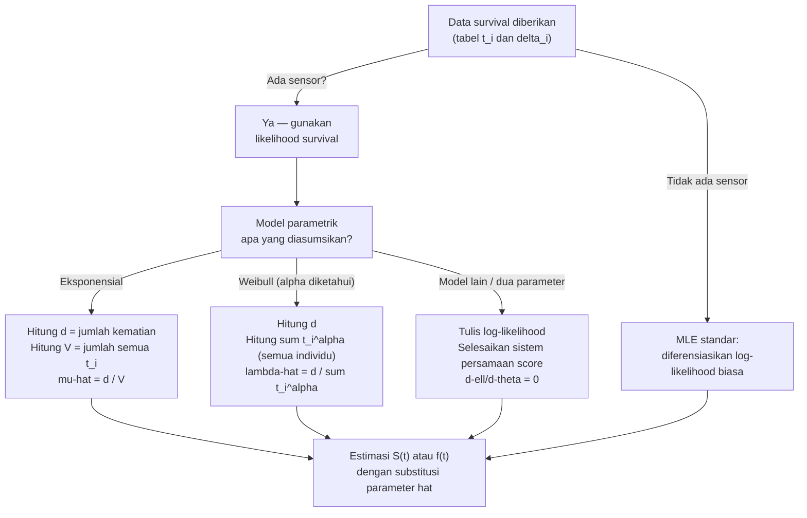

# 📊 1.6 — Maximum Likelihood Estimation for Survival

> [!ABSTRACT] Ringkasan Cepat
> **Topik:** MLE untuk Model Survival Parametrik | **Bobot:** ~15–25% | **Difficulty:** Hard
> **Ref:** London (1997) Bab 6–8; Frees (2010) Bab 14 | **Prereq:** [[1.2 Survival and Hazard Functions]], [[1.4 Parametric Survival Models]], [[1.5 Censoring and Non-Parametric Estimation]]

---

## Section 0 — Pemetaan Topik

| Topik TA1 | Sub-topik ID | Skill Diuji | Bobot | Difficulty | Prerequisite | Connected Topics | Referensi |
|---|---|---|---|---|---|---|---|
| Analisis Survival | 1.6 | Konstruksi fungsi likelihood dengan data tersensor; turunkan log-likelihood; selesaikan persamaan likelihood untuk estimasi parameter MLE model eksponensial, Weibull, Gompertz | 15–25% | Hard | [[1.2 Survival and Hazard Functions]], [[1.4 Parametric Survival Models]], [[1.5 Censoring and Non-Parametric Estimation]] | [[2.2 MLE for Transition Intensities]], [[1.3 Curtate Future Lifetime]] | London (1997) Bab 6–8; Frees (2010) Bab 14 |

---

## Section 1 — Intuisi

Bayangkan sebuah perusahaan asuransi jiwa memiliki data 500 nasabah yang diamati selama 5 tahun. Sebagian nasabah meninggal dunia dalam periode pengamatan — waktu kematian mereka tercatat dengan tepat. Namun sebagian lainnya masih hidup saat periode pengamatan berakhir, atau berhenti membayar premi dan keluar dari portofolio di tengah jalan. Untuk nasabah kelompok kedua ini, yang diketahui hanyalah bahwa mereka masih hidup *sampai* titik tertentu — informasi yang tidak lengkap, namun tetap berharga. Inilah yang disebut **data tersensor** (*censored data*).

Pertanyaannya: bagaimana kita mengestimasi parameter model distribusi survival — misalnya laju kematian rata-rata $\mu$ pada model eksponensial, atau parameter bentuk $\alpha$ pada model Weibull — dari data yang sebagian tidak lengkap ini? Jawaban standar statistika adalah **Maximum Likelihood Estimation (MLE)**. Ide intinya sederhana: temukan nilai parameter yang membuat data yang kita amati "paling mungkin terjadi". Untuk data survival yang tersensor, fungsi likelihood harus dimodifikasi agar kontribusi setiap individu — baik yang meninggal maupun yang tersensor — direpresentasikan dengan tepat.

Keindahan MLE dalam konteks survival adalah kemampuannya untuk memanfaatkan *semua* informasi yang tersedia: individu yang meninggal berkontribusi melalui nilai densitas (seberapa mungkin ia meninggal tepat pada waktu itu), sementara individu yang tersensor berkontribusi melalui nilai probabilitas survival (seberapa mungkin ia masih hidup sampai waktu sensor). Hasilnya adalah estimator yang konsisten, asimtotik normal, dan efisien — properti yang sangat diinginkan dalam pemodelan aktuaria.

---

## Section 2 — Definisi Formal

> [!NOTE] Definisi Matematis Inti
> Untuk sampel $n$ individu dengan waktu pengamatan $t_i$ dan indikator kematian $\delta_i \in \{0, 1\}$ (di mana $\delta_i = 1$ berarti individu $i$ meninggal, $\delta_i = 0$ berarti tersensor), fungsi likelihood parametrik adalah:
>
> $$L(\theta) = \prod_{i=1}^{n} \left[f(t_i;\,\theta)\right]^{\delta_i} \left[S(t_i;\,\theta)\right]^{1-\delta_i}$$
>
> di mana $\theta$ adalah vektor parameter yang hendak diestimasi.

### Tabel Variabel & Parameter

| Simbol | Makna | Catatan |
|---|---|---|
| $\theta$ | Vektor parameter model (e.g., $\mu$, $\alpha$, $\lambda$) | Yang hendak diestimasi |
| $t_i$ | Waktu pengamatan individu $i$ (waktu kematian atau waktu sensor) | $t_i > 0$ |
| $\delta_i$ | Indikator kematian: $1$ = meninggal, $0$ = tersensor | Bernilai biner |
| $f(t;\,\theta)$ | Fungsi densitas model parametrik | Kontribusi individu yang meninggal |
| $S(t;\,\theta)$ | Fungsi survival model parametrik | Kontribusi individu yang tersensor |
| $\mu(t;\,\theta)$ | Fungsi hazard model parametrik | $= f(t;\,\theta)/S(t;\,\theta)$ |
| $L(\theta)$ | Fungsi likelihood | Produk kontribusi semua individu |
| $\ell(\theta)$ | Log-likelihood: $\ell(\theta) = \ln L(\theta)$ | Dioptimalkan dalam praktek |
| $\hat{\theta}$ | Estimator MLE dari $\theta$ | Solusi dari $\partial \ell / \partial \theta = 0$ |
| $d$ | Jumlah kematian yang teramati dalam sampel | $d = \sum_{i=1}^n \delta_i$ |
| $V$ | Total waktu pengamatan (exposure): $V = \sum_{i=1}^n t_i$ | Digunakan pada model hazard konstan |

### Rumus Utama

**1. Fungsi Likelihood Umum (data tersensor kanan):**

$$L(\theta) = \prod_{i=1}^{n} \left[f(t_i;\,\theta)\right]^{\delta_i} \left[S(t_i;\,\theta)\right]^{1-\delta_i}$$

*Label: Inti MLE survival — mesin utama yang harus dikuasai.*

**2. Menggunakan $f = \mu \cdot S$, likelihood dapat ditulis ulang:**

$$L(\theta) = \prod_{i=1}^{n} \left[\mu(t_i;\,\theta)\right]^{\delta_i} S(t_i;\,\theta)$$

*Label: Bentuk hazard — lebih mudah diturunkan log-likelihood-nya untuk model dengan hazard sederhana.*

**3. Log-likelihood umum:**

$$\ell(\theta) = \sum_{i=1}^{n} \delta_i \ln f(t_i;\,\theta) + \sum_{i=1}^{n} (1-\delta_i) \ln S(t_i;\,\theta)$$

*Label: Selalu ubah ke log-likelihood sebelum didiferensiasikan — produk menjadi penjumlahan.*

**4. Log-likelihood dalam bentuk hazard:**

$$\ell(\theta) = \sum_{i=1}^{n} \delta_i \ln \mu(t_i;\,\theta) + \sum_{i=1}^{n} \ln S(t_i;\,\theta)$$

*Label: Karena $\ln S(t_i;\,\theta) = -\int_0^{t_i} \mu(s;\,\theta)\, ds$, bentuk ini menghubungkan hazard dan survival secara eksplisit.*

**5. MLE untuk model eksponensial ($\mu(t) = \mu$, konstan):**

$$\hat{\mu} = \frac{d}{V} = \frac{\text{jumlah kematian}}{\text{total exposure}}$$

*Label: Hasil MLE paling penting dan paling sering diuji — rasio kematian per unit waktu total.*

**6. Persamaan likelihood score (syarat perlu optimum):**

$$\frac{\partial \ell(\theta)}{\partial \theta} = 0$$

*Label: Selesaikan sistem persamaan ini untuk mendapatkan $\hat{\theta}$; untuk model non-eksponensial seringkali memerlukan metode numerik.*

### Asumsi Eksplisit

1. **Sensor independen:** Mekanisme sensor tidak bergantung pada waktu hidup sebenarnya individu — sensor bersifat *non-informative*.
2. **Model parametrik benar:** Distribusi survival benar-benar mengikuti bentuk fungsional yang diasumsikan (eksponensial, Weibull, Gompertz, dll.).
3. **Sensor kanan:** Semua sensor adalah *right censoring* — individu diketahui hidup sampai $t_i$, tetapi tidak diketahui setelah itu. (Kecuali disebutkan lain.)
4. **Independensi antar individu:** Waktu hidup setiap individu independen satu sama lain.
5. **Parameter $\theta$ tidak bergantung pada waktu** (dalam model parametrik standar) — berlaku untuk model stasioner.

---

## Section 3 — Jembatan Logika

> [!TIP] Dari Definisi ke Rumus — Mengapa Likelihood Berbentuk Seperti Itu?
> Likelihood adalah pernyataan matematis tentang "seberapa mungkin data yang kita amati terjadi, jika parameter benar adalah $\theta$". Untuk individu yang **meninggal** pada waktu $t_i$: kontribusinya adalah $f(t_i;\,\theta)$ — densitas di titik tersebut, karena kita tahu *persis* kapan ia meninggal. Untuk individu yang **tersensor** pada waktu $t_i$: yang kita tahu hanyalah ia hidup sampai $t_i$, jadi kontribusinya adalah $\Pr(T > t_i) = S(t_i;\,\theta)$. Mengalikan semua kontribusi menghasilkan likelihood total. Karena produk sulit dioptimalkan secara analitik, kita ambil logaritma — produk menjadi penjumlahan, dan turunan menjadi lebih mudah.

> [!IMPORTANT] Support dan Domain
> - Fungsi likelihood $L(\theta)$ harus selalu positif; log-likelihood $\ell(\theta)$ terdefinisi hanya di domain di mana $L(\theta) > 0$.
> - MLE $\hat{\theta}$ harus berada di interior ruang parameter (bukan di batas), agar kondisi orde pertama $\partial\ell/\partial\theta = 0$ valid.
> - Untuk model eksponensial: $\mu > 0$. Jika $\hat{\mu} = d/V$ dengan $d = 0$ (tidak ada kematian), estimator tidak terdefinisi dalam pengertian konvensional.

**Derivasi Step-by-Step: MLE Model Eksponensial dengan Data Tersensor**

Misalkan $T_i \sim \text{Exp}(\mu)$, sehingga $f(t;\,\mu) = \mu e^{-\mu t}$ dan $S(t;\,\mu) = e^{-\mu t}$.

**Langkah 1 — Tulis fungsi likelihood:**

$$L(\mu) = \prod_{i=1}^{n} \left[\mu e^{-\mu t_i}\right]^{\delta_i} \left[e^{-\mu t_i}\right]^{1-\delta_i}$$

**Langkah 2 — Sederhanakan dengan memisahkan faktor:**

$$L(\mu) = \prod_{i=1}^{n} \mu^{\delta_i} \cdot e^{-\mu t_i \delta_i} \cdot e^{-\mu t_i (1-\delta_i)} = \mu^d \cdot \prod_{i=1}^{n} e^{-\mu t_i}$$

di mana $d = \sum_{i=1}^n \delta_i$ adalah total kematian teramati.

**Langkah 3 — Gabungkan eksponensial:**

$$L(\mu) = \mu^d \cdot e^{-\mu \sum_{i=1}^n t_i} = \mu^d \cdot e^{-\mu V}$$

di mana $V = \sum_{i=1}^n t_i$ adalah total *exposure* (total waktu pengamatan).

**Langkah 4 — Ambil log-likelihood:**

$$\ell(\mu) = d \ln \mu - \mu V$$

**Langkah 5 — Diferensiasikan dan set nol:**

$$\frac{d\ell}{d\mu} = \frac{d}{\mu} - V = 0 \implies \hat{\mu} = \frac{d}{V}$$

**Langkah 6 — Verifikasi ini maksimum (bukan minimum):**

$$\frac{d^2\ell}{d\mu^2} = -\frac{d}{\mu^2} < 0 \quad \checkmark$$

Turunan kedua negatif → titik kritis adalah maksimum.

> [!DANGER] Dilarang
> 1. **Jangan lupa indikator $\delta_i$** dalam konstruksi likelihood — individu tersensor berkontribusi $S(t_i)$, bukan $f(t_i)$. Mencampur keduanya adalah kesalahan fatal.
> 2. **Jangan gunakan $\hat{\mu} = d/V$ untuk model non-eksponensial** — rumus ini hanya berlaku untuk hazard konstan. Untuk Weibull atau Gompertz, persamaan score harus diselesaikan secara terpisah.
> 3. **Jangan abaikan tanda negatif** pada turunan kedua saat verifikasi — ini membuktikan bahwa solusi adalah maksimum, bukan minimum.

---

## Section 4 — Contoh Soal

### Soal A — Fundamental

Lima individu diamati dalam studi survival. Waktu pengamatan dan status mereka adalah: individu 1 meninggal pada $t = 2$; individu 2 meninggal pada $t = 5$; individu 3 tersensor pada $t = 3$; individu 4 meninggal pada $t = 7$; individu 5 tersensor pada $t = 10$. Asumsikan model eksponensial $T \sim \text{Exp}(\mu)$. Tentukan MLE $\hat{\mu}$.

> [!SUCCESS] Solusi Soal A
> **Pendekatan:** Identifikasi $d$ dan $V$, lalu terapkan rumus $\hat{\mu} = d/V$ langsung dari derivasi MLE eksponensial.
>
> **1. Identifikasi Variabel**
> - $n = 5$ individu
> - Kematian ($\delta_i = 1$): $t = 2, 5, 7$ → $d = 3$
> - Sensor ($\delta_i = 0$): $t = 3, 10$
> - Total exposure: $V = 2 + 5 + 3 + 7 + 10 = 27$
>
> **2. Identifikasi Distribusi / Model**
> Model eksponensial: $f(t;\,\mu) = \mu e^{-\mu t}$, $S(t;\,\mu) = e^{-\mu t}$, hazard konstan $\mu$.
>
> **3. Setup Persamaan**
>
> $$\hat{\mu} = \frac{d}{V} = \frac{\text{jumlah kematian}}{\text{total waktu pengamatan}}$$
>
> **4. Eksekusi Aljabar**
>
> $$\hat{\mu} = \frac{3}{27} = \frac{1}{9} \approx 0.1111$$
>
> **5. Verification**
> Estimasi harapan hidup residual: $\hat{E}[T] = 1/\hat{\mu} = 9$ tahun. Median = $\ln 2 / \hat{\mu} \approx 6.24$ tahun. Mengingat kematian teramati pada $t = 2, 5, 7$, nilai median sekitar 6 tahun terasa masuk akal. ✓
>
> **Hasil:** $\hat{\mu} = 1/9 \approx 0.111$, artinya laju kematian diestimasi sekitar 11.1% per tahun.

> [!WARNING] Exam Tips — Soal A
> **Target waktu:** 2 menit. **Common trap:** Membagi $d$ dengan $n$ (jumlah individu), bukan dengan $V$ (total waktu). Ingat: individu yang tersensor tetap menyumbang waktu ke exposure $V$. **Shortcut:** Hitung $d$ dan $V$ terpisah, substitusi langsung.

---

### Soal B — Exam-Typical

Dalam studi mortalitas pemegang polis asuransi jiwa, terdapat 8 individu dengan data berikut (model diasumsikan eksponensial):

| Individu | $t_i$ | $\delta_i$ |
|---|---|---|
| 1 | 1.5 | 1 |
| 2 | 3.0 | 0 |
| 3 | 2.5 | 1 |
| 4 | 4.0 | 1 |
| 5 | 0.5 | 1 |
| 6 | 5.0 | 0 |
| 7 | 3.5 | 0 |
| 8 | 2.0 | 1 |

(a) Tentukan $\hat{\mu}$ (MLE).

(b) Tulis fungsi log-likelihood $\ell(\mu)$ secara eksplisit dan verifikasi bahwa $\hat{\mu}$ adalah solusinya.

(c) Estimasi probabilitas seseorang bertahan lebih dari 3 tahun: $\hat{S}(3)$.

> [!SUCCESS] Solusi Soal B
> **Pendekatan:** Hitung $d$ dan $V$ dari tabel, terapkan formula MLE eksponensial, lalu substitusi ke fungsi survival.
>
> **1. Identifikasi Variabel**
> - Kematian ($\delta_i = 1$): individu 1, 3, 4, 5, 8 → $d = 5$
> - Sensor ($\delta_i = 0$): individu 2, 6, 7 → 3 individu tersensor
> - Total exposure: $V = 1.5 + 3.0 + 2.5 + 4.0 + 0.5 + 5.0 + 3.5 + 2.0 = 22.0$
>
> **2. Identifikasi Distribusi / Model**
> Model eksponensial: log-likelihood $\ell(\mu) = d\ln\mu - \mu V$.
>
> **3. Setup Persamaan**
>
> **(a)**
>
> $$\hat{\mu} = \frac{d}{V}$$
>
> **(b)**
>
> $$\ell(\mu) = 5\ln\mu - 22\mu$$
>
> **(c)**
>
> $$\hat{S}(3) = e^{-\hat{\mu} \cdot 3}$$
>
> **4. Eksekusi Aljabar**
>
> **(a)**
>
> $$\hat{\mu} = \frac{5}{22} \approx 0.2273$$
>
> **(b)** Verifikasi: turunkan $\ell(\mu) = 5\ln\mu - 22\mu$:
>
> $$\frac{d\ell}{d\mu} = \frac{5}{\mu} - 22 = 0 \implies \mu = \frac{5}{22} = \hat{\mu} \quad \checkmark$$
>
> **(c)**
>
> $$\hat{S}(3) = e^{-(5/22)\cdot 3} = e^{-15/22} = e^{-0.6818} \approx 0.5058$$
>
> **5. Verification**
> Harapan hidup estimasi: $1/\hat{\mu} = 22/5 = 4.4$ tahun. Probabilitas bertahan 3 tahun sebesar $\approx 50.6\%$ konsisten dengan harapan hidup 4.4 tahun (titik median $= \ln 2 / \hat{\mu} = 0.6931 \times 22/5 \approx 3.05$ tahun, sangat dekat dengan $t = 3$) ✓.
>
> **Hasil:** $\hat{\mu} \approx 0.2273$; log-likelihood $\ell(\mu) = 5\ln\mu - 22\mu$ dimaksimumkan di $\mu = 5/22$; $\hat{S}(3) \approx 50.6\%$.

> [!WARNING] Exam Tips — Soal B
> **Target waktu:** 4 menit. **Common trap:** Menghitung $V$ hanya dari individu yang meninggal — individu tersensor tetap berkontribusi penuh ke $V$. **Shortcut:** Urutkan tabel, pisahkan kolom $\delta_i = 1$ dan $\delta_i = 0$, jumlahkan semua $t_i$ untuk $V$.

---

### Soal C — Challenging

Asumsikan model **Weibull** dengan fungsi hazard $\mu(t;\,\alpha,\,\lambda) = \alpha \lambda t^{\alpha-1}$ dan fungsi survival $S(t;\,\alpha,\,\lambda) = e^{-\lambda t^\alpha}$, di mana $\alpha > 0$ (parameter bentuk) dan $\lambda > 0$ (parameter skala).

Diberikan data berikut dari 6 individu:

| Individu | $t_i$ | $\delta_i$ |
|---|---|---|
| 1 | 1 | 1 |
| 2 | 2 | 1 |
| 3 | 3 | 0 |
| 4 | 4 | 1 |
| 5 | 5 | 0 |
| 6 | 6 | 1 |

(a) Tulis fungsi log-likelihood $\ell(\alpha, \lambda)$ secara eksplisit.

(b) Dengan $\alpha = 2$ (diketahui), tentukan MLE $\hat{\lambda}$.

(c) Estimasi $S(3;\,\alpha=2,\,\hat{\lambda})$.

> [!SUCCESS] Solusi Soal C
> **Pendekatan:** Gunakan bentuk likelihood dengan hazard $\times$ survival, turunkan log-likelihood, lalu selesaikan persamaan score untuk $\lambda$ dengan $\alpha$ tetap.
>
> **1. Identifikasi Variabel**
> - $d = 4$ (kematian: individu 1, 2, 4, 6)
> - Sensor: individu 3 ($t=3$), individu 5 ($t=5$)
> - $f(t;\,\alpha,\lambda) = \mu(t) \cdot S(t) = \alpha\lambda t^{\alpha-1} \cdot e^{-\lambda t^\alpha}$
> - $S(t;\,\alpha,\lambda) = e^{-\lambda t^\alpha}$
>
> **2. Identifikasi Distribusi / Model**
> Model Weibull dua parameter. Log-likelihood menggunakan $\ln f = \ln(\alpha\lambda) + (\alpha-1)\ln t - \lambda t^\alpha$ dan $\ln S = -\lambda t^\alpha$.
>
> **3. Setup Persamaan**
>
> $$\ell(\alpha,\lambda) = \sum_{i:\delta_i=1} \ln\!\left[\alpha\lambda t_i^{\alpha-1} e^{-\lambda t_i^\alpha}\right] + \sum_{i:\delta_i=0} \ln\!\left[e^{-\lambda t_i^\alpha}\right]$$
>
> **4. Eksekusi Aljabar**
>
> **(a) Log-likelihood umum:**
>
> $$\ell(\alpha,\lambda) = \sum_{i=1}^{6} \delta_i \left[\ln\alpha + \ln\lambda + (\alpha-1)\ln t_i\right] - \lambda \sum_{i=1}^{6} t_i^\alpha$$
>
> $$= d\ln\alpha + d\ln\lambda + (\alpha-1)\sum_{i:\delta_i=1}\ln t_i - \lambda \sum_{i=1}^{6} t_i^\alpha$$
>
> Substitusi data: $d = 4$; kematian pada $t = 1, 2, 4, 6$; sensor pada $t = 3, 5$.
>
> $$\ell(\alpha,\lambda) = 4\ln\alpha + 4\ln\lambda + (\alpha-1)(\ln 1 + \ln 2 + \ln 4 + \ln 6) - \lambda(1^\alpha + 2^\alpha + 3^\alpha + 4^\alpha + 5^\alpha + 6^\alpha)$$
>
> **(b) MLE $\hat{\lambda}$ dengan $\alpha = 2$ tetap:**
>
> Hitung $\sum_{i=1}^6 t_i^2 = 1 + 4 + 9 + 16 + 25 + 36 = 91$.
>
> Log-likelihood menjadi (hanya suku yang mengandung $\lambda$):
>
> $$\ell(\lambda) = 4\ln\lambda - 91\lambda + \text{konstan}$$
>
> Persamaan score:
>
> $$\frac{\partial\ell}{\partial\lambda} = \frac{4}{\lambda} - 91 = 0 \implies \hat{\lambda} = \frac{4}{91} \approx 0.04396$$
>
> **(c) Estimasi $S(3;\,\alpha=2,\,\hat{\lambda})$:**
>
> $$\hat{S}(3) = e^{-\hat{\lambda}\cdot 3^2} = e^{-(4/91)\cdot 9} = e^{-36/91} = e^{-0.3956} \approx 0.6732$$
>
> **5. Verification**
> Cek: persamaan score untuk $\lambda$ berbentuk sama dengan model eksponensial — $\hat{\lambda} = d / \sum t_i^\alpha$, yang merupakan generalisasi alami dari $\hat{\mu} = d/V$. Untuk $\alpha = 1$ (eksponensial), ini reduksi ke $\hat{\mu} = d/\sum t_i$ ✓. Nilai $\hat{S}(3) \approx 67\%$ masuk akal — lebih dari separuh individu bertahan 3 tahun.
>
> **Hasil:** $\ell(\alpha,\lambda) = 4\ln\alpha + 4\ln\lambda + (\alpha-1)\sum_{\delta=1}\ln t_i - \lambda\sum t_i^\alpha$; dengan $\alpha=2$: $\hat{\lambda} = 4/91 \approx 0.0440$; $\hat{S}(3) \approx 67.3\%$.

> [!WARNING] Exam Tips — Soal C
> **Target waktu:** 6 menit. **Common trap:** Lupa bahwa $\sum t_i^\alpha$ mencakup **semua** $n$ individu (baik yang meninggal maupun yang tersensor), bukan hanya yang meninggal. **Shortcut:** Kenali pola $\hat{\lambda} = d / \sum t_i^\alpha$ sebagai generalisasi MLE eksponensial — berlaku untuk semua model Weibull di mana hanya $\lambda$ yang diestimasi dengan $\alpha$ diketahui.

---

## Section 5 — Verifikasi & Sanity Check

> [!CHECK] Cek 1 — Dimensi Estimator MLE Eksponensial
> $\hat{\mu} = d/V$ memiliki satuan $[\text{kematian}] / [\text{waktu}] = \text{per waktu}$. Ini konsisten dengan interpretasi $\mu$ sebagai laju kematian per unit waktu. Jika $V$ dalam satuan orang-tahun, maka $\hat{\mu}$ dalam satuan per tahun. Selalu periksa dimensi sebelum melaporkan hasil.

> [!CHECK] Cek 2 — Reduksi ke Kasus Lengkap (Tanpa Sensor)
> Jika tidak ada sensor ($\delta_i = 1$ untuk semua $i$), maka $V = \sum t_i$ dan $d = n$, sehingga $\hat{\mu} = n / \sum t_i = 1/\bar{t}$ — identik dengan MLE distribusi eksponensial pada data lengkap (kebalikan rata-rata sampel). Ini adalah cek konsistensi yang kuat: saat sensor dihilangkan, MLE survival harus mereduksi ke MLE standar.

> [!CHECK] Cek 3 — Generalisasi Weibull ke Eksponensial
> Untuk model Weibull dengan $\alpha = 1$: $\sum t_i^\alpha = \sum t_i = V$, sehingga $\hat{\lambda} = d/V = \hat{\mu}$. Ini memverifikasi bahwa Weibull dengan $\alpha = 1$ identik dengan model eksponensial.

### Metode Alternatif

Untuk model eksponensial, MLE juga dapat diturunkan dengan memperhatikan bahwa log-likelihood $\ell(\mu) = d\ln\mu - \mu V$ adalah fungsi konkaf. Maksimum dicapai di $\hat{\mu} = d/V$ dan ini unik karena $\ell''(\mu) = -d/\mu^2 < 0$ untuk $d > 0$. Jika $d = 0$ (tidak ada kematian teramati), fungsi $\ell$ monoton turun dalam $\mu$ — MLE tidak terdefinisi (atau $\hat{\mu} = 0$ sebagai solusi batas).

---

## Section 6 — Visualisasi Mental

**Visualisasi 1 — Kontribusi Likelihood setiap Individu:**

```
Timeline pengamatan:

Ind 1: ●──────────────× t=2      × = meninggal (kontribusi: f(2))
Ind 2: ●──────────────────────── t=3  ] = tersensor (kontribusi: S(3))
Ind 3: ●──────────────────────────────────× t=5  (kontribusi: f(5))

        0              2    3    4    5    6  → waktu

● = masuk studi   × = kematian   ] = sensor (masih hidup, keluar studi)

L = f(t₁) × S(t₂) × f(t₃) × ...
```

**Visualisasi 2 — Permukaan Log-likelihood Model Eksponensial:**

```
ℓ(μ)
  ↑
  |        ●  ← maksimum di μ̂ = d/V
  |      /   \
  |    /       \
  |  /           \
  |/               \
  +─────────────────→ μ
  0      d/V

Bentuk: konkaf (cembung ke bawah), satu puncak global
Semakin besar d → puncak lebih tajam → estimasi lebih presisi
```

**Visualisasi 3 — Struktur Data Survival dengan Sensor:**

```
Individu    Waktu pengamatan         Status akhir
─────────────────────────────────────────────────
   1        ●────────────×           MATI (δ=1)
   2        ●────────────────────]   SENSOR (δ=0)
   3        ●──×                     MATI (δ=1)
   4        ●────────────────────────────×  MATI (δ=1)
   5        ●───────────]             SENSOR (δ=0)
            ─────────────────────────────────────→ waktu
            
V = total panjang semua garis (exposure)
d = jumlah tanda × (kematian)
μ̂ = d / V
```

### Hubungan Visual ↔ Rumus

- **Setiap tanda $\times$** → menyumbang $\ln f(t_i;\,\theta)$ ke log-likelihood
- **Setiap tanda $]$** → menyumbang $\ln S(t_i;\,\theta)$ ke log-likelihood
- **Panjang garis setiap individu** → menyumbang ke $V$ (exposure total)
- **Puncak kurva $\ell(\mu)$** → posisinya tepat di $\hat{\mu} = d/V$

---

## Section 7 — Jebakan Umum

> [!BUG] Kesalahan Parametrisasi — Kontribusi Individu Tersensor
> **Salah:** Individu tersensor diabaikan (tidak dimasukkan ke likelihood sama sekali).
>
> **Benar:** Individu tersensor berkontribusi $S(t_i;\,\theta)$ — mereka memberikan informasi bahwa individu tersebut hidup *setidaknya* sampai $t_i$.
>
> Mengabaikan individu tersensor menghasilkan estimator yang *bias ke atas* (overestimate laju kematian) karena hanya individu yang meninggal yang dihitung.

> [!BUG] Kesalahan Konseptual — MLE Eksponensial Digunakan Sembarangan
> 1. **$\hat{\mu} = d/V$ bukan rumus universal:** Hanya berlaku untuk model eksponensial (hazard konstan). Untuk Weibull, Gompertz, dll., perlu menurunkan persamaan score secara terpisah.
> 2. **$V$ tidak sama dengan $n \cdot \bar{t}$ ketika ada sensor:** $V = \sum_{i=1}^n t_i$ mencakup semua individu, tetapi beberapa $t_i$ adalah waktu sensor, bukan waktu kematian.
> 3. **Sensor $\neq$ kematian:** Individu tersensor pada $t_i$ berarti ia *hidup* sampai $t_i$, bukan meninggal di $t_i$.
> 4. **Log-likelihood bukan likelihood:** Maximizing $\ell$ menghasilkan MLE yang sama dengan maximizing $L$, tetapi $\ell$ jauh lebih mudah didiferensiasikan. Jangan campurkan keduanya dalam satu ekspresi.

> [!BUG] Kesalahan Interpretasi Soal
> - **"Censored at $t$"** = individu tersensor pada waktu $t$ → $\delta_i = 0$, berkontribusi $S(t)$
> - **"Observed to die at $t$"** = kematian teramati → $\delta_i = 1$, berkontribusi $f(t)$
> - **"Lost to follow-up"** = jenis sensor → perlakuan sama dengan sensor kanan
> - **"Study ends at $T$"** = individu yang masih hidup saat $T$ tersensor pada $T$

> [!CAUTION] Red Flags — Keyword Pemicu Prosedur
> - **"Exponential model" + data tersensor** → $\hat{\mu} = d/V$, hitung $d$ dan $V$ secara cermat
> - **"Weibull model" + $\alpha$ diketahui** → $\hat{\lambda} = d / \sum t_i^\alpha$
> - **"Derive MLE"** → turunkan $\ell$, set $\partial\ell/\partial\theta = 0$, selesaikan
> - **"Write the likelihood function"** → pastikan $\delta_i$ muncul sebagai eksponen, bukan faktor pengali
> - **"Verify MLE"** → substitusi $\hat{\theta}$ ke persamaan score dan tunjukkan hasilnya nol

---

## Section 8 — Ringkasan Eksekutif

> [!SUMMARY] Must-Remember
>
> 1. **Likelihood umum survival (data tersensor kanan):**
>
> $$L(\theta) = \prod_{i=1}^{n} \left[f(t_i;\,\theta)\right]^{\delta_i} \left[S(t_i;\,\theta)\right]^{1-\delta_i}$$
>
> 2. **Log-likelihood (selalu gunakan ini):**
>
> $$\ell(\theta) = \sum_{i=1}^{n} \delta_i \ln f(t_i;\,\theta) + \sum_{i=1}^{n} (1-\delta_i)\ln S(t_i;\,\theta)$$
>
> 3. **MLE model eksponensial (paling sering diuji):**
>
> $$\hat{\mu} = \frac{d}{V} = \frac{\sum \delta_i}{\sum t_i}$$
>
> 4. **MLE model Weibull ($\alpha$ diketahui):**
>
> $$\hat{\lambda} = \frac{d}{\sum_{i=1}^n t_i^\alpha}$$
>
> 5. **Syarat MLE — persamaan score:**
>
> $$\frac{\partial \ell(\theta)}{\partial \theta} = 0$$

### Kapan Digunakan

- Soal yang meminta **estimasi parameter** model survival dari data dengan sensor
- Soal yang menyebut **"MLE"**, **"maximum likelihood"**, atau **"estimate the parameter"**
- Soal yang memberikan tabel individu dengan kolom $t_i$ dan $\delta_i$ (atau status hidup/mati)
- Soal yang meminta **log-likelihood** atau **likelihood function** secara eksplisit
- Soal model **eksponensial, Weibull** (dengan $\alpha$ tetap), atau Gompertz

### Kapan TIDAK Boleh Digunakan

- Saat tidak ada asumsi model parametrik → gunakan [[1.5 Censoring and Non-Parametric Estimation]] (Kaplan-Meier, Nelson-Aalen)
- Saat soal meminta **probabilitas survival empiris**, bukan estimasi parameter parametrik
- Saat data tidak tersensor dan distribusi diketahui → MLE standar tanpa modifikasi survival
- Saat soal tentang **intensitas transisi antar state** → gunakan [[2.2 MLE for Transition Intensities]]

### Quick Decision Tree



---

> [!QUOTE] Follow-up Options
> 1. *"Berikan contoh soal MLE model Gompertz dengan data tersensor"*
> 2. *"Jelaskan hubungan [[1.6 Maximum Likelihood Estimation for Survival]] dengan [[2.2 MLE for Transition Intensities]]"*
> 3. *"Buat flashcard 1-halaman: rumus likelihood, kontribusi sensor vs. kematian, dan MLE eksponensial"*

*📖 Ref: London (1997) Survival Models and Their Estimation, Bab 6–8; Frees (2010) Bab 14 | 🗓️ 2026-04-19 | #TA1 #AnalisisSurvival #MLE #CensoredData*
