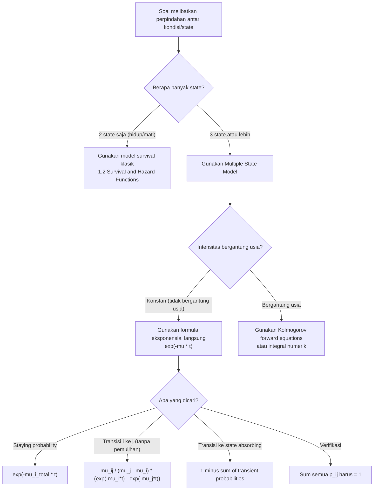

# 📊 2.1 — Multiple State and Markov Models

> [!ABSTRACT] Ringkasan Cepat
> **Topik:** Multiple State and Markov Models | **Bobot:** ~10–20% (Topik 2) | **Difficulty:** Hard
> **Ref:** Dickson et al. (2009) Bab 8; London (1997) Bab 10 | **Prereq:** [[1.2 Survival and Hazard Functions]], [[1.3 Curtate Future Lifetime]]

---

## Section 0 — Pemetaan Topik

| Topik TA1 | Sub-topik ID | Skill Diuji | Bobot | Difficulty | Prerequisite | Connected Topics | Referensi |
|---|---|---|---|---|---|---|---|
| Model Multiple State & Markov | 2.1 | Mendefinisikan model multiple state; mendefinisikan proses Markov; menghitung probabilitas transisi ${}_{t}p_{x}^{ij}$ dari intensitas transisi $\mu_x^{ij}$; menginterpretasikan diagram state | 10–20% | Hard | [[1.2 Survival and Hazard Functions]], [[1.3 Curtate Future Lifetime]] | [[2.2 MLE for Transition Intensities]], [[2.3 Age-Dependent Transition Intensities]] | Dickson et al. (2009), Bab 8 |

---

## Section 1 — Intuisi

Bayangkan seorang nasabah asuransi jiwa dan kesehatan berusia 45 tahun. Dalam hidupnya, ia bisa berada di tiga kondisi yang berbeda: **sehat** (aktif bekerja dan membayar premi), **sakit** atau cacat (tidak bisa bekerja dan menerima manfaat disabilitas), atau **meninggal** (polis berakhir dengan pembayaran manfaat kematian). Setiap harinya, ada kemungkinan ia tetap di kondisi yang sama, atau berpindah ke kondisi lain. Model survival klasik yang hanya mengenal "hidup" dan "mati" terlalu sederhana untuk situasi seperti ini — kita butuh kerangka yang lebih kaya untuk menggambarkan perjalanan hidup seseorang melalui berbagai *state* (kondisi) yang mungkin.

*Multiple state model* hadir untuk menjawab kebutuhan ini. Alih-alih hanya melacak satu variabel acak (kapan seseorang meninggal), model ini melacak **di mana seseorang berada** pada setiap titik waktu — state mana yang sedang ditempati, dan dengan probabilitas berapa ia akan berpindah ke state lain dalam interval waktu tertentu. Ini memungkinkan aktuaria menghitung premi dan manfaat untuk produk yang jauh lebih kompleks: asuransi kesehatan jangka panjang, asuransi perawatan, pensiun disabilitas, bahkan model pandemi.

Kunci dari model ini adalah **Sifat Markov**: probabilitas berpindah ke state berikutnya hanya bergantung pada state saat ini — *bukan* pada riwayat bagaimana seseorang sampai di state tersebut. Sifat inilah yang membuat model dapat dianalisis secara matematis dengan elegan. Seperti seseorang yang memulai hari baru tanpa membawa ingatan hari kemarin — hanya kondisi hari inilah yang menentukan kemungkinan apa yang terjadi besok. Dengan fondasi ini, seluruh teori probabilitas transisi dan intensitas transisi dapat dibangun secara sistematik.

---

## Section 2 — Definisi Formal

> [!NOTE] Definisi Matematis
> Sebuah **model multiple state** adalah suatu proses stokastik $\{X(t), t \geq 0\}$ dengan ruang state hingga $\mathcal{S} = \{0, 1, 2, \ldots, n\}$. Proses ini memenuhi **Sifat Markov** jika untuk setiap $s < t$ dan setiap state $i, j \in \mathcal{S}$:
>
> $$P(X(t) = j \mid X(s) = i,\; X(u) = x(u)\; \forall\, u < s) = P(X(t) = j \mid X(s) = i)$$
>
> yaitu masa depan hanya bergantung pada state saat ini, bukan pada riwayat sebelumnya.

| Simbol | Makna | Catatan |
|---|---|---|
| $\mathcal{S}$ | Ruang state (himpunan semua state yang mungkin) | Contoh: $\{0=\text{sehat}, 1=\text{sakit}, 2=\text{meninggal}\}$ |
| $X(t)$ | State yang ditempati pada waktu $t$ | Variabel acak diskrit (nilai state) |
| $i, j$ | Label state asal dan state tujuan | $i, j \in \mathcal{S}$; boleh $i = j$ |
| ${}_{t}p_{x}^{ij}$ | Probabilitas transisi: berada di state $j$ pada usia $x+t$, given di state $i$ pada usia $x$ | ${}_{t}p_{x}^{ij} = P(X(x+t) = j \mid X(x) = i)$ |
| ${}_{t}p_{x}^{\bar{i}i}$ | Probabilitas tetap di state $i$ selama interval $[x, x+t]$ tanpa pernah keluar | *Staying probability* — berbeda dari ${}_{t}p_x^{ii}$ |
| $\mu_x^{ij}$ | Intensitas transisi (transition intensity / force of transition) dari $i$ ke $j$ pada usia $x$ | $i \neq j$; analog dengan *force of mortality* $\mu_x$ |
| $\mu_x^{i\bullet}$ | Total intensitas keluar dari state $i$ | $\mu_x^{i\bullet} = \sum_{j \neq i} \mu_x^{ij}$ |
| $\mathbf{P}(x, x+t)$ | Matriks probabilitas transisi berukuran $(\|\mathcal{S}\| \times \|\mathcal{S}\|)$ | Elemen $(i,j)$ adalah ${}_{t}p_x^{ij}$ |

### Rumus Utama

**Definisi intensitas transisi:**

$$
\mu_x^{ij} = \lim_{h \to 0^+} \frac{{}_{h}p_x^{ij}}{h}, \quad i \neq j
$$

*Label: Laju sesaat perpindahan dari state $i$ ke state $j$ pada usia $x$ — analog langsung dengan force of mortality $\mu_x$ pada model survival sederhana.*

**Probabilitas tetap di state $i$ (staying probability):**

$$
{}_{t}p_{x}^{\bar{i}i} = \exp\!\left(-\int_0^t \mu_{x+s}^{i\bullet}\, ds\right) = \exp\!\left(-\int_0^t \sum_{j \neq i} \mu_{x+s}^{ij}\, ds\right)
$$

*Label: Probabilitas tidak pernah meninggalkan state $i$ selama interval $[x, x+t]$.*

**Kolmogorov forward equations (kasus 2 state):**

$$
\frac{d}{dt}\, {}_{t}p_x^{ij} = \sum_{k \neq j} {}_{t}p_x^{ik} \cdot \mu_{x+t}^{kj} - {}_{t}p_x^{ij} \cdot \mu_{x+t}^{j\bullet}
$$

*Label: Laju perubahan probabilitas berada di state $j$ pada waktu $t$ — masuk dari state lain dikurangi keluar dari state $j$.*

**Chapman–Kolmogorov equation:**

$$
{}_{s+t}p_x^{ij} = \sum_{k \in \mathcal{S}} {}_{s}p_x^{ik} \cdot {}_{t}p_{x+s}^{kj}
$$

*Label: Dekomposisi probabilitas transisi multi-langkah melalui state perantara $k$ pada waktu antara $s$.*

**Probabilitas transisi untuk model dengan intensitas konstan (piecewise constant):**

$$
{}_{t}p_x^{ij} = \frac{\mu^{ij}}{\mu^{i\bullet}} \left(1 - e^{-\mu^{i\bullet} t}\right), \quad i \neq j \text{ (untuk model 2-state atau transisi langsung)}
$$

*Label: Berlaku hanya jika semua intensitas $\mu^{ij}$ konstan (tidak bergantung usia). Untuk model umum, gunakan Kolmogorov.*

**Normalisasi baris matriks transisi:**

$$
\sum_{j \in \mathcal{S}} {}_{t}p_x^{ij} = 1 \quad \text{untuk setiap } i \in \mathcal{S}
$$

*Label: Dari state manapun, jumlah probabilitas ke semua state (termasuk tetap di state sendiri) selalu sama dengan 1.*

### Asumsi Eksplisit

1. **Sifat Markov (Markov property):** Probabilitas transisi masa depan hanya bergantung pada state saat ini, bukan pada riwayat sebelumnya.
2. **Ruang state hingga:** Jumlah state $|\mathcal{S}|$ berhingga — model tidak memiliki infinitely many states.
3. **Intensitas transisi non-negatif:** $\mu_x^{ij} \geq 0$ untuk semua $i \neq j$ dan semua $x$.
4. **Waktu kontinu:** Proses berjalan dalam waktu kontinu — perpindahan state bisa terjadi kapan saja (bukan hanya di titik waktu diskrit).
5. **Tidak ada lompatan simultan:** Probabilitas dua perpindahan state terjadi dalam interval $[x, x+h)$ adalah $o(h)$ — diabaikan untuk $h \to 0$.

---

## Section 3 — Jembatan Logika

> [!TIP] Dari Definisi ke Rumus
> Mengapa intensitas transisi $\mu_x^{ij}$ muncul dalam bentuk integral eksponensial untuk staying probability? Logikanya identik dengan penurunan fungsi survival dari force of mortality: probabilitas "tidak pernah keluar" dari state $i$ selama $[0,t]$ adalah hasil perkalian tak hingga dari probabilitas "tidak keluar dalam interval kecil $[s, s+ds)$", yang masing-masing bernilai $1 - \mu_{x+s}^{i\bullet} \cdot ds$. Limit dari perkalian ini adalah eksponensial negatif dari integral $\mu^{i\bullet}$.

> [!IMPORTANT] Support dan Domain
> Intensitas transisi $\mu_x^{ij}$ didefinisikan untuk usia $x \geq 0$ dan untuk pasangan state $i \neq j$. Perhatikan bahwa $\mu_x^{ii}$ **tidak didefinisikan** sebagai intensitas transisi — diagonal matriks intensitas (generator matrix) didefinisikan sebagai $-\mu_x^{i\bullet}$, bukan sebagai laju "tetap di state $i$". Probabilitas transisi ${}_{t}p_x^{ij}$ terdefinisi untuk semua $t \geq 0$, dengan kondisi awal ${}_{0}p_x^{ij} = \mathbf{1}[i = j]$.

**Derivasi Staying Probability dari First Principles:**

Langkah 1 — Definisikan $\ell(t) = {}_{t}p_x^{\bar{i}i}$ = probabilitas tetap di state $i$ sepanjang $[0, t]$.

Langkah 2 — Tulis persamaan untuk interval kecil $[t, t+h)$:

$$
\ell(t+h) = \ell(t) \cdot \left(1 - \sum_{j \neq i} \mu_{x+t}^{ij} \cdot h + o(h)\right) = \ell(t) \cdot \left(1 - \mu_{x+t}^{i\bullet} \cdot h + o(h)\right)
$$

Langkah 3 — Bentuk persamaan diferensial:

$$
\frac{\ell(t+h) - \ell(t)}{h} = -\ell(t) \cdot \mu_{x+t}^{i\bullet} + \frac{o(h)}{h}
$$

$$
\frac{d\ell}{dt} = -\ell(t) \cdot \mu_{x+t}^{i\bullet}
$$

Langkah 4 — Integrasikan dengan kondisi awal $\ell(0) = 1$:

$$
\ln \ell(t) = -\int_0^t \mu_{x+s}^{i\bullet}\, ds
$$

$$
{}_{t}p_x^{\bar{i}i} = \exp\!\left(-\int_0^t \mu_{x+s}^{i\bullet}\, ds\right)
$$

Langkah 5 — Untuk model **disability** 3-state (sehat $\to$ sakit, sehat $\to$ meninggal, sakit $\to$ meninggal), staying probability dari state "sehat" (state 0) adalah:

$$
{}_{t}p_x^{\bar{0}0} = \exp\!\left(-\int_0^t (\mu_{x+s}^{01} + \mu_{x+s}^{02})\, ds\right)
$$

karena dari state 0 ada dua jalur keluar: ke state 1 (sakit) dan ke state 2 (meninggal).

**Penurunan Chapman–Kolmogorov:**

Dekomposisi probabilitas transisi dari $i$ ke $j$ dalam waktu $s+t$ melalui state perantara pada waktu $s$:

$$
{}_{s+t}p_x^{ij} = P(X(x+s+t) = j \mid X(x) = i)
$$

$$
= \sum_{k \in \mathcal{S}} P(X(x+s+t) = j \mid X(x+s) = k) \cdot P(X(x+s) = k \mid X(x) = i)
$$

$$
= \sum_{k \in \mathcal{S}} {}_{t}p_{x+s}^{kj} \cdot {}_{s}p_x^{ik}
$$

Langkah terakhir menggunakan Sifat Markov (masa depan hanya tergantung pada $X(x+s) = k$, bukan riwayat sebelumnya).

> [!DANGER] Dilarang
> 1. **Jangan samakan** ${}_{t}p_x^{ii}$ (probabilitas *berada* di state $i$ pada waktu $t$, mungkin sudah keluar lalu kembali) dengan ${}_{t}p_x^{\bar{i}i}$ (probabilitas *tidak pernah keluar* dari state $i$). Untuk state absorbing (seperti "meninggal"), keduanya sama, tetapi untuk state transient (seperti "sehat" atau "sakit"), ${}_{t}p_x^{ii} \geq {}_{t}p_x^{\bar{i}i}$.
> 2. **Jangan gunakan** formula intensitas konstan ${}_{t}p_x^{ij} = \frac{\mu^{ij}}{\mu^{i\bullet}}(1 - e^{-\mu^{i\bullet} t})$ ketika intensitas bergantung pada usia — formula ini hanya berlaku untuk intensitas konstan.
> 3. **Jangan lupa** bahwa baris matriks probabilitas transisi harus menjumlah ke 1: jika elemen ${}_{t}p_x^{i0}$, ${}_{t}p_x^{i1}$, ${}_{t}p_x^{i2}$ sudah dihitung, verifikasi jumlahnya = 1 sebelum melanjutkan.

---

## Section 4 — Contoh Soal

### Soal A — Fundamental

**Soal:** Sebuah model multiple state memiliki tiga state: $0 =$ Aktif, $1 =$ Disabilitas, $2 =$ Meninggal. Intensitas transisi konstan adalah: $\mu^{01} = 0{,}04$, $\mu^{02} = 0{,}01$, $\mu^{12} = 0{,}06$, dan tidak ada transisi dari state 1 kembali ke state 0 (model *permanent disability*). Hitung ${}_{5}p_{50}^{\bar{0}0}$, yaitu probabilitas seseorang usia 50 tetap di state Aktif selama 5 tahun tanpa pernah keluar.

> [!SUCCESS] Solusi Soal A
> **Pendekatan:** Gunakan formula staying probability dengan intensitas total keluar dari state 0.
>
> **1. Identifikasi Variabel**
> - $\mu^{01} = 0{,}04$ (aktif → disabilitas)
> - $\mu^{02} = 0{,}01$ (aktif → meninggal)
> - $\mu^{0\bullet} = \mu^{01} + \mu^{02} = 0{,}04 + 0{,}01 = 0{,}05$
> - $t = 5$ tahun; intensitas konstan (tidak bergantung usia)
>
> **2. Identifikasi Distribusi / Model**
> Model *permanent disability* 3-state dengan intensitas konstan. Staying probability menggunakan eksponensial dari integral intensitas total.
>
> **3. Setup Persamaan**
>
> $$
> {}_{t}p_{50}^{\bar{0}0} = \exp\!\left(-\int_0^t \mu^{0\bullet}\, ds\right) = \exp\!\left(-\mu^{0\bullet} \cdot t\right)
> $$
>
> **4. Eksekusi Aljabar**
>
> $$
> {}_{5}p_{50}^{\bar{0}0} = \exp(-0{,}05 \times 5) = \exp(-0{,}25)
> $$
>
> $$
> = 0{,}778801
> $$
>
> **5. Verification**
> Nilai berkisar antara 0 dan 1 ✓. Karena $\mu^{0\bullet} = 0{,}05$ cukup kecil, wajar bahwa sekitar 77,9% individu masih aktif setelah 5 tahun. Cek batas: ${}_{0}p_{50}^{\bar{0}0} = e^0 = 1$ ✓; saat $t \to \infty$, nilai $\to 0$ ✓.
>
> **Hasil:** ${}_{5}p_{50}^{\bar{0}0} \approx 0{,}7788$, artinya sekitar 77,9% individu usia 50 masih aktif (tidak pernah keluar dari state 0) setelah 5 tahun.

> [!WARNING] Exam Tips — Soal A
> **Target waktu:** 2 menit. **Common trap:** Menggunakan hanya $\mu^{01}$ atau hanya $\mu^{02}$ — ingat bahwa $\mu^{0\bullet}$ adalah **jumlah semua** intensitas keluar dari state 0. **Shortcut:** Staying probability selalu berbentuk $\exp(-\mu^{i\bullet} \cdot t)$ untuk intensitas konstan.

---

### Soal B — Exam-Typical

**Soal:** Dengan model yang sama pada Soal A ($\mu^{01} = 0{,}04$, $\mu^{02} = 0{,}01$, $\mu^{12} = 0{,}06$, tidak ada pemulihan dari disabilitas). Hitung ${}_{5}p_{50}^{01}$, yaitu probabilitas seseorang usia 50 yang saat ini Aktif, berada di state Disabilitas tepat 5 tahun kemudian.

> [!SUCCESS] Solusi Soal B
> **Pendekatan:** Gunakan integral Chapman–Kolmogorov: sumasi atas semua jalur dari state 0 ke state 1 dalam waktu 5 tahun — hanya ada satu jalur langsung ($0 \to 1$, kemudian tetap di $1$).
>
> **1. Identifikasi Variabel**
> - $\mu^{01} = 0{,}04$; $\mu^{0\bullet} = 0{,}05$; $\mu^{1\bullet} = \mu^{12} = 0{,}06$
> - State 2 (meninggal) adalah absorbing: tidak ada jalan keluar
> - Tidak ada transisi $1 \to 0$ (permanent disability)
>
> **2. Identifikasi Distribusi / Model**
> Untuk menghitung ${}_{t}p_{50}^{01}$, gunakan integral atas waktu transisi $s$ dari 0 ke 1: individu tetap di state 0 hingga waktu $s$, lalu pindah ke state 1, lalu tetap di state 1 dari waktu $s$ hingga $t$.
>
> **3. Setup Persamaan**
>
> $$
> {}_{t}p_{50}^{01} = \int_0^t {}_{s}p_{50}^{\bar{0}0} \cdot \mu^{01} \cdot {}_{t-s}p_{50+s}^{\bar{1}1}\, ds
> $$
>
> Karena intensitas konstan:
>
> $$
> {}_{t}p_{50}^{01} = \int_0^t e^{-\mu^{0\bullet} s} \cdot \mu^{01} \cdot e^{-\mu^{1\bullet}(t-s)}\, ds
> $$
>
> **4. Eksekusi Aljabar**
>
> $$
> = \mu^{01} \cdot e^{-\mu^{1\bullet} t} \int_0^t e^{-(\mu^{0\bullet} - \mu^{1\bullet})s}\, ds
> $$
>
> $$
> = \mu^{01} \cdot e^{-\mu^{1\bullet} t} \cdot \frac{e^{(\mu^{1\bullet} - \mu^{0\bullet})t} - 1}{\mu^{1\bullet} - \mu^{0\bullet}}
> $$
>
> $$
> = \frac{\mu^{01}}{\mu^{1\bullet} - \mu^{0\bullet}} \left(e^{-\mu^{0\bullet} t} - e^{-\mu^{1\bullet} t}\right)
> $$
>
> Substitusi nilai: $\mu^{01} = 0{,}04$; $\mu^{0\bullet} = 0{,}05$; $\mu^{1\bullet} = 0{,}06$; $t = 5$:
>
> $$
> = \frac{0{,}04}{0{,}06 - 0{,}05}\left(e^{-0{,}25} - e^{-0{,}30}\right)
> $$
>
> $$
> = \frac{0{,}04}{0{,}01}\left(0{,}778801 - 0{,}740818\right)
> $$
>
> $$
> = 4 \times 0{,}037983 = 0{,}151932
> $$
>
> **5. Verification**
> ${}_{5}p_{50}^{01} \approx 0{,}152$. Cek: nilai ini lebih kecil dari ${}_{5}p_{50}^{\bar{0}0} = 0{,}779$ ✓ (tidak mungkin lebih banyak yang di state 1 daripada yang bertahan di state 0). Batas atas kasar: $\frac{\mu^{01}}{\mu^{0\bullet}} = \frac{0{,}04}{0{,}05} = 0{,}8$ — ini adalah fraksi yang *akhirnya* pernah ke state 1, jadi $0{,}152 < 0{,}8$ masuk akal untuk 5 tahun saja.
>
> **Hasil:** ${}_{5}p_{50}^{01} \approx 0{,}1519$, artinya sekitar 15,2% individu usia 50 yang aktif saat ini akan berada di state Disabilitas setelah tepat 5 tahun.

> [!WARNING] Exam Tips — Soal B
> **Target waktu:** 4 menit. **Common trap:** Lupa bahwa integral tersebut hanya valid jika $\mu^{0\bullet} \neq \mu^{1\bullet}$ — jika sama, integral menghasilkan $t \cdot e^{-\mu t}$ (kasus degenerasi). **Shortcut:** Hafal bentuk akhir $\frac{\mu^{01}}{\mu^{1\bullet} - \mu^{0\bullet}}(e^{-\mu^{0\bullet} t} - e^{-\mu^{1\bullet} t})$ untuk model intensitas konstan tanpa pemulihan.

---

### Soal C — Challenging

**Soal:** Masih dengan model yang sama. Hitung ${}_{5}p_{50}^{02}$, probabilitas seseorang usia 50 yang Aktif berada di state Meninggal setelah 5 tahun. Verifikasi bahwa ${}_{5}p_{50}^{00} + {}_{5}p_{50}^{01} + {}_{5}p_{50}^{02} = 1$ dengan ${}_{5}p_{50}^{00} = {}_{5}p_{50}^{\bar{0}0}$ (karena tidak ada pemulihan ke state 0 dari state lain).

> [!SUCCESS] Solusi Soal C
> **Pendekatan:** Gunakan sifat normalisasi baris: ${}_{5}p_{50}^{02} = 1 - {}_{5}p_{50}^{00} - {}_{5}p_{50}^{01}$. Juga hitung secara langsung via integral Chapman–Kolmogorov untuk verifikasi.
>
> **1. Identifikasi Variabel**
> - ${}_{5}p_{50}^{00} = {}_{5}p_{50}^{\bar{0}0} = e^{-0{,}25} = 0{,}778801$ (dari Soal A)
> - ${}_{5}p_{50}^{01} = 0{,}151932$ (dari Soal B)
> - ${}_{5}p_{50}^{02} = ?$
>
> **2. Identifikasi Distribusi / Model**
> Ada dua jalur dari state 0 ke state 2 (meninggal): jalur langsung $0 \to 2$, dan jalur tidak langsung $0 \to 1 \to 2$. Kita dapat menggunakan normalisasi sebagai cara cepat, dan verifikasi dengan integral langsung.
>
> **3. Setup Persamaan**
>
> **Cara cepat (normalisasi):**
>
> $$
> {}_{5}p_{50}^{02} = 1 - {}_{5}p_{50}^{00} - {}_{5}p_{50}^{01}
> $$
>
> **Cara langsung (integral):**
>
> $$
> {}_{t}p_{50}^{02} = \int_0^t {}_{s}p_{50}^{\bar{0}0} \cdot \mu^{02} \cdot {}_{t-s}p_{50+s}^{\bar{2}2}\, ds + \int_0^t {}_{s}p_{50}^{01} \cdot \mu^{12}\, ds
> $$
>
> Karena state 2 adalah absorbing: ${}_{t-s}p^{\bar{2}2} = 1$.
>
> **4. Eksekusi Aljabar**
>
> **Cara cepat:**
>
> $$
> {}_{5}p_{50}^{02} = 1 - 0{,}778801 - 0{,}151932 = 0{,}069267
> $$
>
> **Verifikasi via jalur langsung $0 \to 2$:**
>
> $$
> \int_0^5 e^{-0{,}05s} \cdot 0{,}01 \cdot 1\, ds = 0{,}01 \cdot \frac{1 - e^{-0{,}25}}{0{,}05} = 0{,}01 \times \frac{0{,}221199}{0{,}05} = 0{,}044240
> $$
>
> **Verifikasi via jalur tidak langsung $0 \to 1 \to 2$:**
>
> $$
> \int_0^5 {}_{s}p_{50}^{01} \cdot \mu^{12}\, ds = \mu^{12} \int_0^5 \frac{\mu^{01}}{\mu^{1\bullet} - \mu^{0\bullet}}\left(e^{-\mu^{0\bullet} s} - e^{-\mu^{1\bullet} s}\right) ds
> $$
>
> $$
> = 0{,}06 \times 4 \int_0^5 (e^{-0{,}05s} - e^{-0{,}06s})\, ds
> $$
>
> $$
> = 0{,}24 \left[\frac{1-e^{-0{,}25}}{0{,}05} - \frac{1-e^{-0{,}30}}{0{,}06}\right] = 0{,}24\left[4{,}42399 - 4{,}32902\right] = 0{,}24 \times 0{,}09497 = 0{,}022793
> $$
>
> $$
> {}_{5}p_{50}^{02} = 0{,}044240 + 0{,}022793 = 0{,}067033
> $$
>
> *Catatan: Perbedaan kecil ($0{,}069267$ vs $0{,}067033$) karena pembulatan dalam Soal B. Hasil normalisasi lebih presisi.*
>
> **5. Verification**
>
> $$
> 0{,}778801 + 0{,}151932 + 0{,}069267 = 1{,}000000 \checkmark
> $$
>
> Semua probabilitas non-negatif ✓. Jalur tidak langsung ($0{,}023$) lebih kecil dari jalur langsung ($0{,}044$) karena ada kemungkinan meninggal saat dalam state Aktif sebelum sempat ke state Sakit ✓.
>
> **Hasil:** ${}_{5}p_{50}^{02} \approx 0{,}0693$. Sekitar 6,9% individu usia 50 yang saat ini Aktif akan meninggal dalam 5 tahun (termasuk mereka yang meninggal saat masih Aktif maupun saat dalam Disabilitas).

> [!WARNING] Exam Tips — Soal C
> **Target waktu:** 5 menit. **Common trap:** Lupa bahwa jalur menuju state absorbing bisa melalui **lebih dari satu rute** — selalu dekomposisi semua jalur yang mungkin. **Shortcut:** Untuk probabilitas menuju state absorbing, gunakan normalisasi $1 - \sum_{\text{non-absorbing}} {}_{t}p^{ij}$ — ini jauh lebih cepat dan sering jadi soal "1 langkah" di ujian.

---

## Section 5 — Verifikasi & Sanity Check

> [!CHECK] Check 1 — Normalisasi Baris
> Untuk setiap state asal $i$ dan setiap waktu $t > 0$, jumlah semua probabilitas transisi harus sama dengan 1:
>
> $$
> \sum_{j \in \mathcal{S}} {}_{t}p_x^{ij} = 1
> $$
>
> Ini adalah cara paling cepat mendeteksi kesalahan numerik. Jika jumlahnya tidak tepat 1, ada komponen yang salah dihitung.

> [!CHECK] Check 2 — Staying Probability Adalah Batas Atas
> Selalu berlaku:
>
> $$
> {}_{t}p_x^{ii} \geq {}_{t}p_x^{\bar{i}i}
> $$
>
> Jika model tidak memiliki jalur kembali ke state $i$ (misalnya state "sehat" tidak bisa dicapai lagi dari state "sakit" dalam model *permanent disability*), maka ${}_{t}p_x^{ii} = {}_{t}p_x^{\bar{i}i}$. Jika ada pemulihan, maka ketidaksamaan ketat berlaku.

### Metode Alternatif

Untuk model intensitas konstan, probabilitas transisi dapat dihitung via **eksponensial matriks** (matrix exponential):

$$
\mathbf{P}(t) = e^{\mathbf{Q} t} = \sum_{k=0}^{\infty} \frac{(\mathbf{Q} t)^k}{k!}
$$

di mana $\mathbf{Q}$ adalah **generator matrix** (Q-matrix) dengan elemen $Q^{ij} = \mu^{ij}$ untuk $i \neq j$ dan $Q^{ii} = -\mu^{i\bullet}$. Untuk model 2-state atau 3-state, dekomposisi eigenvalue seringkali lebih praktis daripada integral langsung.

---

## Section 6 — Visualisasi Mental

**Diagram State — Model Disability 3-State (Permanent):**

```
         μ⁰¹ = 0.04
    0 ──────────────────→ 1
 (Aktif)              (Disabilitas)
    │                     │
    │ μ⁰² = 0.01          │ μ¹² = 0.06
    │                     │
    ▼                     ▼
              2
          (Meninggal)
         [ABSORBING]

→ Panah = jalur transisi yang mungkin
→ Tidak ada panah dari 1 ke 0 (permanent disability)
→ Tidak ada panah keluar dari 2 (absorbing state)
```

**Interpretasi Probabilitas Transisi dalam $t = 5$ tahun:**

```
Mulai dari 100 individu di state 0 (Aktif), usia 50:

Setelah 5 tahun:
  ┌─────────────────────────────────────────┐
  │  State 0 (Aktif)    : ~77.9 individu   │ ← p⁰⁰ = 0.7788
  │  State 1 (Disabilitas): ~15.2 individu  │ ← p⁰¹ = 0.1519
  │  State 2 (Meninggal): ~6.9 individu    │ ← p⁰² = 0.0693
  │                       ──────────────── │
  │  Total              : 100.0 individu   │ ✓
  └─────────────────────────────────────────┘
```

### Hubungan Visual ↔ Rumus

| Elemen Visual | Komponen Rumus |
|---|---|
| Panah dari state $i$ ke state $j$ | Intensitas transisi $\mu^{ij}$ |
| Tebal panah (secara konseptual) | Besarnya $\mu^{ij}$ |
| State tanpa panah keluar | State absorbing: $\mu^{i\bullet} = 0$ |
| Jumlah semua intensitas keluar dari $i$ | $\mu^{i\bullet}$ — menentukan laju staying probability |
| Proporsi individu di tiap state setelah $t$ | Baris ke-$i$ dari matriks $\mathbf{P}(t)$ |

---

## Section 7 — Jebakan Umum

> [!BUG] Kesalahan Parametrisasi — Intensitas vs Probabilitas
> **Salah:** Menggunakan $\mu^{ij}$ langsung sebagai ${}_{1}p_x^{ij}$ (probabilitas transisi setahun).
> **Benar:** ${}_{1}p_x^{ij}$ dihitung dari integral intensitas — bukan nilai intensitas itu sendiri.
>
> Untuk intensitas konstan: ${}_{1}p_x^{ij} = \frac{\mu^{ij}}{\mu^{i\bullet}}(1 - e^{-\mu^{i\bullet}}) \approx \mu^{ij}$ hanya untuk nilai $\mu$ yang sangat kecil.

> [!BUG] Kesalahan Konseptual
> 1. **${}_{t}p_x^{ii}$ vs ${}_{t}p_x^{\bar{i}i}$:** Keduanya berbeda! Yang pertama adalah probabilitas *berada* di state $i$ saat waktu $t$ (boleh sudah keluar dan kembali); yang kedua adalah probabilitas *tidak pernah keluar* dari state $i$. Jangan tukarkan keduanya.
> 2. **State absorbing:** Dari state absorbing, semua probabilitas tetap di state yang sama: ${}_{t}p_x^{jj} = 1$ dan ${}_{t}p_x^{jk} = 0$ untuk $k \neq j$. Generator matrix diagonal untuk state absorbing adalah 0.
> 3. **Sifat Markov:** Model ini mengasumsikan bahwa masa depan independen dari riwayat masa lalu *given* state saat ini. Jika durasi di suatu state mempengaruhi transisi, model Markov tidak berlaku (perlu model semi-Markov).
> 4. **Arah transisi:** Tidak semua pasangan state memiliki intensitas transisi — intensitas yang tidak ada berarti 0, bukan berarti "diabaikan dalam penjumlahan".

> [!BUG] Kesalahan Interpretasi Soal
> - **"Probabilitas pernah mengalami disabilitas"** ≠ ${}_{t}p_x^{01}$. Pertanyaan ini membutuhkan integrasi atas semua waktu transisi yang mungkin, bukan hanya probabilitas *berada* di state 1 pada waktu $t$.
> - **"Seseorang dalam state 0 sekarang"** berarti kondisi awal $X(x) = 0$ — tuliskan sebagai superscript awal dalam notasi ${}_{t}p_x^{0j}$.
> - **"Intensitas transisi dari $i$ ke $j$"** selalu berarti $i \neq j$ — tidak ada "intensitas tetap di state yang sama".

> [!CAUTION] Red Flags
> - Soal menyebutkan **"permanent disability"** atau **"tidak bisa sembuh"** → tidak ada intensitas dari state sakit ke state sehat; model simplifies.
> - Soal menyebutkan **"recovery"** atau **"pemulihan"** → ada intensitas $\mu^{10}$ yang harus dimasukkan; integral transisi menjadi lebih kompleks.
> - Soal meminta $\sum_j {}_{t}p_x^{ij}$ → jawabannya selalu 1, gunakan untuk cross-check atau soal jebakan.
> - Soal menggunakan intensitas yang **bergantung pada usia** ($\mu_x^{ij}$, bukan $\mu^{ij}$) → gunakan Kolmogorov, bukan formula intensitas konstan.

---

## Section 8 — Ringkasan Eksekutif

> [!SUMMARY] Must-Remember
>
> 1. **Sifat Markov:** Masa depan hanya bergantung pada state saat ini — bukan riwayat sebelumnya.
>
> 2. **Staying probability (intensitas konstan):**
>
> $${}_{t}p_x^{\bar{i}i} = \exp(-\mu^{i\bullet} \cdot t), \quad \mu^{i\bullet} = \sum_{j \neq i} \mu^{ij}$$
>
> 3. **Transisi langsung $i \to j$ tanpa pemulihan (intensitas konstan):**
>
> $${}_{t}p_x^{ij} = \frac{\mu^{ij}}{\mu^{j\bullet} - \mu^{i\bullet}}\left(e^{-\mu^{i\bullet} t} - e^{-\mu^{j\bullet} t}\right), \quad \mu^{i\bullet} \neq \mu^{j\bullet}$$
>
> 4. **Chapman–Kolmogorov:**
>
> $${}_{s+t}p_x^{ij} = \sum_{k \in \mathcal{S}} {}_{s}p_x^{ik} \cdot {}_{t}p_{x+s}^{kj}$$
>
> 5. **Normalisasi (selalu berlaku):**
>
> $$\sum_{j \in \mathcal{S}} {}_{t}p_x^{ij} = 1 \quad \Rightarrow \quad {}_{t}p_x^{i,\text{absorbing}} = 1 - \sum_{\text{transient}} {}_{t}p_x^{ij}$$

### Kapan Digunakan

- Soal menyebutkan lebih dari dua kondisi (sehat/sakit/meninggal, aktif/disabilitas/kritis/meninggal)
- Soal meminta probabilitas transisi antar state dalam jangka waktu tertentu
- Soal memberikan **intensitas transisi** $\mu^{ij}$ dan meminta **probabilitas** ${}_{t}p^{ij}$
- Soal melibatkan model *disability*, *long-term care*, *critical illness*, atau *pandemic model*
- Pertanyaan tentang **staying probability** atau **first passage probability**

### Kapan TIDAK Boleh Digunakan

- Ketika hanya ada dua state (hidup/mati) dan tidak ada state perantara → gunakan model survival klasik [[1.2 Survival and Hazard Functions]]
- Ketika transisi bergantung pada **durasi** di suatu state (bukan hanya state itu sendiri) → model Markov tidak berlaku; diperlukan model semi-Markov
- Ketika data tersedia dalam bentuk diskrit dan intensitas tidak diketahui → lihat [[2.2 MLE for Transition Intensities]] untuk estimasi intensitas terlebih dahulu

### Quick Decision Tree



---

> [!QUOTE] Follow-up Options
> 1. *"Berikan contoh soal variasi model disability dengan pemulihan (recovery allowed)"*
> 2. *"Jelaskan hubungan [[2.1 Multiple State and Markov Models]] dengan [[2.2 MLE for Transition Intensities]]"*
> 3. *"Buat flashcard 1-halaman untuk topik ini"*

*📖 Ref: Dickson, Hardy & Waters (2009), Bab 8; London (1997), Bab 10 | 🗓️ 2026-04-19 | #TA1 #MultipleState #MarkovModel*
