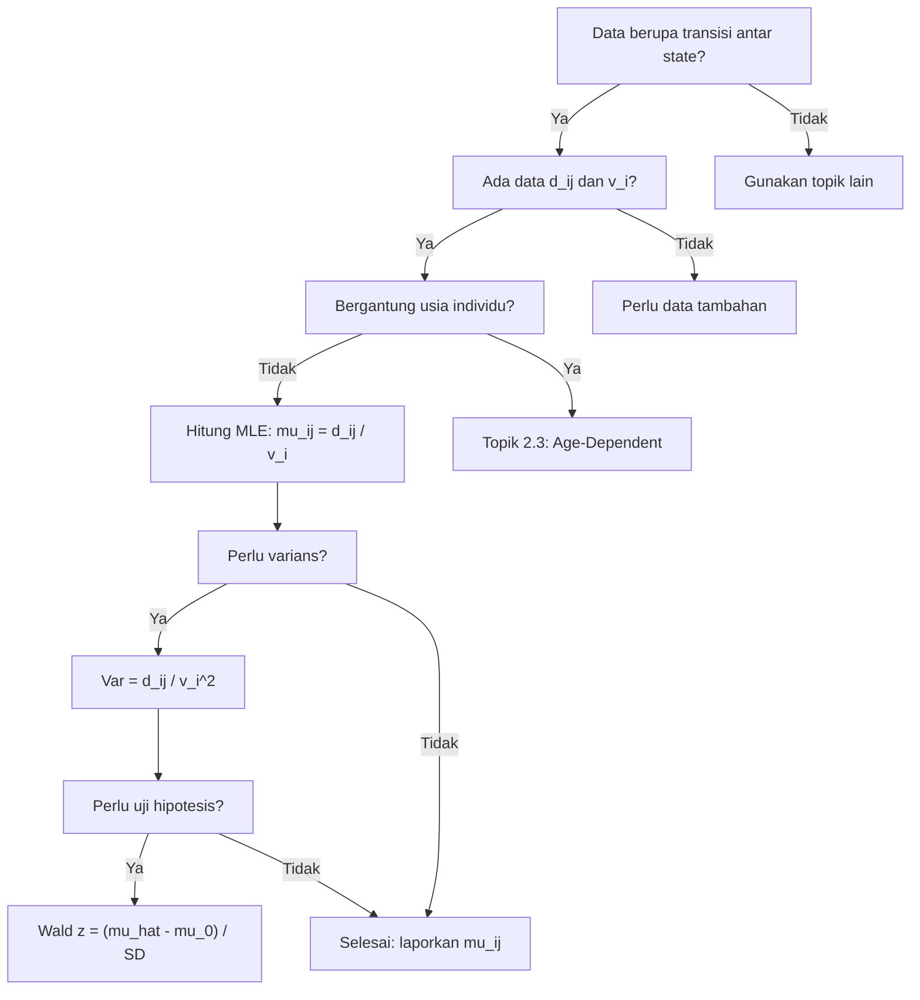

# 📊 2.2 — MLE for Transition Intensities

> [!ABSTRACT] Ringkasan Cepat
> **Topik:** MLE untuk Intensitas Transisi | **Bobot:** ~10–20% | **Difficulty:** Calculation-Intensive
> **Ref:** Dickson et al. (2009) Bab 8; London (1997) Bab 10 | **Prereq:** [[2.1 Multiple State and Markov Models]]

---

## Section 0 — Pemetaan Topik

| Topik TA1 | Sub-topik ID | Skill Diuji | Bobot | Difficulty | Prerequisite | Connected Topics | Referensi |
|---|---|---|---|---|---|---|---|
| Model Multiple State & Markov | 2.2 | Menurunkan MLE untuk intensitas transisi dengan asumsi *piecewise constant*; menghitung estimator | 10–20% | Calculation-Intensive | [[2.1 Multiple State and Markov Models]] | [[2.3 Age-Dependent Transition Intensities]], [[1.6 Maximum Likelihood Estimation for Survival]] | Dickson et al. (2009) Bab 8; London (1997) Bab 10 |

---

## Section 1 — Intuisi

Bayangkan sebuah perusahaan asuransi jiwa yang memantau ribuan nasabahnya setiap tahun. Setiap nasabah bisa berada dalam salah satu dari beberapa kondisi (*state*): aktif membayar premi, mengajukan klaim disabilitas, atau telah meninggal. Dari waktu ke waktu, nasabah berpindah dari satu *state* ke *state* lain — misalnya dari aktif menjadi disabilitas, atau dari disabilitas menjadi meninggal. Laju perpindahan ini disebut **intensitas transisi**.

Masalahnya: intensitas transisi yang sesungguhnya tidak kita ketahui. Yang kita miliki hanyalah data observasi — berapa lama nasabah berada di suatu *state*, dan kapan mereka berpindah. Dari data inilah kita ingin **mengestimasi** seberapa cepat rata-rata perpindahan terjadi. Inilah inti dari topik ini: menggunakan *Maximum Likelihood Estimation* (MLE) untuk mendapatkan taksiran terbaik dari intensitas transisi.

Pendekatan yang digunakan adalah **asumsi *piecewise constant***: kita asumsikan bahwa dalam satu interval waktu tertentu (misalnya satu tahun), intensitas transisi dari *state* $i$ ke *state* $j$ adalah konstan. Ini mirip dengan asumsi *constant force of mortality* dalam analisis survival, tetapi diperluas ke banyak *state*. Dengan asumsi ini, fungsi *likelihood* menjadi cukup sederhana sehingga MLE-nya punya bentuk analitik yang elegan: estimator MLE untuk intensitas transisi $\mu_{ij}$ adalah **jumlah transisi yang terjadi dari $i$ ke $j$**, dibagi dengan **total waktu observasi di *state* $i$**.

---

## Section 2 — Definisi Formal

> [!NOTE] Definisi Matematis
> Diberikan model *multiple state* dengan himpunan *state* $\mathcal{S} = \{0, 1, 2, \ldots\}$ dan intensitas transisi *piecewise constant* $\mu_{ij}$ (untuk $i \neq j$) pada interval $[a, b)$. Log-*likelihood* total untuk semua individu adalah:
>
> $$
> \ell(\boldsymbol{\mu}) = \sum_{i \neq j} \left[ d_{ij} \ln \mu_{ij} - \mu_{ij} \cdot v_i \right]
> $$
>
> di mana $d_{ij}$ adalah jumlah transisi terobservasi dari $i$ ke $j$, dan $v_i$ adalah total waktu observasi di *state* $i$.

| Simbol | Makna | Catatan |
|---|---|---|
| $\mu_{ij}$ | Intensitas transisi dari *state* $i$ ke *state* $j$ | Konstan dalam interval (asumsi *piecewise constant*) |
| $d_{ij}$ | Jumlah transisi terobservasi dari $i$ ke $j$ | Bilangan bulat non-negatif |
| $v_i$ | Total waktu yang dihabiskan di *state* $i$ (semua individu) | *Central exposed to risk* dari *state* $i$ |
| $\mu_{i\cdot}$ | Total intensitas keluar dari *state* $i$ = $\sum_{j \neq i} \mu_{ij}$ | Intensitas *exit* total |
| $p_{ii}(t)$ | Probabilitas tetap di *state* $i$ selama $t$ waktu | $p_{ii}(t) = e^{-\mu_{i\cdot} t}$ dengan asumsi konstan |
| $\ell(\boldsymbol{\mu})$ | Log-*likelihood* | Fungsi yang dimaksimalkan |
| $\hat{\mu}_{ij}$ | Estimator MLE untuk $\mu_{ij}$ | $\hat{\mu}_{ij} = d_{ij} / v_i$ |

### Rumus Utama

**Kontribusi *likelihood* satu individu** yang memulai di *state* $i$ pada waktu $s$, berpindah ke *state* $j$ pada waktu $t$, dan tidak berpindah sebelumnya:

$$
L_{\text{individu}} = \mu_{ij} \cdot \exp\!\left(-\mu_{i\cdot} \cdot (t - s)\right)
$$

**Log-*likelihood* total** (setelah mengambil logaritma dan menjumlahkan semua individu):

$$
\ell(\boldsymbol{\mu}) = \sum_{i \neq j} d_{ij} \ln \mu_{ij} - \sum_i \mu_{i\cdot} \cdot v_i
$$

**Estimator MLE** (diperoleh dari syarat $\partial \ell / \partial \mu_{ij} = 0$):

$$
\hat{\mu}_{ij} = \frac{d_{ij}}{v_i}
$$

**Kovarians estimator MLE** (berdasarkan informasi Fisher):

$$
\widehat{\text{Var}}(\hat{\mu}_{ij}) = \frac{\hat{\mu}_{ij}}{v_i} = \frac{d_{ij}}{v_i^2}
$$

**Kovarians silang** untuk pasangan transisi berbeda dari *state* yang sama:

$$
\widehat{\text{Cov}}(\hat{\mu}_{ij}, \hat{\mu}_{ik}) = -\frac{\hat{\mu}_{ij} \cdot \hat{\mu}_{ik}}{v_i \cdot \mu_{i\cdot}} \approx 0 \quad \text{(biasanya diabaikan)}
$$

### Asumsi Eksplisit

1. **Proses Markov**: probabilitas transisi masa depan hanya bergantung pada *state* saat ini, bukan riwayat sebelumnya.
2. **Intensitas *piecewise constant***: dalam setiap interval analisis, $\mu_{ij}$ konstan terhadap waktu.
3. **Independensi antar individu**: setiap individu merupakan observasi independen.
4. **Observasi lengkap atau tersensor administratif**: sensor hanya terjadi karena akhir periode pengamatan, bukan *informative censoring*.
5. **Distribusi waktu tahan (*sojourn time*)**: waktu di *state* $i$ mengikuti distribusi Eksponensial dengan parameter $\mu_{i\cdot}$.

---

## Section 3 — Jembatan Logika

> [!TIP] Dari Definisi ke Rumus
> Kunci memahami MLE di sini adalah menyadari bahwa proses Markov *continuous-time* dengan intensitas konstan menghasilkan distribusi waktu tahan **Eksponensial**. Jika seseorang berada di *state* $i$ dan intensitas total keluarnya adalah $\mu_{i\cdot}$, maka waktu hingga transisi pertama berdistribusi $\text{Exp}(\mu_{i\cdot})$. Ketika akhirnya terjadi transisi, probabilitas tujuannya ke *state* $j$ adalah $\mu_{ij}/\mu_{i\cdot}$. Dua komponen ini — waktu tahan dan tujuan transisi — bersama-sama membentuk *likelihood* kontribusi setiap individu.

> [!IMPORTANT] Pemisahan *Likelihood*
> Log-*likelihood* total bisa didekomposisi menjadi **penjumlahan per pasangan $(i,j)$**:
>
> $$
> \ell(\boldsymbol{\mu}) = \sum_{i \neq j} \left[ d_{ij} \ln \mu_{ij} - \mu_{ij} \cdot v_i \right]
> $$
>
> Perhatikan bahwa suku untuk $\mu_{ij}$ dan $\mu_{ik}$ (dengan $j \neq k$) **terpisah** dalam log-*likelihood*. Ini berarti MLE untuk setiap $\mu_{ij}$ bisa diturunkan **secara independen** satu sama lain.

**Derivasi step-by-step MLE $\hat{\mu}_{ij}$:**

**Langkah 1 — Tulis kontribusi satu individu.**

Seorang individu masuk ke *state* $i$ pada waktu $s$. Misalkan dia berpindah ke *state* $j$ pada waktu $t$ (transition observed). Kontribusi *likelihood*-nya adalah:

$$
L = \underbrace{\mu_{ij}}_{\text{tujuan } j} \cdot \underbrace{e^{-\mu_{i\cdot}(t-s)}}_{\text{tetap di } i \text{ selama } (t-s)}
$$

**Langkah 2 — Pertimbangkan individu yang tersensor.**

Jika individu meninggalkan observasi tanpa transisi terobservasi (tersensor pada waktu $t^*$), kontribusinya hanya:

$$
L_{\text{sensor}} = e^{-\mu_{i\cdot}(t^* - s)}
$$

**Langkah 3 — Himpun semua individu.**

Misalkan ada $n$ individu. Total *likelihood*:

$$
L(\boldsymbol{\mu}) = \prod_{k=1}^{n} L_k
$$

**Langkah 4 — Ambil logaritma.**

Untuk semua individu yang mengalami transisi $i \to j$:

$$
\ell(\boldsymbol{\mu}) = \sum_{i \neq j} d_{ij} \ln \mu_{ij} - \sum_i \mu_{i\cdot} \cdot v_i
$$

di mana $v_i = \sum_k (\text{waktu individu } k \text{ di state } i)$ adalah *total exposed to risk*.

**Langkah 5 — Maksimalkan terhadap $\mu_{ij}$.**

Karena $\mu_{i\cdot} = \sum_{j \neq i} \mu_{ij}$, substitusikan:

$$
\frac{\partial \ell}{\partial \mu_{ij}} = \frac{d_{ij}}{\mu_{ij}} - v_i = 0
$$

**Langkah 6 — Selesaikan.**

$$
\hat{\mu}_{ij} = \frac{d_{ij}}{v_i}
$$

Ini adalah *maximum likelihood estimator* untuk intensitas transisi dari $i$ ke $j$.

**Langkah 7 — Verifikasi second-order condition.**

$$
\frac{\partial^2 \ell}{\partial \mu_{ij}^2} = -\frac{d_{ij}}{\mu_{ij}^2} < 0 \quad (\text{titik maksimum})
$$

> [!DANGER] Dilarang
> 1. **Jangan** membagi $d_{ij}$ dengan $v_j$ (waktu di *state tujuan*) — penyebutnya adalah waktu di *state asal* $v_i$.
> 2. **Jangan** menggunakan $d_{i\cdot}$ (total semua transisi keluar dari $i$) sebagai pembilang untuk $\hat{\mu}_{ij}$ — pembilangnya hanya transisi spesifik $i \to j$.
> 3. **Jangan** lupa bahwa $v_i$ mencakup **semua** individu yang pernah berada di *state* $i$, termasuk yang tersensor.

---

## Section 4 — Contoh Soal

### Soal A — Fundamental

Sebuah model *multiple state* terdiri dari 3 *state*: Sehat (0), Sakit (1), Meninggal (2). Selama periode pengamatan satu tahun, dicatat data berikut:

- Transisi $0 \to 1$: $d_{01} = 20$ kasus
- Transisi $0 \to 2$: $d_{02} = 5$ kasus
- Total waktu observasi di *state* 0: $v_0 = 500$ orang-tahun
- Transisi $1 \to 0$: $d_{10} = 8$ kasus
- Transisi $1 \to 2$: $d_{12} = 12$ kasus
- Total waktu observasi di *state* 1: $v_1 = 200$ orang-tahun

Hitung estimator MLE untuk semua intensitas transisi.

> [!SUCCESS] Solusi Soal A
> **Pendekatan:** Terapkan rumus $\hat{\mu}_{ij} = d_{ij} / v_i$ secara langsung untuk setiap pasangan $(i, j)$.
>
> **1. Identifikasi Variabel**
> - $d_{01} = 20$, $d_{02} = 5$, $v_0 = 500$
> - $d_{10} = 8$, $d_{12} = 12$, $v_1 = 200$
>
> **2. Identifikasi Model**
> Model *continuous-time Markov* dengan asumsi intensitas *piecewise constant* dalam satu tahun. Tidak ada transisi dari *state* 2 (absorbing state).
>
> **3. Setup Persamaan**
>
> $$
> \hat{\mu}_{ij} = \frac{d_{ij}}{v_i}, \quad i \neq j
> $$
>
> **4. Eksekusi Aljabar**
>
> $$
> \hat{\mu}_{01} = \frac{20}{500} = 0{,}040 \text{ per tahun}
> $$
>
> $$
> \hat{\mu}_{02} = \frac{5}{500} = 0{,}010 \text{ per tahun}
> $$
>
> $$
> \hat{\mu}_{10} = \frac{8}{200} = 0{,}040 \text{ per tahun}
> $$
>
> $$
> \hat{\mu}_{12} = \frac{12}{200} = 0{,}060 \text{ per tahun}
> $$
>
> **5. Verification**
> Intensitas total keluar: $\hat{\mu}_{0\cdot} = 0{,}040 + 0{,}010 = 0{,}050$ dan $\hat{\mu}_{1\cdot} = 0{,}040 + 0{,}060 = 0{,}100$. Nilai positif dan masuk akal secara aktuaria.
>
> **Hasil:** $\hat{\mu}_{01} = 0{,}04$; $\hat{\mu}_{02} = 0{,}01$; $\hat{\mu}_{10} = 0{,}04$; $\hat{\mu}_{12} = 0{,}06$ (semua per tahun).

> [!WARNING] Exam Tips — Soal A
> **Target waktu:** 2 menit. **Common trap:** Menggunakan $v_1$ sebagai penyebut untuk $\hat{\mu}_{01}$ (salah — $v_0$ adalah penyebutnya). **Shortcut:** Tulis tabel 2 kolom: kiri $d_{ij}$, kanan $v_i$, bagi langsung.

---

### Soal B — Exam-Typical

Dalam sebuah studi asuransi jiwa dengan manfaat disabilitas, model *multiple state* memiliki 4 *state*: Aktif (0), Disabilitas Ringan (1), Disabilitas Berat (2), Meninggal (3). Intensitas transisi diasumsikan konstan selama periode pengamatan. Data berikut dikumpulkan:

| Transisi | Jumlah Transisi ($d_{ij}$) | Waktu di *State* Asal ($v_i$, orang-tahun) |
|---|---|---|
| $0 \to 1$ | 15 | 1.200 |
| $0 \to 2$ | 4 | 1.200 |
| $0 \to 3$ | 6 | 1.200 |
| $1 \to 0$ | 10 | 300 |
| $1 \to 2$ | 5 | 300 |
| $1 \to 3$ | 3 | 300 |
| $2 \to 3$ | 8 | 80 |

(a) Hitung semua estimator MLE $\hat{\mu}_{ij}$.

(b) Hitung estimasi standar deviasi $\widehat{\text{SD}}(\hat{\mu}_{01})$ dan $\widehat{\text{SD}}(\hat{\mu}_{12})$.

(c) Berikan interpretasi aktuaria untuk $\hat{\mu}_{23}$.

> [!SUCCESS] Solusi Soal B
> **Pendekatan:** Terapkan $\hat{\mu}_{ij} = d_{ij}/v_i$ untuk semua pasangan, lalu hitung varians menggunakan $\widehat{\text{Var}}(\hat{\mu}_{ij}) = d_{ij}/v_i^2$.
>
> **1. Identifikasi Variabel**
> Dari tabel: $v_0 = 1200$, $v_1 = 300$, $v_2 = 80$. *State* 3 adalah *absorbing state*.
>
> **2. Identifikasi Model**
> *Continuous-time Markov chain*, 4 *state*, asumsi konstan. *State* 3 tidak ada intensitas keluar.
>
> **3. Setup Persamaan**
>
> $$
> \hat{\mu}_{ij} = \frac{d_{ij}}{v_i}, \quad \widehat{\text{Var}}(\hat{\mu}_{ij}) = \frac{d_{ij}}{v_i^2}
> $$
>
> **4. Eksekusi Aljabar**
>
> **(a) Semua MLE:**
>
> $$
> \hat{\mu}_{01} = \frac{15}{1200} = 0{,}0125, \quad \hat{\mu}_{02} = \frac{4}{1200} = 0{,}0033, \quad \hat{\mu}_{03} = \frac{6}{1200} = 0{,}0050
> $$
>
> $$
> \hat{\mu}_{10} = \frac{10}{300} = 0{,}0333, \quad \hat{\mu}_{12} = \frac{5}{300} = 0{,}0167, \quad \hat{\mu}_{13} = \frac{3}{300} = 0{,}0100
> $$
>
> $$
> \hat{\mu}_{23} = \frac{8}{80} = 0{,}1000
> $$
>
> **(b) Standar Deviasi:**
>
> $$
> \widehat{\text{Var}}(\hat{\mu}_{01}) = \frac{15}{1200^2} = \frac{15}{1{,}44 \times 10^6} = 1{,}0417 \times 10^{-5}
> $$
>
> $$
> \widehat{\text{SD}}(\hat{\mu}_{01}) = \sqrt{1{,}0417 \times 10^{-5}} = 0{,}003228
> $$
>
> $$
> \widehat{\text{Var}}(\hat{\mu}_{12}) = \frac{5}{300^2} = \frac{5}{90000} = 5{,}556 \times 10^{-5}
> $$
>
> $$
> \widehat{\text{SD}}(\hat{\mu}_{12}) = \sqrt{5{,}556 \times 10^{-5}} = 0{,}007454
> $$
>
> **5. Verification**
> $\widehat{\text{SD}}(\hat{\mu}_{12}) / \hat{\mu}_{12} = 0{,}007454 / 0{,}0167 \approx 44\%$ — koefisien variasi cukup besar, wajar karena $d_{12} = 5$ sangat kecil.
>
> **(c) Interpretasi $\hat{\mu}_{23} = 0{,}10$:**
> Seseorang yang berada dalam kondisi Disabilitas Berat diperkirakan mengalami transisi ke *state* Meninggal dengan laju 0,10 per orang per tahun. Artinya, secara rata-rata, harapan hidup seseorang dalam kondisi Disabilitas Berat (tanpa kemungkinan pemulihan) adalah sekitar $1/0{,}10 = 10$ tahun.
>
> **Hasil:** Semua estimator tersebut di atas; SD: $\hat{\sigma}_{01} \approx 0{,}00323$, $\hat{\sigma}_{12} \approx 0{,}00745$.

> [!WARNING] Exam Tips — Soal B
> **Target waktu:** 4 menit. **Common trap:** Menghitung varians dengan formula $\hat{\mu}_{ij}/v_i$ — ingat, rumus benar adalah $d_{ij}/v_i^2 = \hat{\mu}_{ij}/v_i$, keduanya ekuivalen tapi jangan tertukar dengan $\hat{\mu}_{ij}^2/d_{ij}$. **Shortcut:** Untuk varians, ingat saja bahwa koefisien variasi $= 1/\sqrt{d_{ij}}$.

---

### Soal C — Challenging

Seorang aktuaris sedang mengestimasi model *multiple state* untuk portofolio asuransi kesehatan. Model memiliki *state*: Sehat (0), Sakit Ringan (1), Sakit Berat (2), Meninggal (3). Diasumsikan intensitas *piecewise constant*.

Dari data pengamatan selama 2 tahun terakhir:

- $v_0 = 800$ orang-tahun, $d_{01} = 40$, $d_{02} = 8$, $d_{03} = 2$
- $v_1 = 120$ orang-tahun, $d_{10} = 30$, $d_{12} = 18$, $d_{13} = 6$
- $v_2 = 50$ orang-tahun, $d_{20} = 5$, $d_{21} = 10$, $d_{23} = 15$

(a) Hitung semua estimator MLE $\hat{\mu}_{ij}$.

(b) Uji hipotesis $H_0: \mu_{03} = 0{,}004$ vs $H_1: \mu_{03} \neq 0{,}004$ menggunakan statistik Wald pada tingkat signifikansi 5%.

(c) Seseorang baru saja masuk ke *state* Sakit Berat (2). Gunakan estimasi Anda untuk menghitung **probabilitas ia masih berada di *state* 2 setelah 6 bulan**, dengan asumsi intensitas konstan.

> [!SUCCESS] Solusi Soal C
> **Pendekatan:** (a) MLE standar; (b) Wald test dengan $z = (\hat{\mu} - \mu_0)/\widehat{\text{SD}}(\hat{\mu})$; (c) Gunakan $p_{22}(t) = e^{-\hat{\mu}_{2\cdot} t}$.
>
> **1. Identifikasi Variabel**
> $v_0=800, v_1=120, v_2=50$. Semua transisi tersedia. $t=0{,}5$ tahun untuk bagian (c).
>
> **2. Identifikasi Model**
> *Continuous-time Markov*, 4 *state*. *State* 2 bukan *absorbing* karena ada transisi kembali ke 0 dan 1. Probabilitas *sojourn* mengikuti Eksponensial dengan parameter $\mu_{2\cdot}$.
>
> **3. Setup Persamaan**
>
> $$
> \hat{\mu}_{ij} = \frac{d_{ij}}{v_i}; \quad z = \frac{\hat{\mu}_{03} - 0{,}004}{\widehat{\text{SD}}(\hat{\mu}_{03})}; \quad p_{22}(t) = e^{-\hat{\mu}_{2\cdot} t}
> $$
>
> **4. Eksekusi Aljabar**
>
> **(a) Semua MLE:**
>
> $$
> \hat{\mu}_{01} = \frac{40}{800} = 0{,}050, \quad \hat{\mu}_{02} = \frac{8}{800} = 0{,}010, \quad \hat{\mu}_{03} = \frac{2}{800} = 0{,}0025
> $$
>
> $$
> \hat{\mu}_{10} = \frac{30}{120} = 0{,}250, \quad \hat{\mu}_{12} = \frac{18}{120} = 0{,}150, \quad \hat{\mu}_{13} = \frac{6}{120} = 0{,}050
> $$
>
> $$
> \hat{\mu}_{20} = \frac{5}{50} = 0{,}100, \quad \hat{\mu}_{21} = \frac{10}{50} = 0{,}200, \quad \hat{\mu}_{23} = \frac{15}{50} = 0{,}300
> $$
>
> **(b) Wald Test untuk $\mu_{03}$:**
>
> $$
> \widehat{\text{SD}}(\hat{\mu}_{03}) = \sqrt{\frac{d_{03}}{v_0^2}} = \sqrt{\frac{2}{800^2}} = \sqrt{\frac{2}{640000}} = \sqrt{3{,}125 \times 10^{-6}} = 0{,}001768
> $$
>
> $$
> z = \frac{0{,}0025 - 0{,}004}{0{,}001768} = \frac{-0{,}0015}{0{,}001768} = -0{,}849
> $$
>
> Nilai kritis untuk uji dua arah pada $\alpha = 5\%$: $z_{0{,}025} = 1{,}960$.
>
> Karena $|z| = 0{,}849 < 1{,}960$, **gagal tolak $H_0$**. Tidak ada bukti yang cukup untuk menyatakan $\mu_{03} \neq 0{,}004$ pada level 5%.
>
> **(c) Probabilitas tetap di *state* 2 setelah 6 bulan:**
>
> $$
> \hat{\mu}_{2\cdot} = \hat{\mu}_{20} + \hat{\mu}_{21} + \hat{\mu}_{23} = 0{,}100 + 0{,}200 + 0{,}300 = 0{,}600 \text{ per tahun}
> $$
>
> $$
> p_{22}(0{,}5) = e^{-0{,}600 \times 0{,}5} = e^{-0{,}300} = 0{,}7408
> $$
>
> **5. Verification**
> $p_{22}(0{,}5) = 0{,}74$ — wajar, karena intensitas total keluar 0,6/tahun berarti rata-rata seseorang meninggalkan *state* 2 setelah $1/0{,}6 \approx 1{,}67$ tahun. Setelah 6 bulan masih ada ~74% yang bertahan, ini logis.
>
> **Hasil:** (a) semua MLE di atas; (b) gagal tolak $H_0$, $|z|=0{,}849$; (c) $p_{22}(0{,}5) \approx 74{,}08\%$.

> [!WARNING] Exam Tips — Soal C
> **Target waktu:** 6 menit. **Common trap 1:** Untuk $p_{22}(t)$, gunakan intensitas **total** keluar $\mu_{2\cdot}$, bukan satu intensitas saja. **Common trap 2:** Konversi satuan waktu — soal meminta 6 bulan, bukan 6 tahun. **Shortcut:** $e^{-0{,}3} \approx 0{,}7408$ — hafal nilai ini.

---

## Section 5 — Verifikasi & Sanity Check

> [!CHECK] Cek Konsistensi Estimator
> Jumlah seluruh estimator intensitas keluar dari *state* $i$ harus memenuhi:
>
> $$
> \hat{\mu}_{i\cdot} = \sum_{j \neq i} \hat{\mu}_{ij} = \frac{\sum_{j \neq i} d_{ij}}{v_i} = \frac{d_{i\cdot}}{v_i}
> $$
>
> Artinya, estimator intensitas total keluar sama dengan **total transisi keluar dari $i$** dibagi waktu di $i$. Ini bisa dihitung dua cara dan hasilnya harus sama.

> [!CHECK] Cek Dimensi dan Batas
> - Estimator $\hat{\mu}_{ij}$ harus selalu **positif** (atau nol jika $d_{ij} = 0$).
> - Satuan $\hat{\mu}_{ij}$ adalah **per satuan waktu** (per tahun, per bulan).
> - Probabilitas *sojourn* $p_{ii}(t) = e^{-\hat{\mu}_{i\cdot} t}$ harus berada di $[0, 1]$ untuk semua $t \geq 0$.
> - Ketika $d_{ij} = 0$: $\hat{\mu}_{ij} = 0$ — MLE memberikan nilai nol, bukan nilai positif kecil.

### Metode Alternatif

Jika tersedia *transition probability matrix* $P(t)$ alih-alih data mentah, intensitas transisi bisa diestimasi menggunakan *generator matrix* $Q$ dari hubungan:

$$
P(t) = e^{Qt}
$$

Namun untuk ujian TA1, pendekatan MLE langsung dengan $\hat{\mu}_{ij} = d_{ij}/v_i$ adalah metode utama yang diuji.

---

## Section 6 — Visualisasi Mental

**Diagram *State* dan Aliran Transisi:**

```
           μ₀₁ →
   [0]  ←——————  [1]
 Sehat  ——————→  Sakit   
    \   μ₁₀ ←    / 
  μ₀₂ \         / μ₁₂
      ↓         ↓
      [2] Sakit Berat
           \  μ₂₃
            ↓
           [3] Meninggal
```

- Setiap panah mewakili satu intensitas transisi $\mu_{ij}$.
- Waktu "terbang" di setiap *state* mengikuti distribusi Eksponensial.
- Data yang kita kumpulkan: **berapa kali** panah itu dilalui ($d_{ij}$) dan **berapa lama total** di tiap kotak ($v_i$).

**Visualisasi Intuisi Estimator:**

Bayangkan observasi 1000 orang-tahun di *state* 0. Jika 50 kali terjadi transisi ke *state* 1, estimator terbaik untuk laju transisi tersebut adalah $50/1000 = 0{,}05$ per tahun. Semakin banyak data ($v_i$ besar), estimator semakin presisi — standar deviasinya turun sebagai $1/\sqrt{d_{ij}}$.

### Hubungan Visual ↔ Rumus

| Elemen Visual | Komponen Rumus |
|---|---|
| Anak panah $i \to j$ | $\mu_{ij}$ dan estimatornya $\hat{\mu}_{ij}$ |
| Tebal anak panah (frekuensi) | $d_{ij}$ di pembilang |
| Lama di kotak *state* $i$ | $v_i$ di penyebut |
| Distribusi Eksponensial di *state* $i$ | $p_{ii}(t) = e^{-\mu_{i\cdot} t}$ |

---

## Section 7 — Jebakan Umum

> [!BUG] Kesalahan Parametrisasi
> **Penyebut yang tertukar:** $\hat{\mu}_{ij} = d_{ij}/v_i$ — penyebutnya adalah waktu di *state asal* $i$, BUKAN *state tujuan* $j$. Kesalahan ini sangat umum ketika ada banyak *state* dan penyebut berbeda-beda.
>
> **Contoh salah:** $\hat{\mu}_{12} = d_{12}/v_2 = 5/200$ ← SALAH (menggunakan waktu di *state* 2, bukan *state* 1)
>
> **Contoh benar:** $\hat{\mu}_{12} = d_{12}/v_1 = 5/300$ ← BENAR

> [!BUG] Kesalahan Konseptual
> 1. **Mencampurkan $d_{i\cdot}$ dan $d_{ij}$:** $d_{i\cdot} = \sum_{j} d_{ij}$ adalah total transisi keluar, digunakan untuk $\hat{\mu}_{i\cdot}$, bukan untuk masing-masing $\hat{\mu}_{ij}$.
> 2. **Lupa bahwa $v_i$ termasuk individu tersensor:** Waktu individu yang tersensor sebelum mengalami transisi tetap dihitung dalam $v_i$.
> 3. **Salah formula varians:** $\widehat{\text{Var}}(\hat{\mu}_{ij}) = d_{ij}/v_i^2$, bukan $\hat{\mu}_{ij}/d_{ij}$ ataupun $d_{ij}/v_i$.
> 4. **Salah menggunakan $p_{ii}(t)$:** Untuk probabilitas *sojourn*, gunakan $\mu_{i\cdot}$ (total keluar dari $i$), bukan satu $\mu_{ij}$.

> [!BUG] Kesalahan Interpretasi Soal
> - Kata **"laju transisi"** atau **"force of transition"** → intensitas transisi $\mu_{ij}$.
> - Kata **"probabilitas transisi dalam $t$ tahun"** → bukan $\mu_{ij}$, tetapi memerlukan solusi persamaan Kolmogorov.
> - Soal yang menyebut **"exposed to risk"** biasanya merujuk ke $v_i$ — pastikan apakah itu *central* atau *initial exposed to risk* (untuk TA1, umumnya *central* = $v_i$).

> [!CAUTION] Red Flags
> - Jika soal menyebutkan **usia** individu → kemungkinan besar topik ini berpindah ke [[2.3 Age-Dependent Transition Intensities]], bukan 2.2.
> - Jika $d_{ij} = 0$ → $\hat{\mu}_{ij} = 0$, yang mengimplikasikan $e^{0} = 1$ dalam probabilitas *sojourn* untuk komponen itu.
> - Jika total $v_i$ sangat kecil → estimator tidak reliabel, $\widehat{\text{SD}}$ akan besar.

---

## Section 8 — Ringkasan Eksekutif

> [!SUMMARY] Must-Remember
> 1. **Estimator MLE intensitas transisi:**
>    $$\hat{\mu}_{ij} = \frac{d_{ij}}{v_i}$$
>    Transisi terobservasi $i \to j$ dibagi total waktu di *state* $i$.
>
> 2. **Varians estimator MLE:**
>    $$\widehat{\text{Var}}(\hat{\mu}_{ij}) = \frac{d_{ij}}{v_i^2} = \frac{\hat{\mu}_{ij}}{v_i}$$
>
> 3. **Koefisien variasi:**
>    $$\frac{\widehat{\text{SD}}(\hat{\mu}_{ij})}{\hat{\mu}_{ij}} = \frac{1}{\sqrt{d_{ij}}}$$
>    Presisi hanya bergantung pada jumlah transisi terobservasi.
>
> 4. **Probabilitas sojourn di state $i$ selama $t$:**
>    $$p_{ii}(t) = e^{-\hat{\mu}_{i\cdot} t}, \quad \hat{\mu}_{i\cdot} = \sum_{j \neq i} \hat{\mu}_{ij}$$
>
> 5. **Log-likelihood (perlu untuk LRT):**
>    $$\ell(\boldsymbol{\mu}) = \sum_{i \neq j} \left[ d_{ij} \ln \mu_{ij} - \mu_{ij} \cdot v_i \right]$$

### Kapan Digunakan

- Soal menyebutkan **model Markov** atau **multiple state** dengan data observasi.
- Tersedia data berupa: **jumlah transisi** $d_{ij}$ dan **waktu di *state*** $v_i$.
- Diminta menghitung **estimasi intensitas transisi** atau **standar errornya**.
- Diminta menguji hipotesis tentang nilai suatu intensitas transisi (Wald test).
- Diminta menghitung probabilitas seseorang masih berada di suatu *state* setelah waktu $t$.

### Kapan TIDAK Boleh Digunakan

- Data bergantung pada **usia** individu → gunakan [[2.3 Age-Dependent Transition Intensities]].
- Hanya tersedia **satu state** (survival biasa) → gunakan metode dari Topik 1 ([[1.6 Maximum Likelihood Estimation for Survival]]).
- Proses bukan Markov (ada *memory*) → asumsi Markov tidak terpenuhi.
- Diminta mencari **probabilitas transisi** (bukan intensitas) → perlu solusi persamaan Kolmogorov forward/backward.

### Quick Decision Tree



---

> [!QUOTE] Follow-up Options
> 1. *"Berikan contoh soal variasi [[2.2 MLE for Transition Intensities]] dengan likelihood ratio test (LRT)"*
> 2. *"Jelaskan hubungan [[2.2 MLE for Transition Intensities]] dengan [[2.3 Age-Dependent Transition Intensities]]"*
> 3. *"Buat flashcard 1-halaman untuk topik 2.2 ini"*

*📖 Ref: Dickson, Hardy, Waters (2009) Bab 8; London (1997) Bab 10 | 🗓️ 2026-04-19 | #TA1 #MultipleState #MLE #TransitionIntensity*
