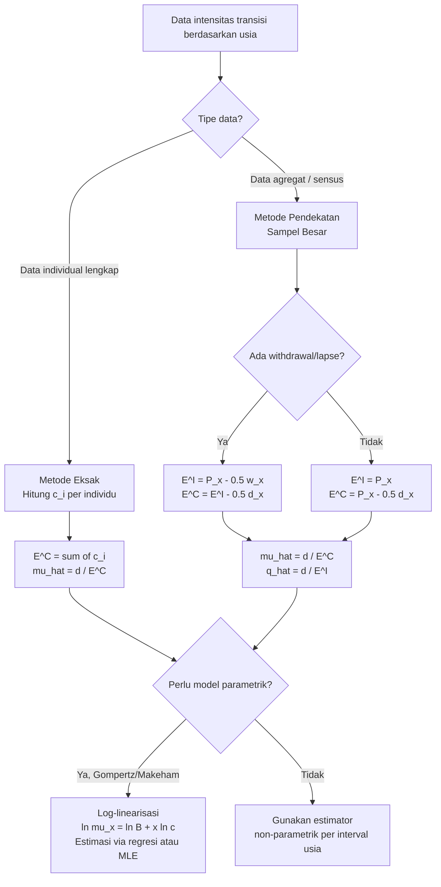

# 📊 2.3 — Age-Dependent Transition Intensities

> [!ABSTRACT] Ringkasan Cepat
> **Topik:** Estimasi intensitas transisi berdasarkan usia | **Bobot:** ~10–20% | **Difficulty:** Hard
> **Ref:** Dickson et al. (2009) Bab 8; London (1997) Bab 10 | **Prereq:** [[2.1 Multiple State and Markov Models]], [[2.2 MLE for Transition Intensities]]

---

## Section 0 — Pemetaan Topik

| Topik TA1 | Sub-topik ID | Skill Diuji | Bobot | Difficulty | Prerequisite | Connected Topics | Referensi |
|---|---|---|---|---|---|---|---|
| Model Multiple State & Estimasinya | 2.3 | Mengestimasi intensitas transisi berdasarkan usia secara eksak dan pendekatan sampel besar | 10–20% | Hard | [[2.1 Multiple State and Markov Models]], [[2.2 MLE for Transition Intensities]] | [[1.6 Maximum Likelihood Estimation for Survival]], [[1.5 Censoring and Non-Parametric Estimation]] | Dickson et al. (2009) Bab 8; London (1997) Bab 10 |

---

## Section 1 — Intuisi

Bayangkan sebuah perusahaan asuransi jiwa sedang membangun tabel mortalitas baru untuk produk asuransi kesehatan kumpulan. Mereka memiliki data ratusan ribu tertanggung selama 5 tahun terakhir. Setiap orang masuk ke dalam sistem dengan usia tertentu — ada yang mulai ikut asuransi di usia 30 tahun, ada yang 45 tahun, ada yang 60 tahun. Pertanyaan intinya adalah: seberapa besar kemungkinan seseorang yang kini berusia 55 tahun akan meninggal atau mengalami cacat dalam satu tahun ke depan? Jawaban atas pertanyaan ini tidak bisa diasumsikan konstan untuk semua usia — kita tahu bahwa risiko berubah seiring bertambahnya usia.

Inilah mengapa estimasi intensitas transisi berdasarkan usia menjadi sangat penting. Pada topik 2.2, kita sudah mempelajari bagaimana mengestimasi intensitas transisi ketika intensitas tersebut *piecewise constant* — artinya dianggap konstan dalam interval waktu tertentu. Namun dalam kenyataan, yang lebih alami secara aktuaria adalah mengasumsikan intensitas itu berubah secara *kontinu seiring usia*. Seorang pria berusia 65 tahun punya probabilitas meninggal yang berbeda dari pria 50 tahun — dan bedanya bukan sekadar nilai konstan yang terpisah, melainkan fungsi usia yang mulus.

Topik 2.3 memperkenalkan dua pendekatan yang saling melengkapi: metode **eksak** yang menghasilkan estimator tepat dengan memanfaatkan seluruh informasi waktu kehidupan individu, dan metode **pendekatan sampel besar** yang jauh lebih praktis untuk data populasi besar di mana kita tidak melacak setiap individu secara detail, melainkan cukup mengetahui jumlah agregat pada setiap kelompok usia. Kedua metode ini adalah tulang punggung pembuatan tabel kehidupan modern di Indonesia maupun secara internasional.

---

## Section 2 — Definisi Formal

> [!NOTE] Definisi Matematis — Intensitas Transisi Berdasarkan Usia
> Misalkan $\mu_x^{rs}$ adalah intensitas transisi dari state $r$ ke state $s$ pada usia $x$. Dalam model *multiple state* kontinu, probabilitas transisi memenuhi persamaan Kolmogorov maju:
>
> $$
> \frac{d}{dt} \, {}_{t}p_x^{rs} = \sum_{j \neq s} {}_{t}p_x^{rj} \, \mu_{x+t}^{js} - {}_{t}p_x^{rs} \sum_{j \neq s} \mu_{x+t}^{sj}
> $$
>
> dengan kondisi awal ${}_{0}p_x^{rr} = 1$ dan ${}_{0}p_x^{rs} = 0$ untuk $r \neq s$.

**Tabel Variabel & Parameter**

| Simbol | Makna | Catatan |
|---|---|---|
| $\mu_x^{rs}$ | Intensitas transisi dari state $r$ ke state $s$ pada usia $x$ | Fungsi kontinu terhadap $x$; analog dengan *force of mortality* |
| ${}_{t}p_x^{rs}$ | Probabilitas berada di state $s$ pada usia $x+t$, diketahui berada di state $r$ pada usia $x$ | ${}_{t}p_x^{rs} \geq 0$ untuk semua $r,s,t$ |
| $E_x^r$ | *Exposed-to-risk* dalam state $r$ pada usia $x$ (dalam satuan orang-tahun) | Diintegrasikan atas interval usia |
| $d_x^{rs}$ | Jumlah transisi terobservasi dari state $r$ ke state $s$ dalam interval usia $[x, x+1)$ | Variabel acak cacahan (count) |
| $\hat{\mu}_x^{rs}$ | Estimator MLE dari intensitas transisi $\mu_x^{rs}$ | $\hat{\mu}_x^{rs} = d_x^{rs} / E_x^r$ |
| $c_x^{rs}$ | Waktu yang dihabiskan di state $r$ oleh individu ke-$i$ dalam interval usia | Digunakan dalam metode eksak |
| $\theta$ | Parameter dalam model parametrik intensitas (misalnya Gompertz) | Diestimasi via MLE |

### Rumus Utama

**1. Estimator MLE Eksak untuk Intensitas Konstan dalam Interval $[x, x+1)$:**

$$
\hat{\mu}^{rs} = \frac{d^{rs}}{\sum_i c_i^r}
$$

**Label:** Pembilang = jumlah transisi $r \to s$; penyebut = total waktu terobservasi dalam state $r$ (central exposed-to-risk).

**2. Central Exposed-to-Risk (Eksak):**

$$
E^{r,C} = \sum_{i} c_i^r
$$

**Label:** $c_i^r$ = waktu individu $i$ berada dalam state $r$ selama periode observasi; diakumulasikan atas semua individu.

**3. Estimator Pendekatan Sampel Besar (Initial Exposed-to-Risk):**

$$
\hat{\mu}_x^{rs} = \frac{d_x^{rs}}{E_x^{r,I}}
$$

**Label:** $E_x^{r,I}$ adalah *initial exposed-to-risk* — perkiraan jumlah orang dalam state $r$ yang *berisiko* mengalami transisi ke $s$ pada awal interval usia $[x, x+1)$.

**4. Hubungan Central dan Initial Exposed-to-Risk (untuk model mortalitas 2-state):**

$$
E_x^{r,I} \approx E_x^{r,C} + \frac{1}{2} d_x^{rs}
$$

**Label:** Koreksi setengah transisi: individu yang mati dianggap rata-rata hidup setengah tahun dalam interval. Berlaku jika kematian tersebar merata dalam interval usia.

**5. Estimasi Parametrik — Model Gompertz:**

$$
\mu_x = B \cdot c^x, \quad B > 0, \; c > 1
$$

**Label:** Intensitas meningkat eksponensial terhadap usia. Log-linearisasi: $\ln \mu_x = \ln B + x \ln c$.

**6. Log-Likelihood untuk Intensitas Berdasarkan Usia (model parametrik):**

$$
\ell(\theta) = \sum_x \left[ d_x \ln \mu_x(\theta) - E_x^C \cdot \mu_x(\theta) \right]
$$

**Label:** Penjumlahan atas semua interval usia $x$; $\theta$ adalah vektor parameter model (mis. $B, c$ pada Gompertz).

### Asumsi Eksplisit

1. **Proses Markov:** Probabilitas transisi hanya bergantung pada state dan usia saat ini, bukan riwayat sebelumnya.
2. **Kelengkapan observasi:** Setiap individu diikuti sampai akhir periode observasi, atau waktu sensor/keluarnya tercatat dengan tepat.
3. **Distribusi kematian dalam interval (untuk metode pendekatan):** Kematian/transisi tersebar merata (UDD — *uniform distribution of decrements*) dalam interval usia satu tahun.
4. **Independensi individu:** Waktu transisi setiap individu saling independen satu sama lain.
5. **Fungsi intensitas halus:** Untuk metode parametrik, $\mu_x^{rs}$ diasumsikan merupakan fungsi kontinu dan terdiferensialkan dari usia $x$.

---

## Section 3 — Jembatan Logika

> [!TIP] Dari Definisi ke Rumus
> Inti dari estimasi intensitas berdasarkan usia adalah menerapkan prinsip MLE pada data yang dikelompokkan per interval usia. Untuk setiap interval usia $[x, x+1)$, kita memiliki: (a) jumlah transisi yang terobservasi ($d_x^{rs}$), dan (b) total waktu paparan di state asal ($E_x^{r,C}$). Fungsi likelihood di setiap interval berbentuk distribusi Poisson: jumlah peristiwa dalam populasi yang terpapar mengikuti Poisson dengan mean $\mu^{rs} \cdot E^{r,C}$. Memaksimalkan log-likelihood menghasilkan estimator $\hat{\mu}^{rs} = d^{rs} / E^{r,C}$ yang intuitif: "rate kejadian = jumlah kejadian dibagi total waktu berisiko".

> [!IMPORTANT] Dua Pendekatan Exposed-to-Risk
> **Metode Eksak:** Setiap individu dilacak secara individual. Waktu pastinya memasuki dan meninggalkan state $r$ dicatat. $E^{r,C} = \sum_i c_i^r$ dihitung tepat. Ini ideal untuk studi kohort kecil dengan data lengkap.
>
> **Metode Pendekatan Sampel Besar:** Data berbentuk agregat — kita hanya tahu berapa banyak orang dalam setiap kelompok usia pada awal tahun dan berapa yang meninggal/transit. Initial exposed-to-risk $E_x^{r,I}$ diestimasi, lalu dikoreksi ke central exposed-to-risk menggunakan asumsi UDD. Ini standar untuk data sensus atau data industri asuransi massal.

### Derivasi Step-by-Step: Dari MLE ke Estimator $\hat{\mu}^{rs}$

**Langkah 1 — Bentuk Likelihood untuk Satu Individu**

Misalkan individu $i$ diamati selama waktu $c_i$ dalam state $r$, dan pada akhir pengamatan mengalami transisi ke state $s$ (indicator $\delta_i = 1$) atau tidak ($\delta_i = 0$). Kontribusi likelihood individu $i$:

$$
L_i(\mu^{rs}) = (\mu^{rs})^{\delta_i} \exp(-\mu^{rs} \cdot c_i)
$$

**Langkah 2 — Likelihood Gabungan (asumsi intensitas konstan dalam interval)**

$$
L(\mu^{rs}) = \prod_i L_i = (\mu^{rs})^{d^{rs}} \exp\left(-\mu^{rs} \sum_i c_i\right) = (\mu^{rs})^{d^{rs}} \exp(-\mu^{rs} \cdot E^{r,C})
$$

di mana $d^{rs} = \sum_i \delta_i$ adalah total transisi terobservasi.

**Langkah 3 — Log-Likelihood**

$$
\ell(\mu^{rs}) = d^{rs} \ln(\mu^{rs}) - \mu^{rs} \cdot E^{r,C}
$$

**Langkah 4 — Diferensiasi dan FOC**

$$
\frac{d\ell}{d\mu^{rs}} = \frac{d^{rs}}{\mu^{rs}} - E^{r,C} = 0
$$

**Langkah 5 — Penyelesaian**

$$
\hat{\mu}^{rs} = \frac{d^{rs}}{E^{r,C}}
$$

Ini adalah estimator MLE yang unbiased (secara asimptotik), dengan varians $\text{Var}(\hat{\mu}^{rs}) \approx \mu^{rs} / E^{r,C}$.

### Derivasi: Koreksi Initial ke Central Exposed-to-Risk

Misalkan $P_x$ = jumlah individu dalam state $r$ tepat pada usia $x$ (awal interval). Dalam interval $[x, x+1)$, ada $d_x$ yang meninggalkan state via transisi yang diminati (misalnya kematian), dan $w_x$ yang *censored* (keluar karena alasan lain, misalnya akhir periode studi).

**Initial exposed-to-risk:**

$$
E_x^{r,I} = P_x - \frac{1}{2} w_x
$$

Asumsi: individu yang censored rata-rata diobservasi setengah tahun.

**Central exposed-to-risk (hubungan dengan initial):**

$$
E_x^{r,C} = E_x^{r,I} - \frac{1}{2} d_x
$$

Karena individu yang transit (meninggal/cacat) juga rata-rata hanya hadir setengah tahun dalam interval.

**Sehingga:**

$$
E_x^{r,I} = E_x^{r,C} + \frac{1}{2} d_x
$$

Dan estimator mortalitas menggunakan initial exposed-to-risk:

$$
\hat{q}_x = \frac{d_x}{E_x^{r,I}}
$$

> [!DANGER] Dilarang
> 1. **Jangan mencampur** initial dan central exposed-to-risk tanpa koreksi — keduanya menghasilkan estimator yang berbeda ($\hat{q}_x$ vs $\hat{\mu}_x$), dan menggunakannya secara bergantian tanpa penyesuaian akan menghasilkan estimasi yang bias.
> 2. **Jangan menggunakan** $\hat{\mu}_x = d_x / E_x^{r,I}$ secara langsung — ini salah. Initial exposed-to-risk digunakan untuk estimasi $q_x$ (probabilitas), sedangkan central exposed-to-risk digunakan untuk estimasi $\mu_x$ (intensitas/rate).
> 3. **Jangan mengabaikan sensor** dalam menghitung $E^{r,C}$ — individu yang censored tetap berkontribusi pada exposed-to-risk selama waktu mereka terobservasi, bukan diabaikan begitu saja.

---

## Section 4 — Contoh Soal

### Soal A — Fundamental

Sebuah studi mortalitas mengikuti 500 orang berusia tepat 60 tahun selama satu tahun penuh. Pada akhir tahun, 12 orang meninggal. Tidak ada pengeluaran karena sebab lain (tidak ada censoring).

Hitung estimator MLE untuk:
(a) Intensitas mortalitas $\hat{\mu}_{60}$
(b) Probabilitas mortalitas $\hat{q}_{60}$

> [!SUCCESS] Solusi Soal A
> **Pendekatan:** Karena tidak ada censoring, central dan initial exposed-to-risk dapat dihitung langsung. Hubungkan $\hat{\mu}$ dan $\hat{q}$ melalui asumsi intensitas konstan.
>
> **1. Identifikasi Variabel**
> - $P_{60} = 500$ (jumlah awal, berusia tepat 60)
> - $d_{60} = 12$ (jumlah kematian dalam tahun)
> - $w_{60} = 0$ (tidak ada censoring)
> - Periode observasi = 1 tahun penuh
>
> **2. Identifikasi Model**
> Model dua state: *Hidup* (state 0) → *Meninggal* (state 1). Tidak ada re-entry ke state hidup. Intensitas konstan dalam interval usia $[60, 61)$.
>
> **3. Setup Persamaan**
>
> Central exposed-to-risk:
>
> $$
> E_{60}^C = P_{60} \cdot 1 - \frac{1}{2} d_{60} = 500 - 6 = 494 \text{ orang-tahun}
> $$
>
> (karena $w = 0$, initial = $P_{60}$, dan koreksi $\frac{1}{2}d$ untuk central)
>
> **4. Eksekusi Aljabar**
>
> (a) Estimator intensitas mortalitas:
>
> $$
> \hat{\mu}_{60} = \frac{d_{60}}{E_{60}^C} = \frac{12}{494} = 0.02429 \text{ per tahun}
> $$
>
> (b) Probabilitas mortalitas (asumsi intensitas konstan selama 1 tahun):
>
> $$
> \hat{q}_{60} = 1 - e^{-\hat{\mu}_{60}} = 1 - e^{-0.02429} = 1 - 0.97598 = 0.02402
> $$
>
> **5. Verification**
> Untuk nilai $\mu$ kecil, $q \approx \mu$ (perkiraan orde pertama). $0.02402 \approx 0.02429$ ✓. Alternatif: $\hat{q}_{60}^{crude} = d/P = 12/500 = 0.024$, mendekati hasil eksak.
>
> **Hasil:** $\hat{\mu}_{60} = 0.02429$ per tahun; $\hat{q}_{60} = 0.02402$.

> [!WARNING] Exam Tips — Soal A
> **Target waktu:** 3 menit. **Common trap:** Menggunakan $P_{60} = 500$ langsung sebagai central exposed-to-risk — ini salah karena individu yang meninggal hanya hadir rata-rata setengah tahun. **Shortcut:** Jika tidak ada censoring, $E^C = P - \frac{1}{2}d$ langsung.

---

### Soal B — Exam-Typical

Sebuah perusahaan asuransi mencatat data berikut untuk kelompok usia 70–71 dalam studinya selama satu tahun kalender:

- Jumlah pemegang polis yang berusia tepat 70 pada 1 Januari: $P_{70} = 1.200$
- Jumlah kematian sepanjang tahun (usia saat kematian dalam $[70,71)$): $d_{70} = 48$
- Jumlah penarikan (lapse/surrender) sepanjang tahun, dengan usia rata-rata saat keluar 70.5: $w_{70} = 60$

Hitung:
(a) Initial exposed-to-risk $E_{70}^I$
(b) Central exposed-to-risk $E_{70}^C$
(c) Estimator $\hat{\mu}_{70}$ dan $\hat{q}_{70}$

> [!SUCCESS] Solusi Soal B
> **Pendekatan:** Ada dua jenis keluar (kematian dan penarikan). Hitung initial exposed-to-risk dengan koreksi untuk withdrawal, lalu konversi ke central untuk estimasi intensitas.
>
> **1. Identifikasi Variabel**
> - $P_{70} = 1.200$ (populasi awal)
> - $d_{70} = 48$ (kematian — peristiwa yang diminati)
> - $w_{70} = 60$ (penarikan — censoring, rata-rata di usia 70.5 ≡ setengah tahun)
>
> **2. Identifikasi Model**
> Model dua penyebab keluar (*double decrement*): state Hidup → Meninggal atau Keluar. Asumsi UDD berlaku untuk distribusi kematian dalam interval.
>
> **3. Setup Persamaan**
>
> Initial exposed-to-risk (mengoreksi withdrawal yang hanya terobservasi rata-rata setengah tahun):
>
> $$
> E_{70}^I = P_{70} - \frac{1}{2} w_{70}
> $$
>
> Central exposed-to-risk:
>
> $$
> E_{70}^C = E_{70}^I - \frac{1}{2} d_{70}
> $$
>
> **4. Eksekusi Aljabar**
>
> $$
> E_{70}^I = 1200 - \frac{1}{2}(60) = 1200 - 30 = 1170 \text{ orang-tahun}
> $$
>
> $$
> E_{70}^C = 1170 - \frac{1}{2}(48) = 1170 - 24 = 1146 \text{ orang-tahun}
> $$
>
> Estimator:
>
> $$
> \hat{\mu}_{70} = \frac{d_{70}}{E_{70}^C} = \frac{48}{1146} = 0.04189 \text{ per tahun}
> $$
>
> $$
> \hat{q}_{70} = \frac{d_{70}}{E_{70}^I} = \frac{48}{1170} = 0.04103
> $$
>
> **5. Verification**
> Hubungan: $\hat{q}_{70} = 1 - e^{-\hat{\mu}_{70}} = 1 - e^{-0.04189} = 0.04102$ ≈ $0.04103$ ✓. Konsisten.
>
> **Hasil:** $E_{70}^I = 1170$; $E_{70}^C = 1146$; $\hat{\mu}_{70} = 0.04189$ per tahun; $\hat{q}_{70} = 0.04103$.

> [!WARNING] Exam Tips — Soal B
> **Target waktu:** 4 menit. **Common trap:** Mengurangkan seluruh $d_{70}$ dari $P_{70}$ untuk mendapatkan initial exposed-to-risk, atau lupa bahwa withdrawal yang terjadi di tengah tahun hanya berkontribusi setengah ke exposed-to-risk. **Shortcut:** Hafalkan urutan: hitung $E^I$ dulu (koreksi $w$), lalu $E^C$ (koreksi tambahan $d$).

---

### Soal C — Challenging

Data berikut tersedia untuk model *disability* tiga state: **Sehat (H)**, **Cacat (D)**, **Meninggal (M)**. Estimasi intensitas transisi dari state Sehat untuk kelompok usia $[55, 56)$:

| Transisi | Jumlah Kejadian | Central Exposed-to-Risk |
|---|---|---|
| Sehat → Cacat | $d^{HD} = 25$ | $E^{H,C} = 2.000$ orang-tahun |
| Sehat → Meninggal | $d^{HM} = 10$ | $E^{H,C} = 2.000$ orang-tahun |

Diasumsikan model Gompertz berlaku untuk mortalitas orang sehat: $\mu_x^{HM} = B \cdot c^x$ dengan $\ln B = -7.5$ dan $\ln c = 0.09$.

(a) Hitung $\hat{\mu}_{55}^{HD}$ dan $\hat{\mu}_{55}^{HM}$ dari data.
(b) Hitung $\mu_{55}^{HM}$ dari model Gompertz dan bandingkan dengan estimator data.
(c) Hitung total intensitas keluar dari state Sehat $\hat{\mu}_{55}^{H\bullet}$ dan probabilitas tetap Sehat selama 1 tahun ${}_{1}p_{55}^{HH}$.

> [!SUCCESS] Solusi Soal C
> **Pendekatan:** Dalam model multiple state, intensitas transisi dari satu state ke masing-masing state lain diestimasi secara terpisah tetapi menggunakan exposed-to-risk yang sama (waktu total dalam state asal). Total intensitas keluar adalah penjumlahan semua intensitas individual.
>
> **1. Identifikasi Variabel**
> - State: $H$ (Sehat), $D$ (Cacat/Disabled), $M$ (Meninggal)
> - $d^{HD} = 25$, $d^{HM} = 10$
> - $E^{H,C} = 2.000$ (sama untuk kedua transisi — ini waktu total di state $H$)
> - Parameter Gompertz: $B = e^{-7.5}$, $c = e^{0.09}$
>
> **2. Identifikasi Model**
> Model Markov kontinu 3-state dengan intensitas konstan dalam interval usia $[55,56)$ untuk estimasi data, dan model Gompertz untuk perbandingan parametrik.
>
> **3. Setup Persamaan**
>
> Untuk model multiple state, $E^{H,C}$ adalah sama untuk semua transisi dari $H$ karena mencerminkan total waktu di state $H$:
>
> $$
> \hat{\mu}_{55}^{rs} = \frac{d^{rs}}{E^{H,C}}, \quad s \in \{D, M\}
> $$
>
> Total intensitas keluar:
>
> $$
> \hat{\mu}_{55}^{H\bullet} = \hat{\mu}_{55}^{HD} + \hat{\mu}_{55}^{HM}
> $$
>
> Probabilitas tetap di state $H$ (dengan semua penyebab keluar):
>
> $$
> {}_{1}p_{55}^{HH} = \exp\left(-\hat{\mu}_{55}^{H\bullet} \cdot 1\right)
> $$
>
> **4. Eksekusi Aljabar**
>
> (a) Estimator dari data:
>
> $$
> \hat{\mu}_{55}^{HD} = \frac{25}{2000} = 0.01250 \text{ per tahun}
> $$
>
> $$
> \hat{\mu}_{55}^{HM} = \frac{10}{2000} = 0.00500 \text{ per tahun}
> $$
>
> (b) Model Gompertz pada $x = 55$:
>
> $$
> \mu_{55}^{HM} = B \cdot c^{55} = e^{-7.5} \cdot e^{0.09 \times 55} = e^{-7.5 + 4.95} = e^{-2.55} = 0.007808 \text{ per tahun}
> $$
>
> Perbandingan: data memberikan $\hat{\mu}_{55}^{HM} = 0.00500$, sedangkan Gompertz memberikan $0.007808$. Estimator data lebih rendah, mungkin karena ukuran sampel yang kecil ($d^{HM} = 10$ saja) sehingga ada ketidakpastian besar.
>
> (c) Total intensitas dan probabilitas bertahan di state $H$:
>
> $$
> \hat{\mu}_{55}^{H\bullet} = 0.01250 + 0.00500 = 0.01750 \text{ per tahun}
> $$
>
> $$
> {}_{1}p_{55}^{HH} = e^{-0.01750} = 0.98265
> $$
>
> **5. Verification**
> Cek skala: dengan total intensitas $0.0175$, probabilitas keluar dalam 1 tahun $\approx 1 - e^{-0.0175} \approx 0.0175 - \frac{0.0175^2}{2} \approx 0.01735$. Dari data: $(25+10)/2000 = 0.01750$ ≈ konsisten ✓. Nilai ${}_{1}p_{55}^{HH} = 0.983$ masuk akal untuk usia 55 tahun.
>
> **Hasil:** $\hat{\mu}_{55}^{HD} = 0.01250$; $\hat{\mu}_{55}^{HM} = 0.00500$; Gompertz: $\mu_{55}^{HM} = 0.00781$; $\hat{\mu}_{55}^{H\bullet} = 0.01750$; ${}_{1}p_{55}^{HH} = 0.98265$.

> [!WARNING] Exam Tips — Soal C
> **Target waktu:** 5–6 menit. **Common trap:** Menggunakan exposed-to-risk berbeda untuk masing-masing transisi dari state $H$ — padahal $E^{H,C}$ sama untuk semua transisi dari state yang sama karena mencerminkan total waktu *di state $H$*, bukan waktu menuju state tertentu. **Shortcut:** Dalam model multiple state, $\hat{\mu}^{rs} = d^{rs}/E^{r,C}$ — pembagi selalu exposed-to-risk di state **asal** $r$, bukan state tujuan $s$.

---

## Section 5 — Verifikasi & Sanity Check

> [!CHECK] Cek 1 — Konsistensi $\hat{\mu}$ dan $\hat{q}$
> Untuk intensitas $\hat{\mu}$ yang kecil (di bawah 0.1 per tahun), berlaku:
>
> $$
> \hat{q} = 1 - e^{-\hat{\mu}} \approx \hat{\mu} - \frac{\hat{\mu}^2}{2}
> $$
>
> Jika $\hat{q}$ yang dihitung dari $d/E^I$ berbeda lebih dari 10% dari $1 - e^{-\hat{\mu}}$, ada kemungkinan asumsi UDD dilanggar atau ada kesalahan dalam exposed-to-risk.

> [!CHECK] Cek 2 — Batas Exposed-to-Risk
> Selalu periksa:
>
> $$
> E^C < E^I < P_x
> $$
>
> Jika $E^I > P_x$ atau $E^C > E^I$, ada kesalahan dalam perhitungan. Secara logis: central < initial karena individu yang meninggal hanya hadir rata-rata setengah interval dalam central, sedangkan mereka dihitung penuh (secara implisit) dalam initial.

> [!CHECK] Cek 3 — Model Multiple State
> Total intensitas keluar dari satu state $\mu^{r\bullet} = \sum_{s \neq r} \mu^{rs}$ harus positif dan finite. Probabilitas tetap di state $r$ selama interval 1 tahun:
>
> $$
> {}_{1}p_x^{rr} = \exp(-\mu^{r\bullet}) \in (0, 1)
> $$
>
> Nilai di luar $(0,1)$ mengindikasikan kesalahan.

### Metode Alternatif — Estimasi Parametrik via Log-Linearisasi

Untuk model Gompertz $\mu_x = Bc^x$, ambil logaritma:

$$
\ln \hat{\mu}_x = \ln B + x \ln c
$$

Plot $\ln \hat{\mu}_x$ vs $x$ untuk berbagai kelompok usia. Jika linear, estimasi $\ln B$ (intercept) dan $\ln c$ (slope) melalui regresi OLS. Metode ini cepat dan intuitif dibandingkan MLE numerik penuh.

---

## Section 6 — Visualisasi Mental

**Diagram State — Model Disability 3-State (Sehat–Cacat–Meninggal):**

```
        μ^{HD}              μ^{DH} (jika recovery diizinkan)
Sehat ─────────→ Cacat ─────────→
  │    ←─────────   │              (arah tanda panah menunjukkan transisi)
  │     μ^{DH}      │ μ^{DM}
  │ μ^{HM}          ↓
  └──────────────→ Meninggal
```

Setiap panah merepresentasikan satu intensitas transisi $\mu^{rs}(x)$ yang merupakan fungsi usia $x$.

**Interpretasi grafik intensitas vs usia:**
- Sumbu X: usia $x$ (misalnya 50–90 tahun)
- Sumbu Y: nilai $\hat{\mu}_x$ (skala log untuk model Gompertz akan linear)
- Bentuk kurva: menaik (untuk mortalitas dan insidens cacat), semakin curam di usia tua
- Di skala log: model Gompertz menghasilkan garis lurus ($\ln \mu_x$ linear terhadap $x$)
- Titik kritis: usia di mana intensitas melebihi threshold tertentu (relevan untuk underwriting)

**Perbandingan Central vs Initial Exposed-to-Risk:**

```
Usia x:    |────────────────────────────| x+1
Individu A (hidup penuh):  |────────────────────────────|  c_A = 1 tahun
Individu B (meninggal t=0.6): |──────────────|            c_B = 0.6 tahun
Individu C (lapse t=0.4):  |────────|                     c_C = 0.4 tahun

E^C = 1.0 + 0.6 + 0.4 = 2.0 (total waktu aktual dalam state)
E^I ≈ 1.0 + 1.0 + 0.5 = 2.5 (pendekatan: lapse setengah, kematian dihitung penuh)
```

### Hubungan Visual ↔ Rumus

| Elemen Visual | Komponen Rumus |
|---|---|
| Panjang garis setiap individu dalam state $r$ | $c_i^r$ dalam $E^{r,C} = \sum_i c_i^r$ |
| Tanda panah di diagram state | Intensitas $\mu^{rs}$ yang harus diestimasi |
| Kemiringan $\ln \hat{\mu}_x$ vs $x$ | $\ln c$ dalam model Gompertz |
| Luas area di bawah kurva intensitas | Integral $\int \mu_x \, dx$ = risiko kumulatif |

---

## Section 7 — Jebakan Umum

> [!BUG] Kesalahan Parametrisasi — Central vs Initial Exposed-to-Risk
> **Salah:** $\hat{\mu}_x = d_x / E_x^I$ — menggunakan initial sebagai pembagi untuk estimator intensitas.
> **Benar:** $\hat{\mu}_x = d_x / E_x^C$ — intensitas selalu menggunakan **central** exposed-to-risk.
> **Alasan:** Intensitas $\mu$ adalah rate instantaneous — pembaginya harus total waktu aktual berisiko (central), bukan perkiraan jumlah orang di awal (initial).

> [!BUG] Kesalahan Konseptual — Exposed-to-Risk dalam Model Multiple State
> Empat miskonsepsi khas:
> 1. **Menggunakan exposed-to-risk berbeda** untuk $\hat{\mu}^{HD}$ dan $\hat{\mu}^{HM}$ — padahal $E^{H,C}$ adalah total waktu di state $H$, berlaku untuk semua transisi dari $H$.
> 2. **Mengabaikan transisi kembali** — jika seseorang bisa sembuh dari cacat (Cacat → Sehat), mereka berkontribusi lagi ke $E^{H,C}$ setelah sembuh.
> 3. **Menyamakan $\mu^{r\bullet}$ dengan $\mu^{rs}$** — total intensitas keluar dari state $r$ adalah *jumlah* semua intensitas individual, bukan satu intensitas tunggal.
> 4. **Salah menerapkan asumsi Markov** — jika proses tidak memiliki sifat Markov (misalnya ada *duration dependence*), estimator MLE standar ini bias.

> [!BUG] Kesalahan Interpretasi Soal
> - **"Observed transitions"** vs **"observed deaths"**: dalam model multiple state, $d^{rs}$ hanya menghitung transisi $r \to s$ secara spesifik, bukan semua keluar dari $r$.
> - **"Exact method"** dalam soal berarti data individual tersedia — gunakan $E^C = \sum c_i$ eksak.
> - **"Census approximation"** atau **"large sample approximation"** berarti gunakan rumus $E^I$ dan koreksi $\frac{1}{2}d$.
> - Kata **"age last birthday"** vs **"age nearest birthday"** mengubah cara mengelompokkan individu ke interval usia.

> [!CAUTION] Red Flags — Trigger Prosedur Khusus
> - Soal menyebut **"withdrawal"**, **"lapse"**, atau **"censored"** → wajib koreksi $\frac{1}{2}w$ dalam $E^I$
> - Soal menyebut **"exact ages known"** → gunakan metode eksak, bukan pendekatan
> - Soal meminta **"probability of remaining in state"** → gunakan ${}_{t}p^{rr} = \exp(-\mu^{r\bullet} \cdot t)$
> - Soal menyebut model **Gompertz** atau **Makeham** → mungkin perlu log-linearisasi atau MLE parametrik

---

## Section 8 — Ringkasan Eksekutif

> [!SUMMARY] Must-Remember
> 1. **Estimator MLE intensitas (metode eksak):**
>    $$\hat{\mu}^{rs} = \frac{d^{rs}}{E^{r,C}} = \frac{\text{jumlah transisi } r \to s}{\text{total waktu aktual di state } r}$$
>
> 2. **Koreksi central–initial exposed-to-risk (metode pendekatan, asumsi UDD):**
>    $$E_x^{r,I} = E_x^{r,C} + \frac{1}{2} d_x \quad \Longleftrightarrow \quad E_x^{r,C} = E_x^{r,I} - \frac{1}{2} d_x$$
>
> 3. **Initial exposed-to-risk dari data sensus:**
>    $$E_x^{r,I} = P_x - \frac{1}{2} w_x$$
>
> 4. **Total intensitas keluar dari state $r$:**
>    $$\mu_x^{r\bullet} = \sum_{s \neq r} \mu_x^{rs}$$
>
> 5. **Probabilitas bertahan di state $r$ selama $t$ tahun:**
>    $${}_{t}p_x^{rr} = \exp\!\left(-\int_0^t \mu_{x+u}^{r\bullet} \, du\right) \approx \exp(-\mu^{r\bullet} \cdot t) \text{ (jika intensitas konstan)}$$

### Kapan Digunakan

- Data observasi individu dengan usia tercatat → metode **eksak**
- Data populasi agregat per kelompok usia (data sensus, data industri) → metode **pendekatan sampel besar**
- Model *multiple state* (disability, long-term care, multi-decrement) dengan intensitas berubah sesuai usia
- Pembuatan tabel kehidupan (*life table*) dari data pengalaman perusahaan asuransi

### Kapan TIDAK Boleh Digunakan

- Ketika proses **tidak memiliki sifat Markov** (ada *path dependence* atau *duration dependence*) — estimator MLE ini bias
- Ketika intensitas transisi **tidak berlaku piecewise constant** dalam interval usia dan pendekatan lain lebih tepat
- Ketika sampel terlalu kecil ($d^{rs} < 5$) sehingga asimptotik Poisson tidak berlaku dan interval kepercayaan dari MLE tidak reliable

### Quick Decision Tree



---

> [!QUOTE] Follow-up Options
> 1. *"Berikan contoh soal variasi [[2.3 Age-Dependent Transition Intensities]] dengan model Makeham"*
> 2. *"Jelaskan hubungan [[2.3 Age-Dependent Transition Intensities]] dengan [[1.5 Censoring and Non-Parametric Estimation]]"*
> 3. *"Buat flashcard 1-halaman untuk topik ini"*

*📖 Ref: Dickson, Hardy, Waters (2009) Bab 8; London (1997) Bab 10 | 🗓️ 2026-04-19 | #TA1 #MultipleState #AgeDependentIntensities*
