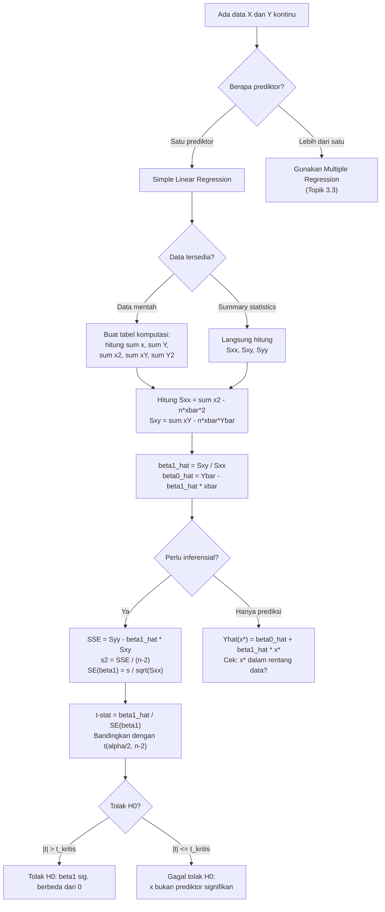

# 📊 3.2 — Simple Linear Regression

> [!ABSTRACT] Ringkasan Cepat
> **Topik:** Simple Linear Regression | **Bobot:** ~20–25% | **Difficulty:** Calculation-Intensive
> **Ref:** Frees (2010) Bab 1–3 | **Prereq:** [[3.1 Explanatory and Response Variables]]

---

## Section 0 — Pemetaan Topik

| Topik TA1 | Sub-topik ID | Skill Diuji | Bobot | Difficulty | Prerequisite | Connected Topics | Referensi |
|---|---|---|---|---|---|---|---|
| Analisis Regresi | 3.2 | Menghitung estimasi OLS untuk slope $\hat{\beta}_1$ dan intercept $\hat{\beta}_0$; interpretasi koefisien; interval kepercayaan | 20–25% | Calculation-Intensive | [[3.1 Explanatory and Response Variables]] | [[3.3 Multiple Linear Regression Interpretation]], [[3.4 Residual Analysis and Model Validation]], [[3.5 Variable Selection Criteria]] | Frees (2010) Bab 1–3 |

---

## Section 1 — Intuisi

Bayangkan seorang aktuaris di perusahaan asuransi umum sedang diminta manajemen untuk menjelaskan mengapa premi asuransi kendaraan bervariasi antar nasabah. Dari jutaan data historis, terlihat jelas bahwa nasabah yang lebih tua cenderung mengajukan klaim lebih sedikit, dan nasabah dengan nilai kendaraan lebih tinggi cenderung mengajukan klaim lebih besar. Pertanyaannya: berapa tepatnya kenaikan premi yang wajar untuk setiap kenaikan satu juta rupiah nilai kendaraan? Tanpa alat statistik yang tepat, jawaban ini hanya opini — dengan regresi linier sederhana, jawabannya menjadi angka yang dapat dipertahankan secara ilmiah.

Regresi linier sederhana adalah cara paling elegan untuk meringkas hubungan antara dua variabel numerik menjadi sebuah garis lurus. Idenya sangat sederhana: dari sekumpulan titik data yang tersebar, kita cari garis yang "paling dekat" dengan semua titik tersebut secara bersamaan. "Paling dekat" didefinisikan dengan cara yang cerdas — bukan jarak biasa, melainkan meminimalkan kuadrat selisih vertikal antara titik data dan garis. Inilah yang disebut metode *Ordinary Least Squares* (OLS), dan hasilnya adalah dua angka sederhana: kemiringan (slope) dan titik potong (intercept) garis terbaik tersebut.

Yang membuat regresi linier sederhana sangat berguna dalam aktuaria adalah kemampuannya untuk memberikan jawaban yang dapat ditindaklanjuti. Slope memberitahu kita: "Untuk setiap kenaikan satu unit pada variabel penjelas, berapa rata-rata perubahan pada variabel respon?" Jawaban ini — jika asumsi modelnya terpenuhi — bukan sekadar korelasi, melainkan sebuah hubungan kuantitatif yang dapat digunakan untuk proyeksi, penetapan premi, dan pengambilan keputusan bisnis berbasis data.

---

## Section 2 — Definisi Formal

> [!NOTE] Definisi Matematis — Model Regresi Linier Sederhana
> Model populasi regresi linier sederhana dinyatakan sebagai:
>
> $$
> Y_i = \beta_0 + \beta_1 x_i + \varepsilon_i, \quad i = 1, 2, \ldots, n
> $$
>
> di mana $\varepsilon_i \overset{\text{iid}}{\sim} N(0, \sigma^2)$. Model ini menyatakan bahwa nilai respon $Y_i$ adalah fungsi linier deterministik dari $x_i$ ditambah komponen acak (error) $\varepsilon_i$.

**Tabel Variabel & Parameter**

| Simbol | Makna | Catatan |
|---|---|---|
| $Y_i$ | Variabel respon (dependen) untuk observasi ke-$i$ | Variabel acak |
| $x_i$ | Variabel prediktor (independen/penjelas) untuk observasi ke-$i$ | Dianggap non-stokastik (tetap) |
| $\beta_0$ | Intercept populasi — nilai ekspektasi $Y$ ketika $x = 0$ | Parameter tidak diketahui |
| $\beta_1$ | Slope populasi — perubahan rata-rata $Y$ per unit kenaikan $x$ | Parameter tidak diketahui |
| $\varepsilon_i$ | Error acak (residual populasi) | $E[\varepsilon_i] = 0$, $\text{Var}(\varepsilon_i) = \sigma^2$ |
| $\hat{\beta}_0$ | Estimator OLS untuk intercept | Dihitung dari data sampel |
| $\hat{\beta}_1$ | Estimator OLS untuk slope | Dihitung dari data sampel |
| $\hat{Y}_i$ | Nilai fitted (prediksi) untuk observasi ke-$i$ | $\hat{Y}_i = \hat{\beta}_0 + \hat{\beta}_1 x_i$ |
| $e_i$ | Residual sampel | $e_i = Y_i - \hat{Y}_i$ |
| $\bar{x}, \bar{Y}$ | Rata-rata sampel dari $x$ dan $Y$ | $\bar{x} = \frac{1}{n}\sum x_i$, $\bar{Y} = \frac{1}{n}\sum Y_i$ |
| $S_{xx}$ | Sum of squares untuk $x$ | $S_{xx} = \sum(x_i - \bar{x})^2$ |
| $S_{xy}$ | Sum of cross-products | $S_{xy} = \sum(x_i - \bar{x})(Y_i - \bar{Y})$ |
| $S_{yy}$ | Sum of squares untuk $Y$ | $S_{yy} = \sum(Y_i - \bar{Y})^2$ |
| $\sigma^2$ | Varians error populasi | Diestimasi oleh $s^2 = \text{MSE}$ |
| $n$ | Jumlah observasi | — |

### Rumus Utama

**1. Estimator OLS — Slope:**

$$
\hat{\beta}_1 = \frac{S_{xy}}{S_{xx}} = \frac{\sum_{i=1}^n (x_i - \bar{x})(Y_i - \bar{Y})}{\sum_{i=1}^n (x_i - \bar{x})^2}
$$

**Label:** Slope OLS = kovarians sampel ($xy$) dibagi varians sampel ($x$). Mengukur sensitivitas rata-rata $Y$ terhadap perubahan $x$.

**2. Estimator OLS — Intercept:**

$$
\hat{\beta}_0 = \bar{Y} - \hat{\beta}_1 \bar{x}
$$

**Label:** Garis regresi selalu melewati titik $(\bar{x}, \bar{Y})$. Intercept adalah implikasi dari constraint ini.

**3. Sum of Squares — Definisi Ringkas:**

$$
S_{xx} = \sum x_i^2 - n\bar{x}^2, \quad S_{xy} = \sum x_i Y_i - n\bar{x}\bar{Y}, \quad S_{yy} = \sum Y_i^2 - n\bar{Y}^2
$$

**Label:** Rumus komputasi yang menghindari rounding error — selalu gunakan ini saat menghitung dengan kalkulator.

**4. Mean Square Error (estimator $\sigma^2$):**

$$
s^2 = \text{MSE} = \frac{\text{SSE}}{n-2} = \frac{\sum_{i=1}^n e_i^2}{n-2} = \frac{S_{yy} - \hat{\beta}_1 S_{xy}}{n-2}
$$

**Label:** Dibagi $n-2$ (bukan $n$) karena dua parameter ($\beta_0, \beta_1$) diestimasi. SSE = $S_{yy} - \hat{\beta}_1 S_{xy}$.

**5. Standard Error Estimator Slope:**

$$
\text{SE}(\hat{\beta}_1) = \frac{s}{\sqrt{S_{xx}}}
$$

**Label:** Presisi estimasi slope meningkat jika: $s$ kecil (data tidak terlalu tersebar) atau $S_{xx}$ besar (variasi $x$ lebar).

**6. Standard Error Estimator Intercept:**

$$
\text{SE}(\hat{\beta}_0) = s\sqrt{\frac{1}{n} + \frac{\bar{x}^2}{S_{xx}}}
$$

**Label:** SE intercept bergantung pada $\bar{x}$ — semakin jauh $\bar{x}$ dari nol, semakin besar ketidakpastian intercept.

**7. Interval Kepercayaan untuk $\beta_1$ (dan $\beta_0$):**

$$
\hat{\beta}_1 \pm t_{\alpha/2,\, n-2} \cdot \text{SE}(\hat{\beta}_1)
$$

**Label:** Distribusi-$t$ dengan $n-2$ derajat bebas. Untuk $n$ besar, $t_{\alpha/2, n-2} \approx 1.96$ (95%).

**8. Nilai Fitted dan Residual:**

$$
\hat{Y}_i = \hat{\beta}_0 + \hat{\beta}_1 x_i, \qquad e_i = Y_i - \hat{Y}_i
$$

**Label:** Residual $e_i$ adalah estimasi dari error $\varepsilon_i$. Selalu berlaku $\sum e_i = 0$ dan $\sum x_i e_i = 0$.

### Asumsi Eksplisit

1. **Linearitas:** Hubungan antara $E[Y \mid x]$ dan $x$ adalah linear: $E[Y_i \mid x_i] = \beta_0 + \beta_1 x_i$.
2. **Independensi:** Error $\varepsilon_i$ saling independen satu sama lain (tidak ada autokorelasi).
3. **Homoskedastisitas:** Varians error konstan untuk semua nilai $x$: $\text{Var}(\varepsilon_i) = \sigma^2$ (tidak bergantung pada $x_i$).
4. **Normalitas:** $\varepsilon_i \sim N(0, \sigma^2)$ — diperlukan untuk inferensial (uji-$t$, interval kepercayaan).
5. **Prediktor non-stokastik (atau fixed):** Nilai $x_i$ dianggap tetap (bukan variabel acak), atau jika acak, independen dari $\varepsilon_i$.

---

## Section 3 — Jembatan Logika

> [!TIP] Dari Definisi ke Rumus
> Mengapa kita meminimalkan *kuadrat* residual, bukan nilai absolutnya? Ada tiga alasan kuat: (1) fungsi kuadrat mudah didiferensialkan — solusi analitik tertutup (*closed-form*) tersedia; (2) kuadrat memberi penalti lebih besar pada residual besar, sehingga estimator sensitif terhadap outlier (yang justru penting untuk dideteksi); (3) dalam kondisi asumsi normalitas, estimator OLS identik dengan estimator MLE — OLS dan MLE memberikan jawaban yang sama. Dua persamaan normal yang diturunkan dari kondisi first-order OLS secara langsung menghasilkan formula $\hat{\beta}_1 = S_{xy}/S_{xx}$ dan $\hat{\beta}_0 = \bar{Y} - \hat{\beta}_1 \bar{x}$.

> [!IMPORTANT] Constraint Geometri Garis Regresi
> Garis regresi OLS **selalu melewati titik sentroid data** $(\bar{x}, \bar{Y})$. Ini bukan kebetulan — ini adalah konsekuensi langsung dari persamaan normal pertama: $\sum e_i = 0$. Implikasinya: jika kita tahu $\hat{\beta}_1$ dan mengetahui $\bar{x}, \bar{Y}$, maka $\hat{\beta}_0$ terdefinisi secara unik. Dalam soal ujian, ini sering digunakan sebagai shortcut: *"garis regresi melewati ($\bar{x}, \bar{Y}$), jadi substitusi untuk cek jawaban"*.

### Derivasi Step-by-Step: Estimator OLS dari Minimisasi SSE

**Langkah 1 — Definisi Fungsi Objektif**

Kita ingin meminimalkan Sum of Squared Errors (SSE) terhadap parameter $\beta_0$ dan $\beta_1$:

$$
\text{SSE}(\beta_0, \beta_1) = \sum_{i=1}^n (Y_i - \beta_0 - \beta_1 x_i)^2
$$

**Langkah 2 — Kondisi First-Order: Turunan terhadap $\beta_0$**

$$
\frac{\partial \text{SSE}}{\partial \beta_0} = -2\sum_{i=1}^n (Y_i - \beta_0 - \beta_1 x_i) = 0
$$

Sederhanakan:

$$
\sum Y_i = n\beta_0 + \beta_1 \sum x_i \quad \Longrightarrow \quad \bar{Y} = \beta_0 + \beta_1 \bar{x} \tag{Persamaan Normal 1}
$$

**Langkah 3 — Kondisi First-Order: Turunan terhadap $\beta_1$**

$$
\frac{\partial \text{SSE}}{\partial \beta_1} = -2\sum_{i=1}^n x_i(Y_i - \beta_0 - \beta_1 x_i) = 0
$$

Sederhanakan:

$$
\sum x_i Y_i = \beta_0 \sum x_i + \beta_1 \sum x_i^2 \tag{Persamaan Normal 2}
$$

**Langkah 4 — Eliminasi $\beta_0$**

Dari Persamaan Normal 1: $\hat{\beta}_0 = \bar{Y} - \hat{\beta}_1 \bar{x}$.

Substitusikan ke Persamaan Normal 2:

$$
\sum x_i Y_i = (\bar{Y} - \hat{\beta}_1 \bar{x})\sum x_i + \hat{\beta}_1 \sum x_i^2
$$

$$
\sum x_i Y_i - \bar{Y}\sum x_i = \hat{\beta}_1\left(\sum x_i^2 - \bar{x}\sum x_i\right)
$$

**Langkah 5 — Sederhanakan ke Bentuk $S_{xy}/S_{xx}$**

Perhatikan:

$$
\sum x_i Y_i - \bar{Y}\sum x_i = \sum x_i Y_i - n\bar{x}\bar{Y} = S_{xy}
$$

$$
\sum x_i^2 - \bar{x}\sum x_i = \sum x_i^2 - n\bar{x}^2 = S_{xx}
$$

Maka:

$$
\hat{\beta}_1 = \frac{S_{xy}}{S_{xx}}
$$

dan secara otomatis:

$$
\hat{\beta}_0 = \bar{Y} - \hat{\beta}_1\bar{x}
$$

**Langkah 6 — Verifikasi Sifat OLS**

Estimator OLS memiliki dua properti penting yang dapat diverifikasi:
- $\sum_{i=1}^n e_i = 0$ (residual berjumlah nol)
- $\sum_{i=1}^n x_i e_i = 0$ (residual orthogonal terhadap prediktor)

Kedua properti ini adalah konsekuensi langsung dari dua persamaan normal di atas.

> [!DANGER] Dilarang
> 1. **Jangan membalik** peran $x$ dan $Y$ dalam rumus: $\hat{\beta}_1 = S_{xy}/S_{xx}$, bukan $S_{yx}/S_{yy}$. Regresi $Y$ pada $x$ berbeda dari regresi $x$ pada $Y$ — keduanya menghasilkan garis yang berbeda kecuali $r^2 = 1$.
> 2. **Jangan menggunakan** $n-1$ sebagai pembagi MSE — pembaginya adalah $n-2$ karena dua parameter ($\beta_0, \beta_1$) telah diestimasi dari data, sehingga hanya $n-2$ derajat bebas yang tersisa untuk estimasi $\sigma^2$.
> 3. **Jangan menginterpretasikan** $\hat{\beta}_0$ sebagai "nilai $Y$ ketika tidak ada $x$" secara sembarangan — intercept hanya bermakna secara praktis jika $x = 0$ berada dalam atau dekat dengan rentang data. Ekstrapolasi jauh dari rentang data sangat berbahaya.

---

## Section 4 — Contoh Soal

### Soal A — Fundamental

Seorang aktuaris mengumpulkan data berikut untuk 5 polis asuransi jiwa, di mana $x$ = usia tertanggung (tahun) dan $Y$ = premi tahunan (juta rupiah):

| $i$ | $x_i$ | $Y_i$ |
|---|---|---|
| 1 | 25 | 3.2 |
| 2 | 35 | 4.8 |
| 3 | 45 | 6.1 |
| 4 | 55 | 7.9 |
| 5 | 65 | 9.5 |

Hitung estimator OLS $\hat{\beta}_0$ dan $\hat{\beta}_1$, lalu nyatakan persamaan garis regresi.

> [!SUCCESS] Solusi Soal A
> **Pendekatan:** Hitung $\bar{x}$, $\bar{Y}$, $S_{xx}$, $S_{xy}$ menggunakan rumus komputasi, lalu terapkan formula OLS langsung.
>
> **1. Identifikasi Variabel**
> - $n = 5$
> - $x$: usia tertanggung; $Y$: premi tahunan (juta Rp)
> - Data: $(25, 3.2), (35, 4.8), (45, 6.1), (55, 7.9), (65, 9.5)$
>
> **2. Identifikasi Model**
> Regresi linier sederhana: $Y_i = \beta_0 + \beta_1 x_i + \varepsilon_i$. Variabel prediktor $x$ = usia (kontinu, tetap), variabel respon $Y$ = premi (kontinu, acak).
>
> **3. Setup Persamaan**
>
> $$
> \hat{\beta}_1 = \frac{S_{xy}}{S_{xx}} = \frac{\sum x_i Y_i - n\bar{x}\bar{Y}}{\sum x_i^2 - n\bar{x}^2}
> $$
>
> **4. Eksekusi Aljabar**
>
> Hitung mean:
>
> $$
> \bar{x} = \frac{25+35+45+55+65}{5} = \frac{225}{5} = 45
> $$
>
> $$
> \bar{Y} = \frac{3.2+4.8+6.1+7.9+9.5}{5} = \frac{31.5}{5} = 6.3
> $$
>
> Hitung jumlahan:
>
> $$
> \sum x_i^2 = 625 + 1225 + 2025 + 3025 + 4225 = 11125
> $$
>
> $$
> \sum x_i Y_i = 25(3.2) + 35(4.8) + 45(6.1) + 55(7.9) + 65(9.5) = 80 + 168 + 274.5 + 434.5 + 617.5 = 1574.5
> $$
>
> Hitung sum of squares:
>
> $$
> S_{xx} = 11125 - 5(45)^2 = 11125 - 10125 = 1000
> $$
>
> $$
> S_{xy} = 1574.5 - 5(45)(6.3) = 1574.5 - 1417.5 = 157
> $$
>
> Estimator OLS:
>
> $$
> \hat{\beta}_1 = \frac{157}{1000} = 0.157 \text{ juta Rp per tahun usia}
> $$
>
> $$
> \hat{\beta}_0 = \bar{Y} - \hat{\beta}_1\bar{x} = 6.3 - 0.157(45) = 6.3 - 7.065 = -0.765 \text{ juta Rp}
> $$
>
> **5. Verification**
> Cek: garis melewati $(\bar{x}, \bar{Y}) = (45, 6.3)$: $\hat{Y}(45) = -0.765 + 0.157(45) = -0.765 + 7.065 = 6.3$ ✓.
> Interpretasi slope: setiap kenaikan 1 tahun usia, premi rata-rata naik Rp 157.000.
>
> **Hasil:** $\hat{\beta}_1 = 0.157$; $\hat{\beta}_0 = -0.765$; Persamaan regresi: $\hat{Y} = -0.765 + 0.157x$.

> [!WARNING] Exam Tips — Soal A
> **Target waktu:** 3 menit. **Common trap:** Menghitung $S_{xx} = \sum(x_i - \bar{x})^2$ satu per satu alih-alih rumus komputasi $\sum x_i^2 - n\bar{x}^2$ — keduanya sama hasilnya, tapi rumus komputasi jauh lebih cepat. **Shortcut:** Selalu hitung $\sum x_i^2$, $\sum x_i Y_i$, $\sum x_i$, $\sum Y_i$ dalam satu tabel, lalu terapkan rumus sekaligus.

---

### Soal B — Exam-Typical

Dari data 20 polis asuransi kendaraan bermotor, diperoleh ringkasan statistik berikut:

$$
n = 20, \quad \bar{x} = 120 \text{ (juta Rp, nilai kendaraan)}, \quad \bar{Y} = 2.4 \text{ (juta Rp, premi)}
$$

$$
S_{xx} = 48000, \quad S_{xy} = 1200, \quad S_{yy} = 42
$$

(a) Hitung $\hat{\beta}_0$, $\hat{\beta}_1$, dan SSE.
(b) Hitung $s^2$ (MSE) dan $\text{SE}(\hat{\beta}_1)$.
(c) Hitung interval kepercayaan 95% untuk $\beta_1$.

> [!SUCCESS] Solusi Soal B
> **Pendekatan:** Data sudah dalam bentuk ringkasan (sufficient statistics). Terapkan formula langsung menggunakan $S_{xx}$, $S_{xy}$, $S_{yy}$. Untuk CI, gunakan distribusi-$t$ dengan $df = n-2 = 18$.
>
> **1. Identifikasi Variabel**
> - $n = 20$, $df = 18$
> - $\bar{x} = 120$ juta Rp (nilai kendaraan), $\bar{Y} = 2.4$ juta Rp (premi)
> - $S_{xx} = 48000$, $S_{xy} = 1200$, $S_{yy} = 42$
>
> **2. Identifikasi Model**
> SLR: premi ($Y$) sebagai fungsi linear nilai kendaraan ($x$). Data ringkasan sufficient untuk semua kalkulasi.
>
> **3. Setup Persamaan**
>
> $$
> \hat{\beta}_1 = \frac{S_{xy}}{S_{xx}}, \quad \hat{\beta}_0 = \bar{Y} - \hat{\beta}_1\bar{x}
> $$
>
> $$
> \text{SSE} = S_{yy} - \hat{\beta}_1 S_{xy}, \quad s^2 = \frac{\text{SSE}}{n-2}
> $$
>
> **4. Eksekusi Aljabar**
>
> (a) Koefisien regresi:
>
> $$
> \hat{\beta}_1 = \frac{1200}{48000} = 0.025 \text{ juta Rp premi per juta Rp nilai kendaraan}
> $$
>
> $$
> \hat{\beta}_0 = 2.4 - 0.025(120) = 2.4 - 3.0 = -0.6 \text{ juta Rp}
> $$
>
> $$
> \text{SSE} = 42 - (0.025)(1200) = 42 - 30 = 12
> $$
>
> (b) Estimasi varians dan SE slope:
>
> $$
> s^2 = \frac{12}{18} = 0.6667, \quad s = \sqrt{0.6667} = 0.8165
> $$
>
> $$
> \text{SE}(\hat{\beta}_1) = \frac{s}{\sqrt{S_{xx}}} = \frac{0.8165}{\sqrt{48000}} = \frac{0.8165}{219.09} = 0.003727
> $$
>
> (c) Interval kepercayaan 95% untuk $\beta_1$, $df = 18$:
>
> Nilai kritis: $t_{0.025, 18} = 2.101$ (dari tabel-$t$).
>
> $$
> \hat{\beta}_1 \pm t_{0.025,18} \cdot \text{SE}(\hat{\beta}_1) = 0.025 \pm 2.101 \times 0.003727
> $$
>
> $$
> = 0.025 \pm 0.007830 = (0.01717,\ 0.03283)
> $$
>
> **5. Verification**
> CI tidak mencakup 0, sehingga $\beta_1$ signifikan berbeda dari nol pada tingkat 5% — sesuai ekspektasi bahwa nilai kendaraan mempengaruhi premi. Lebar CI ($\approx 0.016$) relatif sempit dibanding $\hat{\beta}_1 = 0.025$, menunjukkan estimasi cukup presisi.
>
> **Hasil:** $\hat{\beta}_1 = 0.025$; $\hat{\beta}_0 = -0.6$; SSE = 12; $s^2 = 0.667$; SE($\hat{\beta}_1$) = 0.003727; CI 95%: $(0.0172,\ 0.0328)$.

> [!WARNING] Exam Tips — Soal B
> **Target waktu:** 4 menit. **Common trap:** Menggunakan $df = n-1$ untuk tabel-$t$, atau lupa mengakarkuadratkan $s^2$ sebelum menghitung SE. **Shortcut:** Rumus SSE = $S_{yy} - \hat{\beta}_1 \cdot S_{xy}$ jauh lebih cepat daripada menghitung $\sum e_i^2$ satu per satu. Hafal ini.

---

### Soal C — Challenging

Dari studi klaim asuransi jiwa kumpulan, diperoleh data berikut untuk 8 perusahaan:

| $i$ | $x_i$ (ribuan karyawan) | $Y_i$ (total klaim, miliar Rp) |
|---|---|---|
| 1 | 2 | 1.8 |
| 2 | 5 | 3.9 |
| 3 | 8 | 6.5 |
| 4 | 12 | 9.2 |
| 5 | 15 | 12.1 |
| 6 | 18 | 14.8 |
| 7 | 22 | 18.0 |
| 8 | 25 | 20.5 |

(a) Hitung $\hat{\beta}_0$, $\hat{\beta}_1$, dan persamaan regresi.
(b) Hitung SSE, $s^2$, dan SE($\hat{\beta}_1$).
(c) Uji hipotesis $H_0: \beta_1 = 0$ vs $H_1: \beta_1 \neq 0$ pada $\alpha = 0.05$. Nyatakan kesimpulan.
(d) Prediksi total klaim untuk perusahaan dengan 10 ribu karyawan, dan berikan interpretasinya.

> [!SUCCESS] Solusi Soal C
> **Pendekatan:** Bangun tabel komputasi untuk $\sum x_i$, $\sum Y_i$, $\sum x_i^2$, $\sum x_iY_i$, $\sum Y_i^2$ dalam satu langkah. Kemudian terapkan semua formula secara berurutan.
>
> **1. Identifikasi Variabel**
> - $n = 8$, $df = 6$
> - $x$: jumlah karyawan (ribuan); $Y$: total klaim (miliar Rp)
> - Data: $(2,1.8), (5,3.9), (8,6.5), (12,9.2), (15,12.1), (18,14.8), (22,18.0), (25,20.5)$
>
> **2. Identifikasi Model**
> SLR: total klaim sebagai fungsi linear jumlah karyawan. Konteks: perusahaan dengan lebih banyak karyawan diasumsikan memiliki total klaim lebih tinggi secara proporsional.
>
> **3. Setup Persamaan**
>
> Tabel komputasi:
>
> $$
> \hat{\beta}_1 = \frac{\sum x_i Y_i - n\bar{x}\bar{Y}}{\sum x_i^2 - n\bar{x}^2}, \quad t_{\text{stat}} = \frac{\hat{\beta}_1 - 0}{\text{SE}(\hat{\beta}_1)}
> $$
>
> **4. Eksekusi Aljabar**
>
> Hitung jumlahan:
>
> $$
> \sum x_i = 2+5+8+12+15+18+22+25 = 107
> $$
>
> $$
> \sum Y_i = 1.8+3.9+6.5+9.2+12.1+14.8+18.0+20.5 = 86.8
> $$
>
> $$
> \bar{x} = \frac{107}{8} = 13.375, \quad \bar{Y} = \frac{86.8}{8} = 10.85
> $$
>
> $$
> \sum x_i^2 = 4+25+64+144+225+324+484+625 = 1895
> $$
>
> $$
> \sum x_i Y_i = 3.6+19.5+52+110.4+181.5+266.4+396+512.5 = 1541.9
> $$
>
> $$
> \sum Y_i^2 = 3.24+15.21+42.25+84.64+146.41+219.04+324+420.25 = 1255.04
> $$
>
> Sum of squares:
>
> $$
> S_{xx} = 1895 - 8(13.375)^2 = 1895 - 1430.45 = 464.55
> $$
>
> $$
> S_{xy} = 1541.9 - 8(13.375)(10.85) = 1541.9 - 1161.35 = 380.55
> $$
>
> $$
> S_{yy} = 1255.04 - 8(10.85)^2 = 1255.04 - 941.78 = 313.26
> $$
>
> (a) Koefisien:
>
> $$
> \hat{\beta}_1 = \frac{380.55}{464.55} = 0.8191 \text{ miliar Rp per ribu karyawan}
> $$
>
> $$
> \hat{\beta}_0 = 10.85 - 0.8191(13.375) = 10.85 - 10.955 = -0.105 \text{ miliar Rp}
> $$
>
> Persamaan: $\hat{Y} = -0.105 + 0.8191x$
>
> (b) SSE dan s:
>
> $$
> \text{SSE} = S_{yy} - \hat{\beta}_1 S_{xy} = 313.26 - 0.8191(380.55) = 313.26 - 311.73 = 1.53
> $$
>
> $$
> s^2 = \frac{1.53}{6} = 0.255, \quad s = 0.5050
> $$
>
> $$
> \text{SE}(\hat{\beta}_1) = \frac{0.5050}{\sqrt{464.55}} = \frac{0.5050}{21.553} = 0.02343
> $$
>
> (c) Uji-$t$:
>
> $$
> t_{\text{stat}} = \frac{0.8191}{0.02343} = 34.96
> $$
>
> Nilai kritis $t_{0.025, 6} = 2.447$. Karena $|t_{\text{stat}}| = 34.96 \gg 2.447$, **tolak $H_0$**. Slope signifikan secara statistik — jumlah karyawan merupakan prediktor yang signifikan untuk total klaim.
>
> (d) Prediksi untuk $x^* = 10$ ribu karyawan:
>
> $$
> \hat{Y}(10) = -0.105 + 0.8191(10) = -0.105 + 8.191 = 8.086 \text{ miliar Rp}
> $$
>
> Interpretasi: perusahaan dengan 10.000 karyawan diprediksi akan memiliki total klaim asuransi jiwa sebesar Rp 8,086 miliar per tahun. Nilai $x^* = 10$ berada dalam rentang data $(2, 25)$, sehingga prediksi ini merupakan interpolasi yang valid.
>
> **5. Verification**
> Cek fitted value di sentroid: $\hat{Y}(13.375) = -0.105 + 0.8191(13.375) = 10.85 = \bar{Y}$ ✓. SSE sangat kecil dibanding $S_{yy}$ (1.53 vs 313.26), artinya model menjelaskan hampir 99.5% variasi dalam $Y$ — konsisten dengan $t$-statistik yang sangat besar.
>
> **Hasil:** $\hat{\beta}_1 = 0.8191$; $\hat{\beta}_0 = -0.105$; SSE = 1.53; $s = 0.505$; SE($\hat{\beta}_1$) = 0.02343; $t = 34.96 \gg t_{kritis}$, tolak $H_0$; prediksi 10 ribu karyawan = Rp 8.086 miliar.

> [!WARNING] Exam Tips — Soal C
> **Target waktu:** 6 menit. **Common trap:** Rounding terlalu awal pada $\bar{x}$ atau $\bar{Y}$ — error kecil di sini akan merambat ke seluruh perhitungan. Simpan desimal penuh sampai jawaban akhir. **Shortcut:** Hitung seluruh kolom tabel ($x_i^2$, $x_iY_i$, $Y_i^2$) secara paralel dalam satu ayunan, jangan bolak-balik. Untuk soal prediksi, selalu periksa apakah $x^*$ berada dalam rentang data (interpolasi valid) atau di luar (ekstrapolasi berisiko).

---

## Section 5 — Verifikasi & Sanity Check

> [!CHECK] Cek 1 — Garis Regresi Melewati Sentroid
> Selalu substitusikan $\bar{x}$ ke persamaan regresi — hasilnya harus tepat $\bar{Y}$:
>
> $$
> \hat{Y}(\bar{x}) = \hat{\beta}_0 + \hat{\beta}_1\bar{x} = (\bar{Y} - \hat{\beta}_1\bar{x}) + \hat{\beta}_1\bar{x} = \bar{Y}
> $$
>
> Jika tidak sama, ada kesalahan dalam menghitung $\hat{\beta}_0$.

> [!CHECK] Cek 2 — SSE via Dua Rumus Berbeda
> SSE dapat dihitung dua cara — hasilnya harus sama:
>
> $$
> \text{SSE} = S_{yy} - \hat{\beta}_1 S_{xy} = S_{yy} - \frac{S_{xy}^2}{S_{xx}}
> $$
>
> Cara kedua: $\text{SSE} = S_{yy}(1 - r^2)$ di mana $r = S_{xy}/\sqrt{S_{xx}S_{yy}}$ adalah koefisien korelasi sampel. Jika $r^2$ mendekati 1, SSE mendekati 0 — fit sangat baik.

> [!CHECK] Cek 3 — Tanda Slope Konsisten dengan Scatter
> Tanda $\hat{\beta}_1$ harus konsisten dengan arah hubungan:
> - Jika $S_{xy} > 0$ → $\hat{\beta}_1 > 0$ → hubungan positif (kedua variabel naik bersama)
> - Jika $S_{xy} < 0$ → $\hat{\beta}_1 < 0$ → hubungan negatif (satu naik, lainnya turun)
>
> $S_{xx}$ selalu positif, sehingga tanda $\hat{\beta}_1$ selalu sama dengan tanda $S_{xy}$.

### Metode Alternatif — Menggunakan Koefisien Korelasi

Slope OLS dapat dinyatakan dalam bentuk korelasi dan standar deviasi:

$$
\hat{\beta}_1 = r \cdot \frac{s_Y}{s_x}
$$

di mana $r = S_{xy}/\sqrt{S_{xx}S_{yy}}$, $s_Y = \sqrt{S_{yy}/(n-1)}$, $s_x = \sqrt{S_{xx}/(n-1)}$.

Ini berguna sebagai cross-check: jika soal memberikan $r$, $s_Y$, $s_x$ alih-alih $S_{xy}, S_{xx}$, gunakan rumus ini.

---

## Section 6 — Visualisasi Mental

**Scatter Plot dan Garis Regresi OLS:**

```
Y (respon)
|                                      ● (x5, Y5)
|                              ●
|                      ●       ← residual e_i = Y_i - Ŷ_i
|              ●  ····/·····················  garis regresi: Ŷ = β̂₀ + β̂₁x
|      ●  ····/
|  ···/    ← intercept β̂₀ (nilai Ŷ saat x=0)
|··/
+-----|-----|-----|-----|------ x (prediktor)
     x1    x2   x3    x4    x5

titik ● = data aktual (x_i, Y_i)
garis ···· = fitted line OLS
jarak vertikal tiap titik ke garis = residual e_i
OLS meminimalkan ∑ e_i²
```

**Interpretasi Geometris:**
- Sumbu X: variabel prediktor $x$ (kontinu)
- Sumbu Y: variabel respon $Y$ (kontinu, acak)
- Garis regresi: miringan $\hat{\beta}_1$, berpotongan sumbu Y di $\hat{\beta}_0$
- Residual $e_i$: jarak **vertikal** (bukan tegak lurus) dari titik ke garis
- Sentroid $(\bar{x}, \bar{Y})$: garis selalu melewati titik ini
- Semakin kecil dispersi residual, semakin baik fit model

### Hubungan Visual ↔ Rumus

| Elemen Visual | Komponen Rumus |
|---|---|
| Kemiringan garis | $\hat{\beta}_1 = S_{xy}/S_{xx}$ |
| Titik potong sumbu Y | $\hat{\beta}_0 = \bar{Y} - \hat{\beta}_1\bar{x}$ |
| Jarak vertikal tiap titik ke garis | Residual $e_i = Y_i - \hat{Y}_i$ |
| Total panjang kuadrat residual | SSE = $\sum e_i^2$ yang diminimalkan OLS |
| Titik sentroid data | $(\bar{x}, \bar{Y})$ — garis selalu melewati sini |
| Dispersi data sekitar garis | $s = \sqrt{\text{MSE}}$ — standar deviasi residual |

---

## Section 7 — Jebakan Umum

> [!BUG] Kesalahan Parametrisasi — Pembagi SSE dan Derajat Bebas
> **Salah:** $s^2 = \text{SSE}/(n-1)$ — menggunakan $n-1$ seperti varians sampel biasa.
> **Benar:** $s^2 = \text{SSE}/(n-2)$ — dua parameter ($\beta_0$ dan $\beta_1$) telah diestimasi.
> **Ingat:** Derajat bebas error = $n$ (jumlah obs) $-$ $p$ (jumlah parameter termasuk intercept). Untuk SLR: $p = 2$, sehingga $df_{\text{error}} = n - 2$.

> [!BUG] Kesalahan Konseptual — Empat Miskonsepsi Khas
> 1. **"Regresi menunjukkan kausalitas"** — SALAH. Regresi hanya menunjukkan asosiasi/korelasi. $\hat{\beta}_1 \neq 0$ tidak berarti $x$ *menyebabkan* perubahan $Y$; diperlukan desain eksperimen atau argumen kausal eksternal.
> 2. **"Intercept selalu bermakna"** — SALAH. Jika $x = 0$ tidak masuk akal dalam konteks ($x$ = usia tidak mungkin 0 dalam data aktual), maka $\hat{\beta}_0$ adalah ekstrapolasi tanpa interpretasi praktis.
> 3. **"Garis regresi $Y$ pada $x$ = garis regresi $x$ pada $Y$"** — SALAH. Keduanya berbeda kecuali $r^2 = 1$. Regresi $x$ pada $Y$ meminimalkan horizontal (bukan vertikal) squares.
> 4. **"SE($\hat{\beta}_1$) kecil berarti model bagus"** — TIDAK SELALU. SE kecil bisa karena $S_{xx}$ besar (variasi $x$ lebar), bukan karena fit yang baik. Gunakan $R^2$ atau residual plot untuk menilai kualitas fit.

> [!BUG] Kesalahan Interpretasi Soal
> - **"Predict $Y$ for $x^* = ...$"** — cek apakah $x^*$ dalam rentang data. Jika di luar, tuliskan peringatan ekstrapolasi.
> - **"Estimate the mean response"** vs **"predict a single observation"** — keduanya menggunakan $\hat{Y}(x^*)$ yang sama, tetapi interval kepercayaan untuk prediksi individu lebih lebar (tambah komponen $s^2$).
> - **"Test whether $x$ is a significant predictor"** = uji $H_0: \beta_1 = 0$ menggunakan $t$-statistik, bukan $F$-test (keduanya ekuivalen untuk SLR, tetapi soal TA1 biasanya minta $t$-test).
> - **"Given $\sum x_i = ...$, $\sum x_i^2 = ...$"** — langsung hitung $\bar{x}$ dan $S_{xx}$ dari sini, jangan reka-reka.

> [!CAUTION] Red Flags — Trigger Prosedur Khusus
> - Soal menyebut **"confidence interval for slope"** → gunakan $t_{n-2}$, bukan $z$
> - Soal menyebut **"test $H_0: \beta_1 = c$"** (bukan $c=0$) → $t_{\text{stat}} = (\hat{\beta}_1 - c)/\text{SE}(\hat{\beta}_1)$
> - Soal memberikan **$r$ (koefisien korelasi)** dan meminta slope → gunakan $\hat{\beta}_1 = r \cdot s_Y/s_x$
> - Soal menyebut **"predict for $x^* = ...$"** yang jauh dari data → wajib tulis peringatan ekstrapolasi
> - Soal memberikan **summary statistics saja** (tanpa data mentah) → langsung pakai $S_{xx}$, $S_{xy}$, $S_{yy}$ tanpa perlu tabel

---

## Section 8 — Ringkasan Eksekutif

> [!SUMMARY] Must-Remember
> 1. **Estimator slope OLS:**
>    $$\hat{\beta}_1 = \frac{S_{xy}}{S_{xx}} = \frac{\sum x_i Y_i - n\bar{x}\bar{Y}}{\sum x_i^2 - n\bar{x}^2}$$
>
> 2. **Estimator intercept OLS — garis melewati sentroid:**
>    $$\hat{\beta}_0 = \bar{Y} - \hat{\beta}_1\bar{x}$$
>
> 3. **SSE via sufficient statistics (rumus cepat):**
>    $$\text{SSE} = S_{yy} - \hat{\beta}_1 S_{xy} = S_{yy} - \frac{S_{xy}^2}{S_{xx}}$$
>
> 4. **MSE dan SE slope:**
>    $$s^2 = \frac{\text{SSE}}{n-2}, \qquad \text{SE}(\hat{\beta}_1) = \frac{s}{\sqrt{S_{xx}}}$$
>
> 5. **Uji-$t$ untuk slope dan interval kepercayaan:**
>    $$t_{\text{stat}} = \frac{\hat{\beta}_1}{\text{SE}(\hat{\beta}_1)} \sim t_{n-2} \quad \text{(di bawah } H_0: \beta_1 = 0\text{)}$$
>    $$\text{CI}_{1-\alpha}: \hat{\beta}_1 \pm t_{\alpha/2,\, n-2} \cdot \text{SE}(\hat{\beta}_1)$$

### Kapan Digunakan

- Ada satu variabel prediktor kontinu ($x$) dan satu variabel respon kontinu ($Y$)
- Soal meminta estimasi slope/intercept, uji signifikansi $\beta_1$, atau prediksi $Y$ untuk $x$ tertentu
- Data tersedia dalam bentuk mentah atau ringkasan sufficient statistics ($\sum x_i$, $\sum Y_i$, $\sum x_i^2$, $\sum x_iY_i$, $\sum Y_i^2$)
- Konteks aktuaria: pemodelan klaim vs usia, premi vs nilai pertanggungan, frekuensi klaim vs eksposur

### Kapan TIDAK Boleh Digunakan

- Ada lebih dari satu prediktor → gunakan [[3.3 Multiple Linear Regression Interpretation]]
- Variabel respon biner atau cacahan → pertimbangkan [[4.2 GLM Concepts and Link Functions]] (logistik/Poisson regression)
- Hubungan $Y$ dan $x$ jelas non-linear (kurva parabolik, eksponensial) tanpa transformasi terlebih dahulu
- Residual menunjukkan pola sistematis atau heteroskedastisitas → lihat [[3.4 Residual Analysis and Model Validation]]

### Quick Decision Tree



---

> [!QUOTE] Follow-up Options
> 1. *"Berikan contoh soal variasi [[3.2 Simple Linear Regression]] dengan transformasi logaritmik"*
> 2. *"Jelaskan hubungan [[3.2 Simple Linear Regression]] dengan [[3.3 Multiple Linear Regression Interpretation]]"*
> 3. *"Buat flashcard 1-halaman untuk topik ini"*

*📖 Ref: Frees (2010) Bab 1–3 | 🗓️ 2026-04-19 | #TA1 #SimpleLinearRegression #OLS*
