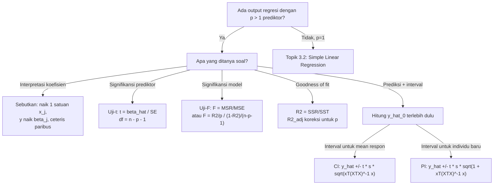

# 📊 3.3 — Multiple Linear Regression Interpretation

> [!ABSTRACT] Ringkasan Cepat
> **Topik:** Interpretasi Output Regresi Linier Berganda | **Bobot:** ~20–25% | **Difficulty:** Hard
> **Ref:** Frees (2010) Bab 3–6 | **Prereq:** [[3.1 Explanatory and Response Variables]], [[3.2 Simple Linear Regression]]

---

## Section 0 — Pemetaan Topik

| Topik TA1 | Sub-topik ID | Skill Diuji | Bobot | Difficulty | Prerequisite | Connected Topics | Referensi |
|---|---|---|---|---|---|---|---|
| Analisis Regresi | 3.3 | Menginterpretasikan koefisien *slope* $\hat{\beta}_j$; uji-$t$ dan uji-$F$; $R^2$ dan $R^2_{\text{adj}}$; interval kepercayaan prediksi mean $E(y\|x)$ dan titik individu | 20–25% | Hard | [[3.1 Explanatory and Response Variables]], [[3.2 Simple Linear Regression]] | [[3.4 Residual Analysis and Model Validation]], [[3.5 Variable Selection Criteria]] | Frees (2010) Bab 3–6 |

---

## Section 1 — Intuisi

Bayangkan seorang aktuaris di perusahaan asuransi jiwa yang ingin memodelkan besarnya premi tahunan nasabah. Ia tahu bahwa premi tidak hanya bergantung pada satu faktor — usia saja tidak cukup. Riwayat kesehatan, jenis pekerjaan, dan kebiasaan merokok semuanya berkontribusi. Regresi linier sederhana dari topik sebelumnya hanya mengizinkan satu prediktor, sedangkan kenyataan *pricing* aktuaria melibatkan banyak variabel sekaligus. Regresi linier berganda (*multiple linear regression*, MLR) adalah perluasan alaminya: kita membangun satu model yang memperhitungkan semua faktor prediktor secara simultan.

Yang membuat MLR lebih rumit — sekaligus lebih kuat — adalah konsep *ceteris paribus*. Koefisien *slope* $\hat{\beta}_j$ untuk prediktor $x_j$ tidak lagi berarti "seberapa besar perubahan $y$ ketika $x_j$ naik satu satuan" secara sederhana, melainkan "seberapa besar perubahan $y$ ketika $x_j$ naik satu satuan **dengan semua prediktor lain dipegang konstan**". Ini adalah perbedaan konseptual yang sangat penting: dalam portofolio asuransi, efek usia terhadap klaim dihitung *setelah mengendalikan* faktor lain seperti jenis kelamin dan riwayat penyakit. Tanpa pemahaman ini, interpretasi koefisien regresi berganda akan keliru.

Selain estimasi koefisien, MLR juga menghasilkan tiga output utama yang harus dikuasai untuk ujian: **(1) uji signifikansi** — apakah prediktor tertentu benar-benar berkontribusi? **(2) ukuran kecocokan** — seberapa baik model menjelaskan data? dan **(3) prediksi** — berapa nilai $y$ yang diperkirakan untuk kombinasi prediktor tertentu, lengkap dengan batas kepercayaannya? Ketiga hal ini adalah inti dari topik 3.3.

---

## Section 2 — Definisi Formal

> [!NOTE] Definisi Matematis
> Model regresi linier berganda dengan $p$ prediktor untuk $n$ observasi:
>
> $$
> y_i = \beta_0 + \beta_1 x_{i1} + \beta_2 x_{i2} + \cdots + \beta_p x_{ip} + \varepsilon_i, \quad i = 1, 2, \ldots, n
> $$
>
> dengan $\varepsilon_i \overset{\text{iid}}{\sim} N(0, \sigma^2)$. Estimator OLS diperoleh dari minimisasi $\text{RSS} = \sum_{i=1}^n (y_i - \hat{y}_i)^2$.

| Simbol | Makna | Catatan |
|---|---|---|
| $y_i$ | Nilai respon observasi ke-$i$ | Variabel dependen |
| $x_{ij}$ | Nilai prediktor ke-$j$ untuk observasi ke-$i$ | $j = 1, \ldots, p$ |
| $\beta_0$ | Intersep populasi | Nilai $E(y)$ ketika semua $x_j = 0$ |
| $\beta_j$ | Koefisien *slope* populasi untuk $x_j$ | Efek parsial *ceteris paribus* |
| $\hat{\beta}_j$ | Estimator OLS untuk $\beta_j$ | Diperoleh dari data sampel |
| $\varepsilon_i$ | Error acak observasi ke-$i$ | $\varepsilon_i \sim N(0, \sigma^2)$, independen |
| $\hat{y}_i$ | Nilai *fitted* (prediksi dalam sampel) | $\hat{y}_i = \hat{\beta}_0 + \hat{\beta}_1 x_{i1} + \cdots + \hat{\beta}_p x_{ip}$ |
| $e_i$ | Residual | $e_i = y_i - \hat{y}_i$ |
| $\text{RSS}$ | *Residual Sum of Squares* | $\sum e_i^2$; mengukur kecocokan |
| $\text{SST}$ | *Total Sum of Squares* | $\sum (y_i - \bar{y})^2$ |
| $\text{SSR}$ | *Regression Sum of Squares* | $\text{SST} - \text{RSS}$; dijelaskan oleh model |
| $R^2$ | Koefisien determinasi | Proporsi variansi $y$ yang dijelaskan model |
| $R^2_{\text{adj}}$ | $R^2$ yang disesuaikan | Mengoreksi penambahan prediktor tidak berguna |
| $s^2$ | Estimasi $\sigma^2$ | $s^2 = \text{RSS}/(n-p-1)$ = MSE |
| $\text{SE}(\hat{\beta}_j)$ | Standar error estimator $\hat{\beta}_j$ | Dari diagonal matriks $(X^TX)^{-1} s^2$ |
| $n$ | Jumlah observasi | Harus $> p+1$ |
| $p$ | Jumlah prediktor | Tidak termasuk intersep |

### Rumus Utama

**Dekomposisi jumlah kuadrat:**

$$
\underbrace{\text{SST}}_{\sum(y_i - \bar{y})^2} = \underbrace{\text{SSR}}_{\sum(\hat{y}_i - \bar{y})^2} + \underbrace{\text{RSS}}_{\sum(y_i - \hat{y}_i)^2}
$$

**Label:** Total variabilitas $y$ = bagian yang dijelaskan model + bagian yang tidak dijelaskan (error).

**Koefisien determinasi $R^2$:**

$$
R^2 = \frac{\text{SSR}}{\text{SST}} = 1 - \frac{\text{RSS}}{\text{SST}}, \quad 0 \leq R^2 \leq 1
$$

**Label:** Proporsi variabilitas $y$ yang dijelaskan secara linear oleh seluruh prediktor dalam model.

**$R^2$ yang disesuaikan:**

$$
R^2_{\text{adj}} = 1 - \frac{\text{RSS}/(n-p-1)}{\text{SST}/(n-1)} = 1 - (1-R^2)\frac{n-1}{n-p-1}
$$

**Label:** Mengoreksi $R^2$ untuk jumlah prediktor; bisa turun jika prediktor baru tidak berguna.

**Uji-$t$ untuk signifikansi koefisien individual** ($H_0: \beta_j = 0$):

$$
t_j = \frac{\hat{\beta}_j}{\text{SE}(\hat{\beta}_j)} \sim t_{n-p-1} \quad \text{di bawah } H_0
$$

**Label:** Menguji apakah prediktor $x_j$ berkontribusi signifikan *setelah mengontrol* semua prediktor lain.

**Uji-$F$ untuk signifikansi model keseluruhan** ($H_0: \beta_1 = \beta_2 = \cdots = \beta_p = 0$):

$$
F = \frac{\text{SSR}/p}{\text{RSS}/(n-p-1)} = \frac{\text{MSR}}{\text{MSE}} \sim F_{p,\, n-p-1} \quad \text{di bawah } H_0
$$

**Label:** Menguji apakah *setidaknya satu* prediktor memiliki koefisien tidak nol — uji omnibus.

**Interval kepercayaan untuk mean respon** $E(y \mid \mathbf{x}_0) = \mathbf{x}_0^T \boldsymbol{\beta}$:

$$
\hat{y}_0 \pm t_{\alpha/2,\, n-p-1} \cdot s \sqrt{\mathbf{x}_0^T (X^T X)^{-1} \mathbf{x}_0}
$$

**Label:** Interval untuk **rata-rata** respon pada titik prediktor $\mathbf{x}_0$ — lebih sempit.

**Interval prediksi untuk titik individu baru** $y_{\text{new}}$ pada $\mathbf{x}_0$:

$$
\hat{y}_0 \pm t_{\alpha/2,\, n-p-1} \cdot s \sqrt{1 + \mathbf{x}_0^T (X^T X)^{-1} \mathbf{x}_0}
$$

**Label:** Interval untuk **satu observasi baru** — selalu lebih lebar dari interval kepercayaan mean karena menambahkan ketidakpastian error individu $\sigma^2$.

**Tabel ANOVA regresi (struktur standar):**

| Sumber | SS | df | MS | $F$ |
|---|---|---|---|---|
| Regresi | SSR | $p$ | MSR = SSR/$p$ | MSR/MSE |
| Error (Residual) | RSS | $n-p-1$ | MSE = RSS/$(n-p-1)$ | — |
| Total | SST | $n-1$ | — | — |

### Asumsi Eksplisit

1. **Linearitas**: hubungan antara $E(y)$ dan setiap $x_j$ adalah linear (bisa divalidasi dengan residual plot).
2. **Normalitas error**: $\varepsilon_i \sim N(0, \sigma^2)$ — diperlukan untuk validitas uji-$t$ dan uji-$F$ pada sampel kecil.
3. **Homoskedastisitas**: variansi error $\sigma^2$ konstan untuk semua observasi (tidak bergantung pada $\hat{y}_i$).
4. **Independensi**: observasi satu sama lain independen — tidak ada autokorelasi.
5. **Tidak ada multikolinearitas sempurna**: tidak ada prediktor yang merupakan kombinasi linear tepat dari prediktor lain (matriks $X^TX$ harus *invertible*).

---

## Section 3 — Jembatan Logika

> [!TIP] Dari Definisi ke Rumus
> Inti dari MLR adalah gagasan OLS (*Ordinary Least Squares*): pilih $\hat{\boldsymbol{\beta}}$ sedemikian sehingga jumlah kuadrat residual $\text{RSS} = \sum (y_i - \hat{y}_i)^2$ **minimum**. Dalam notasi matriks, solusinya adalah $\hat{\boldsymbol{\beta}} = (X^T X)^{-1} X^T \mathbf{y}$. Tapi untuk ujian, yang lebih penting adalah **menginterpretasikan output**, bukan menghitung $\hat{\boldsymbol{\beta}}$ dari scratch. Fokuskan energi pada: (1) membaca tabel koefisien dan memahami uji-$t$, (2) membaca tabel ANOVA dan memahami uji-$F$, dan (3) menghitung prediksi beserta interval kepercayaan/prediksinya.

> [!IMPORTANT] Perbedaan Kritis: Interval Kepercayaan vs Interval Prediksi
> Dua jenis interval yang **selalu** muncul di soal — jangan tertukar:
>
> **Interval Kepercayaan untuk Mean** $E(y \mid \mathbf{x}_0)$: menjawab pertanyaan "di mana rata-rata populasi berada?"
>
> $$
> \hat{y}_0 \pm t_{\alpha/2} \cdot s \sqrt{\mathbf{x}_0^T (X^T X)^{-1} \mathbf{x}_0}
> $$
>
> **Interval Prediksi untuk Individu Baru**: menjawab "di mana satu observasi baru akan jatuh?"
>
> $$
> \hat{y}_0 \pm t_{\alpha/2} \cdot s \sqrt{1 + \mathbf{x}_0^T (X^T X)^{-1} \mathbf{x}_0}
> $$
>
> Satu-satunya perbedaan: faktor tambahan **"+1"** di bawah akar pada interval prediksi, yang mencerminkan ketidakpastian error individu. Interval prediksi **selalu lebih lebar** dari interval kepercayaan mean pada titik $\mathbf{x}_0$ yang sama.

**Derivasi step-by-step: Menghubungkan $R^2$, $F$-statistik, dan derajat kebebasan:**

**Langkah 1 — Mulai dari dekomposisi SS.**

$$
\text{SST} = \text{SSR} + \text{RSS}
$$

dengan $\text{df}_{\text{SST}} = n-1$, $\text{df}_{\text{SSR}} = p$, $\text{df}_{\text{RSS}} = n-p-1$.

**Langkah 2 — Definisi $R^2$ dari rasio.**

$$
R^2 = \frac{\text{SSR}}{\text{SST}} \Longrightarrow \text{SSR} = R^2 \cdot \text{SST}, \quad \text{RSS} = (1-R^2)\cdot\text{SST}
$$

**Langkah 3 — Substitusikan ke $F$-statistik.**

$$
F = \frac{\text{SSR}/p}{\text{RSS}/(n-p-1)} = \frac{R^2/p}{(1-R^2)/(n-p-1)}
$$

**Langkah 4 — Bentuk akhir: $F$ sebagai fungsi dari $R^2$.**

$$
F = \frac{R^2}{1-R^2} \cdot \frac{n-p-1}{p}
$$

Relasi ini sangat berguna: jika soal memberikan $R^2$, $n$, dan $p$, kita dapat langsung menghitung $F$ tanpa tabel ANOVA.

**Langkah 5 — Hubungan $R^2_{\text{adj}}$ dengan $R^2$.**

$$
R^2_{\text{adj}} = 1 - \frac{(1-R^2)(n-1)}{n-p-1}
$$

Perhatikan: menambah prediktor ($p$ naik) **selalu** meningkatkan $R^2$, tetapi $R^2_{\text{adj}}$ bisa turun jika kenaikan $R^2$ tidak cukup mengimbangi berkurangnya $df_{\text{RSS}}$.

> [!DANGER] Dilarang
> 1. **Jangan** menginterpretasikan $\hat{\beta}_j$ tanpa menyebut "dengan prediktor lain dipegang konstan" — dalam MLR, koefisien adalah efek *parsial*, bukan efek *marginal* seperti dalam regresi sederhana.
> 2. **Jangan** menggunakan interval kepercayaan mean untuk prediksi satu individu baru — interval tersebut terlalu sempit dan akan menghasilkan *coverage* yang terlalu rendah.
> 3. **Jangan** menyimpulkan signifikansi model hanya dari $R^2$ yang tinggi — model dengan $R^2 = 0{,}95$ bisa saja tidak signifikan secara statistik jika $n$ sangat kecil atau jika prediktor redundan; selalu cek $F$-statistik.

---

## Section 4 — Contoh Soal

### Soal A — Fundamental

Output regresi linier berganda berikut diperoleh dari model yang memprediksi total klaim asuransi kesehatan tahunan (juta rupiah) berdasarkan usia ($x_1$, tahun) dan indeks massa tubuh ($x_2$, kg/m²), dari $n = 30$ observasi.

**Tabel Koefisien:**

| Variabel | Koefisien | Std. Error | $t$-statistik | $p$-value |
|---|---|---|---|---|
| (Intersep) | $-5{,}200$ | $2{,}410$ | $-2{,}158$ | $0{,}040$ |
| Usia $x_1$ | $0{,}180$ | $0{,}045$ | $4{,}000$ | $0{,}000$ |
| IMT $x_2$ | $0{,}250$ | $0{,}110$ | $2{,}273$ | $0{,}031$ |

**Tabel ANOVA:**

| Sumber | SS | df | MS | $F$ |
|---|---|---|---|---|
| Regresi | 48{,}60 | 2 | 24{,}30 | 18{,}76 |
| Residual | 35{,}10 | 27 | 1{,}30 | — |
| Total | 83{,}70 | 29 | — | — |

(a) Interpretasikan koefisien $\hat{\beta}_1 = 0{,}180$.

(b) Hitung $R^2$ dan $R^2_{\text{adj}}$.

(c) Uji signifikansi keseluruhan model pada $\alpha = 5\%$.

> [!SUCCESS] Solusi Soal A
> **Pendekatan:** Baca output secara langsung — interpretasi koefisien, hitung $R^2$ dari SS, bandingkan $F$ dengan nilai kritis.
>
> **1. Identifikasi Variabel**
> - $n = 30$, $p = 2$ (usia, IMT), $df_{\text{res}} = 27$
> - $\hat{\beta}_1 = 0{,}180$, $\text{SSR} = 48{,}60$, $\text{RSS} = 35{,}10$, $\text{SST} = 83{,}70$
> - $F_{\text{obs}} = 18{,}76$
>
> **2. Identifikasi Model**
> MLR dengan dua prediktor kontinu. SST = SSR + RSS = 48,60 + 35,10 = 83,70 ✓ (konsisten).
>
> **3. Setup Persamaan**
>
> $$
> R^2 = \frac{\text{SSR}}{\text{SST}}, \quad R^2_{\text{adj}} = 1 - \frac{\text{RSS}/(n-p-1)}{\text{SST}/(n-1)}
> $$
>
> **4. Eksekusi Aljabar**
>
> **(a) Interpretasi $\hat{\beta}_1 = 0{,}180$:**
> Dengan **IMT dipegang konstan**, setiap kenaikan usia sebesar 1 tahun dikaitkan dengan kenaikan rata-rata total klaim sebesar **Rp 180.000** per tahun.
>
> **(b) $R^2$ dan $R^2_{\text{adj}}$:**
>
> $$
> R^2 = \frac{48{,}60}{83{,}70} = 0{,}5806
> $$
>
> $$
> R^2_{\text{adj}} = 1 - \frac{35{,}10/27}{83{,}70/29} = 1 - \frac{1{,}300}{2{,}886} = 1 - 0{,}4504 = 0{,}5496
> $$
>
> **(c) Uji-$F$ keseluruhan:**
>
> $H_0: \beta_1 = \beta_2 = 0$ vs $H_1:$ minimal satu $\beta_j \neq 0$.
>
> $F_{\text{kritis}} = F_{0{,}05;\, 2,\, 27} \approx 3{,}35$.
>
> Karena $F_{\text{obs}} = 18{,}76 > 3{,}35$, **tolak $H_0$**. Model secara keseluruhan signifikan pada $\alpha = 5\%$.
>
> **5. Verification**
> $R^2 = 0{,}581$: model menjelaskan 58,1% variabilitas klaim. $R^2_{\text{adj}} < R^2$ selalu benar ✓. Uji-$F$ signifikan konsisten dengan $p$-value uji-$t$ masing-masing prediktor yang keduanya $< 0{,}05$.
>
> **Hasil:** (a) Klaim naik Rp 180 ribu per tahun usia, *ceteris paribus*; (b) $R^2 = 0{,}581$, $R^2_{\text{adj}} = 0{,}550$; (c) Tolak $H_0$, model signifikan.

> [!WARNING] Exam Tips — Soal A
> **Target waktu:** 3 menit. **Common trap:** Menginterpretasikan $\hat{\beta}_1$ tanpa menyebut "dengan prediktor lain konstan" — dalam ujian, frasa ini **wajib** ada untuk mendapat nilai penuh. **Shortcut:** $R^2 = \text{SSR}/\text{SST}$ langsung dari tabel ANOVA tanpa perlu rumus panjang.

---

### Soal B — Exam-Typical

Model regresi linier berganda digunakan untuk memprediksi premi asuransi jiwa tahunan (juta rupiah) berdasarkan usia ($x_1$) dan status merokok ($x_2$: 1 = perokok, 0 = bukan perokok) dari $n = 50$ nasabah. Output ringkas:

$$
\hat{y} = -2{,}40 + 0{,}15\,x_1 + 3{,}20\,x_2
$$

dengan $s = 1{,}80$, $\text{SE}(\hat{\beta}_1) = 0{,}032$, $\text{SE}(\hat{\beta}_2) = 0{,}620$, $\text{SST} = 410{,}50$, $R^2 = 0{,}724$.

(a) Uji apakah status merokok berpengaruh signifikan terhadap premi pada $\alpha = 5\%$ (uji dua arah). Gunakan $t_{0{,}025;\,47} = 2{,}012$.

(b) Hitung $R^2_{\text{adj}}$.

(c) Hitung interval kepercayaan 95% untuk **mean premi** nasabah berusia 40 tahun yang merupakan perokok, diketahui bahwa $\mathbf{x}_0^T(X^TX)^{-1}\mathbf{x}_0 = 0{,}0520$.

> [!SUCCESS] Solusi Soal B
> **Pendekatan:** (a) Hitung $t$-statistik dan bandingkan dengan nilai kritis; (b) gunakan rumus $R^2_{\text{adj}}$; (c) substitusi ke rumus interval kepercayaan mean.
>
> **1. Identifikasi Variabel**
> - $n = 50$, $p = 2$, $df_{\text{res}} = 47$
> - $\hat{\beta}_2 = 3{,}20$, $\text{SE}(\hat{\beta}_2) = 0{,}620$
> - $s = 1{,}80$, $R^2 = 0{,}724$, $\text{SST} = 410{,}50$
> - Titik prediksi: $x_1 = 40$, $x_2 = 1$; $\mathbf{x}_0^T(X^TX)^{-1}\mathbf{x}_0 = 0{,}0520$
>
> **2. Identifikasi Model**
> MLR dengan satu prediktor kontinu ($x_1$) dan satu prediktor biner/dummy ($x_2$). Uji-$t$ dua arah untuk $\beta_2$.
>
> **3. Setup Persamaan**
>
> $$
> t_2 = \frac{\hat{\beta}_2}{\text{SE}(\hat{\beta}_2)}, \quad \hat{y}_0 \pm t_{\alpha/2} \cdot s\sqrt{\mathbf{x}_0^T(X^TX)^{-1}\mathbf{x}_0}
> $$
>
> **4. Eksekusi Aljabar**
>
> **(a) Uji-$t$ untuk $\beta_2$:**
>
> $$
> t_2 = \frac{3{,}20}{0{,}620} = 5{,}161
> $$
>
> Karena $|t_2| = 5{,}161 > t_{0{,}025;\,47} = 2{,}012$, **tolak $H_0: \beta_2 = 0$**. Status merokok berpengaruh signifikan terhadap premi.
>
> **(b) $R^2_{\text{adj}}$:**
>
> $$
> R^2_{\text{adj}} = 1 - (1 - 0{,}724)\frac{50-1}{50-2-1} = 1 - 0{,}276 \times \frac{49}{47} = 1 - 0{,}276 \times 1{,}04255
> $$
>
> $$
> R^2_{\text{adj}} = 1 - 0{,}28774 = 0{,}712
> $$
>
> **(c) Prediksi dan interval kepercayaan mean:**
>
> $$
> \hat{y}_0 = -2{,}40 + 0{,}15(40) + 3{,}20(1) = -2{,}40 + 6{,}00 + 3{,}20 = 6{,}80 \text{ juta}
> $$
>
> $$
> \text{Margin} = t_{0{,}025;\,47} \times s \times \sqrt{0{,}0520} = 2{,}012 \times 1{,}80 \times 0{,}22804 = 0{,}825 \text{ juta}
> $$
>
> $$
> \text{CI}_{95\%}: \quad 6{,}80 \pm 0{,}825 \quad \Rightarrow \quad (5{,}975;\; 7{,}625) \text{ juta rupiah}
> $$
>
> **5. Verification**
> $\hat{y}_0 = 6{,}80$ masuk akal: nasabah 40 tahun perokok membayar lebih dari rata-rata sampel yang mengandung campuran usia dan status. $R^2_{\text{adj}} = 0{,}712 < R^2 = 0{,}724$ ✓. Margin interval kepercayaan mean lebih kecil dari $s = 1{,}80$ ✓ (karena rata-rata lebih presisi dari individu).
>
> **Hasil:** (a) Tolak $H_0$, merokok signifikan ($t = 5{,}161$); (b) $R^2_{\text{adj}} = 0{,}712$; (c) CI mean premi = $(5{,}975;\; 7{,}625)$ juta.

> [!WARNING] Exam Tips — Soal B
> **Target waktu:** 4 menit. **Common trap 1:** Salah menghitung $\sqrt{0{,}0520}$ — ingat $\sqrt{0{,}0520} \approx 0{,}2280$. **Common trap 2:** Menggunakan formula interval prediksi (dengan "+1") padahal soal meminta interval untuk **mean** — baca soal dengan seksama. **Shortcut:** Untuk uji-$t$, jika $p$-value diberikan, cukup bandingkan dengan $\alpha$ tanpa perlu menghitung $t$ manual.

---

### Soal C — Challenging

Seorang aktuaris membangun model MLR untuk memprediksi *loss ratio* asuransi kendaraan ($y$, dalam persen) menggunakan tiga prediktor: usia kendaraan ($x_1$, tahun), kapasitas mesin ($x_2$, cc/100), dan wilayah ($x_3$: 1 = perkotaan, 0 = pedesaan). Data: $n = 45$.

Output komputer menghasilkan:

$$
\hat{y} = 42{,}5 + 1{,}8\,x_1 + 0{,}6\,x_2 + 8{,}4\,x_3
$$

| Variabel | $\hat{\beta}$ | SE | $t$ | $p$-value |
|---|---|---|---|---|
| (Intersep) | 42{,}5 | 4{,}20 | 10{,}12 | $<0{,}001$ |
| $x_1$ (usia) | 1{,}8 | 0{,}72 | 2{,}50 | $0{,}016$ |
| $x_2$ (mesin) | 0{,}6 | 0{,}38 | 1{,}58 | $0{,}122$ |
| $x_3$ (wilayah) | 8{,}4 | 2{,}10 | 4{,}00 | $<0{,}001$ |

$\text{SST} = 3820{,}0$, $\text{RSS} = 980{,}5$, $s = 4{,}95$.

(a) Tentukan apakah kapasitas mesin ($x_2$) signifikan pada $\alpha = 5\%$.

(b) Hitung $R^2$, $R^2_{\text{adj}}$, dan $F$-statistik. Konfirmasi konsistensi antara $R^2$ dan $F$.

(c) Hitung **interval prediksi 95%** untuk *loss ratio* kendaraan baru: usia 5 tahun, kapasitas 20 (cc/100), wilayah perkotaan. Diketahui $\mathbf{x}_0^T(X^TX)^{-1}\mathbf{x}_0 = 0{,}0840$.

(d) Seorang kolega menyarankan bahwa interval prediksi selalu lebih sempit daripada interval kepercayaan mean. Koreksi pernyataan ini.

> [!SUCCESS] Solusi Soal C
> **Pendekatan:** Kombinasi uji-$t$, hitung $R^2$ dan $F$, hubungkan keduanya, lalu hitung interval prediksi (bukan mean) dengan "+1" di bawah akar.
>
> **1. Identifikasi Variabel**
> - $n = 45$, $p = 3$, $df_{\text{res}} = 45 - 3 - 1 = 41$
> - $\text{SST} = 3820{,}0$, $\text{RSS} = 980{,}5$, $\text{SSR} = 3820{,}0 - 980{,}5 = 2839{,}5$
> - Titik baru: $x_1=5$, $x_2=20$, $x_3=1$; $\mathbf{x}_0^T(X^TX)^{-1}\mathbf{x}_0 = 0{,}0840$
>
> **2. Identifikasi Model**
> MLR tiga prediktor, campuran kontinu dan dummy. Uji-$t$ dua arah dengan $df = 41$.
>
> **3. Setup Persamaan**
>
> $$
> R^2 = \frac{\text{SSR}}{\text{SST}}, \quad F = \frac{R^2/(1-R^2)} \cdot \frac{n-p-1}{p}, \quad \hat{y}_0 \pm t_{\alpha/2} \cdot s\sqrt{1 + \mathbf{x}_0^T(X^TX)^{-1}\mathbf{x}_0}
> $$
>
> **4. Eksekusi Aljabar**
>
> **(a) Uji-$t$ untuk $x_2$:**
>
> $t_2 = 1{,}58$ dengan $p$-value $= 0{,}122 > \alpha = 0{,}05$.
>
> **Gagal tolak $H_0: \beta_2 = 0$**. Kapasitas mesin **tidak signifikan** pada $\alpha = 5\%$, dengan prediktor lain dalam model.
>
> **(b) $R^2$, $R^2_{\text{adj}}$, dan $F$:**
>
> $$
> R^2 = \frac{2839{,}5}{3820{,}0} = 0{,}7433
> $$
>
> $$
> R^2_{\text{adj}} = 1 - \frac{980{,}5/41}{3820{,}0/44} = 1 - \frac{23{,}915}{86{,}818} = 1 - 0{,}2754 = 0{,}7246
> $$
>
> Dari tabel ANOVA: $\text{MSR} = 2839{,}5/3 = 946{,}5$ dan $\text{MSE} = 980{,}5/41 = 23{,}915$.
>
> $$
> F = \frac{946{,}5}{23{,}915} = 39{,}58
> $$
>
> Konfirmasi via $R^2$:
>
> $$
> F = \frac{0{,}7433}{1 - 0{,}7433} \times \frac{41}{3} = \frac{0{,}7433}{0{,}2567} \times 13{,}667 = 2{,}895 \times 13{,}667 = 39{,}57 \approx 39{,}58 \quad \checkmark
> $$
>
> **(c) Interval Prediksi 95%:**
>
> $$
> \hat{y}_0 = 42{,}5 + 1{,}8(5) + 0{,}6(20) + 8{,}4(1) = 42{,}5 + 9{,}0 + 12{,}0 + 8{,}4 = 71{,}9\%
> $$
>
> $$
> \sqrt{1 + 0{,}0840} = \sqrt{1{,}0840} = 1{,}04115
> $$
>
> Untuk $df = 41$, gunakan $t_{0{,}025;\,41} \approx 2{,}020$:
>
> $$
> \text{Margin} = 2{,}020 \times 4{,}95 \times 1{,}04115 = 2{,}020 \times 5{,}154 = 10{,}41
> $$
>
> $$
> \text{PI}_{95\%}: \quad 71{,}9 \pm 10{,}41 \quad \Rightarrow \quad (61{,}49\%;\; 82{,}31\%)
> $$
>
> **(d) Koreksi pernyataan kolega:**
>
> Pernyataan kolega **keliru**. Interval prediksi untuk individu baru **selalu lebih lebar** daripada interval kepercayaan mean, karena interval prediksi memiliki faktor tambahan "+1" di bawah akar:
>
> $$
> s\sqrt{1 + \mathbf{x}_0^T(X^TX)^{-1}\mathbf{x}_0} > s\sqrt{\mathbf{x}_0^T(X^TX)^{-1}\mathbf{x}_0}
> $$
>
> Secara intuitif: prediksi mean hanya perlu menangkap ketidakpastian estimasi parameter $\hat{\boldsymbol{\beta}}$, sedangkan prediksi individu harus menambahkan ketidakpastian error $\varepsilon_{\text{new}} \sim N(0, \sigma^2)$ dari observasi baru itu sendiri.
>
> **5. Verification**
> $\hat{y}_0 = 71{,}9\%$ — kendaraan tua (5 tahun), bermesin besar, di perkotaan: *loss ratio* tinggi masuk akal. Lebar PI $\approx 20{,}8$ poin persentase — cukup lebar, wajar untuk prediksi individu. $F = 39{,}58$ jauh di atas nilai kritis $F_{0{,}05;\,3,\,41} \approx 2{,}84$ → model sangat signifikan.
>
> **Hasil:** (a) $x_2$ tidak signifikan ($p=0{,}122$); (b) $R^2=0{,}743$, $R^2_{\text{adj}}=0{,}725$, $F=39{,}58$, konsisten ✓; (c) PI = $(61{,}5\%;\; 82{,}3\%)$; (d) Interval prediksi selalu **lebih lebar** dari CI mean.

> [!WARNING] Exam Tips — Soal C
> **Target waktu:** 6 menit. **Common trap 1:** Menggunakan formula CI mean (tanpa "+1") untuk interval prediksi — baca soal: kata "observasi baru" atau "individu baru" = interval prediksi. **Common trap 2:** Lupa $\text{SSR} = \text{SST} - \text{RSS}$, bukan sebaliknya. **Shortcut:** Konfirmasi $F$ via $R^2$ adalah cara cepat cross-check tabel ANOVA — hasilnya harus sama dalam dua desimal.

---

## Section 5 — Verifikasi & Sanity Check

> [!CHECK] Konsistensi Dekomposisi SS
> Selalu verifikasi:
>
> $$
> \text{SST} = \text{SSR} + \text{RSS}, \quad df_{\text{SST}} = df_{\text{SSR}} + df_{\text{RSS}}, \quad \text{yaitu} \quad (n-1) = p + (n-p-1)
> $$
>
> Jika salah satu tidak terpenuhi, ada kesalahan dalam membaca tabel ANOVA. Periksa apakah $p$ (jumlah prediktor) dan $n$ (jumlah observasi) sudah benar.

> [!CHECK] Urutan Lebar Interval
> Untuk titik prediktor $\mathbf{x}_0$ yang sama, selalu berlaku:
>
> $$
> \text{Lebar PI} > \text{Lebar CI mean}
> $$
>
> karena $\sqrt{1 + c} > \sqrt{c}$ untuk semua $c > 0$. Jika hasil kalkulasi menunjukkan PI lebih sempit, pasti ada kesalahan — paling umum: lupa menambahkan "+1" di bawah akar untuk interval prediksi.

> [!CHECK] Batas $R^2$ dan $R^2_{\text{adj}}$
> - $R^2_{\text{adj}} \leq R^2$ selalu — jika tidak, cek rumus.
> - $R^2_{\text{adj}}$ bisa negatif jika model sangat buruk (MSE > MST).
> - Menambah prediktor: $R^2$ naik atau tetap, $R^2_{\text{adj}}$ bisa naik atau turun.

### Metode Alternatif

**Menghitung $F$ langsung dari $R^2$** (tanpa tabel ANOVA penuh):

$$
F = \frac{R^2/p}{(1-R^2)/(n-p-1)}
$$

Berguna ketika soal hanya memberikan $R^2$, $n$, dan $p$, tanpa tabel ANOVA. Ingat: $p$ adalah jumlah prediktor (tidak termasuk intersep).

---

## Section 6 — Visualisasi Mental

**Struktur Tabel ANOVA — Format Standar:**

```
+———————————+—————————+——————+——————————+—————————+
| Sumber    |   SS    |  df  |    MS    |    F    |
+———————————+—————————+——————+——————————+—————————+
| Regresi   |   SSR   |  p   | SSR/p    | MSR/MSE |  ← Model menjelaskan ini
| Residual  |   RSS   | n-p-1| RSS/n-p-1|   —     |  ← Yang tidak dijelaskan
| Total     |   SST   |  n-1 |    —     |   —     |  ← Seluruh variabilitas y
+———————————+—————————+——————+——————————+—————————+

SST = SSR + RSS  (selalu!)
df:  (n-1) = p + (n-p-1)  (selalu!)
R² = SSR/SST
F  = MSR/MSE
```

**Visualisasi CI Mean vs PI:**

```
                    ← lebar PI →
        ←lebar CI→
              ·——·
          ·———    ———·          ← Interval Prediksi (lebih lebar)
      ·———                ———·
  ·———  ·—·                ·—·  ———·
        ↑   ↑            ↑   ↑
    CI kiri CI kanan  PI kiri PI kanan

         x₀ (titik prediksi)

Kedua interval berpusat di ŷ₀ yang sama.
PI lebih lebar karena mencakup variabilitas
error individu tambahan (faktor +1).
```

### Hubungan Visual ↔ Rumus

| Elemen Visual | Komponen Rumus |
|---|---|
| Baris "Regresi" di tabel ANOVA | SSR, MSR = SSR/$p$ |
| Baris "Residual" di tabel ANOVA | RSS, MSE = RSS/$(n-p-1)$ = $s^2$ |
| Tinggi seluruh tabel SS | SST = $\sum(y_i - \bar{y})^2$ |
| Lebar PI vs CI | Faktor "+1" pada interval prediksi |
| Kolom $t$-statistik output regresi | $\hat{\beta}_j / \text{SE}(\hat{\beta}_j)$ |

---

## Section 7 — Jebakan Umum

> [!BUG] Kesalahan Parametrisasi
> **Derajat kebebasan yang salah** adalah kesalahan paling umum:
> - $df_{\text{SSR}} = p$ (jumlah prediktor, **tidak** termasuk intersep $\beta_0$)
> - $df_{\text{RSS}} = n - p - 1$ (bukan $n - p$!)
> - Uji-$t$ koefisien: $df = n - p - 1$
>
> **Contoh salah:** Model dengan $n=30$ dan $p=3$ prediktor → $df_{\text{res}} = 30 - 3 = 27$ ← SALAH
>
> **Contoh benar:** $df_{\text{res}} = 30 - 3 - 1 = 26$ ← BENAR (kurangi 1 untuk intersep)

> [!BUG] Kesalahan Konseptual
> 1. **Interpretasi koefisien tanpa "*ceteris paribus*":** Dalam MLR, $\hat{\beta}_j$ adalah efek parsial — selalu sertakan frasa "dengan prediktor lain dipegang konstan" dalam interpretasi.
> 2. **Uji-$F$ signifikan berarti semua prediktor signifikan:** Keliru! Uji-$F$ hanya menyatakan minimal satu prediktor signifikan. Setiap prediktor harus diuji dengan uji-$t$ individual.
> 3. **$R^2$ tinggi berarti model baik:** $R^2 = 0{,}95$ tidak menjamin model valid — bisa terjadi *overfitting*, *multikolinearitas*, atau pelanggaran asumsi lain.
> 4. **$R^2_{\text{adj}}$ selalu positif:** Tidak benar. $R^2_{\text{adj}}$ bisa negatif untuk model yang sangat buruk.

> [!BUG] Kesalahan Interpretasi Soal
> - **"Interval kepercayaan untuk prediksi"** → ambigu! Klarifikasi: apakah untuk **mean respon** atau **individu baru**? Jika soal menyebut "observasi/individu baru", gunakan interval prediksi (dengan "+1").
> - **"Prediktor tidak signifikan"** ≠ "prediktor tidak berpengaruh dalam realita" — hanya berarti data tidak cukup untuk mendeteksi efeknya secara statistik pada level signifikansi yang digunakan.
> - **$p$-value "0{,}000"** di output komputer bukan berarti persis nol — artinya $p < 0{,}001$, dan selalu tolak $H_0$ untuk $\alpha = 0{,}05$ atau $0{,}01$.

> [!CAUTION] Red Flags
> - Jika $R^2_{\text{adj}} > R^2$ → pasti ada kesalahan kalkulasi atau pembacaan tabel.
> - Jika uji-$F$ tidak signifikan tetapi ada uji-$t$ individual yang signifikan → periksa multikolinearitas.
> - Jika soal memberikan $\mathbf{x}_0^T(X^TX)^{-1}\mathbf{x}_0$ → soal pasti meminta CI mean atau PI (bukan uji-$t$ biasa).
> - Kata **"kendaraan/nasabah baru yang tidak ada dalam data"** → interval **prediksi** (PI), bukan CI mean.

---

## Section 8 — Ringkasan Eksekutif

> [!SUMMARY] Must-Remember
> 1. **Dekomposisi SS dan $R^2$:**
>    $$\text{SST} = \text{SSR} + \text{RSS}, \quad R^2 = \frac{\text{SSR}}{\text{SST}} = 1 - \frac{\text{RSS}}{\text{SST}}$$
>
> 2. **$R^2$ yang disesuaikan:**
>    $$R^2_{\text{adj}} = 1 - (1-R^2)\frac{n-1}{n-p-1}$$
>
> 3. **Uji-$t$ koefisien individual** ($H_0: \beta_j = 0$, $df = n-p-1$):
>    $$t_j = \frac{\hat{\beta}_j}{\text{SE}(\hat{\beta}_j)}$$
>
> 4. **Uji-$F$ model keseluruhan** ($df = p,\, n-p-1$), relasi dengan $R^2$:
>    $$F = \frac{R^2/p}{(1-R^2)/(n-p-1)}$$
>
> 5. **CI mean vs PI** (perbedaan kunci — faktor "+1"):
>    $$\text{CI mean:} \quad \hat{y}_0 \pm t_{\alpha/2} \cdot s\sqrt{\mathbf{x}_0^T(X^TX)^{-1}\mathbf{x}_0}$$
>    $$\text{PI individu:} \quad \hat{y}_0 \pm t_{\alpha/2} \cdot s\sqrt{1 + \mathbf{x}_0^T(X^TX)^{-1}\mathbf{x}_0}$$

### Kapan Digunakan

- Soal memberikan **tabel output regresi** (koefisien, SE, $t$, $p$-value) dan meminta interpretasi.
- Soal memberikan **tabel ANOVA regresi** dan meminta $R^2$, $R^2_{\text{adj}}$, atau uji-$F$.
- Soal meminta **prediksi nilai $y$** untuk kombinasi prediktor tertentu beserta intervalnya.
- Soal meminta **uji signifikansi** prediktor individual maupun model keseluruhan.
- Soal menyebutkan **lebih dari satu prediktor** dalam model regresi.

### Kapan TIDAK Boleh Digunakan

- Hanya **satu prediktor** → topik [[3.2 Simple Linear Regression]] (rumus lebih sederhana, $R^2 = r^2$).
- Residual menunjukkan pola sistematis → asumsi linearitas/homoskedastisitas dilanggar → lihat [[3.4 Residual Analysis and Model Validation]] dulu.
- Soal bertanya tentang **pemilihan variabel** terbaik → [[3.5 Variable Selection Criteria]] (AIC, BIC, Mallow's $C_p$).

### Quick Decision Tree



---

> [!QUOTE] Follow-up Options
> 1. *"Berikan contoh soal variasi [[3.3 Multiple Linear Regression Interpretation]] dengan variabel dummy dan interpretasi interaksi"*
> 2. *"Jelaskan hubungan [[3.3 Multiple Linear Regression Interpretation]] dengan [[3.4 Residual Analysis and Model Validation]]"*
> 3. *"Buat flashcard 1-halaman untuk topik 3.3 ini"*

*📖 Ref: Frees (2010), Regression Modeling with Actuarial and Financial Applications, Bab 3–6 | 🗓️ 2026-04-19 | #TA1 #Regresi #RegresiLinearBerganda*
