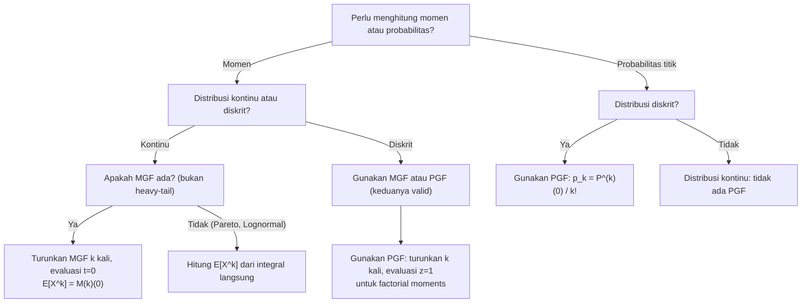

# 📊 1.1 — Moment and Probability Generating Functions

> [!ABSTRACT] Ringkasan Cepat
> **Topik:** Moment and Probability Generating Functions | **Bobot:** ~5–10% | **Difficulty:** Medium
> **Ref:** Klugman et al. (2019) Loss Models 5th ed., Bab 3–5 | **Prereq:** None

## Section 0 — Pemetaan Topik

| Topik TA2 | Sub-topik ID | Skill Diuji | Bobot | Difficulty | Prerequisite | Connected Topics | Referensi |
|---|---|---|---|---|---|---|---|
| Model Besar Klaim | 1.1 | Menghitung momen (mean, variance, skewness) dan probabilitas dari MGF dan PGF; mengidentifikasi distribusi dari bentuk MGF/PGF | 5–10% | Medium | None | [[1.2 Distribution Classes and Extreme Value]], [[1.4 Tail Characteristics]], [[2.1 Frequency MGF and PGF]] | KPW (2019) Bab 3–5 |

## Section 1 — Intuisi

Bayangkan kamu bekerja di bagian underwriting dan harus memutuskan apakah premi yang dikenakan cukup untuk menanggung klaim di masa depan. Untuk melakukan itu, kamu perlu memahami perilaku distribusi klaim — bukan hanya nilai rata-ratanya, tapi juga seberapa bervariasi klaim tersebut, seberapa sering klaim besar (extreme) bisa terjadi, dan bagaimana bentuk distribusinya secara keseluruhan. Semua informasi itu tersimpan dalam apa yang disebut *momen*.

Momen adalah ukuran ringkas yang mendeskripsikan suatu distribusi probabilitas. Momen pertama adalah nilai rata-rata (ekspektasi), momen kedua berkaitan dengan variansi, momen ketiga dengan kemiringan (*skewness*), dan seterusnya. Alih-alih menghitung setiap momen secara terpisah — yang bisa menjadi sangat tedious — para aktuaris menggunakan alat bantu matematika bernama *fungsi pembangkit momen* (MGF) dan *fungsi pembangkit probabilitas* (PGF). Fungsi-fungsi ini adalah semacam "kapsul waktu" yang mengemas semua informasi momen dan probabilitas dari suatu distribusi ke dalam satu fungsi yang elegan.

Dalam konteks pemodelan risiko, MGF sangat berguna ketika kita menjumlahkan banyak variabel acak independen — misalnya total klaim dari banyak pemegang polis. Karena MGF dari jumlah variabel acak independen adalah hasil kali MGF masing-masing variabel, pekerjaan analitis yang kompleks menjadi jauh lebih sederhana. PGF serupa dengan MGF, namun dirancang khusus untuk variabel acak diskrit seperti jumlah klaim (*frequency*), sehingga memungkinkan kita mengekstrak probabilitas klaim sebanyak $k$ kali langsung dari turunan fungsi tersebut.

## Section 2 — Definisi Formal

> [!NOTE] Definisi Matematis
>
> **Moment Generating Function (MGF):**
>
> $$M_X(t) = E[e^{tX}] = \int_{-\infty}^{\infty} e^{tx} f_X(x)\, dx \quad \text{(kontinu)}$$
>
> $$M_X(t) = E[e^{tX}] = \sum_{x} e^{tx} p_X(x) \quad \text{(diskrit)}$$
>
> **Probability Generating Function (PGF):**
>
> $$P_X(z) = E[z^X] = \sum_{k=0}^{\infty} z^k \, p_k, \quad p_k = P(X = k)$$

| Simbol | Makna | Catatan |
|---|---|---|
| $M_X(t)$ | MGF dari variabel acak $X$ | Terdefinisi untuk $t$ di sekitar 0 |
| $t$ | Parameter transformasi | Biasanya $t \in (-h, h)$ untuk suatu $h > 0$ |
| $P_X(z)$ | PGF dari variabel acak diskrit $X$ | Hanya untuk $X \geq 0$ bilangan bulat |
| $z$ | Parameter transformasi PGF | Biasanya $z \in [0, 1]$ atau $\|z\| \leq 1$ |
| $p_k$ | Probabilitas $P(X = k)$ | Koefisien ekspansi PGF |
| $\mu_k'$ | Momen ke-$k$ (raw moment) | $E[X^k]$ |
| $\mu_k$ | Momen sentral ke-$k$ | $E[(X - \mu)^k]$ |
| $\kappa_k$ | Kumulan ke-$k$ | Diturunkan dari log MGF |

### Rumus Utama

**Menghitung momen ke-$k$ dari MGF:**

$$E[X^k] = M_X^{(k)}(0) = \left.\frac{d^k}{dt^k} M_X(t)\right|_{t=0}$$

*Label: Turunan ke-$k$ MGF dievaluasi di $t=0$ menghasilkan momen ke-$k$.*

**Kumulan generating function (CGF) dan kumulan:**

$$K_X(t) = \ln M_X(t), \quad \kappa_k = K_X^{(k)}(0)$$

*Label: Kumulan pertama adalah mean, kumulan kedua adalah variansi.*

**Mean dan variansi dari kumulan:**

$$\kappa_1 = E[X] = \mu, \qquad \kappa_2 = \text{Var}(X) = \sigma^2$$

*Label: Cukup hitung CGF sekali untuk mendapat mean dan variansi secara efisien.*

**Menghitung probabilitas dari PGF:**

$$p_k = P(X = k) = \frac{P_X^{(k)}(0)}{k!}$$

*Label: Koefisien Taylor dari PGF di $z=0$ adalah probabilitas titik.*

**Hubungan MGF dan PGF:**

$$P_X(z) = M_X(\ln z), \qquad M_X(t) = P_X(e^t)$$

*Label: Dua sisi dari koin yang sama — pilih mana yang lebih mudah sesuai konteks.*

**MGF untuk jumlah variabel acak independen:**

$$M_{X_1 + X_2 + \cdots + X_n}(t) = \prod_{i=1}^{n} M_{X_i}(t)$$

*Label: Properti kunci untuk model agregat — total klaim = produk MGF individual.*

**PGF untuk jumlah variabel acak independen:**

$$P_{X_1 + \cdots + X_n}(z) = \prod_{i=1}^{n} P_{X_i}(z)$$

*Label: Analog PGF dari properti additif MGF, berlaku untuk distribusi frekuensi.*

**Momen dari PGF — factorial moments:**

$$E[X(X-1)(X-2)\cdots(X-k+1)] = P_X^{(k)}(1)$$

*Label: Factorial moment ke-$k$ didapat dari turunan ke-$k$ PGF dievaluasi di $z=1$.*

**Hubungan factorial moment dan momen biasa:**

$$E[X] = P_X'(1), \qquad E[X^2] = P_X''(1) + P_X'(1), \qquad \text{Var}(X) = P_X''(1) + P_X'(1) - [P_X'(1)]^2$$

*Label: Cara efisien menghitung momen distribusi frekuensi tanpa MGF.*

### Asumsi Eksplisit

1. MGF $M_X(t)$ terdefinisi (finite) pada suatu interval terbuka yang mengandung $t = 0$.
2. PGF hanya berlaku untuk variabel acak diskrit non-negatif dengan nilai integer ($X \in \{0, 1, 2, \ldots\}$).
3. Jika MGF terdefinisi, ia menentukan distribusi secara unik (theorema identifikasi distribusi).
4. Turunan dan integral dapat dipertukarkan dengan ekspektasi (dominated convergence theorem terpenuhi).
5. Untuk properti perkalian, variabel-variabel acak harus saling independen.

## Section 3 — Jembatan Logika

> [!TIP] Dari Definisi ke Rumus
>
> MGF muncul secara alami dari ekspansi Taylor $e^{tX}$ di sekitar $t = 0$:
>
> $$e^{tX} = 1 + tX + \frac{t^2 X^2}{2!} + \frac{t^3 X^3}{3!} + \cdots$$
>
> Ambil ekspektasi kedua sisi:
>
> $$M_X(t) = E[e^{tX}] = 1 + t\,E[X] + \frac{t^2}{2!}\,E[X^2] + \frac{t^3}{3!}\,E[X^3] + \cdots$$
>
> Artinya, momen ke-$k$ adalah koefisien $\frac{t^k}{k!}$ dalam ekspansi MGF. Jika kita turunkan $k$ kali dan set $t=0$, semua suku berpangkat $\geq 1$ gugur, menyisakan $E[X^k]$. Inilah mengapa $M_X^{(k)}(0) = E[X^k]$.

> [!IMPORTANT] Support dan Domain
>
> MGF tidak selalu ada untuk semua distribusi. Distribusi heavy-tail seperti Pareto atau Lognormal **tidak memiliki MGF** yang terdefinisi di seluruh bilangan real (hanya terdefinisi untuk $t \leq 0$ atau bahkan hanya untuk $t = 0$). Dalam praktik aktuaria, ini penting: distribusi klaim seringkali heavy-tailed, sehingga **PGF lebih aman untuk frekuensi** (distribusi diskrit) dan **analisis momen langsung** lebih umum digunakan untuk distribusi severity.

**Derivasi: Mean dan Variansi dari CGF**

Langkah 1 — Definisikan CGF:

$$K_X(t) = \ln M_X(t)$$

Langkah 2 — Turunkan terhadap $t$:

$$K_X'(t) = \frac{M_X'(t)}{M_X(t)}$$

Langkah 3 — Evaluasi di $t = 0$: karena $M_X(0) = E[e^0] = 1$ dan $M_X'(0) = E[X]$:

$$K_X'(0) = \frac{E[X]}{1} = E[X] = \mu$$

Langkah 4 — Turunan kedua CGF:

$$K_X''(t) = \frac{M_X''(t) M_X(t) - [M_X'(t)]^2}{[M_X(t)]^2}$$

Langkah 5 — Evaluasi di $t = 0$:

$$K_X''(0) = \frac{E[X^2] \cdot 1 - [E[X]]^2}{1} = E[X^2] - [E[X]]^2 = \text{Var}(X)$$

Kesimpulan: **Kumulan pertama = mean, kumulan kedua = variansi**. CGF lebih efisien karena tidak perlu menghitung $E[X^2]$ secara terpisah.

**Derivasi: Menghitung Probabilitas dari PGF**

Langkah 1 — Tulis definisi PGF:

$$P_X(z) = \sum_{k=0}^{\infty} p_k z^k = p_0 + p_1 z + p_2 z^2 + \cdots$$

Langkah 2 — Turunkan $k$ kali terhadap $z$:

$$P_X^{(k)}(z) = k!\, p_k + (k+1)k\cdots 2\, p_{k+1} z + \cdots$$

Langkah 3 — Evaluasi di $z = 0$: semua suku mengandung $z$ gugur:

$$P_X^{(k)}(0) = k!\, p_k$$

Langkah 4 — Isolasi $p_k$:

$$p_k = \frac{P_X^{(k)}(0)}{k!}$$

Ini adalah formula ekuivalen dengan koefisien seri Taylor — probabilitas adalah koefisien ekspansi.

> [!DANGER] Dilarang
>
> 1. **Jangan evaluasi MGF di $t \neq 0$** untuk mendapatkan momen — momen selalu dari turunan dievaluasi di **$t = 0$**, bukan di titik lain.
> 2. **Jangan gunakan PGF untuk variabel kontinu** — PGF hanya valid untuk distribusi diskrit integer non-negatif. Untuk distribusi kontinu, gunakan MGF atau Laplace transform.
> 3. **Jangan asumsikan MGF selalu ada** — distribusi heavy-tail khas klaim (Pareto, Lognormal) sering tidak memiliki MGF yang finite. Selalu verifikasi domain $t$ sebelum menggunakan MGF.

## Section 4 — Contoh Soal

### Soal A — Fundamental

Variabel acak $X$ mengikuti distribusi Eksponensial dengan rata-rata $\theta = 500$. Hitunglah $E[X]$, $E[X^2]$, dan $\text{Var}(X)$ menggunakan MGF.

> [!SUCCESS] Solusi Soal A
>
> **Pendekatan:** Turunkan MGF Eksponensial dua kali, evaluasi di $t=0$.
>
> **1. Identifikasi Variabel**
> - Distribusi: $X \sim \text{Eksponensial}(\theta)$ dengan $\theta = 500$
> - $f_X(x) = \frac{1}{\theta} e^{-x/\theta}$ untuk $x > 0$
>
> **2. Identifikasi Distribusi / Model**
> Distribusi Eksponensial digunakan sebagai model *severity* sederhana (waktu antar klaim / besar klaim kecil). MGF-nya memiliki bentuk tertutup yang mudah diturunkan.
>
> **3. Setup Persamaan**
>
> $$M_X(t) = E[e^{tX}] = \int_0^\infty e^{tx} \frac{1}{\theta} e^{-x/\theta}\, dx = \frac{1}{\theta} \int_0^\infty e^{-x(1/\theta - t)}\, dx$$
>
> **4. Eksekusi Aljabar**
>
> Integral konvergen jika $t < 1/\theta$, sehingga:
>
> $$M_X(t) = \frac{1}{\theta} \cdot \frac{1}{1/\theta - t} = \frac{1}{1 - \theta t}$$
>
> Turunan pertama:
>
> $$M_X'(t) = \frac{\theta}{(1 - \theta t)^2}$$
>
> $$E[X] = M_X'(0) = \frac{\theta}{1} = 500$$
>
> Turunan kedua:
>
> $$M_X''(t) = \frac{2\theta^2}{(1 - \theta t)^3}$$
>
> $$E[X^2] = M_X''(0) = 2\theta^2 = 2 \times 500^2 = 500{,}000$$
>
> $$\text{Var}(X) = E[X^2] - [E[X]]^2 = 500{,}000 - 250{,}000 = 250{,}000$$
>
> **5. Verification**
> Distribusi Eksponensial memiliki $E[X] = \theta$ dan $\text{Var}(X) = \theta^2$ — cocok dengan hasil di atas. Coefficient of variation $= \sigma/\mu = 500/500 = 1$, konsisten dengan sifat memoryless Eksponensial.
>
> **Hasil:** $E[X] = 500$, $E[X^2] = 500{,}000$, $\text{Var}(X) = 250{,}000$.

> [!WARNING] Exam Tips — Soal A
> **Target waktu:** 2–3 menit. **Common trap:** Lupa batas domain $t < 1/\theta$ — jika soal meminta $M_X(t)$ untuk $t$ tertentu, verifikasi dulu apakah $t$ valid. **Shortcut:** Hafalkan MGF distribusi standar: Eksponensial $= (1-\theta t)^{-1}$, Gamma $= (1-\theta t)^{-\alpha}$, Normal $= e^{\mu t + \sigma^2 t^2/2}$.

### Soal B — Exam-Typical

Variabel acak diskrit $N$ merepresentasikan jumlah klaim suatu polis dalam setahun, dengan PGF:

$$P_N(z) = \frac{0.4}{1 - 0.6z}$$

Hitunglah $P(N = 0)$, $P(N = 1)$, $P(N = 2)$, $E[N]$, dan $\text{Var}(N)$.

> [!SUCCESS] Solusi Soal B
>
> **Pendekatan:** Identifikasi distribusi dari bentuk PGF, lalu gunakan factorial moments untuk momen.
>
> **1. Identifikasi Variabel**
> - PGF: $P_N(z) = \frac{0.4}{1 - 0.6z}$
> - Perlu: $p_0, p_1, p_2$, $E[N]$, $\text{Var}(N)$
>
> **2. Identifikasi Distribusi / Model**
> PGF Geometrik dengan parameter $p$ adalah $P_N(z) = \frac{p}{1 - (1-p)z}$. Bandingkan: $p = 0.4$, $(1-p) = 0.6$. Jadi $N \sim \text{Geometrik}(p = 0.4)$ dengan $P(N = k) = 0.4 \times 0.6^k$ untuk $k = 0, 1, 2, \ldots$
>
> **3. Setup Persamaan**
>
> Probabilitas dari ekspansi series:
>
> $$P_N(z) = 0.4 \sum_{k=0}^{\infty} (0.6z)^k = \sum_{k=0}^{\infty} 0.4 \times 0.6^k \cdot z^k$$
>
> Momen dari PGF:
>
> $$E[N] = P_N'(1), \quad \text{Var}(N) = P_N''(1) + P_N'(1) - [P_N'(1)]^2$$
>
> **4. Eksekusi Aljabar**
>
> Probabilitas langsung:
>
> $$P(N=0) = 0.4 \times 0.6^0 = 0.4$$
>
> $$P(N=1) = 0.4 \times 0.6^1 = 0.24$$
>
> $$P(N=2) = 0.4 \times 0.6^2 = 0.144$$
>
> Turunan PGF:
>
> $$P_N'(z) = \frac{0.4 \times 0.6}{(1-0.6z)^2} = \frac{0.24}{(1-0.6z)^2}$$
>
> $$E[N] = P_N'(1) = \frac{0.24}{(0.4)^2} = \frac{0.24}{0.16} = 1.5$$
>
> $$P_N''(z) = \frac{2 \times 0.24 \times 0.6}{(1-0.6z)^3} = \frac{0.288}{(1-0.6z)^3}$$
>
> $$P_N''(1) = \frac{0.288}{(0.4)^3} = \frac{0.288}{0.064} = 4.5$$
>
> $$\text{Var}(N) = 4.5 + 1.5 - (1.5)^2 = 6 - 2.25 = 3.75$$
>
> **5. Verification**
> Geometrik: $E[N] = (1-p)/p = 0.6/0.4 = 1.5$ ✓ dan $\text{Var}(N) = (1-p)/p^2 = 0.6/0.16 = 3.75$ ✓.
>
> **Hasil:** $P(N=0) = 0.4$, $P(N=1) = 0.24$, $P(N=2) = 0.144$, $E[N] = 1.5$, $\text{Var}(N) = 3.75$.

> [!WARNING] Exam Tips — Soal B
> **Target waktu:** 3–4 menit. **Common trap:** Gunakan $P_N'(1)$ untuk $E[N]$, bukan $P_N'(0)$ — kesalahan ini sangat umum! **Shortcut:** Kenali bentuk PGF standar (Geometrik, Poisson, Binomial) — identifikasi distribusi langsung dari PGF menghemat waktu daripada menghitung turunan manual.

### Soal C — Challenging

Variabel acak $X$ dan $Y$ independen dengan $X \sim \text{Gamma}(\alpha = 2, \theta = 1000)$ dan $Y \sim \text{Eksponensial}(\theta = 500)$. Misalkan $S = X + Y$ merepresentasikan total klaim dari dua sumber berbeda. Gunakan MGF untuk menentukan $E[S]$, $\text{Var}(S)$, dan $E[S^3]$.

> [!SUCCESS] Solusi Soal C
>
> **Pendekatan:** Gunakan additivity MGF untuk jumlah independen, lalu turunkan MGF gabungan.
>
> **1. Identifikasi Variabel**
> - $X \sim \text{Gamma}(\alpha=2, \theta=1000)$: $M_X(t) = (1-1000t)^{-2}$, berlaku untuk $t < 1/1000$
> - $Y \sim \text{Eksponensial}(\theta=500)$: $M_Y(t) = (1-500t)^{-1}$, berlaku untuk $t < 1/500$
> - $S = X + Y$, independen
>
> **2. Identifikasi Distribusi / Model**
> Karena $X$ dan $Y$ independen, MGF $S$ adalah produk MGF individual. Domain $t$: irisan keduanya, yaitu $t < 1/1000 = 0.001$.
>
> **3. Setup Persamaan**
>
> $$M_S(t) = M_X(t) \cdot M_Y(t) = (1-1000t)^{-2} \cdot (1-500t)^{-1}$$
>
> $$K_S(t) = \ln M_S(t) = -2\ln(1-1000t) - \ln(1-500t)$$
>
> **4. Eksekusi Aljabar**
>
> Dari Gamma: $E[X] = \alpha\theta = 2000$, $\text{Var}(X) = \alpha\theta^2 = 2{,}000{,}000$
>
> Dari Eksponensial: $E[Y] = 500$, $\text{Var}(Y) = 250{,}000$
>
> Karena independen:
>
> $$E[S] = E[X] + E[Y] = 2000 + 500 = 2500$$
>
> $$\text{Var}(S) = \text{Var}(X) + \text{Var}(Y) = 2{,}000{,}000 + 250{,}000 = 2{,}250{,}000$$
>
> Untuk $E[S^3]$, gunakan relasi momen-kumulan. Kumulan ketiga $\kappa_3 = E[(S-\mu)^3]$ dan:
>
> $$E[S^3] = \mu^3 + 3\mu\sigma^2 + \kappa_3$$
>
> Kumulan ketiga additif: $\kappa_3(S) = \kappa_3(X) + \kappa_3(Y)$.
>
> Untuk Gamma: $\kappa_3(X) = 2\alpha\theta^3 = 2 \times 2 \times 10^9 = 4 \times 10^9$
>
> Untuk Eksponensial: $\kappa_3(Y) = 2\theta^3 = 2 \times 500^3 = 250{,}000{,}000 = 2.5 \times 10^8$
>
> $$\kappa_3(S) = 4 \times 10^9 + 2.5 \times 10^8 = 4.25 \times 10^9$$
>
> $$E[S^3] = 2500^3 + 3 \times 2500 \times 2{,}250{,}000 + 4.25 \times 10^9$$
>
> $$= 15{,}625{,}000{,}000 + 16{,}875{,}000{,}000 + 4{,}250{,}000{,}000$$
>
> $$= 36{,}750{,}000{,}000$$
>
> **5. Verification**
> $E[S] = 2500$ masuk akal sebagai rata-rata total klaim dari dua sumber. Gunakan sanity check: $E[S^3] > (E[S])^3 = 15.625 \times 10^9$ ✓ karena distribusi right-skewed membuat momen ke-3 selalu melebihi kubik mean.
>
> **Hasil:** $E[S] = 2500$, $\text{Var}(S) = 2{,}250{,}000$, $E[S^3] = 36{,}750{,}000{,}000$.

> [!WARNING] Exam Tips — Soal C
> **Target waktu:** 5–6 menit. **Common trap:** Lupa bahwa kumulan (bukan momen mentah) yang bersifat additif — $\kappa_k(X+Y) = \kappa_k(X) + \kappa_k(Y)$ untuk independen, tetapi $E[(X+Y)^k] \neq E[X^k] + E[Y^k]$. **Shortcut:** Untuk Gamma$(\alpha, \theta)$: $\kappa_k = (k-1)!\,\alpha\theta^k$. Hafalkan rumus kumulan distribusi standar.

## Section 5 — Verifikasi & Sanity Check

> [!CHECK] Cross-check MGF dengan Momen Langsung
>
> Untuk distribusi Eksponensial$(\theta)$, verifikasi selalu bisa dilakukan:
>
> $$E[X^k] = M_X^{(k)}(0) = k!\,\theta^k$$
>
> Ini konsisten dengan hasil integrasi langsung $\int_0^\infty x^k \frac{1}{\theta} e^{-x/\theta}\, dx = k!\,\theta^k$. Jika kedua cara tidak cocok, ada kesalahan dalam penurunan MGF.

> [!CHECK] Cross-check PGF: Normalisasi Probabilitas
>
> Evaluasi PGF di $z = 1$ harus selalu menghasilkan 1 (jumlah seluruh probabilitas = 1):
>
> $$P_N(1) = \sum_{k=0}^{\infty} p_k = 1$$
>
> Gunakan ini sebagai sanity check pertama sebelum menghitung momen. Jika $P_N(1) \neq 1$, PGF yang diberikan tidak valid atau ada kesalahan rekognisi distribusi.

### Metode Alternatif

Untuk distribusi yang memiliki formula rekursif (kelas $(a,b,0)$ — lihat [[2.2 (a,b,0) and (a,b,1) Distribution Classes]]), momen dapat dihitung secara rekursif tanpa menurunkan PGF secara eksplisit. Hal ini lebih efisien ketika distribusi frekuensi memenuhi relasi Panjer. Untuk distribusi dengan MGF bentuk tertutup, turunan langsung seringkali lebih cepat dari pendekatan CGF, kecuali untuk momen tingkat tinggi.

## Section 6 — Visualisasi Mental

**Diagram Konseptual MGF:**

```
                  t kecil (dekat 0)
                       |
f_X(x) ──── E[e^{tX}] ──── M_X(t)
              "kapsul"          |
                           d^k/dt^k |_{t=0}
                                |
                           E[X^k]   ← momen ke-k
```

**Diagram Konseptual PGF:**

```
p_k = P(N=k)          z ∈ [0,1]
    |                      |
    └──── P_N(z) = Σ p_k z^k ────── PGF
                   |
         P_N^(k)(0) / k!      P_N^(k)(1)
              |                    |
           p_k                  factorial moment ke-k
```

**Keterangan visual:**
- MGF "mengemas" distribusi kontinu: sumbu horizontal adalah $t$, MGF naik cepat untuk distribusi heavy-tail
- PGF adalah polinomial / power series di $z \in [0,1]$: nilai di $z=1$ selalu 1 (normalisasi)
- Kemiringan (slope) PGF di $z=1$ adalah $E[N]$ — secara grafis terlihat sebagai gradien kurva PGF tepat di ujung kanan

### Hubungan Visual ↔ Rumus

| Elemen Visual | Komponen Rumus |
|---|---|
| "Kapsul" MGF mengemas semua $E[X^k]$ | $M_X(t) = \sum_{k=0}^{\infty} \frac{E[X^k]}{k!} t^k$ |
| Turunan di $t=0$ "membuka kapsul" | $E[X^k] = M_X^{(k)}(0)$ |
| Slope PGF di $z=1$ | $E[N] = P_N'(1)$ |
| Kurvatura PGF di $z=1$ | Terkait $\text{Var}(N)$ via $P_N''(1) + P_N'(1) - [P_N'(1)]^2$ |
| $P_N(1) = 1$ | Normalisasi probabilitas |

## Section 7 — Jebakan Umum

> [!BUG] Kesalahan Parametrisasi
>
> **Konvensi parameter yang sering tertukar:**
> - Distribusi Gamma: ada yang menulis $\text{Gamma}(\alpha, \beta)$ dengan $\beta = 1/\theta$ (rate), ada yang menulis $\text{Gamma}(\alpha, \theta)$ dengan $\theta$ sebagai scale. MGF berbeda: $(1-\theta t)^{-\alpha}$ vs $(1 + t/\beta)^{-\alpha}$. **Selalu verifikasi konvensi** sebelum menulis MGF.
> - Distribusi Normal: $M_X(t) = e^{\mu t + \frac{1}{2}\sigma^2 t^2}$ — $\sigma^2$ adalah variansi (bukan standar deviasi). Kesalahan umum: menulis $e^{\mu t + \sigma t^2/2}$ dengan $\sigma$ sebagai SD — ini sudah benar jika $\sigma = \text{SD}$, tapi pastikan definisi konsisten dengan soal.

> [!BUG] Kesalahan Konseptual
>
> 1. **Evaluasi di titik salah:** Momen diperoleh dari turunan MGF di **$t = 0$**, bukan di $t = 1$ atau nilai lain. Factorial moments diperoleh dari turunan PGF di **$z = 1$**, bukan $z = 0$.
> 2. **MGF vs PGF untuk frekuensi:** Kedua fungsi bisa digunakan untuk distribusi diskrit, tapi PGF lebih natural. Jangan bingung antara $M_N(t)$ dan $P_N(z)$ — keduanya berbeda fungsi, meskipun terhubung via $P_N(z) = M_N(\ln z)$.
> 3. **Additivity:** Yang additif adalah MGF (produk, bukan jumlah) untuk variabel independen: $M_{X+Y}(t) = M_X(t) \cdot M_Y(t)$. Bukan $M_{X+Y}(t) = M_X(t) + M_Y(t)$.
> 4. **Eksistensi MGF:** Pareto dan Lognormal tidak memiliki MGF yang finite untuk $t > 0$. Jangan gunakan MGF untuk distribusi ini dalam analisis ekor.

> [!BUG] Kesalahan Interpretasi Soal
>
> - Kata *"momen ke-k"* bisa berarti **raw moment** $E[X^k]$ atau **central moment** $E[(X-\mu)^k]$ — bedakan! Raw moment dari MGF, central moment butuh konversi.
> - Kata *"factorial moment ke-k"* spesifik berarti $E[X(X-1)\cdots(X-k+1)]$ — ini dari PGF, bukan raw moment biasa.
> - *"Identifikasi distribusi dari MGF/PGF"*: ini meminta pengenalan bentuk fungsi, bukan kalkulasi momen — hafalkan bentuk MGF/PGF distribusi standar.

> [!CAUTION] Red Flags
>
> - Soal menyebut **"compound distribution"** atau **"aggregate claims"** → properti perkalian MGF kemungkinan digunakan (lihat [[4.2 Compound Distributions]])
> - Soal menyebut **"characteristic function"** → mirip MGF tapi menggunakan bilangan kompleks, bukan real — berbeda prosedur
> - Soal memberikan MGF dan meminta **distribusinya** → hafalkan bentuk kanonik: Eksponensial $(1-\theta t)^{-1}$, Gamma $(1-\theta t)^{-\alpha}$, Normal $e^{\mu t + \sigma^2 t^2/2}$, Poisson $e^{\lambda(e^t - 1)}$, Binomial $(q + pe^t)^n$
> - Soal menyebut **"cumulant generating function"** → $K_X(t) = \ln M_X(t)$, bukan MGF sendiri

## Section 8 — Ringkasan Eksekutif

> [!SUMMARY] Must-Remember
>
> 1. **MGF mendefinisikan momen:**
>
> $$E[X^k] = M_X^{(k)}(0)$$
>
> 2. **CGF mendefinisikan kumulan (lebih efisien):**
>
> $$K_X(t) = \ln M_X(t), \quad \kappa_1 = E[X], \quad \kappa_2 = \text{Var}(X)$$
>
> 3. **MGF independen bersifat multiplikatif:**
>
> $$M_{X+Y}(t) = M_X(t) \cdot M_Y(t) \quad (X, Y \text{ independen})$$
>
> 4. **PGF untuk probabilitas distribusi diskrit:**
>
> $$p_k = \frac{P_X^{(k)}(0)}{k!}, \quad E[N] = P_N'(1), \quad \text{Var}(N) = P_N''(1) + P_N'(1) - [P_N'(1)]^2$$
>
> 5. **Hubungan MGF–PGF:**
>
> $$P_X(z) = M_X(\ln z)$$

### Kapan Digunakan

- Menghitung momen distribusi klaim (mean, variance, skewness) secara efisien
- Mengidentifikasi distribusi dari bentuk MGF/PGF yang diberikan
- Menghitung probabilitas titik distribusi frekuensi dari PGF
- Menentukan distribusi jumlah variabel acak independen (model agregat dasar)
- Membuktikan bahwa sumlah Gamma/Eksponensial independen tetap dalam keluarga Gamma

### Kapan TIDAK Boleh Digunakan

- MGF **tidak digunakan** untuk distribusi heavy-tail khas klaim (Pareto, Lognormal) — gunakan momen langsung atau Laplace transform
- PGF **tidak digunakan** untuk variabel acak kontinu
- Jika distribusi tidak diketahui bentuknya, MGF tidak bisa langsung diidentifikasi tanpa tabel referensi

### Quick Decision Tree



---

> [!QUOTE] Follow-up Options
> 1. *"Berikan contoh soal variasi identifikasi distribusi dari bentuk MGF"*
> 2. *"Jelaskan hubungan [[1.1 Moment and Probability Generating Functions]] dengan [[2.1 Frequency MGF and PGF]]"*
> 3. *"Buat flashcard 1-halaman untuk MGF distribusi standar yang sering keluar di TA2"*

*📖 Ref: Klugman, Panjer & Willmot (2019) Loss Models 5th ed., Bab 3–5 | 🗓️ 2026-04-16 | #TA2 #MGF #PGF #ModelBesarKlaim*
