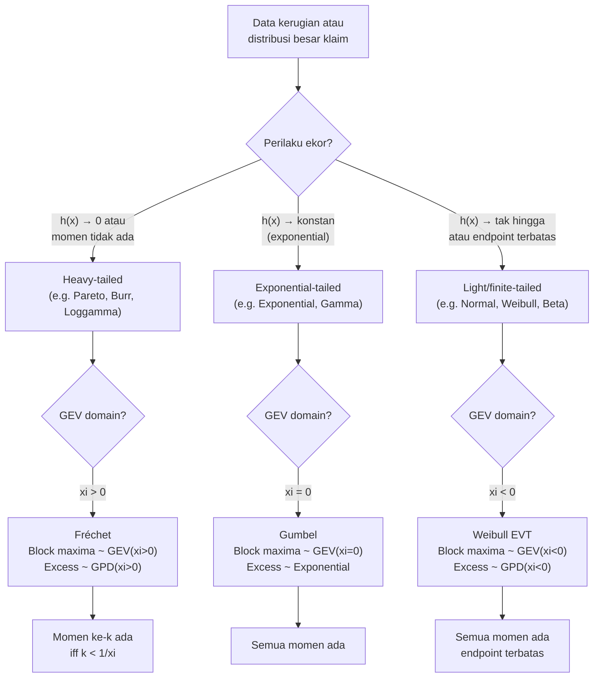

# 📊 1.2 — Distribution Classes and Extreme Value

> [!ABSTRACT] Ringkasan Cepat
> **Topik:** Distribution Classes and Extreme Value | **Bobot:** ~5–10% | **Difficulty:** Hard
> **Ref:** Klugman et al. (2019) Bab 3–5 | **Prereq:** [[1.1 Moment and Probability Generating Functions]]

---

## Section 0 — Pemetaan Topik

| Topik TA2 | Sub-topik ID | Skill Diuji | Bobot | Difficulty | Prerequisite | Connected Topics | Referensi |
|---|---|---|---|---|---|---|---|
| Model Besar Klaim | 1.2 | Mengklasifikasikan distribusi ke kelas (a,b,0)/(a,b,1), mengidentifikasi heavy/light tail, memilih model untuk data kerugian, menerapkan distribusi nilai ekstrim (GEV, GPD) | 5–10% | Hard | [[1.1 Moment and Probability Generating Functions]] | [[1.3 Techniques for Creating New Distributions]], [[1.4 Tail Characteristics]], [[6.4 Model Diagnostics and Selection]] | Klugman et al. (2019) Bab 3–5 |

---

## Section 1 — Intuisi

Bayangkan seorang aktuaris di perusahaan asuransi properti yang mencoba memodelkan besar klaim dari kebakaran gedung. Sebagian besar klaim adalah kecil: kerusakan kecil akibat korsleting listrik, kebakaran dapur, dan sejenisnya. Namun sesekali muncul klaim raksasa — gedung bertingkat hangus, kerugian ratusan miliar rupiah. Pertanyaan kritis adalah: distribusi probabilitas mana yang paling tepat merepresentasikan perilaku data seperti ini? Apakah kita bisa menggunakan distribusi Normal yang simetris dan "jinak"? Atau kita butuh distribusi yang mampu mengakomodasi ekor kanan yang sangat panjang dan berat?

Di sinilah klasifikasi distribusi menjadi alat navigasi yang esensial. Dunia distribusi probabilitas untuk data kerugian terbagi ke dalam beberapa "keluarga besar" — seperti keluarga transformasi (skala, eksponen), keluarga sistem (Pearson, Burr), dan keluarga berdasarkan perilaku ekor (heavy-tailed vs. light-tailed). Setiap keluarga memiliki karakteristik yang membuat mereka cocok atau tidak cocok untuk tipe risiko tertentu. Mengenal kelas-kelas ini adalah seperti mengenal jenis-jenis alat di kotak perkakas: seorang profesional tahu kapan harus memilih obeng, kapan palu, dan kapan kunci inggris.

Dimensi paling kritis dalam pemilihan model kerugian adalah perilaku distribusi nilai ekstrim (*extreme value*). Ketika kita bicara tentang bencana alam, klaim katastrofi, atau kerugian operasional terbesar dalam satu tahun — kita tidak lagi peduli dengan distribusi keseluruhan, melainkan distribusi dari nilai *maksimum* atau *excess* di atas threshold yang sangat tinggi. Teori Nilai Ekstrim (Extreme Value Theory, EVT) memberi kita kerangka matematis yang kokoh untuk memodelkan ekor distribusi dengan tepat, bahkan ketika data historis di zona ekstrim sangat sedikit.

---

## Section 2 — Definisi Formal

> [!NOTE] Definisi Matematis — Kelas Distribusi Kerugian
> Distribusi kerugian $X > 0$ diklasifikasikan berdasarkan fungsi distribusi $F(x)$, fungsi kepadatan $f(x)$, serta perilaku ekor $\bar{F}(x) = 1 - F(x)$ ketika $x \to \infty$.

| Simbol | Makna | Catatan |
|---|---|---|
| $X$ | Variabel acak besar klaim (loss severity) | $X > 0$ |
| $F(x)$ | Fungsi distribusi kumulatif (CDF) | $F(x) = P(X \leq x)$ |
| $\bar{F}(x)$ | Survival function / fungsi ekor | $\bar{F}(x) = 1 - F(x)$ |
| $f(x)$ | Fungsi kepadatan probabilitas (PDF) | $f(x) = F'(x)$ |
| $\mu_k'$ | Momen ke-$k$ (raw moment) | $E[X^k]$ |
| $\xi$ | Shape parameter GEV | Menentukan jenis distribusi ekstrim |
| $\mu_{\text{GEV}}$ | Location parameter GEV | Geser distribusi |
| $\sigma_{\text{GEV}}$ | Scale parameter GEV | $\sigma > 0$ |
| $u$ | Threshold dalam GPD | Batas nilai ekstrim |
| $\beta$ | Scale parameter GPD | $\beta > 0$ |

### Rumus Utama

**Klasifikasi Ekor: Heavy vs. Light-Tailed**

Distribusi dikatakan *heavy-tailed* jika momen ke-$k$ tidak ada (divergen) untuk $k$ cukup besar:

$$
\int_0^\infty x^k f(x)\, dx = \infty \quad \text{untuk beberapa } k > 0
$$

**Label:** Distribusi heavy-tailed memiliki momen yang tidak terbatas; light-tailed memiliki semua momen terbatas.

**Uji Ekor Berbasis Rasio Hazard:**

Distribusi heavy-tailed ekuivalen dengan:

$$
\lim_{x \to \infty} h(x) = \lim_{x \to \infty} \frac{f(x)}{\bar{F}(x)} = 0
$$

**Label:** Fungsi hazard $h(x)$ menurun menuju nol untuk distribusi heavy-tailed.

**Distribusi Generalized Extreme Value (GEV) — Fisher-Tippett-Gnedenko:**

$$
G(x; \mu, \sigma, \xi) = \exp\!\left\{-\left[1 + \xi\left(\frac{x - \mu}{\sigma}\right)\right]^{-1/\xi}\right\}
$$

untuk $1 + \xi\left(\frac{x-\mu}{\sigma}\right) > 0$.

**Label:** Distribusi limit dari maksimum terstandarisasi dari sampel i.i.d.; tiga tipe bergantung pada $\xi$.

**Tiga Tipe Distribusi GEV:**

$$
\xi > 0 \Rightarrow \text{Fréchet (heavy-tail, e.g. Pareto)}, \quad \xi = 0 \Rightarrow \text{Gumbel (light-tail, e.g. Normal, Lognormal)}, \quad \xi < 0 \Rightarrow \text{Weibull (finite endpoint)}
$$

**Distribusi Generalized Pareto (GPD) — Excess Loss di atas Threshold $u$:**

$$
H(y; \xi, \beta) = \begin{cases}
1 - \left(1 + \dfrac{\xi y}{\beta}\right)^{-1/\xi} & \xi \neq 0 \\[6pt]
1 - e^{-y/\beta} & \xi = 0
\end{cases}
$$

di mana $y = x - u \geq 0$ adalah excess loss di atas threshold $u$.

**Label:** GPD adalah distribusi alami untuk memodelkan excess loss di zona ekstrim (Peaks-Over-Threshold method).

**Mean Excess Function untuk GPD:**

$$
e(u) = E[X - u \mid X > u] = \frac{\beta + \xi u}{1 - \xi} \quad \text{untuk } \xi < 1
$$

**Label:** Fungsi excess mean yang linear dalam $u$ adalah ciri khas GPD; digunakan untuk validasi model.

**Kelas Distribusi Parametrik Umum (Transformed/Power/Exponential):**

Jika $X \sim F(x)$ maka:
- *Scale transform:* $Y = cX$ untuk $c > 0$
- *Power transform:* $Y = X^{1/\tau}$ untuk $\tau > 0$
- *Inverse transform:* $Y = 1/X$ (menghasilkan distribusi "inverse")
- *Exponential transform:* $Y = e^X$ (jika $X$ Normal, maka $Y$ Lognormal)

### Asumsi Eksplisit

1. Klaim bersifat non-negatif: support $X \in [0, \infty)$ atau $(0, \infty)$.
2. Data dianggap i.i.d. (independent and identically distributed) kecuali disebutkan lain.
3. Untuk EVT, sample size cukup besar agar teorema limit (Fisher-Tippett-Gnedenko) berlaku.
4. Threshold $u$ dalam GPD dipilih cukup tinggi sehingga pendekatan GPD valid, namun tidak terlalu tinggi sehingga data di atas $u$ masih cukup.
5. Parameter $\xi < 1$ diperlukan agar mean excess function (dan mean) terdefinisi.

---

## Section 3 — Jembatan Logika

> [!TIP] Dari Definisi ke Klasifikasi: Mengapa Bentuk Ekor Menentukan Segalanya
> Dalam pemodelan kerugian asuransi, pilihan distribusi hampir seluruhnya ditentukan oleh perilaku ekor. Ekor distribusi menentukan seberapa sering dan seberapa besar klaim-klaim ekstrim akan terjadi. Dua distribusi bisa memiliki mean dan variansi yang sama, tetapi berperilaku sangat berbeda di zona ekstrim. Inilah mengapa kita tidak bisa sembarangan memilih distribusi berdasarkan ringkasan statistik saja — kita harus memeriksa perilaku ekor secara eksplisit.

> [!IMPORTANT] Support dan Domain
> - Distribusi kerugian: $x > 0$ (atau $x \geq 0$ jika ada massa di titik nol)
> - GEV: $x$ tidak terbatas, bergantung pada tanda $\xi$ yang menentukan endpoint
> - GPD: $y = x - u \geq 0$ di mana $0 \leq y < \infty$ untuk $\xi \geq 0$, dan $0 \leq y \leq -\beta/\xi$ untuk $\xi < 0$
> - Untuk Fréchet ($\xi > 0$): tidak ada momen ke-$k$ untuk $k \geq 1/\xi$

**Derivasi Step-by-Step: Dari Distribusi Maksimum ke GEV**

**Langkah 1: Setup masalah.**

Misalkan $X_1, X_2, \ldots, X_n$ adalah klaim-klaim individual i.i.d. dengan CDF $F(x)$. Definisikan maksimum:

$$
M_n = \max(X_1, X_2, \ldots, X_n)
$$

**Langkah 2: CDF dari maksimum.**

$$
P(M_n \leq x) = P(X_1 \leq x, X_2 \leq x, \ldots, X_n \leq x) = [F(x)]^n
$$

**Langkah 3: Masalah degenerasi.**

Ketika $n \to \infty$, $[F(x)]^n \to 0$ untuk setiap $x < x_F$ (right endpoint dari $F$). Distribusi $M_n$ "kabur" ke tak hingga. Kita perlu standarisasi: cari $a_n > 0$ dan $b_n$ sehingga $\frac{M_n - b_n}{a_n}$ memiliki distribusi limit non-degeneratif.

**Langkah 4: Teorema Fisher-Tippett-Gnedenko.**

Jika limit distribusi non-degeneratif tersebut ada, maka distribusi limit hanya dapat berupa distribusi GEV:

$$
P\!\left(\frac{M_n - b_n}{a_n} \leq x\right) \to G(x) = \exp\!\left\{-\left[1 + \xi x\right]^{-1/\xi}\right\}
$$

untuk $1 + \xi x > 0$.

**Langkah 5: Interpretasi $\xi$.**

- $\xi > 0$: Distribusi asal $F$ memiliki ekor Pareto-like (heavy tail). Klaim ekstrim bisa sangat besar. Contoh: Pareto, Burr, Loggamma.
- $\xi = 0$: Ekor eksponensial atau lebih ringan. Klaim ekstrim terbatas dengan baik. Contoh: Normal, Lognormal, Gamma, Exponential.
- $\xi < 0$: Distribusi $F$ memiliki titik akhir yang terbatas (finite right endpoint). Klaim tidak bisa melebihi batas tertentu. Contoh: Uniform, Beta.

**Derivasi Step-by-Step: Hubungan GEV dan GPD (Teorema Pickands-Balkema-de Haan)**

**Langkah 1:** Untuk distribusi $F$ dalam domain of attraction GEV dengan parameter $\xi$, definisikan distribusi excess:

$$
F_u(y) = P(X - u \leq y \mid X > u) = \frac{F(u + y) - F(u)}{1 - F(u)}, \quad y \geq 0
$$

**Langkah 2:** Teorema Pickands-Balkema-de Haan menyatakan bahwa ketika $u \to x_F$:

$$
\sup_{y \geq 0} |F_u(y) - H_{\xi, \beta(u)}(y)| \to 0
$$

artinya distribusi excess loss mendekati GPD dengan parameter shape $\xi$ yang *sama* dengan parameter GEV.

**Langkah 3:** Hubungan langsung: jika maksimum block mengikuti GEV($\xi$), maka excess loss di atas threshold tinggi mengikuti GPD($\xi$). Ini memungkinkan dua pendekatan EVT: Block Maxima (GEV) dan Peaks-Over-Threshold (GPD).

> [!DANGER] Dilarang
> 1. **Jangan menggunakan distribusi Normal untuk data kerugian asuransi** tanpa justifikasi kuat — distribusi Normal memiliki ekor yang sangat tipis dan support tak terbatas di kiri, keduanya tidak realistis untuk klaim.
> 2. **Jangan menyamakan $\xi$ dalam GEV dengan $\xi$ dalam GPD sebagai parameter yang berbeda** — keduanya adalah parameter shape yang sama dan harus konsisten.
> 3. **Jangan mengestimasi GPD tanpa memilih threshold $u$ secara hati-hati** — threshold terlalu rendah melanggar asimptotik GPD, threshold terlalu tinggi menghasilkan estimasi tidak stabil karena data terlalu sedikit.

---

## Section 4 — Contoh Soal

### Soal A — Fundamental

Klaim asuransi kebakaran $X$ mengikuti distribusi Pareto dengan CDF:

$$
F(x) = 1 - \left(\frac{\theta}{x + \theta}\right)^\alpha, \quad x > 0
$$

dengan $\alpha = 3$ dan $\theta = 1000$.

**(a)** Tentukan apakah distribusi ini heavy-tailed atau light-tailed.
**(b)** Untuk block maxima klaim tahunan, distribusi GEV tipe apa yang relevan?

> [!SUCCESS] Solusi Soal A
> **Pendekatan:** Periksa keberadaan momen dan fungsi hazard; hubungkan dengan klasifikasi GEV.
>
> **1. Identifikasi Variabel**
> - $\alpha = 3$, $\theta = 1000$
> - $\bar{F}(x) = \left(\frac{\theta}{x+\theta}\right)^\alpha = \left(\frac{1000}{x+1000}\right)^3$
>
> **2. Identifikasi Distribusi / Model**
> Pareto single-parameter adalah anggota keluarga transformed beta, dikenal sebagai distribusi heavy-tailed klasik dalam aktuaria.
>
> **3. Setup Persamaan**
> Periksa fungsi hazard:
> $$
> h(x) = \frac{f(x)}{\bar{F}(x)} = \frac{\alpha/(x+\theta)}{1} = \frac{\alpha}{x+\theta}
> $$
>
> **4. Eksekusi Aljabar**
>
> $$
> f(x) = \frac{d}{dx}\left[1 - \left(\frac{\theta}{x+\theta}\right)^\alpha\right] = \frac{\alpha \theta^\alpha}{(x+\theta)^{\alpha+1}}
> $$
>
> $$
> h(x) = \frac{f(x)}{\bar{F}(x)} = \frac{\alpha \theta^\alpha / (x+\theta)^{\alpha+1}}{\theta^\alpha / (x+\theta)^\alpha} = \frac{\alpha}{x+\theta}
> $$
>
> $$
> \lim_{x \to \infty} h(x) = \lim_{x \to \infty} \frac{3}{x + 1000} = 0
> $$
>
> Konfirmasi momen: $E[X^k]$ terbatas hanya untuk $k < \alpha = 3$. Momen ke-3 dan seterusnya tidak ada.
>
> **5. Verification**
> Fungsi hazard $\to 0$ mengkonfirmasi heavy tail. Untuk Pareto, $\bar{F}(x) \sim x^{-\alpha}$ (power law decay) — jauh lebih lambat dari exponential $e^{-\lambda x}$.
>
> **Hasil:**
> **(a)** Heavy-tailed: $h(x) \to 0$, momen ke-3 dan lebih tinggi tidak ada.
> **(b)** Karena Pareto adalah heavy-tailed, block maxima mengikuti **GEV tipe Fréchet** ($\xi > 0$), dengan $\xi = 1/\alpha = 1/3$.

> [!WARNING] Exam Tips — Soal A
> **Target waktu:** 3 menit. **Common trap:** Mengira heavy-tailed berarti mean tidak ada — untuk Pareto($\alpha = 3$), mean ada ($\alpha > 1$) dan variansi ada ($\alpha > 2$), tetapi momen ke-3 tidak ada. **Shortcut:** Untuk Pareto, $\xi_{\text{GEV}} = 1/\alpha$ secara langsung.

---

### Soal B — Exam-Typical

Seorang aktuaris menganalisis klaim asuransi besar menggunakan metode Peaks-Over-Threshold (POT). Dari 500 klaim historis, 42 klaim melebihi threshold $u = 5{,}000{,}000$. Excess losses $Y_i = X_i - u$ diestimasi mengikuti GPD dengan $\xi = 0.4$ dan $\beta = 2{,}000{,}000$.

Hitung:
**(a)** Mean excess loss $e(u)$ di atas threshold.
**(b)** Probabilitas bahwa suatu klaim melebihi $x = 12{,}000{,}000$.

> [!SUCCESS] Solusi Soal B
> **Pendekatan:** Gunakan formula mean excess GPD dan decompose probabilitas via Bayes.
>
> **1. Identifikasi Variabel**
> - Threshold: $u = 5{,}000{,}000$
> - $\xi = 0.4$, $\beta = 2{,}000{,}000$
> - $n = 500$ total klaim, $n_u = 42$ klaim melebihi $u$
> - Target: $x = 12{,}000{,}000$, sehingga $y = x - u = 7{,}000{,}000$
>
> **2. Identifikasi Distribusi / Model**
> GPD valid karena threshold dipilih dari zona tail; $\xi = 0.4 > 0$ mengkonfirmasi heavy tail (Fréchet domain).
>
> **3. Setup Persamaan**
>
> (a) Mean excess GPD:
> $$
> e(u) = \frac{\beta + \xi \cdot 0}{1 - \xi} = \frac{\beta}{1 - \xi}
> $$
>
> (b) Dekomposisi probabilitas:
> $$
> P(X > x) = P(X > u) \cdot P(X > x \mid X > u)
> $$
>
> **4. Eksekusi Aljabar**
>
> **(a)**
>
> $$
> e(u) = \frac{2{,}000{,}000}{1 - 0.4} = \frac{2{,}000{,}000}{0.6} = 3{,}333{,}333
> $$
>
> **(b)**
> Estimasi empiris:
> $$
> P(X > u) \approx \frac{42}{500} = 0.084
> $$
>
> GPD survival function:
> $$
> P(X > x \mid X > u) = \bar{H}(y) = \left(1 + \frac{\xi y}{\beta}\right)^{-1/\xi}
> $$
>
> $$
> = \left(1 + \frac{0.4 \times 7{,}000{,}000}{2{,}000{,}000}\right)^{-1/0.4} = \left(1 + 1.4\right)^{-2.5} = (2.4)^{-2.5}
> $$
>
> $$
> (2.4)^{2.5} = (2.4)^2 \times (2.4)^{0.5} = 5.76 \times 1.5492 \approx 8.923
> $$
>
> $$
> P(X > x \mid X > u) \approx \frac{1}{8.923} \approx 0.1121
> $$
>
> $$
> P(X > 12{,}000{,}000) \approx 0.084 \times 0.1121 \approx 0.00942
> $$
>
> **5. Verification**
> Mean excess $e(u) = 3.33$ juta berarti rata-rata kerugian di atas threshold adalah $u + e(u) = 8.33$ juta. Probabilitas klaim melebihi 12 juta sekitar 0.94% — wajar untuk zona tail yang jauh di atas threshold.
>
> **Hasil:**
> **(a)** $e(u) \approx 3{,}333{,}333$
> **(b)** $P(X > 12{,}000{,}000) \approx 0.00942$ atau sekitar $0.94\%$.

> [!WARNING] Exam Tips — Soal B
> **Target waktu:** 4 menit. **Common trap:** Menggunakan $\xi$ dalam formula mean excess sebagai $\xi \cdot u$ (confusing dengan formula GPD general) — pada threshold tepat $u$, suku $\xi \cdot 0 = 0$ sehingga $e(u) = \beta/(1-\xi)$. **Shortcut:** Selalu tulis dekomposisi $P(X > x) = P(X > u) \cdot P(X > x | X > u)$ secara eksplisit sebelum kalkulasi.

---

### Soal C — Challenging

Data klaim kebakaran industri menunjukkan bahwa klaim tahunan maksimum dari 200 polis mengikuti GEV dengan parameter $\mu = 800{,}000$, $\sigma = 150{,}000$, dan $\xi = 0.25$.

**(a)** Hitung *Value-at-Risk* pada level $p = 0.99$, yaitu $\text{VaR}_{0.99}$ dari distribusi GEV ini.
**(b)** Tentukan apakah momen ke-4 dari distribusi GEV ini terbatas.
**(c)** Seorang analis mengusulkan menggunakan distribusi Gumbel ($\xi = 0$) sebagai alternatif yang lebih sederhana. Berikan argumen matematis mengapa ini tidak tepat jika $\xi = 0.25$.

> [!SUCCESS] Solusi Soal C
> **Pendekatan:** Invert CDF GEV untuk VaR; gunakan kondisi momen Fréchet; bandingkan kecepatan decay ekor.
>
> **1. Identifikasi Variabel**
> - GEV: $\mu = 800{,}000$, $\sigma = 150{,}000$, $\xi = 0.25 > 0$ (Fréchet)
> - $p = 0.99$ untuk VaR
>
> **2. Identifikasi Distribusi / Model**
> $\xi = 0.25 > 0$ → domain Fréchet → heavy-tailed. Momen ke-$k$ terbatas hanya jika $k < 1/\xi = 4$.
>
> **3. Setup Persamaan**
>
> **(a)** VaR dari GEV adalah quantile $G^{-1}(p)$. Invert:
> $$
> G(x) = p \Rightarrow \exp\!\left\{-\left[1 + \xi\left(\frac{x-\mu}{\sigma}\right)\right]^{-1/\xi}\right\} = p
> $$
>
> **4. Eksekusi Aljabar**
>
> **(a)**
>
> $$
> -\left[1 + \xi\left(\frac{x-\mu}{\sigma}\right)\right]^{-1/\xi} = \ln p
> $$
>
> $$
> \left[1 + \xi\left(\frac{x-\mu}{\sigma}\right)\right]^{-1/\xi} = -\ln p = -\ln(0.99)
> $$
>
> $$
> -\ln(0.99) \approx 0.01005
> $$
>
> $$
> 1 + \xi\left(\frac{x-\mu}{\sigma}\right) = (-\ln p)^{-\xi} = (0.01005)^{-0.25}
> $$
>
> $$
> (0.01005)^{-0.25} = \left(\frac{1}{0.01005}\right)^{0.25} = (99.5)^{0.25}
> $$
>
> $$
> (99.5)^{0.25} = \sqrt{\sqrt{99.5}} \approx \sqrt{9.975} \approx 3.158
> $$
>
> $$
> 0.25 \cdot \frac{x - 800{,}000}{150{,}000} = 3.158 - 1 = 2.158
> $$
>
> $$
> \frac{x - 800{,}000}{150{,}000} = \frac{2.158}{0.25} = 8.632
> $$
>
> $$
> x = 800{,}000 + 8.632 \times 150{,}000 = 800{,}000 + 1{,}294{,}800 = 2{,}094{,}800
> $$
>
> **(b)** Untuk GEV Fréchet, momen ke-$k$ terbatas $\iff k < 1/\xi = 1/0.25 = 4$. Momen ke-4 ($k = 4$) **tidak terbatas** karena kondisinya $k < 4$ (ketat). Akibatnya: kurtosis tidak terdefinisi.
>
> **(c)** Gumbel ($\xi = 0$) memiliki ekor eksponensial: $\bar{G}(x) \sim e^{-e^{(x-\mu)/\sigma}}$ untuk $x$ besar. Fréchet ($\xi = 0.25$) memiliki ekor power-law: $\bar{G}(x) \sim x^{-1/\xi} = x^{-4}$ untuk $x$ besar.
>
> $$
> \frac{\bar{G}_{\text{Fréchet}}(x)}{\bar{G}_{\text{Gumbel}}(x)} = \frac{x^{-4}}{e^{-e^{(x-\mu)/\sigma}}} \to \infty \quad \text{as } x \to \infty
> $$
>
> Artinya Gumbel secara dramatis *underestimate* probabilitas klaim ekstrim besar. Menggunakan Gumbel untuk data yang sebenarnya Fréchet akan menghasilkan cadangan teknis yang tidak memadai dan penetapan premi yang terlalu rendah untuk risiko katastrofi.
>
> **5. Verification**
> VaR$_{0.99} \approx 2.09$ juta vs. $\mu = 800{,}000$ masuk akal — distribusi heavy-tailed menghasilkan quantile yang jauh lebih tinggi dari mean. Cross-check: pada $p = 0.5$ (median), $-\ln(0.5) \approx 0.693$, $(0.693)^{-0.25} \approx 1.094$, sehingga median $\approx 800{,}000 + 150{,}000 \times (0.094/0.25) = 800{,}000 + 56{,}400 = 856{,}400$, mendekati $\mu$ sesuai ekspektasi.
>
> **Hasil:**
> **(a)** $\text{VaR}_{0.99} \approx 2{,}094{,}800$
> **(b)** Momen ke-4 **tidak terbatas** ($k = 4$ bukan $< 4$)
> **(c)** Gumbel severely underestimates tail probability — secara asimtotis rasio $\to \infty$, tidak tepat secara aktuaria.

> [!WARNING] Exam Tips — Soal C
> **Target waktu:** 5–6 menit. **Common trap:** Untuk kondisi momen Fréchet, ingat ketidaksetaraan **ketat**: momen ke-$k$ ada $\iff k < 1/\xi$, bukan $\leq$. Momen ke-$(1/\xi)$ persis tidak ada! **Shortcut:** Invers CDF GEV selalu bisa ditulis $x = \mu + \frac{\sigma}{\xi}\left[(-\ln p)^{-\xi} - 1\right]$ — hafal formula ini untuk menghemat waktu.

---

## Section 5 — Verifikasi & Sanity Check

> [!CHECK] Cek 1: Konsistensi $\xi$ antara GEV dan GPD
> Untuk data yang sama, block maxima method (GEV) dan POT method (GPD) harus memberikan estimasi $\xi$ yang konsisten. Jika keduanya memberikan $\hat{\xi}$ yang sangat berbeda, ada masalah dalam pemilihan block size atau threshold.

> [!CHECK] Cek 2: Mean Excess Function Linear untuk GPD
> Jika model GPD valid, plot mean excess empiris $\hat{e}(u)$ vs. $u$ harus mendekati linear:
> $$
> e(u) = \frac{\beta + \xi u}{1 - \xi}
> $$
> Linearitas konfirmasi kesesuaian GPD. Kurva cekung ke atas (superlinear) mengindikasikan $\xi$ lebih besar dari estimasi; cekung ke bawah mengindikasikan ekor lebih tipis.

> [!CHECK] Cek 3: Hubungan Momen GEV
> Untuk GEV Fréchet dengan $\xi > 0$: $E[G] = \mu + \sigma \frac{\Gamma(1-\xi) - 1}{\xi}$ (terdefinisi hanya jika $\xi < 1$). Jika $\xi \geq 1$, mean tidak ada. Ini adalah red flag: jika MLE menghasilkan $\hat{\xi} \geq 1$, premi dan cadangan berbasis mean tidak terdefinisi secara matematis.

### Metode Alternatif

Selain klasifikasi berbasis $h(x)$ dan EVT, distribusi dapat diklasifikasikan menggunakan:

1. **Log-log plot:** Plot $\log \bar{F}(x)$ vs. $\log x$. Straight line dengan slope $-\alpha$ mengindikasikan Pareto-like heavy tail ($\xi = 1/\alpha > 0$).
2. **Mean excess plot (ME plot):** Plot empiris $\hat{e}(u)$ vs. $u$. Slope positif → heavy tail (Pareto/GPD dengan $\xi > 0$); slope nol → exponential tail ($\xi = 0$); slope negatif → finite endpoint ($\xi < 0$).
3. **Hill estimator:** Estimasi nonparametrik $\hat{\xi}$ langsung dari order statistics tanpa asumsi distribusi parametrik.

---

## Section 6 — Visualisasi Mental

**Visualisasi 1: Kurva Ekor Tiga Tipe GEV**

Bayangkan tiga kurva survival function $\bar{G}(x)$ diplot pada skala log-log:

- **Fréchet ($\xi > 0$):** Garis lurus menurun (power law) — ekor "lambat mati", mengizinkan nilai ekstrim sangat besar. Seperti lereng gunung yang landai: masih ada ketinggian bahkan jauh dari puncak.
- **Gumbel ($\xi = 0$):** Kurva melengkung ke bawah semakin cepat — ekor eksponensial. Seperti lereng yang semakin curam: nilai ekstrim semakin jarang secara eksponensial.
- **Weibull EVT ($\xi < 0$):** Kurva berakhir di titik tertentu — ada batas maksimum absolut. Seperti tembok: tidak ada klaim yang bisa melewati batas tertentu.

**Visualisasi 2: Mean Excess Plot (ME Plot)**

Plot $\hat{e}(u)$ vs. $u$ adalah alat diagnostik visual kunci:

- *Slope positif* → distribusi heavy-tailed (GPD dengan $\xi > 0$, Pareto)
- *Slope nol* → exponential tail ($\xi = 0$, distribusi Exponential)
- *Slope negatif* → finite right endpoint ($\xi < 0$, Beta, Uniform)
- *Non-linear* → data mungkin campuran dua populasi, atau threshold belum cukup tinggi

Untuk mengidentifikasi threshold $u$: cari titik di atas mana ME plot mendekati linear. Zona di bawah titik ini adalah "bulk" distribusi; zona di atasnya adalah tail yang bisa dimodelkan dengan GPD.

### Hubungan Visual ↔ Rumus

| Elemen Visual | Komponen Rumus |
|---|---|
| Slope ME plot = $\xi/(1-\xi)$ | Parameter $\xi$ dalam $e(u) = (\beta + \xi u)/(1-\xi)$ |
| Intercept ME plot = $\beta/(1-\xi)$ | Parameter $\beta$ (scale GPD) |
| Slope log-log plot survival = $-1/\xi$ | Exponent power law Fréchet: $\bar{F}(x) \sim x^{-1/\xi}$ |
| Titik akhir Weibull EVT | $x_{\max} = \mu - \sigma/\xi$ ketika $\xi < 0$ |

---

## Section 7 — Jebakan Umum

> [!BUG] Kesalahan Parametrisasi
> **GEV vs. Weibull (distribusi biasa):** Distribusi Weibull dalam EVT ($\xi < 0$, tipe III GEV) adalah *berbeda* dari distribusi Weibull biasa yang digunakan untuk modeling lifetime. Keduanya menggunakan nama "Weibull" tetapi tidak sama — distribusi Weibull biasa adalah heavy-tailed atau light-tailed bergantung shape parameter, bukan finite-endpoint.
>
> **GPD scale $\beta$:** Parameter $\beta$ dalam GPD bergantung pada threshold $u$. Jika threshold berubah, $\beta$ harus diestimasi ulang. Shape $\xi$ relatif stabil terhadap perubahan threshold (jika model benar).

> [!BUG] Kesalahan Konseptual
> 1. **"Heavy-tailed = mean tidak ada"** — SALAH. Pareto dengan $\alpha = 3$ adalah heavy-tailed, tetapi mean dan variansinya ada. Heavy-tailed artinya *beberapa* momen tidak ada (ekor lebih berat dari eksponensial), bukan semua momen tidak ada.
> 2. **"GEV hanya untuk data maksimum tahunan"** — SALAH. "Block" bisa berupa periode apa pun (bulanan, quarterly), tetapi ukuran block harus cukup besar untuk konvergensi teorema limit.
> 3. **"$\xi = 0$ artinya distribusinya Normal"** — SALAH. $\xi = 0$ (Gumbel) adalah domain of attraction yang mencakup banyak distribusi: Normal, Lognormal, Gamma, Exponential semuanya dalam domain Gumbel.
> 4. **Mengabaikan ukuran sampel untuk EVT** — Teorema Fisher-Tippett-Gnedenko adalah teorema asimtotik. Dengan data kecil ($n < 30$ per block, atau $n_u < 20$ untuk POT), estimasi GEV/GPD sangat tidak stabil.

> [!BUG] Kesalahan Interpretasi Soal
> - **"Distribusi mana yang cocok?"** — Harus memeriksa *empirical* tail behavior, bukan hanya menyesuaikan goodness-of-fit statistik. Distribusi dengan AIC terbaik bisa saja salah jika ekor tidak direpresentasikan dengan baik.
> - **"Heavy-tailed vs. fat-tailed"** — Kedua istilah sering digunakan bergantian, tetapi secara teknis "heavy-tailed" biasanya merujuk pada ekor lebih berat dari eksponensial, sementara "fat-tailed" sering digunakan lebih longgar dalam finance.

> [!CAUTION] Red Flags — Keywords yang Harus Memicu Prosedur Tertentu
> - **"Klaim katastrofi", "bencana", "kerugian maksimum"** → Pertimbangkan EVT (GEV/GPD), bukan distribusi standard
> - **"Excess loss di atas threshold"** → GPD / POT method
> - **"Block maxima", "maksimum tahunan"** → GEV / Block Maxima method
> - **"Momen tidak terbatas", "momen tidak ada"** → Cek kondisi $k < 1/\xi$ untuk Fréchet
> - **"Mean excess function linear"** → Validasi GPD, hitung $\xi$ dan $\beta$ dari slope dan intercept
> - **"Distribusi Pareto"** → Langsung identifikasi sebagai Fréchet domain, $\xi = 1/\alpha$

---

## Section 8 — Ringkasan Eksekutif

> [!SUMMARY] Must-Remember
> 1. **Tiga tipe GEV:** $\xi > 0$ (Fréchet, heavy tail), $\xi = 0$ (Gumbel, exponential tail), $\xi < 0$ (Weibull EVT, finite endpoint)
>
> 2. **Quantile (VaR) GEV:**
> $$
> \text{VaR}_p = \mu + \frac{\sigma}{\xi}\left[(-\ln p)^{-\xi} - 1\right]
> $$
>
> 3. **GPD survival function:**
> $$
> \bar{H}(y) = \left(1 + \frac{\xi y}{\beta}\right)^{-1/\xi}, \quad y \geq 0, \quad \xi \neq 0
> $$
>
> 4. **Mean excess GPD:**
> $$
> e(u) = \frac{\beta + \xi u}{1 - \xi}, \quad \xi < 1
> $$
>
> 5. **Kondisi momen Fréchet** (Pareto-like): momen ke-$k$ terbatas $\iff k < \dfrac{1}{\xi}$
>
> 6. **Identifikasi empiris heavy tail:** $h(x) \to 0$ ketika $x \to \infty$, atau ME plot memiliki slope positif

### Kapan Digunakan

- Ketika soal menyebutkan **"maksimum"**, **"klaim ekstrim"**, **"katastrofi"**, atau **"excess loss di atas threshold"**
- Ketika diminta mengklasifikasikan distribusi sebagai heavy/light/finite-endpoint
- Ketika soal menanyakan apakah momen tertentu terbatas atau tidak
- Ketika diminta menghitung probabilitas di zona tail yang sangat jauh dari mean
- Ketika memilih distribusi untuk **data kerugian asuransi** dengan outlier ekstrim

### Kapan TIDAK Boleh Digunakan

- Data dengan support terbatas (misalnya proporsi $\in [0,1]$) — EVT untuk maksimum di sini menghasilkan Weibull EVT dengan $\xi < 0$, bukan Fréchet
- Ketika block size kecil atau jumlah exceedances di atas threshold sangat sedikit ($< 20$) — estimasi tidak reliabel
- Untuk variabel yang secara alamiah symmetric (e.g., return portofolio tanpa truncation) — EVT masih bisa diterapkan tetapi dengan modifikasi untuk ekor kiri

### Quick Decision Tree

---

> [!QUOTE] Follow-up Options
> 1. *"Berikan contoh soal variasi pemilihan threshold dalam GPD dengan ME plot"*
> 2. *"Jelaskan hubungan [[1.2 Distribution Classes and Extreme Value]] dengan [[1.4 Tail Characteristics]] dan [[6.4 Model Diagnostics and Selection]]"*
> 3. *"Buat flashcard 1-halaman untuk klasifikasi GEV dan kondisi momen Fréchet"*

*📖 Ref: Klugman, Panjer & Willmot (2019) Loss Models 5th ed., Bab 3–5 | 🗓️ 2026-04-16 | #TA2 #ExtremeValue #DistributionClasses #TeoriRisiko*
