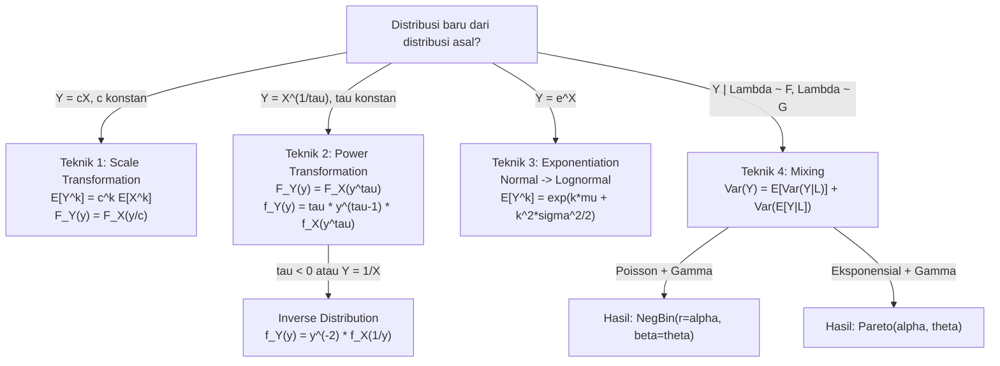

# 📊 1.3 — Techniques for Creating New Distributions

> [!ABSTRACT] Ringkasan Cepat
> **Topik:** Techniques for Creating New Distributions | **Bobot:** ~5–10% | **Difficulty:** Hard
> **Ref:** Klugman et al. (2019) Loss Models 5th ed., Bab 4 | **Prereq:** [[1.1 Moment and Probability Generating Functions]], [[1.2 Distribution Classes and Extreme Value]]

## Section 0 — Pemetaan Topik

| Topik TA2 | Sub-topik ID | Skill Diuji | Bobot | Difficulty | Prerequisite | Connected Topics | Referensi |
|---|---|---|---|---|---|---|---|
| Model Besar Klaim | 1.3 | Membentuk distribusi baru via perkalian konstanta, raising to a power, exponentiation, dan mixing; menentukan PDF/CDF/momen distribusi hasil transformasi | 5–10% | Hard | [[1.1 Moment and Probability Generating Functions]], [[1.2 Distribution Classes and Extreme Value]] | [[1.4 Tail Characteristics]], [[3.1 Coverage Modifications on Severity and Frequency]], [[6.1 Parameter Estimation Methods]] | KPW (2019) Bab 4 |

## Section 1 — Intuisi

Bayangkan seorang aktuaris di perusahaan asuransi kendaraan bermotor di Jakarta. Data historis menunjukkan bahwa klaim kerusakan kendaraan mengikuti distribusi Eksponensial — sederhana, namun terlalu ringan untuk menangkap klaim besar yang sesekali muncul. Lalu muncul pertanyaan: apakah ada cara untuk "memodifikasi" distribusi ini agar lebih sesuai dengan pola klaim dunia nyata, tanpa harus memulai dari nol?

Jawabannya adalah: ya, dan inilah inti dari topik ini. Para aktuaris telah mengembangkan empat teknik sistematis untuk "membangun" distribusi baru dari distribusi yang sudah dikenal. Teknik pertama adalah *perkalian konstanta* — bayangkan mengubah satuan dari rupiah ke juta rupiah, atau menyesuaikan inflasi; secara matematis ini meregangkan atau menyempitkan distribusi tanpa mengubah bentuknya. Teknik kedua adalah *raising to a power* (pemangkatan) — mengubah variabel acak menjadi pangkat tertentu, yang menghasilkan distribusi baru dengan ekor yang bisa lebih berat atau lebih ringan. Teknik ketiga adalah *exponentiation* — mengambil nilai $e$ dipangkatkan variabel acak, yang sangat berguna untuk mengubah distribusi Normal menjadi Lognormal. Teknik keempat, yang paling powerful, adalah *mixing* — mencampurkan beberapa distribusi berdasarkan suatu bobot acak, seperti satu portofolio yang terdiri dari polis risiko rendah dan risiko tinggi yang bercampur.

Keempat teknik ini adalah pondasi dari "toolbox" pemodelan distribusi klaim. Hampir semua distribusi yang digunakan dalam aktuaria (Weibull, Lognormal, Burr, Inverse Gaussian, dll.) dapat diturunkan dari distribusi sederhana melalui kombinasi teknik-teknik ini. Memahami teknik transformasi juga sangat berguna ketika menganalisis dampak *coverage modifications* seperti deductible dan policy limit — karena menerapkan deductible pada klaim pada dasarnya adalah transformasi distribusi.

## Section 2 — Definisi Formal

> [!NOTE] Definisi Matematis — Empat Teknik Transformasi
>
> Misalkan $X$ adalah variabel acak dengan CDF $F_X(x)$, PDF $f_X(x)$, dan support yang sesuai. Empat teknik berikut menghasilkan variabel acak baru $Y$:
>
> **1. Perkalian Konstanta (Multiplication by a Constant / Scale Transformation):**
>
> $$Y = cX, \quad c > 0$$
>
> **2. Raising to a Power (Power Transformation):**
>
> $$Y = X^{1/\tau}, \quad \tau \neq 0$$
>
> **3. Exponentiation:**
>
> $$Y = e^X$$
>
> **4. Mixing (Scale Mixture):**
>
> $$F_Y(y) = \int_0^\infty F_{Y\mid\Lambda}(y \mid \lambda)\, dF_\Lambda(\lambda)$$

| Simbol | Makna | Catatan |
|---|---|---|
| $c$ | Konstanta positif (faktor skala) | Inflasi, konversi satuan |
| $\tau$ | Parameter pangkat (*power parameter*) | $\tau > 0$: distribusi Transformed; $\tau < 0$: Inverse |
| $Y = X^{1/\tau}$ | Variabel hasil power transformation | Untuk $\tau = 1$: tidak berubah |
| $\Lambda$ | Variabel acak mixing parameter | Sering $\Lambda \sim \text{Gamma}$ atau $\text{Inverse Gaussian}$ |
| $F_{Y\mid\Lambda}(y\mid\lambda)$ | CDF bersyarat $Y$ given $\Lambda = \lambda$ | Biasanya distribusi sederhana (Eksponensial, Gamma) |
| $u(\lambda)$ | Fungsi bobot mixing | Harus merupakan PDF valid: $\int u(\lambda)\,d\lambda = 1$ |
| $\mu_Y$ | Mean distribusi baru | Dihitung dari distribusi asal via transformasi |
| $\text{CV}$ | Coefficient of variation | Ukuran relatif dispersi: $\sigma / \mu$ |

### Rumus Utama

**[Teknik 1] Scale Transformation — PDF dan Momen:**

$$f_Y(y) = \frac{1}{c}\, f_X\!\left(\frac{y}{c}\right), \quad y > 0$$

*Label: Meregangkan/menyempitkan distribusi; jika $c > 1$ distribusi "melebar" ke kanan.*

$$E[Y^k] = c^k\, E[X^k]$$

*Label: Momen ke-$k$ distribusi baru adalah $c^k$ kali momen ke-$k$ distribusi asal.*

**[Teknik 2a] Transformed Distribution ($\tau > 0$) — PDF:**

Jika $Y = X^{1/\tau}$ dan $X$ kontinu positif, maka dengan substitusi $x = y^\tau$:

$$f_Y(y) = \tau\, y^{\tau - 1}\, f_X(y^\tau), \quad y > 0$$

*Label: Teknik ini menghasilkan keluarga "Transformed" — misal Transformed Gamma, Transformed Beta.*

**[Teknik 2b] Inverse Distribution ($\tau < 0$, ekuivalen $Y = 1/X$) — PDF:**

Jika $Y = X^{-1} = 1/X$:

$$f_Y(y) = \frac{1}{y^2}\, f_X\!\left(\frac{1}{y}\right), \quad y > 0$$

*Label: Menghasilkan keluarga "Inverse" — misal Inverse Gamma, Inverse Weibull, Inverse Pareto.*

**[Teknik 2c] Hubungan CDF untuk Power Transformation ($\tau > 0$):**

$$F_Y(y) = F_X(y^\tau)$$

*Label: Cara cepat mendapatkan CDF distribusi hasil transformasi — tidak perlu integrasi ulang.*

**[Teknik 3] Exponentiation — PDF Lognormal dari Normal:**

Jika $X \sim N(\mu, \sigma^2)$ dan $Y = e^X$, maka $Y \sim \text{Lognormal}(\mu, \sigma^2)$:

$$f_Y(y) = \frac{1}{y\sigma\sqrt{2\pi}} \exp\!\left(-\frac{(\ln y - \mu)^2}{2\sigma^2}\right), \quad y > 0$$

*Label: Exponentiation mengubah distribusi simetris Normal menjadi distribusi right-skewed Lognormal.*

$$E[Y^k] = e^{k\mu + k^2\sigma^2/2}$$

*Label: Momen ke-$k$ Lognormal dalam bentuk parameter Normal asal.*

**[Teknik 4] Mixing — Mean dan Variansi:**

$$E[Y] = E_\Lambda[E[Y \mid \Lambda]]$$

$$\text{Var}(Y) = E_\Lambda[\text{Var}(Y \mid \Lambda)] + \text{Var}_\Lambda(E[Y \mid \Lambda])$$

*Label: Law of total expectation dan law of total variance — variansi campuran selalu lebih besar dari variansi rata-rata komponen.*

**[Teknik 4] Mixing — Contoh Penting: Gamma Mixture of Exponentials = Pareto:**

Jika $Y \mid \Lambda \sim \text{Eksponensial}(1/\Lambda)$ dan $\Lambda \sim \text{Gamma}(\alpha, \theta)$, maka:

$$Y \sim \text{Pareto}(\alpha, \theta)$$

*Label: Ini adalah hasil mixing paling penting dalam aktuaria — menjelaskan mengapa Pareto memiliki ekor lebih berat dari Eksponensial.*

### Asumsi Eksplisit

1. Untuk teknik 1–3: variabel acak asal $X$ harus kontinu dengan support positif (kecuali exponentiation yang mensyaratkan $X$ bersupport real).
2. Untuk power transformation: $\tau \neq 0$; untuk $\tau < 0$ interpretasikan sebagai invers lalu angkat pangkat.
3. Untuk mixing: fungsi bobot $u(\lambda)$ atau $F_\Lambda(\lambda)$ harus merupakan distribusi probabilitas yang valid.
4. Transformasi bersifat satu-ke-satu (*monotone*) sehingga formula change-of-variable berlaku secara langsung.
5. Momen distribusi baru terdefinisi finite jika momen distribusi asal yang bersesuaian finite.

## Section 3 — Jembatan Logika

> [!TIP] Dari Definisi ke Rumus — Prinsip Change of Variable
>
> Semua teknik 1–3 adalah aplikasi dari satu prinsip tunggal: **change of variable untuk variabel acak kontinu**. Jika $Y = g(X)$ dengan $g$ monotone increasing dan differentiable, maka:
>
> $$f_Y(y) = f_X(g^{-1}(y)) \cdot \left|\frac{d}{dy} g^{-1}(y)\right|$$
>
> Inilah "mesin" di balik semua rumus transformasi. Teknik 1 ($Y = cX$): $g^{-1}(y) = y/c$, turunannya $1/c$. Teknik 2 ($Y = X^{1/\tau}$): $g^{-1}(y) = y^\tau$, turunannya $\tau y^{\tau-1}$. Teknik 3 ($Y = e^X$): $g^{-1}(y) = \ln y$, turunannya $1/y$.
>
> Untuk mixing (teknik 4), prinsip yang bekerja berbeda: ini adalah **marginalisasi** — kita "rata-ratakan" distribusi bersyarat $Y \mid \Lambda$ terhadap distribusi prior $\Lambda$. Hasilnya adalah distribusi marginal $Y$ yang secara otomatis lebih heavy-tailed daripada komponen-komponennya.

> [!IMPORTANT] Support dan Domain
>
> - **Teknik 1 & 2:** Jika $X > 0$, maka $Y = cX > 0$ dan $Y = X^{1/\tau} > 0$. Support tetap positif.
> - **Teknik 3:** $X$ bisa bersupport $(-\infty, \infty)$ (seperti Normal), tetapi $Y = e^X > 0$ selalu. Ini adalah cara membentuk distribusi positif dari distribusi tak terbatas.
> - **Teknik 4 (mixing):** Support $Y$ adalah gabungan support dari semua $Y \mid \Lambda = \lambda$. Jika tiap komponen bersupport positif, maka distribusi campuran juga bersupport positif.
> - **Inverse transformation ($Y = 1/X$):** Jika $X$ bersupport $(0, \infty)$, maka $Y = 1/X$ juga bersupport $(0, \infty)$. Namun perilaku ekor terbalik: ekor kanan $X$ menjadi ekor kiri $Y$ dan sebaliknya.

**Derivasi: Distribusi Pareto dari Gamma Mixture of Exponentials**

Ini adalah derivasi mixing paling penting di TA2.

Langkah 1 — Setup: $Y \mid \Lambda = \lambda \sim \text{Eksponensial dengan mean } 1/\lambda$, sehingga:

$$f_{Y\mid\Lambda}(y \mid \lambda) = \lambda e^{-\lambda y}, \quad y > 0$$

Langkah 2 — Prior: $\Lambda \sim \text{Gamma}(\alpha, \theta)$ (parameterisasi KPW: mean $= \alpha\theta$):

$$f_\Lambda(\lambda) = \frac{\lambda^{\alpha-1} e^{-\lambda/\theta}}{\theta^\alpha \Gamma(\alpha)}, \quad \lambda > 0$$

Langkah 3 — Marginal $f_Y(y)$ via integrasi:

$$f_Y(y) = \int_0^\infty \lambda e^{-\lambda y} \cdot \frac{\lambda^{\alpha-1} e^{-\lambda/\theta}}{\theta^\alpha \Gamma(\alpha)}\, d\lambda = \frac{1}{\theta^\alpha \Gamma(\alpha)} \int_0^\infty \lambda^\alpha e^{-\lambda(y + 1/\theta)}\, d\lambda$$

Langkah 4 — Kenali integran sebagai kernel Gamma: $\int_0^\infty \lambda^\alpha e^{-\lambda(y+1/\theta)}\, d\lambda = \frac{\Gamma(\alpha+1)}{(y + 1/\theta)^{\alpha+1}}$

Langkah 5 — Substitusi dan sederhanakan (dengan $\beta = 1/\theta$):

$$f_Y(y) = \frac{\Gamma(\alpha+1)}{\theta^\alpha \Gamma(\alpha)} \cdot \frac{1}{(y + 1/\theta)^{\alpha+1}} = \frac{\alpha}{\theta^\alpha} \cdot \frac{1}{(y + 1/\theta)^{\alpha+1}} = \frac{\alpha / \theta}{(1 + y/\theta)^{\alpha+1} \cdot \theta}$$

Sederhanakan lebih lanjut:

$$f_Y(y) = \frac{\alpha \theta^\alpha}{(\theta + y)^{\alpha+1}}, \quad y > 0$$

Ini adalah PDF **Pareto$(\alpha, \theta)$** dari KPW. ∎

Kesimpulan penting: Pareto memiliki ekor **jauh lebih berat** dari Eksponensial karena ia adalah campuran dari banyak Eksponensial dengan rate yang bervariasi mengikuti Gamma. Polis berisiko tinggi (rate kecil = klaim besar) menarik ekor kanan menjadi power-law, bukan eksponensial decay.

**Derivasi: PDF Transformed Gamma dari Power Transformation**

Jika $X \sim \text{Gamma}(\alpha, \theta)$ dan $Y = X^{1/\tau}$ (dengan $\tau > 0$), maka $Y$ disebut **Transformed Gamma$(\alpha, \theta, \tau)$**.

Langkah 1 — Hubungan CDF: $F_Y(y) = P(Y \leq y) = P(X^{1/\tau} \leq y) = P(X \leq y^\tau) = F_X(y^\tau)$

Langkah 2 — Turunkan untuk mendapat PDF:

$$f_Y(y) = \frac{d}{dy} F_X(y^\tau) = f_X(y^\tau) \cdot \tau y^{\tau-1}$$

Langkah 3 — Substitusi $f_X(x) = \frac{x^{\alpha-1} e^{-x/\theta}}{\theta^\alpha \Gamma(\alpha)}$ dengan $x = y^\tau$:

$$f_Y(y) = \frac{(y^\tau)^{\alpha-1} e^{-y^\tau/\theta}}{\theta^\alpha \Gamma(\alpha)} \cdot \tau y^{\tau-1} = \frac{\tau\, y^{\tau\alpha - 1} e^{-y^\tau/\theta}}{\theta^\alpha \Gamma(\alpha)}, \quad y > 0$$

Kasus khusus: $\tau = 2$ → **Rayleigh**-like; $\alpha = 1$ → **Weibull$(\tau, \theta)$**.

> [!DANGER] Dilarang
>
> 1. **Jangan turunkan PDF langsung tanpa Jacobian** saat melakukan change of variable — selalu kalikan dengan $|dy/dx|$ atau $|dx/dy|$. Melupakan faktor Jacobian adalah kesalahan paling umum dalam soal transformasi.
> 2. **Jangan gunakan rumus PDF teknik 2 untuk $\tau < 0$** secara langsung — untuk inverse ($Y = 1/X$), gunakan formula khusus $f_Y(y) = y^{-2} f_X(1/y)$ yang merupakan kasus $\tau = -1$.
> 3. **Jangan asumsikan mixing selalu menghasilkan distribusi yang sama keluarga** dengan komponen-komponennya — Gamma mixing of Exponentials menghasilkan Pareto, bukan Eksponensial atau Gamma. Identifikasi distribusi hasil mixing selalu dari bentuk PDF marginal.

## Section 4 — Contoh Soal

### Soal A — Fundamental

Variabel acak $X \sim \text{Gamma}(\alpha = 3, \theta = 1000)$. Misalkan $Y = 2X$ (inflasi 100% diterapkan pada distribusi klaim). Tentukan $E[Y]$, $\text{Var}(Y)$, dan tuliskan PDF $f_Y(y)$.

> [!SUCCESS] Solusi Soal A
>
> **Pendekatan:** Terapkan Teknik 1 (scale transformation) secara langsung — $c = 2$.
>
> **1. Identifikasi Variabel**
> - $X \sim \text{Gamma}(\alpha = 3, \theta = 1000)$: $E[X] = \alpha\theta = 3000$, $\text{Var}(X) = \alpha\theta^2 = 3{,}000{,}000$
> - $Y = cX$ dengan $c = 2$
>
> **2. Identifikasi Distribusi / Model**
> Scale transformation pada distribusi Gamma menghasilkan Gamma dengan parameter skala yang berubah. $Y = 2X \sim \text{Gamma}(\alpha = 3, \theta' = 2000)$ — parameter bentuk $\alpha$ tidak berubah, hanya parameter skala $\theta$ yang dikalikan $c$.
>
> **3. Setup Persamaan**
>
> $$f_Y(y) = \frac{1}{c}\, f_X\!\left(\frac{y}{c}\right) = \frac{1}{2}\, f_X\!\left(\frac{y}{2}\right)$$
>
> $$E[Y^k] = c^k\, E[X^k]$$
>
> **4. Eksekusi Aljabar**
>
> PDF Gamma asal: $f_X(x) = \frac{x^{\alpha-1} e^{-x/\theta}}{\theta^\alpha \Gamma(\alpha)} = \frac{x^2 e^{-x/1000}}{10^9 \cdot \Gamma(3)}$
>
> PDF hasil transformasi:
>
> $$f_Y(y) = \frac{1}{2} \cdot \frac{(y/2)^2 e^{-y/2000}}{1000^3 \cdot 2} = \frac{y^2 e^{-y/2000}}{4 \cdot 10^9 \cdot 2 \cdot 2 \cdot 2} = \frac{y^2 e^{-y/2000}}{2000^3 \cdot \Gamma(3)}$$
>
> Ini adalah PDF Gamma$(3, 2000)$ ✓
>
> Momen:
>
> $$E[Y] = 2 \cdot E[X] = 2 \times 3000 = 6000$$
>
> $$\text{Var}(Y) = 4 \cdot \text{Var}(X) = 4 \times 3{,}000{,}000 = 12{,}000{,}000$$
>
> **5. Verification**
> Distribusi Gamma$(3, 2000)$: $E[Y] = 3 \times 2000 = 6000$ ✓ dan $\text{Var}(Y) = 3 \times 2000^2 = 12{,}000{,}000$ ✓. Variansi naik 4 kali (bukan 2 kali) karena $\text{Var}(cX) = c^2 \text{Var}(X)$.
>
> **Hasil:** $Y \sim \text{Gamma}(3, 2000)$, $E[Y] = 6000$, $\text{Var}(Y) = 12{,}000{,}000$.

> [!WARNING] Exam Tips — Soal A
> **Target waktu:** 2–3 menit. **Common trap:** Variansi naik sebanding $c^2$, bukan $c$. Banyak kandidat menulis $\text{Var}(Y) = 2 \times 3{,}000{,}000 = 6{,}000{,}000$ — ini salah. **Shortcut:** Untuk distribusi Gamma, $Y = cX$ hanya mengubah $\theta \to c\theta$; $\alpha$ tidak berubah. Langsung tulis $Y \sim \text{Gamma}(\alpha, c\theta)$ tanpa harus menurunkan PDF dari awal.

---

### Soal B — Exam-Typical

Variabel acak $X \sim \text{Weibull}(\tau = 2, \theta = 500)$ dengan PDF $f_X(x) = \frac{\tau}{\theta^\tau} x^{\tau-1} e^{-(x/\theta)^\tau}$. Tentukan PDF dan CDF dari $Y = X^2$.

> [!SUCCESS] Solusi Soal B
>
> **Pendekatan:** Terapkan power transformation. Hubungan: $Y = X^2 = X^{1/(1/2)}$, sehingga ini adalah Teknik 2 dengan $\tau_{\text{baru}} = 1/2$ (atau interpretasikan langsung sebagai $Y = X^2$ dengan change of variable).
>
> **1. Identifikasi Variabel**
> - $X \sim \text{Weibull}(\tau = 2, \theta = 500)$: $f_X(x) = \frac{2}{500^2} x\, e^{-(x/500)^2}$, support $x > 0$
> - Transformasi: $Y = X^2$, sehingga $X = Y^{1/2} = \sqrt{Y}$, support $y > 0$
>
> **2. Identifikasi Distribusi / Model**
> Power transformation $Y = X^2$ adalah monotone increasing untuk $x > 0$. Gunakan metode CDF karena lebih langsung daripada Jacobian untuk soal ini.
>
> **3. Setup Persamaan**
>
> Metode CDF:
>
> $$F_Y(y) = P(Y \leq y) = P(X^2 \leq y) = P(X \leq \sqrt{y}) = F_X(\sqrt{y})$$
>
> $$f_Y(y) = \frac{d}{dy} F_X(\sqrt{y}) = f_X(\sqrt{y}) \cdot \frac{1}{2\sqrt{y}}$$
>
> **4. Eksekusi Aljabar**
>
> CDF Weibull: $F_X(x) = 1 - e^{-(x/\theta)^\tau} = 1 - e^{-(x/500)^2}$
>
> $$F_Y(y) = F_X(\sqrt{y}) = 1 - e^{-(\sqrt{y}/500)^2} = 1 - e^{-y/500^2} = 1 - e^{-y/250{,}000}$$
>
> PDF:
>
> $$f_Y(y) = f_X(\sqrt{y}) \cdot \frac{1}{2\sqrt{y}} = \frac{2}{500^2} \cdot \sqrt{y} \cdot e^{-(\sqrt{y}/500)^2} \cdot \frac{1}{2\sqrt{y}}$$
>
> $$= \frac{2}{500^2} \cdot \frac{1}{2} \cdot e^{-y/250{,}000} = \frac{1}{250{,}000}\, e^{-y/250{,}000}$$
>
> Ini adalah PDF Eksponensial dengan mean $\theta' = 250{,}000$.
>
> **5. Verification**
> $F_Y(\infty) = 1 - e^{-\infty} = 1$ ✓. $f_Y(y) > 0$ untuk $y > 0$ ✓. Fakta menarik: $X^2 \sim \text{Eksponensial}$ ketika $X \sim \text{Weibull}(\tau=2)$ — ini konsisten dengan fakta bahwa Weibull$(2)$ adalah distribusi Rayleigh, dan kuadratnya adalah Eksponensial.
>
> **Hasil:** $F_Y(y) = 1 - e^{-y/250{,}000}$, $f_Y(y) = \frac{1}{250{,}000} e^{-y/250{,}000}$, yaitu $Y \sim \text{Eksponensial}(250{,}000)$.

> [!WARNING] Exam Tips — Soal B
> **Target waktu:** 3–4 menit. **Common trap:** Jangan lupa faktor $\frac{1}{2\sqrt{y}}$ (Jacobian) saat menurunkan PDF dari CDF. **Shortcut:** Metode CDF $F_Y(y) = F_X(\sqrt{y})$ jauh lebih cepat daripada Jacobian langsung untuk power transformations. Hafalkan: $F_Y(y) = F_X(y^\tau)$ untuk $Y = X^{1/\tau}$.

---

### Soal C — Challenging

Jumlah klaim $N$ suatu polis asuransi jiwa kelompok mengikuti distribusi Poisson bersyarat: $N \mid \Lambda \sim \text{Poisson}(\Lambda)$, di mana *mixing parameter* $\Lambda \sim \text{Gamma}(\alpha = 3, \theta = 0.5)$. Tentukan distribusi marginal $N$, hitung $P(N = 0)$ dan $P(N = 1)$, serta hitung $E[N]$ dan $\text{Var}(N)$.

> [!SUCCESS] Solusi Soal C
>
> **Pendekatan:** Gunakan Teknik 4 (mixing). Poisson-Gamma mixture menghasilkan distribusi Binomial Negatif — kenali pola ini tanpa harus mengintegrasi manual untuk setiap soal.
>
> **1. Identifikasi Variabel**
> - $N \mid \Lambda \sim \text{Poisson}(\Lambda)$: $P(N = k \mid \Lambda) = \frac{e^{-\Lambda} \Lambda^k}{k!}$
> - $\Lambda \sim \text{Gamma}(\alpha = 3, \theta = 0.5)$: $E[\Lambda] = \alpha\theta = 1.5$, $\text{Var}(\Lambda) = \alpha\theta^2 = 0.75$
>
> **2. Identifikasi Distribusi / Model**
> **Poisson–Gamma mixture** selalu menghasilkan distribusi **Binomial Negatif**. Parameter:
> - $r = \alpha = 3$ (parameter bentuk)
> - $p = \frac{1}{1 + \theta} = \frac{1}{1 + 0.5} = \frac{2}{3}$ (dalam parameterisasi KPW)
> - atau ekuivalen: $\beta = \theta = 0.5$ sehingga $N \sim \text{NegBin}(r = 3, \beta = 0.5)$
>
> **3. Setup Persamaan**
>
> Distribusi marginal via integrasi (untuk verifikasi):
>
> $$P(N = k) = \int_0^\infty \frac{e^{-\lambda} \lambda^k}{k!} \cdot \frac{\lambda^{\alpha-1} e^{-\lambda/\theta}}{\theta^\alpha \Gamma(\alpha)}\, d\lambda$$
>
> $$= \frac{1}{k!\, \theta^\alpha \Gamma(\alpha)} \int_0^\infty \lambda^{k+\alpha-1} e^{-\lambda(1+1/\theta)}\, d\lambda$$
>
> **4. Eksekusi Aljabar**
>
> Integral adalah kernel Gamma dengan parameter $k+\alpha$ dan rate $1 + 1/\theta = (1+\theta)/\theta$:
>
> $$\int_0^\infty \lambda^{k+\alpha-1} e^{-\lambda(1+1/\theta)}\, d\lambda = \frac{\Gamma(k+\alpha)}{\left(\frac{1+\theta}{\theta}\right)^{k+\alpha}}$$
>
> Substitusi kembali:
>
> $$P(N = k) = \frac{\Gamma(k+\alpha)}{k!\, \Gamma(\alpha)} \cdot \frac{\theta^k}{(1+\theta)^{k+\alpha}} = \binom{k+\alpha-1}{k} \left(\frac{1}{1+\theta}\right)^\alpha \left(\frac{\theta}{1+\theta}\right)^k$$
>
> Ini adalah PMF Binomial Negatif$(r=\alpha, \beta=\theta)$ dari KPW.
>
> Dengan $\alpha = 3$, $\theta = 0.5$, $1+\theta = 1.5$:
>
> $$P(N = 0) = \left(\frac{1}{1.5}\right)^3 = \left(\frac{2}{3}\right)^3 = \frac{8}{27} \approx 0.2963$$
>
> $$P(N = 1) = \binom{3}{1} \cdot \left(\frac{2}{3}\right)^3 \cdot \frac{0.5}{1.5} = 3 \times \frac{8}{27} \times \frac{1}{3} = \frac{24}{81} = \frac{8}{27} \approx 0.2963$$
>
> Momen via law of total expectation:
>
> $$E[N] = E_\Lambda[E[N \mid \Lambda]] = E[\Lambda] = \alpha\theta = 1.5$$
>
> $$\text{Var}(N) = E[\text{Var}(N \mid \Lambda)] + \text{Var}(E[N \mid \Lambda])$$
>
> $$= E[\Lambda] + \text{Var}(\Lambda) = 1.5 + 0.75 = 2.25$$
>
> Cross-check via NegBin: $E[N] = r\beta = 3 \times 0.5 = 1.5$ ✓ dan $\text{Var}(N) = r\beta(1+\beta) = 3 \times 0.5 \times 1.5 = 2.25$ ✓.
>
> **5. Verification**
> $P(N=0) + P(N=1) = 0.2963 + 0.2963 = 0.5926$ — masuk akal untuk distribusi dengan mean 1.5. $\text{Var}(N) = 2.25 > E[N] = 1.5$: konsisten dengan overdispersion khas distribusi campuran (mixing selalu menambah variansi dibanding Poisson murni dengan mean sama).
>
> **Hasil:** $N \sim \text{NegBin}(r=3, \beta=0.5)$; $P(N=0) = 8/27 \approx 0.296$; $P(N=1) = 8/27 \approx 0.296$; $E[N] = 1.5$; $\text{Var}(N) = 2.25$.

> [!WARNING] Exam Tips — Soal C
> **Target waktu:** 5–6 menit. **Common trap:** Banyak kandidat menghitung $\text{Var}(N)$ hanya sebagai $E[\Lambda] = 1.5$ (seperti Poisson biasa) — salah! Mixing **selalu** menambah variansi via $\text{Var}_\Lambda(E[N\mid\Lambda]) = \text{Var}(\Lambda)$. **Shortcut:** Hafalkan tiga pasangan mixing penting: (1) Poisson-Gamma → NegBin; (2) Poisson-InvGaussian → Poisson-InvGaussian; (3) Eksponensial-Gamma → Pareto. Kenali pola dari parameter yang diberikan dan langsung tulis distribusi hasilnya.

## Section 5 — Verifikasi & Sanity Check

> [!CHECK] Cross-check Scale Transformation via Momen
>
> Untuk $Y = cX$, selalu verifikasi menggunakan dua properti:
>
> $$\frac{\text{CV}(Y)}{\text{CV}(X)} = 1 \qquad \text{(coefficient of variation tidak berubah)}$$
>
> Ini karena $\text{CV}(Y) = \frac{\text{SD}(Y)}{E[Y]} = \frac{c \cdot \text{SD}(X)}{c \cdot E[X]} = \text{CV}(X)$.
>
> Jika hasil CV berubah setelah scale transformation, ada kesalahan dalam perhitungan momen.

> [!CHECK] Cross-check Mixing via Overdispersion
>
> Untuk distribusi campuran, **variansi selalu lebih besar** daripada distribusi komponen dengan mean yang sama. Secara spesifik, karena $\text{Var}_\Lambda(E[Y\mid\Lambda]) \geq 0$:
>
> $$\text{Var}(Y) = E[\text{Var}(Y\mid\Lambda)] + \text{Var}(E[Y\mid\Lambda]) \geq E[\text{Var}(Y\mid\Lambda)]$$
>
> Artinya: distribusi marginal $Y$ **selalu lebih dispersed** daripada rata-rata komponen. Ini adalah sanity check wajib: jika $\text{Var}(N) \leq E[N]$ untuk Poisson mixture, ada yang salah.

### Metode Alternatif

Untuk power transformation, ada dua pendekatan ekuivalen: (1) **metode CDF** — $F_Y(y) = F_X(y^\tau)$, kemudian turunkan untuk PDF; (2) **metode Jacobian langsung** — hitung $|dx/dy|$ lalu kalikan $f_X$ dengan Jacobian. Metode CDF biasanya lebih cepat dan lebih sedikit peluang salah di soal ujian. Untuk distribusi Lognormal, perhatikan bahwa momen ke-$k$ dapat dihitung langsung menggunakan $E[Y^k] = e^{k\mu + k^2\sigma^2/2}$ tanpa perlu menghitung MGF secara eksplisit.

## Section 6 — Visualisasi Mental

**Diagram empat teknik transformasi:**

```
DISTRIBUSI ASAL X
       │
       ├──── Teknik 1: Y = cX ──────────────────── Distribusi sama, skala bergeser
       │                                             (Gamma → Gamma, θ → cθ)
       │
       ├──── Teknik 2: Y = X^(1/τ) ──────────────── "Transformed" family
       │          τ > 0                               (Gamma → Transformed Gamma → Weibull)
       │          τ < 0 (Y = 1/X)                     (Gamma → Inverse Gamma)
       │
       ├──── Teknik 3: Y = e^X ─────────────────── Distribusi baru, right-skewed
       │          (hanya untuk X ~ Normal/dsb)        (Normal → Lognormal)
       │
       └──── Teknik 4: Mixing ──────────────────── Distribusi heavy-tail baru
                  X | Λ ~ F_X(·|λ)                   (Poisson+Gamma → NegBin)
                  Λ ~ F_Λ(·)                          (Eksponensial+Gamma → Pareto)
```

**Pengaruh terhadap bentuk kurva:**

- **Teknik 1 (scale):** Kurva melebar (jika $c>1$) atau menyempit (jika $c<1$) secara horizontal; bentuk tidak berubah. Mode, median, mean semua dikalikan $c$.
- **Teknik 2 (power, $\tau > 1$):** Ekor kanan semakin berat; distribusi menjadi lebih right-skewed.
- **Teknik 2 (power, $0 < \tau < 1$):** Ekor kanan menipis; distribusi menjadi lebih terkonsentrasi.
- **Teknik 3 (exponentiation):** Distribusi simetris menjadi right-skewed dengan ekor yang panjang.
- **Teknik 4 (mixing):** Selalu menambah dispersi — ekor menjadi lebih berat daripada komponen individual.

### Hubungan Visual ↔ Rumus

| Elemen Visual | Komponen Rumus |
|---|---|
| Kurva melebar horizontal (Teknik 1) | $f_Y(y) = \frac{1}{c} f_X(y/c)$, skala $\theta \to c\theta$ |
| Ekor kanan memanjang (Teknik 2, $\tau > 1$) | $F_Y(y) = F_X(y^\tau)$, nilai besar $y$ dikompres lebih lambat |
| Simetri hilang (Teknik 3) | $f_Y(y) = \frac{1}{y\sigma\sqrt{2\pi}} e^{-(\ln y - \mu)^2/2\sigma^2}$ |
| Kurva lebih "datar" dan berekor panjang (mixing) | $\text{Var}(Y) = E[\text{Var}(Y\mid\Lambda)] + \text{Var}(E[Y\mid\Lambda])$ |

## Section 7 — Jebakan Umum

> [!BUG] Kesalahan Parametrisasi
>
> - **Power vs Transformed:** Notasi berbeda di sumber berbeda. KPW mendefinisikan "Transformed Gamma$(\alpha, \theta, \tau)$" sebagai $Y = X^{1/\tau}$ dengan $X \sim \text{Gamma}(\alpha, \theta)$. Beberapa sumber mendefinisikan sebaliknya ($\tau$ vs $1/\tau$). Selalu cek: apakah parameter $\tau$ di soal adalah eksponen atau invers eksponen?
> - **Parameterisasi mixing:** $\Lambda \sim \text{Gamma}(\alpha, \theta)$ dalam KPW berarti mean $= \alpha\theta$. Beberapa sumber menggunakan $\Lambda \sim \text{Gamma}(\alpha, \beta)$ dengan $\beta$ sebagai *rate* (bukan skala), sehingga mean $= \alpha/\beta$. Ini mengubah hasil Pareto secara dramatis — verifikasi konvensi sebelum menghitung.

> [!BUG] Kesalahan Konseptual
>
> 1. **Lupa Jacobian:** Rumus $f_Y(y) = f_X(g^{-1}(y))$ **tidak lengkap** tanpa faktor $|dg^{-1}(y)/dy|$. Ini adalah kesalahan teknis paling umum dalam soal transformasi.
> 2. **Scale Transformation ≠ Power Transformation:** $Y = 2X$ (scale, $c=2$) sangat berbeda dari $Y = X^2$ (power, $\tau=1/2$). Keduanya memodifikasi distribusi dengan cara yang berbeda.
> 3. **Mixing bukan convolution:** Distribusi campuran (*mixture*) berbeda dari distribusi penjumlahan (*compound/convolution*). $Y = X_1 + X_2$ (compound) berbeda dari $Y$ yang diambil dari $X_1$ dengan probabilitas $p$ atau dari $X_2$ dengan probabilitas $1-p$ (mixture).
> 4. **Variance of mixture:** Banyak kandidat menghitung $\text{Var}(Y) = E[\text{Var}(Y\mid\Lambda)]$ saja — ini hanya komponen pertama. Komponen kedua $\text{Var}(E[Y\mid\Lambda])$ wajib ditambahkan.

> [!BUG] Kesalahan Interpretasi Soal
>
> - *"Distribusi $Y$ dengan $Y = \ln X$"* — ini bukan exponentiation, ini transformasi log. $Y = \ln X$ jika $X \sim \text{Lognormal}$ menghasilkan Normal. Beda arah dengan $Y = e^X$ yang mengubah Normal → Lognormal.
> - *"Mixture of two distributions"* — bisa berarti (a) scale mixture dengan mixing parameter acak (Teknik 4), atau (b) finite mixture: $F_Y = pF_1 + (1-p)F_2$ dengan $p$ tetap. Baca soal dengan teliti untuk membedakan keduanya.
> - *"Inverse distribution"* — dalam KPW, "Inverse Gamma" berarti distribusi dari $Y = 1/X$ dengan $X \sim \text{Gamma}$. Jangan bingung dengan "reciprocal" dalam arti umum.

> [!CAUTION] Red Flags
>
> - Soal menyebut **"Pareto"** tanpa menjelaskan asal-usulnya → kemungkinan besar ada Gamma mixing of Exponentials di baliknya; verifikasi via parameter $\alpha$ dan $\theta$
> - Soal menyebut **"Weibull"** → ini adalah power transformation dari Eksponensial: $X = Y^\tau$ dengan $X \sim \text{Eksponensial}$; manfaatkan $F_{\text{Weibull}}(y) = 1 - e^{-(y/\theta)^\tau}$ secara langsung
> - Soal menyebut **"Transformed Gamma"** atau **"Inverse Gamma"** → segera identifikasi teknik yang digunakan (power transformation atau inverse) sebelum menulis PDF
> - Soal memberikan distribusi bersyarat $X \mid \Lambda$ dan distribusi $\Lambda$ → Teknik 4, gunakan law of total expectation/variance untuk momen dan integrasikan untuk PMF/PDF marginal

## Section 8 — Ringkasan Eksekutif

> [!SUMMARY] Must-Remember
>
> 1. **Scale Transformation** — $Y = cX$: PDF, CDF, dan momen berubah hanya dalam faktor $c$:
>
> $$E[Y^k] = c^k E[X^k], \quad \text{CV tidak berubah}$$
>
> 2. **Power Transformation** — $Y = X^{1/\tau}$, metode CDF paling efisien:
>
> $$F_Y(y) = F_X(y^\tau), \quad f_Y(y) = \tau\, y^{\tau-1} f_X(y^\tau)$$
>
> 3. **Exponentiation** — $Y = e^X$, $X \sim N(\mu, \sigma^2)$ menghasilkan Lognormal:
>
> $$E[Y^k] = e^{k\mu + k^2\sigma^2/2}$$
>
> 4. **Mixing — Momen via Law of Total Variance:**
>
> $$\text{Var}(Y) = E[\text{Var}(Y\mid\Lambda)] + \text{Var}(E[Y\mid\Lambda])$$
>
> 5. **Tiga pasangan mixing kanonik yang wajib dihafalkan:**
>
> $$\text{Poisson}(\Lambda) + \Lambda \sim \text{Gamma}(\alpha,\theta) \;\Rightarrow\; N \sim \text{NegBin}(r=\alpha,\, \beta=\theta)$$
>
> $$\text{Eksponensial}(1/\Lambda) + \Lambda \sim \text{Gamma}(\alpha,\theta) \;\Rightarrow\; Y \sim \text{Pareto}(\alpha,\theta)$$

### Kapan Digunakan

- Soal menyebutkan "inflasi" atau "perubahan satuan" pada distribusi klaim → Teknik 1 (scale)
- Soal menyebutkan "Weibull", "Transformed Gamma", "Inverse Gamma/Pareto" → Teknik 2 (power)
- Soal menyebutkan "Lognormal berasal dari Normal" atau "log transformation" → Teknik 3 (exponentiation)
- Soal memberikan distribusi bersyarat dan mixing distribution → Teknik 4 (mixing); gunakan law of total expectation/variance untuk momen
- Soal meminta PDF/CDF distribusi baru dari distribusi yang sudah dikenal

### Kapan TIDAK Boleh Digunakan

- Teknik 1–3 **tidak berlaku** untuk transformasi non-monotone (misalnya $Y = X^2$ jika support $X$ mencakup nilai negatif) — perlu perlakuan khusus untuk fungsi non-monotone
- Teknik 4 **tidak menghasilkan distribusi yang sama** dengan penjumlahan (*convolution*) — jangan gunakan rumus mixing untuk menghitung distribusi total klaim (gunakan model agregat, bukan mixing)
- Formula momen $E[Y^k] = c^k E[X^k]$ hanya berlaku untuk **scale transformation** $Y = cX$, bukan untuk power transformation umum

### Quick Decision Tree



---

> [!QUOTE] Follow-up Options
> 1. *"Berikan contoh soal variasi Lognormal moments dari teknik exponentiation"*
> 2. *"Jelaskan hubungan [[1.3 Techniques for Creating New Distributions]] dengan [[3.1 Coverage Modifications on Severity and Frequency]]"*
> 3. *"Buat flashcard 1-halaman untuk empat teknik transformasi dan pasangan mixing kanonik"*

*📖 Ref: Klugman, Panjer & Willmot (2019) Loss Models 5th ed., Bab 4 | 🗓️ 2026-04-16 | #TA2 #Transformasi #Mixing #ModelBesarKlaim*
