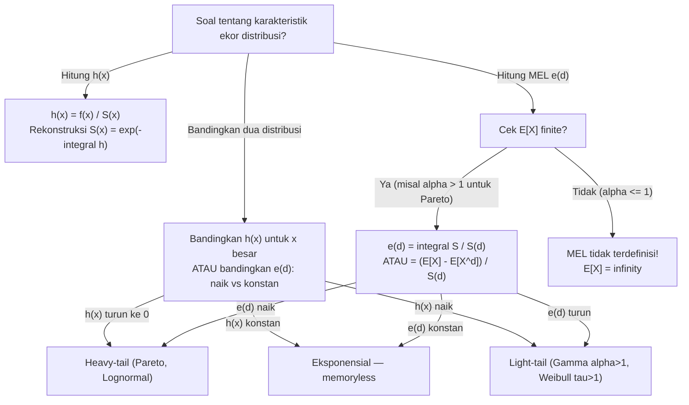

# 📊 1.4 — Tail Characteristics

> [!ABSTRACT] Ringkasan Cepat
> **Topik:** Tail Characteristics | **Bobot:** ~5–10% | **Difficulty:** Hard
> **Ref:** Klugman et al. (2019) Loss Models 5th ed., Bab 3–5 | **Prereq:** [[1.1 Moment and Probability Generating Functions]], [[1.2 Distribution Classes and Extreme Value]]

## Section 0 — Pemetaan Topik

| Topik TA2 | Sub-topik ID | Skill Diuji | Bobot | Difficulty | Prerequisite | Connected Topics | Referensi |
|---|---|---|---|---|---|---|---|
| Model Besar Klaim | 1.4 | Menghitung dan menginterpretasikan momen, rasio momen, limiting tail behaviour, hazard rate, dan mean excess loss function; membandingkan dua distribusi berdasarkan berat ekor | 5–10% | Hard | [[1.1 Moment and Probability Generating Functions]], [[1.2 Distribution Classes and Extreme Value]], [[1.3 Techniques for Creating New Distributions]] | [[3.1 Coverage Modifications on Severity and Frequency]], [[3.2 Loss Elimination Ratio and Inflation]], [[5.2 VaR and TVaR]] | KPW (2019) Bab 3–5 |

## Section 1 — Intuisi

Bayangkan sebuah perusahaan reasuransi sedang mengevaluasi dua portofolio asuransi properti di Indonesia — satu dari wilayah Jakarta Pusat dengan profil klaim yang relatif stabil, dan satu lagi dari kawasan industri di pesisir Cilegon yang rentan terhadap klaim besar akibat bencana. Secara rata-rata, kedua portofolio mungkin memiliki ekspektasi klaim yang serupa. Namun bagi reasuradur, yang jauh lebih penting adalah apa yang terjadi di *ekor* distribusi — seberapa sering dan seberapa besar klaim-klaim ekstrem yang bisa terjadi? Inilah yang dijawab oleh karakteristik ekor (*tail characteristics*).

Konsep pertama adalah *hazard rate* (atau *failure rate*). Fungsi ini menjawab pertanyaan: "Jika sebuah klaim sudah mencapai nilai $x$, seberapa cepat peluang terjadinya klaim yang *lebih* besar dari $x$ menurun?" Distribusi dengan hazard rate yang *menurun* artinya makin besar klaim yang sudah terjadi, makin besar pula kemungkinan klaim akan terus bertumbuh — inilah tanda distribusi heavy-tail yang berbahaya. Sebaliknya, hazard rate yang meningkat mengindikasikan distribusi light-tail yang "aman". Distribusi Eksponensial adalah kasus unik dengan hazard rate konstan, mencerminkan sifat memoryless-nya.

Konsep kedua yang sangat praktis di aktuaria adalah *mean excess loss function* (MEL), yang menjawab: "Jika sebuah klaim sudah diketahui melebihi deductible sebesar $d$, berapa ekspektasi *kelebihan* klaim di atas $d$ itu?" Fungsi ini secara langsung terhubung dengan penetapan premi reasuransi *excess-of-loss*. Jika MEL suatu distribusi *naik* seiring $d$, distribusi tersebut heavy-tailed — semakin besar deductible yang diterapkan, semakin besar pula ekspektasi kelebihan yang harus ditanggung reasuradur. Memahami karakteristik ekor bukan hanya soal akademis; ia adalah kompas yang digunakan aktuaris untuk menentukan berapa premi layak dikenakan untuk perlindungan terhadap risiko katastrofi.

## Section 2 — Definisi Formal

> [!NOTE] Definisi Matematis — Lima Karakteristik Ekor
>
> Misalkan $X$ adalah variabel acak kontinu non-negatif dengan PDF $f(x)$, CDF $F(x)$, dan survival function $S(x) = 1 - F(x)$.
>
> **Hazard Rate (Force of Mortality / Failure Rate):**
>
> $$h(x) = \frac{f(x)}{S(x)} = \frac{f(x)}{1 - F(x)}, \quad x > 0$$
>
> **Mean Excess Loss Function (MEL):**
>
> $$e(d) = E[X - d \mid X > d] = \frac{\int_d^\infty S(x)\, dx}{S(d)}, \quad d \geq 0$$
>
> **Limited Expected Value (LEV):**
>
> $$E[X \wedge u] = \int_0^u S(x)\, dx = \int_0^u [1 - F(x)]\, dx$$

| Simbol | Makna | Catatan |
|---|---|---|
| $S(x)$ | Survival function: $P(X > x)$ | $S(x) = 1 - F(x)$; selalu monotone turun |
| $h(x)$ | Hazard rate / force of mortality | $h(x) \geq 0$; mengukur laju "kepunahan" distribusi |
| $H(x)$ | Cumulative hazard function | $H(x) = \int_0^x h(t)\, dt = -\ln S(x)$ |
| $e(d)$ | Mean excess loss function di $d$ | Ekspektasi kelebihan klaim di atas threshold $d$ |
| $e(0)$ | Mean excess loss di $d=0$ | $e(0) = E[X]$ — mean unconditional |
| $E[X \wedge u]$ | Limited Expected Value (LEV) | Ekspektasi $X$ yang di-cap pada nilai $u$ |
| $\mu_k'$ | Raw moment ke-$k$ | $E[X^k] = \int_0^\infty k x^{k-1} S(x)\, dx$ |
| $CV$ | Coefficient of Variation | $CV = \sigma / \mu$; ukuran dispersi relatif |
| $\gamma_1$ | Skewness (momen ke-3 yang distandarisasi) | $\gamma_1 = \mu_3' / \sigma^3$; positif = right-skewed |

### Rumus Utama

**Hubungan fundamental: hazard rate ↔ survival function:**

$$S(x) = \exp\!\left(-\int_0^x h(t)\, dt\right) = e^{-H(x)}$$

*Label: Jika diketahui $h(x)$, distribusi sepenuhnya ditentukan — ini adalah representasi alternatif yang ekuivalen.*

**PDF dari hazard rate:**

$$f(x) = h(x) \cdot S(x) = h(x)\, e^{-H(x)}$$

*Label: Berguna untuk mengidentifikasi distribusi dari bentuk hazard rate yang diberikan.*

**Momen via survival function (alternatif integrasi langsung):**

$$E[X^k] = \int_0^\infty k x^{k-1} S(x)\, dx$$

*Label: Seringkali lebih mudah dihitung daripada $\int_0^\infty x^k f(x)\, dx$, khususnya untuk distribusi heavy-tail.*

**Mean excess loss function — bentuk integral:**

$$e(d) = \frac{\int_d^\infty S(x)\, dx}{S(d)} = \frac{E[X] - E[X \wedge d]}{S(d)}$$

*Label: Hubungan MEL dengan LEV sangat penting — soal sering memberikan $E[X \wedge d]$ dan meminta $e(d)$.*

**Hubungan MEL dengan mean unconditional:**

$$e(0) = E[X] = \int_0^\infty S(x)\, dx$$

*Label: Kasus khusus $d=0$: MEL di threshold nol adalah mean distribusi.*

**Rasio momen (moment ratio) ke-$k$:**

$$\frac{E[X^k]}{(E[X])^k}$$

*Label: Digunakan untuk membandingkan berat ekor dua distribusi dengan mean yang berbeda; rasio lebih besar = ekor lebih berat.*

**Hazard rate distribusi-distribusi penting:**

| Distribusi | Hazard Rate $h(x)$ | Sifat Ekor |
|---|---|---|
| Eksponensial$(\theta)$ | $1/\theta$ (konstan) | Memoryless; benchmark light-tail |
| Weibull$(\tau, \theta)$ | $(\tau/\theta)(x/\theta)^{\tau-1}$ | $\tau > 1$: naik (light-tail); $\tau < 1$: turun (heavy-tail) |
| Gamma$(\alpha, \theta)$ | Meningkat ke $1/\theta$ | Light-tail untuk $\alpha > 1$; mendekati Eksponensial |
| Pareto$(\alpha, \theta)$ | $\alpha/(x + \theta)$ | Selalu menurun — **heavy-tail kanonik** |
| Lognormal$(\mu, \sigma^2)$ | Berbentuk unimodal, lalu turun | Heavy-tail (ekor lebih berat dari Eksponensial) |

**MEL distribusi-distribusi penting:**

| Distribusi | MEL $e(d)$ | Sifat MEL |
|---|---|---|
| Eksponensial$(\theta)$ | $\theta$ (konstan) | Memoryless: MEL tidak bergantung $d$ |
| Pareto$(\alpha, \theta)$ | $(d + \theta)/(\alpha - 1)$ | **Naik linear** — bukti heavy-tail |
| Gamma$(\alpha, \theta)$ | Menurun ke $\theta$ | Light-tail: semakin besar $d$, MEL mendekati $\theta$ |

### Asumsi Eksplisit

1. $X$ adalah variabel acak kontinu non-negatif dengan $F(0) = 0$.
2. $S(d) > 0$ untuk semua $d$ dalam domain yang relevan (agar MEL terdefinisi).
3. MEL $e(d)$ terdefinisi hanya jika $E[X] < \infty$ — distribusi yang tidak memiliki momen pertama tidak memiliki MEL yang bermakna.
4. Untuk *limiting tail behaviour*, perbandingan dilakukan pada $x \to \infty$ — rasio $S_1(x)/S_2(x)$ atau perbandingan $h_1(x)$ vs $h_2(x)$.
5. Distribusi dikatakan heavy-tailed relatif satu sama lain — "berat" dan "ringan" adalah konsep komparatif, bukan absolut.

## Section 3 — Jembatan Logika

> [!TIP] Dari Definisi ke Rumus — Tiga Cara Membaca Ekor
>
> Ada tiga "lensa" yang saling melengkapi untuk mengkarakterisasi ekor distribusi:
>
> **Lensa 1 — Hazard rate $h(x)$:** Melihat laju "peluruhan" distribusi secara lokal di titik $x$. Analoginya: seberapa cepat intensitas hujan melemah ketika curah hujan sudah mencapai tingkat $x$? Hazard rate menurun berarti distribusi "semakin lambat melemah" — tanda heavy-tail.
>
> **Lensa 2 — MEL $e(d)$:** Melihat ekspektasi kelebihan, kondisional pada sudah melampaui $d$. Analoginya: "klaim sudah melebihi Rp500 juta — berapa lagi yang harus kita cadangkan?" MEL yang naik berarti semakin besar threshold, semakin besar ekspektasi tambahan — juga tanda heavy-tail.
>
> **Lensa 3 — Limiting tail behaviour:** Membandingkan survival function dua distribusi saat $x \to \infty$. Jika $S_1(x)/S_2(x) \to \infty$, distribusi 1 jauh lebih heavy-tailed. Eksponensial memiliki ekor seperti $e^{-x/\theta}$, sedangkan Pareto seperti $x^{-\alpha}$ — untuk $x$ besar, $x^{-\alpha}$ jauh lebih besar dari $e^{-x/\theta}$, sehingga Pareto selalu heavy-tailed relatif terhadap Eksponensial.

> [!IMPORTANT] Support dan Domain
>
> - Hazard rate $h(x)$ terdefinisi hanya di mana $S(x) > 0$. Untuk distribusi dengan support $(0, \omega)$ terbatas (seperti Uniform), $h(x) \to \infty$ saat $x \to \omega^-$.
> - MEL $e(d)$ terdefinisi hanya jika $S(d) > 0$ **dan** $E[X] < \infty$. Distribusi Pareto dengan $\alpha \leq 1$ tidak memiliki $E[X]$ yang finite — MEL tidak terdefinisi!
> - Untuk *limiting tail comparison*: selalu bandingkan survival function (bukan PDF) saat $x \to \infty$ — perbandingan PDF bisa menyesatkan karena PDF bisa kecil di ekor tapi integral-nya (yaitu probabilitas ekor) masih besar.

**Derivasi: Rumus MEL via Integrasi by Parts**

Ini adalah derivasi paling sering diuji — menunjukkan mengapa $e(d) = \frac{\int_d^\infty S(x)\, dx}{S(d)}$.

Langkah 1 — Definisi ekspektasi bersyarat:

$$e(d) = E[X - d \mid X > d] = \frac{E[(X-d)\,\mathbf{1}_{X>d}]}{P(X > d)} = \frac{\int_d^\infty (x-d)\, f(x)\, dx}{S(d)}$$

Langkah 2 — Fokus pada pembilang; substitusi $u = x - d$, $du = dx$:

$$\int_d^\infty (x-d)\, f(x)\, dx = \int_0^\infty u\, f(u+d)\, du$$

Langkah 3 — Integrasi by parts pada pembilang asli: $u_{\text{parts}} = x - d$, $dv = f(x)\,dx$:

$$\int_d^\infty (x-d)\, f(x)\, dx = \Big[(x-d)(-S(x))\Big]_d^\infty + \int_d^\infty S(x)\, dx$$

Langkah 4 — Evaluasi batas: jika momen pertama finite, maka $(x-d)S(x) \to 0$ saat $x \to \infty$ (distribusi tidak memiliki massa di $\infty$), dan di $x = d$: $(d-d)S(d) = 0$. Sehingga suku pertama gugur:

$$\int_d^\infty (x-d)\, f(x)\, dx = \int_d^\infty S(x)\, dx$$

Langkah 5 — Bagi dengan $S(d)$:

$$e(d) = \frac{\int_d^\infty S(x)\, dx}{S(d)}$$

∎ Inilah bentuk yang paling berguna secara komputasi.

**Derivasi: MEL Pareto dan Sifat Heavy-Tail-nya**

Misalkan $X \sim \text{Pareto}(\alpha, \theta)$ dengan $S(x) = \left(\frac{\theta}{\theta + x}\right)^\alpha$.

Langkah 1 — Hitung $\int_d^\infty S(x)\, dx$:

$$\int_d^\infty \left(\frac{\theta}{\theta+x}\right)^\alpha dx$$

Substitusi $t = \theta + x$, $dt = dx$, batas $t: \theta+d \to \infty$:

$$= \theta^\alpha \int_{\theta+d}^\infty t^{-\alpha}\, dt = \theta^\alpha \cdot \frac{t^{-\alpha+1}}{-\alpha+1}\Bigg|_{\theta+d}^\infty = \frac{\theta^\alpha (\theta+d)^{1-\alpha}}{\alpha - 1} \quad (\alpha > 1)$$

Langkah 2 — Hitung $S(d)$:

$$S(d) = \left(\frac{\theta}{\theta+d}\right)^\alpha$$

Langkah 3 — Bagi:

$$e(d) = \frac{\theta^\alpha (\theta+d)^{1-\alpha}/(\alpha-1)}{\theta^\alpha (\theta+d)^{-\alpha}} = \frac{(\theta+d)^{1-\alpha}}{(\alpha-1)(\theta+d)^{-\alpha}} = \frac{\theta + d}{\alpha - 1}$$

Kesimpulan: $e(d) = \frac{d + \theta}{\alpha - 1}$ adalah fungsi linear **naik** dalam $d$ — ini adalah *bukti formal* bahwa Pareto heavy-tailed. Semakin besar deductible, semakin besar ekspektasi kelebihan yang harus dibayar reasuradur.

> [!DANGER] Dilarang
>
> 1. **Jangan menghitung $e(d)$ dengan formula Pareto untuk $\alpha \leq 1$** — MEL tidak terdefinisi karena $E[X] = \infty$ untuk $\alpha \leq 1$. Ini bukan hanya kesalahan teknis; secara aktuaria artinya distribusi tersebut tidak dapat di-insurance-kan dengan cara konvensional.
> 2. **Jangan membandingkan berat ekor hanya dari nilai PDF** — PDF distribusi heavy-tail bisa sangat kecil di titik tertentu namun memiliki probabilitas ekor yang jauh lebih besar daripada distribusi light-tail. Selalu gunakan survival function $S(x)$, hazard rate $h(x)$, atau MEL $e(d)$ untuk perbandingan ekor.
> 3. **Jangan gunakan formula $e(d) = \frac{E[X] - E[X \wedge d]}{S(d)}$ tanpa menghitung $E[X \wedge d]$ terlebih dahulu** — LEV $E[X \wedge d]$ memerlukan perhitungan tersendiri; jangan substitusi $E[X \wedge d] = d \cdot F(d)$ (ini salah kecuali $X$ deterministik).

## Section 4 — Contoh Soal

### Soal A — Fundamental

Variabel acak $X \sim \text{Eksponensial}(\theta = 2000)$ merepresentasikan besar klaim asuransi kendaraan (dalam ribuan rupiah). Hitung: (a) hazard rate $h(x)$, (b) MEL $e(d)$ untuk $d = 3000$, dan (c) interpretasikan hasil secara aktuaria.

> [!SUCCESS] Solusi Soal A
>
> **Pendekatan:** Gunakan formula langsung hazard rate dan MEL untuk distribusi Eksponensial. Sifat memoryless akan terkonfirmasi.
>
> **1. Identifikasi Variabel**
> - $X \sim \text{Eksponensial}(\theta = 2000)$
> - $f(x) = \frac{1}{2000} e^{-x/2000}$
> - $S(x) = e^{-x/2000}$
> - $d = 3000$
>
> **2. Identifikasi Distribusi / Model**
> Eksponensial adalah distribusi memoryless benchmark — hazard rate konstan dan MEL konstan. Distribusi ini sering digunakan sebagai distribusi klaim dasar sebelum dilakukan pemilihan model yang lebih kompleks.
>
> **3. Setup Persamaan**
>
> $$h(x) = \frac{f(x)}{S(x)}, \qquad e(d) = \frac{\int_d^\infty S(x)\,dx}{S(d)}$$
>
> **4. Eksekusi Aljabar**
>
> (a) Hazard rate:
>
> $$h(x) = \frac{\frac{1}{2000}e^{-x/2000}}{e^{-x/2000}} = \frac{1}{2000}$$
>
> Konstan untuk semua $x > 0$ — tidak bergantung pada $x$.
>
> (b) MEL dengan formula integral:
>
> $$\int_{3000}^\infty e^{-x/2000}\, dx = \Big[-2000\, e^{-x/2000}\Big]_{3000}^\infty = 2000\, e^{-3000/2000} = 2000\, e^{-1.5}$$
>
> $$S(3000) = e^{-3000/2000} = e^{-1.5}$$
>
> $$e(3000) = \frac{2000\, e^{-1.5}}{e^{-1.5}} = 2000$$
>
> **5. Verification**
> $e(d) = \theta = 2000$ untuk semua $d$ — ini membuktikan sifat memoryless: apapun threshold deductible yang diterapkan, ekspektasi kelebihan klaim selalu sama dengan mean distribusi. Juga: $e(0) = E[X] = 2000$ ✓.
>
> **Hasil:** $h(x) = 1/2000$ (konstan), $e(3000) = 2000$. Interpretasi aktuaria: meskipun deductible Rp3 juta diterapkan, reasuradur masih menghadapi ekspektasi klaim tambahan Rp2 juta — sama persis seperti tanpa deductible. Ini mencerminkan sifat memoryless Eksponensial.

> [!WARNING] Exam Tips — Soal A
> **Target waktu:** 2–3 menit. **Common trap:** Beberapa kandidat mencoba menghitung $E[X - d \mid X > d]$ langsung dari definisi bersyarat — ini benar tapi lebih panjang. Gunakan formula $e(d) = \int_d^\infty S(x)\,dx / S(d)$ yang lebih efisien. **Shortcut:** Untuk Eksponensial, langsung tulis $h(x) = 1/\theta$ dan $e(d) = \theta$ tanpa perhitungan — ini adalah fakta yang wajib dihafal.

---

### Soal B — Exam-Typical

Distribusi klaim $X \sim \text{Pareto}(\alpha = 3, \theta = 6000)$. Sebuah polis memiliki deductible biasa $d = 2000$. Hitung: (a) MEL $e(2000)$, (b) $E[X \wedge 2000]$ (LEV), dan (c) verifikasi hubungan $e(d) = \frac{E[X] - E[X \wedge d]}{S(d)}$.

> [!SUCCESS] Solusi Soal B
>
> **Pendekatan:** Gunakan formula MEL Pareto untuk (a), hitung LEV dari definisi untuk (b), lalu verifikasi konsistensi keduanya.
>
> **1. Identifikasi Variabel**
> - $X \sim \text{Pareto}(\alpha = 3, \theta = 6000)$; $\alpha > 1$ sehingga $E[X]$ finite ✓
> - $S(x) = \left(\frac{6000}{6000+x}\right)^3$
> - $E[X] = \frac{\theta}{\alpha - 1} = \frac{6000}{2} = 3000$
> - $d = 2000$
>
> **2. Identifikasi Distribusi / Model**
> Pareto adalah distribusi heavy-tail kanonik. MEL-nya naik linear — makin besar deductible, makin besar ekspektasi kelebihan. Ini berbanding terbalik dengan Eksponensial (MEL konstan).
>
> **3. Setup Persamaan**
>
> $$e(d) = \frac{d + \theta}{\alpha - 1}, \qquad E[X \wedge u] = \frac{\theta}{\alpha-1}\left[1 - \left(\frac{\theta}{\theta+u}\right)^{\alpha-1}\right]$$
>
> $$e(d) = \frac{E[X] - E[X \wedge d]}{S(d)}$$
>
> **4. Eksekusi Aljabar**
>
> (a) MEL Pareto:
>
> $$e(2000) = \frac{2000 + 6000}{3 - 1} = \frac{8000}{2} = 4000$$
>
> (b) LEV Pareto pada $u = 2000$:
>
> $$E[X \wedge 2000] = \frac{6000}{2}\left[1 - \left(\frac{6000}{8000}\right)^{2}\right] = 3000\left[1 - \left(\frac{3}{4}\right)^2\right] = 3000\left[1 - \frac{9}{16}\right] = 3000 \times \frac{7}{16} = 1312.5$$
>
> (c) Verifikasi hubungan:
>
> $$S(2000) = \left(\frac{6000}{8000}\right)^3 = \left(\frac{3}{4}\right)^3 = \frac{27}{64}$$
>
> $$\frac{E[X] - E[X \wedge 2000]}{S(2000)} = \frac{3000 - 1312.5}{27/64} = \frac{1687.5}{\,27/64\,} = 1687.5 \times \frac{64}{27} = \frac{108000}{27} = 4000 \checkmark$$
>
> **5. Verification**
> $e(2000) = 4000 > E[X] = 3000$: MEL melebihi mean unconditional — ini adalah bukti heavy-tail. Untuk Eksponensial, $e(d) = E[X]$ selalu; untuk Pareto, $e(d) > E[X]$ segera saat $d > 0$.
>
> **Hasil:** $e(2000) = 4000$, $E[X \wedge 2000] = 1312.5$, keduanya konsisten via hubungan LEV–MEL.

> [!WARNING] Exam Tips — Soal B
> **Target waktu:** 4–5 menit. **Common trap:** Formula LEV Pareto sering disalahtulis — perhatikan bahwa eksponen di LEV adalah $\alpha - 1$, bukan $\alpha$. **Shortcut:** Hafal formula LEV Pareto: $E[X \wedge u] = \frac{\theta}{\alpha-1}\!\left[1 - \left(\frac{\theta}{\theta+u}\right)^{\alpha-1}\right]$. Ini muncul sangat sering di soal modifikasi coverage (Topik 3).

---

### Soal C — Challenging

Dua model sedang dibandingkan untuk distribusi klaim asuransi kebakaran: **Model A** adalah $X_A \sim \text{Pareto}(\alpha = 4, \theta = 9000)$ dan **Model B** adalah $X_B \sim \text{Eksponensial}(\theta = 3000)$. Keduanya memiliki mean yang sama. Bandingkan: (a) hazard rate kedua model untuk $x$ besar, (b) MEL $e(d)$ untuk $d = 0, 3000, 9000$, dan (c) tentukan model mana yang lebih konservatif untuk penetapan premi reasuransi *excess-of-loss* dengan attachment point $d = 9000$.

> [!SUCCESS] Solusi Soal C
>
> **Pendekatan:** Bandingkan hazard rate dan MEL secara sistematis; gunakan perilaku ekor untuk menarik kesimpulan aktuaria.
>
> **1. Identifikasi Variabel**
> - Model A: $X_A \sim \text{Pareto}(4, 9000)$; $E[X_A] = 9000/(4-1) = 3000$
> - Model B: $X_B \sim \text{Eksponensial}(3000)$; $E[X_B] = 3000$
> - Kedua model memiliki mean $= 3000$ ✓ — perbandingan fair
> - Attachment point reasuransi: $d = 9000$
>
> **2. Identifikasi Distribusi / Model**
> Pareto: heavy-tail, hazard rate menurun. Eksponensial: light-tail (memoryless), hazard rate konstan. Dengan mean sama, perbedaan sepenuhnya terletak pada perilaku ekor. Ini adalah soal perbandingan ekor klasik.
>
> **3. Setup Persamaan**
>
> Hazard rate:
>
> $$h_A(x) = \frac{\alpha}{\theta + x} = \frac{4}{9000 + x}, \qquad h_B(x) = \frac{1}{3000}$$
>
> MEL:
>
> $$e_A(d) = \frac{d + 9000}{3}, \qquad e_B(d) = 3000$$
>
> **4. Eksekusi Aljabar**
>
> (a) Perbandingan hazard rate:
>
> Titik persilangan: $h_A(x) = h_B(x)$ saat $\frac{4}{9000+x} = \frac{1}{3000}$, yaitu $x = 3000$.
>
> - Untuk $x < 3000$: $h_A(x) > h_B(x)$ — Pareto memiliki hazard rate *lebih tinggi* (lebih "aman") di ekor kiri
> - Untuk $x > 3000$: $h_A(x) < h_B(x)$ — Pareto memiliki hazard rate *lebih rendah* (ekor kanan lebih berat)
>
> Untuk $x$ besar: $h_A(x) \approx \frac{4}{x} \to 0$, sedangkan $h_B(x) = 1/3000$ tetap konstan. Pareto semakin lambat "punah" — bukti heavy-tail.
>
> (b) Tabel MEL:
>
> | $d$ | $e_A(d)$ | $e_B(d)$ | Selisih $e_A - e_B$ |
> |---|---|---|---|
> | $0$ | $9000/3 = 3000$ | $3000$ | $0$ |
> | $3000$ | $12000/3 = 4000$ | $3000$ | $+1000$ |
> | $9000$ | $18000/3 = 6000$ | $3000$ | $+3000$ |
>
> (c) Premi reasuransi excess-of-loss di $d = 9000$:
>
> Premi reasuransi proporsional dengan $e(d) \times S(d)$ (ekspektasi klaim yang ditanggung reasuradur):
>
> $$S_A(9000) = \left(\frac{9000}{18000}\right)^4 = \left(\frac{1}{2}\right)^4 = \frac{1}{16} = 0.0625$$
>
> $$S_B(9000) = e^{-9000/3000} = e^{-3} \approx 0.0498$$
>
> Ekspektasi klaim reasuransi $= e(d) \times S(d)$:
>
> $$\text{Model A: } 6000 \times 0.0625 = 375$$
>
> $$\text{Model B: } 3000 \times 0.0498 \approx 149.4$$
>
> **5. Verification**
> Model A menghasilkan ekspektasi klaim reasuransi $\approx 2.5\times$ lebih besar dari Model B meskipun mean sama. Ini mengkonfirmasi bahwa Pareto jauh lebih berbahaya dari perspektif reasuransi. Fakta bahwa $e_A(d)$ naik sementara $e_B(d)$ konstan adalah tanda definitif perbedaan berat ekor.
>
> **Hasil:** Model A (Pareto) secara signifikan lebih heavy-tailed — hazard rate menurun ke nol sementara Eksponensial konstan. MEL Pareto di $d = 9000$ adalah 6000 vs 3000 untuk Eksponensial. Model A menghasilkan ekspektasi klaim reasuransi 2.5× lebih besar — **Model A lebih konservatif** untuk penetapan premi reasuransi.

> [!WARNING] Exam Tips — Soal C
> **Target waktu:** 5–6 menit. **Common trap:** Menyimpulkan bahwa model dengan mean sama pasti "setara" untuk tujuan reasuransi — ini salah! Distribusi dengan mean sama bisa sangat berbeda perilaku ekornya. **Shortcut:** Untuk membandingkan dua distribusi: (1) cek apakah MEL naik atau turun/konstan, dan (2) bandingkan hazard rate di $x$ besar. Kedua tes ini sudah cukup untuk menentukan distribusi mana yang heavy-tailed.

## Section 5 — Verifikasi & Sanity Check

> [!CHECK] Cross-check MEL dengan Mean
>
> Selalu verifikasi bahwa $e(0) = E[X]$:
>
> $$e(0) = \frac{\int_0^\infty S(x)\, dx}{S(0)} = \frac{E[X]}{1} = E[X]$$
>
> Jika $e(0) \neq E[X]$ dari formula yang digunakan, ada kesalahan dalam derivasi MEL. Ini adalah sanity check paling cepat dan paling wajib dilakukan.

> [!CHECK] Cross-check Hazard Rate via Survival Function
>
> Jika hazard rate $h(x)$ telah dihitung, verifikasi via:
>
> $$S(x) = \exp\!\left(-\int_0^x h(t)\, dt\right)$$
>
> Misal: jika $h(x) = c$ (konstan), maka $S(x) = e^{-cx}$ — ini adalah Eksponensial dengan mean $1/c$. Jika $h(x) = \tau x^{\tau-1}/\theta^\tau$, maka $S(x) = e^{-(x/\theta)^\tau}$ — ini adalah Weibull. Jika hasil rekonstruksi $S(x)$ tidak cocok dengan $S(x)$ yang diberikan, ada kesalahan dalam $h(x)$.

### Metode Alternatif

Untuk menghitung $E[X^k]$ distribusi heavy-tail, formula alternatif via survival function seringkali lebih mudah:

$$E[X^k] = \int_0^\infty k x^{k-1} S(x)\, dx$$

Khususnya untuk Pareto$(\alpha, \theta)$ dengan $\alpha > k$:

$$E[X^k] = \frac{k!\, \theta^k}{\prod_{j=1}^{k}(\alpha - j)} = \frac{\theta^k \Gamma(\alpha - k) \Gamma(k+1)}{\Gamma(\alpha)}$$

Untuk $k=1$: $E[X] = \theta/(\alpha-1)$. Untuk $k=2$: $E[X^2] = 2\theta^2/((\alpha-1)(\alpha-2))$.

## Section 6 — Visualisasi Mental

**Diagram perbandingan hazard rate empat distribusi:**

```
h(x)
  ↑
  |  Weibull (τ>1) — naik
  |       /
  |      /
  |-----/------------- Eksponensial — konstan (1/θ)
  |    /  \
  |   /    \
  |  /      Gamma (α>1) — naik menuju 1/θ
  | /         \_______________
  |/                          ──── Pareto — turun ke 0
  +----------------------------------→ x
  0           x*
               ↑
          titik silang Pareto & Eksponensial
```

**Diagram perbandingan MEL tiga distribusi:**

```
e(d)
  ↑
  |                      / Pareto — naik linear
  |                    /
  |                  /
  |----------------/-------------- Eksponensial — konstan
  |               /
  |              /   Gamma — turun menuju θ
  |             /  \___________
  |            /
  +----------------------------------→ d
  0         E[X]
             ↑
         e(0) = E[X] untuk semua distribusi
```

**Interpretasi visual:**
- Titik awal semua kurva MEL: $e(0) = E[X]$ — semuanya mulai dari mean
- Pareto: kemiringan positif — setiap kenaikan threshold menambah ekspektasi kelebihan
- Eksponensial: garis horizontal — memoryless property secara visual
- Gamma: kurva menurun menuju $\theta$ — distribusi "terkendali" untuk klaim besar

### Hubungan Visual ↔ Rumus

| Elemen Visual | Komponen Rumus |
|---|---|
| Kurva hazard rate menurun | $h'(x) < 0$ ↔ distribusi heavy-tailed |
| Kurva MEL naik | $e'(d) > 0$ ↔ distribusi heavy-tailed |
| Titik awal MEL di $E[X]$ | $e(0) = E[X] = \int_0^\infty S(x)\,dx$ |
| Kemiringan MEL Pareto $= 1/(\alpha-1)$ | $\frac{d}{dd}e_{\text{Pareto}}(d) = \frac{1}{\alpha-1}$ |
| Area bawah survival function | $\int_0^\infty S(x)\,dx = E[X]$ |

## Section 7 — Jebakan Umum

> [!BUG] Kesalahan Parametrisasi
>
> - **LEV Pareto:** Formula $E[X \wedge u] = \frac{\theta}{\alpha-1}\!\left[1 - \left(\frac{\theta}{\theta+u}\right)^{\alpha-1}\right]$ berlaku untuk parameterisasi KPW. Beberapa sumber menggunakan Pareto dengan parameterisasi berbeda (misal Pareto Tipe II / Lomax), menghasilkan formula berbeda. Selalu verifikasi dengan $E[X \wedge \infty] = E[X] = \theta/(\alpha-1)$.
> - **Weibull hazard rate:** $h(x) = \frac{\tau}{\theta}\left(\frac{x}{\theta}\right)^{\tau-1}$ dalam parameterisasi KPW. Parameterisasi lain menggunakan $\lambda = \theta^{-\tau}$ — hasilnya berbeda. Cek: $h(1) = \tau/\theta$ vs $h(1) = \lambda\tau$.

> [!BUG] Kesalahan Konseptual
>
> 1. **Heavy-tail ≠ large mean:** Distribusi bisa memiliki mean kecil tapi ekor sangat berat (atau sebaliknya). Sifat heavy-tail sepenuhnya ditentukan oleh *bentuk* ekor (hazard rate, MEL), bukan magnitude mean.
> 2. **MEL undefined untuk $\alpha \leq 1$:** Untuk Pareto$(\alpha \leq 1, \theta)$, $E[X] = \infty$, sehingga $e(d)$ tidak terdefinisi. Jangan serta-merta menghitung $e(d) = (d+\theta)/(\alpha-1)$ tanpa verifikasi $\alpha > 1$.
> 3. **Hazard rate menurun ≠ distribusi tidak berguna:** Meskipun hazard rate menurun mengindikasikan heavy-tail (yang lebih "berisiko"), distribusi ini tetap digunakan luas dalam aktuaria — justru karena lebih realistis untuk data klaim ekstrem.
> 4. **Salah arah implikasi MEL:** MEL naik → heavy-tail (benar). Tetapi bukan: heavy-tail → MEL selalu ada (salah — perlu $E[X] < \infty$).

> [!BUG] Kesalahan Interpretasi Soal
>
> - *"Tentukan apakah distribusi A lebih heavy-tailed dari B"* → jangan hanya bandingkan mean atau variansi. Gunakan (1) perbandingan $h(x)$ untuk $x$ besar, atau (2) apakah MEL naik/turun/konstan, atau (3) rasio $S_A(x)/S_B(x)$ saat $x \to \infty$.
> - *"Hitung MEL pada $d$"* → pastikan hitung $S(d)$ secara eksplisit, bukan asumsi $S(d) = 1$. Ini kesalahan umum ketika $d$ besar.
> - *"Distribusi dengan hazard rate konstan"* → ini **hanya** Eksponensial (di antara distribusi kontinu positif umum). Jangan asumsikan distribusi lain bisa memiliki hazard rate konstan.

> [!CAUTION] Red Flags
>
> - Soal menyebut **"excess-of-loss reinsurance"** atau **"deductible"** → MEL $e(d)$ hampir pasti digunakan; lihat juga [[3.1 Coverage Modifications on Severity and Frequency]]
> - Soal meminta **"membandingkan dua distribusi"** tanpa spesifikasi ukuran → kemungkinan besar meminta perbandingan berat ekor via hazard rate atau MEL
> - Soal menyebut **$\alpha \leq 1$ untuk Pareto** → peringatan: $E[X]$ tidak finite, MEL tidak terdefinisi, banyak operasi standar gagal
> - Soal memberikan **$h(x)$ dan meminta distribusi** → rekonstruksi $S(x) = e^{-\int h(t)\,dt}$, kemudian $f(x) = h(x) S(x)$; kenali bentuk distribusi dari hasil $S(x)$
> - Soal menyebut **"limiting tail behaviour"** atau **"ekor distribusi untuk $x$ besar"** → perbandingan $S(x)$ saat $x \to \infty$; untuk Pareto $S(x) \sim x^{-\alpha}$ (power decay), untuk Eksponensial $S(x) \sim e^{-x/\theta}$ (exponential decay) — power decay selalu lebih lambat

## Section 8 — Ringkasan Eksekutif

> [!SUMMARY] Must-Remember
>
> 1. **Hazard rate dan survival function saling menentukan:**
>
> $$h(x) = \frac{f(x)}{S(x)}, \qquad S(x) = \exp\!\left(-\int_0^x h(t)\,dt\right)$$
>
> 2. **MEL via survival function (bentuk paling berguna):**
>
> $$e(d) = \frac{\int_d^\infty S(x)\,dx}{S(d)} = \frac{E[X] - E[X \wedge d]}{S(d)}$$
>
> 3. **Titik awal MEL selalu mean:**
>
> $$e(0) = E[X]$$
>
> 4. **Dua tanda definitif heavy-tail:**
>
> $$h(x) \text{ menurun (atau } h(x) \to 0) \iff \text{heavy-tail}$$
>
> $$e(d) \text{ naik seiring } d \iff \text{heavy-tail}$$
>
> 5. **Formula hafalan kritis:**
>
> $$e_{\text{Eksponensial}}(d) = \theta \quad \text{(konstan)}, \qquad e_{\text{Pareto}}(d) = \frac{d + \theta}{\alpha - 1} \quad \text{(naik linear)}$$

### Kapan Digunakan

- Soal meminta "karakterisasi ekor", "perbandingan distribusi", atau "sifat distribusi" → gunakan hazard rate dan/atau MEL
- Soal menyebut "excess-of-loss" atau "deductible" dan meminta ekspektasi kelebihan klaim → langsung gunakan $e(d)$
- Soal memberikan $h(x)$ dan meminta PDF/CDF → rekonstruksi via $S(x) = e^{-\int h}$
- Soal meminta momen via survival function sebagai metode alternatif → gunakan $E[X^k] = \int_0^\infty k x^{k-1} S(x)\,dx$

### Kapan TIDAK Boleh Digunakan

- MEL $e(d)$ **tidak terdefinisi** jika $E[X] = \infty$ — selalu cek $\alpha > 1$ untuk Pareto, dan $\alpha > 0$ untuk Gamma
- Hazard rate tidak dapat dibandingkan langsung antar distribusi tanpa memperhatikan domain — pastikan keduanya dievaluasi pada $x$ yang sama
- Jangan gunakan "mean sama = ekor sama" sebagai argumen — mean hanya menangkap sentral distribusi, bukan perilaku ekornya

### Quick Decision Tree



---

> [!QUOTE] Follow-up Options
> 1. *"Berikan contoh soal variasi MEL untuk distribusi Gamma dengan perbandingan Eksponensial"*
> 2. *"Jelaskan hubungan [[1.4 Tail Characteristics]] dengan [[3.2 Loss Elimination Ratio and Inflation]]"*
> 3. *"Buat flashcard 1-halaman: hazard rate dan MEL untuk lima distribusi penting TA2"*

*📖 Ref: Klugman, Panjer & Willmot (2019) Loss Models 5th ed., Bab 3–5 | 🗓️ 2026-04-16 | #TA2 #TailCharacteristics #HazardRate #MeanExcessLoss #ModelBesarKlaim*
