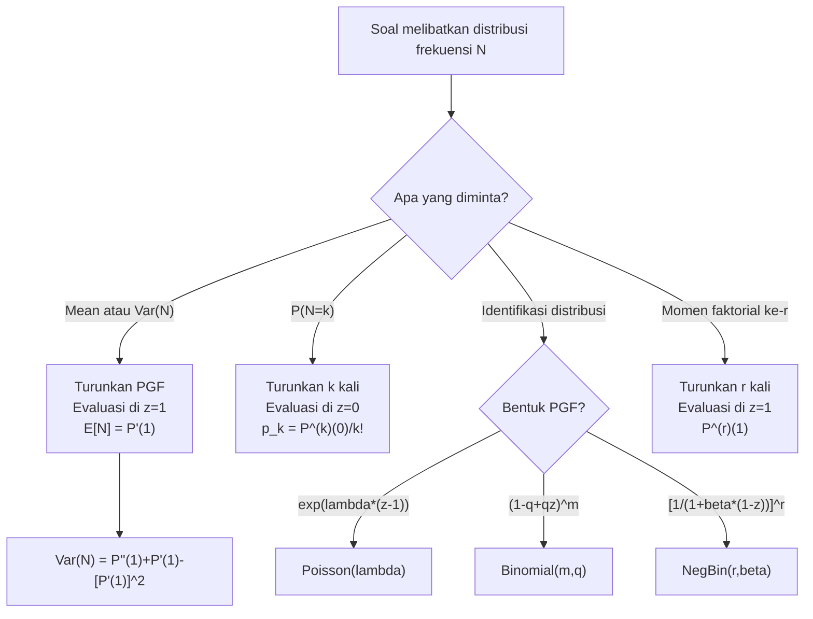

# 📊 2.1 — Frequency MGF and PGF

> [!ABSTRACT] Ringkasan Cepat
> **Topik:** Fungsi Pembangkit Momen & Probabilitas untuk Model Frekuensi | **Bobot:** ~5–10% | **Difficulty:** Medium
> **Ref:** Klugman et al. (2019), Bab 6 | **Prereq:** [[1.1 Moment and Probability Generating Functions]]

---

## Section 0 — Pemetaan Topik

| Topik TA2 | Sub-topik ID | Skill Diuji | Bobot | Difficulty | Prerequisite | Connected Topics | Referensi |
|---|---|---|---|---|---|---|---|
| Model Frekuensi Klaim | 2.1 | Menentukan MGF dan PGF untuk distribusi frekuensi; menghitung momen dan probabilitas dari kedua fungsi | 5–10% | Medium | [[1.1 Moment and Probability Generating Functions]] | [[2.2 (a,b,0) and (a,b,1) Distribution Classes]], [[2.4 Mixed Frequency Distributions]], [[4.2 Compound Distributions]] | Klugman et al. (2019), Bab 6 |

---

## Section 1 — Intuisi

Bayangkan Anda adalah seorang aktuaris di perusahaan asuransi kendaraan bermotor. Setiap bulan, ratusan nasabah mengajukan klaim. Anda perlu memodelkan *berapa banyak* klaim yang masuk — bukan seberapa besar nilai klaim tersebut, melainkan jumlahnya. Inilah yang disebut **model frekuensi klaim**: suatu distribusi probabilitas atas bilangan cacah $N = 0, 1, 2, 3, \ldots$ yang merepresentasikan banyaknya klaim dalam satu periode.

Masalahnya, distribusi frekuensi memiliki banyak bentuk — Poisson, Binomial, Negatif Binomial, dan lainnya. Untuk masing-masing, kita perlu bisa menghitung rata-rata klaim, variansi, bahkan peluang tepat $k$ klaim terjadi. Menghitung ini langsung dari distribusi probabilitas bisa sangat melelahkan. Di sinilah **Fungsi Pembangkit** menjadi alat yang ampuh.

Terdapat dua fungsi pembangkit utama: **MGF** (*Moment Generating Function*) dan **PGF** (*Probability Generating Function*). Keduanya adalah cara untuk "mengemas" seluruh distribusi ke dalam satu fungsi yang kompak. Ketika kita turunkan (*differentiate*) fungsi tersebut, informasi tentang momen atau probabilitas "keluar" dengan sendirinya. Khusus untuk distribusi frekuensi (diskrit, bernilai non-negatif), PGF sangat elegan: turunan ke-$k$ di titik nol langsung memberi probabilitas $P(N=k)$, dikali faktorial.

---

## Section 2 — Definisi Formal

> [!NOTE] Definisi Matematis
> Misalkan $N$ adalah variabel acak diskrit non-negatif (banyaknya klaim) dengan fungsi massa probabilitas $p_k = P(N = k)$ untuk $k = 0, 1, 2, \ldots$
>
> **MGF:** $M_N(t) = E[e^{tN}] = \sum_{k=0}^{\infty} e^{tk} p_k$
>
> **PGF:** $P_N(z) = E[z^N] = \sum_{k=0}^{\infty} z^k p_k$

| Simbol | Makna | Catatan |
|---|---|---|
| $N$ | Variabel acak frekuensi klaim | Diskrit, bernilai $0, 1, 2, \ldots$ |
| $p_k$ | $P(N = k)$, fungsi massa probabilitas | $\sum_{k=0}^{\infty} p_k = 1$ |
| $M_N(t)$ | MGF dari $N$ | Terdefinisi di sekitar $t = 0$ |
| $P_N(z)$ | PGF dari $N$ | $P_N(1) = 1$; konvergen untuk $\|z\| \leq 1$ |
| $E[N]$ | Mean frekuensi klaim | Rata-rata jumlah klaim per periode |
| $\text{Var}(N)$ | Variansi frekuensi klaim | Ukuran sebaran jumlah klaim |

### Rumus Utama

**Hubungan MGF dan PGF:**

$$
P_N(z) = M_N(\ln z) \quad \text{atau ekuivalen} \quad M_N(t) = P_N(e^t)
$$

**Label:** Substitusi $z = e^t$ menghubungkan kedua fungsi secara langsung.

**Momen dari MGF:**

$$
E[N^r] = M_N^{(r)}(0) = \left. \frac{d^r}{dt^r} M_N(t) \right|_{t=0}
$$

**Label:** Turunan ke-$r$ dari MGF di $t=0$ menghasilkan momen ke-$r$.

**Momen dari PGF — Factorial Moments:**

$$
E[N(N-1)(N-2)\cdots(N-r+1)] = P_N^{(r)}(1) = \left. \frac{d^r}{d z^r} P_N(z) \right|_{z=1}
$$

**Label:** Turunan ke-$r$ dari PGF di $z=1$ menghasilkan *factorial moment* ke-$r$.

**Mean dari PGF:**

$$
E[N] = P_N'(1)
$$

**Variansi dari PGF:**

$$
\text{Var}(N) = P_N''(1) + P_N'(1) - [P_N'(1)]^2
$$

**Label:** Variansi diperoleh dari momen faktorial pertama dan kedua.

**Probabilitas dari PGF:**

$$
p_k = P(N = k) = \frac{P_N^{(k)}(0)}{k!}
$$

**Label:** Koefisien deret Taylor PGF di sekitar $z=0$ adalah peluang $P(N=k)$.

**PGF Distribusi Utama:**

$$
\text{Poisson}(\lambda): \quad P_N(z) = e^{\lambda(z-1)}
$$

$$
\text{Binomial}(m, q): \quad P_N(z) = [1 - q + qz]^m
$$

$$
\text{Negatif Binomial}(r, \beta): \quad P_N(z) = \left[\frac{1}{1 + \beta(1-z)}\right]^r
$$

**MGF Distribusi Utama:**

$$
\text{Poisson}(\lambda): \quad M_N(t) = e^{\lambda(e^t - 1)}
$$

$$
\text{Binomial}(m, q): \quad M_N(t) = [1 - q + qe^t]^m
$$

$$
\text{Negatif Binomial}(r, \beta): \quad M_N(t) = \left[\frac{1}{1 + \beta(1-e^t)}\right]^r
$$

### Asumsi Eksplisit

1. $N$ adalah variabel acak **diskrit non-negatif** ($N \in \{0, 1, 2, \ldots\}$).
2. $\sum_{k=0}^{\infty} p_k = 1$ — distribusi terdefinisi dengan baik.
3. MGF diasumsikan terdefinisi di sekitar $t = 0$ (ada interval terbuka yang memuat $t=0$).
4. PGF konvergen setidaknya untuk $|z| \leq 1$, sehingga $P_N(1) = 1$ selalu valid.
5. Jika distribusi memiliki support terbatas (mis. Binomial), MGF dan PGF terdefinisi di seluruh $\mathbb{R}$ dan $\mathbb{C}$.

---

## Section 3 — Jembatan Logika

> [!TIP] Dari Definisi ke Rumus
> PGF lahir dari ekspansi deret pangkat (*power series*). Karena $N$ hanya bernilai $0, 1, 2, \ldots$, kita dapat menulis $E[z^N] = \sum_{k=0}^{\infty} z^k p_k$ — ini persis deret pangkat dengan koefisien $p_k$. Akibatnya, $p_k$ dapat "diekstrak kembali" dengan menurunkan $k$ kali lalu evaluasi di $z=0$: $p_k = P_N^{(k)}(0)/k!$. Inilah kekuatan utama PGF untuk frekuensi.

> [!IMPORTANT] Support dan Domain
> - PGF selalu konvergen untuk $|z| \leq 1$ karena $\sum |z|^k p_k \leq \sum p_k = 1$.
> - MGF mungkin tidak ada untuk semua distribusi, tetapi PGF selalu ada untuk distribusi diskrit non-negatif.
> - Di titik $z = 1$: $P_N(1) = \sum p_k = 1$ selalu terpenuhi — gunakan ini untuk sanity check.
> - Di titik $z = 0$: $P_N(0) = p_0 = P(N=0)$ — PGF di nol adalah peluang tidak ada klaim!

**Derivasi: Mean dan Variansi dari PGF**

**Langkah 1 — Turunkan PGF sekali:**

$$
P_N'(z) = \frac{d}{dz} \sum_{k=0}^{\infty} z^k p_k = \sum_{k=1}^{\infty} k z^{k-1} p_k
$$

**Langkah 2 — Evaluasi di $z=1$:**

$$
P_N'(1) = \sum_{k=1}^{\infty} k \cdot 1^{k-1} p_k = \sum_{k=0}^{\infty} k \cdot p_k = E[N]
$$

Ini membuktikan $E[N] = P_N'(1)$.

**Langkah 3 — Turunkan PGF dua kali:**

$$
P_N''(z) = \sum_{k=2}^{\infty} k(k-1) z^{k-2} p_k
$$

**Langkah 4 — Evaluasi di $z=1$:**

$$
P_N''(1) = \sum_{k=0}^{\infty} k(k-1) p_k = E[N(N-1)] = E[N^2] - E[N]
$$

Ini adalah *factorial moment* kedua.

**Langkah 5 — Susun variansi:**

$$
\text{Var}(N) = E[N^2] - (E[N])^2 = \left[P_N''(1) + P_N'(1)\right] - \left[P_N'(1)\right]^2
$$

**Derivasi: PGF Poisson**

**Langkah 1 — Mulai dari definisi:**

$$
P_N(z) = \sum_{k=0}^{\infty} z^k \cdot \frac{e^{-\lambda}\lambda^k}{k!}
$$

**Langkah 2 — Keluarkan faktor $e^{-\lambda}$:**

$$
P_N(z) = e^{-\lambda} \sum_{k=0}^{\infty} \frac{(z\lambda)^k}{k!}
$$

**Langkah 3 — Kenali deret eksponensial $\sum_{k=0}^{\infty} \frac{x^k}{k!} = e^x$ dengan $x = z\lambda$:**

$$
P_N(z) = e^{-\lambda} \cdot e^{z\lambda} = e^{\lambda(z-1)}
$$

Hasil: $P_N(z) = e^{\lambda(z-1)}$.

**Langkah 4 — Verifikasi mean:** $P_N'(z) = \lambda e^{\lambda(z-1)}$, sehingga $P_N'(1) = \lambda = E[N]$. ✓

> [!DANGER] Dilarang
> 1. **Jangan evaluasi PGF di $z > 1$ sembarangan** — deret mungkin tidak konvergen di luar radius $|z| \leq 1$.
> 2. **Jangan tukar $P_N^{(k)}(0)$ dengan $P_N^{(k)}(1)$** — evaluasi di $z=0$ memberi probabilitas, di $z=1$ memberi momen faktorial.
> 3. **Jangan lupa faktor $k!$** saat mengambil probabilitas dari PGF: $p_k = P_N^{(k)}(0) / k!$, bukan $P_N^{(k)}(0)$ saja.

---

## Section 4 — Contoh Soal

### Soal A — Fundamental

Jumlah klaim mingguan $N$ berdistribusi Poisson dengan parameter $\lambda = 3$. Tentukan:
(a) $E[N]$ dan $\text{Var}(N)$ menggunakan PGF.
(b) $P(N = 2)$ menggunakan PGF.

> [!SUCCESS] Solusi Soal A
> **Pendekatan:** Turunkan PGF Poisson dan evaluasi di $z=1$ untuk momen, di $z=0$ untuk probabilitas.
>
> **1. Identifikasi Variabel**
> - $N \sim \text{Poisson}(\lambda = 3)$
> - $P_N(z) = e^{\lambda(z-1)} = e^{3(z-1)}$
>
> **2. Identifikasi Distribusi / Model**
> Distribusi Poisson dengan $\lambda = 3$. PGF berbentuk eksponensial $e^{\lambda(z-1)}$.
>
> **3. Setup Persamaan**
>
> $$
> P_N'(z) = 3e^{3(z-1)}, \quad P_N''(z) = 9e^{3(z-1)}
> $$
>
> **4. Eksekusi Aljabar**
>
> **(a) Mean dan Variansi:**
>
> $$
> E[N] = P_N'(1) = 3e^{3(1-1)} = 3e^0 = 3
> $$
>
> $$
> \text{Var}(N) = P_N''(1) + P_N'(1) - [P_N'(1)]^2 = 9 + 3 - 9 = 3
> $$
>
> **(b) Probabilitas $P(N=2)$:**
>
> $$
> p_2 = \frac{P_N''(0)}{2!} = \frac{9e^{3(0-1)}}{2} = \frac{9e^{-3}}{2} \approx \frac{9 \times 0.0498}{2} \approx 0.2240
> $$
>
> Verifikasi via formula langsung: $p_2 = \frac{e^{-3} \cdot 3^2}{2!} = \frac{9e^{-3}}{2}$ ✓
>
> **5. Verification**
> Untuk Poisson, $E[N] = \text{Var}(N) = \lambda = 3$. Kedua nilai sama. ✓ Magnitude $p_2 \approx 0.224$ masuk akal sebagai mode distribusi Poisson($\lambda=3$).
>
> **Hasil:** $E[N] = 3$, $\text{Var}(N) = 3$, $P(N=2) = \frac{9e^{-3}}{2} \approx 0.2240$

> [!WARNING] Exam Tips — Soal A
> **Target waktu:** 2–3 menit. **Common trap:** Lupa faktor $k! = 2$ saat menghitung $p_2$ dari turunan kedua PGF. **Shortcut:** Untuk Poisson, mean = variansi = $\lambda$ — konfirmasi ini sebagai sanity check instan.

---

### Soal B — Exam-Typical

Jumlah klaim bulanan $N$ berdistribusi Negatif Binomial dengan parameter $r = 2$ dan $\beta = 1.5$.
(a) Tentukan PGF dari $N$.
(b) Hitung $E[N]$, $E[N^2]$, dan $\text{Var}(N)$ menggunakan PGF.
(c) Hitung $P(N = 0)$ dan $P(N = 1)$ dari PGF.

> [!SUCCESS] Solusi Soal B
> **Pendekatan:** Gunakan PGF Negatif Binomial, turunkan secara analitik untuk momen, evaluasi di $z=0$ untuk probabilitas.
>
> **1. Identifikasi Variabel**
> - $N \sim \text{NegBin}(r=2, \beta=1.5)$
> - Mean teoritis: $r\beta = 2 \times 1.5 = 3$
> - Variansi teoritis: $r\beta(1+\beta) = 2 \times 1.5 \times 2.5 = 7.5$
>
> **2. Identifikasi Distribusi / Model**
> Negatif Binomial — dipilih karena variansi > mean (overdispersion), cocok untuk data klaim yang mengelompok (*contagious*).
>
> **3. Setup Persamaan**
>
> $$
> P_N(z) = \left[\frac{1}{1 + \beta(1-z)}\right]^r = \left[\frac{1}{1 + 1.5(1-z)}\right]^2 = \left[\frac{1}{2.5 - 1.5z}\right]^2
> $$
>
> **4. Eksekusi Aljabar**
>
> **(a) PGF:**
>
> $$
> P_N(z) = (2.5 - 1.5z)^{-2}
> $$
>
> **(b) Turunan pertama:**
>
> $$
> P_N'(z) = -2(2.5 - 1.5z)^{-3} \cdot (-1.5) = 3(2.5 - 1.5z)^{-3}
> $$
>
> $$
> E[N] = P_N'(1) = 3(2.5 - 1.5)^{-3} = 3(1)^{-3} = 3 \checkmark
> $$
>
> **Turunan kedua:**
>
> $$
> P_N''(z) = 3 \cdot (-3)(2.5 - 1.5z)^{-4} \cdot (-1.5) = 13.5(2.5 - 1.5z)^{-4}
> $$
>
> $$
> P_N''(1) = 13.5(1)^{-4} = 13.5
> $$
>
> $$
> E[N^2] = P_N''(1) + P_N'(1) = 13.5 + 3 = 16.5
> $$
>
> $$
> \text{Var}(N) = E[N^2] - (E[N])^2 = 16.5 - 9 = 7.5 \checkmark
> $$
>
> **(c) Probabilitas:**
>
> $$
> p_0 = P_N(0) = (2.5 - 0)^{-2} = 2.5^{-2} = 0.16
> $$
>
> $$
> p_1 = \frac{P_N'(0)}{1!} = \frac{3(2.5)^{-3}}{1} = \frac{3}{15.625} = 0.192
> $$
>
> **5. Verification**
> $E[N] = r\beta = 3$ ✓; $\text{Var}(N) = r\beta(1+\beta) = 7.5$ ✓. $p_0 + p_1 = 0.16 + 0.192 = 0.352$; masuk akal karena $P(N \geq 2) = 0.648$.
>
> **Hasil:** $P_N(z) = (2.5-1.5z)^{-2}$; $E[N]=3$, $E[N^2]=16.5$, $\text{Var}(N)=7.5$; $p_0=0.16$, $p_1=0.192$.

> [!WARNING] Exam Tips — Soal B
> **Target waktu:** 3–4 menit. **Common trap:** Kesalahan saat menerapkan *chain rule* pada turunan $(2.5-1.5z)^{-2}$ — jangan lupa mengalikan dengan $-1.5$ dari turunan bagian dalam. **Shortcut:** Evaluasi di $z=1$ selalu memberi $(2.5-1.5)^{-k} = 1^{-k} = 1$ — kalkulasi jauh lebih sederhana.

---

### Soal C — Challenging

Diketahui PGF dari suatu distribusi frekuensi $N$ adalah:

$$
P_N(z) = \frac{0.4}{1 - 0.6z}
$$

(a) Identifikasi distribusi $N$ beserta parameternya.
(b) Hitung $E[N]$, $\text{Var}(N)$.
(c) Misalkan $S = X_1 + X_2 + \cdots + X_N$ adalah model agregat dengan klaim individual $X_i$ i.i.d. berdistribusi Eksponensial dengan mean 1000, independen dari $N$. Tentukan $E[S]$ dan $\text{Var}(S)$.

> [!SUCCESS] Solusi Soal C
> **Pendekatan:** Kenali bentuk PGF → identifikasi distribusi → hitung momen → gunakan formula model agregat kolektif.
>
> **1. Identifikasi Variabel**
> - $P_N(z) = \frac{0.4}{1-0.6z}$ — bentuk geometri
> - $X_i \sim \text{Exp}(\theta = 1000)$, jadi $E[X] = 1000$, $E[X^2] = 2\theta^2 = 2{,}000{,}000$, $\text{Var}(X) = \theta^2 = 1{,}000{,}000$
>
> **2. Identifikasi Distribusi / Model**
> PGF Geometric dengan parameter $\beta$: $P_N(z) = \frac{1}{1+\beta} \cdot \frac{1}{1 - \frac{\beta}{1+\beta}z}$.
>
> Bandingkan: $\frac{0.4}{1-0.6z}$. Maka $\frac{1}{1+\beta} = 0.4 \Rightarrow \beta = 1.5$. Cek: $\frac{\beta}{1+\beta} = \frac{1.5}{2.5} = 0.6$ ✓.
>
> Jadi $N \sim \text{Geometric}(\beta = 1.5)$ (kasus khusus NegBin dengan $r=1$).
>
> **3. Setup Persamaan**
>
> $$
> P_N'(z) = \frac{0.4 \times 0.6}{(1-0.6z)^2} = \frac{0.24}{(1-0.6z)^2}
> $$
>
> $$
> P_N''(z) = \frac{0.24 \times 2 \times 0.6}{(1-0.6z)^3} = \frac{0.288}{(1-0.6z)^3}
> $$
>
> **4. Eksekusi Aljabar**
>
> **(b) Momen $N$:**
>
> $$
> E[N] = P_N'(1) = \frac{0.24}{(0.4)^2} = \frac{0.24}{0.16} = 1.5
> $$
>
> $$
> P_N''(1) = \frac{0.288}{(0.4)^3} = \frac{0.288}{0.064} = 4.5
> $$
>
> $$
> \text{Var}(N) = 4.5 + 1.5 - (1.5)^2 = 4.5 + 1.5 - 2.25 = 3.75
> $$
>
> Verifikasi: Geometric, $E[N] = \beta = 1.5$ ✓; $\text{Var}(N) = \beta(1+\beta) = 1.5 \times 2.5 = 3.75$ ✓
>
> **(c) Model Agregat $S$:**
>
> $$
> E[S] = E[N] \cdot E[X] = 1.5 \times 1000 = 1500
> $$
>
> $$
> \text{Var}(S) = E[N] \cdot \text{Var}(X) + \text{Var}(N) \cdot (E[X])^2
> $$
>
> $$
> = 1.5 \times 1{,}000{,}000 + 3.75 \times (1000)^2 = 1{,}500{,}000 + 3{,}750{,}000 = 5{,}250{,}000
> $$
>
> **5. Verification**
> $\text{Var}(S) > E[N] \cdot \text{Var}(X)$ karena variansi frekuensi juga berkontribusi. Rasio $\text{Var}(S)/E[S]^2 = 5{,}250{,}000/2{,}250{,}000 = 2.33 > 1$ — menunjukkan dispersi tinggi yang konsisten dengan Geometric distribution.
>
> **Hasil:** $N \sim \text{Geometric}(\beta=1.5)$; $E[N]=1.5$, $\text{Var}(N)=3.75$; $E[S]=1{,}500$, $\text{Var}(S)=5{,}250{,}000$.

> [!WARNING] Exam Tips — Soal C
> **Target waktu:** 4–6 menit. **Common trap:** Soal C menghubungkan PGF dengan model agregat — jangan lupa formula $\text{Var}(S) = E[N]\text{Var}(X) + \text{Var}(N)(E[X])^2$, bukan hanya $E[N]\text{Var}(X)$. **Shortcut:** Kenali bentuk PGF langsung: $\frac{c}{1-dz}$ selalu Geometric; $e^{\lambda(z-1)}$ selalu Poisson.

---

## Section 5 — Verifikasi & Sanity Check

> [!CHECK] Sanity Check 1 — PGF di $z=1$
> Untuk **semua** distribusi diskrit, $P_N(1) = 1$ tanpa kecuali.
> Gunakan ini untuk verifikasi PGF Anda: substitusi $z=1$, pastikan hasilnya 1.
> Contoh: Poisson: $e^{\lambda(1-1)} = e^0 = 1$ ✓; NegBin: $[1/(1+\beta \cdot 0)]^r = 1$ ✓.

> [!CHECK] Sanity Check 2 — PGF di $z=0$ adalah $p_0$
> $P_N(0) = \sum_{k=0}^{\infty} 0^k p_k = p_0 \cdot 1 + 0 + 0 + \cdots = p_0$.
> Jika soal memberi PGF, evaluasi di $z=0$ untuk mendapat $P(N=0)$ secara instan.
> Contoh: Poisson: $P_N(0) = e^{\lambda(0-1)} = e^{-\lambda} = p_0$ ✓.

> [!CHECK] Sanity Check 3 — Relasi MGF–PGF
> $M_N(\ln z) = P_N(z)$. Substitusi $t = \ln z$ (atau $z = e^t$) harus menghasilkan ekspresi yang sama.
> Contoh Poisson: $M_N(t) = e^{\lambda(e^t-1)}$, substitusi $t = \ln z$: $e^{\lambda(z-1)} = P_N(z)$ ✓.

### Metode Alternatif

Untuk menghitung momen, dapat juga menggunakan **MGF langsung**:

$$
E[N] = M_N'(0), \quad E[N^2] = M_N''(0), \quad \text{Var}(N) = M_N''(0) - [M_N'(0)]^2
$$

PGF lebih natural untuk distribusi frekuensi karena:
1. Koefisiennya langsung berupa probabilitas.
2. PGF selalu konvergen untuk $|z| \leq 1$.
3. PGF distribusi komposit (*compound*) memiliki bentuk yang elegan: $P_S(z) = P_N(P_X(z))$.

---

## Section 6 — Visualisasi Mental

**Kurva PGF Poisson($\lambda=3$):** Fungsi $P_N(z) = e^{3(z-1)}$ adalah kurva eksponensial yang melewati titik $(0, e^{-3}) \approx (0, 0.050)$ di sumbu-$y$ dan $(1, 1)$ di kanan. Fungsi ini **cekung ke atas** (*convex*), meningkat dari kiri ke kanan. Nilai di $z=0$ adalah $p_0$; kemiringan di $z=1$ adalah mean $\lambda$.

**Ilustrasi umum untuk PGF frekuensi:**

```
P_N(z)
  1.0  ─────────────────────● z=1: P_N(1) = 1 (always)
       ╱
  0.5 ╱                        kemiringan di z=1 = E[N]
     ╱
 p_0 ●─────────────────────────────────────────
     0                    1.0         z
     ↑                    ↑
  P_N(0)=p_0         P_N(1)=1
  P'_N(1)=E[N]
  P''_N(1)=E[N(N-1)]
```

**Perbandingan bentuk PGF tiga distribusi utama:**

| Distribusi | Bentuk PGF | Karakteristik Kurva |
|---|---|---|
| Poisson($\lambda$) | $e^{\lambda(z-1)}$ | Kurva eksponensial, konveks |
| Binomial($m,q$) | $(1-q+qz)^m$ | Polinomial derajat $m$, linear jika $m=1$ |
| NegBin($r,\beta$) | $[1+\beta(1-z)]^{-r}$ | Hiperbola, tumbuh lebih cepat dari Poisson |

### Hubungan Visual ↔ Rumus

| Elemen Visual | Komponen Rumus |
|---|---|
| Titik potong sumbu-$y$ ($z=0$) | $P_N(0) = p_0 = P(N=0)$ |
| Titik ujung kanan ($z=1$) | $P_N(1) = 1$ |
| Kemiringan di $z=1$ | $P_N'(1) = E[N]$ |
| Kelengkungan di $z=1$ | $P_N''(1) = E[N(N-1)]$ |
| Koefisien suku ke-$k$ dalam deret Taylor | $p_k = P_N^{(k)}(0)/k!$ |

---

## Section 7 — Jebakan Umum

> [!BUG] Kesalahan Parametrisasi
> **NegBin konvensi berbeda-beda:** Klugman menggunakan $(r, \beta)$ di mana mean $= r\beta$, variansi $= r\beta(1+\beta)$. Beberapa referensi lain menggunakan $(r, p)$ di mana $p = 1/(1+\beta)$. Cek selalu: "mean berapa?" sebelum menulis PGF.
> - Klugman: $P_N(z) = [1/(1+\beta(1-z))]^r$
> - Konvensi alternatif: $P_N(z) = [p/(1-(1-p)z)]^r$
> Konversi: $p = 1/(1+\beta)$, $1-p = \beta/(1+\beta)$.

> [!BUG] Kesalahan Konseptual
> 1. **MGF vs PGF — mana yang digunakan?** Turunan MGF di $t=0$ → momen biasa. Turunan PGF di $z=1$ → momen faktorial. Turunan PGF di $z=0$ dibagi $k!$ → probabilitas $p_k$.
> 2. **Lupa faktor $k!$:** $p_k = P_N^{(k)}(0)/k!$, **bukan** $P_N^{(k)}(0)$. Ini bukan kesalahan kecil — akan memberi jawaban salah besar.
> 3. **Momen faktorial vs momen biasa:** $P_N''(1) = E[N(N-1)] \neq E[N^2]$. Untuk mendapat $E[N^2]$: tambahkan $E[N]$, yaitu $E[N^2] = P_N''(1) + P_N'(1)$.
> 4. **Asumsi konvergensi:** Jangan gunakan PGF di $|z| > 1$ tanpa memverifikasi konvergensinya terlebih dahulu.

> [!BUG] Kesalahan Interpretasi Soal
> - Soal bertanya "*factorial moment* kedua": ini adalah $P_N''(1)$, **bukan** $E[N^2]$.
> - Soal bertanya "momen kedua": ini $E[N^2] = P_N''(1) + P_N'(1)$.
> - "PGF dievaluasi di $z=0$" → jawaban adalah $p_0$, bukan 0.
> - Jika soal memberikan MGF dan meminta PGF, ingat $P_N(z) = M_N(\ln z)$.

> [!CAUTION] Red Flags
> - Kata "tentukan probabilitas $P(N=k)$ dari PGF" → turunkan $k$ kali, evaluasi di $z=0$, bagi $k!$.
> - Kata "tentukan mean menggunakan PGF" → turunkan sekali, evaluasi di $z=1$.
> - Bentuk PGF diberikan dan diminta identifikasi distribusi → kenali: $e^{\lambda(z-1)}$=Poisson, $(1-q+qz)^m$=Binomial, $[1/(1+\beta(1-z))]^r$=NegBin.
> - Soal melibatkan model kolektif $S = \sum_{i=1}^N X_i$ → butuh $E[N]$ dan $\text{Var}(N)$ dari PGF, lalu gunakan conditional variance formula.

---

## Section 8 — Ringkasan Eksekutif

> [!SUMMARY] Must-Remember
>
> 1. **Hubungan dasar:** $P_N(z) = M_N(\ln z)$ dan $M_N(t) = P_N(e^t)$
>
> 2. **Momen dari PGF:**
>
>    $$E[N] = P_N'(1), \quad \text{Var}(N) = P_N''(1) + P_N'(1) - [P_N'(1)]^2$$
>
> 3. **Probabilitas dari PGF:**
>
>    $$p_k = \frac{P_N^{(k)}(0)}{k!}$$
>
> 4. **PGF tiga distribusi utama:**
>
>    $$\text{Poisson: } e^{\lambda(z-1)}, \quad \text{Binomial: } (1-q+qz)^m, \quad \text{NegBin: } \left[\frac{1}{1+\beta(1-z)}\right]^r$$
>
> 5. **Sanity checks wajib:** $P_N(1) = 1$ selalu; $P_N(0) = p_0$; $P_N'(1) = E[N]$

### Kapan Digunakan

- Soal meminta **mean, variansi, atau momen** distribusi frekuensi via PGF/MGF.
- Soal meminta **peluang $P(N=k)$** dari PGF.
- Soal meminta **identifikasi distribusi** dari bentuk PGF yang diberikan.
- Sebagai alat perantara untuk soal model agregat (Topik 4) di mana $E[N]$ dan $\text{Var}(N)$ diperlukan.
- Topik 2.4 (*Mixed Frequency*): PGF campuran $P_N(z) = \int P_{N|\Lambda}(z) f(\lambda)\,d\lambda$.

### Kapan TIDAK Boleh Digunakan

- Untuk distribusi **kontinu** (besar klaim) — gunakan MGF biasa, bukan PGF.
- Untuk **momen bersyarat** tanpa kondisi yang jelas — PGF hanya untuk distribusi marginal.
- Jika distribusi tidak memiliki support di $\{0, 1, 2, \ldots\}$ — PGF tidak terdefinisi.

### Quick Decision Tree



---

> [!QUOTE] Follow-up Options
> 1. *"Berikan contoh soal variasi tentang PGF distribusi campuran (mixed Poisson)"*
> 2. *"Jelaskan hubungan [[2.1 Frequency MGF and PGF]] dengan [[4.2 Compound Distributions]] dan PGF model agregat"*
> 3. *"Buat flashcard 1-halaman untuk topik ini"*

*📖 Ref: Klugman, Panjer & Willmot (2019), Loss Models 5th ed., Bab 6 | 🗓️ 2026-04-16 | #TA2 #FrekuensiKlaim #MGF #PGF*
