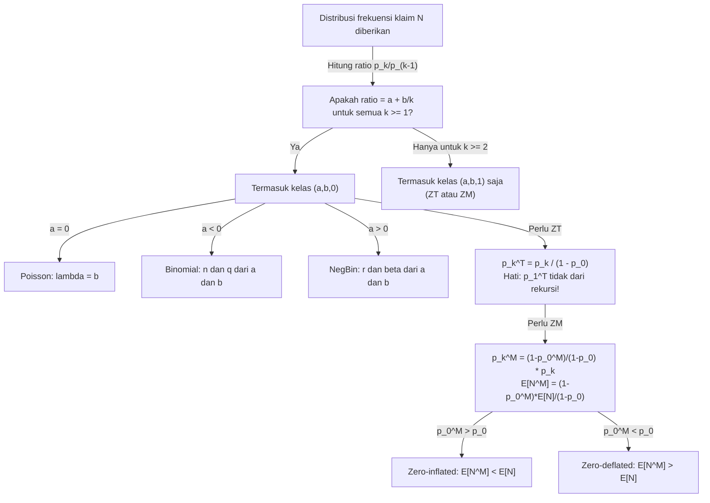

# 📊 2.2 — (a,b,0) and (a,b,1) Distribution Classes

> [!ABSTRACT] Ringkasan Cepat
> **Topik:** (a,b,0) and (a,b,1) Distribution Classes | **Bobot:** ~5–10% | **Difficulty:** Hard
> **Ref:** Klugman et al. (2019) Loss Models 5th ed., Bab 6 | **Prereq:** [[2.1 Frequency MGF and PGF]]

## Section 0 — Pemetaan Topik

| Topik TA2 | Sub-topik ID | Skill Diuji | Bobot | Difficulty | Prerequisite | Connected Topics | Referensi |
|---|---|---|---|---|---|---|---|
| Model Frekuensi Klaim | 2.2 | Mengidentifikasi dan mengklasifikasikan distribusi ke kelas $(a,b,0)$ atau $(a,b,1)$; mendapatkan distribusi kelas $(a,b,1)$ dari $(a,b,0)$ via zero-truncated dan zero-modified; menghitung probabilitas dari relasi rekursif Panjer | 5–10% | Hard | [[2.1 Frequency MGF and PGF]] | [[2.3 Frequency Model Selection]], [[2.4 Mixed Frequency Distributions]], [[4.5 Panjer Recursive Formula]] | KPW (2019) Bab 6 |

## Section 1 — Intuisi

Bayangkan seorang aktuaris di perusahaan asuransi kendaraan bermotor sedang menganalisis data frekuensi klaim polis selama setahun. Dari ribuan polis, sebagian besar tidak mengajukan klaim sama sekali (nol klaim), sebagian kecil mengajukan satu klaim, lebih sedikit lagi yang mengajukan dua klaim, dan seterusnya. Pertanyaannya: distribusi probabilitas apa yang paling cocok untuk menggambarkan pola ini? Apakah Poisson, Binomial, Negatif Binomial, atau sesuatu yang lebih fleksibel?

Kelas distribusi $(a,b,0)$ adalah jawaban elegan atas pertanyaan ini. Alih-alih mempelajari setiap distribusi frekuensi secara terpisah, kelas $(a,b,0)$ menyatukan semua distribusi yang memiliki satu sifat bersama: rasio probabilitas titik berturutan $p_k / p_{k-1}$ mengikuti pola linear sederhana dalam $k$. Dengan dua parameter saja — $a$ dan $b$ — kita bisa menghasilkan Poisson (dengan $a=0$), Binomial (dengan $a < 0$), dan Negatif Binomial (dengan $a > 0$). Sifat rekursif ini juga menjadi fondasi dari Formula Rekursif Panjer yang akan digunakan di Topik 4.

Namun ada masalah: data dunia nyata seringkali menunjukkan jumlah polis dengan nol klaim yang **jauh lebih banyak** (atau jauh lebih sedikit) dari yang diprediksi oleh distribusi Poisson atau Binomial standar. Fenomena ini disebut *zero-inflation* atau *zero-deflation*. Kelas $(a,b,1)$ hadir untuk mengatasi hal ini — ia memungkinkan kita memodifikasi probabilitas di titik nol secara bebas, sambil mempertahankan relasi rekursif yang sama untuk $k \geq 1$. Dengan demikian, dua keluarga besar — distribusi *zero-truncated* (tanpa masa di titik nol) dan distribusi *zero-modified* (dengan massa di titik nol yang disesuaikan) — keduanya masuk dalam kelas $(a,b,1)$ dan menjadi alat pemodelan yang sangat fleksibel.

## Section 2 — Definisi Formal

> [!NOTE] Definisi Matematis — Kelas $(a,b,0)$
>
> Distribusi diskrit non-negatif $\{p_k\}_{k=0}^{\infty}$ termasuk kelas $(a,b,0)$ jika dan hanya jika terdapat konstanta $a$ dan $b$ sehingga:
>
> $$\frac{p_k}{p_{k-1}} = a + \frac{b}{k}, \quad k = 1, 2, 3, \ldots$$
>
> dengan $p_0$ ditentukan oleh syarat normalisasi $\sum_{k=0}^{\infty} p_k = 1$.

> [!NOTE] Definisi Matematis — Kelas $(a,b,1)$
>
> Distribusi diskrit non-negatif $\{p_k^T\}$ atau $\{p_k^M\}$ termasuk kelas $(a,b,1)$ jika dan hanya jika:
>
> $$\frac{p_k^T}{p_{k-1}^T} = a + \frac{b}{k}, \quad k = 2, 3, 4, \ldots$$
>
> dengan $p_1^T$ (atau $p_1^M$) sebagai titik awal bebas — **tidak** harus memenuhi relasi di $k=1$ relatif terhadap $p_0$.

| Simbol | Makna | Catatan |
|---|---|---|
| $p_k$ | Probabilitas $P(N = k)$ dalam kelas $(a,b,0)$ | Termasuk $p_0 > 0$ |
| $a, b$ | Parameter kelas $(a,b,0)$ atau $(a,b,1)$ | Menentukan jenis distribusi |
| $p_k^T$ | Probabilitas distribusi *zero-truncated* | $p_0^T = 0$ by definition |
| $p_k^M$ | Probabilitas distribusi *zero-modified* | $p_0^M$ bebas, bisa $\neq p_0$ asli |
| $p_0^M$ | Probabilitas titik nol yang dimodifikasi | $0 \leq p_0^M \leq 1$ |
| $\psi$ | Bobot massa di nol untuk zero-modified | $\psi = p_0^M$; jika $\psi > p_0^{(a,b,0)}$: zero-inflated |
| $c$ | Konstanta normalisasi zero-truncated | $c = 1 - p_0^{(a,b,0)}$ |

### Rumus Utama

**Tabel klasifikasi kelas $(a,b,0)$ — tiga distribusi utama:**

| Distribusi | Parameter $a$ | Parameter $b$ | $p_0$ |
|---|---|---|---|
| Poisson$(\lambda)$ | $0$ | $\lambda$ | $e^{-\lambda}$ |
| Binomial$(n, q)$ | $-q/(1-q)$ | $(n+1)q/(1-q)$ | $(1-q)^n$ |
| Neg. Binomial$(r, \beta)$ | $\beta/(1+\beta)$ | $(r-1)\beta/(1+\beta)$ | $(1+\beta)^{-r}$ |

**Relasi rekursif Panjer kelas $(a,b,0)$:**

$$p_k = \left(a + \frac{b}{k}\right) p_{k-1}, \quad k = 1, 2, 3, \ldots$$

*Label: Cukup ketahui $p_0$, $a$, dan $b$ — seluruh distribusi dapat dibangun secara rekursif.*

**Distribusi zero-truncated (ZT) — hubungan dengan $(a,b,0)$:**

$$p_k^T = \frac{p_k}{1 - p_0}, \quad k = 1, 2, 3, \ldots, \qquad p_0^T = 0$$

*Label: ZT adalah kondisional: $p_k^T = P(N = k \mid N > 0)$ — probabilitas kelas $(a,b,0)$ di-rescale agar total $= 1$ tanpa titik nol.*

**Relasi rekursif ZT untuk $k \geq 2$:**

$$p_k^T = \left(a + \frac{b}{k}\right) p_{k-1}^T, \quad k = 2, 3, \ldots$$

*Label: Relasi rekursif tetap berlaku untuk $k \geq 2$; hanya titik awal yang berbeda ($p_1^T$, bukan $p_0^T$).*

**Distribusi zero-modified (ZM) — hubungan dengan ZT:**

$$p_k^M = (1 - p_0^M)\, p_k^T = \frac{1 - p_0^M}{1 - p_0}\, p_k, \quad k = 1, 2, 3, \ldots$$

*Label: ZM adalah campuran antara massa di titik nol sebesar $p_0^M$ dan distribusi ZT untuk $k \geq 1$.*

**Mean dan variansi ZT dari distribusi $(a,b,0)$ asal:**

$$E[N^T] = \frac{E[N]}{1 - p_0}, \qquad E[(N^T)^2] = \frac{E[N^2]}{1 - p_0}$$

$$\text{Var}(N^T) = \frac{E[N^2]}{1-p_0} - \left(\frac{E[N]}{1-p_0}\right)^2$$

*Label: Semua momen ZT diperoleh dari momen distribusi asal dibagi $(1-p_0)$, kecuali variansi yang perlu penyesuaian.*

**Mean ZM:**

$$E[N^M] = (1 - p_0^M)\, E[N^T] = \frac{(1 - p_0^M)\, E[N]}{1 - p_0}$$

*Label: Mean ZM = bobot massa pada distribusi ZT dikalikan mean ZT.*

### Asumsi Eksplisit

1. $N$ adalah variabel acak diskrit non-negatif dengan support $\{0, 1, 2, \ldots\}$ untuk kelas $(a,b,0)$, dan $\{1, 2, 3, \ldots\}$ untuk ZT.
2. Parameter $a$ dan $b$ harus memenuhi syarat agar probabilitas tetap positif dan summable: untuk Binomial $n$ harus integer positif; untuk Poisson $\lambda > 0$; untuk NegBin $r > 0$, $\beta > 0$.
3. Untuk ZT dan ZM: distribusi asal $(a,b,0)$ harus memiliki $p_0 < 1$ agar ZT dapat terdefinisi.
4. Untuk ZM: $0 \leq p_0^M \leq 1$; nilai $p_0^M = 0$ menghasilkan ZT; nilai $p_0^M = p_0^{(a,b,0)}$ menghasilkan distribusi asli tidak termodifikasi.
5. Kelas $(a,b,1)$ mencakup ZT dan ZM — keduanya memenuhi relasi rekursif yang sama untuk $k \geq 2$, tetapi $p_1$ tidak harus memenuhi relasi tersebut relatif terhadap $p_0$.

## Section 3 — Jembatan Logika

> [!TIP] Dari Definisi ke Rumus — Mengapa Relasi $p_k/p_{k-1} = a + b/k$?
>
> Ide di balik kelas $(a,b,0)$ adalah mencari distribusi diskrit yang memiliki **rasio probabilitas berturutan berbentuk linear dalam $1/k$**. Ini bukan arbitrary — ini adalah kondisi paling sederhana yang menghasilkan keluarga distribusi yang cukup kaya. Perhatikan bahwa:
>
> - Jika $a = 0$: rasio $p_k/p_{k-1} = b/k$, maka $p_k = p_{k-1} \cdot \lambda/k$ → ini persis PMF **Poisson** dengan $\lambda = b$.
> - Jika $a < 0$: rasio semakin kecil semakin cepat seiring $k$ naik → ekor menurun cepat → ini adalah **Binomial** yang memiliki support terbatas.
> - Jika $a > 0$: rasio tidak turun secepat Poisson → ekor lebih berat → ini adalah **Negatif Binomial** yang overdispersed.
>
> Jadi, parameter $a$ **mengendalikan berat ekor**: $a = 0$ adalah boundary antara light-tail (Binomial) dan heavy-tail (NegBin). Parameter $b$ bersama $a$ menentukan mean distribusi.

> [!IMPORTANT] Support dan Domain
>
> - Kelas $(a,b,0)$: support $\{0, 1, 2, \ldots\}$. $p_0$ **tidak nol** dan ditentukan dari normalisasi. Ini berbeda dengan $(a,b,1)$ di mana $p_0$ bisa bebas.
> - Untuk Binomial$(n, q)$: support **terbatas** $\{0, 1, \ldots, n\}$ — relasi rekursif hanya berlaku sampai $k = n$. Untuk $k > n$, $p_k = 0$ karena $a + b/k = -q/(1-q) + (n+1)q/((1-q)k)$ menjadi negatif untuk $k > n$.
> - Kelas $(a,b,1)$: relasi rekursif berlaku mulai $k = 2$ — titik $k = 1$ adalah "titik awal bebas" yang tidak terikat oleh relasi tersebut. Inilah mengapa $(a,b,1)$ lebih fleksibel dari $(a,b,0)$.

**Derivasi: Membuktikan Poisson adalah Anggota $(a,b,0)$ dengan $a=0$, $b=\lambda$**

Langkah 1 — PMF Poisson:

$$p_k = \frac{e^{-\lambda} \lambda^k}{k!}, \quad k = 0, 1, 2, \ldots$$

Langkah 2 — Hitung rasio $p_k / p_{k-1}$:

$$\frac{p_k}{p_{k-1}} = \frac{e^{-\lambda} \lambda^k / k!}{e^{-\lambda} \lambda^{k-1} / (k-1)!} = \frac{\lambda^k}{k!} \cdot \frac{(k-1)!}{\lambda^{k-1}} = \frac{\lambda}{k}$$

Langkah 3 — Cocokkan dengan relasi $(a,b,0)$:

$$\frac{p_k}{p_{k-1}} = \frac{\lambda}{k} = 0 + \frac{\lambda}{k} = a + \frac{b}{k}$$

Jadi $a = 0$, $b = \lambda$. ∎

**Derivasi: Membangun Distribusi Zero-Truncated dari $(a,b,0)$**

Langkah 1 — Distribusi asal: $\{p_0, p_1, p_2, \ldots\}$ dengan $\sum_{k=0}^\infty p_k = 1$.

Langkah 2 — Tujuan: distribusi baru $\{p_k^T\}$ dengan $p_0^T = 0$ dan $\sum_{k=1}^\infty p_k^T = 1$.

Langkah 3 — Syarat normalisasi: karena total massa yang tersisa setelah menghapus $p_0$ adalah $1 - p_0$, maka untuk memulihkan normalisasi:

$$p_k^T = \frac{p_k}{1 - p_0}, \quad k = 1, 2, 3, \ldots$$

Langkah 4 — Verifikasi relasi rekursif untuk $k \geq 2$:

$$\frac{p_k^T}{p_{k-1}^T} = \frac{p_k / (1-p_0)}{p_{k-1} / (1-p_0)} = \frac{p_k}{p_{k-1}} = a + \frac{b}{k}$$

Relasi $(a,b,0)$ diwarisi langsung ke ZT untuk $k \geq 2$. ∎ Perhatikan bahwa untuk $k = 1$: $p_1^T / p_0^T$ tidak terdefinisi karena $p_0^T = 0$ — itulah mengapa $(a,b,1)$ hanya menuntut relasi berlaku untuk $k \geq 2$.

**Derivasi: Membangun Zero-Modified dari ZT**

Langkah 1 — Mulai dari ZT: $\{p_k^T\}_{k=1}^\infty$ dengan $\sum_{k=1}^\infty p_k^T = 1$.

Langkah 2 — Tentukan bobot massa baru di titik nol: $p_0^M \in [0, 1)$.

Langkah 3 — Distribusi ZM: massa $p_0^M$ di titik nol, dan massa $(1 - p_0^M)$ dibagi ke $k \geq 1$ proporsional dengan ZT:

$$p_k^M = (1 - p_0^M)\, p_k^T = \frac{(1 - p_0^M)}{1 - p_0}\, p_k, \quad k = 1, 2, 3, \ldots$$

Langkah 4 — Verifikasi normalisasi:

$$p_0^M + \sum_{k=1}^\infty p_k^M = p_0^M + (1 - p_0^M)\underbrace{\sum_{k=1}^\infty p_k^T}_{=1} = p_0^M + 1 - p_0^M = 1 \checkmark$$

> [!DANGER] Dilarang
>
> 1. **Jangan gunakan relasi rekursif $(a,b,0)$ untuk $k=1$ pada distribusi ZT** — relasi $p_1^T / p_0^T$ tidak terdefinisi karena $p_0^T = 0$. Untuk menghitung $p_1^T$, gunakan $p_1^T = p_1 / (1 - p_0)$ secara langsung, bukan relasi rekursif.
> 2. **Jangan bingung antara ZT dan ZM** — ZT adalah kasus khusus ZM dengan $p_0^M = 0$. ZM dengan $p_0^M = p_0^{(a,b,0)}$ adalah distribusi asal tak termodifikasi. Jangan menganggap keduanya sama atau saling menggantikan tanpa alasan.
> 3. **Jangan substitusi parameter $(a,b)$ distribusi lain ke formula Poisson** — setiap anggota $(a,b,0)$ memiliki formula $p_0$ yang berbeda. Hitung $p_0$ dari formula distribusi asal, baru gunakan relasi rekursif untuk $p_1, p_2, \ldots$

## Section 4 — Contoh Soal

### Soal A — Fundamental

Distribusi frekuensi klaim $N \sim \text{Poisson}(\lambda = 3)$. Verifikasi bahwa Poisson termasuk kelas $(a,b,0)$ dengan mengidentifikasi $a$ dan $b$, lalu hitung $p_0$, $p_1$, $p_2$, $p_3$ menggunakan relasi rekursif Panjer.

> [!SUCCESS] Solusi Soal A
>
> **Pendekatan:** Identifikasi $a$ dan $b$ dari tabel klasifikasi, lalu bangun distribusi secara rekursif dari $p_0$.
>
> **1. Identifikasi Variabel**
> - $N \sim \text{Poisson}(\lambda = 3)$
> - Kelas $(a,b,0)$: $a = 0$, $b = \lambda = 3$
> - $p_0 = e^{-\lambda} = e^{-3}$
>
> **2. Identifikasi Distribusi / Model**
> Poisson adalah anggota $(a,b,0)$ dengan $a = 0$. Relasi rekursif: $p_k = (b/k)\, p_{k-1} = (3/k)\, p_{k-1}$.
>
> **3. Setup Persamaan**
>
> $$p_k = \left(0 + \frac{3}{k}\right) p_{k-1} = \frac{3}{k}\, p_{k-1}, \quad k = 1, 2, 3, \ldots$$
>
> $$p_0 = e^{-3} \approx 0.049787$$
>
> **4. Eksekusi Aljabar**
>
> $$p_1 = \frac{3}{1} \cdot p_0 = 3\, e^{-3} \approx 0.14936$$
>
> $$p_2 = \frac{3}{2} \cdot p_1 = \frac{3}{2} \cdot 3\, e^{-3} = \frac{9}{2}\, e^{-3} \approx 0.22404$$
>
> $$p_3 = \frac{3}{3} \cdot p_2 = 1 \cdot \frac{9}{2}\, e^{-3} = \frac{9}{2}\, e^{-3} \approx 0.22404$$
>
> Cross-check via formula Poisson: $p_3 = e^{-3} \cdot 3^3 / 3! = e^{-3} \cdot 27/6 = 4.5\, e^{-3}$ ✓
>
> **5. Verification**
> $p_0 + p_1 + p_2 + p_3 + \ldots = 1$. Perhatikan $p_2 = p_3$: untuk Poisson$(3)$, mode adalah di $k = 2$ dan $k = 3$ (mode ganda untuk $\lambda$ integer). Ini konsisten karena $p_3/p_2 = a + b/3 = 0 + 1 = 1$ tepat.
>
> **Hasil:** $a = 0$, $b = 3$; $p_0 \approx 0.0498$, $p_1 \approx 0.1494$, $p_2 \approx 0.2240$, $p_3 \approx 0.2240$.

> [!WARNING] Exam Tips — Soal A
> **Target waktu:** 2–3 menit. **Common trap:** Lupa bahwa $p_0 = e^{-\lambda}$ harus dihitung dulu sebelum rekursi dimulai — jangan mulai rekursi dari $p_1$ tanpa anchor $p_0$. **Shortcut:** Untuk Poisson, $p_k = (\lambda/k) \cdot p_{k-1}$. Untuk $k = \lambda$ (integer): $p_k = p_{k-1}$ tepat, sehingga mode terjadi pada $k = \lambda - 1$ dan $k = \lambda$ (mode ganda).

---

### Soal B — Exam-Typical

Distribusi frekuensi klaim $N$ memiliki distribusi Negatif Binomial dengan $r = 2$ dan $\beta = 1.5$. Bentuk distribusi *zero-truncated* $N^T$. Hitung $p_1^T$, $p_2^T$, $p_3^T$, $E[N^T]$, dan $\text{Var}(N^T)$.

> [!SUCCESS] Solusi Soal B
>
> **Pendekatan:** Hitung parameter $(a,b)$ NegBin, lalu bangun ZT dengan $p_k^T = p_k / (1 - p_0)$ dan gunakan relasi rekursif untuk $k \geq 2$.
>
> **1. Identifikasi Variabel**
> - $N \sim \text{NegBin}(r = 2, \beta = 1.5)$
> - $a = \beta/(1+\beta) = 1.5/2.5 = 0.6$
> - $b = (r-1)\beta/(1+\beta) = (1)(1.5)/2.5 = 0.6$
> - $p_0 = (1+\beta)^{-r} = (2.5)^{-2} = 1/6.25 = 0.16$
> - $E[N] = r\beta = 2 \times 1.5 = 3$
> - $E[N^2] = \text{Var}(N) + [E[N]]^2 = r\beta(1+\beta) + (r\beta)^2 = 2(1.5)(2.5) + 9 = 7.5 + 9 = 16.5$
>
> **2. Identifikasi Distribusi / Model**
> NegBin termasuk kelas $(a,b,0)$ dengan $a = 0.6 > 0$ (heavy-tail relatif Poisson). ZT diperoleh dengan me-rescale semua $p_k$ untuk $k \geq 1$ agar total $= 1$.
>
> **3. Setup Persamaan**
>
> $$p_k^T = \frac{p_k}{1 - p_0} = \frac{p_k}{1 - 0.16} = \frac{p_k}{0.84}, \quad k \geq 1$$
>
> $$p_k^T = \left(0.6 + \frac{0.6}{k}\right) p_{k-1}^T = \frac{0.6(k+1)}{k}\, p_{k-1}^T, \quad k \geq 2$$
>
> **4. Eksekusi Aljabar**
>
> Hitung $p_1$ dari relasi $(a,b,0)$:
>
> $$p_1 = \left(0.6 + \frac{0.6}{1}\right) p_0 = 1.2 \times 0.16 = 0.192$$
>
> $$p_1^T = \frac{0.192}{0.84} = \frac{0.192}{0.84} \approx 0.22857$$
>
> Lanjutkan rekursif ZT untuk $k \geq 2$:
>
> $$p_2^T = \left(0.6 + \frac{0.6}{2}\right) p_1^T = 0.9 \times 0.22857 \approx 0.20571$$
>
> $$p_3^T = \left(0.6 + \frac{0.6}{3}\right) p_2^T = 0.8 \times 0.20571 \approx 0.16457$$
>
> Momen ZT:
>
> $$E[N^T] = \frac{E[N]}{1 - p_0} = \frac{3}{0.84} \approx 3.5714$$
>
> $$E[(N^T)^2] = \frac{E[N^2]}{1-p_0} = \frac{16.5}{0.84} \approx 19.643$$
>
> $$\text{Var}(N^T) = 19.643 - (3.5714)^2 = 19.643 - 12.755 \approx 6.888$$
>
> **5. Verification**
> $E[N^T] = 3.571 > E[N] = 3$: ZT memiliki mean lebih besar karena massa di titik nol dihapus dan didistribusi ulang ke nilai positif. Konsisten secara intuitif. Cross-check: $p_1^T > p_2^T > p_3^T$ ✓ (distribusi unimodal menurun untuk $\beta < 1/(r-1)$... atau cukup verifikasi probabilitas positif dan menurun secara wajar).
>
> **Hasil:** $p_1^T \approx 0.2286$, $p_2^T \approx 0.2057$, $p_3^T \approx 0.1646$; $E[N^T] \approx 3.571$, $\text{Var}(N^T) \approx 6.888$.

> [!WARNING] Exam Tips — Soal B
> **Target waktu:** 4–5 menit. **Common trap:** Menerapkan relasi rekursif ZT mulai dari $k = 1$ dengan $p_0^T = 0$ sebagai anchor — ini menghasilkan $p_1^T = (a + b) \cdot 0 = 0$, yang salah! Selalu hitung $p_1^T = p_1 / (1-p_0)$ secara langsung, baru gunakan rekursi dari $k=2$ ke atas. **Shortcut:** Hafal formula momen ZT: $E[N^T] = E[N] / (1-p_0)$ — tidak perlu menghitung ulang dari definisi ekspektasi.

---

### Soal C — Challenging

Sebuah portofolio asuransi jiwa memiliki distribusi frekuensi klaim *zero-modified* berdasarkan Poisson$(\lambda = 2)$, dengan probabilitas nol klaim yang dimodifikasi menjadi $p_0^M = 0.40$. Hitung: (a) nilai $p_0$ Poisson asli, (b) $p_1^M$, $p_2^M$, $p_3^M$, (c) $E[N^M]$, dan (d) interpretasikan apakah ini kasus zero-inflated atau zero-deflated.

> [!SUCCESS] Solusi Soal C
>
> **Pendekatan:** Bangun ZT Poisson dulu, lalu terapkan ZM dengan $p_0^M = 0.40$. Bandingkan $p_0^M$ dengan $p_0^{Poisson}$ untuk menentukan inflasi/deflasi.
>
> **1. Identifikasi Variabel**
> - Distribusi dasar: $N \sim \text{Poisson}(\lambda = 2)$; $a = 0$, $b = 2$
> - $p_0 = e^{-2} \approx 0.13534$
> - $p_0^M = 0.40$ (diberikan)
> - $E[N] = \lambda = 2$, $1 - p_0 = 1 - e^{-2} \approx 0.86466$
>
> **2. Identifikasi Distribusi / Model**
> Karena $p_0^M = 0.40 > p_0 = 0.1353$, ini adalah kasus **zero-inflated** — lebih banyak polis dengan nol klaim dari yang diprediksi Poisson. Distribusi ZM termasuk kelas $(a,b,1)$.
>
> **3. Setup Persamaan**
>
> $$p_k^M = \frac{1 - p_0^M}{1 - p_0}\, p_k = \frac{1 - 0.40}{1 - e^{-2}}\, p_k = \frac{0.60}{0.86466}\, p_k, \quad k = 1, 2, 3, \ldots$$
>
> $$E[N^M] = \frac{(1 - p_0^M)\, E[N]}{1 - p_0} = \frac{0.60 \times 2}{0.86466}$$
>
> **4. Eksekusi Aljabar**
>
> Faktor skala: $\frac{1-p_0^M}{1-p_0} = \frac{0.60}{0.86466} \approx 0.69393$
>
> Hitung $p_k$ Poisson asli terlebih dahulu:
>
> $$p_1 = 2\, e^{-2} \approx 0.27067, \quad p_2 = 2\, e^{-2} \approx 0.27067, \quad p_3 = \frac{4}{3}\, e^{-2} \approx 0.18045$$
>
> ZM:
>
> $$p_1^M = 0.69393 \times 0.27067 \approx 0.18782$$
>
> $$p_2^M = 0.69393 \times 0.27067 \approx 0.18782$$
>
> $$p_3^M = 0.69393 \times 0.18045 \approx 0.12521$$
>
> Mean ZM:
>
> $$E[N^M] = \frac{0.60 \times 2}{0.86466} \approx \frac{1.20}{0.86466} \approx 1.38795$$
>
> Verifikasi via ZT: $E[N^T] = E[N]/(1-p_0) = 2/0.86466 \approx 2.3132$, maka $E[N^M] = (1-p_0^M) \times E[N^T] = 0.60 \times 2.3132 \approx 1.3879$ ✓
>
> **5. Verification**
> Normalisasi: $p_0^M + p_1^M + p_2^M + p_3^M + \ldots = 0.40 + 0.60 \times \sum_{k=1}^\infty p_k^T = 0.40 + 0.60 \times 1 = 1.00$ ✓. $E[N^M] = 1.388 < E[N] = 2$: mean turun karena massa besar di titik nol menarik ekspektasi ke bawah. Ini konsisten: zero-inflation mengurangi mean.
>
> **Hasil:** $p_0 = e^{-2} \approx 0.1353$; $p_1^M \approx 0.1878$, $p_2^M \approx 0.1878$, $p_3^M \approx 0.1252$; $E[N^M] \approx 1.388$. Ini adalah kasus **zero-inflated** karena $p_0^M = 0.40 > p_0 = 0.135$.

> [!WARNING] Exam Tips — Soal C
> **Target waktu:** 5–6 menit. **Common trap:** Mengalikan $p_k^M = (1 - p_0^M) \cdot p_k$ alih-alih menggunakan faktor $(1-p_0^M)/(1-p_0) \cdot p_k$ — kesalahan ini menghasilkan $\sum p_k^M \neq 1$ karena $\sum_{k=1}^\infty p_k = 1 - p_0 \neq 1$. **Shortcut:** Hitung faktor skala $c = (1-p_0^M)/(1-p_0)$ sekali, lalu kalikan semua $p_k$ dengan $c$. Cek akhir: $p_0^M + c \times (1-p_0) = p_0^M + (1-p_0^M) = 1$ ✓.

## Section 5 — Verifikasi & Sanity Check

> [!CHECK] Cross-check Normalisasi ZT dan ZM
>
> Selalu verifikasi:
>
> $$\sum_{k=1}^\infty p_k^T = 1 \quad \Leftrightarrow \quad \sum_{k=1}^\infty \frac{p_k}{1-p_0} = \frac{1-p_0}{1-p_0} = 1$$
>
> Untuk ZM:
>
> $$p_0^M + \sum_{k=1}^\infty p_k^M = p_0^M + (1-p_0^M)\sum_{k=1}^\infty p_k^T = p_0^M + (1-p_0^M) = 1$$
>
> Jika jumlah probabilitas yang dihitung tidak sama dengan 1, kesalahan ada di faktor normalisasi.

> [!CHECK] Cross-check Mean ZT vs Mean Asal
>
> Selalu periksa arah perubahan mean:
>
> $$E[N^T] = \frac{E[N]}{1-p_0} > E[N] \quad \text{(selalu lebih besar, karena } 1-p_0 < 1\text{)}$$
>
> $$E[N^M] = \frac{(1-p_0^M) E[N]}{1-p_0} \;\begin{cases} > E[N] & \text{jika } p_0^M < p_0 \text{ (zero-deflated)} \\ = E[N] & \text{jika } p_0^M = p_0 \text{ (tidak termodifikasi)} \\ < E[N] & \text{jika } p_0^M > p_0 \text{ (zero-inflated)} \end{cases}$$
>
> Ini adalah intuition-check wajib: zero-inflation **selalu mengurangi mean** dari distribusi asalnya.

### Metode Alternatif

Untuk menghitung $p_1^T$ distribusi ZT Negatif Binomial$(r, \beta)$, bisa juga langsung via:

$$p_1^T = \frac{p_1}{1 - p_0} = \frac{r \cdot \frac{\beta}{1+\beta} \cdot (1+\beta)^{-r}}{1 - (1+\beta)^{-r}} = \frac{r\beta (1+\beta)^{-r-1}}{1-(1+\beta)^{-r}}$$

Namun cara paling efisien di ujian tetap: hitung $p_1$ dari relasi rekursif $(a,b,0)$ dulu ($p_1 = (a+b) p_0$), lalu bagi dengan $(1 - p_0)$.

## Section 6 — Visualisasi Mental

**Diagram hierarki kelas distribusi:**

```
                    SEMUA DISTRIBUSI DISKRIT
                             │
              ┌──────────────┴──────────────┐
              │                             │
         Kelas (a,b,0)              Kelas (a,b,1)
    [relasi berlaku k ≥ 1]       [relasi berlaku k ≥ 2]
              │                             │
    ┌─────────┼─────────┐         ┌─────────┴─────────┐
    │         │         │         │                   │
 Poisson  Binomial  NegBin    Zero-Truncated    Zero-Modified
 a=0,b=λ  a<0      a>0       (p₀ᵀ = 0)         (p₀ᴹ = bebas)
                              dari (a,b,0)        dari ZT
                              ÷(1-p₀)           × (1-p₀ᴹ)
```

**Grafik perbandingan PMF: Poisson$(2)$ vs ZT-Poisson$(2)$ vs ZM-Poisson$(2)$ dengan $p_0^M = 0.4$:**

```
P(N=k)
0.30 |      ██ ██                ← Poisson asli
0.25 |      ██ ██
0.20 |   ██ ██ ██       ZT →    ██ ██          ← ZT (k≥1 saja)
0.15 |   ██ ██ ██              ██ ██ ██
0.10 |   ██ ██ ██ ██           ██ ██ ██ ██     ZM →  ██ ██
0.05 |   ██ ██ ██ ██                                  ██ ██ ██
     +---+--+--+--+--→ k       +--+--+--+--→ k       +--+--+--→ k
         0  1  2  3              1  2  3                0  1  2

     p₀ = 0.135  (kecil)      Tidak ada k=0        p₀ᴹ = 0.40  (besar)
```

### Hubungan Visual ↔ Rumus

| Elemen Visual | Komponen Rumus |
|---|---|
| Batang di $k=0$ dihapus (ZT) | $p_k^T = p_k / (1-p_0)$; semua batang dinaikkan proporsional |
| Batang $k=0$ diperbesar (ZM zero-inflated) | $p_0^M > p_0$; batang $k \geq 1$ diperkecil proporsional |
| Slope menurun pada $a > 0$ (NegBin) | Ekor lebih berat: $p_k/p_{k-1} \to a > 0$ saat $k \to \infty$ |
| Slope menurun cepat pada $a < 0$ (Binomial) | Ekor terpotong: $p_k = 0$ untuk $k > n$ |
| Relasi rekursif = kemiringan log-PMF linear | $\ln(p_k) = \ln(p_{k-1}) + \ln(a + b/k)$ |

## Section 7 — Jebakan Umum

> [!BUG] Kesalahan Parametrisasi
>
> - **Parameter NegBin KPW vs konvensi lain:** KPW menggunakan NegBin$(r, \beta)$ dengan $a = \beta/(1+\beta)$, $b = (r-1)\beta/(1+\beta)$, dan $p_0 = (1+\beta)^{-r}$. Beberapa sumber menggunakan parameterisasi $(r, p)$ dengan $p = 1/(1+\beta)$ — ini mengubah nilai $a$ dan $b$. Selalu verifikasi konvensi mana yang digunakan soal.
> - **Parameter Binomial KPW:** $a = -q/(1-q)$, $b = (n+1)q/(1-q)$. Perhatikan $a$ **negatif** untuk Binomial — ini sering mengejutkan kandidat. Verifikasi: $a + b = nq/(1-q) - q/(1-q) = (n-1)q/(1-q) = p_1/p_0$ ✓ menggunakan $p_1 = n q (1-q)^{n-1}$ dan $p_0 = (1-q)^n$.

> [!BUG] Kesalahan Konseptual
>
> 1. **Relasi rekursif ZT dimulai dari $k=2$, bukan $k=1$:** Untuk ZT, relasi $p_k^T / p_{k-1}^T = a + b/k$ hanya valid untuk $k \geq 2$. Menggunakannya untuk $k=1$ (dengan $p_0^T = 0$ sebagai anchor) menghasilkan $p_1^T = 0$ — salah fatal.
> 2. **Zero-inflated ≠ zero-modified:** Zero-inflated adalah *kasus khusus* zero-modified di mana $p_0^M > p_0^{(a,b,0)}$. Zero-modified juga mencakup zero-deflated ($p_0^M < p_0$). Jangan gunakan keduanya sebagai sinonim.
> 3. **$(a,b,0)$ adalah subkelas $(a,b,1)$:** Distribusi $(a,b,0)$ memenuhi relasi rekursif untuk **semua** $k \geq 1$, termasuk $k=1$. Kelas $(a,b,1)$ hanya menuntut $k \geq 2$, sehingga $(a,b,0) \subset (a,b,1)$.
> 4. **Momen ZM tidak diperoleh dengan membagi $E[N]$ oleh $(1-p_0^M)$:** Rumus $E[N^M] = (1-p_0^M) E[N] / (1-p_0)$, bukan $E[N]/(1-p_0^M)$. Confusion ini sangat umum.

> [!BUG] Kesalahan Interpretasi Soal
>
> - *"Distribusi zero-truncated Poisson$(2)$"* — ini adalah distribusi ZT dengan distribusi dasar Poisson. Bukan Poisson$(2)$ yang dipotong pada nilai tertentu (seperti pemotongan dari atas). ZT hanya menghapus titik $k = 0$.
> - *"Tentukan apakah distribusi termasuk $(a,b,0)$ atau $(a,b,1)$"* — jika $p_0 > 0$ dan relasi berlaku untuk semua $k \geq 1$: termasuk $(a,b,0)$. Jika $p_0 = 0$ atau relasi hanya berlaku untuk $k \geq 2$: termasuk $(a,b,1)$ namun tidak $(a,b,0)$.
> - *"Klasifikasikan distribusi berdasarkan rasio $p_k/p_{k-1}$"* — hitung rasio untuk beberapa nilai $k$, lalu cari $a$ dan $b$ dari sistem persamaan $a + b/k_1 = r_1$ dan $a + b/k_2 = r_2$. Identifikasi distribusi dari nilai $a$ yang diperoleh.

> [!CAUTION] Red Flags
>
> - Soal menyebut **"zero-truncated"** → ingat: $p_0^T = 0$; jangan gunakan relasi rekursif untuk $k=1$; hitung $p_1^T = p_1/(1-p_0)$ secara langsung
> - Soal menyebut **"zero-modified"** dengan $p_0^M$ diberikan → hitung faktor skala $c = (1-p_0^M)/(1-p_0)$ dulu, baru kalikan semua $p_k$ asli dengan $c$
> - Soal memberikan **tabel $p_k$ dan meminta mengidentifikasi distribusi** → hitung dua rasio $p_k/p_{k-1}$ untuk dua nilai $k$ berbeda, selesaikan sistem $2\times 2$ untuk $a$ dan $b$, lalu cocokan dengan tabel klasifikasi
> - Soal menyebut **"Panjer recursive formula"** untuk model agregat → ini adalah aplikasi $(a,b,0)$ di Topik 4; lihat [[4.5 Panjer Recursive Formula]]
> - Nilai $a > 0$, $a = 0$, atau $a < 0$ → **langsung identifikasi**: $a > 0$ = NegBin, $a = 0$ = Poisson, $a < 0$ = Binomial

## Section 8 — Ringkasan Eksekutif

> [!SUMMARY] Must-Remember
>
> 1. **Relasi rekursif kelas $(a,b,0)$:**
>
> $$\frac{p_k}{p_{k-1}} = a + \frac{b}{k}, \quad k = 1, 2, 3, \ldots$$
>
> 2. **Tabel klasifikasi $(a,b,0)$ — tiga distribusi utama:**
>
> $$a = 0 \Rightarrow \text{Poisson}(\lambda = b)$$
>
> $$a < 0 \Rightarrow \text{Binomial}(n, q): \; a = \frac{-q}{1-q}, \; b = \frac{(n+1)q}{1-q}$$
>
> $$a > 0 \Rightarrow \text{NegBin}(r, \beta): \; a = \frac{\beta}{1+\beta}, \; b = \frac{(r-1)\beta}{1+\beta}$$
>
> 3. **Zero-truncated dari $(a,b,0)$:**
>
> $$p_k^T = \frac{p_k}{1 - p_0}, \quad k \geq 1; \qquad E[N^T] = \frac{E[N]}{1-p_0}$$
>
> 4. **Zero-modified dari ZT:**
>
> $$p_k^M = \frac{1-p_0^M}{1-p_0}\, p_k, \quad k \geq 1; \qquad E[N^M] = \frac{(1-p_0^M)\, E[N]}{1-p_0}$$
>
> 5. **Relasi kelas $(a,b,1)$:** Berlaku untuk $k \geq 2$ — ZT dan ZM keduanya termasuk $(a,b,1)$.

### Kapan Digunakan

- Soal memberikan distribusi frekuensi dan meminta mengidentifikasi kelas $(a,b,0)$ → hitung rasio $p_k/p_{k-1}$, cocokan dengan $a + b/k$
- Soal meminta membangun distribusi dari relasi rekursif → tentukan $p_0$, $a$, $b$, lalu rekursi
- Soal menyebut "zero-truncated" atau "kondisional pada $N > 0$" → gunakan formula ZT
- Soal menyebut "zero-modified", "zero-inflated", atau "zero-deflated" → gunakan formula ZM dengan $p_0^M$ yang diberikan
- Soal menyebut formula Panjer (Topik 4) → relasi $(a,b,0)$ adalah basis dari Formula Rekursif Panjer; lihat [[4.5 Panjer Recursive Formula]]

### Kapan TIDAK Boleh Digunakan

- Distribusi frekuensi yang tidak memiliki support $\{0, 1, 2, \ldots\}$ tidak dapat langsung diklasifikasikan ke $(a,b,0)$ tanpa transformasi
- Untuk distribusi campuran (*mixed frequency*) seperti Poisson-ETNB: tidak semua distribusi campuran termasuk $(a,b,0)$; lihat [[2.4 Mixed Frequency Distributions]]
- Jangan gunakan relasi rekursif ZT untuk $k=1$ — ini satu-satunya pengecualian yang tidak berlaku dalam $(a,b,1)$

### Quick Decision Tree



---

> [!QUOTE] Follow-up Options
> 1. *"Berikan contoh soal mengidentifikasi distribusi dari tabel $p_k$ yang diberikan menggunakan relasi $(a,b,0)$"*
> 2. *"Jelaskan hubungan [[2.2 (a,b,0) and (a,b,1) Distribution Classes]] dengan [[4.5 Panjer Recursive Formula]]"*
> 3. *"Buat flashcard 1-halaman: tabel parameter $(a,b)$ tiga distribusi dan rumus ZT/ZM"*

*📖 Ref: Klugman, Panjer & Willmot (2019) Loss Models 5th ed., Bab 6 | 🗓️ 2026-04-16 | #TA2 #ab0 #ab1 #Panjer #ModelFrekuensiKlaim*
