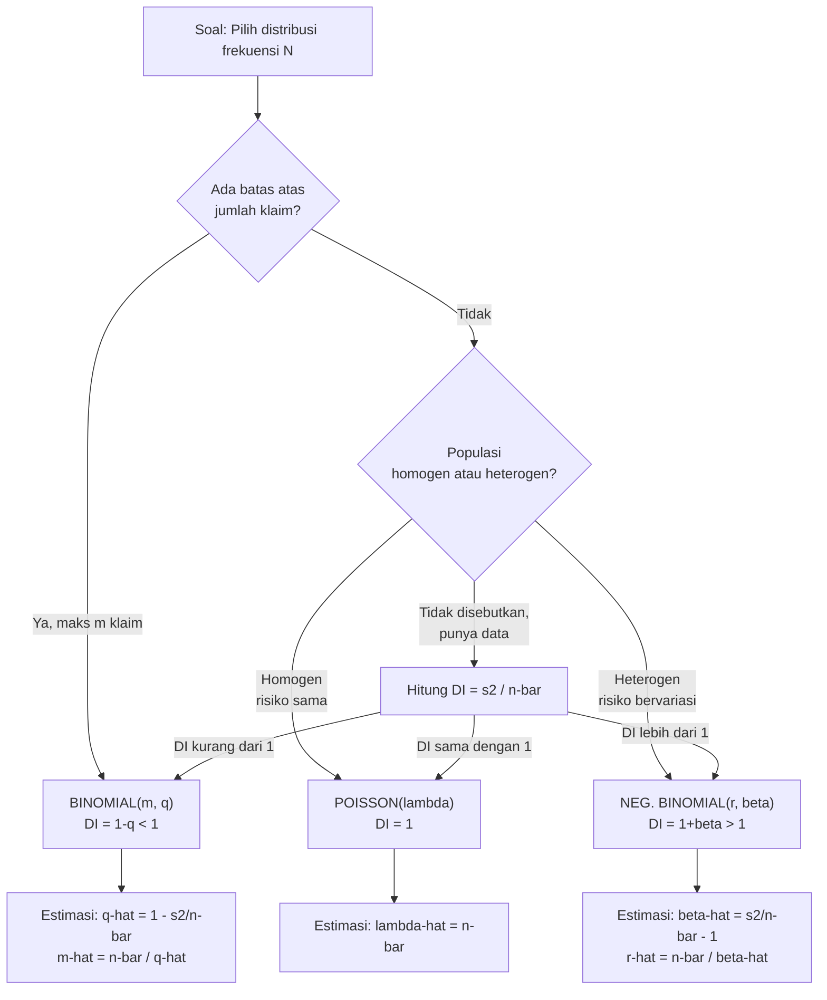

# 📊 2.3 — Frequency Model Selection

> [!ABSTRACT] Ringkasan Cepat
> **Topik:** Pemilihan Distribusi Frekuensi yang Sesuai untuk Permasalahan Nyata | **Bobot:** ~5–10% | **Difficulty:** Hard
> **Ref:** Klugman et al. (2019), Bab 6 | **Prereq:** [[2.1 Frequency MGF and PGF]], [[2.2 (a,b,0) and (a,b,1) Distribution Classes]]

---

## Section 0 — Pemetaan Topik

| Topik TA2 | Sub-topik ID | Skill Diuji | Bobot | Difficulty | Prerequisite | Connected Topics | Referensi |
|---|---|---|---|---|---|---|---|
| Model Frekuensi Klaim | 2.3 | Mengidentifikasi distribusi frekuensi yang paling sesuai untuk suatu konteks nyata; menjelaskan alasan pemilihan berdasarkan sifat dispersi, struktur risiko, dan karakteristik populasi; menerapkan distribusi dengan parameter yang diberikan | 5–10% | Hard | [[2.1 Frequency MGF and PGF]], [[2.2 (a,b,0) and (a,b,1) Distribution Classes]] | [[2.4 Mixed Frequency Distributions]], [[2.5 Exposure Effect on Frequency]], [[4.1 Individual and Collective Risk Models]], [[6.4 Model Diagnostics and Selection]] | Klugman et al. (2019), Bab 6 |

---

## Section 1 — Intuisi

Bayangkan Anda adalah seorang aktuaris yang harus menetapkan premi untuk tiga produk asuransi yang berbeda: asuransi kendaraan bermotor massal untuk jutaan pengguna jalan, asuransi jiwa kredit untuk kelompok karyawan sebuah perusahaan, dan asuransi kesehatan individu untuk nasabah dengan riwayat penyakit berbeda-beda. Meskipun ketiganya melibatkan "berapa banyak klaim yang muncul", karakter klaim dari masing-masing portofolio sangat berbeda. Pertanyaan kuncinya: distribusi probabilitas mana yang paling tepat untuk merepresentasikan frekuensi klaim di setiap situasi itu?

Inilah inti dari *Frequency Model Selection* — kemampuan membaca karakteristik suatu permasalahan nyata dan menerjemahkannya ke pilihan distribusi yang tepat. Ada tiga kandidat utama yang digunakan dalam praktik aktuaria: **Poisson**, **Binomial**, dan **Negatif Binomial**. Masing-masing lahir dari asumsi yang berbeda tentang bagaimana klaim terjadi. Poisson cocok ketika setiap pemegang polis memiliki risiko yang kurang lebih sama dan klaim terjadi secara independen. Binomial cocok ketika ada batas atas yang jelas pada jumlah klaim — misalnya, satu orang hanya bisa mengalami satu kematian. Negatif Binomial cocok ketika populasi heterogen: sebagian nasabah "berisiko tinggi" dan sebagian lagi "berisiko rendah", sehingga klaim cenderung mengelompok (*clustering*).

Kemampuan memilih model yang tepat bukan sekadar soal pengetahuan rumus, melainkan pemahaman mendalam tentang *mengapa* setiap distribusi berperilaku seperti yang ia lakukan. Di ujian TA2, soal tipe ini menguji apakah Anda mampu menghubungkan narasi permasalahan dengan sifat matematis distribusi — terutama hubungan antara mean dan variansi (*dispersion index*) — dan kemudian menerapkan distribusi tersebut dengan parameter konkret.

---

## Section 2 — Definisi Formal

> [!NOTE] Definisi Matematis — Indeks Dispersi
> Untuk variabel acak frekuensi $N$, **indeks dispersi** (*dispersion index* / *variance-to-mean ratio*) didefinisikan sebagai:
>
> $$
> \text{DI} = \frac{\text{Var}(N)}{E[N]}
> $$
>
> - $\text{DI} = 1$: *equidispersion* → indikasi kuat Poisson
> - $\text{DI} < 1$: *underdispersion* → indikasi kuat Binomial
> - $\text{DI} > 1$: *overdispersion* → indikasi kuat Negatif Binomial

| Simbol | Makna | Catatan |
|---|---|---|
| $N$ | Variabel acak frekuensi klaim | Diskrit, $N \in \{0, 1, 2, \ldots\}$ |
| $\lambda$ | Parameter rata-rata Poisson | $E[N] = \text{Var}(N) = \lambda$ |
| $m$ | Jumlah maksimum klaim (Binomial) | Batas atas yang eksplisit; $N \leq m$ |
| $q$ | Peluang klaim per unit eksposur (Binomial) | $0 < q < 1$ |
| $r$ | Parameter bentuk Negatif Binomial | $r > 0$; tidak harus bilangan bulat |
| $\beta$ | Parameter skala Negatif Binomial | $\beta > 0$ |
| $\text{DI}$ | Indeks dispersi $= \text{Var}(N)/E[N]$ | Alat utama pemilihan model |
| $p_k$ | $P(N = k)$ | Fungsi massa probabilitas |

### Rumus Utama

**Ringkasan tiga distribusi utama:**

| Distribusi | Parameter | $E[N]$ | $\text{Var}(N)$ | $\text{DI}$ | Support |
|---|---|---|---|---|---|
| Poisson | $\lambda > 0$ | $\lambda$ | $\lambda$ | $1$ | $\{0,1,2,\ldots\}$ |
| Binomial | $m \in \mathbb{Z}^+,\; 0<q<1$ | $mq$ | $mq(1-q)$ | $1-q < 1$ | $\{0,1,\ldots,m\}$ |
| Negatif Binomial | $r>0,\; \beta>0$ | $r\beta$ | $r\beta(1+\beta)$ | $1+\beta > 1$ | $\{0,1,2,\ldots\}$ |

**Fungsi massa probabilitas Poisson:**

$$
p_k = \frac{e^{-\lambda}\lambda^k}{k!}, \quad k = 0, 1, 2, \ldots
$$

**Label:** Probabilitas tepat $k$ klaim pada populasi Poisson dengan rata-rata $\lambda$.

**Fungsi massa probabilitas Binomial:**

$$
p_k = \binom{m}{k} q^k (1-q)^{m-k}, \quad k = 0, 1, \ldots, m
$$

**Label:** Probabilitas tepat $k$ klaim dari $m$ unit independen masing-masing berpeluang $q$.

**Fungsi massa probabilitas Negatif Binomial:**

$$
p_k = \binom{r+k-1}{k} \left(\frac{1}{1+\beta}\right)^r \left(\frac{\beta}{1+\beta}\right)^k, \quad k = 0, 1, 2, \ldots
$$

**Label:** Probabilitas tepat $k$ klaim pada populasi heterogen dengan parameter $(r, \beta)$.

**Estimasi parameter via Method of Moments:**

$$
\text{Poisson: } \hat{\lambda} = \bar{n}
$$

$$
\text{Binomial: } \hat{q} = 1 - \frac{s^2}{\bar{n}}, \quad \hat{m} = \frac{\bar{n}}{\hat{q}} \quad (\text{dengan } m \text{ dibulatkan ke bilangan bulat})
$$

$$
\text{NegBin: } \hat{\beta} = \frac{s^2}{\bar{n}} - 1, \quad \hat{r} = \frac{\bar{n}}{\hat{\beta}}
$$

**Label:** $\bar{n}$ = rata-rata sampel, $s^2$ = variansi sampel; digunakan saat parameter tidak diketahui.

### Asumsi Eksplisit

1. **Poisson** — klaim terjadi secara independen; setiap pemegang polis memiliki intensitas risiko yang **sama dan konstan** $\lambda$.
2. **Binomial** — ada **batas atas eksplisit** $m$ pada jumlah klaim; setiap "percobaan" independen dengan peluang klaim $q$ yang sama.
3. **Negatif Binomial** — populasi **heterogen**: intensitas klaim individual bervariasi antar pemegang polis, sehingga terjadi overdispersi.
4. Ketiga distribusi termasuk kelas $(a, b, 0)$ — dapat diidentifikasi dari plot $p_k/p_{k-1}$ terhadap $k$.
5. Model diasumsikan stasioner dalam satu periode; efek eksposur ditangani terpisah di [[2.5 Exposure Effect on Frequency]].

---

## Section 3 — Jembatan Logika

> [!TIP] Dari Konteks Soal ke Pilihan Distribusi
> Kunci pemilihan model adalah membaca **tiga sinyal** dari narasi soal secara berurutan:
> **(1) Apakah ada batas atas klaim?** → Jika ya, Binomial. Jika tidak, Poisson atau NegBin.
> **(2) Apakah populasi homogen atau heterogen?** → Homogen (risiko sama): Poisson. Heterogen (risiko bervariasi): NegBin.
> **(3) Apa hubungan mean dan variansi?** → DI = 1: Poisson; DI < 1: Binomial; DI > 1: NegBin.
> Ketiganya harus konsisten. Jika narasi dan DI memberi sinyal berbeda, prioritaskan konteks ekonomi/aktuaria.

> [!IMPORTANT] Support dan Domain
> - **Binomial** memiliki support **terbatas**: $N \in \{0, 1, \ldots, m\}$. Ini adalah ciri pembeda paling tegas — jika soal menyebutkan "paling banyak $m$ klaim" atau "dari kelompok $m$ orang", Binomial adalah satu-satunya kandidat.
> - **Poisson dan NegBin** memiliki support **tak terbatas**: $N \in \{0, 1, 2, \ldots\}$. Keduanya tidak membatasi jumlah klaim secara teoritis.
> - **Geometric** adalah kasus khusus NegBin dengan $r = 1$; DI $= 1 + \beta > 1$.
> - **Logarithmic** hanya memiliki support $\{1, 2, 3, \ldots\}$ (tidak memasukkan $k=0$) — bukan kelas $(a,b,0)$ standar.

**Derivasi: Mengapa DI < 1 mengimplikasikan Binomial?**

**Langkah 1 — Tulis DI Binomial:**

$$
\text{DI}_{\text{Bin}} = \frac{\text{Var}(N)}{E[N]} = \frac{mq(1-q)}{mq} = 1 - q
$$

**Langkah 2 — Karena $0 < q < 1$:**

$$
0 < 1 - q < 1 \quad \Rightarrow \quad \text{DI}_{\text{Bin}} \in (0, 1)
$$

**Langkah 3 — Analoginya untuk Negatif Binomial:**

$$
\text{DI}_{\text{NegBin}} = \frac{r\beta(1+\beta)}{r\beta} = 1 + \beta > 1 \quad \text{karena } \beta > 0
$$

**Langkah 4 — Kesimpulan:**

DI secara tegas memisahkan tiga distribusi pada garis bilangan: Binomial berada di $(0,1)$, Poisson tepat di $1$, dan Negatif Binomial di $(1, \infty)$.

**Derivasi: Mengapa NegBin muncul dari populasi heterogen?**

**Langkah 1 — Misalkan** intensitas klaim individual $\Lambda$ bervariasi antar pemegang polis dan berdistribusi Gamma$(r, \beta)$, sehingga $E[\Lambda] = r\beta$ dan $\text{Var}(\Lambda) = r\beta^2$.

**Langkah 2 — Bersyarat pada** $\Lambda = \lambda$, jumlah klaim $N \sim \text{Poisson}(\lambda)$.

**Langkah 3 — Dengan hukum total ekspektasi dan variansi:**

$$
E[N] = E[E[N|\Lambda]] = E[\Lambda] = r\beta
$$

$$
\text{Var}(N) = E[\text{Var}(N|\Lambda)] + \text{Var}(E[N|\Lambda]) = E[\Lambda] + \text{Var}(\Lambda) = r\beta + r\beta^2 = r\beta(1+\beta)
$$

**Langkah 4 — Distribusi marginal** $N$ adalah Negatif Binomial$(r, \beta)$.

Ini menjelaskan secara intuitif: overdispersi NegBin muncul karena **variansi frekuensi = variansi inheren Poisson + variansi heterogenitas populasi**.

> [!DANGER] Dilarang
> 1. **Jangan pilih Poisson hanya karena "klaim jarang terjadi"** — kejadian langka tidak otomatis Poisson. Poisson mensyaratkan *homogenitas* risiko antar pemegang polis, bukan sekadar frekuensi rendah.
> 2. **Jangan abaikan support distribusi** — jika soal memberi batas atas klaim, NegBin dan Poisson tidak valid karena support-nya tak terbatas.
> 3. **Jangan gunakan DI dari data mentah tanpa koreksi** — variansi sampel $s^2$ harus dihitung dengan penyebut $n-1$, bukan $n$, untuk estimasi tidak bias.

---

## Section 4 — Contoh Soal

### Soal A — Fundamental

Sebuah perusahaan asuransi menganalisis data klaim dari portofolio 500 polis kendaraan bermotor selama setahun. Rata-rata jumlah klaim per polis adalah $\bar{n} = 0.8$ dan variansi sampel $s^2 = 0.82$.

(a) Hitung indeks dispersi dan tentukan distribusi frekuensi yang paling sesuai.
(b) Tentukan parameter distribusi tersebut menggunakan method of moments.
(c) Hitung $P(N = 0)$ dan $P(N = 2)$ dengan parameter yang diperoleh.

> [!SUCCESS] Solusi Soal A
> **Pendekatan:** Hitung DI terlebih dahulu untuk mengidentifikasi distribusi, lalu estimasi parameter via MoM, dan terakhir hitung probabilitas.
>
> **1. Identifikasi Variabel**
> - $\bar{n} = 0.8$ (mean sampel)
> - $s^2 = 0.82$ (variansi sampel)
> - $n_{\text{polis}} = 500$
>
> **2. Identifikasi Distribusi / Model**
> Hitung DI:
>
> $$
> \text{DI} = \frac{s^2}{\bar{n}} = \frac{0.82}{0.8} = 1.025 > 1
> $$
>
> DI sedikit di atas 1 → indikasi **overdispersi ringan** → pilih **Negatif Binomial**. Konteks kendaraan bermotor juga mendukung: heterogenitas pengemudi (usia, pengalaman, zona) menyebabkan variasi risiko antar polis.
>
> **3. Setup Persamaan**
>
> $$
> \hat{\beta} = \frac{s^2}{\bar{n}} - 1, \qquad \hat{r} = \frac{\bar{n}}{\hat{\beta}}
> $$
>
> **4. Eksekusi Aljabar**
>
> $$
> \hat{\beta} = 1.025 - 1 = 0.025
> $$
>
> $$
> \hat{r} = \frac{0.8}{0.025} = 32
> $$
>
> Hitung probabilitas:
>
> $$
> p_0 = \left(\frac{1}{1+\hat{\beta}}\right)^{\hat{r}} = \left(\frac{1}{1.025}\right)^{32} = (1.025)^{-32}
> $$
>
> $$
> \ln(1.025) \approx 0.02469 \Rightarrow 32 \times 0.02469 = 0.7901 \Rightarrow p_0 = e^{-0.7901} \approx 0.4538
> $$
>
> $$
> p_1 = r \cdot \frac{\beta}{1+\beta} \cdot p_0 = 32 \times \frac{0.025}{1.025} \times 0.4538 \approx 32 \times 0.02439 \times 0.4538 \approx 0.3541
> $$
>
> $$
> p_2 = \frac{r+1}{2} \cdot \frac{\beta}{1+\beta} \cdot p_1 = \frac{33}{2} \times 0.02439 \times 0.3541 \approx 16.5 \times 0.02439 \times 0.3541 \approx 0.1426
> $$
>
> **5. Verification**
> Cek rekursif $(a,b,0)$: $p_k/p_{k-1} = a + b/k$ dengan $a = \beta/(1+\beta) = 0.02439$, $b = (r-1)\beta/(1+\beta) = 31 \times 0.02439 = 0.7561$. Rasio $p_1/p_0 = 0.3541/0.4538 = 0.7802 = a + b/1 = 0.02439 + 0.7561 = 0.7805$ ✓ (selisih akibat pembulatan).
>
> **Hasil:** DI $= 1.025 > 1$ → NegBin; $\hat{r} = 32$, $\hat{\beta} = 0.025$; $P(N=0) \approx 0.4538$, $P(N=2) \approx 0.1426$.

> [!WARNING] Exam Tips — Soal A
> **Target waktu:** 3 menit. **Common trap:** DI sangat dekat dengan 1 (di sini 1.025) — ujian mungkin memancing pilihan Poisson. Tetapi secara teknis $\text{DI} \neq 1$, jadi NegBin lebih tepat; sertakan justifikasi konteks (heterogenitas pengemudi). **Shortcut:** Estimasi parameter NegBin dari MoM selalu lewat $\hat{\beta} = \text{DI} - 1$ dan $\hat{r} = \bar{n}/\hat{\beta}$.

---

### Soal B — Exam-Typical

Sebuah perusahaan memiliki 200 karyawan yang masing-masing diasuransikan. Polis menjamin bahwa setiap karyawan dapat mengajukan **paling banyak 1 klaim** per tahun (misalnya klaim rawat inap). Dari data historis, diketahui bahwa peluang seorang karyawan mengajukan klaim adalah $q = 0.15$.

(a) Identifikasi distribusi yang tepat dan jelaskan alasannya secara lengkap.
(b) Hitung $E[N]$, $\text{Var}(N)$, dan $\text{DI}$.
(c) Hitung $P(N \geq 2)$ dan $P(N = 0)$.

> [!SUCCESS] Solusi Soal B
> **Pendekatan:** Batas atas klaim dan ukuran kelompok tetap → Binomial. Hitung momen lalu gunakan rumus PMF langsung.
>
> **1. Identifikasi Variabel**
> - $m = 200$ (jumlah karyawan = jumlah "percobaan" Bernoulli)
> - $q = 0.15$ (peluang klaim per karyawan)
> - Setiap karyawan: independen, maksimum 1 klaim
>
> **2. Identifikasi Distribusi / Model**
> **Binomial$(m=200, q=0.15)$.**
> Justifikasi lengkap:
> - Ada **batas atas eksplisit**: setiap karyawan paling banyak 1 klaim → support $\{0, 1, \ldots, 200\}$.
> - **Kelompok tertutup** dengan ukuran tetap $m = 200$.
> - Setiap karyawan bertindak sebagai "percobaan Bernoulli" independen dengan peluang sukses $q = 0.15$.
> - Tidak ada informasi heterogenitas antar karyawan → Binomial lebih tepat dari NegBin.
>
> **3. Setup Persamaan**
>
> $$
> E[N] = mq, \quad \text{Var}(N) = mq(1-q), \quad \text{DI} = 1 - q
> $$
>
> $$
> P(N=k) = \binom{200}{k}(0.15)^k(0.85)^{200-k}
> $$
>
> **4. Eksekusi Aljabar**
>
> $$
> E[N] = 200 \times 0.15 = 30
> $$
>
> $$
> \text{Var}(N) = 200 \times 0.15 \times 0.85 = 25.5
> $$
>
> $$
> \text{DI} = 1 - 0.15 = 0.85 < 1 \checkmark
> $$
>
> $$
> P(N = 0) = (0.85)^{200}
> $$
>
> $$
> \ln(0.85) = -0.16252 \Rightarrow 200 \times (-0.16252) = -32.504 \Rightarrow P(N=0) = e^{-32.504} \approx 8.44 \times 10^{-15} \approx 0
> $$
>
> Untuk $P(N \geq 2)$ dengan $m$ besar dan $mq = 30$ cukup besar, gunakan aproksimasi Normal:
>
> $$
> N \approx \text{Normal}(\mu=30, \sigma^2=25.5), \quad \sigma = \sqrt{25.5} \approx 5.05
> $$
>
> $$
> P(N \geq 2) = 1 - P(N \leq 1) \approx 1 - \Phi\left(\frac{1.5 - 30}{5.05}\right) = 1 - \Phi(-5.64) \approx 1
> $$
>
> **5. Verification**
> DI $= 0.85 < 1$ ✓ konsisten Binomial. $P(N=0) \approx 0$ masuk akal karena dengan 200 karyawan dan $q=0.15$, hampir mustahil tidak ada satupun yang klaim. $P(N \geq 2) \approx 1$ juga sangat masuk akal.
>
> **Hasil:** Binomial$(200, 0.15)$; $E[N]=30$, $\text{Var}(N)=25.5$, $\text{DI}=0.85$; $P(N=0) \approx 0$, $P(N \geq 2) \approx 1$.

> [!WARNING] Exam Tips — Soal B
> **Target waktu:** 3–4 menit. **Common trap:** Karena $m=200$ besar dan $q=0.15$ tidak kecil, jangan gunakan aproksimasi Poisson (yang mensyaratkan $m \to \infty, q \to 0$, $mq$ tetap). **Shortcut:** Sinyal Binomial paling kuat adalah **batas atas** jumlah klaim — jika soal menyebutkan "kelompok $m$ orang" atau "paling banyak 1 klaim per orang", identifikasi Binomial instan.

---

### Soal C — Challenging

Dari data klaim tahunan suatu perusahaan asuransi jiwa kredit, diperoleh distribusi frekuensi berikut dari 1.000 polis:

| Jumlah klaim $k$ | Frekuensi observasi $n_k$ |
|---|---|
| 0 | 620 |
| 1 | 260 |
| 2 | 85 |
| 3 | 28 |
| 4 | 7 |
| $\geq 5$ | 0 |

(a) Hitung mean sampel $\bar{n}$ dan variansi sampel $s^2$.
(b) Tentukan distribusi yang paling sesuai dan estimasi parameternya.
(c) Hitung probabilitas teoritis $p_0, p_1, p_2$ dari distribusi yang dipilih dan bandingkan dengan frekuensi relatif observasi.
(d) Berikan justifikasi kontekstual mengapa distribusi tersebut sesuai untuk asuransi jiwa kredit.

> [!SUCCESS] Solusi Soal C
> **Pendekatan:** Hitung statistik deskriptif → identifikasi distribusi via DI → estimasi parameter → hitung probabilitas teoritis → validasi dengan konteks bisnis.
>
> **1. Identifikasi Variabel**
> - Total polis: $n = 1{,}000$
> - Data: $(k, n_k)$ = $(0,620), (1,260), (2,85), (3,28), (4,7)$
>
> **2. Identifikasi Distribusi / Model**
> Akan ditentukan setelah menghitung DI dari data.
>
> **3. Setup Persamaan**
>
> $$
> \bar{n} = \frac{\sum k \cdot n_k}{n}, \qquad s^2 = \frac{\sum k^2 \cdot n_k - n\bar{n}^2}{n-1}
> $$
>
> **4. Eksekusi Aljabar**
>
> **(a) Mean sampel:**
>
> $$
> \sum k \cdot n_k = 0(620) + 1(260) + 2(85) + 3(28) + 4(7) = 0 + 260 + 170 + 84 + 28 = 542
> $$
>
> $$
> \bar{n} = \frac{542}{1000} = 0.542
> $$
>
> **Variansi sampel** — perlu $\sum k^2 n_k$:
>
> $$
> \sum k^2 \cdot n_k = 0(620) + 1(260) + 4(85) + 9(28) + 16(7) = 0 + 260 + 340 + 252 + 112 = 964
> $$
>
> $$
> s^2 = \frac{964 - 1000 \times (0.542)^2}{999} = \frac{964 - 1000 \times 0.293764}{999} = \frac{964 - 293.764}{999} = \frac{670.236}{999} \approx 0.6709
> $$
>
> **Indeks dispersi:**
>
> $$
> \text{DI} = \frac{s^2}{\bar{n}} = \frac{0.6709}{0.542} = 1.237 > 1
> $$
>
> **(b) DI $> 1$ → Negatif Binomial.** Estimasi parameter MoM:
>
> $$
> \hat{\beta} = \text{DI} - 1 = 1.237 - 1 = 0.237
> $$
>
> $$
> \hat{r} = \frac{\bar{n}}{\hat{\beta}} = \frac{0.542}{0.237} \approx 2.287
> $$
>
> **(c) Probabilitas teoritis NegBin$(\hat{r}=2.287, \hat{\beta}=0.237)$:**
>
> $$
> p_0 = \left(\frac{1}{1+\hat{\beta}}\right)^{\hat{r}} = \left(\frac{1}{1.237}\right)^{2.287}
> $$
>
> $$
> \ln(1.237) \approx 0.2127 \Rightarrow 2.287 \times 0.2127 = 0.4864 \Rightarrow p_0 = e^{-0.4864} \approx 0.6149
> $$
>
> Rekursif $(a,b,0)$ dengan $a = \hat{\beta}/(1+\hat{\beta}) = 0.237/1.237 = 0.1915$ dan $b = (\hat{r}-1)\hat{\beta}/(1+\hat{\beta}) = 1.287 \times 0.1915 = 0.2465$:
>
> $$
> p_1 = (a + b/1) \cdot p_0 = (0.1915 + 0.2465) \times 0.6149 = 0.4380 \times 0.6149 \approx 0.2693
> $$
>
> $$
> p_2 = (a + b/2) \cdot p_1 = (0.1915 + 0.1233) \times 0.2693 = 0.3148 \times 0.2693 \approx 0.0848
> $$
>
> **Perbandingan teoritis vs observasi:**
>
> | $k$ | $p_k$ (NegBin) | $n_k/n$ (observasi) | Selisih |
> |---|---|---|---|
> | 0 | 0.6149 | 0.620 | −0.0051 |
> | 1 | 0.2693 | 0.260 | +0.0093 |
> | 2 | 0.0848 | 0.085 | −0.0002 |
>
> Kecocokan sangat baik — selisih di bawah 1%.
>
> **(d) Justifikasi kontekstual:**
> Asuransi jiwa kredit melindungi debitur (peminjam) terhadap risiko kematian atau cacat. Populasi debitur **heterogen**: berbeda usia, kondisi kesehatan, jenis kredit, dan tenor pinjaman. Pemegang polis dengan profil risiko tinggi (usia tua, riwayat sakit) cenderung mengajukan klaim lebih sering, menciptakan *clustering* yang menyebabkan overdispersi. Ini adalah kondisi ideal untuk NegBin sebagai model frekuensi.
>
> **5. Verification**
> $\sum_k p_k$ (NegBin, semua $k$) $= 1$ ✓. Kecocokan teoritis vs observasi untuk $k=0,1,2$ sangat baik (< 1% selisih). $\hat{r} \approx 2.3$ positif dan $\hat{\beta} = 0.237 > 0$ ✓ — parameter valid.
>
> **Hasil:** $\bar{n}=0.542$, $s^2=0.6709$, $\text{DI}=1.237$; NegBin$(\hat{r}=2.287, \hat{\beta}=0.237)$; probabilitas teoritis cocok dengan observasi; didukung heterogenitas populasi debitur.

> [!WARNING] Exam Tips — Soal C
> **Target waktu:** 5–6 menit. **Common trap:** Kesalahan menghitung $\sum k^2 n_k$ — gunakan tabel sistematis jangan hitung mental. **Common trap 2:** Lupa menggunakan penyebut $n-1 = 999$ (bukan $n = 1000$) untuk variansi sampel tidak bias. **Shortcut:** Rekursif $(a,b,0)$ jauh lebih cepat daripada menghitung langsung $p_k$ dari PMF NegBin — gunakan setelah menghitung $p_0$.

---

## Section 5 — Verifikasi & Sanity Check

> [!CHECK] Sanity Check 1 — DI sebagai Kompas Utama
> Sebelum apapun, hitung DI = $s^2/\bar{n}$:
> - DI $\approx 1$ (toleransi ±0.05 dalam soal): → **Poisson**
> - DI $< 1$: → **Binomial** (pastikan ada batas atas $m$ dari konteks)
> - DI $> 1$: → **Negatif Binomial**
> Jika DI sangat dekat dengan 1 tetapi ada info kelompok tertutup ukuran $m$, tetap pilih Binomial.

> [!CHECK] Sanity Check 2 — Validasi Parameter via Mean
> Setelah estimasi parameter, verifikasi dengan menghitung ulang mean dari distribusi:
> - Poisson: $E[N] = \hat{\lambda}$ harus $= \bar{n}$ ✓
> - Binomial: $E[N] = \hat{m}\hat{q}$ harus $= \bar{n}$ ✓
> - NegBin: $E[N] = \hat{r}\hat{\beta}$ harus $= \bar{n}$ ✓
> Jika tidak sama, ada kesalahan dalam estimasi parameter.

> [!CHECK] Sanity Check 3 — Rekursif $(a,b,0)$ sebagai Cek Konsistensi
> Plot atau hitung $p_k/p_{k-1}$ untuk beberapa nilai $k$. Jika linier dalam $k$, distribusi termasuk kelas $(a,b,0)$.
> - Rasio menurun (slope negatif): Binomial ($b < 0$)
> - Rasio konstan (slope nol): Poisson ($b = 0$)
> - Rasio meningkat (slope positif): NegBin ($b > 0$)

### Metode Alternatif — Identifikasi via Kelas $(a,b,0)$

Selain DI, distribusi dapat diidentifikasi dari parameter rekursif $(a, b)$:

| Distribusi | $a$ | $b$ | Tanda $b$ |
|---|---|---|---|
| Poisson | $0$ | $\lambda$ | $b > 0$, $a = 0$ |
| Binomial | $-q/(1-q) < 0$ | $(m+1)q/(1-q) > 0$ | $a < 0$ |
| NegBin | $\beta/(1+\beta) > 0$ | $(r-1)\beta/(1+\beta)$ | $a > 0$ |

**Kunci:** Tanda $a$ langsung mengidentifikasi kelas — $a < 0$ hanya Binomial; $a = 0$ hanya Poisson; $a > 0$ hanya NegBin/Geometric.

---

## Section 6 — Visualisasi Mental

**Posisi tiga distribusi pada garis DI:**

```
Underdispersion          Equidispersion         Overdispersion
       │                       │                       │
       ▼                       ▼                       ▼
───────●───────────────────────●───────────────────────●──────▶  DI
       0                       1                      +∞
   BINOMIAL                 POISSON              NEG. BINOMIAL
   (0 < DI < 1)             (DI = 1)               (DI > 1)
   Kelompok tertutup        Homogen               Heterogen
   Batas atas ada           Risiko sama           Clustering
```

**Bentuk PMF tiga distribusi (mean sama $= 2$):**

```
P(N=k)
0.30 │     P         ← Poisson(2)
     │    ╱ ╲
0.20 │   ╱   ╲  NB  ← NegBin (lebih "berat" di kiri dan kanan)
     │  B      ╲╱╲
0.10 │ ╱           ╲ ← Binomial (terpotong di kanan)
     │╱               ╲
─────┼──┬──┬──┬──┬──┬──▶ k
     0  1  2  3  4  5
     │
     NegBin punya ekor lebih tebal dari Poisson
     Binomial terpotong di k=m
```

### Hubungan Visual ↔ Rumus

| Elemen Visual | Komponen Rumus |
|---|---|
| Posisi di garis DI | $\text{DI} = \text{Var}(N)/E[N]$; nilai menentukan kelas distribusi |
| Titik potong kanan PMF Binomial | Support terbatas $\{0,1,\ldots,m\}$; $p_k = 0$ untuk $k > m$ |
| Ekor tebal NegBin vs Poisson | $\text{DI}_{\text{NegBin}} = 1+\beta > 1$; variansi lebih besar dari mean |
| Slope rasio $p_k/p_{k-1}$ | Parameter $b$ dalam rekursif $(a,b,0)$; positif=NegBin, nol=Poisson, negatif=Binomial |

---

## Section 7 — Jebakan Umum

> [!BUG] Kesalahan Parametrisasi
> **NegBin $(r,\beta)$ vs $(r,p)$:** Klugman menggunakan $\beta$ (*odds* dari klaim), sementara beberapa teks lain menggunakan $p = 1/(1+\beta)$ (*peluang gagal*). Estimasi MoM Klugman: $\hat{\beta} = s^2/\bar{n} - 1$. Jika menggunakan konvensi $p$: $\hat{p} = \bar{n}/s^2$. Selalu cek konvensi referensi soal.

> [!BUG] Kesalahan Konseptual
> 1. **"Klaim jarang = Poisson"** — salah. Poisson mensyaratkan *homogenitas*, bukan frekuensi rendah. Klaim rare dengan populasi heterogen tetap NegBin.
> 2. **Mengabaikan batas atas** — jika soal menyebutkan kelompok tetap $m$ orang atau maksimum $m$ klaim, **wajib** Binomial, terlepas dari nilai DI dari sampel.
> 3. **DI dari populasi vs sampel** — DI teoritis (dari rumus distribusi) berbeda dari DI sampel ($s^2/\bar{n}$). Untuk estimasi parameter gunakan DI sampel; untuk identifikasi teoritis gunakan DI populasi.
> 4. **Geometric adalah NegBin** dengan $r=1$, bukan distribusi terpisah. DI Geometric $= 1 + \beta > 1$, selalu overdispersi.

> [!BUG] Kesalahan Interpretasi Soal
> - **"Populasi homogen"** → Poisson, bukan NegBin. Kata "sama" atau "identik" adalah sinyal homogenitas.
> - **"Kelompok $m$ orang, masing-masing 0 atau 1 klaim"** → Binomial$(m, q)$. Kalimat ini secara definitif menetapkan Binomial.
> - **"Klaim mengikuti proses Poisson campuran dengan intensitas Gamma"** → hasilnya adalah NegBin marginal (lihat derivasi Section 3).
> - Soal kadang memberi $E[N]$ dan $\text{Var}(N)$ langsung (bukan dari data) — hitung DI dari nilai ini, bukan dari sampel.

> [!CAUTION] Red Flags
> - Kata **"kelompok tetap"** atau **"n orang/unit"** → sinyal kuat Binomial; cari nilai $m$.
> - Kata **"heterogen"**, **"campuran"**, atau **"contagious"** → sinyal kuat NegBin.
> - Kata **"independen dan identik"** tanpa batas atas → sinyal Poisson.
> - Data tabel $k$ vs $n_k$ diberikan → harus hitung $\bar{n}$, $s^2$, DI secara manual; gunakan rekursif untuk efisiensi.
> - DI dihitung dari data tetapi sangat dekat dengan 1 → justifikasi dengan konteks, bukan hanya angka.

---

## Section 8 — Ringkasan Eksekutif

> [!SUMMARY] Must-Remember
>
> 1. **Indeks Dispersi** sebagai kompas utama:
>
>    $$\text{DI} = \frac{\text{Var}(N)}{E[N]} \begin{cases} < 1 & \text{Binomial} \\ = 1 & \text{Poisson} \\ > 1 & \text{Negatif Binomial} \end{cases}$$
>
> 2. **Estimasi MoM tiga distribusi:**
>
>    $$\text{Poisson: } \hat{\lambda} = \bar{n}; \quad \text{NegBin: } \hat{\beta} = \frac{s^2}{\bar{n}} - 1,\; \hat{r} = \frac{\bar{n}}{\hat{\beta}}$$
>
> 3. **Binomial — satu-satunya dengan support terbatas:**
>
>    $$N \leq m; \quad \hat{q} = 1 - \frac{s^2}{\bar{n}},\; \hat{m} = \frac{\bar{n}}{\hat{q}}$$
>
> 4. **NegBin muncul dari Poisson-Gamma mixture:**
>
>    $$N\|\Lambda \sim \text{Poisson}(\Lambda),\; \Lambda \sim \text{Gamma}(r,\beta) \Rightarrow N \sim \text{NegBin}(r,\beta)$$
>
> 5. **Tanda parameter rekursif** $(a,b,0)$: $a < 0$ = Binomial; $a = 0$ = Poisson; $a > 0$ = NegBin.

### Kapan Digunakan

- Soal meminta **identifikasi distribusi frekuensi** yang sesuai dari narasi atau data.
- Soal memberikan **data tabel** frekuensi dan meminta estimasi parameter.
- Soal menyebutkan **karakteristik populasi** (homogen/heterogen, batas klaim, ukuran kelompok).
- Sebagai input model agregat di [[4.1 Individual and Collective Risk Models]] dan [[4.2 Compound Distributions]].
- Sebagai landasan untuk [[2.4 Mixed Frequency Distributions]] (Poisson campuran → NegBin).

### Kapan TIDAK Boleh Digunakan

- Distribusi frekuensi **sudah ditetapkan** oleh soal → tidak perlu pemilihan model.
- Data yang tersedia adalah **besar klaim** (severity), bukan jumlah klaim — gunakan Topik 1 untuk model severity.
- Efek **eksposur berbeda** antar polis belum disesuaikan → selesaikan dulu dengan [[2.5 Exposure Effect on Frequency]] sebelum memilih model.

### Quick Decision Tree



---

> [!QUOTE] Follow-up Options
> 1. *"Berikan contoh soal variasi identifikasi distribusi dari deskripsi naratif tanpa data numerik"*
> 2. *"Jelaskan hubungan [[2.3 Frequency Model Selection]] dengan [[2.4 Mixed Frequency Distributions]] — mengapa Poisson campuran menghasilkan NegBin?"*
> 3. *"Buat flashcard 1-halaman untuk topik ini"*

*📖 Ref: Klugman, Panjer & Willmot (2019), Loss Models 5th ed., Bab 6 | 🗓️ 2026-04-17 | #TA2 #FrekuensiKlaim #ModelSelection*
