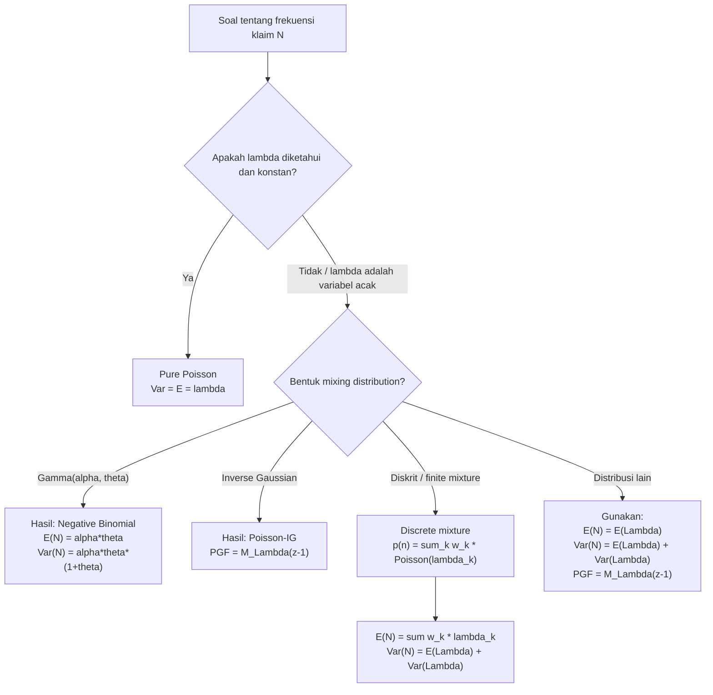

# 📊 2.4 — Mixed Frequency Distributions

> [!ABSTRACT] Ringkasan Cepat
> **Topik:** Mixed Frequency Distributions | **Bobot:** ~5–10% | **Difficulty:** Hard
> **Ref:** Klugman et al. (2019), Loss Models 5th ed., Bab 7.3–7.5 | **Prereq:** [[2.1 Frequency MGF and PGF]], [[2.2 (a,b,0) and (a,b,1) Distribution Classes]]

## Section 0 — Pemetaan Topik

| Topik TA2 | Sub-topik ID | Skill Diuji | Bobot | Difficulty | Prerequisite | Connected Topics | Referensi |
|---|---|---|---|---|---|---|---|
| Model Frekuensi Klaim | 2.4 | Menentukan distribusi frekuensi campuran, khususnya mixed Poisson; menghitung PMF, mean, variance, dan PGF distribusi campuran | 5–10% | Hard | [[2.1 Frequency MGF and PGF]], [[2.2 (a,b,0) and (a,b,1) Distribution Classes]] | [[2.3 Frequency Model Selection]], [[2.5 Exposure Effect on Frequency]], [[4.2 Compound Distributions]] | Klugman et al. (2019) Bab 7.3–7.5 |

## Section 1 — Intuisi

Bayangkan sebuah perusahaan asuransi kendaraan bermotor yang mengelola ribuan polis. Secara intuitif, tidak semua pengemudi memiliki profil risiko yang sama. Ada pengemudi yang sangat berhati-hati dan jarang sekali mengajukan klaim, ada yang ceroboh dan sering klaim, dan ada yang berada di antaranya. Jika kita menganggap seluruh portofolio itu homogen dan memodelkannya dengan satu distribusi Poisson tunggal, kita kehilangan informasi penting ini. Hasilnya? Model yang terlalu optimistis pada ekor distribusi — kita meremehkan probabilitas frekuensi klaim yang sangat tinggi.

Di sinilah **distribusi frekuensi campuran** (*mixed frequency distribution*) masuk. Ide dasarnya sederhana: parameter distribusi frekuensi — misalnya $\lambda$ pada distribusi Poisson — bukan sebuah konstanta, melainkan sebuah variabel acak yang mencerminkan heterogenitas portofolio. Setiap tertanggung menarik parameter $\lambda$-nya sendiri dari suatu distribusi tertentu (disebut *mixing distribution*), lalu frekuensi klaim mereka berdistribusi Poisson dengan $\lambda$ tersebut. Ketika kita amati seluruh portofolio tanpa mengetahui siapa "tipe" mana, distribusi yang kita lihat adalah rata-rata tertimbang dari semua Poisson ini — itulah distribusi *mixed Poisson*.

Konsekuensi yang sangat penting dan sering diuji: distribusi *mixed Poisson* hampir selalu memiliki **overdispersion**, yaitu $\text{Var}(N) > E(N)$. Ini berbeda dari Poisson murni di mana $\text{Var}(N) = E(N)$. Overdispersion adalah sinyal klinis bahwa portofolio kita heterogen dan mixing sedang terjadi. Dalam praktik aktuaria Indonesia, ini relevan saat kita membangun model frekuensi untuk klaim motor, properti, atau kesehatan di mana segmentasi pemegang polis tidak sempurna.

## Section 2 — Definisi Formal

> [!NOTE] Definisi Matematis — Mixed Distribution
> Misalkan $N \mid \Lambda = \lambda$ berdistribusi dengan PMF $p(n \mid \lambda)$ dan $\Lambda$ adalah variabel acak dengan CDF $U(\lambda)$. Distribusi **tidak bersyarat** (unconditional / marginal) dari $N$ adalah:
>
> $$p(n) = \int_0^\infty p(n \mid \lambda) \, dU(\lambda) = E_\Lambda[p(n \mid \Lambda)]$$

| Simbol | Makna | Catatan |
|---|---|---|
| $N$ | Variabel acak frekuensi klaim yang diamati | Variabel diskrit tidak negatif |
| $\Lambda$ | Parameter acak (*mixing variable*) | Variabel kontinu, $\Lambda > 0$ |
| $p(n \mid \lambda)$ | PMF bersyarat dari $N$ given $\Lambda = \lambda$ | Seringkali Poisson: $e^{-\lambda}\lambda^n/n!$ |
| $U(\lambda)$ | CDF dari distribusi *mixing* $\Lambda$ | Disebut juga *structural distribution* |
| $f_\Lambda(\lambda)$ | PDF dari $\Lambda$ (jika kontinu) | Contoh: Gamma, Inverse Gaussian |
| $P_N(z)$ | PGF dari $N$ | $P_N(z) = E[z^N]$ |
| $P_{N\|\lambda}(z)$ | PGF bersyarat dari $N$ given $\lambda$ | Untuk Poisson: $e^{\lambda(z-1)}$ |

### Rumus Utama

**PMF distribusi mixed (umum):**

$$p(n) = \int_0^\infty p(n \mid \lambda) \, f_\Lambda(\lambda) \, d\lambda$$

*Label: Integral dari PMF bersyarat terhadap mixing distribution; ini adalah **marginalisasi** atas $\Lambda$.*

**PGF distribusi mixed (kunci utama):**

$$P_N(z) = E_\Lambda\left[P_{N\|\Lambda}(z)\right] = \int_0^\infty P_{N\|\lambda}(z) \, f_\Lambda(\lambda) \, d\lambda$$

*Label: PGF dari distribusi campuran adalah ekspektasi dari PGF bersyarat; sangat berguna untuk mixed Poisson.*

**Mean (via Law of Total Expectation):**

$$E(N) = E_\Lambda[E(N \mid \Lambda)] = E(\Lambda)$$

*Label: Untuk mixed Poisson ($E(N\|\lambda) = \lambda$), mean sama dengan mean dari mixing distribution.*

**Variance (via Law of Total Variance):**

$$\text{Var}(N) = E_\Lambda[\text{Var}(N \mid \Lambda)] + \text{Var}_\Lambda[E(N \mid \Lambda)]$$

*Label: Dua komponen: variasi within-group dan variasi between-group.*

**Variance — mixed Poisson spesifik:**

$$\text{Var}(N) = E(\Lambda) + \text{Var}(\Lambda)$$

*Label: Untuk Poisson, $\text{Var}(N\|\lambda) = \lambda$, sehingga $E[\text{Var}(N\|\Lambda)] = E(\Lambda)$ dan komponen kedua adalah $\text{Var}(\Lambda)$.*

**Overdispersion mixed Poisson:**

$$\text{Var}(N) - E(N) = \text{Var}(\Lambda) \geq 0$$

*Label: Karena $\text{Var}(\Lambda) \geq 0$, mixed Poisson selalu overdispersed (atau equidispersed jika $\Lambda$ degenerate).*

**PGF mixed Poisson:**

$$P_N(z) = M_\Lambda(z - 1)$$

*Label: PGF dari mixed Poisson sama dengan MGF dari $\Lambda$ yang dievaluasi di $(z-1)$.*

### Asumsi Eksplisit

1. Diberikan $\Lambda = \lambda$, frekuensi klaim $N \mid \Lambda = \lambda$ berdistribusi Poisson($\lambda$) — ini adalah asumsi khusus untuk *mixed Poisson*.
2. $\Lambda > 0$ hampir pasti (*almost surely*) agar $\lambda$ valid sebagai parameter Poisson.
3. $\Lambda$ dan $N$ bersifat conditionally independent across policyholders diberikan $\lambda$.
4. Mixing distribution $U(\lambda)$ adalah distribusi yang valid (CDF yang well-defined).
5. $E(\Lambda) < \infty$ agar $E(N)$ terdefinisi; $E(\Lambda^2) < \infty$ agar $\text{Var}(N)$ terdefinisi.

## Section 3 — Jembatan Logika

> [!TIP] Dari Definisi ke Rumus
> Kunci untuk memahami mixed Poisson adalah **Law of Total Expectation dan Law of Total Variance**. Kita tidak pernah mengamati $\Lambda$ secara langsung — kita hanya mengamati $N$. Karena $\Lambda$ tersembunyi (*latent*), kita rata-ratakan (*marginalize*) semua kemungkinan nilai $\lambda$ dengan bobotnya masing-masing (yaitu $f_\Lambda(\lambda)$). Ini menghasilkan distribusi marginal $N$ yang merupakan campuran dari tak hingga banyak distribusi Poisson.

> [!IMPORTANT] Support dan Domain
> - $N \in \{0, 1, 2, 3, \ldots\}$ — frekuensi klaim adalah integer non-negatif.
> - $\Lambda \in (0, \infty)$ — harus positif agar valid sebagai parameter Poisson.
> - $z \in [0, 1]$ saat mengevaluasi PGF untuk keperluan probabilitas; $z$ bisa kompleks untuk analisis analitik.

**Derivasi Variance Mixed Poisson — Step by Step:**

**Step 1 — Gunakan Law of Total Variance:**

$$\text{Var}(N) = E[\text{Var}(N \mid \Lambda)] + \text{Var}[E(N \mid \Lambda)]$$

**Step 2 — Substitusi properti distribusi Poisson** ($E(N\|\lambda) = \lambda$ dan $\text{Var}(N\|\lambda) = \lambda$):

$$= E[\Lambda] + \text{Var}[\Lambda]$$

**Step 3 — Interpretasi:**

$$\text{Var}(N) = \underbrace{E(\Lambda)}_{\text{komponen "Poisson"}} + \underbrace{\text{Var}(\Lambda)}_{\text{komponen heterogenitas}}$$

Komponen pertama adalah variance yang "sudah ada" jika populasi homogen (pure Poisson). Komponen kedua adalah *excess variance* akibat heterogenitas portofolio.

**Derivasi PGF Mixed Poisson — Step by Step:**

**Step 1 — Definisi PGF:**

$$P_N(z) = E[z^N] = E_\Lambda\left[E[z^N \mid \Lambda]\right]$$

**Step 2 — PGF Poisson bersyarat** adalah $E[z^N \mid \Lambda = \lambda] = e^{\lambda(z-1)}$:

$$P_N(z) = E_\Lambda\left[e^{\Lambda(z-1)}\right]$$

**Step 3 — Kenali bentuk MGF:** $E[e^{t\Lambda}]$ dengan $t = z - 1$ adalah definisi MGF dari $\Lambda$:

$$P_N(z) = M_\Lambda(z - 1)$$

**Step 4 — Implikasi:** Mengetahui MGF dari $\Lambda$ langsung memberikan PGF dari $N$. Ini adalah *shortcut* paling powerful untuk mixed Poisson.

> [!DANGER] Dilarang
> 1. **Jangan samakan** $\text{Var}(N) = E(N)$ untuk mixed Poisson — ini hanya berlaku untuk Poisson murni (*pure Poisson*). Mixed Poisson selalu memiliki $\text{Var}(N) \geq E(N)$.
> 2. **Jangan lupa komponen kedua** dalam Law of Total Variance. Sering kali peserta hanya menghitung $E[\text{Var}(N\|\Lambda)]$ dan melewatkan $\text{Var}[E(N\|\Lambda)]$.
> 3. **Jangan tukar argumen** pada rumus PGF: $P_N(z) = M_\Lambda(z-1)$, bukan $M_\Lambda(z)$. Argumen MGF adalah $(z-1)$, bukan $z$.

## Section 4 — Contoh Soal

### Soal A — Fundamental

**Soal:** Frekuensi klaim $N$ mengikuti distribusi mixed Poisson di mana mixing variable $\Lambda \sim \text{Gamma}(\alpha, \theta)$ dengan $\alpha = 3$ dan $\theta = 2$ (sehingga $E(\Lambda) = \alpha\theta = 6$ dan $\text{Var}(\Lambda) = \alpha\theta^2 = 12$). Tentukan $E(N)$ dan $\text{Var}(N)$.

> [!SUCCESS] Solusi Soal A
> **Pendekatan:** Gunakan rumus langsung mixed Poisson: $E(N) = E(\Lambda)$ dan $\text{Var}(N) = E(\Lambda) + \text{Var}(\Lambda)$.
>
> **1. Identifikasi Variabel**
> - $\Lambda \sim \text{Gamma}(\alpha = 3, \theta = 2)$
> - $E(\Lambda) = \alpha \theta = 3 \times 2 = 6$
> - $\text{Var}(\Lambda) = \alpha \theta^2 = 3 \times 4 = 12$
>
> **2. Identifikasi Distribusi / Model**
> Mixed Poisson dengan Gamma mixing → hasilnya adalah distribusi **Negative Binomial** (fakta klasik yang sering diuji).
>
> **3. Setup Persamaan**
>
> $$E(N) = E(\Lambda) = 6$$
>
> $$\text{Var}(N) = E(\Lambda) + \text{Var}(\Lambda)$$
>
> **4. Eksekusi Aljabar**
>
> $$E(N) = 6$$
>
> $$\text{Var}(N) = 6 + 12 = 18$$
>
> **5. Verification**
> $\text{Var}(N) = 18 > E(N) = 6$ ✓ — overdispersion terkonfirmasi. Rasio $\text{Var}/E = 3 > 1$ konsisten dengan Negative Binomial yang memang selalu overdispersed.
>
> **Hasil:** $E(N) = 6$, $\text{Var}(N) = 18$. Excess variance sebesar $\text{Var}(\Lambda) = 12$ mencerminkan heterogenitas portofolio.

> [!WARNING] Exam Tips — Soal A
> **Target waktu:** 2 menit. **Common trap:** Menggunakan $\text{Var}(N) = E(N) = 6$ (formula Poisson murni). **Shortcut:** Hafalkan bahwa untuk mixed Poisson, $\text{Var}(N) = E(\Lambda) + \text{Var}(\Lambda)$, tidak perlu integrasi apa pun.

---

### Soal B — Exam-Typical

**Soal:** $N \mid \Lambda = \lambda$ berdistribusi Poisson($\lambda$) dan $\Lambda$ berdistribusi Inverse Gaussian dengan mean $\mu = 4$ dan parameter shape $\beta$ sehingga $\text{Var}(\Lambda) = \mu^3/\beta = 8$. Tentukan $P_N(z)$ dalam bentuk closed-form, dan hitung $P(N = 0)$.

> [!SUCCESS] Solusi Soal B
> **Pendekatan:** Gunakan $P_N(z) = M_\Lambda(z-1)$. Cari MGF Inverse Gaussian, substitusi, lalu evaluasi di $z = 0$ untuk $P(N = 0)$.
>
> **1. Identifikasi Variabel**
> - $\mu = E(\Lambda) = 4$
> - $\text{Var}(\Lambda) = \mu^3/\beta = 64/\beta = 8 \Rightarrow \beta = 8$
> - MGF Inverse Gaussian$(\mu, \beta)$: $M_\Lambda(t) = \exp\!\left\{\frac{\beta}{\mu}\left(1 - \sqrt{1 - \frac{2\mu^2 t}{\beta}}\right)\right\}$
>
> **2. Identifikasi Distribusi / Model**
> Mixed Poisson dengan Inverse Gaussian mixing menghasilkan distribusi **Poisson-Inverse Gaussian** (PIG), dikenal memiliki ekor lebih tebal dari Negative Binomial.
>
> **3. Setup Persamaan**
>
> $$P_N(z) = M_\Lambda(z - 1) = \exp\!\left\{\frac{\beta}{\mu}\left(1 - \sqrt{1 - \frac{2\mu^2(z-1)}{\beta}}\right)\right\}$$
>
> **4. Eksekusi Aljabar**
>
> Substitusi $\mu = 4$, $\beta = 8$:
>
> $$\frac{\beta}{\mu} = \frac{8}{4} = 2, \qquad \frac{2\mu^2}{\beta} = \frac{2 \times 16}{8} = 4$$
>
> $$P_N(z) = \exp\!\left\{2\left(1 - \sqrt{1 - 4(z-1)}\right)\right\}$$
>
> Untuk $P(N = 0)$, evaluasi $P_N(z)$ di $z = 0$:
>
> $$P_N(0) = \exp\!\left\{2\left(1 - \sqrt{1 - 4(0-1)}\right)\right\} = \exp\!\left\{2\left(1 - \sqrt{5}\right)\right\}$$
>
> $$= \exp\!\left\{2(1 - 2.2361)\right\} = \exp\!\left\{2(-1.2361)\right\} = \exp(-2.4721) \approx 0.0844$$
>
> **5. Verification**
> $P(N=0) \approx 0.0844$. Cross-check dengan batas: jika ini Poisson murni dengan $\lambda = 4$, maka $P(N=0) = e^{-4} \approx 0.0183$. Mixed Poisson-IG memberikan $P(N=0)$ yang lebih besar karena massa probabilitas tersebar, termasuk di ekor kiri — masuk akal.
>
> **Hasil:** $P_N(z) = \exp\!\left\{2\left(1 - \sqrt{5 - 4z}\right)\right\}$ dan $P(N = 0) \approx 0.0844$.

> [!WARNING] Exam Tips — Soal B
> **Target waktu:** 4 menit. **Common trap:** Salah mensubstitusi argumen MGF — ingat selalu $M_\Lambda(z-1)$, bukan $M_\Lambda(z)$. **Shortcut:** Kenali kombinasi (mixing, hasil) yang umum: Gamma → NegBin, Inverse Gaussian → PIG, ETNB → Poisson-ETNB.

---

### Soal C — Challenging

**Soal:** Sebuah portofolio asuransi terdiri dari dua kelas pemegang polis: 40% adalah pengemudi berisiko rendah (*low risk*) dengan frekuensi klaim Poisson($\lambda_L = 1$), dan 60% adalah pengemudi berisiko tinggi (*high risk*) dengan frekuensi klaim Poisson($\lambda_H = 4$). Seorang pemegang polis dipilih secara acak dari portofolio ini. Misalkan $N$ adalah frekuensi klaimnya. (a) Tentukan $P(N = 0)$ dan $P(N = 1)$. (b) Hitung $E(N)$ dan $\text{Var}(N)$. (c) Tentukan distribusi $\Lambda$ (mixing distribution) dan verifikasi bahwa $\text{Var}(N) - E(N) = \text{Var}(\Lambda)$.

> [!SUCCESS] Solusi Soal C
> **Pendekatan:** $\Lambda$ adalah variabel acak diskrit (dua titik: $\lambda_L = 1$ dengan prob $0.4$, $\lambda_H = 4$ dengan prob $0.6$). Gunakan marginalisasi langsung untuk PMF dan rumus mixed Poisson untuk momen.
>
> **1. Identifikasi Variabel**
> - $P(\Lambda = 1) = 0.4$, $P(\Lambda = 4) = 0.6$
> - $N \mid \Lambda = 1 \sim \text{Poisson}(1)$, $N \mid \Lambda = 4 \sim \text{Poisson}(4)$
>
> **2. Identifikasi Distribusi / Model**
> Ini adalah *discrete mixture* of Poissons — mixing distribution $\Lambda$ adalah diskrit, bukan kontinu. Prinsip marginalisasi tetap sama: jumlahkan (bukan integrasikan) atas nilai-nilai $\Lambda$.
>
> **3. Setup Persamaan**
>
> $$P(N = n) = 0.4 \cdot \frac{e^{-1} \cdot 1^n}{n!} + 0.6 \cdot \frac{e^{-4} \cdot 4^n}{n!}$$
>
> $$E(\Lambda) = 0.4(1) + 0.6(4), \qquad E(\Lambda^2) = 0.4(1)^2 + 0.6(4)^2$$
>
> **4. Eksekusi Aljabar**
>
> **(a) PMF:**
>
> $$P(N = 0) = 0.4 \cdot e^{-1} + 0.6 \cdot e^{-4} = 0.4(0.36788) + 0.6(0.01832)$$
>
> $$= 0.14715 + 0.01099 = 0.15814$$
>
> $$P(N = 1) = 0.4 \cdot e^{-1} \cdot 1 + 0.6 \cdot e^{-4} \cdot 4 = 0.4(0.36788) + 0.6(0.07326)$$
>
> $$= 0.14715 + 0.04396 = 0.19111$$
>
> **(b) Momen:**
>
> $$E(\Lambda) = 0.4(1) + 0.6(4) = 0.4 + 2.4 = 2.8$$
>
> $$E(N) = E(\Lambda) = 2.8$$
>
> $$E(\Lambda^2) = 0.4(1) + 0.6(16) = 0.4 + 9.6 = 10$$
>
> $$\text{Var}(\Lambda) = E(\Lambda^2) - [E(\Lambda)]^2 = 10 - (2.8)^2 = 10 - 7.84 = 2.16$$
>
> $$\text{Var}(N) = E(\Lambda) + \text{Var}(\Lambda) = 2.8 + 2.16 = 4.96$$
>
> **(c) Verifikasi:**
>
> $$\text{Var}(N) - E(N) = 4.96 - 2.8 = 2.16 = \text{Var}(\Lambda) \checkmark$$
>
> **5. Verification**
> $P(N=0) \approx 0.158$ — lebih tinggi dari Poisson($2.8$) murni di mana $P(N=0) = e^{-2.8} \approx 0.061$. Ini wajar: mixing menambah massa di $N=0$ karena sebagian besar polis tipe *low-risk* (Poisson(1)) memiliki $P(N=0)$ besar. Overdispersion: $\text{Var}(N) = 4.96 \gg E(N) = 2.8$ ✓.
>
> **Hasil:** $P(N=0) \approx 0.1581$, $P(N=1) \approx 0.1911$; $E(N) = 2.8$, $\text{Var}(N) = 4.96$; identitas overdispersion terkonfirmasi.

> [!WARNING] Exam Tips — Soal C
> **Target waktu:** 6 menit. **Common trap:** Menggunakan rumus kontinu ($\int$) padahal mixing distribution diskrit — cukup gunakan penjumlahan. **Shortcut:** Selalu hitung $E(\Lambda)$ dan $E(\Lambda^2)$ terlebih dahulu; semua momen $N$ mengikuti otomatis. Jika soal meminta $P(N=n)$ lebih dari 2 nilai, cari PGF dulu lalu differentiate.

## Section 5 — Verifikasi & Sanity Check

> [!CHECK] Cross-Check 1 — Overdispersion Index
> Hitung **dispersion index** $D = \text{Var}(N) / E(N)$. Untuk mixed Poisson:
>
> $$D = \frac{E(\Lambda) + \text{Var}(\Lambda)}{E(\Lambda)} = 1 + \frac{\text{Var}(\Lambda)}{E(\Lambda)} = 1 + \text{CV}^2(\Lambda) \cdot E(\Lambda) / E(\Lambda)$$
>
> Lebih mudah: $D = 1 + \text{Var}(\Lambda)/E(\Lambda) \geq 1$ selalu. Jika hasil Anda memberi $D < 1$, ada kesalahan.

> [!CHECK] Cross-Check 2 — Konsistensi PGF dengan Momen
> Dari PGF $P_N(z)$, momen dapat diturunkan:
>
> $$E(N) = P_N'(1) \qquad \text{dan} \qquad E(N(N-1)) = P_N''(1)$$
>
> Sehingga $\text{Var}(N) = P_N''(1) + P_N'(1) - [P_N'(1)]^2$. Gunakan ini untuk memverifikasi momen dari PGF yang diperoleh via $P_N(z) = M_\Lambda(z-1)$.

> [!CHECK] Cross-Check 3 — Nilai PMF
> Pastikan $\sum_{n=0}^{\infty} p(n) = 1$. Untuk soal diskrit (finite mixture), hitung secara partial sum dan pastikan mendekati 1 untuk $n$ yang cukup besar.

### Metode Alternatif

Untuk kasus khusus **Poisson-Gamma** (mixing distribution Gamma($\alpha, \theta$)), distribusi marginal $N$ adalah **Negative Binomial** dengan parameter $r = \alpha$ dan $\beta = \theta$:

$$p(n) = \binom{n + \alpha - 1}{n} \left(\frac{1}{1+\theta}\right)^\alpha \left(\frac{\theta}{1+\theta}\right)^n, \quad n = 0, 1, 2, \ldots$$

Artinya, PMF bisa langsung dihitung menggunakan formula Negative Binomial tanpa integrasi — ini adalah shortcut yang sangat menghemat waktu di ujian.

## Section 6 — Visualisasi Mental

**Distribusi Mixed Poisson — Gambaran Visual:**

Bayangkan sumbu-X adalah jumlah klaim $n = 0, 1, 2, \ldots$ dan sumbu-Y adalah probabilitas $p(n)$.

- **Poisson($\lambda = 1$):** Distribusi "ramping" dengan puncak di sekitar $n = 0$–$1$, ekor cepat menipis.
- **Poisson($\lambda = 4$):** Distribusi lebih "lebar" dengan puncak di $n = 3$–$4$, ekor lebih tebal.
- **Mixed (40% Poisson(1) + 60% Poisson(4)):** Distribusi *bimodal* dengan dua tonjolan kecil di kiri (dari komponen $\lambda=1$) dan di tengah (dari komponen $\lambda=4$), ekor secara keseluruhan lebih tebal dari kedua komponen individual di mean $\bar{\lambda} = 2.8$.

**Perbandingan Ekor:**

Semakin besar $\text{Var}(\Lambda)$, semakin tebal ekor distribusi marginal $N$. Secara visual, mixed Poisson "lebih datar dan lebih lebar" dibanding Poisson murni dengan mean yang sama — ini adalah signature overdispersion.

**Representasi Hierarkis:**

```
Level 1 (Unobserved):  Λ ~ f_Λ(λ)   [mixing distribution]
                              ↓
Level 2 (Observed):    N | Λ = λ ~ Poisson(λ)
                              ↓
Marginal:              N ~ Mixed Poisson
```

Struktur hierarkis dua-level ini adalah fondasi model *hierarchical* / *random effects* dalam aktuaria.

### Hubungan Visual ↔ Rumus

| Elemen Visual | Komponen Rumus |
|---|---|
| Lebar distribusi marginal | $\text{Var}(N) = E(\Lambda) + \text{Var}(\Lambda)$ |
| Komponen kiri (rendah $\lambda$) | $p(n) = \int \ldots$ — kontribusi $\lambda$ kecil |
| Tinggi ekor distribusi | Dikontrol oleh ekor $f_\Lambda(\lambda)$ — tebal = ekor berat |
| Ketinggian puncak | $E(N) = E(\Lambda)$ — puncak sekitar mean $\Lambda$ |
| Dua tonjolan (discrete mixture) | Setiap komponen Poisson menyumbang satu "puncak lokal" |

## Section 7 — Jebakan Umum

> [!BUG] Kesalahan Parametrisasi
> **Salah:** Menggunakan $\text{Var}(N) = E(\Lambda) = \mu$ (formula Poisson murni).
> **Benar:** $\text{Var}(N) = E(\Lambda) + \text{Var}(\Lambda)$ untuk mixed Poisson. Komponen $\text{Var}(\Lambda)$ tidak boleh diabaikan — bahkan sering lebih besar dari $E(\Lambda)$.
>
> **Salah:** Menggunakan $P_N(z) = M_\Lambda(z)$.
> **Benar:** $P_N(z) = M_\Lambda(z - 1)$. Argumen MGF adalah $(z-1)$, bukan $z$. Ini mengikuti dari substitusi PGF Poisson $e^{\lambda(z-1)}$.

> [!BUG] Kesalahan Konseptual
> 1. **Confusing compound vs. mixed:** Distribusi *compound* Poisson adalah $S = X_1 + \cdots + X_N$ (jumlah acak dari klaim); distribusi *mixed* Poisson adalah $N$ dengan $\lambda$ acak. Keduanya berbeda — jangan tukar.
> 2. **Assuming unimodal:** Mixed Poisson tidak selalu unimodal. Discrete mixture bisa bimodal atau multimodal, terutama jika komponen-komponen $\lambda$ berjauhan.
> 3. **Ignoring discrete mixing:** Mixing distribution tidak harus kontinu. Finite mixture (diskrit) juga valid dan menghasilkan distribusi mixed Poisson yang sah.
> 4. **Menyamakan mixed Poisson dengan Negative Binomial:** Poisson-Gamma memang menghasilkan NegBin, tetapi mixed Poisson dengan mixing distribution *lain* (Inverse Gaussian, Lognormal, dsb.) menghasilkan distribusi yang berbeda dari NegBin.

> [!BUG] Kesalahan Interpretasi Soal
> - Soal berbunyi *"parameter $\lambda$ varies across policyholders"* → ini adalah cue untuk mixed Poisson, bukan pure Poisson.
> - Soal menyebutkan *"randomly selected policyholder"* dari populasi heterogen → distribusi yang diminta adalah distribusi marginal (campuran), bukan bersyarat.
> - Soal meminta *"variance exceeds mean"* atau *"overdispersed"* → ini ciri khas mixed Poisson; jangan gunakan pure Poisson.

> [!CAUTION] Red Flags — Keyword di Soal
> - *"Mixing distribution"*, *"structural distribution"*, *"heterogeneous portfolio"* → gunakan framework mixed Poisson
> - *"Given $\Lambda = \lambda$, $N$ is Poisson($\lambda$)"* → setup bersyarat; cari distribusi marginal
> - *"$\text{Var}(N) > E(N)$"* atau *"overdispersion"* → konsistensi dengan mixed Poisson, tidak dengan pure Poisson
> - *"PGF of $N$"* untuk mixed Poisson → langsung $P_N(z) = M_\Lambda(z-1)$; cari MGF $\Lambda$ terlebih dahulu
> - *"Two types of policyholders"* atau *"proportion $p$ are low-risk"* → discrete finite mixture

## Section 8 — Ringkasan Eksekutif

> [!SUMMARY] Must-Remember
>
> 1. **PMF marginal:**
>    $$p(n) = E_\Lambda\!\left[\frac{e^{-\Lambda}\Lambda^n}{n!}\right] = \int_0^\infty \frac{e^{-\lambda}\lambda^n}{n!} f_\Lambda(\lambda)\,d\lambda$$
>
> 2. **Mean mixed Poisson:**
>    $$E(N) = E(\Lambda)$$
>
> 3. **Variance mixed Poisson:**
>    $$\text{Var}(N) = E(\Lambda) + \text{Var}(\Lambda)$$
>
> 4. **Overdispersion:**
>    $$\text{Var}(N) - E(N) = \text{Var}(\Lambda) \geq 0$$
>
> 5. **PGF = MGF of mixing:**
>    $$P_N(z) = M_\Lambda(z - 1)$$
>
> 6. **Combo klasik:** Poisson + Gamma mixing $\Rightarrow$ **Negative Binomial**

### Kapan Digunakan

- Soal menyebutkan bahwa $\lambda$ dalam distribusi Poisson bervariasi antar pemegang polis (acak).
- Soal menyebutkan portofolio heterogen dengan beberapa tipe risiko.
- Diminta menghitung distribusi frekuensi klaim untuk pemegang polis yang *dipilih secara acak* dari populasi campuran.
- Diminta menunjukkan atau membuktikan overdispersion ($\text{Var}(N) > E(N)$).
- Diminta PGF dari distribusi frekuensi campuran.

### Kapan TIDAK Boleh Digunakan

- Jika $\lambda$ sudah diketahui dan konstan (pure Poisson) — tidak ada mixing.
- Jika soal meminta distribusi **bersyarat** $N \mid \Lambda = \lambda$ — itu Poisson biasa, bukan marginal.
- Jika distribusi frekuensi yang dimaksud adalah *compound* (jumlah agregat klaim) — itu bukan mixing, itu compound distribution (Topik [[4.2 Compound Distributions]]).

### Quick Decision Tree



---

> [!QUOTE] Follow-up Options
> 1. *"Berikan contoh soal variasi Poisson-Inverse Gaussian dengan perhitungan PMF lengkap"*
> 2. *"Jelaskan hubungan [[2.4 Mixed Frequency Distributions]] dengan [[4.2 Compound Distributions]] — apa bedanya mixing vs compounding?"*
> 3. *"Buat flashcard 1-halaman untuk topik ini"*
> 4. *"Generate notes [[2.5 Exposure Effect on Frequency]] sebagai kelanjutan topik ini"*

*📖 Ref: Klugman, Panjer & Willmot (2019), Loss Models 5th ed., Bab 7.3–7.5 | 🗓️ 2026-04-17 | #TA2 #MixedFrequency #MixedPoisson*
