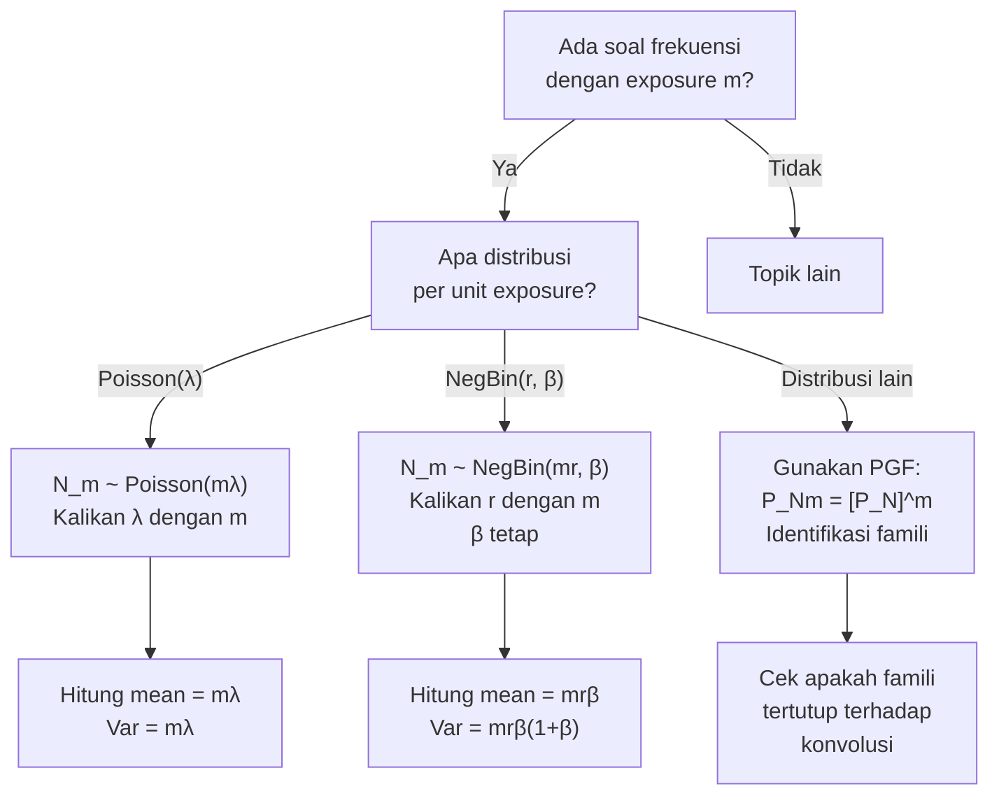

# 📊 2.5 — Exposure Effect on Frequency

> [!ABSTRACT] Ringkasan Cepat
> **Topik:** Exposure Effect on Frequency | **Bobot:** ~5–10% | **Difficulty:** Medium
> **Ref:** Klugman et al. (2019), Bab 6, 7.3–7.5 | **Prereq:** [[2.1 Frequency MGF and PGF]], [[2.2 (a,b,0) and (a,b,1) Distribution Classes]]

## Section 0 — Pemetaan Topik

| Topik TA2 | Sub-topik ID | Skill Diuji | Bobot | Difficulty | Prerequisite | Connected Topics | Referensi |
|---|---|---|---|---|---|---|---|
| Model Frekuensi Klaim | 2.5 | Menjelaskan dan menghitung dampak exposure pada parameter distribusi frekuensi klaim | 5–10% | Medium | [[2.1 Frequency MGF and PGF]], [[2.2 (a,b,0) and (a,b,1) Distribution Classes]] | [[2.3 Frequency Model Selection]], [[2.4 Mixed Frequency Distributions]], [[4.1 Individual and Collective Risk Models]] | Klugman et al. (2019) Bab 6, 7.3–7.5 |

## Section 1 — Intuisi

Bayangkan sebuah perusahaan asuransi kendaraan bermotor. Polis pertama menanggung 1 unit motor selama 1 tahun penuh. Polis kedua menanggung 5 unit motor. Polis ketiga hanya menanggung 1 unit motor selama 6 bulan karena polisnya baru mulai pertengahan tahun. Apakah ketiga polis ini layak diperlakukan sama ketika kita memodelkan frekuensi klaim? Tentu tidak — jumlah klaim yang wajar diharapkan dari polis kedua jauh lebih tinggi dari polis pertama, dan polis ketiga hanya punya setengah tahun "kesempatan" untuk menghasilkan klaim.

Konsep **exposure** menangkap ukuran risiko yang sebenarnya ditanggung oleh setiap polis atau portofolio. Exposure bisa berupa jumlah kendaraan, jumlah karyawan, volume premi, atau durasi waktu tanggungan — intinya, satuan yang mengukur seberapa besar "ladang" tempat klaim bisa tumbuh. Semakin besar exposure, semakin banyak klaim yang diharapkan.

Pertanyaan inti topik ini adalah: jika kita tahu distribusi frekuensi klaim untuk satu unit exposure selama satu periode, bagaimana distribusi frekuensi berubah ketika exposure-nya berubah menjadi $m$ kali lipat? Jawabannya sangat elegan untuk distribusi Poisson, dan masih bisa dikelola untuk distribusi Negatif Binomial — dua workhorse utama pemodelan frekuensi dalam aktuaria nonlife.

## Section 2 — Definisi Formal

> [!NOTE] Definisi Matematis
> Misalkan $N$ adalah jumlah klaim untuk satu unit exposure dalam satu periode referensi, dengan parameter distribusi $\boldsymbol{\theta}$. Jika exposure aktual adalah $m > 0$, maka distribusi frekuensi untuk exposure $m$ adalah distribusi dari variabel acak $N_m$ — yaitu total klaim dari $m$ unit exposure independen dan identik.

| Simbol | Makna | Catatan |
|---|---|---|
| $N$ | Jumlah klaim untuk 1 unit exposure | Variabel acak dasar |
| $m$ | Besarnya exposure | $m > 0$, bisa non-integer (misal 0.5 tahun) |
| $N_m$ | Jumlah klaim untuk exposure $m$ | $N_m = N_1 + N_2 + \cdots + N_m$ (untuk $m$ integer) |
| $\lambda$ | Parameter rate Poisson per unit exposure | $\lambda > 0$ |
| $r$ | Parameter dispersi Negatif Binomial | $r > 0$ |
| $\beta$ | Parameter skala Negatif Binomial | $\beta > 0$ |
| $P_N(z)$ | PGF dari $N$ | $P_N(z) = E[z^N]$ |

### Rumus Utama

**Kasus 1: Poisson dengan Parameter $\lambda$**

Jika $N \sim \text{Poisson}(\lambda)$, maka untuk exposure $m$:

$$
N_m \sim \text{Poisson}(m\lambda)
$$

**Label:** Parameter Poisson berskala linear dengan exposure.

**Kasus 2: Negatif Binomial dengan Parameter $(r, \beta)$**

Jika $N \sim \text{NegBin}(r, \beta)$, maka untuk exposure $m$:

$$
N_m \sim \text{NegBin}(mr, \beta)
$$

**Label:** Parameter $r$ berskala linear dengan exposure; $\beta$ tetap.

**Mean dan Variansi setelah Scaling Exposure:**

$$
E[N_m] = m \cdot E[N], \qquad \text{Var}(N_m) = m \cdot \text{Var}(N)
$$

**Label:** Untuk Poisson, mean = variansi = $m\lambda$. Untuk NegBin, mean = $mr\beta$, variansi = $mr\beta(1+\beta)$.

**Sifat PGF di bawah Scaling Exposure (untuk $m$ integer):**

$$
P_{N_m}(z) = \left[P_N(z)\right]^m
$$

**Label:** PGF dari jumlah $m$ variabel iid adalah pangkat $m$ dari PGF tunggal.

**Perluasan untuk $m$ non-integer (Poisson):**

$$
P_{N_m}(z) = e^{m\lambda(z-1)}
$$

**Label:** Untuk Poisson, rumus ini berlaku untuk semua $m > 0$ real, bukan hanya integer.

### Asumsi Eksplisit

1. Klaim dari setiap unit exposure bersifat **independen** satu sama lain.
2. Setiap unit exposure mengikuti distribusi frekuensi yang **identik** (homogen).
3. Exposure $m$ diasumsikan **diketahui dengan pasti** (non-stochastic), bukan variabel acak.
4. Untuk distribusi Negatif Binomial: perluasan ke $m$ non-integer dimungkinkan karena parameter $r$ menjadi $mr$ yang tetap positif real untuk semua $m > 0$.
5. Distribusi Binomial **tidak stabil** terhadap perubahan exposure dalam cara yang sama — perlu hati-hati.

## Section 3 — Jembatan Logika

> [!TIP] Dari Definisi ke Rumus
> Kunci seluruh topik ini adalah sifat **reproductive** (closure under convolution) dari distribusi Poisson dan Negatif Binomial. Jika $X_1, X_2, \ldots, X_m$ iid dengan distribusi tertentu, maka jumlah $S = X_1 + \cdots + X_m$ mengikuti distribusi dari **famili yang sama** — hanya parameternya yang berubah. Properti inilah yang membuat dua distribusi ini sangat berguna dalam pemodelan frekuensi: exposure bisa kita ubah-ubah tanpa harus keluar dari famili distribusi yang sama.

> [!IMPORTANT] Support dan Domain
> - $N_m$ memiliki support $\{0, 1, 2, \ldots\}$ untuk semua $m > 0$.
> - Untuk $m$ non-integer, definisi $N_m$ melalui PGF adalah yang paling umum digunakan, bukan melalui konvolusi fisik sejumlah variabel acak.
> - Negatif Binomial dengan $r$ non-integer tetap valid sebagai distribusi probabilitas yang proper.

**Derivasi: Mengapa Poisson$(m\lambda)$ untuk Exposure $m$?**

**Langkah 1 — PGF Poisson dasar:**

$$
P_N(z) = E[z^N] = e^{\lambda(z-1)}
$$

**Langkah 2 — PGF untuk jumlah $m$ variabel Poisson iid (m integer):**

Karena $N_m = N_1 + N_2 + \cdots + N_m$ dengan $N_i$ iid Poisson$(\lambda)$:

$$
P_{N_m}(z) = \prod_{i=1}^{m} P_{N_i}(z) = \left[e^{\lambda(z-1)}\right]^m = e^{m\lambda(z-1)}
$$

**Langkah 3 — Identifikasi distribusi:**

PGF $e^{m\lambda(z-1)}$ adalah PGF dari distribusi Poisson dengan parameter $m\lambda$. Oleh karena itu:

$$
N_m \sim \text{Poisson}(m\lambda)
$$

**Langkah 4 — Perluasan ke $m$ non-integer:**

Karena $e^{m\lambda(z-1)}$ adalah PGF yang valid untuk semua $m > 0$ real (menghasilkan probabilitas non-negatif yang berjumlah 1), kita dapat mendefinisikan distribusi frekuensi untuk exposure $m$ non-integer melalui PGF ini.

**Derivasi: Mengapa NegBin$(mr, \beta)$ untuk Exposure $m$?**

**Langkah 1 — PGF Negatif Binomial$(r, \beta)$:**

$$
P_N(z) = \left(\frac{1}{1 - \beta(z-1)}\right)^r = \left(\frac{1}{1+\beta-\beta z}\right)^r
$$

**Langkah 2 — PGF untuk jumlah $m$ variabel iid:**

$$
P_{N_m}(z) = \left[P_N(z)\right]^m = \left(\frac{1}{1+\beta-\beta z}\right)^{mr}
$$

**Langkah 3 — Identifikasi:**

PGF $\left(\frac{1}{1+\beta-\beta z}\right)^{mr}$ adalah PGF dari NegBin$(mr, \beta)$. Parameter $\beta$ tidak berubah; hanya $r$ yang berskala dengan $m$.

> [!DANGER] Dilarang
> 1. **Jangan** kalikan $\beta$ dengan $m$ — yang berskala hanya $r$ (untuk NegBin) atau $\lambda$ (untuk Poisson).
> 2. **Jangan** asumsikan distribusi Binomial$(n, p)$ stabil terhadap exposure — untuk exposure $m$, distribusi Binomial$(mn, p)$ hanya valid jika $mn$ integer dan konteks individual risk model terpenuhi.
> 3. **Jangan** lupa bahwa sifat ini hanya berlaku jika unit-unit exposure **independen dan identik** — jika ada heterogenitas, gunakan mixed distributions ([[2.4 Mixed Frequency Distributions]]).

## Section 4 — Contoh Soal

### Soal A — Fundamental

Sebuah polis asuransi kendaraan bermotor memiliki frekuensi klaim yang mengikuti distribusi Poisson dengan rata-rata 0,3 klaim per tahun per kendaraan. Sebuah perusahaan menanggung armada 20 kendaraan selama 1 tahun penuh.

**(a)** Tentukan distribusi jumlah total klaim armada tersebut dalam 1 tahun.

**(b)** Hitung $P(N_{20} = 0)$ dan $E[N_{20}]$.

> [!SUCCESS] Solusi Soal A
> **Pendekatan:** Terapkan sifat scaling Poisson — exposure $m = 20$ unit.
>
> **1. Identifikasi Variabel**
> - $N \sim \text{Poisson}(\lambda = 0.3)$ per kendaraan per tahun
> - $m = 20$ kendaraan (exposure)
> - Target: distribusi $N_{20}$
>
> **2. Identifikasi Distribusi / Model**
> Poisson bersifat reproductive: jumlah 20 variabel Poisson$(0.3)$ iid adalah Poisson$(20 \times 0.3)$.
>
> **3. Setup Persamaan**
>
> $$
> N_{20} \sim \text{Poisson}(m\lambda) = \text{Poisson}(20 \times 0.3)
> $$
>
> **4. Eksekusi Aljabar**
>
> $$
> N_{20} \sim \text{Poisson}(6)
> $$
>
> $$
> P(N_{20} = 0) = e^{-6} \cdot \frac{6^0}{0!} = e^{-6} \approx 0.00248
> $$
>
> $$
> E[N_{20}] = 6, \qquad \text{Var}(N_{20}) = 6
> $$
>
> **5. Verification**
> $E[N_{20}] = 20 \times E[N] = 20 \times 0.3 = 6$ ✓. Probabilitas nol klaim sangat kecil (~0.25%), masuk akal untuk armada 20 kendaraan.
>
> **Hasil:** $N_{20} \sim \text{Poisson}(6)$; $P(N_{20}=0) \approx 0.00248$; $E[N_{20}] = 6$.

> [!WARNING] Exam Tips — Soal A
> **Target waktu:** 2 menit. **Common trap:** Mengalikan parameter dengan $m$ untuk NegBin tapi lupa $\beta$ tetap tidak berubah. Untuk Poisson, hanya $\lambda$ yang dikalikan $m$. **Shortcut:** Langsung tulis $N_m \sim \text{Poisson}(m\lambda)$, tidak perlu derivasi PGF.

---

### Soal B — Exam-Typical

Frekuensi klaim per polis per tahun mengikuti distribusi Negatif Binomial dengan mean 0,4 dan variansi 0,6. Sebuah kelompok terdiri dari 15 polis setara. Tentukan:

**(a)** Parameter $(r, \beta)$ distribusi per polis.

**(b)** Distribusi frekuensi total kelompok tersebut.

**(c)** Mean dan standar deviasi total klaim kelompok.

> [!SUCCESS] Solusi Soal B
> **Pendekatan:** Identifikasi parameter NegBin dari mean dan variansi, lalu terapkan scaling exposure.
>
> **1. Identifikasi Variabel**
> - $E[N] = r\beta = 0.4$
> - $\text{Var}(N) = r\beta(1+\beta) = 0.6$
> - $m = 15$ polis
>
> **2. Identifikasi Distribusi / Model**
> NegBin dengan parameterisasi standar: mean $= r\beta$, variansi $= r\beta(1+\beta)$.
>
> **3. Setup Persamaan**
>
> $$
> \frac{\text{Var}(N)}{E[N]} = \frac{r\beta(1+\beta)}{r\beta} = 1 + \beta
> $$
>
> **4. Eksekusi Aljabar**
>
> $$
> 1 + \beta = \frac{0.6}{0.4} = 1.5 \implies \beta = 0.5
> $$
>
> $$
> r = \frac{E[N]}{\beta} = \frac{0.4}{0.5} = 0.8
> $$
>
> Jadi $N \sim \text{NegBin}(r=0.8,\ \beta=0.5)$ per polis.
>
> Untuk $m = 15$ polis:
>
> $$
> N_{15} \sim \text{NegBin}(mr,\ \beta) = \text{NegBin}(15 \times 0.8,\ 0.5) = \text{NegBin}(12,\ 0.5)
> $$
>
> $$
> E[N_{15}] = mr\beta = 12 \times 0.5 = 6
> $$
>
> $$
> \text{Var}(N_{15}) = mr\beta(1+\beta) = 12 \times 0.5 \times 1.5 = 9
> $$
>
> $$
> \text{SD}(N_{15}) = \sqrt{9} = 3
> $$
>
> **5. Verification**
> $E[N_{15}] = 15 \times E[N] = 15 \times 0.4 = 6$ ✓. $\text{Var}(N_{15}) = 15 \times \text{Var}(N) = 15 \times 0.6 = 9$ ✓.
>
> **Hasil:** Per polis: NegBin$(0.8,\ 0.5)$. Kelompok: NegBin$(12,\ 0.5)$; mean $= 6$, SD $= 3$.

> [!WARNING] Exam Tips — Soal B
> **Target waktu:** 3–4 menit. **Common trap:** Mencoba mengalikan $\beta$ dengan $m$ — ini **salah**. Hanya $r$ yang dikalikan. **Shortcut:** Setelah dapat $\beta$ dari rasio variansi/mean, langsung hitung $r$ dari mean.

---

### Soal C — Challenging

Sebuah portofolio terdiri dari dua kelompok polis. Kelompok A: 8 polis, masing-masing dengan frekuensi Poisson$(\lambda = 0.5)$ per tahun. Kelompok B: 5 polis, masing-masing dengan frekuensi Poisson$(\lambda = 0.8)$ per tahun. Semua polis independen.

**(a)** Tentukan distribusi total klaim portofolio $N_{tot} = N_A + N_B$.

**(b)** Hitung $P(N_{tot} \leq 2)$.

**(c)** Misalkan setiap polis Kelompok A hanya aktif selama 9 bulan dalam tahun tersebut (exposure $m = 0.75$ per polis). Tentukan ulang distribusi total klaim portofolio.

> [!SUCCESS] Solusi Soal C
> **Pendekatan:** Manfaatkan additivitas Poisson dan sifat linear scaling exposure.
>
> **1. Identifikasi Variabel**
> - Kelompok A: 8 polis × Poisson$(0.5)$, exposure penuh
> - Kelompok B: 5 polis × Poisson$(0.8)$, exposure penuh
> - Bagian (c): Kelompok A exposure $m = 0.75$ per polis
>
> **2. Identifikasi Distribusi / Model**
> Poisson bersifat additive: jumlah variabel-variabel Poisson independen (dengan parameter berbeda sekalipun) adalah Poisson dengan total parameter.
>
> **3. Setup Persamaan**
>
> $$
> N_A \sim \text{Poisson}(8 \times 0.5), \qquad N_B \sim \text{Poisson}(5 \times 0.8)
> $$
>
> $$
> N_{tot} = N_A + N_B \sim \text{Poisson}(\lambda_A + \lambda_B)
> $$
>
> **4. Eksekusi Aljabar**
>
> **(a)** Bagian reguler:
>
> $$
> \lambda_A = 8 \times 0.5 = 4, \qquad \lambda_B = 5 \times 0.8 = 4
> $$
>
> $$
> N_{tot} \sim \text{Poisson}(4 + 4) = \text{Poisson}(8)
> $$
>
> **(b)** $P(N_{tot} \leq 2)$:
>
> $$
> P(N=0) = e^{-8} \approx 0.000335
> $$
>
> $$
> P(N=1) = e^{-8} \cdot 8 \approx 0.002684
> $$
>
> $$
> P(N=2) = e^{-8} \cdot \frac{64}{2} \approx 0.010735
> $$
>
> $$
> P(N_{tot} \leq 2) \approx 0.000335 + 0.002684 + 0.010735 \approx 0.01375
> $$
>
> **(c)** Kelompok A dengan exposure $m = 0.75$ per polis:
>
> $$
> \lambda_A^{*} = 8 \times (0.75 \times 0.5) = 8 \times 0.375 = 3
> $$
>
> $$
> N_{tot}^{*} \sim \text{Poisson}(3 + 4) = \text{Poisson}(7)
> $$
>
> **5. Verification**
> Total exposure efektif Kelompok A = $8 \times 0.75 = 6$ unit-tahun. Rate per unit-tahun = 0.5. Total klaim expected = $6 \times 0.5 = 3$ ✓. Additivitas Poisson memastikan parameter hanya dijumlahkan.
>
> **Hasil:** (a) Poisson$(8)$; (b) $\approx 1.375\%$; (c) Poisson$(7)$.

> [!WARNING] Exam Tips — Soal C
> **Target waktu:** 5 menit. **Common trap:** Lupa bahwa additivitas Poisson berlaku bahkan untuk parameter yang berbeda antar kelompok — selama independen, parameternya dijumlahkan langsung. **Shortcut:** Hitung total $m\lambda$ per kelompok terlebih dahulu, baru jumlahkan untuk mendapat parameter total.

## Section 5 — Verifikasi & Sanity Check

> [!CHECK] Cek Konsistensi Mean dan Variansi
> Untuk **semua** distribusi (bukan hanya Poisson dan NegBin):
>
> $$
> E[N_m] = m \cdot E[N], \qquad \text{Var}(N_m) = m \cdot \text{Var}(N)
> $$
>
> Ini berlaku karena $N_m$ adalah jumlah $m$ variabel iid. Jika hasil perhitungan Anda tidak memenuhi ini, ada kesalahan di parameterisasi.

> [!CHECK] Cek Rasio Variansi-Mean (Dispersion Index)
> Untuk **Poisson**: dispersion index $= \frac{\text{Var}(N_m)}{E[N_m]} = \frac{m\lambda}{m\lambda} = 1$. Nilai ini **tidak berubah** dengan perubahan exposure.
>
> Untuk **NegBin**: dispersion index $= 1 + \beta$. Nilai ini juga **tidak berubah** karena $\beta$ tetap konstan saat exposure berubah.
>
> Gunakan ini untuk verifikasi: jika dispersion index berubah, ada kesalahan dalam penskalaan parameter.

### Metode Alternatif

Untuk menghitung distribusi $N_m$ tanpa mengidentifikasi family distribusi, gunakan PGF secara langsung:

$$
P_{N_m}(z) = [P_N(z)]^m
$$

kemudian identifikasi distribusi dari bentuk PGF yang dihasilkan. Ini berguna ketika distribusi dasar bukan Poisson atau NegBin standar.

## Section 6 — Visualisasi Mental

**Distribusi Poisson$(m\lambda)$ sebagai $m$ bertambah:**

- Saat $m = 1$: distribusi terkonsentrasi di sekitar $\lambda$, right-skewed untuk $\lambda$ kecil.
- Saat $m$ bertambah: pusat distribusi bergeser ke kanan sebesar $\lambda$ per unit $m$, distribusi melebar (SD tumbuh sebagai $\sqrt{m\lambda}$), skewness berkurang menuju bentuk lebih simetris (mendekati Normal untuk $m\lambda$ besar).
- Sumbu X: jumlah klaim $\{0, 1, 2, \ldots\}$. Sumbu Y: probabilitas. Puncak (mode) bergeser kanan seiring $m$ naik.

**Distribusi NegBin$(mr, \beta)$ sebagai $m$ bertambah:**

- Mean tumbuh linear: $mr\beta$.
- Variansi tumbuh linear: $mr\beta(1+\beta)$.
- Overdispersion ratio $\frac{\text{Var}}{E} = 1+\beta$ konstan — ekor distribusi tetap lebih berat dari Poisson ekuivalen, tidak peduli besar $m$.

### Hubungan Visual ↔ Rumus

| Elemen Visual | Komponen Rumus |
|---|---|
| Pergeseran puncak ke kanan | $E[N_m] = m \cdot E[N]$ |
| Pelebaran distribusi | $\text{SD}(N_m) = \sqrt{m} \cdot \text{SD}(N)$ |
| Bentuk distribusi tetap sama (Poisson tetap Poisson) | Sifat reproductive: $P_{N_m}(z) = [P_N(z)]^m$ |
| Overdispersion index tetap | $\beta$ tidak berubah untuk NegBin |

## Section 7 — Jebakan Umum

> [!BUG] Kesalahan Parametrisasi
> **Negatif Binomial:** Banyak kandidat mengalikan **$\beta$ dengan $m$** padahal yang benar adalah mengalikan **$r$ dengan $m$**. Ingat: $\beta$ adalah parameter skala *per klaim*, bukan per unit exposure. Yang berskala dengan exposure adalah *jumlah sumber klaim* yang direpresentasikan oleh $r$.

> [!BUG] Kesalahan Konseptual
> 1. **"Exposure harus integer"** — Salah. Exposure $m = 0.5$ (6 bulan) atau $m = 2.3$ parfaitement valid, terutama untuk Poisson dan NegBin.
> 2. **"Semua distribusi stabil terhadap exposure"** — Salah. Hanya distribusi dengan sifat reproductive (Poisson, NegBin, Binomial dalam konteks tertentu) yang memberikan closure di bawah scaling; distribusi seperti Geometric atau Logaritmik tidak memiliki sifat ini secara langsung.
> 3. **"Scaling exposure sama dengan scaling parameter sembarangan"** — Salah. Hanya parameter yang secara fisik merepresentasikan *jumlah sumber klaim* (yaitu $r$ di NegBin, $\lambda$ di Poisson) yang berskala. Parameter bentuk ($\beta$) tidak berubah.
> 4. **"Additivitas Poisson hanya berlaku untuk parameter yang sama"** — Salah. Jumlah variabel Poisson independen dengan parameter berbeda ($\lambda_1, \lambda_2, \ldots$) adalah Poisson$(\lambda_1 + \lambda_2 + \cdots)$.

> [!BUG] Kesalahan Interpretasi Soal
> - **"Per polis per tahun" vs "per tahun total"** — Pastikan $\lambda$ atau $(r, \beta)$ dalam soal adalah parameter *per unit exposure*, bukan total. Jika soal menyebut "rata-rata portofolio", bisa jadi sudah mencerminkan total exposure.
> - **"Exposure dalam unit berbeda"** — Jika $\lambda$ dinyatakan per kendaraan-bulan dan exposure dalam kendaraan-tahun, konversi dulu ke unit yang konsisten sebelum scaling.

> [!CAUTION] Red Flags
> - Kata **"armada"**, **"kelompok polis"**, **"m kendaraan"**, **"n pekerja"** → trigger exposure scaling.
> - Kata **"setengah tahun"**, **"9 bulan"**, **"periode tidak penuh"** → exposure $m < 1$, Poisson$(m\lambda)$.
> - Soal memberikan mean dan variansi distribusi frekuensi → hitung $\beta = \frac{\text{Var}}{E} - 1$, lalu $r = \frac{E}{\beta}$ sebelum scaling.
> - NegBin dengan $r$ = integer kecil (1, 2, 3) → periksa apakah ini sebenarnya distribusi Geometric ($r=1$) atau distribusi lain yang memiliki nama khusus.

## Section 8 — Ringkasan Eksekutif

> [!SUMMARY] Must-Remember
> 1. **Poisson scaling:** $N \sim \text{Poisson}(\lambda) \Rightarrow N_m \sim \text{Poisson}(m\lambda)$
> 2. **NegBin scaling:** $N \sim \text{NegBin}(r, \beta) \Rightarrow N_m \sim \text{NegBin}(mr, \beta)$ — hanya $r$ yang berubah
> 3. **Mean dan variansi:** $E[N_m] = m \cdot E[N]$; $\text{Var}(N_m) = m \cdot \text{Var}(N)$
> 4. **PGF rule (umum):** $P_{N_m}(z) = [P_N(z)]^m$ — berlaku untuk semua distribusi dengan iid unit exposure
> 5. **Dispersion index tetap:** $\frac{\text{Var}(N_m)}{E[N_m]}$ tidak berubah dengan perubahan $m$

### Kapan Digunakan

- Soal menyebutkan portofolio dengan **lebih dari satu polis** atau **lebih dari satu unit** risiko yang homogen.
- Soal menyebutkan **periode waktu yang berbeda** dari parameter yang diberikan (e.g., parameter per bulan, tapi exposure 1 tahun).
- Soal memberikan **parameter per unit exposure** dan meminta distribusi total untuk $m$ unit.
- Konteks: armada kendaraan, grup pekerja, kumpulan properti, polis dengan berbagai durasi aktif.

### Kapan TIDAK Boleh Digunakan

- Unit-unit exposure **tidak identik** (heterogenitas) → gunakan [[2.4 Mixed Frequency Distributions]].
- Unit-unit exposure **tidak independen** → perlu model korelasi, di luar scope TA2.
- Distribusi bukan Poisson atau NegBin dan soal meminta bentuk distribusi eksplisit (bukan hanya mean/variansi) → verifikasi sifat reproductive distribusi tersebut dahulu.

### Quick Decision Tree

---

> [!QUOTE] Follow-up Options
> 1. *"Berikan contoh soal variasi di mana exposure berbeda antar polis dalam satu portofolio"*
> 2. *"Jelaskan hubungan [[2.5 Exposure Effect on Frequency]] dengan [[2.4 Mixed Frequency Distributions]] dalam konteks mixed Poisson"*
> 3. *"Buat flashcard 1-halaman untuk topik ini"*

*📖 Ref: Klugman, Panjer & Willmot (2019) Loss Models 5th ed., Bab 6 & 7.3–7.5 | 🗓️ 2026-04-17 | #TA2 #FrequencyModel #Exposure*
