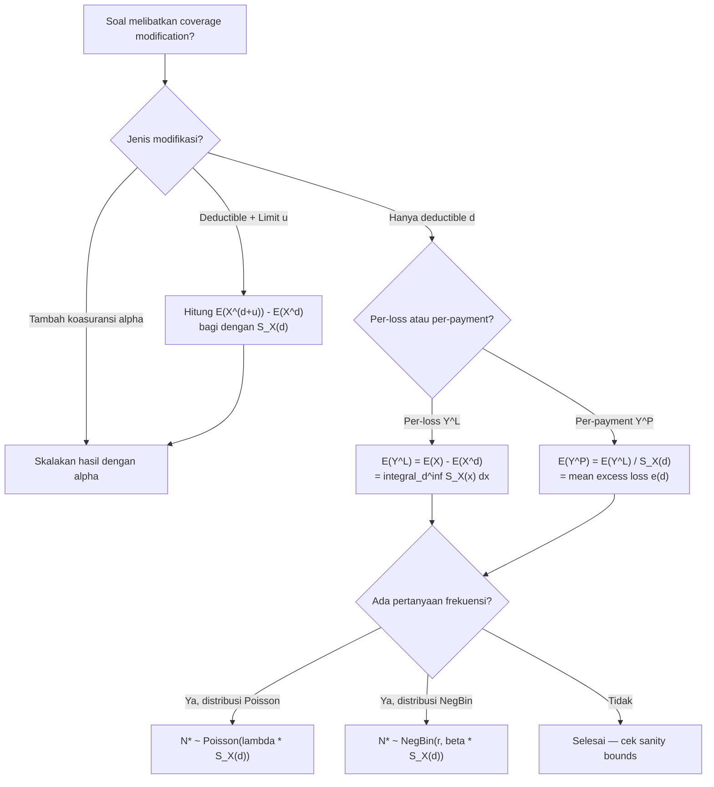

# 📊 3.1 — Coverage Modifications on Severity and Frequency

> [!ABSTRACT] Ringkasan Cepat
> **Topik:** Coverage Modifications on Severity and Frequency | **Bobot:** ~5–10% | **Difficulty:** Calculation-Intensive
> **Ref:** Klugman et al. (2019), Loss Models 5th ed., Bab 8 | **Prereq:** [[1.4 Tail Characteristics]], [[2.2 (a,b,0) and (a,b,1) Distribution Classes]]

## Section 0 — Pemetaan Topik

| Topik TA2 | Sub-topik ID | Skill Diuji | Bobot | Difficulty | Prerequisite | Connected Topics | Referensi |
|---|---|---|---|---|---|---|---|
| Besar Klaim & Frekuensi dengan Modifikasi Coverage | 3.1 | Menentukan distribusi besar klaim dan frekuensi klaim yang termodifikasi akibat deductible, policy limit, dan koasuransi; menghitung mean dan momen variabel yang termodifikasi | 5–10% | Calculation-Intensive | [[1.4 Tail Characteristics]], [[2.2 (a,b,0) and (a,b,1) Distribution Classes]] | [[3.2 Loss Elimination Ratio and Inflation]], [[4.3 Mean Variance and Stop-Loss]], [[4.6 Coverage Modifications on Aggregate Models]] | Klugman et al. (2019) Bab 8 |

## Section 1 — Intuisi

Ketika seseorang membeli asuransi kendaraan bermotor di Indonesia, polis yang mereka dapatkan jarang sekali memberikan penggantian penuh atas seluruh kerugian tanpa syarat. Hampir selalu ada **deductible** — misalnya pemegang polis menanggung sendiri kerugian hingga lima juta rupiah pertama. Ada **policy limit** — perusahaan asuransi hanya mengganti maksimal seratus juta rupiah, berapapun kerugian sesungguhnya. Dan ada **koasuransi** — pemegang polis berbagi persentase tertentu dari kerugian bersama perusahaan. Semua ketentuan ini disebut *coverage modifications*, dan mereka mengubah secara fundamental apa yang sebenarnya dibayarkan oleh penanggung.

Dari perspektif aktuaria, coverage modifications menciptakan dua perspektif analisis yang berbeda. **Perspektif "ground-up loss"** ($X$) melihat besarnya kerugian aktual yang terjadi — ini adalah loss yang sesungguhnya dialami pemegang polis sebelum filter polis berlaku. **Perspektif "payment variable"** melihat apa yang benar-benar dibayarkan oleh penanggung — besarnya bisa lebih kecil, bisa nol, tapi tidak pernah lebih besar dari kerugian aktual. Perbedaan ini sangat krusial: seorang aktuaris harus mampu bergerak antara kedua perspektif ini dengan mulus, karena data klaim yang tersedia di perusahaan asuransi adalah data pembayaran (*payment*), bukan data ground-up loss yang sebenarnya.

Yang membuat topik ini *calculation-intensive* adalah bahwa setiap modifikasi coverage tidak hanya mengubah distribusi besar klaim (*severity*), tetapi juga mengubah distribusi frekuensi klaim (*frequency*). Deductible yang tinggi, misalnya, berarti banyak kejadian kerugian kecil yang tidak dilaporkan karena tidak memenuhi ambang deductible — frekuensi klaim yang tercatat menjadi lebih rendah dari frekuensi kejadian kerugian sesungguhnya. Memahami hubungan antara kedua efek ini adalah inti dari topik 3.1.

## Section 2 — Definisi Formal

> [!NOTE] Definisi Matematis — Tiga Jenis Coverage Modification
> Misalkan $X$ adalah *ground-up loss* dengan CDF $F_X(x)$ dan PDF $f_X(x)$.
>
> **Ordinary Deductible $d$:** Penanggung membayar $\max(X - d,\, 0)$.
>
> **Policy Limit $u$:** Penanggung membayar paling banyak $u$.
>
> **Coinsurance $\alpha$:** Penanggung membayar proporsi $\alpha \in (0,1]$ dari loss yang berlaku.
>
> Jika ketiga modifikasi diterapkan sekaligus (dengan limit $u$ pada loss setelah deductible):
>
> $$Y^L = \alpha \cdot \min(X - d,\, u) \cdot \mathbf{1}_{X > d}$$

| Simbol | Makna | Catatan |
|---|---|---|
| $X$ | Ground-up loss (kerugian aktual) | $X \geq 0$, distribusi kontinu |
| $d$ | Ordinary deductible | $d \geq 0$; pemegang polis menanggung kerugian $\leq d$ |
| $u$ | Maximum covered loss / policy limit | Limit pada loss setelah deductible: $0 < u \leq \infty$ |
| $\alpha$ | Coinsurance factor | $0 < \alpha \leq 1$; penanggung membayar fraksi $\alpha$ |
| $Y^L$ | Per-loss variable | Pembayaran per **kejadian** (termasuk kejadian dengan pembayaran nol) |
| $Y^P$ | Per-payment variable | Pembayaran per **klaim yang dilaporkan** ($X > d$) |
| $e(d)$ | Mean excess loss function | $e(d) = E(X - d \mid X > d)$ |
| $S_X(x)$ | Survival function dari $X$ | $S_X(x) = 1 - F_X(x)$ |
| $N$ | Frekuensi ground-up (jumlah kejadian kerugian) | Mungkin tidak teramati seluruhnya |
| $N^*$ | Frekuensi klaim yang dilaporkan ($X > d$) | Yang teramati oleh penanggung |

### Rumus Utama

**Per-loss variable (dengan ordinary deductible $d$ saja):**

$$Y^L = \begin{cases} 0 & X \leq d \\ X - d & X > d \end{cases}$$

*Label: $Y^L$ memiliki massa probabilitas di nol sebesar $F_X(d)$; distribusi campuran (mixed).*

**Per-payment variable (excess loss variable):**

$$Y^P = X - d \mid X > d$$

*Label: $Y^P$ adalah distribusi bersyarat — hanya mengamati loss yang melebihi deductible.*

**Hubungan mean $Y^L$ dan $Y^P$:**

$$E(Y^L) = S_X(d) \cdot E(Y^P) = S_X(d) \cdot e(d)$$

*Label: $E(Y^L)$ adalah limited expected value dikurangi penyesuaian; gunakan $E(X \wedge d) = \int_0^d S_X(x)\,dx$.*

**Ekspresi eksplisit mean per-loss:**

$$E(Y^L) = E(X) - E(X \wedge d) = \int_d^\infty S_X(x)\,dx$$

*Label: Selisih antara mean ground-up loss dan limited expected value di $d$.*

**Mean per-payment (mean excess loss):**

$$E(Y^P) = e(d) = \frac{E(X) - E(X \wedge d)}{S_X(d)} = \frac{\int_d^\infty S_X(x)\,dx}{S_X(d)}$$

*Label: Rata-rata klaim yang dibayarkan, diberikan bahwa klaim melebihi deductible.*

**Limited expected value (LEV):**

$$E(X \wedge u) = \int_0^u S_X(x)\,dx$$

*Label: Fundamental untuk menghitung mean pembayaran dengan policy limit $u$.*

**Per-payment variable dengan deductible $d$ dan limit $u$ (pada loss):**

$$Y^P = \min(X - d,\, u) \mid X > d$$

$$E(Y^P) = \frac{E(X \wedge (d+u)) - E(X \wedge d)}{S_X(d)}$$

*Label: Limit $u$ pada pembayaran ekuivalen dengan limit $d + u$ pada loss ground-up.*

**Dengan koasuransi $\alpha$:**

$$E(Y^P) = \alpha \cdot \frac{E(X \wedge (d+u)) - E(X \wedge d)}{S_X(d)}$$

*Label: Faktor koasuransi $\alpha$ hanya mengskala pembayaran secara proporsional.*

**Efek deductible pada frekuensi:**

$$E(N^*) = E(N) \cdot S_X(d) = E(N) \cdot P(X > d)$$

*Label: Hanya klaim yang melewati deductible yang dilaporkan; frekuensi efektif berkurang.*

**Variance frekuensi klaim yang dilaporkan** (jika $N \sim \text{Poisson}(\lambda)$):

$$N^* \sim \text{Poisson}(\lambda \cdot S_X(d))$$

*Label: Poisson thinning — subset dari proses Poisson tetap Poisson dengan rate yang dikurangi.*

**Variance frekuensi klaim yang dilaporkan** (jika $N \sim \text{NegBin}(r, \beta)$):

$$N^* \sim \text{NegBin}\!\left(r,\, \beta \cdot S_X(d)\right)$$

*Label: Negative Binomial juga closed under thinning dengan cara ini.*

### Asumsi Eksplisit

1. Ground-up loss $X$ adalah variabel acak kontinu dengan $X > 0$.
2. Deductible bersifat **ordinary** (pemegang polis menanggung $d$ penuh, bukan franchise).
3. Semua kejadian kerugian dengan $X > d$ **dilaporkan** dan teramati oleh penanggung.
4. Penanggung dan pemegang polis mengikuti ketentuan polis secara tepat — tidak ada adverse selection post-deductible.
5. Koasuransi, deductible, dan limit berlaku secara **berurutan**: pertama deductible, lalu limit, lalu koasuransi (atau sesuai definisi polis).

## Section 3 — Jembatan Logika

> [!TIP] Dari Definisi ke Rumus
> Kunci topik ini adalah memahami **dua perspektif** yang berbeda: per-loss dan per-payment. Per-loss melihat *semua* kejadian (termasuk yang tidak dibayar), sedangkan per-payment hanya melihat yang dibayar. Hubungan antara keduanya adalah: $E(Y^L) = E(Y^P) \times P(X > d)$, yang secara intuitif berarti "rata-rata pembayaran per kejadian = rata-rata pembayaran per klaim × probabilitas klaim dilaporkan." Ini adalah versi aktuarial dari expected value law: $E[\text{pembayaran}] = E[\text{pembayaran} \mid \text{klaim}] \times P(\text{klaim})$.

> [!IMPORTANT] Support dan Domain
> - Ground-up loss $X$: support $(0, \infty)$ atau $(0, \omega)$ untuk distribusi bounded.
> - $Y^L$: support $\{0\} \cup (0, \infty)$ — **mixed distribution** dengan point mass di 0.
> - $Y^P$: support $(0, \infty)$ — distribusi murni kontinu (bersyarat $X > d$), tidak ada massa di 0.
> - Untuk distribusi dengan limit $u$: $Y^P$ memiliki **point mass di $u$** jika $P(X > d + u) > 0$.

**Derivasi Mean Per-Loss — Step by Step:**

**Step 1 — Tuliskan $Y^L$ secara eksplisit:**

$$Y^L = (X - d)_+ = \max(X - d,\, 0)$$

**Step 2 — Hitung $E(Y^L)$ via integrasi:**

$$E(Y^L) = \int_0^\infty (x-d)_+ f_X(x)\,dx = \int_d^\infty (x-d) f_X(x)\,dx$$

**Step 3 — Ubah variabel: substitusi $y = x - d$:**

$$= \int_0^\infty y \cdot f_X(y+d)\,dy$$

**Step 4 — Identitas integral survival function:**

$$E(Y^L) = \int_d^\infty S_X(x)\,dx$$

Justifikasi: Untuk variabel non-negatif $Z$, $E(Z) = \int_0^\infty P(Z > z)\,dz = \int_0^\infty S_Z(z)\,dz$. Terapkan untuk $Z = (X-d)_+$ dengan $S_{(X-d)_+}(z) = P(X - d > z) = P(X > d+z) = S_X(d+z)$, sehingga:

$$E(Y^L) = \int_0^\infty S_X(d+z)\,dz = \int_d^\infty S_X(x)\,dx$$

**Step 5 — Hubungkan dengan Limited Expected Value:**

$$E(X \wedge d) = \int_0^d S_X(x)\,dx, \quad E(X) = \int_0^\infty S_X(x)\,dx$$

Sehingga:

$$E(Y^L) = E(X) - E(X \wedge d)$$

**Derivasi Poisson Thinning — Step by Step:**

**Step 1 — Setup:** $N \sim \text{Poisson}(\lambda)$ adalah jumlah ground-up losses. Setiap loss secara independen melebihi deductible dengan probabilitas $p = S_X(d) = P(X > d)$.

**Step 2 — PGF $N^*$:** Jumlah klaim yang dilaporkan $N^*$ adalah binomial thinning dari $N$. PGF dari $N^*$:

$$P_{N^*}(z) = P_N(1 - p + pz) = e^{\lambda(1-p+pz - 1)} = e^{\lambda p(z-1)}$$

**Step 3 — Identifikasi:** $P_{N^*}(z) = e^{\lambda p(z-1)}$ adalah PGF Poisson dengan parameter $\lambda p = \lambda S_X(d)$.

**Kesimpulan:**

$$N^* \sim \text{Poisson}(\lambda \cdot S_X(d))$$

> [!DANGER] Dilarang
> 1. **Jangan gunakan $E(Y^P)$ sebagai mean pembayaran per kejadian** — $E(Y^P)$ adalah mean per *klaim yang dilaporkan*, bukan per *kejadian*. Untuk menghitung ekspektasi total pembayaran, gunakan $E(Y^L) = E(Y^P) \times S_X(d)$.
> 2. **Jangan konfusikan limit $u$ dengan maximum covered loss $d + u$** — Policy limit $u$ biasanya adalah limit pada *pembayaran* (setelah deductible), sehingga loss maksimum yang menghasilkan pembayaran penuh adalah $d + u$, bukan $u$.
> 3. **Jangan asumsikan semua distribusi frekuensi closed under thinning dengan NegBin** — Poisson dan NegBin memang closed under thinning, tetapi distribusi lain seperti Binomial dan Geometric memerlukan pengecekan tersendiri menggunakan PGF.

## Section 4 — Contoh Soal

### Soal A — Fundamental

**Soal:** Ground-up loss $X \sim \text{Exponential}(\theta = 1000)$. Polis memiliki ordinary deductible $d = 500$. Hitung $E(Y^L)$ (mean per-loss) dan $E(Y^P)$ (mean per-payment).

> [!SUCCESS] Solusi Soal A
> **Pendekatan:** Gunakan memoryless property Exponential untuk $e(d)$, lalu hubungkan $E(Y^L)$ dan $E(Y^P)$ via survival function.
>
> **1. Identifikasi Variabel**
> - $X \sim \text{Exp}(\theta = 1000)$, sehingga $f_X(x) = \frac{1}{1000}e^{-x/1000}$, $S_X(x) = e^{-x/1000}$
> - $E(X) = \theta = 1000$
> - $d = 500$
>
> **2. Identifikasi Distribusi / Model**
> Distribusi Exponential memiliki **memoryless property**: $X - d \mid X > d \sim \text{Exp}(\theta)$, sehingga $e(d) = \theta = 1000$ untuk semua $d$ (mean excess loss konstan).
>
> **3. Setup Persamaan**
>
> $$E(Y^L) = E(X) - E(X \wedge d)$$
>
> $$E(X \wedge d) = \int_0^d S_X(x)\,dx = \int_0^{500} e^{-x/1000}\,dx$$
>
> **4. Eksekusi Aljabar**
>
> $$E(X \wedge 500) = \left[-1000 e^{-x/1000}\right]_0^{500} = -1000e^{-0.5} + 1000 = 1000(1 - e^{-0.5})$$
>
> $$= 1000(1 - 0.60653) = 393.47$$
>
> $$E(Y^L) = 1000 - 393.47 = 606.53$$
>
> $$S_X(500) = e^{-500/1000} = e^{-0.5} = 0.60653$$
>
> $$E(Y^P) = \frac{E(Y^L)}{S_X(d)} = \frac{606.53}{0.60653} = 1000$$
>
> **5. Verification**
> $E(Y^P) = 1000 = \theta$ ✓ — ini memang hasil yang diharapkan dari memoryless property Exponential. $E(Y^L) = 606.53 < E(X) = 1000$ ✓ — masuk akal karena deductible mengurangi mean pembayaran. Relasi $E(Y^L) = S_X(d) \cdot E(Y^P)$: $0.60653 \times 1000 = 606.53$ ✓.
>
> **Hasil:** $E(Y^L) = 1000(1 - e^{-0.5}) \approx 606.53$ dan $E(Y^P) = 1000$.

> [!WARNING] Exam Tips — Soal A
> **Target waktu:** 3 menit. **Common trap:** Menjawab $E(Y^P) = E(X) - d = 500$ — ini salah; mean excess loss Exponential adalah $\theta$, bukan $\theta - d$. **Shortcut:** Untuk Exponential, $e(d) = \theta$ selalu — hafal ini.

---

### Soal B — Exam-Typical

**Soal:** Ground-up loss $X \sim \text{Pareto}(\alpha = 3,\, \theta = 2000)$ dengan $E(X) = \theta/(\alpha-1) = 1000$. Polis memiliki ordinary deductible $d = 500$ dan policy limit pada pembayaran $u = 2000$. Hitung $E(Y^P)$, rata-rata pembayaran per klaim yang dilaporkan.

> [!SUCCESS] Solusi Soal B
> **Pendekatan:** Gunakan $E(Y^P) = [E(X \wedge (d+u)) - E(X \wedge d)] / S_X(d)$. Hitung tiga komponen: $E(X \wedge 2500)$, $E(X \wedge 500)$, dan $S_X(500)$.
>
> **1. Identifikasi Variabel**
> - $X \sim \text{Pareto}(\alpha = 3, \theta = 2000)$
> - $F_X(x) = 1 - \left(\frac{\theta}{\theta + x}\right)^\alpha = 1 - \left(\frac{2000}{2000+x}\right)^3$
> - $S_X(x) = \left(\frac{2000}{2000+x}\right)^3$
> - LEV: $E(X \wedge c) = \frac{\theta}{\alpha-1}\left[1 - \left(\frac{\theta}{\theta+c}\right)^{\alpha-1}\right] = \frac{2000}{2}\left[1 - \left(\frac{2000}{2000+c}\right)^2\right]$
> - $d = 500$, $u = 2000$ (limit pada pembayaran), sehingga maximum covered loss $= d + u = 2500$
>
> **2. Identifikasi Distribusi / Model**
> Pareto $(\alpha, \theta)$ dengan LEV formula standar. Limit $u$ pada pembayaran dikonversi ke limit $d + u$ pada loss.
>
> **3. Setup Persamaan**
>
> $$E(Y^P) = \frac{E(X \wedge 2500) - E(X \wedge 500)}{S_X(500)}$$
>
> **4. Eksekusi Aljabar**
>
> $$S_X(500) = \left(\frac{2000}{2500}\right)^3 = (0.8)^3 = 0.512$$
>
> $$E(X \wedge 500) = 1000\left[1 - \left(\frac{2000}{2500}\right)^2\right] = 1000\left[1 - (0.8)^2\right] = 1000(1 - 0.64) = 360$$
>
> $$E(X \wedge 2500) = 1000\left[1 - \left(\frac{2000}{4500}\right)^2\right] = 1000\left[1 - \left(\frac{4}{9}\right)^2\right] = 1000\left[1 - \frac{16}{81}\right]$$
>
> $$= 1000 \times \frac{65}{81} = 802.47$$
>
> $$E(Y^P) = \frac{802.47 - 360}{0.512} = \frac{442.47}{0.512} = 864.20$$
>
> **5. Verification**
> Cek batas bawah: $E(Y^P) \geq 0$ ✓. Cek batas atas: $E(Y^P) \leq u = 2000$ ✓ (864.20 < 2000). Cek logika: tanpa limit ($u \to \infty$), $E(Y^P) = e(500) = \theta/(\alpha - 1 - 0) \ldots$ untuk Pareto $e(d) = (\theta + d)/(\alpha - 1) = 2500/2 = 1250$. Adanya limit $u = 2000$ seharusnya menurunkan $E(Y^P)$ di bawah 1250. $864.20 < 1250$ ✓.
>
> **Hasil:** $E(Y^P) \approx 864.20$; rata-rata pembayaran per klaim yang dilaporkan adalah sekitar 864.

> [!WARNING] Exam Tips — Soal B
> **Target waktu:** 5 menit. **Common trap:** Menggunakan $d + u$ sebagai limit saat menghitung LEV tetapi lupa bahwa $u$ sudah merujuk ke limit pada *pembayaran* (sehingga perlu ditambah $d$). Selalu klarifikasi: apakah $u$ adalah limit pada *loss* atau pada *pembayaran*. **Shortcut:** Untuk Pareto, LEV = $\frac{\theta}{\alpha-1}\left[1 - \left(\frac{\theta}{\theta+c}\right)^{\alpha-1}\right]$; hafalkan formula ini karena Pareto sangat sering muncul di soal coverage modification.

---

### Soal C — Challenging

**Soal:** Frekuensi ground-up losses $N \sim \text{NegBin}(r = 2,\, \beta = 3)$ (sehingga $E(N) = r\beta = 6$ dan $\text{Var}(N) = r\beta(1+\beta) = 24$). Ground-up loss $X \sim \text{Exponential}(\theta = 500)$. Polis memiliki ordinary deductible $d = 200$. Penanggung menerapkan koasuransi $\alpha = 0.8$ pada pembayaran setelah deductible. (a) Tentukan distribusi frekuensi klaim yang dilaporkan $N^*$. (b) Hitung $E(N^*)$ dan $\text{Var}(N^*)$. (c) Hitung $E(Y^L)$ dan $E(Y^P)$ untuk besar klaim individual.

> [!SUCCESS] Solusi Soal C
> **Pendekatan:** (a) Gunakan Poisson/NegBin thinning dengan $p = S_X(d)$. (b) Hitung momen $N^*$ dari distribusinya. (c) Gunakan formula mean per-loss untuk Exponential dengan modifikasi koasuransi.
>
> **1. Identifikasi Variabel**
> - $N \sim \text{NegBin}(r = 2, \beta = 3)$: $E(N) = 6$, $\text{Var}(N) = 24$
> - $X \sim \text{Exp}(\theta = 500)$: $S_X(x) = e^{-x/500}$
> - $d = 200$, $\alpha = 0.8$, tidak ada policy limit
>
> **2. Identifikasi Distribusi / Model**
> NegBin thinning: jika $N \sim \text{NegBin}(r, \beta)$ dan setiap event dilaporkan dengan prob $p$ (i.i.d.), maka $N^* \sim \text{NegBin}(r, \beta \cdot p)$.
>
> **3. Setup Persamaan**
>
> $$p = S_X(200) = e^{-200/500} = e^{-0.4}$$
>
> $$N^* \sim \text{NegBin}(r = 2,\; \beta^* = \beta \cdot p = 3 e^{-0.4})$$
>
> $$E(Y^L) = \alpha \cdot [E(X) - E(X \wedge d)]$$
>
> **4. Eksekusi Aljabar**
>
> **(a) Distribusi $N^*$:**
>
> $$p = e^{-0.4} = 0.67032$$
>
> $$\beta^* = 3 \times 0.67032 = 2.01097$$
>
> $$N^* \sim \text{NegBin}(r = 2,\; \beta^* = 3e^{-0.4} \approx 2.0110)$$
>
> **(b) Momen $N^*$:**
>
> $$E(N^*) = r \beta^* = 2 \times 3e^{-0.4} = 6e^{-0.4} \approx 4.022$$
>
> Verifikasi: $E(N^*) = E(N) \cdot p = 6 \times e^{-0.4} \approx 4.022$ ✓
>
> $$\text{Var}(N^*) = r\beta^*(1 + \beta^*) = 2 \times 3e^{-0.4}(1 + 3e^{-0.4})$$
>
> $$= 6e^{-0.4}(1 + 3e^{-0.4}) = 6(0.67032)(1 + 2.0110) = 4.022 \times 3.011 = 12.107$$
>
> **(c) Besar klaim individual:**
>
> $$E(X \wedge 200) = 500(1 - e^{-200/500}) = 500(1 - e^{-0.4}) = 500(1 - 0.67032) = 500(0.32968) = 164.84$$
>
> $$E(Y^L)_{\text{tanpa }\alpha} = E(X) - E(X \wedge 200) = 500 - 164.84 = 335.16$$
>
> Dengan koasuransi $\alpha = 0.8$:
>
> $$E(Y^L) = 0.8 \times 335.16 = 268.13$$
>
> $$E(Y^P) = \frac{E(Y^L)}{S_X(d)} = \frac{268.13}{e^{-0.4}} = \frac{268.13}{0.67032} = 400$$
>
> Verifikasi: $E(Y^P) = \alpha \cdot e(d) = 0.8 \times \theta = 0.8 \times 500 = 400$ ✓ (memoryless property)
>
> **5. Verification**
> $E(N^*) = 4.022 < E(N) = 6$ ✓ — deductible mengurangi frekuensi efektif. $\text{Var}(N^*) = 12.107 < \text{Var}(N) = 24$ ✓ — variance juga berkurang. $E(Y^P) = 400 < E(X) = 500$ ✓ — koasuransi 80% mengurangi mean pembayaran per klaim.
>
> **Hasil:** (a) $N^* \sim \text{NegBin}(2,\, 3e^{-0.4})$; (b) $E(N^*) \approx 4.022$, $\text{Var}(N^*) \approx 12.11$; (c) $E(Y^L) \approx 268.13$, $E(Y^P) = 400$.

> [!WARNING] Exam Tips — Soal C
> **Target waktu:** 7 menit. **Common trap:** Mengalikan $\alpha$ hanya pada $E(Y^P)$ lupa bahwa $E(Y^L) = \alpha \cdot S_X(d) \cdot e(d)$ — koasuransi berlaku pada *pembayaran*, sehingga skalakan sebelum membagi $S_X(d)$. **Shortcut:** Untuk Exponential, $E(Y^P) = \alpha \cdot \theta$ selalu jika tidak ada limit — langsung kalikan $\alpha$ dengan mean distribusi.

## Section 5 — Verifikasi & Sanity Check

> [!CHECK] Cross-Check 1 — Batas Mean
> Selalu verifikasi urutan berikut:
>
> $$0 \leq E(Y^L) \leq E(Y^P) \leq E(X)$$
>
> - $E(Y^L) \leq E(Y^P)$ karena $S_X(d) \leq 1$, sehingga $E(Y^L) = S_X(d) \cdot E(Y^P) \leq E(Y^P)$.
> - $E(Y^P) \leq E(X)$ karena deductible memotong ekor bawah distribusi; mean klaim yang dilaporkan tidak melebihi mean kerugian keseluruhan (tanpa limit).
> - Jika ada limit $u$: $E(Y^P) \leq u$ — mean pembayaran tidak melebihi limit.

> [!CHECK] Cross-Check 2 — Konsistensi Frekuensi
> Untuk Poisson thinning:
>
> $$E(N^*) = E(N) \cdot S_X(d), \qquad \text{Var}(N^*) = \text{Var}(N) \cdot S_X(d) \quad \text{(jika Poisson)}$$
>
> Untuk NegBin thinning, $\text{Var}(N^*) / E(N^*) = 1 + \beta^*$ harus konsisten. Hitung dispersion index sebelum dan sesudah thinning — keduanya harus $> 1$ untuk NegBin.

> [!CHECK] Cross-Check 3 — Relasi $E(Y^L)$ dan $E(Y^P)$
> Setelah menghitung kedua nilai, verifikasi:
>
> $$E(Y^L) = E(Y^P) \times S_X(d)$$
>
> Jika hasil tidak konsisten, cari sumber kesalahan (biasanya salah menghitung $S_X(d)$ atau salah batas integrasi).

### Metode Alternatif

Untuk distribusi dengan tabel LEV yang tersedia (Exponential, Pareto, Gamma, Lognormal), selalu lebih efisien menggunakan formula:

$$E(Y^P) = \frac{E(X \wedge (d+u)) - E(X \wedge d)}{S_X(d)}$$

daripada menghitung integral langsung. Tabel LEV tersedia di halaman depan sebagian besar buku referensi aktuaria — manfaatkan di ujian yang mengizinkan formula sheet.

## Section 6 — Visualisasi Mental

**Efek Deductible pada Distribusi Besar Klaim:**

Bayangkan kurva PDF dari $X$ — bentuk lonceng atau eksponensial menurun ke kanan.

- Deductible $d$ membuat **area di bawah $d$ "dipotong"** dari distribusi pembayaran.
- $Y^L$ memiliki titik massa (*spike*) di $x = 0$ sebesar $F_X(d)$ — probabilitas tidak ada pembayaran.
- $Y^P$ adalah "sisa kurva setelah titik $d$", digeser ke kiri sebesar $d$ dan **dinormalisasi** oleh $S_X(d)$ agar totalnya kembali menjadi 1.
- Policy limit $u$ membuat **ekor kanan di atas $d+u$ "dilipat"** menjadi titik massa di $u$ — distribusi $Y^P$ menjadi mixed dengan point mass di $u$.

**Efek Deductible pada Frekuensi:**

```
Kejadian ground-up (N total):
[●][●][●][●][●][●][●][●][●][●]   ← semua N kejadian

Filter deductible d (hanya X > d yang dilaporkan):
[●][ ][ ][●][ ][●][●][ ][ ][●]   ← N* dilaporkan (p = S_X(d))

N* = subset thinned dari N; rate dikurangi faktor p
```

### Hubungan Visual ↔ Rumus

| Elemen Visual | Komponen Rumus |
|---|---|
| Spike di $Y^L = 0$ | $F_X(d) = P(X \leq d)$ = probabilitas tidak ada pembayaran |
| Area kurva $Y^P$ | $S_X(d)$ = normalisasi agar PDF $Y^P$ valid |
| Titik potong di $d$ pada sumbu X | Deductible sebagai threshold |
| Spike di $Y^P = u$ | $S_X(d+u) / S_X(d)$ = probabilitas klaim mencapai limit |
| Panjang sumbu X yang "aktif" | $[0, u]$ untuk $Y^P$ jika ada limit |
| Jumlah titik hitam setelah filter | $E(N^*) = E(N) \cdot S_X(d)$ |

## Section 7 — Jebakan Umum

> [!BUG] Kesalahan Parametrisasi
> **Salah:** Menggunakan $E(Y^P) = E(X) - d$ (menganggap per-payment mean adalah mean dikurangi deductible).
> **Benar:** $E(Y^P) = e(d) = [E(X) - E(X \wedge d)] / S_X(d)$. Untuk Exponential memang $e(d) = \theta$, bukan $\theta - d$.
>
> **Salah:** Menggunakan "policy limit $u$" langsung sebagai batas atas integrasi $\int_d^u$.
> **Benar:** Jika $u$ adalah limit pada *pembayaran*, batas atas integrasi pada loss adalah $d + u$. Jika $u$ adalah maximum covered loss (limit pada *loss*), batas atas adalah $u$.

> [!BUG] Kesalahan Konseptual
> 1. **Per-loss vs. per-payment:** $E(Y^L)$ digunakan untuk menghitung ekspektasi total klaim agregat ($E(S) = E(N) \cdot E(Y^L)$, bukan $E(N^*) \cdot E(Y^P)$ — keduanya setara tetapi harus konsisten).
> 2. **Thinning hanya berlaku untuk Poisson dan NegBin secara closed-form:** Untuk distribusi lain, gunakan PGF untuk mencari distribusi $N^*$.
> 3. **Koasuransi mengskala pembayaran, bukan loss:** Jika $\alpha$ adalah koasuransi, maka LEV dan $S_X(d)$ dihitung atas $X$ yang tidak terskalakan, kemudian hasilnya dikali $\alpha$.
> 4. **Franchise deductible berbeda dengan ordinary deductible:** Franchise: jika $X > d$, penanggung membayar $X$ penuh (bukan $X - d$). Ordinary: penanggung membayar $X - d$ jika $X > d$. Soal hampir selalu menggunakan *ordinary* kecuali disebutkan eksplisit.

> [!BUG] Kesalahan Interpretasi Soal
> - *"Policy limit of $u$"* — di sebagian buku, ini berarti limit pada *pembayaran*, sehingga maximum loss = $d + u$. Di buku lain, "maximum covered loss = $u$" berarti batas pada loss, sehingga pembayaran maksimum = $u - d$. Selalu periksa konteks.
> - *"Coinsurance of $\alpha$"* — pastikan apakah $\alpha$ adalah fraksi yang **ditanggung penanggung** atau fraksi yang **ditanggung pemegang polis**. Konvensi standar: $\alpha$ = fraksi penanggung.
> - *"Reported claims"* atau *"observed claims"* — ini adalah $N^*$, bukan $N$.

> [!CAUTION] Red Flags — Keyword di Soal
> - *"Ordinary deductible $d$"* → gunakan $(X - d)_+$; ada massa probabilitas di 0 untuk $Y^L$
> - *"Policy limit $u$ on payment"* → maximum covered loss = $d + u$; gunakan $E(X \wedge (d+u))$ dalam numerator
> - *"Per-loss"* vs. *"per-payment"* → beda perspektif; per-loss pakai $E(Y^L)$, per-payment pakai $E(Y^P)$
> - *"Coinsurance $\alpha$"* → skalakan hasil akhir dengan $\alpha$
> - *"Poisson / NegBin dengan deductible"* → aplikasikan Poisson/NegBin thinning; $p = S_X(d)$

## Section 8 — Ringkasan Eksekutif

> [!SUMMARY] Must-Remember
>
> 1. **Mean per-loss:**
>    $$E(Y^L) = E(X) - E(X \wedge d) = \int_d^\infty S_X(x)\,dx$$
>
> 2. **Mean per-payment (mean excess loss):**
>    $$E(Y^P) = e(d) = \frac{E(X) - E(X \wedge d)}{S_X(d)}$$
>
> 3. **Hubungan per-loss dan per-payment:**
>    $$E(Y^L) = S_X(d) \cdot E(Y^P)$$
>
> 4. **Dengan policy limit $u$ pada pembayaran:**
>    $$E(Y^P) = \frac{E(X \wedge (d+u)) - E(X \wedge d)}{S_X(d)}$$
>
> 5. **Efek deductible pada frekuensi (Poisson thinning):**
>    $$N^* \sim \text{Poisson}(\lambda \cdot S_X(d))$$
>
> 6. **Dengan koasuransi $\alpha$:** skalakan $E(Y^L)$ dan $E(Y^P)$ dengan $\alpha$; distribusi frekuensi tidak berubah.
>
> 7. **LEV Exponential:** $E(X \wedge c) = \theta(1 - e^{-c/\theta})$; $e(d) = \theta$ (konstan).
>
> 8. **LEV Pareto** $(\alpha, \theta)$: $E(X \wedge c) = \frac{\theta}{\alpha-1}\!\left[1 - \left(\frac{\theta}{\theta+c}\right)^{\alpha-1}\right]$.

### Kapan Digunakan

- Soal menyebutkan deductible, policy limit, atau koasuransi pada polis asuransi.
- Diminta menghitung pembayaran rata-rata per kejadian (per-loss) atau per klaim yang dilaporkan (per-payment).
- Diminta menghitung distribusi atau momen frekuensi klaim yang teramati oleh penanggung.
- Soal menyebutkan "excess loss variable", "left-censored and shifted", atau "per-payment variable".

### Kapan TIDAK Boleh Digunakan

- Jika tidak ada modifikasi coverage — gunakan distribusi ground-up langsung.
- Jika soal meminta distribusi agregat (jumlah total klaim) — lihat [[4.3 Mean Variance and Stop-Loss]] dan [[4.6 Coverage Modifications on Aggregate Models]].
- Jika soal meminta *Loss Elimination Ratio* — itu topik [[3.2 Loss Elimination Ratio and Inflation]].

### Quick Decision Tree



---

> [!QUOTE] Follow-up Options
> 1. *"Berikan contoh soal dengan franchise deductible dan bandingkan hasilnya dengan ordinary deductible"*
> 2. *"Jelaskan hubungan [[3.1 Coverage Modifications on Severity and Frequency]] dengan [[3.2 Loss Elimination Ratio and Inflation]] — bagaimana LER terhubung dengan $E(Y^L)$?"*
> 3. *"Buat flashcard 1-halaman untuk rumus LEV Exponential, Pareto, dan Gamma"*
> 4. *"Generate notes [[4.6 Coverage Modifications on Aggregate Models]] sebagai kelanjutan topik ini"*

*📖 Ref: Klugman, Panjer & Willmot (2019), Loss Models 5th ed., Bab 8 | 🗓️ 2026-04-17 | #TA2 #CoverageModification #Deductible #Severity #Frequency*
