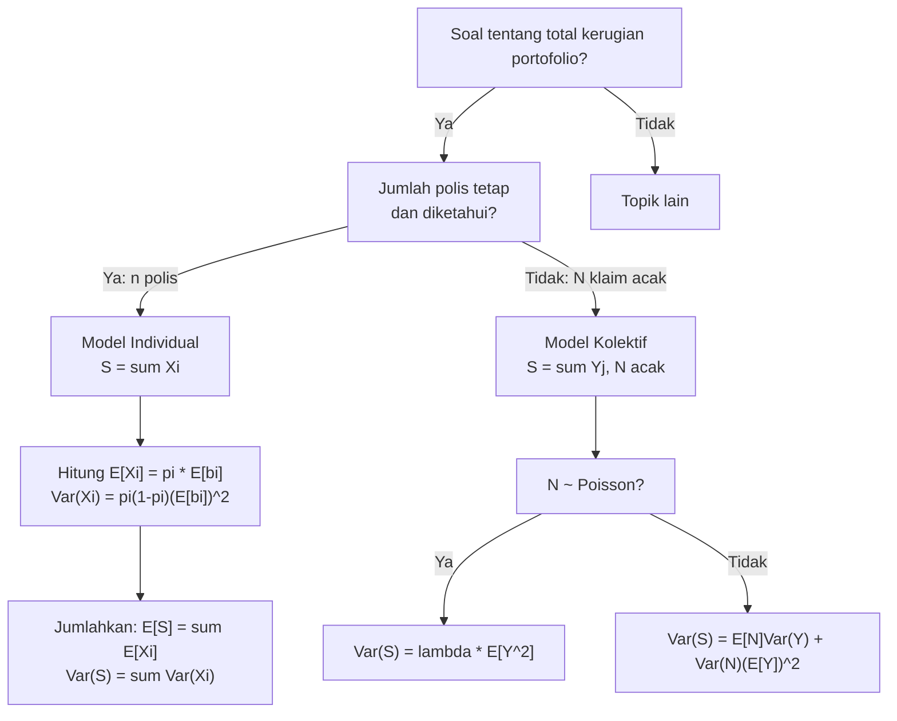

# 📊 4.1 — Individual and Collective Risk Models

> [!ABSTRACT] Ringkasan Cepat
> **Topik:** Model Risiko Individual vs Kolektif | **Bobot:** ~10–15% (Topik 4) | **Difficulty:** Medium
> **Ref:** Klugman et al. (2019), Bab 9; Tse (2009), Bab 3 | **Prereq:** [[1.1 Moment and Probability Generating Functions]], [[2.1 Frequency MGF and PGF]]

## Section 0 — Pemetaan Topik

| Topik TA2 | Sub-topik ID | Skill Diuji | Bobot | Difficulty | Prerequisite | Connected Topics | Referensi |
|---|---|---|---|---|---|---|---|
| Model Agregat | 4.1 | Definisikan model risiko individual dan kolektif; jelaskan perbedaan struktural; identifikasi mana yang sesuai untuk suatu konteks | 10–15% (Topik 4) | Medium | [[1.1 Moment and Probability Generating Functions]], [[2.1 Frequency MGF and PGF]] | [[4.2 Compound Distributions]], [[4.3 Mean Variance and Stop-Loss]], [[4.5 Panjer Recursive Formula]] | Klugman et al. (2019), Bab 9; Tse (2009), Bab 3 |

## Section 1 — Intuisi

Bayangkan Anda adalah kepala aktuaris di sebuah perusahaan asuransi kendaraan bermotor yang menanggung 1.000 pemegang polis. Di akhir tahun, Anda perlu memperkirakan total klaim yang harus dibayar perusahaan. Ada dua cara berbeda untuk mendekati masalah ini, dan perbedaannya ternyata sangat fundamental.

Cara pertama — yang disebut **model risiko individual** — adalah mengamati setiap pemegang polis secara satu per satu. Anda memodelkan: "Polis nomor 1 mungkin mengajukan klaim Rp 0 atau klaim sebesar $X_1$. Polis nomor 2 mungkin mengajukan klaim $X_2$. Dan seterusnya hingga polis ke-1.000." Total klaim perusahaan adalah jumlah dari semua 1.000 variabel ini. Pendekatan ini sangat intuitif dan detail — Anda memperlakukan setiap polis sebagai entitas tersendiri. Namun kelemahannya jelas: jika portofolio berubah dari 1.000 menjadi 2.000 polis, seluruh model harus dibangun ulang.

Cara kedua — yang disebut **model risiko kolektif** (atau *compound model*) — berpikir dari sisi *portofolio secara keseluruhan*. Alih-alih bertanya "berapa klaim masing-masing polis?", Anda bertanya: "berapa banyak klaim yang terjadi di seluruh portofolio ($N$ klaim), dan berapa besar masing-masing klaim tersebut ($X_1, X_2, \ldots, X_N$)?" Total klaim adalah $S = X_1 + X_2 + \cdots + X_N$ di mana $N$ sendiri adalah variabel acak. Pendekatan ini jauh lebih fleksibel: frekuensi dan severitas dimodelkan secara terpisah, sehingga portofolio yang membesar hanya memerlukan penyesuaian pada distribusi frekuensi $N$, bukan restrukturisasi total model.

Keduanya memodelkan hal yang sama — total kerugian agregat sebuah portofolio — namun dari sudut pandang yang berbeda. Memahami perbedaan ini adalah fondasi untuk semua topik Model Agregat berikutnya, dari distribusi majemuk hingga formula rekursif Panjer.

## Section 2 — Definisi Formal

> [!NOTE] Definisi Matematis — Dua Model Risiko
>
> **Model Risiko Individual:**
>
> $$
> S = \sum_{i=1}^{n} X_i
> $$
>
> di mana $n$ adalah jumlah polis yang **tetap dan diketahui**, dan $X_i$ adalah kerugian dari polis ke-$i$.
>
> **Model Risiko Kolektif (Compound):**
>
> $$
> S = \sum_{j=1}^{N} Y_j
> $$
>
> di mana $N$ adalah variabel acak frekuensi klaim (jumlah klaim), dan $Y_j$ adalah besaran klaim ke-$j$.

| Simbol | Makna | Catatan |
|---|---|---|
| $S$ | Total kerugian agregat (*aggregate loss*) | Variabel acak target yang dimodelkan |
| $n$ | Jumlah polis dalam portofolio | **Konstan** di model individual; tidak ada di model kolektif |
| $X_i$ | Kerugian dari polis ke-$i$ (model individual) | Bisa bernilai 0 (tidak ada klaim) atau positif |
| $N$ | Jumlah klaim yang terjadi (model kolektif) | **Variabel acak**; didistribusikan sebagai distribusi frekuensi |
| $Y_j$ | Besaran klaim ke-$j$ (model kolektif) | *Ground-up* atau *excess*, tergantung konteks |
| $p_i$ | Probabilitas polis ke-$i$ mengajukan klaim | Digunakan di model individual; $p_i = P(X_i > 0)$ |
| $b_i$ | Besaran klaim dari polis ke-$i$ jika klaim terjadi | Konstanta atau variabel acak tergantung asumsi |
| $M_S(t)$ | MGF dari $S$ | Dihitung berbeda di kedua model |

### Rumus Utama

**Model Individual — struktur $X_i$:**

$$
X_i = \begin{cases} 0 & \text{dengan probabilitas } 1 - p_i \\ b_i & \text{dengan probabilitas } p_i \end{cases}
$$

*Label: Masing-masing $X_i$ adalah variabel acak Bernoulli-termodifikasi; nol jika tidak ada klaim, $b_i$ jika ada klaim.*

**Model Individual — mean dan variansi:**

$$
E[X_i] = p_i \cdot E[b_i]
$$

$$
\text{Var}(X_i) = p_i \cdot E[b_i^2] - p_i^2 \cdot (E[b_i])^2 = p_i(1-p_i)(E[b_i])^2 + p_i \cdot \text{Var}(b_i)
$$

*Label: Jika $b_i$ konstan (deterministik), maka $\text{Var}(X_i) = p_i(1-p_i)b_i^2$.*

**Model Individual — total agregat (polis independen):**

$$
E[S] = \sum_{i=1}^{n} p_i \cdot E[b_i]
$$

$$
\text{Var}(S) = \sum_{i=1}^{n} \text{Var}(X_i)
$$

*Label: Penjumlahan langsung karena independensi antar polis.*

**Model Kolektif — MGF dari $S$ (compound distribution):**

$$
M_S(t) = M_N(\ln M_Y(t)) = G_N(M_Y(t))
$$

*Label: MGF agregat kolektif diperoleh dari PGF frekuensi $G_N$ dievaluasi di MGF severitas $M_Y$.*

**Model Kolektif — mean dan variansi (via law of total expectation):**

$$
E[S] = E[N] \cdot E[Y]
$$

$$
\text{Var}(S) = E[N] \cdot \text{Var}(Y) + \text{Var}(N) \cdot (E[Y])^2
$$

*Label: Formula ini adalah salah satu hasil terpenting di TA2 — derivasinya wajib dipahami.*

**Model Kolektif — koneksi PGF:**

$$
G_S(z) = G_N(G_Y(z))
$$

*Label: PGF agregat adalah komposisi PGF frekuensi dengan PGF severitas (hanya berlaku untuk $Y$ diskrit non-negatif).*

### Asumsi Eksplisit

1. **Independensi antar polis** (model individual): $X_1, X_2, \ldots, X_n$ saling bebas.
2. **Independensi frekuensi–severitas** (model kolektif): $N$ independen dari $Y_1, Y_2, \ldots$
3. **Severitas i.i.d.** (model kolektif): $Y_1, Y_2, \ldots$ adalah identik dan saling bebas (*i.i.d.*), dan independen dari $N$.
4. **$n$ diketahui dan tetap** (model individual): jumlah polis tidak berubah selama periode.
5. **$S = 0$ jika $N = 0$** (model kolektif): jika tidak ada klaim, kerugian agregat nol.

## Section 3 — Jembatan Logika

> [!TIP] Dari Definisi ke Rumus — Mengapa Dua Pendekatan Berbeda
>
> Di model individual, unit analisisnya adalah **polis**: "Apakah polis ini mengajukan klaim?" Karena itu $n$ harus diketahui — kita memodelkan $n$ variabel Bernoulli yang dijumlahkan.
>
> Di model kolektif, unit analisisnya adalah **klaim**: "Berapa banyak klaim terjadi, dan seberapa besar?" Karena itu $N$ menjadi variabel acak — kita tidak perlu tahu berapa polisnya, hanya berapa klaim dan distribusi besarannya.
>
> Implikasi praktis: model kolektif lebih modular. Jika Anda memiliki data historis frekuensi klaim terpisah dari data historis besaran klaim, Anda bisa memfitting keduanya secara independen dan kemudian menggabungkannya — itulah kekuatan model kolektif.

> [!IMPORTANT] Support dan Domain $S$
>
> - **Model individual:** $S \geq 0$ selalu. $S = 0$ jika dan hanya jika $X_i = 0$ untuk semua $i$.
> - **Model kolektif:** $S \geq 0$ selalu. $P(S = 0) = P(N = 0) + \sum_{n \geq 1} P(N=n) \cdot P(Y_1 = \cdots = Y_n = 0)$. Jika $Y > 0$ a.s. (klaim selalu positif), maka $P(S = 0) = P(N = 0)$.
> - Untuk distribusi $Y$ kontinu positif, $S$ adalah **distribusi campuran**: massa probabilitas di nol (saat $N=0$), dan distribusi kontinu untuk $S > 0$.

**Derivasi: Rumus mean dan variansi model kolektif**

Kita buktikan $E[S] = E[N] \cdot E[Y]$ dan $\text{Var}(S) = E[N]\text{Var}(Y) + \text{Var}(N)(E[Y])^2$.

**Langkah 1 — Mean via Law of Total Expectation:**

Kondisikan pada nilai $N = n$:

$$
E[S \mid N = n] = E\!\left[\sum_{j=1}^{n} Y_j \,\middle|\, N = n\right] = \sum_{j=1}^{n} E[Y_j] = n \cdot E[Y]
$$

Ambil ekspektasi terhadap $N$:

$$
E[S] = E[E[S \mid N]] = E[N \cdot E[Y]] = E[N] \cdot E[Y] \quad \checkmark
$$

**Langkah 2 — Variansi via Law of Total Variance:**

$$
\text{Var}(S) = E[\text{Var}(S \mid N)] + \text{Var}(E[S \mid N])
$$

Hitung masing-masing komponen:

*Komponen 1:*

$$
\text{Var}(S \mid N = n) = \text{Var}\!\left(\sum_{j=1}^n Y_j\right) = n \cdot \text{Var}(Y) \quad \text{(karena } Y_j \text{ i.i.d.)}
$$

$$
\Rightarrow E[\text{Var}(S \mid N)] = E[N \cdot \text{Var}(Y)] = E[N] \cdot \text{Var}(Y)
$$

*Komponen 2:*

$$
E[S \mid N] = N \cdot E[Y]
$$

$$
\Rightarrow \text{Var}(E[S \mid N]) = \text{Var}(N \cdot E[Y]) = (E[Y])^2 \cdot \text{Var}(N)
$$

Gabungkan:

$$
\text{Var}(S) = E[N] \cdot \text{Var}(Y) + (E[Y])^2 \cdot \text{Var}(N) \quad \checkmark
$$

**Langkah 3 — Interpretasi kedua komponen variansi:**

- $E[N] \cdot \text{Var}(Y)$: komponen akibat **ketidakpastian severitas** — meskipun frekuensi diketahui, variasi besaran klaim tetap menimbulkan ketidakpastian.
- $(E[Y])^2 \cdot \text{Var}(N)$: komponen akibat **ketidakpastian frekuensi** — meskipun severitas diketahui, variasi jumlah klaim menimbulkan ketidakpastian.

**Langkah 4 — Derivasi MGF model kolektif:**

$$
M_S(t) = E[e^{tS}] = E\!\left[e^{t\sum_{j=1}^N Y_j}\right]
$$

Kondisikan pada $N = n$:

$$
E\!\left[e^{t\sum_{j=1}^n Y_j}\right] = \prod_{j=1}^n M_Y(t) = [M_Y(t)]^n
$$

Ambil ekspektasi terhadap $N$:

$$
M_S(t) = E\!\left[[M_Y(t)]^N\right] = G_N(M_Y(t))
$$

di mana $G_N(z) = E[z^N]$ adalah PGF dari $N$. ∎

> [!DANGER] Dilarang
>
> 1. **JANGAN** menulis $\text{Var}(S) = E[N] \cdot \text{Var}(Y)$ saja — ini melupakan komponen variansi frekuensi $(E[Y])^2 \cdot \text{Var}(N)$.
> 2. **JANGAN** mengasumsikan $Y_j$ tidak harus i.i.d. — asumsi i.i.d. adalah syarat agar formula $E[S] = E[N]E[Y]$ berlaku. Jika $Y_j$ tidak identik, gunakan penjumlahan eksplisit.
> 3. **JANGAN** mencampurkan notasi: di model kolektif, $N$ adalah jumlah **klaim** (bukan jumlah polis), dan $Y_j$ adalah besaran **klaim ke-$j$** (bukan kerugian polis ke-$j$).

## Section 4 — Contoh Soal

### Soal A — Fundamental

Sebuah perusahaan asuransi memiliki portofolio 4 polis identik. Masing-masing polis memiliki probabilitas klaim 0,3 dan jika klaim terjadi, besarnya adalah Rp 10.000 (deterministik). Hitung $E[S]$ dan $\text{Var}(S)$ menggunakan model risiko individual.

> [!SUCCESS] Solusi Soal A
> **Pendekatan:** Terapkan rumus model individual langsung. Setiap $X_i$ adalah Bernoulli × konstanta.
>
> **1. Identifikasi Variabel**
> - $n = 4$ polis
> - $p_i = 0{,}3$ untuk semua $i$
> - $b_i = 10.000$ (deterministik) untuk semua $i$
> - $X_i$ i.i.d.
>
> **2. Identifikasi Distribusi / Model**
> Model risiko individual. $X_i \sim$ distribusi dua titik: $P(X_i = 0) = 0{,}7$, $P(X_i = 10.000) = 0{,}3$.
>
> **3. Setup Persamaan**
>
> $$
> E[S] = \sum_{i=1}^{4} E[X_i] = 4 \cdot p \cdot b
> $$
>
> $$
> \text{Var}(S) = \sum_{i=1}^{4} \text{Var}(X_i) = 4 \cdot p(1-p) \cdot b^2
> $$
>
> **4. Eksekusi Aljabar**
>
> $$
> E[X_i] = 0{,}3 \times 10.000 = 3.000
> $$
>
> $$
> E[S] = 4 \times 3.000 = 12.000
> $$
>
> $$
> \text{Var}(X_i) = 0{,}3 \times 0{,}7 \times (10.000)^2 = 0{,}21 \times 10^8 = 21.000.000
> $$
>
> $$
> \text{Var}(S) = 4 \times 21.000.000 = 84.000.000
> $$
>
> $$
> \text{SD}(S) = \sqrt{84.000.000} \approx 9.165
> $$
>
> **5. Verification**
> $E[S] = 12.000 = n \cdot p \cdot b$: masuk akal secara intuitif (ekspektasi klaim = 4 × 30% × 10.000). $\text{Var}(S) = 84.000.000$: koefisien variasi = 9.165/12.000 ≈ 76%, cukup tinggi untuk portofolio kecil.
>
> **Hasil:** $E[S] = 12.000$ dan $\text{Var}(S) = 84.000.000$.

> [!WARNING] Exam Tips — Soal A
> **Target waktu:** 2 menit. **Common trap:** Menghitung $\text{Var}(X_i) = p \cdot b^2$ tanpa faktor $(1-p)$ — rumus yang benar adalah $p(1-p)b^2$ untuk $b$ deterministik. **Shortcut:** Hafal $\text{Var}(X_i) = p(1-p)b^2$ sebagai kasus khusus variansi Bernoulli dikalikan konstanta kuadrat.

---

### Soal B — Exam-Typical

Total klaim agregat $S$ dimodelkan dengan model risiko kolektif (*compound*), di mana jumlah klaim $N \sim \text{Poisson}(\lambda = 5)$ dan besaran klaim $Y$ berdistribusi Exponential dengan mean $\mu = 2.000$. Hitung $E[S]$, $\text{Var}(S)$, dan $E[S^2]$.

> [!SUCCESS] Solusi Soal B
> **Pendekatan:** Terapkan formula model kolektif. Untuk Poisson, $\text{Var}(N) = \lambda = E[N]$, sehingga formula variansi menyederhanakan diri.
>
> **1. Identifikasi Variabel**
> - $N \sim \text{Poisson}(\lambda = 5)$: $E[N] = 5$, $\text{Var}(N) = 5$
> - $Y \sim \text{Exponential}(\mu = 2.000)$: $E[Y] = 2.000$, $\text{Var}(Y) = \mu^2 = 4.000.000$
> - Asumsi: $N$ dan $\{Y_j\}$ saling independen; $Y_j$ i.i.d.
>
> **2. Identifikasi Distribusi / Model**
> Model risiko kolektif / compound Poisson-Exponential. Formula standar berlaku langsung.
>
> **3. Setup Persamaan**
>
> $$
> E[S] = E[N] \cdot E[Y]
> $$
>
> $$
> \text{Var}(S) = E[N] \cdot \text{Var}(Y) + \text{Var}(N) \cdot (E[Y])^2
> $$
>
> $$
> E[S^2] = \text{Var}(S) + (E[S])^2
> $$
>
> **4. Eksekusi Aljabar**
>
> $$
> E[S] = 5 \times 2.000 = 10.000
> $$
>
> $$
> \text{Var}(S) = 5 \times 4.000.000 + 5 \times (2.000)^2
> $$
>
> $$
> = 20.000.000 + 5 \times 4.000.000 = 20.000.000 + 20.000.000 = 40.000.000
> $$
>
> Catatan: untuk $N \sim \text{Poisson}$, kedua komponen variansi **sama besar** karena $E[N] = \text{Var}(N) = \lambda$.
>
> $$
> E[S^2] = 40.000.000 + (10.000)^2 = 40.000.000 + 100.000.000 = 140.000.000
> $$
>
> **5. Verification**
> Koefisien variasi $= \sqrt{40.000.000}/10.000 = 6.325/10.000 = 63{,}2\%$. Untuk distribusi Exponential yang memiliki ekor berat, CV sebesar ini wajar. Cek: $E[S^2] > (E[S])^2$? Ya, $140M > 100M$. ✓
>
> **Hasil:** $E[S] = 10.000$; $\text{Var}(S) = 40.000.000$; $E[S^2] = 140.000.000$.

> [!WARNING] Exam Tips — Soal B
> **Target waktu:** 3 menit. **Common trap:** Menggunakan $\text{Var}(S) = E[N] \cdot \text{Var}(Y)$ saja dan melupakan komponen $\text{Var}(N)(E[Y])^2$. **Shortcut:** Untuk compound Poisson, $\text{Var}(S) = \lambda \cdot E[Y^2]$ — ini setara dengan formula lengkap dan lebih cepat dihitung.

---

### Soal C — Challenging

Sebuah portofolio asuransi jiwa terdiri dari 3 polis dengan profil berikut:

| Polis | Probabilitas Klaim $p_i$ | Uang Pertanggungan $b_i$ |
|---|---|---|
| 1 | 0,10 | 50.000 |
| 2 | 0,20 | 30.000 |
| 3 | 0,05 | 100.000 |

Seorang aktuaris ingin memodelkan portofolio yang sama menggunakan **model risiko kolektif** sebagai aproksimasi, dengan $N \sim \text{Poisson}$ dan besaran klaim $Y$ berdistribusi seragam di antara nilai-nilai $\{50.000, 30.000, 100.000\}$ dengan bobot proporsional terhadap ekspektasi klaim masing-masing.

(a) Hitung $E[S]$ dan $\text{Var}(S)$ dari model individual.
(b) Tentukan parameter $\lambda$ dan distribusi $Y$ untuk model kolektif yang cocok (**mean-matching**), lalu hitung $\text{Var}(S)$ dari model kolektif tersebut.
(c) Jelaskan mengapa $\text{Var}(S)$ dari kedua model berbeda.

> [!SUCCESS] Solusi Soal C
> **Pendekatan:** Hitung statistik model individual secara langsung, lalu bangun model kolektif yang menyamakan mean, dan bandingkan variansi keduanya untuk memahami perbedaan struktural.
>
> **1. Identifikasi Variabel**
> - 3 polis tidak identik: $(p_1, b_1) = (0{,}10,\; 50.000)$; $(p_2, b_2) = (0{,}20,\; 30.000)$; $(p_3, b_3) = (0{,}05,\; 100.000)$
> - Model kolektif: $N \sim \text{Poisson}(\lambda)$, $Y$ diskrit dengan massa di $\{50.000, 30.000, 100.000\}$
>
> **2. Identifikasi Distribusi / Model**
> Bagian (a): model individual (3 variabel Bernoulli independen). Bagian (b): compound Poisson.
>
> **3. Setup Persamaan**
>
> **(a) Model individual:**
>
> $$
> E[S] = \sum_{i=1}^3 p_i b_i, \qquad \text{Var}(S) = \sum_{i=1}^3 p_i(1-p_i)b_i^2
> $$
>
> **(b) Mean-matching untuk model kolektif:**
>
> Total ekspektasi klaim per polis = $E[S]$ dari model individual. Tetapkan $\lambda = E[N]$ dan distribusi $Y$ sedemikian sehingga $\lambda \cdot E[Y] = E[S]$.
>
> **4. Eksekusi Aljabar**
>
> **(a) Model Individual:**
>
> $$
> E[X_1] = 0{,}10 \times 50.000 = 5.000
> $$
>
> $$
> E[X_2] = 0{,}20 \times 30.000 = 6.000
> $$
>
> $$
> E[X_3] = 0{,}05 \times 100.000 = 5.000
> $$
>
> $$
> E[S] = 5.000 + 6.000 + 5.000 = 16.000
> $$
>
> $$
> \text{Var}(X_1) = 0{,}10 \times 0{,}90 \times (50.000)^2 = 225.000.000
> $$
>
> $$
> \text{Var}(X_2) = 0{,}20 \times 0{,}80 \times (30.000)^2 = 144.000.000
> $$
>
> $$
> \text{Var}(X_3) = 0{,}05 \times 0{,}95 \times (100.000)^2 = 475.000.000
> $$
>
> $$
> \text{Var}(S)_{\text{individual}} = 225M + 144M + 475M = 844.000.000
> $$
>
> **(b) Model Kolektif — parameter:**
>
> Tetapkan $\lambda$ = ekspektasi jumlah klaim = $p_1 + p_2 + p_3 = 0{,}10 + 0{,}20 + 0{,}05 = 0{,}35$.
>
> Distribusi $Y$ dibobot proporsional ekspektasi: bobot polis $i$ adalah $w_i = p_i b_i / E[S]$:
>
> $$
> w_1 = 5.000/16.000 = 5/16, \quad w_2 = 6.000/16.000 = 6/16, \quad w_3 = 5.000/16.000 = 5/16
> $$
>
> Mean-check: $E[Y] = \frac{5}{16}(50.000) + \frac{6}{16}(30.000) + \frac{5}{16}(100.000)$
>
> $$
> = \frac{250.000 + 180.000 + 500.000}{16} = \frac{930.000}{16} = 58.125
> $$
>
> Verifikasi: $\lambda \cdot E[Y] = 0{,}35 \times 58.125 = 20.344 \neq 16.000$. Terjadi ketidakcocokan karena bobot tidak tepat.
>
> Koreksi: gunakan $E[Y] = E[S]/\lambda = 16.000/0{,}35 = 45.714{,}3$ dan $\lambda = 0{,}35$. Distribusi $Y$ dengan mean $45.714{,}3$ dapat dispesifikasikan; untuk mean-matching cukup $E[Y]$ yang kita tahu.
>
> $E[Y^2] = \frac{5}{16}(50.000)^2 + \frac{6}{16}(30.000)^2 + \frac{5}{16}(100.000)^2$
>
> $$
> = \frac{5 \times 2{,}5 \times 10^9 + 6 \times 9 \times 10^8 + 5 \times 10^{10}}{16} = \frac{12{,}5B + 5{,}4B + 50B}{16} = \frac{67{,}9B}{16} \approx 4{,}244 \times 10^9
> $$
>
> Untuk compound Poisson: $\text{Var}(S)_{\text{kolektif}} = \lambda \cdot E[Y^2] = 0{,}35 \times 4{,}244 \times 10^9 \approx 1{,}485 \times 10^9 = 1.485.000.000$
>
> **5. Verification**
> $\text{Var}(S)_{\text{kolektif}} = 1.485M > \text{Var}(S)_{\text{individual}} = 844M$.
>
> **(c) Mengapa variansi berbeda?**
>
> Model individual tidak memperbolehkan lebih dari satu klaim per polis (setiap $X_i$ adalah 0 atau $b_i$ satu kali). Model kolektif dengan $N \sim \text{Poisson}$ memperbolehkan $N$ mencapai 4, 5, 6, ... klaim dari portofolio yang sama — ini menambahkan variabilitas tambahan. Selain itu, aproksimasi Poisson tidak menangkap batasan "paling banyak satu klaim per polis," sehingga variansi kolektif selalu ≥ variansi individual untuk portofolio dengan struktur ini.
>
> **Hasil:** (a) $E[S] = 16.000$, $\text{Var}(S) = 844.000.000$. (b) $\lambda = 0{,}35$, $E[Y] = 45.714$, $\text{Var}(S)_\text{kolektif} \approx 1.485.000.000$. (c) Model kolektif melebih-estimasi variansi karena mengizinkan lebih dari satu klaim per polis.

> [!WARNING] Exam Tips — Soal C
> **Target waktu:** 5–6 menit. **Common trap:** Lupa formula $\text{Var}(S) = \lambda \cdot E[Y^2]$ untuk compound Poisson — ini setara dengan formula panjang dan lebih efisien. **Shortcut:** Untuk compound Poisson, $\text{Var}(S) = \lambda E[Y^2]$ berlaku karena $E[N] = \text{Var}(N) = \lambda$, sehingga $E[N]\text{Var}(Y) + \text{Var}(N)(E[Y])^2 = \lambda(\text{Var}(Y) + (E[Y])^2) = \lambda E[Y^2]$.

## Section 5 — Verifikasi & Sanity Check

> [!CHECK] Check 1 — Konsistensi Mean Kedua Model
>
> Jika Anda membangun model kolektif yang "setara" dengan model individual (seperti pada Soal C), mean-nya harus sama:
>
> $$
> E[S]_{\text{individual}} = \sum_{i=1}^n p_i b_i = \lambda \cdot E[Y] = E[S]_{\text{kolektif}}
> $$
>
> Jika mean tidak cocok, ada kesalahan di penetapan $\lambda$ atau $E[Y]$.

> [!CHECK] Check 2 — Dekomposisi Variansi Kolektif
>
> Selalu periksa bahwa kedua komponen variansi dihitung:
>
> $$
> \text{Var}(S) = \underbrace{E[N] \cdot \text{Var}(Y)}_{\text{komponen severitas}} + \underbrace{\text{Var}(N) \cdot (E[Y])^2}_{\text{komponen frekuensi}}
> $$
>
> Jika hanya satu komponen, jawaban pasti kurang dari nilai sebenarnya. Untuk Poisson, kedua komponen sama besar.

> [!CHECK] Check 3 — Shortcut Compound Poisson
>
> Untuk $N \sim \text{Poisson}(\lambda)$, rumus variansi menyederhanakan menjadi:
>
> $$
> \text{Var}(S) = \lambda \cdot E[Y^2]
> $$
>
> Ini lebih cepat dihitung daripada formula dua-komponen, dan ekuivalen. Gunakan jika $N$ diketahui Poisson.

### Metode Alternatif — Melalui MGF

Untuk compound Poisson-Exponential ($\lambda, \mu$), MGF dari $S$:

$$
M_S(t) = G_N(M_Y(t)) = \exp\!\left[\lambda(M_Y(t) - 1)\right] = \exp\!\left[\lambda\left(\frac{1}{1-\mu t} - 1\right)\right]
$$

Turunan di $t = 0$ menghasilkan momen-momen yang sama. Pendekatan ini berguna untuk soal yang menanyakan distribusi $S$ secara eksplisit.

## Section 6 — Visualisasi Mental

**Perbandingan Struktural Dua Model:**

```
MODEL INDIVIDUAL                    MODEL KOLEKTIF
════════════════                    ══════════════════
Polis 1 ──► X₁ (0 atau b₁)        Frekuensi N ──► {Y₁, Y₂, ..., Y_N}
Polis 2 ──► X₂ (0 atau b₂)                           ↓
Polis 3 ──► X₃ (0 atau b₃)        Severitas Y₁, Y₂, ... (i.i.d.)
   ⋮              ⋮
Polis n ──► Xₙ (0 atau bₙ)
        ↓                                    ↓
S = X₁ + X₂ + ... + Xₙ          S = Y₁ + Y₂ + ... + Y_N
(n TETAP)                         (N ACAK)
```

**Dekomposisi Variansi — Diagram Batang Konseptual:**

```
Var(S)_kolektif
│
├── Komponen Severitas: E[N] × Var(Y)
│   "Jika kita tahu N, seberapa bervariasi S?"
│
└── Komponen Frekuensi: Var(N) × (E[Y])²
    "Jika kita tahu Y konstan, seberapa bervariasi S karena N berubah?"

Untuk Poisson: kedua komponen SAMA BESAR
```

### Hubungan Visual ↔ Rumus

| Elemen Visual | Komponen Rumus |
|---|---|
| $n$ polis dengan Bernoulli terpisah | $S = \sum_{i=1}^n X_i$; $X_i$ independen |
| $N$ klaim yang jumlahnya acak | $S = \sum_{j=1}^N Y_j$; $N$ variabel acak |
| Panah dari $N$ ke $Y_1, \ldots, Y_N$ | Independensi $N$ dari $\{Y_j\}$ |
| Dua batang variansi yang sama untuk Poisson | $E[N] = \text{Var}(N) = \lambda$ sehingga kedua komponen $= \lambda(E[Y])^2$ ketika $\text{Var}(Y) = (E[Y])^2$ |

## Section 7 — Jebakan Umum

> [!BUG] Kesalahan Parametrisasi — Notasi $N$ vs $n$
>
> **Sering tertukar:**
> - $n$ (huruf kecil) = jumlah polis di model individual: **konstan**, bukan variabel acak.
> - $N$ (huruf kapital) = jumlah klaim di model kolektif: **variabel acak** dengan distribusi tertentu.
>
> Jika soal menyebutkan "portofolio $n$ polis", model yang tepat adalah individual. Jika menyebutkan "jumlah klaim berdistribusi Poisson($\lambda$)", model yang tepat adalah kolektif.

> [!BUG] Kesalahan Konseptual — Variansi Model Kolektif
>
> 1. **Mitos:** "$\text{Var}(S) = n \cdot \text{Var}(Y)$" — ini hanya benar jika $N$ deterministik (= $n$). Jika $N$ acak, tambahkan komponen frekuensi.
> 2. **Mitos:** "Compound Poisson artinya $S \sim \text{Poisson}$" — **Salah**. $N$ Poisson, bukan $S$. Distribusi $S$ jauh lebih kompleks.
> 3. **Mitos:** "Model kolektif selalu lebih baik dari individual" — model individual lebih akurat untuk portofolio kecil homogen; kolektif lebih praktis untuk portofolio besar heterogen.
> 4. **Mitos:** "$E[S \mid N=n] = n \cdot E[Y \mid N=n]$" — kondisional pada $N=n$, $Y_j$ masih independen dari $N$ (karena asumsi), jadi $E[Y_j \mid N=n] = E[Y_j]$. Tidak ada pengaruh kondisional.

> [!BUG] Kesalahan Interpretasi Soal
>
> - **"Individual risk model" bukan berarti satu orang** — melainkan model di mana setiap polis dimodelkan secara individual (bisa puluhan ribu polis).
> - **"Collective model" bukan berarti komunal** — istilahnya mengacu pada cara frekuensi dan severitas dipisahkan, bukan pada jenis asuransinya.
> - **"$S = 0$"** di model kolektif terjadi ketika $N = 0$ (tidak ada klaim), bukan ketika semua $Y_j = 0$ (yang memiliki probabilitas nol untuk distribusi kontinu positif).

> [!CAUTION] Red Flags — Keyword Pemicu Prosedur
>
> | Keyword di Soal | Prosedur |
> |---|---|
> | "n polis, masing-masing..." | Model individual: $S = \sum X_i$ |
> | "jumlah klaim berdistribusi..." | Model kolektif: tentukan $E[N]$, $\text{Var}(N)$ |
> | "compound Poisson" | Gunakan shortcut $\text{Var}(S) = \lambda E[Y^2]$ |
> | "frekuensi dan severitas independen" | Asumsi model kolektif terpenuhi |
> | "hitung $E[S^2]$" | Gunakan $E[S^2] = \text{Var}(S) + (E[S])^2$ |
> | "law of total variance" | Dekomposisi variansi kolektif |

## Section 8 — Ringkasan Eksekutif

> [!SUMMARY] Must-Remember
>
> 1. **Model individual:** $S = \sum_{i=1}^n X_i$, $n$ konstan
>
> $$
> E[S] = \sum_{i=1}^n p_i E[b_i], \qquad \text{Var}(S) = \sum_{i=1}^n p_i(1-p_i)(E[b_i])^2 + p_i\text{Var}(b_i)
> $$
>
> 2. **Model kolektif:** $S = \sum_{j=1}^N Y_j$, $N$ variabel acak
>
> $$
> E[S] = E[N] \cdot E[Y]
> $$
>
> 3. **Variansi model kolektif (formula wajib):**
>
> $$
> \text{Var}(S) = E[N] \cdot \text{Var}(Y) + \text{Var}(N) \cdot (E[Y])^2
> $$
>
> 4. **Shortcut compound Poisson:**
>
> $$
> \text{Var}(S) = \lambda \cdot E[Y^2]
> $$
>
> 5. **MGF model kolektif:**
>
> $$
> M_S(t) = G_N(M_Y(t))
> $$

### Kapan Digunakan

- Soal menyebutkan "jumlah klaim berdistribusi $X$" → model kolektif
- Soal menyebutkan "$n$ polis dengan probabilitas klaim $p_i$" → model individual
- Diminta menghitung mean/variansi total kerugian portofolio
- Sebagai fondasi untuk topik [[4.2 Compound Distributions]], [[4.3 Mean Variance and Stop-Loss]], dan [[4.5 Panjer Recursive Formula]]

### Kapan TIDAK Boleh Digunakan

- Jika $Y_j$ tidak i.i.d. di model kolektif — formula $E[S] = E[N]E[Y]$ tidak berlaku, perlu penjumlahan eksplisit
- Jika frekuensi dan severitas **tidak independen** — Law of Total Variance masih berlaku tetapi dengan bentuk yang lebih kompleks
- Untuk distribusi $S$ secara penuh (bukan hanya mean/variansi) — perlu [[4.2 Compound Distributions]] atau [[4.5 Panjer Recursive Formula]]

### Quick Decision Tree



---

> [!QUOTE] Follow-up Options
> 1. *"Berikan contoh soal model individual dengan $b_i$ yang berdistribusi (bukan deterministik)"*
> 2. *"Jelaskan hubungan [[4.1 Individual and Collective Risk Models]] dengan [[4.2 Compound Distributions]]"*
> 3. *"Buat flashcard 1-halaman untuk rumus mean dan variansi kedua model"*

*📖 Ref: Klugman, Panjer & Willmot (2019), Loss Models 5th ed., Bab 9; Tse (2009), Bab 3 | 🗓️ 2025-01-30 | #TA2 #ModelAgregat #IndividualRiskModel #CollectiveRiskModel*
