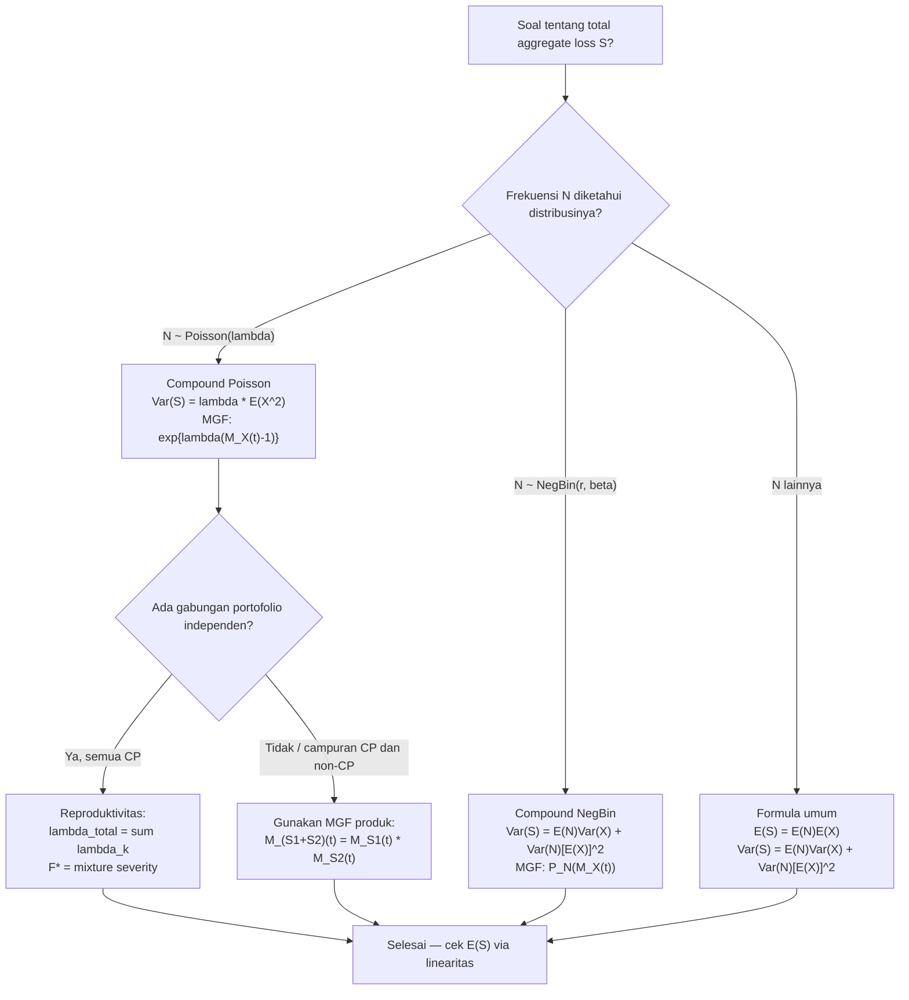

# 📊 4.2 — Compound Distributions

> [!ABSTRACT] Ringkasan Cepat
> **Topik:** Compound Distributions | **Bobot:** ~10–15% | **Difficulty:** Hard
> **Ref:** Klugman et al. (2019), Loss Models 5th ed., Bab 7.1–7.2, 9; Tse (2009) Bab 3 | **Prereq:** [[2.1 Frequency MGF and PGF]], [[1.1 Moment and Probability Generating Functions]], [[4.1 Individual and Collective Risk Models]]

## Section 0 — Pemetaan Topik

| Topik TA2 | Sub-topik ID | Skill Diuji | Bobot | Difficulty | Prerequisite | Connected Topics | Referensi |
|---|---|---|---|---|---|---|---|
| Model Agregat | 4.2 | Mendefinisikan distribusi majemuk (*compound*); menentukan PGF dan MGF dari $S$; mengidentifikasi kelas compound Poisson dan sifat-sifatnya; membuktikan bahwa jumlah compound Poisson independen adalah compound Poisson | 10–15% | Hard | [[2.1 Frequency MGF and PGF]], [[1.1 Moment and Probability Generating Functions]], [[4.1 Individual and Collective Risk Models]] | [[4.3 Mean Variance and Stop-Loss]], [[4.5 Panjer Recursive Formula]], [[2.4 Mixed Frequency Distributions]] | Klugman et al. (2019) Bab 7.1–7.2, 9; Tse (2009) Bab 3 |

## Section 1 — Intuisi

Bayangkan sebuah perusahaan asuransi kendaraan bermotor di Indonesia yang harus memperkirakan total pembayaran klaim selama satu tahun. Dua komponen utama yang tidak pasti adalah: berapa banyak klaim yang akan masuk (*frekuensi*), dan berapa besar setiap klaim itu (*besar klaim / severity*). Jika ada tiga klaim masuk, total pembayaran adalah jumlah dari ketiga klaim tersebut. Jika tidak ada klaim, total adalah nol. Total pembayaran adalah jumlah dari sejumlah acak variabel acak — inilah inti dari **distribusi majemuk** (*compound distribution*).

Yang membuat distribusi compound menjadi sangat powerful adalah cara kerjanya secara matematis. Alih-alih memotret semua kemungkinan kombinasi frekuensi dan severity satu per satu — yang jumlahnya tak terbatas — kita bisa memanfaatkan **Probability Generating Function (PGF)** dan **Moment Generating Function (MGF)**. Dua alat transformasi ini berperilaku seperti "jembatan": PGF dari total agregat $S$ dapat dinyatakan langsung dalam PGF frekuensi $N$ dan PGF severity $X$ melalui satu komposisi fungsi yang elegan. Dari jembatan ini, semua momen ($E(S)$, $\text{Var}(S)$) dan bahkan distribusi penuh dari $S$ dapat diturunkan.

Kelas **compound Poisson** mendapat perhatian khusus karena dua sifat uniknya. Pertama, jumlah dari beberapa distribusi compound Poisson yang independen — misalnya gabungan portofolio klaim motor dari berbagai cabang — tetap merupakan compound Poisson. Ini menyederhanakan analisis portofolio gabungan secara dramatis. Kedua, setiap distribusi compound Poisson dengan besar klaim integer positif dapat dikaitkan dengan distribusi frekuensi tertentu melalui dekomposisi Panjer — sifat ini adalah fondasi dari formula rekursif Panjer di topik [[4.5 Panjer Recursive Formula]].

## Section 2 — Definisi Formal

> [!NOTE] Definisi Matematis — Distribusi Compound
> Misalkan $N$ adalah variabel acak diskrit non-negatif (*frekuensi*) dan $X_1, X_2, \ldots$ adalah variabel acak i.i.d. (*besar klaim individual*) yang independen dari $N$. **Aggregate loss** atau **compound random variable** didefinisikan sebagai:
>
> $$S = X_1 + X_2 + \cdots + X_N = \sum_{i=1}^{N} X_i$$
>
> dengan konvensi $S = 0$ jika $N = 0$.

| Simbol | Makna | Catatan |
|---|---|---|
| $S$ | Aggregate loss (total klaim) | Variabel acak yang dipelajari |
| $N$ | Frekuensi klaim (jumlah klaim) | Diskrit, $N \geq 0$ |
| $X_i$ | Besar klaim ke-$i$ | i.i.d., independen dari $N$ |
| $P_N(z)$ | PGF dari $N$ | $P_N(z) = E[z^N]$ |
| $P_X(z)$ | PGF dari $X_i$ (jika diskrit) | $P_X(z) = E[z^{X_i}]$ |
| $M_X(t)$ | MGF dari $X_i$ | $M_X(t) = E[e^{tX_i}]$ |
| $M_S(t)$ | MGF dari $S$ | $M_S(t) = E[e^{tS}]$ |
| $P_S(z)$ | PGF dari $S$ (jika $X_i$ diskrit integer) | $P_S(z) = E[z^S]$ |
| $\mu_X$ | $E(X_i)$ | Mean besar klaim individual |
| $\sigma_X^2$ | $\text{Var}(X_i)$ | Variansi besar klaim individual |

### Rumus Utama

**MGF dari $S$ (kunci utama — berlaku umum):**

$$M_S(t) = P_N(M_X(t))$$

*Label: MGF dari $S$ adalah komposisi PGF frekuensi $N$ dengan MGF severity $X$; ini adalah "master formula" compound distribution.*

**PGF dari $S$ (jika $X_i$ diskrit integer non-negatif):**

$$P_S(z) = P_N(P_X(z))$$

*Label: Analog dengan MGF, tapi untuk kasus $X_i$ diskrit; PGF dari $S$ adalah komposisi PGF $N$ dengan PGF $X$.*

**Mean agregat (via Law of Total Expectation):**

$$E(S) = E(N) \cdot E(X)$$

*Label: Mean total klaim = mean frekuensi × mean besar klaim individual.*

**Variance agregat (via Law of Total Variance):**

$$\text{Var}(S) = E(N) \cdot \text{Var}(X) + \text{Var}(N) \cdot [E(X)]^2$$

*Label: Dua komponen — variasi dalam besar klaim dan variasi dalam frekuensi.*

**Variance agregat — bentuk alternatif:**

$$\text{Var}(S) = E(N) \cdot E(X^2) + [E(X)]^2 \cdot [\text{Var}(N) - E(N)]$$

*Label: Berguna jika diketahui $E(X^2)$ dan excess dispersion dari $N$.*

**Compound Poisson — MGF:**

$$\text{Jika } N \sim \text{Poisson}(\lambda), \text{ maka } M_S(t) = \exp\!\left\{\lambda[M_X(t) - 1]\right\}$$

*Label: Substitusi langsung PGF Poisson $P_N(z) = e^{\lambda(z-1)}$ ke dalam master formula.*

**Compound Poisson — Variance (khusus):**

$$\text{Jika } N \sim \text{Poisson}(\lambda): \quad \text{Var}(S) = \lambda \cdot E(X^2)$$

*Label: Untuk Poisson, $\text{Var}(N) = E(N) = \lambda$, sehingga $\text{Var}(S) = \lambda \text{Var}(X) + \lambda[E(X)]^2 = \lambda E(X^2)$.*

**Reproduktivitas Compound Poisson — jumlah independen:**

$$\text{Jika } S_1 \sim \text{CP}(\lambda_1, F_X) \text{ dan } S_2 \sim \text{CP}(\lambda_2, F_X) \text{ independen:}$$

$$S_1 + S_2 \sim \text{CP}(\lambda_1 + \lambda_2, F_X)$$

*Label: Jumlah dua compound Poisson dengan severity yang sama tetap compound Poisson; rate-nya dijumlahkan.*

**Reproduktivitas — severity berbeda:**

$$\text{Jika } S_k \sim \text{CP}(\lambda_k, F_{X_k}) \text{ independen, } k = 1, \ldots, m:$$

$$\sum_{k=1}^m S_k \sim \text{CP}\!\left(\sum_k \lambda_k,\; F_X^*\right)$$

$$F_X^*(x) = \sum_{k=1}^m \frac{\lambda_k}{\lambda} F_{X_k}(x), \quad \lambda = \sum_k \lambda_k$$

*Label: Severity gabungan adalah mixture tertimbang dari masing-masing severity dengan bobot $\lambda_k/\lambda$.*

### Asumsi Eksplisit

1. $X_1, X_2, \ldots$ adalah i.i.d. — setiap klaim individu berdistribusi identik dan saling independen.
2. $N$ independen dari semua $X_i$ — frekuensi tidak bergantung pada besarnya klaim.
3. $X_i > 0$ hampir pasti — besar klaim adalah positif (tidak ada klaim bernilai nol).
4. MGF dari $X_i$ terdefinisi di sekitar $t = 0$ — agar $M_S(t)$ valid.
5. $S = 0$ ketika $N = 0$ — tidak ada klaim berarti tidak ada pembayaran.

## Section 3 — Jembatan Logika

> [!TIP] Dari Definisi ke Rumus
> Master formula $M_S(t) = P_N(M_X(t))$ terasa seperti "sulap", tetapi derivasinya sangat natural. Kuncinya adalah **kondisioning atas $N$**: pertama-tama anggap $N$ sudah diketahui nilainya $n$. Maka $S = X_1 + \cdots + X_n$ adalah jumlah dari $n$ variabel i.i.d., sehingga $M_{S\|N=n}(t) = [M_X(t)]^n$ (sifat MGF dari jumlah i.i.d.). Lalu kita "rata-ratakan" atas semua kemungkinan $n$ menggunakan $E_N[\cdot]$ — dan itulah yang menghasilkan PGF dari $N$ yang dievaluasi di $M_X(t)$.

> [!IMPORTANT] Support dan Domain
> - $S \geq 0$ selalu, dengan $P(S = 0) = P(N = 0) = p_0^N > 0$.
> - Jika $X_i$ kontinu, maka $S$ memiliki mixed distribution: point mass di 0 dan distribusi kontinu untuk $S > 0$.
> - Jika $X_i$ diskrit integer positif, maka $S$ diskrit dengan $P(S = 0) = P(N = 0)$ dan $P(S = k)$ untuk $k \geq 1$ dihitung via konvolusi atau Panjer.
> - Domain $t$ untuk $M_S(t)$: harus ada $h > 0$ sehingga $M_X(t) < \infty$ untuk $t \in (-h, h)$.

**Derivasi Master Formula $M_S(t) = P_N(M_X(t))$ — Step by Step:**

**Step 1 — Kondisikan pada $N$:**

$$M_S(t) = E[e^{tS}] = E\!\left[E[e^{tS} \mid N]\right]$$

**Step 2 — Evaluasi ekspektasi bersyarat.** Given $N = n$, $S = \sum_{i=1}^n X_i$:

$$E[e^{tS} \mid N = n] = E\!\left[\exp\!\left(t \sum_{i=1}^n X_i\right)\right] = \prod_{i=1}^n E[e^{tX_i}] = [M_X(t)]^n$$

Di sini kita gunakan independensi dan identitas distribusi $X_i$.

**Step 3 — Ambil ekspektasi luar atas $N$:**

$$M_S(t) = E\!\left[[M_X(t)]^N\right] = \sum_{n=0}^{\infty} [M_X(t)]^n \cdot P(N = n)$$

**Step 4 — Kenali definisi PGF.** Bandingkan dengan $P_N(z) = E[z^N] = \sum_{n=0}^\infty z^n P(N=n)$. Dengan $z = M_X(t)$:

$$M_S(t) = P_N(M_X(t)) \qquad \checkmark$$

**Derivasi Compound Poisson Variance — Step by Step:**

**Step 1 — Gunakan formula umum:**

$$\text{Var}(S) = E(N)\,\text{Var}(X) + \text{Var}(N)\,[E(X)]^2$$

**Step 2 — Substitusi $E(N) = \text{Var}(N) = \lambda$ (sifat Poisson):**

$$\text{Var}(S) = \lambda\,\text{Var}(X) + \lambda\,[E(X)]^2$$

**Step 3 — Faktorkan:**

$$= \lambda\!\left[\text{Var}(X) + [E(X)]^2\right] = \lambda\, E(X^2)$$

karena $\text{Var}(X) + [E(X)]^2 = E(X^2)$.

**Derivasi Reproduktivitas Compound Poisson — Step by Step:**

**Step 1 — Tulis MGF masing-masing:**

$$M_{S_1}(t) = \exp\!\left\{\lambda_1[M_{X_1}(t) - 1]\right\}, \quad M_{S_2}(t) = \exp\!\left\{\lambda_2[M_{X_2}(t) - 1]\right\}$$

**Step 2 — MGF jumlah = produk MGF (independensi):**

$$M_{S_1 + S_2}(t) = M_{S_1}(t) \cdot M_{S_2}(t) = \exp\!\left\{\lambda_1[M_{X_1}(t)-1] + \lambda_2[M_{X_2}(t)-1]\right\}$$

**Step 3 — Susun ulang dengan $\lambda = \lambda_1 + \lambda_2$:**

$$= \exp\!\left\{(\lambda_1 + \lambda_2)\!\left[\frac{\lambda_1 M_{X_1}(t) + \lambda_2 M_{X_2}(t)}{\lambda_1 + \lambda_2} - 1\right]\right\}$$

**Step 4 — Identifikasi MGF severity campuran:**

$$M_{X^*}(t) = \frac{\lambda_1}{\lambda} M_{X_1}(t) + \frac{\lambda_2}{\lambda} M_{X_2}(t)$$

Ini adalah MGF dari mixture dengan bobot $\lambda_1/\lambda$ dan $\lambda_2/\lambda$. Maka:

$$M_{S_1+S_2}(t) = \exp\!\left\{\lambda[M_{X^*}(t) - 1]\right\}$$

yang merupakan MGF compound Poisson$(\lambda, F_{X^*})$. $\checkmark$

> [!DANGER] Dilarang
> 1. **Jangan tukar urutan komposisi:** $M_S(t) = P_N(M_X(t))$, bukan $M_N(M_X(t))$ — yang digunakan adalah **PGF** dari $N$ (bukan MGF), dievaluasi di $M_X(t)$.
> 2. **Jangan gunakan** $\text{Var}(S) = \lambda E(X^2)$ untuk distribusi frekuensi selain Poisson — formula ini hanya berlaku karena $E(N) = \text{Var}(N) = \lambda$ pada Poisson. Untuk NegBin, gunakan formula umum.
> 3. **Jangan asumsikan reproduktivitas berlaku untuk semua compound distribution** — sifat reproduktivitas (bahwa jumlah tetap compound dari kelas yang sama) adalah keistimewaan compound Poisson. Compound NegBin atau compound Binomial tidak memiliki sifat ini secara umum.

## Section 4 — Contoh Soal

### Soal A — Fundamental

**Soal:** Frekuensi klaim $N \sim \text{Poisson}(\lambda = 5)$. Besar klaim individual $X \sim \text{Exponential}(\theta = 200)$, sehingga $E(X) = 200$ dan $E(X^2) = 2\theta^2 = 80000$. Hitung $E(S)$ dan $\text{Var}(S)$.

> [!SUCCESS] Solusi Soal A
> **Pendekatan:** Terapkan rumus langsung compound distribution: $E(S) = E(N)E(X)$ dan $\text{Var}(S) = \lambda E(X^2)$ (compound Poisson shortcut).
>
> **1. Identifikasi Variabel**
> - $N \sim \text{Poisson}(\lambda = 5)$: $E(N) = \text{Var}(N) = 5$
> - $X \sim \text{Exp}(\theta = 200)$: $E(X) = 200$, $\text{Var}(X) = \theta^2 = 40000$, $E(X^2) = 2\theta^2 = 80000$
>
> **2. Identifikasi Distribusi / Model**
> Compound Poisson dengan severity Exponential. Gunakan shortcut $\text{Var}(S) = \lambda E(X^2)$ karena $N$ Poisson.
>
> **3. Setup Persamaan**
>
> $$E(S) = E(N) \cdot E(X) = \lambda \cdot \theta$$
>
> $$\text{Var}(S) = \lambda \cdot E(X^2) = \lambda \cdot 2\theta^2$$
>
> **4. Eksekusi Aljabar**
>
> $$E(S) = 5 \times 200 = 1000$$
>
> $$\text{Var}(S) = 5 \times 80000 = 400000$$
>
> Verifikasi via formula umum: $\text{Var}(S) = 5 \times 40000 + 5 \times (200)^2 = 200000 + 200000 = 400000$ ✓
>
> **5. Verification**
> $E(S) = 1000$: rata-rata 5 klaim masing-masing 200 — masuk akal. $\text{Var}(S) = 400000$, sehingga $\text{SD}(S) = 632.5$. Coefficient of variation $= 632.5/1000 = 63.2\%$ — tinggi karena Exponential memiliki CV = 1 dan frekuensi bervariasi.
>
> **Hasil:** $E(S) = 1000$ dan $\text{Var}(S) = 400{,}000$.

> [!WARNING] Exam Tips — Soal A
> **Target waktu:** 2 menit. **Common trap:** Menggunakan formula umum $E(N)\text{Var}(X) + \text{Var}(N)[E(X)]^2$ tanpa menyederhanakan — hasilnya sama tetapi lebih lama. **Shortcut:** Untuk compound Poisson, $\text{Var}(S) = \lambda E(X^2)$ selalu — hafalkan, ini menghemat setengah langkah.

---

### Soal B — Exam-Typical

**Soal:** Sebuah portofolio terdiri dari dua kelas polis yang independen. Kelas A: $S_A \sim \text{CP}(\lambda_A = 3,\, X_A \sim \text{Exp}(\theta_A = 1000))$. Kelas B: $S_B \sim \text{CP}(\lambda_B = 7,\, X_B \sim \text{Exp}(\theta_B = 500))$. Tentukan distribusi dari total agregat $S = S_A + S_B$: identifikasi $\lambda$ dan distribusi severity campuran $F_{X^*}$.

> [!SUCCESS] Solusi Soal B
> **Pendekatan:** Gunakan reproduktivitas compound Poisson. Rate total = $\lambda_A + \lambda_B$; severity campuran adalah mixture tertimbang dengan bobot $\lambda_k / \lambda$.
>
> **1. Identifikasi Variabel**
> - $S_A \sim \text{CP}(3, \text{Exp}(1000))$: $E(X_A) = 1000$
> - $S_B \sim \text{CP}(7, \text{Exp}(500))$: $E(X_B) = 500$
> - $\lambda = \lambda_A + \lambda_B = 3 + 7 = 10$
>
> **2. Identifikasi Distribusi / Model**
> Compound Poisson dengan reproduktivitas. Severity gabungan $X^*$ adalah mixture dari $\text{Exp}(1000)$ dan $\text{Exp}(500)$ dengan bobot $\lambda_A/\lambda = 0.3$ dan $\lambda_B/\lambda = 0.7$.
>
> **3. Setup Persamaan**
>
> $$S = S_A + S_B \sim \text{CP}(\lambda_A + \lambda_B,\; F_{X^*})$$
>
> $$F_{X^*}(x) = \frac{\lambda_A}{\lambda} F_{X_A}(x) + \frac{\lambda_B}{\lambda} F_{X_B}(x)$$
>
> **4. Eksekusi Aljabar**
>
> $$\lambda = 10$$
>
> $$F_{X^*}(x) = 0.3(1 - e^{-x/1000}) + 0.7(1 - e^{-x/500})$$
>
> $$= 1 - 0.3e^{-x/1000} - 0.7e^{-x/500}$$
>
> Mean severity campuran:
>
> $$E(X^*) = 0.3 \times 1000 + 0.7 \times 500 = 300 + 350 = 650$$
>
> $$E(S) = \lambda \cdot E(X^*) = 10 \times 650 = 6500$$
>
> Verifikasi: $E(S_A) + E(S_B) = 3 \times 1000 + 7 \times 500 = 3000 + 3500 = 6500$ ✓
>
> **5. Verification**
> $E(S) = E(S_A) + E(S_B) = 6500$ ✓ — linearitas ekspektasi konsisten. $F_{X^*}(0) = 0$ ✓, $F_{X^*}(\infty) = 1$ ✓. Bobot $0.3 + 0.7 = 1$ ✓.
>
> **Hasil:** $S \sim \text{CP}\!\left(10,\; F_{X^*}\right)$ dengan $F_{X^*}(x) = 1 - 0.3e^{-x/1000} - 0.7e^{-x/500}$ dan $E(S) = 6500$.

> [!WARNING] Exam Tips — Soal B
> **Target waktu:** 4 menit. **Common trap:** Menjumlahkan rate dan menggunakan salah satu severity saja — severity harus di-*mix*. **Shortcut:** Verifikasi $E(S)$ selalu bisa dilakukan dengan linearitas: $E(S) = E(S_A) + E(S_B)$, tidak perlu melalui severity campuran.

---

### Soal C — Challenging

**Soal:** $N \sim \text{NegBin}(r = 4,\, \beta = 2)$, sehingga $E(N) = 8$, $\text{Var}(N) = 24$. Besar klaim $X$ memiliki distribusi dengan $E(X) = 500$, $E(X^2) = 400000$ (sehingga $\text{Var}(X) = 150000$). (a) Hitung $E(S)$ dan $\text{Var}(S)$. (b) Tulis $M_S(t)$ dalam bentuk eksplisit menggunakan MGF NegBin: $P_N(z) = \left(\frac{1}{1 - \beta(z-1)}\right)^r$. (c) Jika ada portofolio kedua independen $S_2 \sim \text{CP}(\lambda = 8, F_X)$ dengan severity yang sama, apakah $S + S_2$ tetap compound NegBin? Jelaskan.

> [!SUCCESS] Solusi Soal C
> **Pendekatan:** (a) Gunakan formula umum variance compound. (b) Substitusi $M_X(t)$ ke PGF NegBin. (c) Terapkan argumen reproduktivitas — compound Poisson tertutup, compound NegBin tidak.
>
> **1. Identifikasi Variabel**
> - $N \sim \text{NegBin}(r = 4, \beta = 2)$: $E(N) = r\beta = 8$, $\text{Var}(N) = r\beta(1+\beta) = 24$
> - $X$: $E(X) = 500$, $E(X^2) = 400000$, $\text{Var}(X) = E(X^2) - [E(X)]^2 = 400000 - 250000 = 150000$
> - $S_2 \sim \text{CP}(\lambda = 8, F_X)$: frekuensi Poisson, severity sama dengan $X$
>
> **2. Identifikasi Distribusi / Model**
> Untuk (a): compound NegBin — gunakan formula umum, bukan shortcut Poisson. Untuk (b): substitusi $z = M_X(t)$ ke PGF NegBin. Untuk (c): argumen MGF untuk memeriksa closure.
>
> **3. Setup Persamaan**
>
> $$E(S) = E(N) \cdot E(X)$$
>
> $$\text{Var}(S) = E(N)\,\text{Var}(X) + \text{Var}(N)\,[E(X)]^2$$
>
> $$M_S(t) = P_N(M_X(t)) = \left(\frac{1}{1 - \beta(M_X(t) - 1)}\right)^r$$
>
> **4. Eksekusi Aljabar**
>
> **(a) Momen $S$:**
>
> $$E(S) = 8 \times 500 = 4000$$
>
> $$\text{Var}(S) = 8 \times 150000 + 24 \times (500)^2 = 1{,}200{,}000 + 6{,}000{,}000 = 7{,}200{,}000$$
>
> **(b) MGF dari $S$:**
>
> $$M_S(t) = \left(\frac{1}{1 - 2(M_X(t) - 1)}\right)^4 = \left(\frac{1}{3 - 2M_X(t)}\right)^4$$
>
> **(c) Reproduktivitas:**
>
> MGF dari $S_2 \sim \text{CP}(8, F_X)$:
>
> $$M_{S_2}(t) = e^{8(M_X(t)-1)}$$
>
> MGF dari $S + S_2$:
>
> $$M_{S+S_2}(t) = M_S(t) \cdot M_{S_2}(t) = \left(\frac{1}{3 - 2M_X(t)}\right)^4 \cdot e^{8(M_X(t)-1)}$$
>
> Bentuk ini **tidak** dapat dinyatakan sebagai $P_N(M_X(t))$ untuk distribusi frekuensi standar apapun — ini bukan compound NegBin maupun compound Poisson. Reproduktivitas **tidak berlaku** untuk gabungan compound NegBin dan compound Poisson.
>
> **5. Verification**
> $E(S) = 4000$: 8 klaim × 500 per klaim ✓. $\text{Var}(S) = 7.2 \times 10^6$: jauh lebih besar dari compound Poisson ($\lambda E(X^2) = 8 \times 400000 = 3.2 \times 10^6$) karena $\text{Var}(N) = 24 > E(N) = 8$ pada NegBin — overdispersion memperbesar variance agregat ✓. Kesimpulan (c): reproduktivitas hanya berlaku antar sesama compound Poisson.
>
> **Hasil:** (a) $E(S) = 4000$, $\text{Var}(S) = 7{,}200{,}000$; (b) $M_S(t) = (3 - 2M_X(t))^{-4}$; (c) $S + S_2$ bukan compound NegBin — reproduktivitas gagal.

> [!WARNING] Exam Tips — Soal C
> **Target waktu:** 7 menit. **Common trap:** Menggunakan $\text{Var}(S) = \lambda E(X^2)$ padahal frekuensi NegBin bukan Poisson — shortcut ini hanya untuk Poisson. **Shortcut:** Untuk (c), cukup tunjukkan bahwa $M_S(t) \cdot M_{S_2}(t)$ tidak memiliki bentuk $\exp\{\lambda(M_X(t)-1)\}$ atau $(1 - \beta(M_X(t)-1))^{-r}$ — tidak perlu algebra panjang.

## Section 5 — Verifikasi & Sanity Check

> [!CHECK] Cross-Check 1 — Linearitas $E(S)$
> Selalu verifikasi:
>
> $$E(S) = E(N) \cdot E(X)$$
>
> Jika soal melibatkan beberapa sub-portofolio independen, gunakan additivitas ekspektasi:
>
> $$E(S_1 + S_2 + \cdots) = E(S_1) + E(S_2) + \cdots$$
>
> Ini harus konsisten tanpa perlu menghitung severity campuran.

> [!CHECK] Cross-Check 2 — Batas Variance
> Untuk compound Poisson($\lambda$):
>
> $$\text{Var}(S) = \lambda E(X^2) \geq \lambda [E(X)]^2 = [E(N)] \cdot [E(X)]^2$$
>
> Artinya $\text{Var}(S) \geq E(N) \cdot [E(X)]^2$ selalu. Jika hasil Anda memberi variance yang lebih kecil dari ini, ada kesalahan.
>
> Untuk compound NegBin (overdispersed), $\text{Var}(S)$ harus lebih besar dari compound Poisson dengan parameter yang sama: $\text{Var}(N)_\text{NB} > E(N)$ memperbesar komponen kedua.

> [!CHECK] Cross-Check 3 — MGF di $t = 0$
> Harus selalu berlaku $M_S(0) = 1$:
>
> $$M_S(0) = P_N(M_X(0)) = P_N(1) = \sum_{n=0}^\infty 1^n P(N=n) = 1 \checkmark$$
>
> Gunakan ini sebagai cek cepat bahwa MGF yang diturunkan tidak mengandung kesalahan aljabar.

### Metode Alternatif

Untuk menghitung $\text{Var}(S)$ via MGF secara langsung: diferensiasi $M_S(t)$ dua kali di $t = 0$ untuk mendapatkan $E(S^2)$, lalu $\text{Var}(S) = E(S^2) - [E(S)]^2$. Metode ini lebih panjang tetapi berguna saat formula langsung tidak tersedia atau sebagai verifikasi.

## Section 6 — Visualisasi Mental

**Struktur Hierarkis Compound Distribution:**

```
Level Frekuensi:   N ~ Poisson(λ) atau NegBin(r,β) atau lainnya
                         ↓ (N menentukan jumlah komponen)
Level Severity:    X_1, X_2, ..., X_N   (i.i.d., independen dari N)
                         ↓ (dijumlahkan)
Output Agregat:    S = X_1 + X_2 + ... + X_N
```

**Distribusi $S$ — Gambaran Visual:**

- Sumbu-X: total klaim $S \geq 0$; sumbu-Y: probabilitas/densitas $f_S(s)$.
- $P(S = 0) = P(N = 0) > 0$ — selalu ada spike di $s = 0$.
- Untuk $S > 0$: kurva semakin landai dan ekornya semakin tebal seiring $\lambda$ atau $E(X)$ membesar.
- Compound Poisson dengan $\lambda$ besar mendekati distribusi Normal (CLT) — kurva lonceng di sekitar $\mu_S = \lambda E(X)$.

**Reproduktivitas Compound Poisson — Visual:**

```
Portofolio A:  S_A ~ CP(λ_A, F_A)
               [●●●●●●●●●●●] ← λ_A klaim, severity F_A

Portofolio B:  S_B ~ CP(λ_B, F_B)
               [●●●●●●●●●●●●●●●●●] ← λ_B klaim, severity F_B

Gabungan:      S = S_A + S_B ~ CP(λ_A+λ_B, F*)
               [●●●●A●●B●●A●B●●●●B●●A●] ← klaim tercampur
               F* = (λ_A·F_A + λ_B·F_B) / (λ_A+λ_B)
```

Setiap klaim dalam portofolio gabungan dipilih secara acak dari A (prob $\lambda_A/\lambda$) atau B (prob $\lambda_B/\lambda$) — itulah mengapa severity campuran adalah mixture.

### Hubungan Visual ↔ Rumus

| Elemen Visual | Komponen Rumus |
|---|---|
| Spike di $S = 0$ | $P(S = 0) = P(N = 0) = P_N(0)$ |
| Pusat distribusi $S$ | $E(S) = E(N) \cdot E(X)$ |
| Lebar distribusi $S$ | $\text{Var}(S) = E(N)E(X^2)$ (Poisson) atau lebih besar (NegBin) |
| Ekor kanan yang tebal | Severity $X$ dengan ekor berat mewariskan ekor ke $S$ |
| Gabungan dua portofolio | $\lambda = \lambda_A + \lambda_B$; severity campuran $F^*$ |
| Bentuk "lonceng" saat $\lambda$ besar | CLT berlaku: $S \approx N(\lambda\mu_X, \lambda\sigma_X^2 + \lambda\mu_X^2)$ — lihat [[4.4 Aggregate Distribution Approximation]] |

## Section 7 — Jebakan Umum

> [!BUG] Kesalahan Parametrisasi
> **Salah:** Menggunakan MGF dari $N$ dalam master formula: $M_S(t) = M_N(M_X(t))$.
> **Benar:** Yang digunakan adalah **PGF** dari $N$: $M_S(t) = P_N(M_X(t))$. MGF dan PGF berbeda — $P_N(z) = E[z^N]$, bukan $E[e^{tN}]$.
>
> **Salah:** Untuk compound NegBin, menggunakan $\text{Var}(S) = E(N) \cdot E(X^2)$.
> **Benar:** Formula $\lambda E(X^2)$ eksklusif untuk compound Poisson. Untuk NegBin selalu gunakan $E(N)\text{Var}(X) + \text{Var}(N)[E(X)]^2$.

> [!BUG] Kesalahan Konseptual
> 1. **Compound vs. Mixed:** Compound Poisson adalah $S = \sum_{i=1}^N X_i$ (jumlah acak dari severity). Mixed Poisson (topik [[2.4 Mixed Frequency Distributions]]) adalah $N$ dengan $\lambda$ yang acak — dua konsep berbeda yang sering tertukar.
> 2. **Reproduktivitas bukan universal:** Hanya compound Poisson yang closed under penjumlahan dengan struktur compound Poisson yang lain. Compound Binomial atau compound NegBin tidak memiliki sifat ini.
> 3. **$S = 0$ bukan mustahil:** Bahkan portofolio besar punya probabilitas nol klaim, $P(S = 0) = P(N = 0) > 0$. Jangan anggap $S$ selalu positif.
> 4. **PGF hanya untuk diskrit:** $P_S(z) = P_N(P_X(z))$ valid hanya ketika $X_i$ diskrit integer non-negatif. Untuk $X_i$ kontinu, gunakan $M_S(t) = P_N(M_X(t))$.

> [!BUG] Kesalahan Interpretasi Soal
> - *"Aggregate claims"* atau *"total loss"* → ini adalah $S = \sum X_i$, bukan $E(S)$.
> - *"Expected aggregate"* → ini adalah $E(S) = E(N) \cdot E(X)$.
> - *"Two independent portfolios"* → MGF total = produk MGF masing-masing; periksa apakah keduanya compound Poisson sebelum mengklaim reproduktivitas.
> - *"Variance of aggregate"* untuk Poisson vs. NegBin → beda formula, jangan satukan.

> [!CAUTION] Red Flags — Keyword di Soal
> - *"Compound Poisson"* → periksa apakah soal meminta reproduktivitas atau Panjer (keduanya butuh compound Poisson sebagai syarat)
> - *"MGF of $S$"* atau *"PGF of $S$"* → gunakan komposisi $P_N(\cdot)$ dengan $M_X(t)$ atau $P_X(z)$
> - *"Sum of independent compound Poisson"* → langsung jumlahkan rate; mix severity dengan bobot proporsional
> - *"NegBin frequency"* → jangan pakai shortcut Poisson untuk variance; gunakan formula umum

## Section 8 — Ringkasan Eksekutif

> [!SUMMARY] Must-Remember
>
> 1. **Master formula MGF:**
>    $$M_S(t) = P_N\!\left(M_X(t)\right)$$
>
> 2. **Master formula PGF** (jika $X$ diskrit):
>    $$P_S(z) = P_N\!\left(P_X(z)\right)$$
>
> 3. **Mean dan Variance umum:**
>    $$E(S) = E(N)\,E(X)$$
>    $$\text{Var}(S) = E(N)\,\text{Var}(X) + \text{Var}(N)\,[E(X)]^2$$
>
> 4. **Compound Poisson shortcut:**
>    $$\text{Var}(S) = \lambda\,E(X^2) \quad \text{(hanya jika } N \sim \text{Poisson)}$$
>
> 5. **Reproduktivitas compound Poisson:**
>    $$\text{CP}(\lambda_1, F_1) + \text{CP}(\lambda_2, F_2) = \text{CP}\!\left(\lambda_1+\lambda_2,\; \tfrac{\lambda_1 F_1 + \lambda_2 F_2}{\lambda_1+\lambda_2}\right)$$

### Kapan Digunakan

- Soal melibatkan jumlah dari sejumlah acak variabel acak (total klaim portofolio).
- Diminta menghitung $E(S)$, $\text{Var}(S)$, atau MGF/PGF dari $S$.
- Diminta menggabungkan beberapa sub-portofolio compound Poisson independen.
- Soal menyebutkan *"collective risk model"*, *"aggregate loss"*, atau *"compound distribution"*.

### Kapan TIDAK Boleh Digunakan

- Jika soal tentang **model risiko individual** ($S = \sum_{i=1}^n X_i$ dengan $n$ tetap) — gunakan pendekatan individual, bukan compound. Lihat [[4.1 Individual and Collective Risk Models]].
- Jika soal meminta distribusi lengkap dari $S$ secara rekursif — itu adalah domain [[4.5 Panjer Recursive Formula]].
- Jika soal meminta pendekatan distribusi Normal atau Lognormal untuk $S$ — itu adalah domain [[4.4 Aggregate Distribution Approximation]].

### Quick Decision Tree



---

> [!QUOTE] Follow-up Options
> 1. *"Berikan contoh soal menghitung $P(S = k)$ untuk compound Poisson dengan severity diskrit menggunakan konvolusi"*
> 2. *"Jelaskan hubungan [[4.2 Compound Distributions]] dengan [[4.5 Panjer Recursive Formula]] — bagaimana struktur compound Poisson memungkinkan rekursi Panjer?"*
> 3. *"Jelaskan hubungan [[4.2 Compound Distributions]] dengan [[2.4 Mixed Frequency Distributions]] — bedakan compound vs. mixed"*
> 4. *"Generate notes [[4.3 Mean Variance and Stop-Loss]] sebagai kelanjutan topik ini"*

*📖 Ref: Klugman, Panjer & Willmot (2019), Loss Models 5th ed., Bab 7.1–7.2, 9; Tse (2009) Bab 3 | 🗓️ 2026-04-17 | #TA2 #CompoundDistribution #CompoundPoisson #ModelAgregat*
