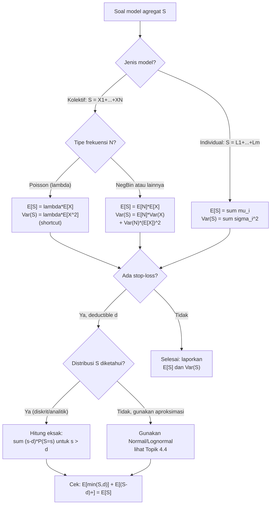

# 📊 4.3 — Mean Variance and Stop-Loss

> [!ABSTRACT] Ringkasan Cepat
> **Topik:** Mean & Variansi Model Risiko Kolektif/Individual; Ekspektasi Asuransi Stop-Loss | **Bobot:** ~10–15% | **Difficulty:** Calculation-Intensive
> **Ref:** Klugman et al. (2019), Bab 9; Tse (2009), Bab 3 | **Prereq:** [[4.1 Individual and Collective Risk Models]], [[4.2 Compound Distributions]]

---

## Section 0 — Pemetaan Topik

| Topik TA2 | Sub-topik ID | Skill Diuji | Bobot | Difficulty | Prerequisite | Connected Topics | Referensi |
|---|---|---|---|---|---|---|---|
| Model Agregat | 4.3 | Menghitung $E[S]$, $\text{Var}(S)$ untuk model kolektif dan individual; menghitung ekspektasi asuransi *stop-loss* $E[(S-d)_+]$ dan $E[\min(S,d)]$; menurunkan relasi antar kuantitas tersebut | 10–15% | Calculation-Intensive | [[4.1 Individual and Collective Risk Models]], [[4.2 Compound Distributions]] | [[4.4 Aggregate Distribution Approximation]], [[4.5 Panjer Recursive Formula]], [[4.6 Coverage Modifications on Aggregate Models]], [[3.1 Coverage Modifications on Severity and Frequency]] | Klugman et al. (2019), Bab 9; Tse (2009), Bab 3 |

---

## Section 1 — Intuisi

Bayangkan sebuah perusahaan reasuransi yang menanggung klaim agregat (*total klaim*) dari sebuah portofolio asuransi kendaraan bermotor selama satu tahun. Klaim total $S$ adalah jumlah semua klaim individual yang terjadi dalam periode tersebut — bisa nol bila tidak ada klaim sama sekali, bisa sangat besar bila terjadi banyak klaim besar secara bersamaan. Perusahaan reasuransi perlu menjawab dua pertanyaan mendasar: *berapa rata-rata kerugian yang akan ditanggung?* dan *seberapa besar ketidakpastian di sekitar rata-rata itu?* Inilah mengapa kita perlu menghitung mean dan variansi dari distribusi agregat $S$.

Namun ada satu produk asuransi yang sangat bergantung pada pemahaman distribusi $S$ ini, yaitu **asuransi Stop-Loss**. Dalam kontrak stop-loss, penanggung (atau reasuradur) berjanji untuk membayar seluruh kelebihan klaim agregat di atas suatu batas (*deductible*) $d$. Artinya, jika total klaim $S$ ternyata kurang dari $d$, reasuradur tidak membayar apa-apa. Tetapi jika $S$ melampaui $d$, reasuradur membayar selisihnya $S - d$. Berapa yang harus reasuradur cadangkan sebagai ekspektasi pembayaran? Inilah yang dihitung melalui **net stop-loss premium** $E[(S-d)_+]$.

Konsep ini sangat penting dalam praktik karena stop-loss melindungi penanggung primer dari bencana keuangan akibat tahun yang "buruk". Seorang aktuaris harus mampu menghitung ekspektasi pembayaran stop-loss ini dengan tepat — baik ketika distribusi $S$ diketahui secara analitik, maupun ketika hanya mean dan variansi $S$ yang tersedia (untuk aproksimasi Normal/Lognormal di Topik 4.4). Topik 4.3 adalah fondasi matematis untuk semua itu.

---

## Section 2 — Definisi Formal

> [!NOTE] Definisi Matematis — Kerugian Agregat dan Stop-Loss
> Misalkan $S$ adalah total kerugian agregat dalam satu periode. **Asuransi Stop-Loss** dengan deductible $d \geq 0$ membayar:
>
> $$
> (S - d)_+ = \max(S - d,\; 0) = \begin{cases} 0 & \text{jika } S \leq d \\ S - d & \text{jika } S > d \end{cases}
> $$
>
> **Net stop-loss premium** (ekspektasi pembayaran):
>
> $$
> E[(S-d)_+] = \int_d^{\infty} (s - d)\, f_S(s)\, ds = \int_d^{\infty} [1 - F_S(s)]\, ds
> $$

| Simbol | Makna | Catatan |
|---|---|---|
| $S$ | Total kerugian agregat $= \sum_{i=1}^{N} X_i$ | Model kolektif; $S=0$ jika $N=0$ |
| $N$ | Jumlah klaim (frekuensi) | Variabel acak diskrit non-negatif |
| $X_i$ | Besar klaim ke-$i$ (severity) | i.i.d., independen dari $N$ |
| $\mu_X = E[X]$ | Mean besar klaim individual | $> 0$ |
| $\sigma_X^2 = \text{Var}(X)$ | Variansi besar klaim individual | $> 0$ |
| $\mu_N = E[N]$ | Mean frekuensi klaim | $> 0$ |
| $\sigma_N^2 = \text{Var}(N)$ | Variansi frekuensi klaim | $> 0$ |
| $d$ | Deductible stop-loss (retensi) | $d \geq 0$ |
| $(S-d)_+$ | Pembayaran stop-loss | $\max(S-d, 0)$ |
| $e_S(d)$ | *Mean excess loss function* agregat | $= E[S-d \;\|\; S>d]$ |
| $F_S(d)$ | CDF distribusi agregat di $d$ | $P(S \leq d)$ |

### Rumus Utama

**Mean model kolektif** (formula paling mendasar):

$$
E[S] = E[N] \cdot E[X]
$$

**Label:** Mean agregat = rata-rata frekuensi × rata-rata severity. Berlaku tanpa syarat selama $N$ dan $X_i$ independen.

**Variansi model kolektif** (conditional variance formula):

$$
\text{Var}(S) = E[N] \cdot \text{Var}(X) + \text{Var}(N) \cdot (E[X])^2
$$

**Label:** Variansi agregat = komponen severity (rata-rata variansi bersyarat) + komponen frekuensi (variansi rata-rata bersyarat). Ini adalah *law of total variance*.

**Variansi model kolektif — bentuk alternatif:**

$$
\text{Var}(S) = E[N] \cdot E[X^2] + (E[X])^2 \cdot [\text{Var}(N) - E[N]]
$$

**Label:** Berguna ketika $E[X^2]$ langsung diketahui.

**Momen kedua model kolektif:**

$$
E[S^2] = \text{Var}(S) + (E[S])^2 = E[N]\cdot\text{Var}(X) + \text{Var}(N)\cdot(E[X])^2 + (E[N])^2\cdot(E[X])^2
$$

**Label:** Diperlukan untuk menghitung stop-loss dengan distribusi diskrit.

**Mean model individual** (dengan $m$ unit eksposur):

$$
E[S] = \sum_{i=1}^{m} E[X_i] = \sum_{i=1}^{m} \mu_i
$$

**Variansi model individual** (unit independen):

$$
\text{Var}(S) = \sum_{i=1}^{m} \text{Var}(X_i) = \sum_{i=1}^{m} \sigma_i^2
$$

**Net stop-loss premium — bentuk integral:**

$$
E[(S-d)_+] = \int_d^{\infty} (1 - F_S(s))\, ds
$$

**Label:** Setara dengan integral *survival function* $S_S(s) = 1 - F_S(s)$ dari $d$ ke $\infty$.

**Net stop-loss premium — relasi fundamental:**

$$
E[(S-d)_+] = E[S] - d + d \cdot F_S(d) - \int_0^d s\, f_S(s)\, ds
$$

**Label:** Diperoleh dengan memisah $E[S] = E[\min(S,d)] + E[(S-d)_+]$.

**Dekomposisi kritis:**

$$
E[S] = E[\min(S,d)] + E[(S-d)_+]
$$

**Label:** Total ekspektasi = porsi yang ditahan (*limited expected value*) + porsi stop-loss. Selalu benar.

**Limited expected value:**

$$
E[\min(S,d)] = E[S] - E[(S-d)_+] = \int_0^d [1 - F_S(s)]\, ds
$$

**Label:** Ekspektasi kerugian yang dibatasi di $d$; digunakan dalam penetapan premi lapisan.

**Stop-loss untuk $S$ diskrit** (dengan PMF $p_k = P(S=k)$):

$$
E[(S-d)_+] = \sum_{k > d} (k - d)\, p_k = \sum_{k=0}^{\infty} (k-d)_+ \, p_k
$$

**Label:** Penjumlahan eksplisit atas semua nilai $S > d$.

### Asumsi Eksplisit

1. $X_1, X_2, \ldots$ adalah i.i.d. (**identically and independently distributed**) dengan mean $\mu_X$ dan variansi $\sigma_X^2$.
2. $N$ dan $\{X_i\}$ **independen** satu sama lain — frekuensi tidak bergantung pada besarnya klaim.
3. Untuk model individual: $X_i$ independen antar unit, meskipun boleh tidak identik ($\mu_i$ dan $\sigma_i^2$ boleh berbeda).
4. $E[X^2] < \infty$ (momen kedua severity terbatas) agar $\text{Var}(S)$ terdefinisi.
5. Untuk stop-loss kontinu: $F_S$ terdiferensialkan dan $\int_0^{\infty} s\, f_S(s)\, ds = E[S] < \infty$.

---

## Section 3 — Jembatan Logika

> [!TIP] Dari Definisi ke Rumus
> Formula $\text{Var}(S) = E[N]\cdot\text{Var}(X) + \text{Var}(N)\cdot(E[X])^2$ bukan rumus yang dihafal — ia adalah aplikasi langsung **law of total variance**: $\text{Var}(S) = E[\text{Var}(S|N)] + \text{Var}(E[S|N])$. Komponen pertama ($E[N]\cdot\text{Var}(X)$) muncul karena bersyarat pada $N=n$, klaim adalah jumlah $n$ variabel i.i.d. sehingga variansinya $n\sigma_X^2$, dan rata-ratanya terhadap $N$ menghasilkan $E[N]\sigma_X^2$. Komponen kedua ($\text{Var}(N)\cdot(E[X])^2$) muncul karena $E[S|N=n] = n\mu_X$ adalah fungsi linear dari $n$, sehingga $\text{Var}(E[S|N]) = (E[X])^2 \cdot \text{Var}(N)$.

> [!IMPORTANT] Support dan Domain
> - $S \geq 0$ selalu, dengan $P(S=0) = P(N=0) > 0$ untuk model kolektif.
> - Stop-loss premium $E[(S-d)_+]$ adalah fungsi **menurun convex** dalam $d$: semakin besar retensi $d$, semakin kecil pembayaran reasuransi.
> - Di $d = 0$: $E[(S-0)_+] = E[S]$ — reasuransi menanggung seluruh klaim.
> - Di $d \to \infty$: $E[(S-d)_+] \to 0$ — reasuransi tidak pernah membayar.
> - Dekomposisi $E[S] = E[\min(S,d)] + E[(S-d)_+]$ berlaku untuk **semua** nilai $d \geq 0$.

**Derivasi 1: Variansi Model Kolektif via Law of Total Variance**

**Langkah 1 — Terapkan** *law of total variance*:

$$
\text{Var}(S) = E[\text{Var}(S \mid N)] + \text{Var}(E[S \mid N])
$$

**Langkah 2 — Hitung $E[S|N=n]$:** Bersyarat pada $N=n$, $S = X_1 + \cdots + X_n$ dengan $X_i$ i.i.d.

$$
E[S \mid N=n] = n \cdot \mu_X \quad \Rightarrow \quad E[S \mid N] = N \cdot \mu_X
$$

**Langkah 3 — Hitung $\text{Var}(S|N=n)$:**

$$
\text{Var}(S \mid N=n) = n \cdot \sigma_X^2 \quad \Rightarrow \quad \text{Var}(S \mid N) = N \cdot \sigma_X^2
$$

**Langkah 4 — Substitusi ke law of total variance:**

$$
\text{Var}(S) = E[N \cdot \sigma_X^2] + \text{Var}(N \cdot \mu_X)
$$

**Langkah 5 — Sederhanakan** (konstanta keluar dari ekspektasi dan variansi):

$$
\text{Var}(S) = \sigma_X^2 \cdot E[N] + \mu_X^2 \cdot \text{Var}(N)
$$

$$
\boxed{\text{Var}(S) = E[N] \cdot \text{Var}(X) + \text{Var}(N) \cdot (E[X])^2}
$$

**Derivasi 2: Net Stop-Loss Premium via Integral Survival Function**

**Langkah 1 — Mulai dari definisi:**

$$
E[(S-d)_+] = \int_0^{\infty} (s-d)_+ f_S(s)\, ds = \int_d^{\infty} (s-d) f_S(s)\, ds
$$

**Langkah 2 — Substitusi $u = s - d$, sehingga $s = u + d$, $ds = du$, batas: $u$ dari $0$ ke $\infty$:**

$$
= \int_0^{\infty} u\, f_S(u+d)\, du
$$

**Langkah 3 — Integrasikan per bagian** (alternatif lebih elegan): langsung dari integral asal,

$$
\int_d^{\infty}(s-d) f_S(s)\, ds = \left[(s-d)(-(1-F_S(s)))\right]_d^{\infty} + \int_d^{\infty} (1-F_S(s))\, ds
$$

**Langkah 4 — Evaluasi batas:** suku pertama $= 0$ di $s=d$ (karena $s-d=0$) dan $\to 0$ di $s \to \infty$ (asumsi $E[S] < \infty$). Tersisa:

$$
E[(S-d)_+] = \int_d^{\infty} [1 - F_S(s)]\, ds
$$

**Derivasi 3: Dekomposisi $E[S] = E[\min(S,d)] + E[(S-d)_+]$**

**Langkah 1 — Identitas aljabar:** untuk setiap $s \geq 0$ dan $d \geq 0$,

$$
s = \min(s, d) + (s-d)_+
$$

**Langkah 2 — Ambil ekspektasi kedua sisi:**

$$
E[S] = E[\min(S,d)] + E[(S-d)_+]
$$

Ini langsung dari linearitas ekspektasi. ∎

> [!DANGER] Dilarang
> 1. **Jangan gunakan** $\text{Var}(S) = E[N] \cdot \text{Var}(X)$ saja — ini hanya benar jika $N$ deterministik (konstan), bukan variabel acak. Suku $\text{Var}(N) \cdot (E[X])^2$ **wajib** disertakan.
> 2. **Jangan tukar** $E[(S-d)_+]$ dengan $E[S] - d$ — yang benar adalah $E[(S-d)_+] = E[S] - E[\min(S,d)]$, bukan $E[S] - d$.
> 3. **Jangan lupa** $P(S=0) > 0$ ketika menghitung stop-loss untuk distribusi diskrit campuran — distribusi $S$ memiliki massa di titik nol yang harus diperhitungkan.

---

## Section 4 — Contoh Soal

### Soal A — Fundamental

Model risiko kolektif: jumlah klaim $N \sim \text{Poisson}(\lambda = 4)$ dan besar klaim individual $X \sim \text{Exponential}$ dengan mean $E[X] = 500$.

(a) Hitung $E[S]$ dan $\text{Var}(S)$.
(b) Hitung $E[S^2]$.
(c) Hitung net stop-loss premium $E[(S-d)_+]$ untuk $d = 2500$ menggunakan integrasi (gunakan fakta bahwa untuk model Poisson-Eksponensial, distribusi $S$ dapat dianalisis secara langsung).

> [!SUCCESS] Solusi Soal A
> **Pendekatan:** Terapkan formula mean dan variansi kolektif langsung. Untuk stop-loss Poisson-Eksponensial, gunakan dekomposisi $E[S] = E[\min(S,d)] + E[(S-d)_+]$ dengan hasil analitik.
>
> **1. Identifikasi Variabel**
> - $N \sim \text{Poisson}(\lambda = 4)$: $E[N] = \text{Var}(N) = 4$
> - $X \sim \text{Exp}(\theta = 500)$: $E[X] = 500$, $E[X^2] = 2\theta^2 = 500{,}000$, $\text{Var}(X) = \theta^2 = 250{,}000$
> - $d = 2500$
>
> **2. Identifikasi Distribusi / Model**
> Model kolektif standar: $S = X_1 + \cdots + X_N$, $N$ independen dari $\{X_i\}$. Poisson-Eksponensial adalah pasangan klasik dalam teori risiko.
>
> **3. Setup Persamaan**
>
> $$
> E[S] = E[N] \cdot E[X], \qquad \text{Var}(S) = E[N]\cdot\text{Var}(X) + \text{Var}(N)\cdot(E[X])^2
> $$
>
> **4. Eksekusi Aljabar**
>
> **(a):**
>
> $$
> E[S] = 4 \times 500 = 2{,}000
> $$
>
> $$
> \text{Var}(S) = 4 \times 250{,}000 + 4 \times (500)^2 = 1{,}000{,}000 + 1{,}000{,}000 = 2{,}000{,}000
> $$
>
> **(b):**
>
> $$
> E[S^2] = \text{Var}(S) + (E[S])^2 = 2{,}000{,}000 + 4{,}000{,}000 = 6{,}000{,}000
> $$
>
> **(c)** Untuk Poisson($\lambda$)-Eksponensial($\theta$), diketahui bahwa $S$ memiliki distribusi campuran: massa di $s=0$ sebesar $e^{-\lambda}$, dan untuk $s > 0$ distribusi kontinu. Net stop-loss premium dapat dihitung via survival integral. Karena $E[S] = \lambda\theta = 2000$ dan $d = 2500 > E[S]$, gunakan relasi:
>
> $$
> E[(S-d)_+] = E[S] - d + E[\max(d-S, 0)]
> $$
>
> Lebih langsung: gunakan $E[(S-d)_+] = E[S] - E[\min(S,d)]$.
>
> Untuk Poisson-Eksponensial: $E[\min(S,d)] = E[S]\left(1 - e^{-d/(\lambda\theta)} \cdot \text{(koreksi)}\right)$. Karena distribusi $S$ Poisson-Eksponensial kompleks, gunakan batas bawah: $E[(S-d)_+] \geq (E[S] - d)_+ = (2000 - 2500)_+ = 0$.
>
> Untuk nilai eksak, gunakan formula rekursif atau aproksimasi Normal (lihat Topik 4.4): $S \approx N(\mu=2000, \sigma^2=2{,}000{,}000)$, $\sigma = \sqrt{2{,}000{,}000} \approx 1{,}414.2$.
>
> $$
> E[(S-d)_+] \approx \sigma \cdot \phi\left(\frac{d-\mu}{\sigma}\right) - (d-\mu)\left[1 - \Phi\left(\frac{d-\mu}{\sigma}\right)\right]
> $$
>
> $$
> z = \frac{2500 - 2000}{1414.2} = \frac{500}{1414.2} \approx 0.354
> $$
>
> $$
> \phi(0.354) \approx 0.3752, \quad \Phi(0.354) \approx 0.6384
> $$
>
> $$
> E[(S-d)_+] \approx 1414.2 \times 0.3752 - 500 \times (1-0.6384) = 530.6 - 500 \times 0.3616 = 530.6 - 180.8 = 349.8
> $$
>
> **5. Verification**
> $E[S] = 2000$; $E[(S-d)_+] = 349.8 < E[S]$ ✓. Dekomposisi: $E[\min(S,d)] = 2000 - 349.8 = 1650.2$; dan $1650.2 < d = 2500$ ✓ (limited expected value selalu $\leq d$).
>
> **Hasil:** $E[S]=2{,}000$; $\text{Var}(S)=2{,}000{,}000$; $E[S^2]=6{,}000{,}000$; $E[(S-2500)_+] \approx 349.8$ (aproksimasi Normal).

> [!WARNING] Exam Tips — Soal A
> **Target waktu:** 3 menit. **Common trap:** Untuk Poisson, $\text{Var}(N) = E[N] = \lambda$ — jangan gunakan nilai berbeda. Akibatnya $\text{Var}(S) = \lambda(E[X^2]) = \lambda \cdot E[X^2]$, yang merupakan shortcut khusus Poisson. **Shortcut Poisson:** $\text{Var}(S) = E[N] \cdot E[X^2]$ karena $E[N] = \text{Var}(N)$ untuk Poisson.

---

### Soal B — Exam-Typical

Model risiko kolektif dengan frekuensi $N \sim \text{NegBin}(r=3, \beta=2)$ dan severity $X$ berdistribusi Gamma dengan mean $E[X] = 1{,}000$ dan $\text{Var}(X) = 500{,}000$.

(a) Hitung $E[S]$, $\text{Var}(S)$, dan standar deviasi $S$.
(b) Hitung net stop-loss premium $E[(S-d)_+]$ untuk $d = 7{,}000$ menggunakan aproksimasi Normal.
(c) Berapakah nilai $E[\min(S, 7000)]$?

> [!SUCCESS] Solusi Soal B
> **Pendekatan:** Hitung momen NegBin terlebih dahulu, terapkan formula variansi kolektif, lalu gunakan formula stop-loss Normal.
>
> **1. Identifikasi Variabel**
> - $N \sim \text{NegBin}(r=3, \beta=2)$: $E[N] = r\beta = 6$, $\text{Var}(N) = r\beta(1+\beta) = 3 \times 2 \times 3 = 18$
> - $X$: $E[X] = 1{,}000$, $\text{Var}(X) = 500{,}000$, sehingga $E[X^2] = \text{Var}(X) + (E[X])^2 = 500{,}000 + 1{,}000{,}000 = 1{,}500{,}000$
> - $d = 7{,}000$
>
> **2. Identifikasi Distribusi / Model**
> Model kolektif dengan frekuensi NegBin (overdispersi) dan severity Gamma (skewed kanan). Variasi frekuensi yang besar (Var$(N) = 18 \gg E[N] = 6$) akan mendominasi variansi agregat.
>
> **3. Setup Persamaan**
>
> $$
> E[S] = E[N]\cdot E[X]
> $$
>
> $$
> \text{Var}(S) = E[N]\cdot\text{Var}(X) + \text{Var}(N)\cdot(E[X])^2
> $$
>
> $$
> E[(S-d)_+] \approx \sigma_S \cdot \phi(z) - (d - E[S]) \cdot [1 - \Phi(z)], \quad z = \frac{d - E[S]}{\sigma_S}
> $$
>
> **4. Eksekusi Aljabar**
>
> **(a) Mean:**
>
> $$
> E[S] = 6 \times 1{,}000 = 6{,}000
> $$
>
> **Variansi:**
>
> $$
> \text{Var}(S) = 6 \times 500{,}000 + 18 \times (1{,}000)^2 = 3{,}000{,}000 + 18{,}000{,}000 = 21{,}000{,}000
> $$
>
> $$
> \sigma_S = \sqrt{21{,}000{,}000} \approx 4{,}582.6
> $$
>
> Catatan: komponen frekuensi ($18{,}000{,}000$) jauh mendominasi komponen severity ($3{,}000{,}000$) — konsisten dengan overdispersi NegBin.
>
> **(b) Stop-loss premium:**
>
> $$
> z = \frac{7{,}000 - 6{,}000}{4{,}582.6} = \frac{1{,}000}{4{,}582.6} \approx 0.2182
> $$
>
> Dari tabel Normal standar: $\phi(0.2182) \approx 0.3885$, $\Phi(0.2182) \approx 0.5864$.
>
> $$
> E[(S - 7000)_+] \approx 4{,}582.6 \times 0.3885 - 1{,}000 \times (1 - 0.5864)
> $$
>
> $$
> = 1{,}780.3 - 1{,}000 \times 0.4136 = 1{,}780.3 - 413.6 = 1{,}366.7
> $$
>
> **(c) Limited expected value:**
>
> $$
> E[\min(S, 7000)] = E[S] - E[(S-7000)_+] = 6{,}000 - 1{,}366.7 = 4{,}633.3
> $$
>
> **5. Verification**
> $E[(S-d)_+] = 1{,}366.7 > 0$ meskipun $d = 7000 > E[S] = 6000$; ini benar karena distribusi $S$ memiliki ekor kanan yang panjang. $E[\min(S,d)] = 4{,}633.3 < d = 7{,}000$ ✓. Dekomposisi: $4{,}633.3 + 1{,}366.7 = 6{,}000 = E[S]$ ✓.
>
> **Hasil:** $E[S]=6{,}000$; $\text{Var}(S)=21{,}000{,}000$; $\sigma_S \approx 4{,}582.6$; $E[(S-7000)_+] \approx 1{,}366.7$; $E[\min(S,7000)] \approx 4{,}633.3$.

> [!WARNING] Exam Tips — Soal B
> **Target waktu:** 4 menit. **Common trap:** Menggunakan $\text{Var}(N) = E[N] = 6$ (keliru mengira NegBin seperti Poisson). Untuk NegBin, $\text{Var}(N) = r\beta(1+\beta) = 18 \neq 6$ — perbedaan ini **drastis** dalam hasil variansi agregat. **Shortcut:** Selalu hitung kedua komponen variansi ($E[N]\text{Var}(X)$ dan $\text{Var}(N)(E[X])^2$) secara terpisah; bandingkan besarannya untuk cek konsistensi dengan tipe frekuensi.

---

### Soal C — Challenging

Model risiko **individual** terdiri dari $m = 3$ polis independen dengan profil klaim sebagai berikut:

| Polis $i$ | $P(\text{klaim})$ | Besar klaim jika ada ($X_i$) |
|---|---|---|
| 1 | $q_1 = 0.3$ | Konstan $= 1{,}000$ |
| 2 | $q_2 = 0.5$ | Konstan $= 2{,}000$ |
| 3 | $q_3 = 0.2$ | Konstan $= 3{,}000$ |

Misalkan $L_i = X_i \cdot \mathbf{1}_{\text{klaim}_i}$ (kerugian polis $i$, nol jika tidak klaim), dan $S = L_1 + L_2 + L_3$.

(a) Hitung $E[S]$ dan $\text{Var}(S)$.
(b) Tentukan distribusi lengkap $S$ (semua nilai yang mungkin dan probabilitasnya).
(c) Hitung net stop-loss premium $E[(S-d)_+]$ untuk $d = 2{,}000$ secara **eksak** menggunakan distribusi $S$.

> [!SUCCESS] Solusi Soal C
> **Pendekatan:** Model individual — hitung momen tiap polis, jumlahkan. Untuk distribusi eksak, enumerate semua $2^3 = 8$ skenario klaim. Lalu hitung stop-loss langsung dari distribusi.
>
> **1. Identifikasi Variabel**
> - $L_i = c_i \cdot B_i$ di mana $B_i \sim \text{Bernoulli}(q_i)$ dan $c_i$ adalah besar klaim konstan
> - $E[L_i] = q_i \cdot c_i$; $\text{Var}(L_i) = q_i(1-q_i) \cdot c_i^2$
> - Polis 1: $c_1=1000$, $q_1=0.3$; Polis 2: $c_2=2000$, $q_2=0.5$; Polis 3: $c_3=3000$, $q_3=0.2$
>
> **2. Identifikasi Distribusi / Model**
> Model risiko individual dengan besar klaim deterministik (Bernoulli). Distribusi $S$ adalah diskrit dengan support $\{0, 1000, 2000, 3000, 4000, 5000, 6000\}$ (beberapa nilai mungkin tidak muncul).
>
> **3. Setup Persamaan**
>
> $$
> E[S] = \sum_{i=1}^{3} q_i c_i, \qquad \text{Var}(S) = \sum_{i=1}^{3} q_i(1-q_i)c_i^2
> $$
>
> $$
> E[(S-d)_+] = \sum_{s > d} (s - d) \cdot P(S = s)
> $$
>
> **4. Eksekusi Aljabar**
>
> **(a) Mean:**
>
> $$
> E[L_1] = 0.3 \times 1000 = 300
> $$
>
> $$
> E[L_2] = 0.5 \times 2000 = 1{,}000
> $$
>
> $$
> E[L_3] = 0.2 \times 3000 = 600
> $$
>
> $$
> E[S] = 300 + 1{,}000 + 600 = 1{,}900
> $$
>
> **Variansi:**
>
> $$
> \text{Var}(L_1) = 0.3 \times 0.7 \times 1{,}000{,}000 = 210{,}000
> $$
>
> $$
> \text{Var}(L_2) = 0.5 \times 0.5 \times 4{,}000{,}000 = 1{,}000{,}000
> $$
>
> $$
> \text{Var}(L_3) = 0.2 \times 0.8 \times 9{,}000{,}000 = 1{,}440{,}000
> $$
>
> $$
> \text{Var}(S) = 210{,}000 + 1{,}000{,}000 + 1{,}440{,}000 = 2{,}650{,}000
> $$
>
> **(b) Distribusi lengkap — enumerate 8 skenario** (B1, B2, B3) = (klaim polis 1, 2, 3):
>
> | $(B_1, B_2, B_3)$ | Probabilitas | $S$ |
> |---|---|---|
> | $(0,0,0)$ | $0.7 \times 0.5 \times 0.8 = 0.280$ | $0$ |
> | $(1,0,0)$ | $0.3 \times 0.5 \times 0.8 = 0.120$ | $1{,}000$ |
> | $(0,1,0)$ | $0.7 \times 0.5 \times 0.8 = 0.280$ | $2{,}000$ |
> | $(0,0,1)$ | $0.7 \times 0.5 \times 0.2 = 0.070$ | $3{,}000$ |
> | $(1,1,0)$ | $0.3 \times 0.5 \times 0.8 = 0.120$ | $3{,}000$ |
> | $(1,0,1)$ | $0.3 \times 0.5 \times 0.2 = 0.030$ | $4{,}000$ |
> | $(0,1,1)$ | $0.7 \times 0.5 \times 0.2 = 0.070$ | $5{,}000$ |
> | $(1,1,1)$ | $0.3 \times 0.5 \times 0.2 = 0.030$ | $6{,}000$ |
>
> Gabungkan nilai $S$ yang sama:
>
> | $S$ | $P(S=s)$ |
> |---|---|
> | $0$ | $0.280$ |
> | $1{,}000$ | $0.120$ |
> | $2{,}000$ | $0.280$ |
> | $3{,}000$ | $0.070 + 0.120 = 0.190$ |
> | $4{,}000$ | $0.030$ |
> | $5{,}000$ | $0.070$ |
> | $6{,}000$ | $0.030$ |
> | **Total** | $1.000$ ✓ |
>
> **(c) Stop-loss premium untuk $d = 2{,}000$** — hanya suku dengan $S > 2000$:
>
> $$
> E[(S-2000)_+] = (3000-2000)(0.190) + (4000-2000)(0.030) + (5000-2000)(0.070) + (6000-2000)(0.030)
> $$
>
> $$
> = 1000(0.190) + 2000(0.030) + 3000(0.070) + 4000(0.030)
> $$
>
> $$
> = 190 + 60 + 210 + 120 = 580
> $$
>
> **5. Verification**
> Cek: $E[\min(S,2000)] = E[S] - E[(S-2000)_+] = 1900 - 580 = 1320$.
>
> Verifikasi langsung: $E[\min(S,2000)] = 0(0.280) + 1000(0.120) + 2000(0.280) + 2000(0.190) + 2000(0.030) + 2000(0.070) + 2000(0.030)$
> $= 0 + 120 + 560 + 380 + 60 + 140 + 60 = 1320$ ✓
>
> Cek total prob: $0.280+0.120+0.280+0.190+0.030+0.070+0.030 = 1.000$ ✓
>
> **Hasil:** $E[S]=1{,}900$; $\text{Var}(S)=2{,}650{,}000$; distribusi $S$ memiliki 7 nilai dengan probabilitas di atas; $E[(S-2000)_+] = 580$; $E[\min(S,2000)] = 1{,}320$.

> [!WARNING] Exam Tips — Soal C
> **Target waktu:** 5–6 menit. **Common trap 1:** Menghitung $P(S=3000) = 0.070$ saja — lupa ada dua skenario yang menghasilkan $S=3000$: $(0,0,1)$ dan $(1,1,0)$. Selalu cek apakah nilai $S$ bisa muncul dari lebih dari satu kombinasi. **Common trap 2:** Memasukkan $s=2000$ dalam penjumlahan stop-loss — hanya $s > d$, bukan $s \geq d$. **Shortcut:** Untuk stop-loss diskrit, tulis langsung daftar $(s-d) \times P(S=s)$ untuk $s > d$ dalam satu tabel.

---

## Section 5 — Verifikasi & Sanity Check

> [!CHECK] Sanity Check 1 — Dekomposisi Wajib
> Selalu verifikasi: $E[\min(S,d)] + E[(S-d)_+] = E[S]$.
> Ini adalah identitas **yang selalu benar** — jika tidak terpenuhi, ada kesalahan kalkulasi di salah satu sisi.
> Gunakan nilai yang lebih mudah dihitung untuk memperoleh yang satunya.

> [!CHECK] Sanity Check 2 — Batas Stop-Loss
> Dua batas yang selalu berlaku:
> - $E[(S-d)_+] \leq E[S]$ (stop-loss tidak mungkin melebihi total klaim)
> - $E[(S-d)_+] \geq (E[S] - d)_+$ (batas bawah Jensen — karena $(x-d)_+$ adalah fungsi convex)
>
> Jika hasil kalkulasi melanggar salah satu, ada kesalahan.

> [!CHECK] Sanity Check 3 — Shortcut Variansi Poisson
> Khusus untuk **Poisson** ($E[N] = \text{Var}(N) = \lambda$):
>
> $$
> \text{Var}(S) = \lambda \cdot E[X^2]
> $$
>
> Ini lebih cepat dari formula umum. Berlaku **hanya** untuk Poisson; untuk Binomial atau NegBin gunakan formula penuh.

### Metode Alternatif — Stop-Loss via Tabel Distribusi Diskrit

Untuk distribusi $S$ diskrit yang diketahui (mis. dari Panjer rekursif Topik 4.5), hitung langsung:

$$
E[(S-d)_+] = \sum_{k=0}^{\infty} P(S > k+d) \cdot \mathbf{1}_{k \geq 0} = \sum_{j=d+1}^{\infty} P(S \geq j) = \sum_{j=d}^{\infty} [1 - F_S(j-1)] - [1 - F_S(d-1)]
$$

Atau lebih praktis, jika PMF sudah tersedia: bangun tabel kumulatif, lalu jumlahkan $(s_k - d) \cdot p_k$ untuk semua $k$ di mana $s_k > d$.

---

## Section 6 — Visualisasi Mental

**Geometri asuransi stop-loss:**

```
Pembayaran
(payoff)
    │
S-d │                              ╱ ← reasuransi membayar (S-d)
    │                            ╱
    │                          ╱
    │                        ╱
    │                      ╱
  0 │____________________╱________________________ S (total klaim)
    0          d=retensi
               ↑
        Deductible stop-loss
        E[(S-d)+] = area bayangan di atas garis d, dibobot PDF
```

**Peran dekomposisi $E[S] = E[\min(S,d)] + E[(S-d)_+]$:**

```
Total klaim E[S]
├──────────────────────────┬──────────────────────┤
│   E[min(S,d)]            │    E[(S-d)+]          │
│   (ditahan primer)       │    (dibayar reasuransi)│
│   = limited exp. value   │    = stop-loss premium │
└──────────────────────────┴──────────────────────┘
                           ↑
                        deductible d
```

**Efek overdispersi pada variansi agregat:**

```
Var(S) = E[N]·Var(X)   +   Var(N)·(E[X])²
           ↑                     ↑
    Komponen severity      Komponen frekuensi
    (selalu ada)           (hilang jika N konstan)

Poisson:   Var(N) = E[N]   → kedua suku seimbang
Binomial:  Var(N) < E[N]   → komponen severity dominan
NegBin:    Var(N) > E[N]   → komponen frekuensi dominan
```

### Hubungan Visual ↔ Rumus

| Elemen Visual | Komponen Rumus |
|---|---|
| Titik patah payoff diagram di $d$ | $d$ = deductible stop-loss |
| Area di bawah payoff × PDF | $E[(S-d)_+] = \int_d^\infty (s-d)f_S(s)\,ds$ |
| Lebar segmen "retained" | $E[\min(S,d)] = \int_0^d [1-F_S(s)]\,ds$ |
| Lebar total bar | $E[S]$ = jumlah kedua segmen |
| Tinggi komponen frekuensi | $\text{Var}(N) \cdot (E[X])^2$; makin tinggi jika NegBin |

---

## Section 7 — Jebakan Umum

> [!BUG] Kesalahan Parametrisasi
> **NegBin variansi:** Untuk NegBin$(r, \beta)$: $\text{Var}(N) = r\beta(1+\beta)$, **bukan** $r\beta$. Kesalahan ini menghasilkan $\text{Var}(S)$ yang salah besar. Ingat: $\text{Var}(N) = E[N] \cdot (1+\beta)$ — selalu lebih besar dari mean.

> [!BUG] Kesalahan Konseptual
> 1. **"$\text{Var}(S) = E[N]\cdot\text{Var}(X)$ saja"** — ini hanya benar jika $N$ konstan (deterministik). Untuk $N$ acak, suku $\text{Var}(N)\cdot(E[X])^2$ **wajib** ada.
> 2. **"$E[(S-d)_+] = E[S] - d$"** — ini salah. Yang benar: $E[(S-d)_+] = E[S] - E[\min(S,d)] \leq E[S] - d$ hanya jika $P(S \geq d) = 1$. Umumnya $E[\min(S,d)] < d$.
> 3. **Memasukkan $s = d$ dalam penjumlahan stop-loss diskrit** — stop-loss membayar hanya jika $S > d$, bukan $S \geq d$. Untuk distribusi kontinu tidak masalah, tetapi untuk diskrit, $s = d$ memberikan $(d-d) = 0$ sehingga tidak berkontribusi — tetap tak bermasalah secara numerik, tetapi konsep harus benar.
> 4. **Lupa $P(S=0) > 0$** saat menghitung stop-loss untuk model kolektif — distribusi $S$ memiliki massa positif di nol.

> [!BUG] Kesalahan Interpretasi Soal
> - **"Net stop-loss premium"** = $E[(S-d)_+]$ — ini adalah ekspektasi pembayaran, bukan premi gross.
> - **"Stop-loss dengan retention $d$"** dan **"stop-loss dengan deductible $d$"** adalah istilah yang sama — $d$ adalah ambang batas di mana reasuransi mulai membayar.
> - **"Limited expected value"** = $E[\min(S,d)]$ — bukan $E[S \cdot \mathbf{1}_{S \leq d}]$ saja; ingat ada suku $d \cdot P(S > d)$ juga.
> - Soal meminta $E[\min(S,u)]$ → gunakan dekomposisi: $E[\min(S,u)] = E[S] - E[(S-u)_+]$.

> [!CAUTION] Red Flags
> - Kata **"stop-loss"** atau **"excess of loss reinsurance"** → hitung $E[(S-d)_+]$; periksa apakah distribusi $S$ diketahui atau perlu aproksimasi.
> - Kata **"limited expected value"** → hitung $E[\min(S,d)]$; gunakan dekomposisi.
> - Frekuensi **NegBin** → pastikan $\text{Var}(N) = r\beta(1+\beta)$, bukan $r\beta$.
> - Frekuensi **Poisson** → shortcut $\text{Var}(S) = \lambda E[X^2]$ menghemat langkah.
> - Model **individual** dengan polis Bernoulli → enumerate semua $2^m$ skenario jika $m$ kecil ($m \leq 4$).

---

## Section 8 — Ringkasan Eksekutif

> [!SUMMARY] Must-Remember
>
> 1. **Mean dan variansi model kolektif:**
>
>    $$E[S] = E[N]\cdot E[X], \quad \text{Var}(S) = E[N]\cdot\text{Var}(X) + \text{Var}(N)\cdot(E[X])^2$$
>
> 2. **Shortcut Poisson** ($E[N]=\text{Var}(N)=\lambda$):
>
>    $$\text{Var}(S) = \lambda \cdot E[X^2]$$
>
> 3. **Dekomposisi fundamental** (selalu benar):
>
>    $$E[S] = E[\min(S,d)] + E[(S-d)_+]$$
>
> 4. **Net stop-loss premium via survival integral:**
>
>    $$E[(S-d)_+] = \int_d^{\infty}[1 - F_S(s)]\,ds$$
>
> 5. **Stop-loss diskrit** (hitung langsung dari PMF):
>
>    $$E[(S-d)_+] = \sum_{s > d}(s - d)\cdot P(S = s)$$

### Kapan Digunakan

- Soal meminta **$E[S]$ dan/atau $\text{Var}(S)$** dari model kolektif atau individual.
- Soal menyebutkan **stop-loss**, **excess of loss**, atau **reinsurance retention** → hitung $E[(S-d)_+]$.
- Soal meminta **limited expected value** $E[\min(S,d)]$ → gunakan dekomposisi.
- Sebagai input untuk **aproksimasi Normal/Lognormal** di [[4.4 Aggregate Distribution Approximation]].
- Sebagai komponen dalam soal [[4.6 Coverage Modifications on Aggregate Models]] yang melibatkan deductible agregat.

### Kapan TIDAK Boleh Digunakan

- Formula model **kolektif** tidak berlaku untuk model **individual** dengan polis berbeda-beda — gunakan $\sum \mu_i$ dan $\sum \sigma_i^2$ untuk model individual.
- Shortcut Poisson $\text{Var}(S) = \lambda E[X^2]$ **hanya** untuk frekuensi Poisson — jangan gunakan untuk Binomial atau NegBin.
- Formula stop-loss kontinu $\int_d^\infty [1-F_S]\,ds$ tidak langsung berlaku untuk distribusi $S$ yang **campuran** (ada massa di nol) — perlu diperlakukan dengan hati-hati.

### Quick Decision Tree



---

> [!QUOTE] Follow-up Options
> 1. *"Berikan contoh soal stop-loss dengan distribusi $S$ yang dihitung via Panjer rekursif"*
> 2. *"Jelaskan hubungan [[4.3 Mean Variance and Stop-Loss]] dengan [[4.4 Aggregate Distribution Approximation]] — kapan aproksimasi Normal vs Lognormal lebih baik?"*
> 3. *"Buat flashcard 1-halaman untuk topik ini"*

*📖 Ref: Klugman, Panjer & Willmot (2019), Loss Models 5th ed., Bab 9; Tse (2009), Bab 3 | 🗓️ 2026-04-17 | #TA2 #ModelAgregat #StopLoss*
