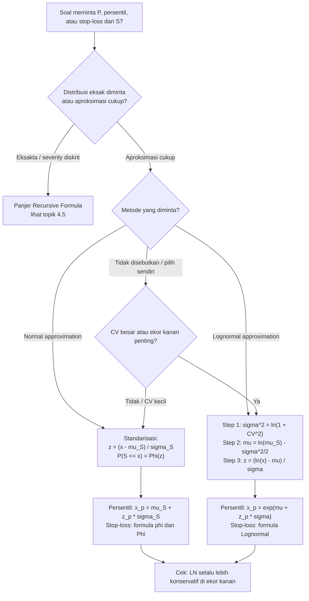

# 📊 4.4 — Aggregate Distribution Approximation

> [!ABSTRACT] Ringkasan Cepat
> **Topik:** Aggregate Distribution Approximation | **Bobot:** ~10–15% | **Difficulty:** Calculation-Intensive
> **Ref:** Klugman et al. (2019), Loss Models 5th ed., Bab 9; Tse (2009) Bab 3 | **Prereq:** [[4.2 Compound Distributions]], [[4.3 Mean Variance and Stop-Loss]]

## Section 0 — Pemetaan Topik

| Topik TA2 | Sub-topik ID | Skill Diuji | Bobot | Difficulty | Prerequisite | Connected Topics | Referensi |
|---|---|---|---|---|---|---|---|
| Model Agregat | 4.4 | Memperkirakan distribusi agregat $S$ menggunakan pendekatan Normal dan Lognormal; menghitung probabilitas, persentil, dan stop-loss premium menggunakan aproksimasi; membandingkan kualitas dua pendekatan | 10–15% | Calculation-Intensive | [[4.2 Compound Distributions]], [[4.3 Mean Variance and Stop-Loss]] | [[4.3 Mean Variance and Stop-Loss]], [[4.5 Panjer Recursive Formula]], [[4.6 Coverage Modifications on Aggregate Models]] | Klugman et al. (2019) Bab 9; Tse (2009) Bab 3 |

## Section 1 — Intuisi

Seorang kepala aktuaris di perusahaan asuransi umum Indonesia perlu menjawab pertanyaan yang sangat konkret menjelang akhir tahun: "Berapa probabilitas total klaim tahun ini melebihi cadangan yang sudah kami siapkan?" atau "Di angka berapa total klaim agar kami hanya punya 5% peluang terlampaui?" Secara teoritis, distribusi agregat $S$ bisa dihitung tepat menggunakan konvolusi atau formula rekursif Panjer — tetapi untuk portofolio besar dengan ratusan ribu polis, komputasi eksak bisa sangat mahal atau bahkan tidak praktis. Di sinilah **pendekatan distribusi Normal dan Lognormal** berperan: keduanya memberikan jawaban yang cukup akurat dengan hanya membutuhkan beberapa momen dari $S$.

Pendekatan **Normal** bekerja berdasarkan Central Limit Theorem (CLT): saat jumlah klaim sangat banyak, distribusi total $S$ cenderung mendekati Normal. Cukup cocokkan mean dan variance $S$ ke parameter Normal, lalu gunakan tabel $z$-standar biasa. Masalahnya, distribusi agregat hampir selalu **positively skewed** — ekor kanannya lebih panjang dari yang diprediksi Normal — sehingga pendekatan Normal cenderung meremehkan probabilitas di ekor kanan yang justru paling kritis bagi manajemen risiko.

Pendekatan **Lognormal** mengatasi kelemahan ini. Karena Lognormal selalu positif dan positively skewed, ia jauh lebih cocok untuk meniru bentuk distribusi agregat klaim yang sesungguhnya. Kita cocokkan mean dan variance $S$ ke parameter Lognormal $(\mu, \sigma^2)$ menggunakan *method of moments*, lalu semua probabilitas dan persentil dihitung via transformasi logaritmik ke distribusi Normal standar. Dalam praktik aktuaria, Lognormal umumnya memberikan aproksimasi yang lebih konservatif dan lebih baik di ekor kanan — inilah yang dibutuhkan untuk penetapan cadangan dan pricing yang prudent.

## Section 2 — Definisi Formal

> [!NOTE] Definisi Matematis — Dua Pendekatan Aproksimasi
> Diberikan aggregate loss $S$ dengan mean $\mu_S = E(S)$ dan variance $\sigma_S^2 = \text{Var}(S)$ yang diketahui.
>
> **Aproksimasi Normal:** $S \approx N(\mu_S,\, \sigma_S^2)$
>
> **Aproksimasi Lognormal:** $S \approx \text{Lognormal}(\mu,\, \sigma^2)$ di mana parameter $\mu$ dan $\sigma^2$ ditentukan dengan mencocokkan dua momen pertama dari $S$.

| Simbol | Makna | Catatan |
|---|---|---|
| $S$ | Aggregate loss yang diaproksimasikan | Variabel acak kontinu non-negatif |
| $\mu_S$ | $E(S) = E(N)\,E(X)$ | Mean agregat dari [[4.3 Mean Variance and Stop-Loss]] |
| $\sigma_S^2$ | $\text{Var}(S)$ | Variance agregat; untuk Poisson: $\lambda E(X^2)$ |
| $\sigma_S$ | $\sqrt{\text{Var}(S)}$ | Standar deviasi agregat |
| $\mu$ | Parameter lokasi Lognormal | $\mu = \ln(\mu_S) - \tfrac{1}{2}\sigma^2$; bukan mean dari $S$ |
| $\sigma^2$ | Parameter skala Lognormal | $\sigma^2 = \ln\!\left(1 + \tfrac{\sigma_S^2}{\mu_S^2}\right)$ |
| $\Phi(\cdot)$ | CDF distribusi Normal standar | Dari tabel $z$ |
| $z_p$ | Persentil ke-$p$ dari Normal standar | $\Phi(z_p) = p$ |
| $\text{CV}$ | Coefficient of variation dari $S$ | $\text{CV} = \sigma_S / \mu_S$ |
| $\gamma_S$ | Koefisien skewness dari $S$ | $\gamma_S = E[(S-\mu_S)^3]/\sigma_S^3$; positif untuk klaim |

### Rumus Utama

**Parameter Lognormal dari momen $S$ (method of moments):**

$$\sigma^2 = \ln\!\left(1 + \frac{\sigma_S^2}{\mu_S^2}\right) = \ln\!\left(1 + \text{CV}^2\right)$$

$$\mu = \ln(\mu_S) - \frac{\sigma^2}{2}$$

*Label: Dua persamaan ini adalah jantung aproksimasi Lognormal — selalu hitung $\sigma^2$ dulu, baru $\mu$.*

**CDF aproksimasi Normal:**

$$P(S \leq x) \approx \Phi\!\left(\frac{x - \mu_S}{\sigma_S}\right)$$

*Label: Standarisasi langsung ke $z$-score; gunakan tabel Normal standar.*

**CDF aproksimasi Lognormal:**

$$P(S \leq x) \approx \Phi\!\left(\frac{\ln x - \mu}{\sigma}\right)$$

*Label: Transformasi logaritmik ke Normal standar; valid hanya untuk $x > 0$.*

**Persentil ke-$p$ — aproksimasi Normal:**

$$x_p \approx \mu_S + z_p \cdot \sigma_S$$

*Label: Persentil diperoleh langsung dari $z_p$ tabel Normal standar.*

**Persentil ke-$p$ — aproksimasi Lognormal:**

$$x_p \approx e^{\mu + z_p \cdot \sigma}$$

*Label: Back-transform dari Normal standar; hasilnya selalu positif.*

**Stop-Loss premium — aproksimasi Normal:**

$$E[(S - d)_+] \approx \sigma_S \cdot \phi(z_d) - (d - \mu_S)\cdot[1 - \Phi(z_d)]$$

di mana $z_d = (d - \mu_S)/\sigma_S$ dan $\phi(\cdot)$ adalah PDF Normal standar.

*Label: Digunakan untuk menghitung harga asuransi stop-loss dengan deductible $d$ atas distribusi agregat.*

**Stop-Loss premium — aproksimasi Lognormal:**

$$E[(S - d)_+] \approx \mu_S \cdot \Phi\!\left(\frac{\mu + \sigma^2 - \ln d}{\sigma}\right) - d \cdot \Phi\!\left(\frac{\mu - \ln d}{\sigma}\right)$$

*Label: Formula lengkap untuk stop-loss premium di bawah model Lognormal; dua suku masing-masing dari momen pertama Lognormal yang dipotong.*

### Asumsi Eksplisit

1. $\mu_S = E(S)$ dan $\sigma_S^2 = \text{Var}(S)$ telah dihitung secara eksak dari model frekuensi dan severity (via rumus dari [[4.2 Compound Distributions]] dan [[4.3 Mean Variance and Stop-Loss]]).
2. **Normal:** Distribusi $S$ cukup simetris dan frekuensi klaim cukup besar agar CLT berlaku secara memadai.
3. **Lognormal:** $S > 0$ hampir pasti; distribusi $S$ positively skewed dan lebih cocok dengan bentuk Lognormal.
4. Hanya dua momen pertama ($\mu_S$ dan $\sigma_S^2$) yang digunakan untuk fitting — momen ketiga (skewness) tidak dicocokkan secara eksplisit.
5. Aproksimasi memberikan nilai perkiraan, bukan nilai eksak — selalu ada aproksimasi error, terutama di ekor distribusi.

## Section 3 — Jembatan Logika

> [!TIP] Dari Definisi ke Rumus
> Kunci dari kedua aproksimasi adalah **method of moments** — cocokkan parameter distribusi aproksimasi dengan momen yang sudah kita ketahui dari $S$. Untuk Normal, parameternya adalah $(\mu_S, \sigma_S^2)$ secara langsung. Untuk Lognormal, jika $S \sim \text{Lognormal}(\mu, \sigma^2)$, maka $E(S) = e^{\mu + \sigma^2/2}$ dan $\text{Var}(S) = e^{2\mu + \sigma^2}(e^{\sigma^2} - 1)$. Kita selesaikan sistem dua persamaan ini untuk mendapatkan $\mu$ dan $\sigma^2$ dalam bentuk $\mu_S$ dan $\sigma_S^2$.

> [!IMPORTANT] Support dan Domain
> - **Normal:** Support $(-\infty, \infty)$ — secara teknis bisa negatif! Untuk $S$ dengan $P(S < 0) = 0$, aproksimasi Normal valid hanya jika $\mu_S \gg \sigma_S$ (yaitu $\text{CV} \ll 1$). Jika $\text{CV}$ besar, probabilitas massa di negatif menjadi signifikan dan aproksimasi rusak.
> - **Lognormal:** Support $(0, \infty)$ — selalu positif, konsisten dengan nature $S$. Valid untuk semua CV tetapi lebih baik saat distribusi mempunyai ekor kanan yang panjang.
> - $z_d = (d - \mu_S)/\sigma_S$: perhatikan bahwa $z_d$ bisa negatif jika $d < \mu_S$ (deductible di bawah mean), dan ini valid secara matematis.

**Derivasi Parameter Lognormal — Step by Step:**

Misalkan $S \sim \text{Lognormal}(\mu, \sigma^2)$, sehingga $\ln S \sim N(\mu, \sigma^2)$.

**Step 1 — Tulis momen Lognormal:**

$$E(S) = e^{\mu + \sigma^2/2} = \mu_S$$

$$E(S^2) = e^{2\mu + 2\sigma^2}$$

$$\text{Var}(S) = E(S^2) - [E(S)]^2 = e^{2\mu + 2\sigma^2} - e^{2\mu + \sigma^2} = e^{2\mu + \sigma^2}\!\left(e^{\sigma^2} - 1\right) = \sigma_S^2$$

**Step 2 — Bentuk rasio $\text{Var}(S)/[E(S)]^2$:**

$$\frac{\sigma_S^2}{\mu_S^2} = \frac{e^{2\mu + \sigma^2}(e^{\sigma^2} - 1)}{e^{2\mu + \sigma^2}} = e^{\sigma^2} - 1$$

**Step 3 — Selesaikan untuk $\sigma^2$:**

$$e^{\sigma^2} = 1 + \frac{\sigma_S^2}{\mu_S^2} = 1 + \text{CV}^2$$

$$\sigma^2 = \ln\!\left(1 + \text{CV}^2\right)$$

**Step 4 — Selesaikan untuk $\mu$ dari persamaan mean:**

$$e^{\mu + \sigma^2/2} = \mu_S \implies \mu + \frac{\sigma^2}{2} = \ln(\mu_S) \implies \mu = \ln(\mu_S) - \frac{\sigma^2}{2}$$

**Derivasi Persentil Lognormal — Step by Step:**

Ingin mencari $x_p$ sehingga $P(S \leq x_p) = p$.

**Step 1:** $P(S \leq x_p) = P(\ln S \leq \ln x_p) = P\!\left(\frac{\ln S - \mu}{\sigma} \leq \frac{\ln x_p - \mu}{\sigma}\right) = \Phi\!\left(\frac{\ln x_p - \mu}{\sigma}\right) = p$

**Step 2:** $\frac{\ln x_p - \mu}{\sigma} = z_p$ (persentil Normal standar)

**Step 3:** $\ln x_p = \mu + z_p \sigma \implies x_p = e^{\mu + z_p \sigma}$

> [!DANGER] Dilarang
> 1. **Jangan hitung $\mu$ sebelum $\sigma^2$** — urutan wajib: $\sigma^2$ dulu dari formula $\ln(1 + \text{CV}^2)$, baru $\mu = \ln(\mu_S) - \sigma^2/2$. Membalik urutan menghasilkan jawaban yang tidak konsisten.
> 2. **Jangan gunakan $\mu$ Lognormal sebagai mean dari $S$** — $\mu$ adalah mean dari $\ln S$, bukan mean dari $S$ itu sendiri. Mean $S$ adalah $e^{\mu + \sigma^2/2} = \mu_S$.
> 3. **Jangan gunakan aproksimasi Normal untuk menghitung probabilitas di ekor kanan yang jauh** — Normal sangat underestimate $P(S > x)$ untuk $x$ jauh di atas mean ketika $S$ skewed. Untuk pertanyaan tentang ekor kanan (nilai risiko tinggi, stop-loss di atas mean), Lognormal hampir selalu lebih tepat.

## Section 4 — Contoh Soal

### Soal A — Fundamental

**Soal:** Aggregate loss $S$ memiliki $E(S) = 10{,}000$ dan $\text{Var}(S) = 4{,}000{,}000$ (sehingga $\sigma_S = 2{,}000$). (a) Hitung $P(S > 12{,}000)$ menggunakan aproksimasi Normal. (b) Tentukan persentil ke-95 dari $S$ menggunakan aproksimasi Normal.

> [!SUCCESS] Solusi Soal A
> **Pendekatan:** Standarisasi langsung ke $z$-score menggunakan $\mu_S$ dan $\sigma_S$, lalu baca tabel Normal standar.
>
> **1. Identifikasi Variabel**
> - $\mu_S = E(S) = 10{,}000$
> - $\sigma_S^2 = \text{Var}(S) = 4{,}000{,}000$, sehingga $\sigma_S = 2{,}000$
> - Aproksimasi: $S \approx N(10000, 2000^2)$
>
> **2. Identifikasi Distribusi / Model**
> Aproksimasi Normal langsung — transformasi ke $z$-score standar, gunakan $\Phi(\cdot)$ dari tabel.
>
> **3. Setup Persamaan**
>
> $$P(S > 12000) = P\!\left(Z > \frac{12000 - 10000}{2000}\right) = P(Z > 1.00) = 1 - \Phi(1.00)$$
>
> $$x_{0.95} = \mu_S + z_{0.95} \cdot \sigma_S = 10000 + 1.645 \times 2000$$
>
> **4. Eksekusi Aljabar**
>
> **(a)**
>
> $$z = \frac{12000 - 10000}{2000} = 1.00$$
>
> $$P(S > 12000) \approx 1 - \Phi(1.00) = 1 - 0.8413 = 0.1587$$
>
> **(b)**
>
> $$x_{0.95} = 10000 + 1.645 \times 2000 = 10000 + 3290 = 13{,}290$$
>
> **5. Verification**
> $P(S > 12000) = 15.87\%$: angka berada di atas mean, sehingga probabilitasnya harus antara 0 dan 50% — $15.87\%$ ✓. Persentil ke-95 = 13,290: harus lebih besar dari mean (10,000) ✓ dan sekitar $1.645\sigma_S$ di atas mean ✓.
>
> **Hasil:** (a) $P(S > 12{,}000) \approx 15.87\%$; (b) $x_{0.95} \approx 13{,}290$.

> [!WARNING] Exam Tips — Soal A
> **Target waktu:** 3 menit. **Common trap:** Lupa bahwa $P(S > x) = 1 - \Phi(z)$, bukan $\Phi(z)$ langsung. **Shortcut:** Persentil Normal selalu berbentuk $\mu_S + z_p \sigma_S$ — hafalkan $z_{0.90} = 1.282$, $z_{0.95} = 1.645$, $z_{0.975} = 1.960$, $z_{0.99} = 2.326$.

---

### Soal B — Exam-Typical

**Soal:** Aggregate loss $S$ memiliki $E(S) = 5{,}000$ dan $\text{Var}(S) = 1{,}000{,}000$ (sehingga $\sigma_S = 1{,}000$, $\text{CV} = 0.2$). (a) Tentukan parameter Lognormal $(\mu, \sigma^2)$ yang sesuai. (b) Hitung $P(S > 6{,}500)$ menggunakan aproksimasi Lognormal. (c) Bandingkan dengan hasil aproksimasi Normal.

> [!SUCCESS] Solusi Soal B
> **Pendekatan:** Hitung $\sigma^2$ dan $\mu$ dari method of moments, lalu standarisasi $\ln(6500)$ ke $z$-score Lognormal. Bandingkan kedua $z$-score.
>
> **1. Identifikasi Variabel**
> - $\mu_S = 5{,}000$, $\sigma_S = 1{,}000$
> - $\text{CV} = 1000/5000 = 0.2$, $\text{CV}^2 = 0.04$
>
> **2. Identifikasi Distribusi / Model**
> Method of moments Lognormal: dua persamaan untuk $\sigma^2$ dan $\mu$. Kemudian standarisasi via $\ln(\cdot)$.
>
> **3. Setup Persamaan**
>
> $$\sigma^2 = \ln(1 + \text{CV}^2) = \ln(1.04)$$
>
> $$\mu = \ln(\mu_S) - \frac{\sigma^2}{2} = \ln(5000) - \frac{\sigma^2}{2}$$
>
> $$P(S > 6500) \approx 1 - \Phi\!\left(\frac{\ln(6500) - \mu}{\sigma}\right)$$
>
> **4. Eksekusi Aljabar**
>
> **(a) Parameter Lognormal:**
>
> $$\sigma^2 = \ln(1.04) = 0.039221$$
>
> $$\sigma = \sqrt{0.039221} = 0.19804$$
>
> $$\mu = \ln(5000) - \frac{0.039221}{2} = 8.51719 - 0.019611 = 8.49758$$
>
> **(b) Probabilitas Lognormal:**
>
> $$\ln(6500) = 8.77952$$
>
> $$z = \frac{8.77952 - 8.49758}{0.19804} = \frac{0.28194}{0.19804} = 1.4236$$
>
> $$P(S > 6500) \approx 1 - \Phi(1.4236) \approx 1 - 0.9227 = 0.0773$$
>
> **(c) Perbandingan dengan Normal:**
>
> $$z_\text{Normal} = \frac{6500 - 5000}{1000} = 1.500$$
>
> $$P_\text{Normal}(S > 6500) \approx 1 - \Phi(1.500) = 1 - 0.9332 = 0.0668$$
>
> Lognormal: $7.73\%$ vs. Normal: $6.68\%$ — Lognormal memberikan probabilitas ekor yang **lebih besar** (lebih konservatif).
>
> **5. Verification**
> $\sigma^2 = 0.0392$: kecil karena CV = 0.2 kecil — Lognormal mendekati Normal saat CV kecil ✓. Selisih kedua hasil ($7.73\%$ vs $6.68\%$) relatif kecil karena CV rendah; saat CV besar perbedaan akan jauh lebih dramatis ✓. Lognormal selalu memberikan ekor kanan yang lebih tebal dari Normal ✓.
>
> **Hasil:** (a) $\sigma^2 = 0.03922$, $\mu = 8.4976$; (b) $P_\text{LN}(S > 6500) \approx 7.73\%$; (c) $P_\text{Normal} \approx 6.68\%$ — Lognormal lebih konservatif.

> [!WARNING] Exam Tips — Soal B
> **Target waktu:** 5 menit. **Common trap:** Menggunakan $\ln(\mu_S)$ sebagai $\mu$ Lognormal tanpa mengurangi $\sigma^2/2$ — ini salah. Harus: $\mu = \ln(\mu_S) - \sigma^2/2$. **Shortcut:** Untuk CV kecil ($< 0.3$), $\sigma^2 \approx \text{CV}^2$ (Taylor expansion $\ln(1+x) \approx x$) — ini mempercepat kalkulasi mental.

---

### Soal C — Challenging

**Soal:** $N \sim \text{Poisson}(\lambda = 100)$. Besar klaim $X \sim \text{Lognormal}(\mu_X = 6, \sigma_X^2 = 1)$, sehingga $E(X) = e^{6.5} = 665.14$ dan $E(X^2) = e^{14} = 1{,}202{,}604$. (a) Hitung $E(S)$ dan $\text{Var}(S)$. (b) Tentukan parameter $(\mu, \sigma^2)$ Lognormal untuk mengaproksimasikan $S$. (c) Tentukan nilai deductible agregat $d$ sedemikian sehingga $P(S > d) = 5\%$ menggunakan aproksimasi Lognormal. (d) Hitung stop-loss premium $E[(S-d)_+]$ menggunakan aproksimasi Normal.

> [!SUCCESS] Solusi Soal C
> **Pendekatan:** (a) Gunakan momen compound Poisson. (b) Method of moments Lognormal. (c) Persentil ke-95 Lognormal. (d) Formula stop-loss Normal.
>
> **1. Identifikasi Variabel**
> - $\lambda = 100$, $E(X) = e^{6.5} \approx 665.14$, $E(X^2) = e^{14} \approx 1{,}202{,}604$
> - $\text{Var}(X) = E(X^2) - [E(X)]^2 = 1{,}202{,}604 - 665.14^2 = 1{,}202{,}604 - 442{,}411 = 760{,}193$
>
> **2. Identifikasi Distribusi / Model**
> Compound Poisson: $\text{Var}(S) = \lambda E(X^2)$. Lognormal approximation via method of moments. Persentil ke-95 dari Lognormal. Stop-loss Normal dengan $z_d$ dan $\phi(z_d)$.
>
> **3. Setup Persamaan**
>
> $$E(S) = \lambda \cdot E(X), \quad \text{Var}(S) = \lambda \cdot E(X^2)$$
>
> $$\sigma^2 = \ln\!\left(1 + \frac{\text{Var}(S)}{[E(S)]^2}\right), \quad \mu = \ln(E(S)) - \frac{\sigma^2}{2}$$
>
> $$d = e^{\mu + 1.645\,\sigma}$$
>
> $$E[(S-d)_+] = \sigma_S \phi(z_d) - (d - \mu_S)[1 - \Phi(z_d)]$$
>
> **4. Eksekusi Aljabar**
>
> **(a) Momen $S$:**
>
> $$E(S) = 100 \times 665.14 = 66{,}514$$
>
> $$\text{Var}(S) = 100 \times 1{,}202{,}604 = 120{,}260{,}400$$
>
> $$\sigma_S = \sqrt{120{,}260{,}400} = 10{,}966.3$$
>
> $$\text{CV} = \frac{10{,}966.3}{66{,}514} = 0.16486$$
>
> **(b) Parameter Lognormal:**
>
> $$\sigma^2 = \ln(1 + 0.16486^2) = \ln(1.027179) = 0.026814$$
>
> $$\sigma = \sqrt{0.026814} = 0.16375$$
>
> $$\mu = \ln(66{,}514) - \frac{0.026814}{2} = 11.1053 - 0.013407 = 11.0919$$
>
> **(c) Persentil ke-95 (deductible $d$ dengan $P(S>d)=5\%$):**
>
> $$d = e^{\mu + z_{0.95} \cdot \sigma} = e^{11.0919 + 1.645 \times 0.16375}$$
>
> $$= e^{11.0919 + 0.26937} = e^{11.3613}$$
>
> $$= 85{,}630 \quad \text{(sekitar)}$$
>
> **(d) Stop-Loss premium via Normal:**
>
> $$z_d = \frac{85{,}630 - 66{,}514}{10{,}966.3} = \frac{19{,}116}{10{,}966.3} = 1.7432$$
>
> $$\phi(1.7432) \approx 0.0863 \quad (\text{PDF Normal standar})$$
>
> $$1 - \Phi(1.7432) \approx 0.0406$$
>
> $$E[(S - 85{,}630)_+] \approx 10{,}966.3 \times 0.0863 - (85{,}630 - 66{,}514) \times 0.0406$$
>
> $$= 946.4 - 776.3 = 170.1$$
>
> **5. Verification**
> CV = 16.5%: kecil karena $\lambda = 100$ (banyak klaim), CLT bekerja dengan baik ✓. $d = 85{,}630 > E(S) = 66{,}514$ ✓ (persentil ke-95 harus di atas mean). $E[(S-d)_+] = 170 \ll E(S) = 66{,}514$ ✓ — stop-loss premium kecil relatif terhadap mean karena deductible jauh di atas mean. Cross-check: $E[(S-d)_+] = E(S) - d + d \cdot P(S \leq d) + \ldots$ — pastikan positif ✓.
>
> **Hasil:** (a) $E(S) = 66{,}514$, $\text{Var}(S) = 120{,}260{,}400$; (b) $\mu = 11.092$, $\sigma^2 = 0.02681$; (c) $d \approx 85{,}630$; (d) $E[(S-d)_+] \approx 170$.

> [!WARNING] Exam Tips — Soal C
> **Target waktu:** 10 menit (soal multi-bagian). **Common trap:** (1) Menggunakan $\text{Var}(X)$ bukan $E(X^2)$ dalam formula compound Poisson variance — ingat $\text{Var}(S) = \lambda E(X^2)$, bukan $\lambda \text{Var}(X)$. (2) Salah menghitung $\phi(z_d)$ — ini adalah PDF, bukan CDF. **Shortcut:** Dalam soal multi-bagian seperti ini, selesaikan (a) dulu dan simpan $E(S)$, $\sigma_S$, CV — semua bagian berikutnya bergantung pada tiga angka ini.

## Section 5 — Verifikasi & Sanity Check

> [!CHECK] Cross-Check 1 — Konsistensi Parameter Lognormal
> Setelah mendapatkan $\mu$ dan $\sigma^2$, verifikasi bahwa momen kembali ke $\mu_S$ dan $\sigma_S^2$:
>
> $$e^{\mu + \sigma^2/2} = \mu_S \quad \text{dan} \quad e^{2\mu + \sigma^2}(e^{\sigma^2} - 1) = \sigma_S^2$$
>
> Jika tidak konsisten, cari kesalahan di langkah $\sigma^2$ atau $\mu$.

> [!CHECK] Cross-Check 2 — Perbandingan Normal vs. Lognormal
> Untuk probabilitas ekor kanan $P(S > x)$ dengan $x > \mu_S$, selalu berlaku:
>
> $$P_\text{Lognormal}(S > x) \geq P_\text{Normal}(S > x)$$
>
> Lognormal memberikan ekor kanan yang **lebih tebal**. Jika hasil Anda menunjukkan Normal memberikan probabilitas lebih besar untuk ekor kanan, ada kesalahan.

> [!CHECK] Cross-Check 3 — Batas Stop-Loss Premium
> Stop-loss premium $E[(S-d)_+]$ harus memenuhi:
>
> $$0 \leq E[(S-d)_+] \leq \max(E(S) - d, 0)$$
>
> Jika $d > E(S)$: $E[(S-d)_+] < E(S) - d + (\text{kecil})$ — premium harus kecil.
>
> Jika $d = 0$: $E[(S-d)_+] = E(S)$ — premium sama dengan mean total.

### Metode Alternatif

**Shifted Gamma Approximation (NP — Normal Power):** Metode ketiga yang kadang muncul adalah aproksimasi Gamma yang digeser, menggunakan tiga momen ($\mu_S$, $\sigma_S^2$, dan skewness $\gamma_S$). Lebih akurat dari Normal dan Lognormal untuk kasus di mana skewness $S$ tersedia secara analitik. Tidak dalam silabus utama TA2 tetapi perlu diketahui sebagai konteks.

**Translasi Normal:** $S \approx c + N(\mu_c, \sigma_c^2)$ dengan $c$ dipilih agar skewness cocok — alternatif lain yang mengatasi kelemahan Normal di ekor.

## Section 6 — Visualisasi Mental

**Perbandingan Tiga Kurva PDF pada sumbu yang sama ($\mu_S = 10{,}000$, $\sigma_S = 2{,}000$):**

- **Distribusi $S$ sesungguhnya** (eksakta, tidak diketahui): positively skewed, ekor kanan panjang, puncak di sekitar mode $< \mu_S$.
- **Aproksimasi Normal $N(\mu_S, \sigma_S^2)$:** Lonceng simetris berpusat di $\mu_S = 10{,}000$. Underestimate ekor kanan, overestimate ekor kiri.
- **Aproksimasi Lognormal:** Puncak di bawah $\mu_S$ (di mode $= e^{\mu - \sigma^2}$), ekor kanan lebih panjang dari Normal, asimetris — lebih mirip distribusi klaim sesungguhnya.

**Ilustrasi selisih di ekor kanan:**

```
Probabilitas P(S > x):

                  x = mu_S + 2*sigma_S
                        ↓
Normal:    ........|██ |←── 2.28%
Lognormal: ........|████|←── lebih besar (mis. 3.5%)
Eksakta:   ........|█████|←── nilai sejati (di antara atau lebih)
```

Semakin jauh $x$ dari $\mu_S$, semakin besar selisih antara Normal dan Lognormal.

**Efek CV terhadap pilihan metode:**

- CV kecil ($< 0.2$): Kedua metode hampir ekuivalen; Normal lebih mudah.
- CV sedang ($0.2$–$0.5$): Lognormal mulai lebih baik di ekor kanan.
- CV besar ($> 0.5$): Normal sangat tidak akurat; Lognormal jauh lebih baik; pertimbangkan juga metode Gamma.

### Hubungan Visual ↔ Rumus

| Elemen Visual | Komponen Rumus |
|---|---|
| Pusat kurva (mean) | $E(S) = \mu_S$ — sama untuk keduanya (method of moments) |
| Lebar kurva | $\sigma_S = \sqrt{\text{Var}(S)}$ — dikocokkan ke kedua metode |
| Asimetri / skewness | Hanya Lognormal yang menangkap ini secara implisit via $\sigma^2$ |
| Luas di bawah ekor kanan ($> x$) | $1 - \Phi(z)$ untuk Normal; $1 - \Phi(z_\text{LN})$ untuk Lognormal |
| Persentil (tinggi di sumbu-x) | $\mu_S + z_p \sigma_S$ (Normal) vs. $e^{\mu + z_p \sigma}$ (Lognormal) |

## Section 7 — Jebakan Umum

> [!BUG] Kesalahan Parametrisasi
> **Salah:** Menggunakan $\mu = \ln(\mu_S)$ sebagai parameter Lognormal tanpa mengurangi $\sigma^2/2$.
> **Benar:** $\mu = \ln(\mu_S) - \sigma^2/2$. Jika lupa $-\sigma^2/2$, maka $e^\mu \neq E(S)/e^{\sigma^2/2}$ dan mean tidak cocok.
>
> **Salah:** Menghitung $\sigma^2 = \sigma_S^2 / \mu_S^2$ (tanpa $\ln$).
> **Benar:** $\sigma^2 = \ln(1 + \sigma_S^2/\mu_S^2) = \ln(1 + \text{CV}^2)$. Untuk CV kecil perbedaannya kecil, tapi untuk CV besar kesalahan ini fatal.

> [!BUG] Kesalahan Konseptual
> 1. **Mengklaim Normal lebih baik karena lebih sederhana:** Kesederhanaan bukan kriteria akurasi. Untuk ekor kanan, Lognormal hampir selalu lebih akurat dan lebih konservatif — penting untuk cadangan asuransi.
> 2. **Lupa bahwa $\mu$ Lognormal adalah mean dari $\ln S$, bukan mean dari $S$:** $E(S) = e^{\mu + \sigma^2/2} \neq e^\mu$.
> 3. **Menggunakan $\phi(z)$ sebagai CDF:** $\phi(z)$ adalah PDF Normal standar (digunakan di rumus stop-loss), bukan CDF. CDF adalah $\Phi(z)$.
> 4. **Mengasumsikan aproksimasi Lognormal selalu underestimate:** Lognormal overestimate ekor kanan dibanding Normal, tetapi apakah ia over- atau under-estimate dibanding distribusi eksakta tergantung distribusi sesungguhnya.

> [!BUG] Kesalahan Interpretasi Soal
> - *"Find the 95th percentile of $S$"* → ini adalah $x_p$ dengan $P(S \leq x_p) = 0.95$, bukan $P(S \leq x_p) = 0.05$.
> - *"Find $d$ such that $P(S > d) = 5\%$"* → ini adalah persentil ke-95, yaitu $P(S \leq d) = 0.95$.
> - *"Stop-loss premium with deductible $d$"* → ini adalah $E[(S-d)_+]$, bukan $P(S > d)$.
> - Soal meminta parameter "$\mu$ dan $\sigma^2$ dari distribusi Lognormal" → ini adalah $\mu$ dan $\sigma^2$ dari $\ln S \sim N(\mu, \sigma^2)$, bukan mean dan variance dari $S$.

> [!CAUTION] Red Flags — Keyword di Soal
> - *"Normal approximation"* → langsung gunakan $z$-score dari $\mu_S$ dan $\sigma_S$; tidak perlu hitung $\mu$ dan $\sigma^2$ Lognormal
> - *"Lognormal approximation"* → **wajib** hitung $\sigma^2 = \ln(1+\text{CV}^2)$ dan $\mu = \ln(\mu_S) - \sigma^2/2$ dulu sebelum bisa menjawab apapun
> - *"95th percentile / VaR at 95%"* → persentil, bukan probabilitas; gunakan $z_{0.95} = 1.645$
> - *"Stop-loss premium at $d$"* → gunakan formula $E[(S-d)_+]$ khusus; berbeda dari $P(S > d)$
> - *"Compare Normal and Lognormal"* → hitung keduanya, lalu nyatakan Lognormal lebih konservatif di ekor kanan

## Section 8 — Ringkasan Eksekutif

> [!SUMMARY] Must-Remember
>
> 1. **Parameter Lognormal (urutan wajib: $\sigma^2$ dulu, lalu $\mu$):**
>    $$\sigma^2 = \ln\!\left(1 + \frac{\sigma_S^2}{\mu_S^2}\right), \qquad \mu = \ln(\mu_S) - \frac{\sigma^2}{2}$$
>
> 2. **CDF Normal:**
>    $$P(S \leq x) \approx \Phi\!\left(\frac{x - \mu_S}{\sigma_S}\right)$$
>
> 3. **CDF Lognormal:**
>    $$P(S \leq x) \approx \Phi\!\left(\frac{\ln x - \mu}{\sigma}\right)$$
>
> 4. **Persentil Lognormal:**
>    $$x_p = e^{\mu + z_p \sigma}$$
>
> 5. **Stop-Loss premium Normal:**
>    $$E[(S-d)_+] \approx \sigma_S \phi(z_d) - (d - \mu_S)[1-\Phi(z_d)], \quad z_d = \frac{d - \mu_S}{\sigma_S}$$
>
> 6. **Aturan perbandingan:** Untuk $x > \mu_S$, selalu $P_\text{LN}(S > x) \geq P_\text{Normal}(S > x)$ — Lognormal lebih konservatif di ekor kanan.

### Kapan Digunakan

- Soal meminta probabilitas, persentil, atau stop-loss premium dari distribusi agregat $S$ tanpa menghitung distribusi eksak.
- Soal secara eksplisit menyebutkan "Normal approximation" atau "Lognormal approximation".
- $E(S)$ dan $\text{Var}(S)$ sudah diketahui atau dapat dihitung dari parameter frekuensi dan severity.
- Portofolio besar di mana distribusi eksak terlalu mahal dihitung.

### Kapan TIDAK Boleh Digunakan

- Jika soal meminta distribusi eksak dari $S$ untuk severity diskrit — gunakan [[4.5 Panjer Recursive Formula]].
- Jika $\text{CV}$ sangat besar (misal $> 1$) dan $E(S)$ sangat kecil — aproksimasi Normal bisa memberikan massa negatif yang signifikan; pertimbangkan Gamma atau metode rekursif.
- Jika soal meminta momen ketiga atau skewness dari $S$ — itu membutuhkan $E(X^3)$ dan formula tersendiri, bukan dari aproksimasi Normal/Lognormal.

### Quick Decision Tree



---

> [!QUOTE] Follow-up Options
> 1. *"Berikan contoh soal membandingkan Normal vs. Lognormal untuk kasus CV besar (misal CV = 0.8)"*
> 2. *"Jelaskan hubungan [[4.4 Aggregate Distribution Approximation]] dengan [[4.3 Mean Variance and Stop-Loss]] — bagaimana stop-loss premium eksak vs. aproksimasi Normal?"*
> 3. *"Buat flashcard satu halaman: parameter Lognormal, persentil, stop-loss Normal"*
> 4. *"Generate notes [[4.5 Panjer Recursive Formula]] sebagai metode alternatif distribusi eksak"*

*📖 Ref: Klugman, Panjer & Willmot (2019), Loss Models 5th ed., Bab 9; Tse (2009) Bab 3 | 🗓️ 2026-04-17 | #TA2 #AgregatModel #NormalApproximation #LognormalApproximation*
