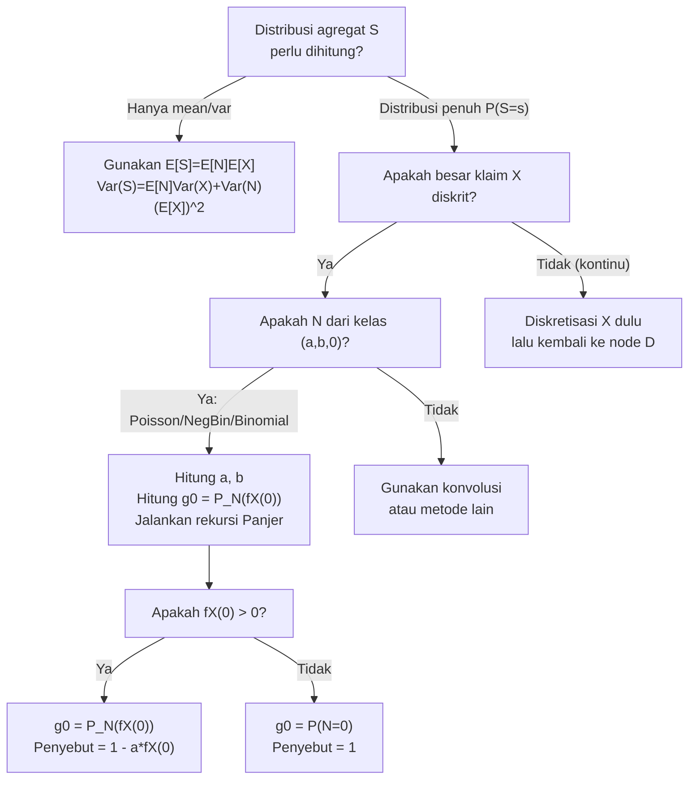

# 📊 4.5 — Panjer Recursive Formula

> [!ABSTRACT] Ringkasan Cepat
> **Topik:** Panjer Recursive Formula | **Bobot:** ~10–15% | **Difficulty:** Calculation-Intensive
> **Ref:** Klugman et al. (2019) Bab 9; Tse (2009) Bab 3 | **Prereq:** [[4.1 Individual and Collective Risk Models]], [[4.2 Compound Distributions]], [[2.2 (a,b,0) and (a,b,1) Distribution Classes]]

## Section 0 — Pemetaan Topik

| Topik TA2 | Sub-topik ID | Skill Diuji | Bobot | Difficulty | Prerequisite | Connected Topics | Referensi |
|---|---|---|---|---|---|---|---|
| Model Agregat | 4.5 | Menggunakan formula rekursif Panjer untuk menghitung distribusi agregat dengan besar klaim diskrit | 10–15% | Calculation-Intensive | [[4.1 Individual and Collective Risk Models]], [[4.2 Compound Distributions]], [[2.2 (a,b,0) and (a,b,1) Distribution Classes]] | [[4.3 Mean Variance and Stop-Loss]], [[4.4 Aggregate Distribution Approximation]], [[4.6 Coverage Modifications on Aggregate Models]] | Klugman et al. (2019) Bab 9; Tse (2009) Bab 3 |

## Section 1 — Intuisi

Bayangkan seorang aktuaris di perusahaan asuransi kendaraan bermotor ingin mengetahui peluang bahwa total klaim seluruh portofolio bulan ini melebihi cadangan yang tersedia. Secara teori, distribusi total klaim adalah konvolusi antara distribusi frekuensi dan distribusi besar klaim — tetapi menghitung konvolusi secara langsung untuk ratusan atau ribuan nilai klaim yang berbeda adalah pekerjaan yang mustahil dilakukan dengan tangan, bahkan dengan spreadsheet biasa.

Di sinilah **Formula Rekursif Panjer** tampil sebagai senjata paling elegan dalam arsenal aktuaris komputasional. Daripada menghitung semua konvolusi sekaligus, formula ini membangun distribusi total klaim *satu langkah demi satu langkah* — mulai dari probabilitas total klaim nol, lalu satu, lalu dua, dan seterusnya. Setiap nilai baru dihitung dari nilai-nilai sebelumnya yang sudah diketahui. Tidak perlu menyimpan seluruh distribusi di memori sekaligus; cukup meneruskan hasil perhitungan sebelumnya ke langkah berikutnya.

Kunci keajaiban ini terletak pada sifat khusus distribusi frekuensi yang dikenal sebagai kelas $(a,b,0)$ — yaitu Poisson, Negatif Binomial, dan Binomial. Distribusi-distribusi ini memiliki hubungan rekursif antara probabilitas $p_k$ dan $p_{k-1}$ yang sangat sederhana: $p_k = \left(a + \frac{b}{k}\right) p_{k-1}$. Sifat sederhana inilah yang memungkinkan seluruh distribusi agregat dibangun secara rekursif dengan efisiensi tinggi — dan inilah yang diuji dalam ujian TA2.

## Section 2 — Definisi Formal

> [!NOTE] Definisi Matematis
> Misalkan $S = X_1 + X_2 + \cdots + X_N$ adalah total klaim agregat (*collective risk model*), dengan $N$ adalah frekuensi klaim dari kelas $(a,b,0)$ dan $X_i$ adalah besar klaim diskrit iid yang independen dari $N$. Maka distribusi $S$ dapat dihitung secara rekursif oleh Formula Panjer:
>
> $$
> g_s = f_S(s) = \frac{1}{1 - a \cdot f_X(0)} \sum_{y=1}^{s} \left(a + \frac{b \cdot y}{s}\right) f_X(y) \cdot g_{s-y}, \quad s = 1, 2, 3, \ldots
> $$
>
> dengan kondisi awal:
>
> $$
> g_0 = f_S(0) = P_N\!\left(f_X(0)\right)
> $$

| Simbol | Makna | Catatan |
|---|---|---|
| $S$ | Total klaim agregat | $S = X_1 + \cdots + X_N$ |
| $N$ | Frekuensi klaim | Harus dari kelas $(a,b,0)$: Poisson, NegBin, atau Binomial |
| $X_i$ | Besar klaim individual | Diskrit, support $\{0, 1, 2, \ldots\}$ atau $\{1, 2, \ldots\}$ |
| $f_X(y)$ | PMF besar klaim: $P(X = y)$ | Harus diskrit; jika kontinu perlu didiskretisasi dulu |
| $g_s$ | PMF agregat: $P(S = s)$ | Yang ingin dihitung secara rekursif |
| $a, b$ | Parameter kelas $(a,b,0)$ dari distribusi $N$ | Lihat tabel di bawah |
| $P_N(z)$ | PGF dari $N$ | Digunakan untuk menghitung $g_0$ |
| $p_k$ | $P(N = k)$ | PMF distribusi frekuensi |

### Parameter $(a, b)$ untuk Distribusi Frekuensi Umum

| Distribusi $N$ | Parameter | $a$ | $b$ |
|---|---|---|---|
| Poisson$(\lambda)$ | $\lambda > 0$ | $0$ | $\lambda$ |
| Negatif Binomial$(r, \beta)$ | $r > 0,\ \beta > 0$ | $\frac{\beta}{1+\beta}$ | $\frac{(r-1)\beta}{1+\beta}$ |
| Binomial$(m, q)$ | $m \in \mathbb{Z}^+,\ 0 < q < 1$ | $-\frac{q}{1-q}$ | $\frac{(m+1)q}{1-q}$ |

### Rumus Utama

**Formula Rekursif Panjer (bentuk operasional):**

$$
g_s = \frac{1}{1 - a \cdot f_X(0)} \sum_{y=1}^{s} \left(a + \frac{by}{s}\right) f_X(y) \cdot g_{s-y}, \qquad s = 1, 2, 3, \ldots
$$

**Label:** Formula ini menghitung $g_s$ dari $g_0, g_1, \ldots, g_{s-1}$ yang sudah dihitung sebelumnya.

**Kondisi Awal — Kasus Umum ($f_X(0)$ boleh positif):**

$$
g_0 = P_N(f_X(0))
$$

**Label:** $P_N$ adalah PGF dari distribusi frekuensi $N$, dievaluasi di $z = f_X(0)$.

**Kondisi Awal — Kasus Khusus ($f_X(0) = 0$, yaitu klaim selalu $\geq 1$):**

$$
g_0 = P_N(0) = P(N = 0) = p_0
$$

**Label:** Jika besar klaim tidak bisa nol, satu-satunya cara $S = 0$ adalah jika tidak ada klaim sama sekali.

**Kondisi Awal Eksplisit per Distribusi (saat $f_X(0) = 0$):**

$$
g_0^{\text{Poisson}} = e^{-\lambda}, \qquad g_0^{\text{NegBin}} = \left(\frac{1}{1+\beta}\right)^r, \qquad g_0^{\text{Binomial}} = (1-q)^m
$$

**Label:** Nilai awal rekursi, yaitu probabilitas nol klaim terjadi.

**Penyederhanaan untuk Poisson ($a = 0$):**

$$
g_s = \frac{\lambda}{s} \sum_{y=1}^{s} y \cdot f_X(y) \cdot g_{s-y}, \qquad s = 1, 2, 3, \ldots
$$

**Label:** Untuk Poisson, faktor $a = 0$ sehingga penyebut $1 - a \cdot f_X(0) = 1$ dan rumus menjadi lebih sederhana.

### Asumsi Eksplisit

1. Distribusi frekuensi $N$ **harus** berasal dari kelas $(a,b,0)$ — yaitu Poisson, Negatif Binomial, atau Binomial. Distribusi lain tidak memiliki parameter $(a,b)$ yang memungkinkan rekursi ini.
2. Besar klaim $X_i$ harus **diskrit** dengan support di $\{0, 1, 2, \ldots\}$. Jika distribusi besar klaim kontinu, perlu dilakukan **diskretisasi** terlebih dahulu (di luar scope formula Panjer itu sendiri).
3. Variabel $X_1, X_2, \ldots$ adalah **iid** (identically and independently distributed) dan **independen** dari $N$.
4. Model yang digunakan adalah **collective risk model** (model risiko kolektif/compound), bukan individual risk model.
5. Rekursi dimulai dari $g_0$ dan dilakukan ke atas satu langkah setiap kali; setiap $g_s$ bergantung pada semua $g_0, \ldots, g_{s-1}$.

## Section 3 — Jembatan Logika

> [!TIP] Dari Definisi ke Rumus
> Ide inti Formula Panjer adalah mengeksploitasi hubungan rekursif kelas $(a,b,0)$: $p_k = \left(a + \frac{b}{k}\right)p_{k-1}$. Ketika kita menuliskan $f_S(s) = P(S=s)$ sebagai jumlah total atas semua kemungkinan jumlah klaim $k$, dan kemudian menggunakan hubungan $p_k = \left(a+\frac{b}{k}\right)p_{k-1}$ untuk mengganti $p_k$ dengan $p_{k-1}$, indeks dalam penjumlahan bergeser — dan setelah manipulasi aljabar, distribusi $S$ pada titik $s$ hanya bergantung pada nilai-nilai distribusi $S$ di titik yang lebih kecil dari $s$. Inilah mengapa rekursi bisa berjalan maju satu langkah demi satu langkah.

> [!IMPORTANT] Support dan Domain
> - $s$ adalah total klaim agregat, dengan support $\{0, 1, 2, \ldots\}$ (asumsi besar klaim diskrit).
> - Faktor penyebut $1 - a \cdot f_X(0)$ tidak pernah nol selama $|a| \cdot f_X(0) < 1$, yang selalu terpenuhi untuk distribusi yang valid karena $|a| < 1$ untuk Poisson ($a=0$), NegBin ($0 < a < 1$), dan Binomial ($a < 0$).
> - Rekursi hanya bisa dimulai setelah $g_0$ diketahui — jangan lewati langkah ini.

**Derivasi Formula Rekursif Panjer (Kasus $f_X(0) = 0$)**

**Langkah 1 — Tulis $g_s$ sebagai mixture atas nilai $N$:**

$$
g_s = P(S = s) = \sum_{k=0}^{\infty} P(S = s \mid N = k) \cdot p_k = \sum_{k=1}^{s} f_X^{*k}(s) \cdot p_k
$$

Di mana $f_X^{*k}$ adalah konvolusi $k$-lipat dari $f_X$. (Untuk $k=0$, $P(S=s \mid N=0) = \mathbf{1}_{s=0} = 0$ karena $s \geq 1$.)

**Langkah 2 — Terapkan hubungan rekursif kelas $(a,b,0)$:**

$$
p_k = \left(a + \frac{b}{k}\right) p_{k-1}, \qquad k = 1, 2, 3, \ldots
$$

Substitusi ke dalam $g_s$:

$$
g_s = \sum_{k=1}^{s} f_X^{*k}(s) \cdot \left(a + \frac{b}{k}\right) p_{k-1}
$$

**Langkah 3 — Gunakan sifat konvolusi diskrit:**

Untuk distribusi dengan $f_X(0) = 0$, berlaku:

$$
f_X^{*k}(s) = \sum_{y=1}^{s} f_X(y) \cdot f_X^{*(k-1)}(s-y)
$$

Substitusi:

$$
g_s = \sum_{k=1}^{s} \sum_{y=1}^{s} f_X(y) \cdot f_X^{*(k-1)}(s-y) \cdot \left(a + \frac{b}{k}\right) p_{k-1}
$$

**Langkah 4 — Tukar urutan penjumlahan (Fubini):**

$$
g_s = \sum_{y=1}^{s} f_X(y) \sum_{k=1}^{s} \left(a + \frac{b}{k}\right) p_{k-1} \cdot f_X^{*(k-1)}(s-y)
$$

**Langkah 5 — Ganti indeks $j = k-1$:**

$$
g_s = \sum_{y=1}^{s} f_X(y) \sum_{j=0}^{s-1} \left(a + \frac{b}{j+1}\right) p_j \cdot f_X^{*j}(s-y)
$$

**Langkah 6 — Pisahkan suku $a$ dan suku $\frac{b}{j+1}$:**

Setelah manipulasi aljabar (menggunakan fakta bahwa $\sum_j p_j f_X^{*j}(s-y) = g_{s-y}$ dan relasi serupa untuk suku $b$), diperoleh:

$$
g_s = a \sum_{y=1}^{s} f_X(y) \cdot g_{s-y} + b \sum_{y=1}^{s} \frac{y}{s} f_X(y) \cdot g_{s-y}
$$

$$
g_s = \sum_{y=1}^{s} \left(a + \frac{by}{s}\right) f_X(y) \cdot g_{s-y}
$$

Ini adalah **Formula Panjer** untuk kasus $f_X(0) = 0$.

> [!DANGER] Dilarang
> 1. **Jangan** menggunakan Formula Panjer jika distribusi frekuensi $N$ bukan dari kelas $(a,b,0)$ — misalnya distribusi Geometric modifikasi, Logaritmik, atau distribusi bebas lainnya tidak memiliki parameter $(a,b)$ yang valid untuk rekursi ini (kecuali ada ekstensi kelas $(a,b,1)$ yang berbeda).
> 2. **Jangan** mulai rekursi dari $g_1$ tanpa menghitung $g_0$ terlebih dahulu — $g_0$ bukan nol secara otomatis; nilainya bergantung pada $P(N=0)$ dan $f_X(0)$.
> 3. **Jangan** menggunakan Formula Panjer langsung pada distribusi besar klaim **kontinu** — diskretisasi wajib dilakukan lebih dahulu jika diperlukan; tanpa ini, penjumlahan $\sum_{y=1}^s$ tidak terdefinisi.

## Section 4 — Contoh Soal

### Soal A — Fundamental

Jumlah klaim $N \sim \text{Poisson}(\lambda = 2)$. Besar klaim $X$ diskrit dengan distribusi:

$$
P(X = 1) = 0.6, \quad P(X = 2) = 0.4, \quad P(X = 0) = 0
$$

Hitung $P(S = 0)$, $P(S = 1)$, dan $P(S = 2)$ menggunakan Formula Panjer.

> [!SUCCESS] Solusi Soal A
> **Pendekatan:** Identifikasi parameter $(a,b)$ Poisson, hitung $g_0$ dari kondisi awal, lalu jalankan rekursi untuk $s=1$ dan $s=2$.
>
> **1. Identifikasi Variabel**
> - $N \sim \text{Poisson}(\lambda = 2)$ → $a = 0$, $b = 2$
> - $f_X(1) = 0.6$, $f_X(2) = 0.4$, $f_X(0) = 0$
> - Karena $f_X(0) = 0$: penyebut $1 - a \cdot f_X(0) = 1 - 0 = 1$
>
> **2. Identifikasi Distribusi / Model**
> Model risiko kolektif: $S = X_1 + \cdots + X_N$ dengan $N$ Poisson. Gunakan Formula Panjer dengan penyederhanaan Poisson ($a=0$).
>
> **3. Setup Persamaan**
>
> $$
> g_s = \frac{\lambda}{s} \sum_{y=1}^{s} y \cdot f_X(y) \cdot g_{s-y}
> $$
>
> **4. Eksekusi Aljabar**
>
> **$g_0$:** Karena $f_X(0) = 0$, maka $g_0 = P(N=0) = e^{-2} \approx 0.13534$
>
> **$g_1$** ($s=1$, hanya $y=1$ yang valid):
>
> $$
> g_1 = \frac{2}{1} \cdot \left[1 \cdot f_X(1) \cdot g_0\right] = 2 \cdot (1)(0.6)(0.13534) = 2 \times 0.08120 = 0.16241
> $$
>
> **$g_2$** ($s=2$, $y \in \{1,2\}$):
>
> $$
> g_2 = \frac{2}{2} \left[1 \cdot f_X(1) \cdot g_1 + 2 \cdot f_X(2) \cdot g_0\right]
> $$
>
> $$
> g_2 = 1 \cdot \left[(1)(0.6)(0.16241) + (2)(0.4)(0.13534)\right]
> $$
>
> $$
> g_2 = 0.09745 + 0.10827 = 0.20572
> $$
>
> **5. Verification**
> Cek: $g_0 + g_1 + g_2 = 0.13534 + 0.16241 + 0.20572 = 0.50347 < 1$ ✓ (masih ada probabilitas untuk $S \geq 3$). Nilai $g_0 = e^{-2} \approx 0.135$ masuk akal — ada ~13.5% kemungkinan tidak ada klaim sama sekali.
>
> **Hasil:** $g_0 \approx 0.13534$; $g_1 \approx 0.16241$; $g_2 \approx 0.20572$.

> [!WARNING] Exam Tips — Soal A
> **Target waktu:** 3 menit. **Common trap:** Lupa bahwa $g_s$ Poisson punya faktor $\frac{\lambda}{s}$ di depan, bukan $\frac{b}{s}$ saja (keduanya sama karena $b = \lambda$, tapi jangan bingung notasi). **Shortcut:** Untuk Poisson, langsung gunakan rumus sederhana $g_s = \frac{\lambda}{s}\sum_{y=1}^s y \cdot f_X(y) \cdot g_{s-y}$ tanpa faktor penyebut.

---

### Soal B — Exam-Typical

Jumlah klaim $N \sim \text{NegBin}(r=2,\ \beta=1)$. Besar klaim $X$ diskrit dengan:

$$
P(X = 1) = 0.7,\quad P(X = 2) = 0.2,\quad P(X = 3) = 0.1,\quad P(X=0)=0
$$

Hitung $P(S = 0)$, $P(S = 1)$, $P(S = 2)$, dan $P(S = 3)$.

> [!SUCCESS] Solusi Soal B
> **Pendekatan:** Hitung parameter $(a,b)$ NegBin, tentukan $g_0$, lalu iterasi rekursi hingga $s=3$.
>
> **1. Identifikasi Variabel**
> - $N \sim \text{NegBin}(r=2,\ \beta=1)$
> - $a = \frac{\beta}{1+\beta} = \frac{1}{2} = 0.5$
> - $b = \frac{(r-1)\beta}{1+\beta} = \frac{(1)(1)}{2} = 0.5$
> - $f_X(1)=0.7,\ f_X(2)=0.2,\ f_X(3)=0.1,\ f_X(0)=0$
> - Penyebut: $1 - a \cdot f_X(0) = 1 - 0.5 \times 0 = 1$
>
> **2. Identifikasi Distribusi / Model**
> Collective risk model dengan NegBin$(2,1)$. Karena $f_X(0)=0$, formula Panjer berlaku langsung.
>
> **3. Setup Persamaan**
>
> $$
> g_s = \sum_{y=1}^{s} \left(0.5 + \frac{0.5\,y}{s}\right) f_X(y) \cdot g_{s-y}
> $$
>
> **4. Eksekusi Aljabar**
>
> **$g_0$:** $g_0 = P_N(f_X(0)) = P_N(0) = P(N=0) = \left(\frac{1}{1+\beta}\right)^r = \left(\frac{1}{2}\right)^2 = 0.25$
>
> **$g_1$** ($s=1$, hanya $y=1$):
>
> $$
> g_1 = \left(0.5 + \frac{0.5 \times 1}{1}\right) f_X(1) \cdot g_0 = (0.5 + 0.5)(0.7)(0.25) = 1.0 \times 0.175 = 0.175
> $$
>
> **$g_2$** ($s=2$, $y \in \{1,2\}$):
>
> $$
> g_2 = \left(0.5 + \frac{0.5}{2}\right)(0.7)(0.175) + \left(0.5 + \frac{1.0}{2}\right)(0.2)(0.25)
> $$
>
> $$
> g_2 = (0.75)(0.1225) + (1.0)(0.05) = 0.091875 + 0.05 = 0.141875
> $$
>
> **$g_3$** ($s=3$, $y \in \{1,2,3\}$):
>
> $$
> g_3 = \left(0.5 + \frac{0.5}{3}\right)(0.7)(0.141875) + \left(0.5 + \frac{1.0}{3}\right)(0.2)(0.175) + \left(0.5 + \frac{1.5}{3}\right)(0.1)(0.25)
> $$
>
> $$
> g_3 = \left(\frac{2}{3}\right)(0.09931) + \left(\frac{5}{6}\right)(0.035) + (1.0)(0.025)
> $$
>
> $$
> g_3 = 0.06621 + 0.02917 + 0.025 = 0.12038
> $$
>
> **5. Verification**
> $\sum_{s=0}^{3} g_s = 0.25 + 0.175 + 0.14188 + 0.12038 = 0.68726 < 1$ ✓. Verifikasi mean: $E[S] = E[N] \cdot E[X] = r\beta \cdot E[X] = 2 \times 1 \times (0.7+0.4+0.3) = 2 \times 1.4 = 2.8$. Wajar bahwa distribusi masih tersebar di $s \geq 4$.
>
> **Hasil:** $g_0=0.25$; $g_1=0.175$; $g_2\approx0.14188$; $g_3\approx0.12038$.

> [!WARNING] Exam Tips — Soal B
> **Target waktu:** 4–5 menit. **Common trap:** Salah menghitung parameter $a$ dan $b$ NegBin — pastikan $a = \frac{\beta}{1+\beta}$ dan $b = \frac{(r-1)\beta}{1+\beta}$, bukan $a=\beta$. **Shortcut:** Buat tabel 3 kolom ($s$, kontribusi per $y$, akumulasi) agar tidak kehilangan suku dalam penjumlahan.

---

### Soal C — Challenging

Jumlah klaim $N \sim \text{NegBin}(r=1,\ \beta=2)$ (yaitu distribusi Geometrik dengan $\beta=2$). Besar klaim $X$ diskrit dengan distribusi yang mencakup kemungkinan klaim nol:

$$
P(X=0) = 0.3,\quad P(X=1) = 0.5,\quad P(X=2) = 0.2
$$

**(a)** Hitung $g_0 = P(S=0)$.

**(b)** Hitung $g_1 = P(S=1)$ dan $g_2 = P(S=2)$.

**(c)** Verifikasi dengan menghitung $P(S=0)$ secara independen menggunakan definisi langsung (mixture atas nilai $N$).

> [!SUCCESS] Solusi Soal C
> **Pendekatan:** Kasus $f_X(0) \neq 0$ — kondisi awal dan penyebut formula Panjer harus dihitung dengan cermat menggunakan PGF.
>
> **1. Identifikasi Variabel**
> - $N \sim \text{Geometrik}(\beta=2)$, yaitu NegBin$(r=1, \beta=2)$
> - $a = \frac{2}{3}$, $b = \frac{(1-1)(2)}{3} = 0$
> - $f_X(0)=0.3$, $f_X(1)=0.5$, $f_X(2)=0.2$
> - Penyebut: $1 - a \cdot f_X(0) = 1 - \frac{2}{3}(0.3) = 1 - 0.2 = 0.8$
>
> **2. Identifikasi Distribusi / Model**
> Collective risk model dengan Geometrik dan klaim yang bisa bernilai nol. PGF Geometrik (NegBin $r=1$):
>
> $$
> P_N(z) = \frac{1}{1+\beta(1-z)} = \frac{1}{1+2(1-z)} = \frac{1}{3-2z}
> $$
>
> **3. Setup Persamaan**
>
> **Kondisi awal umum:**
>
> $$
> g_0 = P_N(f_X(0)) = P_N(0.3)
> $$
>
> **Formula Panjer dengan $f_X(0) \neq 0$:**
>
> $$
> g_s = \frac{1}{0.8} \sum_{y=1}^{s} \left(\frac{2}{3} + \frac{0 \cdot y}{s}\right) f_X(y) \cdot g_{s-y} = \frac{1}{0.8} \cdot \frac{2}{3} \sum_{y=1}^{s} f_X(y) \cdot g_{s-y}
> $$
>
> **4. Eksekusi Aljabar**
>
> **(a) Hitung $g_0$:**
>
> $$
> g_0 = P_N(0.3) = \frac{1}{3 - 2(0.3)} = \frac{1}{3 - 0.6} = \frac{1}{2.4} \approx 0.41667
> $$
>
> **(b) Hitung $g_1$** ($s=1$, hanya $y=1$):
>
> $$
> g_1 = \frac{1}{0.8} \cdot \frac{2}{3} \cdot f_X(1) \cdot g_0 = \frac{1}{0.8} \cdot \frac{2}{3} \cdot 0.5 \cdot 0.41667
> $$
>
> $$
> g_1 = 1.25 \times 0.33333 \times 0.5 \times 0.41667 = 1.25 \times 0.06944 = 0.08681
> $$
>
> **Hitung $g_2$** ($s=2$, $y \in \{1,2\}$):
>
> $$
> g_2 = \frac{1}{0.8} \cdot \frac{2}{3} \left[f_X(1) \cdot g_1 + f_X(2) \cdot g_0\right]
> $$
>
> $$
> g_2 = 1.25 \times 0.66667 \times \left[(0.5)(0.08681) + (0.2)(0.41667)\right]
> $$
>
> $$
> g_2 = 0.83333 \times [0.04340 + 0.08333] = 0.83333 \times 0.12674 = 0.10561
> $$
>
> **(c) Verifikasi $g_0$ secara langsung:**
>
> $$
> P(S=0) = \sum_{k=0}^{\infty} P(N=k) \cdot [P(X=0)]^k
> $$
>
> Untuk Geometrik: $P(N=k) = \frac{1}{1+\beta}\left(\frac{\beta}{1+\beta}\right)^k = \frac{1}{3}\left(\frac{2}{3}\right)^k$
>
> $$
> g_0 = \sum_{k=0}^{\infty} \frac{1}{3}\left(\frac{2}{3}\right)^k (0.3)^k = \frac{1}{3} \sum_{k=0}^{\infty} \left(\frac{2}{3} \times 0.3\right)^k = \frac{1}{3} \cdot \frac{1}{1 - 0.2} = \frac{1}{3} \times \frac{1}{0.8} = \frac{1}{2.4} \approx 0.41667 \checkmark
> $$
>
> **5. Verification**
> Verifikasi independen mengkonfirmasi $g_0 \approx 0.41667$. Probabilitas tinggi untuk $S=0$ masuk akal: ada $P(N=0) = \frac{1}{3} \approx 33\%$ kemungkinan nol klaim, ditambah peluang semua klaim bernilai nol (karena $P(X=0)=0.3$).
>
> **Hasil:** $g_0 \approx 0.41667$; $g_1 \approx 0.08681$; $g_2 \approx 0.10561$.

> [!WARNING] Exam Tips — Soal C
> **Target waktu:** 6 menit. **Common trap:** Menggunakan $g_0 = P(N=0)$ padahal $f_X(0) \neq 0$ — ini hanya valid jika $f_X(0)=0$. Jika ada kemungkinan klaim bernilai nol, **wajib** gunakan $g_0 = P_N(f_X(0))$. **Shortcut:** Untuk NegBin $r=1$ (Geometrik), PGF-nya sangat mudah: $P_N(z) = \frac{1}{1+\beta(1-z)}$.

## Section 5 — Verifikasi & Sanity Check

> [!CHECK] Cek Mean Agregat vs Formula Langsung
> Setelah menghitung beberapa nilai $g_s$, verifikasi konsistensi dengan mean:
>
> $$
> E[S] = E[N] \cdot E[X]
> $$
>
> Hitung $\sum_{s=0}^{s_{\max}} s \cdot g_s$ dan pastikan nilainya mendekati $E[N] \cdot E[X]$ (tidak perlu sama persis karena distribusi dipotong di $s_{\max}$, tapi harus mendekati untuk $s_{\max}$ yang cukup besar).

> [!CHECK] Cek Jumlah Probabilitas
> Setiap $g_s \geq 0$ untuk semua $s$, dan $\sum_{s=0}^{\infty} g_s = 1$. Dalam praktik ujian, setelah menghitung beberapa nilai:
>
> $$
> \sum_{s=0}^{s_{\max}} g_s \leq 1
> $$
>
> Jika jumlah sudah melebihi 1, ada kesalahan aritmatika dalam rekursi. Juga periksa: $g_0 = P_N(f_X(0)) \in (0,1]$ — jika hasilnya negatif atau $> 1$, ada kesalahan.

### Metode Alternatif

Untuk distribusi dengan support yang kecil (misalnya $X \in \{1, 2\}$ dan $N$ kecil), distribusi agregat dapat dihitung langsung melalui **enumerasi lengkap**:

$$
P(S=s) = \sum_{k=0}^{s} P(N=k) \cdot P(X_1 + \cdots + X_k = s)
$$

Ini berguna sebagai verifikasi independen untuk soal-soal sederhana, tetapi tidak praktis untuk distribusi dengan support besar. Formula Panjer lebih efisien secara komputasional.

## Section 6 — Visualisasi Mental

**Visualisasi Rekursi sebagai Segitiga:**

Bayangkan sebuah tabel rekursi di mana baris adalah nilai $s$ dan kolom adalah kontribusi dari setiap $y$:

```
s=0 : g_0 = P_N(f_X(0))                        [kondisi awal]
s=1 : g_1 ← (a + b/1)·f_X(1)·g_0              [1 suku]
s=2 : g_2 ← (a + b/2)·f_X(1)·g_1
             + (a + b)·f_X(2)·g_0              [2 suku]
s=3 : g_3 ← (a + b/3)·f_X(1)·g_2
             + (a + 2b/3)·f_X(2)·g_1
             + (a + b)·f_X(3)·g_0              [3 suku]
```

Setiap baris $s$ menjumlahkan "kontribusi dari setiap besar klaim $y$" dikalikan dengan "distribusi agregat yang sudah diketahui di posisi $s-y$". Semakin ke bawah, semakin banyak suku yang dijumlahkan — tapi semua bergantung pada nilai-nilai di atas.

**Distribusi Agregat $S$ — Bentuk Tipikal:**

- Puncak (mode) distribusi $S$ berada sekitar $E[S] = E[N] \cdot E[X]$.
- Untuk Poisson frekuensi: distribusi $S$ cenderung mendekati Poisson atau Normal untuk $\lambda$ besar.
- Untuk NegBin frekuensi: distribusi $S$ overdispersed (ekor lebih berat dari Poisson ekuivalen), puncak lebih pendek, ekor kanan lebih panjang.

### Hubungan Visual ↔ Rumus

| Elemen Visual | Komponen Rumus |
|---|---|
| Titik awal rekursi (nilai $g_0$) | $g_0 = P_N(f_X(0))$ — PGF dievaluasi di massa probabilitas nol klaim |
| Lebar "corong" kontribusi per baris | Jumlah suku dalam $\sum_{y=1}^{s}$ — bertambah satu setiap langkah |
| Bobot setiap kontribusi | Faktor $\left(a + \frac{by}{s}\right)$ — berbeda per distribusi frekuensi |
| Posisi puncak distribusi | $E[S] = E[N] \cdot E[X]$ |

## Section 7 — Jebakan Umum

> [!BUG] Kesalahan Parametrisasi
> **Parameter $(a,b)$ NegBin sering tertukar.** Ingat: $a = \frac{\beta}{1+\beta}$ dan $b = \frac{(r-1)\beta}{1+\beta}$. Untuk Geometrik ($r=1$): $b = 0$, bukan $b = \beta$. Jangan menggunakan $a = r$ atau $b = \lambda$ secara sembarangan.

> [!BUG] Kesalahan Konseptual
> 1. **"$g_0 = P(N=0)$ selalu"** — Hanya benar jika $f_X(0) = 0$. Jika besar klaim bisa nol ($f_X(0) > 0$), maka $g_0 = P_N(f_X(0)) > P(N=0)$ karena ada kontribusi dari skenario "ada klaim tapi semua bernilai nol".
> 2. **"Formula Panjer berlaku untuk semua distribusi frekuensi"** — Salah. Hanya untuk kelas $(a,b,0)$: Poisson, NegBin, Binomial. Distribusi seperti Logaritmik atau Zero-Inflated memerlukan ekstensi berbeda.
> 3. **"Suku dengan $y > s$ bisa diabaikan"** — Memang diabaikan (karena $f_X(y) \cdot g_{s-y}$ dengan $s-y < 0$ tidak terdefinisi), tetapi ini bukan karena mereka nol — melainkan karena indeks penjumlahan memang dibatasi $y = 1$ sampai $y = s$.
> 4. **"Untuk Binomial, formula sama dengan Poisson karena $a=0$ untuk Poisson"** — Salah; Binomial memiliki $a < 0$ (negatif), bukan $a=0$. Tanda $a$ mempengaruhi arah rekursi dan besarnya kontribusi per suku.

> [!BUG] Kesalahan Interpretasi Soal
> - Soal menyebut **"besar klaim diskrit"** tapi memberikan distribusi kontinu (misalnya Exponential) — **wajib diskretisasi dulu**, tapi dalam ujian TA2 biasanya sudah diberikan PMF diskrit secara eksplisit.
> - Soal memberikan **"rata-rata klaim per periode"** bisa bermakna $E[S]$ (sudah termasuk frekuensi), bukan $E[X]$. Pastikan mana yang menjadi input formula.
> - Soal meminta $P(S \leq k)$ — ingat untuk menjumlahkan $g_0 + g_1 + \cdots + g_k$, bukan hanya $g_k$.

> [!CAUTION] Red Flags
> - Kata **"rekursif"**, **"Panjer"**, **"iterasi distribusi agregat"** → langsung terapkan formula ini.
> - Diberikan **PMF diskrit $X$** dan **distribusi frekuensi dari kelas $(a,b,0)$** → Formula Panjer adalah alat yang tepat.
> - Soal menyebutkan $P(X = 0) > 0$ → jangan gunakan $g_0 = P(N=0)$; hitung $g_0 = P_N(f_X(0))$ dan penyebut $1 - a \cdot f_X(0)$.
> - Distribusi frekuensi adalah **Geometrik** → ingat ini adalah NegBin$(r=1, \beta)$ dengan $b=0$; formula Panjer menyederhanakan secara signifikan.

## Section 8 — Ringkasan Eksekutif

> [!SUMMARY] Must-Remember
> 1. **Formula Panjer:** $g_s = \frac{1}{1 - a \cdot f_X(0)} \sum_{y=1}^{s} \left(a + \frac{by}{s}\right) f_X(y) \cdot g_{s-y}$, untuk $s = 1, 2, 3, \ldots$
> 2. **Kondisi awal:** $g_0 = P_N(f_X(0))$; jika $f_X(0)=0$ maka $g_0 = P(N=0)$
> 3. **Parameter Poisson:** $a=0,\ b=\lambda$ → penyederhanaan $g_s = \frac{\lambda}{s}\sum_{y=1}^s y \cdot f_X(y) \cdot g_{s-y}$
> 4. **Parameter NegBin:** $a = \frac{\beta}{1+\beta},\ b = \frac{(r-1)\beta}{1+\beta}$; Geometrik ($r=1$): $a = \frac{\beta}{1+\beta},\ b=0$
> 5. **Parameter Binomial:** $a = -\frac{q}{1-q},\ b = \frac{(m+1)q}{1-q}$; $a$ negatif untuk Binomial

### Kapan Digunakan

- Soal meminta distribusi lengkap (beberapa nilai $P(S=s)$) dari **collective risk model** dengan besar klaim diskrit.
- Distribusi frekuensi adalah **Poisson, NegBin, atau Binomial** (kelas $(a,b,0)$).
- Distribusi besar klaim diberikan sebagai **PMF diskrit** dengan support terbatas atau diketahui.
- Soal meminta $P(S \leq d)$ untuk deductible $d$ diskrit, atau $E[\max(S-d, 0)]$ (stop-loss).

### Kapan TIDAK Boleh Digunakan

- Distribusi frekuensi bukan dari kelas $(a,b,0)$ — misalnya Zero-Inflated Poisson, Logaritmik, atau distribusi bebas lainnya.
- Besar klaim berdistribusi **kontinu** tanpa diskretisasi terlebih dahulu.
- Model yang digunakan adalah **individual risk model** (bukan collective) — gunakan konvolusi langsung.
- Hanya perlu mean dan variansi agregat — gunakan [[4.3 Mean Variance and Stop-Loss]] yang jauh lebih cepat.

### Quick Decision Tree



---

> [!QUOTE] Follow-up Options
> 1. *"Berikan contoh soal Panjer dengan distribusi Binomial sebagai frekuensi"*
> 2. *"Jelaskan hubungan [[4.5 Panjer Recursive Formula]] dengan [[4.4 Aggregate Distribution Approximation]] — kapan Panjer lebih baik dari aproksimasi Normal?"*
> 3. *"Buat flashcard 1-halaman untuk topik ini"*

*📖 Ref: Klugman, Panjer & Willmot (2019) Loss Models 5th ed., Bab 9; Tse (2009) Bab 3 | 🗓️ 2026-04-17 | #TA2 #Panjer #ModelAgregat*
