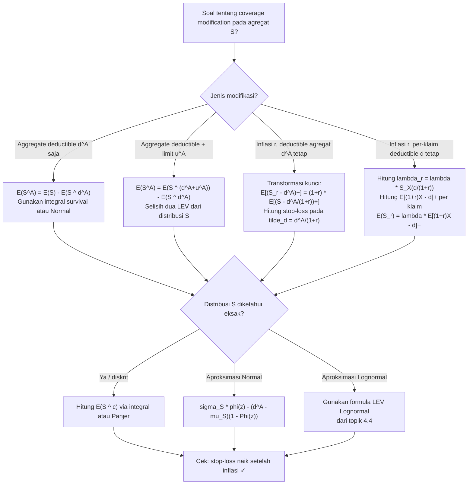

# 📊 4.6 — Coverage Modifications on Aggregate Models

> [!ABSTRACT] Ringkasan Cepat
> **Topik:** Coverage Modifications on Aggregate Models | **Bobot:** ~10–15% | **Difficulty:** Calculation-Intensive
> **Ref:** Klugman et al. (2019), Loss Models 5th ed., Bab 9; Tse (2009) Bab 3 | **Prereq:** [[3.1 Coverage Modifications on Severity and Frequency]], [[4.2 Compound Distributions]], [[4.3 Mean Variance and Stop-Loss]]

## Section 0 — Pemetaan Topik

| Topik TA2 | Sub-topik ID | Skill Diuji | Bobot | Difficulty | Prerequisite | Connected Topics | Referensi |
|---|---|---|---|---|---|---|---|
| Model Agregat | 4.6 | Menentukan dampak deductible agregat, limit agregat, koasuransi, dan inflasi pada distribusi $S$; menghitung $E(S^A)$, $\text{Var}(S^A)$ setelah modifikasi; menganalisis efek inflasi pada momen agregat | 10–15% | Calculation-Intensive | [[3.1 Coverage Modifications on Severity and Frequency]], [[4.2 Compound Distributions]], [[4.3 Mean Variance and Stop-Loss]] | [[4.3 Mean Variance and Stop-Loss]], [[4.4 Aggregate Distribution Approximation]], [[3.2 Loss Elimination Ratio and Inflation]] | Klugman et al. (2019) Bab 9; Tse (2009) Bab 3 |

## Section 1 — Intuisi

Dalam dunia asuransi korporasi Indonesia, sebuah perjanjian reasuransi *stop-loss* yang khas tidak hanya membatasi satu klaim individual, tetapi membatasi **total klaim agregat** selama satu periode polis. Misalkan sebuah perusahaan asuransi umum memiliki perjanjian dengan reasuradur: penanggung menanggung sendiri total klaim hingga 50 miliar rupiah, dan segala sesuatu di atasnya ditanggung oleh reasuradur hingga batas tertentu. Batas 50 miliar ini adalah **aggregate deductible** — sepenuhnya berbeda dari deductible individual per klaim yang dipelajari di topik [[3.1 Coverage Modifications on Severity and Frequency]].

Perbedaan fundamental antara modifikasi per-klaim dan modifikasi agregat adalah **level di mana filter berlaku**. Deductible per-klaim bekerja satu per satu — setiap klaim difilter sebelum masuk ke tumpukan. Deductible agregat bekerja pada **hasil akhir** — seluruh tumpukan klaim dijumlahkan dulu, baru kemudian dipotong. Ini menciptakan interaksi yang jauh lebih kompleks, karena distribusi $S$ yang sudah berbentuk campuran dari frekuensi dan severity kini mendapat lapisan filter lagi di atasnya.

Sumber komplikasi ketiga yang sering diuji adalah **inflasi**. Jika klaim tahun depan mengalami inflasi sebesar $r$% dari tahun ini, setiap klaim individual $X_i$ menjadi $(1+r)X_i$. Efek ini merambat ke seluruh distribusi agregat $S$ secara sistematis: mean terskala dengan $(1+r)$, tetapi variance terskala dengan $(1+r)^2$, dan bila ada deductible tetap (*fixed aggregate deductible*), fraksi distribusi yang di atas deductible berubah dengan cara yang non-trivial. Memahami bagaimana inflasi, deductible agregat, dan limit agregat berinteraksi adalah inti topik ini.

## Section 2 — Definisi Formal

> [!NOTE] Definisi Matematis — Aggregate Payment Variable
> Misalkan $S$ adalah aggregate ground-up loss dengan $E(S) = \mu_S$ dan $\text{Var}(S) = \sigma_S^2$. Dengan **aggregate deductible** $d^A$ dan **aggregate limit** $u^A$ (limit pada pembayaran agregat), variabel pembayaran agregat yang sebenarnya dilakukan oleh reasuradur atau penanggung lapis kedua adalah:
>
> $$S^A = \min\!\left(\max(S - d^A,\, 0),\, u^A\right) = \min(S - d^A,\, u^A)_+$$
>
> dengan konvensi $(x)_+ = \max(x, 0)$.

| Simbol | Makna | Catatan |
|---|---|---|
| $S$ | Aggregate ground-up loss | Total klaim sebelum modifikasi agregat |
| $d^A$ | Aggregate deductible | Ditanggung sendiri oleh cedant/penanggung pertama |
| $u^A$ | Aggregate limit (pada pembayaran) | Maksimum yang dibayar reasuradur; batas atas $= d^A + u^A$ pada $S$ |
| $S^A$ | Aggregate payment variable | Yang benar-benar dibayar oleh lapisan teratas |
| $\alpha$ | Aggregate coinsurance factor | Fraksi dari $(S - d^A)_+$ yang ditanggung reasuradur |
| $r$ | Tingkat inflasi | Inflasi uniform pada setiap klaim individual |
| $S^{(r)}$ | Aggregate loss setelah inflasi $r$ | $S^{(r)} = (1+r)S$ jika tidak ada per-klaim deductible tetap |
| $E(S^A)$ | Mean aggregate payment | Sama dengan stop-loss premium $E[(S-d^A)_+]$ jika tidak ada limit |
| $F_S(\cdot)$ | CDF dari $S$ | Digunakan untuk menghitung peluang dan momen $S^A$ |
| $d^A + u^A$ | Maximum covered aggregate loss | Batas atas loss yang menghasilkan pembayaran penuh $u^A$ |

### Rumus Utama

**Mean aggregate payment variable** (dengan deductible $d^A$, tanpa limit):

$$E(S^A) = E[(S - d^A)_+] = E(S) - E(S \wedge d^A) = \int_{d^A}^{\infty} [1 - F_S(s)]\,ds$$

*Label: Identik dengan stop-loss premium dari [[4.3 Mean Variance and Stop-Loss]]; integral survival function di atas $d^A$.*

**Mean aggregate payment variable** (dengan deductible $d^A$ dan limit $u^A$ pada pembayaran):

$$E(S^A) = E(S \wedge (d^A + u^A)) - E(S \wedge d^A)$$

*Label: Selisih dua limited expected value dari $S$; analogus dengan formula per-klaim di [[3.1 Coverage Modifications on Severity and Frequency]].*

**Variance aggregate payment variable** (deductible $d^A$ saja, tanpa limit):

$$\text{Var}(S^A) = \text{Var}[(S - d^A)_+] = E[(S - d^A)_+^2] - \{E[(S - d^A)_+]\}^2$$

$$E[(S-d^A)_+^2] = E[S^2 \cdot \mathbf{1}_{S>d^A}] - 2d^A \cdot E[S \cdot \mathbf{1}_{S>d^A}] + (d^A)^2 \cdot P(S > d^A)$$

*Label: Membutuhkan $E(S^2)$ dan momen parsial; umumnya diselesaikan dengan aproksimasi Normal/Lognormal.*

**Dengan koasuransi agregat $\alpha$:**

$$E(\alpha \cdot S^A) = \alpha \cdot E(S^A), \qquad \text{Var}(\alpha \cdot S^A) = \alpha^2 \cdot \text{Var}(S^A)$$

*Label: Koasuransi mengskala pembayaran secara linear — mean dan standar deviasi dikalikan $\alpha$, variance dikalikan $\alpha^2$.*

**Efek inflasi uniform $r$ pada aggregate loss (tanpa per-klaim deductible tetap):**

$$S^{(r)} = (1+r)\,S$$

$$E(S^{(r)}) = (1+r)\,E(S), \qquad \text{Var}(S^{(r)}) = (1+r)^2\,\text{Var}(S)$$

*Label: Jika setiap $X_i \to (1+r)X_i$ dan tidak ada per-klaim threshold tetap, $S$ terskala sepenuhnya oleh $(1+r)$.*

**Efek inflasi pada compound Poisson dengan per-klaim deductible tetap $d$:**

Setelah inflasi, threshold tetap $d$ menjadi efektif lebih rendah relatif terhadap klaim: $P(X^{(r)} > d) = P(X > d/(1+r)) = 1 - F_X(d/(1+r))$.

$$\lambda^{(r)} = \lambda \cdot [1 - F_X(d/(1+r))]$$

*Label: Inflasi meningkatkan frekuensi klaim yang dilaporkan karena lebih banyak klaim yang melewati deductible tetap.*

**Mean aggregate setelah inflasi dan per-klaim deductible $d$ (per-loss perspektif):**

$$E(S^{(r)}) = \lambda \cdot E\!\left[(1+r)X - d\right]_+\Big]$$

*Label: Setiap klaim ground-up diinflasikan menjadi $(1+r)X$, lalu dipotong deductible tetap $d$.*

**Efek inflasi pada stop-loss premium** (aggregate deductible $d^A$ tetap):

$$E[(S^{(r)} - d^A)_+] = \int_{d^A}^{\infty} [1 - F_{S^{(r)}}(s)]\,ds = \int_{d^A}^{\infty} \left[1 - F_S\!\left(\frac{s}{1+r}\right)\right]ds$$

*Label: CDF dari $S^{(r)}$ adalah $F_{S^{(r)}}(s) = F_S(s/(1+r))$; stop-loss premium selalu meningkat saat inflasi dengan aggregate deductible tetap.*

### Asumsi Eksplisit

1. **Aggregate deductible $d^A$** berlaku atas total loss $S$ — bukan atas klaim individual.
2. **Inflasi uniform**: setiap klaim $X_i$ naik sebesar faktor $(1+r)$ yang sama — tidak ada inflasi selektif.
3. Jika terdapat per-klaim deductible $d$ **tetap** (tidak diindekskan terhadap inflasi), efek inflasi pada frekuensi dan severity harus dihitung terpisah sebelum dikombinasikan.
4. $E(S \wedge c) = \int_0^c [1 - F_S(s)]\,ds$ — limited expected value dari distribusi agregat $S$; untuk aproksimasi Normal dan Lognormal, gunakan rumus dari [[4.4 Aggregate Distribution Approximation]].
5. Variance dari $S^A$ membutuhkan $E(S^2)$ atau aproksimasi — dalam ujian biasanya diminta $E(S^A)$ saja, atau variance dihitung via aproksimasi Normal.

## Section 3 — Jembatan Logika

> [!TIP] Dari Definisi ke Rumus
> Kunci topik ini adalah menyadari bahwa modifikasi agregat bekerja **identik** secara matematis dengan modifikasi per-klaim di [[3.1 Coverage Modifications on Severity and Frequency]], hanya saja objeknya berubah dari variabel acak $X$ (klaim individual) menjadi variabel acak $S$ (total agregat). Rumus $E(Y^L) = E(X) - E(X \wedge d)$ menjadi $E(S^A) = E(S) - E(S \wedge d^A)$. Seluruh intuisi, rumus, dan jebakan yang sama berlaku — bedanya hanya distribusi yang digunakan. Dengan pemahaman ini, topik 4.6 bukan materi baru, melainkan aplikasi mekanis dari framework 3.1 ke level agregat.

> [!IMPORTANT] Support dan Domain
> - $S^A \in [0, u^A]$ — pembayaran agregat dibatasi oleh limit $u^A$.
> - $P(S^A = 0) = P(S \leq d^A) = F_S(d^A)$ — probabilitas tidak ada pembayaran agregat sama dengan probabilitas total klaim di bawah aggregate deductible.
> - $P(S^A = u^A) = P(S \geq d^A + u^A) = 1 - F_S(d^A + u^A)$ — probabilitas pembayaran penuh.
> - Untuk $s \in (0, u^A)$: $f_{S^A}(s) = f_S(s + d^A)$ — distribusi bersyarat yang digeser.
> - $S^{(r)} = (1+r)S$: support identik dengan $S$ dikalikan $(1+r)$; $F_{S^{(r)}}(s) = F_S(s/(1+r))$.

**Derivasi Mean $E(S^A)$ dengan Aggregate Deductible — Step by Step:**

**Step 1 — Tulis $S^A$ secara eksplisit:**

$$S^A = (S - d^A)_+ = \max(S - d^A,\, 0)$$

**Step 2 — Gunakan identitas umum** (analogus dengan derivasi di [[3.1 Coverage Modifications on Severity and Frequency]]):

$$E[(S - d^A)_+] = E(S) - E(S \wedge d^A)$$

di mana $E(S \wedge d^A) = \int_0^{d^A} [1 - F_S(s)]\,ds$ adalah *limited expected value* dari $S$ di $d^A$.

**Step 3 — Alternatif: integral langsung atas survival function:**

$$E(S^A) = \int_0^\infty P(S^A > t)\,dt = \int_0^\infty P(S > d^A + t)\,dt = \int_{d^A}^\infty [1 - F_S(s)]\,ds$$

Perubahan variabel $s = d^A + t$ memberikan batas integrasi dari $d^A$ ke $\infty$.

**Step 4 — Tambahkan limit $u^A$:**

$$E(S^A) = \int_0^{u^A} P(S > d^A + t)\,dt = \int_{d^A}^{d^A + u^A} [1 - F_S(s)]\,ds$$

$$= E(S \wedge (d^A + u^A)) - E(S \wedge d^A)$$

**Derivasi Efek Inflasi pada Aggregate Stop-Loss — Step by Step:**

Ingin menghitung $E[(S^{(r)} - d^A)_+]$ di mana $S^{(r)} = (1+r)S$ dan $d^A$ tetap.

**Step 1 — Substitusi $S^{(r)} = (1+r)S$:**

$$E[(S^{(r)} - d^A)_+] = E[((1+r)S - d^A)_+]$$

**Step 2 — Faktorkan $(1+r)$:**

$$= (1+r) \cdot E\!\left[\left(S - \frac{d^A}{1+r}\right)_+\right]$$

**Step 3 — Kenali bentuk stop-loss premium dengan deductible yang diringankan:**

$$= (1+r) \cdot E\!\left[\left(S - \tilde{d}\right)_+\right], \quad \tilde{d} = \frac{d^A}{1+r} < d^A$$

**Step 4 — Interpretasi:** Inflasi $r$ memiliki efek ganda pada stop-loss premium dengan deductible tetap: (1) mengskala pembayaran dengan $(1+r)$, dan (2) secara efektif **menurunkan** aggregate deductible riil menjadi $\tilde{d} = d^A/(1+r)$ — sehingga lebih banyak klaim agregat yang melewati threshold. Kedua efek menyebabkan stop-loss premium **meningkat lebih dari proporsional** terhadap inflasi.

> [!DANGER] Dilarang
> 1. **Jangan mengaplikasikan aggregate deductible ke klaim individual** — $d^A$ berlaku atas $S$, bukan atas setiap $X_i$. Memotong masing-masing klaim dengan $d^A$ sebelum menjumlahkan adalah kesalahan fatal.
> 2. **Jangan mengasumsikan $E(S^{(r)}) = (1+r) \cdot E(S^A)$ secara langsung jika ada deductible tetap** — inflasi mengubah $\tilde{d}$ efektif, sehingga $E(S^{(r)})$ dengan deductible tetap $d^A$ tidak sekadar $(1+r)$ kali $E(S^A)$ dengan deductible $d^A$ yang sama. Gunakan $E[(S^{(r)} - d^A)_+] = (1+r)\,E[(S - d^A/(1+r))_+]$.
> 3. **Jangan mengkonfusikan aggregate deductible dengan per-klaim deductible** — keduanya berbeda level, berbeda formula, dan berbeda dampak pada frekuensi. Aggregate deductible tidak mengubah distribusi frekuensi $N$.

## Section 4 — Contoh Soal

### Soal A — Fundamental

**Soal:** Aggregate loss $S$ mengikuti aproksimasi Normal dengan $E(S) = 8{,}000$ dan $\sigma_S = 2{,}000$. Perjanjian reasuransi *stop-loss* memiliki aggregate deductible $d^A = 9{,}000$. Hitung stop-loss premium $E(S^A) = E[(S - 9000)_+]$ menggunakan aproksimasi Normal.

> [!SUCCESS] Solusi Soal A
> **Pendekatan:** Gunakan formula stop-loss Normal: $E[(S - d^A)_+] = \sigma_S \phi(z) - (d^A - \mu_S)[1 - \Phi(z)]$ dengan $z = (d^A - \mu_S)/\sigma_S$.
>
> **1. Identifikasi Variabel**
> - $\mu_S = E(S) = 8{,}000$
> - $\sigma_S = 2{,}000$
> - $d^A = 9{,}000$
> - $z = (9000 - 8000)/2000 = 0.50$
>
> **2. Identifikasi Distribusi / Model**
> Aggregate loss $S \approx N(8000, 2000^2)$. Stop-loss premium dengan aggregate deductible — gunakan formula Normal dari [[4.4 Aggregate Distribution Approximation]].
>
> **3. Setup Persamaan**
>
> $$E(S^A) = \sigma_S \phi(z) - (d^A - \mu_S)[1 - \Phi(z)]$$
>
> dengan $z = \frac{d^A - \mu_S}{\sigma_S} = \frac{9000 - 8000}{2000} = 0.50$
>
> **4. Eksekusi Aljabar**
>
> Dari tabel Normal standar:
>
> $$\phi(0.50) = 0.35207, \quad \Phi(0.50) = 0.69146, \quad 1 - \Phi(0.50) = 0.30854$$
>
> $$E(S^A) = 2000 \times 0.35207 - (9000 - 8000) \times 0.30854$$
>
> $$= 704.14 - 1000 \times 0.30854 = 704.14 - 308.54 = 395.60$$
>
> **5. Verification**
> $E(S^A) = 395.60 > 0$ ✓. Cek batas: $E(S^A) \leq E(S) - d^A + d^A \cdot P(S > d^A) = \ldots$ — lebih mudah: $E(S^A)$ harus $< E(S) = 8000$ ✓ dan $< d^A = 9000$ secara logis ✓ (tidak ada yang membayar lebih dari deductible). Alternatif: $E(S^A) \approx (E(S) - d^A) \cdot P(S > d^A) + \text{partial}$; order of magnitude benar ✓.
>
> **Hasil:** Stop-loss premium $E(S^A) \approx 395.60$.

> [!WARNING] Exam Tips — Soal A
> **Target waktu:** 3 menit. **Common trap:** Menggunakan $\phi(z)$ sebagai CDF (mengambil nilai $\Phi$) — $\phi$ adalah PDF, nilainya di $z=0.5$ sekitar $0.35$, bukan $0.69$. **Shortcut:** Hafalkan $\phi(0) = 0.3989$, $\phi(0.5) \approx 0.352$, $\phi(1.0) \approx 0.242$, $\phi(1.5) \approx 0.130$; nilai ini sering digunakan langsung di soal.

---

### Soal B — Exam-Typical

**Soal:** $N \sim \text{Poisson}(\lambda = 50)$. Besar klaim individual $X \sim \text{Exponential}(\theta = 200)$, sehingga $E(X) = 200$ dan $E(X^2) = 80{,}000$. Semua klaim mengalami inflasi uniform sebesar $r = 20\%$. Aggregate deductible $d^A = 12{,}000$ (tetap, tidak diindekskan terhadap inflasi). (a) Hitung $E(S)$, $\text{Var}(S)$, $E(S^{(r)})$, dan $\text{Var}(S^{(r)})$ setelah inflasi. (b) Hitung $E[(S^{(r)} - d^A)_+]$ menggunakan aproksimasi Normal dengan deductible efektif $\tilde{d} = d^A/(1+r)$.

> [!SUCCESS] Solusi Soal B
> **Pendekatan:** (a) Skala momen dengan $(1+r)$ dan $(1+r)^2$. (b) Transformasi ke stop-loss ekuivalen: $E[(S^{(r)} - d^A)_+] = (1+r)\,E[(S - \tilde{d})_+]$ dengan $\tilde{d} = d^A/(1+r)$; lalu gunakan formula stop-loss Normal pada $S$ (sebelum inflasi).
>
> **1. Identifikasi Variabel**
> - $\lambda = 50$, $E(X) = 200$, $E(X^2) = 80{,}000$
> - $r = 0.20$, $d^A = 12{,}000$
> - $(1+r) = 1.20$, $\tilde{d} = 12{,}000/1.20 = 10{,}000$
>
> **2. Identifikasi Distribusi / Model**
> Compound Poisson sebelum inflasi; setelah inflasi setiap $X_i \to 1.2 X_i$, sehingga $S^{(r)} = 1.2 S$. Gunakan sifat skalabilitas dan formula stop-loss Normal pada distribusi $S$ asli.
>
> **3. Setup Persamaan**
>
> $$E(S) = \lambda E(X), \quad \text{Var}(S) = \lambda E(X^2)$$
>
> $$E(S^{(r)}) = (1+r)\,E(S), \quad \text{Var}(S^{(r)}) = (1+r)^2\,\text{Var}(S)$$
>
> $$E[(S^{(r)} - d^A)_+] = (1+r)\,E[(S - \tilde{d})_+]$$
>
> $$E[(S - \tilde{d})_+] = \sigma_S \phi(z_{\tilde{d}}) - (\tilde{d} - \mu_S)[1 - \Phi(z_{\tilde{d}})]$$
>
> **4. Eksekusi Aljabar**
>
> **(a) Momen sebelum dan sesudah inflasi:**
>
> $$E(S) = 50 \times 200 = 10{,}000$$
>
> $$\text{Var}(S) = 50 \times 80{,}000 = 4{,}000{,}000 \implies \sigma_S = 2{,}000$$
>
> $$E(S^{(r)}) = 1.2 \times 10{,}000 = 12{,}000$$
>
> $$\text{Var}(S^{(r)}) = (1.2)^2 \times 4{,}000{,}000 = 1.44 \times 4{,}000{,}000 = 5{,}760{,}000$$
>
> $$\sigma_{S^{(r)}} = \sqrt{5{,}760{,}000} = 2{,}400$$
>
> **(b) Stop-loss premium setelah inflasi:**
>
> Gunakan formula pada $S$ asli dengan $\tilde{d} = 10{,}000$:
>
> $$z_{\tilde{d}} = \frac{\tilde{d} - \mu_S}{\sigma_S} = \frac{10{,}000 - 10{,}000}{2{,}000} = 0.00$$
>
> $$\phi(0.00) = 0.39894, \quad 1 - \Phi(0.00) = 0.50000$$
>
> $$E[(S - 10{,}000)_+] = 2{,}000 \times 0.39894 - (10{,}000 - 10{,}000) \times 0.50 = 797.88 - 0 = 797.88$$
>
> $$E[(S^{(r)} - 12{,}000)_+] = 1.2 \times 797.88 = 957.46$$
>
> **5. Verification**
> $E(S^{(r)}) = 12{,}000 = d^A$ — deductible tepat di mean setelah inflasi, jadi stop-loss premium harus sekitar $\sigma_{S^{(r)}} \times \phi(0) / 2 \approx 2400 \times 0.399 / 2 \approx 479$ bila dihitung langsung pada distribusi $S^{(r)}$. Cross-check: $1.2 \times 797.88 = 957.46$; cek langsung menggunakan $\sigma_{S^{(r)}} = 2400$ dan $z = (12000 - 12000)/2400 = 0$: $E[(S^{(r)} - 12000)_+] = 2400 \times 0.39894 = 957.46$ ✓ — konsisten!
>
> **Hasil:** (a) $E(S^{(r)}) = 12{,}000$, $\text{Var}(S^{(r)}) = 5{,}760{,}000$; (b) $E[(S^{(r)} - 12{,}000)_+] \approx 957.46$.

> [!WARNING] Exam Tips — Soal B
> **Target waktu:** 6 menit. **Common trap:** Menghitung stop-loss premium langsung pada distribusi $S^{(r)}$ tanpa sadar bahwa cara termudah adalah via transformasi $\tilde{d} = d^A/(1+r)$ pada distribusi $S$ asli. Kedua cara memberi hasil sama, tapi transformasi biasanya lebih cepat. **Shortcut:** $z_{\tilde{d}} = 0$ saat $\tilde{d} = \mu_S$, yaitu saat deductible efektif tepat di mean — $\phi(0) = 0.3989$ dan $1-\Phi(0) = 0.5$ langsung dari ingatan.

---

### Soal C — Challenging

**Soal:** $N \sim \text{Poisson}(\lambda = 200)$. Besar klaim $X \sim \text{Exponential}(\theta = 500)$, dengan per-klaim deductible tetap $d = 100$ (tidak diindekskan). Terdapat inflasi $r = 10\%$ pada setiap klaim individual. Selanjutnya, reasuransi stop-loss memiliki aggregate deductible $d^A = 90{,}000$. (a) Hitung $E(S)$ dan $\text{Var}(S)$ sebelum inflasi (di mana $S$ sudah memperhitungkan per-klaim deductible $d = 100$). (b) Setelah inflasi $r = 10\%$, hitung $\lambda^{(r)}$, $E(X^{(r)} - d)_+$ dan $E(S^{(r)})$. (c) Hitung stop-loss premium $E[(S^{(r)} - d^A)_+]$ menggunakan aproksimasi Normal.

> [!SUCCESS] Solusi Soal C
> **Pendekatan:** Tiga tahap: (a) momen $S$ setelah per-klaim deductible menggunakan per-loss variables. (b) setelah inflasi, per-klaim deductible tetap mengubah $\lambda$ efektif dan mean per-loss. (c) stop-loss Normal pada distribusi $S^{(r)}$ yang baru.
>
> **1. Identifikasi Variabel**
> - $\lambda = 200$, $X \sim \text{Exp}(\theta = 500)$: $S_X(x) = e^{-x/500}$
> - Per-klaim deductible $d = 100$; $S_X(100) = e^{-0.2} = 0.81873$
> - Inflasi $r = 0.10$, sehingga $X^{(r)} = 1.1X$; deductible tetap $d = 100$
> - Aggregate deductible $d^A = 90{,}000$
>
> **2. Identifikasi Distribusi / Model**
> Model dua-layer: (1) per-klaim deductible pada severity → frekuensi dan mean per-loss berubah; (2) inflasi → threshold efektif turun, frekuensi naik lagi; (3) aggregate deductible → stop-loss premium pada distribusi $S^{(r)}$ yang sudah termodifikasi.
>
> **3. Setup Persamaan**
>
> $$E(Y^L) = E(X) - E(X \wedge d), \quad E(Y^L{}^2) = E[(X-d)_+^2]$$
>
> $$E(S) = \lambda \cdot E(Y^L), \quad \text{Var}(S) = \lambda \cdot E(Y^{L2})$$
>
> $$\lambda^{(r)} = \lambda \cdot P(X^{(r)} > d) = \lambda \cdot S_X(d/(1+r))$$
>
> $$E[(X^{(r)} - d)_+] = (1+r)\,E(X) - E(X \wedge d/(1+r)) \cdot (1+r)/1$$
>
> *Menggunakan: $E[(1+r)X - d]_+ = (1+r)E[X - d/(1+r)]_+$*
>
> **4. Eksekusi Aljabar**
>
> **(a) Momen $S$ sebelum inflasi (dengan per-klaim deductible $d = 100$):**
>
> $$E(X \wedge 100) = 500(1 - e^{-100/500}) = 500(1 - e^{-0.2}) = 500(0.18127) = 90.63$$
>
> $$E(Y^L) = E(X) - E(X \wedge 100) = 500 - 90.63 = 409.37$$
>
> Untuk $\text{Var}(S) = \lambda E(Y^{L2})$, perlu $E[(X-100)_+^2]$:
>
> $$E[(X-d)_+^2] = 2\int_d^\infty (x-d) S_X(x)\,dx = 2\int_{100}^\infty (x-100)e^{-x/500}\,dx$$
>
> Gunakan: untuk Exponential, $E[(X-d)_+^2] = 2\theta \cdot E[(X-d)_+] = 2\theta \cdot \theta S_X(d) = 2\theta^2 S_X(d)$
>
> $$= 2 \times 500^2 \times e^{-0.2} = 500{,}000 \times 0.81873 = 409{,}365$$
>
> $$E(S) = 200 \times 409.37 = 81{,}874$$
>
> $$\text{Var}(S) = 200 \times 409{,}365 = 81{,}873{,}000 \implies \sigma_S = \sqrt{81{,}873{,}000} = 9{,}048.4$$
>
> **(b) Setelah inflasi $r = 10\%$, deductible tetap $d = 100$:**
>
> Threshold efektif pada $X$: $d/(1+r) = 100/1.1 = 90.909$
>
> $$\lambda^{(r)} = 200 \times S_X(90.909) = 200 \times e^{-90.909/500} = 200 \times e^{-0.18182}$$
>
> $$= 200 \times 0.83375 = 166.75$$
>
> Mean per-loss setelah inflasi:
>
> $$E[(1.1X - 100)_+] = 1.1 \times E[(X - 90.909)_+] = 1.1 \times \theta \cdot S_X(90.909)$$
>
> $$= 1.1 \times 500 \times 0.83375 = 458.56$$
>
> $$E(S^{(r)}) = \lambda^{(r)} \times \frac{E[(1.1X-100)_+]}{S_X(90.909)} \times S_X(90.909)$$
>
> Lebih langsung: $E(S^{(r)}) = \lambda \cdot E[(1.1X - 100)_+] = 200 \times 458.56 = 91{,}712$
>
> **(c) Stop-loss premium $E[(S^{(r)} - 90{,}000)_+]$:**
>
> Perlu $\text{Var}(S^{(r)})$: gunakan $\text{Var}(S^{(r)}) = \lambda \cdot E[(1.1X-100)_+^2]$
>
> $$E[(1.1X - 100)_+^2] = (1.1)^2 \cdot E[(X - 90.909)_+^2] = 1.21 \times 2\theta^2 S_X(90.909)$$
>
> $$= 1.21 \times 2 \times 250{,}000 \times 0.83375 = 1.21 \times 416{,}875 = 504{,}419$$
>
> $$\text{Var}(S^{(r)}) = 200 \times 504{,}419 = 100{,}883{,}800 \implies \sigma_{S^{(r)}} = 10{,}044.1$$
>
> $$z = \frac{90{,}000 - 91{,}712}{10{,}044.1} = \frac{-1{,}712}{10{,}044.1} = -0.1705$$
>
> $$\phi(-0.1705) = \phi(0.1705) \approx 0.3932, \quad 1 - \Phi(-0.1705) = \Phi(0.1705) \approx 0.5677$$
>
> $$E[(S^{(r)} - 90{,}000)_+] = 10{,}044.1 \times 0.3932 - (90{,}000 - 91{,}712) \times 0.5677$$
>
> $$= 3{,}949.3 - (-1{,}712) \times 0.5677 = 3{,}949.3 + 971.9 = 4{,}921.2$$
>
> **5. Verification**
> $E(S^{(r)}) = 91{,}712 > E(S) = 81{,}874$ ✓ — inflasi meningkatkan mean agregat. $d^A = 90{,}000 < E(S^{(r)}) = 91{,}712$, sehingga $z < 0$ — stop-loss premium harus relatif besar karena deductible di bawah mean ✓. $E(S^A) = 4{,}921 \approx 5.4\%$ dari $E(S^{(r)})$ — masuk akal untuk deductible yang hanya sedikit di bawah mean ✓.
>
> **Hasil:** (a) $E(S) = 81{,}874$, $\sigma_S = 9{,}048$; (b) $\lambda^{(r)} = 166.75$, $E(S^{(r)}) = 91{,}712$; (c) $E[(S^{(r)} - 90{,}000)_+] \approx 4{,}921$.

> [!WARNING] Exam Tips — Soal C
> **Target waktu:** 12 menit. **Common trap terbesar:** Melupakan bahwa inflasi dengan per-klaim deductible tetap mengubah frekuensi efektif $\lambda^{(r)}$ — jangan hanya mengalikan mean per-klaim dengan $(1+r)$ tanpa menyesuaikan $\lambda$. **Shortcut:** Untuk Exponential, $E[(X-d)_+^2] = 2\theta^2 S_X(d)$ — hafal formula ini karena sangat sering digunakan dalam soal variance stop-loss.

## Section 5 — Verifikasi & Sanity Check

> [!CHECK] Cross-Check 1 — Batas Stop-Loss Premium
> Selalu periksa hierarki berikut:
>
> $$0 \leq E(S^A) \leq E(S) \quad \text{(secara umum)}$$
>
> Lebih khusus: jika $d^A > E(S)$, maka $E(S^A) < E(S) - d^A + \text{correction} < E(S)$. Jika $d^A < E(S)$, stop-loss premium bisa mendekati $E(S) - d^A$. Jika $d^A = 0$ (tidak ada deductible agregat), $E(S^A) = E(S)$.

> [!CHECK] Cross-Check 2 — Efek Inflasi Selalu Meningkatkan Stop-Loss Premium
> Untuk deductible agregat tetap $d^A$, inflasi $r > 0$ selalu meningkatkan stop-loss premium:
>
> $$E[(S^{(r)} - d^A)_+] > E[(S - d^A)_+] \quad \text{untuk } r > 0$$
>
> karena $\tilde{d} = d^A/(1+r) < d^A$ — deductible riil efektif turun. Jika hasil Anda menunjukkan stop-loss premium turun setelah inflasi, ada kesalahan.

> [!CHECK] Cross-Check 3 — Konsistensi via Linearitas Mean
> Tanpa deductible agregat:
>
> $$E(S^{(r)}) = (1+r)\,E(S) \quad \text{(jika tidak ada per-klaim deductible tetap)}$$
>
> Dengan per-klaim deductible tetap $d$, gunakan: $E(S^{(r)}) = \lambda \cdot E[(1+r)X - d]_+$ dan verifikasi bahwa nilainya lebih besar dari $(1+r) \cdot E[(X-d)_+] \cdot \lambda$ — inflasi meningkatkan mean per-loss lebih dari proporsional saat ada deductible tetap.

### Metode Alternatif

Untuk menghitung stop-loss premium saat distribusi $S$ dapat diaproksimasi dengan Lognormal, gunakan formula dari [[4.4 Aggregate Distribution Approximation]]:

$$E[(S-d^A)_+] = \mu_S \Phi\!\left(\frac{\mu + \sigma^2 - \ln d^A}{\sigma}\right) - d^A \Phi\!\left(\frac{\mu - \ln d^A}{\sigma}\right)$$

di mana $\mu$ dan $\sigma^2$ adalah parameter Lognormal dari $S$. Metode ini lebih akurat untuk portofolio dengan CV besar.

## Section 6 — Visualisasi Mental

**Tiga Layer Modifikasi pada Distribusi Agregat:**

Bayangkan PDF dari $S$ sebagai kurva bergelombang positively-skewed pada sumbu-X.

```
PDF dari S (sebelum modifikasi):

f_S(s)
  |      ____
  |    /      \
  |   /        \____
  |  /               \________
  |_/__________________________ s
  0       d^A   d^A+u^A

Layer 1 — Aggregate Deductible d^A:
  Potong semua massa di kiri d^A → jadikan point mass di S^A = 0
  [████████]___________________

Layer 2 — Aggregate Limit u^A:
  Lipat semua massa di kanan d^A+u^A → jadikan point mass di S^A = u^A
  _________[██████████]████████ → ↑ spike di u^A

Distribusi S^A:
  Spike di 0: P(S <= d^A)
  Kontinu di (0, u^A): f_S(s + d^A) untuk s ∈ (0, u^A)
  Spike di u^A: P(S > d^A + u^A)
```

**Efek Inflasi pada Distribusi Agregat:**

Inflasi $r$ menggeser seluruh kurva PDF ke kanan — kurva $S^{(r)}$ adalah versi "lebar dan tinggi" dari $S$, dengan semua titik dikalikan $(1+r)$. Aggregate deductible $d^A$ tetap di posisi lama — sehingga lebih banyak area di bawah kurva yang melewati $d^A$:

```
Sebelum inflasi: [···|████████████]  d^A berada di tengah
Setelah inflasi:  [·|████████████████]  kurva bergeser kanan → lebih banyak di atas d^A
```

### Hubungan Visual ↔ Rumus

| Elemen Visual | Komponen Rumus |
|---|---|
| Spike di $S^A = 0$ | $P(S \leq d^A) = F_S(d^A)$ |
| Area di bawah kurva kanan dari $d^A$ | $E(S^A) = \int_{d^A}^\infty [1-F_S(s)]\,ds$ |
| Spike di $S^A = u^A$ | $P(S > d^A + u^A) = 1 - F_S(d^A + u^A)$ |
| Kurva bergeser kanan setelah inflasi | $F_{S^{(r)}}(s) = F_S(s/(1+r))$ |
| Lebih banyak area kanan $d^A$ setelah inflasi | $E[(S^{(r)} - d^A)_+] > E[(S - d^A)_+]$ selalu |

## Section 7 — Jebakan Umum

> [!BUG] Kesalahan Parametrisasi
> **Salah:** Menggunakan $E[(S - d^A)_+] = E(S) - d^A$ (mengabaikan $F_S(d^A)$).
> **Benar:** $E[(S - d^A)_+] = E(S) - E(S \wedge d^A)$. Kecuali $d^A = 0$ (tidak ada deductible), selalu $E(S \wedge d^A) > 0$ dan harus dikurangi.
>
> **Salah:** Setelah inflasi $r$, menggunakan $E(S^{(r)}) = (1+r)\,E(S)$ meskipun ada per-klaim deductible tetap.
> **Benar:** Dengan per-klaim deductible tetap $d$, gunakan $E(S^{(r)}) = \lambda \cdot E[(1+r)X - d]_+$; nilainya berbeda dari $(1+r)\,E(S)$ karena threshold tidak ikut terindekskan.

> [!BUG] Kesalahan Konseptual
> 1. **Aggregate deductible ≠ per-klaim deductible:** $d^A$ berlaku atas $S$ (total), bukan atas setiap $X_i$. Mengaplikasikan $d^A$ ke masing-masing klaim mengubah makna polis secara fundamental.
> 2. **Inflasi dengan deductible tetap meningkatkan stop-loss premium lebih dari proporsional:** Stop-loss premium tidak sekadar naik $(1+r)$ kali — ia naik lebih besar karena $\tilde{d} < d^A$ efektif.
> 3. **Aggregate limit $u^A$ adalah limit pada pembayaran, bukan pada loss:** Maximum covered aggregate loss adalah $d^A + u^A$ (bukan $u^A$). Kesalahan ini mirip dengan kesalahan di [[3.1 Coverage Modifications on Severity and Frequency]].
> 4. **Variance dari $S^A$ lebih sulit dari mean:** Soal ujian hampir selalu hanya meminta $E(S^A)$; jika meminta variance, biasanya diberikan $E(S^2)$ secara eksplisit atau diminta menggunakan aproksimasi Normal secara langsung.

> [!BUG] Kesalahan Interpretasi Soal
> - *"Stop-loss reinsurance with retention $d^A$"* → $d^A$ adalah aggregate deductible (cedant menanggung $\min(S, d^A)$, reasuradur menanggung $(S - d^A)_+$).
> - *"Aggregate limit of $u^A$"* → cek apakah $u^A$ adalah limit pada *pembayaran* atau pada *loss*; biasanya limit pada pembayaran.
> - *"Uniform inflation of $r$"* → setiap klaim individual naik $(1+r)$; cek apakah deductible (per-klaim maupun agregat) ikut terindekskan atau tetap.
> - *"Indexed deductible"* → deductible ikut naik dengan inflasi → efek inflasi murni hanya dari scaling, tidak ada perubahan frekuensi efektif.

> [!CAUTION] Red Flags — Keyword di Soal
> - *"Stop-loss premium / aggregate stop-loss"* → gunakan $E[(S - d^A)_+]$; ini adalah tema utama topik ini
> - *"Aggregate deductible"* + *"inflasi"* → dua modifikasi berlapis; selesaikan satu per satu dan jangan gabungkan langsung
> - *"Per-klaim deductible tetap"* + *"inflasi"* → frekuensi efektif berubah: $\lambda^{(r)} = \lambda \cdot S_X(d/(1+r))$
> - *"Aggregate limit $u^A$"* → gunakan selisih LEV: $E(S \wedge (d^A + u^A)) - E(S \wedge d^A)$
> - *"Normal approximation"* untuk stop-loss → gunakan $\sigma_S \phi(z) - (d^A - \mu_S)[1-\Phi(z)]$ dengan $z = (d^A - \mu_S)/\sigma_S$

## Section 8 — Ringkasan Eksekutif

> [!SUMMARY] Must-Remember
>
> 1. **Mean aggregate payment** (deductible $d^A$ saja):
>    $$E(S^A) = E(S) - E(S \wedge d^A) = \int_{d^A}^\infty [1 - F_S(s)]\,ds$$
>
> 2. **Mean aggregate payment** (deductible $d^A$ + limit $u^A$ pada pembayaran):
>    $$E(S^A) = E(S \wedge (d^A + u^A)) - E(S \wedge d^A)$$
>
> 3. **Stop-loss premium via Normal:**
>    $$E[(S-d^A)_+] = \sigma_S \phi(z) - (d^A - \mu_S)[1-\Phi(z)], \quad z = \frac{d^A - \mu_S}{\sigma_S}$$
>
> 4. **Inflasi uniform tanpa per-klaim deductible tetap:**
>    $$E(S^{(r)}) = (1+r)\,E(S), \quad \text{Var}(S^{(r)}) = (1+r)^2\,\text{Var}(S)$$
>
> 5. **Inflasi dengan aggregate deductible tetap $d^A$ (transformasi kunci):**
>    $$E[(S^{(r)} - d^A)_+] = (1+r)\,E\!\left[\left(S - \frac{d^A}{1+r}\right)_+\right]$$
>
> 6. **Inflasi dengan per-klaim deductible tetap $d$:**
>    $$\lambda^{(r)} = \lambda \cdot S_X\!\left(\frac{d}{1+r}\right), \quad E(S^{(r)}) = \lambda \cdot E[(1+r)X - d]_+$$

### Kapan Digunakan

- Soal menyebutkan *stop-loss reinsurance*, *aggregate deductible*, atau *aggregate limit* — ini adalah coverage modification pada level agregat.
- Soal menyebutkan inflasi dan menanyakan dampaknya pada total klaim atau pada stop-loss premium.
- Diminta menghitung berapa yang dibayar reasuradur atau lapisan asuransi kedua atas total klaim portofolio.
- Soal menggabungkan per-klaim deductible dan aggregate deductible dalam satu skenario.

### Kapan TIDAK Boleh Digunakan

- Jika deductible berlaku per klaim (bukan atas total) — itu adalah domain [[3.1 Coverage Modifications on Severity and Frequency]].
- Jika soal meminta distribusi lengkap $S^A$ secara rekursif — gunakan [[4.5 Panjer Recursive Formula]] pada distribusi yang sudah dimodifikasi per-klaim, lalu aplikasikan aggregate deductible.
- Jika tidak ada deductible atau limit sama sekali — gunakan langsung $E(S)$ dan $\text{Var}(S)$ dari [[4.2 Compound Distributions]] dan [[4.3 Mean Variance and Stop-Loss]].

### Quick Decision Tree



---

> [!QUOTE] Follow-up Options
> 1. *"Berikan contoh soal stop-loss premium dengan aggregate limit $u^A$ menggunakan aproksimasi Lognormal"*
> 2. *"Jelaskan hubungan [[4.6 Coverage Modifications on Aggregate Models]] dengan [[3.1 Coverage Modifications on Severity and Frequency]] — apa bedanya secara matematis dan aktuarial?"*
> 3. *"Buat flashcard satu halaman: tiga formula utama aggregate modification dan dua formula inflasi"*
> 4. *"Generate notes [[4.5 Panjer Recursive Formula]] untuk menghitung distribusi $S$ eksak yang dibutuhkan dalam topik ini"*

*📖 Ref: Klugman, Panjer & Willmot (2019), Loss Models 5th ed., Bab 9; Tse (2009) Bab 3 | 🗓️ 2026-04-17 | #TA2 #AgregatModel #CoverageModification #Inflasi #StopLoss*
