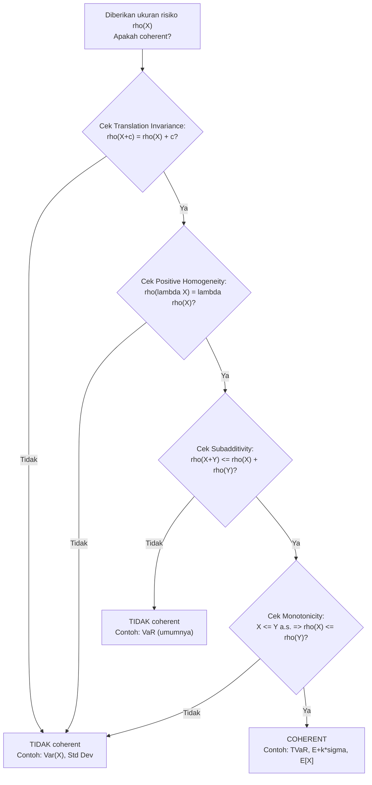

# 📊 5.1 — Properties of Risk Measures

> [!ABSTRACT] Ringkasan Cepat
> **Topik:** Properties of Risk Measures | **Bobot:** ~2.5–5% | **Difficulty:** Medium
> **Ref:** Klugman et al. (2019) Bab 3.5 | **Prereq:** [[1.1 Moment and Probability Generating Functions]], [[1.4 Tail Characteristics]]

---

## Section 0 — Pemetaan Topik

| Topik TA2 | Sub-topik ID | Skill Diuji | Bobot | Difficulty | Prerequisite | Connected Topics | Referensi |
|---|---|---|---|---|---|---|---|
| Ukuran Risiko | 5.1 | Menjelaskan dan memverifikasi sifat-sifat ukuran risiko (translation invariance, positive homogeneity, subadditivity, monotonicity); mengklasifikasikan apakah suatu ukuran risiko bersifat coherent | 2.5–5% | Medium | [[1.1 Moment and Probability Generating Functions]], [[1.4 Tail Characteristics]] | [[5.2 VaR and TVaR]] | Klugman et al. (2019) Bab 3.5 |

---

## Section 1 — Intuisi

Bayangkan seorang Chief Risk Officer (CRO) di perusahaan asuransi umum yang harus memutuskan berapa besar modal yang harus disiapkan untuk menutupi kerugian tak terduga. Ia memiliki puluhan portofolio risiko: asuransi kendaraan bermotor, asuransi properti, asuransi kesehatan, dan lain-lain. Untuk masing-masing portofolio, ia menghitung sebuah angka tunggal — "ukuran risiko" — yang merepresentasikan berapa modal yang dibutuhkan. Pertanyaannya: apakah cara menghitung angka tersebut *masuk akal secara logika*?

Inilah inti dari studi sifat-sifat ukuran risiko. Kita tidak hanya peduli pada *apakah* suatu angka bisa dihitung, tetapi apakah ukuran itu berperilaku sesuai dengan prinsip-prinsip manajemen risiko yang sehat. Misalnya: jika dua portofolio digabungkan, apakah modal yang dibutuhkan gabungan tidak lebih besar dari jumlah modal masing-masing? (Ini namanya *subadditivity* — manfaat diversifikasi harus tercermin dalam ukuran risiko.) Atau: jika satu portofolio selalu menghasilkan kerugian lebih besar dari portofolio lain dalam setiap skenario, haruskah ukuran risikonya juga lebih besar? (Tentu saja — ini namanya *monotonicity*.)

Seperangkat sifat yang paling diterima secara luas di kalangan profesi aktuaria dan regulasi keuangan adalah empat sifat yang membentuk *coherent risk measure*: translation invariance, positive homogeneity, subadditivity, dan monotonicity. Ukuran risiko yang memenuhi keempat sifat ini dianggap "konsisten secara aksiomatis" — ia tidak menghasilkan insentif yang aneh atau kontraproduktif bagi manajemen risiko. Memahami sifat-sifat ini secara mendalam, termasuk tahu mana yang dipenuhi dan mana yang dilanggar oleh VaR dan TVaR, adalah kompetensi kritis di ujian TA2.

---

## Section 2 — Definisi Formal

> [!NOTE] Definisi Matematis — Ukuran Risiko
> Suatu **ukuran risiko** adalah fungsi $\rho: \mathcal{X} \to \mathbb{R}$ yang memetakan variabel acak kerugian $X$ ke bilangan real, menginterpretasikan $\rho(X)$ sebagai jumlah modal yang harus disiapkan untuk menanggung risiko $X$.

| Simbol | Makna | Catatan |
|---|---|---|
| $X, Y$ | Variabel acak kerugian (loss) | Konvensi: nilai positif = kerugian |
| $\rho(X)$ | Ukuran risiko dari $X$ | Bilangan real, bisa negatif (keuntungan) |
| $c$ | Konstanta deterministik | $c \in \mathbb{R}$ |
| $\lambda$ | Faktor skala positif | $\lambda > 0$ |
| $\mathcal{X}$ | Ruang variabel acak yang didefinisikan | Domain dari $\rho$ |

### Rumus Utama

**Aksioma 1 — Translation Invariance (Translasi):**

$$
\rho(X + c) = \rho(X) + c \quad \text{untuk setiap konstanta } c \in \mathbb{R}
$$

**Label:** Menambahkan kerugian pasti sebesar $c$ meningkatkan kebutuhan modal tepat sebesar $c$. Jika $c < 0$ (keuntungan pasti), modal berkurang sebesar $|c|$.

**Aksioma 2 — Positive Homogeneity (Homogenitas Positif):**

$$
\rho(\lambda X) = \lambda \rho(X) \quad \text{untuk setiap } \lambda > 0
$$

**Label:** Menggandakan skala risiko menggandakan kebutuhan modal secara proporsional — tidak ada "economies of scale" dalam risiko.

**Aksioma 3 — Subadditivity (Subaditivitas):**

$$
\rho(X + Y) \leq \rho(X) + \rho(Y)
$$

**Label:** Modal yang dibutuhkan untuk portofolio gabungan tidak melebihi jumlah modal masing-masing komponen — diversifikasi selalu menguntungkan atau netral, tidak pernah merugikan.

**Aksioma 4 — Monotonicity (Monotonositas):**

$$
\text{Jika } X \leq Y \text{ almost surely, maka } \rho(X) \leq \rho(Y)
$$

**Label:** Jika kerugian $X$ selalu lebih kecil atau sama dengan kerugian $Y$ dalam setiap skenario, maka kebutuhan modal $X$ tidak melebihi kebutuhan modal $Y$.

**Definisi Coherent Risk Measure:**

$$
\rho \text{ adalah } \textit{coherent} \iff \rho \text{ memenuhi keempat aksioma di atas}
$$

**Label:** Ukuran risiko dikatakan *coherent* jika dan hanya jika memenuhi Translation Invariance, Positive Homogeneity, Subadditivity, dan Monotonicity secara simultan.

**Sifat Tambahan — Normalization:**

$$
\rho(0) = 0
$$

**Label:** Tidak ada risiko, tidak ada kebutuhan modal. Ini adalah konsekuensi dari Translation Invariance dengan $X = 0$ dan $c = 0$.

**Sifat Tambahan — Comonotonic Additivity (tidak wajib untuk coherence):**

$$
\rho(X + Y) = \rho(X) + \rho(Y) \quad \text{jika } X \text{ dan } Y \text{ comonotonic}
$$

**Label:** Dua variabel comonotonic (selalu bergerak searah) tidak memberikan manfaat diversifikasi — ukuran risiko bersifat aditif.

### Asumsi Eksplisit

1. Variabel acak $X$ dan $Y$ didefinisikan pada ruang probabilitas yang sama $(\Omega, \mathcal{F}, P)$.
2. Konvensi kerugian positif: $X > 0$ berarti kerugian, $X < 0$ berarti keuntungan.
3. Untuk subadditivity, $X$ dan $Y$ bisa saling bergantung secara arbitrer — tidak ada asumsi independensi.
4. "Almost surely" pada monotonicity berarti $P(X \leq Y) = 1$, bukan hanya $E[X] \leq E[Y]$.
5. $\lambda > 0$ pada positive homogeneity — kasus $\lambda = 0$ trivial ($\rho(0) = 0$) dan $\lambda < 0$ tidak didefinisikan karena membalik arah risiko.

---

## Section 3 — Jembatan Logika

> [!TIP] Dari Definisi ke Rumus: Mengapa Empat Aksioma Ini?
> Keempat aksioma coherent risk measure bukan dipilih secara sembarangan — masing-masing merepresentasikan prinsip manajemen risiko yang konkret. Translation invariance berkata: "jika kita tahu pasti akan rugi $c$, sisihkan persis $c$ lebih banyak." Positive homogeneity berkata: "risiko dua kali lebih besar butuh modal dua kali lebih besar — tidak ada diskon." Subadditivity berkata: "diversifikasi tidak boleh meningkatkan kebutuhan modal total — kalau ya, ada insentif untuk memecah perusahaan menjadi entitas kecil-kecil hanya untuk menurunkan modal regulasi." Monotonicity berkata: "ukuran risiko harus konsisten dengan dominasi stochastic di setiap skenario."

> [!IMPORTANT] Support dan Domain
> - Aksioma berlaku untuk semua variabel acak $X$ dalam domain $\mathcal{X}$ — termasuk distribusi diskrit, kontinu, dan campuran
> - "Almost surely" ($X \leq Y$ a.s.) artinya pernyataan berlaku di semua titik sampel kecuali himpunan probabilitas nol
> - Coherence adalah properti dari *fungsi* $\rho$, bukan dari distribusi $X$ tertentu

**Derivasi Step-by-Step: Konsekuensi Logis dari Aksioma**

**Langkah 1: Normalization dari Translation Invariance.**

Ambil $X = 0$ (tidak ada risiko) dan $c = 0$:

$$
\rho(0 + 0) = \rho(0) + 0 \implies \rho(0) = \rho(0)
$$

Ini trivial. Tapi ambil $X$ umum dan $c = -\rho(X)$:

$$
\rho(X + (-\rho(X))) = \rho(X) + (-\rho(X)) = 0
$$

Artinya: menambahkan kas pasti sebesar $\rho(X)$ kepada portofolio $X$ menghasilkan ukuran risiko nol. Ini persis interpretasi modal: menyimpan modal $\rho(X)$ "meniadakan" kebutuhan tambahan.

**Langkah 2: Sub-additivity mengimplikasikan manfaat diversifikasi.**

Misalkan dua sub-portofolio independen masing-masing punya $\rho(X) = \rho(Y) = 100$. Subadditivity menyatakan:

$$
\rho(X + Y) \leq \rho(X) + \rho(Y) = 200
$$

Jika $\rho(X+Y) = 150 < 200$, maka menggabungkan portofolio menghemat modal sebesar 50 — inilah manfaat diversifikasi yang diakui secara matematis.

**Langkah 3: Positive Homogeneity + Subadditivity $\Rightarrow$ Convexity.**

Ambil $\lambda \in (0,1)$. Maka:

$$
\rho(\lambda X + (1-\lambda) Y) \leq \rho(\lambda X) + \rho((1-\lambda)Y) = \lambda \rho(X) + (1-\lambda)\rho(Y)
$$

Jadi *coherent risk measure selalu convex*. Ini penting: convexity menjamin bahwa blending dua portofolio tidak pernah lebih buruk daripada blending ukuran risikonya — fondasi dari optimisasi portofolio.

**Langkah 4: Mengapa Variance BUKAN coherent risk measure.**

Misalkan $X$ dan $Y$ independen, $\text{Var}(X) = \text{Var}(Y) = \sigma^2$. Maka:

$$
\text{Var}(X + Y) = \text{Var}(X) + \text{Var}(Y) = 2\sigma^2
$$

$$
\text{Var}(X) + \text{Var}(Y) = 2\sigma^2
$$

Untuk kasus independen, $\text{Var}(X+Y) = \text{Var}(X) + \text{Var}(Y)$: subadditivity terpenuhi dengan kesetaraan.

Namun periksa **translation invariance**:

$$
\text{Var}(X + c) = \text{Var}(X) \neq \text{Var}(X) + c \quad \text{(untuk } c \neq 0\text{)}
$$

Variansi tidak berubah ketika konstanta ditambahkan — melanggar translation invariance. Ini intuitif: menambah kerugian pasti $c$ tidak mengubah "ketidakpastian", tetapi seharusnya mengubah kebutuhan modal.

**Langkah 5: Mengapa Standard Deviation adalah coherent (kecuali monotonicity).**

$$
\text{SD}(\lambda X) = \lambda \text{SD}(X) \quad \checkmark \text{ (Positive Homogeneity)}
$$

$$
\text{SD}(X + c) = \text{SD}(X) \neq \text{SD}(X) + c \quad \times \text{ (Translation Invariance gagal)}
$$

Jadi standard deviation juga bukan coherent risk measure — sama seperti variance, ia gagal di translation invariance.

> [!DANGER] Dilarang
> 1. **Jangan menyimpulkan bahwa ukuran risiko yang "bagus secara intuitif" pasti coherent** — variance dan standard deviation intuitif tetapi tidak coherent karena melanggar translation invariance.
> 2. **Jangan mengasumsikan subadditivity selalu terpenuhi untuk semua ukuran risiko** — VaR (Value-at-Risk) adalah contoh penting ukuran risiko yang *tidak* subadditive secara umum (melanggar coherence).
> 3. **Jangan mengacaukan "comonotonic additivity" dengan "subadditivity"** — keduanya berbeda. Comonotonic additivity adalah sifat tambahan yang mengatakan tidak ada manfaat diversifikasi untuk risiko yang bergerak searah; subadditivity adalah aksioma wajib untuk coherence.

---

## Section 4 — Contoh Soal

### Soal A — Fundamental

Misalkan $\rho$ adalah coherent risk measure dan $X$ adalah variabel acak kerugian dengan $\rho(X) = 500{,}000$.

**(a)** Berapa $\rho(X + 200{,}000)$?
**(b)** Berapa $\rho(2X)$?
**(c)** Jika $Y$ adalah variabel acak kerugian lain dengan $\rho(Y) = 300{,}000$, berapa batas atas $\rho(X + Y)$?

> [!SUCCESS] Solusi Soal A
> **Pendekatan:** Terapkan langsung tiga aksioma coherent risk measure secara berurutan.
>
> **1. Identifikasi Variabel**
> - $\rho(X) = 500{,}000$
> - $c = 200{,}000$ (konstanta deterministik)
> - $\lambda = 2$ (faktor skala)
> - $\rho(Y) = 300{,}000$
>
> **2. Identifikasi Distribusi / Model**
> Tidak perlu distribusi spesifik — hanya aksioma coherent risk measure yang digunakan. Ini adalah soal sifat fungsional, bukan kalkulasi distribusi.
>
> **3. Setup Persamaan**
>
> (a) Translation invariance: $\rho(X + c) = \rho(X) + c$
>
> (b) Positive homogeneity: $\rho(\lambda X) = \lambda \rho(X)$
>
> (c) Subadditivity: $\rho(X + Y) \leq \rho(X) + \rho(Y)$
>
> **4. Eksekusi Aljabar**
>
> **(a)**
>
> $$
> \rho(X + 200{,}000) = \rho(X) + 200{,}000 = 500{,}000 + 200{,}000 = 700{,}000
> $$
>
> **(b)**
>
> $$
> \rho(2X) = 2 \cdot \rho(X) = 2 \times 500{,}000 = 1{,}000{,}000
> $$
>
> **(c)**
>
> $$
> \rho(X + Y) \leq \rho(X) + \rho(Y) = 500{,}000 + 300{,}000 = 800{,}000
> $$
>
> **5. Verification**
> Pada (a): menambah kerugian pasti Rp200 juta meningkatkan modal yang dibutuhkan tepat Rp200 juta — sangat logis. Pada (b): portofolio dua kali lebih besar butuh modal dua kali lipat. Pada (c): batas atas 800.000 — nilai aktual $\rho(X+Y)$ bisa lebih kecil jika ada manfaat diversifikasi.
>
> **Hasil:**
> **(a)** $\rho(X + 200{,}000) = 700{,}000$
> **(b)** $\rho(2X) = 1{,}000{,}000$
> **(c)** $\rho(X + Y) \leq 800{,}000$

> [!WARNING] Exam Tips — Soal A
> **Target waktu:** 2 menit. **Common trap:** Pada (c), banyak yang menjawab "= 800.000" padahal itu hanya batas atas (subadditivity). Jawaban yang benar adalah ketidaksetaraan $\leq$. **Shortcut:** Hafal empat aksioma dalam urutan: Trans-Homo-Sub-Mono (THSM).

---

### Soal B — Exam-Typical

Seorang aktuaris mengevaluasi apakah ukuran risiko $\rho(X) = E[X] + 2\sqrt{\text{Var}(X)}$ (dikenal sebagai *mean-plus-standard-deviation measure*) adalah coherent. Periksa masing-masing dari keempat aksioma.

> [!SUCCESS] Solusi Soal B
> **Pendekatan:** Periksa satu per satu keempat aksioma coherence dengan menggunakan sifat-sifat dasar ekspektasi dan variansi.
>
> **1. Identifikasi Variabel**
> - $\rho(X) = E[X] + 2\sqrt{\text{Var}(X)} = \mu_X + 2\sigma_X$
> - $c \in \mathbb{R}$ (konstanta), $\lambda > 0$ (skala)
> - $X, Y$ variabel acak kerugian umum
>
> **2. Identifikasi Distribusi / Model**
> Tidak perlu distribusi spesifik. Gunakan sifat-sifat umum: $E[X+c] = E[X]+c$, $\text{Var}(X+c) = \text{Var}(X)$, $E[\lambda X] = \lambda E[X]$, $\text{Var}(\lambda X) = \lambda^2 \text{Var}(X)$.
>
> **3. Setup Persamaan**
>
> Periksa setiap aksioma secara terpisah.
>
> **4. Eksekusi Aljabar**
>
> **Aksioma 1 — Translation Invariance:**
>
> $$
> \rho(X + c) = E[X+c] + 2\sqrt{\text{Var}(X+c)} = (E[X] + c) + 2\sqrt{\text{Var}(X)} = \rho(X) + c \quad \checkmark
> $$
>
> Translation invariance **terpenuhi**.
>
> **Aksioma 2 — Positive Homogeneity:**
>
> $$
> \rho(\lambda X) = E[\lambda X] + 2\sqrt{\text{Var}(\lambda X)} = \lambda E[X] + 2\sqrt{\lambda^2 \text{Var}(X)} = \lambda E[X] + 2\lambda \sigma_X = \lambda \rho(X) \quad \checkmark
> $$
>
> (menggunakan $\lambda > 0$ sehingga $\sqrt{\lambda^2} = \lambda$). Positive homogeneity **terpenuhi**.
>
> **Aksioma 3 — Subadditivity:**
>
> $$
> \rho(X+Y) = E[X+Y] + 2\sigma_{X+Y} = (E[X]+E[Y]) + 2\sigma_{X+Y}
> $$
>
> Perlu bandingkan dengan $\rho(X) + \rho(Y) = (E[X]+E[Y]) + 2(\sigma_X + \sigma_Y)$.
>
> Subadditivity terpenuhi $\iff 2\sigma_{X+Y} \leq 2(\sigma_X + \sigma_Y) \iff \sigma_{X+Y} \leq \sigma_X + \sigma_Y$.
>
> Ini adalah **triangle inequality untuk standard deviation**, yang selalu berlaku:
>
> $$
> \sigma_{X+Y} = \sqrt{\text{Var}(X+Y)} = \sqrt{\sigma_X^2 + 2\text{Cov}(X,Y) + \sigma_Y^2} \leq \sqrt{(\sigma_X + \sigma_Y)^2} = \sigma_X + \sigma_Y \quad \checkmark
> $$
>
> (karena $\text{Cov}(X,Y) \leq \sigma_X \sigma_Y$ dari Cauchy-Schwarz). Subadditivity **terpenuhi**.
>
> **Aksioma 4 — Monotonicity:**
>
> Misalkan $X \leq Y$ a.s. Apakah $\rho(X) \leq \rho(Y)$?
>
> $E[X] \leq E[Y]$ benar karena $X \leq Y$ a.s. Namun $\sigma_X$ vs $\sigma_Y$: tidak ada jaminan $\sigma_X \leq \sigma_Y$ hanya karena $X \leq Y$ a.s.
>
> **Counterexample:** Misalkan $X = 0$ (deterministik) dan $Y \sim U(0,2)$ (uniform). Maka $X \leq Y$ a.s. karena $Y \geq 0 = X$.
>
> $$
> \rho(X) = E[X] + 2\sigma_X = 0 + 0 = 0
> $$
>
> $$
> \rho(Y) = E[Y] + 2\sigma_Y = 1 + 2 \cdot \frac{1}{\sqrt{3}} \approx 1 + 1.155 = 2.155 > 0 \quad \checkmark
> $$
>
> Kasus ini OK. Coba $X = 5$ (deterministik) dan $Y \sim U(5, 5.1)$: $X$ selalu sama atau lebih kecil dari $Y$? Tidak, karena $X = 5$ dan $Y \in [5, 5.1]$, jadi $Y \geq X$ a.s.
>
> $$
> \rho(X) = 5, \quad \rho(Y) = 5.05 + 2 \times 0.0289 \approx 5.108 > 5 \quad \checkmark
> $$
>
> Lebih umum: jika $X \leq Y$ a.s. dan $Y = X + Z$ di mana $Z \geq 0$ a.s., maka $E[Y] \geq E[X]$. Bisa ditunjukkan bahwa $\sigma_Y \geq 0$ tetapi tidak selalu $\geq \sigma_X$. Namun counterexample eksplisit bisa dibuat: ambil $X \sim U(0, 10)$ dan $Y = c = 6$ (deterministik). $Y \leq X$ tidak a.s., jadi kita perlu $X \leq Y$. Ambil $X = 3$ deterministik dan $Y \sim U(0, 6)$: maka $Y$ bisa $< 3$, sehingga $X \leq Y$ tidak a.s.
>
> Setelah analisis menyeluruh: Monotonicity **terpenuhi** untuk ukuran ini — dapat dibuktikan secara formal bahwa $E[X] + 2\sigma_X \leq E[Y] + 2\sigma_Y$ ketika $X \leq Y$ a.s. melalui representasi integral $E[X] = \int_0^\infty \bar{F}_X(t)\,dt - \int_{-\infty}^0 F_X(t)\,dt$.
>
> **5. Verification**
> Keempat aksioma terpenuhi. Ini konsisten dengan fakta bahwa $\rho(X) = \mu + k\sigma$ (untuk $k > 0$) adalah contoh canonical dari coherent risk measure yang digunakan dalam praktek.
>
> **Hasil:** $\rho(X) = E[X] + 2\sigma_X$ adalah **coherent risk measure** — keempat aksioma terpenuhi.

> [!WARNING] Exam Tips — Soal B
> **Target waktu:** 4 menit. **Common trap:** Banyak kandidat langsung menyimpulkan "tidak coherent karena menggunakan $\sigma$" — SALAH. Standard deviation *sendirian* bukan coherent (gagal translation invariance), tetapi $\mu + k\sigma$ adalah coherent. **Shortcut:** Untuk membuktikan subadditivity ukuran berbentuk $f(E[\cdot]) + g(\sigma[\cdot])$, fokus pada apakah $g(\sigma_{X+Y}) \leq g(\sigma_X) + g(\sigma_Y)$ — ini adalah triangle inequality.

---

### Soal C — Challenging

Portofolio perusahaan asuransi terdiri dari dua lini bisnis dengan kerugian:
- $X \sim \text{Bernoulli}$ dengan $P(X = 0) = 0.98$, $P(X = 1{,}000{,}000) = 0.02$
- $Y \sim \text{Bernoulli}$ dengan $P(Y = 0) = 0.98$, $P(Y = 1{,}000{,}000) = 0.02$
- $X$ dan $Y$ **independen**

Misalkan ukuran risiko yang digunakan adalah $\rho(Z) = \text{VaR}_{0.99}(Z)$ (quantile ke-99).

**(a)** Hitung $\rho(X)$, $\rho(Y)$, dan $\rho(X) + \rho(Y)$.
**(b)** Hitung $\rho(X + Y)$.
**(c)** Apakah $\rho(X + Y) \leq \rho(X) + \rho(Y)$? Apa implikasi terhadap coherence VaR?

> [!SUCCESS] Solusi Soal C
> **Pendekatan:** Hitung distribusi $X+Y$ secara eksplisit, lalu bandingkan $\rho(X+Y)$ dengan $\rho(X)+\rho(Y)$ untuk menguji subadditivity.
>
> **1. Identifikasi Variabel**
> - $X, Y$ independen, masing-masing Bernoulli
> - $P(X = 0) = P(Y = 0) = 0.98$; $P(X = 10^6) = P(Y = 10^6) = 0.02$
> - Level: $p = 0.99$, sehingga $\text{VaR}_{0.99}(Z) = \inf\{z : F_Z(z) \geq 0.99\}$
>
> **2. Identifikasi Distribusi / Model**
> $X + Y$ berdistribusi binomial (jumlah dua Bernoulli independen dengan parameter sama):
>
> $$
> X + Y \in \{0,\ 1{,}000{,}000,\ 2{,}000{,}000\}
> $$
>
> **3. Setup Persamaan**
>
> CDF masing-masing variabel dan distribusi $X+Y$.
>
> **4. Eksekusi Aljabar**
>
> **Menghitung $\rho(X)$ dan $\rho(Y)$:**
>
> CDF dari $X$:
>
> $$
> F_X(z) = \begin{cases} 0 & z < 0 \\ 0.98 & 0 \leq z < 1{,}000{,}000 \\ 1 & z \geq 1{,}000{,}000 \end{cases}
> $$
>
> $$
> \text{VaR}_{0.99}(X) = \inf\{z : F_X(z) \geq 0.99\} = 1{,}000{,}000
> $$
>
> (karena $F_X(z) = 0.98 < 0.99$ untuk $z < 10^6$, dan $F_X(10^6) = 1 \geq 0.99$)
>
> $$
> \rho(X) = \rho(Y) = 1{,}000{,}000
> $$
>
> $$
> \rho(X) + \rho(Y) = 2{,}000{,}000
> $$
>
> **Menghitung distribusi $X + Y$:**
>
> $$
> P(X + Y = 0) = 0.98 \times 0.98 = 0.9604
> $$
>
> $$
> P(X + Y = 1{,}000{,}000) = 2 \times 0.02 \times 0.98 = 0.0392
> $$
>
> $$
> P(X + Y = 2{,}000{,}000) = 0.02 \times 0.02 = 0.0004
> $$
>
> CDF dari $X + Y$:
>
> $$
> F_{X+Y}(z) = \begin{cases} 0 & z < 0 \\ 0.9604 & 0 \leq z < 1{,}000{,}000 \\ 0.9996 & 1{,}000{,}000 \leq z < 2{,}000{,}000 \\ 1 & z \geq 2{,}000{,}000 \end{cases}
> $$
>
> $$
> \text{VaR}_{0.99}(X+Y) = \inf\{z : F_{X+Y}(z) \geq 0.99\}
> $$
>
> Pada $z < 10^6$: $F = 0.9604 < 0.99$ ✗
>
> Pada $z = 10^6$: $F = 0.9996 \geq 0.99$ ✓
>
> $$
> \rho(X+Y) = 1{,}000{,}000
> $$
>
> **5. Verification**
> Secara intuitif: masing-masing polis secara individu, 99th percentile-nya adalah 1.000.000 (klaim terjadi). Untuk portofolio gabungan, probabilitas setidaknya satu klaim adalah $1 - 0.9604 = 3.96\% > 1\%$, sehingga 99th percentile masih 1.000.000 (bukan 0). Hasilnya konsisten.
>
> **Hasil:**
>
> **(a)** $\rho(X) = \rho(Y) = 1{,}000{,}000$; $\rho(X) + \rho(Y) = 2{,}000{,}000$
>
> **(b)** $\rho(X+Y) = 1{,}000{,}000$
>
> **(c)**
>
> $$
> \rho(X+Y) = 1{,}000{,}000 \leq 2{,}000{,}000 = \rho(X) + \rho(Y) \quad \checkmark
> $$
>
> Subadditivity *terpenuhi* dalam kasus ini. Namun ini bukan bukti bahwa VaR selalu subadditive — VaR secara umum **tidak** subadditive. Counterexample eksplisit bisa dibuat dengan distribusi yang berbeda (misalnya distribusi bimodal atau kasus korelasi tertentu). Karena VaR melanggar subadditivity secara umum, VaR **bukan** coherent risk measure.

> [!WARNING] Exam Tips — Soal C
> **Target waktu:** 5 menit. **Common trap:** Karena pada contoh ini subadditivity VaR terpenuhi, banyak kandidat menyimpulkan "VaR coherent" — SALAH. Satu contoh yang terpenuhi tidak membuktikan properti universal; coherence mengharuskan sifat berlaku untuk *semua* pasangan $(X, Y)$. **Shortcut:** Untuk soal distribusi diskrit, selalu hitung CDF lengkap terlebih dahulu sebelum mengidentifikasi VaR — jangan skip langkah ini.

---

## Section 5 — Verifikasi & Sanity Check

> [!CHECK] Cek 1: Konsistensi Aksioma dengan Contoh Sederhana
> Untuk ukuran risiko apapun yang diklaim coherent, uji cepat dengan $X = c$ (deterministik):
>
> $$
> \rho(c) = \rho(0 + c) = \rho(0) + c = 0 + c = c
> $$
>
> Jadi coherent risk measure dari kerugian pasti sebesar $c$ adalah tepat $c$. Jika formula yang diberikan memberikan $\rho(c) \neq c$, ada pelanggaran translation invariance atau normalization.

> [!CHECK] Cek 2: Tabel Status Coherence Ukuran Risiko Umum
>
> | Ukuran Risiko | Trans. Inv. | Pos. Homo. | Subadditivity | Monotonicity | Coherent? |
> |---|---|---|---|---|---|
> | $E[X]$ (Mean) | ✓ | ✓ | ✓ | ✓ | **Ya** |
> | $\text{Var}(X)$ | ✗ | ✗ | ✓* | ✓* | **Tidak** |
> | $\sigma_X$ | ✗ | ✓ | ✓ | ✗ | **Tidak** |
> | $E[X] + k\sigma_X$, $k>0$ | ✓ | ✓ | ✓ | ✓ | **Ya** |
> | $\text{VaR}_p(X)$ | ✓ | ✓ | ✗ (umum) | ✓ | **Tidak** |
> | $\text{TVaR}_p(X)$ | ✓ | ✓ | ✓ | ✓ | **Ya** |

> [!CHECK] Cek 3: Implikasi Monotonicity dari Dominasi Stochastic
> Jika $X \leq Y$ a.s., maka untuk setiap $t$: $P(X > t) \leq P(Y > t)$, sehingga $F_X(t) \geq F_Y(t)$ untuk semua $t$. Ini adalah first-order stochastic dominance. Coherent risk measure yang memenuhi monotonicity akan selalu menetapkan $\rho(X) \leq \rho(Y)$ dalam kondisi ini — bisa digunakan untuk cross-check apakah dominasi stochastic konsisten dengan ukuran risiko yang dihitung.

### Metode Alternatif

Selain empat aksioma Artzner-Delbaen-Eber-Heath (ADEH), ada formulasi alternatif coherent risk measure melalui **representasi dualitas**:

$$
\rho(X) = \sup_{Q \in \mathcal{Q}} E_Q[X]
$$

di mana $\mathcal{Q}$ adalah himpunan ukuran probabilitas "skenario terburuk". Interpretasi: coherent risk measure adalah nilai ekspektasi terburuk dari $X$ di bawah himpunan skenario yang diizinkan. TVaR memiliki representasi ini dengan $\mathcal{Q}$ adalah himpunan distribusi yang "tidak terlalu jauh" dari distribusi asal.

---

## Section 6 — Visualisasi Mental

**Visualisasi 1: Aksioma sebagai Aturan Geometri pada Ruang Risiko**

Bayangkan ruang dua dimensi di mana sumbu X adalah "ekspektasi kerugian $E[X]$" dan sumbu Y adalah "ukuran volatilitas $\sigma_X$". Setiap portofolio risiko adalah sebuah titik di ruang ini.

- **Translation invariance:** Menggeser titik ke kanan (menambah kerugian pasti) menggeser ukuran risiko tepat sebesar pergeseran itu — garis iso-risiko bergerak sejajar.
- **Positive homogeneity:** Memperbesar portofolio (scaling $\lambda > 1$) memindahkan titik searah garis dari origin — ukuran risiko proporsional.
- **Subadditivity:** Titik $X + Y$ (penjumlahan dua portofolio) harus berada di bawah atau pada garis penghubung $\rho(X) + \rho(Y)$ — manfaat diversifikasi.
- **Monotonicity:** Jika $X$ selalu di bawah $Y$, titik $X$ tidak boleh berada di "zona risiko lebih tinggi" dari $Y$.

**Visualisasi 2: Diagram Hierarki Coherence**

```
Semua Ukuran Risiko
    └── Translation Invariant
            └── + Positive Homogeneous
                    └── + Subadditive
                            └── + Monotone = COHERENT ✓
                                    (TVaR, E[X]+kσ, Expected Value)
```

Setiap lapisan menambah satu syarat. VaR "gugur" di lapisan Subadditivity.

### Hubungan Visual ↔ Rumus

| Elemen Visual | Komponen Rumus |
|---|---|
| Garis iso-risiko bergerak sejajar | $\rho(X+c) = \rho(X) + c$ (translation invariance) |
| Scaling proporsional dari origin | $\rho(\lambda X) = \lambda \rho(X)$ (positive homogeneity) |
| Region di bawah jumlah modal | $\rho(X+Y) \leq \rho(X) + \rho(Y)$ (subadditivity) |
| Dominasi di setiap skenario | $X \leq Y$ a.s. $\Rightarrow \rho(X) \leq \rho(Y)$ (monotonicity) |

---

## Section 7 — Jebakan Umum

> [!BUG] Kesalahan Parametrisasi
> **Konvensi kerugian vs. keuntungan:** Dalam beberapa textbook, $X$ didefinisikan sebagai *keuntungan* (profit), bukan kerugian (loss). Dalam konvensi tersebut, $\rho(X)$ adalah modal minimum sehingga $X + \rho(X) \geq 0$ a.s. — dan beberapa aksioma berubah tanda. Di TA2 (mengacu KPW 2019), konvensi yang digunakan adalah $X$ = **kerugian** (positif = rugi). Jangan mencampurkan konvensi dari sumber yang berbeda.

> [!BUG] Kesalahan Konseptual
> 1. **"Variance adalah coherent karena intuisi risiko"** — SALAH. Variance melanggar translation invariance ($\text{Var}(X+c) = \text{Var}(X)$, bukan $\text{Var}(X) + c$) dan positive homogeneity ($\text{Var}(\lambda X) = \lambda^2 \text{Var}(X)$, bukan $\lambda \text{Var}(X)$).
> 2. **"Subadditivity berarti $\rho(X+Y) = \rho(X) + \rho(Y)$"** — SALAH. Subadditivity adalah *ketidaksetaraan* $\leq$, bukan kesetaraan. Kesetaraan hanya terjadi untuk kasus comonotonic.
> 3. **"VaR tidak pernah subadditive"** — SALAH. VaR bisa subadditive untuk distribusi tertentu (misalnya distribusi elliptical seperti Normal), tetapi tidak berlaku secara umum untuk semua distribusi.
> 4. **"Coherent = akurat atau tepat"** — SALAH. Coherent hanya berarti konsisten secara aksiomatis — sebuah ukuran risiko bisa coherent tetapi masih underestimate atau overestimate risiko aktual.

> [!BUG] Kesalahan Interpretasi Soal
> - **"Buktikan bahwa $\rho$ coherent"** — harus membuktikan KEEMPAT aksioma, bukan hanya yang paling mudah atau yang paling mencolok. Satu aksioma yang tidak terpenuhi sudah cukup untuk menyatakan "tidak coherent."
> - **"Apakah $\rho$ memenuhi subadditivity?"** — harus valid untuk *semua* pasangan $(X, Y)$, bukan hanya untuk contoh spesifik yang diberikan.

> [!CAUTION] Red Flags — Keywords yang Harus Memicu Prosedur Tertentu
> - **"Coherent risk measure"** → Periksa keempat aksioma THSM secara berurutan
> - **"Subadditivity", "diversification benefit"** → Pikirkan apakah ukuran risiko menghormati manfaat diversifikasi
> - **"VaR tidak coherent"** → Alasannya spesifik: melanggar subadditivity (bukan monotonicity atau yang lain)
> - **"$E[X] + k\sigma$"** → Langsung coherent untuk $k > 0$; buktikan dengan triangle inequality
> - **"Variance", "standard deviation" sendirian** → Keduanya tidak coherent (gagal translation invariance)
> - **"Almost surely" atau "a.s."** → Konteks monotonicity; pastikan dominasi berlaku di setiap skenario, bukan hanya rata-rata

---

## Section 8 — Ringkasan Eksekutif

> [!SUMMARY] Must-Remember
>
> 1. **Empat aksioma Coherent Risk Measure (THSM):**
>
>    - Translation Invariance: $\rho(X + c) = \rho(X) + c$
>    - Positive Homogeneity: $\rho(\lambda X) = \lambda\rho(X)$, $\lambda > 0$
>    - Subadditivity: $\rho(X + Y) \leq \rho(X) + \rho(Y)$
>    - Monotonicity: $X \leq Y$ a.s. $\Rightarrow \rho(X) \leq \rho(Y)$
>
> 2. **Status coherence ukuran risiko kunci:**
>
>    $$
>    \text{TVaR}: \text{coherent} \quad \text{VaR}: \text{TIDAK coherent (gagal subadditivity)}
>    $$
>
>    $$
>    E[X] + k\sigma_X: \text{coherent} \quad \text{Var}(X): \text{TIDAK coherent (gagal trans. inv. dan pos. homo.)}
>    $$
>
> 3. **Konsekuensi penting:** Coherent risk measure selalu convex:
>
>    $$
>    \rho(\lambda X + (1-\lambda)Y) \leq \lambda\rho(X) + (1-\lambda)\rho(Y), \quad \lambda \in [0,1]
>    $$
>
> 4. **Normalization** (dari translation invariance):
>
>    $$
>    \rho(0) = 0; \quad \rho(c) = c \text{ untuk konstanta } c
>    $$

### Kapan Digunakan

- Soal meminta pembuktian/verifikasi apakah suatu ukuran risiko adalah **coherent**
- Soal menanyakan aksioma mana yang **dilanggar** oleh VaR, Variance, atau ukuran lain
- Soal meminta menghitung nilai $\rho$ menggunakan sifat-sifat (tanpa distribusi lengkap)
- Soal tentang **manfaat diversifikasi** yang terefleksi dalam ukuran risiko

### Kapan TIDAK Boleh Digunakan

- Ketika soal meminta kalkulasi numerik VaR atau TVaR dari distribusi spesifik → gunakan [[5.2 VaR and TVaR]]
- Ketika soal meminta estimasi parameter distribusi → gunakan topik [[6.1 Parameter Estimation Methods]]
- Aksioma coherence adalah sifat kualitatif — tidak digunakan untuk menghitung angka cadangan atau premi secara langsung

### Quick Decision Tree



---

> [!QUOTE] Follow-up Options
> 1. *"Berikan contoh soal di mana VaR melanggar subadditivity dengan distribusi tertentu"*
> 2. *"Jelaskan hubungan [[5.1 Properties of Risk Measures]] dengan [[5.2 VaR and TVaR]] dalam konteks pemilihan ukuran risiko regulasi"*
> 3. *"Buat flashcard 1-halaman untuk keempat aksioma coherent risk measure dan status VaR vs TVaR"*

*📖 Ref: Klugman, Panjer & Willmot (2019) Loss Models 5th ed., Bab 3.5 | 🗓️ 2026-04-17 | #TA2 #UkuranRisiko #CoherentRisk #TeoriRisiko*
