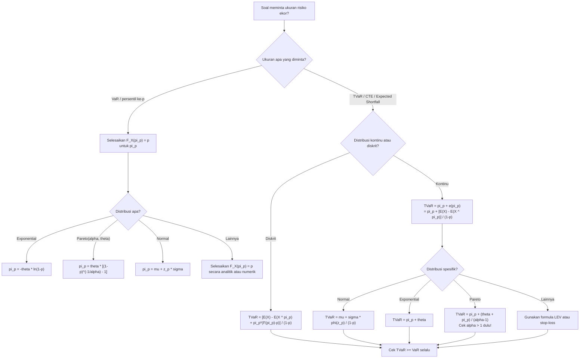

# 📊 5.2 — VaR and TVaR

> [!ABSTRACT] Ringkasan Cepat
> **Topik:** VaR and TVaR | **Bobot:** ~2.5–5% | **Difficulty:** Hard
> **Ref:** Klugman et al. (2019), Loss Models 5th ed., Bab 3.5 | **Prereq:** [[5.1 Properties of Risk Measures]], [[1.4 Tail Characteristics]]

## Section 0 — Pemetaan Topik

| Topik TA2 | Sub-topik ID | Skill Diuji | Bobot | Difficulty | Prerequisite | Connected Topics | Referensi |
|---|---|---|---|---|---|---|---|
| Ukuran Risiko | 5.2 | Menghitung VaR dan TVaR untuk distribusi kontinu dan diskrit; membandingkan sifat keduanya; menjelaskan penggunaan dan keterbatasan masing-masing; menghubungkan TVaR dengan stop-loss premium | 2.5–5% | Hard | [[5.1 Properties of Risk Measures]], [[1.4 Tail Characteristics]] | [[4.3 Mean Variance and Stop-Loss]], [[4.4 Aggregate Distribution Approximation]], [[1.2 Distribution Classes and Extreme Value]] | Klugman et al. (2019) Bab 3.5 |

## Section 1 — Intuisi

Bayangkan seorang Direktur Keuangan perusahaan asuransi umum Indonesia harus menjawab pertanyaan regulator OJK: "Berapa cadangan modal minimum yang dibutuhkan agar perusahaan Anda dapat bertahan menghadapi skenario klaim terburuk?" Pertanyaan ini membutuhkan ukuran yang merangkum **risiko ekor** distribusi klaim — bukan hanya rata-rata, bukan hanya variance, tetapi sesuatu yang secara eksplisit mengkuantifikasi "seberapa parah kondisi terburuk itu." Di sinilah **Value-at-Risk (VaR)** dan **Tail Value-at-Risk (TVaR)** berperan sebagai dua ukuran risiko paling penting dalam manajemen risiko aktuaria modern.

**VaR pada tingkat kepercayaan $p$** menjawab pertanyaan: "Berapa nilai $x$ sedemikian sehingga kita yakin $p\times100\%$ bahwa kerugian tidak akan melebihi $x$?" Secara geometris, VaR adalah persentil ke-$p$ dari distribusi kerugian. Ini sangat intuitif dan mudah dikomunikasikan — regulator, direksi, dan bahkan auditor non-aktuaria dapat memahaminya. Namun, VaR memiliki kelemahan fundamental: ia **tidak memberitahu apa yang terjadi di luar ambang batas tersebut**. Dua portofolio bisa memiliki VaR yang identik di $p = 95\%$ tetapi salah satunya memiliki ekor yang jauh lebih destruktif dari yang lain — dan VaR tidak membedakan keduanya.

**TVaR (Tail Value-at-Risk)**, yang juga dikenal sebagai *Conditional Tail Expectation* (CTE) atau *Expected Shortfall*, menyempurnakan kelemahan VaR tersebut. TVaR pada tingkat kepercayaan $p$ bertanya: "Jika kerugian sudah melewati VaR — yaitu sudah berada di skenario terburuk $1-p$ fraksi — berapa *rata-rata* kerugian di wilayah gelap itu?" TVaR selalu lebih besar atau sama dengan VaR, mencerminkan risiko tambahan dari ekor yang tebal. Dalam kerangka *risk measure* formal, TVaR adalah ukuran risiko yang *coherent* (memenuhi sifat subadditivitas) sedangkan VaR tidak — inilah mengapa TVaR semakin diutamakan dalam regulasi modal berbasis risiko seperti Solvency II dan IFRS 17.

## Section 2 — Definisi Formal

> [!NOTE] Definisi Matematis — VaR dan TVaR
> Misalkan $X$ adalah variabel acak kerugian dengan CDF $F_X(x)$ dan survival function $S_X(x) = 1 - F_X(x)$.
>
> **Value-at-Risk (VaR) pada level $p$** ($0 < p < 1$):
>
> $$\text{VaR}_p(X) = \pi_p = F_X^{-1}(p) = \inf\{x : F_X(x) \geq p\}$$
>
> **Tail Value-at-Risk (TVaR) pada level $p$** (untuk distribusi kontinu):
>
> $$\text{TVaR}_p(X) = E[X \mid X > \text{VaR}_p(X)] = \frac{E[X \cdot \mathbf{1}_{X > \pi_p}]}{1 - p}$$

| Simbol | Makna | Catatan |
|---|---|---|
| $X$ | Variabel acak kerugian (*loss*) | $X \geq 0$ dalam konteks asuransi |
| $p$ | Tingkat kepercayaan (*confidence level*) | $p \in (0,1)$; biasanya $p = 0.90, 0.95, 0.99$ |
| $\pi_p$ | VaR pada level $p$ | Persentil ke-$p$ dari distribusi $X$ |
| $F_X^{-1}(p)$ | Fungsi invers CDF (quantile function) | Untuk distribusi kontinu: unik dan well-defined |
| $\text{TVaR}_p(X)$ | Tail Value-at-Risk pada level $p$ | Juga disebut CTE, CVaR, Expected Shortfall |
| $e(\pi_p)$ | Mean excess loss di $\pi_p$ | $e(\pi_p) = E[X - \pi_p \mid X > \pi_p]$ dari [[1.4 Tail Characteristics]] |
| $S_X(\pi_p)$ | Survival function di $\pi_p$ | $S_X(\pi_p) = 1 - F_X(\pi_p) = 1 - p$ untuk distribusi kontinu |
| $E[X \wedge \pi_p]$ | Limited expected value di $\pi_p$ | $E[X \wedge \pi_p] = \int_0^{\pi_p} S_X(x)\,dx$ |

### Rumus Utama

**VaR untuk distribusi kontinu** (invers CDF langsung):

$$\text{VaR}_p(X) = \pi_p = F_X^{-1}(p)$$

*Label: Untuk distribusi kontinu, cukup selesaikan $F_X(\pi_p) = p$ untuk $\pi_p$.*

**VaR untuk distribusi diskrit** (smallest value dengan CDF $\geq p$):

$$\text{VaR}_p(X) = \min\{x : F_X(x) \geq p\}$$

*Label: Untuk distribusi diskrit, VaR mungkin tidak unik; gunakan definisi infimum.*

**TVaR untuk distribusi kontinu — bentuk bersyarat:**

$$\text{TVaR}_p(X) = E[X \mid X > \pi_p] = \pi_p + e(\pi_p)$$

*Label: TVaR = VaR ditambah mean excess loss di titik VaR; hubungan fundamental ini menghubungkan [[1.4 Tail Characteristics]] dengan ukuran risiko.*

**TVaR untuk distribusi kontinu — bentuk integral:**

$$\text{TVaR}_p(X) = \frac{1}{1-p} \int_{\pi_p}^{\infty} x\, f_X(x)\,dx = \frac{1}{1-p} \int_{\pi_p}^{\infty} S_X(x)\,dx + \pi_p$$

*Label: Integral diatas $\pi_p$ dinormalisasi oleh probabilitas ekor $(1-p)$.*

**TVaR — hubungan dengan Limited Expected Value dan stop-loss:**

$$\text{TVaR}_p(X) = \pi_p + \frac{E[(X - \pi_p)_+]}{1 - p} = \pi_p + \frac{E(X) - E(X \wedge \pi_p)}{1 - p}$$

*Label: Stop-loss premium $E[(X-\pi_p)_+]$ pada deductible $\pi_p$ muncul secara alami dalam TVaR; hubungan kritis dengan [[4.3 Mean Variance and Stop-Loss]].*

**TVaR — bentuk kompak:**

$$\text{TVaR}_p(X) = \frac{E(X) - E(X \wedge \pi_p)}{1 - p} + \pi_p = \frac{E(X) - E(X \wedge \pi_p) + \pi_p(1-p)}{1-p}$$

*Label: Seluruh formula TVaR dalam satu ekspresi menggunakan LEV.*

**TVaR untuk distribusi diskrit** (formula umum):

$$\text{TVaR}_p(X) = \frac{1}{1-p}\left[E(X) - E(X \wedge \pi_p) + \pi_p \cdot (F_X(\pi_p) - p)\right]$$

*Label: Koreksi term $\pi_p(F_X(\pi_p) - p)$ muncul karena distribusi diskrit memiliki point mass di $\pi_p$ sehingga $F_X(\pi_p)$ bisa $> p$.*

**TVaR untuk distribusi Normal** $X \sim N(\mu, \sigma^2)$:

$$\text{TVaR}_p(X) = \mu + \sigma \cdot \frac{\phi(z_p)}{1-p}$$

di mana $z_p = (\pi_p - \mu)/\sigma = \Phi^{-1}(p)$ dan $\phi(\cdot)$ adalah PDF Normal standar.

*Label: Formula closed-form untuk Normal — sangat sering diuji bersama aproksimasi agregat dari [[4.4 Aggregate Distribution Approximation]].*

**TVaR untuk distribusi Exponential** $X \sim \text{Exp}(\theta)$:

$$\text{TVaR}_p(X) = \pi_p + \theta = -\theta \ln(1-p) + \theta = \theta[1 - \ln(1-p)]$$

*Label: Memanfaatkan memoryless property: $e(\pi_p) = \theta$ selalu, sehingga TVaR = VaR + $\theta$.*

**TVaR untuk distribusi Pareto** $(\alpha, \theta)$:

$$\text{TVaR}_p(X) = \pi_p + e(\pi_p) = \frac{\theta + \pi_p}{\alpha - 1} + \pi_p \quad \text{dengan } \pi_p = \theta\left[(1-p)^{-1/\alpha} - 1\right]$$

*Label: Mean excess loss Pareto: $e(d) = (\theta + d)/(\alpha-1)$; meningkat dengan $d$ (heavy tail).*

### Asumsi Eksplisit

1. Untuk distribusi **kontinu**: $F_X(\pi_p) = p$ secara tepat (tidak ada point mass), sehingga $S_X(\pi_p) = 1 - p$.
2. Untuk distribusi **diskrit**: $F_X(\pi_p) \geq p$ dan mungkin $F_X(\pi_p) > p$; koreksi diskret diperlukan dalam formula TVaR.
3. $E(X) < \infty$ — mean harus ada agar TVaR terdefinisi.
4. Untuk formula TVaR Normal: $X$ sudah diaproksimasikan Normal, bukan distribusi aslinya.
5. VaR dan TVaR keduanya **law-invariant** — hanya bergantung pada distribusi $X$, bukan pada representasi spesifik variabel acaknya.

## Section 3 — Jembatan Logika

> [!TIP] Dari Definisi ke Rumus
> Kunci untuk memahami TVaR adalah menghubungkannya dengan dua konsep yang sudah dikenal: (1) **mean excess loss** $e(d)$ dari [[1.4 Tail Characteristics]], dan (2) **stop-loss premium** $E[(X-d)_+]$ dari [[4.3 Mean Variance and Stop-Loss]]. Ketiganya terhubung dalam satu rantai: $\text{TVaR}_p = \pi_p + e(\pi_p) = \pi_p + E[(X-\pi_p)_+]/(1-p)$. Dengan mengenali rantai ini, soal TVaR tidak perlu dihitung dari nol — cukup hitung VaR terlebih dahulu, lalu tambahkan mean excess loss (atau stop-loss premium yang dinormalisasi).

> [!IMPORTANT] Support dan Domain
> - VaR: $\pi_p \in$ support dari $X$; untuk distribusi kontinu pada $(0,\infty)$, VaR selalu positif dan terdefinisi unik.
> - TVaR: selalu $\text{TVaR}_p(X) \geq \text{VaR}_p(X) = \pi_p$ — TVaR tidak pernah lebih kecil dari VaR pada level yang sama.
> - Untuk distribusi dengan ekor berat (Pareto $\alpha \leq 1$): $E(X) = \infty$, sehingga TVaR tidak terdefinisi! VaR tetap terdefinisi meskipun mean tidak ada.
> - Saat $p \to 1$: $\text{VaR}_p \to \infty$ dan $\text{TVaR}_p \to \infty$ untuk distribusi unbounded.
> - Saat $p \to 0$: $\text{VaR}_p \to \inf(\text{support})$ dan $\text{TVaR}_p \to E(X)$.

**Derivasi Rumus TVaR — Bentuk LEV — Step by Step:**

Ingin membuktikan $\text{TVaR}_p(X) = \pi_p + \frac{E(X) - E(X \wedge \pi_p)}{1-p}$.

**Step 1 — Mulai dari definisi:**

$$\text{TVaR}_p(X) = E[X \mid X > \pi_p] = \frac{E[X \cdot \mathbf{1}_{X > \pi_p}]}{P(X > \pi_p)} = \frac{E[X \cdot \mathbf{1}_{X > \pi_p}]}{1 - p}$$

**Step 2 — Pecah ekspektasi parsial:**

$$E[X \cdot \mathbf{1}_{X > \pi_p}] = E(X) - E[X \cdot \mathbf{1}_{X \leq \pi_p}]$$

**Step 3 — Hubungkan dengan LEV.** Ingat $E(X \wedge \pi_p) = E[X \cdot \mathbf{1}_{X \leq \pi_p}] + \pi_p \cdot P(X > \pi_p)$ (definisi LEV), sehingga:

$$E[X \cdot \mathbf{1}_{X \leq \pi_p}] = E(X \wedge \pi_p) - \pi_p(1-p)$$

**Step 4 — Substitusi:**

$$E[X \cdot \mathbf{1}_{X > \pi_p}] = E(X) - E(X \wedge \pi_p) + \pi_p(1-p)$$

**Step 5 — Bagi dengan $(1-p)$:**

$$\text{TVaR}_p(X) = \frac{E(X) - E(X \wedge \pi_p) + \pi_p(1-p)}{1-p} = \pi_p + \frac{E(X) - E(X \wedge \pi_p)}{1-p}$$

**Step 6 — Kenali stop-loss premium:** $E(X) - E(X \wedge \pi_p) = E[(X - \pi_p)_+]$, sehingga:

$$\boxed{\text{TVaR}_p(X) = \pi_p + \frac{E[(X-\pi_p)_+]}{1-p}}$$

**Derivasi TVaR Normal — Step by Step:**

Untuk $X \sim N(\mu, \sigma^2)$, dengan $z_p = \Phi^{-1}(p)$ dan $\pi_p = \mu + \sigma z_p$.

**Step 1:** $E[X \cdot \mathbf{1}_{X > \pi_p}] = \int_{\pi_p}^\infty x \cdot \frac{1}{\sigma}\phi\!\left(\frac{x-\mu}{\sigma}\right)dx$

**Step 2 — Substitusi $u = (x-\mu)/\sigma$:**

$$= \int_{z_p}^\infty (\mu + \sigma u)\phi(u)\,du = \mu(1-p) + \sigma\int_{z_p}^\infty u\phi(u)\,du$$

**Step 3 — Gunakan $u\phi(u) = -\phi'(u)$ (karena $\phi'(u) = -u\phi(u)$):**

$$\int_{z_p}^\infty u\phi(u)\,du = \left[-\phi(u)\right]_{z_p}^\infty = \phi(z_p)$$

**Step 4 — Substitusi kembali:**

$$\text{TVaR}_p(X) = \frac{\mu(1-p) + \sigma\phi(z_p)}{1-p} = \mu + \sigma\cdot\frac{\phi(z_p)}{1-p}$$

> [!DANGER] Dilarang
> 1. **Jangan gunakan $\text{TVaR}_p(X) = E[X \mid X > \pi_p]$ langsung untuk distribusi diskrit** tanpa koreksi — untuk distribusi diskrit, formula bersyarat harus memperhitungkan bahwa $P(X = \pi_p) > 0$. Gunakan formula diskrit dengan koreksi $\pi_p(F_X(\pi_p) - p)$.
> 2. **Jangan asumsikan TVaR terdefinisi untuk semua distribusi** — distribusi dengan ekor sangat berat (Pareto dengan $\alpha \leq 1$) tidak memiliki mean, sehingga TVaR tidak terdefinisi. VaR selalu terdefinisi selama CDF ada.
> 3. **Jangan konfusikan level $p$ untuk VaR dan TVaR** — VaR$_{0.95}$ dan TVaR$_{0.95}$ menggunakan $p$ yang sama (0.95), tetapi TVaR selalu lebih besar. Jangan menaikan $p$ untuk VaR agar setara dengan TVaR pada $p$ yang berbeda tanpa justifikasi.

## Section 4 — Contoh Soal

### Soal A — Fundamental

**Soal:** $X \sim \text{Exponential}(\theta = 1{,}000)$. Hitung $\text{VaR}_{0.95}(X)$ dan $\text{TVaR}_{0.95}(X)$.

> [!SUCCESS] Solusi Soal A
> **Pendekatan:** VaR: invers CDF Exponential. TVaR: gunakan memoryless property, $e(\pi_p) = \theta$, sehingga TVaR = VaR + $\theta$.
>
> **1. Identifikasi Variabel**
> - $X \sim \text{Exp}(\theta = 1000)$: $F_X(x) = 1 - e^{-x/1000}$, $S_X(x) = e^{-x/1000}$
> - $p = 0.95$, sehingga $1 - p = 0.05$
> - $e(d) = \theta = 1000$ untuk semua $d$ (memoryless property)
>
> **2. Identifikasi Distribusi / Model**
> Exponential — CDF invertibel secara analitik. Memoryless property memberikan shortcut langsung untuk TVaR.
>
> **3. Setup Persamaan**
>
> $$F_X(\pi_p) = p \implies 1 - e^{-\pi_p/1000} = 0.95$$
>
> $$\text{TVaR}_{0.95}(X) = \pi_p + e(\pi_p) = \pi_p + \theta$$
>
> **4. Eksekusi Aljabar**
>
> $$e^{-\pi_p/1000} = 0.05 \implies -\pi_p/1000 = \ln(0.05) = -2.9957$$
>
> $$\pi_p = \text{VaR}_{0.95} = 1000 \times 2.9957 = 2{,}995.7$$
>
> $$\text{TVaR}_{0.95} = 2{,}995.7 + 1{,}000 = 3{,}995.7$$
>
> Verifikasi via formula LEV: $E(X \wedge \pi_p) = \theta(1 - e^{-\pi_p/\theta}) = 1000(1-0.05) = 950$
>
> $$\text{TVaR} = \pi_p + \frac{E(X) - E(X \wedge \pi_p)}{1-p} = 2995.7 + \frac{1000 - 950}{0.05} = 2995.7 + 1000 = 3995.7 \checkmark$$
>
> **5. Verification**
> $\text{TVaR} = 3{,}995.7 > \text{VaR} = 2{,}995.7$ ✓. Selisih TVaR $-$ VaR $= \theta = 1{,}000$ — konstan untuk Exponential (konsekuensi memoryless property) ✓. $\text{TVaR}/\text{VaR} \approx 1.33$ — TVaR 33% lebih tinggi dari VaR ✓.
>
> **Hasil:** $\text{VaR}_{0.95} \approx 2{,}996$ dan $\text{TVaR}_{0.95} \approx 3{,}996$.

> [!WARNING] Exam Tips — Soal A
> **Target waktu:** 2 menit. **Common trap:** Lupa bahwa $\text{VaR}_{0.95} = -\theta\ln(0.05) = \theta\ln(20)$ — jangan hitung $-\theta\ln(0.95)$ (itu VaR$_{0.05}$, bukan VaR$_{0.95}$). **Shortcut:** Untuk Exponential, TVaR $=$ VaR $+ \theta$ selalu — tidak perlu integrasi apapun.

---

### Soal B — Exam-Typical

**Soal:** $X \sim \text{Pareto}(\alpha = 3, \theta = 2{,}000)$, sehingga $E(X) = \theta/(\alpha-1) = 1{,}000$ dan $e(d) = (\theta + d)/(\alpha - 1) = (2000+d)/2$. Hitung $\text{VaR}_{0.90}(X)$ dan $\text{TVaR}_{0.90}(X)$.

> [!SUCCESS] Solusi Soal B
> **Pendekatan:** VaR: invers survival function Pareto. TVaR: gunakan $\text{TVaR}_p = \pi_p + e(\pi_p)$ dengan mean excess loss Pareto yang meningkat linear.
>
> **1. Identifikasi Variabel**
> - $X \sim \text{Pareto}(\alpha = 3, \theta = 2000)$: $S_X(x) = \left(\frac{2000}{2000+x}\right)^3$
> - $E(X) = 1000$, $E(X \wedge d) = \frac{\theta}{\alpha-1}\left[1 - \left(\frac{\theta}{\theta+d}\right)^{\alpha-1}\right] = 1000\left[1-\left(\frac{2000}{2000+d}\right)^2\right]$
> - $e(d) = \frac{\theta + d}{\alpha - 1} = \frac{2000 + d}{2}$
> - $p = 0.90$, $1-p = 0.10$
>
> **2. Identifikasi Distribusi / Model**
> Pareto dengan $\alpha = 3 > 1$ sehingga $E(X)$ terdefinisi dan TVaR ada. Mean excess loss Pareto meningkat linear — ini adalah ciri khas ekor berat (*heavy tail*).
>
> **3. Setup Persamaan**
>
> $$S_X(\pi_p) = 1 - p \implies \left(\frac{2000}{2000 + \pi_p}\right)^3 = 0.10$$
>
> $$\text{TVaR}_{0.90} = \pi_p + e(\pi_p) = \pi_p + \frac{2000 + \pi_p}{2}$$
>
> **4. Eksekusi Aljabar**
>
> $$\frac{2000}{2000 + \pi_p} = (0.10)^{1/3} = 0.46416$$
>
> $$2000 + \pi_p = \frac{2000}{0.46416} = 4{,}308.9$$
>
> $$\pi_p = \text{VaR}_{0.90} = 4{,}308.9 - 2{,}000 = 2{,}308.9$$
>
> $$e(\pi_p) = \frac{2000 + 2308.9}{2} = \frac{4{,}308.9}{2} = 2{,}154.5$$
>
> $$\text{TVaR}_{0.90} = 2{,}308.9 + 2{,}154.5 = 4{,}463.4$$
>
> Verifikasi via LEV: $E(X \wedge 2308.9) = 1000\!\left[1 - \left(\frac{2000}{4308.9}\right)^2\right] = 1000(1 - 0.21524) = 784.8$
>
> $$\text{TVaR} = 2308.9 + \frac{1000 - 784.8}{0.10} = 2308.9 + 2152 \approx 4461 \checkmark$$
>
> **5. Verification**
> $\text{TVaR} = 4{,}463 \approx 1.93 \times \text{VaR} = 2{,}309$ — TVaR hampir dua kali VaR untuk Pareto, mencerminkan ekor yang sangat berat ✓. Bandingkan dengan Exponential di mana TVaR/VaR $\approx 1.33$ — Pareto lebih berbahaya ✓. $e(\pi_p) = 2154 > e(0) = 1000 = E(X)$ — mean excess loss meningkat dengan $d$ untuk distribusi heavy-tailed ✓.
>
> **Hasil:** $\text{VaR}_{0.90} \approx 2{,}309$ dan $\text{TVaR}_{0.90} \approx 4{,}463$.

> [!WARNING] Exam Tips — Soal B
> **Target waktu:** 4 menit. **Common trap:** Salah menghitung invers Pareto — $S_X(\pi_p) = (1-p)$, bukan $F_X(\pi_p) = (1-p)$. Harus $\left(\theta/(\theta+\pi_p)\right)^\alpha = 1-p$. **Shortcut:** Setelah mendapat $\theta + \pi_p = \theta(1-p)^{-1/\alpha}$, langsung hitung $e(\pi_p) = (\theta + \pi_p)/(\alpha-1)$ — tidak perlu LEV terpisah.

---

### Soal C — Challenging

**Soal:** Aggregate loss $S$ diaproksimasikan Normal dengan $E(S) = 50{,}000$ dan $\sigma_S = 8{,}000$. (a) Hitung $\text{VaR}_{0.99}(S)$ dan $\text{TVaR}_{0.99}(S)$. (b) Sebuah distribusi diskrit alternatif memiliki PMF: $P(S = 0) = 0.02$, $P(S = 40000) = 0.60$, $P(S = 60000) = 0.30$, $P(S = 100000) = 0.08$. Hitung $\text{VaR}_{0.95}$ dan $\text{TVaR}_{0.95}$ untuk distribusi diskrit ini. (c) Bandingkan kualitas kedua ukuran risiko untuk skenario regulator OJK yang memerlukan modal berbasis risiko.

> [!SUCCESS] Solusi Soal C
> **Pendekatan:** (a) Formula Normal TVaR. (b) Definisi diskrit dengan koreksi point mass. (c) Bandingkan TVaR vs. VaR dalam konteks regulasi dan coherence.
>
> **1. Identifikasi Variabel**
> - (a): $S \approx N(50000, 8000^2)$; $z_{0.99} = 2.326$; $\phi(2.326) = 0.02665$
> - (b): PMF diskrit dengan 4 titik; CDF: $F(0) = 0.02$, $F(40000) = 0.62$, $F(60000) = 0.92$, $F(100000) = 1.00$
> - Level: $p = 0.99$ (Normal), $p = 0.95$ (diskrit)
>
> **2. Identifikasi Distribusi / Model**
> (a) Normal: gunakan formula TVaR Normal closed-form. (b) Diskrit: identifikasi VaR sebagai titik terkecil dengan $F \geq p$; TVaR dengan koreksi diskret.
>
> **3. Setup Persamaan**
>
> **(a) Normal:**
>
> $$\text{VaR}_{0.99} = \mu + z_{0.99}\,\sigma_S$$
>
> $$\text{TVaR}_{0.99} = \mu + \sigma_S\,\frac{\phi(z_{0.99})}{1-0.99}$$
>
> **(b) Diskrit:** Cari $\pi_{0.95} = \min\{x : F(x) \geq 0.95\}$
>
> $$\text{TVaR}_{0.95} = \frac{1}{1-p}\left[E(S) - E(S \wedge \pi_p) + \pi_p(F(\pi_p) - p)\right]$$
>
> **4. Eksekusi Aljabar**
>
> **(a) Normal:**
>
> $$\text{VaR}_{0.99} = 50{,}000 + 2.326 \times 8{,}000 = 50{,}000 + 18{,}608 = 68{,}608$$
>
> $$\text{TVaR}_{0.99} = 50{,}000 + 8{,}000 \times \frac{0.02665}{0.01} = 50{,}000 + 8{,}000 \times 2.665 = 50{,}000 + 21{,}320 = 71{,}320$$
>
> **(b) Diskrit:**
>
> CDF: $F(0) = 0.02$, $F(40000) = 0.62$, $F(60000) = 0.92$, $F(100000) = 1.00$
>
> $\text{VaR}_{0.95}$: cari nilai terkecil $x$ dengan $F(x) \geq 0.95$. $F(60000) = 0.92 < 0.95$; $F(100000) = 1.00 \geq 0.95$. Jadi $\pi_{0.95} = 100{,}000$.
>
> Mean $E(S) = 0(0.02) + 40000(0.60) + 60000(0.30) + 100000(0.08) = 0 + 24000 + 18000 + 8000 = 50{,}000$
>
> $E(S \wedge 100000) = E(S) = 50{,}000$ (karena $S \leq 100000$ dengan prob 1)
>
> Koreksi diskret: $\pi_p(F(\pi_p) - p) = 100000 \times (1.00 - 0.95) = 100000 \times 0.05 = 5{,}000$
>
> $$\text{TVaR}_{0.95} = \frac{1}{0.05}\left[50{,}000 - 50{,}000 + 5{,}000\right] = \frac{5{,}000}{0.05} = 100{,}000$$
>
> Verifikasi: $E[S \mid S > 100000] = 100{,}000$ (tidak ada nilai di atas 100000) — TVaR = 100000 ✓.
>
> **(c) Perbandingan:**
> - Normal (a): VaR$_{0.99} = 68{,}608$; TVaR$_{0.99} = 71{,}320$. Selisih kecil (3.9%) karena ekor Normal tipis.
> - Diskrit (b): VaR$_{0.95} = 100{,}000$; TVaR$_{0.95} = 100{,}000$. Identik karena tidak ada nilai di atas VaR.
> - Untuk regulasi OJK, TVaR lebih tepat: ia mencerminkan severity rata-rata di ekor, bukan hanya threshold. Untuk distribusi yang "berakhir" di VaR (seperti distribusi diskrit ini), kedua ukuran bertemu — tetapi untuk distribusi kontinu dengan ekor berat, TVaR > VaR secara substansial.
>
> **5. Verification**
> (a): $\text{TVaR} > \text{VaR}$ ✓. Rasio $\phi(z_p)/(1-p) = 0.02665/0.01 = 2.665$: TVaR berada $2.665\sigma$ di atas mean, sementara VaR berada $2.326\sigma$ di atas mean ✓. (b): TVaR = VaR = 100000 karena $P(S > 100000) = 0$ — tidak ada klaim di atas 100000, sehingga kondisional pada $S > \pi_p$ hanya bisa terjadi jika ada point mass tepat di 100000 ✓.
>
> **Hasil:** (a) VaR$_{0.99} = 68{,}608$, TVaR$_{0.99} = 71{,}320$; (b) VaR$_{0.95} = 100{,}000$, TVaR$_{0.95} = 100{,}000$; (c) TVaR unggul untuk distribusi kontinu dengan ekor berat; untuk distribusi diskrit ini keduanya kebetulan sama.

> [!WARNING] Exam Tips — Soal C
> **Target waktu:** 8 menit. **Common trap terbesar di bagian (b):** Menggunakan $E[S \mid S \geq \pi_p]$ langsung sebagai TVaR tanpa koreksi — formula bersyarat sederhana hanya valid untuk distribusi **kontinu**. Untuk diskrit, koreksi $\pi_p(F(\pi_p) - p)$ wajib. **Shortcut:** Untuk bagian (b), cek dulu apakah ada nilai distribusi **di atas** $\pi_p$. Jika tidak ada ($P(S > \pi_p) = 0$), maka TVaR = VaR = $\pi_p$ langsung.

## Section 5 — Verifikasi & Sanity Check

> [!CHECK] Cross-Check 1 — Hierarki TVaR ≥ VaR
> Selalu berlaku:
>
> $$\text{TVaR}_p(X) \geq \text{VaR}_p(X) = \pi_p$$
>
> dengan kesetaraan ketika tidak ada distribusi di atas $\pi_p$ (distribusi bounded dengan batas atas tepat di $\pi_p$). Jika TVaR $<$ VaR dalam jawaban Anda, ada kesalahan fundamental.

> [!CHECK] Cross-Check 2 — Konsistensi via Stop-Loss
> Selalu berlaku:
>
> $$\text{TVaR}_p(X) = \pi_p + \frac{E[(X-\pi_p)_+]}{1-p}$$
>
> Jika sudah menghitung stop-loss premium $E[(X-d)_+]$ sebelumnya (misal dari topik [[4.3 Mean Variance and Stop-Loss]]), TVaR dapat diperoleh langsung dengan $d = \pi_p$. Cross-check: $\text{TVaR}_p \times (1-p) = E[X \cdot \mathbf{1}_{X > \pi_p}]$ — ini adalah **partial moment** di atas $\pi_p$.

> [!CHECK] Cross-Check 3 — Batas TVaR
> Untuk distribusi non-negatif:
>
> $$\pi_p \leq \text{TVaR}_p(X) \leq \sup(\text{support of } X)$$
>
> Jika distribusi bounded di atas oleh $M$ (maksimum klaim), maka TVaR $\leq M$. Jika distribusi unbounded (Pareto, Lognormal), TVaR tidak dibatasi — seharusnya nilai yang diperoleh cukup besar untuk distribusi heavy-tailed.

### Metode Alternatif

**TVaR via simulasi / data empiris:** Jika hanya ada data sampel $x_1 \leq x_2 \leq \cdots \leq x_n$, maka estimasi TVaR pada level $p$ adalah rata-rata dari $\lceil n(1-p) \rceil$ nilai terbesar:

$$\widehat{\text{TVaR}}_p = \frac{1}{\lceil n(1-p) \rceil} \sum_{i=\lfloor np \rfloor + 1}^{n} x_{(i)}$$

Ini adalah pendekatan empiris yang sering digunakan dalam uji stres (*stress testing*) portofolio asuransi tanpa asumsi parametrik.

## Section 6 — Visualisasi Mental

**VaR dan TVaR pada Kurva PDF:**

Bayangkan PDF dari $X$ sebagai kurva positively-skewed pada sumbu-X dengan ekor kanan yang panjang.

```
PDF f_X(x):

f(x)│     ╭──╮
    │    ╭╯  ╰─╮
    │   ╭╯     ╰──╮
    │  ╭╯         ╰────╮
    │ ╭╯               ╰──────────
    │╭╯                            ──────
    └─────────────────────────────────── x
    0              π_p    TVaR_p
                    ↑        ↑
                  VaR_p    TVaR_p
                  
    │←── p fraksi ──│← (1-p) fraksi →│
    
    Area merah (ekor kanan, 1-p fraksi):  TVaR = rata-rata x di area ini
```

**Perbandingan VaR vs. TVaR untuk Distribusi Berbeda:**

Untuk level $p = 0.95$ yang sama:

- **Normal:** TVaR sedikit lebih besar dari VaR (ekor tipis); $\phi(z_p)/(1-p) \approx 2.06$ vs $z_p = 1.645$.
- **Exponential:** TVaR = VaR + $\theta$ (ekor sedang, memoryless); selisih konstan.
- **Pareto ($\alpha$ kecil):** TVaR $\gg$ VaR (ekor berat); rasio TVaR/VaR bisa mencapai 2–5× tergantung $\alpha$.
- **Bounded (uniform):** TVaR mendekati VaR (ekor tidak ada).

Distribusi dengan ekor lebih berat → gap TVaR $-$ VaR semakin besar → modal risiko berbasis TVaR semakin konservatif.

### Hubungan Visual ↔ Rumus

| Elemen Visual | Komponen Rumus |
|---|---|
| Garis vertikal di $\pi_p$ (VaR) | $F_X(\pi_p) = p$; area kiri = $p$ |
| Area merah (ekor) di kanan $\pi_p$ | $P(X > \pi_p) = 1 - p$ |
| Titik "pusat massa" ekor merah | TVaR$_p = E[X \mid X > \pi_p]$ |
| Jarak VaR ke TVaR | $e(\pi_p) = $ mean excess loss di $\pi_p$ |
| Luas ekor × TVaR | $= E[X \cdot \mathbf{1}_{X > \pi_p}] = (1-p) \cdot \text{TVaR}_p$ |

## Section 7 — Jebakan Umum

> [!BUG] Kesalahan Parametrisasi
> **Salah:** Menggunakan $S_X(\pi_p) = p$ untuk menghitung VaR.
> **Benar:** $F_X(\pi_p) = p$, bukan $S_X(\pi_p) = p$. Untuk Pareto: $S_X(\pi_p) = 1-p$, sehingga $(\theta/(\theta+\pi_p))^\alpha = 1-p$.
>
> **Salah:** $\text{TVaR}_p = E[X \mid X > \pi_p]$ digunakan untuk distribusi diskrit tanpa koreksi.
> **Benar:** Untuk diskrit, gunakan: $\text{TVaR}_p = \frac{1}{1-p}[E(X) - E(X \wedge \pi_p) + \pi_p(F_X(\pi_p) - p)]$.

> [!BUG] Kesalahan Konseptual
> 1. **VaR tidak coherent:** VaR tidak memenuhi sifat *subadditivity* — $\text{VaR}_p(X+Y)$ bisa lebih besar dari $\text{VaR}_p(X) + \text{VaR}_p(Y)$. TVaR bersifat coherent. Ini bukan kesalahan kalkulasi tetapi sering diuji sebagai pertanyaan konseptual tentang [[5.1 Properties of Risk Measures]].
> 2. **TVaR tidak terdefinisi untuk ekor sangat berat:** Distribusi Pareto dengan $\alpha \leq 1$ memiliki $E(X) = \infty$, sehingga TVaR tidak ada meskipun VaR ada.
> 3. **TVaR$_p$ > VaR$_p$ bukan TVaR$_p$ > VaR$_q$ untuk $q \neq p$:** Perbandingan hanya valid pada level $p$ yang sama. Jangan bandingkan TVaR$_{0.95}$ dengan VaR$_{0.99}$ tanpa konteks.
> 4. **"Confidence level 95%" untuk VaR berarti 5% kemungkinan kerugian melebihi VaR** — bukan 5% kemungkinan tidak melebihi. Banyak yang tertukar: "95% yakin kerugian tidak melebihi VaR" adalah pernyataan yang tepat.

> [!BUG] Kesalahan Interpretasi Soal
> - *"VaR at 95% confidence"* → $p = 0.95$; cari persentil ke-95.
> - *"TVaR at 95%"* → $p = 0.95$; ini adalah mean dari distribusi bersyarat $X > \pi_{0.95}$.
> - *"Expected Shortfall at 95%"* → sama dengan TVaR$_{0.95}$ — istilah sinonim.
> - *"CTE$_{0.95}$"* (Conditional Tail Expectation) → sama dengan TVaR$_{0.95}$ untuk distribusi kontinu; untuk diskrit perlu perhatikan definisi yang digunakan.
> - *"99th percentile"* → ini adalah VaR$_{0.99}$, bukan TVaR.

> [!CAUTION] Red Flags — Keyword di Soal
> - *"VaR"* atau *"Value-at-Risk at level $p$"* → cari invers CDF: $F_X(\pi_p) = p$
> - *"TVaR"*, *"CTE"*, *"Expected Shortfall"*, *"Tail Conditional Expectation"* → semua sinonim; gunakan $\pi_p + e(\pi_p)$ atau formula LEV
> - *"Coherent risk measure"* → TVaR coherent; VaR tidak — ini pertanyaan konseptual
> - *"Heavy-tailed distribution"* + VaR vs TVaR → TVaR akan jauh lebih besar; VaR underestimate risiko ekor
> - Distribusi Pareto + TVaR → cek $\alpha > 1$ dulu sebelum menghitung; jika $\alpha \leq 1$, TVaR tidak ada

## Section 8 — Ringkasan Eksekutif

> [!SUMMARY] Must-Remember
>
> 1. **VaR (persentil ke-$p$):**
>    $$\text{VaR}_p(X) = \pi_p = F_X^{-1}(p)$$
>
> 2. **TVaR — hubungan fundamental:**
>    $$\text{TVaR}_p(X) = \pi_p + e(\pi_p) = \pi_p + \frac{E[(X-\pi_p)_+]}{1-p}$$
>
> 3. **TVaR — bentuk LEV:**
>    $$\text{TVaR}_p(X) = \pi_p + \frac{E(X) - E(X \wedge \pi_p)}{1-p}$$
>
> 4. **TVaR Normal** ($X \sim N(\mu,\sigma^2)$):
>    $$\text{TVaR}_p(X) = \mu + \sigma\,\frac{\phi(z_p)}{1-p}, \quad z_p = \Phi^{-1}(p)$$
>
> 5. **TVaR Exponential** ($X \sim \text{Exp}(\theta)$):
>    $$\text{TVaR}_p(X) = \text{VaR}_p + \theta = -\theta\ln(1-p) + \theta$$
>
> 6. **TVaR diskrit** (koreksi wajib):
>    $$\text{TVaR}_p = \frac{E(X) - E(X \wedge \pi_p) + \pi_p(F_X(\pi_p) - p)}{1-p}$$
>
> 7. **Sifat kunci:** $\text{TVaR}_p \geq \text{VaR}_p$; TVaR *coherent*, VaR tidak; TVaR tidak ada jika $E(X) = \infty$.

### Kapan Digunakan

- Soal menyebutkan VaR, TVaR, CTE, Expected Shortfall, atau Tail Conditional Expectation.
- Soal meminta persentil atau ukuran risiko ekor dari distribusi klaim atau distribusi agregat.
- Soal menggabungkan TVaR dengan distribusi Normal (hasil aproksimasi agregat dari [[4.4 Aggregate Distribution Approximation]]).
- Soal meminta perbandingan dua ukuran risiko dalam konteks regulasi atau manajemen modal.

### Kapan TIDAK Boleh Digunakan

- Jika soal hanya meminta mean atau variance dari $S$ — itu adalah domain [[4.3 Mean Variance and Stop-Loss]].
- Jika distribusi Pareto dengan $\alpha \leq 1$ — TVaR tidak terdefinisi; hanya VaR yang bisa dihitung.
- Jika soal meminta "probability of ruin" — itu bukan VaR/TVaR tetapi analisis ruin theory (bukan dalam silabus TA2 utama).

### Quick Decision Tree



---

> [!QUOTE] Follow-up Options
> 1. *"Berikan contoh soal TVaR untuk distribusi Lognormal menggunakan metode LEV"*
> 2. *"Jelaskan hubungan [[5.2 VaR and TVaR]] dengan [[5.1 Properties of Risk Measures]] — sifat coherence mana yang dimiliki TVaR tetapi tidak dimiliki VaR?"*
> 3. *"Bandingkan VaR$_{0.99}$ dan TVaR$_{0.95}$ untuk Pareto — pada level mana TVaR$_{0.95}$ melampaui VaR$_{0.99}$?"*
> 4. *"Buat flashcard satu halaman: enam formula TVaR untuk enam distribusi berbeda"*

*📖 Ref: Klugman, Panjer & Willmot (2019), Loss Models 5th ed., Bab 3.5 | 🗓️ 2026-04-17 | #TA2 #UkuranRisiko #VaR #TVaR #CTE*
