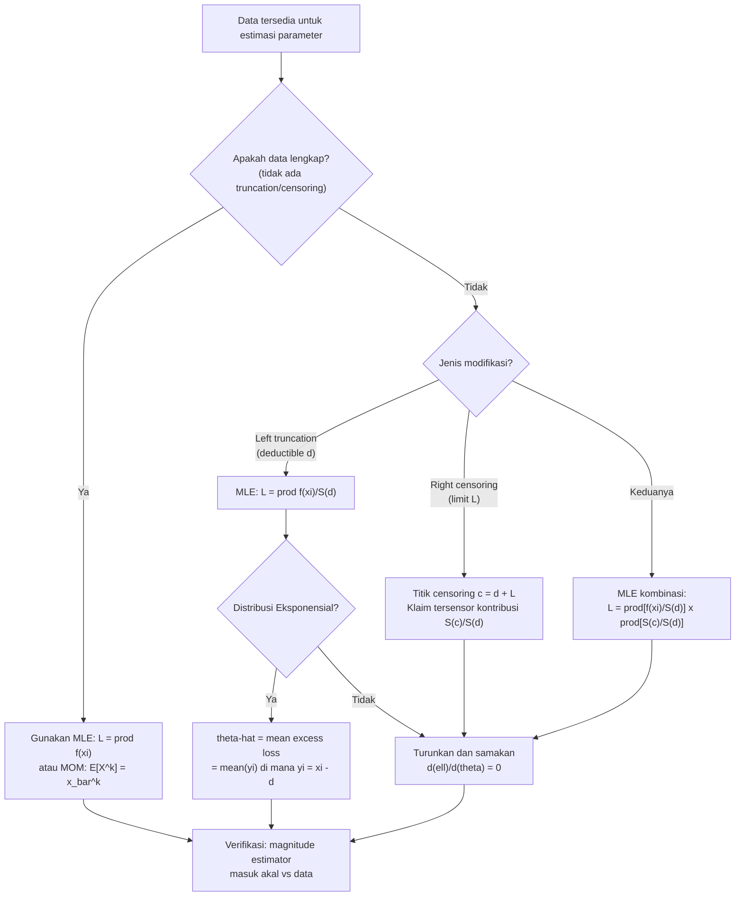

# 📊 6.1 — Parameter Estimation Methods

> [!ABSTRACT] Ringkasan Cepat
> **Topik:** Parameter Estimation Methods | **Bobot:** ~20–25% | **Difficulty:** Calculation-Intensive
> **Ref:** Klugman et al. (2019), Loss Models 5th ed., Bab 10 & 11 | **Prereq:** [[1.1 Moment and Probability Generating Functions]], [[1.4 Tail Characteristics]]


## Section 0 — Pemetaan Topik

| Topik TA2 | Sub-topik ID | Skill Diuji | Bobot | Difficulty | Prerequisite | Connected Topics | Referensi |
|---|---|---|---|---|---|---|---|
| Pembentukan dan Pemilihan Model Parametrik | 6.1 | Estimasi parameter distribusi kerugian dan frekuensi menggunakan MOM, percentile matching, dan MLE — termasuk data lengkap dan termodifikasi (truncated/censored) | 20–25% | Calculation-Intensive | [[1.1 Moment and Probability Generating Functions]], [[1.4 Tail Characteristics]] | [[6.2 MSE Confidence Intervals and Delta Method]], [[6.3 Bayesian Parameter Estimation]], [[6.4 Model Diagnostics and Selection]] | Klugman et al. (2019), Bab 10 & 11 |


## Section 1 — Intuisi

Bayangkan perusahaan asuransi jiwa yang ingin menetapkan premi untuk produk asuransi kendaraan bermotor. Data klaim yang dimiliki mencakup ratusan insiden selama 3 tahun terakhir: ada klaim Rp 2 juta untuk lecetan kecil, ada klaim Rp 150 juta untuk kecelakaan serius. Sebelum menetapkan premi yang wajar, aktuaris harus terlebih dulu menjawab satu pertanyaan fundamental: *distribusi probabilitas mana yang paling cocok menggambarkan pola klaim ini, dan berapa nilai parameternya?*

Inilah inti dari estimasi parameter. Kita sudah memiliki "kandidat" distribusi — misalnya distribusi Eksponensial, Gamma, atau Pareto — namun parameter-parameternya belum diketahui. Metode estimasi adalah alat untuk "mengkalibrasi" distribusi tersebut agar sesuai dengan data observasi. Tiga metode utama yang diujikan adalah: **Method of Moments (MOM)** yang menyamakan momen teoritis dengan momen sampel, **Percentile Matching** yang menyamakan kuantil teoritis dengan kuantil empiris, dan **Maximum Likelihood Estimation (MLE)** yang memilih parameter yang paling "masuk akal" mengingat data yang diamati.

Kerumitan bertambah karena data dunia nyata jarang bersih dan lengkap. Data klaim asuransi sering kali *terpotong* (hanya klaim di atas deductible tertentu yang dilaporkan) atau *tersensor* (klaim dengan limit polis tidak diketahui nilai sesungguhnya). Aktuaris harus memodifikasi metode estimasi untuk mengakomodasi ketidaklengkapan data ini — inilah yang membuat topik ini bernilai bobot tinggi di ujian TA2.


## Section 2 — Definisi Formal

> [!NOTE] Definisi Matematis
> Diberikan sampel observasi $x_1, x_2, \ldots, x_n$ dari distribusi dengan fungsi kepadatan $f(x;\boldsymbol{\theta})$ dan fungsi distribusi $F(x;\boldsymbol{\theta})$, di mana $\boldsymbol{\theta} = (\theta_1, \theta_2, \ldots, \theta_k)$ adalah vektor parameter yang tidak diketahui. Tujuan estimasi parameter adalah menentukan $\hat{\boldsymbol{\theta}}$ yang paling sesuai dengan data observasi.

| Simbol | Makna | Catatan |
|---|---|---|
| $\hat{\theta}$ | Estimator parameter | Nilai yang diperoleh dari data sampel |
| $\mu'_k = E[X^k]$ | Momen ke-$k$ teoritis (raw moment) | Fungsi dari parameter $\boldsymbol{\theta}$ |
| $\hat{\mu}'_k = \frac{1}{n}\sum_{i=1}^n x_i^k$ | Momen ke-$k$ sampel | Dihitung langsung dari data |
| $\pi_p$ | Persentil ke-$p$ teoritis: $F(\pi_p) = p$ | Fungsi dari parameter $\boldsymbol{\theta}$ |
| $\hat{\pi}_p$ | Persentil ke-$p$ empiris dari sampel | Estimasi dari data observasi |
| $L(\boldsymbol{\theta})$ | Likelihood function | Probabilitas bersama mengamati data yang ada |
| $\ell(\boldsymbol{\theta})$ | Log-likelihood function: $\ln L(\boldsymbol{\theta})$ | Lebih mudah dimaksimalkan |
| $u$ | Titik truncation bawah (*ordinary deductible*) | Data di bawah $u$ tidak diamati |
| $v$ | Titik censoring atas (*policy limit*) | Nilai aktual di atas $v$ tidak diketahui |

### Rumus Utama

**[MOM] Method of Moments — Persamaan momen ke-$k$:**

$$
E[X^k;\hat{\boldsymbol{\theta}}] = \frac{1}{n}\sum_{i=1}^n x_i^k, \quad k = 1, 2, \ldots, p
$$

*Label: Untuk $p$ parameter, selesaikan sistem $p$ persamaan simultan dengan menyamakan $p$ momen pertama.*

**[PM] Percentile Matching — Persamaan persentil ke-$p$:**

$$
F(\hat{\pi}_{p_j}; \hat{\boldsymbol{\theta}}) = p_j, \quad j = 1, 2, \ldots, q
$$

*Label: Untuk $q$ parameter, pilih $q$ persentil empiris dan samakan dengan CDF teoritis pada titik-titik tersebut.*

**[MLE] Maximum Likelihood — Likelihood untuk data lengkap i.i.d.:**

$$
L(\boldsymbol{\theta}) = \prod_{i=1}^n f(x_i; \boldsymbol{\theta}), \qquad \ell(\boldsymbol{\theta}) = \sum_{i=1}^n \ln f(x_i; \boldsymbol{\theta})
$$

*Label: Maksimalkan $\ell(\boldsymbol{\theta})$ terhadap $\boldsymbol{\theta}$; syarat perlu: $\frac{\partial \ell}{\partial \theta_j} = 0$ untuk semua $j$.*

**[MLE-Truncated] MLE untuk data left-truncated di titik $u$ (only data $x > u$ dilaporkan):**

$$
L(\boldsymbol{\theta}) = \prod_{i=1}^n \frac{f(x_i; \boldsymbol{\theta})}{1 - F(u; \boldsymbol{\theta})}
$$

*Label: Denominator mengkondisikan bahwa observasi sudah diketahui melampaui titik truncation $u$.*

**[MLE-Censored] MLE untuk data right-censored di titik $v$ (nilai aktual $> v$ hanya diketahui sebagai "$\geq v$"):**

$$
L(\boldsymbol{\theta}) = \prod_{i: x_i < v} f(x_i; \boldsymbol{\theta}) \cdot \prod_{i: x_i = v} [1 - F(v; \boldsymbol{\theta})]
$$

*Label: Observasi yang tersensor berkontribusi survival probability $S(v)$, bukan density.*

**[MLE-Combined] MLE untuk data left-truncated di $u$ DAN right-censored di $v$:**

$$
L(\boldsymbol{\theta}) = \prod_{i: x_i < v} \frac{f(x_i;\boldsymbol{\theta})}{1-F(u;\boldsymbol{\theta})} \cdot \prod_{i: x_i = v} \frac{1-F(v;\boldsymbol{\theta})}{1-F(u;\boldsymbol{\theta})}
$$

*Label: Kombinasi paling umum dalam asuransi kerugian: deductible $u$ (truncation) dan limit $v$ (censoring).*

### Asumsi Eksplisit

1. **Independensi:** Semua observasi $x_1, \ldots, x_n$ adalah independen satu sama lain.
2. **Identically Distributed (i.i.d.):** Semua observasi berasal dari distribusi yang sama $F(x;\boldsymbol{\theta})$.
3. **Model yang benar (well-specified):** Distribusi yang dipilih adalah model yang "benar" — estimator bersifat konsisten hanya jika asumsi ini terpenuhi.
4. **Mekanisme truncation/censoring diketahui:** Titik $u$ (deductible) dan $v$ (limit) diketahui deterministik untuk setiap observasi.
5. **MLE:** Log-likelihood bersifat differentiable dan concave (atau setidaknya ada maximum global yang dapat dicari secara analitik atau numerik).


## Section 3 — Jembatan Logika

> [!TIP] Dari Definisi ke Rumus — Mengapa Tiga Metode Berbeda?
> Ketiga metode pada dasarnya memiliki filosofi yang berbeda. MOM berkata: "distribusi yang benar harus memiliki momen yang sama dengan data." Percentile Matching berkata: "distribusi yang benar harus memiliki kuantil yang sama dengan data." MLE berkata: "distribusi yang benar adalah yang membuat data yang sudah kita amati paling 'mungkin' terjadi." MLE umumnya dianggap unggul karena menggunakan seluruh informasi dalam data (Fisher Information), bukan hanya ringkasan statistik.

> [!IMPORTANT] Truncation vs Censoring — Perbedaan Krusial
> **Left truncation** terjadi ketika observasi di bawah nilai $u$ sama sekali *tidak ada dalam dataset* — kita bahkan tidak tahu berapa banyak klaim yang jatuh di bawah deductible. Sebaliknya, **right censoring** terjadi ketika kita tahu bahwa suatu klaim *ada*, tetapi nilainya hanya diketahui melebihi batas tertentu $v$. Kesalahan mengidentifikasi ini adalah jebakan paling umum di ujian.

**Derivasi MLE untuk Data Left-Truncated (step-by-step):**

Misalkan $X$ adalah besar klaim aktual, tetapi hanya klaim dengan $X > u$ yang dilaporkan (ordinary deductible $u$). Jika kita mengamati $x_i > u$, kita sebenarnya mengamati nilai *bersyarat* dari distribusi ground-up.

**Langkah 1:** Tentukan PDF bersyarat untuk $X$ given $X > u$:

$$
f(x \mid X > u) = \frac{f(x;\boldsymbol{\theta})}{P(X > u)} = \frac{f(x;\boldsymbol{\theta})}{1 - F(u;\boldsymbol{\theta})}
$$

**Langkah 2:** Likelihood untuk seluruh sampel adalah produk PDF bersyarat ini:

$$
L(\boldsymbol{\theta}) = \prod_{i=1}^n f(x_i \mid X > u) = \prod_{i=1}^n \frac{f(x_i;\boldsymbol{\theta})}{1 - F(u;\boldsymbol{\theta})}
$$

**Langkah 3:** Ambil log:

$$
\ell(\boldsymbol{\theta}) = \sum_{i=1}^n \ln f(x_i;\boldsymbol{\theta}) - n \ln[1 - F(u;\boldsymbol{\theta})]
$$

**Langkah 4:** Maksimalkan dengan menurunkan terhadap setiap $\theta_j$ dan menyamakan dengan nol.

**Derivasi MLE Eksponensial — Data Lengkap (contoh analitik):**

Untuk distribusi Eksponensial $f(x;\theta) = \frac{1}{\theta}e^{-x/\theta}$:

$$
\ell(\theta) = \sum_{i=1}^n \left[-\ln\theta - \frac{x_i}{\theta}\right] = -n\ln\theta - \frac{n\bar{x}}{\theta}
$$

$$
\frac{d\ell}{d\theta} = -\frac{n}{\theta} + \frac{n\bar{x}}{\theta^2} = 0 \implies \hat{\theta}_{MLE} = \bar{x}
$$

Untuk distribusi Eksponensial, MLE $=$ MOM (keduanya menghasilkan $\hat{\theta} = \bar{x}$).

> [!DANGER] Dilarang
> 1. **Jangan** menggunakan likelihood penuh $\prod f(x_i)$ saat data di-truncate — ini mengabaikan bahwa hanya klaim $> u$ yang bisa diamati, menghasilkan bias ke bawah pada parameter skala.
> 2. **Jangan** memasukkan observasi yang tersensor sebagai $f(v)$ — observasi tersensor berkontribusi $S(v)$, bukan $f(v)$, karena nilai aktual di atas $v$ tidak diketahui.
> 3. **Jangan** menyamakan lebih banyak momen dari jumlah parameter dalam MOM (sistem overdetermined tidak memiliki solusi unik secara aljabar).


## Section 4 — Contoh Soal

### Soal A — Fundamental

Sebuah portofolio klaim memiliki 5 observasi: 2, 4, 6, 8, 10 (dalam jutaan rupiah). Asumsikan distribusi Eksponensial dengan parameter $\theta$. Estimasi $\theta$ menggunakan (a) MOM dan (b) MLE.

> [!SUCCESS] Solusi Soal A
> **Pendekatan:** MOM menyamakan $E[X] = \theta$ dengan mean sampel; MLE untuk Eksponensial menghasilkan hasil identik.
>
> **1. Identifikasi Variabel**
> - Observasi: $x_1=2, x_2=4, x_3=6, x_4=8, x_5=10$ (semua dalam jutaan Rp)
> - $n = 5$, distribusi: Eksponensial($\theta$), $E[X] = \theta$
>
> **2. Identifikasi Distribusi / Model**
> Eksponensial: $f(x;\theta) = \frac{1}{\theta}e^{-x/\theta}$, $x > 0$. Satu parameter, sehingga satu persamaan sudah cukup.
>
> **3. Setup Persamaan**
>
> **MOM:** Samakan momen pertama teoritis dengan momen sampel:
>
> $$
> E[X] = \theta = \bar{x} = \frac{1}{n}\sum_{i=1}^n x_i
> $$
>
> **MLE:** Log-likelihood:
>
> $$
> \ell(\theta) = -n\ln\theta - \frac{\sum x_i}{\theta}
> $$
>
> **4. Eksekusi Aljabar**
>
> **MOM:**
>
> $$
> \hat{\theta}_{MOM} = \bar{x} = \frac{2+4+6+8+10}{5} = \frac{30}{5} = 6
> $$
>
> **MLE:** $\frac{d\ell}{d\theta} = -\frac{n}{\theta} + \frac{\sum x_i}{\theta^2} = 0 \implies \hat{\theta}_{MLE} = \frac{\sum x_i}{n} = \frac{30}{5} = 6$
>
> **5. Verification**
> Kedua metode menghasilkan $\hat{\theta} = 6$. Ini konsisten dengan properti umum Eksponensial: MLE dan MOM bersifat ekuivalen karena sufficient statistic-nya adalah $\bar{x}$.
>
> **Hasil:** $\hat{\theta} = 6$ juta rupiah.

> [!WARNING] Exam Tips — Soal A
> **Target waktu:** 2 menit. **Common trap:** Menggunakan $E[X^2]$ padahal hanya ada 1 parameter. **Shortcut:** Untuk Eksponensial, langsung $\hat{\theta} = \bar{x}$ tanpa derivasi panjang.

---

### Soal B — Exam-Typical

Data klaim berikut dikumpulkan dari polis dengan *ordinary deductible* $d = 500$. Hanya klaim yang melebihi deductible yang dilaporkan, dengan nilai klaim *di atas* deductible (excess loss): 100, 300, 500, 800, 1200. Asumsikan distribusi Eksponensial untuk besar klaim ground-up $X$ dengan parameter $\theta$. Estimasi $\theta$ menggunakan MLE.

> [!SUCCESS] Solusi Soal B
> **Pendekatan:** Data di-left-truncate di $u = 500$. Gunakan likelihood bersyarat $f(x\mid X>500)$ untuk setiap observasi. Perhatikan bahwa nilai yang diberikan adalah *excess loss* $y = x - 500$, sehingga nilai ground-up $x = y + 500$.
>
> **1. Identifikasi Variabel**
> - Excess loss yang dilaporkan: 100, 300, 500, 800, 1200
> - Nilai ground-up: $x_i = 600, 800, 1000, 1300, 1700$
> - Titik truncation: $u = 500$
> - Distribusi: Eksponensial($\theta$), $n = 5$
>
> **2. Identifikasi Distribusi / Model**
> Untuk Eksponensial: $f(x;\theta) = \frac{1}{\theta}e^{-x/\theta}$, $S(u;\theta) = e^{-u/\theta}$.
> Karena Eksponensial bersifat *memoryless*, PDF bersyarat untuk $Y = X - u \mid X > u$ juga Eksponensial($\theta$) — properti luar biasa yang menyederhanakan kalkulasi!
>
> **3. Setup Persamaan**
>
> $$
> \ell(\theta) = \sum_{i=1}^n \ln\frac{f(x_i;\theta)}{S(u;\theta)} = \sum_{i=1}^n \left[-\ln\theta - \frac{x_i}{\theta} + \frac{u}{\theta}\right]
> $$
>
> $$
> \ell(\theta) = -n\ln\theta - \frac{\sum x_i - nu}{\theta}
> $$
>
> **4. Eksekusi Aljabar**
>
> $$
> \frac{d\ell}{d\theta} = -\frac{n}{\theta} + \frac{\sum x_i - nu}{\theta^2} = 0
> $$
>
> $$
> \hat{\theta}_{MLE} = \frac{\sum x_i - nu}{n} = \frac{\sum y_i}{n} = \bar{y}
> $$
>
> di mana $y_i = x_i - u$ adalah excess loss. Hitung:
>
> $$
> \bar{y} = \frac{100 + 300 + 500 + 800 + 1200}{5} = \frac{2900}{5} = 580
> $$
>
> **5. Verification**
> Properti memoryless Eksponensial memang mengimplikasikan bahwa $\hat{\theta}_{MLE}$ sama dengan mean dari excess loss — konsisten secara teoritis. Nilai $\hat{\theta} = 580 > d = 500$, masuk akal karena nilai klaim rata-rata harus melebihi deductible.
>
> **Hasil:** $\hat{\theta}_{MLE} = 580$.

> [!WARNING] Exam Tips — Soal B
> **Target waktu:** 4 menit. **Common trap:** Menggunakan nilai ground-up dalam $\sum y_i$ atau lupa mengkonversi excess loss ke ground-up sebelum menghitung likelihood penuh. **Shortcut:** Untuk Eksponensial dengan left-truncation, $\hat{\theta} = \bar{y}$ (mean excess loss) selalu berlaku karena memoryless property.

---

### Soal C — Challenging

Data klaim berikut dikumpulkan dari polis dengan *ordinary deductible* $d = 200$ dan *policy limit* $u = 1000$ (sehingga klaim maksimum yang dibayar adalah 800). Dari 8 klaim yang diproses:
- 5 klaim memiliki nilai ground-up: 300, 450, 600, 750, 900 (dibayar penuh, klaim setelah dikurangi deductible)
- 3 klaim mencapai limit: nilai ground-up tidak diketahui, hanya diketahui $\geq 1200$

Asumsikan distribusi Eksponensial($\theta$) untuk besar klaim ground-up. Estimasi $\theta$ menggunakan MLE.

> [!SUCCESS] Solusi Soal C
> **Pendekatan:** Data left-truncated di $d = 200$ DAN right-censored di $c = 1200$ (nilai ground-up di mana limit polis tercapai: $d + \text{limit} = 200 + 1000 = 1200$). Gunakan likelihood kombinasi.
>
> **1. Identifikasi Variabel**
> - Klaim tidak-tersensor (ground-up): $x_1=300, x_2=450, x_3=600, x_4=750, x_5=900$ ($n_1=5$)
> - Klaim tersensor: ground-up $\geq c = 1200$ ($n_2=3$)
> - Titik truncation: $d = 200$
> - Titik censoring: $c = 1200$
> - Total observasi: $n = 8$
>
> **2. Identifikasi Distribusi / Model**
> Eksponensial($\theta$): $f(x) = \frac{1}{\theta}e^{-x/\theta}$, $S(x) = e^{-x/\theta}$.
> Titik censoring di ground-up level: $c = d + \text{policy limit} = 200 + 1000 = 1200$.
>
> **3. Setup Persamaan**
>
> Likelihood kombinasi left-truncated & right-censored:
>
> $$
> L(\theta) = \prod_{i=1}^{5} \frac{f(x_i;\theta)}{S(d;\theta)} \cdot \prod_{j=1}^{3} \frac{S(c;\theta)}{S(d;\theta)}
> $$
>
> Log-likelihood:
>
> $$
> \ell(\theta) = \sum_{i=1}^{5}\left[-\ln\theta - \frac{x_i}{\theta} + \frac{d}{\theta}\right] + 3\left[-\frac{c}{\theta} + \frac{d}{\theta}\right]
> $$
>
> $$
> \ell(\theta) = -5\ln\theta - \frac{1}{\theta}\left[\sum_{i=1}^{5}x_i - 5d + 3(c - d)\right]
> $$
>
> **4. Eksekusi Aljabar**
>
> Hitung masing-masing komponen:
>
> $$
> \sum_{i=1}^5 x_i = 300+450+600+750+900 = 3000
> $$
>
> $$
> \sum_{i=1}^5 x_i - 5d = 3000 - 5(200) = 3000 - 1000 = 2000
> $$
>
> $$
> 3(c-d) = 3(1200-200) = 3(1000) = 3000
> $$
>
> $$
> \ell(\theta) = -5\ln\theta - \frac{2000 + 3000}{\theta} = -5\ln\theta - \frac{5000}{\theta}
> $$
>
> Syarat perlu MLE:
>
> $$
> \frac{d\ell}{d\theta} = -\frac{5}{\theta} + \frac{5000}{\theta^2} = 0 \implies \hat{\theta}_{MLE} = \frac{5000}{5} = 1000
> $$
>
> **5. Verification**
> Interpretasi: $\hat{\theta} = 1000$ berarti rata-rata klaim ground-up diestimasi sebesar Rp 1.000 (dalam satuan yang sama). Nilai ini masuk akal: klaim tersensor di $c=1200$ menarik estimasi lebih tinggi dibanding jika hanya menggunakan 5 klaim yang teramati (yang rata-ratanya 600). Cek: $n_1/(n_1+n_2) = 5/8$ klaim tidak tersensor adalah proporsi yang wajar untuk memberikan estimasi di angka ini.
>
> **Hasil:** $\hat{\theta}_{MLE} = 1000$.

> [!WARNING] Exam Tips — Soal C
> **Target waktu:** 6 menit. **Common trap terbesar:** Mengira titik censoring ground-up adalah 1000 (nilai limit) bukan 1200 (deductible + limit). Titik censoring adalah nilai *ground-up* di mana polis berhenti membayar, yaitu $c = d + \text{limit}$. **Common trap kedua:** Menghitung $\sum x_i$ menggunakan nilai excess loss, bukan nilai ground-up. **Shortcut:** Rumus umum: $\hat{\theta} = \frac{\sum_{i \text{ uncensored}}(x_i - d) + n_2(c-d)}{n_1}$ untuk Eksponensial.


## Section 5 — Verifikasi & Sanity Check

> [!CHECK] Verifikasi MOM vs MLE untuk Distribusi Eksponensial
> Untuk data lengkap i.i.d., MOM dan MLE selalu menghasilkan estimator yang **identik** untuk distribusi Eksponensial: $\hat{\theta} = \bar{x}$. Jika jawaban MOM ≠ MLE untuk distribusi ini, ada kesalahan di salah satu metode.

> [!CHECK] Cek Magnitude Estimator Terhadap Data
> $\hat{\theta}$ yang diestimasi dari distribusi Eksponensial harus berada dalam rentang yang masuk akal dibandingkan data:
> - Untuk data lengkap: $\hat{\theta} = \bar{x}$, selalu dalam rentang $[\min(x_i), \max(x_i)]$ dari perspektif "weighted average".
> - Untuk data left-truncated: $\hat{\theta}$ harus lebih besar dari mean excess loss ($\hat{\theta} \geq \bar{y}$). Jika $\hat{\theta} < \bar{y}$, ada kesalahan.
> - Untuk data dengan censoring: estimator akan lebih besar dibanding jika klaim tersensor diabaikan, karena censoring "menarik" estimator ke atas.

### Metode Alternatif

Untuk distribusi Pareto dengan dua parameter $\alpha$ dan $\theta$, sistem MOM menggunakan:

$$
E[X] = \frac{\theta}{\alpha-1}, \quad E[X^2] = \frac{2\theta^2}{(\alpha-1)(\alpha-2)}
$$

Sehingga $E[X^2]/(E[X])^2 = \frac{2(\alpha-1)}{\alpha-2}$ — satu persamaan dengan satu unknown $\alpha$ yang dapat diselesaikan terlebih dahulu, kemudian $\hat{\theta}$ dari persamaan pertama. Urutan penyelesaian ini (*solve $\alpha$ first*) adalah shortcut penting.


## Section 6 — Visualisasi Mental

**Gambaran Konseptual: Tiga Metode Estimasi**

Bayangkan tiga orang yang melihat sekumpulan titik data di grafik dan diminta "pasangkan" kurva distribusi ke titik-titik itu:

- **MOM** berkata: "Hitung rata-rata dan variansi data. Cari parameter yang membuat distribusi memiliki rata-rata dan variansi yang sama."
  - Kekuatan: Mudah dihitung, sering punya solusi analitik.
  - Kelemahan: Hanya menggunakan sebagian informasi; sensitif terhadap outlier pada momen tinggi.

- **Percentile Matching** berkata: "Lihat di mana 25th dan 75th persentil data jatuh. Cari parameter yang membuat distribusi memiliki persentil yang sama persis."
  - Kekuatan: Lebih robust terhadap outlier; berguna untuk distribusi ekor berat.
  - Kelemahan: Sensitif terhadap pilihan persentil; mengabaikan informasi di luar persentil yang dipilih.

- **MLE** berkata: "Evaluasi seberapa 'mungkin' setiap titik data muncul di bawah setiap kandidat distribusi. Pilih distribusi yang membuat seluruh dataset paling mungkin."
  - Kekuatan: Secara asimtotik paling efisien (minimum variance); konsisten; menangani data termodifikasi secara alami.
  - Kelemahan: Lebih sulit dihitung; bisa menghasilkan estimasi yang buruk untuk sampel kecil.

**Visualisasi Truncation vs Censoring:**

```
Ground-up loss distribution:
                    ████████████████████████████
                    ██ Tidak diamati ██████████████ Diamati ██
     ─────────────────────────────────────────────────────────→ x
     0               d                          +∞
                LEFT TRUNCATION (deductible d)

Data tersensor (censored):
     ─────────────────────────────────────────────────────────→ x
     0               d                c         +∞
                                      ↑
                              Semua klaim ≥ c dilaporkan sebagai "= c"
                              RIGHT CENSORING (policy limit: c - d)
```

### Hubungan Visual ↔ Rumus

| Elemen Visual | Komponen dalam Likelihood |
|---|---|
| Area kurva kiri dari $d$ (tidak teramati) | Denominator $S(d;\theta) = 1 - F(d;\theta)$ dalam likelihood |
| Titik data yang teramati antara $d$ dan $c$ | Numerator $f(x_i;\theta)$ — kontribusi density |
| Titik-titik yang "terpotong" di $c$ | Faktor $S(c;\theta)$ — survival probability di titik censoring |


## Section 7 — Jebakan Umum

> [!BUG] Kesalahan Parametrisasi: Truncation vs Excess Loss
> Soal sering memberikan nilai *excess loss* $y_i = x_i - d$ (jumlah yang dibayar di atas deductible), bukan nilai ground-up $x_i$.
> - **Salah:** Langsung menggunakan $y_i$ dalam $\sum x_i$ untuk likelihood ground-up.
> - **Benar:** Konversi dulu: $x_i = y_i + d$, kemudian gunakan $x_i$ dalam likelihood.
> - Atau, gunakan properti memoryless Eksponensial: $\hat{\theta} = \bar{y}$ secara langsung.

> [!BUG] Kesalahan Konseptual — 4 Miskonsepsi Umum
> 1. **"Truncation dan censoring sama saja"** — Salah. Truncated: observasi tidak ada dalam dataset sama sekali. Censored: observasi ada, tapi nilainya hanya sebagian diketahui.
> 2. **"Untuk MLE data left-truncated, cukup ganti lower bound integral"** — Tidak tepat. Harus dibagi $S(d)$ untuk membentuk distribusi bersyarat yang valid (total probability = 1).
> 3. **"MOM selalu lebih mudah dari MLE"** — Tidak selalu. Untuk distribusi dua parameter seperti Gamma, MOM juga menghasilkan sistem non-linear yang sulit.
> 4. **"Titik censoring ground-up adalah nilai policy limit"** — Salah. Titik censoring ground-up = deductible + policy limit = $d + L$. Ini jebakan paling sering di ujian!

> [!BUG] Kesalahan Interpretasi Soal
> - "Losses that exceed the deductible" → data sudah di-left-truncate, gunakan likelihood bersyarat.
> - "Claims are limited to X" → data di-right-censor di nilai ground-up = $d + X$ (bukan $X$).
> - "Ground-up losses" → nilai sebelum deductible dikurangi; jangan bingung dengan "excess loss."
> - "Per-payment" vs "per-loss" basis → beda dalam cara menghitung frekuensi, namun untuk estimasi parameter severity, yang relevan adalah distribusi bersyarat per-payment (given loss exceeds deductible).

> [!CAUTION] Red Flags — Keyword Pemicu Prosedur Khusus
> - Kata **"deductible"** → selalu periksa: truncation atau censoring? Biasanya left truncation.
> - Kata **"limit"** atau **"maximum covered loss"** → right censoring; hitung titik censoring ground-up = $d + \text{limit}$.
> - Kata **"excess loss"** atau **"payment"** → nilai yang diberikan adalah $y = x - d$; konversi ke ground-up.
> - Kata **"reported claims only"** → konfirmasi left truncation.
> - **Dua parameter dengan satu persamaan** → sistem underdetermined; pilih persentil kedua atau momen kedua.


## Section 8 — Ringkasan Eksekutif

> [!SUMMARY] Must-Remember
>
> **1. MOM:** Samakan $k$ momen teoritis dengan momen sampel untuk $k$ parameter:
>
> $$
> E[X^k;\hat{\boldsymbol{\theta}}] = \frac{1}{n}\sum x_i^k
> $$
>
> **2. MLE — Data Lengkap:**
>
> $$
> \ell(\boldsymbol{\theta}) = \sum_{i=1}^n \ln f(x_i;\boldsymbol{\theta}), \quad \text{maksimalkan terhadap } \boldsymbol{\theta}
> $$
>
> **3. MLE — Left Truncated di $d$:**
>
> $$
> \ell(\boldsymbol{\theta}) = \sum_{i=1}^n \ln f(x_i;\boldsymbol{\theta}) - n\ln[1-F(d;\boldsymbol{\theta})]
> $$
>
> **4. MLE — Right Censored di $c$ (ada $n_2$ observasi tersensor):**
>
> $$
> \ell(\boldsymbol{\theta}) = \sum_{i=1}^{n_1}\ln f(x_i;\boldsymbol{\theta}) + n_2\ln S(c;\boldsymbol{\theta})
> $$
>
> **5. Titik censoring ground-up:** $c = d + \text{policy limit}$ (bukan policy limit itu sendiri).

### Kapan Digunakan

- **MOM:** Ketika butuh estimator cepat; distribusi sederhana (1–2 parameter); tidak ada data termodifikasi.
- **Percentile Matching:** Ketika data memiliki outlier ekstrim (momen tidak stabil); atau ketika informasi di ekor distribusi sangat penting.
- **MLE:** Selalu menjadi metode utama di ujian TA2; digunakan untuk data lengkap maupun termodifikasi (truncated/censored); basis untuk interval kepercayaan dan uji hipotesis (Topik 6.2–6.3).

### Kapan TIDAK Boleh Digunakan

- **MOM dengan momen tinggi ($k \geq 3$)** pada distribusi ekor berat (Pareto, Lognormal) — momen mungkin tidak ada atau sangat tidak stabil secara empiris.
- **MLE analitik** ketika log-likelihood tidak memiliki bentuk tertutup (gunakan metode numerik).
- **Likelihood tanpa modifikasi** ($\prod f(x_i)$) ketika ada truncation atau censoring — ini adalah kesalahan fatal.

### Quick Decision Tree



---

> [!QUOTE] Follow-up Options
> 1. *"Berikan contoh soal variasi MLE untuk distribusi Pareto dengan data termodifikasi"*
> 2. *"Jelaskan hubungan [[6.1 Parameter Estimation Methods]] dengan [[6.2 MSE Confidence Intervals and Delta Method]]"*
> 3. *"Buat flashcard 1-halaman untuk rumus MLE data termodifikasi"*

*📖 Ref: Klugman, Panjer & Willmot (2019), Loss Models 5th ed., Bab 10 & 11 | 🗓️ 2026-04-17 | #TA2 #ParameterEstimation #MLE*
