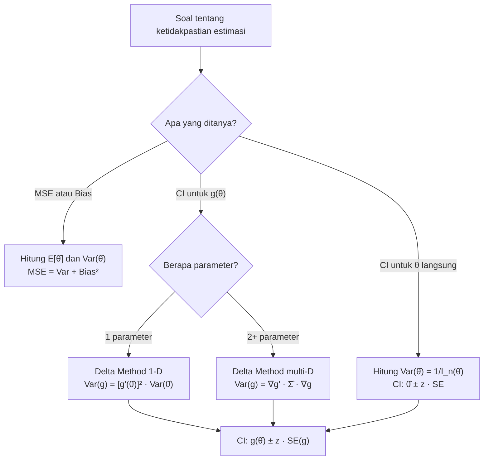

# 📊 6.2 — MSE Confidence Intervals and Delta Method

> [!ABSTRACT] Ringkasan Cepat
> **Topik:** MSE, Selang Kepercayaan Parameter, dan Metode Delta | **Bobot:** ~20–25% | **Difficulty:** Hard
> **Ref:** Klugman et al. (2019) Loss Models 5th ed., Bab 10 & 11 | **Prereq:** [[6.1 Parameter Estimation Methods]]

---

## Section 0 — Pemetaan Topik

| Topik TA2 | Sub-topik ID | Skill Diuji | Bobot | Difficulty | Prerequisite | Connected Topics | Referensi |
|---|---|---|---|---|---|---|---|
| Pembentukan dan Pemilihan Model Parametrik | 6.2 | Hitung MSE estimator; bangun CI parameter; terapkan Delta Method untuk variansi MLE fungsi parameter | 20–25% | Hard | [[6.1 Parameter Estimation Methods]] | [[6.3 Bayesian Parameter Estimation]], [[6.4 Model Diagnostics and Selection]], [[8.3 Permutation Test and Bootstrap]] | Klugman et al. (2019) Bab 10, 11 |

---

## Section 1 — Intuisi

Bayangkan seorang aktuaris di perusahaan asuransi umum diminta mengestimasi rata-rata klaim kendaraan bermotor berdasarkan 200 data historis. Ia mendapatkan suatu angka — misalkan Rp 8,5 juta — tetapi pertanyaan pentingnya bukan hanya "berapa estimasinya?", melainkan "seberapa jauh estimasi ini bisa meleset dari nilai sejati?" Inilah esensi dari *Mean Squared Error* (MSE): ukuran gabungan antara seberapa besar variasi estimator (variansi) dan seberapa sistematis ia meleset ke satu arah (bias kuadrat). Estimator yang baik bukan hanya yang kecil biasnya, tetapi yang keseluruhan MSE-nya rendah.

Satu langkah lebih lanjut: aktuaris tersebut tidak hanya ingin tahu satu angka, melainkan sebuah *interval* yang dengan tingkat keyakinan tertentu — misalkan 95% — berisi nilai parameter sejati. Di sinilah *selang kepercayaan* (confidence interval) berperan. Untuk MLE, distribusi asimtotik estimator sudah diketahui melalui teori Fisher Information, sehingga kita bisa membangun CI dengan presisi tinggi.

Namun tantangan muncul ketika yang ingin kita estimasi bukan parameter $\theta$ langsung, melainkan suatu *fungsi* dari parameter tersebut — misalnya probabilitas ruin, atau nilai rata-rata distribusi Pareto $\mu = \theta/(\alpha-1)$. Di sinilah **Metode Delta** menjadi penyelamat: ia menggunakan pendekatan linear (ekspansi Taylor orde pertama) untuk mentransfer informasi variansi dari $\hat{\theta}$ ke variansi $g(\hat{\theta})$, sehingga kita tetap bisa membangun CI untuk fungsi parameter yang kompleks sekalipun.

---

## Section 2 — Definisi Formal

> [!NOTE] Definisi Matematis
>
> Untuk estimator $\hat{\theta}$ dari parameter $\theta$, **Mean Squared Error** didefinisikan sebagai:
>
> $$
> \text{MSE}(\hat{\theta}) = E\left[(\hat{\theta} - \theta)^2\right] = \text{Var}(\hat{\theta}) + \left[\text{Bias}(\hat{\theta})\right]^2
> $$
>
> dimana $\text{Bias}(\hat{\theta}) = E[\hat{\theta}] - \theta$.

| Simbol | Makna | Catatan |
|---|---|---|
| $\hat{\theta}$ | Estimator parameter $\theta$ | Fungsi dari sampel; bernilai acak |
| $\theta$ | Parameter sejati | Konstan, tidak diketahui |
| $\text{MSE}(\hat{\theta})$ | Mean Squared Error estimator | Dekomposisi: Var + Bias² |
| $\text{Bias}(\hat{\theta})$ | Bias estimator | $= E[\hat{\theta}] - \theta$; nol untuk estimator tak bias |
| $\mathcal{I}(\theta)$ | Fisher Information (skalar) | $= -E\left[\frac{\partial^2}{\partial\theta^2}\ln L(\theta)\right]$ |
| $\mathcal{I}_n(\theta)$ | Fisher Information untuk $n$ observasi | $= n \cdot \mathcal{I}(\theta)$ untuk i.i.d. |
| $g(\theta)$ | Fungsi diferensiabel dari parameter | Target estimasi dalam Delta Method |
| $g'(\theta)$ | Turunan pertama $g$ terhadap $\theta$ | Dievaluasi di $\hat{\theta}$ untuk estimasi variansi |
| $z_{\alpha/2}$ | Kuantil distribusi Normal standar | $z_{0.025} = 1.96$ untuk CI 95% |

### Rumus Utama

**1. Dekomposisi MSE:**

$$
\text{MSE}(\hat{\theta}) = \text{Var}(\hat{\theta}) + \left[E(\hat{\theta}) - \theta\right]^2
$$

*Label: MSE = variance + squared bias. Untuk estimator tak bias, MSE = Var.*

**2. Cramér-Rao Lower Bound (CRLB):**

$$
\text{Var}(\hat{\theta}) \geq \frac{1}{\mathcal{I}_n(\theta)} = \frac{1}{n\,\mathcal{I}(\theta)}
$$

*Label: Variansi estimator tak bias tidak bisa lebih kecil dari inversi Fisher Information.*

**3. Variansi asimtotik MLE (satu parameter):**

$$
\widehat{\text{Var}}(\hat{\theta}) = \frac{1}{\mathcal{I}_n(\hat{\theta})} = \left[-\frac{\partial^2}{\partial\theta^2}\ln L(\theta)\bigg|_{\theta=\hat{\theta}}\right]^{-1}
$$

*Label: Estimasi variansi MLE diperoleh dari negatif invers Hessian log-likelihood, dievaluasi di $\hat{\theta}$.*

**4. Selang Kepercayaan $(1-\alpha)$ untuk $\theta$ (asimtotik):**

$$
\hat{\theta} \pm z_{\alpha/2}\,\sqrt{\widehat{\text{Var}}(\hat{\theta})}
$$

*Label: CI asimtotik berbasis normalitas MLE. Valid untuk $n$ besar.*

**5. Delta Method — Variansi $g(\hat{\theta})$ (satu parameter):**

$$
\widehat{\text{Var}}\!\left(g(\hat{\theta})\right) \approx \left[g'(\hat{\theta})\right]^2 \cdot \widehat{\text{Var}}(\hat{\theta})
$$

*Label: Transformasi variansi melalui linearisasi Taylor orde pertama.*

**6. Delta Method — Kasus multi-parameter $\boldsymbol{\theta} = (\theta_1, \theta_2, \ldots)$:**

$$
\widehat{\text{Var}}\!\left(g(\hat{\boldsymbol{\theta}})\right) \approx \nabla g(\hat{\boldsymbol{\theta}})^{\top} \cdot \hat{\boldsymbol{\Sigma}} \cdot \nabla g(\hat{\boldsymbol{\theta}})
$$

dimana $\hat{\boldsymbol{\Sigma}} = \mathcal{I}_n(\hat{\boldsymbol{\theta}})^{-1}$ adalah estimasi matriks kovarians MLE.

*Label: Generalisasi Delta Method ke vektor parameter; $\nabla g$ adalah vektor gradien.*

**7. CI untuk $g(\theta)$ via Delta Method:**

$$
g(\hat{\theta}) \pm z_{\alpha/2}\,\sqrt{\widehat{\text{Var}}\!\left(g(\hat{\theta})\right)}
$$

*Label: Setelah variansi $g(\hat{\theta})$ tersedia dari Delta Method, CI dibangun secara normal.*

### Asumsi Eksplisit

1. **Regularitas kondisi MLE**: $\ln L(\theta)$ dua kali terdiferensiabel; support distribusi tidak bergantung pada $\theta$.
2. **Asimtotik normalitas MLE**: Untuk $n \to \infty$, $\sqrt{n}(\hat{\theta} - \theta) \xrightarrow{d} \mathcal{N}(0, \mathcal{I}(\theta)^{-1})$.
3. **Diferensiabilitas $g$**: Fungsi $g(\theta)$ harus diferensiabel di sekitar nilai sejati $\theta$, dan $g'(\theta) \neq 0$.
4. **Ukuran sampel besar**: Semua hasil CI dan Delta Method adalah hasil asimtotik — akurasi meningkat dengan $n$.
5. **Data i.i.d.**: Fisher Information total = $n \times$ Fisher Information per observasi; berlaku untuk data i.i.d.

---

## Section 3 — Jembatan Logika

> [!TIP] Dari Definisi ke Rumus: Mengapa MSE = Var + Bias²?
>
> Mulai dari definisi $\text{MSE} = E[(\hat{\theta} - \theta)^2]$. Tambahkan dan kurangkan $E[\hat{\theta}]$:
>
> $$
> (\hat{\theta} - \theta) = \underbrace{(\hat{\theta} - E[\hat{\theta}])}_{\text{deviasi dari ekspektasi}} + \underbrace{(E[\hat{\theta}] - \theta)}_{\text{bias}}
> $$
>
> Kuadratkan lalu ambil ekspektasi — cross-term hilang karena $E[\hat{\theta} - E[\hat{\theta}}]] = 0$, sehingga tersisa Var + Bias².

> [!IMPORTANT] Mengapa MLE Memiliki Distribusi Asimtotik Normal?
>
> MLE $\hat{\theta}$ memaksimalkan $\ln L(\theta)$. Di titik maksimum, kondisi orde pertama $\frac{\partial \ln L}{\partial\theta} = 0$ terpenuhi. Ekspansi Taylor orde pertama skor di sekitar $\theta_0$:
>
> $$
> 0 = \frac{\partial \ln L}{\partial\theta}\bigg|_{\hat{\theta}} \approx \frac{\partial \ln L}{\partial\theta}\bigg|_{\theta_0} + (\hat{\theta} - \theta_0)\frac{\partial^2 \ln L}{\partial\theta^2}\bigg|_{\theta_0}
> $$
>
> Dengan Hukum Bilangan Besar dan CLT, hasil akhirnya adalah $\sqrt{n}(\hat{\theta} - \theta_0) \xrightarrow{d} \mathcal{N}(0, \mathcal{I}(\theta_0)^{-1})$.

**Derivasi Delta Method Step-by-Step:**

**Langkah 1:** Misalkan kita ingin mendapatkan distribusi $g(\hat{\theta})$ dimana $g$ diferensiabel.

**Langkah 2:** Ekspansi Taylor $g(\hat{\theta})$ di sekitar $\theta_0$:

$$
g(\hat{\theta}) \approx g(\theta_0) + g'(\theta_0)(\hat{\theta} - \theta_0)
$$

**Langkah 3:** Ambil variansi kedua sisi. Karena $g(\theta_0)$ adalah konstanta:

$$
\text{Var}(g(\hat{\theta})) \approx \left[g'(\theta_0)\right]^2 \cdot \text{Var}(\hat{\theta})
$$

**Langkah 4:** Dalam praktik, ganti $\theta_0$ dengan $\hat{\theta}$ (konsistensi MLE) dan $\text{Var}(\hat{\theta})$ dengan estimasinya dari invers Hessian:

$$
\widehat{\text{Var}}(g(\hat{\theta})) = \left[g'(\hat{\theta})\right]^2 \cdot \widehat{\text{Var}}(\hat{\theta})
$$

**Langkah 5:** Karena $g(\hat{\theta})$ asimtotik normal, bangun CI:

$$
g(\hat{\theta}) \pm z_{\alpha/2}\,\sqrt{\left[g'(\hat{\theta})\right]^2 \cdot \widehat{\text{Var}}(\hat{\theta})}
$$

> [!DANGER] Dilarang
>
> 1. **Jangan asumsikan $\mathcal{I}_n(\theta) = \mathcal{I}(\theta)$** — Fisher Information total $= n \times \mathcal{I}(\theta)$, inversinya $= \frac{1}{n\mathcal{I}(\theta)}$. Melupakan faktor $n$ menyebabkan variansi salah satu faktor $n^2$.
> 2. **Jangan pakai Delta Method jika $g'(\hat{\theta}) = 0$** — linearisasi orde pertama menghasilkan variansi nol, yang tidak valid; perlu ekspansi orde kedua.
> 3. **Jangan substitusi $g(\hat{\theta})$ tanpa turunkan $g'$ terlebih dahulu** — kesalahan umum adalah menghitung $g(\hat{\theta})$ secara numerik tetapi mengabaikan faktor Jacobian $[g'(\hat{\theta})]^2$ saat menghitung variansi.

---

## Section 4 — Contoh Soal

### Soal A — Fundamental (Bias dan MSE Estimator Eksponensial)

Diberikan sampel i.i.d. $X_1, \ldots, X_n \sim \text{Exp}(\theta)$ dimana $E[X] = \theta$. Estimator yang diusulkan adalah $\hat{\theta}_1 = \bar{X}$ dan $\hat{\theta}_2 = \frac{n}{n+1}\bar{X}$.

(a) Tentukan bias dan MSE dari $\hat{\theta}_1$.
(b) Tentukan bias dan MSE dari $\hat{\theta}_2$.
(c) Estimator mana yang memiliki MSE lebih kecil untuk $n = 9$?

> [!SUCCESS] Solusi Soal A
>
> **Pendekatan:** Hitung $E[\hat{\theta}]$ dan $\text{Var}(\hat{\theta})$ untuk masing-masing estimator, lalu gunakan dekomposisi MSE = Var + Bias².
>
> **1. Identifikasi Variabel**
> - $X_i \sim \text{Exp}(\theta)$, sehingga $E[X_i] = \theta$, $\text{Var}(X_i) = \theta^2$
> - $\hat{\theta}_1 = \bar{X}$, $\hat{\theta}_2 = \frac{n}{n+1}\bar{X}$
> - $n = 9$ untuk perbandingan akhir
>
> **2. Identifikasi Distribusi / Model**
> - $E[\bar{X}] = \theta$, $\text{Var}(\bar{X}) = \frac{\theta^2}{n}$
>
> **3. Setup Persamaan**
>
> Untuk $\hat{\theta}_1$:
>
> $$
> \text{Bias}(\hat{\theta}_1) = E[\bar{X}] - \theta = 0
> $$
>
> $$
> \text{MSE}(\hat{\theta}_1) = \text{Var}(\bar{X}) + 0 = \frac{\theta^2}{n}
> $$
>
> Untuk $\hat{\theta}_2$:
>
> $$
> E[\hat{\theta}_2] = \frac{n}{n+1} \cdot \theta \implies \text{Bias}(\hat{\theta}_2) = \frac{n}{n+1}\theta - \theta = -\frac{\theta}{n+1}
> $$
>
> **4. Eksekusi Aljabar**
>
> $$
> \text{Var}(\hat{\theta}_2) = \left(\frac{n}{n+1}\right)^2 \cdot \frac{\theta^2}{n} = \frac{n\theta^2}{(n+1)^2}
> $$
>
> $$
> \text{MSE}(\hat{\theta}_2) = \frac{n\theta^2}{(n+1)^2} + \frac{\theta^2}{(n+1)^2} = \frac{(n+1)\theta^2}{(n+1)^2} = \frac{\theta^2}{n+1}
> $$
>
> Untuk $n = 9$:
>
> $$
> \text{MSE}(\hat{\theta}_1) = \frac{\theta^2}{9}, \quad \text{MSE}(\hat{\theta}_2) = \frac{\theta^2}{10}
> $$
>
> **5. Verification**
> $\frac{\theta^2}{10} < \frac{\theta^2}{9}$ ✓. Meskipun $\hat{\theta}_2$ bias, trade-off variansi lebih kecil menghasilkan MSE lebih rendah.
>
> **Hasil:** $\hat{\theta}_2$ memiliki MSE lebih kecil ($\theta^2/10$ vs $\theta^2/9$). Ini menunjukkan bahwa estimator tak bias tidak selalu optimal dalam arti MSE.

> [!WARNING] Exam Tips — Soal A
> **Target waktu:** 3 menit. **Common trap:** Salah menghitung $\text{Var}(\hat{\theta}_2)$ — ingat harus kalikan dengan $\left(\frac{n}{n+1}\right)^2$, bukan $\frac{n}{n+1}$. **Shortcut:** MSE dari estimator linear $c\bar{X}$ adalah $\frac{c^2\theta^2}{n} + (c-1)^2\theta^2$; minimasi atas $c$ menghasilkan $c^* = \frac{n}{n+2}$ untuk distribusi Eksponensial.

---

### Soal B — Exam-Typical (Delta Method untuk Mean Pareto)

Distribusi Pareto dengan PDF $f(x) = \frac{\alpha\theta^\alpha}{(x+\theta)^{\alpha+1}}$, $x > 0$, memiliki mean $\mu = \frac{\theta}{\alpha - 1}$ (untuk $\alpha > 1$).

Dari $n = 100$ observasi, MLE menghasilkan $\hat{\alpha} = 3$ dan $\hat{\theta} = 800$. Matriks kovarians MLE (dari invers Hessian) adalah:

$$
\hat{\boldsymbol{\Sigma}} = \begin{pmatrix} 0.18 & -40 \\ -40 & 20000 \end{pmatrix}
$$

dimana baris/kolom berurutan adalah $\alpha$ lalu $\theta$. Gunakan Delta Method untuk membangun CI 95% untuk $\mu = \frac{\theta}{\alpha-1}$.

> [!SUCCESS] Solusi Soal B
>
> **Pendekatan:** Identifikasi fungsi $g(\alpha, \theta) = \frac{\theta}{\alpha-1}$, hitung gradien, terapkan Delta Method multi-parameter.
>
> **1. Identifikasi Variabel**
> - $g(\alpha, \theta) = \frac{\theta}{\alpha-1}$
> - $\hat{\alpha} = 3$, $\hat{\theta} = 800$
> - $\hat{\boldsymbol{\Sigma}}$ diberikan di atas
> - $z_{0.025} = 1.96$
>
> **2. Identifikasi Model**
> - Multi-parameter Delta Method: $\widehat{\text{Var}}(g) = \nabla g^{\top} \hat{\boldsymbol{\Sigma}} \nabla g$
>
> **3. Setup Persamaan**
>
> Hitung gradien $\nabla g$:
>
> $$
> \frac{\partial g}{\partial \alpha} = -\frac{\theta}{(\alpha-1)^2}, \quad \frac{\partial g}{\partial \theta} = \frac{1}{\alpha-1}
> $$
>
> Dievaluasi di $(\hat{\alpha}, \hat{\theta}) = (3, 800)$:
>
> $$
> \frac{\partial g}{\partial \alpha}\bigg|_{(3,800)} = -\frac{800}{(3-1)^2} = -\frac{800}{4} = -200
> $$
>
> $$
> \frac{\partial g}{\partial \theta}\bigg|_{(3,800)} = \frac{1}{3-1} = 0.5
> $$
>
> Sehingga $\nabla g = (-200,\; 0.5)^{\top}$.
>
> **4. Eksekusi Aljabar**
>
> $$
> \nabla g^{\top} \hat{\boldsymbol{\Sigma}} \nabla g = (-200,\; 0.5) \begin{pmatrix} 0.18 & -40 \\ -40 & 20000 \end{pmatrix} \begin{pmatrix} -200 \\ 0.5 \end{pmatrix}
> $$
>
> Hitung baris kiri dulu: $(-200, 0.5) \begin{pmatrix} 0.18 & -40 \\ -40 & 20000 \end{pmatrix}$:
>
> $$
> \text{elemen 1: } (-200)(0.18) + (0.5)(-40) = -36 - 20 = -56
> $$
>
> $$
> \text{elemen 2: } (-200)(-40) + (0.5)(20000) = 8000 + 10000 = 18000
> $$
>
> Lalu kali $\begin{pmatrix} -200 \\ 0.5 \end{pmatrix}$:
>
> $$
> \widehat{\text{Var}}(g) = (-56)(-200) + (18000)(0.5) = 11200 + 9000 = 20200
> $$
>
> $$
> \text{SE}(g) = \sqrt{20200} \approx 142.1
> $$
>
> Estimasi mean: $\hat{\mu} = \frac{800}{3-1} = 400$.
>
> CI 95%: $400 \pm 1.96 \times 142.1 = 400 \pm 278.5$, yaitu $(121.5,\; 678.5)$.
>
> **5. Verification**
> CI sangat lebar karena hanya 100 observasi untuk model 2-parameter dengan komponen variansi besar. Nilai mean 400 masuk akal untuk Pareto dengan $\theta = 800$, $\alpha = 3$. ✓
>
> **Hasil:** CI 95% untuk $\mu$ adalah $(121.5,\; 678.5)$.

> [!WARNING] Exam Tips — Soal B
> **Target waktu:** 5 menit. **Common trap:** Lupa negatif pada $\partial g / \partial\alpha$ — kesalahan tanda mengubah hasil secara signifikan. **Shortcut:** Selalu tulis matriks terlebih dahulu sebelum substitusi angka, dan periksa satuan: $\nabla g$ harus dimensionless setelah dikalikan dengan $\mu$.

---

### Soal C — Challenging (Fisher Information dan CI MLE Eksponensial)

Diasumsikan klaim harian asuransi kendaraan terdistribusi $\text{Exp}(\theta)$ (mean $= \theta$). Dari $n = 50$ klaim, diperoleh $\sum x_i = 12500$ (dalam ribuan rupiah).

(a) Tentukan MLE $\hat{\theta}$.
(b) Hitung Fisher Information $\mathcal{I}(\theta)$ dan $\mathcal{I}_n(\theta)$.
(c) Bangun CI 95% asimtotik untuk $\theta$.
(d) Gunakan Delta Method untuk membangun CI 95% untuk $\lambda = 1/\theta$ (rate parameter).

> [!SUCCESS] Solusi Soal C
>
> **Pendekatan:** Dari log-likelihood Eksponensial, turunkan MLE, Fisher Information, CI untuk $\theta$, lalu terapkan Delta Method untuk transformasi $g(\theta) = 1/\theta$.
>
> **1. Identifikasi Variabel**
> - $f(x;\theta) = \frac{1}{\theta}e^{-x/\theta}$, log-likelihood: $\ln L(\theta) = -n\ln\theta - \frac{1}{\theta}\sum x_i$
> - $n = 50$, $\sum x_i = 12500$, sehingga $\bar{x} = 250$
>
> **2. Identifikasi Model**
> - Distribusi Eksponensial dengan mean $\theta$ (parametrisasi mean, bukan rate)
>
> **3. Setup Persamaan**
>
> **(a) MLE:**
>
> $$
> \frac{d\ln L}{d\theta} = -\frac{n}{\theta} + \frac{\sum x_i}{\theta^2} = 0
> $$
>
> $$
> \implies \hat{\theta} = \frac{\sum x_i}{n} = \bar{x} = 250
> $$
>
> **(b) Fisher Information:**
>
> $$
> \frac{d^2\ln L}{d\theta^2} = \frac{n}{\theta^2} - \frac{2\sum x_i}{\theta^3}
> $$
>
> $$
> E\!\left[\frac{d^2\ln L}{d\theta^2}\right] = \frac{n}{\theta^2} - \frac{2n\theta}{\theta^3} = \frac{n}{\theta^2} - \frac{2n}{\theta^2} = -\frac{n}{\theta^2}
> $$
>
> **4. Eksekusi Aljabar**
>
> $$
> \mathcal{I}(\theta) = -E\!\left[\frac{\partial^2 \ln f}{\partial\theta^2}\right] = \frac{1}{\theta^2}
> $$
>
> $$
> \mathcal{I}_n(\theta) = n \cdot \mathcal{I}(\theta) = \frac{n}{\theta^2} = \frac{50}{250^2} = \frac{50}{62500} = 0.0008
> $$
>
> **(c) CI 95% untuk $\theta$:**
>
> $$
> \widehat{\text{Var}}(\hat{\theta}) = \frac{1}{\mathcal{I}_n(\hat{\theta})} = \frac{\hat{\theta}^2}{n} = \frac{250^2}{50} = \frac{62500}{50} = 1250
> $$
>
> $$
> \text{SE}(\hat{\theta}) = \sqrt{1250} = 25\sqrt{2} \approx 35.36
> $$
>
> $$
> \text{CI: } 250 \pm 1.96 \times 35.36 = 250 \pm 69.3 = (180.7,\; 319.3)
> $$
>
> **(d) Delta Method untuk $\lambda = g(\theta) = 1/\theta$:**
>
> $$
> g'(\theta) = -\frac{1}{\theta^2}, \quad g'(\hat{\theta}) = -\frac{1}{250^2} = -1.6 \times 10^{-5}
> $$
>
> $$
> \widehat{\text{Var}}(\hat{\lambda}) = \left[g'(\hat{\theta})\right]^2 \cdot \widehat{\text{Var}}(\hat{\theta}) = (1.6\times10^{-5})^2 \times 1250 = 2.56\times10^{-10} \times 1250 = 3.2\times10^{-7}
> $$
>
> $$
> \text{SE}(\hat{\lambda}) = \sqrt{3.2\times10^{-7}} \approx 5.657 \times 10^{-4}
> $$
>
> $$
> \hat{\lambda} = 1/250 = 0.004
> $$
>
> $$
> \text{CI: } 0.004 \pm 1.96 \times 0.0005657 = 0.004 \pm 0.001109 = (0.002891,\; 0.005109)
> $$
>
> **5. Verification**
> Perhatikan: $1/319.3 \approx 0.00313$ dan $1/180.7 \approx 0.00554$, yang berbeda dari CI Delta Method $(0.00289, 0.00511)$ — wajar karena transformasi $1/\theta$ adalah non-linear. CI Delta Method adalah aproksimasi asimtotik, sedangkan inversi CI $\theta$ memberikan CI eksak untuk $\lambda$. ✓
>
> **Hasil:** CI 95% untuk $\theta$: $(180.7, 319.3)$; untuk $\lambda = 1/\theta$ via Delta Method: $(0.00289, 0.00511)$.

> [!WARNING] Exam Tips — Soal C
> **Target waktu:** 6 menit. **Common trap:** Pada bagian (d), lupa kuadratkan $g'(\hat{\theta})$ — rumus variansi Delta Method mengandung $[g'(\hat{\theta})]^2$, bukan $g'(\hat{\theta})$. **Shortcut:** Untuk Eksponensial, $\text{Var}(\hat{\theta}) = \hat{\theta}^2/n$ — hafal hasil ini karena sering muncul sebagai sub-langkah soal panjang.

---

## Section 5 — Verifikasi & Sanity Check

> [!CHECK] Cross-Check MSE via Dekomposisi
>
> Untuk estimator apa pun, selalu verifikasi: $\text{MSE} \geq \text{Var}$ (karena Bias² ≥ 0). Jika hasil Anda menunjukkan MSE < Var, ada kesalahan aritmetika. Untuk estimator tak bias, MSE = Var secara eksak — gunakan ini sebagai cek cepat.

> [!CHECK] Cross-Check Fisher Information via Variance Identity
>
> Fisher Information dapat dihitung dua cara ekuivalen:
>
> $$
> \mathcal{I}(\theta) = E\!\left[\left(\frac{\partial \ln f}{\partial\theta}\right)^2\right] = -E\!\left[\frac{\partial^2 \ln f}{\partial\theta^2}\right]
> $$
>
> Jika kedua cara menghasilkan nilai berbeda, ada kesalahan. Untuk Eksponensial($\theta$): cara pertama $= E[(X/\theta^2 - 1/\theta)^2] = \text{Var}(X)/\theta^4 = 1/\theta^2$ ✓.

> [!CHECK] Validasi Lebar CI
>
> CI asimtotik untuk $\theta$ harus memiliki lebar $\propto 1/\sqrt{n}$. Jika $n$ dilipatduakan, lebar CI turun $\sqrt{2}$. Gunakan ini untuk cek rasionalitas: CI selebar 40% dari estimasi titik untuk $n=50$ adalah masuk akal; CI selebar 4% untuk $n=50$ adalah mencurigakan.

### Metode Alternatif

Selain CI normal asimtotik, ada dua pendekatan alternatif:

**1. CI berbasis transformasi log:** Untuk parameter positif $\theta$, bangun CI di skala $\ln\theta$ (yang lebih simetris), lalu back-transform:

$$
\text{CI untuk } \ln\theta: \ln\hat{\theta} \pm z_{\alpha/2} \cdot \frac{\text{SE}(\hat{\theta})}{\hat{\theta}}
$$

lalu eksponensiasi. Menghasilkan CI yang selalu positif, berguna untuk parameter yang dekat dengan batas.

**2. Profile Likelihood CI:** Inversi uji likelihood ratio — lebih akurat untuk sampel kecil, tetapi membutuhkan optimasi numerik.

---

## Section 6 — Visualisasi Mental

**Dekomposisi MSE — Analogi Pita Pengukur:**

Bayangkan seorang pemanah melempar panah berulang kali. Variansi = seberapa menyebar kumpulan anak panah (presisi). Bias = seberapa jauh pusat kumpulan dari target (akurasi). MSE = rata-rata jarak kuadrat setiap anak panah dari target. Estimator dengan bias kecil tapi variansi besar (menyebar) bisa lebih buruk dari estimator sedikit bias tapi sangat presisi.

**Delta Method — Propagasi Ketidakpastian:**

```
θ (parameter asli)          g(θ) (fungsi target)
─────────────────          ──────────────────────
  θ̂ ± SE(θ̂)    ──→  g(θ̂) ± |g'(θ̂)| · SE(θ̂)
                 [linearisasi]
```

Jika $g$ naik curam ($|g'|$ besar): ketidakpastian diperbesar. Jika $g$ datar ($|g'|$ kecil): ketidakpastian diperkecil. Ini analogi "amplifikasi" transformasi terhadap noise.

**Landscape Fisher Information:**

Log-likelihood $\ln L(\theta)$ berbentuk seperti lengkungan parabola terbalik. Fisher Information = **kelengkungan** (curvature) di puncak: semakin curam (kelengkungan besar), semakin pasti kita tahu di mana puncak sesungguhnya, semakin kecil variansi MLE.

### Hubungan Visual ↔ Rumus

| Elemen Visual | Komponen Rumus |
|---|---|
| Lebar pita panah (variansi pemanah) | $\text{Var}(\hat{\theta})$ |
| Geseran pusat dari target | $\text{Bias}(\hat{\theta})$ |
| Rata-rata jarak kuadrat ke target | $\text{MSE}(\hat{\theta})$ |
| Kecuraman kelengkungan log-likelihood | $\mathcal{I}_n(\theta) = -E[\partial^2\ln L/\partial\theta^2]$ |
| Kemiringan transformasi $g$ | $g'(\hat{\theta})$ dalam Delta Method |
| Amplifikasi ketidakpastian | $[g'(\hat{\theta})]^2 \cdot \widehat{\text{Var}}(\hat{\theta})$ |

---

## Section 7 — Jebakan Umum

> [!BUG] Kesalahan Parametrisasi Fisher Information
>
> **Salah:** $\mathcal{I}_n(\theta) = \mathcal{I}(\theta)$ → menghasilkan $\widehat{\text{Var}} = 1/\mathcal{I}(\theta)$ yang terlalu besar (seharusnya dibagi $n$).
>
> **Benar:** $\mathcal{I}_n(\theta) = n \cdot \mathcal{I}(\theta)$, sehingga $\widehat{\text{Var}}(\hat{\theta}) = 1/(n\mathcal{I}(\theta)) = 1/\mathcal{I}_n(\theta)$.
>
> Jangan bingung antara Fisher Information per observasi dan Fisher Information total dari sampel.

> [!BUG] Kesalahan Konseptual Delta Method
>
> 1. **Lupa kuadratkan Jacobian:** $\widehat{\text{Var}}(g) = [g'(\hat{\theta})]^2 \cdot \widehat{\text{Var}}(\hat{\theta})$ — bukan $g'(\hat{\theta}) \cdot \widehat{\text{Var}}(\hat{\theta})$.
> 2. **Menganggap CI $g(\theta)$ = $g$(CI $\theta$):** Untuk fungsi non-monoton atau non-linear, $g(\hat{\theta} \pm z \cdot \text{SE})$ tidak sama dengan $g(\hat{\theta}) \pm z \cdot |g'(\hat{\theta})| \cdot \text{SE}$.
> 3. **Menggunakan Delta Method ketika $g'(\hat{\theta}) = 0$:** Perkiraan orde pertama kolaps; tidak valid.
> 4. **Keliru menghitung turunan parsial multi-parameter:** Untuk $g(\alpha, \theta)$, harus hitung $\partial g/\partial\alpha$ DAN $\partial g/\partial\theta$, lalu susun sebagai vektor gradien.

> [!BUG] Kesalahan Interpretasi Soal
>
> - Ketika soal meminta "CI untuk fungsi parameter" tapi tidak menyebutkan Delta Method secara eksplisit — itu hampir pasti Delta Method yang dimaksud.
> - Ketika matriks kovarians $\hat{\boldsymbol{\Sigma}}$ diberikan, pastikan urutan parameter sesuai dengan gradien yang dihitung — urutan yang terbalik menghasilkan dot product yang salah.
> - "Variansi asimtotik MLE" selalu merujuk ke $1/\mathcal{I}_n(\hat{\theta})$, bukan variansi sampel biasa.

> [!CAUTION] Red Flags — Keyword Pemicu Prosedur
>
> - **"Variansi MLE dari fungsi parameter"** → Delta Method (satu atau multi-parameter)
> - **"Selang kepercayaan untuk $g(\theta)$"** → Delta Method + CI normal asimtotik
> - **"Fisher Information"** → hitung $-E[\partial^2\ln f/\partial\theta^2]$ terlebih dahulu, lalu invers untuk variansi
> - **"MSE estimator"** → dekomposisi Var + Bias²; periksa apakah estimator bias
> - **"Matriks kovarians MLE"** → siap-siap multi-parameter Delta Method; susun gradien sebagai vektor kolom

---

## Section 8 — Ringkasan Eksekutif

> [!SUMMARY] Must-Remember
>
> 1. **Dekomposisi MSE:**
>    $$\text{MSE}(\hat{\theta}) = \text{Var}(\hat{\theta}) + [\text{Bias}(\hat{\theta})]^2$$
>
> 2. **Variansi asimtotik MLE (satu parameter):**
>    $$\widehat{\text{Var}}(\hat{\theta}) = \frac{1}{\mathcal{I}_n(\hat{\theta})} = \left[-\frac{\partial^2 \ln L}{\partial\theta^2}\bigg|_{\hat{\theta}}\right]^{-1}$$
>
> 3. **CI asimtotik $(1-\alpha)$ untuk $\theta$:**
>    $$\hat{\theta} \pm z_{\alpha/2}\sqrt{\widehat{\text{Var}}(\hat{\theta})}$$
>
> 4. **Delta Method — variansi fungsi parameter (satu parameter):**
>    $$\widehat{\text{Var}}(g(\hat{\theta})) \approx [g'(\hat{\theta})]^2 \cdot \widehat{\text{Var}}(\hat{\theta})$$
>
> 5. **Delta Method — multi-parameter:**
>    $$\widehat{\text{Var}}(g(\hat{\boldsymbol{\theta}})) \approx \nabla g(\hat{\boldsymbol{\theta}})^\top \cdot \hat{\boldsymbol{\Sigma}} \cdot \nabla g(\hat{\boldsymbol{\theta}})$$

### Kapan Digunakan

- Soal meminta **MSE atau bias** suatu estimator (bukan parameter model)
- Soal meminta **selang kepercayaan** untuk parameter distribusi loss (Pareto, Lognormal, Weibull, Eksponensial)
- Soal menyebutkan **matriks kovarians MLE** dan fungsi parameter target — tanda langsung Delta Method multi-parameter
- Soal meminta **CI untuk fungsi** parameter seperti mean, quantile, atau probabilitas ruin

### Kapan TIDAK Boleh Digunakan

- Sampel kecil ($n < 30$) — CI asimtotik mungkin tidak akurat; pertimbangkan profile likelihood atau bootstrap
- $g'(\hat{\theta}) = 0$ — Delta Method orde pertama tidak valid
- Estimator bukan MLE — variansi dari invers Hessian hanya valid untuk MLE
- Soal meminta CI Bayesian (interval kredibel) — pendekatan berbeda, lihat [[6.3 Bayesian Parameter Estimation]]

### Quick Decision Tree



---

> [!QUOTE] Follow-up Options
> 1. *"Berikan contoh soal variasi Delta Method untuk distribusi Weibull"*
> 2. *"Jelaskan hubungan [[6.2 MSE Confidence Intervals and Delta Method]] dengan [[8.3 Permutation Test and Bootstrap]]"*
> 3. *"Buat flashcard 1-halaman untuk Delta Method"*

*📖 Ref: Klugman, Panjer & Willmot (2019) Loss Models 5th ed., Bab 10 & 11 | 🗓️ 2026-04-17 | #TA2 #MSE #DeltaMethod #SelangKepercayaan #MLE*
