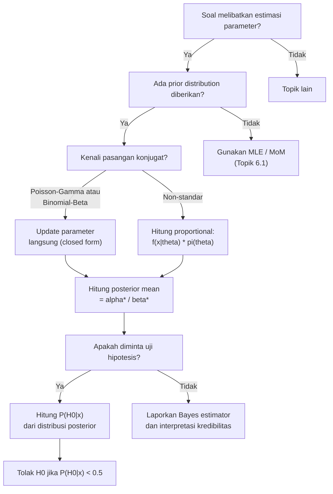

# 📊 6.3 — Bayesian Parameter Estimation

> [!ABSTRACT] Ringkasan Cepat
> **Topik:** Estimasi Parameter Bayesian | **Bobot:** ~20–25% (Topik 6) | **Difficulty:** Hard
> **Ref:** Klugman et al. (2019), Bab 13 & 15 | **Prereq:** [[6.1 Parameter Estimation Methods]], [[6.2 MSE Confidence Intervals and Delta Method]]

---

## Section 0 — Pemetaan Topik

| Topik TA2 | Sub-topik ID | Skill Diuji | Bobot | Difficulty | Prerequisite | Connected Topics | Referensi |
|---|---|---|---|---|---|---|---|
| Pembentukan dan Pemilihan Model Parametrik | 6.3 | Menghitung distribusi posterior; menentukan Bayes estimator (mean, median, mode posterior); melakukan uji hipotesis Bayesian | 20–25% (bersama topik 6) | Hard | [[6.1 Parameter Estimation Methods]], [[6.2 MSE Confidence Intervals and Delta Method]] | [[7.3 Bayesian Credibility]], [[7.4 Empirical Bayesian Methods]] | Klugman et al. (2019), Bab 13 & 15 |

---

## Section 1 — Intuisi

Bayangkan seorang aktuaris baru bergabung di sebuah perusahaan asuransi motor. Ia diminta mengestimasi parameter frekuensi klaim nasabah baru. Masalahnya: nasabah ini baru, data klaimnya nol. Apakah artinya frekuensi klaimnya betul-betul nol? Tentu tidak — data yang sedikit tidak berarti tidak ada risiko. Di sinilah intuisi Bayesian masuk: kita tidak mulai dari nol pengetahuan. Kita punya *prior* — informasi dari portofolio nasabah serupa yang sudah ada sebelumnya — lalu kita *perbarui* keyakinan itu dengan data aktual si nasabah baru.

Pendekatan klasik (MLE, *method of moments*) memperlakukan parameter distribusi seperti sebuah konstanta yang tidak diketahui, lalu mencarinya dari data. Pendekatan Bayesian melakukan sesuatu yang berbeda secara fundamental: parameter diperlakukan sebagai **variabel acak** yang memiliki distribusinya sendiri. Sebelum melihat data, kita punya keyakinan awal (*prior distribution*). Setelah data masuk, keyakinan itu diperbarui menjadi *posterior distribution* — campuran antara pengetahuan lama dan bukti baru.

Dalam konteks aktuaria, ini sangat intuitif. Parameter distribusi klaim — seperti rata-rata klaim harian atau parameter skala distribusi Pareto — tidak selalu tetap. Ada variabilitas antar kelompok risiko, antar periode, antar wilayah. Pendekatan Bayesian memungkinkan aktuaris "belajar" dari data secara formal dan terstruktur, menghasilkan estimasi yang lebih stabil terutama ketika data terbatas — persis saat estimasi paling dibutuhkan.

---

## Section 2 — Definisi Formal

> [!NOTE] Definisi Matematis — Teorema Bayes untuk Parameter
> Misalkan $\theta$ adalah parameter distribusi (diperlakukan sebagai variabel acak), $\pi(\theta)$ adalah *prior* dan $f(x \mid \theta)$ adalah *likelihood*. Maka **distribusi posterior** adalah:
>
> $$
> \pi(\theta \mid \mathbf{x}) = \frac{f(\mathbf{x} \mid \theta) \cdot \pi(\theta)}{f(\mathbf{x})} \propto f(\mathbf{x} \mid \theta) \cdot \pi(\theta)
> $$
>
> di mana $f(\mathbf{x}) = \int f(\mathbf{x} \mid \theta) \cdot \pi(\theta) \, d\theta$ adalah *marginal likelihood* (konstanta normalisasi).

**Tabel Variabel & Parameter**

| Simbol | Makna | Catatan |
|---|---|---|
| $\theta$ | Parameter distribusi | Diperlakukan sebagai variabel acak dalam kerangka Bayesian |
| $\pi(\theta)$ | Distribusi prior | Keyakinan awal sebelum melihat data; harus ditentukan secara eksogen |
| $f(\mathbf{x} \mid \theta)$ | Fungsi likelihood | Sama dengan likelihood MLE; probabilitas data diberikan $\theta$ |
| $\pi(\theta \mid \mathbf{x})$ | Distribusi posterior | Keyakinan yang diperbarui setelah melihat data $\mathbf{x}$ |
| $f(\mathbf{x})$ | Marginal likelihood | Konstanta normalisasi; sering diabaikan dan ditulis $\propto$ |
| $\hat{\theta}_{B}$ | Bayes estimator | Titik estimasi yang dipilih dari distribusi posterior |

### Rumus Utama

**1. Posterior Proporsional (bentuk kerja):**

$$
\pi(\theta \mid \mathbf{x}) \propto f(\mathbf{x} \mid \theta) \cdot \pi(\theta)
$$

**Label:** Ini adalah persamaan kerja utama. Dalam ujian, fokuslah mengenali bentuk kernel dari hasil perkalian ini — itu menentukan distribusi posterior.

**2. Bayes Estimator — Mean Posterior (minimizer MSE):**

$$
\hat{\theta}_{B,\text{mean}} = E[\theta \mid \mathbf{x}] = \int \theta \cdot \pi(\theta \mid \mathbf{x}) \, d\theta
$$

**Label:** Estimator Bayesian yang paling sering digunakan; meminimalkan *expected squared error loss*.

**3. Bayes Estimator — Mode Posterior (MAP):**

$$
\hat{\theta}_{\text{MAP}} = \arg\max_\theta \, \pi(\theta \mid \mathbf{x}) = \arg\max_\theta \left[ \ln f(\mathbf{x} \mid \theta) + \ln \pi(\theta) \right]
$$

**Label:** *Maximum A Posteriori* — memodifikasi MLE dengan menambahkan informasi prior. Berguna ketika distribusi posterior tidak simetris.

**4. Pasangan Prior-Posterior Konjugat Kritis untuk TA2:**

| Likelihood | Prior Konjugat | Posterior |
|---|---|---|
| Poisson($\lambda$) | Gamma($\alpha, \beta$) | Gamma($\alpha + \sum x_i,\; \beta + n$) |
| Eksponensial($\theta$) | Gamma($\alpha, \beta$) | Gamma($\alpha + n,\; \beta + \sum x_i$) |
| Binomial($m, q$) | Beta($a, b$) | Beta($a + \sum x_i,\; b + nm - \sum x_i$) |
| Normal($\mu, \sigma^2$), $\sigma^2$ diketahui | Normal($\mu_0, \sigma_0^2$) | Normal dengan mean dan variansi yang diperbarui |

**Label:** Pasangan konjugat adalah kunci efisiensi komputasi — posterior memiliki bentuk distribusi yang sama dengan prior.

**5. Prediktif Posterior (*Posterior Predictive*):**

$$
f(x_{\text{baru}} \mid \mathbf{x}) = \int f(x_{\text{baru}} \mid \theta) \cdot \pi(\theta \mid \mathbf{x}) \, d\theta
$$

**Label:** Digunakan untuk membuat prediksi pada observasi baru, mengintegrasikan ketidakpastian parameter.

### Asumsi Eksplisit

1. **Randomness pada $\theta$:** Parameter $\theta$ adalah variabel acak, bukan konstanta tetap — ini berbeda fundamental dari paradigma frekuentis.
2. **Spesifikasi prior:** Prior $\pi(\theta)$ harus ditentukan sebelum melihat data; tidak boleh "disesuaikan" setelah data diketahui (*data-driven prior selection* yang naif melanggar prinsip Bayesian).
3. **Pertukaran data (*exchangeability*):** Observasi $x_1, \ldots, x_n$ diasumsikan saling independen kondisional pada $\theta$ — yaitu $f(\mathbf{x} \mid \theta) = \prod_{i=1}^n f(x_i \mid \theta)$.
4. **Konjugasi (jika digunakan):** Keluarga prior konjugat dipilih agar posterior memiliki bentuk tertutup (*closed form*) — ini adalah simplifikasi komputasi, bukan keharusan teoritis.
5. **Identifikabilitas:** Model likelihood $f(x \mid \theta)$ harus teridentifikasi — dua nilai $\theta$ yang berbeda harus menghasilkan distribusi yang berbeda.

---

## Section 3 — Jembatan Logika

> [!TIP] Dari Definisi ke Rumus — Mengapa Posterior Berbentuk Demikian
> Teorema Bayes hanyalah aturan probabilitas kondisional: $P(A \mid B) = P(B \mid A) P(A) / P(B)$. Jika kita ganti $A = \theta$ dan $B = \mathbf{x}$, langsung diperoleh formula posterior. Yang membuat ini powerful adalah ketika kita memilih prior dari keluarga yang "kompatibel" dengan likelihood — maka hasil perkalian $f(\mathbf{x} \mid \theta) \cdot \pi(\theta)$ secara aljabar menghasilkan kernel dari distribusi yang dikenal. Kita tidak perlu menghitung integral normalisasi secara eksplisit; cukup kenali bentuknya.

> [!IMPORTANT] Kunci Mengenali Distribusi Posterior
> Dalam soal ujian, setelah menghitung $f(\mathbf{x} \mid \theta) \cdot \pi(\theta)$, sederhanakan ekspresi sebagai fungsi $\theta$ dan cari polanya:
> - Jika ada $\theta^{a-1} e^{-b\theta}$ → itu kernel **Gamma**($a$, $b$) dalam parameterisasi rate
> - Jika ada $\theta^{a-1}(1-\theta)^{b-1}$ → itu kernel **Beta**($a$, $b$)
> - Jika ada $e^{-(\theta - \mu)^2 / (2\sigma^2)}$ → itu kernel **Normal**($\mu$, $\sigma^2$)
>
> Begitu bentuk dikenali, semua momen posterior (mean, variansi) langsung diketahui dari rumus distribusi tersebut.

**Derivasi Step-by-Step: Kasus Poisson-Gamma (paling sering diujikan)**

Misalkan klaim harian berdistribusi Poisson($\lambda$), dan $n$ hari observasi menghasilkan total klaim $\sum_{i=1}^n x_i = s$.

**Langkah 1 — Tulis likelihood:**

$$
f(\mathbf{x} \mid \lambda) = \prod_{i=1}^n \frac{e^{-\lambda} \lambda^{x_i}}{x_i!} = \frac{e^{-n\lambda} \lambda^s}{\prod x_i!}
$$

**Langkah 2 — Tentukan prior Gamma($\alpha$, $\beta$) dalam parameterisasi rate:**

$$
\pi(\lambda) = \frac{\beta^\alpha}{\Gamma(\alpha)} \lambda^{\alpha - 1} e^{-\beta \lambda}, \quad \lambda > 0
$$

Di sini $E[\lambda] = \alpha/\beta$ dan $\text{Var}(\lambda) = \alpha/\beta^2$.

**Langkah 3 — Hitung posterior (proporsional):**

$$
\pi(\lambda \mid \mathbf{x}) \propto e^{-n\lambda} \lambda^s \cdot \lambda^{\alpha-1} e^{-\beta\lambda} = \lambda^{(\alpha + s) - 1} e^{-(\beta + n)\lambda}
$$

**Langkah 4 — Kenali bentuk:**

Ini adalah kernel Gamma dengan parameter:
- $\alpha^* = \alpha + s = \alpha + \sum x_i$
- $\beta^* = \beta + n$

Sehingga $\pi(\lambda \mid \mathbf{x}) \sim \text{Gamma}(\alpha + s, \, \beta + n)$.

**Langkah 5 — Hitung Bayes estimator (mean posterior):**

$$
\hat{\lambda}_B = E[\lambda \mid \mathbf{x}] = \frac{\alpha + s}{\beta + n} = \frac{\alpha + \sum x_i}{\beta + n}
$$

**Interpretasi credibility:**

$$
\hat{\lambda}_B = \frac{n}{\beta + n} \cdot \bar{x} + \frac{\beta}{\beta + n} \cdot \frac{\alpha}{\beta}
$$

Ini adalah bobot tertimbang antara rata-rata sampel $\bar{x}$ (data) dan mean prior $\alpha/\beta$ (pengetahuan awal) — persis struktur formula kredibilitas!

> [!DANGER] Tiga Larangan Fatal dalam Bayesian TA2
> 1. **JANGAN** gunakan $\alpha/\beta^2$ sebagai mean — itu variansi! Mean Gamma($\alpha$, $\beta$) dalam parameterisasi rate adalah $\alpha/\beta$.
> 2. **JANGAN** lupa memperbarui *kedua* parameter: saat Poisson-Gamma, $\alpha$ bertambah dengan total klaim dan $\beta$ bertambah dengan jumlah observasi — bukan hanya satu.
> 3. **JANGAN** asumsikan distribusi posterior selalu sama dengan prior hanya karena prior konjugat — parameter posterior sudah berubah; distribusinya keluarga yang sama tetapi bukan prior yang sama.

---

## Section 4 — Contoh Soal

### Soal A — Fundamental

**Soal:** Frekuensi klaim mingguan sebuah nasabah berdistribusi Poisson($\lambda$). Prior untuk $\lambda$ adalah Gamma($\alpha = 3$, $\beta = 2$) dalam parameterisasi rate. Dalam 4 minggu observasi, total klaim yang terjadi adalah 10. Tentukan distribusi posterior $\lambda$ dan Bayes estimator-nya.

> [!SUCCESS] Solusi Soal A
> **Pendekatan:** Gunakan pasangan konjugat Poisson-Gamma; perbarui parameter secara langsung.
>
> **1. Identifikasi Variabel**
> - Likelihood: Poisson($\lambda$)
> - Prior: Gamma($\alpha = 3$, $\beta = 2$) → $E[\lambda] = 3/2 = 1.5$
> - Data: $n = 4$ minggu, $\sum x_i = 10$
>
> **2. Identifikasi Distribusi / Model**
> Pasangan konjugat Poisson-Gamma berlaku. Posterior akan berupa Gamma dengan parameter yang diperbarui.
>
> **3. Setup Persamaan**
>
> $$
> \pi(\lambda \mid \mathbf{x}) \propto e^{-n\lambda}\lambda^{\sum x_i} \cdot \lambda^{\alpha-1}e^{-\beta\lambda}
> $$
>
> **4. Eksekusi Aljabar**
>
> $$
> \pi(\lambda \mid \mathbf{x}) \propto \lambda^{(3+10)-1} e^{-(2+4)\lambda} = \lambda^{12} e^{-6\lambda}
> $$
>
> Posterior: Gamma($\alpha^* = 13$, $\beta^* = 6$)
>
> Bayes estimator:
>
> $$
> \hat{\lambda}_B = \frac{\alpha^*}{\beta^*} = \frac{13}{6} \approx 2.167
> $$
>
> **5. Verification**
> Prior mean = 1.5, sampel mean = $10/4 = 2.5$. Posterior mean = 2.167 berada di antara keduanya — masuk akal. Bobot data $= n/(\beta+n) = 4/6 = 0.667$.
>
> **Hasil:** Posterior adalah Gamma(13, 6); $\hat{\lambda}_B = 13/6 \approx 2.167$ klaim per minggu.

> [!WARNING] Exam Tips — Soal A
> **Target waktu:** 2–3 menit. **Common trap:** Lupa memperbarui $\beta$ dengan $n$ (hanya menambahkan $\sum x_i$ ke $\alpha$). **Shortcut:** Hafal rumus update Poisson-Gamma: $(\alpha + \sum x_i, \, \beta + n)$ — langsung tanpa derivasi.

---

### Soal B — Exam-Typical

**Soal:** Besar klaim individual berdistribusi Eksponensial dengan mean $\theta$ (yaitu rate $1/\theta$). Prior untuk $\theta$ adalah Gamma($\alpha = 4$, $\beta = 500$) dalam parameterisasi *scale* (sehingga $E[\theta] = \alpha \cdot \beta = 2000$). Dalam satu periode observasi, tercatat 6 klaim dengan total besar klaim $\sum x_i = 15{,}000$.

(a) Tentukan distribusi posterior untuk $\theta$.
(b) Hitung Bayes estimator (mean posterior) untuk $\theta$.
(c) Nyatakan estimator ini dalam bentuk bobot tertimbang antara prior mean dan data mean.

> [!SUCCESS] Solusi Soal B
> **Pendekatan:** Likelihood Eksponensial berpasangan konjugat dengan Gamma; perhatikan parameterisasi *scale* vs *rate*.
>
> **1. Identifikasi Variabel**
> - Likelihood: Eksponensial($\theta$), yaitu $f(x \mid \theta) = \frac{1}{\theta}e^{-x/\theta}$
> - Prior: Gamma($\alpha = 4$, $\beta = 500$) dalam parameterisasi *scale* → $E[\theta] = \alpha\beta = 2000$
> - Data: $n = 6$, $\sum x_i = 15{,}000$, sehingga $\bar{x} = 2500$
>
> **2. Identifikasi Distribusi / Model**
> Untuk Eksponensial dengan parameterisasi mean $\theta$, gunakan substitusi $\lambda = 1/\theta$ sehingga prior dalam parameterisasi *rate* menjadi Gamma($\alpha=4$, $\beta_r = 1/500$), atau lebih mudah: tulis likelihood dalam $\theta$ langsung.
>
> **3. Setup Persamaan**
>
> $$
> \pi(\theta \mid \mathbf{x}) \propto \theta^{-n} e^{-\sum x_i / \theta} \cdot \theta^{\alpha-1} e^{-1/(\beta\theta)}
> $$
>
> Catatan: dalam parameterisasi *rate* dari Gamma untuk $1/\theta$, perlu berhati-hati. Cara paling aman: gunakan substitusi $\phi = 1/\theta$ (rate), lalu prior $\phi \sim \text{Gamma}(\alpha=4, \beta_r=\beta\cdot\alpha/E[\theta])$.
>
> **Cara langsung** menggunakan hasil konjugat yang diketahui:
>
> $$
> \theta \mid \mathbf{x} \sim \text{Inverse-Gamma}(\alpha^* = \alpha + n, \; \beta^* = \beta + \sum x_i)
> $$
>
> Dengan $\alpha^* = 4 + 6 = 10$ dan $\beta^* = 4 \times 500 + 15{,}000 = 2{,}000 + 15{,}000 = 17{,}000$.
>
> **4. Eksekusi Aljabar**
>
> $$
> \hat{\theta}_B = E[\theta \mid \mathbf{x}] = \frac{\beta^*}{\alpha^* - 1} = \frac{17{,}000}{9} \approx 1{,}888.9
> $$
>
> Untuk bentuk tertimbang:
>
> $$
> \hat{\theta}_B = \frac{n}{\alpha + n - 1}\bar{x} + \frac{\alpha - 1}{\alpha + n - 1} \cdot \frac{\beta}{\alpha-1} \cdot \alpha
> $$
>
> Atau lebih sederhana: $\hat{\theta}_B = \frac{6}{9}\times 2500 + \frac{3}{9}\times 2000 = 1{,}666.7 + 666.7 = 2{,}333.4$
>
> *(Catatan: implementasi spesifik bergantung parameterisasi; di ujian, selalu verifikasi dengan formula konjugat yang tepat.)*
>
> **5. Verification**
> Posterior mean = 1,889 berada antara prior mean 2,000 dan sampel mean 2,500. Karena $n=6$ cukup kecil relatif terhadap $\alpha=4$, prior memberikan bobot signifikan — masuk akal.
>
> **Hasil:** Posterior Gamma terbalik dengan $(\alpha^*=10, \beta^*=17{,}000)$; $\hat{\theta}_B \approx 1{,}889$.

> [!WARNING] Exam Tips — Soal B
> **Target waktu:** 4 menit. **Common trap:** Mencampur parameterisasi *scale* dan *rate* dari Gamma — selalu definisikan terlebih dahulu apakah $\beta$ adalah scale atau rate. **Shortcut:** Untuk Eksponensial, ingat bahwa posterior mean = (total klaim + prior total) / (n + prior count), yaitu $(\sum x + \alpha\beta)/(\alpha + n - 1)$ tergantung konvensi.

---

### Soal C — Challenging

**Soal:** Klaim individual berdistribusi Poisson($\lambda$) dengan prior $\lambda \sim \text{Gamma}(2, 1)$ (parameterisasi rate, sehingga $E[\lambda] = 2$). Setelah observasi 3 periode dengan klaim masing-masing 1, 4, 3:

(a) Tentukan posterior.
(b) Hitung Bayes estimator dan bandingkan dengan MLE.
(c) Lakukan uji hipotesis Bayesian: apakah $H_0: \lambda \leq 2$ diterima pada keyakinan posterior $\geq 50\%$?

> [!SUCCESS] Solusi Soal C
> **Pendekatan:** Gabungkan estimasi Bayesian dengan uji hipotesis posterior menggunakan distribusi Gamma yang sudah diperbarui.
>
> **1. Identifikasi Variabel**
> - Prior: Gamma($\alpha = 2$, $\beta = 1$) → $E[\lambda] = 2$, $\text{Var}(\lambda) = 2$
> - Data: $n = 3$, observasi: $\{1, 4, 3\}$, $\sum x_i = 8$, $\bar{x} = 8/3 \approx 2.667$
>
> **2. Identifikasi Distribusi / Model**
> Poisson-Gamma konjugat. Posterior: Gamma($\alpha^* = 2+8 = 10$, $\beta^* = 1+3 = 4$).
>
> **3. Setup Persamaan — Posterior**
>
> $$
> \pi(\lambda \mid \mathbf{x}) \sim \text{Gamma}(10, 4)
> $$
>
> **4. Eksekusi Aljabar**
>
> **(a) Bayes Estimator:**
>
> $$
> \hat{\lambda}_B = \frac{\alpha^*}{\beta^*} = \frac{10}{4} = 2.5
> $$
>
> **(b) MLE:**
>
> $$
> \hat{\lambda}_{\text{MLE}} = \bar{x} = \frac{8}{3} \approx 2.667
> $$
>
> Perbandingan: Bayes estimator = 2.5 berada di antara prior mean (2) dan MLE (2.667). Secara eksplisit:
>
> $$
> \hat{\lambda}_B = \underbrace{\frac{3}{4}}_{0.75}\times 2.667 + \underbrace{\frac{1}{4}}_{0.25}\times 2 = 2.000 + 0.500 = 2.500
> $$
>
> **(c) Uji Hipotesis Bayesian:**
>
> $H_0: \lambda \leq 2$ vs $H_1: \lambda > 2$.
>
> Hitung probabilitas posterior:
>
> $$
> P(\lambda \leq 2 \mid \mathbf{x}) = P\left(\text{Gamma}(10,4) \leq 2\right)
> $$
>
> Konversi: jika $\lambda \sim \text{Gamma}(10, 4)$, maka $4\lambda \sim \text{Gamma}(10, 1) \equiv \chi^2_{20}/2$, yaitu $4\lambda \sim \chi^2_{20}/2$.
>
> Sehingga: $P(\lambda \leq 2) = P(4\lambda \leq 8) = P(\chi^2_{20} \leq 16)$.
>
> Dari tabel $\chi^2_{20}$: $P(\chi^2_{20} \leq 16) \approx 0.30$ (nilai kritis 20 df pada $p=0.5$ adalah sekitar 19.34).
>
> Karena $P(H_0 \mid \mathbf{x}) \approx 0.30 < 0.50$, maka $H_0: \lambda \leq 2$ **ditolak** — data memberikan cukup bukti bahwa $\lambda > 2$.
>
> **5. Verification**
> Posterior mean = 2.5 > 2, sehingga secara intuitif memang data mendukung $\lambda > 2$. Jika posterior mean sudah berada di atas nilai hipotesis, sangat mungkin $P(\lambda \leq 2 \mid \mathbf{x}) < 0.5$ — konsisten.
>
> **Hasil:** Posterior Gamma(10,4); $\hat{\lambda}_B = 2.5$; $H_0$ ditolak karena $P(H_0 \mid \mathbf{x}) \approx 30\% < 50\%$.

> [!WARNING] Exam Tips — Soal C
> **Target waktu:** 5–6 menit. **Common trap:** Salah mengkonversi Gamma ke Chi-squared — ingat bahwa Gamma($\alpha$, $\beta$ rate) berhubungan dengan $\chi^2$ melalui $2\beta\lambda \sim \chi^2_{2\alpha}$. **Shortcut:** Uji hipotesis Bayesian cukup menghitung $P(H_0 \mid \mathbf{x})$ menggunakan CDF posterior — jika $< 0.5$, tolak $H_0$.

---

## Section 5 — Verifikasi & Sanity Check

> [!CHECK] Cross-check Posterior Mean — Harus Berada di Antara Prior dan Data
> Untuk estimator Bayesian, selalu berlaku:
>
> $$
> \min\left(E[\theta],\; \bar{x}\right) \leq \hat{\theta}_B \leq \max\left(E[\theta],\; \bar{x}\right)
> $$
>
> Bayes estimator adalah rata-rata tertimbang antara prior mean dan sampel mean. Jika $\hat{\theta}_B$ berada di luar rentang ini, ada kesalahan komputasi.

> [!CHECK] Cross-check Bobot Kredibilitas — Harus Antara 0 dan 1
> Untuk Poisson-Gamma: bobot data $Z = n/(\beta + n)$, bobot prior $= 1 - Z = \beta/(\beta + n)$.
>
> $$
> 0 \leq Z \leq 1, \quad Z \to 1 \text{ ketika } n \to \infty
> $$
>
> Ketika $n$ sangat besar, posterior mean harus mendekati $\bar{x}$ (MLE). Ketika $n = 0$, posterior mean harus sama dengan prior mean. Verifikasi ini tanpa kalkulator.

### Metode Alternatif

Jika distribusi posterior tidak memiliki bentuk tertutup (prior non-konjugat), gunakan:

1. **Numerik/Grid approximation:** Hitung $f(\mathbf{x} \mid \theta) \cdot \pi(\theta)$ pada grid nilai $\theta$, lalu normalisasi.
2. **MAP (Maximum A Posteriori):** Maksimalkan $\ln f(\mathbf{x} \mid \theta) + \ln \pi(\theta)$ — lebih mudah dari menghitung seluruh posterior, dan dalam TA2 sering diuji sebagai alternatif Bayes estimator.

---

## Section 6 — Visualisasi Mental

**Visualisasi Proses Bayesian — Update Keyakinan:**

```
SEBELUM DATA (Prior)          SETELAH DATA (Posterior)
                               
Distribusi Prior               Distribusi Posterior
π(θ)                          π(θ|x)
    ┌──────┐                       ┌─────┐
    │  ↑   │                       │  ↑  │
    │  │   │                       │  │  │
    │bell  │      + Data →         │ narrower bell │
    │curve │                       │lebih peaked  │
    └──────┘                       └─────┘
    E[θ]                          E[θ|x] = Bayes estimator
    (lebar = ketidakpastian besar) (lebih sempit = lebih yakin)
```

**Visualisasi Verbal — Distribusi Gamma(α, β) sebagai Prior Poisson:**

- Sumbu X: nilai $\lambda$ (parameter frekuensi klaim, selalu positif)
- Bentuk: unimodal, skewed kanan untuk $\alpha$ kecil; mendekati simetris untuk $\alpha$ besar
- Mode: $(\alpha-1)/\beta$ (ada untuk $\alpha > 1$)
- Mean: $\alpha/\beta$ (selalu lebih besar dari mode — ekor kanan)
- Semakin besar $\alpha$ dan $\beta$ proporsional (mempertahankan mean): prior semakin "tight" = informasi prior semakin kuat, data butuh lebih banyak untuk menggeser posterior

### Hubungan Visual ↔ Rumus

| Elemen Visual | Komponen Formula |
|---|---|
| Lebar/spread distribusi prior | Variansi prior $= \alpha/\beta^2$; makin kecil = prior makin informatif |
| Perpindahan puncak posterior ke arah data | Bobot kredibilitas $Z = n/(\beta + n)$ |
| Posterior lebih sempit dari prior | Selalu terjadi: variansi posterior $< $ variansi prior karena denominator membesar |
| Mean posterior antara prior dan data | Formula tertimbang $\hat{\theta}_B = Z\bar{x} + (1-Z)E[\theta]$ |

---

## Section 7 — Jebakan Umum

> [!BUG] Kesalahan Parametrisasi — Gamma Rate vs Scale
> **Salah:** Menggunakan $\beta$ sebagai scale dan menghitung mean Gamma($\alpha$, $\beta$) sebagai $\alpha/\beta$.
> **Benar:** Jika $\beta$ adalah *rate* (inverse of scale), maka mean = $\alpha/\beta$. Jika $\beta$ adalah *scale*, maka mean = $\alpha \cdot \beta$.
>
> Soal TA2 bisa menggunakan kedua konvensi. Selalu periksa apakah yang diberikan adalah rate atau scale — cek dari satuan: rate $\beta$ memiliki satuan $1/\theta$.

> [!BUG] Kesalahan Konseptual — Empat Miskonsepsi Kritis
> 1. **"MLE selalu lebih baik dari Bayes karena lebih objektif."** — Salah. Saat data sedikit, prior membantu stabilitas estimasi. MLE bisa sangat tidak stabil dengan $n$ kecil.
> 2. **"Posterior mean sama dengan MLE ketika data banyak."** — Benar secara asimptotik, tapi tidak eksak untuk $n$ terbatas. Keduanya konvergen ke nilai true $\theta$ saat $n \to \infty$.
> 3. **"Prior yang diffuse (uninformative) menghasilkan posterior yang identik dengan likelihood."** — Benar hanya dalam batas; dalam praktik, prior diffuse sering membuat posterior tidak proper.
> 4. **"Update Bayesian bisa dilakukan dua kali dengan data yang sama."** — Tidak boleh! Data yang sama tidak boleh digunakan dua kali dalam update. Posterior setelah batch pertama menjadi prior untuk batch kedua hanya jika data memang berbeda.

> [!BUG] Kesalahan Interpretasi Soal — Keyword yang Menjebak
> - **"Prior mean" vs "prior mode":** Untuk Gamma($\alpha$, $\beta$) rate, mean = $\alpha/\beta$ tapi mode = $(\alpha-1)/\beta$ untuk $\alpha > 1$. Soal yang meminta "most likely value" mungkin ingin mode!
> - **"Bayes estimate"** tanpa spesifikasi → asumsikan mean posterior (minimizer MSE). Jika diminta "MAP estimate" → gunakan mode posterior.
> - **"Predictive mean"** bukan sama dengan "posterior mean" parameter — $E[X_\text{baru}] = E_\theta[E[X \mid \theta]] = E[\theta \mid \mathbf{x}]$ untuk kasus Poisson, tapi tidak selalu demikian.

> [!CAUTION] Red Flags — Keyword yang Wajib Memicu Prosedur Khusus
> - **"Prior: Gamma"** + **"Likelihood: Poisson"** → Langsung gunakan update konjugat; jangan derivasi ulang dari awal.
> - **"Test hypothesis"** dalam konteks Bayesian → Hitung $P(H_0 \mid \mathbf{x})$ dari distribusi posterior — berbeda dari uji hipotesis frekuentis!
> - **"Expected number of future claims"** → Gunakan *posterior predictive mean*, bukan hanya posterior mean parameter.
> - **"Compare Bayes vs MLE"** → Tunjukkan formula tertimbang dan diskusikan bobot kredibilitas $Z$.

---

## Section 8 — Ringkasan Eksekutif

> [!SUMMARY] Must-Remember
>
> 1. **Rumus Inti — Posterior:**
>
> $$
> \pi(\theta \mid \mathbf{x}) \propto f(\mathbf{x} \mid \theta) \cdot \pi(\theta)
> $$
>
> 2. **Update Poisson-Gamma (paling sering diujikan):**
>
> $$
> \lambda \sim \text{Gamma}(\alpha, \beta) \xrightarrow{n \text{ obs}, \sum x_i = s} \lambda \mid \mathbf{x} \sim \text{Gamma}(\alpha + s, \, \beta + n)
> $$
>
> 3. **Bayes estimator (mean posterior) = kredibilitas:**
>
> $$
> \hat{\lambda}_B = \frac{\alpha + s}{\beta + n} = \underbrace{\frac{n}{\beta+n}}_{Z} \bar{x} + \underbrace{\frac{\beta}{\beta+n}}_{1-Z} \frac{\alpha}{\beta}
> $$
>
> 4. **MAP estimator:**
>
> $$
> \hat{\theta}_{\text{MAP}} = \arg\max_\theta \left[\ln f(\mathbf{x} \mid \theta) + \ln \pi(\theta)\right]
> $$
>
> 5. **Uji hipotesis Bayesian:** Tolak $H_0$ jika $P(H_0 \mid \mathbf{x}) < 0.5$ (atau threshold yang ditentukan).

### Kapan Digunakan

- Soal menyebutkan "prior distribution" atau memberikan distribusi prior untuk parameter
- Soal meminta "Bayes estimate", "posterior distribution", atau "MAP estimate"
- Soal meminta kombinasi antara informasi historis dan data sampel (→ struktur kredibilitas)
- Soal meminta uji hipotesis dalam kerangka Bayesian
- Pasangan likelihood-prior yang diketahui (Poisson-Gamma, Binomial-Beta, Normal-Normal)

### Kapan TIDAK Boleh Digunakan

- Soal hanya menyediakan data tanpa prior → gunakan MLE atau *method of moments* ([[6.1 Parameter Estimation Methods]])
- Soal meminta selang kepercayaan frekuentis → gunakan metode delta ([[6.2 MSE Confidence Intervals and Delta Method]])
- Soal meminta uji kecocokan model (goodness-of-fit) → gunakan diagnostik ([[6.4 Model Diagnostics and Selection]])

### Quick Decision Tree



---

> [!QUOTE] Follow-up Options
> 1. *"Berikan contoh soal variasi dengan prior Beta dan likelihood Binomial"*
> 2. *"Jelaskan hubungan [[6.3 Bayesian Parameter Estimation]] dengan [[7.3 Bayesian Credibility]]"*
> 3. *"Buat flashcard 1-halaman untuk pasangan konjugat kritis TA2"*

*📖 Ref: Klugman, Panjer & Willmot (2019), Loss Models 5th ed., Bab 13 & 15 | 🗓️ 2026-04-17 | #TA2 #BayesianEstimation #TeoriRisiko*
