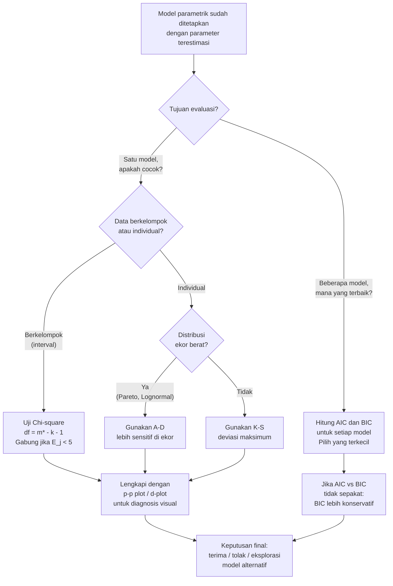

# 📊 6.4 — Model Diagnostics and Selection

> [!ABSTRACT] Ringkasan Cepat
> **Topik:** Model Diagnostics and Selection | **Bobot:** ~20–25% | **Difficulty:** Hard
> **Ref:** Klugman et al. (2019), Loss Models 5th ed., Bab 13 & 15 | **Prereq:** [[6.1 Parameter Estimation Methods]], [[6.2 MSE Confidence Intervals and Delta Method]]


## Section 0 — Pemetaan Topik

| Topik TA2 | Sub-topik ID | Skill Diuji | Bobot | Difficulty | Prerequisite | Connected Topics | Referensi |
|---|---|---|---|---|---|---|---|
| Pembentukan dan Pemilihan Model Parametrik | 6.4 | Mengevaluasi kecocokan model menggunakan perbandingan grafik (p-p plot, d-plot), uji hipotesis (chi-square, K-S, A-D), dan kriteria seleksi berbasis skor (AIC, BIC, SSPE) | 20–25% | Hard | [[6.1 Parameter Estimation Methods]], [[6.2 MSE Confidence Intervals and Delta Method]] | [[6.3 Bayesian Parameter Estimation]], [[6.1 Parameter Estimation Methods]] | Klugman et al. (2019), Bab 13 & 15 |


## Section 1 — Intuisi

Bayangkan seorang dokter yang baru saja mengobati 500 pasien dengan kondisi tertentu dan ingin tahu: "Apakah obat yang saya berikan bekerja sesuai teori?" Dokter tersebut tidak hanya melihat satu angka — ia melihat grafik pemulihan, membandingkan distribusi waktu penyembuhan antara teori dan kenyataan, dan menjalankan uji statistik untuk memastikan perbedaan yang terlihat bukan sekadar kebetulan. Aktuaris yang telah membangun model distribusi klaim menghadapi tantangan yang sama persis: setelah parameter diestimasi, apakah model tersebut benar-benar menggambarkan data dengan baik?

Inilah inti dari diagnostik dan seleksi model. Setelah kita memiliki kandidat distribusi — katakanlah Lognormal, Pareto, atau Gamma — dengan parameter yang sudah diestimasi, kita perlu mengevaluasi *seberapa baik* model tersebut cocok dengan data aktual. Ada tiga pendekatan besar: **perbandingan grafik** (melihat secara visual apakah kurva teoritis mendekati kurva empiris), **uji hipotesis formal** (menghitung statistik uji dan membandingkannya dengan nilai kritis), dan **kriteria seleksi berbasis skor** seperti AIC dan BIC (menghukum model yang terlalu kompleks untuk menghindari overfitting).

Yang membuat topik ini menantang adalah bahwa ketiga pendekatan dapat memberikan sinyal yang berbeda — model yang lolos uji chi-square belum tentu memiliki AIC terbaik, dan model dengan grafik yang "terlihat bagus" belum tentu signifikan secara statistik. Aktuaris yang baik harus memahami kekuatan dan keterbatasan masing-masing alat, dan menggunakan ketiganya secara komplementer untuk memilih model terbaik.


## Section 2 — Definisi Formal

> [!NOTE] Definisi Matematis
> Diberikan $n$ observasi $x_1, \ldots, x_n$ dan model terfitting $\hat{F}(x)$ dengan $k$ parameter terestimasi. Uji kecocokan (*goodness-of-fit*) bertujuan menguji:
>
> $$H_0: F(x) = F_0(x;\hat{\boldsymbol{\theta}}) \quad \text{vs} \quad H_1: F(x) \neq F_0(x;\hat{\boldsymbol{\theta}})$$
>
> di mana $F_0$ adalah distribusi parametrik yang diusulkan.

| Simbol | Makna | Catatan |
|---|---|---|
| $F_n(x)$ | Empirical Distribution Function (EDF): $\frac{\text{jumlah } x_i \leq x}{n}$ | Estimator nonparametrik dari $F(x)$ |
| $\hat{F}(x)$ | CDF teoritis dengan parameter terestimasi | Model parametrik yang diuji |
| $O_j$ | Frekuensi observasi (observed) di interval ke-$j$ | Digunakan dalam uji chi-square |
| $E_j$ | Frekuensi ekspektasi (expected) di interval ke-$j$ | $E_j = n \cdot [\hat{F}(c_j) - \hat{F}(c_{j-1})]$ |
| $k$ | Jumlah parameter yang diestimasi | Digunakan untuk menghitung derajat bebas |
| $m$ | Jumlah interval dalam uji chi-square | Pilih sehingga $E_j \geq 5$ untuk setiap $j$ |
| $D_n$ | Statistik Kolmogorov-Smirnov: $\sup_x \lvert F_n(x) - \hat{F}(x)\rvert$ | Deviasi maksimum EDF vs CDF teoritis |
| $A^2$ | Statistik Anderson-Darling | Memberi bobot lebih pada ekor distribusi |
| $\ell(\hat{\boldsymbol{\theta}})$ | Log-likelihood maksimum dari model | Digunakan dalam AIC dan BIC |
| $p$ | Jumlah parameter bebas dalam model | Digunakan dalam penalti AIC/BIC |

### Rumus Utama

**[Chi-Square] Statistik uji chi-square goodness-of-fit:**

$$
\chi^2 = \sum_{j=1}^{m} \frac{(O_j - E_j)^2}{E_j}
$$

*Label: Distribusi asimtotik $\chi^2_{m-k-1}$ di bawah $H_0$, dengan derajat bebas $= m - k - 1$ (jumlah interval dikurangi jumlah parameter dikurangi 1).*

**[K-S] Statistik Kolmogorov-Smirnov:**

$$
D_n = \sup_x |F_n(x) - \hat{F}(x)|
$$

*Label: Untuk sampel besar, nilai kritis pada level $\alpha = 0.05$ adalah $\approx 1.36/\sqrt{n}$. Nilai kritis ini hanya berlaku untuk parameter yang diketahui, bukan diestimasi dari data.*

**[A-D] Statistik Anderson-Darling:**

$$
A^2 = n \int_{-\infty}^{\infty} \frac{[F_n(x) - \hat{F}(x)]^2}{\hat{F}(x)[1-\hat{F}(x)]} \, d\hat{F}(x)
$$

*Label: Bobot $[\hat{F}(1-\hat{F})]^{-1}$ membuat A-D lebih sensitif terhadap deviasi di ekor distribusi dibanding K-S — sangat relevan untuk distribusi klaim asuransi.*

**[A-D Diskrit] Rumus komputasi A-D untuk data terurut $x_{(1)} \leq x_{(2)} \leq \ldots \leq x_{(n)}$:**

$$
A^2 = -n - \frac{1}{n} \sum_{i=1}^{n} \left[(2i-1)\ln \hat{F}(x_{(i)}) + (2n+1-2i)\ln[1-\hat{F}(x_{(i)})]\right]
$$

*Label: Formula ini memungkinkan komputasi numerik langsung dari data terurut.*

**[AIC] Akaike Information Criterion:**

$$
\text{AIC} = -2\ell(\hat{\boldsymbol{\theta}}) + 2p
$$

*Label: Pilih model dengan AIC **terkecil**. Penalti $2p$ menghukum kompleksitas model (overfitting).*

**[BIC] Bayesian Information Criterion (Schwarz Criterion):**

$$
\text{BIC} = -2\ell(\hat{\boldsymbol{\theta}}) + p\ln(n)
$$

*Label: Pilih model dengan BIC **terkecil**. Penalti $p\ln(n)$ lebih besar dari AIC untuk $n > 7$, sehingga BIC lebih agresif menghukum model kompleks.*

**[SSPE] Sum of Squared Probability-weighted Errors (score-based):**

$$
\text{SSPE} = \sum_{i=1}^{n} \left[F_n(x_i) - \hat{F}(x_i)\right]^2
$$

*Label: Pilih model dengan SSPE **terkecil**. Kriteria berbasis skor yang langsung mengukur deviasi kuadrat antara EDF dan CDF teoritis.*

### Asumsi Eksplisit

1. **Independensi:** Observasi $x_1, \ldots, x_n$ adalah independen dan identically distributed (i.i.d.).
2. **Chi-square — expected frequency:** Setiap interval harus memiliki $E_j \geq 5$; interval dengan $E_j < 5$ harus digabung dengan interval tetangganya.
3. **K-S — distribusi kontinu:** Uji K-S valid hanya untuk distribusi kontinu; untuk distribusi diskrit, distribusi dari $D_n$ berbeda.
4. **Parameter diestimasi dari data:** Ketika parameter diestimasi dari data yang sama (bukan diketahui a priori), nilai kritis uji K-S dan A-D yang tabel standar berikan tidak lagi berlaku secara tepat — perlu tabel khusus.
5. **Large sample:** Distribusi asimtotik $\chi^2_{m-k-1}$ untuk statistik chi-square valid hanya untuk $n$ besar (umumnya $n \geq 30$ dengan $E_j \geq 5$).


## Section 3 — Jembatan Logika

> [!TIP] Dari Definisi ke Rumus — Mengapa Tiga Pendekatan Berbeda?
> Ketiga pendekatan diagnostik menjawab pertanyaan yang sedikit berbeda. Perbandingan grafik (p-p plot, d-plot) menjawab: "Di bagian mana distribusi teoritis paling menyimpang dari data?" Uji hipotesis menjawab: "Apakah penyimpangan yang terlihat signifikan secara statistik, atau bisa dijelaskan oleh variasi sampling?" Kriteria AIC/BIC menjawab: "Dari beberapa kandidat model, mana yang memberikan trade-off terbaik antara fit dan kesederhanaan?" Ketiganya saling melengkapi — grafik untuk diagnosis lokasi masalah, uji hipotesis untuk keputusan formal, AIC/BIC untuk perbandingan antar model.

> [!IMPORTANT] Derajat Bebas Chi-Square — Jangan Salah Hitung
> Derajat bebas uji chi-square adalah $\nu = m - k - 1$, di mana:
> - $m$ = jumlah interval (setelah penggabungan interval dengan $E_j < 5$)
> - $k$ = jumlah parameter yang **diestimasi dari data yang sama**
> - $-1$ = untuk constraint total frekuensi $\sum O_j = \sum E_j = n$
>
> Jika parameter diketahui (tidak diestimasi), maka $k = 0$ dan $\nu = m - 1$.

**Derivasi Logika Penalti AIC — Mengapa $2p$? (step-by-step):**

**Latar belakang:** Menambahkan parameter ke model *selalu* meningkatkan $\ell(\hat{\boldsymbol{\theta}})$ (atau setidaknya tidak menurunkan), karena ruang pencarian yang lebih besar. Tanpa penalti, model dengan lebih banyak parameter akan selalu "menang."

**Langkah 1:** Ukur kecocokan model dengan log-likelihood maksimum $\ell(\hat{\boldsymbol{\theta}})$. Model lebih cocok → $\ell$ lebih besar → $-2\ell$ lebih kecil.

**Langkah 2:** Tambahkan penalti untuk kompleksitas. Akaike (1974) menurunkan bahwa expected overfitting dari model dengan $p$ parameter adalah $p$ unit dalam skala log-likelihood. Sehingga penalti = $2p$ (faktor 2 agar sesuai dengan skala $\chi^2$).

**Langkah 3:** AIC = $-2\ell + 2p$. Minimasi AIC berarti mencari model yang paling akurat dengan penalti terhadap kompleksitas berlebih.

**Langkah 4:** BIC mengganti penalti dengan $p\ln(n)$. Untuk $n = 100$: $\ln(100) \approx 4.6 > 2$, sehingga BIC lebih agresif. BIC secara asimtotik konsisten (memilih model "benar" jika ada dalam kandidat), sedangkan AIC tidak.

**Perbandingan AIC vs BIC:**

$$
\text{BIC} - \text{AIC} = p\ln(n) - 2p = p[\ln(n) - 2]
$$

Untuk $n > e^2 \approx 7.4$: BIC $>$ AIC, artinya BIC selalu menghukum kompleksitas lebih keras untuk sampel praktis. Semakin besar $n$, semakin besar selisih ini.

> [!DANGER] Dilarang
> 1. **Jangan** membandingkan nilai AIC atau BIC antar model yang diestimasi dari **data berbeda** atau dengan **transformasi berbeda** — AIC/BIC hanya valid untuk perbandingan pada data dan skala yang sama.
> 2. **Jangan** menggunakan nilai kritis K-S dari tabel standar (tabel untuk parameter diketahui) ketika parameter diestimasi dari data — nilai kritis akan terlalu liberal (terlalu mudah menerima $H_0$).
> 3. **Jangan** menggabungkan interval chi-square *setelah* menghitung statistik — penggabungan harus dilakukan *sebelum* perhitungan, berdasarkan $E_j < 5$.


## Section 4 — Contoh Soal

### Soal A — Fundamental

Data berikut adalah 100 klaim yang dikelompokkan dalam 5 interval. Model Eksponensial dengan $\hat{\theta} = 500$ (diestimasi dari data yang sama) diusulkan. Lakukan uji chi-square goodness-of-fit pada level signifikansi $\alpha = 0.05$.

| Interval | $O_j$ | $\hat{F}(c_j)$ — batas atas interval |
|---|---|---|
| $(0, 200]$ | 33 | $1 - e^{-200/500} = 0.3297$ |
| $(200, 500]$ | 26 | $1 - e^{-500/500} = 0.6321$ |
| $(500, 1000]$ | 22 | $1 - e^{-1000/500} = 0.8647$ |
| $(1000, 2000]$ | 13 | $1 - e^{-2000/500} = 0.9817$ |
| $(2000, \infty)$ | 6 | $1.0000$ |

> [!SUCCESS] Solusi Soal A
> **Pendekatan:** Hitung $E_j$ dari selisih CDF teoritis, periksa $E_j \geq 5$, hitung statistik $\chi^2$, bandingkan dengan nilai kritis $\chi^2_{\nu, 0.05}$.
>
> **1. Identifikasi Variabel**
> - $n = 100$, model: Eksponensial($\hat{\theta} = 500$), $k = 1$ parameter diestimasi
> - $m = 5$ interval, derajat bebas: $\nu = m - k - 1 = 5 - 1 - 1 = 3$
>
> **2. Identifikasi Distribusi / Model**
> Eksponensial: $\hat{F}(x) = 1 - e^{-x/500}$. Periksa $E_j \geq 5$ untuk setiap interval.
>
> **3. Setup Persamaan**
>
> $$
> E_j = n \cdot [\hat{F}(c_j) - \hat{F}(c_{j-1})], \quad \chi^2 = \sum_{j=1}^{5} \frac{(O_j - E_j)^2}{E_j}
> $$
>
> **4. Eksekusi Aljabar**
>
> | Interval | $O_j$ | $P_j = \Delta\hat{F}$ | $E_j = 100 P_j$ | $(O_j - E_j)^2/E_j$ |
> |---|---|---|---|---|
> | $(0, 200]$ | 33 | $0.3297$ | $32.97$ | $(33-32.97)^2/32.97 = 0.000$ |
> | $(200, 500]$ | 26 | $0.3024$ | $30.24$ | $(26-30.24)^2/30.24 = 0.595$ |
> | $(500, 1000]$ | 22 | $0.2326$ | $23.26$ | $(22-23.26)^2/23.26 = 0.068$ |
> | $(1000, 2000]$ | 13 | $0.1170$ | $11.70$ | $(13-11.70)^2/11.70 = 0.145$ |
> | $(2000, \infty)$ | 6 | $0.0183$ | $1.83$ | — gabung! |
>
> Interval terakhir memiliki $E_5 = 1.83 < 5$, gabung dengan interval sebelumnya:
>
> $$
> O_4^* = 13 + 6 = 19, \quad E_4^* = 11.70 + 1.83 = 13.53
> $$
>
> Setelah penggabungan: $m^* = 4$, $\nu = 4 - 1 - 1 = 2$.
>
> $$
> \chi^2 = 0.000 + 0.595 + 0.068 + \frac{(19 - 13.53)^2}{13.53} = 0.000 + 0.595 + 0.068 + 2.217 = 2.880
> $$
>
> Nilai kritis: $\chi^2_{2, 0.05} = 5.991$.
>
> **5. Verification**
> $\chi^2 = 2.880 < 5.991$. Gagal tolak $H_0$. Karena semua $E_j^* \geq 5$ setelah penggabungan, uji valid. Penggabungan interval yang diperlukan juga mengurangi $\nu$, yang wajar.
>
> **Hasil:** Tidak ada bukti statistik yang cukup untuk menolak model Eksponensial($\hat{\theta}=500$) pada $\alpha = 0.05$.

> [!WARNING] Exam Tips — Soal A
> **Target waktu:** 4 menit. **Common trap:** Lupa mengurangi $k$ dari derajat bebas, menggunakan $\nu = m - 1$ padahal parameter diestimasi. **Common trap kedua:** Tidak memeriksa $E_j \geq 5$ dan tidak menggabungkan interval — ini langkah wajib sebelum kalkulasi. **Shortcut:** Jika soal memberi $E_j$ sudah dihitung, langsung cek yang < 5, gabung, lalu hitung $\chi^2$.

---

### Soal B — Exam-Typical

Dua model diusulkan untuk 200 klaim dengan log-likelihood berikut:

| Model | Parameter ($p$) | Log-likelihood $\ell(\hat{\boldsymbol{\theta}})$ |
|---|---|---|
| Eksponensial | 1 | $-1450$ |
| Gamma | 2 | $-1442$ |
| Weibull | 2 | $-1445$ |
| Lognormal | 2 | $-1440$ |

Pilih model terbaik menggunakan (a) AIC dan (b) BIC. Apakah kedua kriteria memberikan rekomendasi yang sama?

> [!SUCCESS] Solusi Soal B
> **Pendekatan:** Hitung AIC = $-2\ell + 2p$ dan BIC = $-2\ell + p\ln(n)$ untuk setiap model, pilih yang terkecil.
>
> **1. Identifikasi Variabel**
> - $n = 200$, $\ln(200) = \ln(200) \approx 5.298$
> - Empat kandidat model dengan $p$ dan $\ell$ seperti di tabel
>
> **2. Identifikasi Distribusi / Model**
> Perbandingan antar-model dengan data dan skala yang sama — AIC dan BIC valid digunakan.
>
> **3. Setup Persamaan**
>
> $$
> \text{AIC} = -2\ell + 2p, \quad \text{BIC} = -2\ell + p\ln(200)
> $$
>
> **4. Eksekusi Aljabar**
>
> | Model | $p$ | $\ell$ | $-2\ell$ | AIC $= -2\ell + 2p$ | BIC $= -2\ell + 5.298p$ |
> |---|---|---|---|---|---|
> | Eksponensial | 1 | $-1450$ | $2900$ | $2900 + 2 = \mathbf{2902}$ | $2900 + 5.298 = \mathbf{2905.3}$ |
> | Gamma | 2 | $-1442$ | $2884$ | $2884 + 4 = \mathbf{2888}$ | $2884 + 10.596 = \mathbf{2894.6}$ |
> | Weibull | 2 | $-1445$ | $2890$ | $2890 + 4 = \mathbf{2894}$ | $2890 + 10.596 = \mathbf{2900.6}$ |
> | Lognormal | 2 | $-1440$ | $2880$ | $2880 + 4 = \mathbf{2884}$ ✓ | $2880 + 10.596 = \mathbf{2890.6}$ ✓ |
>
> **5. Verification**
> AIC terkecil: Lognormal (2884). BIC terkecil: Lognormal (2890.6). Kedua kriteria sepakat memilih Lognormal. Ini wajar karena Lognormal memiliki log-likelihood tertinggi ($-1440$) di antara model 2-parameter, sehingga unggul meski penalti sama dengan Gamma dan Weibull.
>
> **Hasil:** Kedua AIC dan BIC merekomendasikan model **Lognormal** sebagai pilihan terbaik.

> [!WARNING] Exam Tips — Soal B
> **Target waktu:** 3 menit. **Common trap:** Memilih model dengan $\ell$ terbesar (bukan AIC/BIC terkecil) — ingat, kita **minimasi** AIC/BIC, bukan **maksimasi**. **Common trap kedua:** Lupa $\ln(n)$ untuk BIC; untuk $n=200$, $\ln(200) \approx 5.3$, bukan $\log_{10}(200) \approx 2.3$. **Shortcut:** Jika semua model dua-parameter, cukup bandingkan $-2\ell$ saja (penalti sama), pilih yang $\ell$ terbesar.

---

### Soal C — Challenging

Untuk 50 klaim yang terurut, model Pareto dengan $\hat{\alpha} = 2$ dan $\hat{\theta} = 1000$ (2 parameter, diestimasi dari data yang sama) telah ditetapkan. Statistik uji berikut diperoleh:

- Statistik chi-square: $\chi^2 = 8.2$ dengan $m = 6$ interval (semua $E_j \geq 5$)
- Statistik K-S: $D_{50} = 0.112$
- Statistik A-D: $A^2 = 1.95$

Nilai kritis pada $\alpha = 0.05$ (menggunakan tabel yang **disesuaikan** untuk parameter terestimasi):

| Uji | Nilai Kritis ($\alpha=0.05$) |
|---|---|
| Chi-square ($\nu = 3$) | $7.815$ |
| K-S (parameter terestimasi, Pareto) | $0.130$ |
| A-D (parameter terestimasi, Pareto) | $2.500$ |

Evaluasi kecocokan model secara komprehensif dan berikan rekomendasi.

> [!SUCCESS] Solusi Soal C
> **Pendekatan:** Evaluasi tiga uji secara independen, catat keputusan masing-masing, lalu sintesis rekomendasi akhir dengan mempertimbangkan kekuatan dan kelemahan setiap uji.
>
> **1. Identifikasi Variabel**
> - $n = 50$, model: Pareto($\hat{\alpha}=2, \hat{\theta}=1000$), $k = 2$ parameter diestimasi
> - Chi-square: $m = 6$, $\nu = 6 - 2 - 1 = 3$
> - Nilai kritis disesuaikan sudah diberikan (penting: bukan tabel standar)
>
> **2. Identifikasi Distribusi / Model**
> Pareto: $\hat{F}(x) = 1 - \left(\frac{\theta}{x+\theta}\right)^\alpha = 1 - \left(\frac{1000}{x+1000}\right)^2$. Distribusi ekor berat — A-D sangat relevan karena lebih sensitif di ekor.
>
> **3. Setup Persamaan**
>
> Aturan keputusan: Tolak $H_0$ jika statistik uji **melebihi** nilai kritis (untuk chi-square, K-S, A-D).
>
> $$
> \text{Tolak } H_0 \text{ jika: } \chi^2 > \chi^2_{\nu,\alpha}, \quad D_n > d_{\alpha}, \quad A^2 > a_\alpha
> $$
>
> **4. Eksekusi Aljabar**
>
> | Uji | Statistik | Nilai Kritis | Keputusan | Interpretasi |
> |---|---|---|---|---|
> | Chi-square ($\nu=3$) | $8.2$ | $7.815$ | **Tolak $H_0$** | Penyimpangan signifikan dalam frekuensi per interval |
> | K-S | $0.112$ | $0.130$ | **Gagal Tolak $H_0$** | Deviasi maksimum CDF tidak signifikan |
> | A-D | $1.95$ | $2.500$ | **Gagal Tolak $H_0$** | Penyimpangan di ekor tidak signifikan |
>
> **5. Verification**
> Ketiga uji memberikan sinyal berbeda — situasi umum dalam praktik. Chi-square sensitif terhadap penyimpangan di interval tengah (di mana $E_j$ besar), sedangkan K-S dan A-D mengevaluasi keseluruhan CDF. Karena uji chi-square menolak $H_0$ namun K-S dan A-D tidak, kemungkinan masalah ada di bagian tengah distribusi (bukan di ekor). Untuk distribusi Pareto yang dikenal ekor-berat, kinerja di ekor (yang K-S dan A-D evaluasi) seringkali lebih penting secara aktuaria.
>
> **Hasil:** Bukti campuran (*mixed evidence*). Chi-square menolak model, K-S dan A-D tidak. **Rekomendasi:** Eksplorasi lebih lanjut dengan d-plot untuk mengidentifikasi bagian distribusi yang bermasalah. Pertimbangkan model alternatif dengan lebih banyak fleksibilitas di bagian tengah (misalnya Burr atau Generalized Pareto), lalu bandingkan AIC/BIC dengan model Pareto saat ini.

> [!WARNING] Exam Tips — Soal C
> **Target waktu:** 5 menit. **Common trap terbesar:** Menggunakan nilai kritis K-S dari tabel standar (untuk parameter diketahui) ketika soal menyatakan parameter diestimasi — nilai kritis standar $1.36/\sqrt{n} = 1.36/\sqrt{50} = 0.192$ jauh berbeda dari $0.130$ yang disesuaikan, dan akan menghasilkan keputusan yang salah. **Common trap kedua:** Mengira "mayoritas uji gagal tolak" berarti model otomatis diterima — interpretasi tetap harus mempertimbangkan konteks aktuaria. **Shortcut:** Jika soal meminta "evaluasi komprehensif," selalu buat tabel ringkasan seperti di atas sebelum menulis rekomendasi.


## Section 5 — Verifikasi & Sanity Check

> [!CHECK] Cek Derajat Bebas Chi-Square
> Sebelum melihat tabel, verifikasi: $\nu = m^* - k - 1 \geq 1$, di mana $m^*$ adalah jumlah interval *setelah penggabungan*. Jika $\nu = 0$ atau negatif, terlalu banyak parameter relatif terhadap interval — model tidak bisa diuji dengan chi-square dalam konfigurasi ini. Tambah interval atau kurangi parameter.

> [!CHECK] Sanity Check AIC dan BIC
> Untuk dua model A (lebih sederhana, $p_A < p_B$) dan B (lebih kompleks):
> - Jika $\ell_B - \ell_A < p_B - p_A$: Model A menang menurut AIC (peningkatan fit tidak cukup besar untuk mengkompensasi penalti tambahan).
> - Jika $\ell_B - \ell_A < \frac{(p_B - p_A)\ln(n)}{2}$: Model A menang menurut BIC.
> - Jika AIC memilih B tetapi BIC memilih A: BIC lebih konservatif — ini sinyal bahwa improvement fit dari B "borderline" signifikan.

### Metode Alternatif — Perbandingan Grafik

Selain uji formal, dua alat grafis penting yang sering ditanyakan:

**1. p-p plot (Probability Plot):** Plot $\hat{F}(x_{(i)})$ (CDF teoritis di setiap observasi terurut) pada sumbu-$x$ vs $F_n(x_{(i)}) = i/n$ (CDF empiris) pada sumbu-$y$. Model sempurna: titik-titik jatuh tepat pada garis $y = x$ (garis diagonal 45°). Penyimpangan sistematis menunjukkan misfit.

**2. d-plot (Difference Plot):** Plot $F_n(x) - \hat{F}(x)$ terhadap $x$. Deviasi positif berarti model terlalu rendah mengestimasi CDF (underfit di bagian bawah); deviasi negatif berarti overfit. Pola sistematis (bukan acak) mengindikasikan misfit sistematis.


## Section 6 — Visualisasi Mental

**Diagram Konseptual: Hierarki Alat Diagnostik**

```
Tahap 1 — Eksplorasi Visual (sebelum uji formal):
  ┌────────────────────────────────────────────┐
  │  p-p plot: titik dekat garis y=x? ✓/✗      │
  │  d-plot: pola deviasi acak atau sistematis? │
  │  Histogram vs PDF teoritis: bentuk cocok?   │
  └────────────────────────────────────────────┘
             ↓ (identifikasi area masalah)

Tahap 2 — Uji Formal (keputusan statistik):
  ┌────────────────────────────────────────────┐
  │  Chi-square: deviasi di setiap interval     │
  │  K-S: deviasi maksimum di semua titik       │
  │  A-D: deviasi di EKOR (lebih sensitif)      │
  └────────────────────────────────────────────┘
             ↓ (keputusan H₀ diterima/ditolak)

Tahap 3 — Seleksi Model (perbandingan antar kandidat):
  ┌────────────────────────────────────────────┐
  │  AIC: fit vs kompleksitas (penalti lunak)   │
  │  BIC: fit vs kompleksitas (penalti keras)   │
  │  SSPE: deviasi kuadrat EDF vs CDF teoritis  │
  └────────────────────────────────────────────┘
```

**Visualisasi: p-p plot vs d-plot**

```
p-p plot (model bagus):          p-p plot (model overestimasi ekor):
  F_n ↑                            F_n ↑
  1.0 |        ●●●               1.0 |      ●●●
      |      ●● /                    |   ●●/
      |    ●● /                      | ●●/
      |  ●● /                        |●●●──────── ← titik di BAWAH diagonal
      | ●●/                          |
      └──────────→ F_hat             └──────────→ F_hat
         Titik di garis y=x ✓          Titik sistematis di bawah diagonal ✗
```

### Hubungan Visual ↔ Rumus

| Elemen Visual | Komponen Rumus |
|---|---|
| Titik pada p-p plot | $(F_n(x_{(i)}), \hat{F}(x_{(i)})) = (i/n, \hat{F}(x_{(i)}))$ untuk setiap observasi terurut |
| Deviasi dari garis $y=x$ pada p-p plot | $F_n(x_{(i)}) - \hat{F}(x_{(i)})$ — sama dengan yang diplot di d-plot |
| Panjang batang terpanjang di d-plot | Statistik $D_n$ (K-S) |
| Luas total deviasi berbobot di d-plot | Statistik $A^2$ (Anderson-Darling) |
| Selisih tinggi histogram vs PDF teoritis | Berkontribusi pada $(O_j - E_j)^2/E_j$ di statistik chi-square |


## Section 7 — Jebakan Umum

> [!BUG] Kesalahan Parametrisasi — Derajat Bebas Chi-Square
> Jebakan paling sering: menggunakan $\nu = m - 1$ (asumsi parameter diketahui) padahal parameter diestimasi dari data.
> - **Salah:** $\nu = 6 - 1 = 5$ untuk model Gamma (2 parameter) dengan 6 interval.
> - **Benar:** $\nu = 6 - 2 - 1 = 3$.
> Kesalahan ini menghasilkan nilai kritis yang terlalu besar, membuat kita terlalu mudah gagal menolak $H_0$.

> [!BUG] Kesalahan Konseptual — 4 Miskonsepsi Umum
> 1. **"AIC terbesar = model terbaik"** — Salah. Kita **minimasi** AIC dan BIC, bukan maksimasi. $-2\ell$ besar berarti fit buruk; penalti $2p$ memperburuknya.
> 2. **"K-S lebih baik dari A-D untuk distribusi ekor berat"** — Salah. A-D memberi bobot lebih pada ekor, sehingga lebih sensitif untuk distribusi klaim asuransi yang ekor-berat (Pareto, Lognormal). K-S paling sensitif di median.
> 3. **"Gagal tolak $H_0$ berarti model benar"** — Salah. Ini hanya berarti tidak cukup bukti untuk menolak; model yang berbeda bisa juga tidak ditolak dengan data yang sama.
> 4. **"BIC selalu lebih baik dari AIC"** — Tidak ada yang selalu lebih baik. BIC konsisten (memilih model benar asimtotik) tetapi bisa memilih model terlalu sederhana; AIC optimal untuk prediksi tapi bisa overfit.

> [!BUG] Kesalahan Interpretasi Soal
> - "Nilai kritis K-S pada $\alpha = 0.05$" tanpa keterangan lebih lanjut → hati-hati, bisa jadi nilai kritis untuk parameter diketahui ($1.36/\sqrt{n}$) atau parameter terestimasi (lebih kecil, lebih ketat). Baca soal cermat.
> - "Pilih model terbaik" dengan hanya satu kandidat model → AIC/BIC tidak relevan; yang diminta adalah evaluasi kecocokan (goodness-of-fit), bukan seleksi.
> - "Combine intervals as needed" → ini instruksi untuk menggabungkan interval dengan $E_j < 5$, bukan instruksi untuk mempersempit interval.

> [!CAUTION] Red Flags — Keyword Pemicu Prosedur Khusus
> - **"Parameters estimated from the data"** → derajat bebas chi-square berkurang; nilai kritis K-S/A-D bukan dari tabel standar.
> - **"Compare two (or more) models"** → langsung ke AIC/BIC, bukan goodness-of-fit tunggal.
> - **"Heavy-tailed" atau distribusi Pareto/Lognormal** → A-D lebih relevan dari K-S karena sensitif di ekor.
> - **"Expected counts less than 5"** → wajib gabung interval sebelum hitung chi-square, dan update $\nu$.
> - **"Graphical comparison"** → p-p plot atau d-plot, bukan uji numerik.


## Section 8 — Ringkasan Eksekutif

> [!SUMMARY] Must-Remember
>
> **1. Chi-square — statistik dan derajat bebas:**
>
> $$
> \chi^2 = \sum_{j=1}^{m^*} \frac{(O_j - E_j)^2}{E_j}, \quad \nu = m^* - k - 1
> $$
>
> **2. K-S — deviasi maksimum:**
>
> $$
> D_n = \sup_x |F_n(x) - \hat{F}(x)|, \quad \text{nilai kritis} \approx \frac{1.36}{\sqrt{n}} \text{ (parameter diketahui)}
> $$
>
> **3. AIC dan BIC — pilih yang terkecil:**
>
> $$
> \text{AIC} = -2\ell(\hat{\boldsymbol{\theta}}) + 2p, \quad \text{BIC} = -2\ell(\hat{\boldsymbol{\theta}}) + p\ln(n)
> $$
>
> **4. Urutan penalti:** BIC $>$ AIC untuk $n > 8$, sehingga BIC lebih konservatif (lebih memilih model sederhana).
>
> **5. Prinsip penggabungan chi-square:** Gabung interval dengan $E_j < 5$ sebelum hitung statistik; setiap penggabungan mengurangi $m^*$ dan $\nu$.

### Kapan Digunakan

- **Chi-square:** Data berkelompok dalam interval; ingin uji formal kecocokan per-segmen distribusi; $n$ cukup besar ($\geq 30$, dengan $E_j \geq 5$).
- **K-S:** Data individu (tidak dikelompokkan); ingin uji deviasi maksimum; distribusi kontinu; parameter diketahui (atau gunakan nilai kritis yang disesuaikan jika diestimasi).
- **A-D:** Distribusi ekor berat (Pareto, Lognormal, Burr); ingin deteksi misfit di ekor yang krusial untuk pricing asuransi.
- **AIC/BIC:** Membandingkan dua atau lebih kandidat model yang berbeda jumlah parameternya; data dan skala sama.

### Kapan TIDAK Boleh Digunakan

- **Chi-square:** Jika $E_j < 5$ di beberapa interval dan tidak bisa digabung secara bermakna; jika $\nu \leq 0$.
- **K-S:** Untuk distribusi diskrit (distribusi $D_n$ berbeda); jangan gunakan nilai kritis standar jika parameter diestimasi.
- **AIC/BIC:** Untuk membandingkan model yang diestimasi dari data berbeda atau dengan transformasi berbeda (misalnya log-transformasi) — skala log-likelihood tidak kompatibel.
- **Semua uji formal:** Jangan gunakan sebagai *satu-satunya* kriteria; selalu lengkapi dengan perbandingan grafis untuk diagnosis lokasi masalah.

### Quick Decision Tree



---

> [!QUOTE] Follow-up Options
> 1. *"Berikan contoh soal lengkap p-p plot dan d-plot untuk distribusi Gamma"*
> 2. *"Jelaskan hubungan [[6.4 Model Diagnostics and Selection]] dengan [[6.3 Bayesian Parameter Estimation]]"*
> 3. *"Buat flashcard 1-halaman untuk rumus AIC, BIC, chi-square, K-S, dan A-D"*

*📖 Ref: Klugman, Panjer & Willmot (2019), Loss Models 5th ed., Bab 13 & 15 | 🗓️ 2026-04-17 | #TA2 #ModelDiagnostics #ModelSelection*
