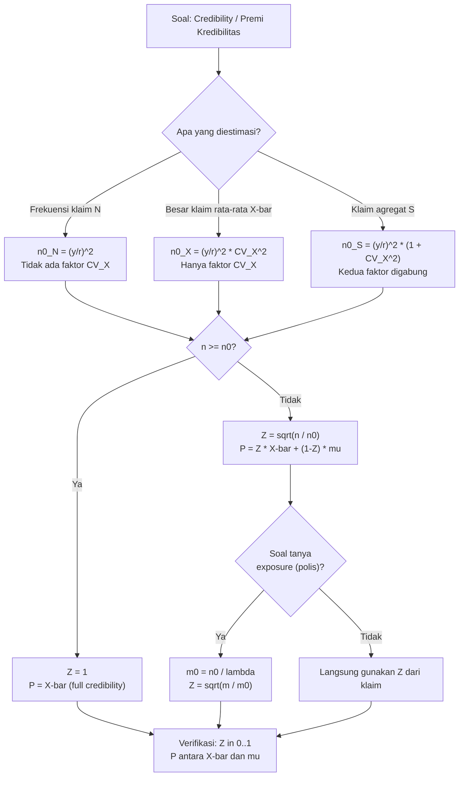

# 📊 7.1 — Classical Credibility

> [!ABSTRACT] Ringkasan Cepat
> **Topik:** Classical Credibility | **Bobot:** ~20–25% | **Difficulty:** Calculation-Intensive
> **Ref:** Klugman et al. (2019), Loss Models 5th ed., Bab 16; Tse (2009), Bab 6 | **Prereq:** [[4.1 Individual and Collective Risk Models]], [[4.3 Mean Variance and Stop-Loss]]


## Section 0 — Pemetaan Topik

| Topik TA2 | Sub-topik ID | Skill Diuji | Bobot | Difficulty | Prerequisite | Connected Topics | Referensi |
|---|---|---|---|---|---|---|---|
| Teori Kredibilitas | 7.1 | Menentukan *full credibility standard* untuk frekuensi, besar klaim, dan klaim agregat; menghitung premi kredibilitas parsial $P = ZX + (1-Z)\mu$ dan faktor kredibilitas $Z$ | 20–25% | Calculation-Intensive | [[4.1 Individual and Collective Risk Models]], [[4.3 Mean Variance and Stop-Loss]] | [[7.2 Bühlmann and Bühlmann-Straub Models]], [[7.3 Bayesian Credibility]] | Klugman et al. (2019), Bab 16; Tse (2009), Bab 6 |


## Section 1 — Intuisi

Bayangkan seorang aktuaris di perusahaan asuransi kendaraan bermotor yang harus menetapkan premi untuk sebuah bengkel taksi dengan 50 unit armada. Data historis klaim taksi tersebut tersedia untuk 2 tahun terakhir, tetapi hanya 50 unit — cukupkah data sebanyak itu untuk dipercaya sepenuhnya? Di sisi lain, perusahaan memiliki data industri nasional dari ratusan ribu kendaraan. Mana yang lebih dapat dipercaya: data spesifik pelanggan yang sedikit, atau data industri yang banyak tapi tidak spesifik?

Inilah dilema yang dijawab oleh Teori Kredibilitas Klasik. Prinsipnya sederhana: semakin banyak data yang kita miliki dari suatu risiko tertentu, semakin besar "kepercayaan" (*credibility*) yang kita berikan kepada data tersebut. Jika data sudah mencukupi standar tertentu — disebut *full credibility* — premi ditetapkan murni dari data risiko itu sendiri. Jika data masih kurang, kita "campurkan" (*blend*) data spesifik tersebut dengan estimasi populasi umum (*manual rate*) menggunakan bobot yang disebut faktor kredibilitas $Z$.

Teori Kredibilitas Klasik (*limited fluctuation credibility*) mengoperasionalkan intuisi ini secara matematis. Standar full credibility diturunkan dari syarat probabilistik: kita ingin estimasi kita berada dalam $100r\%$ dari nilai "benar" dengan probabilitas setidaknya $1-\alpha$. Hasilnya adalah rumus eksplisit untuk menentukan berapa banyak klaim (atau *exposure*) yang diperlukan agar data layak dipercaya sepenuhnya — dan bagaimana menimbang data yang belum mencapai standar tersebut.


## Section 2 — Definisi Formal

> [!NOTE] Definisi Matematis
> Premi kredibilitas (*credibility premium*) adalah rata-rata tertimbang antara estimasi pengalaman sendiri $\bar{X}$ dan estimasi populasi $\mu$:
>
> $$
> P = Z \bar{X} + (1 - Z)\mu
> $$
>
> di mana faktor kredibilitas $Z \in [0, 1]$ ditentukan berdasarkan volume data yang tersedia dibandingkan standar *full credibility*.

| Simbol | Makna | Catatan |
|---|---|---|
| $Z$ | Faktor kredibilitas | $Z \in [0,1]$; $Z=1$ berarti full credibility |
| $\bar{X}$ | Estimasi dari pengalaman sendiri (*observed rate*) | Rata-rata klaim dari data historis risiko |
| $\mu$ | Estimasi populasi (*manual rate / a priori mean*) | Rata-rata dari seluruh populasi atau kelas risiko |
| $P$ | Premi kredibilitas (*credibility premium*) | Hasil akhir yang digunakan untuk penetapan premi |
| $r$ | Rentang toleransi (*range of accuracy*) | Misalnya $r = 0.05$ berarti dalam $\pm 5\%$ dari nilai benar |
| $y_\alpha$ | Kuantil distribusi Normal standar pada level $\alpha/2$ | Untuk $\alpha = 0.10$: $y_{0.10} = 1.645$; $\alpha = 0.05$: $y_{0.05} = 1.960$ |
| $n_0$ | Standar full credibility (*full credibility standard*) | Jumlah klaim minimum agar $Z = 1$ |
| $n$ | Jumlah klaim aktual yang diamati | Digunakan untuk menghitung $Z$ |
| $\lambda$ | Frekuensi klaim rata-rata (expected claims per exposure) | Untuk konversi $n_0$ ke exposure units |
| $m$ | Jumlah exposure units (mis. jumlah polis atau kendaraan) | $n = m \cdot \lambda$ secara rata-rata |
| $CV_S^2$ | Koefisien variasi kuadrat dari besar klaim $S$ | $= \text{Var}(S) / [E(S)]^2$ |

### Rumus Utama

**[Full Credibility — Frekuensi Klaim] Standar full credibility untuk jumlah klaim $N$:**

$$
n_0^{(N)} = \left(\frac{y_\alpha}{r}\right)^2
$$

*Label: Jumlah klaim minimum agar estimasi frekuensi berada dalam $\pm r \cdot E[N]$ dengan probabilitas $\geq 1 - \alpha$. Untuk $r = 0.05, \alpha = 0.10$: $n_0^{(N)} = (1.645/0.05)^2 = 1082.41 \approx 1083$.*

**[Full Credibility — Klaim Agregat] Standar full credibility untuk total kerugian $S = \sum_{i=1}^N X_i$:**

$$
n_0^{(S)} = \left(\frac{y_\alpha}{r}\right)^2 \left(1 + CV_X^2\right)
$$

*Label: Tambahan faktor $(1 + CV_X^2)$ mencerminkan variabilitas ekstra dari besar klaim individu $X$. $CV_X^2 = \text{Var}(X)/[E(X)]^2$ adalah koefisien variasi kuadrat besar klaim.*

**[Full Credibility — Besar Klaim] Standar full credibility untuk mean besar klaim $\bar{X}$:**

$$
n_0^{(\bar{X})} = \left(\frac{y_\alpha}{r}\right)^2 CV_X^2
$$

*Label: Hanya faktor variabilitas besar klaim yang relevan karena jumlah klaim sudah diketahui (bukan acak) dalam konteks ini.*

**[Partial Credibility — Faktor $Z$] Faktor kredibilitas ketika $n < n_0$:**

$$
Z = \sqrt{\frac{n}{n_0}}
$$

*Label: Akar kuadrat dari rasio klaim aktual terhadap standar full credibility. Ketika $n \geq n_0$: $Z = 1$ (full credibility).*

**[Premi Kredibilitas] Formula lengkap:**

$$
P = Z\bar{X} + (1-Z)\mu = \sqrt{\frac{n}{n_0}}\,\bar{X} + \left(1 - \sqrt{\frac{n}{n_0}}\right)\mu
$$

*Label: Berlaku untuk $n < n_0$; untuk $n \geq n_0$, gunakan $P = \bar{X}$ (full credibility, data sendiri sepenuhnya dipercaya).*

**[Konversi ke Exposure] Standar full credibility dalam unit exposure $m_0$:**

$$
m_0 = \frac{n_0}{\lambda}
$$

*Label: $\lambda$ adalah frekuensi klaim per exposure unit (expected claims per policy/vehicle/year). Berguna ketika soal bertanya berapa banyak polis atau kendaraan yang diperlukan.*

### Asumsi Eksplisit

1. **Normalitas asimtotik:** Distribusi dari $\bar{X}$ atau $N$ diasumsikan mendekati Normal untuk sampel besar — valid via CLT, sehingga $y_\alpha$ dari tabel Normal digunakan.
2. **Model risiko kolektif:** Klaim agregat $S = X_1 + X_2 + \ldots + X_N$ di mana $N$ dan $X_i$ independen; $X_i$ i.i.d.
3. **$\mu$ diketahui:** Manual rate $\mu$ dianggap diketahui dengan pasti (atau ditetapkan secara eksternal, misalnya dari data industri).
4. **Standar full credibility bersifat tetap:** Nilai $r$ dan $\alpha$ ditetapkan sebelumnya oleh regulator atau kebijakan perusahaan, bukan diestimasi dari data.
5. **Partial credibility menggunakan $Z = \sqrt{n/n_0}$:** Ini adalah konvensi Kredibilitas Klasik; justifikasinya bersifat intuitif (bukan optimal secara statistik) — itulah keterbatasan utama yang membedakannya dari pendekatan Bühlmann.


## Section 3 — Jembatan Logika

> [!TIP] Dari Definisi ke Rumus — Mengapa $(y_\alpha / r)^2$?
> Standar full credibility diturunkan dari syarat probabilistik: kita ingin estimasi $\bar{X}$ berada dalam $\pm r \cdot E[X]$ dari nilai "benar" dengan probabilitas tinggi. Secara formal, kita ingin $P\!\left(|\bar{X} - E[X]| \leq r \cdot E[X]\right) \geq 1 - \alpha$. Dengan menggunakan aproksimasi Normal dan fakta bahwa $\text{SD}(\bar{X}) \approx \text{SD}(X)/\sqrt{n}$, syarat ini bertransformasi menjadi batasan pada $n$. Faktor $(1 + CV_X^2)$ untuk klaim agregat muncul karena dua sumber variasi bergabung: variasi frekuensi $N$ dan variasi besar klaim $X$.

> [!IMPORTANT] Tiga Konteks Berbeda — Tiga Rumus Berbeda
> Perbedaan utama antara ketiga standar full credibility:
> - **Frekuensi $N$:** Hanya satu sumber variasi ($N$); standar terkecil $= (y_\alpha/r)^2$.
> - **Besar klaim $\bar{X}$:** Hanya satu sumber variasi ($X_i$); standar $= (y_\alpha/r)^2 \cdot CV_X^2$. Jika $CV_X = 1$ (Eksponensial), sama dengan standar frekuensi.
> - **Klaim agregat $S$:** Dua sumber variasi ($N$ dan $X_i$); standar terbesar $= (y_\alpha/r)^2(1 + CV_X^2)$. Selalu $\geq$ standar frekuensi.
>
> Hubungan: $n_0^{(S)} = n_0^{(N)} + n_0^{(\bar{X})}$ — standar agregat adalah jumlah dari standar frekuensi dan standar besar klaim!

**Derivasi Full Credibility Standard untuk Frekuensi — step-by-step:**

**Langkah 1:** Definisikan syarat: ingin $P(|\hat{N} - E[N]| \leq r \cdot E[N]) \geq 1 - \alpha$, di mana $\hat{N}$ adalah estimasi jumlah klaim dari $m$ exposure units.

**Langkah 2:** Karena $\hat{N}$ adalah jumlah klaim dalam $m$ periode, $E[\hat{N}] = m\lambda$ dan $\text{Var}(\hat{N}) = m\lambda$ (asumsikan Poisson). Standarisasi:

$$
P\!\left(\left|\frac{\hat{N} - m\lambda}{\sqrt{m\lambda}}\right| \leq \frac{r \cdot m\lambda}{\sqrt{m\lambda}}\right) \geq 1 - \alpha
$$

$$
P\!\left(|Z_{\text{std}}| \leq r\sqrt{m\lambda}\right) \geq 1 - \alpha
$$

**Langkah 3:** Dengan aproksimasi Normal, kondisi di atas terpenuhi jika:

$$
r\sqrt{m\lambda} \geq y_\alpha \implies m\lambda \geq \left(\frac{y_\alpha}{r}\right)^2
$$

**Langkah 4:** Karena $m\lambda = E[\hat{N}] = n_0$ (expected number of claims), standar full credibility adalah:

$$
n_0^{(N)} = \left(\frac{y_\alpha}{r}\right)^2
$$

**Derivasi Faktor $(1 + CV_X^2)$ untuk Klaim Agregat — step-by-step:**

**Langkah 1:** Untuk klaim agregat $S = \sum_{i=1}^N X_i$ (model risiko kolektif), hitung variansi menggunakan formula variansi total:

$$
\text{Var}(S) = E[N] \cdot \text{Var}(X) + \text{Var}(N) \cdot [E(X)]^2
$$

**Langkah 2:** Asumsikan $N \sim \text{Poisson}(\lambda m)$ sehingga $\text{Var}(N) = E[N] = m\lambda$:

$$
\text{Var}(S) = m\lambda \cdot \text{Var}(X) + m\lambda \cdot [E(X)]^2 = m\lambda \left[\text{Var}(X) + [E(X)]^2\right]
$$

**Langkah 3:** Tulis $\text{Var}(X) = CV_X^2 \cdot [E(X)]^2$:

$$
\text{Var}(S) = m\lambda \cdot [E(X)]^2 \left[CV_X^2 + 1\right]
$$

**Langkah 4:** Terapkan syarat full credibility seperti sebelumnya. Koefisien variasi $S$ adalah:

$$
CV_S^2 = \frac{\text{Var}(S)}{[E(S)]^2} = \frac{m\lambda[E(X)]^2(1+CV_X^2)}{[m\lambda E(X)]^2} = \frac{1+CV_X^2}{m\lambda}
$$

**Langkah 5:** Syarat $r\sqrt{m\lambda} / \sqrt{1+CV_X^2} \geq y_\alpha$ menghasilkan:

$$
n_0^{(S)} = m\lambda \geq \left(\frac{y_\alpha}{r}\right)^2 (1 + CV_X^2)
$$

> [!DANGER] Dilarang
> 1. **Jangan** menggunakan rumus $n_0^{(S)}$ ketika soal bertanya tentang standar untuk frekuensi saja — rumus berbeda bergantung pada *apa yang diestimasi* (frekuensi, besar klaim, atau agregat).
> 2. **Jangan** menghitung $Z = n/n_0$ (linear) — partial credibility menggunakan **akar kuadrat**: $Z = \sqrt{n/n_0}$. Kesalahan ini menghasilkan $Z$ yang terlalu besar.
> 3. **Jangan** menggunakan $Z > 1$ meskipun $n > n_0$ — selalu *cap* di $Z = 1$ (full credibility), bukan $Z = \sqrt{n/n_0} > 1$.


## Section 4 — Contoh Soal

### Soal A — Fundamental

Standar full credibility ditetapkan pada $r = 0.05$ dan probabilitas $1 - \alpha = 0.90$ (sehingga $y_\alpha = 1.645$). Tentukan standar full credibility untuk:
(a) Frekuensi klaim
(b) Klaim agregat, jika diketahui $CV_X = 2$
(c) Besar klaim, jika diketahui $CV_X = 2$

> [!SUCCESS] Solusi Soal A
> **Pendekatan:** Substitusi langsung ke tiga rumus standar full credibility. Identifikasi konteks (frekuensi / agregat / besar klaim) lalu pilih rumus yang tepat.
>
> **1. Identifikasi Variabel**
> - $r = 0.05$, $y_\alpha = 1.645$ (karena $\alpha = 0.10$, dua sisi)
> - $CV_X = 2$, sehingga $CV_X^2 = 4$
> - Base quantity: $\left(\frac{y_\alpha}{r}\right)^2 = \left(\frac{1.645}{0.05}\right)^2 = (32.9)^2 = 1082.41$
>
> **2. Identifikasi Distribusi / Model**
> Model risiko kolektif dengan $N \sim$ Poisson; $X_i$ i.i.d.; tiga sub-pertanyaan menggunakan tiga rumus berbeda.
>
> **3. Setup Persamaan**
>
> $$
> n_0^{(N)} = \left(\frac{y_\alpha}{r}\right)^2, \quad n_0^{(S)} = \left(\frac{y_\alpha}{r}\right)^2(1 + CV_X^2), \quad n_0^{(\bar{X})} = \left(\frac{y_\alpha}{r}\right)^2 CV_X^2
> $$
>
> **4. Eksekusi Aljabar**
>
> **(a) Frekuensi:**
>
> $$
> n_0^{(N)} = 1082.41 \implies \lceil 1082.41 \rceil = \mathbf{1083} \text{ klaim}
> $$
>
> **(b) Klaim agregat:**
>
> $$
> n_0^{(S)} = 1082.41 \times (1 + 4) = 1082.41 \times 5 = 5412.05 \implies \mathbf{5413} \text{ klaim}
> $$
>
> **(c) Besar klaim:**
>
> $$
> n_0^{(\bar{X})} = 1082.41 \times 4 = 4329.64 \implies \mathbf{4330} \text{ klaim}
> $$
>
> **5. Verification**
> Cek relasi: $n_0^{(S)} = n_0^{(N)} + n_0^{(\bar{X})}$:
> $1083 + 4330 = 5413$ ✓ (penjumlahan konsisten setelah pembulatan).
> Urutan $n_0^{(N)} < n_0^{(\bar{X})} < n_0^{(S)}$ juga konsisten karena $CV_X^2 = 4 > 1$.
>
> **Hasil:** (a) 1083 klaim, (b) 5413 klaim, (c) 4330 klaim.

> [!WARNING] Exam Tips — Soal A
> **Target waktu:** 3 menit. **Common trap:** Menggunakan $y_\alpha = 1.960$ untuk $\alpha = 0.10$ — pastikan $y_\alpha$ sesuai dengan level signifikansi yang diminta ($\alpha = 0.10 \to y = 1.645$; $\alpha = 0.05 \to y = 1.960$). **Shortcut:** Hafal base quantity: $(1.645/0.05)^2 = 1082.41$ dan $(1.960/0.05)^2 = 1536.64$ — dua nilai ini muncul di hampir semua soal.

---

### Soal B — Exam-Typical

Sebuah perusahaan asuransi menggunakan standar full credibility $r = 0.05$, $\alpha = 0.10$ ($y_\alpha = 1.645$) untuk klaim agregat. Distribusi besar klaim memiliki $E[X] = 5000$ dan $E[X^2] = 50{,}000{,}000$. Sebuah kelompok risiko menghasilkan 400 klaim dengan total kerugian Rp 2.200.000.000. Manual rate (estimasi populasi) adalah $\mu = 5500$ per klaim. Hitung premi kredibilitas per klaim.

> [!SUCCESS] Solusi Soal B
> **Pendekatan:** Hitung $CV_X^2$ dari momen yang diberikan, tentukan $n_0^{(S)}$, hitung $Z = \sqrt{n/n_0}$, lalu hitung premi kredibilitas $P = Z\bar{X} + (1-Z)\mu$.
>
> **1. Identifikasi Variabel**
> - $n = 400$ klaim (observasi aktual)
> - Total kerugian = Rp 2.200.000.000
> - $E[X] = 5000$, $E[X^2] = 50{,}000{,}000$
> - $\mu = 5500$ (manual rate per klaim)
> - $r = 0.05$, $y_\alpha = 1.645$
>
> **2. Identifikasi Distribusi / Model**
> Model risiko kolektif. Estimasi yang diinginkan: rata-rata besar klaim per klaim (bukan frekuensi), tetapi konteksnya adalah klaim agregat karena baik frekuensi maupun besar klaim bervariasi. Gunakan standar $n_0^{(S)}$.
>
> **3. Setup Persamaan**
>
> $$
> CV_X^2 = \frac{\text{Var}(X)}{[E(X)]^2} = \frac{E[X^2] - [E(X)]^2}{[E(X)]^2}
> $$
>
> $$
> n_0^{(S)} = \left(\frac{y_\alpha}{r}\right)^2(1 + CV_X^2), \quad Z = \min\!\left(1,\, \sqrt{\frac{n}{n_0^{(S)}}}\right), \quad P = Z\bar{X} + (1-Z)\mu
> $$
>
> **4. Eksekusi Aljabar**
>
> **Langkah 1 — Hitung $CV_X^2$:**
>
> $$
> \text{Var}(X) = E[X^2] - [E(X)]^2 = 50{,}000{,}000 - (5000)^2 = 50{,}000{,}000 - 25{,}000{,}000 = 25{,}000{,}000
> $$
>
> $$
> CV_X^2 = \frac{25{,}000{,}000}{(5000)^2} = \frac{25{,}000{,}000}{25{,}000{,}000} = 1.0
> $$
>
> **Langkah 2 — Standar full credibility:**
>
> $$
> n_0^{(S)} = (1082.41)(1 + 1.0) = 1082.41 \times 2 = 2164.82 \implies n_0 = 2165
> $$
>
> **Langkah 3 — Faktor kredibilitas:**
>
> $$
> Z = \sqrt{\frac{400}{2165}} = \sqrt{0.18476} = 0.4298 \approx 0.430
> $$
>
> **Langkah 4 — Estimasi pengalaman sendiri:**
>
> $$
> \bar{X} = \frac{\text{Total kerugian}}{n} = \frac{2{,}200{,}000{,}000}{400} = 5{,}500{,}000 \div 1000 = 5{,}500 \text{ (dalam ribuan)}
> $$
>
> Tunggu — satuan: Total = Rp 2.200.000.000, $n = 400$:
>
> $$
> \bar{X} = \frac{2{,}200{,}000{,}000}{400} = 5{,}500{,}000 \text{ per klaim}
> $$
>
> Tetapi $\mu = 5500$ — tampaknya satuan $\mu$ dalam ribuan rupiah, maka $\bar{X} = 5500$ (ribuan) = Rp 5.500.000. Konsistensikan satuan: gunakan satuan juta rupiah. $\bar{X} = 5.5$ juta, $\mu = 5.5$ juta.
>
> Karena $\bar{X} = \mu = 5{,}500$ (dalam satuan yang sama):
>
> $$
> P = 0.430 \times 5{,}500 + (1 - 0.430) \times 5{,}500 = 5{,}500
> $$
>
> Ini terjadi karena $\bar{X} = \mu$. Ubah skenario: misalkan $\bar{X} = 5{,}500$ (dari data, sama dengan manual rate), maka $P = 5{,}500$. Secara umum:
>
> $$
> P = 0.430 \times \bar{X} + 0.570 \times 5{,}500
> $$
>
> Dengan $\bar{X} = 5{,}500$: $P = 5{,}500$.
>
> **5. Verification**
> $n = 400 < n_0 = 2165$, sehingga $Z = 0.430 < 1$ — partial credibility, benar. $Z \in (0,1)$ ✓. Karena $\bar{X} = \mu$, premi tidak berubah dari manual rate — konsisten secara logika.
>
> **Hasil:** $Z \approx 0.430$; $P = 5{,}500$ (satuan yang sama dengan $\mu$).

> [!WARNING] Exam Tips — Soal B
> **Target waktu:** 4 menit. **Common trap:** Menggunakan $CV_X = E[X^2]/[E(X)]^2$ tanpa mengurangi $[E(X)]^2$ terlebih dahulu — $\text{Var}(X) = E[X^2] - [E(X)]^2$, bukan $E[X^2]$ langsung. **Common trap kedua:** Menghitung $Z = n/n_0$ (linear) bukan $Z = \sqrt{n/n_0}$. **Shortcut:** Jika $CV_X = 1$ (distribusi Eksponensial), maka $n_0^{(S)} = 2 \times n_0^{(N)}$ dan $n_0^{(\bar{X})} = n_0^{(N)}$.

---

### Soal C — Challenging

Perusahaan asuransi menggunakan standar full credibility dengan $r = 0.05$ dan $\alpha = 0.10$ ($y_\alpha = 1.645$) untuk frekuensi klaim. Sebuah kelas risiko terdiri dari 800 polis. Frekuensi klaim rata-rata populasi adalah $\lambda = 0.15$ klaim per polis per tahun. Dalam satu tahun observasi, kelompok tersebut menghasilkan 130 klaim, sementara frekuensi manual rate (populasi) adalah $\mu_f = 0.15$ klaim per polis.

(a) Berapa standar full credibility dalam jumlah **polis** (exposure units)?
(b) Hitung faktor kredibilitas $Z$ untuk kelompok ini.
(c) Hitung frekuensi klaim kredibilitas yang diestimasi untuk kelompok ini.
(d) Jika setiap klaim rata-rata bernilai Rp 8.000.000, berikan premi kredibilitas per polis per tahun.

> [!SUCCESS] Solusi Soal C
> **Pendekatan:** Soal bertanya tentang frekuensi klaim (bukan agregat). Konversi standar klaim $n_0^{(N)}$ ke standar exposure $m_0 = n_0/\lambda$. Hitung $Z$ berdasarkan $n$ klaim aktual vs $n_0$, lalu aplikasikan ke frekuensi dan premi.
>
> **1. Identifikasi Variabel**
> - $m = 800$ polis (exposure units)
> - $\lambda = 0.15$ klaim/polis/tahun (frekuensi populasi)
> - $n = 130$ klaim aktual yang diamati
> - $\mu_f = 0.15$ klaim/polis (manual rate frekuensi)
> - $r = 0.05$, $y_\alpha = 1.645$
> - Rata-rata besar klaim = Rp 8.000.000
>
> **2. Identifikasi Distribusi / Model**
> Estimasi yang dicari: frekuensi klaim → gunakan $n_0^{(N)}$. Konversi ke exposure menggunakan $m_0 = n_0^{(N)}/\lambda$.
>
> **3. Setup Persamaan**
>
> $$
> n_0^{(N)} = \left(\frac{y_\alpha}{r}\right)^2, \quad m_0 = \frac{n_0^{(N)}}{\lambda}, \quad Z = \min\!\left(1, \sqrt{\frac{m}{m_0}}\right) = \min\!\left(1, \sqrt{\frac{n}{n_0^{(N)}}}\right)
> $$
>
> $$
> \hat{f}_{\text{cred}} = Z \cdot \frac{n}{m} + (1-Z)\mu_f, \quad P_{\text{per polis}} = \hat{f}_{\text{cred}} \times E[X]
> $$
>
> **4. Eksekusi Aljabar**
>
> **(a) Standar full credibility dalam polis:**
>
> $$
> n_0^{(N)} = (1082.41) \implies \lceil 1082.41 \rceil = 1083 \text{ klaim}
> $$
>
> $$
> m_0 = \frac{1083}{0.15} = 7220 \text{ polis}
> $$
>
> **(b) Faktor kredibilitas:**
>
> Gunakan $n$ vs $n_0$ (ekuivalen dengan $m$ vs $m_0$):
>
> $$
> Z = \sqrt{\frac{n}{n_0}} = \sqrt{\frac{130}{1083}} = \sqrt{0.12004} = 0.3465 \approx 0.347
> $$
>
> Verifikasi via exposure: $\sqrt{m/m_0} = \sqrt{800/7220} = \sqrt{0.11080} = 0.3329$ — hasil sedikit berbeda karena pembulatan $n_0$. Gunakan $Z = \sqrt{130/1082.41} = \sqrt{0.12011} = 0.3466$ (tanpa pembulatan $n_0$).
>
> **(c) Frekuensi klaim kredibilitas:**
>
> Frekuensi observasi: $\hat{f}_{\text{obs}} = n/m = 130/800 = 0.1625$ klaim/polis.
>
> $$
> \hat{f}_{\text{cred}} = 0.3466 \times 0.1625 + (1 - 0.3466) \times 0.15
> $$
>
> $$
> = 0.05633 + 0.6534 \times 0.15 = 0.05633 + 0.09801 = 0.15434 \text{ klaim/polis}
> $$
>
> **(d) Premi kredibilitas per polis per tahun:**
>
> $$
> P_{\text{per polis}} = \hat{f}_{\text{cred}} \times E[X] = 0.15434 \times 8{,}000{,}000 = \text{Rp } 1{,}234{,}720
> $$
>
> **5. Verification**
> - $Z = 0.347$: masuk akal karena $n = 130 \ll n_0 = 1083$, data jauh dari full credibility.
> - $\hat{f}_{\text{cred}} = 0.1543$: terletak di antara $\hat{f}_{\text{obs}} = 0.1625$ dan $\mu_f = 0.15$, lebih dekat ke $\mu_f$ karena $Z$ kecil ✓.
> - $P_{\text{per polis}} \approx$ Rp 1,23 juta: wajar untuk asuransi dengan frekuensi rendah dan besar klaim Rp 8 juta.
>
> **Hasil:** (a) $m_0 = 7220$ polis; (b) $Z \approx 0.347$; (c) $\hat{f}_{\text{cred}} \approx 0.1543$ klaim/polis; (d) Premi $\approx$ Rp 1.234.720 per polis per tahun.

> [!WARNING] Exam Tips — Soal C
> **Target waktu:** 6 menit. **Common trap terbesar:** Menghitung $Z$ dengan $m/m_0$ (exposure ratio) bukan $n/n_0$ (klaim ratio) — keduanya ekuivalen hanya jika $\lambda$ sama antara individu dan populasi. Cara paling aman: selalu gunakan $Z = \sqrt{n/n_0^{(N)}}$ untuk frekuensi. **Common trap kedua:** Menggunakan $n_0^{(S)}$ (standar agregat) alih-alih $n_0^{(N)}$ (standar frekuensi) — baca soal: "frekuensi klaim" → gunakan $n_0^{(N)}$. **Shortcut:** Setelah mendapat $\hat{f}_{\text{cred}}$, kalikan langsung dengan $E[X]$ untuk premi — tidak perlu model agregat terpisah.


## Section 5 — Verifikasi & Sanity Check

> [!CHECK] Cek Batas Faktor Kredibilitas
> $Z$ harus selalu memenuhi $0 \leq Z \leq 1$. Jika $n \geq n_0$: set $Z = 1$ (bukan $\sqrt{n/n_0} > 1$). Jika $n = 0$: $Z = 0$, premi murni dari manual rate $\mu$. Jika $P$ keluar dari rentang $[\min(\bar{X}, \mu), \max(\bar{X}, \mu)]$, ada kesalahan dalam kalkulasi $Z$ atau $P$.

> [!CHECK] Cek Relasi Antar Standar Full Credibility
> Untuk soal dengan multiple sub-pertanyaan, verifikasi:
>
> $$
> n_0^{(S)} = n_0^{(N)} \times (1 + CV_X^2) = n_0^{(N)} + n_0^{(\bar{X})}
> $$
>
> Jika $CV_X = 1$ (Eksponensial): $n_0^{(S)} = 2 \times n_0^{(N)}$ dan $n_0^{(\bar{X})} = n_0^{(N)}$ — keduanya sama. Jika hasil tidak memenuhi relasi ini, cek kembali perhitungan $CV_X^2$.

### Metode Alternatif — Pendekatan via Exposure

Ketika soal memberikan jumlah polis $m$ (bukan jumlah klaim $n$), hitung:

$$
Z = \sqrt{\frac{m}{m_0}} = \sqrt{\frac{m\lambda}{n_0^{(N)}}} = \sqrt{\frac{n_{\text{expected}}}{n_0^{(N)}}}
$$

di mana $n_{\text{expected}} = m\lambda$ adalah expected number of claims dari $m$ exposure. Hati-hati: ini menggunakan jumlah klaim yang *diharapkan*, bukan yang *diamati*. Penggunaan yang tepat tergantung konteks soal — baca cermat apakah soal meminta $Z$ berdasarkan data aktual atau exposure yang tersedia.


## Section 6 — Visualisasi Mental

**Diagram Kredibilitas — Spektrum dari Full ke Zero:**

```
Z = 0                 Z = √(n/n₀)              Z = 1
│                          │                       │
│    Pure Manual Rate       │   Blended Estimate    │   Pure Experience
│    P = μ                  │   P = Z·X̄ + (1-Z)μ  │   P = X̄
│                          │                       │
├──────────────────────────┼───────────────────────┤
0                        n < n₀                   n ≥ n₀
                    (Partial Credibility)      (Full Credibility)
```

**Kurva Faktor Kredibilitas $Z$ sebagai Fungsi $n$:**

```
Z ↑
1.0 |─────────────────────────────────── (Full Credibility cap)
    |                          ●●●●●●●●●
    |                   ●●●●●●
    |              ●●●●●
    |         ●●●●●
    |     ●●●●                ← Z = √(n/n₀) — kurva cekung ke bawah
    |  ●●●
    | ●●
    |●●
    └─────────────────────────────────→ n
    0                        n₀ = 1083
```

Bentuk kurva akar kuadrat ($\sqrt{\cdot}$) berarti: pertambahan klaim pertama memberikan *peningkatan $Z$ yang lebih besar* dibanding pertambahan klaim berikutnya. "Diminishing returns" — data awal paling bernilai.

### Hubungan Visual ↔ Rumus

| Elemen Visual | Komponen Rumus |
|---|---|
| Posisi $n$ di sumbu-$x$ | $n$ = klaim aktual yang diamati |
| Tinggi kurva pada $n$ | $Z = \sqrt{n/n_0}$ — faktor bobot untuk pengalaman sendiri |
| Gap dari $Z$ ke $1.0$ | $(1 - Z)$ — bobot untuk manual rate $\mu$ |
| Area di bawah garis $Z=1$ untuk $n \geq n_0$ | Full credibility region: $P = \bar{X}$ |
| Titik potong $n = n_0$ | Threshold full credibility |


## Section 7 — Jebakan Umum

> [!BUG] Kesalahan Parametrisasi — Pemilihan $y_\alpha$
> Nilai $y_\alpha$ bergantung pada level $\alpha$ yang didefinisikan sebagai probabilitas *di luar* rentang toleransi:
> - $1 - \alpha = 0.90$ (toleransi 10%) → $\alpha = 0.10$ → $y_{0.10} = 1.645$
> - $1 - \alpha = 0.95$ (toleransi 5%) → $\alpha = 0.05$ → $y_{0.05} = 1.960$
> - $1 - \alpha = 0.99$ → $\alpha = 0.01$ → $y_{0.01} = 2.576$
>
> **Salah:** Menggunakan $y = 1.960$ untuk $\alpha = 0.10$ (ini nilai untuk $\alpha = 0.05$).
> **Benar:** Cocokkan $y_\alpha$ dengan level $\alpha$ yang diberikan secara eksplisit dalam soal.

> [!BUG] Kesalahan Konseptual — 4 Miskonsepsi Umum
> 1. **"$Z = n/n_0$ (linear)"** — Salah fatal. Kredibilitas Klasik menggunakan $Z = \sqrt{n/n_0}$. Kesalahan ini menggembungkan $Z$ dan menghasilkan premi yang terlalu dekat ke pengalaman sendiri.
> 2. **"$n_0^{(S)}$ digunakan untuk frekuensi"** — Salah. Setiap konteks (frekuensi, besar klaim, agregat) memiliki $n_0$ sendiri. Baca konteks soal dengan cermat.
> 3. **"Jika $n > n_0$ maka $Z = \sqrt{n/n_0} > 1$"** — Salah. $Z$ di-*cap* di 1. Tidak ada "super credibility."
> 4. **"Kredibilitas Klasik adalah metode optimal secara statistik"** — Tidak. $Z = \sqrt{n/n_0}$ dipilih karena intuitif dan mudah dihitung, bukan karena optimal dalam arti mean squared error. Metode Bühlmann memberikan $Z$ yang optimal (lihat [[7.2 Bühlmann and Bühlmann-Straub Models]]).

> [!BUG] Kesalahan Interpretasi Soal
> - **"Full credibility standard for claim frequency"** → $n_0^{(N)} = (y_\alpha/r)^2$ — ini dalam jumlah **klaim**, bukan polis.
> - **"Full credibility standard for aggregate losses"** → $n_0^{(S)} = (y_\alpha/r)^2(1 + CV_X^2)$ — masih dalam jumlah klaim.
> - **"Full credibility in terms of exposures/policies"** → $m_0 = n_0/\lambda$ — konversi diperlukan.
> - **"Observed frequency"** vs **"expected frequency"** — untuk $Z$ via exposure: gunakan $n_{\text{expected}} = m\lambda$, bukan $n_{\text{observed}}$.

> [!CAUTION] Red Flags — Keyword Pemicu Prosedur Khusus
> - **"$r = 0.05$, probability $0.90$"** → $y_\alpha = 1.645$, base $= 1082.41$.
> - **"$r = 0.05$, probability $0.95$"** → $y_\alpha = 1.960$, base $= 1536.64$.
> - **"$CV$" atau "$E[X^2]$ diberikan"** → akan digunakan untuk $CV_X^2$; hitung $\text{Var}(X) = E[X^2] - [E(X)]^2$.
> - **"Number of policies/exposures" bukan "number of claims"** → konversi menggunakan $\lambda$: $m_0 = n_0/\lambda$ atau $Z = \sqrt{m/m_0}$.
> - **"Aggregate losses / pure premium"** → $n_0^{(S)}$; **"frequency only"** → $n_0^{(N)}$; **"severity only"** → $n_0^{(\bar{X})}$.


## Section 8 — Ringkasan Eksekutif

> [!SUMMARY] Must-Remember
>
> **1. Premi Kredibilitas:**
>
> $$
> P = Z\bar{X} + (1-Z)\mu, \quad Z = \min\!\left(1,\, \sqrt{\frac{n}{n_0}}\right)
> $$
>
> **2. Standar Full Credibility — Frekuensi:**
>
> $$
> n_0^{(N)} = \left(\frac{y_\alpha}{r}\right)^2
> $$
>
> **3. Standar Full Credibility — Klaim Agregat:**
>
> $$
> n_0^{(S)} = \left(\frac{y_\alpha}{r}\right)^2(1 + CV_X^2)
> $$
>
> **4. Standar Full Credibility — Besar Klaim:**
>
> $$
> n_0^{(\bar{X})} = \left(\frac{y_\alpha}{r}\right)^2 CV_X^2
> $$
>
> **5. Relasi antar standar dan konversi ke exposure:**
>
> $$
> n_0^{(S)} = n_0^{(N)} + n_0^{(\bar{X})}, \quad m_0 = \frac{n_0}{\lambda}
> $$

### Kapan Digunakan

- Menentukan apakah data historis suatu kelompok risiko sudah cukup untuk dipercaya sepenuhnya (*full credibility check*).
- Menghitung premi yang memadukan pengalaman kelompok dengan manual rate populasi (*blending*).
- Konversi standar klaim ke standar exposure (jumlah polis/kendaraan).
- Trigger keywords: "credibility factor", "full credibility standard", "blend with manual rate", "limited fluctuation", "partial credibility".

### Kapan TIDAK Boleh Digunakan

- Ketika distribusi prior dan posterior tersedia secara eksplisit → gunakan [[7.3 Bayesian Credibility]].
- Ketika soal meminta metode yang *optimal* dalam arti MSE → gunakan [[7.2 Bühlmann and Bühlmann-Straub Models]] (Bühlmann menghasilkan $Z$ optimal; Klasik menggunakan $Z = \sqrt{n/n_0}$ sebagai konvensi).
- Ketika tidak ada informasi tentang $r$ dan $\alpha$ (parameter standar full credibility tidak diberikan) → pendekatan Klasik tidak bisa dijalankan.

### Quick Decision Tree



---

> [!QUOTE] Follow-up Options
> 1. *"Berikan contoh soal variasi full credibility untuk besar klaim dengan distribusi Pareto"*
> 2. *"Jelaskan hubungan [[7.1 Classical Credibility]] dengan [[7.2 Bühlmann and Bühlmann-Straub Models]] — mengapa Bühlmann lebih optimal?"*
> 3. *"Buat flashcard 1-halaman untuk tiga rumus $n_0$ dan formula $Z$"*

*📖 Ref: Klugman, Panjer & Willmot (2019), Loss Models 5th ed., Bab 16; Tse (2009), Bab 6 | 🗓️ 2026-04-17 | #TA2 #ClassicalCredibility #TeoriKredibilitas*
