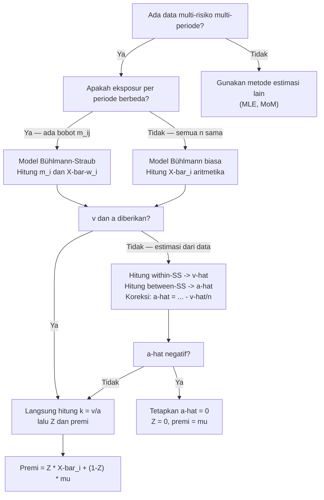

# 📊 7.2 — Bühlmann and Bühlmann-Straub Models

> [!ABSTRACT] Ringkasan Cepat
> **Topik:** Model Bühlmann & Bühlmann-Straub | **Bobot:** ~20–25% (Topik 7) | **Difficulty:** Calculation-Intensive
> **Ref:** Klugman et al. (2019), Bab 16 & 17; Tse (2009), Bab 6 & 7 | **Prereq:** [[7.1 Classical Credibility]], [[6.3 Bayesian Parameter Estimation]]

---

## Section 0 — Pemetaan Topik

| Topik TA2 | Sub-topik ID | Skill Diuji | Bobot | Difficulty | Prerequisite | Connected Topics | Referensi |
|---|---|---|---|---|---|---|---|
| Teori Kredibilitas | 7.2 | Menghitung parameter struktural $\mu$, $v$, $a$; faktor kredibilitas $Z$; premi kredibilitas $Z\bar{X} + (1-Z)\mu$; ekstensi Bühlmann-Straub dengan bobot $m_i$ | 20–25% (bersama Topik 7) | Calculation-Intensive | [[7.1 Classical Credibility]], [[6.3 Bayesian Parameter Estimation]] | [[7.3 Bayesian Credibility]], [[7.4 Empirical Bayesian Methods]] | Klugman et al. (2019), Bab 16 & 17; Tse (2009), Bab 6 & 7 |

---

## Section 1 — Intuisi

Bayangkan sebuah perusahaan asuransi kendaraan bermotor memiliki ribuan nasabah, tapi setiap nasabah individu hanya memiliki beberapa tahun riwayat klaim. Data per nasabah terlalu sedikit untuk memperkirakan risiko mereka secara akurat, namun mengabaikan data individual dan memakai rata-rata portofolio penuh juga terlalu kasar — seorang pengemudi yang tidak pernah klaim selama lima tahun tentu bukan risiko yang sama dengan rata-rata populasi. Model Bühlmann menjawab pertanyaan ini: seberapa besar kepercayaan yang seharusnya kita berikan pada data individu, versus kepercayaan pada rata-rata kelompok besar?

Ide dasarnya elegan: premi terbaik untuk seorang nasabah adalah *rata-rata tertimbang* antara pengalaman klaimnya sendiri dan rata-rata kolektif seluruh portofolio. Bobot yang diberikan pada data individu disebut faktor kredibilitas $Z$ — nilainya antara 0 dan 1. Jika nasabah punya banyak data historis yang relevan, $Z$ mendekati 1 dan kita hampir sepenuhnya mempercayai data individunya. Jika datanya sangat sedikit, $Z$ mendekati 0 dan kita kembali mengandalkan rata-rata kolompok. Besar kecilnya $Z$ ditentukan oleh tiga besaran struktural: rata-rata keseluruhan $\mu$, variabilitas dalam satu risiko ($v$, process variance), dan variabilitas antar risiko ($a$, variance of hypothetical means).

Model Bühlmann-Straub memperluas ide ini untuk situasi yang lebih realistis: tiap nasabah tidak hanya memiliki jumlah periode observasi yang berbeda, tapi juga *volume eksposur* yang berbeda — misalnya jumlah kendaraan yang diasuransikan, atau jumlah karyawan dalam polis asuransi jiwa kelompok. Nasabah korporat yang mengasuransikan 500 kendaraan seharusnya mendapat bobot lebih besar daripada nasabah individu dengan satu kendaraan, meskipun keduanya hanya punya dua tahun riwayat klaim. Model Bühlmann-Straub menangani ini dengan parameter bobot $m_{ij}$, menghasilkan formula kredibilitas yang lebih umum dan lebih kuat dalam praktik aktuaria nyata.

---

## Section 2 — Definisi Formal

> [!NOTE] Definisi Matematis — Premi Kredibilitas Bühlmann
> Misalkan terdapat $r$ risiko independen, dan risiko ke-$i$ memiliki $n$ periode observasi $X_{i1}, X_{i2}, \ldots, X_{in}$. Premi kredibilitas Bühlmann untuk risiko ke-$i$ adalah:
>
> $$
> \hat{\mu}_i = Z_i \bar{X}_i + (1 - Z_i)\mu
> $$
>
> di mana faktor kredibilitas $Z_i = \dfrac{n}{n + k}$, dengan $k = \dfrac{v}{a}$.

**Tabel Variabel & Parameter**

| Simbol | Makna | Catatan |
|---|---|---|
| $r$ | Jumlah risiko (grup/nasabah) | Baris dalam data panel |
| $n$ | Jumlah periode observasi per risiko | Kolom dalam data panel (Bühlmann: sama untuk semua $i$) |
| $X_{ij}$ | Observasi risiko ke-$i$ periode ke-$j$ | Variabel acak; bisa klaim per unit eksposur |
| $\bar{X}_i$ | Rata-rata sampel risiko ke-$i$ | $\bar{X}_i = \frac{1}{n}\sum_{j=1}^n X_{ij}$ |
| $\mu$ | Expected value of hypothetical means | $\mu = E[\mu(\Theta)] = E[X_{ij}]$; rata-rata keseluruhan |
| $v$ | Expected value of process variances | $v = E[\sigma^2(\Theta)] = E[\text{Var}(X_{ij}\|\Theta)]$ |
| $a$ | Variance of hypothetical means | $a = \text{Var}(\mu(\Theta)) = \text{Var}(E[X_{ij}\|\Theta])$ |
| $k$ | Rasio struktural Bühlmann | $k = v/a$; semakin kecil $k$, semakin besar kredibilitas |
| $Z_i$ | Faktor kredibilitas | $Z_i = n/(n+k) \in (0,1)$ |
| $m_{ij}$ | Bobot eksposur (Bühlmann-Straub) | Jumlah unit/eksposur risiko ke-$i$ periode ke-$j$ |
| $m_i$ | Total bobot risiko ke-$i$ | $m_i = \sum_{j=1}^{n_i} m_{ij}$ (Bühlmann-Straub) |

### Rumus Utama

**1. Parameter Struktural — Tiga Besaran Wajib Dihitung:**

$$
\mu = E[X_{ij}], \qquad v = E[\text{Var}(X_{ij}\mid\Theta)], \qquad a = \text{Var}(E[X_{ij}\mid\Theta])
$$

**Label:** Ketiganya diturunkan dari distribusi campuran. Hubungan penting: $\text{Var}(X_{ij}) = v + a$ (hukum variansi total).

**2. Faktor Kredibilitas — Model Bühlmann:**

$$
Z_i = \frac{n}{n + k}, \qquad k = \frac{v}{a}
$$

**Label:** $Z_i$ sama untuk semua risiko jika jumlah periode $n$ sama. $Z \to 1$ ketika $n \to \infty$ atau $k \to 0$.

**3. Premi Kredibilitas — Model Bühlmann:**

$$
\hat{\mu}_i = Z_i \bar{X}_i + (1 - Z_i)\mu
$$

**Label:** Rata-rata tertimbang antara pengalaman individu $\bar{X}_i$ dan rata-rata kolektif $\mu$.

**4. Faktor Kredibilitas — Model Bühlmann-Straub:**

$$
Z_i = \frac{m_i}{m_i + k}, \qquad k = \frac{v}{a}, \qquad m_i = \sum_{j=1}^{n_i} m_{ij}
$$

**Label:** Ekstensi Bühlmann — $n$ digantikan oleh total bobot eksposur $m_i$. Risiko dengan eksposur lebih besar mendapat kredibilitas lebih tinggi.

**5. Premi Kredibilitas — Model Bühlmann-Straub:**

$$
\hat{\mu}_i = Z_i \bar{X}_i^w + (1 - Z_i)\mu, \qquad \bar{X}_i^w = \frac{\sum_{j=1}^{n_i} m_{ij} X_{ij}}{m_i}
$$

**Label:** $\bar{X}_i^w$ adalah rata-rata tertimbang berbobot eksposur. Berbeda dari rata-rata aritmetika biasa.

**6. Estimasi Parameter Struktural dari Data (Bühlmann):**

$$
\hat{\mu} = \bar{X} = \frac{1}{r}\sum_{i=1}^r \bar{X}_i
$$

$$
\hat{v} = \frac{1}{r(n-1)} \sum_{i=1}^r \sum_{j=1}^n (X_{ij} - \bar{X}_i)^2
$$

$$
\hat{a} = \frac{1}{r-1}\sum_{i=1}^r (\bar{X}_i - \bar{X})^2 - \frac{\hat{v}}{n}
$$

**Label:** Estimator ini adalah ANOVA-style. Perhatikan: $\hat{a}$ bisa negatif secara teoritis — jika demikian, tetapkan $\hat{a} = 0$ (kredibilitas nol, gunakan $\mu$).

### Asumsi Eksplisit

1. **Independensi kondisional:** Diberikan $\Theta_i$, observasi $X_{i1}, \ldots, X_{in}$ saling independen dan identik terdistribusi — disebut *conditional i.i.d.*
2. **Independensi antar risiko:** Pasangan $(\Theta_i, X_{i\cdot})$ independen satu sama lain untuk $i \neq i'$ — tiap risiko diperlakukan sebagai unit independen.
3. **Homogenitas struktur:** Semua risiko berasal dari populasi yang sama — $\Theta_i$ berdistribusi sama (i.i.d. dari distribusi prior yang sama), walaupun nilai spesifik $\theta_i$ berbeda.
4. **Keberadaan momen:** $\mu(\theta) = E[X\mid\Theta=\theta]$ dan $\sigma^2(\theta) = \text{Var}(X\mid\Theta=\theta)$ keduanya terdefinisi hingga; $v = E[\sigma^2(\Theta)] > 0$ dan $a = \text{Var}(\mu(\Theta)) \geq 0$.
5. **Bühlmann-Straub tambahan:** $\text{Var}(X_{ij}\mid\Theta_i) = \sigma^2(\Theta_i)/m_{ij}$ — variansi berbanding terbalik dengan bobot eksposur (asumsi homoskedastisitas berbasis eksposur).

---

## Section 3 — Jembatan Logika

> [!TIP] Dari Definisi ke Rumus — Mengapa Formula Tertimbang Ini Optimal
> Premi kredibilitas Bühlmann bukan hanya konvensi — ia adalah estimator *Best Linear Unbiased Predictor* (BLUP) dari $\mu(\Theta_i)$. Artinya, di antara semua estimator berbentuk $c_0 + \sum_j c_j X_{ij}$ (kombinasi linear dari data), premi Bühlmann meminimalkan *expected squared error* $E[(\hat{\mu}_i - \mu(\Theta_i))^2]$. Ini memberikan justifikasi matematis yang kuat: kita tidak memilih formula tertimbang karena "terlihat masuk akal" — ia memang optimal dalam kelas estimator linear.

> [!IMPORTANT] Tiga Parameter Struktural — Cara Berpikir yang Benar
> - **$\mu$** adalah rata-rata "grand mean" seluruh portofolio — ini yang kita gunakan jika tidak ada data sama sekali.
> - **$v$** (process variance) mengukur seberapa bervariasi klaim *dalam* satu risiko yang sama antar periode. Ini adalah keacakan inheren — bahkan risiko yang identik pun akan menghasilkan klaim berbeda tiap tahun.
> - **$a$** (variance of hypothetical means) mengukur seberapa berbeda rata-rata risiko *antar* risiko. Jika semua nasabah pada dasarnya sama, $a \approx 0$ dan kredibilitas data individu sangat rendah. Jika ada heterogenitas besar, $a$ besar dan data individu sangat informatif.
>
> Rasio $k = v/a$ adalah *signal-to-noise ratio* terbalik: $v$ adalah noise (variasi acak), $a$ adalah signal (perbedaan antar risiko). $k$ kecil → signal kuat → beri bobot besar pada data individu.

**Derivasi Step-by-Step: Faktor Kredibilitas dari BLUP**

Cari estimator berbentuk $\hat{\mu}_i = \alpha + \beta \bar{X}_i$ yang meminimalkan:

$$
E\left[(\alpha + \beta \bar{X}_i - \mu(\Theta_i))^2\right]
$$

**Langkah 1 — Hitung $E[\bar{X}_i]$ dan $\text{Var}(\bar{X}_i)$:**

$$
E[\bar{X}_i] = E[E[\bar{X}_i \mid \Theta_i]] = E[\mu(\Theta_i)] = \mu
$$

$$
\text{Var}(\bar{X}_i) = E[\text{Var}(\bar{X}_i \mid \Theta_i)] + \text{Var}(E[\bar{X}_i \mid \Theta_i]) = \frac{v}{n} + a
$$

**Langkah 2 — Hitung $\text{Cov}(\bar{X}_i, \mu(\Theta_i))$:**

$$
\text{Cov}(\bar{X}_i, \mu(\Theta_i)) = \text{Var}(\mu(\Theta_i)) = a
$$

(karena $\bar{X}_i = \mu(\Theta_i) + \text{noise}$ dan noise independen dari $\mu(\Theta_i)$)

**Langkah 3 — Terapkan regresi linear optimal (proyeksi orthogonal):**

$$
\beta^* = \frac{\text{Cov}(\bar{X}_i, \mu(\Theta_i))}{\text{Var}(\bar{X}_i)} = \frac{a}{a + v/n} = \frac{an}{an + v} = \frac{n}{n + v/a} = \frac{n}{n+k} = Z
$$

**Langkah 4 — Hitung intercept:**

$$
\alpha^* = \mu - \beta^* \mu = (1 - Z)\mu
$$

**Langkah 5 — Gabungkan:**

$$
\hat{\mu}_i = (1-Z)\mu + Z\bar{X}_i
$$

Inilah formula premi kredibilitas Bühlmann — bukan asumsi, melainkan hasil optimasi.

> [!DANGER] Tiga Larangan Fatal dalam Bühlmann/Bühlmann-Straub
> 1. **JANGAN** tukar posisi $v$ dan $a$ saat menghitung $k$: $k = v/a$, bukan $a/v$. Ingat: $k$ besar → $Z$ kecil → data individu kurang dipercaya. Jika $a$ besar (banyak heterogenitas), $k$ harus kecil → data individu lebih dipercaya. Ini konsisten dengan $k = v/a$.
> 2. **JANGAN** gunakan rata-rata aritmetika biasa $\bar{X}_i = \frac{1}{n}\sum X_{ij}$ di model Bühlmann-Straub — gunakan rata-rata tertimbang eksposur $\bar{X}_i^w = \sum m_{ij} X_{ij} / m_i$.
> 3. **JANGAN** panik jika $\hat{a} < 0$ dalam estimasi dari data — ini bisa terjadi secara komputasi. Dalam kasus ini, tetapkan $\hat{a} = 0$, yang berarti $Z = 0$ dan premi kredibilitas $= \hat{\mu}$ (abaikan data individu sepenuhnya).

---

## Section 4 — Contoh Soal

### Soal A — Fundamental

**Soal:** Sebuah portofolio asuransi memiliki tiga kelompok risiko. Data klaim per periode disajikan berikut:

| Risiko | Tahun 1 | Tahun 2 | Tahun 3 |
|---|---|---|---|
| A | 4 | 6 | 8 |
| B | 10 | 12 | 8 |
| C | 7 | 5 | 6 |

Diketahui parameter struktural: $\mu = 7$, $v = 4$, $a = 4$. Hitung faktor kredibilitas dan premi kredibilitas untuk setiap risiko menggunakan model Bühlmann.

> [!SUCCESS] Solusi Soal A
> **Pendekatan:** Hitung $k$, lalu $Z$, lalu premi kredibilitas untuk masing-masing risiko.
>
> **1. Identifikasi Variabel**
> - $r = 3$ risiko, $n = 3$ periode (sama untuk semua risiko)
> - $\mu = 7$, $v = 4$, $a = 4$
> - Rata-rata sampel: $\bar{X}_A = (4+6+8)/3 = 6$, $\bar{X}_B = (10+12+8)/3 = 10$, $\bar{X}_C = (7+5+6)/3 = 6$
>
> **2. Identifikasi Model**
> Model Bühlmann — jumlah periode sama untuk semua risiko ($n = 3$), tanpa bobot eksposur berbeda.
>
> **3. Setup Persamaan**
>
> $$
> k = \frac{v}{a} = \frac{4}{4} = 1, \qquad Z = \frac{n}{n+k} = \frac{3}{3+1} = 0.75
> $$
>
> **4. Eksekusi Aljabar**
>
> Premi kredibilitas untuk masing-masing risiko:
>
> $$
> \hat{\mu}_A = 0.75 \times 6 + 0.25 \times 7 = 4.5 + 1.75 = 6.25
> $$
>
> $$
> \hat{\mu}_B = 0.75 \times 10 + 0.25 \times 7 = 7.5 + 1.75 = 9.25
> $$
>
> $$
> \hat{\mu}_C = 0.75 \times 6 + 0.25 \times 7 = 4.5 + 1.75 = 6.25
> $$
>
> **5. Verification**
> Setiap premi kredibilitas berada di antara $\bar{X}_i$ dan $\mu = 7$. Risiko A dan C keduanya memiliki $\bar{X} = 6 < 7$, sehingga premi mereka ditarik ke atas mendekati 7. Risiko B dengan $\bar{X} = 10 > 7$ ditarik ke bawah mendekati 7. Rata-rata tertimbang dari ketiga premi: $(6.25 + 9.25 + 6.25)/3 = 7.25 \neq 7$ — ini wajar karena rata-rata sampel tidak persis 7.
>
> **Hasil:** $Z = 0.75$; $\hat{\mu}_A = 6.25$, $\hat{\mu}_B = 9.25$, $\hat{\mu}_C = 6.25$.

> [!WARNING] Exam Tips — Soal A
> **Target waktu:** 3 menit. **Common trap:** Menggunakan $k = a/v$ (terbalik). **Shortcut:** Hafal $k = v/a$; jika $v = a$, maka $k = 1$ dan $Z = n/(n+1)$ — sangat mudah dihitung.

---

### Soal B — Exam-Typical

**Soal:** Sebuah portofolio memiliki $r = 4$ risiko, masing-masing diamati selama $n = 5$ tahun. Data klaim tahunan:

| Risiko | T1 | T2 | T3 | T4 | T5 | $\bar{X}_i$ |
|---|---|---|---|---|---|---|
| 1 | 2 | 4 | 3 | 5 | 1 | 3.0 |
| 2 | 8 | 6 | 9 | 7 | 10 | 8.0 |
| 3 | 5 | 4 | 6 | 5 | 5 | 5.0 |
| 4 | 3 | 5 | 4 | 4 | 4 | 4.0 |

Estimasi parameter struktural $\hat{\mu}$, $\hat{v}$, $\hat{a}$ dari data, lalu hitung premi kredibilitas untuk setiap risiko.

> [!SUCCESS] Solusi Soal B
> **Pendekatan:** Estimasi tiga parameter struktural menggunakan rumus ANOVA, lalu terapkan formula premi Bühlmann.
>
> **1. Identifikasi Variabel**
> - $r = 4$, $n = 5$
> - $\bar{X}_1 = 3.0$, $\bar{X}_2 = 8.0$, $\bar{X}_3 = 5.0$, $\bar{X}_4 = 4.0$
> - $\bar{X} = (3+8+5+4)/4 = 20/4 = 5.0$
>
> **2. Identifikasi Model**
> Model Bühlmann dengan estimasi parameter dari data. Gunakan rumus ANOVA tiga-langkah.
>
> **3. Setup Persamaan — Tiga Estimator Struktural**
>
> $$
> \hat{\mu} = \bar{X} = 5.0
> $$
>
> $$
> \hat{v} = \frac{1}{r(n-1)}\sum_{i=1}^r \sum_{j=1}^n (X_{ij} - \bar{X}_i)^2
> $$
>
> $$
> \hat{a} = \frac{1}{r-1}\sum_{i=1}^r (\bar{X}_i - \bar{X})^2 - \frac{\hat{v}}{n}
> $$
>
> **4. Eksekusi Aljabar**
>
> **Hitung within-group sum of squares untuk $\hat{v}$:**
>
> Risiko 1: $(2-3)^2+(4-3)^2+(3-3)^2+(5-3)^2+(1-3)^2 = 1+1+0+4+4 = 10$
>
> Risiko 2: $(8-8)^2+(6-8)^2+(9-8)^2+(7-8)^2+(10-8)^2 = 0+4+1+1+4 = 10$
>
> Risiko 3: $(5-5)^2+(4-5)^2+(6-5)^2+(5-5)^2+(5-5)^2 = 0+1+1+0+0 = 2$
>
> Risiko 4: $(3-4)^2+(5-4)^2+(4-4)^2+(4-4)^2+(4-4)^2 = 1+1+0+0+0 = 2$
>
> Total within-SS $= 10+10+2+2 = 24$
>
> $$
> \hat{v} = \frac{24}{4 \times 4} = \frac{24}{16} = 1.5
> $$
>
> **Hitung between-group sum of squares untuk $\hat{a}$:**
>
> $$
> \sum_{i=1}^4 (\bar{X}_i - \bar{X})^2 = (3-5)^2 + (8-5)^2 + (5-5)^2 + (4-5)^2 = 4+9+0+1 = 14
> $$
>
> $$
> \hat{a} = \frac{14}{4-1} - \frac{1.5}{5} = \frac{14}{3} - 0.3 = 4.667 - 0.3 = 4.367
> $$
>
> **Hitung $k$ dan $Z$:**
>
> $$
> k = \frac{\hat{v}}{\hat{a}} = \frac{1.5}{4.367} = 0.3436, \qquad Z = \frac{5}{5 + 0.3436} = \frac{5}{5.3436} = 0.9357
> $$
>
> **Premi kredibilitas:**
>
> $$
> \hat{\mu}_1 = 0.9357 \times 3.0 + 0.0643 \times 5.0 = 2.807 + 0.321 = 3.13
> $$
>
> $$
> \hat{\mu}_2 = 0.9357 \times 8.0 + 0.0643 \times 5.0 = 7.486 + 0.321 = 7.81
> $$
>
> $$
> \hat{\mu}_3 = 0.9357 \times 5.0 + 0.0643 \times 5.0 = 4.679 + 0.321 = 5.00
> $$
>
> $$
> \hat{\mu}_4 = 0.9357 \times 4.0 + 0.0643 \times 5.0 = 3.743 + 0.321 = 4.06
> $$
>
> **5. Verification**
> $Z = 0.936$ tinggi — masuk akal karena $n=5$ cukup besar dan $a$ jauh lebih besar dari $v$ (banyak heterogenitas antar risiko). Risiko 3 memiliki $\bar{X}_3 = \hat{\mu}$, sehingga premi kredibilitas-nya tepat sama dengan grand mean.
>
> **Hasil:** $\hat{\mu}=5$, $\hat{v}=1.5$, $\hat{a}=4.367$, $Z=0.936$; premi: 3.13, 7.81, 5.00, 4.06.

> [!WARNING] Exam Tips — Soal B
> **Target waktu:** 5–6 menit. **Common trap:** (1) Lupa mengurangi $\hat{v}/n$ saat menghitung $\hat{a}$ — ini koreksi bias yang sering terlewat. (2) Membagi between-SS dengan $r$ alih-alih $r-1$. **Shortcut:** Kerjakan dalam urutan ketat: within-SS → $\hat{v}$ → between-SS → $\hat{a}$ → $k$ → $Z$ → premi. Jangan lewati langkah.

---

### Soal C — Challenging

**Soal:** Model Bühlmann-Straub. Tiga risiko diamati selama 3 tahun dengan eksposur (jumlah polis) berbeda:

| Risiko | $(m_{i1}, X_{i1})$ | $(m_{i2}, X_{i2})$ | $(m_{i3}, X_{i3})$ |
|---|---|---|---|
| 1 | (100, 0.04) | (150, 0.06) | (200, 0.05) |
| 2 | (200, 0.08) | (200, 0.07) | (400, 0.09) |
| 3 | (50, 0.03) | (100, 0.05) | (50, 0.04) |

$X_{ij}$ adalah klaim per polis per tahun. Diketahui $v = 0.0005$, $a = 0.0004$. Hitung premi kredibilitas Bühlmann-Straub untuk setiap risiko.

> [!SUCCESS] Solusi Soal C
> **Pendekatan:** Hitung total eksposur $m_i$ dan rata-rata tertimbang $\bar{X}_i^w$ untuk setiap risiko, lalu gunakan formula Bühlmann-Straub.
>
> **1. Identifikasi Variabel**
> - $v = 0.0005$, $a = 0.0004$, $k = v/a = 0.0005/0.0004 = 1.25$
> - Eksposur dan klaim per periode diberikan untuk $r = 3$ risiko, $n_i = 3$ periode
>
> **2. Identifikasi Model**
> Bühlmann-Straub — eksposur berbeda antar periode dan antar risiko. Gunakan rata-rata tertimbang eksposur.
>
> **3. Setup Persamaan**
>
> $$
> m_i = \sum_{j=1}^{n_i} m_{ij}, \quad \bar{X}_i^w = \frac{\sum_j m_{ij} X_{ij}}{m_i}, \quad Z_i = \frac{m_i}{m_i + k}
> $$
>
> **4. Eksekusi Aljabar**
>
> **Risiko 1:**
>
> $$
> m_1 = 100 + 150 + 200 = 450
> $$
>
> $$
> \bar{X}_1^w = \frac{100(0.04) + 150(0.06) + 200(0.05)}{450} = \frac{4 + 9 + 10}{450} = \frac{23}{450} = 0.05111
> $$
>
> $$
> Z_1 = \frac{450}{450 + 1.25} = \frac{450}{451.25} = 0.99723
> $$
>
> **Risiko 2:**
>
> $$
> m_2 = 200 + 200 + 400 = 800
> $$
>
> $$
> \bar{X}_2^w = \frac{200(0.08) + 200(0.07) + 400(0.09)}{800} = \frac{16 + 14 + 36}{800} = \frac{66}{800} = 0.08250
> $$
>
> $$
> Z_2 = \frac{800}{800 + 1.25} = \frac{800}{801.25} = 0.99844
> $$
>
> **Risiko 3:**
>
> $$
> m_3 = 50 + 100 + 50 = 200
> $$
>
> $$
> \bar{X}_3^w = \frac{50(0.03) + 100(0.05) + 50(0.04)}{200} = \frac{1.5 + 5 + 2}{200} = \frac{8.5}{200} = 0.04250
> $$
>
> $$
> Z_3 = \frac{200}{200 + 1.25} = \frac{200}{201.25} = 0.99379
> $$
>
> **Estimasi $\mu$ (grand mean tertimbang):**
>
> $$
> \hat{\mu} = \frac{\sum_i m_i \bar{X}_i^w}{\sum_i m_i} = \frac{450(0.05111) + 800(0.08250) + 200(0.04250)}{1450}
> $$
>
> $$
> = \frac{23 + 66 + 8.5}{1450} = \frac{97.5}{1450} = 0.06724
> $$
>
> **Premi kredibilitas:**
>
> $$
> \hat{\mu}_1 = 0.99723 \times 0.05111 + 0.00277 \times 0.06724 = 0.05097 + 0.00019 = 0.05116
> $$
>
> $$
> \hat{\mu}_2 = 0.99844 \times 0.08250 + 0.00156 \times 0.06724 = 0.08237 + 0.00010 = 0.08247
> $$
>
> $$
> \hat{\mu}_3 = 0.99379 \times 0.04250 + 0.00621 \times 0.06724 = 0.04223 + 0.00042 = 0.04265
> $$
>
> **5. Verification**
> $Z$ sangat tinggi untuk semua risiko (>0.993) karena $m_i \gg k = 1.25$ — volume eksposur besar membuat data individu sangat dominan. Premi risiko 2 paling tinggi (konsisten dengan $\bar{X}_2^w = 0.0825$, tertinggi). Semua premi berada di antara $\bar{X}_i^w$ dan $\hat{\mu} = 0.0672$ — terverifikasi.
>
> **Hasil:** $\hat{\mu}_1 = 0.0512$, $\hat{\mu}_2 = 0.0825$, $\hat{\mu}_3 = 0.0427$ (klaim per polis per tahun).

> [!WARNING] Exam Tips — Soal C
> **Target waktu:** 6–7 menit. **Common trap:** (1) Menggunakan rata-rata aritmetika biasa $\bar{X}_i = (X_{i1}+X_{i2}+X_{i3})/3$ alih-alih rata-rata tertimbang eksposur — ini kesalahan paling kritis di Bühlmann-Straub. (2) Lupa menghitung grand mean $\hat{\mu}$ secara tertimbang. **Shortcut:** Hitung total klaim absolut $\sum_j m_{ij} X_{ij}$ terlebih dahulu, baru bagi dengan $m_i$ — lebih aman daripada langsung menggunakan desimal kecil.

---

## Section 5 — Verifikasi & Sanity Check

> [!CHECK] Cross-check Faktor Kredibilitas — Monoton dalam $n$ (atau $m_i$)
> 
> Faktor kredibilitas $Z$ harus:
>
> $$
> Z = \frac{n}{n+k} \in (0, 1), \quad Z \nearrow \text{ ketika } n \nearrow, \quad Z \to 1 \text{ ketika } n \to \infty
> $$
>
> Jika dua risiko memiliki $k$ yang sama tapi periode berbeda, risiko dengan $n$ lebih besar pasti memiliki $Z$ lebih besar. Jika hasil menunjukkan sebaliknya, ada kesalahan.

> [!CHECK] Cross-check Premi Kredibilitas — Selalu di Antara $\bar{X}_i$ dan $\mu$
> 
> Untuk setiap risiko $i$:
>
> $$
> \min(\bar{X}_i, \mu) \leq \hat{\mu}_i \leq \max(\bar{X}_i, \mu)
> $$
>
> Karena $\hat{\mu}_i = Z\bar{X}_i + (1-Z)\mu$ dengan $Z \in (0,1)$, premi kredibilitas selalu berada di antara dua ujung. Ini dapat dicek secara visual tanpa kalkulator.

> [!CHECK] Cross-check $\hat{a}$ — Relasi dengan Variansi Total
> 
> Berlaku: $\text{Var}(X_{ij}) = v + a$. Setelah menghitung $\hat{v}$ dan $\hat{a}$, verifikasi bahwa estimasi variansi total dari data (jika bisa dihitung) konsisten dengan $\hat{v} + \hat{a}$. Juga, jika $\hat{a} < 0$ secara komputasi → tetapkan $\hat{a} = 0$ dan $Z = 0$.

### Metode Alternatif

**Hubungan dengan pendekatan Bayesian:** Dalam kasus khusus distribusi konjugat (misalnya Poisson-Gamma), premi kredibilitas Bühlmann *identik* dengan Bayes estimator posterior mean. Lihat [[7.3 Bayesian Credibility]] untuk bukti formal. Ini berarti dalam kasus konjugat, kedua pendekatan memberikan jawaban yang sama — verifikasi silang yang berguna.

---

## Section 6 — Visualisasi Mental

**Visualisasi Bühlmann — Tarik-menarik antara Data dan Prior:**

```
                  μ = 7 (grand mean / prior)
                  │
RISIKO B          │←────── tarik ke μ ───────→│ B̄ = 10
(data tinggi)     │         (1-Z)=0.25         │
                  │                             │
                  ├─────────────────────────────┤
                  │  ← premi B = 9.25 →         │
                  │         Z=0.75              │
                  │
RISIKO A          │←────── tarik ke μ ───────→│ Ā = 6
(data rendah)     │         (1-Z)=0.25         │
                  │                             │
                  ├─────────────────────────────┤
                  │  → premi A = 6.25 ←         │
                         Z=0.75
```

**Visualisasi Bühlmann-Straub — Kredibilitas Berbasis Volume:**

```
Risiko 2 (m=800): ████████████████████████ Z = 0.998  ← hampir 100% percaya data
Risiko 1 (m=450): █████████████           Z = 0.997
Risiko 3 (m=200): ██████                  Z = 0.994

         ↑ semakin besar volume eksposur, semakin tinggi Z
```

### Hubungan Visual ↔ Rumus

| Elemen Visual | Komponen Formula |
|---|---|
| Panjang "tarikan" ke $\mu$ | Bobot prior $(1-Z) = k/(n+k)$ |
| Panjang "tarikan" ke $\bar{X}_i$ | Bobot data $Z = n/(n+k)$ |
| Lebar bar eksposur (BS) | $m_i$ — total bobot risiko |
| $k$ kecil → bar panjang | $k=v/a$ kecil berarti signal kuat, $Z$ besar |

---

## Section 7 — Jebakan Umum

> [!BUG] Kesalahan Parametrisasi — $k$ Terbalik
> 
> **Salah:** $k = a/v$ sehingga $k$ besar ketika heterogenitas antar risiko besar → menghasilkan $Z$ kecil padahal seharusnya besar.
> **Benar:** $k = v/a$. Mnemonic: "**v**ariasi **dalam** risiko di atas, **a**ntar risiko di bawah" — $k = \frac{v_{\text{dalam}}}{a_{\text{antar}}}$.
>
> Cara verifikasi: ketika $a \to \infty$ (risiko sangat heterogen), $k \to 0$, $Z \to 1$ (percayai penuh data individu). Ini intuitif dan hanya konsisten jika $k = v/a$.

> [!BUG] Kesalahan Konseptual — Empat Miskonsepsi Kritis
> 
> 1. **"$Z$ adalah probabilitas."** — Salah. $Z$ adalah bobot optimasi, bukan probabilitas. Ia bisa sangat dekat 0 atau 1 tetapi tidak pernah persis 0 atau 1 (kecuali dalam batas).
> 2. **"Model Bühlmann membutuhkan asumsi distribusi tertentu."** — Salah. Bühlmann hanya memerlukan momen orde dua (mean dan variansi) — distribusi tidak perlu dispesifikasikan. Ini kekuatan besar dibanding MLE.
> 3. **"Bühlmann-Straub sama dengan Bühlmann hanya dengan $n$ yang berbeda."** — Kurang tepat. Perbedaannya bukan hanya jumlah periode, tapi *volume eksposur per periode* yang mempengaruhi variansi kondisional.
> 4. **"$\hat{a}$ negatif adalah kesalahan hitung."** — Tidak selalu. Secara matematis $\hat{a}$ bisa negatif dari formula estimasi; ini berarti data tidak mendukung adanya heterogenitas antar risiko, sehingga $\hat{a} = 0$ dipaksakan.

> [!BUG] Kesalahan Interpretasi Soal — Bühlmann vs Bühlmann-Straub
> 
> - Jika soal hanya memberikan **nilai klaim** tanpa bobot eksposur → gunakan **Bühlmann** biasa.
> - Jika soal memberikan **pasangan $(m_{ij}, X_{ij})$** atau menyebut "jumlah polis", "jumlah karyawan", "volume eksposur" → gunakan **Bühlmann-Straub**.
> - Jika soal menyebut $X_{ij}$ adalah "klaim per unit eksposur" dan eksposur berbeda antar periode → wajib Bühlmann-Straub.
> - Jika soal menyebut **"estimate the parameters"** dari data → gunakan rumus ANOVA estimasi; jangan asumsikan $v$ dan $a$ diberikan.

> [!CAUTION] Red Flags — Keyword yang Wajib Memicu Prosedur Khusus
> 
> - **"Jumlah polis/karyawan/unit berbeda"** → Bühlmann-Straub; hitung $m_i = \sum m_{ij}$ dan $\bar{X}_i^w$.
> - **"Estimate $v$ and $a$ from the data"** → Gunakan rumus ANOVA tiga langkah; ingat koreksi bias $-\hat{v}/n$ pada $\hat{a}$.
> - **"$\hat{a} < 0$"** → Tetapkan $\hat{a} = 0$, premi kredibilitas $= \hat{\mu}$ untuk semua risiko.
> - **"Hubungan dengan Bayesian"** → Dalam kasus konjugat, Bühlmann $\equiv$ Bayes estimator; lihat [[7.3 Bayesian Credibility]].
> - **"$n \to \infty$"** → $Z \to 1$, premi kredibilitas $\to \bar{X}_i$ (mendekati MLE individual).

---

## Section 8 — Ringkasan Eksekutif

> [!SUMMARY] Must-Remember
>
> 1. **Tiga parameter struktural wajib:**
>
> $$
> \mu = E[X_{ij}], \quad v = E[\text{Var}(X_{ij}\mid\Theta)], \quad a = \text{Var}(E[X_{ij}\mid\Theta])
> $$
>
> 2. **Faktor kredibilitas Bühlmann:**
>
> $$
> k = \frac{v}{a}, \qquad Z = \frac{n}{n+k}
> $$
>
> 3. **Premi kredibilitas (berlaku untuk keduanya):**
>
> $$
> \hat{\mu}_i = Z_i \bar{X}_i + (1-Z_i)\mu
> $$
>
> 4. **Bühlmann-Straub — ganti $n$ dengan $m_i$ dan $\bar{X}_i$ dengan $\bar{X}_i^w$:**
>
> $$
> m_i = \sum_j m_{ij}, \quad \bar{X}_i^w = \frac{\sum_j m_{ij} X_{ij}}{m_i}, \quad Z_i = \frac{m_i}{m_i + k}
> $$
>
> 5. **Estimasi $\hat{a}$ dari data — jangan lupa koreksi bias:**
>
> $$
> \hat{a} = \frac{1}{r-1}\sum_i (\bar{X}_i - \bar{X})^2 - \frac{\hat{v}}{n}
> $$

### Kapan Digunakan

- Soal menyebut "credibility premium", "Bühlmann", atau "Bühlmann-Straub"
- Soal memberikan data panel multi-risiko multi-periode dan meminta premi
- Soal memberikan $v$, $a$, dan $\mu$ secara eksplisit → langsung hitung $k$, $Z$, premi
- Soal meminta estimasi $v$ dan $a$ dari data → gunakan ANOVA estimator
- Soal memberikan eksposur berbeda per periode/risiko → Bühlmann-Straub

### Kapan TIDAK Boleh Digunakan

- Hanya satu risiko tanpa pembanding → tidak ada $a$ yang bisa diestimasi
- Soal meminta estimasi MLE atau *method of moments* tanpa konteks kredibilitas → gunakan [[6.1 Parameter Estimation Methods]]
- Soal meminta distribusi posterior penuh → gunakan [[7.3 Bayesian Credibility]]
- Data tidak tersusun dalam struktur panel (multi-risiko, multi-periode) → model kredibilitas tidak applicable

### Quick Decision Tree



---

> [!QUOTE] Follow-up Options
> 1. *"Berikan contoh soal estimasi $v$ dan $a$ dari data panel lengkap Bühlmann-Straub"*
> 2. *"Jelaskan hubungan [[7.2 Bühlmann and Bühlmann-Straub Models]] dengan [[7.3 Bayesian Credibility]] secara matematis"*
> 3. *"Buat flashcard 1-halaman untuk formula Bühlmann vs Bühlmann-Straub side-by-side"*

*📖 Ref: Klugman, Panjer & Willmot (2019), Loss Models 5th ed., Bab 16 & 17; Tse (2009), Bab 6 & 7 | 🗓️ 2026-04-17 | #TA2 #Kredibilitas #Buhlmann*
