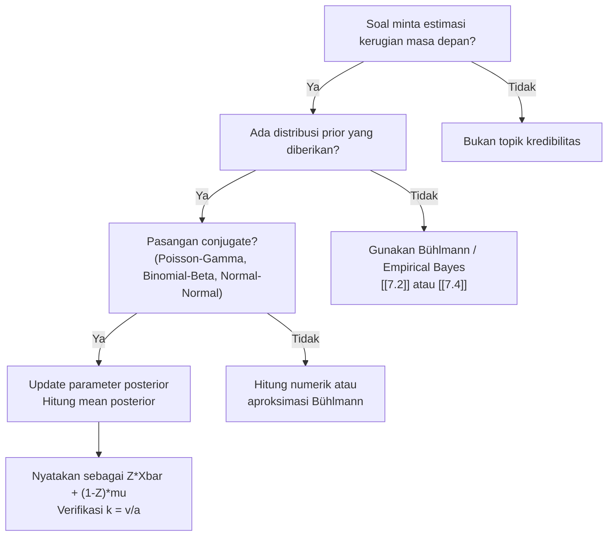

# 📊 7.3 — Bayesian Credibility

> [!ABSTRACT] Ringkasan Cepat
> **Topik:** Bayesian Credibility | **Bobot:** ~20–25% (Topik 7 keseluruhan) | **Difficulty:** Hard
> **Ref:** Klugman et al. (2019) Bab 16–18; Tse (2009) Bab 6–9 | **Prereq:** [[7.2 Bühlmann and Bühlmann-Straub Models]], [[6.3 Bayesian Parameter Estimation]]

---

## Section 0 — Pemetaan Topik

| Topik TA2 | Sub-topik ID | Skill Diuji | Bobot | Difficulty | Prerequisite | Connected Topics | Referensi |
|---|---|---|---|---|---|---|---|
| Teori Kredibilitas | 7.3 | Hitung estimator Bayes; posterior mean; hubungan Bayes–Bühlmann | 20–25% (Topik 7) | Hard | [[7.2 Bühlmann and Bühlmann-Straub Models]], [[6.3 Bayesian Parameter Estimation]] | [[7.1 Classical Credibility]], [[7.4 Empirical Bayesian Methods]] | Klugman et al. (2019) Bab 16, 17, 18; Tse (2009) Bab 6–9 |

---

## Section 1 — Intuisi

Bayangkan seorang manajer risiko di perusahaan asuransi kendaraan yang harus menetapkan premi untuk seorang nasabah baru. Di satu sisi, ia punya data pengalaman klaim nasabah tersebut selama beberapa tahun. Di sisi lain, ia juga punya keyakinan awal (*prior belief*) tentang profil risiko nasabah berdasarkan karakteristik populasinya — usia, jenis kendaraan, riwayat SIM. Masalahnya: mana yang harus ia percaya lebih? Data individu yang mungkin masih sedikit, atau keyakinan awal yang lebih stabil tapi mungkin tidak tepat untuk nasabah ini?

Inilah inti dari **Bayesian Credibility**: sebuah kerangka matematis untuk *mengombinasikan* informasi prior (keyakinan sebelum data ada) dengan informasi dari data observasi. Pendekatan Bayesian tidak membuang salah satu — ia menemukan bobot optimal antara keduanya secara formal. Hasilnya adalah **estimator posterior** yang merupakan prediksi terbaik kita tentang kerugian masa depan nasabah tersebut.

Yang membuat pendekatan ini elegan adalah hubungannya dengan model Bühlmann yang telah kita pelajari. Dalam kondisi tertentu — khususnya ketika distribusi prior dan likelihood membentuk *conjugate pair* — estimator Bayesian menghasilkan formula premi yang **persis sama** dengan formula kredibilitas Bühlmann $Z\bar{X} + (1-Z)\mu$. Artinya, Bühlmann bukan hanya sebuah pendekatan aproksimasi yang "kebetulan berguna" — ia adalah manifestasi alami dari logika Bayesian yang lengkap dalam keluarga distribusi konjugat.

---

## Section 2 — Definisi Formal

> [!NOTE] Definisi Matematis — Estimator Bayesian
> Diberikan parameter risiko $\Theta$ dengan distribusi prior $\pi(\theta)$ dan data klaim $\mathbf{X} = (X_1, X_2, \ldots, X_n)$, estimator Bayesian dari kerugian masa depan $X_{n+1}$ adalah:
>
> $$
> \hat{\mu}^{Bayes} = E[X_{n+1} \mid \mathbf{X}] = E[\mu(\Theta) \mid \mathbf{X}]
> $$
>
> yaitu **mean posterior** dari $\mu(\Theta) = E[X \mid \Theta]$ setelah mengamati data $\mathbf{X}$.

---

**Tabel Variabel & Parameter**

| Simbol | Makna | Catatan |
|---|---|---|
| $\Theta$ | Parameter risiko (variabel acak) | Mewakili profil risiko tak terobservasi |
| $\pi(\theta)$ | Distribusi prior atas $\Theta$ | Keyakinan sebelum melihat data |
| $f(x \mid \theta)$ | Fungsi likelihood: distribusi $X$ given $\Theta = \theta$ | Distribusi klaim untuk profil risiko tetap |
| $\pi(\theta \mid \mathbf{x})$ | Distribusi posterior | Prior diperbarui setelah melihat data |
| $\mu(\theta)$ | $E[X \mid \Theta = \theta]$ | Mean hipotetis untuk profil risiko $\theta$ |
| $\mu$ | $E[\mu(\Theta)] = E[X]$ | Mean kolektif (grand mean) |
| $v(\theta)$ | $\text{Var}(X \mid \Theta = \theta)$ | Expected process variance untuk $\theta$ |
| $v$ | $E[v(\Theta)]$ | Expected value of process variance (EVPV) |
| $a$ | $\text{Var}(\mu(\Theta))$ | Variance of hypothetical means (VHM) |
| $k$ | $v/a$ | Rasio Bühlmann |
| $Z$ | $n/(n+k)$ | Faktor kredibilitas Bühlmann |

---

### Rumus Utama

**Teorema Bayes untuk distribusi posterior:**

$$
\pi(\theta \mid \mathbf{x}) = \frac{f(\mathbf{x} \mid \theta)\, \pi(\theta)}{f(\mathbf{x})} \propto f(\mathbf{x} \mid \theta)\, \pi(\theta)
$$

*Label: Posterior ∝ Likelihood × Prior*

---

**Estimator Bayesian (mean posterior):**

$$
\hat{\mu}^{Bayes} = E[\mu(\Theta) \mid \mathbf{X} = \mathbf{x}] = \int \mu(\theta)\, \pi(\theta \mid \mathbf{x})\, d\theta
$$

*Label: Rata-rata tertimbang $\mu(\theta)$ menggunakan distribusi posterior sebagai bobot*

---

**Hubungan Bühlmann–Bayes (kasus conjugate):**

$$
E[\mu(\Theta) \mid \mathbf{X}] = Z \bar{X} + (1-Z)\mu
$$

$$
Z = \frac{n}{n + k}, \quad k = \frac{v}{a}
$$

*Label: Ketika prior dan likelihood membentuk pasangan conjugate, estimator Bayesian persis sama dengan premi Bühlmann*

---

**Pasangan Conjugate penting dalam aktuaria:**

$$
\text{Poisson}(\lambda) \text{ likelihood} + \text{Gamma}(\alpha, \beta) \text{ prior} \Rightarrow \text{Gamma posterior}
$$

$$
\text{Normal}(\mu, \sigma^2) \text{ likelihood} + \text{Normal}(\mu_0, \sigma_0^2) \text{ prior} \Rightarrow \text{Normal posterior}
$$

$$
\text{Binomial}(m, q) \text{ likelihood} + \text{Beta}(\alpha, \beta) \text{ prior} \Rightarrow \text{Beta posterior}
$$

*Label: Conjugate pairs memungkinkan komputasi posterior secara analitik*

---

### Asumsi Eksplisit

1. **Kondisional independen:** Diberikan $\Theta = \theta$, variabel $X_1, X_2, \ldots, X_n$ saling independen dan identically distributed (i.i.d.) dengan distribusi $f(x \mid \theta)$.
2. **Prior tertentu:** Distribusi prior $\pi(\theta)$ telah ditentukan sebelum data diobservasi dan merepresentasikan heterogenitas populasi.
3. **Squared-error loss:** Estimator Bayesian optimal di bawah fungsi loss kuadratik adalah mean posterior.
4. **Stasioneritas:** Proses yang menghasilkan klaim diasumsikan stasioner — $\Theta$ tidak berubah antar periode untuk individu yang sama.
5. **Kasus conjugate (untuk hubungan Bühlmann):** Distribusi prior dan likelihood membentuk pasangan konjugat sehingga posterior berada dalam keluarga yang sama dengan prior.

---

## Section 3 — Jembatan Logika

> [!TIP] Dari Distribusi Prior ke Estimator Posterior
> Inti Bayesian Credibility adalah pertanyaan: *setelah melihat data $\mathbf{x}$, apa keyakinan terbaik kita tentang $\mu(\Theta)$?* Jawabannya adalah mean dari distribusi posterior $\pi(\theta \mid \mathbf{x})$. Distribusi posterior ini lahir dari perkalian prior $\pi(\theta)$ dan likelihood $f(\mathbf{x} \mid \theta)$ — Bayes rule. Momen dari posterior inilah yang menjadi estimator optimal kita di bawah squared-error loss.

> [!IMPORTANT] Mengapa Posterior Mean Optimal?
> Di bawah squared-error loss $L(\hat{\mu}, \mu(\theta)) = (\hat{\mu} - \mu(\theta))^2$, estimator yang meminimalkan expected loss adalah:
>
> $$
> \hat{\mu}^* = \arg\min_{\hat{\mu}} E\left[(\hat{\mu} - \mu(\Theta))^2 \mid \mathbf{X}\right] = E[\mu(\Theta) \mid \mathbf{X}]
> $$
>
> Ini adalah hasil standar dari decision theory: estimator Bayes optimal adalah **conditional expectation** dari kuantitas yang ingin diestimasikan.

---

### Derivasi: Kasus Poisson–Gamma (Paling Umum di Exam)

**Setup:** Frekuensi klaim $X_i \mid \Theta = \theta \sim \text{Poisson}(\theta)$, dan prior $\Theta \sim \text{Gamma}(\alpha, \beta)$ (parametrisasi: mean $= \alpha\beta$).

**Langkah 1 — Likelihood:**

$$
f(\mathbf{x} \mid \theta) = \prod_{i=1}^{n} \frac{e^{-\theta}\theta^{x_i}}{x_i!} \propto e^{-n\theta} \theta^{\sum x_i}
$$

**Langkah 2 — Prior:**

$$
\pi(\theta) \propto \theta^{\alpha - 1} e^{-\theta/\beta}
$$

**Langkah 3 — Posterior (∝ likelihood × prior):**

$$
\pi(\theta \mid \mathbf{x}) \propto e^{-n\theta} \theta^{\sum x_i} \cdot \theta^{\alpha - 1} e^{-\theta/\beta} = \theta^{(\alpha + \sum x_i) - 1} \exp\!\left(-\theta\!\left(n + \frac{1}{\beta}\right)\right)
$$

Ini berbentuk **Gamma** dengan parameter baru:

$$
\alpha^* = \alpha + \sum_{i=1}^n x_i, \qquad \beta^* = \frac{\beta}{n\beta + 1}
$$

**Langkah 4 — Mean posterior:**

$$
E[\Theta \mid \mathbf{X}] = \alpha^* \beta^* = \frac{(\alpha + \sum x_i)\beta}{n\beta + 1}
$$

**Langkah 5 — Reformulasi sebagai kredibilitas Bühlmann:**

$$
E[\Theta \mid \mathbf{X}] = \frac{n\beta}{n\beta + 1} \cdot \bar{X} + \frac{1}{n\beta + 1} \cdot \alpha\beta
$$

$$
= Z\bar{X} + (1-Z)\mu
$$

di mana $Z = \frac{n\beta}{n\beta + 1} = \frac{n}{n + 1/\beta}$, sehingga $k = 1/\beta$.

Untuk Poisson–Gamma: $v = E[\text{Var}(X\|\Theta)] = E[\Theta] = \alpha\beta$ dan $a = \text{Var}(\Theta) = \alpha\beta^2$, sehingga $k = v/a = 1/\beta$. Hasil ini **konsisten sempurna** dengan formula Bühlmann.

> [!DANGER] Dilarang
> 1. **Jangan menyamakan prior mean $\mu$ dengan sample mean $\bar{X}$** — keduanya berbeda secara konseptual dan numerik.
> 2. **Jangan lupa update kedua parameter posterior** (bukan hanya $\alpha^*$) ketika menghitung mean posterior dalam kasus Gamma.
> 3. **Jangan menggunakan hubungan Bühlmann–Bayes di luar kasus conjugate** tanpa klarifikasi — hubungan tersebut hanya eksak untuk pasangan conjugate; secara umum Bühlmann adalah *aproksimasi linear* terbaik dari estimator Bayesian.

---

## Section 4 — Contoh Soal

### Soal A — Fundamental

Sebuah portofolio asuransi memiliki frekuensi klaim $X \mid \Theta = \theta \sim \text{Poisson}(\theta)$. Distribusi prior atas $\Theta$ adalah $\text{Gamma}(\alpha = 3, \beta = 2)$ (sehingga mean prior $= 6$). Seorang tertanggung menghasilkan $n = 4$ klaim dalam satu tahun. Hitung estimator Bayesian untuk $\Theta$.

> [!SUCCESS] Solusi Soal A
> **Pendekatan:** Gunakan update Poisson–Gamma. Hitung parameter posterior lalu ambil mean-nya.
>
> **1. Identifikasi Variabel**
> - $\alpha = 3$, $\beta = 2$ → mean prior $= 6$
> - $n = 1$ tahun dengan total klaim $\sum x_i = 4$
>
> **2. Identifikasi Distribusi / Model**
> Pasangan Poisson–Gamma: posterior adalah Gamma dengan parameter terupdate.
>
> **3. Setup Persamaan**
>
> $$
> \alpha^* = \alpha + \sum x_i, \qquad \beta^* = \frac{\beta}{n\beta + 1}
> $$
>
> **4. Eksekusi Aljabar**
>
> $$
> \alpha^* = 3 + 4 = 7
> $$
>
> $$
> \beta^* = \frac{2}{1 \cdot 2 + 1} = \frac{2}{3}
> $$
>
> $$
> E[\Theta \mid X = 4] = \alpha^* \cdot \beta^* = 7 \times \frac{2}{3} = \frac{14}{3} \approx 4{,}667
> $$
>
> **5. Verification**
> Mean posterior $4{,}667$ berada di antara mean prior $6$ dan data observasi $4$ — masuk akal. Dengan $n = 1$ yang kecil, posterior lebih dekat ke prior.
>
> **Hasil:** Estimator Bayesian $= 14/3 \approx 4{,}667$ klaim per tahun.

> [!WARNING] Exam Tips — Soal A
> **Target waktu:** 2 menit. **Common trap:** Mengira $n$ adalah jumlah klaim, padahal $n$ adalah jumlah periode. Di sini $n = 1$ periode dengan $\sum x_i = 4$ klaim. **Shortcut:** Hafal rumus $\beta^* = \beta/(n\beta + 1)$ langsung.

---

### Soal B — Exam-Typical

Frekuensi klaim tahunan $X_i \mid \Theta = \theta \sim \text{Poisson}(\theta)$. Prior: $\Theta \sim \text{Gamma}(\alpha = 4, \beta = 0{,}5)$. Sebuah tertanggung diamati selama $n = 3$ tahun dengan klaim masing-masing $2, 5, 3$.

(a) Hitung distribusi posterior $\Theta \mid \mathbf{X}$.
(b) Hitung estimator Bayesian dan nyatakan sebagai kombinasi kredibilitas $Z\bar{X} + (1-Z)\mu$.
(c) Tentukan faktor kredibilitas $Z$ dan bandingkan dengan formula Bühlmann.

> [!SUCCESS] Solusi Soal B
> **Pendekatan:** Update posterior Poisson–Gamma, kemudian reformulasi sebagai premi Bühlmann.
>
> **1. Identifikasi Variabel**
> - Prior: $\Gamma(\alpha = 4,\, \beta = 0{,}5)$ → mean prior $\mu = \alpha\beta = 2$
> - Data: $n = 3$, $\bar{X} = (2+5+3)/3 = 10/3$, $\sum x_i = 10$
>
> **2. Identifikasi Distribusi / Model**
> Pasangan Poisson–Gamma, posterior tetap Gamma.
>
> **3. Setup Persamaan**
>
> $$
> \alpha^* = \alpha + \sum x_i = 4 + 10 = 14
> $$
>
> $$
> \beta^* = \frac{\beta}{n\beta + 1} = \frac{0{,}5}{3(0{,}5) + 1} = \frac{0{,}5}{2{,}5} = 0{,}2
> $$
>
> **4. Eksekusi Aljabar**
>
> **(a) Posterior:** $\Theta \mid \mathbf{X} \sim \text{Gamma}(14,\; 0{,}2)$
>
> **(b) Mean posterior:**
>
> $$
> E[\Theta \mid \mathbf{X}] = 14 \times 0{,}2 = 2{,}8
> $$
>
> Formula kredibilitas:
>
> $$
> Z = \frac{n\beta}{n\beta + 1} = \frac{3 \times 0{,}5}{3 \times 0{,}5 + 1} = \frac{1{,}5}{2{,}5} = 0{,}6
> $$
>
> $$
> Z\bar{X} + (1-Z)\mu = 0{,}6 \times \frac{10}{3} + 0{,}4 \times 2 = 2 + 0{,}8 = 2{,}8 \checkmark
> $$
>
> **(c) Faktor Bühlmann:** Untuk Poisson–Gamma, $k = 1/\beta = 2$:
>
> $$
> Z^{Bühlmann} = \frac{n}{n+k} = \frac{3}{3+2} = 0{,}6
> $$
>
> Identik dengan $Z$ dari Bayes. Hubungan terbukti.
>
> **5. Verification**
> Posterior mean $2{,}8$ berada di antara $\mu = 2$ dan $\bar{X} = 3{,}33$. Dengan $Z = 0{,}6$, data lebih mendominasi — wajar karena $n=3$ sudah cukup untuk menggeser dari prior.
>
> **Hasil:** $\hat{\mu}^{Bayes} = 2{,}8$; $Z = 0{,}6$; formula Bühlmann dan Bayes memberikan hasil identik.

> [!WARNING] Exam Tips — Soal B
> **Target waktu:** 4 menit. **Common trap:** Salah menghitung $\mu = \alpha\beta$ (mean prior) vs $\bar{X}$ (sample mean) saat menyusun formula $Z\bar{X} + (1-Z)\mu$. **Shortcut:** $k = 1/\beta$ langsung dari parameter prior untuk kasus Poisson–Gamma.

---

### Soal C — Challenging

Klaim asuransi jiwa $X_i \mid Q = q \sim \text{Binomial}(m = 5, q)$, di mana $q$ adalah peluang klaim per eksposur. Prior: $Q \sim \text{Beta}(\alpha = 2, \beta = 8)$.

Sebuah kelompok diamati selama $n = 4$ tahun dengan jumlah klaim: $1, 3, 2, 2$ (dari $m = 5$ eksposur per tahun).

(a) Hitung distribusi posterior $Q \mid \mathbf{X}$.
(b) Hitung estimator Bayesian $E[Q \mid \mathbf{X}]$.
(c) Nyatakan sebagai kombinasi kredibilitas. Berapa $Z$ dan $k$?
(d) Hitung $v = E[v(Q)]$ dan $a = \text{Var}(\mu(Q))$, verifikasi $k = v/a$.

> [!SUCCESS] Solusi Soal C
> **Pendekatan:** Pasangan Binomial–Beta. Update posterior Beta, hitung mean, reformulasi sebagai kredibilitas.
>
> **1. Identifikasi Variabel**
> - Prior: $Q \sim \text{Beta}(\alpha = 2, \beta = 8)$ → mean $= \alpha/(\alpha+\beta) = 2/10 = 0{,}2$
> - $m = 5$, $n = 4$ tahun, klaim: $1, 3, 2, 2$ → $\sum x_i = 8$, $\bar{X} = 2$
> - $\mu(q) = E[X \mid Q = q] = mq = 5q$
>
> **2. Identifikasi Distribusi / Model**
> Pasangan Binomial–Beta: posterior adalah Beta dengan parameter terupdate.
>
> **3. Setup Persamaan**
>
> Likelihood untuk $\sum x_i$ klaim dari $nm$ eksposur:
>
> $$
> f(\mathbf{x} \mid q) \propto q^{\sum x_i}(1-q)^{nm - \sum x_i}
> $$
>
> Prior: $\pi(q) \propto q^{\alpha-1}(1-q)^{\beta-1}$
>
> Posterior: $\pi(q \mid \mathbf{x}) \propto q^{\alpha + \sum x_i - 1}(1-q)^{\beta + nm - \sum x_i - 1}$
>
> **4. Eksekusi Aljabar**
>
> **(a) Posterior:**
>
> $$
> \alpha^* = \alpha + \sum x_i = 2 + 8 = 10
> $$
>
> $$
> \beta^* = \beta + nm - \sum x_i = 8 + (4)(5) - 8 = 8 + 12 = 20
> $$
>
> $$
> Q \mid \mathbf{X} \sim \text{Beta}(10, 20)
> $$
>
> **(b) Mean posterior:**
>
> $$
> E[Q \mid \mathbf{X}] = \frac{\alpha^*}{\alpha^* + \beta^*} = \frac{10}{30} = \frac{1}{3} \approx 0{,}333
> $$
>
> **(c) Reformulasi kredibilitas:** Di sini kita bekerja pada skala $X = mQ$. Mean prior $\mu = m \cdot \frac{\alpha}{\alpha+\beta} = 5 \times 0{,}2 = 1$. Sample mean $\bar{X} = 2$.
>
> $$
> E[\mu(Q) \mid \mathbf{X}] = m \cdot E[Q \mid \mathbf{X}] = 5 \times \frac{1}{3} = \frac{5}{3}
> $$
>
> Menyatakan sebagai $Z\bar{X} + (1-Z)\mu$:
>
> $$
> \frac{5}{3} = Z \cdot 2 + (1-Z) \cdot 1 = 1 + Z \implies Z = \frac{2}{3}
> $$
>
> Karena $Z = n/(n+k) = 4/(4+k) = 2/3$, maka $k = 2$.
>
> **(d) Verifikasi $k = v/a$:**
>
> $\mu(q) = mq = 5q$ → $v(q) = \text{Var}(X \mid Q = q) = mq(1-q) = 5q(1-q)$
>
> $$
> v = E[v(Q)] = 5\,E[Q(1-Q)] = 5\left(E[Q] - E[Q^2]\right)
> $$
>
> Untuk $\text{Beta}(\alpha, \beta)$: $E[Q] = \frac{2}{10} = 0{,}2$ dan $E[Q^2] = \frac{\alpha(\alpha+1)}{(\alpha+\beta)(\alpha+\beta+1)} = \frac{2 \cdot 3}{10 \cdot 11} = \frac{6}{110}$
>
> $$
> v = 5\left(0{,}2 - \frac{6}{110}\right) = 5\left(\frac{22 - 6}{110}\right) = 5 \times \frac{16}{110} = \frac{80}{110} = \frac{8}{11}
> $$
>
> $$
> a = \text{Var}(\mu(Q)) = \text{Var}(5Q) = 25\,\text{Var}(Q) = 25 \times \frac{\alpha\beta}{(\alpha+\beta)^2(\alpha+\beta+1)} = 25 \times \frac{16}{100 \times 11} = \frac{400}{1100} = \frac{4}{11}
> $$
>
> $$
> k = \frac{v}{a} = \frac{8/11}{4/11} = 2 \checkmark
> $$
>
> **5. Verification**
> $k = 2$ konsisten dengan yang diperoleh dari formula kredibilitas di langkah (c). Mean posterior $5/3 = 1{,}667$ berada di antara mean prior $1$ dan $\bar{X} = 2$.
>
> **Hasil:** Posterior $\text{Beta}(10, 20)$; $E[\mu(Q)\|\mathbf{X}] = 5/3$; $Z = 2/3$; $k = v/a = 2$ terbukti.

> [!WARNING] Exam Tips — Soal C
> **Target waktu:** 6 menit. **Common trap 1:** Lupa bahwa $\beta^*$ menyerap $nm - \sum x_i$ (total eksposur dikurangi total klaim), bukan hanya $n - \sum x_i$. **Common trap 2:** Bekerja pada skala $Q$ tapi soal minta $\mu(Q) = mQ$ — pastikan konversi ke skala yang benar. **Shortcut:** Hitung $k$ dari formula kredibilitas terlebih dahulu ($Z = nm/(nm+\alpha+\beta)$), lalu verifikasi dengan $v/a$.

---

## Section 5 — Verifikasi & Sanity Check

> [!CHECK] Sanity Check 1 — Batas Kredibilitas
> Faktor $Z$ harus selalu berada di antara 0 dan 1. Ketika $n \to \infty$, $Z \to 1$ (data mendominasi). Ketika $n = 0$, $Z = 0$ (estimator = mean prior). Jika $Z$ Anda keluar dari $[0, 1]$, ada kesalahan di perhitungan $k$ atau $n$.

> [!CHECK] Sanity Check 2 — Mean Posterior di Antara Prior dan Data
> Posterior mean **selalu berada di antara** mean prior $\mu$ dan sample mean $\bar{X}$ (untuk kasus single-parameter conjugate dengan squared-error loss). Jika hasil Anda di luar rentang $[\min(\mu, \bar{X}),\, \max(\mu, \bar{X})]$, ada kesalahan numerik.

> [!CHECK] Sanity Check 3 — Konsistensi Bühlmann
> Setelah menghitung $Z$ dari posterior, hitung ulang dengan $Z = n/(n+k)$ menggunakan $k = v/a$ dari distribusi prior. Kedua nilai harus identik untuk pasangan conjugate.

### Metode Alternatif

Untuk pasangan Poisson–Gamma, terdapat cara cepat menghitung $Z$ tanpa mengeksplisitkan posterior:

$$
Z = \frac{n}{n + k}, \quad k = \frac{1}{\beta}
$$

Cukup baca $\beta$ dari parameter prior Gamma dan langsung hitung $k = 1/\beta$. Tidak perlu menghitung $v$ dan $a$ secara terpisah untuk exam.

---

## Section 6 — Visualisasi Mental

**Bayesian Update sebagai Pergerakan Distribusi:**

Bayangkan distribusi prior $\pi(\theta)$ sebagai "kepercayaan awal" yang berbentuk kurva lonceng (atau kurva miring untuk Gamma). Setiap observasi data menggeser dan mempersempit kurva tersebut menuju nilai yang didukung data:

```
Prior π(θ):        lebar, terpusat di μ
                   ┌─────────────────────┐
                   │      ╭───╮          │
                   │    ╭─╯   ╰─╮        │
                   │ ╭──╯       ╰──╮     │
                   └─┴─────────────┴─────┘
                         μ (mean prior)

Posterior π(θ|X): lebih sempit, bergeser ke data
                   ┌─────────────────────┐
                   │           ╭─╮       │
                   │         ╭─╯ ╰─╮     │
                   │       ╭─╯     ╰─╮   │
                   └───────┴─────────┴───┘
                    μ    posterior  X̄
                         mean
```

Semakin banyak data ($n$ besar), semakin sempit posterior dan semakin dekat ke $\bar{X}$.

**Interpretasi $Z$ sebagai bobot:**

```
Z = 0 (n=0): ────────[μ]──────────────────[X̄]
             estimator = μ

Z = 0.5:     ────────[μ]────[E[μ(Θ)|X]]──[X̄]
             estimator di tengah

Z = 1 (n→∞): ────────[μ]──────────────────[X̄]
             estimator = X̄
```

### Hubungan Visual ↔ Rumus

| Elemen Visual | Komponen Rumus |
|---|---|
| Lebar kurva prior | $a = \text{Var}(\mu(\Theta))$ — VHM |
| Lebar kurva likelihood | $v = E[v(\Theta)]$ — EVPV |
| Posisi kurva posterior | $Z\bar{X} + (1-Z)\mu$ |
| Pergeseran ke kanan (jika $\bar{X} > \mu$) | $Z(\bar{X} - \mu)$ |
| Penyempitan posterior | $\text{Var}(\mu(\Theta)\|\mathbf{X})$ mengecil seiring $n$ |

---

## Section 7 — Jebakan Umum

> [!BUG] Kesalahan Parametrisasi — Gamma dan Beta
> Distribusi Gamma memiliki dua konvensi parametrisasi: $(shape, scale)$ di mana mean $= \alpha\beta$, versus $(shape, rate)$ di mana mean $= \alpha/\lambda$. **Selalu periksa konvensi soal.** Klugman menggunakan parametrisasi $(\alpha, \theta)$ dengan mean $= \alpha\theta$ (di mana $\theta$ adalah scale, bukan rate).

> [!BUG] Kesalahan Konseptual
> 1. **Mencampuradukkan $n$ (jumlah periode) dan $\sum x_i$ (total klaim):** Di update Poisson–Gamma, $\alpha^* = \alpha + \sum x_i$ (bukan $\alpha + n$), dan $\beta^*$ menggunakan $n$ bukan $\sum x_i$.
> 2. **Mengira Bühlmann selalu sama dengan Bayes:** Bühlmann adalah aproksimasi linear terbaik dari estimator Bayesian. Hanya untuk pasangan conjugate keduanya persis sama.
> 3. **Menganggap posterior mean adalah parameter posterior:** Posterior mean $E[\Theta \mid \mathbf{X}]$ berbeda dari parameter distribusi posterior $\alpha^*, \beta^*$.
> 4. **Lupa bahwa $\mu = E[\mu(\Theta)]$, bukan mean sample:** $\mu$ adalah mean dari distribusi campuran (grand mean), yang dihitung dari distribusi prior — bukan dari data.

> [!BUG] Kesalahan Interpretasi Soal
> Jika soal minta "premi Bayesian untuk tahun depan", yang dimaksud adalah $E[X_{n+1} \mid \mathbf{X}] = E[\mu(\Theta) \mid \mathbf{X}]$. Ini berbeda dari $E[\Theta \mid \mathbf{X}]$ kecuali jika $\mu(\theta) = \theta$ (kasus Poisson di mana $\mu(\theta) = \theta$).

> [!CAUTION] Red Flags
> - Soal menyebut "distribusi prior" dan "data observasi" → langsung pikirkan Bayes update
> - Soal menyebut "Poisson" + "Gamma" → pasangan conjugate, gunakan formula update langsung
> - Soal minta verifikasi $k = v/a$ → hitung $v$ dan $a$ dari distribusi prior, bukan posterior
> - Soal berikan $\bar{X}$ dan mean prior → cari $Z$ dari $E[\mu(\Theta)\|\mathbf{X}] = Z\bar{X} + (1-Z)\mu$

---

## Section 8 — Ringkasan Eksekutif

> [!SUMMARY] Must-Remember
> 1. **Estimator Bayesian** adalah mean posterior:
> $$E[\mu(\Theta) \mid \mathbf{X}] = \int \mu(\theta)\,\pi(\theta \mid \mathbf{x})\,d\theta$$
>
> 2. **Update Poisson–Gamma:** $\alpha^* = \alpha + \sum x_i$; $\beta^* = \beta/(n\beta+1)$; $k = 1/\beta$
>
> 3. **Update Binomial–Beta:** $\alpha^* = \alpha + \sum x_i$; $\beta^* = \beta + nm - \sum x_i$
>
> 4. **Identitas kunci Bühlmann–Bayes** (hanya untuk conjugate):
> $$E[\mu(\Theta) \mid \mathbf{X}] = Z\bar{X} + (1-Z)\mu, \quad Z = \frac{n}{n+k}, \quad k = \frac{v}{a}$$
>
> 5. **Verifikasi:** posterior mean selalu di antara $\mu$ dan $\bar{X}$; $Z \in [0,1]$

### Kapan Digunakan

- Soal menyebutkan **distribusi prior** atas parameter risiko
- Soal minta **premi prediktif** berdasarkan data historis individu
- Soal minta pembuktian bahwa estimator Bayesian **sama dengan** kredibilitas Bühlmann
- Pasangan distribusi yang disebutkan adalah Poisson–Gamma, Binomial–Beta, atau Normal–Normal

### Kapan TIDAK Boleh Digunakan

- Ketika distribusi prior **tidak diberikan** → gunakan Bühlmann empiris ([[7.4 Empirical Bayesian Methods]])
- Ketika data berasal dari **multiple exposure** tanpa bobot → gunakan Bühlmann–Straub ([[7.2 Bühlmann and Bühlmann-Straub Models]])
- Ketika soal minta estimator di bawah **loss function bukan kuadratik** (e.g., absolute loss → posterior median)

### Quick Decision Tree



---

> [!QUOTE] Follow-up Options
> 1. *"Berikan contoh soal variasi Normal–Normal conjugate untuk 7.3"*
> 2. *"Jelaskan hubungan [[7.3 Bayesian Credibility]] dengan [[7.4 Empirical Bayesian Methods]]"*
> 3. *"Buat flashcard 1-halaman untuk rumus-rumus update conjugate di 7.3"*

*📖 Ref: Klugman et al. (2019) Bab 16–18; Tse (2009) Bab 6–9 | 🗓️ 2026-04-17 | #TA2 #BayesianCredibility #TeoriRisiko*
