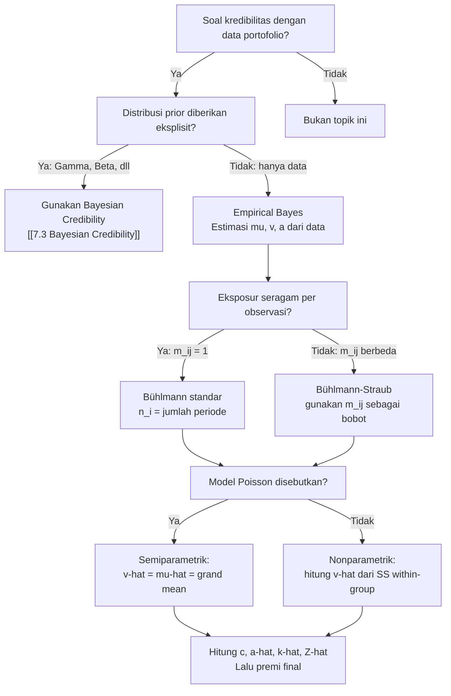

# 📊 7.4 — Empirical Bayesian Methods

> [!ABSTRACT] Ringkasan Cepat
> **Topik:** Empirical Bayesian Methods | **Bobot:** ~20–25% (Topik 7 keseluruhan) | **Difficulty:** Calculation-Intensive
> **Ref:** Klugman et al. (2019) Bab 16–18; Tse (2009) Bab 6–9 | **Prereq:** [[7.2 Bühlmann and Bühlmann-Straub Models]], [[7.3 Bayesian Credibility]]

---

## Section 0 — Pemetaan Topik

| Topik TA2 | Sub-topik ID | Skill Diuji | Bobot | Difficulty | Prerequisite | Connected Topics | Referensi |
|---|---|---|---|---|---|---|---|
| Teori Kredibilitas | 7.4 | Estimasi $\mu$, $v$, $a$ dari data; hitung premi kredibilitas empiris (nonparametrik & semiparametrik) | 20–25% (Topik 7) | Calculation-Intensive | [[7.2 Bühlmann and Bühlmann-Straub Models]], [[7.3 Bayesian Credibility]] | [[7.1 Classical Credibility]], [[7.4 Empirical Bayesian Methods]] | Klugman et al. (2019) Bab 16–18; Tse (2009) Bab 6–9 |

---

## Section 1 — Intuisi

Dalam model Bühlmann dan Bühlmann-Straub yang telah kita pelajari, formula premi kredibilitas $Z\bar{X} + (1-Z)\mu$ memerlukan tiga besaran: mean kolektif $\mu$, expected value of process variance $v$, dan variance of hypothetical means $a$. Masalahnya: dalam praktik asuransi nyata, kita tidak tahu nilai $\mu$, $v$, dan $a$ — parameter-parameter ini bergantung pada distribusi prior $\pi(\theta)$ yang tidak pernah kita observasi secara langsung.

Di sinilah **Empirical Bayesian Methods** hadir sebagai jembatan antara teori Bayesian yang ideal dan realitas data. Ide dasarnya sederhana namun kuat: jika kita punya data dari *banyak tertanggung atau kelompok* dalam portofolio yang sama, kita bisa **mengestimasi** $\mu$, $v$, dan $a$ langsung dari data tersebut — tanpa perlu menentukan distribusi prior secara eksplisit. Data dari seluruh portofolio berperan sebagai cerminan empiris dari distribusi prior yang tak terobservasi.

Terdapat dua pendekatan dalam metode ini. Pendekatan **nonparametrik** tidak mengasumsikan bentuk distribusi apapun — ia mengestimasi $\mu$, $v$, $a$ murni dari momen-momen data. Ini seperti membiarkan data berbicara sendiri tanpa prasangka. Pendekatan **semiparametrik** lebih efisien: ia mengasumsikan bentuk distribusi likelihood (misalnya Poisson untuk frekuensi), tetapi tetap membiarkan distribusi prior bebas tanpa asumsi parametrik. Dengan kombinasi ini, estimator menjadi lebih tajam karena struktur model dimanfaatkan sebaik mungkin.

---

## Section 2 — Definisi Formal

> [!NOTE] Definisi Matematis — Masalah Inti Empirical Bayes
> Premi kredibilitas Bühlmann membutuhkan $\mu$, $v$, $a$ yang tidak diketahui. Empirical Bayes menggantikannya dengan estimator yang dihitung dari data portofolio:
>
> $$
> \hat{P}_i = \hat{Z}_i \bar{X}_i + (1 - \hat{Z}_i)\hat{\mu}, \qquad \hat{Z}_i = \frac{m_i}{m_i + \hat{k}}, \qquad \hat{k} = \frac{\hat{v}}{\hat{a}}
> $$
>
> di mana $\hat{\mu}$, $\hat{v}$, $\hat{a}$ adalah estimator yang dihitung dari data seluruh portofolio.

---

**Tabel Variabel & Parameter**

| Simbol | Makna | Catatan |
|---|---|---|
| $r$ | Jumlah kelompok / tertanggung dalam portofolio | Indeks $i = 1, \ldots, r$ |
| $n_i$ | Jumlah periode observasi untuk kelompok $i$ | Bisa berbeda antar kelompok |
| $m_i$ | Bobot eksposur kelompok $i$ (Bühlmann-Straub) | Untuk Bühlmann standar: $m_i = n_i$ |
| $X_{ij}$ | Kerugian per eksposur kelompok $i$ pada periode $j$ | Data observasi mentah |
| $\bar{X}_i$ | Rata-rata tertimbang kelompok $i$ | $\bar{X}_i = \frac{1}{m_i}\sum_j m_{ij} X_{ij}$ (Bühlmann-Straub) |
| $\bar{X}$ | Grand mean seluruh portofolio | Rata-rata tertimbang dari $\bar{X}_i$ |
| $\mu$ | $E[\mu(\Theta)]$ — mean kolektif | Diestimasi oleh $\hat{\mu}$ |
| $v$ | $E[v(\Theta)]$ — EVPV (*expected value of process variance*) | Diestimasi oleh $\hat{v}$ |
| $a$ | $\text{Var}(\mu(\Theta))$ — VHM (*variance of hypothetical means*) | Diestimasi oleh $\hat{a}$ |
| $k$ | $v/a$ — rasio Bühlmann | Diestimasi oleh $\hat{k} = \hat{v}/\hat{a}$ |
| $m$ | $\sum_{i=1}^r m_i$ — total eksposur portofolio | Untuk Bühlmann-Straub |
| $c$ | $m - \sum m_i^2 / m$ — faktor koreksi dalam estimasi $a$ | Selalu $c < m$ |

---

### Rumus Utama

**Estimator $\hat{\mu}$ (mean kolektif):**

$$
\hat{\mu} = \bar{X} = \frac{\sum_{i=1}^r m_i \bar{X}_i}{\sum_{i=1}^r m_i} = \frac{\sum_{i=1}^r m_i \bar{X}_i}{m}
$$

*Label: Grand mean tertimbang oleh eksposur masing-masing kelompok*

---

**Estimator $\hat{v}$ (EVPV) — Nonparametrik:**

$$
\hat{v} = \frac{1}{\sum_{i=1}^r (n_i - 1)} \sum_{i=1}^r \sum_{j=1}^{n_i} (X_{ij} - \bar{X}_i)^2
$$

*Label: Rata-rata variansi within-group; pooled sample variance di seluruh kelompok*

---

**Estimator $\hat{v}$ (EVPV) — Bühlmann-Straub (bobot berbeda):**

$$
\hat{v} = \frac{1}{\sum_{i=1}^r (n_i - 1)} \sum_{i=1}^r \sum_{j=1}^{n_i} m_{ij}(X_{ij} - \bar{X}_i)^2
$$

*Label: Versi tertimbang untuk kasus Bühlmann-Straub di mana eksposur $m_{ij}$ berbeda per observasi*

---

**Estimator $\hat{a}$ (VHM) — Nonparametrik:**

$$
\hat{a} = \frac{1}{c}\left[\sum_{i=1}^r m_i(\bar{X}_i - \bar{X})^2 - (r-1)\hat{v}\right]
$$

$$
c = m - \frac{\sum_{i=1}^r m_i^2}{m}
$$

*Label: Variansi between-group setelah dikoreksi untuk komponen within-group*

---

**Estimator $\hat{a}$ (VHM) — Bühlmann standar ($m_i = n_i$, semua eksposur = 1):**

Untuk Bühlmann standar di mana setiap observasi memiliki bobot sama ($m_{ij} = 1$):

$$
c = n - \frac{\sum_{i=1}^r n_i^2}{n}, \qquad n = \sum_{i=1}^r n_i
$$

*Label: Formula $c$ menjadi lebih sederhana ketika tidak ada perbedaan eksposur antar periode*

---

**Estimator semiparametrik — Kasus Poisson:**

Untuk model frekuensi $X_{ij} \mid \Theta_i = \theta_i \sim \text{Poisson}(\theta_i)$:

$$
\hat{v} = \hat{\mu} = \bar{X} \quad \text{(karena } v(\theta) = \theta = \mu(\theta) \text{ untuk Poisson)}
$$

*Label: Efisiensi semiparametrik: gunakan struktur model Poisson untuk menghubungkan $v$ dan $\mu$*

---

**Premi kredibilitas empiris akhir:**

$$
\hat{P}_i = \hat{Z}_i \bar{X}_i + (1 - \hat{Z}_i)\hat{\mu}, \qquad \hat{Z}_i = \frac{m_i}{m_i + \hat{k}}, \qquad \hat{k} = \frac{\hat{v}}{\hat{a}}
$$

*Label: Substitusi estimator empiris ke formula Bühlmann — premi dapat langsung dihitung dari data*

---

### Asumsi Eksplisit

1. **Independensi antar kelompok:** Kelompok $i$ dan $j$ ($i \neq j$) memiliki parameter risiko $\Theta_i$ dan $\Theta_j$ yang independen satu sama lain.
2. **Kondisional i.i.d. dalam kelompok:** Diberikan $\Theta_i = \theta_i$, observasi $X_{i1}, \ldots, X_{in_i}$ saling independen dan memiliki distribusi yang sama.
3. **Proses stasioner:** Distribusi $X_{ij} \mid \Theta_i$ tidak berubah antar periode $j$ — profil risiko individu tetap konstan.
4. **Representativitas portofolio:** Data dari $r$ kelompok dianggap sebagai sampel acak dari distribusi prior $\pi(\theta)$ yang sama — portofolio merepresentasikan populasi.
5. **$\hat{a} \geq 0$:** Jika estimator $\hat{a}$ menghasilkan nilai negatif (yang mungkin terjadi secara aljabar), maka konvensi standar adalah set $\hat{a} = 0$, yang berarti $\hat{k} \to \infty$ dan $Z = 0$ — semua kelompok mendapat premi grand mean $\hat{\mu}$.

---

## Section 3 — Jembatan Logika

> [!TIP] Dari "Parameter Tidak Diketahui" ke "Estimasi dari Data"
> Masalah fundamental Bühlmann adalah: premi $Z\bar{X} + (1-Z)\mu$ membutuhkan $\mu$, $v$, $a$ yang semuanya bergantung pada distribusi prior $\pi(\theta)$ yang tidak pernah kita ketahui secara eksplisit. Empirical Bayes memecahkan ini dengan observasi kunci: *momen data dari seluruh portofolio adalah estimator konsisten dari momen prior*. Total variansi data dapat didekomposisi menjadi komponen within-group ($\approx v$) dan between-group ($\approx a + v/n$) — dari sini kita dapat memisahkan $v$ dan $a$ secara empiris.

> [!IMPORTANT] Dekomposisi Variansi — Jantung Metode
> Identitas kunci yang mendasari semua estimator empiris adalah dekomposisi:
>
> $$
> \text{Var}(X_{ij}) = \underbrace{E[v(\Theta)]}_{v} + \underbrace{\text{Var}(\mu(\Theta))}_{a}
> $$
>
> Variansi total data = EVPV (within-group) + VHM (between-group).
> Estimator $\hat{v}$ menangkap komponen within-group (variansi di dalam satu kelompok).
> Estimator $\hat{a}$ menangkap komponen between-group (variansi antar kelompok), dikoreksi agar tidak terdistorsi oleh komponen within-group.

---

### Derivasi Estimator $\hat{a}$ — Langkah demi Langkah

**Konteks:** Bühlmann standar — $r$ kelompok, masing-masing $n_i$ periode, eksposur per observasi = 1.

**Langkah 1 — Hitung expected value dari statistik between-group:**

$$
E\left[\sum_{i=1}^r n_i(\bar{X}_i - \bar{X})^2\right]
$$

Kembangkan kuadrat dan ambil ekspektasinya. Gunakan fakta bahwa:

$$
E[\bar{X}_i^2] = \text{Var}(\bar{X}_i) + (E[\bar{X}_i])^2 = \frac{v}{n_i} + a + \mu^2
$$

$$
E[\bar{X}^2] = \text{Var}(\bar{X}) + \mu^2 = \frac{v}{m} + a + \mu^2 - \frac{\sum n_i^2 \cdot a}{m^2} + \cdots
$$

**Langkah 2 — Hasil ekspektasi:**

Setelah aljabar yang panjang (lihat Klugman Bab 17), diperoleh:

$$
E\left[\sum_{i=1}^r n_i(\bar{X}_i - \bar{X})^2\right] = (r-1)v + c \cdot a
$$

di mana $c = m - \dfrac{\sum n_i^2}{m}$.

**Langkah 3 — Isolasi $a$:**

$$
c \cdot a = E\left[\sum_{i=1}^r n_i(\bar{X}_i - \bar{X})^2\right] - (r-1)v
$$

**Langkah 4 — Substitusi estimator untuk mendapat $\hat{a}$:**

$$
\hat{a} = \frac{1}{c}\left[\sum_{i=1}^r n_i(\bar{X}_i - \bar{X})^2 - (r-1)\hat{v}\right]
$$

**Langkah 5 — Interpretasi $c$:**

$c$ adalah faktor koreksi yang menghilangkan bias dari bobot eksposur yang tidak seimbang. Perhatikan bahwa $c < m$ selalu berlaku (karena $\sum n_i^2/m > 0$). Jika semua $n_i$ sama ($n_i = n_0$ untuk semua $i$), maka:

$$
c = rn_0 - \frac{r \cdot n_0^2}{rn_0} = rn_0 - n_0 = n_0(r-1)
$$

> [!DANGER] Dilarang
> 1. **Jangan menggunakan $c = m - r$ sebagai rumus universal** — formula $c$ bergantung pada distribusi $n_i$ antar kelompok. Hanya jika semua $n_i$ sama dan $m_{ij} = 1$ maka $c = n_0(r-1)$.
> 2. **Jangan menganggap $\hat{a}$ selalu positif** — secara aljabar $\hat{a}$ bisa negatif. Jika itu terjadi, set $\hat{a} = 0$ (bukan abaikan atau gunakan nilai negatifnya).
> 3. **Jangan menggunakan $\hat{v} = \hat{\mu}$ di luar konteks Poisson** — persamaan $v = \mu$ hanya berlaku untuk distribusi Poisson (di mana mean = variance). Untuk distribusi lain, $\hat{v}$ harus dihitung dari variansi within-group.

---

## Section 4 — Contoh Soal

### Soal A — Fundamental

Sebuah portofolio asuransi terdiri dari $r = 3$ kelompok. Data frekuensi klaim tahunan (setiap observasi berbobot 1):

| Kelompok | $n_i$ | Observasi $X_{ij}$ | $\bar{X}_i$ |
|---|---|---|---|
| 1 | 2 | 3, 5 | 4 |
| 2 | 3 | 2, 4, 3 | 3 |
| 3 | 2 | 6, 8 | 7 |

Hitung estimator nonparametrik $\hat{\mu}$, $\hat{v}$, dan $\hat{a}$.

> [!SUCCESS] Solusi Soal A
> **Pendekatan:** Hitung grand mean, lalu within-group variance ($\hat{v}$), lalu between-group variance dikoreksi ($\hat{a}$).
>
> **1. Identifikasi Variabel**
> - $r = 3$, $n_1 = 2$, $n_2 = 3$, $n_3 = 2$
> - $m = n_1 + n_2 + n_3 = 7$
> - $\bar{X}_1 = 4$, $\bar{X}_2 = 3$, $\bar{X}_3 = 7$
>
> **2. Identifikasi Distribusi / Model**
> Bühlmann standar, eksposur per observasi = 1. Estimator nonparametrik — tidak ada asumsi distribusi.
>
> **3. Setup Persamaan**
>
> $$
> \hat{\mu} = \frac{\sum n_i \bar{X}_i}{m}, \quad \hat{v} = \frac{\sum_i \sum_j (X_{ij} - \bar{X}_i)^2}{\sum_i(n_i - 1)}, \quad \hat{a} = \frac{1}{c}\left[\sum_i n_i(\bar{X}_i - \bar{X})^2 - (r-1)\hat{v}\right]
> $$
>
> **4. Eksekusi Aljabar**
>
> **$\hat{\mu}$:**
>
> $$
> \hat{\mu} = \frac{2(4) + 3(3) + 2(7)}{7} = \frac{8 + 9 + 14}{7} = \frac{31}{7} \approx 4{,}429
> $$
>
> **$\hat{v}$ — hitung SS within-group:**
>
> Kelompok 1: $(3-4)^2 + (5-4)^2 = 1 + 1 = 2$
>
> Kelompok 2: $(2-3)^2 + (4-3)^2 + (3-3)^2 = 1 + 1 + 0 = 2$
>
> Kelompok 3: $(6-7)^2 + (8-7)^2 = 1 + 1 = 2$
>
> $$
> \hat{v} = \frac{2 + 2 + 2}{(2-1)+(3-1)+(2-1)} = \frac{6}{1+2+1} = \frac{6}{4} = 1{,}5
> $$
>
> **$\hat{a}$ — hitung $c$ dan SS between-group:**
>
> $$
> c = m - \frac{\sum n_i^2}{m} = 7 - \frac{4 + 9 + 4}{7} = 7 - \frac{17}{7} = \frac{49 - 17}{7} = \frac{32}{7}
> $$
>
> SS between-group:
>
> $$
> \sum n_i(\bar{X}_i - \bar{X})^2 = 2\!\left(4 - \tfrac{31}{7}\right)^2 + 3\!\left(3 - \tfrac{31}{7}\right)^2 + 2\!\left(7 - \tfrac{31}{7}\right)^2
> $$
>
> $$
> = 2\!\left(\tfrac{28-31}{7}\right)^2 + 3\!\left(\tfrac{21-31}{7}\right)^2 + 2\!\left(\tfrac{49-31}{7}\right)^2
> $$
>
> $$
> = 2 \cdot \frac{9}{49} + 3 \cdot \frac{100}{49} + 2 \cdot \frac{324}{49} = \frac{18 + 300 + 648}{49} = \frac{966}{49}
> $$
>
> $$
> \hat{a} = \frac{1}{32/7}\left[\frac{966}{49} - (3-1)(1{,}5)\right] = \frac{7}{32}\left[\frac{966}{49} - 3\right] = \frac{7}{32} \cdot \frac{966 - 147}{49} = \frac{7}{32} \cdot \frac{819}{49} = \frac{819}{224} \approx 3{,}656
> $$
>
> **5. Verification**
> $\hat{v} = 1{,}5 > 0$ ✓. $\hat{a} \approx 3{,}656 > 0$ ✓. Nilai $\hat{a}$ jauh lebih besar dari $\hat{v}$, mencerminkan heterogenitas besar antar kelompok ($\bar{X}_3 = 7$ vs $\bar{X}_2 = 3$).
>
> **Hasil:** $\hat{\mu} = 31/7 \approx 4{,}429$; $\hat{v} = 1{,}5$; $\hat{a} \approx 3{,}656$

> [!WARNING] Exam Tips — Soal A
> **Target waktu:** 4 menit. **Common trap:** Membagi SS between-group dengan $(r-1)$ tanpa faktor koreksi $c$ — ini salah. Faktor $c$ selalu berbeda dari $(r-1)$ kecuali kasus khusus. **Shortcut:** Hitung $c$ pertama kali sebelum apapun — ini sering menjadi sumber kesalahan utama.

---

### Soal B — Exam-Typical

Lanjutan Soal A. Hitung premi kredibilitas empiris Bühlmann untuk masing-masing kelompok pada tahun berikutnya.

> [!SUCCESS] Solusi Soal B
> **Pendekatan:** Gunakan $\hat{\mu}$, $\hat{v}$, $\hat{a}$ dari Soal A untuk menghitung $\hat{k}$, $\hat{Z}_i$, dan premi $\hat{P}_i$.
>
> **1. Identifikasi Variabel**
> Dari Soal A: $\hat{\mu} = 31/7$, $\hat{v} = 1{,}5$, $\hat{a} = 819/224$
>
> **2. Identifikasi Distribusi / Model**
> Bühlmann standar. Premi = $\hat{Z}_i \bar{X}_i + (1-\hat{Z}_i)\hat{\mu}$.
>
> **3. Setup Persamaan**
>
> $$
> \hat{k} = \frac{\hat{v}}{\hat{a}}, \qquad \hat{Z}_i = \frac{n_i}{n_i + \hat{k}}, \qquad \hat{P}_i = \hat{Z}_i \bar{X}_i + (1-\hat{Z}_i)\hat{\mu}
> $$
>
> **4. Eksekusi Aljabar**
>
> **$\hat{k}$:**
>
> $$
> \hat{k} = \frac{1{,}5}{819/224} = \frac{1{,}5 \times 224}{819} = \frac{336}{819} = \frac{112}{273} \approx 0{,}4103
> $$
>
> **Kelompok 1** ($n_1 = 2$, $\bar{X}_1 = 4$):
>
> $$
> \hat{Z}_1 = \frac{2}{2 + 0{,}4103} = \frac{2}{2{,}4103} \approx 0{,}8296
> $$
>
> $$
> \hat{P}_1 = 0{,}8296 \times 4 + 0{,}1704 \times 4{,}429 \approx 3{,}318 + 0{,}755 = 4{,}073
> $$
>
> **Kelompok 2** ($n_2 = 3$, $\bar{X}_2 = 3$):
>
> $$
> \hat{Z}_2 = \frac{3}{3 + 0{,}4103} = \frac{3}{3{,}4103} \approx 0{,}8797
> $$
>
> $$
> \hat{P}_2 = 0{,}8797 \times 3 + 0{,}1203 \times 4{,}429 \approx 2{,}639 + 0{,}533 = 3{,}172
> $$
>
> **Kelompok 3** ($n_3 = 2$, $\bar{X}_3 = 7$):
>
> $$
> \hat{Z}_3 = \frac{2}{2 + 0{,}4103} \approx 0{,}8296 \quad \text{(sama dengan kelompok 1)}
> $$
>
> $$
> \hat{P}_3 = 0{,}8296 \times 7 + 0{,}1704 \times 4{,}429 \approx 5{,}807 + 0{,}755 = 6{,}562
> $$
>
> **5. Verification**
> Semua premi berada di antara $\hat{\mu} \approx 4{,}429$ dan $\bar{X}_i$. Kelompok 2 ($\bar{X}_2 = 3 < \hat{\mu}$) mendapat premi di bawah $\hat{\mu}$; kelompok 3 ($\bar{X}_3 = 7 > \hat{\mu}$) mendapat premi di atas $\hat{\mu}$ ✓. $\hat{k}$ kecil ($\approx 0{,}41$) berarti $Z$ tinggi — data individu sangat dominan.
>
> **Hasil:** $\hat{P}_1 \approx 4{,}073$; $\hat{P}_2 \approx 3{,}172$; $\hat{P}_3 \approx 6{,}562$

> [!WARNING] Exam Tips — Soal B
> **Target waktu:** 3 menit (setelah Soal A selesai). **Common trap:** Lupa bahwa $\hat{k}$ kecil berarti $Z$ besar (data lebih dominan dari grand mean), bukan sebaliknya. **Shortcut:** Jika $n_i$ sama untuk beberapa kelompok, $\hat{Z}_i$ identik — cukup hitung sekali.

---

### Soal C — Challenging

Sebuah perusahaan asuransi memiliki $r = 4$ agen dengan data klaim per polis (Bühlmann-Straub — eksposur berbeda):

| Agen $i$ | Tahun 1: $(m_{i1}, X_{i1})$ | Tahun 2: $(m_{i2}, X_{i2})$ | Tahun 3: $(m_{i3}, X_{i3})$ |
|---|---|---|---|
| 1 | (100, 0{,}04) | (150, 0{,}06) | (200, 0{,}05) |
| 2 | (200, 0{,}08) | (200, 0{,}07) | — |
| 3 | (50, 0{,}02) | (100, 0{,}03) | (150, 0{,}04) |
| 4 | (300, 0{,}05) | — | — |

Hitung $\hat{\mu}$, $\hat{v}$, $\hat{a}$ menggunakan estimator Bühlmann-Straub nonparametrik, kemudian hitung premi kredibilitas untuk Agen 1 dan 2.

> [!SUCCESS] Solusi Soal C
> **Pendekatan:** Bühlmann-Straub dengan eksposur berbeda. Hitung $\bar{X}_i$ tertimbang per agen, lalu grand mean, lalu $\hat{v}$ dan $\hat{a}$ versi Bühlmann-Straub.
>
> **1. Identifikasi Variabel**
>
> Agen 1: $m_1 = 100+150+200 = 450$, $n_1 = 3$
>
> Agen 2: $m_2 = 200+200 = 400$, $n_2 = 2$
>
> Agen 3: $m_3 = 50+100+150 = 300$, $n_3 = 3$
>
> Agen 4: $m_4 = 300$, $n_4 = 1$
>
> Total: $m = 450 + 400 + 300 + 300 = 1450$
>
> **2. Identifikasi Distribusi / Model**
> Bühlmann-Straub nonparametrik: $\bar{X}_i = \frac{\sum_j m_{ij} X_{ij}}{m_i}$; $\hat{v}$ menggunakan SS tertimbang.
>
> **3. Setup Persamaan**
>
> $$
> \bar{X}_i = \frac{\sum_j m_{ij} X_{ij}}{m_i}, \quad \hat{\mu} = \frac{\sum_i m_i \bar{X}_i}{m}
> $$
>
> $$
> \hat{v} = \frac{\sum_i \sum_j m_{ij}(X_{ij} - \bar{X}_i)^2}{\sum_i(n_i - 1)}, \quad c = m - \frac{\sum_i m_i^2}{m}
> $$
>
> **4. Eksekusi Aljabar**
>
> **Rata-rata tertimbang per agen $\bar{X}_i$:**
>
> $$
> \bar{X}_1 = \frac{100(0{,}04)+150(0{,}06)+200(0{,}05)}{450} = \frac{4+9+10}{450} = \frac{23}{450} \approx 0{,}05111
> $$
>
> $$
> \bar{X}_2 = \frac{200(0{,}08)+200(0{,}07)}{400} = \frac{16+14}{400} = \frac{30}{400} = 0{,}075
> $$
>
> $$
> \bar{X}_3 = \frac{50(0{,}02)+100(0{,}03)+150(0{,}04)}{300} = \frac{1+3+6}{300} = \frac{10}{300} \approx 0{,}03333
> $$
>
> $$
> \bar{X}_4 = 0{,}05 \quad (n_4 = 1, \text{ hanya satu observasi})
> $$
>
> **Grand mean $\hat{\mu}$:**
>
> $$
> \hat{\mu} = \frac{450(0{,}05111) + 400(0{,}075) + 300(0{,}03333) + 300(0{,}05)}{1450}
> $$
>
> $$
> = \frac{23 + 30 + 10 + 15}{1450} = \frac{78}{1450} \approx 0{,}05379
> $$
>
> **$\hat{v}$ — SS tertimbang within-group** (Agen 4 dikecualikan karena $n_4 - 1 = 0$):
>
> Agen 1: $\sum_j m_{1j}(X_{1j}-\bar{X}_1)^2$:
>
> $100(0{,}04-0{,}05111)^2 + 150(0{,}06-0{,}05111)^2 + 200(0{,}05-0{,}05111)^2$
>
> $= 100(0{,}01111)^2 + 150(0{,}00889)^2 + 200(0{,}00111)^2$
>
> $\approx 100(0{,}0001235) + 150(0{,}0000790) + 200(0{,}0000012)$
>
> $\approx 0{,}01235 + 0{,}01185 + 0{,}00024 = 0{,}02444$
>
> Agen 2: $\sum_j m_{2j}(X_{2j}-\bar{X}_2)^2$:
>
> $200(0{,}08-0{,}075)^2 + 200(0{,}07-0{,}075)^2 = 200(0{,}005)^2 + 200(0{,}005)^2$
>
> $= 200(0{,}000025) + 200(0{,}000025) = 0{,}01$
>
> Agen 3: $\sum_j m_{3j}(X_{3j}-\bar{X}_3)^2$:
>
> $50(0{,}02-0{,}03333)^2 + 100(0{,}03-0{,}03333)^2 + 150(0{,}04-0{,}03333)^2$
>
> $= 50(0{,}01333)^2 + 100(0{,}00333)^2 + 150(0{,}00667)^2$
>
> $\approx 50(0{,}0001777) + 100(0{,}0000111) + 150(0{,}0000444)$
>
> $\approx 0{,}008885 + 0{,}001110 + 0{,}006660 = 0{,}016655$
>
> Total SS within: $0{,}02444 + 0{,}01 + 0{,}016655 = 0{,}051095$
>
> $\sum_i(n_i - 1) = 2 + 1 + 2 + 0 = 5$
>
> $$
> \hat{v} = \frac{0{,}051095}{5} \approx 0{,}010219
> $$
>
> **Faktor $c$:**
>
> $$
> c = 1450 - \frac{450^2 + 400^2 + 300^2 + 300^2}{1450} = 1450 - \frac{202500+160000+90000+90000}{1450}
> $$
>
> $$
> = 1450 - \frac{542500}{1450} = 1450 - 374{,}138 = 1075{,}862
> $$
>
> **$\hat{a}$ — SS between-group:**
>
> $\sum_i m_i(\bar{X}_i - \hat{\mu})^2$:
>
> $450(0{,}05111-0{,}05379)^2 + 400(0{,}075-0{,}05379)^2 + 300(0{,}03333-0{,}05379)^2 + 300(0{,}05-0{,}05379)^2$
>
> $= 450(0{,}00268)^2 + 400(0{,}02121)^2 + 300(0{,}02046)^2 + 300(0{,}00379)^2$
>
> $\approx 450(7{,}18\times10^{-6}) + 400(4{,}50\times10^{-4}) + 300(4{,}19\times10^{-4}) + 300(1{,}44\times10^{-5})$
>
> $\approx 0{,}003231 + 0{,}179928 + 0{,}125676 + 0{,}004314 = 0{,}313149$
>
> $$
> \hat{a} = \frac{1}{1075{,}862}\left[0{,}313149 - (4-1)(0{,}010219)\right] = \frac{0{,}313149 - 0{,}030657}{1075{,}862} = \frac{0{,}282492}{1075{,}862} \approx 0{,}0002626
> $$
>
> **Premi kredibilitas Agen 1 dan 2:**
>
> $$
> \hat{k} = \frac{\hat{v}}{\hat{a}} = \frac{0{,}010219}{0{,}0002626} \approx 38{,}91
> $$
>
> $$
> \hat{Z}_1 = \frac{m_1}{m_1 + \hat{k}} = \frac{450}{450 + 38{,}91} \approx \frac{450}{488{,}91} \approx 0{,}9204
> $$
>
> $$
> \hat{P}_1 = 0{,}9204(0{,}05111) + 0{,}0796(0{,}05379) \approx 0{,}04703 + 0{,}00428 = 0{,}05131
> $$
>
> $$
> \hat{Z}_2 = \frac{400}{400 + 38{,}91} \approx \frac{400}{438{,}91} \approx 0{,}9114
> $$
>
> $$
> \hat{P}_2 = 0{,}9114(0{,}075) + 0{,}0886(0{,}05379) \approx 0{,}06836 + 0{,}00477 = 0{,}07312
> $$
>
> **5. Verification**
> $\hat{P}_1 \approx 0{,}0513$ berada antara $\hat{\mu} = 0{,}0538$ dan $\bar{X}_1 = 0{,}0511$ ✓. $\hat{P}_2 \approx 0{,}0731$ berada antara $\hat{\mu}$ dan $\bar{X}_2 = 0{,}075$ ✓. $\hat{k}$ besar ($\approx 39$) menunjukkan $v \gg a$ — heterogenitas antar agen relatif kecil dibanding noise dalam kelompok, sehingga $Z$ tidak setinggi yang diperkirakan meski $m_i$ besar.
>
> **Hasil:** $\hat{P}_1 \approx 0{,}0513$ per polis; $\hat{P}_2 \approx 0{,}0731$ per polis.

> [!WARNING] Exam Tips — Soal C
> **Target waktu:** 8–10 menit. **Common trap 1:** Memasukkan Agen 4 (satu periode) ke dalam perhitungan $\hat{v}$ — agen dengan $n_i = 1$ memberikan kontribusi nol pada $\sum(n_i - 1)$ dan SS within. **Common trap 2:** Lupa menggunakan $m_i$ (total eksposur agen) sebagai bobot dalam SS between-group, bukan $n_i$. **Shortcut:** Susun tabel bantu kolom $m_i \bar{X}_i$ dan $m_i \bar{X}_i^2$ untuk efisiensi kalkulasi.

---

## Section 5 — Verifikasi & Sanity Check

> [!CHECK] Sanity Check 1 — Konsistensi Grand Mean
> Grand mean $\hat{\mu}$ harus dapat diverifikasi dua cara: (1) sebagai $\sum m_i \bar{X}_i / m$, dan (2) sebagai $\sum_i \sum_j m_{ij} X_{ij} / m$. Keduanya harus menghasilkan nilai identik. Jika berbeda, ada kesalahan di kalkulasi $\bar{X}_i$ atau $m_i$.

> [!CHECK] Sanity Check 2 — Premi Antara Grand Mean dan Sample Mean
> Untuk setiap kelompok $i$, premi kredibilitas $\hat{P}_i$ harus berada di antara $\hat{\mu}$ dan $\bar{X}_i$:
>
> $$
> \min(\hat{\mu},\, \bar{X}_i) \leq \hat{P}_i \leq \max(\hat{\mu},\, \bar{X}_i)
> $$
>
> Ini selalu berlaku karena $0 \leq \hat{Z}_i \leq 1$.

> [!CHECK] Sanity Check 3 — Weighted Average Premi = Grand Mean
> Total premi tertimbang harus kembali ke grand mean:
>
> $$
> \frac{\sum_i m_i \hat{P}_i}{\sum_i m_i} = \hat{\mu}
> $$
>
> Ini adalah properti penting: sistem premi empiris Bühlmann bersifat *actuarially balanced*.

### Metode Alternatif — Semiparametrik Poisson

Untuk model frekuensi klaim di mana $X_{ij} \mid \Theta_i \sim \text{Poisson}(\Theta_i)$, struktur Poisson memberikan shortcut:

$$
v(\theta) = \theta = \mu(\theta) \implies E[v(\Theta)] = E[\mu(\Theta)] \implies v = \mu
$$

Oleh karena itu cukup gunakan:

$$
\hat{v} = \hat{\mu} = \bar{X}
$$

Ini **tidak perlu menghitung SS within-group** — cukup baca grand mean. Efisiensi besar di exam.

---

## Section 6 — Visualisasi Mental

**Dekomposisi Variansi sebagai "Dua Sumber Ketidakpastian":**

```
Total variasi data X_ij
          │
          ├─── Within-group (variansi di dalam satu kelompok)
          │         ≈ proses acak / noise alam
          │         → estimasi v (EVPV)
          │
          └─── Between-group (variansi antar kelompok)
                    ≈ heterogenitas nyata antar profil risiko
                    → estimasi a (VHM), setelah koreksi komponen within
```

**Pengaruh $\hat{k} = \hat{v}/\hat{a}$ terhadap premi:**

```
Besar k (v >> a):          Kecil k (a >> v):
Homogen, noise besar       Heterogen, noise kecil

Z rendah → premi → μ̂      Z tinggi → premi → X̄ᵢ
(grand mean mendominasi)   (data individu mendominasi)

Agen yang baru (m kecil)   Agen lama (m besar)
pun ditarik ke μ̂           mendapat Z ≈ 1
```

### Hubungan Visual ↔ Rumus

| Elemen Visual | Komponen Rumus |
|---|---|
| Lebar distribusi dalam satu kelompok | $v = E[v(\Theta)]$ — EVPV |
| Jarak antar mean kelompok | $a = \text{Var}(\mu(\Theta))$ — VHM |
| Rasio $k = v/a$ | Kompetisi: noise vs heterogenitas nyata |
| Ukuran kelompok $m_i$ | Semakin besar → $Z_i$ semakin tinggi |
| Grand mean $\hat{\mu}$ | Titik gravitasi seluruh portofolio |

---

## Section 7 — Jebakan Umum

> [!BUG] Kesalahan Parametrisasi — Bühlmann vs Bühlmann-Straub
> Bühlmann **standar**: $m_{ij} = 1$ untuk semua $i, j$ (eksposur seragam). Bühlmann-**Straub**: $m_{ij}$ berbeda. Jika soal menyebut "eksposur" atau "jumlah polis" yang berbeda antar periode, itu pasti Bühlmann-Straub. Jangan menggunakan formula Bühlmann standar untuk data Bühlmann-Straub.

> [!BUG] Kesalahan Konseptual
> 1. **Mengira $c = r - 1$ atau $c = m - r$:** Formula $c = m - \sum m_i^2/m$ **berbeda dari $r-1$** kecuali dalam kasus sangat khusus. Selalu hitung $c$ dari definisinya.
> 2. **Menggunakan $\hat{v} = \hat{\mu}$ tanpa asumsi Poisson:** Identitas $v = \mu$ hanya berlaku untuk distribusi Poisson. Soal harus secara eksplisit menyebut Poisson atau memberikan $v(\theta) = \theta$.
> 3. **Memasukkan kelompok dengan $n_i = 1$ ke $\hat{v}$:** Kelompok dengan hanya satu periode observasi memberikan kontribusi nol ke $\sum(n_i - 1)$ (pembilang SS) dan nol ke denominator — abaikan dalam kalkulasi $\hat{v}$, tetapi tetap sertakan dalam $\hat{\mu}$ dan $\hat{a}$.
> 4. **Menggunakan nilai negatif $\hat{a}$:** Jika kalkulasi menghasilkan $\hat{a} < 0$, set $\hat{a} = 0$ — ini berarti tidak ada bukti heterogenitas, semua kelompok mendapat premi $\hat{\mu}$.

> [!BUG] Kesalahan Interpretasi Soal
> Jika soal menyebut "nonparametrik", hitung $\hat{v}$ dari SS within-group. Jika soal menyebut "semiparametrik dengan model Poisson", gunakan $\hat{v} = \hat{\mu}$. Kedua pendekatan menghasilkan estimator $\hat{a}$ dengan formula yang sama — perbedaannya **hanya pada cara menghitung $\hat{v}$**.

> [!CAUTION] Red Flags
> - Soal menyebut "data dari beberapa kelompok/agen/tertanggung" tanpa distribusi prior → Empirical Bayes
> - Soal minta "estimasi $v$, $a$, $\mu$ dari data" → nonparametrik atau semiparametrik
> - Muncul kata "eksposur berbeda antar periode" → Bühlmann-Straub, bukan Bühlmann standar
> - Hasil $\hat{a} < 0$ → wajib set ke 0, laporkan $Z = 0$ dan $\hat{P}_i = \hat{\mu}$ untuk semua $i$
> - Kelompok dengan $n_i = 1$ → sertakan di $\hat{\mu}$ dan SS between, tapi **abaikan di $\hat{v}$**

---

## Section 8 — Ringkasan Eksekutif

> [!SUMMARY] Must-Remember
> 1. **Grand mean (selalu langkah pertama):**
> $$\hat{\mu} = \frac{\sum_i m_i \bar{X}_i}{m}$$
>
> 2. **EVPV nonparametrik:**
> $$\hat{v} = \frac{\sum_i \sum_j m_{ij}(X_{ij}-\bar{X}_i)^2}{\sum_i(n_i-1)}$$
>
> 3. **Faktor koreksi dan VHM:**
> $$c = m - \frac{\sum_i m_i^2}{m}, \qquad \hat{a} = \frac{1}{c}\!\left[\sum_i m_i(\bar{X}_i - \hat{\mu})^2 - (r-1)\hat{v}\right]$$
>
> 4. **Shortcut semiparametrik Poisson:**
> $$\hat{v} = \hat{\mu} = \bar{X}$$
>
> 5. **Premi final:**
> $$\hat{P}_i = \hat{Z}_i \bar{X}_i + (1-\hat{Z}_i)\hat{\mu}, \qquad \hat{Z}_i = \frac{m_i}{m_i + \hat{k}}, \qquad \hat{k} = \frac{\hat{v}}{\hat{a}}$$

### Kapan Digunakan

- Soal memberikan **data dari banyak kelompok** tanpa menyebutkan distribusi prior secara eksplisit
- Soal minta mengestimasi $\mu$, $v$, $a$ dari data portofolio
- Soal menyebut "nonparametrik" atau "semiparametrik" dalam konteks kredibilitas
- Soal memberikan eksposur berbeda antar kelompok/periode → Bühlmann-Straub empiris

### Kapan TIDAK Boleh Digunakan

- Ketika distribusi prior **diberikan secara eksplisit** (e.g., Gamma, Beta) → gunakan [[7.3 Bayesian Credibility]] (Bayes eksak)
- Ketika hanya ada **satu kelompok** (tidak ada informasi between-group untuk mengestimasi $a$)
- Ketika soal minta **Bühlmann teoritis** dengan $v$ dan $a$ yang sudah diberikan langsung → gunakan [[7.2 Bühlmann and Bühlmann-Straub Models]] tanpa estimasi

### Quick Decision Tree



---

> [!QUOTE] Follow-up Options
> 1. *"Berikan contoh soal variasi semiparametrik Poisson untuk 7.4"*
> 2. *"Jelaskan perbedaan antara [[7.3 Bayesian Credibility]] dan [[7.4 Empirical Bayesian Methods]] secara konseptual"*
> 3. *"Buat flashcard 1-halaman untuk formula estimator nonparametrik di 7.4"*

*📖 Ref: Klugman et al. (2019) Bab 16–18; Tse (2009) Bab 6–9 | 🗓️ 2026-04-19 | #TA2 #EmpiricalBayes #TeoriRisiko*
