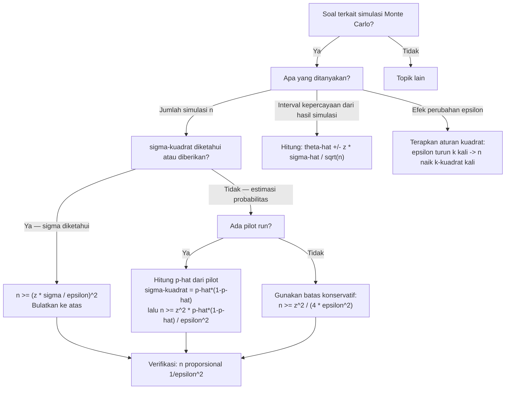

# 📊 8.1 — Monte Carlo Simulation Concepts

> [!ABSTRACT] Ringkasan Cepat
> **Topik:** Konsep Simulasi Monte Carlo | **Bobot:** ~5–10% (Topik 8) | **Difficulty:** Medium
> **Ref:** Klugman et al. (2019), Bab 19.3; Tse (2009), Bab 14 & 15 | **Prereq:** [[4.4 Aggregate Distribution Approximation]], [[6.1 Parameter Estimation Methods]]

---

## Section 0 — Pemetaan Topik

| Topik TA2 | Sub-topik ID | Skill Diuji | Bobot | Difficulty | Prerequisite | Connected Topics | Referensi |
|---|---|---|---|---|---|---|---|
| Simulasi | 8.1 | Menjelaskan konsep simulasi Monte Carlo; mengestimasi jumlah simulasi $n$ yang diperlukan untuk mencapai tingkat kesalahan $\varepsilon$ dan derajat kepercayaan $1-\alpha$ tertentu | 5–10% (bersama Topik 8) | Medium | [[4.4 Aggregate Distribution Approximation]], [[6.1 Parameter Estimation Methods]] | [[8.2 Inversion Method for Random Variables]], [[8.3 Permutation Test and Bootstrap]] | Klugman et al. (2019), Bab 19.3; Tse (2009), Bab 14 & 15 |

---

## Section 1 — Intuisi

Bayangkan seorang aktuaris diminta menghitung probabilitas bahwa total klaim sebuah portofolio asuransi dalam satu tahun melebihi Rp 10 miliar. Model distribusinya kompleks — campuran berbagai jenis polis dengan distribusi klaim yang berbeda — sehingga tidak ada formula analitik tertutup yang bisa digunakan. Apa yang dilakukan aktuaris tersebut? Ia "memainkan" skenario ini ribuan kali di komputer: setiap putaran, ia mensimulasikan frekuensi klaim acak, lalu mensimulasikan besar masing-masing klaim, menjumlahkan semuanya, dan mencatat apakah total melebihi Rp 10 miliar. Setelah sepuluh ribu putaran, ia menghitung berapa persen simulasi yang melampaui ambang batas tersebut — itulah estimasi probabilitasnya. Inilah inti simulasi Monte Carlo.

Nama "Monte Carlo" diambil dari kasino terkenal di Monaco, tempat keberuntungan dan angka acak mendominasi. Metode ini dikembangkan pada era perang dingin untuk masalah fisika nuklir yang terlalu kompleks untuk diselesaikan secara analitik, lalu menyebar ke hampir semua bidang sains kuantitatif — termasuk aktuaria. Kekuatan utamanya adalah universalitas: selama kita bisa mensimulasikan satu skenario acak, kita bisa memperkirakan hampir semua kuantitas probabilistik yang diinginkan, seberapa kompleks pun modelnya.

Yang membuat konsep ini penting dalam ujian TA2 bukan sekadar "jalankan simulasi sebanyak-banyaknya" — tapi pertanyaan yang jauh lebih bernilai: *berapa banyak simulasi yang cukup?* Menjalankan satu juta iterasi membutuhkan sumber daya komputasi besar; terlalu sedikit iterasi menghasilkan estimasi yang tidak akurat. Ada formula eksak yang menghubungkan jumlah simulasi $n$, tingkat kesalahan yang dapat ditoleransi $\varepsilon$, dan derajat kepercayaan $1-\alpha$ — dan itulah yang paling sering diujikan dalam soal TA2.

---

## Section 2 — Definisi Formal

> [!NOTE] Definisi Matematis — Estimator Monte Carlo dan Kesalahannya
> Misalkan $\theta = E[g(X)]$ adalah kuantitas yang ingin diestimasi, dan $g(X_1), g(X_2), \ldots, g(X_n)$ adalah $n$ hasil simulasi independen. Estimator Monte Carlo adalah:
>
> $$
> \hat{\theta}_n = \frac{1}{n} \sum_{k=1}^{n} g(X_k)
> $$
>
> Jumlah simulasi minimum yang diperlukan agar $|\hat{\theta}_n - \theta| \leq \varepsilon$ dengan probabilitas $\geq 1 - \alpha$ adalah:
>
> $$
> n \geq \left( \frac{z_{\alpha/2} \cdot \sigma}{\varepsilon} \right)^2
> $$
>
> di mana $\sigma^2 = \text{Var}(g(X))$ dan $z_{\alpha/2}$ adalah nilai kritis distribusi Normal standar.

**Tabel Variabel & Parameter**

| Simbol | Makna | Catatan |
|---|---|---|
| $\theta$ | Kuantitas yang diestimasi | Bisa berupa $E[X]$, $P(X > d)$, VaR, TVaR, atau fungsi lain |
| $g(X)$ | Fungsi dari variabel acak yang disimulasikan | Misalnya $g(X) = X$ untuk mean, $g(X) = \mathbf{1}_{X > d}$ untuk probabilitas |
| $n$ | Jumlah simulasi (iterasi) | Harus cukup besar agar estimasi akurat |
| $\hat{\theta}_n$ | Estimator Monte Carlo | Rata-rata aritmetika dari $n$ replikasi |
| $\varepsilon$ | Tingkat kesalahan yang ditoleransi (half-width) | $\varepsilon > 0$; semakin kecil, semakin banyak simulasi diperlukan |
| $1 - \alpha$ | Derajat kepercayaan | Nilai umum: 90% ($\alpha=0.10$), 95% ($\alpha=0.05$), 99% ($\alpha=0.01$) |
| $\alpha$ | Tingkat signifikansi | $\alpha = 1 - (1-\alpha)$ |
| $z_{\alpha/2}$ | Nilai kritis Normal standar (dua sisi) | $z_{0.05} = 1.645$ (90%), $z_{0.025} = 1.960$ (95%), $z_{0.005} = 2.576$ (99%) |
| $\sigma^2$ | Variansi dari $g(X)$ | Sering tidak diketahui — diestimasi dari simulasi awal atau diturunkan secara analitik |
| $\sigma^2_{\hat{\theta}}$ | Variansi estimator $\hat{\theta}_n$ | $\sigma^2_{\hat{\theta}} = \sigma^2 / n$; menurun ketika $n$ membesar |

### Rumus Utama

**1. Estimator Monte Carlo — Rata-rata Replikasi:**

$$
\hat{\theta}_n = \frac{1}{n} \sum_{k=1}^{n} g(X_k)
$$

**Label:** Berdasarkan Hukum Bilangan Besar, $\hat{\theta}_n \to \theta$ ketika $n \to \infty$. Ini justifikasi teoritis utama simulasi Monte Carlo.

**2. Variansi Estimator Monte Carlo:**

$$
\text{Var}(\hat{\theta}_n) = \frac{\sigma^2}{n} = \frac{\text{Var}(g(X))}{n}
$$

**Label:** Standar error turun proporsional dengan $1/\sqrt{n}$ — menggandakan akurasi membutuhkan 4× lebih banyak simulasi.

**3. Jumlah Simulasi Minimum — Formula Utama TA2:**

$$
n \geq \left( \frac{z_{\alpha/2} \cdot \sigma}{\varepsilon} \right)^2
$$

**Label:** Ini adalah formula terpenting di Topik 8.1. Diturunkan dari interval kepercayaan: $P(|\hat{\theta}_n - \theta| \leq \varepsilon) \geq 1-\alpha$ menggunakan CLT.

**4. Kasus Khusus — Estimasi Probabilitas $p = P(A)$:**

Ketika $g(X) = \mathbf{1}_A$ (indikator kejadian $A$), maka $\sigma^2 = p(1-p)$ dan:

$$
n \geq \frac{z_{\alpha/2}^2 \cdot p(1-p)}{\varepsilon^2}
$$

Karena $p$ tidak diketahui, gunakan batas konservatif $p(1-p) \leq 1/4$:

$$
n \geq \frac{z_{\alpha/2}^2}{4\varepsilon^2}
$$

**Label:** Batas konservatif ini memaksimalkan $p(1-p)$ pada $p = 0.5$. Selalu gunakan ini jika $p$ tidak diketahui sama sekali.

**5. Interval Kepercayaan Monte Carlo:**

$$
\hat{\theta}_n \pm z_{\alpha/2} \cdot \frac{\hat{\sigma}}{\sqrt{n}}
$$

**Label:** Interval kepercayaan untuk $\theta$ berdasarkan $n$ simulasi. $\hat{\sigma}$ adalah standar deviasi sampel dari $\{g(X_k)\}$.

**6. Lebar Interval Kepercayaan (Half-Width):**

$$
\varepsilon = z_{\alpha/2} \cdot \frac{\sigma}{\sqrt{n}} \quad \Longleftrightarrow \quad n = \left(\frac{z_{\alpha/2} \cdot \sigma}{\varepsilon}\right)^2
$$

**Label:** Hubungan antara $n$, $\varepsilon$, dan $z_{\alpha/2}$ — tiga besaran yang selalu muncul bersama dalam soal.

### Asumsi Eksplisit

1. **Independensi replikasi:** Setiap simulasi $X_1, X_2, \ldots, X_n$ harus independen dan identik terdistribusi (*i.i.d.*) — dipastikan dengan generator bilangan acak yang tepat.
2. **Hukum Bilangan Besar berlaku:** $E[\lvert g(X) \rvert] < \infty$ sehingga $\hat{\theta}_n \to \theta$ hampir pasti.
3. **CLT berlaku:** $\text{Var}(g(X)) = \sigma^2 < \infty$, sehingga distribusi $\hat{\theta}_n$ mendekati Normal untuk $n$ cukup besar — ini yang membenarkan penggunaan $z_{\alpha/2}$.
4. **$\sigma^2$ diketahui atau dapat diestimasi:** Dalam praktik, $\sigma^2$ diestimasi dari batch simulasi awal (*pilot run*), atau dihitung secara analitik untuk kasus sederhana.
5. **Generator bilangan acak berkualitas:** Bilangan acak seragam $U(0,1)$ yang digunakan harus memiliki periode yang sangat panjang dan distribusi yang benar-benar seragam — implementasi bergantung pada perangkat lunak.

---

## Section 3 — Jembatan Logika

> [!TIP] Dari Definisi ke Rumus — Mengapa Formula $n \geq (z_{\alpha/2}\sigma/\varepsilon)^2$ Muncul
> Estimator Monte Carlo $\hat{\theta}_n$ adalah rata-rata dari $n$ variabel acak i.i.d. Berdasarkan Central Limit Theorem (CLT), untuk $n$ cukup besar:
>
> $$
> \frac{\hat{\theta}_n - \theta}{\sigma/\sqrt{n}} \approx N(0,1)
> $$
>
> Syarat akurasi $P(|\hat{\theta}_n - \theta| \leq \varepsilon) \geq 1 - \alpha$ ekuivalen dengan meminta lebar *half-width* interval kepercayaan tidak melebihi $\varepsilon$. Karena half-width = $z_{\alpha/2} \cdot \sigma/\sqrt{n}$, maka $z_{\alpha/2} \cdot \sigma/\sqrt{n} \leq \varepsilon$, dan mengalikan kedua sisi dengan $\sqrt{n}/\varepsilon$ lalu dikuadratkan langsung menghasilkan formula $n \geq (z_{\alpha/2}\sigma/\varepsilon)^2$.

> [!IMPORTANT] Hubungan Kritis Antar Tiga Besaran
> Formula $n = (z_{\alpha/2}\sigma/\varepsilon)^2$ menghubungkan tiga besaran secara fundamental:
>
> - **Naikkan derajat kepercayaan** ($1-\alpha$ naik → $z_{\alpha/2}$ naik) → $n$ harus lebih besar secara kuadratik.
> - **Perketat toleransi kesalahan** ($\varepsilon$ turun setengah) → $n$ harus naik **empat kali lipat** (karena $\varepsilon$ dikuadratkan di penyebut).
> - **Variansi lebih besar** ($\sigma^2$ naik) → $n$ harus lebih besar — model yang lebih "berisik" memerlukan lebih banyak simulasi.
>
> Implikasi praktis: mengurangi $\varepsilon$ dari 0.01 ke 0.001 (10× lebih ketat) membutuhkan **100×** lebih banyak simulasi. Ini menjelaskan mengapa simulasi sangat mahal secara komputasi untuk presisi tinggi.

**Derivasi Step-by-Step: Formula Jumlah Simulasi Minimum**

**Langkah 1 — Mulai dari definisi interval kepercayaan:**

Kita ingin:

$$
P\!\left(|\hat{\theta}_n - \theta| \leq \varepsilon\right) \geq 1 - \alpha
$$

**Langkah 2 — Standarisasi menggunakan CLT:**

$$
P\!\left(\left|\frac{\hat{\theta}_n - \theta}{\sigma/\sqrt{n}}\right| \leq \frac{\varepsilon}{\sigma/\sqrt{n}}\right) \geq 1 - \alpha
$$

Karena bagian kiri mendekati $N(0,1)$:

$$
P\!\left(|Z| \leq \frac{\varepsilon\sqrt{n}}{\sigma}\right) \geq 1 - \alpha
$$

**Langkah 3 — Terapkan definisi $z_{\alpha/2}$:**

$P(|Z| \leq z_{\alpha/2}) = 1 - \alpha$ berdasarkan definisi nilai kritis. Syarat terpenuhi jika:

$$
\frac{\varepsilon\sqrt{n}}{\sigma} \geq z_{\alpha/2}
$$

**Langkah 4 — Isolasi $n$:**

$$
\sqrt{n} \geq \frac{z_{\alpha/2} \cdot \sigma}{\varepsilon}
$$

$$
n \geq \left(\frac{z_{\alpha/2} \cdot \sigma}{\varepsilon}\right)^2
$$

**Langkah 5 — Terapkan ke estimasi probabilitas:**

Jika $g(X) = \mathbf{1}_A$ (indikator), maka $\text{Var}(g(X)) = p(1-p)$ karena $g(X) \sim \text{Bernoulli}(p)$. Substitusi:

$$
n \geq \frac{z_{\alpha/2}^2 \cdot p(1-p)}{\varepsilon^2}
$$

Karena $p(1-p) \leq \frac{1}{4}$ untuk semua $p \in [0,1]$ (maksimum di $p=0.5$):

$$
n \geq \frac{z_{\alpha/2}^2}{4\varepsilon^2} \quad \text{(batas konservatif)}
$$

> [!DANGER] Tiga Larangan Fatal dalam Soal Simulasi Monte Carlo
> 1. **JANGAN** lupa mengkuadratkan seluruh ekspresi: $n = (z_{\alpha/2}\sigma/\varepsilon)^2$, bukan $n = z_{\alpha/2}\sigma/\varepsilon$. Kesalahan ini menghasilkan $n$ yang jauh terlalu kecil.
> 2. **JANGAN** asumsikan $\varepsilon$ adalah lebar penuh interval kepercayaan — $\varepsilon$ adalah *half-width* (setengah lebar). Jika soal menyebut "lebar interval adalah $2\varepsilon$", gunakan $\varepsilon$ (setengahnya) dalam formula.
> 3. **JANGAN** gunakan $z_\alpha$ (satu sisi) saat soal menyebut derajat kepercayaan dua sisi. Untuk kepercayaan $95\%$ gunakan $z_{0.025} = 1.96$, bukan $z_{0.05} = 1.645$.

---

## Section 4 — Contoh Soal

### Soal A — Fundamental

**Soal:** Seorang aktuaris ingin mengestimasi probabilitas bahwa klaim agregat melebihi suatu batas tertentu menggunakan simulasi Monte Carlo. Ia ingin kesalahannya tidak melebihi $\varepsilon = 0.02$ dengan derajat kepercayaan $95\%$. Berapa jumlah simulasi minimum yang diperlukan? Gunakan batas konservatif karena probabilitas yang sesungguhnya tidak diketahui.

> [!SUCCESS] Solusi Soal A
> **Pendekatan:** Gunakan formula jumlah simulasi minimum untuk estimasi probabilitas dengan batas konservatif $p(1-p) \leq 1/4$.
>
> **1. Identifikasi Variabel**
> - $\varepsilon = 0.02$ (half-width toleransi kesalahan)
> - Derajat kepercayaan $= 95\%$, sehingga $\alpha = 0.05$, $z_{\alpha/2} = z_{0.025} = 1.96$
> - $p$ tidak diketahui → gunakan batas konservatif $p(1-p) \leq 1/4$, yaitu $\sigma^2 \leq 1/4$
>
> **2. Identifikasi Distribusi / Model**
> Estimasi probabilitas $p = P(A)$ menggunakan indikator $g(X) = \mathbf{1}_A \sim \text{Bernoulli}(p)$. Variansi: $\sigma^2 = p(1-p)$.
>
> **3. Setup Persamaan**
>
> $$
> n \geq \frac{z_{\alpha/2}^2 \cdot p(1-p)}{\varepsilon^2} \leq \frac{z_{\alpha/2}^2}{4\varepsilon^2}
> $$
>
> **4. Eksekusi Aljabar**
>
> $$
> n \geq \frac{(1.96)^2}{4 \times (0.02)^2} = \frac{3.8416}{4 \times 0.0004} = \frac{3.8416}{0.0016} = 2{,}401
> $$
>
> **5. Verification**
> Cross-check dengan pendekatan alternatif: $n = (z_{\alpha/2}/2\varepsilon)^2 = (1.96/(2 \times 0.02))^2 = (1.96/0.04)^2 = 49^2 = 2{,}401$. Konsisten.
>
> Verifikasi arah: memperkecil $\varepsilon$ (lebih akurat) → $n$ lebih besar. Memperbesar $1-\alpha$ (lebih yakin) → $n$ lebih besar. Masuk akal.
>
> **Hasil:** Diperlukan minimal **$n = 2{,}401$ simulasi** untuk memperoleh estimasi probabilitas dengan kesalahan $\leq 0.02$ dan derajat kepercayaan $95\%$.

> [!WARNING] Exam Tips — Soal A
> **Target waktu:** 2–3 menit. **Common trap:** Menggunakan $z_{0.05} = 1.645$ (nilai satu sisi) untuk kepercayaan $95\%$ alih-alih $z_{0.025} = 1.96$ (dua sisi). **Shortcut:** Untuk kasus probabilitas tanpa informasi tambahan, formula ringkasnya adalah $n = (z_{\alpha/2})^2 / (4\varepsilon^2)$ — hafal ini.

---

### Soal B — Exam-Typical

**Soal:** Klaim individual berdistribusi Eksponensial dengan mean $\mu = 1{,}000$. Seorang aktuaris ingin mengestimasi $E[X]$ menggunakan simulasi Monte Carlo dengan kesalahan tidak melebihi $\varepsilon = 50$ (dalam satuan yang sama dengan klaim) dan derajat kepercayaan $90\%$.

(a) Hitung jumlah simulasi minimum yang diperlukan.
(b) Jika aktuaris ingin memperketat toleransi menjadi $\varepsilon = 25$, berapa simulasi yang kini dibutuhkan?
(c) Bandingkan hasilnya dan jelaskan pola yang terlihat.

> [!SUCCESS] Solusi Soal B
> **Pendekatan:** Gunakan $\sigma^2 = \mu^2$ untuk distribusi Eksponensial (variansi = mean kuadrat), lalu terapkan formula jumlah simulasi minimum.
>
> **1. Identifikasi Variabel**
> - Distribusi: Eksponensial($\mu = 1{,}000$) → $\sigma^2 = \mu^2 = 1{,}000^2 = 1{,}000{,}000$, $\sigma = 1{,}000$
> - Derajat kepercayaan $= 90\%$ → $\alpha = 0.10$, $z_{\alpha/2} = z_{0.05} = 1.645$
> - **(a)** $\varepsilon = 50$; **(b)** $\varepsilon = 25$
>
> **2. Identifikasi Distribusi / Model**
> $g(X) = X$, sehingga $\theta = E[X] = \mu = 1{,}000$ dan $\sigma^2 = \text{Var}(X) = \mu^2 = 1{,}000{,}000$ untuk Eksponensial.
>
> **3. Setup Persamaan**
>
> $$
> n \geq \left(\frac{z_{\alpha/2} \cdot \sigma}{\varepsilon}\right)^2 = \left(\frac{1.645 \times 1{,}000}{\varepsilon}\right)^2
> $$
>
> **4. Eksekusi Aljabar**
>
> **(a) $\varepsilon = 50$:**
>
> $$
> n \geq \left(\frac{1.645 \times 1{,}000}{50}\right)^2 = \left(\frac{1{,}645}{50}\right)^2 = (32.9)^2 = 1{,}082.41
> $$
>
> Karena $n$ harus bilangan bulat: $n_{\min} = 1{,}083$.
>
> **(b) $\varepsilon = 25$ (diperketat 2×):**
>
> $$
> n \geq \left(\frac{1.645 \times 1{,}000}{25}\right)^2 = \left(\frac{1{,}645}{25}\right)^2 = (65.8)^2 = 4{,}329.64
> $$
>
> $n_{\min} = 4{,}330$.
>
> **(c) Perbandingan dan pola:**
>
> $$
> \frac{n_b}{n_a} = \frac{4{,}330}{1{,}083} \approx 4 = \left(\frac{50}{25}\right)^2
> $$
>
> Ketika $\varepsilon$ dikurangi setengah, $n$ harus naik **empat kali lipat** — karena $n \propto 1/\varepsilon^2$.
>
> **5. Verification**
> Cek arah: $\varepsilon$ lebih kecil → $n$ lebih besar. Rasio $n_b/n_a = 4 = (50/25)^2$ — konsisten dengan $n \propto \varepsilon^{-2}$.
>
> **Hasil:** (a) $n_{\min} = 1{,}083$; (b) $n_{\min} = 4{,}330$; (c) memperketat $\varepsilon$ 2× membutuhkan 4× lebih banyak simulasi.

> [!WARNING] Exam Tips — Soal B
> **Target waktu:** 3–4 menit. **Common trap:** (1) Menggunakan $\sigma^2 = \mu$ untuk Eksponensial — ini keliru; variansi Eksponensial adalah $\mu^2$ bukan $\mu$. (2) Lupa membulatkan $n$ ke atas (ceiling) — $n$ selalu bilangan bulat dan harus memenuhi $\geq$, jadi selalu bulatkan ke atas. **Shortcut:** Untuk Eksponensial, $\sigma = \mu$, sehingga $n = (z_{\alpha/2} \mu / \varepsilon)^2$ — substitusi langsung.

---

### Soal C — Challenging

**Soal:** Seorang aktuaris melakukan simulasi Monte Carlo untuk mengestimasi $P(S > 5{,}000)$ di mana $S$ adalah klaim agregat tahunan. Dari pilot run 500 simulasi, diperoleh 85 replikasi di mana $S > 5{,}000$.

(a) Hitung estimasi Monte Carlo untuk $P(S > 5{,}000)$ dan buat interval kepercayaan $99\%$.
(b) Berdasarkan estimasi $p$ dari pilot run, hitung jumlah total simulasi yang diperlukan agar half-width interval kepercayaan $99\%$ tidak melebihi $0.01$.
(c) Bandingkan dengan batas konservatif (tanpa estimasi $p$). Jelaskan implikasi praktisnya.

> [!SUCCESS] Solusi Soal C
> **Pendekatan:** Gunakan hasil pilot run untuk mengestimasi $p$ dan $\sigma^2 = p(1-p)$, lalu terapkan formula interval kepercayaan dan jumlah simulasi.
>
> **1. Identifikasi Variabel**
> - Pilot run: $n_0 = 500$, jumlah sukses = 85
> - $\hat{p} = 85/500 = 0.17$
> - Derajat kepercayaan $99\%$ → $\alpha = 0.01$, $z_{\alpha/2} = z_{0.005} = 2.576$
> - Target: $\varepsilon = 0.01$ (half-width)
>
> **2. Identifikasi Distribusi / Model**
> $g(X_k) = \mathbf{1}_{S_k > 5000} \sim \text{Bernoulli}(p)$. Estimasi $p$ dari pilot run: $\hat{p} = 0.17$. Estimasi variansi: $\hat{\sigma}^2 = \hat{p}(1-\hat{p}) = 0.17 \times 0.83 = 0.1411$.
>
> **3. Setup Persamaan**
>
> **(a) Interval kepercayaan dari pilot run:**
>
> $$
> \hat{p} \pm z_{\alpha/2}\sqrt{\frac{\hat{p}(1-\hat{p})}{n_0}}
> $$
>
> **(b) Jumlah simulasi menggunakan $\hat{p}$:**
>
> $$
> n \geq \frac{z_{\alpha/2}^2 \cdot \hat{p}(1-\hat{p})}{\varepsilon^2}
> $$
>
> **(c) Batas konservatif ($p$ tidak diketahui):**
>
> $$
> n \geq \frac{z_{\alpha/2}^2}{4\varepsilon^2}
> $$
>
> **4. Eksekusi Aljabar**
>
> **(a) Interval kepercayaan $99\%$ dari pilot run:**
>
> $$
> \text{SE} = \sqrt{\frac{0.1411}{500}} = \sqrt{0.0002822} = 0.01680
> $$
>
> $$
> \text{IC}_{99\%}: \quad 0.17 \pm 2.576 \times 0.01680 = 0.17 \pm 0.04328
> $$
>
> $$
> \Rightarrow (0.1267,\; 0.2133)
> $$
>
> **(b) $n$ menggunakan $\hat{p} = 0.17$, $\varepsilon = 0.01$, $z_{0.005} = 2.576$:**
>
> $$
> n \geq \frac{(2.576)^2 \times 0.1411}{(0.01)^2} = \frac{6.635 \times 0.1411}{0.0001} = \frac{0.9362}{0.0001} = 9{,}362
> $$
>
> $n_{\min} = 9{,}362$.
>
> **(c) Batas konservatif:**
>
> $$
> n \geq \frac{(2.576)^2}{4 \times (0.01)^2} = \frac{6.635}{0.0004} = 16{,}588
> $$
>
> $n_{\min, \text{konservatif}} = 16{,}588$.
>
> **Perbandingan:**
>
> $$
> \frac{n_{\text{konservatif}}}{n_{\hat{p}}} = \frac{16{,}588}{9{,}362} \approx 1.77
> $$
>
> Dengan pilot run, kita menghemat $\approx 44\%$ simulasi. Implikasi: ketika probabilitas yang ditargetkan jauh dari $0.5$ (di sini $p = 0.17$), pilot run sangat berharga — batas konservatif terlalu pemborosan.
>
> **5. Verification**
> $\hat{p}(1-\hat{p}) = 0.17 \times 0.83 = 0.1411 < 0.25$ — karena $p = 0.17 \neq 0.5$, variansi aktual lebih kecil dari batas konservatif. Konsisten dengan $n_{\hat{p}} < n_{\text{konservatif}}$.
>
> **Hasil:** (a) $\hat{p} = 0.17$, IC$_{99\%} = (0.127, 0.213)$; (b) $n = 9{,}362$; (c) $n_{\text{konservatif}} = 16{,}588$; piloting menghemat ~44% komputasi.

> [!WARNING] Exam Tips — Soal C
> **Target waktu:** 5–6 menit. **Common trap:** (1) Menggunakan $n_0 = 500$ (pilot run) sebagai jawaban — soal meminta total $n$ untuk presisi $\varepsilon = 0.01$, bukan sekadar pilot. (2) Menghitung $z_{0.01}$ (satu sisi) untuk kepercayaan $99\%$ — harus $z_{0.005} = 2.576$ (dua sisi). **Shortcut:** Selalu hitung $z_{\alpha/2}^2$ terlebih dahulu ($2.576^2 \approx 6.635$), simpan nilai ini, lalu substitusi ke kedua formula sekaligus.

---

## Section 5 — Verifikasi & Sanity Check

> [!CHECK] Cross-check Arah Perubahan $n$ — Tiga Hubungan Monoton
> Sebelum menghitung, verifikasi arah perubahan:
>
> $$
> n \propto z_{\alpha/2}^2 \quad \text{(naik jika kepercayaan naik)}
> $$
>
> $$
> n \propto \sigma^2 \quad \text{(naik jika variansi naik)}
> $$
>
> $$
> n \propto \frac{1}{\varepsilon^2} \quad \text{(naik jika toleransi diperketat)}
> $$
>
> Jika dua soal berbeda hanya pada $\varepsilon$ (misalnya $\varepsilon_1 = 2\varepsilon_2$), maka $n_2 = 4n_1$. Ini adalah sanity check yang dapat dilakukan tanpa kalkulator.

> [!CHECK] Cross-check Batas Konservatif vs Estimasi $p$
> Selalu berlaku: $n_{\hat{p}} \leq n_{\text{konservatif}}$, karena $\hat{p}(1-\hat{p}) \leq 1/4$.
>
> Persamaan terjadi hanya jika $\hat{p} = 0.5$. Jika hasil menunjukkan $n_{\hat{p}} > n_{\text{konservatif}}$, ada kesalahan hitung — pastikan $\hat{p}(1-\hat{p})$ dihitung dengan benar.

### Metode Alternatif

Dalam beberapa konteks, $\sigma^2$ dapat dihitung secara analitik alih-alih diestimasi dari simulasi. Contoh:

- **Eksponensial($\mu$):** $\sigma^2 = \mu^2$
- **Poisson($\lambda$):** $\sigma^2 = \lambda$
- **Uniform($a,b$):** $\sigma^2 = (b-a)^2/12$
- **Estimasi probabilitas:** $\sigma^2 = p(1-p) \leq 1/4$

Jika $\sigma^2$ tersedia secara analitik, gunakan langsung — tidak perlu pilot run.

---

## Section 6 — Visualisasi Mental

**Visualisasi — Trade-off antara $n$, $\varepsilon$, dan $1-\alpha$:**

```
AKURASI (ε kecil)
     ↑
     │  ████████████  ← Zona "cukup": n besar, ε kecil, kepercayaan tinggi
     │  ████████████     (komputasi mahal)
     │
     │  ████████        ← Zona "praktis": keseimbangan n dan akurasi
     │  ████████
     │
     │  ████            ← Zona "kasar": n kecil, ε besar
     │  ████              (cepat tapi tidak akurat)
     └──────────────────→
              n (jumlah simulasi)

     Kepercayaan naik (1-α ↑) → kurva bergeser ke kanan (butuh n lebih besar)
     Variansi naik (σ² ↑)     → kurva bergeser ke kanan
```

**Visualisasi Verbal — Distribusi Sampling $\hat{\theta}_n$:**

- Sumbu X: nilai $\hat{\theta}_n$ (estimator Monte Carlo)
- Bentuk kurva: Normal (bell curve) berdasarkan CLT, simetris di sekitar $\theta$ (nilai sejati)
- Lebar kurva: $\sigma/\sqrt{n}$ — semakin besar $n$, kurva semakin sempit (estimasi lebih presisi)
- Titik kritis: $\theta \pm z_{\alpha/2} \cdot \sigma/\sqrt{n}$ mendefinisikan interval kepercayaan
- Ekor: area di luar interval = probabilitas estimasi salah melebihi $\varepsilon$ = $\alpha$

### Hubungan Visual ↔ Rumus

| Elemen Visual | Komponen Formula |
|---|---|
| Lebar bell curve | $\sigma/\sqrt{n}$ — standar error estimator |
| Jarak dari puncak ke batas interval | $\varepsilon = z_{\alpha/2} \cdot \sigma/\sqrt{n}$ |
| Area di dalam interval | $1 - \alpha$ (derajat kepercayaan) |
| Efek memperbesar $n$ | Kurva menyempit → $\varepsilon$ mengecil → estimasi lebih akurat |

---

## Section 7 — Jebakan Umum

> [!BUG] Kesalahan Parametrisasi — $z$ Satu Sisi vs Dua Sisi
> **Salah:** Menggunakan $z_{0.05} = 1.645$ untuk kepercayaan $95\%$.
> **Benar:** Untuk interval kepercayaan dua sisi (yang standar dalam Monte Carlo), kepercayaan $95\%$ → $\alpha = 0.05$ → $z_{\alpha/2} = z_{0.025} = 1.960$.
>
> **Tabel nilai $z$ kritis yang wajib dihafal:**
>
> | Kepercayaan $1-\alpha$ | $\alpha$ | $z_{\alpha/2}$ | $z_{\alpha/2}^2$ |
> |---|---|---|---|
> | 90% | 0.10 | 1.645 | 2.706 |
> | 95% | 0.05 | 1.960 | 3.842 |
> | 99% | 0.01 | 2.576 | 6.635 |

> [!BUG] Kesalahan Konseptual — Empat Miskonsepsi Kritis
> 1. **"Semakin banyak simulasi, semakin kecil $\varepsilon$ secara linear."** — Salah. $\varepsilon \propto 1/\sqrt{n}$, bukan $1/n$. Akurasi meningkat dengan akar kuadrat $n$.
> 2. **"Monte Carlo memberikan jawaban eksak setelah cukup simulasi."** — Salah. Monte Carlo selalu menghasilkan estimasi acak dengan variansi $\sigma^2/n > 0$; tidak pernah eksak kecuali $n \to \infty$.
> 3. **"$\varepsilon$ adalah lebar penuh interval kepercayaan."** — Salah. $\varepsilon$ adalah *half-width* (setengah lebar). Lebar penuh = $2\varepsilon$. Jika soal menyebut "lebar interval $\leq 0.04$", gunakan $\varepsilon = 0.02$.
> 4. **"Batas konservatif selalu lebih baik."** — Tidak selalu. Batas konservatif membuang sumber daya komputasi jika $p$ jauh dari $0.5$. Pilot run memberikan estimasi lebih efisien.

> [!BUG] Kesalahan Interpretasi Soal — Keyword yang Menjebak
> - **"Tingkat kesalahan $\varepsilon$"** — Selalu asumsikan ini adalah *half-width*, kecuali soal secara eksplisit menyebut "lebar penuh" atau "total width".
> - **"Derajat kepercayaan"** — Pastikan ini adalah $1-\alpha$, bukan $\alpha$. Kepercayaan $95\%$ berarti $1-\alpha = 0.95$, sehingga $\alpha = 0.05$, bukan $\alpha = 0.95$.
> - **"Variansi tidak diketahui"** dan tidak ada informasi tambahan → gunakan batas konservatif $\sigma^2 \leq 1/4$ *hanya* jika $g(X)$ adalah indikator Bernoulli (estimasi probabilitas).
> - **"Estimasi mean" vs "estimasi probabilitas"** → untuk estimasi mean $E[X]$, variansi $= \text{Var}(X)$ (bukan $1/4$); batas konservatif $1/4$ hanya berlaku untuk kasus Bernoulli.

> [!CAUTION] Red Flags — Keyword yang Wajib Memicu Prosedur Khusus
> - **"Jumlah simulasi yang diperlukan"** → Formula $n \geq (z_{\alpha/2}\sigma/\varepsilon)^2$; tentukan apakah $\sigma^2$ diketahui atau perlu diestimasi/diberi batas konservatif.
> - **"Pilot run menghasilkan $k$ sukses dari $n_0$ simulasi"** → Estimasi $\hat{p} = k/n_0$, gunakan $\hat{p}(1-\hat{p})$ sebagai estimasi variansi.
> - **"Lebar interval kepercayaan"** (bukan half-width) → Bagi dengan 2 untuk mendapatkan $\varepsilon$.
> - **"Distribusi Eksponensial mean $\mu$"** → $\sigma^2 = \mu^2$; langsung substitusi.
> - **"$n$ diperketat 2×/$k$× lebih akurat"** → $n$ naik $4\times$/$k^2\times$ — hubungan kuadrat, bukan linear.

---

## Section 8 — Ringkasan Eksekutif

> [!SUMMARY] Must-Remember
>
> 1. **Estimator Monte Carlo:**
>
> $$
> \hat{\theta}_n = \frac{1}{n}\sum_{k=1}^n g(X_k), \quad \text{Var}(\hat{\theta}_n) = \frac{\sigma^2}{n}
> $$
>
> 2. **Jumlah simulasi minimum — formula utama:**
>
> $$
> n \geq \left(\frac{z_{\alpha/2} \cdot \sigma}{\varepsilon}\right)^2
> $$
>
> 3. **Estimasi probabilitas — batas konservatif (hafal ini):**
>
> $$
> n \geq \frac{z_{\alpha/2}^2}{4\varepsilon^2}
> $$
>
> 4. **Nilai kritis wajib hafal:**
>
> $$
> z_{0.05} = 1.645 \;(90\%), \quad z_{0.025} = 1.960 \;(95\%), \quad z_{0.005} = 2.576 \;(99\%)
> $$
>
> 5. **Hubungan kuadratik — aturan praktis:**
>
> $$
> \varepsilon \text{ turun } k\times \;\Rightarrow\; n \text{ naik } k^2\times
> $$

### Kapan Digunakan

- Soal menyebut "simulasi Monte Carlo", "jumlah simulasi", atau "jumlah replikasi"
- Soal memberikan $\varepsilon$, derajat kepercayaan, dan (mungkin) $\sigma^2$ atau distribusi → hitung $n$
- Soal memberikan hasil pilot run → estimasi $\hat{p}$ dan hitung $n$ lebih efisien
- Soal menanyakan interval kepercayaan dari hasil simulasi
- Soal menanyakan efek perubahan $\varepsilon$ atau kepercayaan terhadap $n$

### Kapan TIDAK Boleh Digunakan

- Soal meminta cara mensimulasikan variabel acak spesifik → gunakan [[8.2 Inversion Method for Random Variables]]
- Soal meminta uji permutasi atau bootstrap → gunakan [[8.3 Permutation Test and Bootstrap]]
- Formula analitik tersedia → tidak perlu simulasi (misalnya distribusi agregat Normal dari [[4.4 Aggregate Distribution Approximation]])

### Quick Decision Tree



---

> [!QUOTE] Follow-up Options
> 1. *"Berikan contoh soal variasi dengan distribusi Poisson atau Lognormal sebagai model klaim"*
> 2. *"Jelaskan hubungan [[8.1 Monte Carlo Simulation Concepts]] dengan [[8.2 Inversion Method for Random Variables]]"*
> 3. *"Buat flashcard 1-halaman: tabel nilai $z$ kritis dan formula $n$ untuk semua kasus"*

*📖 Ref: Klugman, Panjer & Willmot (2019), Loss Models 5th ed., Bab 19.3; Tse (2009), Bab 14 & 15 | 🗓️ 2026-04-19 | #TA2 #Simulasi #MonteCarlo*
