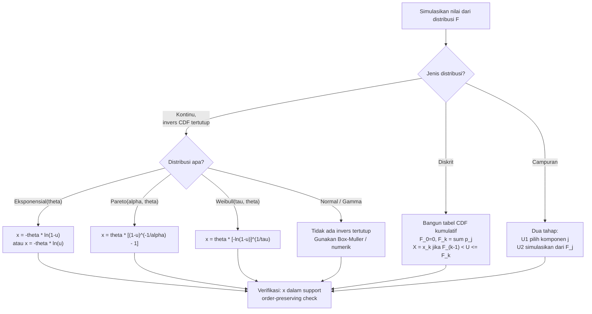

# 📊 8.2 — Inversion Method for Random Variables

> [!ABSTRACT] Ringkasan Cepat
> **Topik:** Inversion Method for Random Variables | **Bobot:** ~5–10% | **Difficulty:** Hard
> **Ref:** Klugman et al. (2019), Loss Models 5th ed., Bab 19.3; Tse (2009), Bab 14 | **Prereq:** [[8.1 Monte Carlo Simulation Concepts]], [[1.2 Distribution Classes and Extreme Value]]


## Section 0 — Pemetaan Topik

| Topik TA2 | Sub-topik ID | Skill Diuji | Bobot | Difficulty | Prerequisite | Connected Topics | Referensi |
|---|---|---|---|---|---|---|---|
| Simulasi | 8.2 | Mensimulasikan nilai dari distribusi diskrit dan kontinu menggunakan metode inversi; menurunkan fungsi invers CDF secara analitik; mengaplikasikan metode inversi pada distribusi campuran dan mixed | 5–10% | Hard | [[8.1 Monte Carlo Simulation Concepts]], [[1.2 Distribution Classes and Extreme Value]] | [[8.1 Monte Carlo Simulation Concepts]], [[8.3 Permutation Test and Bootstrap]], [[4.2 Compound Distributions]] | Klugman et al. (2019), Bab 19.3; Tse (2009), Bab 14 |


## Section 1 — Intuisi

Bayangkan seorang aktuaris yang ingin mensimulasikan 10.000 skenario klaim asuransi properti untuk keperluan stress-testing portofolio. Ia mengetahui bahwa besar klaim mengikuti distribusi Lognormal dengan parameter tertentu — tetapi bagaimana ia bisa "menghasilkan" ribuan angka acak yang mengikuti distribusi itu dari komputer, yang hanya mampu menghasilkan angka acak seragam antara 0 dan 1?

Di sinilah **metode inversi** hadir sebagai jembatan yang elegan. Kunci utamanya adalah teorema probabilitas yang sederhana namun kuat: jika $U$ adalah bilangan acak seragam pada $[0,1]$, maka $X = F^{-1}(U)$ — di mana $F^{-1}$ adalah fungsi invers dari CDF distribusi target — akan mengikuti distribusi $F$ yang diinginkan. Dengan kata lain, kita tinggal "membalik" CDF: ambil bilangan acak seragam sebagai probabilitas, cari nilai $x$ yang menghasilkan probabilitas tersebut, dan itulah simulasi kita.

Tantangannya terletak pada dua hal. Pertama, untuk distribusi kontinu, kita perlu menemukan $F^{-1}$ secara analitik — yang tidak selalu mudah (distribusi Normal misalnya tidak memiliki bentuk tertutup). Kedua, untuk distribusi diskrit, metode inversi bekerja secara berbeda: kita mencari nilai diskrit yang CDF-nya pertama kali melampaui bilangan seragam $U$ yang dihasilkan. Memahami kedua kasus ini dengan tepat — beserta kasus khusus seperti distribusi campuran (*mixture*) — adalah inti dari topik ini.


## Section 2 — Definisi Formal

> [!NOTE] Definisi Matematis — Probability Integral Transform
> Jika $X$ adalah variabel acak dengan CDF $F_X(x)$ yang kontinu dan strictly increasing, dan $U \sim \text{Uniform}(0,1)$, maka:
>
> $$
> X = F_X^{-1}(U) \sim F_X
> $$
>
> Sebaliknya (inverse direction): jika $X \sim F_X$ kontinu, maka $U = F_X(X) \sim \text{Uniform}(0,1)$.

| Simbol | Makna | Catatan |
|---|---|---|
| $U$ | Bilangan acak seragam | $U \sim \text{Uniform}(0,1)$; dihasilkan komputer |
| $F_X(x)$ | CDF dari distribusi target | Fungsi yang ingin disimulasikan |
| $F_X^{-1}(u)$ | Fungsi invers CDF (*quantile function*) | $F_X^{-1}(u) = \inf\{x : F_X(x) \geq u\}$ |
| $x_{(i)}$ | Nilai simulasi ke-$i$ | $x_{(i)} = F_X^{-1}(u_{(i)})$ untuk bilangan seragam $u_{(i)}$ |
| $p_k = P(X = x_k)$ | Probabilitas titik untuk distribusi diskrit | $p_k \geq 0$, $\sum_k p_k = 1$ |
| $F_k = \sum_{j \leq k} p_j$ | CDF kumulatif diskrit | $F_0 = 0$ secara konvensi |
| $\alpha_j$ | Bobot komponen ke-$j$ dalam distribusi campuran | $\alpha_j > 0$, $\sum_j \alpha_j = 1$ |
| $F_j(x)$ | CDF komponen ke-$j$ dalam distribusi campuran | Masing-masing adalah distribusi valid |

### Rumus Utama

**[Inversion — Kontinu] Simulasi dari distribusi kontinu:**

$$
x = F_X^{-1}(u), \quad u \sim \text{Uniform}(0,1)
$$

*Label: Selesaikan $F_X(x) = u$ terhadap $x$ secara analitik untuk mendapatkan $F_X^{-1}$, lalu substitusikan $u$ yang dihasilkan.*

**[Inversion — Eksponensial] Invers CDF distribusi Eksponensial($\theta$):**

$$
F_X(x) = 1 - e^{-x/\theta} = u \implies x = -\theta \ln(1 - u)
$$

*Label: Karena $1-U \sim \text{Uniform}(0,1)$ juga, bisa disederhanakan: $x = -\theta\ln(U)$. Kedua bentuk ekuivalen.*

**[Inversion — Pareto] Invers CDF distribusi Pareto dua-parameter ($\alpha, \theta$):**

$$
F_X(x) = 1 - \left(\frac{\theta}{x+\theta}\right)^\alpha = u \implies x = \theta\left[(1-u)^{-1/\alpha} - 1\right]
$$

*Label: Ekuivalen dengan $x = \theta\left[u^{-1/\alpha} - 1\right]$ karena $1-U \overset{d}{=} U$.*

**[Inversion — Weibull] Invers CDF distribusi Weibull($\tau, \theta$) dengan $F(x) = 1 - e^{-(x/\theta)^\tau}$:**

$$
F_X(x) = 1 - e^{-(x/\theta)^\tau} = u \implies x = \theta\left[-\ln(1-u)\right]^{1/\tau}
$$

*Label: Generalisasi Eksponensial; ketika $\tau = 1$ reduksi ke $x = -\theta\ln(1-u)$.*

**[Inversion — Diskrit] Algoritma simulasi distribusi diskrit:**

$$
X = x_k \quad \text{jika} \quad F_{k-1} < U \leq F_k, \quad k = 1, 2, \ldots
$$

*Label: Temukan indeks $k$ terkecil sehingga $F_k \geq U$. Ekuivalen: $X = x_k$ jika $U$ jatuh di interval $(F_{k-1}, F_k]$.*

**[Inversion — Campuran] Simulasi dari distribusi campuran $F(x) = \sum_{j=1}^m \alpha_j F_j(x)$:**

$$
\text{Langkah 1: Pilih komponen } j \text{ dengan probabilitas } \alpha_j
$$

$$
\text{Langkah 2: Simulasikan } X \sim F_j \text{ menggunakan metode inversi pada komponen } j
$$

*Label: Dua bilangan seragam independen dibutuhkan: $U_1$ untuk memilih komponen, $U_2$ untuk simulasi dari komponen tersebut.*

### Asumsi Eksplisit

1. **Ketersediaan $F_X^{-1}$ analitik (kontinu):** Metode inversi paling efisien ketika invers CDF memiliki bentuk tertutup. Jika tidak (misalnya Normal, Gamma), diperlukan pendekatan numerik.
2. **Generator bilangan seragam berkualitas:** Kualitas simulasi bergantung pada generator pseudorandom yang memberikan $U_i$ i.i.d. $\sim \text{Uniform}(0,1)$.
3. **Distribusi diskrit — nilai $x_k$ terurut:** Nilai $x_1 < x_2 < \ldots$ harus tersusun naik agar algoritma pencarian interval bekerja.
4. **Distribusi campuran — bobot $\alpha_j$ diketahui:** Bobot komponen harus berjumlah 1 dan masing-masing non-negatif.
5. **Independensi bilangan seragam:** Untuk distribusi campuran, $U_1$ (pemilih komponen) dan $U_2$ (simulasi dalam komponen) harus independen.


## Section 3 — Jembatan Logika

> [!TIP] Dari Definisi ke Rumus — Mengapa $F_X^{-1}(U)$ Mengikuti Distribusi $F_X$?
> Bukti probability integral transform bersifat elegan. Kita ingin menunjukkan $P(F_X^{-1}(U) \leq x) = F_X(x)$. Karena $F_X$ adalah fungsi yang monoton tidak-turun dan kontinu, operasi inversi bersifat order-preserving: $F_X^{-1}(U) \leq x$ jika dan hanya jika $U \leq F_X(x)$. Sehingga $P(F_X^{-1}(U) \leq x) = P(U \leq F_X(x)) = F_X(x)$, karena $U \sim \text{Uniform}(0,1)$ dan $F_X(x) \in [0,1]$. Ini adalah bukti satu baris yang kuat — dan menjelaskan mengapa syarat "kontinu dan strictly increasing" diperlukan agar invers terdefinisi dengan baik.

> [!IMPORTANT] Distribusi Diskrit — Mengapa Menggunakan $F_{k-1} < U \leq F_k$?
> Untuk distribusi diskrit, CDF berbentuk tangga (*step function*) dan tidak invertible dalam arti biasa. Solusinya adalah menggunakan generalized inverse: $F^{-1}(u) = \inf\{x : F(x) \geq u\}$. Dalam praktik, artinya: temukan nilai $x_k$ terkecil sehingga $F_k = P(X \leq x_k) \geq u$. Konvensi $F_{k-1} < U \leq F_k$ (bukan $F_{k-1} \leq U < F_k$) memastikan $P(X = x_k) = P(F_{k-1} < U \leq F_k) = F_k - F_{k-1} = p_k$ — tepat sesuai probabilitas yang diinginkan.

**Derivasi Invers CDF Eksponensial — step-by-step:**

**Langkah 1:** Mulai dari CDF Eksponensial:

$$
F_X(x) = 1 - e^{-x/\theta}, \quad x > 0
$$

**Langkah 2:** Set $F_X(x) = u$ dan selesaikan untuk $x$:

$$
1 - e^{-x/\theta} = u \implies e^{-x/\theta} = 1 - u
$$

**Langkah 3:** Ambil logaritma natural:

$$
-\frac{x}{\theta} = \ln(1-u) \implies x = -\theta \ln(1-u)
$$

**Langkah 4:** Sederhanakan menggunakan sifat simetri Uniform:

$$
\text{Karena } 1-U \overset{d}{=} U \text{ (jika } U \sim \text{Uniform}(0,1)), \text{ maka ekuivalen: } x = -\theta \ln(U)
$$

**Langkah 5:** Verifikasi: ketika $u \to 0^+$, $x \to 0^+$; ketika $u \to 1^-$, $x \to +\infty$. Range $x \in (0, +\infty)$ konsisten dengan support Eksponensial. ✓

**Derivasi Invers CDF Pareto — step-by-step:**

**Langkah 1:** CDF Pareto dua-parameter:

$$
F_X(x) = 1 - \left(\frac{\theta}{x+\theta}\right)^\alpha, \quad x > 0
$$

**Langkah 2:** Set $F_X(x) = u$:

$$
\left(\frac{\theta}{x+\theta}\right)^\alpha = 1-u
$$

**Langkah 3:** Pangkatkan dengan $-1/\alpha$ pada kedua ruas:

$$
\frac{x+\theta}{\theta} = (1-u)^{-1/\alpha}
$$

**Langkah 4:** Selesaikan untuk $x$:

$$
x = \theta\left[(1-u)^{-1/\alpha} - 1\right]
$$

**Langkah 5:** Karena $1-U \overset{d}{=} U$, bentuk alternatif: $x = \theta(u^{-1/\alpha} - 1)$. Verifikasi: saat $u \to 0^+$, $x \to 0^+$; saat $u \to 1^-$, $x \to +\infty$. ✓

> [!DANGER] Dilarang
> 1. **Jangan** menggunakan $x = -\theta\ln(U)$ dan $x = -\theta\ln(1-U)$ sekaligus dalam simulasi yang sama untuk menghasilkan dua nilai berbeda — keduanya *ekuivalen secara distribusional*, bukan dua nilai independen. Untuk dua simulasi independen, gunakan dua bilangan seragam independen $U_1$ dan $U_2$.
> 2. **Jangan** menggunakan $U \leq F_{k-1}$ atau $U < F_k$ (bukan $F_{k-1} < U \leq F_k$) pada distribusi diskrit — konvensi ketidaksamaan yang keliru mengubah probabilitas titik yang dihasilkan.
> 3. **Jangan** menerapkan rumus invers distribusi kontinu untuk bilangan seragam $u = 0$ atau $u = 1$ — nilainya tidak terdefinisi (menghasilkan $-\infty$ atau $+\infty$); dalam praktik bilangan seragam dihasilkan pada $(0,1)$ terbuka.


## Section 4 — Contoh Soal

### Soal A — Fundamental

Bilangan acak seragam berikut dihasilkan: $u_1 = 0.30$, $u_2 = 0.75$, $u_3 = 0.92$. Simulasikan tiga nilai dari distribusi Eksponensial dengan mean $\theta = 500$. Gunakan formula $x = -\theta\ln(1-u)$.

> [!SUCCESS] Solusi Soal A
> **Pendekatan:** Substitusikan langsung setiap $u_i$ ke formula invers CDF Eksponensial $x = -\theta\ln(1-u)$.
>
> **1. Identifikasi Variabel**
> - Distribusi: Eksponensial($\theta = 500$), $F(x) = 1 - e^{-x/500}$
> - Bilangan seragam: $u_1 = 0.30$, $u_2 = 0.75$, $u_3 = 0.92$
> - Formula invers: $x = -500\ln(1-u)$
>
> **2. Identifikasi Distribusi / Model**
> Eksponensial kontinu dengan invers CDF tertutup. Metode inversi langsung tanpa aproksimasi.
>
> **3. Setup Persamaan**
>
> $$
> x_i = -500 \cdot \ln(1 - u_i), \quad i = 1, 2, 3
> $$
>
> **4. Eksekusi Aljabar**
>
> $$
> x_1 = -500\ln(1 - 0.30) = -500\ln(0.70) = -500 \times (-0.35667) = 178.3
> $$
>
> $$
> x_2 = -500\ln(1 - 0.75) = -500\ln(0.25) = -500 \times (-1.38629) = 693.1
> $$
>
> $$
> x_3 = -500\ln(1 - 0.92) = -500\ln(0.08) = -500 \times (-2.52573) = 1262.9
> $$
>
> **5. Verification**
> Semua nilai positif ✓ (support Eksponensial: $x > 0$). $x_1 < x_2 < x_3$ konsisten dengan $u_1 < u_2 < u_3$ — metode inversi bersifat order-preserving ✓. Nilai $x_2 = 693.1 \approx \theta \ln 4 \approx 693$ (karena $\ln(1/0.25) = \ln 4$) — masuk akal sebagai konfirmasi.
>
> **Hasil:** $x_1 \approx 178.3$, $x_2 \approx 693.1$, $x_3 \approx 1262.9$.

> [!WARNING] Exam Tips — Soal A
> **Target waktu:** 2 menit. **Common trap:** Menggunakan $x = -\theta \ln(u)$ alih-alih $x = -\theta\ln(1-u)$ — keduanya ekuivalen *secara distribusional* tetapi menghasilkan nilai numerik berbeda untuk $u_i$ spesifik yang diberikan. Soal biasanya menetapkan salah satu formula; ikuti formula yang diminta soal. **Shortcut:** $\ln(0.25) = \ln(1/4) = -\ln 4 \approx -1.3863$; $\ln(0.08) \approx -2.526$.

---

### Soal B — Exam-Typical

Variabel acak diskrit $X$ memiliki distribusi:

| $x$ | 1 | 2 | 3 | 4 | 5 |
|---|---|---|---|---|---|
| $P(X=x)$ | 0.10 | 0.25 | 0.35 | 0.20 | 0.10 |

Bilangan acak seragam yang dihasilkan adalah $u_1 = 0.08$, $u_2 = 0.43$, $u_3 = 0.91$. Simulasikan tiga nilai dari distribusi ini menggunakan metode inversi.

> [!SUCCESS] Solusi Soal B
> **Pendekatan:** Bangun tabel CDF kumulatif, lalu tentukan nilai $X$ untuk setiap $u_i$ dengan mencari interval $(F_{k-1}, F_k]$ yang memuat $u_i$.
>
> **1. Identifikasi Variabel**
> - Distribusi diskrit dengan 5 nilai: $x \in \{1, 2, 3, 4, 5\}$
> - Probabilitas: $p_1=0.10, p_2=0.25, p_3=0.35, p_4=0.20, p_5=0.10$
> - Bilangan seragam: $u_1=0.08$, $u_2=0.43$, $u_3=0.91$
>
> **2. Identifikasi Distribusi / Model**
> Distribusi diskrit — gunakan aturan $X = x_k$ jika $F_{k-1} < u \leq F_k$.
>
> **3. Setup Persamaan**
>
> Bangun tabel CDF kumulatif:
>
> | $k$ | $x_k$ | $p_k$ | $F_k = \sum_{j \leq k} p_j$ | Interval $(F_{k-1}, F_k]$ |
> |---|---|---|---|---|
> | 1 | 1 | 0.10 | 0.10 | $(0.00,\; 0.10]$ |
> | 2 | 2 | 0.25 | 0.35 | $(0.10,\; 0.35]$ |
> | 3 | 3 | 0.35 | 0.70 | $(0.35,\; 0.70]$ |
> | 4 | 4 | 0.20 | 0.90 | $(0.70,\; 0.90]$ |
> | 5 | 5 | 0.10 | 1.00 | $(0.90,\; 1.00]$ |
>
> **4. Eksekusi Aljabar**
>
> Untuk $u_1 = 0.08$: Cari interval yang memuat $0.08$.
>
> $$
> 0.00 < 0.08 \leq 0.10 \implies X_1 = 1
> $$
>
> Untuk $u_2 = 0.43$: Cari interval yang memuat $0.43$.
>
> $$
> 0.35 < 0.43 \leq 0.70 \implies X_2 = 3
> $$
>
> Untuk $u_3 = 0.91$: Cari interval yang memuat $0.91$.
>
> $$
> 0.90 < 0.91 \leq 1.00 \implies X_3 = 5
> $$
>
> **5. Verification**
> Cek: setiap $u_i$ jatuh tepat di satu interval ✓ (interval-interval partisi $(0,1]$ secara exhaustive). Proporsi hasil: dari 3 simulasi, nilai yang dihasilkan adalah 1, 3, 5 — tidak ada kesimpulan statistik dari 3 observasi, tetapi nilai mungkin ✓.
>
> **Hasil:** $X_1 = 1$, $X_2 = 3$, $X_3 = 5$.

> [!WARNING] Exam Tips — Soal B
> **Target waktu:** 3 menit. **Common trap:** Menggunakan $F_{k-1} \leq u < F_k$ (pertidaksamaan terbalik) — ini mengubah nilai yang dihasilkan di batas interval. Konvensi standar adalah $(F_{k-1}, F_k]$: batas kiri terbuka, batas kanan tertutup. **Common trap kedua:** Tidak membangun tabel CDF kumulatif terlebih dahulu dan mencoba "mengira" interval — selalu bangun tabel eksplisit. **Shortcut:** Mulai dari ujung kiri tabel dan gerakkan ke kanan sampai $F_k \geq u$ pertama kali — ini adalah prosedur "first $k$ such that $F_k \geq u$."

---

### Soal C — Challenging

Besar klaim $X$ mengikuti distribusi campuran (*mixture*): dengan probabilitas $0.60$, klaim berasal dari distribusi Eksponensial dengan mean $200$; dengan probabilitas $0.40$, klaim berasal dari distribusi Pareto dengan $\alpha = 3$ dan $\theta = 1000$.

Bilangan acak seragam yang tersedia (gunakan secara berurutan):
$u_1 = 0.55$ (untuk memilih komponen), $u_2 = 0.80$ (untuk simulasi dalam komponen).

Simulasikan satu nilai klaim menggunakan metode inversi dua-tahap.

> [!SUCCESS] Solusi Soal C
> **Pendekatan:** Langkah 1 — gunakan $u_1$ untuk memilih komponen distribusi. Langkah 2 — gunakan $u_2$ untuk mensimulasikan nilai dari komponen terpilih menggunakan formula invers CDF masing-masing.
>
> **1. Identifikasi Variabel**
> - Distribusi campuran: $\alpha_1 = 0.60$ (Eksponensial, $\theta_E = 200$), $\alpha_2 = 0.40$ (Pareto, $\alpha_P = 3$, $\theta_P = 1000$)
> - $u_1 = 0.55$ untuk pemilihan komponen; $u_2 = 0.80$ untuk simulasi dalam komponen
> - Invers CDF Eksponensial: $x = -200\ln(1-u)$
> - Invers CDF Pareto: $x = 1000\left[(1-u)^{-1/3} - 1\right]$
>
> **2. Identifikasi Distribusi / Model**
> Distribusi campuran dua komponen. Prosedur dua-tahap: pemilihan komponen (diskrit, berdasarkan $\alpha_j$) lalu simulasi dari komponen (kontinu, invers CDF).
>
> **3. Setup Persamaan**
>
> **Tahap 1 — Pemilihan komponen:**
>
> $$
> \text{Komponen 1 (Eksponensial) jika } u_1 \leq \alpha_1 = 0.60
> $$
>
> $$
> \text{Komponen 2 (Pareto) jika } u_1 > \alpha_1 = 0.60
> $$
>
> **Tahap 2 — Simulasi dari komponen terpilih:**
>
> $$
> x = F_j^{-1}(u_2), \quad \text{di mana } j \text{ adalah komponen yang dipilih}
> $$
>
> **4. Eksekusi Aljabar**
>
> **Tahap 1:** Cek $u_1 = 0.55$ vs $\alpha_1 = 0.60$:
>
> $$
> 0.55 \leq 0.60 \implies \text{Pilih Komponen 1: Eksponensial}(\theta = 200)
> $$
>
> **Tahap 2:** Simulasikan dari Eksponensial menggunakan $u_2 = 0.80$:
>
> $$
> x = -200 \cdot \ln(1 - 0.80) = -200 \cdot \ln(0.20)
> $$
>
> $$
> \ln(0.20) = \ln\!\left(\frac{1}{5}\right) = -\ln 5 \approx -1.60944
> $$
>
> $$
> x = -200 \times (-1.60944) = 321.9
> $$
>
> **5. Verification**
> Komponen Eksponensial terpilih dengan peluang $60\%$ — benar bahwa $u_1 = 0.55 < 0.60$ memilih komponen ini ✓. Nilai $x = 321.9 > 0$ sesuai support Eksponensial ✓. Sebagai perbandingan: jika $u_1 = 0.70 > 0.60$, komponen Pareto akan dipilih dan nilai klaim cenderung jauh lebih besar (distribusi Pareto ekor-berat) — ini konsisten dengan sifat campuran.
>
> **Hasil:** Klaim disimulasikan dari komponen Eksponensial; $x \approx 321.9$.

> [!WARNING] Exam Tips — Soal C
> **Target waktu:** 5 menit. **Common trap terbesar:** Menggunakan hanya satu bilangan seragam untuk kedua tahap — pemilihan komponen dan simulasi dalam komponen **membutuhkan dua bilangan seragam independen**. Soal biasanya menyediakan bilangan seragam secara berurutan; identifikasi mana untuk tahap 1 dan mana untuk tahap 2. **Common trap kedua:** Menggunakan $u_1 > \alpha_1$ sebagai kondisi memilih Komponen 1 (terbalik) — konvensi: Komponen 1 dipilih jika $u_1 \leq \alpha_1$. **Shortcut:** Tulis tabel partisi kumulatif untuk komponen: Komponen 1 jika $u \in (0, 0.60]$; Komponen 2 jika $u \in (0.60, 1.00]$.


## Section 5 — Verifikasi & Sanity Check

> [!CHECK] Cek Konsistensi Range Nilai yang Disimulasikan
> Nilai yang disimulasikan $x = F^{-1}(u)$ harus selalu berada dalam support distribusi target:
> - Eksponensial: $x > 0$ untuk semua $u \in (0,1)$ ✓ (karena $-\theta\ln(1-u) > 0$ untuk $u > 0$)
> - Pareto: $x > 0$ untuk semua $u \in (0,1)$ ✓ (karena $(1-u)^{-1/\alpha} > 1$ untuk $u > 0$)
> - Diskrit: $x \in \{x_1, x_2, \ldots\}$ — hasil harus selalu berupa salah satu nilai yang mungkin ✓
>
> Jika hasil simulasi di luar support, ada kesalahan dalam formula invers atau substitusi.

> [!CHECK] Cek Order-Preserving Property
> Metode inversi bersifat *order-preserving*: jika $u_1 < u_2$, maka $F^{-1}(u_1) \leq F^{-1}(u_2)$. Gunakan ini untuk verifikasi cepat: ketika beberapa $u_i$ diberikan dalam urutan menaik, nilai $x_i$ yang dihasilkan harus juga urut menaik (untuk distribusi kontinu). Jika tidak, ada kesalahan kalkulasi.

### Metode Alternatif — Simulasi Normal via Box-Muller

Untuk distribusi Normal standar $Z \sim N(0,1)$ yang tidak memiliki invers CDF tertutup, gunakan transformasi Box-Muller sebagai alternatif metode inversi:

$$
Z_1 = \sqrt{-2\ln U_1} \cos(2\pi U_2), \quad Z_2 = \sqrt{-2\ln U_1} \sin(2\pi U_2)
$$

di mana $U_1, U_2 \sim \text{Uniform}(0,1)$ independen. Hasilnya $Z_1, Z_2$ adalah dua nilai Normal standar independen. Untuk Normal dengan mean $\mu$ dan standar deviasi $\sigma$: $X = \mu + \sigma Z$.


## Section 6 — Visualisasi Mental

**Visualisasi Metode Inversi — Distribusi Kontinu:**

```
CDF F(x)
  1.0 ─────────────────────────────────── ←  u₃ = 0.92 ─── x₃ = F⁻¹(0.92)
      │                             ╱
      │                        ╱╱╱
  0.75 ──────────────────── u₂ = 0.75 ──── x₂ = F⁻¹(0.75)
      │                 ╱╱╱╱
      │            ╱╱╱╱
  0.30 ──── u₁=0.30 ─────────────────────── x₁ = F⁻¹(0.30)
      │  ╱╱╱╱╱╱╱╱╱╱╱
      │╱╱╱
  0.0 └────────────────────────────────→ x
       x₁        x₂              x₃

 ← Bilangan seragam u (sumbu-y) diproyeksikan ke kiri
    lalu ke bawah mengikuti kurva CDF untuk mendapat x
```

**Visualisasi Metode Inversi — Distribusi Diskrit:**

```
CDF F(x) (step function)
  1.00 ──────────────────────────────── ───●
       │                         u₃=0.91 ↓ (jatuh di (0.90, 1.00] → X=5)
  0.90 ──────────────────────────── ───●
       │                u₂=0.43 ↓ (jatuh di (0.35, 0.70] → X=3)
  0.70 ──────────────────── ───────●
       │
  0.35 ─────────── ────────●
       │ u₁=0.08 ↓ (jatuh di (0.00, 0.10] → X=1)
  0.10 ──── ────●
  0.00 └──────────────────────────────→ x
              1    2    3    4    5
```

### Hubungan Visual ↔ Rumus

| Elemen Visual | Komponen Rumus |
|---|---|
| Garis horizontal dari $u$ ke kurva CDF | Operasi $F_X^{-1}(u)$: temukan $x$ sehingga $F_X(x) = u$ |
| Garis vertikal dari kurva CDF ke sumbu-$x$ | Nilai yang disimulasikan $x = F^{-1}(u)$ |
| "Lompatan" tangga pada distribusi diskrit | Probabilitas titik $p_k = F_k - F_{k-1}$ |
| Panjang interval $(F_{k-1}, F_k]$ | Proporsi bilangan $u$ yang menghasilkan nilai $x_k$ |
| Titik pada kurva CDF | $(x, F(x))$ — hubungan langsung antara nilai dan probabilitas kumulatifnya |


## Section 7 — Jebakan Umum

> [!BUG] Kesalahan Parametrisasi — Dua Bentuk Formula Eksponensial
> Formula invers CDF Eksponensial memiliki dua bentuk ekuivalen *secara distribusional* tetapi **tidak ekuivalen numerik** untuk nilai $u$ spesifik:
> - $x = -\theta\ln(1-u)$: gunakan ini jika soal menyatakan $u$ adalah CDF value
> - $x = -\theta\ln(u)$: gunakan ini jika soal menggunakan notasi "survival" atau $1-u$
>
> **Salah:** Menggabungkan keduanya — misalnya menghitung $-\theta\ln(u)$ ketika soal memberikan $u$ dan meminta formula $-\theta\ln(1-u)$.
> **Benar:** Identifikasi terlebih dahulu formula mana yang diminta soal, lalu gunakan konsisten untuk semua $u_i$.

> [!BUG] Kesalahan Konseptual — 4 Miskonsepsi Umum
> 1. **"Metode inversi hanya untuk distribusi kontinu"** — Salah. Metode inversi (menggunakan generalized inverse) berlaku juga untuk distribusi diskrit, dengan prosedur berbeda: cari $k$ terkecil sehingga $F_k \geq u$.
> 2. **"Satu bilangan seragam cukup untuk simulasi distribusi campuran"** — Salah. Distribusi campuran $m$-komponen membutuhkan dua bilangan seragam independen: satu untuk memilih komponen, satu untuk mensimulasikan dari komponen tersebut.
> 3. **"$U$ dan $1-U$ menghasilkan dua simulasi independen"** — Salah. $U$ dan $1-U$ adalah fungsi satu sama lain — tidak independen. Untuk dua simulasi independen, butuh dua $U$ yang di-generate terpisah.
> 4. **"Metode inversi selalu lebih baik dari metode lain"** — Tidak selalu. Untuk distribusi Normal dan Gamma, tidak ada invers CDF tertutup; metode lain (Box-Muller, acceptance-rejection) lebih efisien.

> [!BUG] Kesalahan Interpretasi Soal
> - **"Simulate from Exponential with mean 200"** → $\theta = 200$ (mean = $\theta$ untuk Eksponensial) → $x = -200\ln(1-u)$.
> - **"Simulate from Pareto with $\alpha=3$, $\theta=1000$"** → gunakan $x = 1000[(1-u)^{-1/3} - 1]$; perhatikan eksponen $-1/\alpha = -1/3$.
> - **"Use the following uniform random numbers in order"** → bilangan seragam pertama selalu untuk langkah pertama (pemilihan komponen jika campuran, atau simulasi jika tunggal). Jangan menukar urutan.
> - **"Simulate three values"** → butuh tiga bilangan seragam berbeda; jangan menggunakan ulang $u_i$ yang sama.

> [!CAUTION] Red Flags — Keyword Pemicu Prosedur Khusus
> - **"Mixture distribution" atau "dengan probabilitas $p$, berasal dari..."** → prosedur dua-tahap; butuh dua bilangan seragam independen.
> - **"Discrete distribution" dengan tabel probabilitas** → bangun tabel CDF kumulatif; gunakan aturan $(F_{k-1}, F_k]$.
> - **"Pareto with parameters $\alpha$ and $\theta$"** → eksponen $-1/\alpha$ dalam formula invers; jangan lupa tanda minus.
> - **"Weibull with shape $\tau$ and scale $\theta$"** → eksponen $1/\tau$ (positif, bukan negatif) dalam formula invers.
> - **"Use $u$ directly" vs "use $1-u$"** → baca soal secara cermat; kedua konvensi digunakan dalam literatur dan keduanya valid asal konsisten.


## Section 8 — Ringkasan Eksekutif

> [!SUMMARY] Must-Remember
>
> **1. Teorema dasar (Probability Integral Transform):**
>
> $$
> X = F_X^{-1}(U) \sim F_X \quad \text{jika } U \sim \text{Uniform}(0,1)
> $$
>
> **2. Invers CDF Eksponensial($\theta$):**
>
> $$
> x = -\theta\ln(1-u) \quad \text{(ekuivalen: } x = -\theta\ln u\text{)}
> $$
>
> **3. Invers CDF Pareto($\alpha, \theta$):**
>
> $$
> x = \theta\left[(1-u)^{-1/\alpha} - 1\right]
> $$
>
> **4. Distribusi Diskrit — aturan pemilihan nilai:**
>
> $$
> X = x_k \quad \text{jika } F_{k-1} < U \leq F_k
> $$
>
> **5. Distribusi Campuran — prosedur dua-tahap:**
>
> $$
> \text{Tahap 1: pilih komponen } j \text{ dengan } U_1; \quad \text{Tahap 2: simulasikan } X \sim F_j \text{ dengan } U_2
> $$

### Kapan Digunakan

- Mensimulasikan nilai dari distribusi dengan invers CDF tertutup (Eksponensial, Pareto, Weibull, Uniform, dll.).
- Mensimulasikan nilai dari distribusi diskrit dengan tabel probabilitas yang diberikan.
- Mensimulasikan dari distribusi campuran (*mixture*) dengan dua bilangan seragam independen.
- Trigger keywords: "simulate using inversion method", "use the following uniform random numbers", "inversion method for continuous/discrete distribution".

### Kapan TIDAK Boleh Digunakan

- Distribusi Normal, Gamma, Beta — tidak memiliki invers CDF tertutup; gunakan metode numerik, Box-Muller (Normal), atau acceptance-rejection.
- Ketika soal secara eksplisit meminta metode lain (acceptance-rejection, composition method).
- Untuk distribusi yang sangat kompleks di mana evaluasi $F^{-1}$ numerik lebih mahal dari metode alternatif.

### Quick Decision Tree



---

> [!QUOTE] Follow-up Options
> 1. *"Berikan contoh soal variasi simulasi distribusi Weibull dan Lognormal menggunakan metode inversi"*
> 2. *"Jelaskan hubungan [[8.2 Inversion Method for Random Variables]] dengan [[8.3 Permutation Test and Bootstrap]]"*
> 3. *"Buat flashcard 1-halaman untuk semua rumus invers CDF yang diuji di TA2"*

*📖 Ref: Klugman, Panjer & Willmot (2019), Loss Models 5th ed., Bab 19.3; Tse (2009), Bab 14 | 🗓️ 2026-04-19 | #TA2 #InversionMethod #Simulation*
