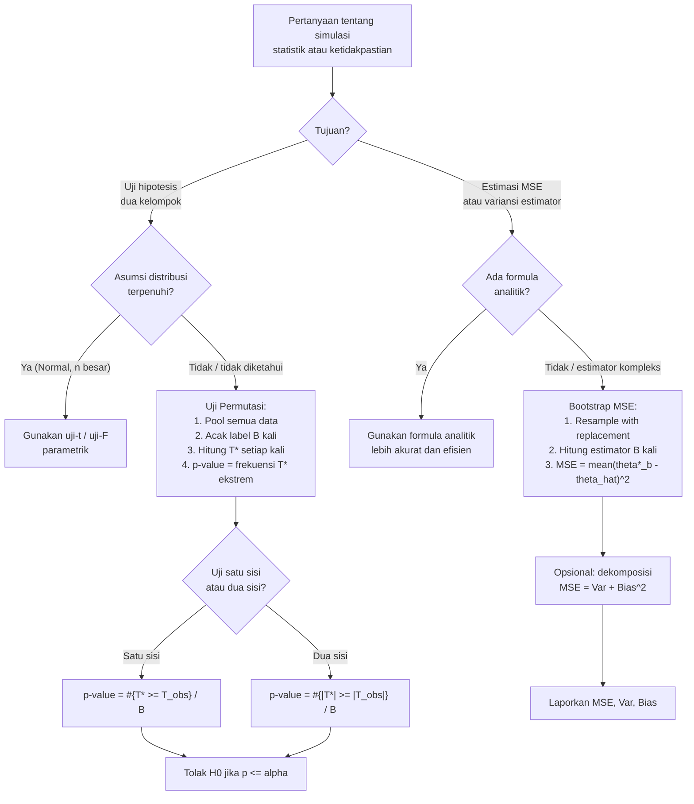

# 📊 8.3 — Permutation Test and Bootstrap

> [!ABSTRACT] Ringkasan Cepat
> **Topik:** Permutation Test and Bootstrap | **Bobot:** ~5–10% | **Difficulty:** Hard
> **Ref:** Klugman et al. (2019), Loss Models 5th ed., Bab 19.3; Tse (2009), Bab 15 | **Prereq:** [[8.1 Monte Carlo Simulation Concepts]], [[8.2 Inversion Method for Random Variables]], [[6.2 MSE Confidence Intervals and Delta Method]]


## Section 0 — Pemetaan Topik

| Topik TA2 | Sub-topik ID | Skill Diuji | Bobot | Difficulty | Prerequisite | Connected Topics | Referensi |
|---|---|---|---|---|---|---|---|
| Simulasi | 8.3 | Menggunakan uji permutasi untuk menentukan distribusi empiris dari statistik uji; menggunakan metode bootstrap untuk mengestimasi MSE suatu estimator dari data sampel | 5–10% | Hard | [[8.1 Monte Carlo Simulation Concepts]], [[8.2 Inversion Method for Random Variables]], [[6.2 MSE Confidence Intervals and Delta Method]] | [[6.4 Model Diagnostics and Selection]], [[6.2 MSE Confidence Intervals and Delta Method]] | Klugman et al. (2019), Bab 19.3; Tse (2009), Bab 15 |


## Section 1 — Intuisi

Bayangkan seorang aktuaris yang ingin tahu: apakah rata-rata klaim polis jenis A benar-benar berbeda dari polis jenis B, atau perbedaan yang terlihat hanya karena kebetulan sampling? Cara klasiknya adalah menggunakan uji-t, yang mensyaratkan distribusi Normal. Tetapi bagaimana jika distribusi klaim jauh dari Normal — seperti distribusi Pareto yang ekor-beratnya khas di asuransi jiwa atau kerugian? Di sinilah **uji permutasi** hadir: alih-alih mengandalkan asumsi distribusional, kita bertanya langsung — "Seberapa ekstrem perbedaan yang kita amati, dibandingkan dengan semua kemungkinan penugasan ulang (*relabeling*) data ke dua kelompok?" Dengan mengacak label kelompok ribuan kali dan menghitung statistik uji setiap kali, kita membangun distribusi empiris dari statistik uji di bawah hipotesis nol — tanpa asumsi distribusi apapun.

Pertanyaan kedua yang sering dihadapi aktuaris adalah: "Seberapa akurat estimator yang saya gunakan?" Misalnya, aktuaris menggunakan MLE untuk mengestimasi parameter distribusi klaim, dan ingin tahu MSE (*mean squared error*) dari estimator tersebut. Secara teori, formula MSE mungkin ada — tetapi untuk estimator kompleks seperti fungsi non-linear dari MLE, formula analitiknya bisa sangat sulit diturunkan. **Metode bootstrap** menjawab ini dengan cara brilian: ambil sampel berulang kali **dengan pengembalian** (*with replacement*) dari data asli, hitung estimator pada setiap sampel bootstrap, dan gunakan variasi estimator tersebut untuk mengestimasi MSE. Data itu sendiri menjadi "populasi" pengganti.

Kedua metode ini — uji permutasi dan bootstrap — adalah alat simulasi yang bekerja *tanpa* asumsi distribusional yang ketat. Keduanya mengandalkan kekuatan komputasi untuk membangun distribusi empiris dari statistik yang diminati. Bagi aktuaris modern, memahami logika di balik kedua metode ini sama pentingnya dengan menghafal rumusnya.


## Section 2 — Definisi Formal

> [!NOTE] Definisi Matematis
> **Uji Permutasi:** Untuk menguji $H_0$: kedua sampel berasal dari populasi yang sama, bangun distribusi empiris dari statistik uji $T$ dengan menghitung $T$ pada setiap permutasi (atau sampel acak permutasi) dari label kelompok. *P-value* empiris adalah:
>
> $$
> \hat{p} = \frac{\#\{\text{permutasi di mana } T^* \geq T_{\text{obs}}\}}{B}
> $$
>
> **Bootstrap MSE:** Untuk estimator $\hat{\theta}$ dari parameter $\theta$, estimasi MSE bootstrap adalah:
>
> $$
> \widehat{\text{MSE}}_{\text{boot}} = \frac{1}{B} \sum_{b=1}^{B} \left(\hat{\theta}^{*(b)} - \hat{\theta}\right)^2
> $$

| Simbol | Makna | Catatan |
|---|---|---|
| $T_{\text{obs}}$ | Nilai statistik uji pada data asli | Misalnya selisih mean: $\bar{X}_A - \bar{X}_B$ |
| $T^{*(b)}$ | Nilai statistik uji pada permutasi/bootstrap ke-$b$ | Dihitung dari data yang di-resample |
| $B$ | Jumlah replikasi (permutasi atau bootstrap) | Semakin besar $B$, semakin akurat estimasi empiris |
| $\hat{p}$ | *P-value* empiris dari uji permutasi | Proporsi replikasi di mana $T^*$ lebih ekstrem dari $T_{\text{obs}}$ |
| $\hat{\theta}$ | Estimator dari data asli | Nilai referensi untuk bootstrap MSE |
| $\hat{\theta}^{*(b)}$ | Estimator dari sampel bootstrap ke-$b$ | Dihitung ulang dari setiap resample |
| $n$ | Ukuran sampel asli | Total observasi dari kedua kelompok gabungan |
| $n_A, n_B$ | Ukuran masing-masing kelompok dalam uji permutasi | $n_A + n_B = n$ |
| $\binom{n}{n_A}$ | Jumlah total permutasi yang mungkin | Jumlah cara memilih $n_A$ elemen dari $n$ |
| $x_1^*, \ldots, x_n^*$ | Sampel bootstrap | Sampel **dengan pengembalian** berukuran $n$ dari data asli |

### Rumus Utama

**[Permutasi — P-value] P-value empiris uji permutasi (uji satu sisi kanan):**

$$
\hat{p} = \frac{\#\{b : T^{*(b)} \geq T_{\text{obs}}\}}{B}
$$

*Label: Tolak $H_0$ pada level $\alpha$ jika $\hat{p} \leq \alpha$. Untuk uji dua sisi: gunakan $|T^{*(b)}| \geq |T_{\text{obs}}|$.*

**[Permutasi — Jumlah Permutasi Tepat] Total permutasi untuk dua sampel berukuran $n_A$ dan $n_B$:**

$$
\binom{n}{n_A} = \frac{n!}{n_A!\, n_B!}, \quad n = n_A + n_B
$$

*Label: Jika jumlah ini kecil (misalnya $< 10{,}000$), enumerasi tepat seluruh permutasi mungkin dilakukan. Jika besar, gunakan sampel acak dari $B$ permutasi.*

**[Bootstrap — MSE] Estimasi MSE bootstrap untuk estimator $\hat{\theta}$:**

$$
\widehat{\text{MSE}}_{\text{boot}} = \frac{1}{B} \sum_{b=1}^{B} \left(\hat{\theta}^{*(b)} - \hat{\theta}\right)^2
$$

*Label: $\hat{\theta}$ (estimator dari data asli) digunakan sebagai pengganti nilai "benar" $\theta$ yang tidak diketahui. Bootstrap mensimulasikan variabilitas sampling dengan resampling.*

**[Bootstrap — Variansi] Estimasi variansi bootstrap:**

$$
\widehat{\text{Var}}_{\text{boot}}(\hat{\theta}) = \frac{1}{B-1} \sum_{b=1}^{B} \left(\hat{\theta}^{*(b)} - \bar{\theta}^*\right)^2, \quad \bar{\theta}^* = \frac{1}{B}\sum_{b=1}^{B} \hat{\theta}^{*(b)}
$$

*Label: Jika estimator $\hat{\theta}$ adalah unbiased, maka $\widehat{\text{MSE}}_{\text{boot}} \approx \widehat{\text{Var}}_{\text{boot}}(\hat{\theta})$.*

**[Bootstrap — Bias] Estimasi bias bootstrap:**

$$
\widehat{\text{Bias}}_{\text{boot}}(\hat{\theta}) = \bar{\theta}^* - \hat{\theta}
$$

*Label: Bias positif berarti estimator rata-rata bootstrap lebih besar dari estimator data asli. Hubungan: $\text{MSE} = \text{Var} + \text{Bias}^2$.*

**[MSE Dekomposisi] Relasi MSE, Variansi, dan Bias:**

$$
\text{MSE}(\hat{\theta}) = \text{Var}(\hat{\theta}) + [\text{Bias}(\hat{\theta})]^2
$$

*Label: Bootstrap mengestimasi komponen Var dan Bias secara terpisah; MSE boot adalah jumlah kuadrat deviasi dari $\hat{\theta}$ (bukan dari $\theta$ yang benar).*

### Asumsi Eksplisit

1. **Uji Permutasi — Exchangeability:** Di bawah $H_0$, semua observasi dari kedua kelompok bersifat *exchangeable* — penugasan ulang label tidak mengubah distribusi gabungan. Ini lebih lemah dari asumsi distribusi yang identik.
2. **Bootstrap — Sampel representatif:** Sampel asli cukup representatif terhadap populasi. Dengan $n$ besar, distribusi empiris mendekati distribusi populasi.
3. **Bootstrap — Resampling dengan pengembalian (*with replacement*):** Setiap sampel bootstrap berukuran $n$ sama seperti sampel asli, diambil **dengan pengembalian**. Setiap observasi dapat muncul 0, 1, 2, ... kali dalam satu sampel bootstrap.
4. **Jumlah replikasi $B$ cukup besar:** Umumnya $B \geq 1000$ untuk estimasi MSE yang stabil; $B \geq 10{,}000$ untuk p-value yang akurat.
5. **Statistik uji terdefinisi:** Statistik $T$ harus dapat dihitung pada setiap permutasi/resample. Untuk bootstrap MSE, estimator $\hat{\theta}$ harus dapat dihitung ulang dari setiap sampel bootstrap.


## Section 3 — Jembatan Logika

> [!TIP] Dari Definisi ke Rumus — Logika Uji Permutasi
> Uji permutasi bertanya: "Jika $H_0$ benar (kedua kelompok berasal dari distribusi yang sama), seberapa sering kita mengharapkan perbedaan sebesar $T_{\text{obs}}$ atau lebih besar muncul secara acak?" Caranya: gabungkan semua $n = n_A + n_B$ observasi menjadi satu pool, lalu secara acak bagi ulang menjadi kelompok berukuran $n_A$ dan $n_B$. Hitung statistik uji $T^*$ pada setiap pembagian ini. Kumpulan $\{T^{*(b)}\}$ membentuk distribusi empiris dari $T$ di bawah $H_0$. P-value adalah proporsi replikasi di mana $T^*$ sama ekstrem atau lebih ekstrem dari $T_{\text{obs}}$.

> [!IMPORTANT] Bootstrap — Mengapa Resampling "With Replacement"?
> Resampling **tanpa** pengembalian hanya menghasilkan permutasi data yang sama — tidak ada informasi baru tentang variabilitas sampling. Resampling **dengan** pengembalian mensimulasikan "bagaimana sampel lain dari populasi yang sama akan terlihat": beberapa observasi hilang (tidak terpilih), beberapa muncul berulang, menciptakan variabilitas buatan yang meniru variabilitas sampling sesungguhnya. Dari $n$ observasi, ada $n^n$ kemungkinan sampel bootstrap (dengan pengembalian) dibanding hanya $n!$ permutasi (tanpa pengembalian) — ruang yang jauh lebih besar dan lebih representatif terhadap ketidakpastian sampling.

**Derivasi Prosedur Uji Permutasi — Step-by-Step:**

**Langkah 1:** Hitung statistik uji $T_{\text{obs}}$ dari data asli. Misalnya untuk uji perbedaan mean:

$$
T_{\text{obs}} = \bar{X}_A - \bar{X}_B
$$

**Langkah 2:** Gabungkan semua observasi: $\{x_1, x_2, \ldots, x_{n_A}, y_1, y_2, \ldots, y_{n_B}\}$ menjadi satu pool berukuran $n = n_A + n_B$.

**Langkah 3:** Untuk setiap replikasi $b = 1, 2, \ldots, B$:
- Acak ulang label: pilih secara acak $n_A$ observasi dari pool sebagai "Kelompok A*"; sisanya $n_B$ sebagai "Kelompok B*".
- Hitung $T^{*(b)} = \bar{X}_{A}^* - \bar{X}_{B}^*$.

**Langkah 4:** Bangun distribusi empiris $\{T^{*(1)}, T^{*(2)}, \ldots, T^{*(B)}\}$.

**Langkah 5:** Hitung p-value empiris:

$$
\hat{p} = \frac{\#\{b : T^{*(b)} \geq T_{\text{obs}}\}}{B}
$$

**Langkah 6:** Tolak $H_0$ jika $\hat{p} \leq \alpha$.

**Derivasi Prosedur Bootstrap MSE — Step-by-Step:**

**Langkah 1:** Hitung estimator dari data asli: $\hat{\theta} = g(x_1, x_2, \ldots, x_n)$.

**Langkah 2:** Untuk setiap replikasi $b = 1, 2, \ldots, B$:
- Ambil sampel bootstrap $\{x_1^{*(b)}, x_2^{*(b)}, \ldots, x_n^{*(b)}\}$ dengan cara memilih $n$ observasi **dengan pengembalian** dari $\{x_1, \ldots, x_n\}$.
- Hitung $\hat{\theta}^{*(b)} = g(x_1^{*(b)}, \ldots, x_n^{*(b)})$ menggunakan formula estimator yang sama.

**Langkah 3:** Hitung rata-rata bootstrap: $\bar{\theta}^* = \frac{1}{B}\sum_{b=1}^B \hat{\theta}^{*(b)}$.

**Langkah 4:** Estimasi MSE bootstrap:

$$
\widehat{\text{MSE}}_{\text{boot}} = \frac{1}{B}\sum_{b=1}^{B}(\hat{\theta}^{*(b)} - \hat{\theta})^2
$$

**Langkah 5:** Dekomposisi opsional:

$$
\widehat{\text{Var}}_{\text{boot}} = \frac{1}{B-1}\sum_{b=1}^B(\hat{\theta}^{*(b)} - \bar{\theta}^*)^2, \quad \widehat{\text{Bias}}_{\text{boot}} = \bar{\theta}^* - \hat{\theta}
$$

> [!DANGER] Dilarang
> 1. **Jangan** menggunakan $\hat{\theta}^{*(b)} - \theta_{\text{true}}$ dalam rumus MSE bootstrap — nilai "benar" $\theta$ tidak diketahui; bootstrap menggunakan $\hat{\theta}$ (estimator dari data asli) sebagai pengganti titik referensi.
> 2. **Jangan** mengambil sampel bootstrap **tanpa** pengembalian — ini hanya menghasilkan permutasi data yang sudah ada, bukan simulasi variabilitas sampling. Resampling harus *with replacement*.
> 3. **Jangan** menggunakan $B$ yang terlalu kecil (misalnya $B = 10$ atau $B = 50$) untuk estimasi MSE — variabilitas estimasi MSE sendiri akan sangat besar; gunakan $B \geq 1000$.


## Section 4 — Contoh Soal

### Soal A — Fundamental

Dua kelompok klaim (dalam jutaan rupiah) diamati:
- Kelompok A (polis standar): $\{4, 7, 5\}$, sehingga $\bar{X}_A = 16/3 \approx 5.333$
- Kelompok B (polis premium): $\{9, 6, 8\}$, sehingga $\bar{X}_B = 23/3 \approx 7.667$

Statistik uji adalah $T = \bar{X}_A - \bar{X}_B$. Hitung $T_{\text{obs}}$ dan daftarkan **semua** permutasi yang mungkin untuk uji permutasi tepat. Berapa total permutasi yang mungkin?

> [!SUCCESS] Solusi Soal A
> **Pendekatan:** Hitung $T_{\text{obs}}$ langsung dari data. Gunakan rumus kombinatorik untuk total permutasi. Dengan $n = 6$, $n_A = n_B = 3$, enumerasi semua $\binom{6}{3} = 20$ kemungkinan pengelompokan.
>
> **1. Identifikasi Variabel**
> - Pool gabungan: $\{4, 5, 6, 7, 8, 9\}$ (diurutkan), $n = 6$
> - $n_A = 3$, $n_B = 3$
> - Statistik uji: $T = \bar{X}_A - \bar{X}_B$
> - $T_{\text{obs}} = 5.333 - 7.667 = -2.333$
>
> **2. Identifikasi Distribusi / Model**
> Uji permutasi — distribusi $T^*$ dibangun dari semua kemungkinan penugasan ulang label ke dua kelompok berukuran 3.
>
> **3. Setup Persamaan**
>
> $$
> \text{Total permutasi} = \binom{6}{3} = \frac{6!}{3!\,3!} = \frac{720}{6 \times 6} = 20
> $$
>
> **4. Eksekusi Aljabar**
>
> $T_{\text{obs}} = \bar{X}_A - \bar{X}_B = 5.333 - 7.667 = -2.333$
>
> Daftarkan beberapa permutasi representatif (Kelompok A* dipilih dari pool $\{4,5,6,7,8,9\}$):
>
> | Kelompok A* | $\bar{X}_{A}^*$ | $\bar{X}_{B}^*$ | $T^*$ |
> |---|---|---|---|
> | $\{4,5,6\}$ | $5.000$ | $8.000$ | $-3.000$ |
> | $\{4,5,7\}$ | $5.333$ | $7.667$ | $-2.333$ ← sama dengan $T_{\text{obs}}$ |
> | $\{4,5,8\}$ | $5.667$ | $7.333$ | $-1.667$ |
> | $\{4,5,9\}$ | $6.000$ | $7.000$ | $-1.000$ |
> | $\{4,6,7\}$ | $5.667$ | $7.333$ | $-1.667$ |
> | $\{7,8,9\}$ | $8.000$ | $5.000$ | $+3.000$ |
> | $\{6,8,9\}$ | $7.667$ | $5.333$ | $+2.333$ |
>
> **5. Verification**
> Total permutasi = 20 ✓. Distribusi $T^*$ bersifat simetris di sekitar 0 (karena pool simetris) — ini merupakan cek yang baik. Nilai $T_{\text{obs}} = -2.333$ adalah salah satu nilai yang mungkin (bukan nilai paling ekstrem).
>
> **Hasil:** $T_{\text{obs}} = -2.333$; total permutasi $= \binom{6}{3} = 20$.

> [!WARNING] Exam Tips — Soal A
> **Target waktu:** 3 menit. **Common trap:** Menghitung total permutasi sebagai $6! = 720$ (semua susunan) alih-alih $\binom{6}{3} = 20$ (kombinasi pembagian dua kelompok tidak terurut). Label kelompok A dan B berbeda, tetapi **urutan dalam kelompok tidak penting**. **Shortcut:** $\binom{n}{n_A}$ selalu merupakan formula yang benar untuk total permutasi dua-kelompok.

---

### Soal B — Exam-Typical

Melanjutkan Soal A. Dari 20 permutasi, nilai-nilai $T^*$ yang diperoleh (setelah menghitung semua 20 permutasi) adalah:

$$
\{-3.0,\; -2.333,\; -2.333,\; -1.667,\; -1.667,\; -1.667,\; -1.0,\; -1.0,\; -1.0,\; -1.0,\; 0,\; 0,\; 1.0,\; 1.0,\; 1.0,\; 1.0,\; 1.667,\; 1.667,\; 1.667,\; 2.333,\; 2.333,\; 3.0\}
$$

*(Catatan: ada 20 nilai, beberapa muncul lebih dari sekali karena pool memiliki pola simetris.)*

Hitung p-value empiris untuk uji dua sisi ($H_1: \bar{X}_A \neq \bar{X}_B$) dan tentukan apakah $H_0$ ditolak pada $\alpha = 0.10$.

> [!SUCCESS] Solusi Soal B
> **Pendekatan:** Untuk uji dua sisi, hitung proporsi permutasi di mana $|T^*| \geq |T_{\text{obs}}|$. $|T_{\text{obs}}| = 2.333$, sehingga cari permutasi dengan $|T^*| \geq 2.333$.
>
> **1. Identifikasi Variabel**
> - $T_{\text{obs}} = -2.333$, $|T_{\text{obs}}| = 2.333$
> - Total permutasi: $B = 20$
> - Level signifikansi: $\alpha = 0.10$
>
> **2. Identifikasi Distribusi / Model**
> Distribusi empiris dari $T^*$ atas 20 permutasi tepat. Uji dua sisi: daerah kritis mencakup ekor kanan ($T^* \geq 2.333$) dan ekor kiri ($T^* \leq -2.333$).
>
> **3. Setup Persamaan**
>
> $$
> \hat{p} = \frac{\#\{b : |T^{*(b)}| \geq |T_{\text{obs}}|\}}{B} = \frac{\#\{b : |T^{*(b)}| \geq 2.333\}}{20}
> $$
>
> **4. Eksekusi Aljabar**
>
> Identifikasi nilai $T^*$ dengan $|T^*| \geq 2.333$:
>
> | Nilai $T^*$ | $|T^*|$ | $|T^*| \geq 2.333$? | Frekuensi |
> |---|---|---|---|
> | $-3.000$ | $3.000$ | ✓ | 1 |
> | $-2.333$ | $2.333$ | ✓ (sama dengan batas) | 2 |
> | $+2.333$ | $2.333$ | ✓ | 2 |
> | $+3.000$ | $3.000$ | ✓ | 1 |
>
> Total permutasi dengan $|T^*| \geq 2.333$: $1 + 2 + 2 + 1 = 6$
>
> $$
> \hat{p} = \frac{6}{20} = 0.30
> $$
>
> Bandingkan dengan $\alpha = 0.10$: $\hat{p} = 0.30 > 0.10$.
>
> **5. Verification**
> P-value sebesar $0.30$ cukup besar — tidak ada cukup bukti untuk menolak $H_0$. Ini masuk akal: sampel berukuran $n_A = n_B = 3$ sangat kecil dan tidak memiliki daya statistik yang memadai. Dengan hanya 20 permutasi, p-value minimum yang mungkin adalah $1/20 = 0.05$ (jika hanya 1 permutasi yang lebih ekstrem).
>
> **Hasil:** $\hat{p} = 0.30 > 0.10$; **Gagal tolak $H_0$**. Tidak cukup bukti perbedaan mean klaim antara kedua kelompok pada $\alpha = 0.10$.

> [!WARNING] Exam Tips — Soal B
> **Target waktu:** 4 menit. **Common trap:** Untuk uji dua sisi, hanya menghitung ekor satu sisi ($T^* \geq T_{\text{obs}}$) lalu mengalikan dengan 2 — pendekatan ini tidak selalu valid jika distribusi tidak simetris sempurna. Cara yang benar: hitung langsung $\#\{|T^*| \geq |T_{\text{obs}}|\}$. **Common trap kedua:** Tidak menyertakan nilai $T^*$ yang tepat sama dengan $|T_{\text{obs}}|$ dalam perhitungan — konvensi standar: $\geq$ (inklusif). **Shortcut:** Jika distribusi $T^*$ simetris, p-value dua sisi = $2 \times$ p-value satu sisi.

---

### Soal C — Challenging

Sampel klaim (dalam satuan juta rupiah): $\{2, 5, 3, 8, 4\}$, sehingga $n = 5$. Estimator yang digunakan adalah **median sampel** $\hat{\theta} = \text{median}(x_1, \ldots, x_5)$.

Lakukan estimasi MSE bootstrap dengan $B = 5$ replikasi menggunakan sampel bootstrap berikut (diambil dengan pengembalian dari data asli):

| $b$ | Sampel Bootstrap $\{x_1^*, \ldots, x_5^*\}$ |
|---|---|
| 1 | $\{2, 3, 5, 5, 8\}$ |
| 2 | $\{3, 3, 4, 8, 8\}$ |
| 3 | $\{2, 2, 4, 5, 8\}$ |
| 4 | $\{3, 4, 4, 5, 8\}$ |
| 5 | $\{2, 3, 3, 5, 5\}$ |

Hitung (a) $\hat{\theta}$ dari data asli, (b) $\hat{\theta}^{*(b)}$ untuk setiap replikasi, (c) $\widehat{\text{MSE}}_{\text{boot}}$, dan (d) dekomposisi menjadi variansi dan bias kuadrat.

> [!SUCCESS] Solusi Soal C
> **Pendekatan:** Hitung median dari data asli sebagai $\hat{\theta}$. Hitung median dari setiap sampel bootstrap. Gunakan rumus MSE bootstrap, lalu dekomposisi menjadi variansi dan bias kuadrat.
>
> **1. Identifikasi Variabel**
> - Data asli (diurutkan): $\{2, 3, 4, 5, 8\}$, $n = 5$
> - Estimator: median sampel
> - $B = 5$ replikasi bootstrap
>
> **2. Identifikasi Distribusi / Model**
> Bootstrap nonparametrik — resampling dari distribusi empiris data asli. Tidak ada asumsi distribusional.
>
> **3. Setup Persamaan**
>
> $$
> \hat{\theta} = \text{median}\{2,3,4,5,8\}, \quad \hat{\theta}^{*(b)} = \text{median}\{\text{sampel bootstrap ke-}b\}
> $$
>
> $$
> \widehat{\text{MSE}}_{\text{boot}} = \frac{1}{B}\sum_{b=1}^{B}(\hat{\theta}^{*(b)} - \hat{\theta})^2
> $$
>
> **4. Eksekusi Aljabar**
>
> **(a) Estimator dari data asli:**
>
> Data terurut: $2, 3, \mathbf{4}, 5, 8$ → nilai tengah (ke-3 dari 5):
>
> $$
> \hat{\theta} = 4
> $$
>
> **(b) Estimator dari setiap sampel bootstrap:**
>
> | $b$ | Sampel Bootstrap (terurut) | $\hat{\theta}^{*(b)}$ (median) | $\hat{\theta}^{*(b)} - \hat{\theta}$ | $(\hat{\theta}^{*(b)} - \hat{\theta})^2$ |
> |---|---|---|---|---|
> | 1 | $2, 3, 5, 5, 8$ | $5$ | $+1$ | $1$ |
> | 2 | $3, 3, 4, 8, 8$ | $4$ | $0$ | $0$ |
> | 3 | $2, 2, 4, 5, 8$ | $4$ | $0$ | $0$ |
> | 4 | $3, 4, 4, 5, 8$ | $4$ | $0$ | $0$ |
> | 5 | $2, 3, 3, 5, 5$ | $3$ | $-1$ | $1$ |
>
> **(c) MSE bootstrap:**
>
> $$
> \widehat{\text{MSE}}_{\text{boot}} = \frac{1}{5}(1 + 0 + 0 + 0 + 1) = \frac{2}{5} = 0.40
> $$
>
> **(d) Dekomposisi — Variansi dan Bias:**
>
> Rata-rata bootstrap: $\bar{\theta}^* = \frac{5 + 4 + 4 + 4 + 3}{5} = \frac{20}{5} = 4.0$
>
> Variansi bootstrap (dengan $B-1 = 4$ di denominator):
>
> $$
> \widehat{\text{Var}}_{\text{boot}} = \frac{(5-4)^2 + (4-4)^2 + (4-4)^2 + (4-4)^2 + (3-4)^2}{4} = \frac{1+0+0+0+1}{4} = \frac{2}{4} = 0.50
> $$
>
> Bias bootstrap:
>
> $$
> \widehat{\text{Bias}}_{\text{boot}} = \bar{\theta}^* - \hat{\theta} = 4.0 - 4.0 = 0.0
> $$
>
> Verifikasi dekomposisi (menggunakan $B$ di denominator variansi untuk konsistensi dengan MSE):
>
> $$
> \text{Var}_B + \text{Bias}^2 = \frac{2}{5} + 0^2 = 0.40 = \widehat{\text{MSE}}_{\text{boot}} \checkmark
> $$
>
> **5. Verification**
> $\widehat{\text{MSE}}_{\text{boot}} = 0.40$: masuk akal untuk median dari $n=5$ dengan nilai antara 2–8. Bias nol juga masuk akal karena median adalah estimator yang biasanya unbiased untuk median populasi yang kontinu. Variabilitas MSE besar karena $B=5$ sangat kecil — dalam praktik gunakan $B \geq 1000$.
>
> **Hasil:** (a) $\hat{\theta} = 4$; (b) lihat tabel; (c) $\widehat{\text{MSE}}_{\text{boot}} = 0.40$; (d) $\widehat{\text{Var}} = 0.50$ (dengan $B-1$), $\widehat{\text{Bias}} = 0$, MSE $= 0.40$ ✓.

> [!WARNING] Exam Tips — Soal C
> **Target waktu:** 6 menit. **Common trap terbesar:** Menggunakan $\hat{\theta}^{*(b)} - \theta_{\text{true}}$ (nilai parameter "benar") alih-alih $\hat{\theta}^{*(b)} - \hat{\theta}$ (estimator data asli) dalam rumus MSE bootstrap — nilai "benar" tidak diketahui, itulah mengapa kita bootstrap. **Common trap kedua:** Membingungkan denominator $B$ (untuk MSE) vs $B-1$ (untuk variansi sampel bootstrap) — untuk soal yang meminta MSE, gunakan $B$ di denominator. **Shortcut:** Untuk median dari $n$ ganjil: urutkan sampel bootstrap, ambil nilai ke-$\lceil n/2 \rceil$. Jangan lupa mengurutkan setiap sampel bootstrap terlebih dahulu.


## Section 5 — Verifikasi & Sanity Check

> [!CHECK] Cek P-value Minimum Uji Permutasi
> P-value minimum yang dapat dicapai dari uji permutasi tepat adalah $1/\binom{n}{n_A}$ (ketika hanya satu permutasi yang menghasilkan nilai $T^*$ lebih ekstrem). Untuk $n_A = n_B = 3$: minimum p-value $= 1/20 = 0.05$. Ini berarti uji permutasi tepat dengan sampel kecil tidak dapat menolak $H_0$ pada level $\alpha < 1/\binom{n}{n_A}$ — keterbatasan penting yang perlu disebutkan.

> [!CHECK] Cek Konsistensi Dekomposisi MSE Bootstrap
> Relasi yang harus dipenuhi (menggunakan $B$ di denominator, bukan $B-1$):
>
> $$
> \widehat{\text{MSE}}_{\text{boot}} = \frac{1}{B}\sum_{b}(\hat{\theta}^{*(b)} - \hat{\theta})^2 = \widehat{\text{Var}}_B + \widehat{\text{Bias}}^2
> $$
>
> di mana $\widehat{\text{Var}}_B = \frac{1}{B}\sum_b(\hat{\theta}^{*(b)} - \bar{\theta}^*)^2$ dan $\widehat{\text{Bias}} = \bar{\theta}^* - \hat{\theta}$. Jika relasi ini tidak terpenuhi, ada kesalahan dalam salah satu perhitungan.

### Metode Alternatif — Bootstrap Persentil untuk Interval Kepercayaan

Selain MSE, bootstrap juga digunakan untuk interval kepercayaan (*bootstrap percentile interval*):

$$
[\hat{\theta}^*_{(\alpha/2)},\; \hat{\theta}^*_{(1-\alpha/2)}]
$$

di mana $\hat{\theta}^*_{(p)}$ adalah persentil ke-$p$ dari distribusi bootstrap $\{\hat{\theta}^{*(b)}\}$. Misalnya untuk CI 90%: ambil persentil ke-5 dan ke-95 dari $B$ nilai bootstrap. Ini adalah salah satu pendekatan CI yang tidak memerlukan asumsi normalitas.


## Section 6 — Visualisasi Mental

**Visualisasi Uji Permutasi — Distribusi Empiris $T^*$:**

```
Distribusi empiris T* dari 20 permutasi (Soal A–B):

Frekuensi
4 |          ●●●●
3 |       ●●●●  ●●●●
2 |    ●●●●        ●●●●
1 | ●●●                ●●●
  └─────────────────────────→ T*
   -3  -2.3  -1.7  -1  0  1  1.7  2.3  3

  ↑                           ↑
  Daerah kritis kiri        Daerah kritis kanan
  (uji dua sisi, |T*| ≥ 2.333)

T_obs = -2.333 ← jatuh di batas daerah kritis kiri
```

**Visualisasi Bootstrap — Distribusi Estimator dari Resampling:**

```
Data asli: {2, 3, 4, 5, 8}   ← satu "snapshot" dari populasi

Bootstrap resample (B kali):
   Resample 1: {2, 3, 5, 5, 8} → θ̂* = 5
   Resample 2: {3, 3, 4, 8, 8} → θ̂* = 4
   Resample 3: {2, 2, 4, 5, 8} → θ̂* = 4
   ...
   Resample B: {...}           → θ̂* = ?

Distribusi {θ̂*(b)}:
                ●●●●●●●●●●  ← konsentrasi di sekitar θ̂ = 4
           ●●●●            ●●●●
       ●●●                      ●●●
  ──────────────────────────────────→ nilai estimator
       3        4        5

Lebar distribusi ≈ variabilitas sampling dari θ̂
MSE_boot = rata-rata kuadrat jarak dari θ̂ = 4
```

### Hubungan Visual ↔ Rumus

| Elemen Visual | Komponen Rumus |
|---|---|
| Distribusi batang histogram $T^*$ | Distribusi empiris null dari uji permutasi |
| Posisi $T_{\text{obs}}$ di histogram | Menentukan p-value: proporsi area di kanan/kiri $T_{\text{obs}}$ |
| Lebar distribusi bootstrap $\{\hat{\theta}^{*(b)}\}$ | $\widehat{\text{Var}}_{\text{boot}}(\hat{\theta})$ |
| Selisih pusat distribusi bootstrap vs $\hat{\theta}$ | $\widehat{\text{Bias}}_{\text{boot}} = \bar{\theta}^* - \hat{\theta}$ |
| Rata-rata kuadrat deviasi dari $\hat{\theta}$ | $\widehat{\text{MSE}}_{\text{boot}}$ |


## Section 7 — Jebakan Umum

> [!BUG] Kesalahan Parametrisasi — Referensi Titik MSE Bootstrap
> - **Salah:** $\widehat{\text{MSE}}_{\text{boot}} = \frac{1}{B}\sum(\hat{\theta}^{*(b)} - \theta_{\text{true}})^2$ — menggunakan nilai parameter "benar" yang tidak diketahui.
> - **Benar:** $\widehat{\text{MSE}}_{\text{boot}} = \frac{1}{B}\sum(\hat{\theta}^{*(b)} - \hat{\theta})^2$ — menggunakan estimator dari data asli sebagai titik referensi.
>
> Bootstrap mensimulasikan "*bagaimana $\hat{\theta}^*$ bervariasi di sekitar $\hat{\theta}$ yang sebenarnya*" sebagai proxy untuk "*bagaimana $\hat{\theta}$ bervariasi di sekitar $\theta$ yang benar*."

> [!BUG] Kesalahan Konseptual — 4 Miskonsepsi Umum
> 1. **"Bootstrap resampling tanpa pengembalian"** — Salah fatal. Resampling tanpa pengembalian hanya menghasilkan permutasi data yang sudah ada. Bootstrap *harus* dilakukan **dengan pengembalian** agar ukuran sampel tetap $n$ dan variabilitas bisa disimulasikan.
> 2. **"Uji permutasi dan bootstrap adalah metode yang sama"** — Salah. Uji permutasi digunakan untuk uji hipotesis dengan membangun distribusi null; bootstrap digunakan untuk estimasi ketidakpastian (MSE, CI) dari estimator.
> 3. **"P-value permutasi kecil = model distribusi diketahui"** — Salah. Uji permutasi tidak mengasumsikan distribusi apapun; validitasnya bergantung pada exchangeability di bawah $H_0$.
> 4. **"Bootstrap selalu lebih baik dari formula analitik MSE"** — Tidak selalu. Untuk estimator sederhana (seperti mean dari distribusi Normal), formula MSE analitik lebih akurat dan efisien. Bootstrap sangat berguna untuk estimator kompleks tanpa formula tertutup.

> [!BUG] Kesalahan Interpretasi Soal
> - **"Exact permutation test"** vs **"Monte Carlo permutation test"**: jika $\binom{n}{n_A}$ besar, tidak mungkin menghitung semua permutasi — gunakan $B$ permutasi acak. Soal biasanya memberi $B$ secara eksplisit jika ini yang diminta.
> - **"Bootstrap estimate of MSE of $\hat{\theta}$"**: titik referensi adalah $\hat{\theta}$ (dari data asli), bukan mean bootstrap $\bar{\theta}^*$ maupun $\theta_{\text{true}}$.
> - **"Bootstrap variance"**: denominator adalah $B-1$ (variansi sampel) sedangkan MSE bootstrap menggunakan $B$. Baca pertanyaan dengan cermat.
> - **"Median dari sampel bootstrap"**: selalu urutkan sampel bootstrap terlebih dahulu sebelum mengambil nilai tengah.

> [!CAUTION] Red Flags — Keyword Pemicu Prosedur Khusus
> - **"Permutation test" atau "randomization test"** → pool data, acak label, hitung $T^*$ berulang, hitung p-value empiris. Identifikasi apakah uji satu sisi atau dua sisi.
> - **"Bootstrap MSE" atau "bootstrap estimate of mean squared error"** → resample **with replacement**, hitung estimator pada setiap bootstrap, gunakan $\frac{1}{B}\sum(\hat{\theta}^{*(b)} - \hat{\theta})^2$.
> - **"$B$ replications"** → $B$ adalah jumlah replikasi; pastikan menggunakan $B$ yang diberikan soal, bukan total permutasi $\binom{n}{n_A}$.
> - **"Two-sided test"** → gunakan $|T^*| \geq |T_{\text{obs}}|$, bukan $T^* \geq T_{\text{obs}}$.
> - **"Minimum achievable p-value"** → $1/\binom{n}{n_A}$ untuk uji permutasi tepat satu sisi.


## Section 8 — Ringkasan Eksekutif

> [!SUMMARY] Must-Remember
>
> **1. P-value empiris uji permutasi (uji satu sisi kanan):**
>
> $$
> \hat{p} = \frac{\#\{b : T^{*(b)} \geq T_{\text{obs}}\}}{B}
> $$
>
> **2. Total permutasi tepat dua kelompok:**
>
> $$
> \binom{n}{n_A} = \frac{n!}{n_A!\,n_B!}
> $$
>
> **3. MSE bootstrap:**
>
> $$
> \widehat{\text{MSE}}_{\text{boot}} = \frac{1}{B}\sum_{b=1}^{B}(\hat{\theta}^{*(b)} - \hat{\theta})^2
> $$
>
> **4. Dekomposisi MSE — Variansi dan Bias:**
>
> $$
> \widehat{\text{MSE}}_{\text{boot}} = \widehat{\text{Var}}_B(\hat{\theta}) + [\widehat{\text{Bias}}(\hat{\theta})]^2
> $$
>
> **5. Bias bootstrap:**
>
> $$
> \widehat{\text{Bias}}_{\text{boot}} = \bar{\theta}^* - \hat{\theta}, \quad \bar{\theta}^* = \frac{1}{B}\sum_{b=1}^{B}\hat{\theta}^{*(b)}
> $$

### Kapan Digunakan

- **Uji permutasi:** Menguji perbedaan antara dua atau lebih kelompok tanpa asumsi distribusional; data non-Normal atau distribusi tidak diketahui; sampel kecil di mana CLT belum berlaku.
- **Bootstrap MSE:** Mengestimasi ketidakpastian (MSE, variansi, bias) dari estimator yang tidak memiliki formula analitik tertutup; estimator kompleks seperti median, rasio, quantile, atau fungsi non-linear dari MLE.
- Trigger keywords: "permutation test", "randomization test", "bootstrap estimate of MSE", "bootstrap variance", "resample with replacement".

### Kapan TIDAK Boleh Digunakan

- **Uji permutasi:** Ketika data tidak bersifat *exchangeable* di bawah $H_0$ (misalnya data berpasangan yang terstruktur); ketika distribusi diketahui Normal dan ukuran sampel besar — gunakan uji-t atau uji-F yang lebih efisien.
- **Bootstrap:** Untuk sampel yang sangat kecil ($n < 10$) — distribusi empiris terlalu kasar untuk mewakili distribusi populasi; untuk estimasi parameter di batas support distribusi (misalnya estimasi maximum dari Uniform) — bootstrap tidak konsisten untuk kasus ini.
- **Keduanya:** Ketika formula analitik MSE tersedia dan mudah dihitung — gunakan formula analitik yang lebih akurat.

### Quick Decision Tree



---

> [!QUOTE] Follow-up Options
> 1. *"Berikan contoh soal uji permutasi untuk tiga kelompok atau statistik uji selain selisih mean"*
> 2. *"Jelaskan hubungan [[8.3 Permutation Test and Bootstrap]] dengan [[6.2 MSE Confidence Intervals and Delta Method]] — kapan bootstrap lebih baik dari Delta Method?"*
> 3. *"Buat flashcard 1-halaman untuk prosedur uji permutasi dan bootstrap MSE"*

*📖 Ref: Klugman, Panjer & Willmot (2019), Loss Models 5th ed., Bab 19.3; Tse (2009), Bab 15 | 🗓️ 2026-04-19 | #TA2 #PermutationTest #Bootstrap #Simulasi*
