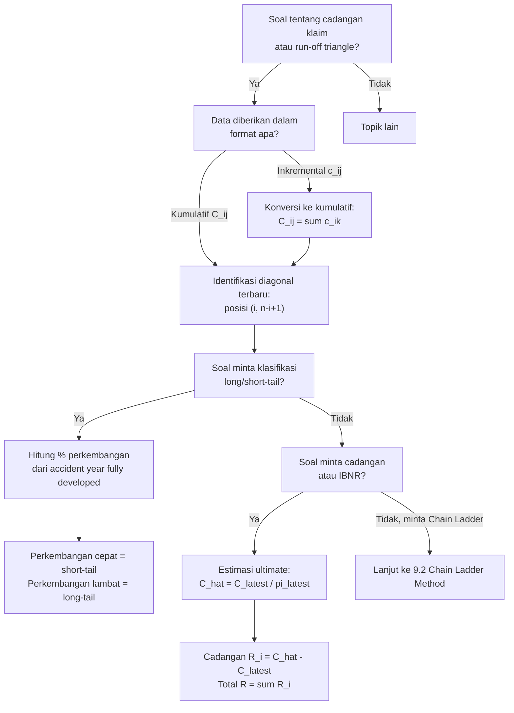

# 📊 9.1 — Long-Tail vs Short-Tail Business

> [!ABSTRACT] Ringkasan Cepat
> **Topik:** Long-Tail vs Short-Tail Business & Run-Off Triangle | **Bobot:** ~5–10% (Topik 9) | **Difficulty:** Medium
> **Ref:** Brown & Lennox (2015), Bab 2 & 3 | **Prereq:** None

## Section 0 — Pemetaan Topik

| Topik TA2 | Sub-topik ID | Skill Diuji | Bobot | Difficulty | Prerequisite | Connected Topics | Referensi |
|---|---|---|---|---|---|---|---|
| Estimasi Klaim yang Belum Dibayar | 9.1 | Bedakan long-tail vs short-tail business; identifikasi karakteristik masing-masing; susun run-off triangle dari data bisnis long-tail; baca dan interpretasi sel-sel triangle | 5–10% (Topik 9) | Medium | None | [[9.2 Chain Ladder Method]], [[9.3 Bornhuetter-Ferguson Method]] | Brown & Lennox (2015), Bab 2 & 3 |

## Section 1 — Intuisi

Bayangkan dua jenis asuransi yang sangat berbeda karakternya. Pertama, asuransi kendaraan bermotor untuk kerusakan fisik kendaraan (*property damage*): ketika mobil Anda tertabrak, kerusakan terlihat langsung, bengkel menaksir biaya dalam hitungan hari, klaim diajukan dan diselesaikan dalam beberapa minggu. Perusahaan asuransi tahu hampir pasti berapa yang harus dibayar sebelum tahun buku ditutup. Inilah yang disebut **short-tail business** — ekor klaim yang pendek, cepat tuntas.

Kini bayangkan asuransi tanggung gugat (*liability*) untuk sebuah pabrik yang ternyata membuang limbah kimia ke sungai. Korban mungkin baru merasakan dampak kesehatan bertahun-tahun kemudian, gugatan baru diajukan satu dekade setelah polutan dibuang, proses pengadilan bisa berjalan 5–10 tahun, dan bahkan setelah vonis pun proses banding terus berlanjut. Klaim dari *policy year* 2015 mungkin baru lunas dibayar di tahun 2030. Inilah **long-tail business** — klaimnya "berekor panjang" karena proses pelaporan dan pembayarannya bisa membentang puluhan tahun.

Perbedaan ini bukan sekadar soal waktu tunggu — ia berdampak langsung pada cara aktuaris mengestimasi **cadangan klaim** (*loss reserve*), yaitu uang yang harus disisihkan perusahaan untuk membayar klaim yang sudah terjadi namun belum lunas. Untuk short-tail, cadangan relatif mudah dihitung. Untuk long-tail, aktuaris membutuhkan alat khusus — salah satunya adalah **run-off triangle** (*delay triangle*), yaitu tabel yang menyusun data klaim historis berdasarkan tahun kejadian dan tahun pembayaran, sehingga pola keterlambatan pembayaran dapat diidentifikasi dan diekstrapolasi ke masa depan.

## Section 2 — Definisi Formal

> [!NOTE] Definisi — Long-Tail, Short-Tail, dan Run-Off Triangle
>
> **Short-tail business:** Lini bisnis di mana klaim dilaporkan dan diselesaikan dalam waktu singkat relatif terhadap periode pertanggungan — umumnya dalam 1–2 tahun.
>
> **Long-tail business:** Lini bisnis di mana terdapat jeda waktu yang signifikan antara terjadinya kerugian, pelaporan klaim, dan penyelesaian pembayaran — bisa berlangsung 5–20 tahun atau lebih.
>
> **Run-off triangle** (delay triangle / development triangle): Matriks data klaim $C_{i,j}$ di mana baris $i$ mewakili **tahun kejadian** (*accident year* / *origin year*) dan kolom $j$ mewakili **tahun perkembangan** (*development year* / *lag*), dengan $j = 1$ adalah tahun pertama setelah kejadian.

| Simbol | Makna | Catatan |
|---|---|---|
| $C_{i,j}$ | Klaim kumulatif dari accident year $i$ yang telah dibayar sampai akhir development year $j$ | Entri utama run-off triangle; biasanya kumulatif |
| $c_{i,j}$ | Klaim **inkremental** dari accident year $i$ pada development year $j$ | $c_{i,j} = C_{i,j} - C_{i,j-1}$; dengan konvensi $C_{i,0} = 0$ |
| $i$ | Accident year (tahun kejadian/asal) | Baris triangle; $i = 1, 2, \ldots, n$ |
| $j$ | Development year (tahun perkembangan / lag) | Kolom triangle; $j = 1, 2, \ldots, n$ |
| $n$ | Jumlah accident year (= jumlah development year jika triangle persegi) | Menentukan dimensi triangle |
| $C_{i,n-i+1}$ | Klaim kumulatif yang **sudah diobservasi** untuk accident year $i$ | Diagonal terbaru (*latest diagonal*) |
| $C_{i,n}$ | Klaim **ultimate** dari accident year $i$ | Yang ingin diestimasi untuk $i > 1$ |
| IBNR | *Incurred But Not Reported* — klaim yang sudah terjadi tapi belum dilaporkan | Komponen cadangan klaim untuk long-tail |
| IBNER | *Incurred But Not Enough Reserved* — klaim dilaporkan tapi cadangan kurang | Komponen penyesuaian cadangan |
| RBNS | *Reported But Not Settled* — klaim dilaporkan tapi belum dibayar lunas | Kadang disebut *case reserve* |

### Rumus Utama

**Hubungan kumulatif dan inkremental:**

$$
C_{i,j} = \sum_{k=1}^{j} c_{i,k}
$$

*Label: Klaim kumulatif adalah jumlah kumulatif semua pembayaran inkremental sampai development year $j$.*

**Cadangan klaim untuk accident year $i$ (IBNR + RBNS):**

$$
R_i = C_{i,n} - C_{i,\,n-i+1}
$$

*Label: Cadangan = klaim ultimate yang diestimasi dikurangi klaim yang sudah dibayar (posisi di diagonal terbaru).*

**Total cadangan seluruh portofolio:**

$$
R = \sum_{i=2}^{n} R_i = \sum_{i=2}^{n} \left(C_{i,n} - C_{i,\,n-i+1}\right)
$$

*Label: Accident year $i=1$ sudah fully developed sehingga $R_1 = 0$; cadangan hanya untuk $i \geq 2$.*

**Posisi observasi dalam triangle — kondisi data tersedia:**

$$
\text{Data tersedia untuk } (i, j) \text{ jika dan hanya jika } i + j \leq n + 1
$$

*Label: Bagian atas-kiri triangle sudah terobservasi; bagian bawah-kanan adalah yang harus diestimasi.*

### Asumsi Eksplisit

1. Data klaim disusun berdasarkan **accident year** (tahun kejadian), bukan *policy year* atau *calendar year*, kecuali dinyatakan lain.
2. Klaim kumulatif $C_{i,j}$ bersifat **non-decreasing** dalam $j$: pembayaran tidak dapat "dikembalikan" — $C_{i,j} \geq C_{i,j-1}$.
3. Triangle berbentuk **persegi** ($n \times n$): jumlah accident year sama dengan jumlah development year maksimum. Pada soal exam, asumsi ini hampir selalu berlaku.
4. **Ultimate development** tercapai pada $j = n$: setelah development year ke-$n$, tidak ada lagi pembayaran tambahan — seluruh klaim fully developed.
5. Pola perkembangan klaim (*development pattern*) diasumsikan **stasioner** antar accident year — fondasi dari metode Chain Ladder.

## Section 3 — Jembatan Logika

> [!TIP] Dari Definisi ke Run-Off Triangle — Cara Membaca Tabel
>
> Run-off triangle dibaca dalam dua arah:
>
> - **Baca horizontal (kiri ke kanan):** untuk accident year $i$ tertentu, kolom menunjukkan berapa banyak klaim yang sudah terbayar setelah 1 tahun, 2 tahun, 3 tahun, dst. Karena kumulatif, angka di kanan selalu $\geq$ angka di kiri.
> - **Baca diagonal (kiri-atas ke kanan-bawah):** setiap diagonal mewakili satu *calendar year* pengamatan. Diagonal terbawah-kanan adalah observasi paling terkini.
>
> Kunci: segitiga bawah-kanan dari matriks adalah **masa depan** yang harus diestimasi. Inilah yang menjadi target metode Chain Ladder dan Bornhuetter-Ferguson.

> [!IMPORTANT] Struktur Triangle — Mana yang Sudah Diketahui vs Harus Diestimasi
>
> Untuk triangle berukuran $n \times n$ dengan data sampai calendar year ke-$n$:
>
> - **Sudah diobservasi** (segitiga atas-kiri): semua $(i, j)$ di mana $i + j \leq n + 1$
>   - Jumlah sel terobservasi: $\frac{n(n+1)}{2}$
> - **Harus diestimasi** (segitiga bawah-kanan): semua $(i, j)$ di mana $i + j > n + 1$
>   - Jumlah sel yang diestimasi: $\frac{n(n-1)}{2}$
> - **Diagonal terbaru** (*latest diagonal*): sel-sel $(i,\, n-i+1)$ untuk $i = 1, \ldots, n$ — ini adalah data terkini yang tersedia untuk masing-masing accident year.

**Derivasi: Cara menyusun run-off triangle dari data mentah**

Misalkan tersedia data pembayaran klaim historis dalam format: (tanggal kejadian, tanggal pembayaran, jumlah pembayaran).

**Langkah 1 — Tentukan accident year $i$:**

Kelompokkan setiap klaim ke dalam accident year berdasarkan tahun terjadinya kerugian. Misalnya, kejadian di 2021 → $i = 2021$.

**Langkah 2 — Tentukan development year $j$:**

Hitung jeda waktu antara accident year dan calendar year pembayaran:

$$
j = \text{Calendar year pembayaran} - \text{Accident year} + 1
$$

Contoh: klaim dari accident year 2021 yang dibayar di calendar year 2023 → $j = 2023 - 2021 + 1 = 3$.

**Langkah 3 — Isi sel inkremental $c_{i,j}$:**

Jumlahkan semua pembayaran dengan accident year $i$ yang terjadi pada calendar year yang bersesuaian dengan development year $j$.

**Langkah 4 — Kumulasikan baris demi baris:**

$$
C_{i,j} = c_{i,1} + c_{i,2} + \cdots + c_{i,j}
$$

Hasilnya adalah triangle kumulatif standar yang siap digunakan untuk Chain Ladder.

**Langkah 5 — Validasi struktur:**

Periksa bahwa $C_{i,j} \geq C_{i,j-1}$ untuk semua $i, j$. Jika ada sel yang menurun, ada kemungkinan *salvage*, *subrogation*, atau kesalahan data.

**Contoh konkret — triangle $3 \times 3$:**

Diberikan data inkremental:

$$
\begin{array}{c|ccc}
i \backslash j & 1 & 2 & 3 \\ \hline
1 & 100 & 60 & 20 \\
2 & 120 & 70 & \mathbf{?} \\
3 & 150 & \mathbf{?} & \mathbf{?}
\end{array}
$$

Konversi ke kumulatif:

$$
\begin{array}{c|ccc}
i \backslash j & 1 & 2 & 3 \\ \hline
1 & 100 & 160 & 180 \\
2 & 120 & 190 & \mathbf{?} \\
3 & 150 & \mathbf{?} & \mathbf{?}
\end{array}
$$

Diagonal terbaru: $C_{1,3} = 180$, $C_{2,2} = 190$, $C_{3,1} = 150$. Total yang sudah dibayar = $180 + 190 + 150 = 520$. Sel bertanda **?** adalah yang harus diestimasi.

> [!DANGER] Dilarang
>
> 1. **JANGAN** menggunakan data kumulatif sebagai data inkremental atau sebaliknya tanpa konversi — ini menghasilkan double-counting yang fatal dalam estimasi cadangan.
> 2. **JANGAN** mengasumsikan diagonal terbaru = development year $n$ untuk semua accident year — accident year terbaru ($i = n$) hanya memiliki satu observasi ($j = 1$), bukan $j = n$.
> 3. **JANGAN** mencampurkan *accident year* dengan *policy year* atau *calendar year* — ketiga basis penataan data menghasilkan triangle yang berbeda dan tidak dapat dipertukarkan secara langsung.

## Section 4 — Contoh Soal

### Soal A — Fundamental

Sebuah perusahaan asuransi memiliki data klaim **inkremental** (dalam jutaan Rp) berikut untuk lini bisnis *workers' compensation* (asuransi kecelakaan kerja):

| Accident Year \ Development Year | 1 | 2 | 3 |
|---|---|---|---|
| 2022 | 200 | 150 | 80 |
| 2023 | 240 | 180 | — |
| 2024 | 280 | — | — |

(a) Susun run-off triangle **kumulatif**.
(b) Identifikasi sel-sel mana yang harus diestimasi (belum terobservasi).
(c) Hitung total klaim yang sudah dibayar hingga saat ini.

> [!SUCCESS] Solusi Soal A
> **Pendekatan:** Konversi inkremental ke kumulatif dengan penjumlahan baris; identifikasi diagonal terbaru sebagai batas observasi.
>
> **1. Identifikasi Variabel**
> - $n = 3$ accident years (2022, 2023, 2024) → triangle $3 \times 3$
> - Data inkremental $c_{i,j}$ sudah diberikan
> - Calendar year terkini: 2024 → data tersedia untuk $i + j \leq 4$
>
> **2. Identifikasi Distribusi / Model**
> Run-off triangle bisnis long-tail (*workers' compensation* termasuk long-tail karena klaim cacat permanen dan penyakit akibat kerja bisa berekor panjang). Data inkremental dikumpulkan per accident year dan development year.
>
> **3. Setup Persamaan**
>
> $$
> C_{i,j} = \sum_{k=1}^{j} c_{i,k}
> $$
>
> Kondisi tersedia: $i + j \leq n + 1 = 4$.
>
> **4. Eksekusi Aljabar**
>
> **(a) Triangle kumulatif:**
>
> $C_{1,1} = 200$; $C_{1,2} = 200 + 150 = 350$; $C_{1,3} = 350 + 80 = 430$
>
> $C_{2,1} = 240$; $C_{2,2} = 240 + 180 = 420$; $C_{2,3} = \mathbf{?}$
>
> $C_{3,1} = 280$; $C_{3,2} = \mathbf{?}$; $C_{3,3} = \mathbf{?}$
>
> $$
> \begin{array}{c|ccc}
> i \backslash j & 1 & 2 & 3 \\ \hline
> 2022 & 200 & 350 & 430 \\
> 2023 & 240 & 420 & \mathbf{?} \\
> 2024 & 280 & \mathbf{?} & \mathbf{?}
> \end{array}
> $$
>
> **(b) Sel yang harus diestimasi** (di mana $i + j > 4$):
> - $(2023,\; j=3)$: $i + j = 2 + 3 = 5 > 4$ ✓
> - $(2024,\; j=2)$: $i + j = 3 + 2 = 5 > 4$ ✓
> - $(2024,\; j=3)$: $i + j = 3 + 3 = 6 > 4$ ✓
>
> Total: **3 sel** yang harus diestimasi (segitiga bawah-kanan).
>
> **(c) Total klaim sudah dibayar** = jumlah diagonal terbaru:
>
> $$
> C_{1,3} + C_{2,2} + C_{3,1} = 430 + 420 + 280 = 1.130 \text{ juta Rp}
> $$
>
> **5. Verification**
> Jumlah sel terobservasi = $n(n+1)/2 = 3 \times 4/2 = 6$. ✓ (3 dari baris 1, 2 dari baris 2, 1 dari baris 3). Jumlah sel yang diestimasi = $n(n-1)/2 = 3 \times 2/2 = 3$. ✓
>
> **Hasil:** Triangle kumulatif tersusun; 3 sel yang harus diestimasi; total sudah dibayar Rp 1.130 juta.

> [!WARNING] Exam Tips — Soal A
> **Target waktu:** 3 menit. **Common trap:** Lupa bahwa diagonal terbaru bukan selalu kolom terakhir — untuk accident year terbaru ($i = n$), hanya ada satu observasi ($j = 1$). **Shortcut:** Isi triangle baris per baris dari kiri ke kanan dengan akumulasi; sel di atas-kanan diagonal bertanda tanya otomatis adalah estimasi.

---

### Soal B — Exam-Typical

Data klaim kumulatif (dalam miliar Rp) dari lini bisnis *general liability* diberikan sebagai berikut:

| Accident Year ($i$) | $j=1$ | $j=2$ | $j=3$ | $j=4$ |
|---|---|---|---|---|
| 2021 | 500 | 820 | 950 | 1.000 |
| 2022 | 600 | 1.000 | 1.150 | — |
| 2023 | 700 | 1.120 | — | — |
| 2024 | 800 | — | — | — |

(a) Lengkapi tabel inkremental $c_{i,j}$ untuk semua sel yang terobservasi.
(b) Hitung **% perkembangan** (*development factor* observasi) dari masing-masing development year ke tahun ultimate: proporsi klaim kumulatif terhadap $C_{1,4}$ (diasumsikan = klaim ultimate) untuk accident year 2021.
(c) Jelaskan mengapa lini *general liability* dikategorikan sebagai long-tail business.

> [!SUCCESS] Solusi Soal B
> **Pendekatan:** Konversi kumulatif ke inkremental dengan selisih baris; hitung pola perkembangan dari accident year yang sudah fully developed; analisis karakteristik long-tail.
>
> **1. Identifikasi Variabel**
> - $n = 4$ accident years; triangle $4 \times 4$
> - Data kumulatif $C_{i,j}$ diberikan
> - Accident year 2021 ($i=1$): fully developed ($j=4$ terobservasi)
> - Calendar year terkini: 2024 → data tersedia untuk $i + j \leq 5$
>
> **2. Identifikasi Distribusi / Model**
> *General liability*: bisnis long-tail klasik. Triangle $4 \times 4$ dengan diagonal terbaru: $C_{1,4}=1.000$; $C_{2,3}=1.150$; $C_{3,2}=1.120$; $C_{4,1}=800$.
>
> **3. Setup Persamaan**
>
> Inkremental: $c_{i,j} = C_{i,j} - C_{i,j-1}$ dengan $C_{i,0} = 0$.
>
> Persen perkembangan untuk accident year $i=1$:
>
> $$
> \pi_j = \frac{C_{1,j}}{C_{1,4}} \times 100\%
> $$
>
> **4. Eksekusi Aljabar**
>
> **(a) Tabel inkremental (sel terobservasi):**
>
> | $i \backslash j$ | 1 | 2 | 3 | 4 |
> |---|---|---|---|---|
> | 2021 | 500 | 320 | 130 | 50 |
> | 2022 | 600 | 400 | 150 | — |
> | 2023 | 700 | 420 | — | — |
> | 2024 | 800 | — | — | — |
>
> Perhitungan:
> $c_{1,2} = 820 - 500 = 320$; $c_{1,3} = 950 - 820 = 130$; $c_{1,4} = 1.000 - 950 = 50$
> $c_{2,2} = 1.000 - 600 = 400$; $c_{2,3} = 1.150 - 1.000 = 150$
> $c_{3,2} = 1.120 - 700 = 420$
>
> **(b) Persentase perkembangan accident year 2021:**
>
> $$
> \pi_1 = \frac{500}{1.000} = 50{,}0\%
> $$
>
> $$
> \pi_2 = \frac{820}{1.000} = 82{,}0\%
> $$
>
> $$
> \pi_3 = \frac{950}{1.000} = 95{,}0\%
> $$
>
> $$
> \pi_4 = \frac{1.000}{1.000} = 100{,}0\%
> $$
>
> Pola: 50% → 82% → 95% → 100%. Ini berarti setelah 1 tahun hanya 50% klaim telah terbayar — ciri khas long-tail.
>
> **(c) Mengapa general liability adalah long-tail:**
>
> *General liability* melibatkan tuntutan hukum (*litigation*) di mana: (1) korban mungkin baru menyadari kerugian bertahun-tahun kemudian (*latent injury* seperti paparan asbes/kimia), (2) proses pengadilan berlangsung lama, (3) jumlah ganti rugi ditentukan oleh vonis hakim yang tidak pasti. Ketiga faktor ini menyebabkan jeda waktu panjang antara accident year dan penyelesaian klaim.
>
> **5. Verification**
> Persentase perkembangan harus monoton naik menuju 100%. ✓ (50% < 82% < 95% < 100%). Total inkremental baris 2021: $500 + 320 + 130 + 50 = 1.000 = C_{1,4}$. ✓
>
> **Hasil:** (a) Tabel inkremental tersusun. (b) Pola perkembangan: 50%→82%→95%→100%. (c) Litigasi dan latent injury menyebabkan long-tail.

> [!WARNING] Exam Tips — Soal B
> **Target waktu:** 4 menit. **Common trap:** Menghitung inkremental dengan mengurangi dari baris yang salah — pastikan selalu $c_{i,j} = C_{i,j} - C_{i,j-1}$ (bukan $C_{i-1,j}$). **Shortcut:** Untuk menghitung persen perkembangan, selalu gunakan accident year yang fully developed ($i=1$ jika $j=n$ terobservasi) sebagai benchmark.

---

### Soal C — Challenging

Berikut adalah data klaim kumulatif (inkremental dalam miliar Rp) dari dua lini bisnis berbeda:

**Lini A:**

| $i \backslash j$ | 1 | 2 | 3 |
|---|---|---|---|
| 2022 | 1.000 | 1.450 | 1.500 |
| 2023 | 1.200 | 1.710 | — |
| 2024 | 1.400 | — | — |

**Lini B:**

| $i \backslash j$ | 1 | 2 | 3 | 4 | 5 |
|---|---|---|---|---|---|
| 2020 | 300 | 520 | 700 | 840 | 900 |
| 2021 | 350 | 600 | 820 | 980 | — |
| 2022 | 400 | 700 | 950 | — | — |
| 2023 | 450 | 790 | — | — | — |
| 2024 | 500 | — | — | — | — |

(a) Klasifikasikan masing-masing lini sebagai long-tail atau short-tail dengan **justifikasi kuantitatif** menggunakan data yang tersedia.

(b) Untuk **Lini B**, hitung total klaim yang sudah dibayar (*paid claims*) dan estimasi **minimum** total cadangan yang dibutuhkan jika diketahui bahwa pola perkembangan kumulatif accident year 2020 representatif. Gunakan % perkembangan dari accident year 2020 untuk mengestimasi klaim ultimate masing-masing accident year.

(c) Hitung IBNR total Lini B.

> [!SUCCESS] Solusi Soal C
> **Pendekatan:** Hitung % perkembangan dari accident year yang fully developed untuk mengklasifikasi long/short-tail; gunakan pola tersebut sebagai estimasi naif klaim ultimate; hitung cadangan sebagai selisih ultimate vs yang sudah dibayar.
>
> **1. Identifikasi Variabel**
> - Lini A: $n = 3$, triangle $3 \times 3$; Lini B: $n = 5$, triangle $5 \times 5$
> - Benchmark Lini A: accident year 2022 fully developed di $j=3$; $C_{1,3} = 1.500$
> - Benchmark Lini B: accident year 2020 fully developed di $j=5$; $C_{1,5} = 900$
>
> **2. Identifikasi Distribusi / Model**
> Kedua lini menggunakan run-off triangle kumulatif. Klasifikasi long-tail/short-tail berdasarkan kecepatan perkembangan klaim. Estimasi ultimate menggunakan % perkembangan observasi.
>
> **3. Setup Persamaan**
>
> Persen perkembangan accident year benchmark: $\pi_j = C_{1,j} / C_{1,n}$
>
> Estimasi ultimate accident year $i$: $\hat{C}_{i,n} = C_{i,\,n-i+1} / \pi_{n-i+1}$
>
> Cadangan accident year $i$: $R_i = \hat{C}_{i,n} - C_{i,\,n-i+1}$
>
> **4. Eksekusi Aljabar**
>
> **(a) Klasifikasi:**
>
> *Lini A* — persen perkembangan dari accident year 2022:
>
> $$
> \pi_1^A = 1.000/1.500 = 66{,}7\%; \quad \pi_2^A = 1.450/1.500 = 96{,}7\%; \quad \pi_3^A = 100\%
> $$
>
> Setelah 1 tahun, 66,7% klaim sudah terbayar. Setelah 2 tahun, 96,7%. Perkembangan sangat cepat → **short-tail business** (kemungkinan asuransi properti atau kendaraan kerusakan fisik).
>
> *Lini B* — persen perkembangan dari accident year 2020:
>
> $$
> \pi_1^B = 300/900 = 33{,}3\%; \quad \pi_2^B = 520/900 = 57{,}8\%
> $$
>
> $$
> \pi_3^B = 700/900 = 77{,}8\%; \quad \pi_4^B = 840/900 = 93{,}3\%; \quad \pi_5^B = 100\%
> $$
>
> Setelah 1 tahun hanya 33,3% terbayar; butuh 4–5 tahun untuk mendekati ultimate → **long-tail business** (kemungkinan *general liability* atau *workers' compensation*).
>
> **(b) Estimasi klaim ultimate Lini B:**
>
> Diagonal terbaru: $C_{1,5}=900$; $C_{2,4}=980$; $C_{3,3}=950$; $C_{4,2}=790$; $C_{5,1}=500$.
>
> $$
> \hat{C}_{1,5} = 900 \quad \text{(already fully developed)}
> $$
>
> $$
> \hat{C}_{2,5} = \frac{C_{2,4}}{\pi_4^B} = \frac{980}{0{,}9333} = 1.050{,}0
> $$
>
> $$
> \hat{C}_{3,5} = \frac{C_{3,3}}{\pi_3^B} = \frac{950}{0{,}7778} = 1.221{,}4
> $$
>
> $$
> \hat{C}_{4,5} = \frac{C_{4,2}}{\pi_2^B} = \frac{790}{0{,}5778} = 1.367{,}3
> $$
>
> $$
> \hat{C}_{5,5} = \frac{C_{5,1}}{\pi_1^B} = \frac{500}{0{,}3333} = 1.500{,}0
> $$
>
> Total klaim sudah dibayar:
>
> $$
> \text{Paid} = 900 + 980 + 950 + 790 + 500 = 4.120
> $$
>
> **(c) IBNR total Lini B:**
>
> $$
> R_1 = 900 - 900 = 0
> $$
>
> $$
> R_2 = 1.050{,}0 - 980 = 70{,}0
> $$
>
> $$
> R_3 = 1.221{,}4 - 950 = 271{,}4
> $$
>
> $$
> R_4 = 1.367{,}3 - 790 = 577{,}3
> $$
>
> $$
> R_5 = 1.500{,}0 - 500 = 1.000{,}0
> $$
>
> $$
> R_{\text{total}} = 0 + 70 + 271{,}4 + 577{,}3 + 1.000 = 1.918{,}7 \text{ miliar Rp}
> $$
>
> **5. Verification**
> Cek konsistensi: semakin muda accident year, semakin besar cadangannya ($R_5 = 1.000 \gg R_2 = 70$). ✓ Ini intuitif karena accident year terbaru paling sedikit berkembang. Total ultimate = $4.120 + 1.918{,}7 = 6.038{,}7$ miliar Rp.
>
> **Hasil:** (a) Lini A = short-tail (66,7% terbayar di $j=1$); Lini B = long-tail (33,3% di $j=1$). (b) Total paid = 4.120 miliar; (c) IBNR total ≈ 1.918,7 miliar Rp.

> [!WARNING] Exam Tips — Soal C
> **Target waktu:** 6 menit. **Common trap:** Membagi diagonal terbaru dengan $\pi$ yang salah — pastikan $\hat{C}_{i,n} = C_{i,\,n-i+1} / \pi_{n-i+1}$ (penyebutnya adalah $\pi$ pada development year **yang bersesuaian dengan posisi diagonal terbaru** accident year $i$, yaitu $j = n-i+1$). **Shortcut:** Buat kolom bantu $j_{\text{latest}} = n - i + 1$ untuk setiap $i$ sebelum menghitung, agar tidak bingung memilih $\pi$ yang tepat.

## Section 5 — Verifikasi & Sanity Check

> [!CHECK] Check 1 — Monotonisitas Kumulatif
>
> Setelah menyusun triangle kumulatif, periksa bahwa setiap baris bersifat non-decreasing:
>
> $$
> C_{i,1} \leq C_{i,2} \leq \cdots \leq C_{i,n}
> $$
>
> Jika ada baris yang menurun, ada kesalahan input atau ada *recoveries* (pengembalian klaim) yang perlu ditangani secara terpisah.

> [!CHECK] Check 2 — Jumlah Sel dalam Triangle
>
> Untuk triangle $n \times n$:
>
> - Sel terobservasi: $\dfrac{n(n+1)}{2}$
>
> - Sel yang diestimasi: $\dfrac{n(n-1)}{2}$
>
> - Total sel: $n^2$
>
> Gunakan ini untuk memverifikasi bahwa jumlah sel bertanda "?" sudah benar sebelum melanjutkan ke Chain Ladder.

> [!CHECK] Check 3 — Konsistensi % Perkembangan
>
> Persentase perkembangan $\pi_j$ harus memenuhi:
>
> $$
> 0 < \pi_1 < \pi_2 < \cdots < \pi_n = 100\%
> $$
>
> Jika ada $\pi_j > \pi_{j+1}$ (perkembangan menurun), ini kemungkinan anomali data atau accident year yang dipilih sebagai benchmark belum truly fully developed.

### Metode Alternatif — Triangle Inkremental vs Kumulatif

Beberapa soal memberikan data inkremental langsung. Konversi dua arah:

**Inkremental → Kumulatif:** $C_{i,j} = C_{i,j-1} + c_{i,j}$ (kumulasikan dari kiri)

**Kumulatif → Inkremental:** $c_{i,j} = C_{i,j} - C_{i,j-1}$ (selisih kolom bersebelahan)

Metode Chain Ladder ([[9.2 Chain Ladder Method]]) bekerja dengan data **kumulatif**; pastikan konversi sudah dilakukan sebelum menerapkan metode tersebut.

## Section 6 — Visualisasi Mental

**Struktur Geografis Run-Off Triangle:**

```
Development Year (j)
       1       2       3       4       5
      ┌───────┬───────┬───────┬───────┬───────┐
  1   │ OBS   │ OBS   │ OBS   │ OBS   │ OBS   │ ← Fully developed
      ├───────┼───────┼───────┼───────┼───────┤
  2   │ OBS   │ OBS   │ OBS   │ OBS   │  EST  │
      ├───────┼───────┼───────┼───────┼───────┤
  3   │ OBS   │ OBS   │ OBS   │  EST  │  EST  │
      ├───────┼───────┼───────┼───────┼───────┤
  4   │ OBS   │ OBS   │  EST  │  EST  │  EST  │
      ├───────┼───────┼───────┼───────┼───────┤
  5   │ OBS   │  EST  │  EST  │  EST  │  EST  │ ← Paling perlu cadangan
      └───────┴───────┴───────┴───────┴───────┘

OBS = sudah diobservasi
EST = harus diestimasi (IBNR berada di sini)
─── Diagonal terbaru = batas antara OBS dan EST
```

**Perbandingan Profil Perkembangan Long-Tail vs Short-Tail:**

```
% Klaim Terbayar
100% ┤                    ●────●  Short-tail
     │               ●──●
     │          ●──●
  50%┤     ●──●
     │
     │
     │     ●                    Long-tail
  33%┤     ·    ●
     │          ·    ●
     │               ·    ●
     │                    ·    ●
  0% ┼─────┼────┼────┼────┼────┤ Development Year (j)
     1     2    3    4    5    6

Short-tail: cepat mencapai 100% (j=2 atau j=3)
Long-tail:  lambat, butuh j=5 atau lebih
```

### Hubungan Visual ↔ Rumus

| Elemen Visual | Komponen Rumus |
|---|---|
| Sel di segitiga atas-kiri (OBS) | $C_{i,j}$ tersedia untuk $i + j \leq n + 1$ |
| Diagonal terbaru (batas OBS/EST) | Sel $(i,\; n-i+1)$ untuk $i = 1, \ldots, n$ |
| Jarak vertikal dari diagonal ke kolom $n$ | Cadangan $R_i = C_{i,n} - C_{i,\,n-i+1}$ |
| Slope kurva perkembangan | Kecepatan perkembangan: landai = long-tail, curam = short-tail |
| Titik 100% di sumbu-Y | Ultimate claims $C_{i,n}$ — target estimasi |

## Section 7 — Jebakan Umum

> [!BUG] Kesalahan Parametrisasi — Basis Penataan Data
>
> **Tiga basis yang sering tertukar:**
> - **Accident year basis:** baris = tahun terjadinya kerugian (paling umum di exam)
> - **Policy year basis:** baris = tahun dimulainya polis
> - **Calendar year basis:** baris = tahun kalender pembayaran
>
> Jika soal tidak menyebut basis secara eksplisit, **asumsi default adalah accident year basis**. Mencampurkan basis menghasilkan triangle yang tidak konsisten dan tidak dapat dianalisis dengan Chain Ladder.

> [!BUG] Kesalahan Konseptual — Definisi Long-Tail
>
> 1. **Mitos:** "Long-tail berarti klaim besar" — **Salah**. Long-tail mengacu pada **waktu penyelesaian**, bukan besaran klaim. Asuransi jiwa *term life* bisa memiliki klaim besar tapi short-tail (pembayaran langsung setelah kematian terbukti).
> 2. **Mitos:** "Short-tail artinya tidak perlu cadangan" — **Salah**. Short-tail tetap butuh cadangan RBNS (*Reported But Not Settled*), hanya saja cadangannya lebih kecil dan lebih mudah diestimasi.
> 3. **Mitos:** "Development year $j$ = calendar year $i+j$" — **Benar** secara implisit, tapi jangan gunakan kalender year secara langsung dalam rumus triangle; gunakan $j$ sebagai indeks relatif.
> 4. **Mitos:** "Fully developed artinya tidak ada pembayaran lagi sama sekali" — Dalam praktik, tail factor bisa ditambahkan untuk pembayaran sangat kecil setelah $j=n$; di exam, asumsikan $C_{i,n}$ adalah ultimate kecuali ada keterangan lain.

> [!BUG] Kesalahan Interpretasi Soal
>
> - **"Klaim yang belum dibayar"** di soal bisa merujuk ke IBNR saja, atau IBNR + RBNS (total reserve). Periksa konteks soal.
> - **"Latest diagonal"** kadang disebut "current diagonal" atau "most recent diagonal" — semuanya merujuk ke sel $(i,\; n-i+1)$.
> - **Triangle vs tabel biasa:** jika soal memberikan matriks data klaim tapi tidak menyebutnya "triangle", cek apakah baris = accident year dan kolom = development year sebelum menerapkan metodologi triangle.

> [!CAUTION] Red Flags — Keyword Pemicu Prosedur
>
> | Keyword di Soal | Prosedur |
> |---|---|
> | "susun run-off triangle" | Konversi ke format $C_{i,j}$ kumulatif; identifikasi diagonal terbaru |
> | "data inkremental" | Konversi ke kumulatif dulu: $C_{i,j} = \sum c_{i,k}$ |
> | "long-tail vs short-tail" | Hitung % perkembangan dari accident year fully developed |
> | "IBNR" / "cadangan klaim" | Hitung $R_i = \hat{C}_{i,n} - C_{i,\,n-i+1}$ |
> | "pola perkembangan stasioner" | Asumsi Chain Ladder terpenuhi; lanjut ke [[9.2 Chain Ladder Method]] |
> | "fully developed" / "ultimate" | $j = n$; tidak ada pembayaran lebih lanjut |

## Section 8 — Ringkasan Eksekutif

> [!SUMMARY] Must-Remember
>
> 1. **Hubungan kumulatif–inkremental:**
>
> $$
> C_{i,j} = \sum_{k=1}^{j} c_{i,k} \qquad \Longleftrightarrow \qquad c_{i,j} = C_{i,j} - C_{i,j-1}
> $$
>
> 2. **Kondisi data terobservasi:**
>
> $$
> (i,j) \text{ terobservasi} \iff i + j \leq n + 1
> $$
>
> 3. **Diagonal terbaru** (latest diagonal): sel $(i,\; n-i+1)$ untuk $i = 1, \ldots, n$
>
> 4. **Cadangan accident year $i$:**
>
> $$
> R_i = \hat{C}_{i,n} - C_{i,\,n-i+1}
> $$
>
> 5. **Estimasi naif ultimate via % perkembangan:**
>
> $$
> \hat{C}_{i,n} = \frac{C_{i,\,n-i+1}}{\pi_{n-i+1}}, \quad \pi_j = \frac{C_{1,j}}{C_{1,n}}
> $$

### Kapan Digunakan

- Soal meminta menyusun atau membaca run-off triangle
- Soal meminta klasifikasi lini bisnis sebagai long-tail atau short-tail
- Sebagai langkah persiapan sebelum menerapkan [[9.2 Chain Ladder Method]] atau [[9.3 Bornhuetter-Ferguson Method]]
- Soal meminta menghitung IBNR atau total cadangan klaim dengan metode sederhana

### Kapan TIDAK Boleh Digunakan

- Untuk lini bisnis *life insurance* standar — metodologi cadangan jiwa berbeda (prospective/retrospective reserve, bukan run-off triangle)
- Jika data tidak tersedia dalam format accident year vs development year — perlu konversi basis terlebih dahulu
- Estimasi naif ($\hat{C}_{i,n} = C_{i,\,n-i+1}/\pi_{n-i+1}$) hanya pendekatan kasar; untuk estimasi yang lebih robust gunakan [[9.2 Chain Ladder Method]] atau [[9.3 Bornhuetter-Ferguson Method]]

### Quick Decision Tree



---

> [!QUOTE] Follow-up Options
> 1. *"Berikan contoh soal triangle dengan data inkremental yang langsung perlu diklasifikasi long/short-tail"*
> 2. *"Jelaskan hubungan [[9.1 Long-Tail vs Short-Tail Business]] dengan [[9.2 Chain Ladder Method]]"*
> 3. *"Buat flashcard 1-halaman untuk struktur run-off triangle dan formula cadangan klaim"*

*📖 Ref: Brown & Lennox (2015), Introduction to Ratemaking and Loss Reserving, Bab 2 & 3 | 🗓️ 2026-04-19 | #TA2 #LossReserving #RunOffTriangle #LongTail*
