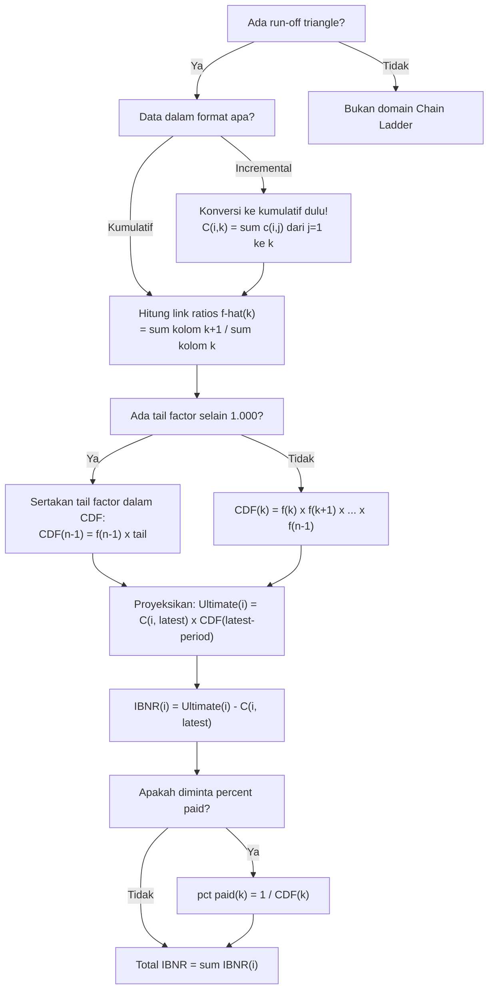

# 📊 9.2 — Chain Ladder Method

> [!ABSTRACT] Ringkasan Cepat
> **Topik:** Metode Chain Ladder | **Bobot:** ~5–10% (Topik 9) | **Difficulty:** Calculation-Intensive
> **Ref:** Brown & Lennox (2015), Bab 2 & 3 | **Prereq:** [[9.1 Long-Tail vs Short-Tail Business]]

---

## Section 0 — Pemetaan Topik

| Topik TA2 | Sub-topik ID | Skill Diuji | Bobot | Difficulty | Prerequisite | Connected Topics | Referensi |
|---|---|---|---|---|---|---|---|
| Estimasi Klaim yang Belum Dibayar | 9.2 | Membentuk run-off triangle kumulatif; menghitung link ratios $f_k$; memproyeksikan nilai ultimate; menghitung IBNR reserve | 5–10% (bersama Topik 9) | Calculation-Intensive | [[9.1 Long-Tail vs Short-Tail Business]] | [[9.3 Bornhuetter-Ferguson Method]] | Brown & Lennox (2015), Bab 2 & 3 |

---

## Section 1 — Intuisi

Bayangkan sebuah perusahaan asuransi kendaraan bermotor yang menerima klaim kecelakaan. Klaim yang terjadi pada tahun 2022 tidak semuanya langsung dilaporkan dan dibayar di tahun yang sama — sebagian dilaporkan terlambat, sebagian lagi masih dalam proses investigasi, dan sebagian baru diselesaikan pada tahun 2024 atau bahkan lebih lambat. Akibatnya, di akhir tahun 2022, perusahaan hanya tahu sebagian dari total klaim yang sebenarnya akan mereka tanggung dari kejadian tahun itu. Masalah ini — memperkirakan berapa total klaim yang "sesungguhnya" akan dibayar di masa depan untuk kejadian yang sudah terjadi — disebut estimasi *ultimate claims* atau cadangan klaim (*loss reserve*).

Metode Chain Ladder adalah teknik paling klasik dan paling banyak digunakan di industri asuransi untuk menjawab pertanyaan ini. Idenya sangat sederhana: jika historis menunjukkan bahwa klaim yang sudah diketahui di akhir tahun pertama biasanya berkembang menjadi 1.4 kali lipatnya di akhir tahun kedua, dan 1.1 kali di tahun ketiga sebelum akhirnya stabil — maka kita bisa menggunakan pola perkembangan historis tersebut untuk memproyeksikan klaim yang saat ini belum selesai ke nilai ultimatnya. Nama "Chain Ladder" sendiri menggambarkan cara proyeksi ini bekerja: seperti memanjat anak tangga, setiap kolom dalam *development triangle* dikembangkan ke kolom berikutnya menggunakan *link ratio* atau *age-to-age factor*.

Yang membuat metode ini penting dalam konteks regulasi dan aktuaria adalah bahwa cadangan klaim merupakan liabilitas terbesar di neraca perusahaan asuransi umum (*non-life*). Estimasi yang terlalu rendah mengancam solvabilitas perusahaan; terlalu tinggi menggerus profitabilitas secara artifisial. Chain Ladder memberikan cara yang transparan, terstruktur, dan dapat diaudit untuk membuat estimasi ini — dan dalam ujian TA2, kemampuan mengisi triangle, menghitung *link ratios*, memproyeksikan nilai *ultimate*, dan menghitung IBNR (*Incurred But Not Reported*) reserve adalah kompetensi yang selalu diuji.

---

## Section 2 — Definisi Formal

> [!NOTE] Definisi Matematis — Run-Off Triangle dan Proyeksi Chain Ladder
> Misalkan $C_{i,k}$ adalah klaim kumulatif untuk accident year $i$ pada development period $k$. Metode Chain Ladder memproyeksikan nilai ultimate $C_{i,n}$ menggunakan:
>
> $$
> \hat{C}_{i,k+1} = f_k \cdot C_{i,k}
> $$
>
> di mana link ratio (age-to-age factor) $f_k$ diestimasi dari data historis sebagai:
>
> $$
> \hat{f}_k = \frac{\sum_{i=1}^{n-k} C_{i,k+1}}{\sum_{i=1}^{n-k} C_{i,k}}
> $$
>
> IBNR reserve untuk accident year $i$ adalah:
>
> $$
> \text{IBNR}_i = \hat{C}_{i,n} - C_{i, n+1-i}
> $$

**Tabel Variabel & Parameter**

| Simbol | Makna | Catatan |
|---|---|---|
| $i$ | Accident year (tahun kejadian) | $i = 1, 2, \ldots, n$; baris dalam triangle |
| $k$ | Development period (periode perkembangan) | $k = 1, 2, \ldots, n$; kolom dalam triangle |
| $C_{i,k}$ | Klaim kumulatif, accident year $i$, development period $k$ | Selalu kumulatif (bukan incremental) dalam Chain Ladder |
| $n$ | Jumlah accident years = jumlah development periods | Triangle berukuran $n \times n$ |
| $\hat{f}_k$ | Link ratio dari period $k$ ke $k+1$ | Juga disebut age-to-age factor atau development factor |
| $\hat{C}_{i,n}$ | Estimasi nilai ultimate untuk accident year $i$ | Proyeksi ke development period terakhir |
| $C_{i, n+1-i}$ | Nilai kumulatif terbaru yang diketahui untuk accident year $i$ | Diagonal terbaru (latest diagonal) |
| $\text{IBNR}_i$ | Cadangan klaim untuk accident year $i$ | *Incurred But Not Reported*; nilai yang masih harus dibayar |
| $\text{Total IBNR}$ | Total cadangan seluruh accident years | $\sum_i \text{IBNR}_i$ |
| $\hat{f}_k^{\text{tail}}$ | Tail factor | Faktor perkembangan dari period terakhir ke ultimate; sering = 1.000 jika sudah fully developed |

### Rumus Utama

**1. Estimasi Link Ratio (Volume-Weighted Average):**

$$
\hat{f}_k = \frac{\sum_{i=1}^{n-k} C_{i,k+1}}{\sum_{i=1}^{n-k} C_{i,k}}, \quad k = 1, 2, \ldots, n-1
$$

**Label:** Ini adalah rata-rata tertimbang berbobot volume — bukan rata-rata aritmetika biasa dari rasio individual. Penyebut menggunakan seluruh data yang tersedia untuk kolom $k$, yaitu $n-k$ baris (accident years yang sudah berkembang melewati period $k$).

**2. Proyeksi Nilai Ultimate:**

$$
\hat{C}_{i,n} = C_{i,\, n+1-i} \times \hat{f}_{n+1-i} \times \hat{f}_{n+2-i} \times \cdots \times \hat{f}_{n-1} \times \hat{f}_{\text{tail}}
$$

**Label:** Proyeksi dilakukan berurutan dari kolom terbaru yang diketahui untuk accident year $i$ hingga kolom ultimate $n$. Kalikan semua link ratio yang belum terjadi secara berantai — inilah makna "Chain Ladder".

**3. Cumulative Development Factor (CDF) ke Ultimate:**

$$
\text{CDF}_{k \to n} = \hat{f}_k \times \hat{f}_{k+1} \times \cdots \times \hat{f}_{n-1} \times \hat{f}_{\text{tail}}
$$

**Label:** CDF mengukur berapa kali lipat klaim pada development period $k$ diperkirakan berkembang hingga ultimate. Useful untuk cross-check dan untuk menghitung % klaim yang sudah settled: $\%\text{paid}_k = 1/\text{CDF}_{k \to n}$.

**4. IBNR Reserve per Accident Year:**

$$
\text{IBNR}_i = \hat{C}_{i,n} - C_{i,\, n+1-i}
$$

**Label:** Selisih antara nilai ultimate yang diproyeksikan dan nilai kumulatif terbaru yang sudah diketahui. Ini adalah jumlah yang masih harus dicadangkan.

**5. Total IBNR Reserve:**

$$
\text{Total IBNR} = \sum_{i=1}^{n} \text{IBNR}_i = \sum_{i=2}^{n} \left(\hat{C}_{i,n} - C_{i,\, n+1-i}\right)
$$

**Label:** Accident year $i=1$ (tertua) biasanya sudah fully developed sehingga $\text{IBNR}_1 = 0$.

### Asumsi Eksplisit

1. **Proporsionalitas perkembangan:** Klaim masa depan $C_{i,k+1}$ proporsional dengan klaim yang sudah diketahui $C_{i,k}$ — yaitu link ratio $f_k$ berlaku seragam untuk semua accident years pada development period yang sama.
2. **Stabilitas pola perkembangan:** Link ratio $f_k$ adalah konstan antar accident years — pola perkembangan historis akan berlanjut di masa depan. Ini gagal jika ada perubahan proses klaim, hukum, atau praktik settlement yang signifikan.
3. **Independensi antar accident years:** Klaim dari satu accident year tidak mempengaruhi klaim dari accident year lain — tidak ada korelasi sistematis antar baris.
4. **Data kumulatif digunakan:** Triangle harus berisi data kumulatif, bukan incremental — Chain Ladder standar diaplikasikan pada $C_{i,k}$ kumulatif, bukan $c_{i,k}$ incremental.
5. **Tail factor diketahui atau diasumsikan:** Jika development period terakhir belum mencapai ultimate ($f_{\text{tail}} > 1$), harus ditentukan dari sumber eksternal atau assumed equal to 1.000 (fully developed).

---

## Section 3 — Jembatan Logika

> [!TIP] Dari Definisi ke Rumus — Mengapa Link Ratio Dihitung sebagai Rasio Kolom, Bukan Rata-rata Rasio Baris
> Ada dua cara menghitung link ratio dari data: (1) hitung rasio $C_{i,k+1}/C_{i,k}$ untuk setiap baris $i$, lalu rata-ratakan; atau (2) jumlahkan seluruh $C_{i,k+1}$ dan bagi dengan jumlah seluruh $C_{i,k}$. Chain Ladder standar menggunakan cara (2) — volume-weighted average. Alasannya: accident year dengan klaim lebih besar secara proporsional lebih "informatif" tentang pola perkembangan yang sesungguhnya, sehingga layak mendapat bobot lebih besar dalam estimasi. Cara (1) memberikan bobot yang sama untuk setiap accident year, bahkan yang klaimnya sangat kecil — ini tidak efisien secara statistik.

> [!IMPORTANT] Struktur Run-Off Triangle — Cara Membacanya
> Triangle berukuran $n \times n$ memiliki struktur berikut:
> - **Baris** = accident year $i$ (dari $i=1$ tertua hingga $i=n$ terbaru)
> - **Kolom** = development period $k$ (dari $k=1$ paling awal hingga $k=n$ ultimate)
> - **Diagonal kanan atas** = data yang *sudah tersedia* (diketahui)
> - **Segitiga kanan bawah** = data yang *belum tersedia* (harus diproyeksikan)
> - **Diagonal terbaru** (latest diagonal) = nilai $C_{i,\, n+1-i}$, yaitu titik paling kanan pada setiap baris — ini titik awal proyeksi untuk setiap accident year
>
> Accident year $i=n$ (terbaru) hanya memiliki $C_{n,1}$ yang diketahui dan butuh proyeksi paling panjang. Accident year $i=1$ (tertua) sudah memiliki seluruh $n$ kolom dan biasanya sudah ultimate.

**Derivasi Step-by-Step: Prosedur Lengkap Chain Ladder**

Diberikan triangle kumulatif $4 \times 4$ (ilustrasi singkat):

**Langkah 1 — Pastikan data dalam bentuk kumulatif.**

Jika diberikan data incremental $c_{i,k}$, konversi dulu: $C_{i,k} = \sum_{j=1}^{k} c_{i,j}$.

**Langkah 2 — Hitung link ratio $\hat{f}_k$ untuk setiap kolom:**

$$
\hat{f}_k = \frac{\sum_{i: C_{i,k+1} \text{ tersedia}} C_{i,k+1}}{\sum_{i: C_{i,k+1} \text{ tersedia}} C_{i,k}}
$$

Untuk $k=1$: gunakan semua $n-1$ baris yang memiliki data di kolom 2. Untuk $k=n-1$: hanya 1 baris yang tersedia.

**Langkah 3 — Tentukan tail factor.**

Jika tidak disebutkan, asumsikan $\hat{f}_{\text{tail}} = 1.000$ (development sudah selesai setelah period $n$).

**Langkah 4 — Hitung CDF ke ultimate untuk setiap development period:**

$$
\text{CDF}_k = \hat{f}_k \times \hat{f}_{k+1} \times \cdots \times \hat{f}_{n-1} \times \hat{f}_{\text{tail}}
$$

Mulai dari $k=n-1$ ke kanan, kemudian mundur ke kiri secara berantai.

**Langkah 5 — Proyeksikan nilai ultimate untuk setiap accident year:**

$$
\hat{C}_{i,n} = C_{i,\, n+1-i} \times \text{CDF}_{n+1-i}
$$

Accident year $i=1$: sudah di kolom $n$, tidak perlu proyeksi. Accident year $i=n$: proyeksi paling panjang.

**Langkah 6 — Hitung IBNR per accident year dan total:**

$$
\text{IBNR}_i = \hat{C}_{i,n} - C_{i,\, n+1-i}, \qquad \text{Total IBNR} = \sum_{i=2}^{n} \text{IBNR}_i
$$

> [!DANGER] Tiga Larangan Fatal dalam Chain Ladder
> 1. **JANGAN** menggunakan data incremental langsung dalam formula link ratio — Chain Ladder standar memerlukan data *kumulatif*. Jika diberikan data incremental, konversi terlebih dahulu dengan cara menjumlahkan secara baris sebelum menghitung link ratio apapun.
> 2. **JANGAN** rata-ratakan link ratio individual per baris ($\bar{f}_k = \frac{1}{n-k}\sum_i C_{i,k+1}/C_{i,k}$) dan menyebutnya sebagai Chain Ladder standar — ini adalah simple average, bukan volume-weighted average. Keduanya berbeda dan memberikan hasil berbeda.
> 3. **JANGAN** lupa mengalikan dengan *semua* link ratio yang tersisa hingga ultimate — bukan hanya satu langkah. Jika accident year $i=3$ dalam triangle $4\times4$ berada di kolom $k=2$, proyeksi ultimatenya = $C_{3,2} \times \hat{f}_2 \times \hat{f}_3 \times \hat{f}_{\text{tail}}$, bukan hanya $C_{3,2} \times \hat{f}_2$.

---

## Section 4 — Contoh Soal

### Soal A — Fundamental

**Soal:** Diberikan run-off triangle kumulatif berikut (dalam jutaan rupiah):

| Accident Year | Dev. 1 | Dev. 2 | Dev. 3 |
|---|---|---|---|
| 2021 | 100 | 150 | 165 |
| 2022 | 120 | 180 | — |
| 2023 | 140 | — | — |

Hitung link ratio $\hat{f}_1$ dan $\hat{f}_2$, lalu proyeksikan nilai ultimate untuk semua accident years. Asumsikan tail factor = 1.000.

> [!SUCCESS] Solusi Soal A
> **Pendekatan:** Hitung volume-weighted link ratios dari data yang tersedia, lalu proyeksikan secara berantai dari latest diagonal ke ultimate.
>
> **1. Identifikasi Variabel**
> - $n = 3$ development periods, $n = 3$ accident years
> - Data tersedia (segitiga atas-kiri): $C_{1,1}=100$, $C_{1,2}=150$, $C_{1,3}=165$; $C_{2,1}=120$, $C_{2,2}=180$; $C_{3,1}=140$
> - Latest diagonal: $C_{1,3}=165$, $C_{2,2}=180$, $C_{3,1}=140$
> - Tail factor: $\hat{f}_{\text{tail}} = 1.000$
>
> **2. Identifikasi Model**
> Chain Ladder dengan volume-weighted link ratios. Triangle $3 \times 3$, data sudah dalam format kumulatif.
>
> **3. Setup Persamaan**
>
> $$
> \hat{f}_k = \frac{\sum_{i=1}^{n-k} C_{i,k+1}}{\sum_{i=1}^{n-k} C_{i,k}}
> $$
>
> **4. Eksekusi Aljabar**
>
> **Hitung $\hat{f}_1$ (kolom 1 → 2, tersedia untuk AY 2021 dan 2022):**
>
> $$
> \hat{f}_1 = \frac{C_{1,2} + C_{2,2}}{C_{1,1} + C_{2,1}} = \frac{150 + 180}{100 + 120} = \frac{330}{220} = 1.5000
> $$
>
> **Hitung $\hat{f}_2$ (kolom 2 → 3, tersedia hanya untuk AY 2021):**
>
> $$
> \hat{f}_2 = \frac{C_{1,3}}{C_{1,2}} = \frac{165}{150} = 1.1000
> $$
>
> **Hitung CDF ke ultimate:**
>
> $$
> \text{CDF}_2 = \hat{f}_2 \times 1.000 = 1.1000
> $$
>
> $$
> \text{CDF}_1 = \hat{f}_1 \times \text{CDF}_2 = 1.5000 \times 1.1000 = 1.6500
> $$
>
> **Proyeksikan nilai ultimate:**
>
> AY 2021: sudah di Dev. 3 → $\hat{C}_{1,3} = 165$ (tidak perlu proyeksi)
>
> AY 2022: di Dev. 2 → $\hat{C}_{2,3} = C_{2,2} \times \hat{f}_2 = 180 \times 1.1000 = 198$
>
> AY 2023: di Dev. 1 → $\hat{C}_{3,3} = C_{3,1} \times \text{CDF}_1 = 140 \times 1.6500 = 231$
>
> **Hitung IBNR:**
>
> $$
> \text{IBNR}_{2021} = 165 - 165 = 0
> $$
>
> $$
> \text{IBNR}_{2022} = 198 - 180 = 18
> $$
>
> $$
> \text{IBNR}_{2023} = 231 - 140 = 91
> $$
>
> $$
> \text{Total IBNR} = 0 + 18 + 91 = 109 \text{ juta}
> $$
>
> **5. Verification**
> Semua $\hat{f}_k > 1$ — klaim harus selalu tumbuh atau tetap (tidak boleh turun) dalam model kumulatif standar. AY 2023 dengan hanya 1 period perkembangan memiliki IBNR terbesar (91), konsisten dengan posisinya yang paling "hijau". AY 2021 fully developed dengan IBNR = 0.
>
> **Hasil:** $\hat{f}_1 = 1.500$, $\hat{f}_2 = 1.100$; Ultimate: 165, 198, 231; Total IBNR = **109 juta**.

> [!WARNING] Exam Tips — Soal A
> **Target waktu:** 3–4 menit. **Common trap:** Menghitung $\hat{f}_1$ hanya dari satu baris (misalnya hanya $150/100$) alih-alih volume-weighted dari semua baris yang tersedia. **Shortcut:** Kolom paling kiri ($k=1$) memiliki paling banyak data; kolom paling kanan ($k=n-1$) hanya punya 1 baris — otomatis link ratio-nya = rasio dua angka tersebut.

---

### Soal B — Exam-Typical

**Soal:** Diberikan run-off triangle **incremental** (dalam ribu rupiah):

| Accident Year | Dev. 1 | Dev. 2 | Dev. 3 | Dev. 4 |
|---|---|---|---|---|
| 2020 | 500 | 300 | 150 | 50 |
| 2021 | 600 | 350 | 180 | — |
| 2022 | 700 | 400 | — | — |
| 2023 | 800 | — | — | — |

(a) Konversi ke triangle kumulatif.
(b) Hitung semua link ratios dan CDF ke ultimate (tail factor = 1.000).
(c) Proyeksikan nilai ultimate dan hitung total IBNR.

> [!SUCCESS] Solusi Soal B
> **Pendekatan:** Konversi incremental ke kumulatif terlebih dahulu, lalu terapkan prosedur Chain Ladder standar.
>
> **1. Identifikasi Variabel**
> - Triangle $4 \times 4$, data incremental diberikan
> - $n = 4$ development periods dan 4 accident years
> - Tail factor = 1.000
>
> **2. Identifikasi Model**
> Chain Ladder — perlu konversi incremental → kumulatif sebelum menghitung link ratios.
>
> **3. Setup Persamaan**
>
> **(a) Konversi ke kumulatif** dengan menjumlahkan secara baris:
>
> | AY | Dev. 1 | Dev. 2 | Dev. 3 | Dev. 4 |
> |---|---|---|---|---|
> | 2020 | 500 | 800 | 950 | 1,000 |
> | 2021 | 600 | 950 | 1,130 | — |
> | 2022 | 700 | 1,100 | — | — |
> | 2023 | 800 | — | — | — |
>
> **4. Eksekusi Aljabar**
>
> **(b) Hitung link ratios:**
>
> $$
> \hat{f}_1 = \frac{800 + 950 + 1{,}100}{500 + 600 + 700} = \frac{2{,}850}{1{,}800} = 1.5833
> $$
>
> $$
> \hat{f}_2 = \frac{950 + 1{,}130}{800 + 950} = \frac{2{,}080}{1{,}750} = 1.1886
> $$
>
> $$
> \hat{f}_3 = \frac{1{,}000}{950} = 1.0526
> $$
>
> **Hitung CDF ke ultimate** (dari kanan ke kiri):
>
> $$
> \text{CDF}_3 = 1.0526 \times 1.000 = 1.0526
> $$
>
> $$
> \text{CDF}_2 = 1.1886 \times 1.0526 = 1.2511
> $$
>
> $$
> \text{CDF}_1 = 1.5833 \times 1.2511 = 1.9810
> $$
>
> **(c) Proyeksi ultimate:**
>
> AY 2020: $\hat{C}_{1,4} = 1{,}000$ (sudah ultimate, IBNR = 0)
>
> AY 2021 (di Dev. 3): $\hat{C}_{2,4} = 1{,}130 \times 1.0526 = 1{,}189.4$
>
> AY 2022 (di Dev. 2): $\hat{C}_{3,4} = 1{,}100 \times 1.2511 = 1{,}376.2$
>
> AY 2023 (di Dev. 1): $\hat{C}_{4,4} = 800 \times 1.9810 = 1{,}584.8$
>
> **Hitung IBNR:**
>
> $$
> \text{IBNR}_{2021} = 1{,}189.4 - 1{,}130 = 59.4
> $$
>
> $$
> \text{IBNR}_{2022} = 1{,}376.2 - 1{,}100 = 276.2
> $$
>
> $$
> \text{IBNR}_{2023} = 1{,}584.8 - 800 = 784.8
> $$
>
> $$
> \text{Total IBNR} = 59.4 + 276.2 + 784.8 = 1{,}120.4 \text{ ribu}
> $$
>
> **5. Verification**
> Link ratios menurun dari $\hat{f}_1 = 1.583$ ke $\hat{f}_3 = 1.053$ — konsisten dengan pola perkembangan klaim yang biasanya paling cepat di awal lalu melambat. AY 2023 memiliki IBNR terbesar (784.8) karena baru di Dev. 1 dan masih jauh dari ultimate. Rasio IBNR/Ultimate untuk AY 2023 $= 784.8/1{,}584.8 = 49.5\%$ — masih setengah perjalanan.
>
> **Hasil:** Total IBNR = **1.120,4 ribu rupiah** ≈ Rp 1,12 miliar.

> [!WARNING] Exam Tips — Soal B
> **Target waktu:** 5–6 menit. **Common trap:** (1) Lupa mengkonversi dari incremental ke kumulatif — ini kesalahan paling fatal dan paling sering terjadi ketika soal memberikan data incremental. (2) Menghitung CDF dari kiri ke kanan, padahal harus mulai dari kanan ($\text{CDF}_{n-1}$) ke kiri. **Shortcut:** Selalu tulis ulang triangle kumulatif secara eksplisit sebelum menghitung apapun — 30 detik ini mencegah kesalahan sistemik.

---

### Soal C — Challenging

**Soal:** Diberikan triangle kumulatif $5 \times 5$ (dalam miliar rupiah) dengan tail factor yang tidak sama dengan 1:

| AY | Dev. 1 | Dev. 2 | Dev. 3 | Dev. 4 | Dev. 5 |
|---|---|---|---|---|---|
| 2019 | 200 | 320 | 400 | 440 | 452 |
| 2020 | 240 | 384 | 480 | 528 | — |
| 2021 | 280 | 450 | 560 | — | — |
| 2022 | 310 | 496 | — | — | — |
| 2023 | 350 | — | — | — | — |

Diketahui tail factor dari Dev. 5 ke ultimate adalah 1.020.

(a) Hitung seluruh link ratios $\hat{f}_1$ s.d. $\hat{f}_4$ dan CDF ke ultimate untuk setiap development period.
(b) Proyeksikan nilai ultimate dan hitung IBNR per accident year.
(c) Hitung persentase klaim yang telah terbayar (*percent paid*) untuk AY 2022 dan AY 2023 berdasarkan posisi mereka di latest diagonal.

> [!SUCCESS] Solusi Soal C
> **Pendekatan:** Chain Ladder penuh dengan tail factor ≠ 1; tambahkan langkah penghitungan % paid menggunakan CDF.
>
> **1. Identifikasi Variabel**
> - Triangle $5 \times 5$; $n = 5$; tail factor $= 1.020$
> - Latest diagonal: $C_{1,5}=452$, $C_{2,4}=528$, $C_{3,3}=560$, $C_{4,2}=496$, $C_{5,1}=350$
>
> **2. Identifikasi Model**
> Chain Ladder dengan tail factor. Development period 5 bukan ultimate — perlu satu langkah tambahan ke ultimate.
>
> **3. Setup Persamaan**
>
> $$
> \hat{f}_k = \frac{\sum_{i} C_{i,k+1}}{\sum_{i} C_{i,k}} \quad \text{untuk } k=1,2,3,4; \quad \hat{f}_{\text{tail}} = 1.020
> $$
>
> **4. Eksekusi Aljabar**
>
> **(a) Hitung link ratios:**
>
> $\hat{f}_1$: gunakan AY 2019–2022 (4 baris)
>
> $$
> \hat{f}_1 = \frac{320+384+450+496}{200+240+280+310} = \frac{1{,}650}{1{,}030} = 1.6019
> $$
>
> $\hat{f}_2$: gunakan AY 2019–2021 (3 baris)
>
> $$
> \hat{f}_2 = \frac{400+480+560}{320+384+450} = \frac{1{,}440}{1{,}154} = 1.2478
> $$
>
> $\hat{f}_3$: gunakan AY 2019–2020 (2 baris)
>
> $$
> \hat{f}_3 = \frac{440+528}{400+480} = \frac{968}{880} = 1.1000
> $$
>
> $\hat{f}_4$: gunakan AY 2019 saja (1 baris)
>
> $$
> \hat{f}_4 = \frac{452}{440} = 1.0273
> $$
>
> **Hitung CDF ke ultimate** (kalikan dari kanan, sertakan tail):
>
> $$
> \text{CDF}_5 = 1.020
> $$
>
> $$
> \text{CDF}_4 = 1.0273 \times 1.020 = 1.0478
> $$
>
> $$
> \text{CDF}_3 = 1.1000 \times 1.0478 = 1.1526
> $$
>
> $$
> \text{CDF}_2 = 1.2478 \times 1.1526 = 1.4381
> $$
>
> $$
> \text{CDF}_1 = 1.6019 \times 1.4381 = 2.3040
> $$
>
> **(b) Proyeksi ultimate dan IBNR:**
>
> AY 2019 (Dev. 5): $\hat{C}_{1,\text{ult}} = 452 \times 1.020 = 461.0$; IBNR $= 461.0 - 452 = 9.0$
>
> AY 2020 (Dev. 4): $\hat{C}_{2,\text{ult}} = 528 \times 1.0478 = 553.2$; IBNR $= 553.2 - 528 = 25.2$
>
> AY 2021 (Dev. 3): $\hat{C}_{3,\text{ult}} = 560 \times 1.1526 = 645.5$; IBNR $= 645.5 - 560 = 85.5$
>
> AY 2022 (Dev. 2): $\hat{C}_{4,\text{ult}} = 496 \times 1.4381 = 713.3$; IBNR $= 713.3 - 496 = 217.3$
>
> AY 2023 (Dev. 1): $\hat{C}_{5,\text{ult}} = 350 \times 2.3040 = 806.4$; IBNR $= 806.4 - 350 = 456.4$
>
> $$
> \text{Total IBNR} = 9.0 + 25.2 + 85.5 + 217.3 + 456.4 = 793.4 \text{ miliar}
> $$
>
> **(c) Percent paid:**
>
> $$
> \%\text{paid}_k = \frac{1}{\text{CDF}_k} \times 100\%
> $$
>
> AY 2022 berada di Dev. 2: $\%\text{paid} = 1/1.4381 = 69.5\%$
>
> AY 2023 berada di Dev. 1: $\%\text{paid} = 1/2.3040 = 43.4\%$
>
> **5. Verification**
> Percent paid meningkat dari Dev. 1 ke Dev. 5, konsisten dengan proses perkembangan klaim. AY 2019 (Dev. 5) memiliki $\%\text{paid} = 1/1.020 = 98.0\%$ — hampir fully developed. AY 2023 hanya 43.4% — masih lebih dari separuh klaim belum terbayar.
>
> Verifikasi total: ultimate AY 2019 = 461 ≈ $452 \times 1.02$ ✓. Pola IBNR meningkat dari AY tertua ke terbaru — konsisten.
>
> **Hasil:** Total IBNR = **793.4 miliar**; AY 2022: 69.5% paid; AY 2023: 43.4% paid.

> [!WARNING] Exam Tips — Soal C
> **Target waktu:** 7–8 menit. **Common trap:** (1) Lupa menyertakan tail factor saat menghitung CDF — terutama pada $\text{CDF}_{n-1}$, bukan hanya $\text{CDF}_n$. (2) Menghitung % paid sebagai $C_{i,k}/\hat{C}_{i,n}$ per baris (berbeda antar accident year) alih-alih menggunakan $1/\text{CDF}_k$ yang berlaku seragam per kolom. **Shortcut:** Hitung semua CDF terlebih dahulu dalam satu kolom tabel terpisah sebelum memulai proyeksi — ini mencegah kesalahan propagasi.

---

## Section 5 — Verifikasi & Sanity Check

> [!CHECK] Cross-check Link Ratios — Harus $\geq 1.000$ dan Menurun Monoton (Umumnya)
> Dalam praktik normal, link ratios harus memenuhi:
>
> $$
> \hat{f}_1 \geq \hat{f}_2 \geq \cdots \geq \hat{f}_{n-1} \geq \hat{f}_{\text{tail}} \geq 1.000
> $$
>
> Link ratio $< 1$ berarti klaim kumulatif turun — ini hampir tidak mungkin secara fisik (kecuali ada recovery atau subrogasi yang tidak umum). Jika link ratio yang dihitung $< 1$, periksa kembali apakah data sudah dalam format kumulatif.

> [!CHECK] Cross-check Ultimate vs Latest Diagonal — Ultimate Selalu $\geq$ Latest
> Karena $\text{CDF}_k \geq 1$:
>
> $$
> \hat{C}_{i,n} = C_{i,\,n+1-i} \times \text{CDF}_{n+1-i} \geq C_{i,\,n+1-i}
> $$
>
> Nilai ultimate yang diproyeksikan harus selalu $\geq$ nilai kumulatif terbaru yang diketahui. Jika $\hat{C}_{i,n} < C_{i,\,n+1-i}$, ada kesalahan dalam CDF atau link ratio.

> [!CHECK] Cross-check Percent Paid — Monoton Naik dari Dev. 1 ke Dev. n
> Karena CDF monoton turun (mendekati 1 dari kanan ke kiri):
>
> $$
> \%\text{paid}_1 \leq \%\text{paid}_2 \leq \cdots \leq \%\text{paid}_{n} = \frac{1}{\hat{f}_{\text{tail}}} \leq 100\%
> $$
>
> AY yang lebih lama (lebih banyak development period terlewati) harus memiliki % paid lebih tinggi.

### Metode Alternatif

**Simple Average Link Ratio:** Alternatif dari volume-weighted adalah rata-rata aritmetika dari rasio per baris:

$$
\bar{f}_k^{\text{simple}} = \frac{1}{n-k} \sum_{i=1}^{n-k} \frac{C_{i,k+1}}{C_{i,k}}
$$

Ini berbeda dari volume-weighted dan menghasilkan estimasi berbeda. Volume-weighted (Chain Ladder standar) umumnya lebih disukai karena bobot proporsional terhadap ukuran klaim. Soal ujian akan menyebutkan secara eksplisit jika menggunakan simple average.

---

## Section 6 — Visualisasi Mental

**Visualisasi ASCII — Run-Off Triangle $4 \times 4$:**

```
Development Period →
           k=1      k=2      k=3      k=4 (Ultimate)
         ┌────────┬────────┬────────┬────────┐
AY i=1   │ C(1,1) │ C(1,2) │ C(1,3) │ C(1,4) │  ← Fully developed
         ├────────┼────────┼────────┼────────┤
AY i=2   │ C(2,1) │ C(2,2) │ C(2,3) │  ???   │  ← Perlu 1 langkah
         ├────────┼────────┼────────┼────────┤
AY i=3   │ C(3,1) │ C(3,2) │  ???   │  ???   │  ← Perlu 2 langkah
         ├────────┼────────┼────────┼────────┤
AY i=4   │ C(4,1) │  ???   │  ???   │  ???   │  ← Perlu 3 langkah (terbaru)
         └────────┴────────┴────────┴────────┘
              ↑ Latest diagonal (titik awal proyeksi)
              
  DIKETAHUI (▲ atas-kiri)    DIPROYEKSIKAN (▽ bawah-kanan)
```

**Visualisasi Proses Chain Ladder — Rantai Perkalian:**

```
C(4,1) ──×f̂₁──→ C(4,2) ──×f̂₂──→ C(4,3) ──×f̂₃──→ C(4,4) ──×f_tail──→ Ultimate
  800            1,267           1,506           1,584           1,616
  
         ← satu link ratio per langkah, dikerjakan dari kiri ke kanan →
```

### Hubungan Visual ↔ Rumus

| Elemen Visual | Komponen Formula |
|---|---|
| Baris triangle | Accident year $i$ — setiap baris adalah satu kelompok kejadian |
| Kolom triangle | Development period $k$ — semakin kanan, semakin "matang" |
| Diagonal terakhir (latest diagonal) | $C_{i,\, n+1-i}$ — titik awal proyeksi untuk setiap AY |
| Segitiga kosong (kanan bawah) | Nilai yang diisi Chain Ladder |
| Panah horizontal | Perkalian dengan $\hat{f}_k$ — satu "anak tangga" |
| Jarak dari latest diagonal ke ultimate | Jumlah link ratio yang harus dikalikan = $n - (n+1-i) = i-1$ langkah |

---

## Section 7 — Jebakan Umum

> [!BUG] Kesalahan Parametrisasi — Incremental vs Kumulatif
> **Salah:** Menghitung link ratio langsung dari data incremental, misalnya $\hat{f}_1 = (c_{1,2} + c_{2,2})/(c_{1,1} + c_{2,1})$ di mana $c_{i,k}$ adalah data per-periode bukan kumulatif.
> **Benar:** Selalu konversi ke kumulatif $C_{i,k} = \sum_{j=1}^k c_{i,j}$ terlebih dahulu. Link ratio Chain Ladder standar hanya berlaku untuk data kumulatif.
>
> Cara cek: $C_{i,k} \geq C_{i,k-1}$ selalu. Jika ada nilai yang turun, data mungkin masih incremental.

> [!BUG] Kesalahan Konseptual — Empat Miskonsepsi Kritis
> 1. **"Link ratio dihitung sebagai rata-rata dari $C_{i,k+1}/C_{i,k}$ per baris."** — Ini adalah *simple average*, bukan Chain Ladder standar. Chain Ladder menggunakan volume-weighted: jumlah kolom $k+1$ dibagi jumlah kolom $k$.
> 2. **"CDF semakin besar untuk development period yang lebih besar."** — Terbalik. CDF paling besar di development period paling awal ($k=1$), paling kecil di paling akhir. $\text{CDF}_1 \geq \text{CDF}_2 \geq \cdots \geq 1$.
> 3. **"IBNR adalah total klaim yang belum dilaporkan sama sekali."** — Kurang tepat. IBNR dalam konteks Chain Ladder lebih tepatnya adalah *total reserve* — selisih antara ultimate yang diproyeksikan dan klaim kumulatif yang sudah diketahui, yang mencakup klaim yang sudah dilaporkan tapi belum diselesaikan (*IBNER*) maupun yang belum dilaporkan (*pure IBNR*).
> 4. **"Accident year terbaru pasti memiliki IBNR terbesar."** — Tidak selalu dalam nilai absolut jika ukuran bisnis tumbuh pesat, tapi dalam persentase terhadap ultimate, AY terbaru memang memiliki IBNR% terbesar.

> [!BUG] Kesalahan Interpretasi Soal — Keyword yang Menjebak
> - **"Development factor"** = link ratio = age-to-age factor — semuanya merujuk ke $\hat{f}_k$. Jangan bingung dengan CDF (*cumulative* development factor).
> - **"Selected link ratio"** vs "calculated link ratio" — soal kadang memberikan link ratio yang sudah "dipilih" (misalnya dirata-ratakan dari subset tahun tertentu). Gunakan yang diperintahkan soal, bukan hitung ulang.
> - **"Tail factor = 1.000"** — ini berarti dev. period terakhir dalam triangle sudah dianggap ultimate; tidak perlu langkah proyeksi tambahan.
> - **"Latest diagonal"** — ini adalah nilai $C_{i,\,n+1-i}$ untuk setiap AY, yaitu entri paling kanan pada setiap baris. Ini titik awal proyeksi, bukan nilai ultimate.

> [!CAUTION] Red Flags — Keyword yang Wajib Memicu Prosedur Khusus
> - **"Data incremental"** atau tabel dengan nilai yang *turun* antar kolom → wajib konversi ke kumulatif sebelum apapun.
> - **"Tail factor = X"** dengan $X \neq 1.000$ → sertakan dalam semua perhitungan CDF; $\text{CDF}_{n-1} = \hat{f}_{n-1} \times X$.
> - **"Percent paid"** atau "% of ultimate paid" → gunakan $1/\text{CDF}_k$, bukan hitung per baris.
> - **"Bandingkan dengan Bornhuetter-Ferguson"** → Chain Ladder penuh percaya pada pola perkembangan historis; BF memperhitungkan *a priori* expected losses. Lihat [[9.3 Bornhuetter-Ferguson Method]].
> - **"Selected development factors"** → gunakan faktor yang diberikan soal langsung; jangan hitung ulang volume-weighted.

---

## Section 8 — Ringkasan Eksekutif

> [!SUMMARY] Must-Remember
>
> 1. **Link ratio (volume-weighted) — formula inti:**
>
> $$
> \hat{f}_k = \frac{\sum_{i=1}^{n-k} C_{i,k+1}}{\sum_{i=1}^{n-k} C_{i,k}}
> $$
>
> 2. **CDF ke ultimate (dari kanan ke kiri):**
>
> $$
> \text{CDF}_k = \hat{f}_k \times \hat{f}_{k+1} \times \cdots \times \hat{f}_{n-1} \times \hat{f}_{\text{tail}}
> $$
>
> 3. **Proyeksi ultimate untuk accident year $i$:**
>
> $$
> \hat{C}_{i,\text{ult}} = C_{i,\,n+1-i} \times \text{CDF}_{n+1-i}
> $$
>
> 4. **IBNR reserve:**
>
> $$
> \text{IBNR}_i = \hat{C}_{i,\text{ult}} - C_{i,\,n+1-i}, \qquad \text{Total IBNR} = \sum_i \text{IBNR}_i
> $$
>
> 5. **Percent paid di development period $k$:**
>
> $$
> \%\text{paid}_k = \frac{1}{\text{CDF}_k} \times 100\%
> $$

### Kapan Digunakan

- Soal menyebut "Chain Ladder", "development triangle", "run-off triangle", atau "age-to-age factors"
- Soal memberikan triangle kumulatif (atau incremental) dan meminta proyeksi ultimate atau IBNR
- Soal meminta link ratios atau CDF
- Soal meminta % klaim terbayar berdasarkan posisi di triangle
- Konteks: asuransi umum (*non-life*), *long-tail business*, cadangan klaim

### Kapan TIDAK Boleh Digunakan

- Bisnis *short-tail* di mana klaim diselesaikan dalam tahun yang sama — tidak ada triangle yang perlu diisi
- Soal meminta metode yang menggunakan *a priori* expected losses → gunakan [[9.3 Bornhuetter-Ferguson Method]]
- Data tidak dalam struktur triangle (misalnya cross-sectional tanpa dimensi waktu perkembangan)

### Quick Decision Tree



---

> [!QUOTE] Follow-up Options
> 1. *"Berikan contoh soal Chain Ladder dengan simple average link ratio dan bandingkan hasilnya dengan volume-weighted"*
> 2. *"Jelaskan hubungan [[9.2 Chain Ladder Method]] dengan [[9.3 Bornhuetter-Ferguson Method]] — kapan BF lebih baik?"*
> 3. *"Buat flashcard 1-halaman: langkah-langkah Chain Ladder dalam 6 tahap berurutan"*

*📖 Ref: Brown & Lennox (2015), Introduction to Ratemaking and Loss Reserving, Bab 2 & 3 | 🗓️ 2026-04-19 | #TA2 #ChainLadder #LossReserving*
