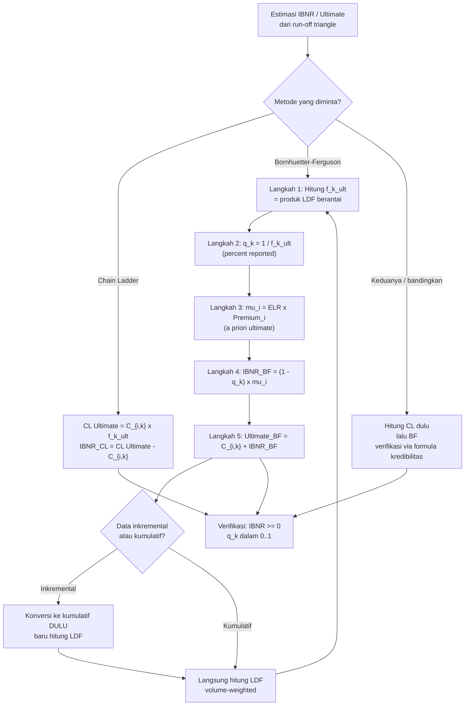

# 📊 9.3 — Bornhuetter-Ferguson Method

> [!ABSTRACT] Ringkasan Cepat
> **Topik:** Bornhuetter-Ferguson Method | **Bobot:** ~5–10% | **Difficulty:** Calculation-Intensive
> **Ref:** Brown & Lennox (2015), Bab 2 & 3 | **Prereq:** [[9.1 Long-Tail vs Short-Tail Business]], [[9.2 Chain Ladder Method]]


## Section 0 — Pemetaan Topik

| Topik TA2 | Sub-topik ID | Skill Diuji | Bobot | Difficulty | Prerequisite | Connected Topics | Referensi |
|---|---|---|---|---|---|---|---|
| Estimasi Klaim yang Belum Dibayar | 9.3 | Mengestimasi nilai *ultimate* dan IBNR menggunakan metode Bornhuetter-Ferguson; memahami hubungan BF dengan Chain Ladder; mengidentifikasi kelebihan BF untuk accident year yang masih muda | 5–10% | Calculation-Intensive | [[9.1 Long-Tail vs Short-Tail Business]], [[9.2 Chain Ladder Method]] | [[9.2 Chain Ladder Method]] | Brown & Lennox (2015), Bab 2 & 3 |


## Section 1 — Intuisi

Bayangkan seorang aktuaris di perusahaan asuransi jiwa kredit yang harus memperkirakan berapa total klaim yang pada akhirnya akan dibayarkan untuk tahun kecelakaan 2023. Di akhir tahun 2024, ia sudah tahu berapa klaim yang telah dilaporkan dan dibayarkan — tetapi masih banyak klaim yang belum dilaporkan (*incurred but not reported*, IBNR) karena proses klaim bisa berlangsung bertahun-tahun. Metode *Chain Ladder* yang sudah ia pelajari sebelumnya akan langsung memproyeksikan klaim yang sudah teramati ke nilai *ultimate* menggunakan faktor perkembangan historis. Tetapi ada masalah: untuk accident year yang paling muda (misal 2023), data yang teramati masih sangat sedikit — hanya beberapa bulan klaim. Memproyeksikannya menggunakan Chain Ladder bisa menghasilkan estimasi yang sangat tidak stabil, bergoyang drastis hanya karena satu atau dua klaim besar yang kebetulan dilaporkan awal.

Di sinilah **metode Bornhuetter-Ferguson (BF)** hadir sebagai solusi yang jauh lebih bijak. Alih-alih mengandalkan data yang teramati saja (seperti Chain Ladder) atau mengandalkan ekspektasi *a priori* saja, metode BF memadukan keduanya: "Seberapa besar bagian klaim yang sudah teramati? Hanya sebesar itu kepercayaan kita pada data aktual. Sisanya, kita andalkan pada estimasi *a priori* (biasanya dari rasio kerugian historis atau *loss ratio*)." Hasilnya adalah estimasi yang jauh lebih stabil untuk tahun muda, dan secara matematis identik dengan Chain Ladder untuk tahun yang sudah matang.

Intuisi sederhananya adalah: metode BF adalah campuran cerdas antara **data aktual** dan **ekspektasi** — dengan bobot yang secara otomatis lebih besar diberikan ke data aktual semakin matang suatu accident year. Ini adalah penerapan prinsip kredibilitas (*credibility*) dalam konteks *loss reserving* — sebuah jembatan konseptual yang elegan antara Topik 9 dan Topik 7 dalam silabus TA2.


## Section 2 — Definisi Formal

> [!NOTE] Definisi Matematis
> 
> Untuk accident year $i$ dengan kerugian teramati $C_{i,k}$ pada usia perkembangan $k$, nilai *ultimate* menurut metode Bornhuetter-Ferguson adalah:
>
> $$
> \hat{U}_i^{BF} = C_{i,k} + (1 - q_k) \cdot \mu_i
> $$
>
> di mana $q_k = 1/f_k^{ult}$ adalah proporsi kerugian yang sudah teramati pada usia $k$, dan $\mu_i$ adalah estimasi *a priori* dari nilai *ultimate* accident year $i$.

| Simbol | Makna | Catatan |
|---|---|---|
| $C_{i,k}$ | Kerugian kumulatif yang teramati untuk accident year $i$ pada usia perkembangan $k$ | Nilai dari *run-off triangle* |
| $\hat{U}_i^{BF}$ | Estimasi *ultimate* BF untuk accident year $i$ | Nilai akhir yang dituju setelah semua klaim selesai |
| $\hat{U}_i^{CL}$ | Estimasi *ultimate* Chain Ladder untuk accident year $i$ | $= C_{i,k} \times f_k^{ult}$ |
| $f_{k, k+1}$ | Faktor perkembangan (*loss development factor*, LDF) dari usia $k$ ke $k+1$ | Diestimasi dari triangle historis |
| $f_k^{ult}$ | Faktor perkembangan kumulatif dari usia $k$ ke *ultimate* | $f_k^{ult} = f_{k,k+1} \times f_{k+1,k+2} \times \cdots$ |
| $q_k$ | Proporsi kerugian yang sudah teramati pada usia $k$ | $q_k = 1 / f_k^{ult} \in (0, 1]$ |
| $1 - q_k$ | Proporsi kerugian yang **belum** teramati (*percent unreported*) pada usia $k$ | Bobot untuk komponen *a priori* |
| $\mu_i$ | Estimasi *a priori* nilai *ultimate* accident year $i$ | Biasanya: *a priori loss ratio* $\times$ *premium* |
| $\text{ELR}$ | *Expected Loss Ratio* (*a priori loss ratio*) | Ditetapkan dari data historis atau underwriting |
| $P_i$ | *Premium* (premi) yang ditulis untuk accident year $i$ | Digunakan untuk menghitung $\mu_i = \text{ELR} \times P_i$ |
| $\text{IBNR}_i$ | *Incurred But Not Reported* — estimasi klaim yang belum dilaporkan | $= \hat{U}_i^{BF} - C_{i,k}$ |

### Rumus Utama

**[BF Ultimate] Estimasi nilai *ultimate* Bornhuetter-Ferguson:**

$$
\hat{U}_i^{BF} = C_{i,k} + (1 - q_k)\,\mu_i
$$

*Label: Komponen pertama adalah klaim yang sudah teramati; komponen kedua adalah ekspektasi klaim yang belum teramati berdasarkan estimasi a priori.*

**[Percent Reported] Proporsi klaim yang sudah teramati:**

$$
q_k = \frac{1}{f_k^{ult}}
$$

*Label: Invers dari faktor perkembangan kumulatif ke ultimate. Jika $f_k^{ult} = 2.0$, maka $q_k = 0.50$ — artinya 50% klaim sudah dilaporkan pada usia $k$.*

**[A Priori Ultimate] Estimasi a priori nilai ultimate:**

$$
\mu_i = \text{ELR} \times P_i
$$

*Label: ELR adalah expected loss ratio yang ditetapkan secara independen (biasanya dari pengalaman industri atau tahun-tahun sebelumnya yang sudah matang).*

**[IBNR] Estimasi klaim belum dilaporkan:**

$$
\text{IBNR}_i = \hat{U}_i^{BF} - C_{i,k} = (1 - q_k)\,\mu_i
$$

*Label: IBNR adalah seluruh komponen a priori dari formula BF. Untuk accident year muda (kecil $q_k$), IBNR mendekati $\mu_i$ penuh.*

**[CDF-to-Ultimate] Faktor perkembangan kumulatif:**

$$
f_k^{ult} = f_{k,k+1} \times f_{k+1,k+2} \times \cdots \times f_{n-1, n}
$$

*Label: Produk berantai dari semua LDF dari usia $k$ hingga usia maturitas penuh. Nilai $f_n^{ult} = 1.000$ pada usia maturitas.*

**[BF sebagai Kredibilitas] Interpretasi BF dalam kerangka kredibilitas:**

$$
\hat{U}_i^{BF} = q_k \cdot \hat{U}_i^{CL} + (1 - q_k) \cdot \mu_i
$$

*Label: BF adalah rata-rata tertimbang antara estimasi Chain Ladder $\hat{U}_i^{CL}$ dan estimasi a priori $\mu_i$, dengan bobot $q_k$ dan $(1-q_k)$.*

### Asumsi Eksplisit

1. **Pola perkembangan stabil:** LDF yang diestimasi dari data historis mewakili pola perkembangan masa depan — sama seperti asumsi Chain Ladder.
2. **ELR representatif:** Expected Loss Ratio ($\text{ELR}$) yang digunakan mencerminkan pengalaman kerugian jangka panjang yang relevan untuk accident year yang sedang diestimasi.
3. **Independensi komponen:** Kerugian yang sudah teramati $C_{i,k}$ dan bagian yang belum teramati diasumsikan bersifat independen — komponen yang sudah terjadi tidak mempengaruhi ekspektasi yang belum terjadi.
4. **Perkembangan deterministik:** Faktor perkembangan kumulatif $f_k^{ult}$ dianggap diketahui dengan pasti (deterministic), bukan stokastik.
5. **Homogenitas dalam accident year:** Semua risiko dalam satu accident year memiliki pola perkembangan yang sama — tidak ada sub-segmentasi berdasarkan jenis risiko.


## Section 3 — Jembatan Logika

> [!TIP] Dari Definisi ke Rumus — Mengapa $(1 - q_k) \cdot \mu_i$?
> Logika BF dimulai dari dekomposisi nilai ultimate: $U_i = C_{i,k}^{\text{sudah}} + C_i^{\text{belum}}$. Bagian yang sudah teramati kita gunakan apa adanya: $C_{i,k}$. Bagian yang belum teramati — inilah yang tidak diketahui — diestimasi menggunakan *a priori*. Jika kita tahu bahwa pada usia $k$, proporsi $q_k$ dari ultimate sudah dilaporkan, maka proporsi $(1-q_k)$ dari ultimate belum dilaporkan. Ekspektasi dari bagian yang belum dilaporkan adalah $(1-q_k) \times \mu_i$ (menggunakan estimasi *a priori* $\mu_i$ sebagai proxy untuk ultimate). Menjumlahkan keduanya menghasilkan formula BF. Kunci elegan-nya: kita **tidak** memproyeksikan $C_{i,k}$ secara penuh (seperti Chain Ladder), melainkan hanya **menambahkan** estimasi klaim yang diharapkan belum dilaporkan.

> [!IMPORTANT] Hubungan BF dan Chain Ladder — Kapan Keduanya Sama?
> Dari rumus kredibilitas $\hat{U}_i^{BF} = q_k \cdot \hat{U}_i^{CL} + (1-q_k) \cdot \mu_i$:
> - Jika $q_k \to 1$ (accident year matang, hampir semua sudah dilaporkan): $\hat{U}_i^{BF} \to \hat{U}_i^{CL}$ — BF identik dengan Chain Ladder.
> - Jika $q_k \to 0$ (accident year sangat muda, hampir tidak ada yang dilaporkan): $\hat{U}_i^{BF} \to \mu_i$ — BF identik dengan estimasi *a priori* murni.
> - Jika $\mu_i = \hat{U}_i^{CL}$: BF selalu menghasilkan nilai yang sama dengan Chain Ladder, tidak peduli $q_k$.
>
> Ini menunjukkan BF adalah **generalisasi** dari Chain Ladder: Chain Ladder adalah kasus khusus BF ketika $q_k = 1$ (atau ketika a priori cocok dengan CL).

**Derivasi Interpretasi BF sebagai Kredibilitas — step-by-step:**

**Langkah 1:** Mulai dari formula BF standar:

$$
\hat{U}_i^{BF} = C_{i,k} + (1 - q_k)\,\mu_i
$$

**Langkah 2:** Tambahkan dan kurangkan $(1-q_k) \cdot C_{i,k}$:

$$
\hat{U}_i^{BF} = C_{i,k} + (1-q_k)\,\mu_i + (1-q_k)\,C_{i,k} - (1-q_k)\,C_{i,k}
$$

**Langkah 3:** Sederhanakan grup pertama: $C_{i,k} - (1-q_k)C_{i,k} = q_k \cdot C_{i,k}$:

$$
\hat{U}_i^{BF} = q_k \cdot C_{i,k} + (1-q_k)\left[C_{i,k} + \mu_i\right]
$$

**Langkah 4:** Perhatikan bahwa estimasi Chain Ladder adalah $\hat{U}_i^{CL} = f_k^{ult} \cdot C_{i,k} = C_{i,k}/q_k$. Kelompokkan ulang:

$$
\hat{U}_i^{BF} = q_k \cdot \frac{C_{i,k}}{q_k} + (1-q_k)\,\mu_i = q_k \cdot \hat{U}_i^{CL} + (1-q_k)\,\mu_i
$$

**Langkah 5:** Ini adalah formula kredibilitas dengan bobot $Z = q_k$ untuk estimasi "pengalaman" (Chain Ladder) dan bobot $1-Z = 1-q_k$ untuk estimasi "*a priori*" — identik dengan struktur premi kredibilitas pada [[7.1 Classical Credibility]].

> [!DANGER] Dilarang
> 1. **Jangan** menghitung IBNR BF sebagai $(1-q_k) \times \hat{U}_i^{CL}$ (menggunakan CL ultimate sebagai dasar) — IBNR BF adalah $(1-q_k) \times \mu_i$ (menggunakan *a priori* $\mu_i$, bukan CL ultimate). Kesalahan ini mencampuradukkan dua metode.
> 2. **Jangan** menggunakan $q_k = f_k^{ult}$ — $q_k$ adalah **invers** dari CDF-to-ultimate: $q_k = 1/f_k^{ult}$. Jika $f_k^{ult} = 4$, maka $q_k = 0.25$, bukan 4.
> 3. **Jangan** mengaplikasikan BF untuk accident year yang sudah matur ($q_k \approx 1$) dan berharap hasil berbeda signifikan dari Chain Ladder — pada accident year matang, BF dan CL hampir identik; nilai tambah BF justru terletak pada accident year muda.


## Section 4 — Contoh Soal

### Soal A — Fundamental

Triangle klaim kumulatif berikut tersedia (dalam juta rupiah):

| Accident Year | Usia 12 | Usia 24 | Usia 36 |
|---|---|---|---|
| 2021 | 400 | 600 | 750 |
| 2022 | 500 | 700 | — |
| 2023 | 450 | — | — |

LDF yang sudah dihitung: $f_{12,24} = 1.500$, $f_{24,36} = 1.250$, $f_{36}^{ult} = 1.000$ (matur).

Expected Loss Ratio (ELR) = 0.75. Premium tahun 2022: $P_{2022} = 1000$ juta; Premium tahun 2023: $P_{2023} = 1200$ juta.

Hitung IBNR BF untuk accident year 2022 dan 2023.

> [!SUCCESS] Solusi Soal A
> **Pendekatan:** Hitung $f_k^{ult}$ untuk setiap accident year, lalu $q_k = 1/f_k^{ult}$, lalu $\mu_i = \text{ELR} \times P_i$, dan terakhir $\text{IBNR}_i = (1-q_k)\mu_i$.
>
> **1. Identifikasi Variabel**
> - AY 2022: $C_{2022, 24} = 700$, usia perkembangan saat ini = 24
> - AY 2023: $C_{2023, 12} = 450$, usia perkembangan saat ini = 12
> - $f_{12,24} = 1.500$, $f_{24,36} = 1.250$, $f_{36}^{ult} = 1.000$
> - ELR $= 0.75$; $P_{2022} = 1000$, $P_{2023} = 1200$ (juta)
>
> **2. Identifikasi Distribusi / Model**
> Metode BF — dua accident year dengan usia perkembangan berbeda. AY 2022 berada di usia 24; AY 2023 berada di usia 12.
>
> **3. Setup Persamaan**
>
> $$
> f_k^{ult} = \prod_{\text{dari usia }k\text{ ke maturitas}} \text{LDF}, \quad q_k = \frac{1}{f_k^{ult}}, \quad \mu_i = \text{ELR} \times P_i, \quad \text{IBNR}_i = (1-q_k)\,\mu_i
> $$
>
> **4. Eksekusi Aljabar**
>
> **Faktor kumulatif:**
>
> $$
> f_{24}^{ult} = f_{24,36} \times f_{36}^{ult} = 1.250 \times 1.000 = 1.250
> $$
>
> $$
> f_{12}^{ult} = f_{12,24} \times f_{24}^{ult} = 1.500 \times 1.250 = 1.875
> $$
>
> **Percent reported:**
>
> $$
> q_{24} = \frac{1}{1.250} = 0.800 \quad (80\% \text{ sudah dilaporkan})
> $$
>
> $$
> q_{12} = \frac{1}{1.875} = 0.533 \quad (53.3\% \text{ sudah dilaporkan})
> $$
>
> **A priori ultimate:**
>
> $$
> \mu_{2022} = 0.75 \times 1000 = 750 \text{ juta}
> $$
>
> $$
> \mu_{2023} = 0.75 \times 1200 = 900 \text{ juta}
> $$
>
> **IBNR BF:**
>
> $$
> \text{IBNR}_{2022} = (1 - 0.800) \times 750 = 0.200 \times 750 = 150 \text{ juta}
> $$
>
> $$
> \text{IBNR}_{2023} = (1 - 0.533) \times 900 = 0.467 \times 900 = 420 \text{ juta}
> $$
>
> **5. Verification**
> Cek: $\text{IBNR}_{2023} > \text{IBNR}_{2022}$ karena AY 2023 lebih muda ($q$ lebih kecil) dan premium lebih besar — konsisten ✓. IBNR BF 2022 = 150 juta; jika dihitung dengan CL: $\hat{U}^{CL}_{2022} = 700 \times 1.250 = 875$; $\text{IBNR}^{CL}_{2022} = 875 - 700 = 175$ juta. BF menghasilkan 150 < 175 karena $\mu_{2022} = 750 < \hat{U}^{CL}_{2022} = 875$ (a priori lebih konservatif dari CL).
>
> **Hasil:** $\text{IBNR}_{2022}^{BF} = 150$ juta; $\text{IBNR}_{2023}^{BF} = 420$ juta.

> [!WARNING] Exam Tips — Soal A
> **Target waktu:** 4 menit. **Common trap:** Menggunakan $q_k = f_k^{ult}$ (bukan $1/f_k^{ult}$) — jika $f_{12}^{ult} = 1.875$, maka $q_{12} = 1/1.875 = 0.533$, bukan 1.875. **Common trap kedua:** Lupa mengalikan LDF secara berantai untuk mendapatkan $f_k^{ult}$ — harus dari usia saat ini ke maturitas. **Shortcut:** IBNR BF = percent unreported $\times$ a priori ultimate. Cukup dua perkalian per accident year setelah $q_k$ diketahui.

---

### Soal B — Exam-Typical

Menggunakan data yang sama dari Soal A, hitung juga estimasi **ultimate BF** untuk AY 2022 dan 2023, serta bandingkan dengan estimasi **ultimate Chain Ladder**. Interpretasikan perbedaannya.

> [!SUCCESS] Solusi Soal B
> **Pendekatan:** Ultimate BF = $C_{i,k}$ + IBNR BF. Ultimate CL = $C_{i,k} \times f_k^{ult}$. Bandingkan keduanya dan hubungkan dengan formula kredibilitas.
>
> **1. Identifikasi Variabel**
> - Dari Soal A: $q_{24} = 0.800$, $q_{12} = 0.533$, $\mu_{2022} = 750$, $\mu_{2023} = 900$
> - $C_{2022,24} = 700$, $f_{24}^{ult} = 1.250$
> - $C_{2023,12} = 450$, $f_{12}^{ult} = 1.875$
>
> **2. Identifikasi Distribusi / Model**
> Perbandingan dua metode: BF (campuran data aktual dan a priori) vs Chain Ladder (data aktual saja).
>
> **3. Setup Persamaan**
>
> $$
> \hat{U}_i^{BF} = C_{i,k} + \text{IBNR}_i^{BF}, \quad \hat{U}_i^{CL} = C_{i,k} \times f_k^{ult}
> $$
>
> **4. Eksekusi Aljabar**
>
> **AY 2022:**
>
> $$
> \hat{U}_{2022}^{BF} = 700 + 150 = 850 \text{ juta}
> $$
>
> $$
> \hat{U}_{2022}^{CL} = 700 \times 1.250 = 875 \text{ juta}
> $$
>
> Verifikasi via formula kredibilitas:
>
> $$
> \hat{U}_{2022}^{BF} = q_{24} \cdot \hat{U}_{2022}^{CL} + (1-q_{24})\cdot\mu_{2022} = 0.800 \times 875 + 0.200 \times 750 = 700 + 150 = 850 \checkmark
> $$
>
> **AY 2023:**
>
> $$
> \hat{U}_{2023}^{BF} = 450 + 420 = 870 \text{ juta}
> $$
>
> $$
> \hat{U}_{2023}^{CL} = 450 \times 1.875 = 843.75 \text{ juta}
> $$
>
> Verifikasi via formula kredibilitas:
>
> $$
> \hat{U}_{2023}^{BF} = 0.533 \times 843.75 + 0.467 \times 900 = 449.8 + 420.3 = 870.1 \approx 870 \checkmark
> $$
>
> **Ringkasan perbandingan:**
>
> | AY | $C_{i,k}$ | $\hat{U}^{BF}$ | $\hat{U}^{CL}$ | Selisih BF $-$ CL |
> |---|---|---|---|---|
> | 2022 | 700 | 850 | 875 | $-25$ (BF lebih rendah) |
> | 2023 | 450 | 870 | 843.75 | $+26.25$ (BF lebih tinggi) |
>
> **5. Verification**
> Untuk AY 2022: BF < CL karena $\mu_{2022} = 750 < \hat{U}^{CL}_{2022} = 875$ — a priori lebih konservatif. Untuk AY 2023: BF > CL karena $\mu_{2023} = 900 > \hat{U}^{CL}_{2023} = 843.75$ — a priori lebih tinggi dari CL. Ini menunjukkan BF memberikan bobot yang lebih besar ke a priori untuk AY muda (AY 2023 punya $q=0.533$) dibanding AY lebih tua (AY 2022 punya $q=0.800$), yang merupakan keunggulan utama BF.
>
> **Hasil:** BF dan CL dapat memberikan estimasi yang berbeda signifikan, terutama untuk accident year muda. Arah perbedaannya ditentukan oleh apakah $\mu_i$ (a priori) lebih tinggi atau lebih rendah dari $\hat{U}_i^{CL}$.

> [!WARNING] Exam Tips — Soal B
> **Target waktu:** 4 menit. **Common trap:** Menghitung $\hat{U}^{BF}$ secara langsung dengan formula kredibilitas $q_k \cdot \hat{U}^{CL} + (1-q_k)\cdot\mu_i$ tanpa terlebih dahulu menghitung $\hat{U}^{CL}$ — lakukan keduanya dan verifikasi konsistensi. **Shortcut:** Jika soal minta IBNR saja (bukan ultimate), cukup $(1-q_k)\mu_i$ tanpa perlu menghitung $\hat{U}^{CL}$. **Insight kritis:** Selisih $\hat{U}^{BF} - \hat{U}^{CL} = (1-q_k)(\mu_i - \hat{U}^{CL}_i)$ — BF > CL jika dan hanya jika a priori > CL ultimate.

---

### Soal C — Challenging

Triangle klaim kumulatif inkremental (dalam juta rupiah) diberikan, dan harus dikonversi ke kumulatif terlebih dahulu:

| AY | Usia 12 | Usia 24 | Usia 36 | Usia 48 |
|---|---|---|---|---|
| 2020 | 200 | 120 | 80 | 40 |
| 2021 | 240 | 150 | 90 | — |
| 2022 | 280 | 160 | — | — |
| 2023 | 320 | — | — | — |

*(Nilai di atas adalah klaim **inkremental**, bukan kumulatif)*

Premium (juta): $P_{2020} = 600$, $P_{2021} = 700$, $P_{2022} = 800$, $P_{2023} = 900$. ELR $= 0.70$.

(a) Bangun triangle kumulatif. (b) Hitung semua LDF menggunakan *volume-weighted average*. (c) Hitung $q_k$ untuk setiap usia. (d) Hitung total IBNR BF untuk seluruh portofolio.

> [!SUCCESS] Solusi Soal C
> **Pendekatan:** Konversi inkremental ke kumulatif, hitung LDF secara volume-weighted, derive $f_k^{ult}$ dan $q_k$, lalu hitung IBNR BF untuk setiap AY dan jumlahkan.
>
> **1. Identifikasi Variabel**
> - 4 accident years (2020–2023), 4 kolom usia (12, 24, 36, 48)
> - Data inkremental diberikan; perlu dikonversi ke kumulatif
> - ELR = 0.70; premium per AY diberikan
>
> **2. Identifikasi Distribusi / Model**
> Metode BF penuh dengan derivasi LDF dari data triangle. Tiga accident year memerlukan proyeksi (2021, 2022, 2023); AY 2020 sudah matur di usia 48 (asumsi $f_{48}^{ult} = 1.000$).
>
> **3. Setup Persamaan**
>
> $$
> C_{i,k}^{\text{kum}} = \sum_{j \leq k} C_{i,j}^{\text{inkr}}, \quad f_{k,k+12} = \frac{\sum_i C_{i,k+12}}{\sum_i C_{i,k}}, \quad \text{IBNR}_{\text{total}} = \sum_i (1-q_k)\,\mu_i
> $$
>
> **4. Eksekusi Aljabar**
>
> **(a) Triangle kumulatif:**
>
> | AY | Usia 12 | Usia 24 | Usia 36 | Usia 48 |
> |---|---|---|---|---|
> | 2020 | 200 | 320 | 400 | 440 |
> | 2021 | 240 | 390 | 480 | — |
> | 2022 | 280 | 440 | — | — |
> | 2023 | 320 | — | — | — |
>
> *(AY 2020: 200; 200+120=320; 320+80=400; 400+40=440)*
> *(AY 2021: 240; 240+150=390; 390+90=480)*
> *(AY 2022: 280; 280+160=440)*
>
> **(b) LDF volume-weighted:**
>
> $f_{12,24}$: menggunakan AY di mana usia 12 dan 24 keduanya tersedia (AY 2020, 2021, 2022):
>
> $$
> f_{12,24} = \frac{320 + 390 + 440}{200 + 240 + 280} = \frac{1150}{720} = 1.5972
> $$
>
> $f_{24,36}$: menggunakan AY di mana usia 24 dan 36 keduanya tersedia (AY 2020, 2021):
>
> $$
> f_{24,36} = \frac{400 + 480}{320 + 390} = \frac{880}{710} = 1.2394
> $$
>
> $f_{36,48}$: menggunakan AY di mana usia 36 dan 48 keduanya tersedia (AY 2020 saja):
>
> $$
> f_{36,48} = \frac{440}{400} = 1.1000
> $$
>
> $f_{48}^{ult} = 1.000$ (maturitas).
>
> **(c) CDF-to-ultimate dan $q_k$:**
>
> $$
> f_{36}^{ult} = 1.1000 \times 1.000 = 1.1000, \quad q_{36} = 1/1.1000 = 0.9091
> $$
>
> $$
> f_{24}^{ult} = 1.2394 \times 1.1000 = 1.3633, \quad q_{24} = 1/1.3633 = 0.7335
> $$
>
> $$
> f_{12}^{ult} = 1.5972 \times 1.3633 = 2.1778, \quad q_{12} = 1/2.1778 = 0.4592
> $$
>
> **(d) IBNR BF per accident year:**
>
> | AY | Usia saat ini | $C_{i,k}$ | $q_k$ | $1-q_k$ | $\mu_i = 0.70 \times P_i$ | $\text{IBNR}_i^{BF}$ |
> |---|---|---|---|---|---|---|
> | 2020 | 48 | 440 | 1.000 | 0.000 | $0.70 \times 600 = 420$ | $0.000 \times 420 = 0$ |
> | 2021 | 36 | 480 | 0.9091 | 0.0909 | $0.70 \times 700 = 490$ | $0.0909 \times 490 = 44.5$ |
> | 2022 | 24 | 440 | 0.7335 | 0.2665 | $0.70 \times 800 = 560$ | $0.2665 \times 560 = 149.2$ |
> | 2023 | 12 | 320 | 0.4592 | 0.5408 | $0.70 \times 900 = 630$ | $0.5408 \times 630 = 340.7$ |
>
> $$
> \text{IBNR}_{\text{total}}^{BF} = 0 + 44.5 + 149.2 + 340.7 = \mathbf{534.4} \text{ juta}
> $$
>
> **5. Verification**
> AY 2020 sudah matur ($q = 1.000$) → IBNR = 0 ✓. IBNR meningkat untuk AY yang lebih muda — konsisten dengan logika BF. Cek $f_{12}^{ult} = 1.5972 \times 1.2394 \times 1.1000 = 2.178 \approx 2.178$ ✓. Urutan LDF: $f_{12,24} > f_{24,36} > f_{36,48}$ — perkembangan melambat seiring maturitas, wajar untuk pola klaim tipikal.
>
> **Hasil:** Total IBNR BF $\approx$ Rp 534,4 juta.

> [!WARNING] Exam Tips — Soal C
> **Target waktu:** 8 menit. **Common trap terbesar:** Lupa mengkonversi data inkremental ke kumulatif sebelum menghitung LDF — LDF dihitung dari data kumulatif, bukan inkremental. **Common trap kedua:** Menggunakan AY 2020 saja untuk $f_{12,24}$ padahal AY 2021 dan 2022 juga memiliki data di usia 12 dan 24 — volume-weighted LDF harus menggunakan semua AY yang tersedia di kedua kolom. **Common trap ketiga:** Untuk AY yang sudah matur ($f^{ult} = 1$), IBNR = 0 — jangan menghitung IBNR untuk AY 2020. **Shortcut:** Susun tabel ringkasan seperti tabel (d) di atas; ini meminimalkan risiko kesalahan entri.


## Section 5 — Verifikasi & Sanity Check

> [!CHECK] Cek Konsistensi BF dan CL untuk Accident Year Matang
> Untuk accident year yang sudah mendekati maturitas ($q_k \approx 1.0$):
>
> $$
> \hat{U}_i^{BF} = q_k\,\hat{U}_i^{CL} + (1-q_k)\,\mu_i \approx 1.0 \times \hat{U}_i^{CL} + 0 \times \mu_i = \hat{U}_i^{CL}
> $$
>
> Jadi BF $\approx$ CL untuk AY matang. Jika hasil BF sangat berbeda dari CL untuk AY yang sudah di usia 48 atau lebih, ada kesalahan dalam perhitungan $q_k$ atau IBNR.

> [!CHECK] Cek Batas IBNR BF
> IBNR BF selalu berada dalam rentang:
>
> $$
> 0 \leq \text{IBNR}_i^{BF} = (1-q_k)\,\mu_i \leq \mu_i
> $$
>
> - Batas bawah ($= 0$): ketika $q_k = 1$ (AY matur). Jika IBNR negatif, ada kesalahan — $q_k$ tidak boleh melebihi 1.
> - Batas atas ($= \mu_i$): ketika $q_k = 0$ (AY baru mulai, belum ada klaim). Dalam praktik, $q_k > 0$ selalu.
> - IBNR BF $\neq$ $(1-q_k)\hat{U}^{CL}$ — titik referensi adalah $\mu_i$, bukan CL ultimate.

### Metode Alternatif — Iterasi BF (Bornhuetter-Ferguson Iteratif)

Untuk meningkatkan konsistensi, beberapa praktisi menggunakan BF secara iteratif: gunakan $\hat{U}_i^{BF}$ dari iterasi pertama sebagai a priori baru ($\mu_i^{(2)} = \hat{U}_i^{BF,(1)}$) untuk iterasi kedua, dan seterusnya hingga konvergen. Dalam ujian, iterasi ini jarang diminta secara eksplisit; cukup tahu bahwa metode BF iteratif konvergen ke estimasi Chain Ladder setelah iterasi yang cukup banyak.


## Section 6 — Visualisasi Mental

**Run-off Triangle dan Posisi Setiap AY:**

```
Usia Perkembangan (Development Age)
           12      24      36      48
         ┌──────┬──────┬──────┬──────┐
AY 2020  │  200 │  320 │  400 │  440 │ ← MATANG (q=1.00, IBNR=0)
         ├──────┼──────┼──────┼──┄┄┄┄┤
AY 2021  │  240 │  390 │  480 │  ??? │ ← q=0.909, perlu estimasi 1 sel
         ├──────┼──────┼──┄┄┄┄┴──┄┄┄┄┤
AY 2022  │  280 │  440 │  ???        │ ← q=0.734, perlu estimasi 2 sel
         ├──────┼──┄┄┄┄┴─────────────┤
AY 2023  │  320 │  ???               │ ← q=0.459, perlu estimasi 3 sel
         └──────┴────────────────────┘
         ← terisi ─────── perlu proyeksi →
         (data aktual)          (IBNR)
```

**Perbandingan BF vs Chain Ladder — Sumber Estimasi:**

```
Chain Ladder:                    Bornhuetter-Ferguson:
                                 
Seluruh ultimate                 Ultimate
dari data aktual                 = Bagian aktual + Bagian a priori
     ↓                                ↓                  ↓
Û_CL = C × f^ult             Û_BF = C_{i,k}  +  (1-q) × μ_i
                                  (sudah ada)   (yang diharapkan
                                                 belum ada)

Risiko: tidak stabil          Risiko: tergantung kualitas ELR
untuk AY muda                 Manfaat: stabil untuk AY muda
```

### Hubungan Visual ↔ Rumus

| Elemen Visual | Komponen Rumus |
|---|---|
| Sel-sel yang sudah terisi di triangle | $C_{i,k}$ — kerugian teramati |
| Sel-sel yang perlu diisi (area "???") | IBNR = $(1-q_k)\mu_i$ — estimasi BF |
| Diagonal terakhir (current diagonal) | Titik awal semua proyeksi |
| Posisi AY di triangle (kiri vs kanan) | Menentukan $q_k$: semakin ke kanan, semakin matang |
| Lebar area "???" per AY | Proporsi $(1-q_k)$ dari total ultimate |


## Section 7 — Jebakan Umum

> [!BUG] Kesalahan Parametrisasi — $q_k$ vs $f_k^{ult}$
> Jebakan paling sering di ujian:
> - **Salah:** $q_k = f_k^{ult}$ (misalnya $q_{12} = 1.875$)
> - **Benar:** $q_k = 1/f_k^{ult}$ (misalnya $q_{12} = 1/1.875 = 0.533$)
>
> $q_k$ adalah *proporsi* (antara 0 dan 1). Jika hasil $q_k > 1$, pasti ada kesalahan — ambil invers-nya.

> [!BUG] Kesalahan Konseptual — 4 Miskonsepsi Umum
> 1. **"IBNR BF = $(1-q_k) \times \hat{U}^{CL}$"** — Salah. IBNR BF = $(1-q_k) \times \mu_i$ (menggunakan a priori $\mu_i$, bukan CL ultimate). Mencampurkan ini adalah kesalahan konseptual yang fundamental.
> 2. **"BF selalu lebih konservatif dari Chain Ladder"** — Tidak selalu. Jika $\mu_i > \hat{U}^{CL}_i$, maka BF > CL. Arah perbedaannya tergantung apakah a priori di atas atau di bawah CL.
> 3. **"ELR = Loss Ratio aktual accident year tersebut"** — Salah. ELR adalah *expected* (a priori) loss ratio, biasanya ditetapkan dari pengalaman tahun-tahun matang sebelumnya atau ekspektasi underwriting — bukan dari data triangle accident year yang sedang diestimasi.
> 4. **"BF tidak perlu LDF"** — Salah. BF tetap membutuhkan LDF untuk menghitung $f_k^{ult}$ dan $q_k$. Perbedaannya dengan CL bukan pada penggunaan LDF, melainkan pada penggunaan a priori untuk bagian yang belum dilaporkan.

> [!BUG] Kesalahan Interpretasi Soal
> - **"Incremental losses"** → konversi ke kumulatif dulu sebelum menghitung LDF atau menerapkan BF.
> - **"A priori loss ratio" atau "expected loss ratio"** → ini adalah ELR untuk menghitung $\mu_i = \text{ELR} \times P_i$.
> - **"Ultimate losses" vs "IBNR"**: ultimate = $C_{i,k}$ + IBNR; IBNR = $(1-q_k)\mu_i$. Baca soal cermat — tanyakan ultimate atau IBNR.
> - **"Accident year 20XX is fully developed"** → $f^{ult} = 1.000$, $q = 1.000$, IBNR = 0 untuk AY tersebut.

> [!CAUTION] Red Flags — Keyword Pemicu Prosedur Khusus
> - **"Incremental" atau "incremental paid losses"** → wajib konversi ke kumulatif sebelum apapun.
> - **"Expected loss ratio" atau "a priori loss ratio"** → digunakan untuk $\mu_i$, bukan untuk LDF.
> - **"Compare BF with Chain Ladder"** → hitung keduanya dan gunakan formula kredibilitas $q_k \cdot \hat{U}^{CL} + (1-q_k)\cdot\mu_i$ sebagai verifikasi.
> - **"Volume-weighted average"** → gunakan $\sum C_{i,k+1}/\sum C_{i,k}$ (bukan rata-rata sederhana) untuk LDF.
> - **"Most recent diagonal"** → ini adalah $C_{i,k}$ untuk setiap AY — nilai terkini yang tersedia di diagonal terakhir triangle.


## Section 8 — Ringkasan Eksekutif

> [!SUMMARY] Must-Remember
>
> **1. Ultimate BF:**
>
> $$
> \hat{U}_i^{BF} = C_{i,k} + (1-q_k)\,\mu_i
> $$
>
> **2. IBNR BF:**
>
> $$
> \text{IBNR}_i^{BF} = (1-q_k)\,\mu_i
> $$
>
> **3. Percent reported:**
>
> $$
> q_k = \frac{1}{f_k^{ult}}, \quad f_k^{ult} = f_{k,k+1} \times f_{k+1,k+2} \times \cdots
> $$
>
> **4. A priori ultimate:**
>
> $$
> \mu_i = \text{ELR} \times P_i
> $$
>
> **5. BF sebagai kredibilitas (verifikasi):**
>
> $$
> \hat{U}_i^{BF} = q_k\,\hat{U}_i^{CL} + (1-q_k)\,\mu_i
> $$

### Kapan Digunakan

- Mengestimasi IBNR dan *ultimate* untuk **accident year yang masih muda** (sedikit data teramati, $q_k$ kecil) — BF jauh lebih stabil dari Chain Ladder dalam kondisi ini.
- Ketika ada estimasi ELR yang dapat dipercaya dari data historis yang sudah matang.
- Ketika soal meminta **perbandingan BF vs Chain Ladder** — hitung keduanya dan verifikasi via formula kredibilitas.
- Trigger keywords: "Bornhuetter-Ferguson", "BF method", "a priori loss ratio", "expected loss ratio", "percent unreported", "IBNR".

### Kapan TIDAK Boleh Digunakan

- Ketika tidak ada estimasi ELR yang dapat dipercaya — BF bergantung penuh pada kualitas a priori; ELR yang salah menghasilkan IBNR yang salah.
- Untuk accident year yang sudah matang ($q_k \approx 1$) — BF dan Chain Ladder akan menghasilkan nilai yang hampir sama; lebih sederhana menggunakan CL saja.
- Ketika soal secara eksplisit meminta Chain Ladder saja — BF adalah metode alternatif, bukan pengganti wajib.

### Quick Decision Tree



---

> [!QUOTE] Follow-up Options
> 1. *"Berikan contoh soal BF dengan triangle 4×4 dan perbandingan lengkap BF vs Chain Ladder"*
> 2. *"Jelaskan hubungan [[9.3 Bornhuetter-Ferguson Method]] dengan [[9.2 Chain Ladder Method]] — kapan BF lebih unggul?"*
> 3. *"Buat flashcard 1-halaman untuk prosedur BF 5-langkah dan rumus kuncinya"*

*📖 Ref: Brown, R. L., & Lennox, W. S. (2015), Introduction to Ratemaking and Loss Reserving for P&C Insurance (4th ed.), Bab 2 & 3 | 🗓️ 2026-04-19 | #TA2 #BornhuetterFerguson #LossReserving #IBNR*
